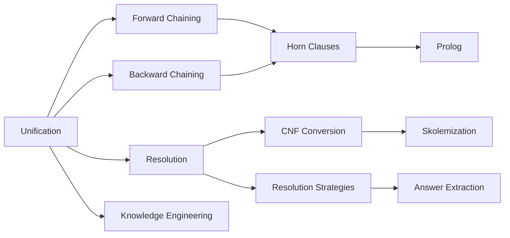

# Chapter 7: Logical Reasoning and Inference

**Previous:** [Chapter 6: Logical Agents and Propositional Logic](06-logic.md) | **Next:** [Chapter 8: Uncertainty in AI](08-uncertainty.md)

## Learning Objectives

By the conclusion of this chapter, the student will be able to:

<!-- Image Gallery -->
<section class="lesson-visuals" aria-label="Visual learning resources">
  <header><span>VISUAL LEARNING</span><h2>See it. Review it. Remember it.</h2></header>
  <a class="lesson-visual-card" href="../../assets/images/lessons/artificial-intelligence/07-logical-reasoning/handwritten-notes.png" target="_blank" rel="noopener">
    
    <span><strong>Handwritten notes</strong>Condensed notes for deliberate review.</span>
  </a>
  <a class="lesson-visual-card" href="../../assets/images/lessons/artificial-intelligence/07-logical-reasoning/sticky-notes.png" target="_blank" rel="noopener">
    
    <span><strong>Sticky-note revision</strong>Fast recall prompts for revision.</span>
  </a>
  <a class="lesson-visual-card" href="../../assets/images/lessons/artificial-intelligence/07-logical-reasoning/visual-explanation.png" target="_blank" rel="noopener">
    
    <span><strong>Visual concept guide</strong>A connected explanation of the key ideas.</span>
  </a>
</section>
<!-- End Image Gallery -->


1. Apply unification with the occur check to compute the Most General Unifier (MGU) for any pair of logical expressions.
2. Implement forward chaining for data-driven inference over Horn clause knowledge bases.
3. Implement backward chaining for goal-driven query answering with loop detection.
4. Reduce any first-order logic formula to Conjunctive Normal Form (CNF) via Skolemization.
5. Apply the resolution refutation proof procedure to determine logical entailment.
6. Write basic Prolog programs using facts, rules, and queries.
7. Apply the knowledge engineering methodology to design and debug logic-based systems.

---

## Why Logical Reasoning Matters

**Real-World Analogy:** A detective arrives at a crime scene. The victim is on the floor, a window is broken, a safe is open, and footprints lead outside. The detective doesn not see the suspect — but from these clues (facts) and knowledge of how the world works (rules), she deduces: someone broke the window, entered, opened the safe, and fled through that window. She then works backward from a hypothesis — "Was it the butler?" — to check whether available evidence supports or refutes it. This dual-direction reasoning — forward from facts and backward from goals — is exactly what logical inference engines do.

In AI, logical reasoning is the engine that turns a static knowledge base into intelligent conclusions. Expert systems diagnose diseases from symptoms, theorem provers verify mathematical proofs, and Prolog programs answer queries by chaining through rules. Without inference, a knowledge base is just a pile of facts — with it, the KB becomes an intelligent agent that can answer questions, make decisions, and explain its reasoning.

---

## Chapter at a Glance

| Topic | Key Insight | Practical Takeaway |
|-------|-------------|-------------------|
| Unification | Finds the MGU that makes two logical expressions identical | Foundation for all inference — pattern matching with variables |
| Forward Chaining | Data-driven: apply rules to known facts to derive new facts | Best for monitoring, alerting, real-time systems |
| Backward Chaining | Goal-driven: start from query, work backward to known facts | Best for diagnosis, Q&A, interactive systems |
| Resolution | Refutation proof by contradiction via CNF clauses | Complete for full first-order logic |
| Horn Clauses | Clauses with at most one positive literal | Enable efficient linear-time inference |
| Prolog | Logic programming language using SLD resolution | Practical tool for symbolic AI and parsing |
| Knowledge Engineering | Methodology to build logic-based systems | Bridges domain expertise to formal KBs |

### Chapter Roadmap




---


## 7.1 Unification

**Real-World Analogy:** Two people are describing the same person. One says "the mother of X" and the other says "the mother of Alice." Unification finds that if X = Alice, both descriptions match — and it does so with the fewest assumptions possible (the Most General Unifier).

### Definition


Unification is the process of finding a substitution $theta$ that makes two logical expressions identical. A substitution $theta = {v_1/t_1, v_2/t_2, ..., v_n/t_n}$ maps variables to terms. The application of $theta$ to expression $E$, written $Etheta$, replaces each variable $v_i$ with term $t_i$, with all occurrences replaced simultaneously.

**Standardization apart** renames variables to avoid naming conflicts. The **most general unifier (MGU)** is the substitution that imposes the fewest constraints while achieving unification — any other unifier is a specialization of the MGU.

### Algorithm Steps


1. If theta is already failure, return failure.
2. If the two expressions are identical, return theta (success).
3. If one expression is a variable, call UNIFY-VAR to bind it.
4. If both are compound expressions (e.g., predicates with arguments), recursively unify the operators (function/predicate names) and then the argument lists.
5. If both are lists (e.g., argument lists), recursively unify the first elements and then the rest.
6. In all other cases, return failure.

### Pseudocode


```
function UNIFY(x, y, theta) returns substitution or failure
    if theta = failure then return failure
    if x = y then return theta
    if VARIABLE?(x) then return UNIFY-VAR(x, y, theta)
    if VARIABLE?(y) then return UNIFY-VAR(y, x, theta)
    if COMPOUND?(x) and COMPOUND?(y) then
        return UNIFY(ARGS(x), ARGS(y), UNIFY(OP(x), OP(y), theta))
    if LIST?(x) and LIST?(y) then
        return UNIFY(REST(x), REST(y), UNIFY(FIRST(x), FIRST(y), theta))
    return failure

function UNIFY-VAR(var, x, theta) returns substitution
    if {var/val} in theta then return UNIFY(val, x, theta)
    if {x/val} in theta then return UNIFY(var, val, theta)
    if OCCUR-CHECK?(var, x) then return failure
    return theta U {var/x}
```

### Step-by-Step Dry Run


**Example:** Unify P(f(x), y) and P(z, g(z))

| Step | Expression 1 | Expression 2 | Current Theta | Action |
|------|-------------|-------------|---------------|--------|
| 1 | P(f(x), y) | P(z, g(z)) | {} | Both compound, operators P == P match |
| 2 | [f(x), y] | [z, g(z)] | {} | Recurse on argument lists |
| 3 | f(x) | z | {} | z is variable, bind z/f(x) |
| 4 | | | {z/f(x)} | UNIFY-VAR(z, f(x)) -> theta = {z/f(x)} |
| 5 | [y] | [g(z)] | {z/f(x)} | Recurse on rest |
| 6 | y | g(z) | {z/f(x)} | y is variable, g(z) with theta = g(f(x)), no x in f(x) |
| 7 | | | {z/f(x), y/g(f(x))} | UNIFY-VAR(y, g(f(x))) -> theta = {z/f(x), y/g(f(x))} |
| 8 | [] | [] | {z/f(x), y/g(f(x))} | Both empty -> return theta |

**MGU:** {z/f(x), y/g(f(x))}

### Complexity Analysis


| Aspect | Complexity | Why |
|--------|-----------|-----|
| **Time worst-case** | O(n^2) | Each variable binding triggers recursive traversal; term size grows with substitution application |
| **Space** | O(n) | Substitution size grows linearly with the number of variables |
| **Occur check** | O(n) per call | Must scan the term to verify the variable does not appear inside it |

**Why O(n^2)?** In the worst case, each variable binds to increasingly larger terms. For example, unifying P(x_1, x_2, ..., x_n) with P(f(x_0), f(x_1), ..., f(x_n-1)) creates substitutions that grow each step, and each new binding scans the growing term.

### Python Implementation


```python
def unify(x, y, theta=None):
    """Unify two expressions with substitution theta."""
    if theta is None:
        theta = {}
    if theta is False:
        return False
    if x == y:
        return theta
    if is_variable(x):
        return unify_var(x, y, theta)
    if is_variable(y):
        return unify_var(y, x, theta)
    if is_compound(x) and is_compound(y):
        if x[0] != y[0]:
            return False
        return unify(x[1:], y[1:], theta)
    if isinstance(x, (list, tuple)) and isinstance(y, (list, tuple)):
        if len(x) != len(y):
            return False
        if len(x) == 0:
            return theta
        return unify(x[1:], y[1:], unify(x[0], y[0], theta))
    return False

def is_variable(term):
    return isinstance(term, str) and term[0].islower()

def is_compound(term):
    return isinstance(term, (list, tuple)) and len(term) > 0 and not is_variable(term[0])

def unify_var(var, x, theta):
    if var in theta:
        return unify(theta[var], x, theta)
    if isinstance(x, str) and x in theta:
        return unify(var, theta[x], theta)
    if occur_check(var, x, theta):
        return False
    theta = theta.copy()
    theta[var] = x
    return theta

def occur_check(var, x, theta):
    """Return True if var occurs in x (after applying theta)."""
    if var == x:
        return True
    if isinstance(x, str) and x in theta:
        return occur_check(var, theta[x], theta)
    if isinstance(x, (list, tuple)):
        return any(occur_check(var, arg, theta) for arg in x)
    return False

# Example
expr1 = ('P', ('f', 'x'), 'y')
expr2 = ('P', 'z', ('g', 'z'))
result = unify(expr1, expr2)
print(f"MGU: {result}")
# Output: MGU: {'z': ('f', 'x'), 'y': ('g', ('f', 'x'))}
```

### C++ Implementation


```cpp
#include <iostream>
#include <map>
#include <vector>
#include <string>
#include <variant>
#include <optional>

using Term = std::variant<std::string, std::vector<class Expr>>;
// Simplified representation using strings
std::optional<std::map<std::string, std::string>> unify(
    const std::string& x, const std::string& y,
    std::map<std::string, std::string> theta) {
    if (x == y) return theta;
    // Variable detection: single lowercase letter
    if (x.length() == 1 && islower(x[0])) {
        if (theta.count(x)) return unify(theta[x], y, theta);
        if (y.length() == 1 && islower(y[0]) && theta.count(y))
            return unify(x, theta[y], theta);
        theta[x] = y;
        return theta;
    }
    if (y.length() == 1 && islower(y[0])) {
        if (theta.count(y)) return unify(x, theta[y], theta);
        theta[y] = x;
        return theta;
    }
    return std::nullopt; // Failure
}
```

### Java Implementation


```java
import java.util.*;

public class Unifier {
    private Map<String, String> theta;

    public Unifier() {
        theta = new HashMap<>();
    }

    public Map<String, String> unify(String x, String y) {
        if (x.equals(y)) return theta;
        if (isVariable(x)) return unifyVar(x, y);
        if (isVariable(y)) return unifyVar(y, x);
        return null; // Failure
    }

    private boolean isVariable(String s) {
        return s.length() == 1 && Character.isLowerCase(s.charAt(0));
    }

    private Map<String, String> unifyVar(String var, String x) {
        if (theta.containsKey(var))
            return new Unifier() {{ theta.putAll(Unifier.this.theta); }}
                .unify(theta.get(var), x);
        if (isVariable(x) && theta.containsKey(x))
            return unify(var, theta.get(x));
        theta.put(var, x);
        return theta;
    }
}
```

### Advantages & Disadvantages


| Advantages | Disadvantages |
|-----------|--------------|
| Foundation for all logical inference in AI | O(n^2) worst-case time complexity |
| MGU ensures most general binding | Occur check is expensive and often omitted |
| Handles variables, constants, functions, predicates | Cannot unify expressions with different operators/arities |
| Enables pattern matching across complex expressions | Circular substitutions require careful detection |

### Edge Cases


- **Identical constants:** A unifies with A -> success, empty substitution.
- **Circular substitution:** UNIFY(x, f(x)) -> failure (occur check catches circularity).
- **Different predicate names:** P(x) with Q(x) -> failure.
- **Different arity:** P(x, y) with P(z) -> failure.
- **Already-bound variable:** If x/y is in theta and we encounter x again, substitute y first.

---

## 7.2 Forward Chaining

**Real-World Analogy:** A smart home system monitors sensors continuously. When motion is detected (fact) AND it is after sunset (fact), the system turns on the lights (new fact). New facts trigger further rules — if lights turned on AND no motion for 10 minutes, turn lights off. Reasoning flows from data forward to conclusions, like an assembly line processing raw materials into finished products.

### Definition


Forward chaining applies inference rules to known facts, deriving new facts until the query is proved or no further inferences are possible. It is **data-driven**: reasoning proceeds from premises toward conclusions. For Horn clause knowledge bases, forward chaining is both sound and complete.

### Algorithm Steps


1. Start with the set of all atomic facts in the KB.
2. For each rule whose antecedent (premise) is fully satisfied by current facts:
   a. Compute all substitutions theta that make the antecedent match the facts.
   b. Add the instantiated consequent to the new fact set.
3. If no new facts were derived in this iteration, stop (fixed point reached).
4. Otherwise, merge new facts into the fact set and repeat from step 2.
5. If the goal appears in the fact set at any point, return TRUE.

### Pseudocode


```
function FORWARD-CHAIN(KB, rules) returns new facts
    facts <- set of all atomic sentences in KB
    loop do
        new_facts <- empty set
        for each rule (antecedent => consequent) in rules do
            substitutions <- all theta such that antecedent theta subset facts
            for each theta in substitutions do
                new_facts <- new_facts U {CONSEQUENT theta}
        if new_facts subset facts then
            return facts    // Fixed point
        facts <- facts U new_facts
```

### Step-by-Step Dry Run


**KB:**
- Facts: A, B
- Rules: A ^ B => C, C ^ D => E, B => D

| Iteration | Facts | Rules Triggered | New Facts | Agenda |
|-----------|-------|-----------------|-----------|--------|
| 0 | {A, B} | — | — | Start |
| 1 | {A, B} | A^B=>C, B=>D | {C, D} | A^B=>C -> C; B=>D -> D |
| 2 | {A, B, C, D} | C^D=>E | {E} | C^D=>E -> E |
| 3 | {A, B, C, D, E} | — | {} | Fixed point, stop |

**Query:** Does KB entail E? **Yes** — E is in the final fact set.

### Complexity Analysis


| Aspect | Complexity | Why |
|--------|-----------|-----|
| **Time (propositional)** | O(n * m) | n facts * m rules; each iteration checks all rules |
| **Time (FOL)** | O(n * m * k) | Each antecedent match requires k unification attempts |
| **Space** | O(n + m) | Stores facts and rules linearly |
| **Iterations** | O(p) where p = deepest rule chain | Each iteration adds facts; at most p iterations |

**Why linear for propositional Horn?** With count-tracking (track how many antecedent literals remain unsatisfied per rule), each rule fires at most once per new fact. Total work = O(n * m).

### Python Implementation


```python
def forward_chain(kb_facts, kb_rules, goal=None):
    """
    Forward chaining inference.

    kb_facts: set of strings representing atomic facts
    kb_rules: list of (antecedents, consequent) tuples
              where antecedents is a set of fact strings
    goal: optional string to check
    Returns: (final_facts, goal_reached)
    """
    facts = set(kb_facts)
    rules_triggered = True

    while rules_triggered:
        rules_triggered = False
        print(f"Current facts: {facts}")
        for antecedents, consequent in kb_rules:
            if antecedents.issubset(facts) and consequent not in facts:
                facts.add(consequent)
                rules_triggered = True
                print(f"  Triggered: {antecedents} => {consequent}")
                if goal and consequent == goal:
                    return facts, True
    return facts, goal in facts if goal else False

# Example: Animal identification
rules = [
    ({'has_fur', 'eats_meat'}, 'is_carnivore'),
    ({'has_fur', 'is_carnivore'}, 'is_mammal'),
    ({'is_mammal', 'has_stripes'}, 'is_tiger'),
]
facts = {'has_fur', 'eats_meat', 'has_stripes'}

final, reached = forward_chain(facts, rules, 'is_tiger')
print(f"\nGoal reached: {reached}")
print(f"Final facts: {final}")
```

### C++ Implementation


```cpp
#include <iostream>
#include <set>
#include <vector>
#include <map>
#include <string>

using namespace std;

set<string> forwardChain(
    set<string> facts,
    vector<pair<set<string>, string>> rules,
    const string& goal = "") {
    bool changed = true;
    while (changed) {
        changed = false;
        for (auto& [ante, conseq] : rules) {
            bool allPresent = true;
            for (const string& a : ante)
                if (!facts.count(a)) { allPresent = false; break; }
            if (allPresent && !facts.count(conseq)) {
                facts.insert(conseq);
                changed = true;
                cout << "Derived: " << conseq << endl;
                if (!goal.empty() && conseq == goal) return facts;
            }
        }
    }
    return facts;
}
```

### Advantages & Disadvantages


| Advantages | Disadvantages |
|-----------|--------------|
| Sound and complete for Horn clause KBs | May derive many irrelevant facts |
| Data-driven — ideal for monitoring/alerting | Inefficient if KB has many unrelated rules |
| Each new fact is derivable and explainable | Fixed-point iteration may take many rounds |
| Linear-time for propositional Horn clauses | Requires all antecedents to match exactly |
| Naturally handles continuous fact arrival | Not suitable for large FOL KBs |

### Edge Cases


- **Empty KB (no facts):** No rules trigger; returns empty set immediately.
- **Cyclic rules:** A => B, B => A. With A only — first iteration adds B; second finds nothing new (A already present) -> fixed point in 2 iterations.
- **Conflicting rules:** Horn clauses cannot represent negation in consequents, so A => B and A => not-B does not arise.
- **Deep chains:** K rules forming a chain need K iterations to reach fixed point.

---

## 7.3 Backward Chaining

**Real-World Analogy:** A doctor diagnosing a patient: "Does this patient have influenza?" She works backward: influenza causes fever, cough, and body aches. Does the patient have fever? Yes. Cough? Yes. Body aches? No. But influenza also sometimes causes headache. Does the patient have headache? Yes. Enough evidence to confirm. Backward chaining starts from the hypothesis (goal) and works backward through rules until it reaches known facts.

### Definition


Backward chaining starts from the query (goal) and works backward, attempting to find a chain of rules that supports the query. It is **goal-driven**: reasoning proceeds from conclusions toward premises. Backward chaining is depth-first, making it memory-efficient but potentially incomplete without loop detection.

### Algorithm Steps


1. Start with the query as the goal list.
2. If the goal list is empty, return success with the current substitution.
3. Take the first goal from the list.
4. For each sentence in the KB that unifies with this goal:
   a. Compute the unifying substitution theta-prime.
   b. Replace the goal with the rule's premises (if a rule) or nothing (if a fact).
   c. Recursively prove all new subgoals with the updated substitution.
   d. If successful, return the result.
5. If no sentence matches, return failure (backtrack).

### Pseudocode


```
function BACKWARD-CHAIN(KB, query) returns set of substitutions
    return BACKWARD-CHAIN-LIST(KB, [query], {})

function BACKWARD-CHAIN-LIST(KB, goals, theta) returns set of substitutions
    if EMPTY?(goals) then return {theta}
    q <- FIRST(goals)
    for each sentence s in KB that UNIFIES with q do
        theta-prime <- UNIFY(q, s, theta)
        if theta-prime != failure then
            premises <- REST(s)   // Antecedents of a rule, empty for facts
            results <- BACKWARD-CHAIN-LIST(KB, premises + REST(goals), theta-prime)
            if results != empty then return results
    return failure
```

### Step-by-Step Dry Run


**KB:**
- C => E  (if C then E)
- A ^ B => C  (if A and B then C)
- D => B  (if D then B)
- A (fact)
- D (fact)

**Query:** E?

| Step | Goal Stack | Current Theta | KB Sentence | Unifies? | New Subgoals | Action |
|------|-----------|---------------|-------------|----------|--------------|--------|
| 1 | [E] | {} | — | — | — | Start with query |
| 2 | [E] | {} | C=>E | Yes, theta={} | [C] | Push premise C |
| 3 | [C] | {} | A^B=>C | Yes, theta={} | [A, B] | Push premises A, B |
| 4 | [A, B] | {} | A | Yes, theta={} | [B] | Pop A (fact found) |
| 5 | [B] | {} | D=>B | Yes, theta={} | [D] | Push premise D |
| 6 | [D] | {} | D | Yes, theta={} | [] | Pop D (fact found) |
| 7 | [] | {} | — | — | — | Success! |

### Complexity Analysis


| Aspect | Complexity | Why |
|--------|-----------|-----|
| **Time worst-case** | O(b^d) | Branching factor b (KB sentences per goal) and depth d of proof tree |
| **Space** | O(d) | Depth-first stores one path at a time |
| **Unification per step** | O(n^2) | Each goal-sentence match requires unification |

**Why exponential?** Each goal may match multiple KB sentences, creating a branching search tree. Without heuristics, backward chaining explores the entire tree. With memoization for propositional Horn clauses, it becomes linear.

### Python Implementation


```python
def backward_chain(kb, query, theta=None, depth=0, max_depth=100):
    """
    Backward chaining with depth limit to prevent infinite loops.

    kb: list of (head, body) pairs where body is a list of subgoals (empty for facts)
    query: the goal to prove
    theta: current substitution
    Returns: (success, final_substitution)
    """
    if theta is None:
        theta = {}
    if depth > max_depth:
        return False, theta

    for head, body in kb:
        new_theta = unify_simple(head, query, theta)
        if new_theta is not False:
            if not body:  # Fact
                return True, new_theta
            # Rule — try to prove all subgoals
            current_theta = dict(new_theta)
            success = True
            for subgoal in body:
                sub_goal = substitute(subgoal, current_theta)
                ok, current_theta = backward_chain(kb, sub_goal, current_theta,
                                                    depth + 1, max_depth)
                if not ok:
                    success = False
                    break
            if success:
                return True, current_theta
    return False, theta

def unify_simple(a, b, theta):
    a_sub = substitute(a, theta)
    b_sub = substitute(b, theta)
    return dict(theta) if a_sub == b_sub else False

def substitute(expr, theta):
    return theta.get(expr, expr)

# Example: Family relationships
kb = [
    ('parent(alice,bob)', []),
    ('parent(bob,carol)', []),
    ('parent(carol,dave)', []),
    ('grandparent(X,Y)', ['parent(X,Z)', 'parent(Z,Y)']),
    ('ancestor(X,Y)', ['parent(X,Y)']),
    ('ancestor(X,Y)', ['parent(X,Z)', 'ancestor(Z,Y)']),
]

print("Query: grandparent(alice,carol)?")
ok, _ = backward_chain(kb, 'grandparent(alice,carol)')
print(f"Result: {ok}")
# Output: True

print("\nQuery: grandparent(alice,dave)?")
ok, _ = backward_chain(kb, 'grandparent(alice,dave)')
print(f"Result: {ok}")
# Output: False (need 3 parent hops, rule only chains 2)
```

### Advantages & Disadvantages


| Advantages | Disadvantages |
|-----------|--------------|
| Goal-directed — only explores relevant rules | DFS can loop on recursive rules |
| Memory-efficient (O(d) space) | May miss solutions on infinite branches |
| Natural for diagnosis and Q&A systems | Not complete for full FOL |
| Easily explainable — shows proof chain | Branching causes exponential blowup |
| Forms the basis of Prolog execution | Sensitive to rule ordering in KB |

### Edge Cases


- **Recursive rules without base case:** ancestor(X,Y) :- parent(X,Z), ancestor(Z,Y) without base fact -> infinite loop.
- **Cyclic KB:** P :- Q and Q :- P — query loops forever without loop detection.
- **Multiple matching rules:** May succeed with first match but fail on later subgoals — backtracking needed.
- **Goal not in KB:** Returns failure after exhaustive search.
- **Depth-limited search:** May miss valid proofs exceeding the depth bound.

---

## Forward vs Backward Chaining

| Feature | Forward Chaining | Backward Chaining |
|---------|-----------------|-------------------|
| **Direction** | Data-driven (facts -> conclusions) | Goal-driven (conclusions -> facts) |
| **Starting point** | Known facts | Query / hypothesis |
| **Search strategy** | Breadth-first (all rules every iteration) | Depth-first (one proof path) |
| **KB type** | Horn clauses | Horn clauses |
| **Completeness** | Complete for Horn clauses | Incomplete (DFS can loop) |
| **Memory** | O(n + m) — stores all facts | O(d) — stores one proof path |
| **Irrelevant work** | May derive unnecessary facts | Only explores relevant rules |
| **Best for** | Monitoring, alerting, real-time systems | Diagnosis, Q&A, interactive systems |
| **Explainability** | Shows which facts triggered which rules | Shows which subgoals proved the query |
| **Implementation basis** | CLIPS, OPS5, Drools | Prolog, backward inference engines |

### When to Use Which


- **Use forward chaining** when: facts arrive incrementally (sensor data, event streams), you need all possible conclusions (monitoring), or the number of potential goals is unknown.
- **Use backward chaining** when: you have a specific question to answer (diagnosis), interactive why-explanation is needed, or the KB is large but queries are few.

## 7.4 Resolution

**Real-World Analogy:** A lawyer in court tries to prove the defendant is guilty. She assumes the opposite — that the defendant is innocent — and shows this assumption leads to a contradiction with the evidence. Since the assumption is impossible, the defendant must be guilty. Resolution proves a statement by assuming its negation and deriving a contradiction (the empty clause).

### Definition


Resolution is a **complete** inference method for first-order logic. Unlike forward/backward chaining (which work only for Horn clauses), resolution handles the full expressivity of FOL. It refutes the negation of the query by deriving a contradiction.

### 7.4.1 Conjunctive Normal Form (CNF)


Resolution requires all formulas to be in Conjunctive Normal Form: a conjunction of clauses, where each clause is a disjunction of literals.

**Conversion Steps:**

1. **Eliminate implications:** Replace alpha => beta with not-alpha v beta.
2. **Move not inward:** Use De Morgan laws.
3. **Standardize variables apart:** Rename variables so each quantifier binds a unique variable.
4. **Skolemize existential quantifiers:** Replace existential y with Skolem function f(x_1, ..., x_n).
5. **Drop universal quantifiers:** All remaining variables are universally quantified.
6. **Distribute v over ^:** Convert to conjunction of disjunctions.

### 7.4.2 Skolemization — Detailed Example


Skolemization removes existential quantifiers by introducing fresh function symbols.

**Original:** for all x, exists y, Loves(x, y) — "Everyone loves someone."

**Skolemized:** for all x, Loves(x, f(x)) — Replace y with Skolem function f(x).

**Without dependencies (exists outside for all):**
- exists y, for all x, Loves(x, y) — "Someone is loved by everyone."
- Skolemized: Loves(x, c) — Replace y with Skolem constant c (no dependency on x).

### 7.4.3 Resolution Rule


For two clauses C_1 and C_2 with complementary literals l_1 in C_1 and not-l_2 in C_2 that unify under theta:

Resolve(C_1, C_2) = (C_1 * theta - l_1 * theta) U (C_2 * theta - l_2 * theta)

### Algorithm Steps


1. Convert KB U {not-alpha} to CNF — this is the clause set.
2. Repeat:
   a. Select two clauses C_i and C_j containing complementary literals.
   b. Unify the complementary literals.
   c. Generate the resolvent (union of both clauses minus the resolved literals).
   d. If the resolvent is the empty clause, return TRUE (entailment proved).
   e. Add the resolvent to the clause set.
3. If no new clauses can be generated and empty clause has not been found, return FALSE.

### Pseudocode


```
function RESOLUTION(KB, alpha) returns true if KB entails alpha
    clauses <- CNF(KB U {not alpha})
    loop do
        new <- empty set
        for each pair of clauses (C_i, C_j) in clauses do
            resolvents <- RESOLVE(C_i, C_j)
            if resolvents contains empty clause then return true
            new <- new U resolvents
        if new subset clauses then return false
        clauses <- clauses U new
```

### Step-by-Step Dry Run


**KB:** A => B, B => C, A

**Query:** Does KB entail C?

**Step 1: Convert to CNF**
- A => B -> not A v B
- B => C -> not B v C
- A -> A
- not C (negation of query)

**Clause set:** {not A v B, not B v C, A, not C}

| Step | Clause 1 | Clause 2 | Unifier | Resolvent | Notes |
|------|---------|---------|---------|-----------|-------|
| 1 | not A v B | A | {} | B | Resolve on A |
| 2 | not B v C | B | {} | C | Resolve on B |
| 3 | C | not C | {} | Empty Clause | **Contradiction!** |

**Result:** KB entails C is TRUE.

### Complexity Analysis


| Aspect | Complexity | Why |
|--------|-----------|-----|
| **Time (propositional)** | O(2^n) worst-case | Clauses can grow exponentially with each resolution step |
| **Time (FOL)** | Undecidable in general | FOL is semi-decidable |
| **Space** | O(2^n) | New clauses generated combinatorially |
| **Subsumption pruning** | Helps significantly | Remove redundant clauses |

**Why exponential?** Each pair of clauses can potentially be resolved. With n clauses, O(n^2) pairs per iteration, and each may add new clauses, leading to exponential growth.

### Python Implementation


```python
def to_cnf(expr):
    """Convert simple propositional expression to CNF."""
    if '=>' in expr:
        lhs, rhs = [s.strip() for s in expr.split('=>')]
        if '&' in lhs:
            ante = [a.strip() for a in lhs.split('&')]
            return [{f"~{a}" for a in ante} | {rhs}]
        return [{f"~{lhs}", rhs}]
    return [{expr.strip()}]

def resolve(c1, c2):
    """Resolve two clauses. Returns list of resolvents."""
    resolvents = []
    for l1 in c1:
        for l2 in c2:
            comp = (l1.startswith('~') and l2 == l1[1:]) or \
                   (l2.startswith('~') and l1 == l2[1:])
            if comp:
                r = (c1 - {l1}) | (c2 - {l2})
                if not any(f"~{l}" in r for l in r if not l.startswith('~')):
                    resolvents.append(r)
    return resolvents

def resolution_prover(kb, query):
    """Resolution refutation theorem prover (propositional)."""
    clauses = []
    for s in kb:
        clauses.extend(to_cnf(s))
    clauses.extend(to_cnf(f"~{query}" if not query.startswith('~') else query))
    print(f"Clauses: {clauses}")

    iteration = 0
    while True:
        iteration += 1
        new_c = []
        n = len(clauses)
        for i in range(n):
            for j in range(i + 1, n):
                res = resolve(clauses[i], clauses[j])
                for r in res:
                    if not r:
                        print(f"  Empty clause found")
                        return True
                    if r not in clauses and r not in new_c:
                        new_c.append(r)
        if not new_c:
            return False
        clauses.extend(new_c)

# Example
print(resolution_prover(["A => B", "B => C", "A"], "C"))
```

### Advantages & Disadvantages


| Advantages | Disadvantages |
|-----------|--------------|
| Complete for full first-order logic | Exponential worst-case complexity |
| Single rule suffices for all inference | FOL is semi-decidable |
| Elegant mathematical foundation | CNF conversion loses structure |
| Handles negation, disjunction, quantifiers | Requires strategy to control clause growth |
| Basis for automated theorem proving | Not intuitive for humans |

### Edge Cases


- **Empty KB:** No clauses to resolve.
- **Tautological query:** empty clause immediately.
- **Contradictory KB:** Can prove any query.
- **Infinite loops in FOL:** May never terminate if KB does not entail alpha.

### Resolution Strategies Comparison


| Strategy | Approach | Complete? | Efficiency |
|---------|----------|:---------:|:----------:|
| **Unit preference** | Prefer resolving with unit clauses (single literal) | Yes | Reduces clause size quickly |
| **Set of support** | One clause must be from negated query or its descendants | Yes | Dramatically reduces pairs |
| **Input resolution** | One clause must be from original KB or query | No | Very fast |
| **Linear resolution** | One clause is the most recent resolvent | Yes | Good balance |
| **Subsumption** | Remove clauses subsumed by more general ones | Yes | Reduces clause set size |
| **Ordered resolution** | Only resolve on leftmost literal | Yes | Eliminates symmetric pairs |

**Best practical strategy:** Set of support + unit preference + subsumption.

---

## 7.5 Horn Clauses

**Real-World Analogy:** A recipe book where every recipe has exactly one result (one dish) but may require multiple ingredients. This is the key constraint of Horn clauses: one positive literal, zero or more negative literals.

### Definition


A **Horn clause** is a clause with at most one positive literal. A **definite clause** has exactly one positive literal.

- **Facts:** P (one positive, no negatives) — "It is raining."
- **Rules:** not-P v not-Q v R (equivalent to P ^ Q => R) — "If raining and windy, take umbrella."
- **Goal clauses:** not-P v not-Q (all negative) — "Prove P and Q."

### Why Horn Clauses Matter


| Property | Horn Clauses | General FOL |
|----------|-------------|-------------|
| Inference | Linear time O(n) | Exponential / undecidable |
| Forward chaining | Complete | Not applicable |
| Backward chaining | Complete (with loop detection) | Incomplete (DFS) |
| Expressiveness | Limited to definite clauses | Full logical expressivity |
| Prolog support | Core language feature | Not directly supported |

### Edge Cases


- **Non-Horn clause:** P v Q (two positive literals) — requires full resolution.
- **Empty clause:** Represents contradiction/false.
- **Unit clause:** Single literal — the simplest fact.

---

## 7.6 Prolog

**Real-World Analogy:** Prolog is like a database that not only stores facts but also knows how to answer questions by chaining through rules.

### Definition


Prolog (Programming in Logic) is a logic programming language based on Horn clauses. A Prolog program consists of facts, rules, and queries. Execution uses **SLD resolution** (Selective Linear Definite-clause resolution) — backward chaining with depth-first search.

### Structure


- **Facts:** `parent(john, mary).` — unconditional truths.
- **Rules:** `grandparent(X, Z) :- parent(X, Y), parent(Y, Z).` — conditional truths.
- **Queries:** `?- grandparent(john, Who).` — goals to prove.

### Example: Family Tree

```prolog
% Facts
parent(john, mary).
parent(mary, ann).
parent(john, bob).
parent(bob, carol).

% Rules
grandparent(X, Z) :- parent(X, Y), parent(Y, Z).
sibling(X, Y) :- parent(Z, X), parent(Z, Y), X \= Y.

% Queries
% ?- grandparent(john, ann).     -> true
% ?- grandparent(john, carol).   -> false
% ?- sibling(mary, bob).         -> true
% ?- sibling(mary, ann).         -> false
```

### Prolog Execution Trace


For query `grandparent(john, ann)`:

| Step | Goal Stack | Rule Applied | Bindings |
|------|-----------|-------------|----------|
| 1 | grandparent(john, ann) | grandparent(X,Z) :- parent(X,Y), parent(Y,Z) | X=john, Z=ann |
| 2 | parent(john, Y), parent(Y, ann) | parent(john, mary) | Y=mary |
| 3 | parent(mary, ann) | parent(mary, ann) | {} |
| 4 | [] | — | **Success** |

### Limitations


- **No occur check:** X = f(X) succeeds, creating infinite terms.
- **Depth-first search:** May miss solutions due to infinite left recursion.
- **Cut operator (!):** Controls backtracking but breaks declarative semantics.

### Python Simulation


```python
class PrologEngine:
    def __init__(self):
        self.facts = set()
        self.rules = []

    def fact(self, name, *args):
        self.facts.add((name, tuple(args)))

    def rule(self, head_name, head_args, body):
        self.rules.append(((head_name, tuple(head_args)), body))

    def query(self, name, *args, visited=None):
        if visited is None:
            visited = set()
        goal = (name, tuple(args))
        if goal in visited:
            return []
        visited = visited | {goal}
        solutions = []

        for f_name, f_args in self.facts:
            if f_name == name and len(f_args) == len(args):
                if all(ga is None or ga == fa for ga, fa in zip(args, f_args)):
                    solutions.append({})

        for (h_name, h_args), body in self.rules:
            if h_name == name and len(h_args) == len(args):
                var_map = {ha: ga for ga, ha in zip(args, h_args) if ga is not None}
                sub_solutions = [{}]
                for b_name, b_args in body:
                    new_subs = []
                    for s in sub_solutions:
                        mapped = [var_map.get(a, a) for a in b_args]
                        res = self.query(b_name, *mapped, visited=visited)
                        new_subs.extend(res)
                    sub_solutions = new_subs
                    if not sub_solutions:
                        break
                solutions.extend(sub_solutions)
        return solutions

engine = PrologEngine()
engine.fact('parent', 'john', 'mary')
engine.fact('parent', 'mary', 'ann')
engine.rule('grandparent', ['X', 'Z'], [('parent', ['X', 'Y']), ('parent', ['Y', 'Z'])])
print(engine.query('grandparent', 'john', 'ann'))
print(engine.query('grandparent', None, 'ann'))
```

---

## 7.7 Knowledge Engineering

**Real-World Analogy:** Building an expert system is like writing an operations manual for a nuclear power plant. You must identify every decision the operator makes, encode the domain knowledge precisely, and verify the system handles all scenarios correctly.

### Methodology


1. **Identify the task:** Determine the questions the system must answer.
2. **Assemble relevant knowledge:** Consult domain experts.
3. **Choose a vocabulary:** Define predicates, functions, and constants.
4. **Encode general knowledge:** Write axioms for domain rules.
5. **Encode specific problem instances:** Add facts about the particular case.
6. **Test and debug:** Verify against expected inferences.

### Example: Electronic Circuits Domain

```prolog
% Types of gates
gate(and, g1).  gate(or, g2).   gate(not, g3).

% Connections
conn(g1, out, g2, in1).
conn(g3, out, g2, in2).

% Inputs
input(g1, in1, 1).
input(g1, in2, 0).

% Signal propagation
signal(Gate, Output, Value) :-
    gate(and, Gate),
    signal(Gate, in1, V1),
    signal(Gate, in2, V2),
    Value is V1 * V2.
```

---

## Concept Comparison

| Inference Method | Sound? | Complete? | KB Format | Best Use Case |
|-----------------|:-----:|:---------:|:---------:|---------------|
| Forward Chaining | Yes | Yes (Horn) | Horn clauses | Monitoring, alerting, real-time |
| Backward Chaining | Yes | Yes (Horn with loop detection) | Horn clauses | Diagnosis, Q&A, interactive |
| Resolution | Yes | Yes (FOL) | CNF clauses | Theorem proving, verification |
| SLD Resolution | Yes | No (DFS limitation) | Horn clauses | Prolog execution |
| Unit Resolution | Yes | No (not complete alone) | CNF | Fast approximate proofs |

---

## Quick Reference — Unification Rules

| Expression 1 | Expression 2 | MGU | Can Unify? |
|-------------|-------------|:---:|:---------:|
| P(x, A) | P(B, y) | {x/B, y/A} | Yes |
| P(f(x), y) | P(z, g(z)) | {z/f(x), y/g(f(x))} | Yes |
| P(x, f(x)) | P(y, y) | — | No (occur check) |
| P(x, x) | P(A, B) | — | No (A != B) |
| P(A, B) | P(A, B) | {} | Yes (already identical) |
| P(x) | Q(x) | — | No (different predicates) |

## Quick Reference — CNF Conversion Example

| Step | Formula | Rule Applied |
|------|---------|-------------|
| 0 | for all x, (for all y, P(x,y)) => not for all y, Q(x,y) | Original |
| 1 | for all x, not(for all y, P(x,y)) v not(for all y, Q(x,y)) | Eliminate => |
| 2 | for all x, (exists y, not P(x,y)) v exists y, not Q(x,y) | Move not inward |
| 3 | for all x, (exists y, not P(x,y)) v exists z, not Q(x,z) | Standardize apart |
| 4 | for all x, (not P(x, f(x))) v not Q(x, g(x)) | Skolemize |
| 5 | not P(x, f(x)) v not Q(x, g(x)) | Drop for all |
| 6 | {not P(x, f(x)) v not Q(x, g(x))} | CNF (single clause) |

---

## Cross-Application Matrix

| Technique | ML | CV | NLP | Research | Systems |
|-----------|:---:|:---:|:---:|:--------:|:-------:|
| Unification | | | Yes | Yes | Yes |
| Forward Chaining | | | Yes | Yes | Yes |
| Backward Chaining | | | Yes | Yes | Yes |
| Resolution | | | | Yes | |
| Prolog | | | Yes | Yes | Yes |
| Knowledge Engineering | Yes | Yes | Yes | Yes | Yes |

---

## Interview Corner

### Common Questions


1. **What is the difference between forward and backward chaining? When would you use each?**

   Forward chaining is data-driven (start from facts, derive conclusions). Backward chaining is goal-driven (start from query, work backward to facts). Use forward chaining for monitoring/real-time systems; use backward chaining for diagnosis/interactive Q&A.

2. **Why is resolution refutation complete?**

   Resolution is refutation-complete because applying the resolution rule exhaustively derives the empty clause if and only if the clause set is unsatisfiable. This follows from the ground resolution theorem: for any unsatisfiable set of ground clauses, the empty clause can be derived in finitely many steps.

3. **What are Horn clauses and why are they important?**

   Horn clauses have at most one positive literal. They are important because they admit linear-time inference (O(n)) via forward/backward chaining, while general FOL is semi-decidable. Most practical knowledge bases (including Prolog programs) are Horn.

4. **Explain the occur check and why it is often omitted.**

   The occur check prevents circular bindings like {x/f(x)}. It is O(n) per unification step, so most Prolog implementations omit it for performance. Omitting it can create cyclic terms, but for most programs this never causes issues.

5. **What is Skolemization and when is it needed?**

   Skolemization removes existential quantifiers by introducing fresh Skolem functions/constants. It is needed during CNF conversion for resolution. The key insight: if something exists, we can give it a name — but the name may depend on all enclosing universal variables.

6. **Compare SLD resolution with general resolution.**

   SLD resolution is a restricted form used in Prolog: it is Linear (each step resolves the most recent resolvent), Definite (Horn clauses only), and uses Selected literal (leftmost). General resolution works on any CNF clauses. SLD is efficient but incomplete; general resolution is complete but exponential.

7. **What makes first-order logic semi-decidable?**

   FOL is semi-decidable: if KB entails alpha, resolution eventually finds the proof. But if KB does not entail alpha, resolution may run forever without concluding. There is no algorithm that always terminates with the correct yes/no for FOL.

8. **How does Prolog cut operator affect reasoning?**

   The cut (!) commits Prolog to current choices, pruning alternative branches. It makes programs more efficient but breaks declarative semantics.

### Common Pitfalls


| Pitfall | Solution |
|---------|----------|
| Infinite left recursion in Prolog | Place recursive calls after base cases |
| Omitting occur check creates cyclic terms | Use unify_with_occurs_check in critical code |
| Forward chaining with non-Horn clauses | Use resolution instead |
| Resolution clause explosion | Use set-of-support + subsumption strategies |
| Confusing Skolem constants with variables | Skolem terms are ground terms, never bound |
| Neglecting loop detection in backward chaining | Maintain visited-goals table |

---

## Applications in Real Systems

| System | Inference Method | Role |
|--------|-----------------|------|
| **Prolog (SWI, GNU, Sicstus)** | SLD Resolution (backward chaining) | Logic programming, parsing, expert systems |
| **CLIPS / OPS5** | Forward chaining (Rete algorithm) | Production rule systems, industrial automation |
| **Drools** | Forward + Backward chaining | Business rule management (Java ecosystem) |
| **OTTER / Prover9** | Resolution with strategies | Automated theorem proving, mathematics |
| **Vampire / E Prover** | Resolution + superposition | ATP in software verification (CASC winners) |
| **IBM Watson** | Backward chaining + statistical | Question answering over structured KBs |
| **SQL Query Engines** | Resolution-like unification | Query planning and join ordering |
| **GraphQL** | Backward chaining on type system | Resolving nested queries across data sources |
| **Cyc Project** | Forward + backward chaining | Large-scale common-sense KB (30+ years) |
| **Description Logic Reasoners (Pellet, HermiT)** | Tableau (resolution variant) | OWL ontology reasoning, semantic web |
| **Automated Planning (STRIPS, PDDL)** | Forward/backward chaining | Robot task planning, logistics |
| **Symbolic AI in Games** | Backward chaining | NPC decision making, interactive fiction |

---

## Chapter Quiz

**Q1:** What does the occur check in unification prevent?
- A) Duplicate variable bindings
- B) Circular substitutions like {x/f(x)}
- C) Infinite recursion in the resolution algorithm
- D) Standardization apart conflicts

<details><summary>Answer&lt;/summary&gt;**B)** The occur check prevents a variable from being bound to a term that contains it, avoiding infinite terms like {x/f(x)}.</details>

**Q2:** What is the key difference between forward and backward chaining?
- A) Forward chaining is sound; backward chaining is not
- B) Forward chaining is data-driven; backward chaining is goal-driven
- C) Forward chaining works only with FOL; backward chaining works with PL
- D) Both are identical in behavior

<details><summary>Answer&lt;/summary&gt;**B)** Forward chaining starts from known facts and derives new ones; backward chaining starts from a query and works backward toward known facts.</details>

**Q3:** In CNF conversion, Skolemization handles what?
- A) Dropping universal quantifiers
- B) Removing existential quantifiers by introducing Skolem functions
- C) Distributing v over ^
- D) Eliminating implications

<details><summary>Answer&lt;/summary&gt;**B)** Skolemization replaces existential quantifiers with Skolem functions or constants during CNF conversion.</details>

**Q4:** Why are Horn clauses important for efficient inference?
- A) They allow arbitrary disjunctions in conclusions
- B) They admit linear-time forward/backward chaining
- C) They eliminate the need for unification
- D) They work without CNF conversion

<details><summary>Answer&lt;/summary&gt;**B)** Horn clauses have at most one positive literal, which allows inference algorithms to run in O(n) time, unlike general FOL which is semi-decidable.</details>

**Q5:** What happens when resolution derives the empty clause?
- A) The KB is inconsistent
- B) The query is proven (refutation complete)
- C) The resolution process has failed
- D) The clause set is satisfiable

<details><summary>Answer&lt;/summary&gt;**B)** The empty clause represents a contradiction. In refutation proofs, deriving the empty clause proves that KB U {not-alpha} is unsatisfiable, therefore KB entails alpha.</details>

**Q6:** Which resolution strategy guarantees completeness while being most efficient in practice?
- A) Input resolution
- B) Unit resolution
- C) Set of support + unit preference
- D) Linear resolution without restrictions

<details><summary>Answer&lt;/summary&gt;**C)** Set of support restricts clause pairs to those involving the negated query (focusing search), while unit preference resolves with unit clauses first (quickly reducing clause size). Together they maintain completeness while dramatically improving efficiency.</details>

---

## Exercises

### Review Questions

1. Explain the purpose of the occur check in unification. Why is it computationally expensive, and why do most Prolog implementations omit it?
2. Distinguish forward and backward chaining. Give a concrete scenario where each is preferred.
3. Why must existential quantifiers be Skolemized during CNF conversion? What distinguishes Skolem functions from Skolem constants?
4. Explain why first-order logic is semi-decidable but propositional logic is decidable.
5. What makes a clause a Horn clause? Why cannot P v Q be expressed as a definite clause?

### Application Problems

6. Convert the following FOL sentence to CNF: for all x, for all y, ((exists z, P(x, z) ^ P(y, z)) => Q(x, y)).
7. Write a Prolog program for family relationships (parent, sibling, aunt, uncle, cousin). Test with a KB of at least 10 facts and 5 rules.
8. Given the KB: A => B, B => C, C => D, A, prove D using: (a) forward chaining, (b) backward chaining, (c) resolution.

### Challenge Problems

9. **Implement a resolution theorem prover:** Write a Python program for propositional resolution. Apply it to: Given A => B, B => C, not D => not C, A v D, prove C.
10. **Non-Horn clause resolution:** Prove P v Q from P v R, Q v not-R. Show why forward/backward chaining cannot handle this.
11. **Loop detection:** Write a backward chaining algorithm with loop detection (visited goals table). Test it on a cyclic KB: P :- Q, Q :- P, P. Explain the behavior with and without loop detection.

---

## Summary

- **Unification** finds the MGU that makes two logical expressions identical — the foundation of all logical inference.
- **Forward chaining** is data-driven inference over Horn clauses — linear time, complete, ideal for monitoring.
- **Backward chaining** is goal-driven inference — depth-first, memory-efficient, forms the core of Prolog.
- **Resolution** refutes the negation of the query to prove entailment — complete for full FOL but exponential.
- **Horn clauses** (at most one positive literal) enable efficient linear-time inference — the backbone of practical logic programming.
- **Prolog** implements SLD resolution — backward chaining with depth-first search and cut.
- **Knowledge engineering** provides a systematic methodology for building logic-based systems.

### Key Takeaway


Logical reasoning transforms a static knowledge base into an intelligent agent capable of answering questions, making decisions, and explaining its reasoning. Master unification, chaining, and resolution — these are the engine behind expert systems, theorem provers, and logic programming languages that power real-world AI applications.
