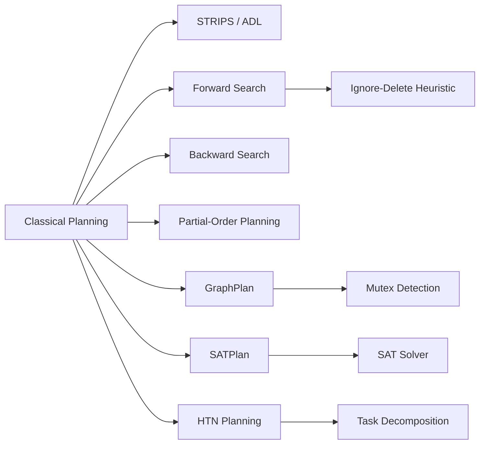

# Chapter 8: Planning

**Previous:** [Chapter 8: Uncertainty and Probabilistic Reasoning](08-uncertainty.md) | **Next:** [Chapter 9: Reasoning Under Uncertainty](09-uncertainty.md)

## Learning Objectives

By the conclusion of this chapter, the student will be able to: (1) formulate planning problems in STRIPS and ADL; (2) implement forward and backward state-space planning; (3) construct partial-order plans; (4) apply GraphPlan and SATPlan algorithms; (5) understand hierarchical task network planning.

## Why AI Planning Matters

**Real-World Analogy — Cooking a Meal:** Suppose you want to cook pasta with sauce. You cannot serve the sauce before boiling the pasta (pasta needs to be ready first), you cannot boil pasta without water, and you cannot heat water without a pot on the stove. Each step has **preconditions** (water must be in pot before boiling) and **effects** (boiling water enables pasta cooking). Planning is exactly this: given an initial pantry (initial state) and a desired meal (goal), find the correct **sequence of actions** that respects all prerequisites and produces the final dish.

Every autonomous system — from warehouse robots packing boxes to Mars rovers navigating terrain — relies on planning algorithms to decide **what to do next**. Without planning, AI would only react; with planning, AI **thinks ahead**.

## Chapter at a Glance

| Section | Key Topics | Key Terms |
|---------|-----------|-----------|
| Classical Planning | STRIPS, ADL, Blocks World | Precondition, add/delete list |
| Forward/Backward Search | Progression, regression | Ignore-delete-lists heuristic |
| Partial-Order Planning | Causal links, open preconditions | Threat, promotion, demotion |
| GraphPlan | Planning graph, mutex relations | Level-off, plan extraction |
| SATPlan | SAT encoding, CNF | Action at time i, frame axioms |
| HTN Planning | Task decomposition methods | Primitive vs compound tasks |
| Practical Planners | FF, FastDownward | Relaxed plan, causal graph |

## Chapter Roadmap



## 8.1 Classical Planning


**Planning** is the process of selecting a sequence of actions to achieve a goal.

**Real-World Analogy — Trip Planning:** You are at home (initial state) and want to be at the airport (goal). You have actions: "drive to airport" (precondition: have car keys; effect: at airport, car not at home), "find keys" (precondition: keys exist; effect: have keys). Planning finds the correct order: find keys first, then drive.

Classical planning assumes a deterministic, fully observable, static environment with finite actions and states.

> **One-Sentence Takeaway:** Classical planning selects a sequence of actions to reach a goal — the STRIPS representation decomposes each action into preconditions, add effects, and delete effects.

### 8.1.1 STRIPS Representation


**Real-World Analogy — Vending Machine:** A vending machine action "buy chips" has preconditions (inserted $2, tray empty), add effects (chips in tray), and delete effects (-$2, tray empty). STRIPS captures exactly this cause-effect logic.

STRIPS (Stanford Research Institute Problem Solver, 1971) represents actions through three components:

- **Precondition:** A conjunction of positive literals that must be true before the action.
- **Add list:** Positive literals added by the action.
- **Delete list:** Positive literals removed by the action.

Formally, an action $a$ is applicable in state $s$ if $\text{Precond}(a) \subseteq s$. The resulting state is:

$$\text{Result}(s, a) = (s - \text{Delete}(a)) \cup \text{Add}(a)$$

**Example (Blocks World action):**

```
Action(Stack(x, y)
    Precond: Clear(y) ∧ Holding(x)
    Effect: ¬Clear(y) ∧ ¬Holding(x) ∧ On(x, y))
```

**Algorithm Steps — STRIPS Plan Construction:**
1. Represent the initial state as a set of ground literals.
2. Define each action with preconditions, add list, and delete list.
3. Identify the goal state as a set of ground literals.
4. Check which actions are applicable in the current state (preconditions ⊆ state).
5. Apply an action: state ← (state − Delete(a)) ∪ Add(a).
6. Repeat until the goal is a subset of the current state.

**Pseudocode:**
```
function STRIPS-PLAN(initial, goal, actions) returns plan
    state ← initial
    plan ← []
    while goal ⊈ state do
        relevant ← {a ∈ actions | Add(a) ∩ goal ≠ ∅}
        if relevant = ∅ then return failure
        select a ∈ relevant such that Precond(a) ⊆ state
        if no such a exists then return failure
        plan ← plan + [a]
        state ← (state − Delete(a)) ∪ Add(a)
    return plan
```

**Dry Run — Blocks World:**

Initial state: On(A,Table), On(B,Table), Clear(A), Clear(B), ArmEmpty
Goal: On(A,B)

| Action | Precondition | Add | Delete |
|--------|-------------|-----|--------|
| Pickup(x) | Clear(x), On(x,Table), ArmEmpty | Holding(x) | On(x,Table), Clear(x), ArmEmpty |
| Stack(x,y) | Clear(y), Holding(x) | On(x,y) | Clear(y), Holding(x) |
| Putdown(x) | Holding(x) | On(x,Table), Clear(x), ArmEmpty | Holding(x) |
| Unstack(x,y) | On(x,y), Clear(x), ArmEmpty | Holding(x), Clear(y) | On(x,y), Clear(x), ArmEmpty |

| Step | Current State | Action | Preconditions Met? | Add Effects | Delete Effects | New State |
|------|--------------|--------|-------------------|-------------|---------------|-----------|
| 0 | On(A,T), On(B,T), Clear(A), Clear(B), ArmEmpty | — | — | — | — | S₀ |
| 1 | S₀ | Pickup(A) | Clear(A)✓ On(A,T)✓ ArmEmpty✓ | Holding(A) | On(A,T), Clear(A), ArmEmpty | Holding(A), On(B,T), Clear(B) |
| 2 | Holding(A), On(B,T), Clear(B) | Stack(A,B) | Clear(B)✓ Holding(A)✓ | On(A,B) | Clear(B), Holding(A) | On(A,B), On(B,T) |
| ✓ | On(A,B), On(B,T) | Goal reached | — | — | — | — |

**Python Implementation:**
```python
class Action:
    def __init__(self, name, precond, add_effects, del_effects):
        self.name = name
        self.precond = set(precond)
        self.add = set(add_effects)
        self.delete = set(del_effects)

    def applicable(self, state):
        return self.precond.issubset(state)

    def apply(self, state):
        return (state - self.delete) | self.add

def strips_plan(initial, goal, actions):
    state = set(initial)
    plan = []
    while not goal.issubset(state):
        relevant = [a for a in actions if a.add & goal]
        if not relevant:
            return None
        action = next((a for a in relevant if a.applicable(state)), None)
        if action is None:
            return None
        plan.append(action.name)
        state = action.apply(state)
    return plan

actions = [
    Action("Pickup(A)", {"Clear(A)", "On(A,Table)", "ArmEmpty"},
           {"Holding(A)"}, {"On(A,Table)", "Clear(A)", "ArmEmpty"}),
    Action("Stack(A,B)", {"Clear(B)", "Holding(A)"},
           {"On(A,B)"}, {"Clear(B)", "Holding(A)"}),
]
initial = {"On(A,Table)", "On(B,Table)", "Clear(A)", "Clear(B)", "ArmEmpty"}
goal = {"On(A,B)"}
print(strips_plan(initial, goal, actions))  # ['Pickup(A)', 'Stack(A,B)']
```

**Complexity Analysis:**
- **Time:** O(b^d) in the worst case where b is the branching factor (number of applicable actions) and d is the plan depth.
- **Space:** O(bd) for storing the plan and state.
- **Why exponential?** The planner must explore sequences of actions — the number of possible sequences grows exponentially with depth.

**Advantages & Disadvantages:**

| Advantages | Disadvantages |
|------------|---------------|
| Simple, intuitive representation | Cannot represent conditional effects |
| Easy to implement | Only positive literals in preconditions |
| Closed-world assumption reduces complexity | No support for types or quantified conditions |
| Declarative — separates domain from problem | Real-world problems require extensions |

**Edge Cases:**
- **Impossible goal:** If goal requires On(A,B) but Stack(A,B) needs Holding(A) and no Pickup action exists, planning fails.
- **Irrelevant actions:** Actions that neither add nor delete any goal proposition — the planner ignores them.
- **Cyclic plans:** STRIPS without cycle detection may loop indefinitely (Pickup→Putdown→Pickup→...). Always check if state repeats.

### 8.1.2 ADL (Action Description Language)


**Real-World Analogy — Conditional Recipe:** A recipe step "if using salted butter, skip adding salt" is a conditional effect. ADL captures these "if-then" conditions that STRIPS cannot.

ADL extends STRIPS with:
- Conditional effects: effects that apply only if certain conditions hold.
- Quantified preconditions and effects (∀, ∃).
- Types for objects and variables.
- Negative literals in preconditions.

**Example ADL action:**
```
Action(Move(robot, from, to)
    Precond: At(robot, from) ∧ Clear(from) ∨ IsBase(from)
    Effect: At(robot, to) ∧ ¬At(robot, from)
            ∧ (Clear(from) if ¬IsBase(from)))
```

## 8.2 Forward and Backward Search

### 8.2.1 Forward (Progression) Search


**Real-World Analogy — Maze Solver:** Starting at the entrance, try every path by walking forward one step at a time. If you hit a dead end, backtrack and try another corridor. This is forward search: start from the initial state and explore outward.

Forward search applies actions from the initial state, generating successors until a goal state is reached.

**Algorithm Steps:**
1. Initialize frontier with the initial state.
2. If frontier is empty, return failure.
3. Pop a state from the frontier.
4. If the state satisfies the goal, return the plan.
5. Generate all applicable actions in this state.
6. Apply each action to produce successor states.
7. Add successors to the frontier.
8. Go to step 2.

**Pseudocode:**
```
function FORWARD-SEARCH(problem) returns plan or failure
    node ← Node(state = problem.initial, parent = nil, action = nil)
    frontier ← {node}
    explored ← ∅
    loop do
        if frontier = ∅ then return failure
        node ← REMOVE-FRONT(frontier)
        if problem.GOAL-TEST(node.state) then return EXTRACT-PLAN(node)
        explored ← explored ∪ {node.state}
        for each action in problem.ACTIONS(node.state) do
            child ← Node(state = RESULT(node.state, action),
                         parent = node, action = action)
            if child.state ∉ explored ∪ frontier then
                frontier ← frontier ∪ {child}
```

**Dry Run — Blocks World Forward Search:**

Initial: On(A,T), On(B,T), Clear(A), Clear(B), ArmEmpty
Goal: On(A,B)

| Iter | Explored | Frontier | Chosen | Applicable Actions | Successors Added |
|------|----------|---------|--------|-------------------|------------------|
| 0 | ∅ | S₀ | S₀ | Pickup(A), Pickup(B) | S₁(Holding(A)), S₂(Holding(B)) |
| 1 | {S₀} | {S₁, S₂} | S₁ | Stack(A,B), Putdown(A) | S₃(On(A,B)) |
| 2 | {S₀, S₁} | {S₂, S₃} | S₃ | Goal satisfied | Plan: [Pickup(A), Stack(A,B)] |

**Python Implementation:**
```python
from collections import deque

def forward_search(initial, goal, actions):
    frontier = deque([(set(initial), [])])
    explored = []
    while frontier:
        state, plan = frontier.popleft()
        if goal.issubset(state):
            return plan
        explored.append(state)
        for a in actions:
            if a.applicable(state):
                new_state = a.apply(state)
                if new_state not in explored:
                    frontier.append((new_state, plan + [a.name]))
    return None
```

**Complexity Analysis:**
- **Time:** O(b^d) where b = branching factor (applicable actions), d = plan depth.
- **Space:** O(b^d) for the frontier.
- **Why so large?** Each state can have many applicable actions. Without heuristics, forward search explores exponentially many paths.

**Advantages & Disadvantages:**

| Advantages | Disadvantages |
|------------|---------------|
| Sound and complete with systematic search | Huge branching factor in rich domains |
| Easy to implement | Many irrelevant actions explored |
| Good heuristics (relaxed plan) available | State representation grows with problem |

**Edge Cases:**
- **Dead ends:** A state from which no action leads to the goal.
- **State repetition:** Without explored set, forward search loops infinitely.
- **Symmetries:** Two blocks on table — Pickup(A) vs Pickup(B) explores symmetric branches.

### 8.2.2 Backward (Regression) Search


**Real-World Analogy — Reverse Maze:** Instead of starting at the entrance, you stand at the exit and ask "which corridor could have gotten me here?" You work backward, narrowing possibilities, until you reach the entrance.

Backward search starts from the goal and applies actions in reverse.

**Algorithm Steps:**
1. Initialize the regression set with the goal.
2. Find an action whose add effects overlap with the regression set and does not delete any goal proposition.
3. Compute new regression set: (regression − Add(a)) ∪ Precond(a).
4. Repeat until the regression set is a subset of the initial state.
5. Reverse the action sequence to produce the forward plan.

**Pseudocode:**
```
function BACKWARD-SEARCH(problem) returns plan or failure
    goal-set ← problem.GOAL
    plan ← []
    loop do
        if goal-set ⊆ problem.INITIAL then return REVERSE(plan)
        select action a such that a.ADD ∩ goal-set ≠ ∅
                         and a.DELETE ∩ goal-set = ∅
        if no such a then return failure
        plan ← [a] + plan
        goal-set ← (goal-set − a.ADD) ∪ a.PRECOND
```

**Dry Run — Backward Search:**

Initial: On(A,T), On(B,T), Clear(A), Clear(B), ArmEmpty
Goal: On(A,B)

| Iter | Regression Set | Action Chosen | Reason | New Regression Set |
|------|---------------|---------------|--------|-------------------|
| 0 | {On(A,B)} | Stack(A,B) | Stack adds On(A,B) | {Clear(B), Holding(A)} |
| 1 | {Clear(B), Holding(A)} | Pickup(A) | Adds Holding(A); doesn't delete Clear(B) | {Clear(A), On(A,T), ArmEmpty, Clear(B)} |
| 2 | {Clear(A), On(A,T), ArmEmpty, Clear(B)} | ⊆ Initial? | YES | Success — plan reversed: [Pickup(A), Stack(A,B)] |

**Python Implementation:**
```python
def backward_search(initial, goal, actions):
    regress = set(goal)
    plan = []
    while not regress.issubset(initial):
        relevant = [a for a in actions
                    if a.add & regress and not a.delete & regress]
        if not relevant:
            return None
        a = relevant[0]
        plan.insert(0, a.name)
        regress = (regress - a.add) | a.precond
    return plan
```

**Complexity Analysis:**
- **Time:** O(b^d) in worst case, but b is typically smaller because only relevant actions are considered.
- **Space:** O(bd).
- **Why lower branching factor?** Forward search considers ALL applicable actions; backward search only considers actions that ADD a needed proposition.

**Advantages & Disadvantages:**

| Advantages | Disadvantages |
|------------|---------------|
| Smaller branching factor than forward | Requires computing regression (complex for ADL) |
| Goal-directed — only relevant actions | Cannot easily use state-based heuristics |

**Edge Cases:**
- **Irrelevant goals:** If goal contains a proposition no action can add, the planner fails immediately.
- **Action interference:** An action adds p but deletes q where q is also needed — planner must find alternatives.

## 8.3 Partial-Order Planning (POP)

**Real-World Analogy — Wedding Planning:** The florist and baker do not need to coordinate. The cake must be ready before the reception, and flowers must be delivered before the ceremony — but flowers and cake preparation are independent. POP captures this flexible ordering.

State-space planners produce totally ordered action sequences. POP introduces flexibility by representing plans as partially ordered sets of actions.

A **partial-order plan** is a tuple ⟨A, O, L, G⟩ where:
- A: set of actions (including Start and Finish).
- O: ordering constraints (A_i ≺ A_j).
- L: causal links (A_i → A_j meaning A_i achieves p for A_j).
- G: open preconditions (preconditions not yet achieved).

**Algorithm Steps:**
1. Create Start (effects = initial state) and Finish (preconditions = goal) actions.
2. While there is an open precondition p on some action B:
   - Choose an action A (existing or new) that achieves p.
   - Add causal link A ⟶ B and ordering A ≺ B.
   - If A is new, add its preconditions as open.
   - Check all existing causal links for threats from A or B.
   - Resolve each threat by promotion (B ≺ C) or demotion (C ≺ A).
3. Return the plan.

**Pseudocode:**
```
function POP(initial, goal) returns plan
    plan ← MAKE-MINIMAL-PLAN(initial, goal)
    loop do
        if no open preconditions in plan then return plan
        select an open precondition p on action A_need
        choose an action A_add (existing or new) that achieves p
        add causal link A_add → A_need and ordering A_add ≺ A_need
        resolve any threats to causal links
```

**Dry Run — Simple POP (Get to Airport):**

Initial: At(Home), Have(Keys)
Goal: At(Airport)

| Step | Open Preconds | Action Chosen | Causal Link | Threat? | Resolution |
|------|--------------|---------------|-------------|---------|------------|
| 1 | At(Airport) on Finish | Drive(Home,Airport) | Drive → Finish [At(Airport)] | None | — |
| 2 | Have(Keys) on Drive | Start | Start → Drive [Have(Keys)] | None | — |
| 3 | At(Home) on Drive | Start | Start → Drive [At(Home)] | None | — |
| ✓ | None (plan complete) | — | — | — | — |

A **threat** occurs when action A_k could undo a causal link A_i → A_j. Resolved by promotion (A_j ≺ A_k) or demotion (A_k ≺ A_i).

**Python Implementation:**
```python
class CausalLink:
    def __init__(self, producer, consumer, proposition):
        self.producer = producer
        self.consumer = consumer
        self.proposition = proposition

def pop_plan(initial, goal, actions):
    start = type("Action", (), {"name": "Start", "precond": set(),
                                "add": set(initial), "delete": set()})()
    finish = type("Action", (), {"name": "Finish", "precond": set(goal),
                                 "add": set(), "delete": set()})()
    plan_actions = [start, finish]
    causal_links = []
    open_conds = [(finish, p) for p in goal]

    while open_conds:
        act_needing, prop = open_conds.pop(0)
        chosen = None
        for a in plan_actions:
            if hasattr(a, "add") and prop in a.add:
                chosen = a
                break
        if chosen is None:
            for a in actions:
                if prop in a.add:
                    chosen = type("Action", (), {
                        "name": a.name, "precond": set(a.precond),
                        "add": set(a.add), "delete": set(a.delete)})()
                    plan_actions.append(chosen)
                    for p in chosen.precond:
                        open_conds.append((chosen, p))
                    break
        if chosen is None:
            return None
        causal_links.append(CausalLink(chosen, act_needing, prop))
    return [a.name for a in plan_actions if a.name not in ("Start", "Finish")]
```

**Complexity Analysis:**
- **Time:** Exponential in open preconditions — each choice may require backtracking.
- **Space:** O(A²) for ordering constraints and causal links.
- **Why exponential?** Threat resolution cascades: fixing one threat creates constraints that may conflict with other links.

**Advantages & Disadvantages:**

| Advantages | Disadvantages |
|------------|---------------|
| Produces flexible plans (least commitment) | Threat resolution is complex and NP-hard |
| Allows concurrent action execution | Cannot use distance-to-goal heuristics |
| Separates "what" from "when" | Plan extraction requires backtracking |

**Edge Cases:**
- **Unresolvable threats:** Every resolution choice leads to a cycle.
- **Cyclic orderings:** A ≺ B and B ≺ A — illegal. POP must check for cycles.
- **Redundant actions:** Two actions achieving the same proposition — one may be irrelevant.

## 8.4 GraphPlan

**Real-World Analogy — Subway Map:** A subway map shows all possible routes between stations (propositions) via train lines (actions). You can see at a glance which stations connect. The planning graph encodes all possible action sequences up to a given horizon.

GraphPlan (Blum and Furst, 1997) constructs a compact planning graph that encodes all possible action sequences up to a given length.

**Algorithm Steps:**
1. Create proposition layer S₀ from the initial state.
2. For each level k:
   a. Add all actions whose preconditions are in S_k and are not pairwise mutex.
   b. Add no-op actions for each proposition.
   c. Create S_{k+1} from all add effects of actions at level k.
   d. Compute mutual exclusion (mutex) relations.
   e. Check if all goal propositions appear in S_{k+1} without mutex.
3. If goals present without mutex, attempt plan extraction via backward search.
4. If extraction fails, expand one more level.
5. If graph levels off (no new propositions), return failure.

**Mutex Rules:**
- Two actions at same level are mutex if: inconsistent effects, interference, or competing needs.
- Two propositions at same level are mutex if all ways to achieve them are pairwise mutex.

**Pseudocode:**
```
function GRAPHPLAN(problem) returns plan or failure
    graph ← INITIAL-PLANNING-GRAPH(problem)
    for k = 0 to ∞ do
        if goal propositions present in S_k with no mutex then
            plan ← EXTRACT-SOLUTION(graph, k)
            if plan ≠ failure then return plan
        graph ← EXPAND-GRAPH(graph, k+1)
        if graph has leveled off then return failure
```

**Dry Run — GraphPlan for Blocks World:**

Initial: On(A,T), On(B,T), Clear(A), Clear(B), ArmEmpty
Goal: On(A,B)

| Level | Propositions | Actions Added | Mutex | Goal? |
|-------|-------------|---------------|-------|-------|
| S₀ | On(A,T), On(B,T), Clear(A), Clear(B), ArmEmpty | — | None | No |
| A₀ | — | Pickup(A), Pickup(B), no-ops | Pickup(A) ⟂ Pickup(B) (competing for ArmEmpty) | — |
| S₁ | S₀ ∪ {Holding(A), Holding(B)} | — | Holding(A) ⟂ Clear(A); Holding(A) ⟂ ArmEmpty | No |
| A₁ | — | Stack(A,B), Stack(B,A) | Stack(A,B) ⟂ Stack(B,A) (inconsistent) | — |
| S₂ | S₁ ∪ {On(A,B), On(B,A)} | — | On(A,B) ⟂ On(B,A) | YES — extract |

Plan extraction: Stack(A,B) needs Clear(B),Holding(A) ← Pickup(A) needs Clear(A),On(A,T),ArmEmpty (all in S₀). Plan: [Pickup(A), Stack(A,B)].

**Python Implementation:**
```python
def graphplan(initial, goal, actions):
    propositions = set(initial)
    layers = [propositions]
    plan_graph = []

    level = 0
    while True:
        applicable = [a for a in actions if a.precond.issubset(layers[level])]
        plan_graph.append(applicable)
        next_props = set(layers[level])
        for a in applicable:
            next_props |= a.add
        layers.append(next_props)
        if goal.issubset(layers[-1]):
            extracted = []
            remaining = set(goal)
            for lvl in range(len(plan_graph) - 1, -1, -1):
                for a in plan_graph[lvl]:
                    if a.add & remaining:
                        extracted.append(a.name)
                        remaining = (remaining - a.add) | a.precond
            return extracted[::-1]
        if layers[-1] == layers[-2] and len(plan_graph[-1]) == len(plan_graph[-2]):
            return None
        level += 1
```

**Complexity Analysis:**
- **Plan existence:** Polynomial in the size of the planning graph (O(n²) for mutex).
- **Plan extraction:** Exponential in worst case.
- **Why polynomial existence?** The graph has at most O(n²) propositions per level, bounded by number of propositions.

**Advantages & Disadvantages:**

| Advantages | Disadvantages |
|------------|---------------|
| Polynomial-time plan existence checking | Plan extraction still exponential |
| Mutex pruning dramatically reduces search | Memory-intensive (stores full graph) |
| Handles parallelism naturally | Cannot handle continuous time or resources |

**Edge Cases:**
- **Level-off without goal:** Graph stabilizes but goal never appears — unsolvable.
- **All propositions mutex at goal level:** Extraction fails, need more levels.

## 8.5 SATPlan

**Real-World Analogy — Logic Puzzle:** "Can I reach the goal in 5 steps?" encoded as a giant Boolean puzzle: At time 0 I am at home; at time 5 I must be at the airport; at each time exactly one action fires; if I drive at time 2, I must hold keys at time 2. A SAT solver finds a satisfying assignment or proves none exists.

SATPlan reduces planning to propositional satisfiability. The plan of length k is encoded as a SAT formula.

**Encoding Variables:**
- At(p, i): proposition p holds at time i.
- Action(a, i): action a executes at time i.

**Constraints:**
- **Initial state:** At(p, 0) for all initial facts.
- **Goal state:** At(g, k) for each goal g.
- **Action precondition:** Action(a, i) ⇒ ∧ Precond(a, i).
- **Action effects:** Action(a, i) ⇒ ∧ Add(a, i+1) ∧ ∧ ¬Delete(a, i+1).
- **Frame axioms:** Propositions persist unless an action changes them.
- **Exactly one action per time step (optional).**

**Algorithm Steps:**
1. Set plan length k = 0.
2. Encode the planning problem of length k as a CNF formula φ_k.
3. Invoke a SAT solver on φ_k.
4. If SAT solver returns satisfying assignment, extract the plan.
5. If unsatisfiable, increment k and repeat.
6. Return failure if k exceeds bound.

**Pseudocode:**
```
function SATPLAN(problem, max_length) returns plan or failure
    for k = 0 to max_length do
        formula ← ENCODE-AS-CNF(problem, k)
        assignment ← SAT-SOLVE(formula)
        if assignment ≠ failure then
            return EXTRACT-PLAN(assignment, k)
    return failure
```

**Dry Run — SATPlan Encoding (k=2):**

Domain: package P at A, goal: P at B. Actions: Load(P,A), Move(A,B), Unload(P,B).

| Clause Type | Time | Clause |
|-------------|------|--------|
| Initial | 0 | At(P,A), AtTruck(A) |
| Goal | 2 | At(P,B) |
| Precondition | 0 | Action(Load,0) ⇒ At(P,A) |
| Precondition | 1 | Action(Move,1) ⇒ AtTruck(A) |
| Precondition | 1 | Action(Unload,1) ⇒ In(P) ∧ AtTruck(B) |
| Effect | 0 | Action(Load,0) ⇒ In(P,1) |
| Effect | 0 | Action(Load,0) ⇒ ¬At(P,A,1) |
| Frame | 0→1 | ¬Action(Load,0) ⇒ (At(P,A,0) ⇔ At(P,A,1)) |

Satisfying assignment: Action(Load,0)=True, Action(Move,1)=True, Action(Unload,2)=True
Plan extracted: [Load, Move, Unload]

**Python Implementation:**
```python
def encode_sat(initial, goal, actions, horizon, prop_idx, act_idx):
    clauses = []
    for p in initial:
        clauses.append([prop_idx(p, 0)])
    for g in goal:
        clauses.append([prop_idx(g, horizon)])
    for a in actions:
        for t in range(horizon):
            for p in a.precond:
                clauses.append([-act_idx(a.name, t), prop_idx(p, t)])
            for p in a.add:
                clauses.append([-act_idx(a.name, t), prop_idx(p, t + 1)])
            for p in a.delete:
                clauses.append([-act_idx(a.name, t), -prop_idx(p, t + 1)])
    for t in range(horizon):
        clauses.append([act_idx(a.name, t) for a in actions])
    return clauses
```

**Complexity Analysis:**
- **Time:** O(2^n) in worst case (SAT is NP-complete), but modern solvers (MiniSat, Glucose) scale well for practical instances.
- **Space:** O(k × (|P| + |A|)) for the CNF formula.
- **Why NP-complete?** Planning with fixed horizon generalizes graph reachability with constraints.

**Advantages & Disadvantages:**

| Advantages | Disadvantages |
|------------|---------------|
| Leverages highly optimized SAT solvers | Must fix plan length k in advance |
| Handles complex constraints | Produces huge CNF formulas for large domains |
| Effective for bounded plan existence | No guidance on choosing k |

**Edge Cases:**
- **Unsolvable for given k:** SAT solver returns UNSAT. Increment k and retry.
- **Very large CNF:** A domain with 100 propositions and k=50 produces tens of thousands of clauses.
- **Multiple satisfying assignments:** Different assignments represent different valid plans.

## 8.6 Hierarchical Task Network (HTN) Planning

**Real-World Analogy — Company Org Chart:** A CEO says "launch product." This task decomposes into "develop," "market," "sell." "Develop" decomposes into "design," "code," "test." Each leaf maps to a STRIPS action.

HTN planning decomposes high-level tasks into primitive actions via **task decomposition methods**.

**Algorithm Steps:**
1. Start with a set of high-level tasks (the initial task network).
2. Select a non-primitive task.
3. Choose a method that decomposes that task into subtasks.
4. Replace the task with its subtasks in the plan.
5. Handle interactions (ordering constraints, variable bindings).
6. Repeat until all tasks are primitive (executable actions).
7. Return the ordered sequence of primitive actions.

**Pseudocode:**
```
function HTN-PLAN(tasks, methods, actions) returns plan
    if tasks = ∅ then return []
    t ← FIRST(tasks)
    if t is primitive then
        if ∃ action a that accomplishes t then
            return [a] + HTN-PLAN(REST(tasks), methods, actions)
        else return failure
    else
        choose method m ∈ methods that decomposes t
        subtasks ← APPLY(m, t)
        return HTN-PLAN(subtasks + REST(tasks), methods, actions)
```

**Python Implementation:**
```python
def htn_plan(tasks, methods, actions):
    if not tasks:
        return []
    task = tasks[0]
    rest = tasks[1:]
    if task in actions:
        return [task] + htn_plan(rest, methods, actions)
    for name, pre, sub in methods:
        if name == task:
            return htn_plan(sub + rest, methods, actions)
    return None

methods = [
    ("Navigate", [], ["LocatePosition", "PlanRoute", "FollowRoute"]),
    ("PrepareMeal", [], ["CookMain", "CookSide"]),
]
actions = ["LocatePosition", "PlanRoute", "FollowRoute", "CookMain", "CookSide"]
print(htn_plan(["Navigate", "PrepareMeal"], methods, actions))
```

**Complexity Analysis:**
- **Time:** Domain-dependent — good methods give near-linear planning; bad methods cause exponential backtracking.
- **Space:** O(d×b) where d = decomposition depth, b = method branching.
- **Why domain-dependent?** HTN's power comes from encoded domain knowledge in methods.

**Advantages & Disadvantages:**

| Advantages | Disadvantages |
|------------|---------------|
| Powerful for structured real-world domains | Requires domain experts to write methods |
| Natural hierarchical decomposition | Not complete for arbitrary goals |
| Scales to complex problems (logistics, games) | Methods must cover all possible tasks |

**Edge Cases:**
- **No applicable method:** A high-level task with no matching method causes failure.
- **Cyclic decomposition:** Task A → B → A — infinite loop. Detect via task stack depth.
- **Interaction between subtasks:** Two subtasks may conflict (both need the same resource).

## 8.7 Practical Planners

**FF (Fast Forward):** Employs forward search with the relaxed plan heuristic (number of actions in the ignoring-delete-lists plan). Uses enforced hill climbing: if no local improvement exists, falls back to breadth-first search.

**FastDownward:** Introduced the causal graph heuristic and multi-heuristic search. Uses a causal graph to decompose the planning problem into subproblems.

> **💡 Pro Tip:** The ignore-delete-lists heuristic is simple but extremely effective for forward search planning. It solves the relaxed problem (no delete effects) which is always solvable and provides admissible estimates for the original problem.

> **⚠️ Warning:** Partial-order planning introduces threats that require promotion/demotion resolution. Always check all causal links when adding a new action — overlooking a threat produces an invalid plan.

## Planning Approaches Comparison

| Approach | Search Space | Heuristic | Completeness | Best For |
|----------|:-----------:|:---------:|:------------:|:---------:|
| Forward State-Space | States | Relaxed plan | Complete | Small-medium domains with good heuristics |
| Backward State-Space | Goal regression | None needed | Complete | Domains with low goal-relevant action ratio |
| Partial-Order | Causal links | Least-commitment | Complete | Domains needing flexible/concurrent plans |
| GraphPlan | Planning graph | Mutex pruning | Complete | Medium domains with clear action dependencies |
| SATPlan | SAT formula | SAT solver | Bounded | Domains with complex constraints |
| HTN | Task hierarchy | Domain methods | Domain-dep | Large structured real-world domains |

## STRIPS vs ADL vs PDDL

| Feature | STRIPS | ADL | PDDL |
|---------|:-----:|:---:|:----:|
| Preconditions | Positive literals only | Any literal (negated allowed) | Any literal + quantifiers |
| Effects | Conjunction of literals | Conditional effects | Conditional + quantified |
| Types | None | First-class types | Hierarchical types |
| Quantification | None | ∀, ∃ in preconditions | ∀, ∃ in pre/effects |
| Equality | Implicit | Explicit (=) | Explicit (=, !=) |
| Domain axioms | None | Supported | Supported |
| Derived predicates | None | Supported | Supported |
| Continuous time | None | None | Durative actions |
| Numeric resources | None | None | Numeric fluents |
| **Expressiveness** | Low | Medium | High |
| **Adoption** | Academic, classic | Intermediate | IPC standard |

PDDL is the standard encoding for the International Planning Competition (IPC). PDDL 2.1 added durative actions; PDDL 3.0 added trajectory constraints; PDDL+ supports continuous processes.

## Interview Corner

**Q1: How is planning different from search?**
Planning is search PLUS representation. Search works over predefined state spaces; planning constructs action sequences from a compact action description. Planning must infer which actions are relevant; search assumes the state graph is given.

**Q2: How do you validate a plan?**
Plan validation checks: (1) Action preconditions satisfied at execution time. (2) Final state satisfies the goal. (3) No resource constraints violated. (4) Temporal constraints respected. The VAL tool is the standard validator for PDDL.

**Q3: What are resource constraints?**
Real-world actions consume resources (fuel, money, time). Classical planning ignores resources; numeric planning (PDDL 2.1+) tracks resource levels as numeric fluents. Constraints ensure a plan does not exceed available supply.

**Q4: Can planning handle incomplete information?**
Classical planning assumes complete knowledge. **Conformant planning** works for all possible states. **Contingent planning** uses sensing actions. **Probabilistic planning** (MDPs) maximizes expected reward under uncertainty.

**Q5: What is the plan validity problem?**
Given a plan and a domain, does executing the plan from the initial state achieve the goal? Decidable for classical planning (polynomial trace-check) but PSPACE-hard for numeric planning.

## Applications in Real Systems

| Domain | System | How Planning Is Used |
|--------|--------|---------------------|
| **Robotics** | ROS MoveIt | OMPL planners sequence arm motions; each joint movement is an action with kinematic preconditions |
| **Logistics** | Amazon Robotics (warehouse) | STRIPS-like actions (Pick, Place, Move) scheduled by centralized planners optimizing throughput |
| **Spacecraft** | NASA Deep Space Network | Automated antenna allocation and observation scheduling (RAX, EUROPA planners) |
| **Spacecraft** | Mars Rovers (Curiosity) | MAPGEN planner generates daily activity plans from high-level science goals |
| **Game AI** | F.E.A.R. (GOAP) | Goal-Oriented Action Planning: enemies use STRIPS-style planning to decide attack/flank/retreat |
| **Game AI** | Halo, Horizon (HTN) | HTN planners decompose AI strategies (Patrol → Attack → Flank) |
| **Manufacturing** | Assembly line scheduling | SATPlan optimizes robot arm task ordering minimizing makespan |
| **Healthcare** | Surgery scheduling | Partial-order planning handles precedence constraints (sterilize before operate) |

## Concept Comparison

| Planning Method | Search Space | Plan Type | Sound? | Complete? | Complexity |
|----------------|:---:|:---:|:---:|:---:|:---:|
| Forward Search | State | Total order | ✅ | ✅ | High branching |
| Backward Search | Goal | Total order | ✅ | ✅ | Lower branching |
| Partial-Order | Plan | Partial order | ✅ | ✅ | Exponential |
| GraphPlan | Graph | Total order | ✅ | ✅ | Poly existence |
| SATPlan | SAT formula | Total order | ✅ | ✅ | NP-complete |
| HTN | Task network | Hierarchy | ✅ | Domain-dep | Domain-dep |

## Quick Reference — STRIPS Action Model

| Component | Description | Example |
|-----------|-------------|---------|
| Action name | Unique identifier | Stack(x, y) |
| Precondition | Must hold before action | Clear(y) ∧ Holding(x) |
| Add list | Becomes true after action | On(x, y) |
| Delete list | Becomes false after action | Clear(y), Holding(x) |

## Cross-Application Matrix

| Technique | ML | CV | NLP | Research |
|-----------|:---:|:---:|:---:|:---:|
| STRIPS Planning | ⬜ | ⬜ | ⬜ | ✅ |
| Partial-Order | ⬜ | ⬜ | ⬜ | ✅ |
| GraphPlan | ⬜ | ⬜ | ⬜ | ✅ |
| SATPlan | ✅ | ⬜ | ⬜ | ✅ |
| HTN Planning | ⬜ | ✅ | ✅ | ✅ |

## Chapter Quiz

**Q1:** What does a causal link A→B represent in partial-order planning?
- A) A happens before B
- B) A achieves a precondition p for B
- C) B depends on A's delete list
- D) A and B are mutually exclusive

<details><summary>Answer&lt;/summary&gt;B) A causal link A→B means action A achieves proposition p that is a precondition for action B.</details>

**Q2:** Why might GraphPlan be preferred over forward state-space search?
- A) It always finds shorter plans
- B) It constructs a compact graph encoding all possible plans, enabling polynomial-time plan existence checking
- C) It does not need action definitions
- D) It handles continuous state spaces

<details><summary>Answer&lt;/summary&gt;B) GraphPlan's planning graph compactly represents all possible action sequences up to a given length with polynomial-time construction.</details>

**Q3:** What is the key advantage of HTN planning over classical STRIPS planning?
- A) HTN is always faster
- B) HTN handles complex real-world tasks through hierarchical decomposition matching human problem-solving
- C) HTN does not require action preconditions
- D) HTN guarantees optimal plans

<details><summary>Answer&lt;/summary&gt;B) HTN decomposes high-level tasks into subtasks via methods, mirroring how humans break complex problems into manageable steps.</details>

**Q4:** What makes SATPlan different from other planning approaches?
- A) It does not need action definitions
- B) It encodes the planning problem as a Boolean formula and uses a SAT solver
- C) It always finds optimal plans
- D) It works only in continuous domains

<details><summary>Answer&lt;/summary&gt;B) SATPlan transforms the planning problem of fixed horizon k into a propositional SAT formula and leverages a SAT solver to find a satisfying assignment.</details>

**Q5:** In the ignore-delete-lists heuristic, why is the relaxed problem always solvable?
- A) Because all actions become no-ops
- B) Because without delete effects, actions never undo progress, so any sequence moves monotonically toward the goal
- C) Because the heuristic ignores preconditions
- D) Because delete lists are irrelevant for planning

<details><summary>Answer&lt;/summary&gt;B) Removing delete effects ensures actions only add propositions — they never undo progress — guaranteeing monotonic growth toward any reachable goal.</details>

## 8.8 Summary

Classical planning generates action sequences to achieve goals. STRIPS and ADL provide action representations with preconditions and effects. Forward/backward search explores state or goal spaces. Partial-order planning produces flexibly ordered plans with causal links. GraphPlan encodes all possible plans in a compact graph; SATPlan reduces planning to Boolean satisfiability. HTN planning handles complex real-world tasks through hierarchical decomposition. Each approach balances expressiveness, computational complexity, and practical applicability.

## Exercises

### Review Questions

1. Compare forward and backward search in planning. Why might backward search have a smaller branching factor?
2. Explain the purpose of causal links in partial-order planning. What constitutes a threat?
3. Describe the mutual exclusion relations in GraphPlan. Why are they necessary?
4. How does SATPlan encode action preconditions and effects as logical constraints?
5. What advantages does HTN planning offer over classical STRIPS planning for real-world applications?

### Application Problems

6. Formulate the Blocks World problem in STRIPS: initial state (A on Table, B on Table, C on A), goal state (B on C, A on B). Show the planning graph up to level 3.
7. Encode a simple logistics problem (package delivery between cities using trucks) as a SATPlan instance with 3 time steps.
8. Design an HTN method hierarchy for a robot preparing a three-course meal.

### Challenge Problem

9. Implement forward search with the ignore-delete-lists heuristic for the Blocks World domain. Compare performance with backward search on problems with 3–8 blocks.

---

*Planning is the bridge between AI reasoning and action. Master it, and your agents stop reacting — they start thinking ahead.*
