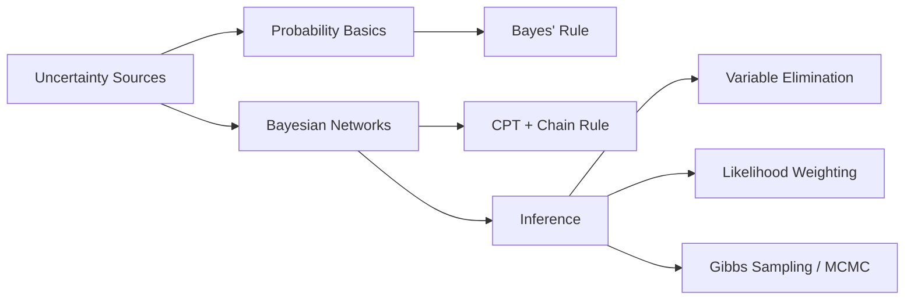

# Chapter 8: Uncertainty and Probabilistic Reasoning

**Previous:** [Chapter 7: Logical Reasoning and Inference](07-logical-reasoning.md) | **Next:** [Chapter 9: Machine Learning](09-machine-learning.md)

---

## Learning Objectives

- Explain why agents must handle uncertainty and the role of probability theory in doing so.
- Define the basics of probability: joint distributions, conditional probability, and Bayes' Rule.
- Construct and interpret Bayesian Networks as a representation of probabilistic relationships.
- Perform inference in Bayesian Networks using exact methods like Variable Elimination.
- Understand the concept of independence and conditional independence.

<!-- Image Gallery -->
<section class="lesson-visuals" aria-label="Visual learning resources">
  <header><span>VISUAL LEARNING</span><h2>See it. Review it. Remember it.</h2></header>
  <a class="lesson-visual-card" href="../../assets/images/lessons/artificial-intelligence/08-uncertainty/handwritten-notes.png" target="_blank" rel="noopener">
    
    <span><strong>Handwritten notes</strong>Condensed notes for deliberate review.</span>
  </a>
  <a class="lesson-visual-card" href="../../assets/images/lessons/artificial-intelligence/08-uncertainty/sticky-notes.png" target="_blank" rel="noopener">
    
    <span><strong>Sticky-note revision</strong>Fast recall prompts for revision.</span>
  </a>
  <a class="lesson-visual-card" href="../../assets/images/lessons/artificial-intelligence/08-uncertainty/visual-explanation.png" target="_blank" rel="noopener">
    
    <span><strong>Visual concept guide</strong>A connected explanation of the key ideas.</span>
  </a>
</section>
<!-- End Image Gallery -->


---

## Why Uncertainty Matters in AI

### Real-World Analogy → Weather Forecast

Imagine planning a picnic. The weather forecast says "70% chance of rain." You cannot know for certain whether it will rain, but you must decide: bring an umbrella or cancel the picnic. This is **reasoning under uncertainty** → you have partial information and must act anyway.

In AI, agents face the same dilemma. A self-driving car cannot know with 100% certainty whether the dark shape ahead is a pedestrian or a shadow. A medical diagnosis system cannot be sure the patient has a disease → only that symptoms suggest it. Just as you weigh the forecast against the cost of a ruined picnic, AI agents must quantify uncertainty and take optimal actions.

---

## Probability vs Logic → Comparison Table

| Aspect | Logic | Probability |
|--------|-------|-------------|
| **Truth Value** | True / False / Unknown | Continuous [0, 1] |
| **Belief Update** | Deductive (certain inference) | Bayesian update (belief revision) |
| **Handles Noise** | No → assumes perfect knowledge | Yes → models noise explicitly |
| **Handles Missing Data** | Poor → breaks without complete info | Naturally integrates partial evidence |
| **Uncertainty Representation** | Cannot express degree of belief | Degree of belief via probability |
| **Monotonic** | Yes → adding facts never retracts conclusions | No → new evidence can change beliefs |
| **Computational Cost** | Low (SAT, resolution) | High (sum over variables) |
| **Real-World Suitability** | Toy domains, formal verification | Medical diagnosis, NLP, robotics |

> **Key Insight:** Logic excels when the world is fully known and deterministic. Probability excels in the real world → noisy sensors, missing data, stochastic outcomes.

---

## Chapter at a Glance

| Section | Key Topics | Key Terms |
|---------|-----------|-----------|
| Problem of Uncertainty | Partial observability, stochasticity | Random variable, joint distribution |
| Probability Basics | Conditional probability, Bayes' Rule | Prior, posterior, likelihood |
| Bayesian Networks | DAG, CPT, chain rule | Factorization, parent-child |
| Inference | Variable elimination, sampling | Likelihood weighting, MCMC |

## Chapter Roadmap



---

## Theory


### The Problem of Uncertainty


In real-world environments, agents rarely have access to the complete state of the world. Uncertainty arises from:
- **Partial Observability**: Missing information.
- **Stochasticity**: Randomness in outcomes.
- **Ignorance**: Incomplete models of the world.

---

## Topic 1 → Probability Basics

### Real-World Analogy → Rolling Dice

When you roll a fair six-sided die, you know the possible outcomes {1,2,3,4,5,6} but not which will occur. Probability quantifies this uncertainty: P(Roll=3) = 1/6 ≈ 0.167. Over many rolls, the relative frequency of each face approaches 1/6. This is the **frequentist interpretation**. In AI, we also use the **Bayesian interpretation**: probability as degree of belief.

### Why It Matters in AI

Every AI system makes decisions under uncertainty. Probability gives us the language to say "I am 80% confident this email is spam" instead of "this email is spam" (which is often false). Without probability, AI would be limited to purely deterministic, toy environments.

### Core Concepts

- **Random Variable**: A variable whose value is subject to variations due to chance. Example: $Weather \in \{Sunny, Rainy\}$.
- **Probability Distribution**: Maps each outcome to its probability. Sum of all probabilities = 1.
- **Joint Probability Distribution**: Specifies the probability of every possible combination of values for a set of random variables. For 3 boolean variables, the full joint has 2³ = 8 entries.
- **Marginal Probability**: $P(A)$ → the probability of A regardless of other variables.

### Algorithm → Computing Marginal from Joint

**Input:** Joint distribution table P(X, Y), target variable X
**Output:** P(X)

**Steps:**
1. Identify all possible values of X
2. For each value x of X:
   a. Sum the probabilities of all joint entries where X = x
3. Return the resulting distribution

**Pseudocode:**
```
function MARGINALIZE(Joint P(X,Y), variable X):
    result = empty distribution over X
    for each value x in domain(X):
        total = 0
        for each value y in domain(Y):
            total = total + P(X=x, Y=y)
        result[x] = total
    return result
```

**Dry Run → Marginal from Joint Table:**

We have two variables: Weather (W) ∈ {Sunny, Rainy} and Mood (M) ∈ {Happy, Sad}. Joint distribution P(W, M):

| W | M | P(W,M) |
|---|---|--------|
| Sunny | Happy | 0.30 |
| Sunny | Sad | 0.15 |
| Rainy | Happy | 0.10 |
| Rainy | Sad | 0.45 |

Compute P(Weather=Sunny):
- P(Sunny) = P(Sunny, Happy) + P(Sunny, Sad) = 0.30 + 0.15 = 0.45

Compute P(Weather=Rainy):
- P(Rainy) = P(Rainy, Happy) + P(Rainy, Sad) = 0.10 + 0.45 = 0.55

**Python Implementation:**
```python
from collections import defaultdict

def marginalize(joint, target_var):
    """Marginalize joint distribution over target variable.
    joint: list of dicts with 'value' tuple and 'prob'
    target_var: index of variable to keep
    """
    result = defaultdict(float)
    for entry in joint:
        key = entry['value'][target_var]
        result[key] += entry['prob']
    return dict(result)

# Example
joint_table = [
    {'value': ('Sunny', 'Happy'), 'prob': 0.30},
    {'value': ('Sunny', 'Sad'),   'prob': 0.15},
    {'value': ('Rainy', 'Happy'), 'prob': 0.10},
    {'value': ('Rainy', 'Sad'),   'prob': 0.45},
]

p_weather = marginalize(joint_table, target_var=0)
print("P(Weather):", p_weather)
# Output: P(Weather): {'Sunny': 0.45, 'Rainy': 0.55}
```

### Complexity Analysis

| Aspect | Complexity | Why |
|--------|-----------|-----|
| **Space (full joint)** | O(dⁿ) for n variables each with d values | Every combination must be stored → exponential explosion |
| **Time (marginalize)** | O(dⁿ) | Must sum over all other dimensions |
| **CPT representation (BN)** | O(n × dᵏ) where k = max parents | Only local parents; k &lt;< n in sparse graphs |

The full joint distribution is **impractical** beyond ~20 boolean variables (2²⁰ ≈ 1 million entries). This is the **curse of dimensionality** and the primary motivation for Bayesian Networks.

### Advantages & Disadvantages of Probability Basics

| Advantages | Disadvantages |
|------------|---------------|
| Principled framework for uncertainty | Full joint distribution is exponentially large |
| Mathematically rigorous | Requires known probabilities (may be hard to estimate) |
| Enables optimal decision-making | Independence assumptions may be wrong |
| Well-understood theory | Continuous variables require integration |

### Edge Cases

1. **Zero Probabilities**: If P(e) = 0 (observed impossible evidence), Bayes' rule divides by zero. Solution: use probability density for continuous vars; check for zero in code.
2. **Extremely Rare Events**: Prior probability near zero → posterior stays near zero even with strong evidence. This is the **rare disease problem** (see Bayes' rule example).
3. **Conflicting Evidence**: Two pieces of evidence pointing opposite directions. Probability naturally balances them via Bayesian update.
4. **Continuous Variables**: Infinite outcomes. Use Probability Density Functions (PDFs) and integration instead of summation.

---

## Topic 2 → Conditional Probability

### Real-World Analogy → Medical Test

A COVID test is 95% accurate. If you test positive, what is the probability you actually have COVID? It depends on the **base rate** (prevalence) in your area. If only 1% of people have COVID, a positive test is more likely to be a false positive than a true positive. Conditional probability captures this: P(COVID | Positive) depends on P(Positive | COVID), P(COVID), and P(Positive).

### Definition

Conditional probability $P(A|B)$ is the probability of event A given that event B has occurred:

$$P(A|B) = \frac{P(A \cap B)}{P(B)}$$

### Algorithm → Computing Conditional Probability

**Input:** Joint distribution P(X, Y), values x, y
**Output:** P(X=x | Y=y)

**Steps:**
1. Compute P(X=x, Y=y) from the joint table
2. Compute P(Y=y) by marginalizing over X
3. Divide: P(X=x | Y=y) = P(X=x, Y=y) / P(Y=y)
4. Return the result

**Pseudocode:**
```
function CONDITIONAL_PROB(joint, x_val, y_val, x_idx, y_idx):
    joint_prob = lookup P(X=x_val, Y=y_val)
    prob_y = 0
    for each value x in domain(X):
        prob_y = prob_y + lookup P(X=x, Y=y_val)
    if prob_y == 0:
        return undefined
    return joint_prob / prob_y
```

**Dry Run → Conditional from Joint:**

Using the same Weather-Mood table:

| W | M | P(W,M) |
|---|---|--------|
| Sunny | Happy | 0.30 |
| Sunny | Sad | 0.15 |
| Rainy | Happy | 0.10 |
| Rainy | Sad | 0.45 |

**Q:** What is P(Mood=Happy | Weather=Sunny)?
- P(M=Happy, W=Sunny) = 0.30
- P(W=Sunny) = 0.30 + 0.15 = 0.45
- P(M=Happy | W=Sunny) = 0.30 / 0.45 = 0.667

**Q:** What is P(Weather=Rainy | Mood=Sad)?
- P(W=Rainy, M=Sad) = 0.45
- P(M=Sad) = 0.15 + 0.45 = 0.60
- P(W=Rainy | M=Sad) = 0.45 / 0.60 = 0.75

**Python Implementation:**
```python
def conditional_prob(joint, x_val, y_val, x_idx, y_idx):
    """Compute P(X=x_val | Y=y_val) from joint table."""
    joint_prob = 0
    prob_y = 0
    for entry in joint:
        if entry['value'][x_idx] == x_val and entry['value'][y_idx] == y_val:
            joint_prob = entry['prob']
        if entry['value'][y_idx] == y_val:
            prob_y += entry['prob']
    if prob_y == 0:
        raise ValueError("P(Y=y_val) = 0, conditional undefined")
    return joint_prob / prob_y

p_happy_given_sunny = conditional_prob(
    joint_table, 'Happy', 'Sunny', x_idx=1, y_idx=0
)
print(f"P(Happy | Sunny) = {p_happy_given_sunny:.3f}")
# Output: P(Happy | Sunny) = 0.667

p_rainy_given_sad = conditional_prob(
    joint_table, 'Rainy', 'Sad', x_idx=0, y_idx=1
)
print(f"P(Rainy | Sad) = {p_rainy_given_sad:.3f}")
# Output: P(Rainy | Sad) = 0.750
```

### Advantages & Disadvantages

| Advantages | Disadvantages |
|------------|---------------|
| Captures dependency between events | Requires joint distribution (may be large) |
| Foundation for causal reasoning | Sensitive to zero-probability issues |
| Used in every ML model | Assumes accurate probability estimates |

### Edge Cases

1. **P(B) = 0**: Conditional probability undefined. In practice, use smoothing (Laplace add-one) or density estimation.
2. **Continuous Conditioning**: P(A | B) for continuous B requires PDF ratio, not simple division.

---

## Topic 3 → Bayes' Rule

### Real-World Analogy → Spam Filtering

Your email provider flags a message containing "FREE MONEY!!!". What is the probability it's spam? Historically, 60% of all emails are spam, and "FREE MONEY!!!" appears in 80% of spam but only 5% of legitimate emails. Bayes' Rule tells us:

P(spam | "FREE MONEY!!!") = P("FREE MONEY!!!" | spam) × P(spam) / P("FREE MONEY!!!")

= (0.80 × 0.60) / (0.80 × 0.60 + 0.05 × 0.40) = 0.48 / 0.50 = 0.96

96% chance it's spam → move to spam folder!

### Definition

Bayes' Rule is the fundamental formula for updating beliefs given evidence:

$$P(A|B) = \frac{P(B|A) \cdot P(A)}{P(B)}$$

Where:
- **P(A)** = Prior probability (belief before evidence)
- **P(B|A)** = Likelihood (probability of evidence given cause)
- **P(B)** = Marginal likelihood (normalizing constant)
- **P(A|B)** = Posterior probability (updated belief after evidence)

### Algorithm → Bayesian Belief Update

**Input:** Prior P(A), likelihood P(B|A), evidence B
**Output:** Posterior P(A|B)

**Steps:**
1. Identify the hypothesis A and evidence B
2. Determine the prior P(A)
3. Determine P(not A) = 1 - P(A)
4. Determine the likelihood P(B|A)
5. Determine P(B|not A) → false positive rate
6. Compute marginal P(B) = P(B|A)P(A) + P(B|not A)P(not A)
7. Compute posterior: P(A|B) = P(B|A) × P(A) / P(B)
8. Return posterior

**Pseudocode:**
```
function BAYES_RULE(prior, likelihood_given_true, likelihood_given_false):
    prior_false = 1 - prior
    marginal = likelihood_given_true * prior + likelihood_given_false * prior_false
    if marginal == 0:
        return undefined
    posterior = (likelihood_given_true * prior) / marginal
    return posterior
```

**Dry Run → Medical Diagnosis:**

| Variable | Value | Source |
|----------|-------|--------|
| P(Disease) | 0.01 | Prior → 1% population has disease |
| P(Positive | Disease) | 0.95 | True positive rate (sensitivity) |
| P(Positive | Healthy) | 0.05 | False positive rate |
| Evidence | Test Positive | Patient result |

**Step-by-step:**
1. P(Disease) = 0.01
2. P(Healthy) = 1 - 0.01 = 0.99
3. P(Positive | Disease) = 0.95, P(Positive | Healthy) = 0.05
4. P(Positive) = (0.95 × 0.01) + (0.05 × 0.99) = 0.0095 + 0.0495 = 0.059
5. P(Disease | Positive) = 0.0095 / 0.059 ≈ 0.161

**Trace Table → Each step:**

| Step | Calculation | Result |
|------|-------------|--------|
| 1 | prior = P(D) | 0.01 |
| 2 | P(not D) = 1 - 0.01 | 0.99 |
| 3 | numerator = 0.95 × 0.01 | 0.0095 |
| 4 | denominator = 0.95×0.01 + 0.05×0.99 | 0.059 |
| 5 | posterior = 0.0095 / 0.059 | **0.161** |

Even with 95% accurate test, probability of having the disease after a positive result is only 16.1%! This is because the disease is rare (1%) and the false positive rate (5%) generates many false alarms.

**Python Implementation:**
```python
def bayes_rule(prior, likelihood_given_true, likelihood_given_false):
    """Compute P(A|B) using Bayes' Rule."""
    prior_false = 1.0 - prior
    marginal = likelihood_given_true * prior + likelihood_given_false * prior_false
    if marginal == 0.0:
        return None
    posterior = (likelihood_given_true * prior) / marginal
    return posterior

# Medical diagnosis example
p_disease = 0.01
p_pos_given_disease = 0.95
p_pos_given_healthy = 0.05

p_disease_given_pos = bayes_rule(p_disease, p_pos_given_disease, p_pos_given_healthy)
print(f"P(Disease | Positive) = {p_disease_given_pos:.3f}")
# Output: P(Disease | Positive) = 0.161

p2 = bayes_rule(p_disease_given_pos, p_pos_given_disease, p_pos_given_healthy)
print(f"P(Disease | Second Positive) = {p2:.3f}")
# Output: P(Disease | Second Positive) = 0.784
```

### Complexity Analysis

| Aspect | Complexity | Why |
|--------|-----------|-----|
| **Single update** | O(1) | Just three multiplications and a division |
| **Nested updates** | O(k) for k sequential updates | Each update is O(1); posterior becomes new prior |
| **Multiple hypotheses** | O(n) for n hypotheses | Must compute and normalize over all n |
| **Continuous variables** | O(integration) | Requires numerical integration over continuous domains |

Bayes' Rule is constant-time for a single binary hypothesis. Its power is not computational efficiency but **epistemic efficiency** → it gives the principled way to incorporate evidence.

### Advantages & Disadvantages

| Advantages | Disadvantages |
|------------|---------------|
| Optimal belief update (mathematically proven) | Requires accurate likelihood estimates |
| Handles sequential evidence naturally | Prior choice can bias results |
| Interpretable → posterior has clear meaning | Computationally expensive for large hypothesis spaces |
| Foundation for Bayesian ML (Bayesian NNs, GPs) | Integration over continuous vars is hard |

### Edge Cases

1. **Zero Prior**: If P(A) = 0, posterior stays 0 regardless of evidence. The prior completely rules out the hypothesis.
2. **Perfect Likelihood**: If P(B|A) = 1 and P(B|not A) = 0, then posterior = 1 → certainty.
3. **Non-informative Prior**: When P(A) = 0.5, the posterior depends entirely on the likelihood ratio.
4. **Multiple Evidence**: P(A|B1, B2) requires either P(B1, B2 | A) or the Naive Bayes assumption P(B1, B2 | A) = P(B1|A)P(B2|A).

---

## Topic 4 → Bayesian Networks

### Real-World Analogy → Car Won't Start

Your car won't start. Possible causes: dead battery, empty fuel tank, or faulty starter. These causes interact: a dead battery also makes headlights dim; an empty tank doesn't. We can model this as a network: Battery → Starts, Fuel → Starts, Battery → Headlights. Each node's probability depends on its direct causes (parents). This structure makes reasoning efficient: we don't need to consider all 2⁵ = 32 combinations independently.

### Definition

A **Bayesian Network** (BN) is a Directed Acyclic Graph (DAG) where:
- **Nodes** = random variables
- **Edges** = direct probabilistic influence (parent → child)
- Each node has a **Conditional Probability Table (CPT)** quantifying the influence of its parents

### Bayesian Network Properties

| Property | Description | Why It Matters |
|----------|-------------|----------------|
| **DAG Structure** | Directed acyclic graph | Prevents circular dependencies; ensures consistent joint distribution |
| **Factorization** | P(X) = ∏ P(Xᵢ | Parents(Xᵢ)) | Reduces parameters from O(2ⁿ) to O(n × 2ᵏ) |
| **CPT Representation** | Each node stores P(node | parents) | Compact conditional distributions |
| **Conditional Independence** | Node independent of non-descendants given parents | Enables efficient inference |
| **D-Separation** | Graph-theoretic criterion for independence | Determines which variables are independent given evidence |
| **Markov Blanket** | Parents + Children + Children's other parents | Sufficient for local inference → node independent of rest given blanket |
| **Modularity** | Adding/removing edges affects only local CPTs | Easy to extend; local changes don't require full recomputation |
| **Interpretability** | Human-readable graph structure | Domain experts can validate and refine the model |

### Algorithm → Constructing a Bayesian Network

**Input:** Set of random variables, domain knowledge or data
**Output:** BN structure (DAG) + CPTs

**Steps:**
1. Choose an ordering of variables: X₁, X₂, ..., Xₙ (causes before effects)
2. For each variable Xáµ¢:
   a. Identify a minimal set of parents from X₁...Xᵢ₋₁ that directly influence Xᵢ
   b. Add directed edges from each parent to Xáµ¢
   c. Define the CPT P(Xáµ¢ | Parents(Xáµ¢))
3. Verify the graph is acyclic
4. Return the network

**Pseudocode:**
```
function CONSTRUCT_BN(variables, domain_knowledge):
    order = TOPOLOGICAL_SORT(variables)
    for each X in order:
        parents = domain_knowledge.get_direct_causes(X)
        add edges from each parent to X
        CPT[X] = ESTIMATE_CPT(X, parents)
    if HAS_CYCLE(graph):
        error("Bayesian Network must be acyclic")
    return BN(graph, CPT)
```

**Dry Run → Burglary Alarm Network:**

Variables: Burglary (B), Earthquake (E), Alarm (A), JohnCalls (J), MaryCalls (M)

**Structure (expert knowledge):**
- Burglary and Earthquake cause Alarm
- Alarm causes John to call and Mary to call

**CPTs:**

| P(B) | |
|------|---|
| true | 0.001 |

| P(E) | |
|------|---|
| true | 0.002 |

| B | E | P(A=true | B, E) |
|---|---|-----------------|
| F | F | 0.001 |
| F | T | 0.29 |
| T | F | 0.94 |
| T | T | 0.95 |

| A | P(J=true | A) |
|---|---------------|
| F | 0.05 |
| T | 0.90 |

| A | P(M=true | A) |
|---|---------------|
| F | 0.01 |
| T | 0.70 |

**Parameter Count Comparison:**

| Representation | Parameters |
|----------------|-----------|
| Full Joint | 2⁵ - 1 = 31 |
| BN (this network) | 1 + 1 + 4 + 2 + 2 = 10 |

The BN uses **68% fewer parameters** → and the gap widens as the network grows.

**Python Implementation:**
```python
class BayesianNode:
    def __init__(self, name, parents, cpt):
        self.name = name
        self.parents = parents
        self.cpt = cpt

class BayesianNetwork:
    def __init__(self, nodes):
        self.nodes = {n.name: n for n in nodes}

    def get_prob(self, name, value, parent_values=None):
        node = self.nodes[name]
        key = tuple(parent_values[p] for p in node.parents) if parent_values else ()
        return node.cpt[key][value]

# Build the Burglary Alarm network
B = BayesianNode('Burglary', [], {
    (): {True: 0.001, False: 0.999}
})
E = BayesianNode('Earthquake', [], {
    (): {True: 0.002, False: 0.998}
})
A = BayesianNode('Alarm', ['Burglary', 'Earthquake'], {
    (False, False): {True: 0.001, False: 0.999},
    (False, True):  {True: 0.290, False: 0.710},
    (True, False):  {True: 0.940, False: 0.060},
    (True, True):   {True: 0.950, False: 0.050},
})
J = BayesianNode('JohnCalls', ['Alarm'], {
    (False,): {True: 0.05, False: 0.95},
    (True,):  {True: 0.90, False: 0.10},
})
M = BayesianNode('MaryCalls', ['Alarm'], {
    (False,): {True: 0.01, False: 0.99},
    (True,):  {True: 0.70, False: 0.30},
})

bn = BayesianNetwork([B, E, A, J, M])

evidence = {
    'Burglary': False, 'Earthquake': False, 'Alarm': False,
    'JohnCalls': False, 'MaryCalls': False
}
prob = 1.0
for node in bn.nodes.values():
    parent_vals = {p: evidence[p] for p in node.parents}
    prob *= bn.get_prob(node.name, evidence[node.name], parent_vals)
print(f"P(all false) = {prob:.10f}")
```

### Complexity Analysis

| Aspect | Complexity | Why |
|--------|-----------|-----|
| **Full joint parameters** | O(2ⁿ) | Exponential in number of variables |
| **BN parameters** | O(n × 2ᵏ) where k = max parents | Exponential in max parents, not total variables |
| **Inference (exact)** | O(exp(treewidth)) | NP-hard in worst case; tractable for low treewidth |
| **Structure learning** | O(n²) heuristic / NP-hard optimal | Each edge direction needs evaluation |
| **Memory (CPT storage)** | O(∑ 2^{|parents(Xᵢ)|}) | Sum of per-node CPT sizes |

The key insight: if the graph is sparse (each node has few parents), the BN is exponentially more compact than the full joint.

### Advantages & Disadvantages

| Advantages | Disadvantages |
|------------|---------------|
| Visually interpretable → graph shows causal structure | Structure learning is NP-hard |
| Compact representation | Exact inference is NP-hard (treewidth-dependent) |
| Handles missing data naturally | CPTs grow exponentially with parent count |
| Encodes causal relationships | Sensitive to ordering |
| Enables bidirectional reasoning | Continuous vars need discretization |

### Edge Cases

1. **Network with Many Parents**: CPT size explodes. Solution: use canonical models like noisy-OR (each parent independently causes child; probabilities combine via P(child=True) = 1 - ∏(1 - pᵢ)).
2. **Continuous Variables**: Use Gaussian BNs (linear Gaussian dependencies) or discretize.
3. **Sparse Data for CPT**: Use Dirichlet priors for smoothing; Bayesian estimation instead of ML.
4. **Cyclic Dependencies**: Temporal modeling via Dynamic Bayesian Networks (DBNs) → unroll over time slices.

---

## Topic 5 → Inference in Bayesian Networks

### Real-World Analogy → Fire Department

When a fire station receives an alarm, they need to infer the most likely cause: Is it a real fire, a prank, or a system malfunction? They might call neighbors to ask (observing JohnCalls or MaryCalls). Gradually, they narrow down the cause. This is **inference** → computing P(query | evidence) using the BN's structure and CPTs.

### Algorithm → Variable Elimination

**Input:** BN, query variable Q, evidence variables E, elimination ordering
**Output:** P(Q | E)

**Steps:**
1. Multiply all CPT factors relevant to the query
2. For each hidden variable H in elimination order:
   a. Join (multiply) all factors involving H
   b. Sum out H (marginalize) to create a new factor
   c. Remove all factors that mentioned H
3. Normalize the resulting factor over Q
4. Return P(Q | E)

**Pseudocode:**
```
function VARIABLE_ELIMINATION(BN, query, evidence, order):
    factors = all CPTs in BN
    for each factor in factors:
        factor.restrict(evidence)
    for each var in order:
        if var == query: continue
        related = [f for f in factors if var in f.variables]
        new_factor = SUM_OUT(var, PRODUCT(related))
        factors = factors - related + new_factor
    result = PRODUCT(factors)
    return NORMALIZE(result)
```

**Dry Run → Inference in Burglary Alarm:**

**Query:** P(Burglary | MaryCalls=true)

**Variables:** B, E, A, J, M → **Evidence:** M=true → **Query:** B → **Elimination order:** J, A, E

**Factors (CPTs):**
- f₁(B): P(B)
- fâ‚‚(E): P(E)
- f₃(A, B, E): P(A | B, E)
- fâ‚„(J, A): P(J | A)
- fâ‚…(M, A): P(M | A)

**Step 1 → Restrict evidence M=true:**
- fâ‚…(M=true, A): A=F → 0.01, A=T → 0.70

**Step 2 → Eliminate J:**
- Sum out J: P(J|A) summed over J = 1.0. Factor disappears.

**Step 3 → Multiply f₃ × fâ‚…:**
- f₆(B, E, A) = f₃(A, B, E) × f₅(M=true, A)

| B | E | A=F | A=T |
|---|---|-----|-----|
| F | F | 0.999×0.01=0.00999 | 0.001×0.70=0.00070 |
| F | T | 0.710×0.01=0.00710 | 0.290×0.70=0.20300 |
| T | F | 0.060×0.01=0.00060 | 0.940×0.70=0.65800 |
| T | T | 0.050×0.01=0.00050 | 0.950×0.70=0.66500 |

**Step 4 → Eliminate A (sum over A):**
- f₇(B=F, E=F) = 0.00999 + 0.00070 = 0.01069
- f₇(B=F, E=T) = 0.00710 + 0.20300 = 0.21010
- f₇(B=T, E=F) = 0.00060 + 0.65800 = 0.65860
- f₇(B=T, E=T) = 0.00050 + 0.66500 = 0.66550

**Step 5 → Multiply f₁ × fâ‚‚ × f₇:**
- f₈(B=F, E=F) = 0.999 × 0.998 × 0.01069 = 0.010654
- f₈(B=F, E=T) = 0.999 × 0.002 × 0.21010 = 0.000420
- f₈(B=T, E=F) = 0.001 × 0.998 × 0.65860 = 0.000657
- f₈(B=T, E=T) = 0.001 × 0.002 × 0.66550 = 0.000001

**Step 6 → Eliminate E:**
- f₉(B=F) = 0.010654 + 0.000420 = 0.011074
- f₉(B=T) = 0.000657 + 0.000001 = 0.000658

**Step 7 → Normalize:**
- P(B=T | M=true) = 0.000658 / (0.011074 + 0.000658) = **0.0561**
- P(B=F | M=true) = 0.011074 / 0.011732 = **0.9439**

**Python Implementation:**
```python
import itertools
from collections import defaultdict

class Factor:
    def __init__(self, variables, values):
        self.variables = variables
        self.values = values

    def restrict(self, evidence):
        for var, val in evidence.items():
            if var in self.variables:
                idx = self.variables.index(var)
                new_vars = self.variables[:]
                new_values = {}
                for assignment, prob in self.values.items():
                    if assignment[idx] == val:
                        new_assign = assignment[:idx] + assignment[idx+1:]
                        new_values[new_assign] = prob
                new_vars.pop(idx)
                self.variables = new_vars
                self.values = new_values

    def sum_out(self, var):
        idx = self.variables.index(var)
        new_vars = self.variables[:idx] + self.variables[idx+1:]
        new_values = defaultdict(float)
        for assignment, prob in self.values.items():
            new_assign = assignment[:idx] + assignment[idx+1:]
            new_values[new_assign] += prob
        self.variables = new_vars
        self.values = dict(new_values)

    def multiply(self, other):
        all_vars = list(dict.fromkeys(self.variables + other.variables))
        com_vars = [v for v in self.variables if v in other.variables]
        com_idx1 = [self.variables.index(v) for v in com_vars]
        com_idx2 = [other.variables.index(v) for v in com_vars]
        new_values = {}
        for a1, p1 in self.values.items():
            for a2, p2 in other.values.items():
                if all(a1[i1] == a2[i2] for i1, i2 in zip(com_idx1, com_idx2)):
                    new_a = [a1[self.variables.index(v)] if v in self.variables else a2[other.variables.index(v)] for v in all_vars]
                    new_values[tuple(new_a)] = p1 * p2
        return Factor(all_vars, new_values)

def variable_elimination(bn, query, evidence, elim_order):
    factors = []
    for node in bn.nodes.values():
        cpt_vals = {}
        for parent_vals, probs in node.cpt.items():
            for val, prob in probs.items():
                assignment = list(parent_vals) + [val]
                cpt_vals[tuple(assignment)] = prob
        f = Factor(node.parents + [node.name], cpt_vals)
        f.restrict(evidence)
        factors.append(f)

    for var in elim_order:
        if var == query:
            continue
        related = [f for f in factors if var in f.variables]
        if not related:
            continue
        product = related[0]
        for f in related[1:]:
            product = product.multiply(f)
        product.sum_out(var)
        factors = [f for f in factors if f not in related]
        factors.append(product)

    result = factors[0]
    for f in factors[1:]:
        result = result.multiply(f)
    total = sum(result.values.values())
    return {k: v / total for k, v in result.values.items()}

result = variable_elimination(bn, 'Burglary', {'MaryCalls': True}, ['JohnCalls', 'Alarm', 'Earthquake'])
print("P(Burglary | MaryCalls=true):")
for assignment, prob in result.items():
    print(f"  B={assignment[0]}: {prob:.4f}")
```

### Complexity Analysis

| Aspect | Complexity | Why |
|--------|-----------|-----|
| **Variable Elimination** | O(n × exp(treewidth)) | Treewidth = size of largest intermediate factor |
| **Naive enumeration** | O(2ⁿ) | Sum over all assignments of hidden variables |
| **Likelihood Weighting** | O(N × n) for N samples | No exponential blowup, but approximate |
| **Gibbs Sampling** | O(N × n) per iteration | Mixing time can be exponential for pathological BNs |

Treewidth is the critical metric. A **polytree** (each node has at most one undirected path to any other) has treewidth equal to its maximum node degree → inference is polynomial. A fully connected BN has treewidth = n → inference is exponential.

### Advantages & Disadvantages of Inference Methods

| Method | Advantages | Disadvantages |
|--------|------------|---------------|
| **Variable Elimination** | Exact; optimal for low treewidth | NP-hard in general; sensitive to elimination order |
| **Likelihood Weighting** | Handles rare evidence well | Approximate; many samples needed for accuracy |
| **Gibbs Sampling** | Scales to many variables | Slow mixing; pain for near-deterministic CPTs |
| **Rejection Sampling** | Simple to implement | Extremely inefficient for rare evidence |

### Edge Cases in Inference

1. **Zero Probabilities in Evidence**: If P(evidence) = 0 in the BN, inference divides by zero. The network is inconsistent with the evidence → check CPTs.
2. **Very Rare Evidence**: Rejection sampling may reject 99.99% of samples. Use likelihood weighting instead.
3. **Nearly Deterministic CPTs**: Rows like P(A|B) = [0.999, 0.001] cause numerical instability. Use log-space computation.
4. **Large Treewidth**: VE becomes intractable. Use approximate inference (sampling) or simplify the network.
5. **Continuous Variables**: Cannot sum out; must integrate. Use Gaussian BNs or particle filtering.

---

## Concept Comparison → Inference Methods

| Inference Method | Type | Exact? | Complexity | Best For | Trade-off |
|-----------------|:---:|:---:|:---:|---------|-----------|
| Variable Elimination | Exact | ✅ | O(exp treewidth) | Low treewidth BNs | Sensitive to elimination order |
| Likelihood Weighting | Approx | ❌ | O(N) | Rare evidence | Many samples needed |
| Rejection Sampling | Approx | ❌ | O(N / P(e)) | Easy-to-satisfy evidence | Wastes samples on rejections |
| Gibbs Sampling (MCMC) | Approx | ❌ | O(N × nodes) | High-dimensional posteriors | Burn-in and mixing issues |

---

## Interview Corner

### Q1: Explain Bayes' Theorem and its applications in machine learning.

Bayes' Theorem describes the probability of an event based on prior knowledge:

$$P(H|E) = \frac{P(E|H) \cdot P(H)}{P(E)}$$

**Applications in ML:** Naive Bayes Classifier (text classification, spam filtering), Bayesian Linear Regression, Gaussian Processes, Bayesian Model Selection, A/B Testing.

### Q2: Why is Naive Bayes "naive"? How does it work?

"It assumes all features are conditionally independent given the class label → a 'naive' assumption rarely true in practice."

$$P(Y | X_1, ..., X_n) \propto P(Y) \prod_{i=1}^n P(X_i | Y)$$

**Why it still works:** Decision boundary can be correct even if probabilities are miscalibrated; requires much less data; handles high-dimensional feature spaces; extremely fast → O(n) per prediction.

### Q3: How would you learn the structure of a Bayesian Network from data?

Three approaches:
1. **Score-Based Learning**: Search over DAGs maximizing BIC/BDeu score. Greedy search or hill-climbing. NP-hard in general.
2. **Constraint-Based Learning**: Use conditional independence tests (chi-square, mutual information) to determine edges. PC algorithm is classic.
3. **Hybrid Approaches**: Combine both.

**Common algorithms:** K2 (fixed ordering), Hill-Climbing (BIC score), PC Algorithm, Max-Min Hill-Climbing.

### Q4: What is d-separation and why does it matter?

d-separation determines whether two variables are conditionally independent given observed variables. A path is blocked if:
- **Chain** A → B → C with B observed
- **Fork** A ← B → C with B observed
- **Collider** A → B ← C with B or descendant NOT observed

If all paths between X and Y are blocked by Z, then X ⟂ Y | Z.

### Q5: What are the trade-offs between exact and approximate inference?

| Aspect | Exact (VE) | Approx (Sampling) |
|--------|-----------|-------------------|
| Accuracy | Exact | Converges with more samples |
| Worst-case | Exponential in treewidth | Fixed running time (N samples) |
| Evidence handling | Always correct | Struggles with rare evidence |
| Implementation | Complex → factor management | Simple → just sample and count |
| Continuous vars | Heavy integration | Straightforward (sample from proposal) |

---

## Applications in Real Systems

### 1. Spam Filtering (Naive Bayes)

**System:** Email spam filters (Gmail, Outlook)
**How:** P(Spam | Words) ∝ P(Spam) ∏ P(Word | Spam). Words are assumed conditionally independent given class.
**Why Bayes:** Spam words change rapidly; Naive Bayes adapts by updating word probabilities from user feedback.
**Impact:** ~99.9% of spam blocked, &lt;0.1% false positives.

### 2. Medical Diagnosis (Bayesian Networks)

**System:** Computer-aided diagnosis (QMR, Pathfinder)
**How:** BN with nodes for diseases and symptoms. Edges represent causal links. Inference computes P(disease | symptoms).
**Why Bayes:** Handles test result uncertainty, accounts for disease prevalence, naturally combines multiple symptoms.
**Impact:** Pathfinder outperformed expert pathologists in diagnostic accuracy.

### 3. Speech Recognition (Hidden Markov Models)

**System:** ASR systems (Siri, Google Speech, Whisper)
**How:** HMMs are Bayesian Networks with hidden states (phonemes) and observed outputs (audio features). Viterbi algorithm computes most likely phoneme sequence.
**Why Bayes:** Speech is ambiguous → "recognize" vs "wreck a nice" sound similar. Probabilistic reasoning disambiguates using language models.
**Impact:** Word error rates dropped from ~30% (2000) to &lt;5% (modern systems).

### 4. Fault Diagnosis (Bayesian Networks)

**System:** Aircraft engine diagnostics, network failure diagnosis
**How:** BN models component failures → observable symptoms. Given sensor readings, P(fault | symptoms) recommends most likely faulty component.
**Why Bayes:** Multiple faults interact; symptoms have multiple causes. BN's causal structure mirrors system architecture.
**Impact:** Reduced diagnostic time by 60-80% in aerospace applications.

### 5. Robotics (Bayes Filters → Kalman / Particle Filters)

**System:** Localization, mapping, tracking
**How:** Robot maintains belief P(state | sensor_data, controls) using Bayes' Rule recursively (predict → update).
**Why Bayes:** Unifies sensor noise, motion uncertainty, map uncertainty into a single belief distribution.
**Impact:** Enables autonomous driving (localization at &lt;10cm), drone navigation, warehouse robotics.

---

## Quick Reference → Probability Rules

| Rule | Formula | Use Case |
|------|---------|----------|
| Joint Probability | P(A ∧ B) = P(A|B)P(B) | Computing combined events |
| Bayes' Rule | P(A|B) = P(B|A)P(A) / P(B) | Diagnostic reasoning |
| Chain Rule | P(X₁…Xₙ) = ∏ P(Xᵢ | X₁…Xᵢ₋₁) | Decomposing joint distributions |
| Law of Total Probability | P(B) = Σ P(B|Aᵢ)P(Aᵢ) | Computing marginal likelihood |
| Conditional Independence | P(A,B|C) = P(A|C)P(B|C) | Simplifying models |
| Product Rule | P(A,B) = P(A)P(B) for independent A,B | Factoring independent events |

## Cross-Application Matrix

| Technique | ML | CV | NLP | Robotics | Research |
|-----------|:---:|:---:|:---:|:---:|:---:|
| Bayes' Rule | ✅ | ✅ | ✅ | ✅ | ✅ |
| Bayesian Networks | ✅ | ✅ | ✅ | ✅ | ✅ |
| Naive Bayes | ✅ | ❌ | ✅ | ❌ | ✅ |
| Variable Elimination | ❌ | ❌ | ❌ | ❌ | ✅ |
| MCMC Sampling | ✅ | ✅ | ✅ | ✅ | ✅ |
| Kalman / Particle Filters | ❌ | ✅ | ❌ | ✅ | ✅ |

---

## Chapter Quiz

**Q1:** Bayes' Rule is most useful for what type of reasoning?
- A) Forward (causal) reasoning
- B) Backward (diagnostic) reasoning
- C) Inductive reasoning
- D) Abductive reasoning

<details><summary>Answer&lt;/summary&gt;B) Bayes' Rule computes P(cause|effect) from P(effect|cause) → diagnostic reasoning from evidence back to cause.</details>

**Q2:** What does the chain rule for Bayesian Networks state?
- A) P(X₁…Xₙ) = ∏ P(Xᵢ | Parents(Xᵢ))
- B) P(X₁…Xₙ) = ∏ P(Xᵢ)
- C) P(A|B) = P(B|A)P(A)
- D) P(A ∧ B) = P(A)P(B)

<details><summary>Answer&lt;/summary&gt;A) The BN chain rule factorizes the joint as the product of each node's probability conditioned on its parents.</details>

**Q3:** Variable elimination complexity depends on what?
- A) Number of variables
- B) Treewidth of the network
- C) Number of evidence variables
- D) Number of CPT entries

<details><summary>Answer&lt;/summary&gt;B) Complexity is exponential in the treewidth → the size of the largest intermediate factor during elimination.</details>

**Q4:** Why does Naive Bayes work well for spam filtering despite its "naive" assumption?
- A) It uses deep learning
- B) The decision boundary is often correct even if probabilities are miscalibrated
- C) It doesn't rely on word probabilities
- D) It assumes all words are dependent

<details><summary>Answer&lt;/summary&gt;B) Naive Bayes's decision boundary is often correct even if probability estimates are off. It's also fast, handles high-dimensional features, and adapts to new spam patterns quickly.</details>

**Q5:** What is the main advantage of Bayesian Networks over the full joint distribution?
- A) They are always faster to compute
- B) They require fewer parameters by exploiting conditional independence
- C) They don't need probability values
- D) They never need inference

<details><summary>Answer&lt;/summary&gt;B) BNs factorize the joint distribution into local CPTs, requiring O(n × 2ᵏ) parameters instead of O(2ⁿ) → a massive saving when each node has few parents.</details>

---

> **💡 Pro Tip:** When modeling real-world problems with Bayesian networks, focus on getting the qualitative structure (DAG) right → conditional independence assumptions matter far more than precise probability numbers. Use noisy-OR/MAX for efficient parameterization of causal relationships.

---

## Summary

- Probability theory provides a formal framework for reasoning under uncertainty.
- Bayes' Rule is a fundamental tool for updating beliefs based on new evidence.
- Bayesian Networks capture dependencies and independencies between variables compactly.
- The semantics of a Bayesian Network allow us to calculate any entry in the joint distribution.
- Exact inference (like Variable Elimination) is powerful but can be NP-hard in general networks.
- Conditional independence allows for significant reductions in the number of parameters needed to define a model.
- Approximate inference via sampling scales to large networks where exact inference is intractable.

---

## Exercises

### Review Questions
1. Why is a full joint probability distribution usually impractical to store?
2. Explain the difference between prior probability and posterior probability.
3. What does it mean for two variables to be "conditionally independent"?
4. In a Bayesian Network, what information is contained in a node's CPT?
5. Explain the difference between Variable Elimination and Likelihood Weighting.

### Application Problems
1. **Two Coins**: You have one fair coin and one double-headed coin. You pick one at random and flip it. It comes up heads. What is the probability you picked the double-headed coin? Use Bayes' Rule and verify numerically.
2. **Car Diagnosis**: Draw the Bayesian Network for this scenario: A car's engine won't start if the battery is dead or if the fuel tank is empty. The headlights will only work if the battery is not dead. Construct CPTs and compute P(battery dead | engine won't start, headlights work).
3. **Parameter Count**: Calculate the number of independent parameters needed for a joint distribution of 5 boolean variables versus a Bayesian Network where each node has at most 2 parents.
4. **Monty Hall Problem**: Using Bayes' Rule, compute the probability of winning if you switch doors. Prior: P(car behind door 1) = 1/3. Update after Monty opens door 3 revealing a goat.

### Challenge Problem
1. **D-Separation**: Explain the rules of d-separation in Bayesian Networks. Given a path between two nodes, how do you determine if the path is "blocked" given a set of observed evidence nodes? Give examples of chains, forks, and colliders.
2. **BN Structure Learning**: Given data about student performance (Intelligence, Grade, SAT score, Difficulty), propose a BN structure. Justify each edge. Then compute P(Intelligence=High | Grade=A, SAT=High) using Variable Elimination.