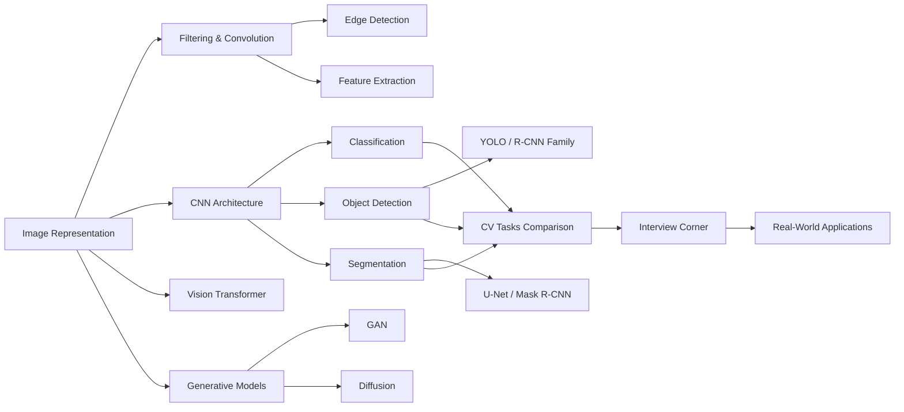
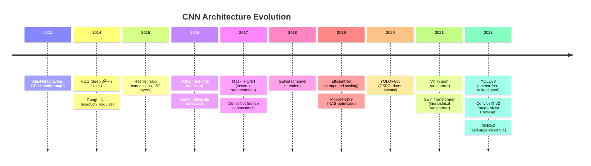

# Chapter 13: Computer Vision

**Previous:** [Chapter 12: Natural Language Processing](12-nlp.md) | **Next:** [Chapter 14: Robotics](14-robotics.md)

## Learning Objectives

By the conclusion of this chapter, the student will be able to:

<!-- Image Gallery -->
<section class="lesson-visuals" aria-label="Visual learning resources">
  <header><span>VISUAL LEARNING</span><h2>See it. Review it. Remember it.</h2></header>
  <a class="lesson-visual-card" href="../../assets/images/lessons/artificial-intelligence/13-computer-vision/handwritten-notes.png" target="_blank" rel="noopener">
    
    <span><strong>Handwritten notes</strong>Condensed notes for deliberate review.</span>
  </a>
  <a class="lesson-visual-card" href="../../assets/images/lessons/artificial-intelligence/13-computer-vision/sticky-notes.png" target="_blank" rel="noopener">
    
    <span><strong>Sticky-note revision</strong>Fast recall prompts for revision.</span>
  </a>
  <a class="lesson-visual-card" href="../../assets/images/lessons/artificial-intelligence/13-computer-vision/visual-explanation.png" target="_blank" rel="noopener">
    
    <span><strong>Visual concept guide</strong>A connected explanation of the key ideas.</span>
  </a>
</section>
<!-- End Image Gallery -->


1. Describe how images are formed and represented as numerical arrays.
2. Implement image filtering operations (blurring, sharpening, edge detection).
3. Compute image gradients and apply the Canny edge detection pipeline.
4. Extract feature descriptors (SIFT, HOG) for object recognition.
5. Explain CNN building blocks (convolution, pooling, fully connected layers).
6. Compare object detection paradigms: YOLO (single-shot) vs R-CNN (two-stage).
7. Differentiate semantic segmentation, instance segmentation, and panoptic segmentation.
8. Understand Vision Transformer architecture and its divergence from CNNs.
9. Describe how diffusion models generate high-quality images from noise.

## Why Computer Vision Matters

**Real-World Analogy → How Humans See vs How Machines "See"**

When you look at a photograph, your brain performs an extraordinary sequence of operations in milliseconds: your retinas capture photons, the optic nerve transmits electrical signals to the primary visual cortex (V1), which detects edges and orientations. Higher cortical areas (V2, V4, IT) progressively assemble these edges into contours, shapes, and finally object identities. You don't "see" pixels → you see meaning.

Computer vision mimics this biological pipeline using mathematics and software:

| Biological Process | Computer Vision Equivalent |
|------------------|--------------------------|
| Photoreceptors capture light | Camera sensor records pixel intensities |
| V1 detects oriented edges | Sobel / Canny edge detection filters |
| V2 groups edges into contours | Contour detection / region grouping |
| IT cortex recognizes objects | CNN classifiers + object detectors |
| Visual memory recalls past objects | Training data + learned weights |

Without computer vision, self-driving cars would be blind, medical X-rays would require purely manual review, smartphone face unlock would be impossible, and augmented reality filters would have nothing to track. CV transforms unstructured pixel data into structured understanding → enabling machines to interpret the visual world as humans do, but at scales and speeds no human can match.

## Chapter at a Glance

| Section | Key Topics | Key Terms |
|---------|-----------|-----------|
| Image Representation | Pixels, color spaces, tensors | RGB, grayscale, H×W×3, normalization |
| Filtering | Convolution, Gaussian, Sobel, median | Kernel, stride, padding, blur |
| Edge Detection | Canny, gradient, non-max suppression | Hysteresis, gradient magnitude |
| Feature Extraction | SIFT, HOG, ORB | Keypoints, descriptors, scale-invariant |
| CNNs | Conv layers, pooling, ReLU, backprop | Feature map, stride, parameter sharing |
| Object Detection | YOLO, Faster R-CNN, SSD | Bounding box, anchor box, IoU, mAP |
| Segmentation | Semantic, instance, U-Net, Mask R-CNN | Pixel-wise, mask, panoptic |
| Vision Transformers | ViT, patch embedding, self-attention | Patch size, positional encoding |
| Generative Models | GAN, Diffusion, Stable Diffusion | Latent space, denoising, FID |

## Chapter Roadmap



## 13.1 Image Representation

**Real-World Analogy → Digital Images as Number Grids**

Think of a grayscale image as a spreadsheet where each cell holds a number between 0 (pure black) and 255 (pure white). A 4×4 grayscale image is simply a 4×4 grid of integers. A color image is three such spreadsheets stacked → one for red, one for green, one for blue. Computer vision algorithms are mathematical operations performed on these number grids.

### 13.1.1 Pixels and Color Spaces


An image is a function $I(x, y)$ mapping spatial coordinates to intensity values. For a grayscale image:

$$I(x, y) \in \{0, 1, \dots, 255\}$$

For a color (RGB) image:

$$I(x, y) = [R(x, y), G(x, y), B(x, y)]^\top$$

**Common color spaces:**

| Color Space | Channels | Use Case |
|-------------|----------|----------|
| RGB | Red, Green, Blue | Display, cameras |
| Grayscale | Luminance only | Edge detection, OCR |
| HSV | Hue, Saturation, Value | Color-based segmentation |
| LAB | Lightness, A (green-red), B (blue-yellow) | Perceptually uniform, color difference |

### 13.1.2 Image as a Tensor


In deep learning frameworks, images are represented as tensors:

- **Shape:** $(C, H, W)$ in PyTorch (channels-first), $(H, W, C)$ in TensorFlow (channels-last)
- **Batch:** $(N, C, H, W)$ for N images processed together
- **Normalization:** Pixel values scaled to $[0, 1]$ or $[-1, 1]$ for stable training

### 13.1.3 Algorithm: Load and Inspect Image


**Step 1:** Read image file from disk.
**Step 2:** Decode into pixel matrix.
**Step 3:** Determine shape (height, width, channels).
**Step 4:** Access specific pixel value at $(x, y)$.
**Step 5:** Convert between color spaces (RGB → Grayscale).
**Step 6:** Normalize pixel values to $[0, 1]$.

**Pseudocode:**
```
FUNCTION load_image(path):
    img ← read_file(path)
    pixels ← decode_to_matrix(img)
    height, width, channels ← pixels.shape
    PRINT "Image size:", width, "×", height, ", channels:", channels
    pixel_val ← pixels[y, x]        // Access pixel at (x, y)
    gray ← rgb_to_grayscale(pixels) // Weighted sum: 0.299R + 0.587G + 0.114B
    normalized ← gray / 255.0       // Scale to [0, 1]
    RETURN normalized
END FUNCTION
```

**Dry Run Trace (4×4 Grayscale Image):**

| Step | Operation | Pixel Grid (4×4) |
|------|-----------|-------------------|
| 0 | Raw pixels | `[[200, 210, 180, 50], [190, 205, 170, 45], [30, 35, 28, 10], [25, 30, 20, 8]]` |
| 1 | Read shape | height=4, width=4, channels=1 |
| 2 | Access (1,2) | I(1,2) = 170 |
| 3 | To grayscale (already gray) | same grid |
| 4 | Normalize ÷255 | `[[0.784, 0.824, 0.706, 0.196], [0.745, 0.804, 0.667, 0.176], [0.118, 0.137, 0.110, 0.039], [0.098, 0.118, 0.078, 0.031]]` |

### 13.1.4 Python Implementation


```python
import cv2
import numpy as np

# Read image
img = cv2.imread('input.jpg')                    # Shape: (H, W, 3) BGR
img_rgb = cv2.cvtColor(img, cv2.COLOR_BGR2RGB)    # Convert BGR → RGB

# Inspect properties
h, w, c = img_rgb.shape
print(f'Dimensions: {w}×{h}, Channels: {c}')

# Access pixel at row=100, col=200
pixel = img_rgb[100, 200]                          # [R, G, B] values

# Convert to grayscale
gray = cv2.cvtColor(img_rgb, cv2.COLOR_RGB2GRAY)   # Shape: (H, W)

# Normalize to [0, 1]
gray_norm = gray.astype(np.float32) / 255.0

print(f'Grayscale shape: {gray.shape}')
print(f'Pixel (100,200): {pixel}, Normalized range: [{gray_norm.min():.3f}, {gray_norm.max():.3f}]')
```

### 13.1.5 Complexity Analysis


| Operation | Time Complexity | Space Complexity | Why |
|-----------|----------------|------------------|-----|
| Load image | $O(H \times W \times C)$ | $O(H \times W \times C)$ | Must read every pixel from disk into memory |
| Color conversion | $O(H \times W)$ | $O(1)$ extra | Weighted sum per pixel, no extra storage proportional to input |
| Normalization | $O(H \times W)$ | $O(1)$ extra | Single divide per pixel, in-place possible |

### 13.1.6 Advantages and Disadvantages


| Advantages | Disadvantages |
|------------|--------------|
| Simple matrix representation works with standard linear algebra | No semantic meaning captured (just raw intensities) |
| Multiple color spaces available for different tasks | RGB is highly correlated → not optimal for all algorithms |
| Tensor format integrates directly with deep learning frameworks | Large images (4K, 8K) require significant memory ($H \times W \times C \times 4$ bytes) |
| Hardware-agnostic (CPU, GPU, TPU all process arrays) | Sensitive to lighting changes at raw pixel level |

### 13.1.7 Edge Cases


| Edge Case | Problem | Mitigation |
|-----------|---------|------------|
| **Different lighting** | Same scene at noon vs dusk produces vastly different pixel values | Use normalized color spaces (LAB, HSV); augment training data |
| **Compression artifacts** | JPEG introduces blocking artifacts that change pixel values | Use higher quality JPEG; apply slight blur before processing |
| **Occlusion** | Part of object hidden; pixel values don't represent full object | Use feature-based methods (SIFT) that work with partial views |
| **Viewpoint change** | Same object from different angles gives different pixel arrangements | Use scale/rotation-invariant features or data augmentation |
| **Sensor noise** | Dark images have shot noise affecting pixel values | Apply Gaussian or median filtering as preprocessing |
| **Heterogeneous input sizes** | Images from different sources have different resolutions | Resize to fixed dimensions; use adaptive pooling in CNNs |

## 13.2 Image Filtering

**Real-World Analogy → Smoothing a Rough Surface**

Imagine running your hand over a rough wooden table. If you press hard and move slowly, your hand glides over the surface → the fine bumps average out. This is a low-pass filter: high-frequency details (bumps) are removed, leaving the smooth overall shape. If you instead trace the edges of the table with your fingernail, you feel the sharp boundary where the table ends → this is a high-pass filter, emphasizing rapid changes (edges).

Image filtering applies a small matrix called a **kernel** (or filter) across every pixel of the image. The kernel defines how each pixel's new value is computed from its neighbors.

### 13.2.1 Convolution Operation


The fundamental operation in image filtering is **convolution**. Given an input image $I$ and a kernel $K$ of size $k \times k$:

$$(I * K)[i, j] = \sum_{m=-a}^{a} \sum_{n=-b}^{b} I[i+m, j+n] \cdot K[m+a, n+b]$$

where $a = \lfloor k/2 \rfloor$ and $b = \lfloor k/2 \rfloor$.

### 13.2.2 Algorithm: 2D Convolution


**Step 1:** Define kernel $K$ (e.g., 3×3 Gaussian blur kernel).
**Step 2:** Flip kernel 180° (convolution requires kernel reversal; correlation does not).
**Step 3:** Slide kernel over every pixel position in the input image.
**Step 4:** At each position, multiply kernel values with overlapping pixel values.
**Step 5:** Sum all products → output pixel value.
**Step 6:** Handle borders via padding (zero, replicate, reflect) or truncation.

**Pseudocode:**
```
FUNCTION convolve2d(image[1..H][1..W], kernel[1..k][1..k]):
    pad ← floor(k / 2)
    padded ← ZERO_PAD(image, pad)     // Add border of zeros
    output ← new_array[H][W]

    FOR y ← 1 TO H:
        FOR x ← 1 TO W:
            sum ← 0
            FOR i ← 1 TO k:
                FOR j ← 1 TO k:
                    sum ← sum + padded[y + i - 1][x + j - 1] * kernel[i][j]
                END FOR
            END FOR
            output[y][x] ← sum
        END FOR
    END FOR

    RETURN output
END FUNCTION
```

**Dry Run Trace → 3×3 Image, 2×2 Kernel (No Padding):**

| Step | Region | Computation | Result |
|------|--------|-------------|--------|
| Input image (3×3) | All pixels | `[[5, 3, 1], [2, 8, 4], [7, 6, 9]]` | → |
| Kernel (2×2) | → | `[[1, 0], [0, -1]]` | → |
| (1,1) | Top-left 2×2 | 5×1 + 3×0 + 2×0 + 8×(-1) = 5 - 8 | **-3** |
| (1,2) | Top-right 2×2 | 3×1 + 1×0 + 8×0 + 4×(-1) = 3 - 4 | **-1** |
| (2,1) | Bottom-left 2×2 | 2×1 + 8×0 + 7×0 + 6×(-1) = 2 - 6 | **-4** |
| (2,2) | Bottom-right 2×2 | 8×1 + 4×0 + 6×0 + 9×(-1) = 8 - 9 | **-1** |
| Output (2×2) | → | `[[-3, -1], [-4, -1]]` | Edge-enhanced |

### 13.2.3 Common Filters


| Filter | Kernel | Effect |
|--------|--------|--------|
| **Gaussian Blur** | $\frac{1}{16}\begin{bmatrix}1&2&1\\2&4&2\\1&2&1\end{bmatrix}$ | Smooths noise, removes high frequencies |
| **Sobel X** | $\begin{bmatrix}-1&0&1\\-2&0&2\\-1&0&1\end{bmatrix}$ | Vertical edge detection |
| **Sobel Y** | $\begin{bmatrix}-1&-2&-1\\0&0&0\\1&2&1\end{bmatrix}$ | Horizontal edge detection |
| **Laplacian** | $\begin{bmatrix}0&-1&0\\-1&4&-1\\0&-1&0\end{bmatrix}$ | Second derivative → detects edges in all directions |
| **Sharpen** | $\begin{bmatrix}0&-1&0\\-1&5&-1\\0&-1&0\end{bmatrix}$ | Amplifies high frequencies |
| **Median** | → (non-linear) | Replaces pixel with median of neighbors; excellent for salt-and-pepper noise |

### 13.2.4 Python Implementation


```python
import cv2
import numpy as np

# ===== Gaussian Blur =====
img = cv2.imread('input.jpg', cv2.IMREAD_GRAYSCALE)
gaussian = cv2.GaussianBlur(img, (5, 5), sigmaX=1.5)

# ===== Manual 3×3 Convolution =====
def convolve_manual(image, kernel):
    k_h, k_w = kernel.shape
    pad_h, pad_w = k_h // 2, k_w // 2
    padded = np.pad(image, ((pad_h, pad_h), (pad_w, pad_w)), mode='constant')
    output = np.zeros_like(image)
    for y in range(image.shape[0]):
        for x in range(image.shape[1]):
            region = padded[y:y + k_h, x:x + k_w]
            output[y, x] = np.sum(region * kernel)
    return output

sobel_x = np.array([[-1, 0, 1],
                     [-2, 0, 2],
                     [-1, 0, 1]], dtype=np.float32)
edges_x = convolve_manual(img, sobel_x)

# ===== Median Filter =====
median = cv2.medianBlur(img, 5)            # 5×5 kernel → removes salt-and-pepper

# ===== Sharpening =====
sharpen_k = np.array([[0, -1, 0],
                      [-1, 5, -1],
                      [0, -1, 0]], dtype=np.float32)
sharpened = cv2.filter2D(img, -1, sharpen_k)

# Display results
cv2.imshow('Original', img)
cv2.imshow('Gaussian Blur', gaussian)
cv2.imshow('Sobel X', np.abs(edges_x).astype(np.uint8))
cv2.imshow('Sharpened', sharpened)
cv2.waitKey(0)
cv2.destroyAllWindows()
```

### 13.2.5 Complexity Analysis


| Operation | Time Complexity | Space Complexity | Why |
|-----------|----------------|------------------|-----|
| Convolution (naive) | $O(H \times W \times k^2)$ | $O(H \times W)$ | Every pixel requires $k^2$ multiply-adds |
| Gaussian blur (separable) | $O(H \times W \times k)$ | $O(H \times W)$ | 2D Gaussian = 1D horizontal × 1D vertical; $k$ vs $k^2$ |
| Median filter | $O(H \times W \times k^2 \log k)$ | $O(k^2)$ per pixel | Sorting the window requires $k^2 \log k$ comparisons |
| FFT-based convolution | $O(HW \log HW)$ | $O(HW)$ | FFT converts spatial convolution to frequency-domain multiplication |

**Key insight:** For small kernels ($k \leq 7$), naive convolution is faster due to FFT overhead. For large kernels ($k \geq 15$), FFT-based convolution wins.

### 13.2.6 Advantages and Disadvantages


| Advantages | Disadvantages |
|------------|--------------|
| Simple mathematical operation, easy to implement | Naive $O(HWk^2)$ is slow for large kernels |
| Highly parallelizable on GPU | Fixed kernel = uniform treatment across entire image |
| Separable filters reduce cost significantly | Blurring removes fine details irreversibly |
| Well-understood frequency-domain properties | Non-linear filters (median) break nice mathematical properties |
| Wide hardware support (OpenCV, GPU, SIMD) | Boundary handling requires approximation (padding) |

### 13.2.7 Edge Cases


| Edge Case | Problem | Mitigation |
|-----------|---------|------------|
| **Image borders** | Kernel extends beyond image boundaries | Use padding (zero, reflect, replicate, wrap) |
| **Salt-and-pepper noise** | Linear blur spreads noise rather than removing it | Use median filter (non-linear) |
| **High-frequency textures** | Filtering removes texture that may be informative | Use guided filter or bilateral filter (edge-preserving) |
| **Saturation** | Negative values clipped to 0; overflow above 255 | Normalize output to valid range after convolution |
| **Color images** | Applying grayscale filter to each channel independently | Convert to HSV or LAB and filter luminance only |

## 13.3 Edge Detection

**Real-World Analogy → Finding the Outline in a Coloring Book**

When you color inside the lines of a coloring book, you first identify the boundaries → the dark lines separating one region from another. Your brain detects these boundaries by noticing sudden changes: the ink line is much darker than the paper. Edge detection algorithms do the same thing mathematically → they locate pixels where image intensity changes abruptly, indicating object boundaries, surface discontinuities, or depth changes.

### 13.3.1 Image Gradients


The gradient of an image $I$ at pixel $(x, y)$ is:

$$\nabla I(x, y) = \begin{bmatrix} \frac{\partial I}{\partial x} \\ \frac{\partial I}{\partial y} \end{bmatrix}$$

- **Gradient magnitude:** $|\nabla I| = \sqrt{(\frac{\partial I}{\partial x})^2 + (\frac{\partial I}{\partial y})^2}$ → Strength of the edge.
- **Gradient direction:** $\theta = \text{atan2}(\frac{\partial I}{\partial y}, \frac{\partial I}{\partial x})$ → Orientation of the edge (perpendicular to edge direction).

### 13.3.2 Algorithm: Canny Edge Detector


The Canny detector (1986) remains the gold standard for edge detection. It is a multi-stage pipeline:

**Step 1 → Gaussian Smoothing:** Blur the image with a Gaussian kernel to reduce noise and spurious gradients.
**Step 2 → Compute Gradients:** Apply Sobel operators to compute $G_x$ and $G_y$ (gradients in x and y directions).
**Step 3 → Compute Magnitude and Direction:** $M = \sqrt{G_x^2 + G_y^2}$, $\theta = \text{atan2}(G_y, G_x)$.
**Step 4 → Non-Maximum Suppression (NMS):** For each pixel, check if it is the maximum along the gradient direction. Keep only local maxima → this thins edges to single-pixel width.
**Step 5 → Double Thresholding:** Classify each pixel as strong ($M > T_{\text{high}}$), weak ($T_{\text{low}} &lt; M \leq T_{\text{high}}$), or suppressed ($M \leq T_{\text{low}}$).
**Step 6 → Edge Tracking by Hysteresis:** Keep weak pixels only if they are connected to strong pixels. This removes weak edges from noise while preserving genuine edges that happen to have lower contrast.

**Pseudocode:**
```
FUNCTION canny_edge(image, sigma, T_low, T_high):
    // Step 1: Smooth
    blurred ← gaussian_blur(image, sigma)

    // Step 2: Compute gradients
    Gx ← sobel_x(blurred)
    Gy ← sobel_y(blurred)

    // Step 3: Magnitude and direction
    M ← sqrt(Gx^2 + Gy^2)
    theta ← atan2(Gy, Gx)
    theta ← QUANTIZE(theta)              // Round to 0°, 45°, 90°, 135°

    // Step 4: Non-maximum suppression
    suppressed ← ZEROS_LIKE(M)
    FOR each pixel (y, x):
        neighbors ← GET_NEIGHBORS_ALONG_GRADIENT(M, y, x, theta[y][x])
        IF M[y][x] ≥ max(neighbors):
            suppressed[y][x] ← M[y][x]
        END IF
    END FOR

    // Step 5: Double threshold
    strong ← suppressed > T_high
    weak ← (suppressed > T_low) AND (suppressed ≤ T_high)

    // Step 6: Edge tracking by hysteresis
    edges ← strong
    FOR each weak pixel:
        IF any neighbor in 3×3 is strong:
            edges[y][x] ← True
        END IF
    END FOR

    RETURN edges
END FUNCTION
```

**Dry Run Trace → 5×5 Gradient Magnitude with NMS:**

Assume gradient magnitudes ($M$) and quantized directions ($\theta$) for a 5×5 region:

| Step | Operation | 5×5 Grid |
|------|-----------|----------|
| 0 | Gradient magnitude $M$ | $\begin{bmatrix} 10 & 12 & 40 & 42 & 15 \\ 15 & 18 & 95 & 88 & 20 \\ 12 & 16 & \mathbf{120} & 90 & 18 \\ 8 & 10 & 85 & 78 & 14 \\ 5 & 8 & 30 & 28 & 10 \end{bmatrix}$ |
| 0 | Quantized $\theta$ (0=horizontal) | All pixels $\theta = 0$ (edge running N-S, gradient E-W) |
| 1 | NMS check at (2,2)=120 | Compare with (2,1)=16 and (2,3)=90. 120 ≥ max(16, 90) ✅ |
| 2 | NMS check at (2,3)=90 | Compare with (2,2)=120 and (2,4)=18. 90 &lt; 120 ❌ → suppress |
| 3 | NMS check at (1,2)=95 | Compare with (1,1)=18 and (1,3)=88. 95 ≥ 88 ✅ |
| 4 | After NMS | $\begin{bmatrix} 0 & 0 & 40 & 0 & 0 \\ 0 & 0 & 95 & 0 & 0 \\ 0 & 0 & 120 & 0 & 0 \\ 0 & 0 & 85 & 0 & 0 \\ 0 & 0 & 30 & 0 & 0 \end{bmatrix}$ (single-pixel vertical edge) |
| 5 | Double threshold: $T_{\text{low}}=50, T_{\text{high}}=100$ | Strong: 120 ($>$100). Weak: 95, 85 ($50&lt;$...$≤100$). Suppressed: 40, 30 |
| 6 | Hysteresis: 95 connected to 120? YES. 85 connected to 120? YES. | Final edge: 95, 120, 85 retained |

### 13.3.3 Python Implementation


```python
import cv2
import numpy as np

def canny_from_scratch(image_path, sigma=1.0, low_thresh=50, high_thresh=100):
    img = cv2.imread(image_path, cv2.IMREAD_GRAYSCALE).astype(np.float32)

    # Step 1: Gaussian smoothing
    kernel_size = int(2 * np.ceil(3 * sigma) + 1)
    blurred = cv2.GaussianBlur(img, (kernel_size, kernel_size), sigma)

    # Step 2: Sobel gradients
    Gx = cv2.Sobel(blurred, cv2.CV_64F, 1, 0, ksize=3)
    Gy = cv2.Sobel(blurred, cv2.CV_64F, 0, 1, ksize=3)

    # Step 3: Magnitude and direction
    mag = np.sqrt(Gx**2 + Gy**2)
    theta = np.arctan2(Gy, Gx) * 180.0 / np.pi
    theta = (theta + 180) % 180  # Map to [0, 180)

    # Step 4: Non-maximum suppression
    nms = np.zeros_like(mag)
    for y in range(1, mag.shape[0] - 1):
        for x in range(1, mag.shape[1] - 1):
            angle = theta[y, x]
            if (0 <= angle < 22.5) or (157.5 <= angle <= 180):
                n1, n2 = mag[y, x-1], mag[y, x+1]       # horizontal
            elif 22.5 <= angle < 67.5:
                n1, n2 = mag[y-1, x+1], mag[y+1, x-1]   # 45° diagonal
            elif 67.5 <= angle < 112.5:
                n1, n2 = mag[y-1, x], mag[y+1, x]       # vertical
            else:
                n1, n2 = mag[y-1, x-1], mag[y+1, x+1]   # 135° diagonal
            if mag[y, x] >= n1 and mag[y, x] >= n2:
                nms[y, x] = mag[y, x]

    # Step 5 & 6: Double threshold + hysteresis
    strong = 255
    weak = 75
    edges = np.zeros_like(nms, dtype=np.uint8)
    strong_y, strong_x = np.where(nms > high_thresh)
    weak_y, weak_x = np.where((nms >= low_thresh) & (nms <= high_thresh))
    edges[strong_y, strong_x] = strong
    edges[weak_y, weak_x] = weak

    # Hysteresis: keep weak if connected to strong
    for y in range(1, edges.shape[0] - 1):
        for x in range(1, edges.shape[1] - 1):
            if edges[y, x] == weak:
                if np.any(edges[y-1:y+2, x-1:x+2] == strong):
                    edges[y, x] = strong
                else:
                    edges[y, x] = 0

    return edges

# ===== OpenCV built-in (production use) =====
img = cv2.imread('input.jpg', cv2.IMREAD_GRAYSCALE)
edges_cv = cv2.Canny(img, threshold1=50, threshold2=100)

cv2.imshow('Canny from scratch', canny_from_scratch('input.jpg'))
cv2.imshow('Canny OpenCV', edges_cv)
cv2.waitKey(0)
cv2.destroyAllWindows()
```

### 13.3.4 Complexity Analysis


| Stage | Time Complexity | Why |
|-------|----------------|-----|
| Gaussian blur | $O(H \times W \times k)$ | Separable 1D convolution |
| Sobel gradients | $O(H \times W)$ | Two 3×3 convolutions |
| NMS | $O(H \times W)$ | Single pass, constant neighbors |
| Double threshold | $O(H \times W)$ | Single pass |
| Hysteresis | $O(H \times W)$ | Single pass with 3×3 neighbor check |
| **Total** | **$O(H \times W \times k)$** | Dominated by Gaussian blur |

### 13.3.5 Advantages and Disadvantages


| Advantages | Disadvantages |
|------------|--------------|
| Low error rate → good detection of real edges | Sensitive to threshold parameters ($T_{\text{low}}$, $T_{\text{high}}$) |
| Well-localized → detected edges close to true edges | Gaussian blur may remove fine edge details |
| Single-pixel edge response (NMS ensures minimal response) | Slower than simple gradient-based methods (Sobel alone) |
| Robust to noise (Gaussian pre-filtering) | Struggles with very noisy images regardless of tuning |

### 13.3.6 Edge Cases


| Edge Case | Problem | Mitigation |
|-----------|---------|------------|
| **Occlusion boundaries** | True object edges may have low contrast where objects overlap | Lower $T_{\text{high}}$; use multi-scale Canny |
| **Texture vs edges** | Fine texture produces many spurious edges | Increase Gaussian $\sigma$ to suppress texture |
| **Variable lighting** | Gradient magnitudes vary across the image | Use adaptive thresholding instead of fixed $T_{\text{low}}$, $T_{\text{high}}$ |
| **Noisy images** | Gaussian smoothing may not eliminate heavy noise | Apply stronger blur; use bilateral filter for edge-preserving smoothing |
| **Thick edges after gradient** | Sobel produces 2-3 pixel wide edges | NMS step is critical → cannot be skipped |

## 13.4 Feature Extraction

**Real-World Analogy → Detecting Landmarks in a Familiar City**

When you navigate a city, you recognize locations by distinctive landmarks → a tall clock tower, a curved bridge, a colorful mural. Even if the weather changes (different lighting) or you approach from a different street (different viewpoint), you recognize the landmark because its distinctive structure remains. Feature extraction in CV does the same: it identifies "interesting" points in an image that are distinctive, repeatable, and invariant to transformations.

### 13.4.1 SIFT (Scale-Invariant Feature Transform)


SIFT (Lowe, 2004) detects keypoints that are invariant to scale, rotation, and partially invariant to illumination and viewpoint changes.

**Algorithm Steps:**

**Step 1 → Scale-Space Construction:** Build a pyramid of progressively blurred images. For each octave, generate $S$ scales using Gaussian blur with increasing $\sigma$.
**Step 2 → Difference of Gaussian (DoG):** Subtract adjacent blurred images to approximate the Laplacian of Gaussian → this highlights edges and corners at multiple scales.
**Step 3 → Keypoint Localization:** Find local extrema in the DoG pyramid. Each candidate keypoint is compared with 8 neighbors at the same scale and 9 neighbors in each adjacent scale (26 total).
**Step 4 → Keypoint Refinement:** Interpolate to sub-pixel precision. Remove low-contrast keypoints and eliminate edge responses (using Hessian ratio).
**Step 5 → Orientation Assignment:** Compute gradient magnitude and direction around each keypoint. Build a 36-bin orientation histogram. Assign the dominant orientation (peak) to the keypoint.
**Step 6 → Descriptor Computation:** Extract a $16 \times 16$ window around each keypoint, divide into $4 \times 4$ sub-blocks, compute 8-bin gradient histogram per block. Concatenate → $4 \times 4 \times 8 = 128$-dimensional descriptor.

**Pseudocode:**
```
FUNCTION sift_keypoints(image):
    // Step 1-2: Build DoG pyramid
    pyramid ← []
    FOR octave ← 1 TO num_octaves:
        scale_img ← RESIZE(image, 1/2^(octave-1))
        dog_images ← []
        FOR s ← 1 TO num_scales:
            blurred ← gaussian_blur(scale_img, sigma * k^(s-1))
            IF s > 1:
                dog ← blurred - prev_blurred
                APPEND dog TO dog_images
            prev_blurred ← blurred
        APPEND dog_images TO pyramid

    // Step 3: Find extrema
    keypoints ← []
    FOR each dog in pyramid:
        FOR each pixel (y, x):
            IF pixel is max OR min among 26 neighbors:
                APPEND {x, y, scale, octave} TO keypoints

    // Step 4: Refine → sub-pixel, remove low contrast / edges
    keypoints ← SUB_PIXEL_REFINE(keypoints)
    keypoints ← FILTER_CONTRAST(keypoints, min_contrast)
    keypoints ← FILTER_EDGE(keypoints, max_ratio)

    // Step 5: Assign orientation
    FOR each kp in keypoints:
        hist ← [0...35]    // 36 bins, each = 10°
        FOR each pixel in 4.5σ neighborhood:
            weight ← magnitude * gaussian_weight(distance)
            bin ← FLOOR(angle / 10)
            hist[bin] ← hist[bin] + weight
        kp.orientation ← MAX_BIN(hist)

    // Step 6: Build descriptor (128-d vector)
    FOR each kp in keypoints:
        desc ← []
        FOR each 4×4 sub-block in 16×16 window:
            hist_8bin ← [0...7]
            FOR each pixel in sub-block:
                bin ← FLOOR(angle / 45)    // 45° per bin
                hist_8bin[bin] ← hist_8bin[bin] + magnitude
            APPEND hist_8bin TO desc
        NORMALIZE(desc)
        CLIP(desc, max_val=0.2)     // Reduce illumination effects
        NORMALIZE(desc)
        kp.descriptor ← desc

    RETURN keypoints, descriptors   // 128-dimensional per keypoint
END FUNCTION
```

**Dry Run Trace → Orientation Assignment for One Keypoint:**

Assume a keypoint at scale $\sigma = 1.6$ and a $4.5\sigma = 7.2$ pixel neighborhood:

| Step | Operation | Values |
|------|-----------|--------|
| 0 | 7×7 gradient magnitudes around keypoint at (10, 10) | $\begin{bmatrix}0&2&5&8&6&3&1\\2&8&15&20&14&5&2\\5&20&40&\mathbf{50}&35&12&3\\8&25&45&55&40&15&5\\6&18&35&42&30&10&3\\3&8&12&15&10&4&1\\1&2&3&5&3&1&0\end{bmatrix}$ |
| 0 | Gradient directions (quantized to 8 bins, 0-315°, each 45°) | $\begin{bmatrix}0&0&45&90&45&0&0\\0&45&90&90&90&45&0\\0&90&90&90&90&45&0\\45&90&90&90&90&45&45\\45&90&90&90&90&45&45\\0&45&90&90&90&45&0\\0&0&45&45&45&0&0\end{bmatrix}$ |
| 1 | Build 36-bin orientation histogram weighted by magnitude × Gaussian | Bin 90° gets contributions from pixels with direction~90°: 50+55+45+40+35+42 ≈ **267** |
| 2 | Find peak | Peak at 90° (vertical gradient = horizontal edge). Keypoint orientation = 90° |
| 3 | Assign descriptor | 16 sub-blocks × 8 bins = 128 values. First sub-block (top-left 4×4): `[0, 2, 8, 15, 6, 1, 0, 0]` |
| 4 | Normalize + clip | Unit vector with each element clipped to ≤0.2 |

### 13.4.2 Python Implementation


```python
import cv2
import numpy as np

# ===== SIFT with OpenCV =====
img = cv2.imread('input.jpg', cv2.IMREAD_GRAYSCALE)
sift = cv2.SIFT_create()                        # Default parameters
keypoints, descriptors = sift.detectAndCompute(img, mask=None)

print(f'Detected {len(keypoints)} keypoints')
print(f'Descriptor shape: {descriptors.shape}')  # (N, 128)

# Draw keypoints
img_kp = cv2.drawKeypoints(img, keypoints, None, flags=cv2.DRAW_MATCHES_FLAGS_DRAW_RICH_KEYPOINTS)
cv2.imshow('SIFT Keypoints', img_kp)
cv2.waitKey(0)
cv2.destroyAllWindows()

# ===== Feature Matching Between Two Images =====
img2 = cv2.imread('input2.jpg', cv2.IMREAD_GRAYSCALE)
kp2, desc2 = sift.detectAndCompute(img2, None)

bf = cv2.BFMatcher(cv2.NORM_L2, crossCheck=True)
matches = bf.match(descriptors, desc2)
matches = sorted(matches, key=lambda x: x.distance)

# Draw top 50 matches
img_matches = cv2.drawMatches(img, keypoints, img2, kp2, matches[:50], None,
                               flags=cv2.DrawMatchesFlags_NOT_DRAW_SINGLE_POINTS)
cv2.imshow('SIFT Matches', img_matches)
cv2.waitKey(0)
cv2.destroyAllWindows()

# ===== HOG Descriptor (for pedestrian detection) =====
hog = cv2.HOGDescriptor()
hog.setSVMDetector(cv2.HOGDescriptor_getDefaultPeopleDetector())
img_color = cv2.imread('street.jpg')
boxes, weights = hog.detectMultiScale(img_color, winStride=(8, 8))
for (x, y, w, h) in boxes:
    cv2.rectangle(img_color, (x, y), (x + w, y + h), (0, 255, 0), 2)
cv2.imshow('HOG Pedestrian Detection', img_color)
cv2.waitKey(0)
cv2.destroyAllWindows()
```

### 13.4.3 Complexity Analysis


| Method | Time Complexity | Space Complexity | Why |
|--------|----------------|------------------|-----|
| SIFT detection | $O(H \times W \times S \times O)$ | $O(H \times W)$ pyramid | Each scale-octave level processed; $S$ = scales, $O$ = octaves |
| SIFT descriptor | $O(N \times 128)$ | $O(N \times 128)$ | $N$ keypoints, each with 128-d normalized vector |
| HOG | $O(H \times W)$ | $O(H \times W)$ | Single-pass gradient computation + block normalization |
| Feature matching (brute force) | $O(N_1 \times N_2 \times D)$ | $O(D)$ per match | $N_1$, $N_2$ = keypoints, $D$ = descriptor dimension |

### 13.4.4 Advantages and Disadvantages


| Advantages | Disadvantages |
|------------|--------------|
| **Scale invariant** → works at multiple resolutions | Computationally expensive (patented, slow) |
| **Rotation invariant** → orientation normalization | 128-d descriptor is memory-heavy for large datasets |
| **Robust to illumination changes** → gradient-based, intensity-normalized | Not robust to extreme affine transformations |
| **Highly distinctive** → 128-d vector provides strong matching | SIFT was patented (US expired 2020; free now) |
| Occlusion-tolerant → works with partial views | Requires textured regions; fails on blank walls |

### 13.4.5 Edge Cases


| Edge Case | Problem | Mitigation |
|-----------|---------|------------|
| **Low texture** (e.g., blank wall) | No keypoints detected (no distinctive features) | Use global descriptors (HOG, GIST) instead |
| **Extreme blur** | Keypoints shift; descriptor becomes noisy | Deblur before feature extraction |
| **Repeated patterns** (e.g., grid) | Many similar keypoints cause matching ambiguity | Use ratio test (Lowe's 0.7 threshold) |
| **Large viewpoint change** (>50°) | SIFT's affine invariance is limited | Use ASIFT (affine-SIFT) or learned features (SuperPoint) |
| **Compression artifacts** | JPEG blocks create false keypoints | Slight Gaussian blur before detection |

## 13.5 Convolutional Neural Networks

**Real-World Analogy → Hierarchical Vision in the Brain**

The human visual cortex processes images hierarchically: V1 detects simple edges and oriented bars, V2 groups these into contours and simple shapes, V4 recognizes more complex features like object parts, and the IT cortex puts it all together to recognize complete objects (a face, a car, a dog).

CNNs mirror this hierarchy exactly:
- **Early layers** detect edges, corners, color blobs
- **Middle layers** detect patterns like eyes, wheels, windows
- **Late layers** detect complete objects or object parts

### 13.5.1 CNN Building Blocks


**Convolutional Layer:** A learnable filter bank slides over the input, computing dot products at every position.

Given input $X \in \mathbb{R}^{H \times W \times C_{\text{in}}}$ and filter $W \in \mathbb{R}^{k \times k \times C_{\text{in}} \times C_{\text{out}}}$:

$$Y[i, j, o] = \sum_{m=0}^{k-1} \sum_{n=0}^{k-1} \sum_{c=0}^{C_{\text{in}}-1} X[i+m, j+n, c] \cdot W[m, n, c, o] + b_o$$

**Output size formula:**
Given input size $W_{\text{in}}$, kernel size $k$, padding $p$, stride $s$:

$$W_{\text{out}} = \left\lfloor \frac{W_{\text{in}} - k + 2p}{s} \right\rfloor + 1$$

**Activation Function (ReLU):** $f(x) = \max(0, x)$ → introduces non-linearity, mitigates vanishing gradient.

**Pooling Layer:** Reduces spatial dimensions. Max pooling selects the maximum value in each $k \times k$ window. Average pooling computes the mean.

**Fully Connected Layer:** Every input neuron connects to every output neuron with a learned weight.

**Dropout:** During training, randomly set a fraction $p$ of neurons to zero → prevents co-adaptation, acts as regularization.

### 13.5.2 Algorithm: Forward Pass Through a CNN


**Step 1:** Input image $X$ (e.g., $224 \times 224 \times 3$).
**Step 2:** Apply $C_1$ convolution (filters: $96$, $11\times11$, stride $4$, pad $0$). Output: $55 \times 55 \times 96$.
**Step 3:** Apply ReLU activation.
**Step 4:** Apply max pooling ($3\times3$, stride $2$). Output: $27 \times 27 \times 96$.
**Step 5:** Apply $C_2$ convolution ($256$ filters, $5\times5$, pad $2$). Output: $27 \times 27 \times 256$.
**Step 6:** Apply ReLU + Max Pool. Output: $13 \times 13 \times 256$.
**Step 7:** Apply $C_3$-$C_5$ convolutions + ReLU + Pooling progressively.
**Step 8:** Flatten 3D feature maps to 1D vector.
**Step 9:** Apply fully connected layers ($4096 \rightarrow 4096 \rightarrow 1000$).
**Step 10:** Apply Softmax: $P(y=i | x) = \frac{e^{z_i}}{\sum_j e^{z_j}}$ for 1000-class probabilities.

**Pseudocode:**
```
FUNCTION cnn_forward(X, layers):
    current ← X

    FOR each conv_layer in layers:
        // 2D convolution with learned weights W and bias b
        Z ← convolve2d(current, conv_layer.W) + conv_layer.b
        A ← relu(Z)
        current ← max_pool(A, pool_size=2, stride=2)

    flat ← FLATTEN(current)

    FOR each fc_layer in layers.fc:
        Z ← flat @ fc_layer.W + fc_layer.b
        A ← relu(Z)                    // Or softmax for the last layer
        flat ← A

    probs ← softmax(flat)

    RETURN probs                       // Shape: (1, 1000)
END FUNCTION
```

**Dry Run Trace → Simple 1-Layer CNN on a 4×4 Input:**

| Step | Operation | 4×4 Grid / Value |
|------|-----------|------------------|
| 0 | Input image | $\begin{bmatrix}1&2&0&1\\0&1&2&1\\2&1&0&0\\1&2&1&1\end{bmatrix}$ |
| 0 | Filter $W$ (2×2) | $\begin{bmatrix}1&0\\-1&1\end{bmatrix}$, bias = 0 |
| 1 | Convolve at (0,0) | $1(1) + 2(0) + 0(-1) + 1(1) = 2$ |
| 2 | Convolve at (0,1) | $2(1) + 0(0) + 1(-1) + 2(1) = 3$ |
| 3 | Convolve at (1,0) | $0(1) + 1(0) + 2(-1) + 1(1) = -1$ |
| 4 | Convolve at (1,1) | $1(1) + 2(0) + 1(-1) + 0(1) = 0$ |
| 5 | Feature map (2×2) | $\begin{bmatrix}2&3\\-1&0\end{bmatrix}$ |
| 6 | ReLU | $\begin{bmatrix}2&3\\0&0\end{bmatrix}$ |
| 7 | Max pool (2×2) | $3$ (single value → the maximum of the 2×2 ReLU output) |

### 13.5.3 Python Implementation (PyTorch)


```python
import torch
import torch.nn as nn
import torch.nn.functional as F
import torchvision
import torchvision.transforms as transforms
from torch.utils.data import DataLoader

# ===== Simple CNN for CIFAR-10 =====
class SimpleCNN(nn.Module):
    def __init__(self, num_classes=10):
        super().__init__()
        self.conv1 = nn.Conv2d(in_channels=3, out_channels=32, kernel_size=3, padding=1)
        self.bn1   = nn.BatchNorm2d(32)
        self.conv2 = nn.Conv2d(32, 64, kernel_size=3, padding=1)
        self.bn2   = nn.BatchNorm2d(64)
        self.conv3 = nn.Conv2d(64, 128, kernel_size=3, padding=1)
        self.bn3   = nn.BatchNorm2d(128)
        self.pool  = nn.MaxPool2d(kernel_size=2, stride=2)
        self.fc1   = nn.Linear(128 * 4 * 4, 256)
        self.fc2   = nn.Linear(256, num_classes)
        self.drop  = nn.Dropout(0.5)

    def forward(self, x):
        # Input: (B, 3, 32, 32)
        x = self.pool(F.relu(self.bn1(self.conv1(x))))   # (B, 32, 16, 16)
        x = self.pool(F.relu(self.bn2(self.conv2(x))))   # (B, 64, 8, 8)
        x = self.pool(F.relu(self.bn3(self.conv3(x))))   # (B, 128, 4, 4)
        x = x.view(x.size(0), -1)                         # (B, 2048)
        x = F.relu(self.fc1(self.drop(x)))                # (B, 256)
        x = self.fc2(x)                                   # (B, 10)
        return x

# ===== Training Loop =====
device = torch.device('cuda' if torch.cuda.is_available() else 'cpu')
model = SimpleCNN().to(device)
criterion = nn.CrossEntropyLoss()
optimizer = torch.optim.Adam(model.parameters(), lr=0.001)

transform = transforms.Compose([
    transforms.ToTensor(),
    transforms.Normalize((0.5, 0.5, 0.5), (0.5, 0.5, 0.5))
])
trainset = torchvision.datasets.CIFAR10(root='./data', train=True, download=True, transform=transform)
trainloader = DataLoader(trainset, batch_size=64, shuffle=True, num_workers=2)

for epoch in range(10):
    running_loss = 0.0
    for images, labels in trainloader:
        images, labels = images.to(device), labels.to(device)
        optimizer.zero_grad()
        outputs = model(images)
        loss = criterion(outputs, labels)
        loss.backward()
        optimizer.step()
        running_loss += loss.item()
    print(f'Epoch {epoch+1}, Loss: {running_loss/len(trainloader):.4f}')

# ===== Inference =====
model.eval()
with torch.no_grad():
    sample = torch.randn(1, 3, 32, 32).to(device)
    pred = model(sample)
    class_id = pred.argmax(dim=1).item()
    print(f'Predicted class: {class_id}')
```

### 13.5.4 Complexity Analysis


| Layer Type | Parameters | FLOPs for $224\times224\times3$ Input | Why |
|------------|-----------|--------------------------------------|-----|
| Conv (11×11, 96 filters, s=4) | $11^2 \times 3 \times 96 + 96 = 34,944$ | $55^2 \times 11^2 \times 3 \times 96 \approx 105M$ | Each output pixel requires $k^2 \times C_{\text{in}}$ multiply-accumulate |
| Conv (3×3, 256 filters, s=1, pad=1) | $3^2 \times 96 \times 256 + 256 = 221,440$ | $56^2 \times 3^2 \times 96 \times 256 \approx 693M$ | High spatial resolution + many filters |
| Max Pool (2×2, s=2) | 0 | $56^2 \times 96 \times 4$ (comparisons) | No learned parameters |
| FC (4096→4096) | $4096^2 + 4096 = 16.8M$ | $4096^2 \approx 16.8M$ | Parameters dominate in dense layers |

**Key insight:** Parameter count is dominated by fully connected layers, while FLOPs are dominated by early convolutional layers (high resolution × many filters).

### 13.5.5 Advantages and Disadvantages


| Advantages | Disadvantages |
|------------|--------------|
| **Parameter sharing** → one filter across entire image drastically reduces parameters vs fully connected | Requires large labeled datasets for good generalization |
| **Translation invariance** → learned features work regardless of position in image | Computationally expensive to train (days/weeks on GPU) |
| **Hierarchical features** → simple→complex feature learning automatically | Black-box → difficult to interpret what each layer learns |
| **Robust to spatial distortions** → pooling provides local translation invariance | Sensitive to adversarial examples (small pixel perturbations cause misclassification) |
| Mature ecosystem (PyTorch, TensorFlow, JAX) | Less sample-efficient than Vision Transformers with large data |

### 13.5.6 Edge Cases


| Edge Case | Problem | Mitigation |
|-----------|---------|------------|
| **Occlusion** | Object partially hidden → features missing | Use data augmentation (random erasing); ensemble models |
| **Adversarial perturbations** | Invisible pixel changes flip prediction | Adversarial training; input preprocessing (JPEG compression) |
| **Domain shift** | Training on photos, testing on sketches | Domain adaptation; fine-tune on target domain |
| **Class imbalance** | Some classes have few training examples | Weighted loss; oversampling; focal loss |
| **Small objects** | Objects occupy few pixels; detail lost after pooling | Use feature pyramid networks (FPN); avoid aggressive early pooling |
| **Rotation** | CNN conv layers are not inherently rotation invariant | Data augmentation (random rotation); group-equivariant CNNs |

## 13.6 Object Detection

**Real-World Analogy → A Security Guard Scanning a Crowd**

Imagine a security guard scanning a crowded airport terminal. She needs to answer two questions for every person: (1) Is this a person? (classification), and (2) Where exactly is this person located? (localization). She doesn't just classify the whole scene as "has people" → she mentally draws a box around each individual, even when they overlap.

Object detection does the same: for every object in an image, it predicts a class label AND a bounding box $(x, y, w, h)$.

### 13.6.1 Evaluation Metric: IoU and mAP


**Intersection over Union (IoU):** Measures overlap between predicted box $B_p$ and ground truth $B_{gt}$:

$$\text{IoU} = \frac{\text{Area}(B_p \cap B_{gt})}{\text{Area}(B_p \cup B_{gt})}$$

A prediction is a **true positive** if IoU ≥ threshold (typically 0.5) AND class matches.

**mean Average Precision (mAP):** Average precision across all classes at a given IoU threshold.

### 13.6.2 Two-Stage Detectors: R-CNN Family


**R-CNN (Region-based CNN):**

**Step 1:** Generate ~2000 region proposals using Selective Search (grouping superpixels).
**Step 2:** Warp each region proposal to a fixed size ($227 \times 227$).
**Step 3:** Run each warped region through a CNN (AlexNet) to extract a feature vector.
**Step 4:** Classify each region with a class-specific SVM.
**Step 5:** Refine bounding box coordinates with a linear regressor.

**Fast R-CNN:**

**Step 1:** Run the entire image through a CNN once to produce a feature map.
**Step 2:** Project region proposals onto the feature map.
**Step 3:** Apply **RoI Pooling** to extract fixed-size feature maps for each proposal.
**Step 4:** Classify and regress bounding boxes in parallel using softmax + smooth L1 loss.

**Faster R-CNN:**

**Step 1:** Run the image through a CNN backbone (e.g., VGG-16, ResNet-50).
**Step 2:** Insert a **Region Proposal Network (RPN)** that slides a small network over the feature map, predicting $k$ anchor boxes per location → "objectness" score + box refinement.
**Step 3:** RoI Pool features from proposals.
**Step 4:** Classify and regress final boxes.

**Pseudocode → Faster R-CNN Inference:**
```
FUNCTION faster_rcnn_infer(image, backbone, rpn, roi_head):
    // Backbone feature extraction
    feature_map ← backbone(image)          // (1, 1024, H/16, W/16)

    // RPN: generate proposals
    objectness, box_deltas ← rpn(feature_map)
    proposals ← DECODE_ANCHORS(box_deltas, objectness)
    proposals ← NMS(proposals, iou_thresh=0.7)
    proposals ← TOP_K(proposals, k=300)

    // RoI head: classify and refine
    roi_features ← roi_pool(feature_map, proposals)       // Fixed-size (7×7)
    class_scores, final_boxes ← roi_head(roi_features)
    final_boxes ← NMS(final_boxes, iou_thresh=0.5)

    RETURN final_boxes, class_scores
END FUNCTION
```

**Dry Run Trace → Anchor Box Scoring at One Position:**

Assume a feature map position $(5, 5)$ with 3 anchor boxes (ratios 1:1, 1:2, 2:1):

| Step | Anchor | Prior (w, h) | RPN objectness | IoU with ground truth | Decision |
|------|--------|--------------|----------------|----------------------|----------|
| 0 | Anchor 1:1 | (64, 64) | 0.92 | 0.85 | Positive (foreground) |
| 1 | Anchor 1:2 | (45, 91) | 0.45 | 0.32 | Negative (background) |
| 2 | Anchor 2:1 | (91, 45) | 0.12 | 0.05 | Negative |
| 3 | After NMS | Keep anchor 1 | → | → | Final proposal |
| 4 | RoI head | → | Class: "car" (0.94) | Box: (10, 20, 70, 65) | Detection output |

### 13.6.3 Single-Stage Detectors: YOLO


YOLO (You Only Look Once) treats detection as a single regression problem → one forward pass predicts all boxes simultaneously.

**YOLO Algorithm Steps:**

**Step 1:** Divide image into $S \times S$ grid cells (e.g., $7 \times 7$ in original YOLO).
**Step 2:** Each cell predicts $B$ bounding boxes $(x, y, w, h)$ with confidence scores.
**Step 3:** Each cell predicts $C$ class probabilities.
**Step 4:** Apply a single CNN to predict an $S \times S \times (B \times 5 + C)$ tensor.
**Step 5:** Threshold predictions by confidence; apply Non-Maximum Suppression (NMS).

**YOLOv3+ improvements:** Multi-scale predictions (3 scales), anchor boxes via k-means clustering, Darknet-53 backbone, skip connections, sigmoid class predictions.

**Pseudocode → YOLO Inference:**
```
FUNCTION yolo_infer(image, model, S, B, C):
    // Single forward pass
    raw_output ← model(image)                   // (1, S, S, B*5 + C)
    predictions ← []

    FOR each cell (i, j):
        FOR each box b in 1..B:
            confidence ← sigmoid(raw_output[i][j][b*5])
            if confidence < threshold: SKIP

            x ← sigmoid(raw_output[i][j][b*5 + 1]) + i     // Center x (grid-relative)
            y ← sigmoid(raw_output[i][j][b*5 + 2]) + j     // Center y
            w ← exp(raw_output[i][j][b*5 + 3]) * anchor_w  // Width
            h ← exp(raw_output[i][j][b*5 + 4]) * anchor_h  // Height
            class_probs ← softmax(raw_output[i][j][B*5 : B*5 + C])
            class_id ← ARGMAX(class_probs)
            score ← confidence * class_probs[class_id]

            APPEND {x, y, w, h, class_id, score} TO predictions

    predictions ← NMS(predictions, iou_thresh=0.5)

    RETURN predictions
END FUNCTION
```

**Dry Run Trace → YOLO Prediction on 7×7 Grid (One Cell):**

Assume grid cell (3, 4), 2 anchor boxes, 80 COCO classes:

| Step | Operation | Values |
|------|-----------|--------|
| 0 | Raw output for cell (3,4) | `[0.85, 0.3, 0.6, -0.2, 0.1, 0.1, 0.7, 0.2, 0.8, -0.3, ...class scores...]` |
| 1 | Decode box 1: confidence | sigmoid(0.85) = **0.70** |
| 2 | Box 1: center x | sigmoid(0.3) + 3 = 0.57 + 3 = **3.57** |
| 3 | Box 1: center y | sigmoid(0.6) + 4 = 0.65 + 4 = **4.65** |
| 4 | Box 1: width | exp(-0.2) × anchor_w(116) = 0.82 × 116 = **95.1** |
| 5 | Box 1: height | exp(0.1) × anchor_h(90) = 1.11 × 90 = **99.9** |
| 6 | Box 1: class scores (top-3) | car: 0.82, truck: 0.10, bus: 0.05 |
| 7 | Box 1: final score | 0.70 × 0.82 = **0.57** → "car" |
| 8 | Box 2: confidence | sigmoid(0.1) = **0.52** [below threshold 0.5? depends] |
| 9 | After NMS across grid | Final: 1 car detected at grid-aligned coordinates |

### 13.6.4 Python Implementation


```python
import cv2
import torch

# ===== Load Pre-trained YOLOv5 (PyTorch Hub) =====
model = torch.hub.load('ultralytics/yolov5', 'yolov5s', pretrained=True)
model.conf = 0.25    # Confidence threshold
model.iou = 0.45     # NMS IoU threshold

# ===== Inference =====
img = cv2.imread('street.jpg')
img_rgb = cv2.cvtColor(img, cv2.COLOR_BGR2RGB)
results = model(img_rgb)

# Results as pandas DataFrame
print(results.pandas().xyxy[0])

# Draw detections
results.render()  # Draws on img_rgb in-place
cv2.imshow('YOLO', cv2.cvtColor(img_rgb, cv2.COLOR_RGB2BGR))
cv2.waitKey(0)
cv2.destroyAllWindows()

# ===== Load Faster R-CNN (Torchvision) =====
from torchvision.models.detection import fasterrcnn_resnet50_fpn

model_frcnn = fasterrcnn_resnet50_fpn(pretrained=True)
model_frcnn.eval()

with torch.no_grad():
    img_tensor = torch.from_numpy(img_rgb).permute(2, 0, 1).float() / 255.0
    predictions = model_frcnn([img_tensor])

# predictions[0] contains 'boxes', 'labels', 'scores'
boxes = predictions[0]['boxes'].numpy()
labels = predictions[0]['labels'].numpy()
scores = predictions[0]['scores'].numpy()

for box, label, score in zip(boxes, labels, scores):
    if score > 0.5:
        x1, y1, x2, y2 = box.astype(int)
        cv2.rectangle(img, (x1, y1), (x2, y2), (0, 255, 0), 2)
        cv2.putText(img, f'{label} {score:.2f}', (x1, y1-5),
                    cv2.FONT_HERSHEY_SIMPLEX, 0.5, (0,255,0), 1)

cv2.imshow('Faster R-CNN', img)
cv2.waitKey(0)
cv2.destroyAllWindows()
```

### 13.6.5 Complexity Analysis


| Method | Inference Time | Accuracy (mAP@0.5) | Why |
|--------|---------------|-------------------|-----|
| R-CNN | ~50s per image | ~58% | 2000 separate CNN forward passes |
| Fast R-CNN | ~2s per image | ~70% | Single forward pass + RoI pooling |
| Faster R-CNN | ~0.2s per image | ~73% | Learned RPN replaces Selective Search |
| YOLO (original) | ~0.02s (45+ FPS) | ~63% | Single regression, no proposals |
| YOLOv5s | ~0.01s (100+ FPS) | ~75% | Efficient backbone, multi-scale predictions |
| YOLOv8x | ~0.03s (30+ FPS) | ~85% | Anchor-free, task-aligned loss |

### 13.6.6 Advantages and Disadvantages


| Method | Advantages | Disadvantages |
|--------|-----------|--------------|
| **R-CNN** | Simple, clear pipeline | Extremely slow; redundant computations |
| **Fast R-CNN** | Much faster than R-CNN; end-to-end training | Still uses external Selective Search (not learned) |
| **Faster R-CNN** | Fully learnable; highest accuracy variant | Slower than single-stage for real-time |
| **YOLO** | Blazing fast; sees full image context | Struggles with small objects and dense crowds |
| **SSD** | Fast, multi-scale detection | More false positives than Faster R-CNN |

### 13.6.7 Edge Cases


| Edge Case | Problem | Mitigation |
|-----------|---------|------------|
| **Small objects** (pixels &lt; 32×32) | YOLO grid may miss them | Use feature pyramid networks (FPN); multi-scale training |
| **Occlusion** | Partial object → low confidence | Use NMS with lower threshold; part-based detectors |
| **Dense crowds** | Overlapping boxes suppressed by NMS | Use soft-NMS; set-based losses (DETR) |
| **Extreme aspect ratios** (e.g., long poles) | Fixed anchor boxes don't fit | Use anchor-free methods (FCOS, CornerNet) |
| **Motion blur** | Blurry objects → poor features | Deblur preprocessing; train with motion-blur augmentation |

## 13.7 Segmentation

**Real-World Analogy → Coloring by Numbers with Boundaries**

Imagine you have a coloring book page showing a house with a blue sky, green grass, and a red roof. Semantic segmentation is like assigning every single pixel to a category → sky pixels are blue, grass pixels are green, roof pixels are red → regardless of which roof belongs to which house. Instance segmentation goes further: if there are two houses, the two roofs get different shades of red (each instance separately identified).

### 13.7.1 Semantic Segmentation


Assigns a class label $c \in \{1, \dots, K\}$ to every pixel. Output: $H \times W$ label map.

**U-Net Architecture (Ronneberger et al., 2015):**

- **Encoder (contracting path):** Repeated conv+ReLU+max-pool. Captures context, reduces spatial size.
- **Bottleneck:** 2 conv layers at lowest resolution.
- **Decoder (expanding path):** Upsampling + conv. Skip connections concatenate encoder features to decoder features → this preserves spatial detail lost during pooling.

**Algorithm Steps:**

**Step 1:** Input image $I \in \mathbb{R}^{H \times W \times 3}$.
**Step 2:** Encoder block 1: 2× conv(64) → max pool → Feature map: $(H/2, W/2, 64)$.
**Step 3:** Encoder block 2: 2× conv(128) → max pool → Feature map: $(H/4, W/4, 128)$.
**Step 4:** Encoder block 3: 2× conv(256) → max pool → Feature map: $(H/8, W/8, 256)$.
**Step 5:** Encoder block 4: 2× conv(512) → max pool → Feature map: $(H/16, W/16, 512)$.
**Step 6:** Bottleneck: 2× conv(1024).
**Step 7:** Decoder block 1: Up-conv(512) → concatenate with encoder block 4 → 2× conv(512).
**Step 8:** Decoder block 2: Up-conv(256) → concatenate with encoder block 3 → 2× conv(256).
**Step 9:** Decoder block 3: Up-conv(128) → concatenate with encoder block 2 → 2× conv(128).
**Step 10:** Decoder block 4: Up-conv(64) → concatenate with encoder block 1 → 2× conv(64).
**Step 11:** Final 1×1 conv( num_classes ) → softmax → pixel-wise class probabilities.

**Pseudocode → U-Net Forward:**
```
FUNCTION unet_forward(image):
    // Encoder
    e1 ← conv_relu(conv_relu(image, 64))
    p1 ← max_pool(e1)                     // H/2 × W/2 × 64

    e2 ← conv_relu(conv_relu(p1, 128))
    p2 ← max_pool(e2)                     // H/4 × W/4 × 128

    e3 ← conv_relu(conv_relu(p2, 256))
    p3 ← max_pool(e3)                     // H/8 × W/8 × 256

    e4 ← conv_relu(conv_relu(p3, 512))
    p4 ← max_pool(e4)                     // H/16 × W/16 × 512

    // Bottleneck
    b ← conv_relu(conv_relu(p4, 1024))

    // Decoder with skip connections
    d4 ← up_conv(b, 512)
    d4 ← concat(d4, e4)
    d4 ← conv_relu(conv_relu(d4, 512))

    d3 ← up_conv(d4, 256)
    d3 ← concat(d3, e3)
    d3 ← conv_relu(conv_relu(d3, 256))

    d2 ← up_conv(d3, 128)
    d2 ← concat(d2, e2)
    d2 ← conv_relu(conv_relu(d2, 128))

    d1 ← up_conv(d2, 64)
    d1 ← concat(d1, e1)
    d1 ← conv_relu(conv_relu(d1, 64))

    // Output
    logits ← conv_1x1(d1, num_classes)
    probs ← softmax(logits)
    RETURN probs                            // H × W × num_classes
END FUNCTION
```

### 13.7.2 Instance Segmentation: Mask R-CNN


Mask R-CNN (He et al., 2017) extends Faster R-CNN by adding a mask prediction branch for each RoI.

**Key innovation:** RoI Align (instead of RoI Pool). RoI Pool quantizes coordinates, causing misalignment for pixel-level tasks. RoI Align uses bilinear interpolation for sub-pixel accuracy.

**Algorithm Steps:**

**Step 1:** Backbone (ResNet-FPN) extracts multi-scale features.
**Step 2:** RPN proposes candidate bounding boxes.
**Step 3:** RoI Align extracts $14 \times 14$ feature maps per proposal.
**Step 4:** Three parallel heads: classification (class), bounding box regression (box), and mask segmentation (mask).
**Step 5:** Mask head: 4 conv layers producing a $28 \times 28$ binary mask per class. During inference, the mask is upsampled and thresholded to produce the final segmentation.

### 13.7.3 Python Implementation


```python
import torch
import torch.nn as nn
import torch.nn.functional as F

# ===== U-Net Implementation (Simplified) =====
class DoubleConv(nn.Module):
    def __init__(self, in_ch, out_ch):
        super().__init__()
        self.conv = nn.Sequential(
            nn.Conv2d(in_ch, out_ch, 3, padding=1),
            nn.BatchNorm2d(out_ch),
            nn.ReLU(inplace=True),
            nn.Conv2d(out_ch, out_ch, 3, padding=1),
            nn.BatchNorm2d(out_ch),
            nn.ReLU(inplace=True),
        )
    def forward(self, x):
        return self.conv(x)

class UNet(nn.Module):
    def __init__(self, in_channels=3, num_classes=2):
        super().__init__()
        self.enc1 = DoubleConv(in_channels, 64)
        self.enc2 = DoubleConv(64, 128)
        self.enc3 = DoubleConv(128, 256)
        self.enc4 = DoubleConv(256, 512)
        self.bottleneck = DoubleConv(512, 1024)

        self.up4 = nn.ConvTranspose2d(1024, 512, 2, stride=2)
        self.dec4 = DoubleConv(1024, 512)
        self.up3 = nn.ConvTranspose2d(512, 256, 2, stride=2)
        self.dec3 = DoubleConv(512, 256)
        self.up2 = nn.ConvTranspose2d(256, 128, 2, stride=2)
        self.dec2 = DoubleConv(256, 128)
        self.up1 = nn.ConvTranspose2d(128, 64, 2, stride=2)
        self.dec1 = DoubleConv(128, 64)
        self.out = nn.Conv2d(64, num_classes, 1)

        self.pool = nn.MaxPool2d(2)

    def forward(self, x):
        # Encoder
        e1 = self.enc1(x)                       # (B, 64, H, W)
        p1 = self.pool(e1)                      # (B, 64, H/2, W/2)
        e2 = self.enc2(p1)                      # (B, 128, H/2, W/2)
        p2 = self.pool(e2)                      # (B, 128, H/4, W/4)
        e3 = self.enc3(p2)                      # (B, 256, H/4, W/4)
        p3 = self.pool(e3)                      # (B, 256, H/8, W/8)
        e4 = self.enc4(p3)                      # (B, 512, H/8, W/8)
        p4 = self.pool(e4)                      # (B, 512, H/16, W/16)

        b = self.bottleneck(p4)                 # (B, 1024, H/16, W/16)

        # Decoder with skip connections
        d4 = self.up4(b)                        # (B, 512, H/8, W/8)
        d4 = torch.cat([d4, e4], dim=1)         # (B, 1024, H/8, W/8)
        d4 = self.dec4(d4)                      # (B, 512, H/8, W/8)

        d3 = self.up3(d4)                       # (B, 256, H/4, W/4)
        d3 = torch.cat([d3, e3], dim=1)         # (B, 512, H/4, W/4)
        d3 = self.dec3(d3)                      # (B, 256, H/4, W/4)

        d2 = self.up2(d3)                       # (B, 128, H/2, W/2)
        d2 = torch.cat([d2, e2], dim=1)         # (B, 256, H/2, W/2)
        d2 = self.dec2(d2)                      # (B, 128, H/2, W/2)

        d1 = self.up1(d2)                       # (B, 64, H, W)
        d1 = torch.cat([d1, e1], dim=1)         # (B, 128, H, W)
        d1 = self.dec1(d1)                      # (B, 64, H, W)

        logits = self.out(d1)                   # (B, num_classes, H, W)
        return logits

# ===== Inference with Pre-trained Mask R-CNN =====
from torchvision.models.detection import maskrcnn_resnet50_fpn
import cv2
import numpy as np

model_mask = maskrcnn_resnet50_fpn(pretrained=True)
model_mask.eval()

img = cv2.imread('street.jpg')
img_rgb = cv2.cvtColor(img, cv2.COLOR_BGR2RGB)
img_tensor = torch.from_numpy(img_rgb).permute(2, 0, 1).float() / 255.0

with torch.no_grad():
    pred = model_mask([img_tensor])

# Visualize masks
for i in range(len(pred[0]['masks'])):
    score = pred[0]['scores'][i].item()
    if score > 0.5:
        mask = pred[0]['masks'][i, 0].numpy()
        mask = (mask > 0.5).astype(np.uint8)
        contours, _ = cv2.findContours(mask, cv2.RETR_EXTERNAL, cv2.CHAIN_APPROX_SIMPLE)
        cv2.drawContours(img, contours, -1, (0, 255, 0), 2)

cv2.imshow('Mask R-CNN', img)
cv2.waitKey(0)
cv2.destroyAllWindows()
```

### 13.7.4 Complexity Analysis


| Method | Time Complexity | Parameter Count | Why |
|--------|----------------|----------------|-----|
| U-Net inference | $O(H \times W \times C)$ | ~31M (with 1024 bottleneck) | Full-resolution encoder-decoder with skip connections |
| U-Net training | $O(H \times W \times C \times E)$ | Same | Backprop through entire U-Net for $E$ epochs |
| Mask R-CNN | $O(H \times W \times C) + O(N_{\text{prop}} \times 14^2)$ | ~44M (ResNet-50+FPN+heads) | Backbone + RoI Align + per-proposal mask head |
| DeepLabv3+ | $O(H \times W \times C)$ | ~59M (ResNet-101+ASPP) | Atrous convolution at multiple rates |

### 13.7.5 Advantages and Disadvantages


| Method | Advantages | Disadvantages |
|--------|-----------|--------------|
| **U-Net** | Excellent with limited data; preserves spatial details via skip connections | Input size constrained (patch-based for large images) |
| **Mask R-CNN** | Joint detection + segmentation; RoI Align is sub-pixel accurate | Slower than single-shot methods; complex pipeline |
| **DeepLab** | Atrous convolutions capture multi-scale context without downsampling | High memory for large dilation rates |
| **Panoptic FPN** | Unified semantic + instance segmentation | Very complex training procedure |

### 13.7.6 Edge Cases


| Edge Case | Problem | Mitigation |
|-----------|---------|------------|
| **Thin structures** (e.g., bicycle spokes) | Downsampling loses thin details | Use higher input resolution; dilated convolutions |
| **Ambiguous boundaries** | Adjacent objects of same class (two cars touching) | Instance segmentation with boundary-aware loss |
| **Class imbalance** | Background pixels vastly outnumber foreground | Weighted cross-entropy; Dice loss; focal loss |
| **Small objects** | Pixels lost in early pooling | Avoid aggressive stride; use input pyramid |
| **Occlusion boundaries** | Where objects overlap, class boundary is unclear | Boundary refinement modules; CRF post-processing |

## 13.8 CV Tasks Comparison

| Task | Input | Output | Example Architecture | Key Metric | Use Case | Difficulty |
|------|-------|--------|---------------------|-----------|----------|------------|
| **Image Classification** | Image $H \times W \times 3$ | Single class label $c \in \{1..K\}$ | ResNet, ViT, EfficientNet | Top-1 / Top-5 Accuracy | Photo tagging, defect inspection | Low (well-studied) |
| **Object Detection** | Image $H \times W \times 3$ | Bounding boxes $\{(x_i, y_i, w_i, h_i, c_i)\}_{i=1}^N$ | YOLO, Faster R-CNN, DETR | mAP@0.5, mAP@0.5:0.95 | Autonomous driving, surveillance | Medium |
| **Semantic Segmentation** | Image $H \times W \times 3$ | Pixel labels $L \in \{1..K\}^{H \times W}$ | U-Net, DeepLab, SegFormer | mIoU, Pixel Accuracy | Medical imaging, self-driving | High |
| **Instance Segmentation** | Image $H \times W \times 3$ | Per-instance masks $\{(M_i, c_i)\}_{i=1}^N$ | Mask R-CNN, YOLACT | Mask AP | Microscopy, e-commerce | Very High |
| **Object Tracking** | Video frames | Trajectories $\{(x_i^t, y_i^t)\}_{t=1}^T$ | SORT, DeepSORT, ByteTrack | MOTA, IDF1 | Surveillance, sports analysis | High |
| **Pose Estimation** | Image / Video | Keypoints $\{(k_x, k_y)\}_{i=1}^{17}$ | OpenPose, HRNet | PCK, OKS | AR/VR, fitness tracking, robotics | High |
| **Depth Estimation** | Image(s) | Depth map $D \in \mathbb{R}^{H \times W}$ | MiDaS, DPT | RMSE, $\delta_1$ | 3D reconstruction, autonomous nav | High |
| **Image Generation** | Text / noise / label | Image $H' \times W' \times 3$ | Stable Diffusion, DALL-E, GAN | FID, IS, CLIP score | Content creation, design | High |

### Task Selection Guide


| Scenario | Choose | Why |
|----------|--------|-----|
| "Is there a cat in this image?" | Classification (binary) | Only need presence/absence |
| "Where are the cars in this traffic photo?" | Object detection | Need location + count |
| "Which pixels belong to the road?" | Semantic segmentation | Pixel-level understanding needed |
| "Count the cells and measure each one" | Instance segmentation | Need per-instance boundaries |
| "Follow this person across video frames" | Object tracking | Temporal association needed |
| "Overlay a virtual hat on this person's head" | Pose estimation | Need body keypoint locations |
| "Generate a photorealistic product image" | Image generation | Create new visual content |

## 13.9 CNN Architectures Comparison

**Real-World Analogy → Evolution of Car Engines**

AlexNet was the Model T Ford → first to prove it works. VGG was a V12 engine → powerful but wasteful (massive parameter count). ResNet was the hybrid engine → added a clever bypass (skip connections) that made deep networks practical. EfficientNet was the modern turbo-diesel → optimally balanced all dimensions (depth, width, resolution). YOLO is a Formula 1 engine → optimized for raw speed. Mask R-CNN is a pickup truck → does everything (detect + segment) but burns more fuel.

| Architecture | Year | Depth | Parameters | Top-1 Acc (ImageNet) | FLOPs | Key Innovation | Training Time (8×V100) |
|-------------|------|-------|-----------|---------------------|-------|---------------|----------------------|
| **AlexNet** | 2012 | 8 | 62M | 56.5% | 0.7G | First deep CNN winner; ReLU; dropout; GPU training | ~6 days |
| **VGG-16** | 2014 | 16 | 138M | 71.6% | 15.3G | Uniform 3×3 conv stack; very deep for its time | ~14 days |
| **VGG-19** | 2014 | 19 | 144M | 72.1% | 19.6G | Deeper VGG variant | ~16 days |
| **GoogLeNet (Inception v1)** | 2014 | 22 | 7M | 69.8% | 1.5G | Inception modules (parallel 1×1, 3×3, 5×5); Global avg pooling | ~7 days |
| **ResNet-50** | 2015 | 50 | 26M | 76.0% | 4.1G | Residual (skip) connections; batch normalization | ~7 days |
| **ResNet-152** | 2015 | 152 | 60M | 78.6% | 11.3G | Deepest residual network; solved vanishing gradient | ~10 days |
| **DenseNet-121** | 2017 | 121 | 8M | 75.0% | 2.8G | Dense connectivity (each layer connects to all later layers) | ~8 days |
| **SENet-154** | 2018 | 154 | 69M | 81.3% | 42.5G | Squeeze-and-Excitation (channel attention) | ~15 days |
| **EfficientNet-B0** | 2019 | 18 | 5.3M | 77.1% | 0.4G | Compound scaling (depth+width+resolution together) | ~5 days |
| **EfficientNet-B7** | 2019 | 81 | 66M | 84.3% | 37G | Largest EfficientNet; state-of-the-art efficiency | ~12 days |
| **MobileNetV3** | 2019 | 15 | 5.4M | 75.2% | 0.2G | Depthwise separable convs; NAS-optimized for mobile | ~4 days |
| **YOLOv5s** | 2020 | 24 | 7.2M | → (COCO 37.2 mAP) | 4.5G | Single-shot detector; CSPDarknet backbone; Mosaic aug | ~2 days |
| **YOLOv8x** | 2023 | 57 | 68.2M | → (COCO 56.8 mAP) | 257G | Anchor-free; task-aligned loss; decoupled head | ~5 days |
| **Mask R-CNN** | 2017 | 101 | 44M | → (COCO 38.2 mask AP) | 23G | RoI Align; mask head; FPN backbone | ~10 days |
| **ViT-L/16** | 2021 | 24 (transformer) | 307M | 85.2% (JFT-300M pretrained) | 190G | Pure transformer; patch embeddings; pre-training matters | ~30 days |

### 13.9.1 Architecture Decision Guide


| If You Need | Choose | Because |
|-------------|--------|---------|
| Mobile / real-time inference | MobileNetV3, EfficientNet-lite | Low FLOPs, small model size (<10 MB) |
| Maximum accuracy | EfficientNet-B7, ViT-L/16 | State-of-the-art ImageNet top-1 |
| Real-time detection | YOLOv8s, YOLOv5s | 100+ FPS on GPU |
| High-accuracy detection | Mask R-CNN, Cascade R-CNN | Two-stage refinement gives better masks/boxes |
| Training with limited data | ResNet-50, U-Net | Moderate parameters, strong transfer learning |
| Feature extraction backbone | ResNet-50, EfficientNet-B4 | Well-tested, available in all frameworks |
| Segmentation | U-Net (medical), DeepLabv3+ (scene), Mask R-CNN (instance) | Specialized architectures per segmentation type |

### 13.9.2 Evolution Timeline




## 13.10 Interview Corner

### Q1: Explain the convolution operation in CNNs. How does it differ from correlation?


**Answer:** Convolution in CNNs is a mathematical operation where a filter (kernel) slides over the input, computing element-wise multiplication and summation at each position.

**Standard correlation:**  $C(i, j) = \sum_m \sum_n I[i+m, j+n] \cdot K[m, n]$

**Convolution:**  $(I * K)[i, j] = \sum_m \sum_n I[i+m, j+n] \cdot K[-m, -n]$

The only difference is that the kernel is **flipped 180 degrees** before application. In practice, deep learning frameworks implement **cross-correlation** (no flipping) but call it convolution. This doesn't matter because the network learns the kernel weights anyway → a flipped kernel is just a different set of learned weights.

**Key properties of convolution:**
- **Sparse interactions:** Each output pixel depends only on a local neighborhood (kernel size), not all pixels.
- **Parameter sharing:** The same kernel slides across the entire input → dramatically fewer parameters than fully connected.
- **Equivariance:** If the input shifts, the output shifts by the same amount. This gives CNNs translation equivariance.

**Example:** A $3 \times 3$ convolution on a $224 \times 224 \times 3$ image with 64 filters:
- Parameters: $3 \times 3 \times 3 \times 64 + 64 = 1,792$
- Equivalent fully connected layer: $224 \times 224 \times 3$ input → output of same size would require $(224^2 \times 3) \times (224^2 \times 64) \approx 1.1 \times 10^{11}$ parameters → **61 million times more!**

### Q2: What is receptive field? How do you compute it?


**Answer:** The receptive field is the region of the input image that influences a particular feature in the output (a single neuron's "view" of the input).

For a stack of convolutional layers, the receptive field grows with depth. For a single $k \times k$ convolution, the receptive field is $k$. For a sequence of layers, the effective receptive field can be computed recursively:

$$\text{RF}_{l} = \text{RF}_{l-1} + (k_l - 1) \times \prod_{i=1}^{l-1} s_i$$

where $\text{RF}_l$ is the receptive field at layer $l$, $k_l$ is kernel size, and $s_i$ is stride at layer $i$.

**Example computation for VGG-16:**

| Layer | Kernel | Stride | Cumulative RF |
|-------|--------|--------|---------------|
| Conv1_1 | 3×3 | 1 | $0 + (3-1) \times 1 = 2$ → effective: $2 + 1 = 3$ |
| Conv1_2 | 3×3 | 1 | $3 + (3-1) \times 1 = 5$ |
| Pool1 | 2×2 | 2 | $5 + (2-1) \times 1 = 6$ |
| Conv2_1 | 3×3 | 1 | $6 + (3-1) \times 2 = 10$ |
| Conv2_2 | 3×3 | 1 | $10 + (3-1) \times 2 = 14$ |
| Pool2 | 2×2 | 2 | $14 + (2-1) \times 2 = 16$ |
| Conv3_1 | 3×3 | 1 | $16 + (3-1) \times 4 = 24$ |
| Conv3_2 | 3×3 | 1 | $24 + (3-1) \times 4 = 32$ |
| Conv3_3 | 3×3 | 1 | $32 + (3-1) \times 4 = 40$ |
| Pool3 | 2×2 | 2 | $40 + (2-1) \times 4 = 44$ |

By the end of VGG-16, each neuron in the final feature map "sees" a $404 \times 404$ region of the input → larger than the $224 \times 224$ input itself, meaning the network has full-image context.

**Why receptive field matters:**
- **Too small:** Network can't see large objects (e.g., a bus spanning most of the image).
- **Too large:** Network may lose ability to localize fine details.
- Design choice: Dilated convolutions increase RF without downsampling.

### Q3: What is transfer learning? When and why do we use it?


**Answer:** Transfer learning takes a model trained on a large dataset (e.g., ImageNet with 14M images) and adapts it to a new, usually smaller, task.

**When to use:**
- Your dataset is small (<10K images per class).
- Your task is visually similar to the pre-training task (natural images → natural images).
- You have limited compute (1 GPU vs 100 GPUs).
- You need faster convergence.

**How it works:**

**Approach 1 → Feature Extractor:**
- Freeze the pre-trained backbone (conv layers).
- Replace the final classification head with a new randomly initialized head.
- Train only the new head.
- The backbone acts as a fixed feature extractor.

**Approach 2 → Fine-tuning:**
- Load pre-trained weights for the entire network.
- Replace the final classification layer to match your number of classes.
- Train all layers with a small learning rate (1/10th of original).
- Earlier layers learn less (they capture generic features like edges); later layers adapt more.

**Pseudocode → Transfer Learning:**
```
FUNCTION transfer_learn(pretrained_model, new_dataset, mode):
    // Remove old classifier head
    backbone ← pretrained_model.features
    num_features ← backbone.output_channels

    // Add new classifier
    new_head ← Sequential(
        AdaptiveAvgPool2d(1),
        Flatten(),
        Dropout(0.5),
        Linear(num_features, num_classes_new)
    )
    model ← Sequential(backbone, new_head)

    IF mode == "feature_extractor":
        FREEZE(backbone)              // No gradient updates
        optimizer ← Adam(new_head.parameters, lr=1e-3)

    ELSE IF mode == "fine_tune":
        UNFREEZE_ALL()
        optimizer ← Adam(model.parameters, lr=1e-4)   // 10× smaller than scratch

    // Train as usual
    FOR epoch in 1..num_epochs:
        FOR batch in new_dataset:
            loss ← cross_entropy(model(batch.images), batch.labels)
            loss.backward()
            optimizer.step()

    RETURN model
END FUNCTION
```

**Performance comparison on a small medical dataset (1000 X-ray images):**

| Approach | Training Time | Accuracy | Why |
|----------|--------------|----------|-----|
| Train from scratch | ~4 hours | 72% | Overfitting (too few samples for 26M parameters) |
| Feature extractor | ~15 minutes | 84% | Generic features (edges, textures) transfer well |
| Fine-tune all layers | ~1 hour | 91% | Adapts mid-level features to X-ray specific patterns |
| Fine-tune last 2 blocks | ~30 minutes | 93% | Preserves generic features while adapting task-specific ones |

### Q4: Explain the vanishing gradient problem and how ResNet solves it.


**Answer:** In very deep networks, gradients during backpropagation get multiplied by many small weights through the chain rule, causing them to shrink exponentially (vanish). Early layers learn very slowly or not at all.

**ResNet solution → Skip connections (residual connections):**

Instead of learning $H(x)$ directly, a residual block learns $F(x) = H(x) - x$, so $H(x) = F(x) + x$.

The gradient flows directly through the skip connection during backprop:

$$\frac{\partial \text{Loss}}{\partial x} = \frac{\partial \text{Loss}}{\partial H} \left(1 + \frac{\partial F}{\partial x}\right)$$

The "1" term ensures the gradient never vanishes → even if $\partial F/\partial x$ is very small.

### Q5: What is the difference between semantic segmentation and instance segmentation?


**Answer:**

| Property | Semantic Segmentation | Instance Segmentation |
|----------|----------------------|---------------------|
| Output | Per-pixel class label | Per-instance mask + class |
| Distinguishes instances? | No (two cars = same mask) | Yes (each car gets separate mask) |
| Number of classes | Fixed | Variable (depends on instances) |
| Evaluation metric | mIoU (class-level) | Mask AP (instance-level) |
| Example architecture | U-Net, DeepLab | Mask R-CNN, YOLACT |
| Use case | Self-driving (road vs sidewalk) | Medical (count each cell) |

### Q6: How does Non-Maximum Suppression (NMS) work?


**Answer:** NMS eliminates duplicate detections for the same object.

**Algorithm:**
1. Sort all detection boxes by confidence score (highest first).
2. Select the box with the highest confidence.
3. Compute IoU of this box with all remaining boxes.
4. Remove remaining boxes with IoU > threshold (typically 0.5).
5. Repeat steps 2-4 until no boxes remain.

**Pseudocode:**
```
FUNCTION nms(boxes, scores, iou_threshold):
    indices ← ARGSORT(scores, descending=True)
    keep ← []

    WHILE length(indices) > 0:
        current ← indices[0]
        APPEND current TO keep

        ious ← compute_iou(boxes[current], boxes[indices[1:]])
        remaining ← []
        FOR i, idx IN ENUMERATE(indices[1:]):
            IF ious[i] ≤ iou_threshold:
                APPEND idx TO remaining

        indices ← remaining

    RETURN keep
END FUNCTION
```

### Q7: What is data augmentation and why is it critical for CV?


**Answer:** Data augmentation artificially expands the training dataset by applying label-preserving transformations to existing images. It prevents overfitting and improves generalization.

**Common augmentations:**

| Augmentation | Description | Effect |
|-------------|-------------|--------|
| Random crop | Crop a random region | Translation invariance; focus on different regions |
| Horizontal flip | Mirror image | Handles left/right variation |
| Rotation (±15°) | Rotate slightly | Handles tilted images |
| Color jitter | Adjust brightness, contrast, saturation, hue | Illumination invariance |
| Gaussian noise | Add random pixel noise | Robustness to sensor noise |
| Cutout/Random Erase | Mask random rectangular regions | Robustness to occlusion |
| Mixup | Blend two images linearly | Smoother decision boundaries |
| RandAugment | Randomly select augmentation magnitude | Automatic augmentation search |

## 13.11 Applications in Real Systems

**Real-World Analogy → CV Is the Eyes of Every Smart System**

Just as humans rely on vision for 80%+ of daily tasks (driving, reading faces, navigating spaces), modern AI systems depend on computer vision as their primary sensory modality. Every major tech breakthrough of the last decade → self-driving cars, face-unlock phones, AR filters, medical AI diagnostics → is fundamentally a computer vision problem.

### 13.11.1 Face Recognition


**Pipeline:** Detection → Alignment → Feature Extraction → Matching

**Step 1 → Face Detection:** MTCNN or RetinaFace detects face bounding boxes and facial landmarks (eyes, nose, mouth corners).
**Step 2 → Face Alignment:** Apply affine transformation to align the face to a canonical position using eye coordinates.
**Step 3 → Feature Extraction:** Pass aligned face through a deep CNN (FaceNet, ArcFace, CosFace) to produce a 128-d or 512-d embedding vector.
**Step 4 → Matching:** Compare embedding against enrolled embeddings using cosine similarity or Euclidean distance. If below threshold → match found.

**Architecture → FaceNet with Triplet Loss:**
```
Anchor (Face A)  ──→ CNN ──→ Embedding: [0.23, 0.87, ..., 0.12]
Positive (Face A) ──→ CNN ──→ Embedding: [0.25, 0.85, ..., 0.15]
Negative (Face B) ──→ CNN ──→ Embedding: [0.91, 0.23, ..., 0.88]

Triplet Loss: max(d(anchor, positive) - d(anchor, negative) + margin, 0)
```

**Key challenges:**
- **Illumination variation** → same face looks different in shadow vs sunlight
- **Aging** → face changes over years
- **Pose variation** → profile vs frontal
- **Occlusion** → sunglasses, masks, scarves
- **Spoofing** → photos, videos, 3D masks (solved by liveness detection)

**Code → Face Recognition Inference:**
```python
import cv2
import numpy as np
from facenet_pytorch import MTCNN, InceptionResnetV1

# Load models
mtcnn = MTCNN(image_size=160)
resnet = InceptionResnetV1(pretrained='vggface2').eval()

# Process image
img = cv2.imread('face.jpg')
img_rgb = cv2.cvtColor(img, cv2.COLOR_BGR2RGB)
face, prob = mtcnn(img_rgb, return_prob=True)

if face is not None and prob > 0.9:
    embedding = resnet(face.unsqueeze(0))     # (1, 512)
    print(f'Face embedding shape: {embedding.shape}')
```

### 13.11.2 Autonomous Driving


Autonomous vehicles use multiple CV tasks simultaneously:

| Task | Model | Purpose |
|------|-------|---------|
| Object detection | YOLO, CenterNet | Detect cars, pedestrians, cyclists, traffic signs |
| Lane detection | U-Net, SCNN | Identify lane boundaries |
| Semantic segmentation | DeepLab, SegFormer | Classify road, sidewalk, sky, vegetation |
| Depth estimation | MiDaS, MonoDepth | Measure distance to objects |
| Traffic sign recognition | ResNet, MobileNet | Read stop signs, speed limits |
| Tracking | DeepSORT, ByteTrack | Track detected objects across frames |
| BEV (Bird's Eye View) | Lift-Splat-Shoot | Convert camera views to top-down map |

**Safety-critical requirements:**
- **Latency:** <100ms from camera to actuation (ideally &lt;30ms for highway)
- **Reliability:** False negative on a pedestrian = fatal. Precision matters more than recall in moderation.
- **Redundancy:** Multiple cameras + LiDAR + radar + ultrasonic for sensor fusion
- **Robustness:** Must work in rain, fog, night, direct sunlight, falling snow

### 13.11.3 Medical Imaging


CV is revolutionizing radiology, pathology, and ophthalmology:

| Application | Input Modality | Task | Model |
|-------------|---------------|------|-------|
| Tumor detection | CT / MRI | Object detection (3D) | 3D U-Net, nnUNet |
| Diabetic retinopathy | Fundus photo | Classification + segmentation | ResNet + U-Net |
| Bone fracture detection | X-ray | Object detection | YOLO, EfficientDet |
| Cell segmentation | Microscopy | Instance segmentation | Cellpose, StarDist |
| Cardiovascular MRI | Cardiac MRI | Segmentation (ventricle) | U-Net, VoxelMorph |
| Skin cancer screening | Dermoscopy | Classification (binary) | EfficientNet, ViT |

**Challenges specific to medical CV:**
- **Limited labeled data** → expert annotation is expensive and time-consuming
- **Class imbalance** → disease cases are rare compared to healthy
- **Regulatory approval** → FDA, CE marking required before clinical use
- **Domain shift** → images from different hospitals use different scanners/protocols
- **Explainability** → doctors need to understand why the model made a prediction (saliency maps, Grad-CAM)

**Code → Medical Image Segmentation Inference:**
```python
import torch
import torch.nn.functional as F
import nibabel as nib
import numpy as np

# Load trained U-Net (see Section 13.7.3 for architecture)
model = UNet(in_channels=1, num_classes=3)  # 3 classes: background, tumor, edema
model.load_state_dict(torch.load('brain_tumor_unet.pth'))
model.eval()

# Load MRI volume
nifti = nib.load('brain_mri.nii.gz')
volume = nifti.get_fdata()                    # (240, 240, 155) → 155 slices
slice_2d = volume[:, :, 80]                   # Extract middle slice
slice_norm = (slice_2d - slice_2d.mean()) / slice_2d.std()

# Predict
with torch.no_grad():
    tensor = torch.from_numpy(slice_norm).unsqueeze(0).unsqueeze(0).float()
    logits = model(tensor)                     # (1, 3, 240, 240)
    probs = F.softmax(logits, dim=1)
    mask = probs.argmax(dim=1).squeeze().numpy()

print(f'Unique classes: {np.unique(mask)}')   # e.g., [0, 1, 2]
```

### 13.11.4 Augmented Reality Filters


AR filters (Snapchat, Instagram, TikTok, Apple Memoji) overlay virtual content on real-world faces in real-time.

**Pipeline:**

**Step 1 → Face Detection:** Detect faces at 30+ FPS using lightweight models (MobileNet-SSD, BlazeFace).
**Step 2 → Landmark Detection:** Predict 68 or 468 facial landmarks (eyes, eyebrows, nose, mouth, jawline).
**Step 3 → Head Pose Estimation:** Solve Perspective-n-Point (PnP) to estimate 3D head rotation and translation.
**Step 4 → 3D Mesh Fitting:** Fit a 3D face mesh to landmarks (mediapipe, ARKit).
**Step 5 → Rendering:** Render virtual content (hat, glasses, dog ears) anchored to 3D landmarks. Uses blending, lighting, and physics.

**Performance requirements:**
- **<10ms** per frame for face tracking (to leave budget for rendering)
- **30-60 FPS** for smooth AR experience
- **<10MB** model size for mobile download

## 13.12 Vision Transformers (ViT)

**Real-World Analogy → Reading a Page vs Seeing the Whole Page**

A CNN processes an image like reading a book word-by-word in a small window → it sees local patterns and gradually builds up understanding. A Vision Transformer processes it like scanning the entire page at once → it sees how every patch relates to every other patch from the very first layer.

The Vision Transformer (Dosovitskiy et al., 2021) applies the transformer architecture directly to image patches, showing that pure attention mechanisms can match or exceed CNNs when pre-trained on sufficient data.

### 13.12.1 Architecture


**Key components:**

**Patch Embedding:** Divide image $I \in \mathbb{R}^{H \times W \times C}$ into $P \times P$ patches (typically $P=16$). For a $224 \times 224$ image: $(224/16)^2 = 196$ patches. Each patch of size $16\times16\times3=768$ is flattened and linearly projected to a $D$-dimensional embedding (typically $D=768$).

**Positional Embedding:** Since self-attention is permutation-invariant, positional encodings are added to patch embeddings to retain spatial information. Learnable 1D position embeddings are typically used.

**Transformer Encoder:** $L$ layers of Multi-Head Self-Attention (MHSA) + MLP + LayerNorm + residual connections.

- **Self-Attention:** $Q = XW_Q$, $K = XW_K$, $V = XW_V$. Output: $\text{softmax}(QK^\top / \sqrt{d_k}) V$.
- **Multi-Head:** 12-16 heads in parallel, each attending to different relationships.
- **MLP:** Two-layer expansion (e.g., $D=768 \rightarrow 3072 \rightarrow 768$) with GELU activation.

**Classification Head:** A special [CLS] token (like BERT) is prepended to the patch sequence. Its final representation passes through an MLP for class prediction.

### 13.12.2 Algorithm: ViT Forward Pass


**Step 1:** Resize image to $224 \times 224 \times 3$.
**Step 2:** Divide into $16 \times 16$ patches → $196$ patches of dimension $768$.
**Step 3:** Linear projection of each patch to $D=768$ → patch embeddings.
**Step 4:** Add learnable positional embeddings (197 × 768 → includes [CLS] token).
**Step 5:** Prepend [CLS] token embedding (also learned).
**Step 6:** Pass through $L=12$ (ViT-Base) transformer encoder blocks.
**Step 7:** Extract the [CLS] token's final representation.
**Step 8:** Feed [CLS] through classification head (LayerNorm → MLP).
**Step 9:** Apply softmax to get class probabilities.

**Pseudocode:**
```
FUNCTION vit_forward(image, model):
    patches ← EXTRACT_PATCHES(image, patch_size=16)   // 196 × 768
    embeddings ← LINEAR_PROJECTION(patches)            // 196 × 768

    // Prepend [CLS] token
    cls_token ← model.cls_embedding                    // 1 × 768
    sequence ← CONCAT(cls_token, embeddings)           // 197 × 768

    // Add positional embeddings
    sequence ← sequence + model.pos_embedding          // 197 × 768

    // Transformer encoder blocks
    FOR each block in model.blocks:
        norm1 ← LAYERNORM(sequence)
        attn ← MULTIHEAD_ATTENTION(norm1)
        sequence ← sequence + attn                      // Residual
        norm2 ← LAYERNORM(sequence)
        mlp ← MLP(norm2)
        sequence ← sequence + mlp                       // Residual

    // Classify
    cls_out ← sequence[0]                               // [CLS] token only
    logits ← model.classifier(cls_out)
    probs ← softmax(logits)
    RETURN probs
END FUNCTION
```

### 13.12.3 Key Advantages and Limitations


| Advantages | Disadvantages |
|------------|--------------|
| Global receptive field from the start (attention sees all patches) | Requires large datasets (JFT-300M, ImageNet-21K) to outperform CNNs |
| Architecture unified with NLP (text + images in same model) | Quadratic complexity $O(N^2)$ in sequence length ($N=196$ for $224^2$, but $N=3136$ for $896^2$) |
| Scales well with compute (more data + bigger model consistently improves) | Lacks CNN-like inductive biases (translation equivariance, locality) |
| Flexible to varying input resolutions (unlike fixed CNN downsampling) | Computationally expensive for high-resolution images |

### 13.12.4 Efficient Variants


| Variant | Innovation | FLOPs Reduction |
|---------|------------|-----------------|
| **DeiT** (Data-efficient ViT) | Distillation from CNN teacher; strong augmentation | Same as ViT, better data efficiency |
| **Swin Transformer** | Hierarchical + shifted window attention | $O(N)$ instead of $O(N^2)$ via windowed attention |
| **CvT** (Convolutional ViT) | Conv token embedding + conv attention projection | Better low-level feature capture |
| **MaxViT** | Multi-axis attention (local + global) | SOTA efficiency on mobile |
| **MobileViT** | Lightweight ViT for mobile (combined conv + transformer) | 5M parameters, 2× faster than MobileNetV3 |

## 13.13 Generative Image Models

**Real-World Analogy → A Sketch Artist vs a Restorer**

Imagine two artists: a sketch artist who has never seen a person but must draw a face from pure imagination (random noise), and a restorer who starts with a heavily damaged painting and progressively removes the damage to reveal the original.

**GANs** work like the sketch artist + a critic: the artist (generator) draws, the critic (discriminator) judges whether it's real or fake. The artist improves by trying to fool the critic.

**Diffusion models** work like the restorer: they start with pure noise and learn to remove it step by step, turning noise into a coherent image.

### 13.13.1 Generative Adversarial Networks (GANs)


GANs (Goodfellow et al., 2014) consist of two networks competing in a minimax game:

- **Generator $G$:** Takes random noise $z \sim \mathcal{N}(0, 1)$ and produces an image $G(z)$.
- **Discriminator $D$:** Takes an image and outputs a probability of it being real (vs generated).

**Objective:**

$$\min_G \max_D V(D, G) = \mathbb{E}_{x \sim p_{\text{data}}}[\log D(x)] + \mathbb{E}_{z \sim p_z}[\log(1 - D(G(z)))]$$

**Training loop:**
1. Sample real images $\{x^{(i)}\}$ from training set.
2. Sample noise vectors $\{z^{(i)}\}$ from prior.
3. Generate fake images $\{G(z^{(i)})\}$.
4. Train discriminator to maximize $\log D(x) + \log(1 - D(G(z)))$.
5. Train generator to minimize $\log(1 - D(G(z)))$ (or maximize $\log D(G(z))$ for better gradients).
6. Repeat until Nash equilibrium (generator produces realistic images).

**Algorithm → GAN Training:**
```
FUNCTION train_gan(generator, discriminator, data, epochs):
    FOR epoch IN 1..epochs:
        FOR batch IN data:
            // Real images
            real ← sample_batch(data)             // (B, 3, 64, 64)

            // Generate fake images
            z ← sample_noise(B, latent_dim=100)   // (B, 100)
            fake ← generator(z)                   // (B, 3, 64, 64)

            // Train discriminator (maximize log D(x) + log(1 - D(G(z))))
            d_real ← discriminator(real)
            d_fake ← discriminator(fake.detach()) // Stop gradient to generator
            d_loss ← -(log(d_real).mean() + log(1 - d_fake).mean())
            d_loss.backward()
            d_optimizer.step()

            // Train generator (minimize log(1 - D(G(z))) OR maximize log D(G(z)))
            d_fake_again ← discriminator(fake)
            g_loss ← -log(d_fake_again).mean()    // Generator wants discriminator to be wrong
            g_loss.backward()
            g_optimizer.step()

        PRINT "Epoch", epoch, "D loss:", d_loss.item(), "G loss:", g_loss.item()
END FUNCTION
```

**Important GAN Variants:**

| Variant | Year | Key Innovation |
|---------|------|---------------|
| DCGAN | 2016 | Conv layers in both G and D; architectural guidelines for stability |
| WGAN | 2017 | Wasserstein distance instead of JS-divergence; gradient penalty |
| StyleGAN | 2019 | Style-based generator (mapping network + AdaIN); disentangled latent space |
| StyleGAN2 | 2020 | Improved normalization; removed artifacts |
| StyleGAN3 | 2021 | Alias-free; equivariant to translation/rotation |
| BigGAN | 2019 | Large-scale GAN (512 batch, class-conditional) → SOTA FID |

### 13.13.2 Diffusion Models


Denoising Diffusion Probabilistic Models (DDPMs, Ho et al., 2020) learn to reverse a gradual noising process.

**Forward process (fixed):** Gradually add Gaussian noise over $T$ steps (typically $T=1000$):

$$q(x_t | x_{t-1}) = \mathcal{N}(x_t; \sqrt{1 - \beta_t} x_{t-1}, \beta_t I)$$

After $T$ steps, $x_T \sim \mathcal{N}(0, I)$ → pure noise.

**Reverse process (learned):** Neural network $\epsilon_\theta$ predicts the noise added at each step:

$$p_\theta(x_{t-1} | x_t) = \mathcal{N}(x_{t-1}; \mu_\theta(x_t, t), \Sigma_\theta(x_t, t))$$

**Training objective (simplified):** $\mathcal{L} = \mathbb{E}_{t, x_0, \epsilon} [\| \epsilon - \epsilon_\theta(x_t, t) \|^2]$

The network simply predicts the noise $\epsilon$ that was added. At inference, noise is iteratively removed.

**Algorithm → DDPM Sampling:**
```
FUNCTION sample_diffusion(model, num_steps=1000):
    x_T ← randn(3, 64, 64)                  // Pure Gaussian noise

    FOR t ← num_steps DOWNTO 1:
        z ← 0 IF t == 1 ELSE randn_like(x)  // Random noise (except last step)

        // Predict noise at step t
        predicted_noise ← model(x_t, t)

        // Compute x_{t-1} from x_t
        alpha_bar ← PRODUCT(sqrt(1 - beta_s) FOR s = 1..t)
        sigma ← sqrt((1 - alpha_bar_{t-1}) * beta_t / (1 - alpha_bar_t))

        x_{t-1} ← 1/sqrt(1 - beta_t) * (x_t - beta_t/sqrt(1 - alpha_bar_t) * predicted_noise)
        x_{t-1} ← x_{t-1} + sigma * z      // Add stochastic noise

    RETURN x_0                              // Generated image
END FUNCTION
```

### 13.13.3 Latent Diffusion Models (Stable Diffusion)


Standard diffusion models operate in pixel space → slow and memory-intensive. Latent diffusion (Rombach et al., 2022) operates in a compressed latent space learned by a VAE (Variational Autoencoder).

**Pipeline:**

**Step 1 → Compression:** VAE encoder compresses $512\times512\times3$ image → $64\times64\times4$ latent.
**Step 2 → Diffusion:** U-Net denoises in the compressed $64\times64$ latent space (128× fewer pixels).
**Step 3 → Conditioning:** Text prompt → CLIP text encoder → cross-attention into U-Net.
**Step 4 → Decode:** VAE decoder reconstructs $64\times64\times4$ latent → $512\times512\times3$ image.

**Why latent diffusion is faster:**
- Pixel-space diffusion: $512^2 \times 3 = 786K$ dimensions per step × 1000 steps.
- Latent diffusion: $64^2 \times 4 = 16K$ dimensions per step × 50 steps (DDIM sampler).
- **~300× fewer total operations.**

### 13.13.4 Python Implementation


```python
import torch
import torch.nn as nn
import torch.nn.functional as F

# ===== Simple Diffusion Model Components =====
class SinusoidalTimeEmbedding(nn.Module):
    def __init__(self, dim):
        super().__init__()
        self.dim = dim

    def forward(self, t):
        half_dim = self.dim // 2
        emb = torch.log(torch.tensor(10000.0)) / (half_dim - 1)
        emb = torch.exp(torch.arange(half_dim, device=t.device) * -emb)
        emb = t[:, None].float() * emb[None, :]
        return torch.cat([torch.sin(emb), torch.cos(emb)], dim=-1)

class SimpleUNet(nn.Module):
    def __init__(self, in_channels=3, time_dim=256):
        super().__init__()
        self.time_mlp = nn.Sequential(
            SinusoidalTimeEmbedding(time_dim),
            nn.Linear(time_dim, time_dim),
            nn.ReLU(),
        )
        # Simplified U-Net structure (full implementation would have encoder/decoder)
        self.conv1 = nn.Conv2d(in_channels + 1, 64, 3, padding=1)
        self.conv2 = nn.Conv2d(64, 128, 3, stride=2, padding=1)
        self.conv3 = nn.Conv2d(128, 256, 3, stride=2, padding=1)
        self.conv4 = nn.Conv2d(256, 128, 3, padding=1)
        self.conv5 = nn.Conv2d(128, in_channels, 3, padding=1)

    def forward(self, x, t):
        t_emb = self.time_mlp(t)                    # (B, time_dim)
        t_img = t_emb[:, :, None, None].expand(-1, -1, x.shape[2], x.shape[3])
        t_img = t_img[:, :1, :, :]                  # Use first channel for simplicity
        x = torch.cat([x, t_img], dim=1)            # (B, 4, H, W)
        x = F.relu(self.conv1(x))
        skip = x
        x = F.relu(self.conv2(x))
        x = F.relu(self.conv3(x))
        x = F.interpolate(F.relu(self.conv4(x)), scale_factor=2)
        x = F.interpolate(F.relu(self.conv5(x + skip)), scale_factor=2)
        return x

# ===== Using Stable Diffusion via Hugging Face =====
from diffusers import StableDiffusionPipeline

pipe = StableDiffusionPipeline.from_pretrained(
    "runwayml/stable-diffusion-v1-5",
    torch_dtype=torch.float16,
)
pipe = pipe.to("cuda")

# Generate image from text
prompt = "A photorealistic cat wearing a spacesuit, digital art, highly detailed"
image = pipe(prompt, num_inference_steps=50, guidance_scale=7.5).images[0]
image.save("cat_astronaut.png")
```

### 13.13.5 Evaluation Metrics


| Metric | Measures | Range | Good Score |
|--------|----------|-------|------------|
| **FID** (Fréchet Inception Distance) | Distribution distance between real and generated features | 0 = identical, higher = worse | <10 (excellent), &lt;30 (good) |
| **IS** (Inception Score) | Both quality and diversity of generated images | Higher = better | >100 (excellent, ImageNet) |
| **CLIP Score** | Alignment between generated image and text prompt | Higher = better | >30 (good alignment) |
| **LPIPS** | Perceptual similarity between images | 0 = identical | <0.1 (very similar) |

### 13.13.6 Advantages and Disadvantages


| GANs | Diffusion Models |
|------|-----------------|
| Fast generation (single forward pass) | Slow generation (50-1000 steps) |
| Prone to mode collapse (generates only one type of image) | Diverse outputs; covers full data distribution |
| Training is unstable (minimax game is hard to converge) | Stable training (simple MSE loss) |
| Sharper images at lower resolution | Higher quality at high resolution |
| Less control over generation | Excellent text-conditioning via classifier-free guidance |
| Best FID on constrained domains | Best FID on diverse, large-scale datasets |

### 13.13.7 Edge Cases


| Edge Case | GAN | Diffusion |
|-----------|-----|-----------|
| **Unusual perspectives** (top-down view) | Often fails (mode collapse to common views) | Handles well with sufficient training data |
| **Rare object combinations** (e.g., "purple elephant") | Blends into common objects | Generally handles accurately if text-encoder understands |
| **High-frequency details** (text, faces) | Produces artifacts (checkerboard patterns) | Better detail preservation |
| **Composition** (two objects, one relation) | Struggles with object relationships | Better with large models (DALL-E 2, SDXL) |


## Concept Comparison

| Task | Output | Example Architecture | Key Metric | Complexity |
|------|--------|-------------------|:---:|:---:|
| Classification | Class label | ResNet, ViT | Top-1/Top-5 accuracy | $O(HWC)$ |
| Object Detection | Bounding boxes + classes | YOLO, Faster R-CNN | mAP (mean Average Precision) | $O(HWC) + O(N_text{boxes})$ |
| Semantic Segmentation | Pixel class labels | U-Net, DeepLab | mIoU (Intersection over Union) | $O(HWCK)$ |
| Instance Segmentation | Per-instance masks | Mask R-CNN | Mask AP | $O(HWC) + O(N_text{inst} * 28^2)$ |
| Image Generation | New images | GAN, Diffusion Model | FID, IS | $O(HWC * T)$ where $T$ = steps |

## Quick Reference \u2014 CNN Components

| Layer | Operation | Effect | Parameters | Output Size (for 224\u00b2 \u00d7 3) |
|-------|-----------|--------|:---:|:---:|
| Convolution | Slide kernel over input | Detect local patterns | $k^2 C_text{in} C_text{out} + C_text{out}$ | $\lfloor (W - k + 2p)/s \rfloor + 1$ |
| ReLU | $\max(0, x)$ | Non-linearity | 0 | Same as input |
| Max Pooling | Downsample 2\u00d72 blocks | Reduce spatial dims | 0 | $W/2 \times H/2$ |
| Global Avg Pool | Average entire feature map | Reduce to vector | 0 | $C$ (channels only) |
| Batch Norm | Normalize + scale + shift | Stabilize training | $2C$ | Same as input |
| Dropout | Randomly zero fraction $p$ | Prevent co-adaptation | 0 | Same as input |
| Flatten | 2D to 1D vector | Bridge to FC layers | 0 | $HWC$ |
| Fully Connected | $Wx + b$ | Classify features | $C_text{in} C_text{out} + C_text{out}$ | $C_text{out}$ |
| Softmax | $e^{x_i} / \sum e^{x_j}$ | Probability distribution | 0 | Same as input |

## Cross-Application Matrix

| Technique | ML | CV | NLP | Robotics | Medical | Security |
|-----------|:---:|:---:|:---:|:---:|:---:|:---:|
| CNN | \u2713 | \u2713 | \u2713 | \u2713 | \u2713 | \u2713 |
| Object Detection | \u2717 | \u2713 | \u2717 | \u2713 | \u2713 | \u2713 |
| Segmentation | \u2717 | \u2713 | \u2717 | \u2713 | \u2713 | \u2717 |
| Vision Transformer | \u2713 | \u2713 | \u2713 | \u2713 | \u2713 | \u2713 |
| GAN / Diffusion | \u2713 | \u2713 | \u2717 | \u2713 | \u2713 | \u2717 |
| SIFT / HOG | \u2717 | \u2713 | \u2717 | \u2713 | \u2713 | \u2717 |
| Face Recognition | \u2717 | \u2713 | \u2717 | \u2717 | \u2717 | \u2713 |
| Optical Flow | \u2717 | \u2713 | \u2717 | \u2713 | \u2713 | \u2717 |
| Feature Matching | \u2713 | \u2713 | \u2713 | \u2713 | \u2713 | \u2713 |

## Chapter Quiz

### Q1: What key innovation enabled ResNet to train 152-layer networks?


A) Dropout regularization
B) Skip connections (residual connections) solving the vanishing gradient problem
C) Batch normalization
D) Data augmentation

<details><summary>Answer&lt;/summary&gt;**B)** ResNet's skip connections allow gradients to flow directly through the network, bypassing layers and preventing vanishing gradients in very deep networks. Without skip connections, a 152-layer plain network would have near-zero gradient at early layers.</details>

### Q2: What is the main advantage of YOLO over R-CNN-style detectors?


A) YOLO is more accurate
B) YOLO uses a single forward pass for the entire image, achieving real-time speed
C) YOLO requires less training data
D) YOLO handles small objects better

<details><summary>Answer&lt;/summary&gt;**B)** YOLO treats detection as a single regression problem, predicting bounding boxes and class probabilities in one pass without a separate region proposal stage. This enables 45-100+ FPS compared to Faster R-CNN's ~5 FPS.</details>

### Q3: Diffusion models generate images by:


A) Adversarial training between generator and discriminator
B) Learning to reverse a gradual noising process step by step
C) Autoencoding input images through a bottleneck
D) Matching nearest neighbors in a training set

<details><summary>Answer&lt;/summary&gt;**B)** Diffusion models learn the reverse of a Markov noising process, gradually converting random noise into structured images. The forward process adds noise over $T$ steps; the reverse process learns to denoise.</details>

### Q4: What does Non-Maximum Suppression (NMS) accomplish in object detection?


A) It suppresses low-confidence detections based on class probability
B) It removes duplicate bounding boxes that overlap significantly with higher-scoring boxes
C) It normalizes box coordinates to [0, 1]
D) It augments the training data with random crops

<details><summary>Answer&lt;/summary&gt;**B)** NMS removes duplicate detections for the same object by selecting the highest-confidence box and removing any box whose IoU with it exceeds a threshold (typically 0.5).</details>

### Q5: Which of the following correctly describes the receptive field of a CNN?


A) The number of pixels in the input image that affect a single output neuron
B) The total number of parameters in the network
C) The spatial resolution of the output feature map
D) The size of the training dataset

<details><summary>Answer&lt;/summary&gt;**A)** The receptive field is the region of the input image that influences a particular feature in the output. It grows with network depth \u2014 deeper layers have larger receptive fields.</details>

### Q6: A 3\u00d73 convolution with 64 filters operating on a 224\u00d7224\u00d73 image has how many parameters (including bias)?

A) 576
B) 1,792
C) 64,000
D) 442,368

<details><summary>Answer&lt;/summary&gt;**B)** 3 \u00d7 3 \u00d7 3 \u00d7 64 + 64 = 1,792. The equivalent fully connected layer would have 224\u00b2 \u00d7 3 \u00d7 224\u00b2 \u00d7 64 \u2248 1.1 \u00d7 10\u00b9\u00b9 parameters \u2014 61 million times more.</details>

### Q7: What is the key advantage of Vision Transformers over CNNs?


A) They have fewer parameters
B) They have a global receptive field from the very first layer via self-attention
C) They require less training data
D) They are inherently translation invariant

<details><summary>Answer&lt;/summary&gt;**B)** ViT's self-attention mechanism allows every patch to attend to every other patch from the first layer, giving a global receptive field. CNNs build receptive field gradually through stacking layers.</details>

### Q8: In the Canny edge detector, what is the purpose of non-maximum suppression?


A) To remove weak edges below a threshold
B) To thin edges to single-pixel width by keeping only local gradient maxima
C) To blur the image before edge detection
D) To connect broken edge segments

<details><summary>Answer&lt;/summary&gt;**B)** NMS checks each pixel against its neighbors along the gradient direction. If the pixel is not the local maximum, it is suppressed to 0. This produces thin, single-pixel-wide edges.</details>

### Q9: What does the triplet loss in FaceNet enforce?


A) That the anchor is classified correctly
B) That anchor-positive distance is smaller than anchor-negative distance by at least a margin
C) That all embeddings lie on a unit sphere
D) That the model minimizes reconstruction error

<details><summary>Answer&lt;/summary&gt;**B)** Triplet loss: $L = max(d(a,p) - d(a,n) + margin, 0)$. It ensures that embeddings of the same identity are closer together than embeddings of different identities by at least the margin.</details>

### Q10: Which segmentation task distinguishes between individual object instances (e.g., two different cars)?

A) Semantic segmentation
B) Instance segmentation
C) Panoptic segmentation (it does both semantic + instance)
D) Binary segmentation

<details><summary>Answer&lt;/summary&gt;**B)** Instance segmentation assigns a unique ID to each object instance. Semantic segmentation assigns the same class label to all pixels of the same type regardless of instance. Panoptic segmentation unifies both.</details>

## Summary

Computer vision transforms unstructured pixel data into structured understanding, progressing from low-level processing (image formation, filtering) through intermediate representations (edges, features) to high-level understanding (classification, detection, segmentation, generation).

**Key takeaways:**

1. **Images are data:** A digital image is a matrix of pixel intensities. Color images have multiple channels (RGB). Preprocessing (normalization, color conversion) is essential before applying CV algorithms.

2. **Convolution is fundamental:** Filtering, edge detection, and CNN layers all rely on the convolution operation \u2014 sliding a kernel across an image. The choice of kernel determines the operation (blur, sharpen, edge detect).

3. **CNNs revolutionized CV:** Hierarchical feature learning (edges \u2192 patterns \u2192 parts \u2192 objects), parameter sharing, and translation invariance make CNNs highly effective for visual tasks. ResNet's skip connections enabled training networks with 100+ layers.

4. **Detection and segmentation locate objects:** Object detection provides bounding boxes; segmentation operates at the pixel level. Single-stage detectors (YOLO) prioritize speed; two-stage detectors (Faster R-CNN) prioritize accuracy.

5. **Feature extraction bridges classical and deep CV:** SIFT and HOG provide hand-crafted features that are invariant to transformations. Modern deep learning learns features automatically but the classical methods remain valuable for low-data scenarios.

6. **Transformers challenge CNNs:** Vision Transformers treat image patches like word tokens, using self-attention to capture global context. They excel with large datasets but remain less sample-efficient than CNNs.

7. **Generative models create new images:** GANs use adversarial training for fast generation. Diffusion models (Stable Diffusion) produce higher quality by iteratively denoising. Latent diffusion makes the process practical by operating in a compressed space.

8. **Transfer learning is practical:** Pre-training on ImageNet and fine-tuning on target tasks works remarkably well. It reduces data requirements, training time, and compute costs dramatically.

9. **Evaluation depends on the task:** Classification uses accuracy; detection uses mAP; segmentation uses IoU; generation uses FID. Choosing the right metric is as important as choosing the right model.

10. **CV is deployed everywhere:** Face recognition unlocks phones. Object detection enables self-driving cars. Segmentation powers medical diagnosis. AR filters entertain billions. Diffusion models are transforming content creation.

## Exercises

### Review Questions

1. Explain the role of non-maximum suppression in the Canny edge detector. What would happen if this step were skipped?

2. Compare R-CNN, Fast R-CNN, Faster R-CNN, and YOLO in terms of (a) inference speed, (b) accuracy, and (c) architectural complexity.

3. How do Vision Transformers differ from CNNs in processing image structure? What inductive biases do CNNs have that ViTs lack?

4. Explain why skip connections in ResNet allow training of much deeper networks. Use the gradient flow equation in your answer.

5. What is the difference between semantic segmentation and instance segmentation? Give a real-world application for each.

6. Describe the forward and reverse processes in diffusion models. Why is latent diffusion more practical than pixel-space diffusion?

7. How does transfer learning help when you have a small medical imaging dataset? Compare fine-tuning vs feature extraction.

8. What is the receptive field of a neuron in a CNN? Why does it matter when designing architectures for large objects?

### Application Problems

9. Implement Sobel edge detection from scratch (without OpenCV's Sobel). Apply it to a grayscale image and compare horizontal, vertical, and combined edge magnitudes. Visualize the gradient directions as a color wheel.

10. Implement a simple CNN classifier for CIFAR-10 with at least 3 convolutional layers and batch normalization. Report test accuracy. Then add data augmentation (random crop, horizontal flip) and compare performance.

11. Write a script that uses a pre-trained YOLOv5 model to detect objects in a video file. Draw bounding boxes on each frame and save the output video. Measure FPS.

12. Implement a simple U-Net for semantic segmentation on a synthetic dataset of geometric shapes (circles, squares, triangles on plain background). Report per-class IoU. Visualize predictions vs ground truth.

### Challenge Problems

13. **Adversarial Attack:** Implement the Fast Gradient Sign Method (FGSM) to generate adversarial examples for a pre-trained ResNet. Show images that look unchanged to humans but are misclassified. Then implement adversarial training to defend against it.

14. **Neural Style Transfer:** Implement Gatys et al.'s neural style transfer algorithm using a pre-trained VGG-19 network. Extract content features from one image and style features (Gram matrices) from another. Optimize a target image to match both.

15. **Face Verification System:** Build a complete face verification pipeline: detect faces with MTCNN, compute embeddings with a pre-trained FaceNet/ArcFace model, enroll faces into a database, and verify query faces against enrolled identities. Evaluate on LFW dataset.

16. **Custom Object Detector:** Train YOLOv5 on a custom dataset (e.g., drone footage, traffic signs, or your own collected images). Use Roboflow to annotate and export. Report mAP@0.5 after training for 100 epochs.

17. **Image Super-Resolution:** Implement an ESRGAN (Enhanced Super-Resolution GAN) to upscale low-resolution images (32 \u00d7 32 \u2192 128 \u00d7 128). Train on DIV2K dataset. Compare PSNR and SSIM with bicubic interpolation.

### Project: Real-Time Face Filter AR Application


**Goal:** Build a real-time application that detects faces via webcam and overlays virtual objects (sunglasses, hats, masks) anchored to facial landmarks.

**Steps:**
1. Capture webcam video with OpenCV (cv2.VideoCapture(0)).
2. Detect face bounding boxes and 468 landmarks using MediaPipe Face Mesh.
3. Map each landmark index to facial features (eyes, nose, jaw).
4. Load a virtual object image (e.g., sunglasses PNG with transparency).
5. Compute affine transform to scale/rotate the object to align with landmarks.
6. Overlay the object on each frame using alpha blending.
7. Maintain 30+ FPS by optimizing processing pipeline.
8. Add at least 3 different filter types (sunglasses, dog nose+ears, crown).

**Evaluation:**
- FPS on CPU and GPU
- Robustness to head pose variations
- Accuracy of landmark overlay alignment

