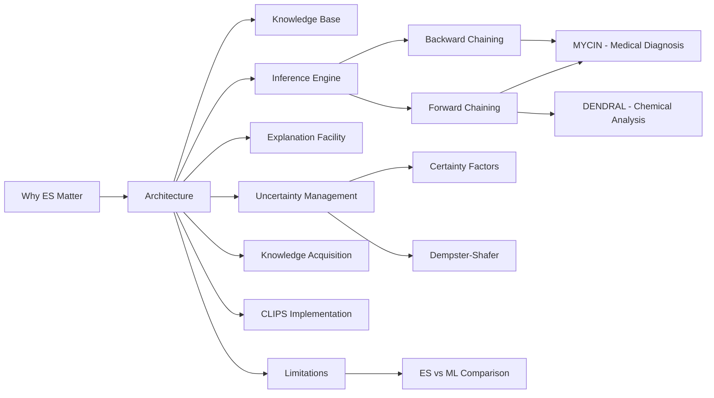

# Chapter 16: Expert Systems

**Previous:** [Chapter 15: Ethics of AI](15-ethics-ai.md) | **Next:** [Chapter 17: Modern Artificial Intelligence](17-modern-ai.md)

## Learning Objectives

By the conclusion of this chapter, the student will be able to: (1) describe the architecture of rule-based expert systems; (2) explain the reasoning mechanisms of MYCIN and DENDRAL; (3) implement a simple rule-based system in Python and CLIPS; (4) manage uncertainty using certainty factors and Dempster-Shafer theory; (5) distinguish forward chaining from backward chaining with trace tables; (6) analyze time/space complexity of inference strategies; (7) evaluate expert systems vs ML approaches for a given problem domain.

<!-- Image Gallery -->
<section class="lesson-visuals" aria-label="Visual learning resources">
  <header><span>VISUAL LEARNING</span><h2>See it. Review it. Remember it.</h2></header>
  <a class="lesson-visual-card" href="../../assets/images/lessons/artificial-intelligence/16-expert-systems/handwritten-notes.png" target="_blank" rel="noopener">
    
    <span><strong>Handwritten notes</strong>Condensed notes for deliberate review.</span>
  </a>
  <a class="lesson-visual-card" href="../../assets/images/lessons/artificial-intelligence/16-expert-systems/sticky-notes.png" target="_blank" rel="noopener">
    
    <span><strong>Sticky-note revision</strong>Fast recall prompts for revision.</span>
  </a>
  <a class="lesson-visual-card" href="../../assets/images/lessons/artificial-intelligence/16-expert-systems/visual-explanation.png" target="_blank" rel="noopener">
    
    <span><strong>Visual concept guide</strong>A connected explanation of the key ideas.</span>
  </a>
</section>
<!-- End Image Gallery -->


---

## Why Expert Systems Matter

**Real-World Analogy:** Imagine a world-class cardiologist retires after 40 years. Her knowledge of rare arrhythmias, subtle ECG patterns, and drug interactions — built from thousands of cases — vanishes. An expert system captures that knowledge in software. It never retires, never gets tired, and can be copied to every clinic in the world.

Expert systems were AI's first commercial success story. In the 1980s, companies like DEC (XCON), DuPont, and Boeing saved hundreds of millions of dollars by encoding human expertise into rule-based systems. These systems handled tasks that were too complex for traditional algorithms but too narrow for general AI — tax preparation, medical diagnosis, equipment configuration, fault diagnosis.

**The Core Insight:** For domains with stable, well-documented knowledge and clear decision rules, a rule-based system can outperform both humans (consistency, speed) and machine learning (explainability, no training data requirement).

---

## Chapter at a Glance

| Section | Key Topics | Key Terms |
|---------|-----------|-----------|
| ES Architecture | KB, inference engine, user interface, explanation facility | Production rules, working memory, conflict resolution |
| Knowledge Base | Rule representation, fact storage, Rete network | IF-THEN, antecedent, consequent, pattern matching |
| Inference Engine | Forward chaining, backward chaining, conflict resolution | Match-Resolve-Fire cycle, agenda |
| Forward Chaining | Data-driven reasoning, rule firing, termination | Modus ponens, refraction, recency ordering |
| Backward Chaining | Goal-driven reasoning, hypothesis testing, subgoaling | Depth-first search, goal stack, AND/OR tree |
| Explanation Facility | How/Why explanations, trace generation | Rule chain, justification, transparency |
| Uncertainty | Certainty factors, Dempster-Shafer, fuzzy logic | CF, belief function, plausibility, ignorance |
| MYCIN | Medical diagnosis, infectious diseases | Backward chaining, CF calculus, bacteremia |
| DENDRAL | Mass spectrometry, molecular structure | Plan-generate-test, fragmentation patterns |
| Knowledge Acquisition | Expert interview, protocol analysis, induction | Bottleneck, knowledge engineer, elicitation |
| CLIPS | Rule engine, Rete, COOL | Fact list, defrule, assert, retract |
| Limitations | Brittleness, maintenance, no learning | Narrow expertise, knowledge threshold |

---

## Chapter Roadmap



---

## 1. Expert System Architecture

**Real-World Analogy:** An expert system is like a master chess player who has memorized thousands of patterns (knowledge base) and uses a reasoning process (inference engine) to decide the best move. When asked "why that move?", the player can explain the reasoning chain (explanation facility).

### 1.1 Core Components


A classical expert system has four principal components:

| Component | Function | Real-World Equivalent |
|-----------|----------|----------------------|
| **Knowledge Base (KB)** | Stores domain facts and rules | Doctor's medical training + textbooks |
| **Inference Engine** | Applies rules to facts to derive conclusions | Doctor's reasoning process |
| **Working Memory** | Holds current case facts | Patient's current chart/vitals |
| **Explanation Facility** | Justifies conclusions | Doctor explaining diagnosis to patient |

### 1.2 System Architecture Pseudocode


```
FUNCTION ExpertSystemShell(rules, initial_facts):
    working_memory = initial_facts
    WHILE True:
        conflict_set = Match(rules, working_memory)
        IF conflict_set IS EMPTY:
            BREAK
        selected_rule = ResolveConflict(conflict_set)
        working_memory = Fire(selected_rule, working_memory)
        IF goal_condition_met(working_memory):
            BREAK
    RETURN working_memory
```

### 1.3 Python Implementation — ES Shell


```python
from typing import List, Dict, Any, Callable

class Rule:
    """A single production rule: IF conditions THEN actions."""
    def __init__(self, name: str, conditions: List[Callable],
                 actions: List[Callable], priority: int = 0):
        self.name = name
        self.conditions = conditions
        self.actions = actions
        self.priority = priority
        self.fired_count = 0   # for refraction

    def matches(self, facts: Dict[str, Any]) -> bool:
        return all(cond(facts) for cond in self.conditions)

class ExpertSystemShell:
    """Generic forward-chaining expert system shell."""

    def __init__(self, rules: List[Rule]):
        self.rules = rules
        self.working_memory: Dict[str, Any] = {}
        self.agenda: List[Rule] = []

    def add_fact(self, key: str, value: Any) -> None:
        self.working_memory[key] = value

    def match(self) -> List[Rule]:
        """Conflict resolution step: find all matching rules."""
        matched = []
        for rule in self.rules:
            if rule.matches(self.working_memory):
                matched.append(rule)
        return matched

    def resolve_conflict(self, matched: List[Rule]) -> Rule:
        """Select highest-priority rule (refraction + recency)."""
        matched.sort(key=lambda r: (-r.priority, r.fired_count))
        return matched[0]

    def fire(self, rule: Rule) -> None:
        """Execute rule actions against working memory."""
        for action in rule.actions:
            action(self.working_memory)
        rule.fired_count += 1

    def run(self, max_cycles: int = 100) -> Dict[str, Any]:
        """Main inference loop (Match-Resolve-Fire cycle)."""
        cycle = 0
        while cycle < max_cycles:
            matched = self.match()
            if not matched:
                print(f"Cycle {cycle}: No rules match. Halting.")
                break
            rule = self.resolve_conflict(matched)
            print(f"Cycle {cycle}: Firing {rule.name}")
            self.fire(rule)
            cycle += 1
        return self.working_memory
```

### 1.4 Complexity Analysis


| Operation | Time Complexity | Space Complexity | Why |
|-----------|---------------|-----------------|-----|
| Match (naive) | O(R × C × F) | O(WM) | R rules × C conditions each evaluated against F facts |
| Match (Rete) | O(R × C) amortized | O(Rete network) | Network caches partial matches across cycles |
| Conflict Resolution | O(M log M) | O(M) | Sort M matched rules by priority |
| Fire | O(A) | O(WM) | Execute A actions per rule |

**Why O(R × C × F) for naive match:** Each cycle checks every condition of every rule against every fact. With R=1000 rules, C=5 conditions each, F=100 facts, that is 500,000 evaluations per cycle. The Rete algorithm avoids this by maintaining a discrimination network of intermediate results, re-evaluating only affected nodes when facts change.

### 1.5 Advantages & Disadvantages


| Advantages | Disadvantages |
|-----------|--------------|
| Transparent reasoning (explainability) | Knowledge acquisition bottleneck |
| Consistent decisions (same input → same output) | Brittle at domain boundaries |
| No training data required | No learning from experience |
| Easy to audit and verify | Maintenance difficulty at scale |
| Humans can author rules directly | Rule interactions become unpredictable |
| Works with incomplete knowledge | Limited to narrow domains |

### 1.6 Edge Cases in ES Architecture


| Edge Case | Description | Mitigation |
|-----------|-------------|------------|
| **Conflicting Rules** | Two rules match and produce contradictory conclusions | Conflict resolution strategy (priority, specificity) |
| **Circular Rules** | A → B → C → A causes infinite loop | Cycle detection + max cycle limit |
| **Missing Knowledge** | No rule applies to current case | Default rules or interactive query |
| **Rule Interference** | Firing rule A removes conditions rule B needs | Refraction prevents re-firing same facts |
| **Inconsistent Facts** | User provides contradictory data | Truth maintenance system |

---

## 2. Knowledge Base

**Real-World Analogy:** A knowledge base is like a legal codebook. Each law says "IF certain conditions are met, THEN a specific legal consequence follows." Judges (the inference engine) apply these laws to specific cases (facts). Just as laws reference each other, rules in a KB can chain together.

### 2.1 Knowledge Representation Formats


| Format | Structure | Example | Best For |
|--------|-----------|---------|----------|
| Production Rules | IF condition THEN action | IF fever AND rash THEN measles | Diagnostic systems |
| Frames | Object with slots | [Animal: type=mammal, habitat=land] | Hierarchical domains |
| Semantic Nets | Node-edge-node triples | Dog IS-A Mammal | Concept relationships |
| Predicate Logic | ∀x (Man(x) → Mortal(x)) | Formal reasoning | Theorem proving |
| Decision Trees | IF-THEN-ELSE tree | Fever? → Rash? → Diagnosis | Classification |

### 2.2 Production Rule Anatomy


```
Rule <name>
  IF    <pattern-1> AND <pattern-2> AND ... AND <pattern-n>
  THEN  <action-1>; <action-2>; ... ; <action-m>
```

Each pattern tests a fact in working memory. Each action modifies working memory (add, remove, update).

### 2.3 Knowledge Base Operations Pseudocode


```
FUNCTION KnowledgeBase():
    rules = []        // List of Rule objects
    facts = {}        // Working memory dictionary
    
    FUNCTION AddRule(rule):
        rules.append(rule)
    
    FUNCTION RemoveRule(name):
        rules = [r for r in rules if r.name != name]
    
    FUNCTION GetMatchingRules(facts):
        matched = []
        FOR each rule IN rules:
            IF rule.conditions ALL satisfied BY facts:
                matched.append(rule)
        RETURN matched
    
    FUNCTION AddFact(key, value):
        facts[key] = value
    
    FUNCTION UpdateFact(key, value):
        facts[key] = value
    
    FUNCTION RemoveFact(key):
        DELETE facts[key]
```

### 2.4 Dry Run — Knowledge Base State Changes


**Scenario:** Animal classification with 4 rules and initial facts {has_hair=true, eats_meat=true}

#### Working Memory Trace

| Step | Operation | Working Memory State |
|------|-----------|---------------------|
| 0 | Initial facts | {has_hair: T, eats_meat: T} |
| 1 | Fire R1 (has_hair → mammal) | {has_hair: T, eats_meat: T, is_mammal: T} |
| 2 | Fire R2 (eats_meat → carnivore) | {has_hair: T, eats_meat: T, is_mammal: T, is_carnivore: T} |
| 3 | Fire R3 (mammal + carnivore → tiger) | {is_mammal: T, is_carnivore: T, animal: tiger} |

### 2.5 Python Implementation


```python
class KnowledgeBase:
    """Simple knowledge base with fact assertions and rule matching."""

    def __init__(self):
        self.rules: List[Dict] = []
        self.facts: Dict[str, Any] = {}

    def add_rule(self, name: str, conditions: Dict[str, Any],
                 conclusions: Dict[str, Any], cf: float = 1.0):
        self.rules.append({
            'name': name,
            'conditions': conditions,
            'conclusions': conclusions,
            'cf': cf
        })

    def assert_fact(self, key: str, value: Any):
        self.facts[key] = value
        print(f"  ASSERT: {key} = {value}")

    def retract_fact(self, key: str):
        if key in self.facts:
            del self.facts[key]
            print(f"  RETRACT: {key}")

    def match_rules(self) -> List[Dict]:
        """Return all rules whose conditions match current facts."""
        matched = []
        for rule in self.rules:
            conditions_met = all(
                self.facts.get(k) == v
                for k, v in rule['conditions'].items()
            )
            if conditions_met:
                matched.append(rule)
        return matched

    def apply_rule(self, rule: Dict):
        """Apply rule conclusions to working memory."""
        print(f"  FIRE: {rule['name']} (CF={rule['cf']})")
        for k, v in rule['conclusions'].items():
            self.assert_fact(k, v)

    def run(self, max_cycles: int = 10):
        """Forward chain until fixpoint or max cycles."""
        for cycle in range(max_cycles):
            print(f"\n--- Cycle {cycle} ---")
            print(f"  WM: {self.facts}")
            matched = self.match_rules()
            if not matched:
                print("  No matching rules. Done.")
                break
            print(f"  Conflict set: {[r['name'] for r in matched]}")
            self.apply_rule(matched[0])  # simple: fire first


# Example usage
kb = KnowledgeBase()

# Rules for animal classification
kb.add_rule("R1", {"has_hair": True}, {"is_mammal": True})
kb.add_rule("R2", {"eats_meat": True}, {"is_carnivore": True})
kb.add_rule("R3", {"is_mammal": True, "is_carnivore": True},
             {"animal": "tiger"}, cf=0.9)

# Initial facts
kb.assert_fact("has_hair", True)
kb.assert_fact("eats_meat", True)
kb.run()
```

**Output:**
```
--- Cycle 0 ---
  WM: {'has_hair': True, 'eats_meat': True}
  Conflict set: ['R1', 'R2']
  FIRE: R1 (CF=1.0)
  ASSERT: is_mammal = True

--- Cycle 1 ---
  WM: {'has_hair': True, 'eats_meat': True, 'is_mammal': True}
  Conflict set: ['R2', 'R3']
  FIRE: R2 (CF=1.0)
  ASSERT: is_carnivore = True

--- Cycle 2 ---
  WM: {'has_hair': True, 'eats_meat': True, 'is_mammal': True, 'is_carnivore': True}
  Conflict set: ['R3']
  FIRE: R3 (CF=0.9)
  ASSERT: animal = tiger

--- Cycle 3 ---
  WM: {'has_hair': True, 'eats_meat': True, 'is_mammal': True, 'is_carnivore': True, 'animal': 'tiger'}
  No matching rules. Done.
```

### 2.6 Complexity Analysis


| Operation | Time | Space | Why |
|-----------|------|-------|-----|
| Rule addition | O(1) | O(1) | Append to list |
| Fact assertion | O(1) | O(1) | Dictionary insert |
| Rule match (all) | O(R × C) | O(1) | Test all R rules, C conditions each |
| Rule match (indexed) | O(C × M) | O(R × C²) | Alpha-index reduces candidates to M matches |

**Why O(R × C):** Each match cycle must evaluate every condition of every rule. With R=500 and C=5, that is 2500 comparisons. The Rete algorithm improves this to O(C × M) where M ≪ R by maintaining a discrimination network.

### 2.7 Advantages & Disadvantages


| Advantages | Disadvantages |
|-----------|--------------|
| Modular — rules are independent units | No inherent consistency checking |
| Natural IF-THEN format matches human reasoning | Rule interactions can cause emergent behavior |
| Easy to add/remove individual rules | Knowledge acquisition is labor-intensive |
| Supports explanation via rule trace | Rules may conflict or overlap |
| Domain experts can read rules | Scalability issues beyond ~10,000 rules |

### 2.8 Edge Cases


| Edge Case | Example | Handling |
|-----------|---------|----------|
| **Conflicting rules** | R1 says animal=tiger, R2 says animal=lion for same facts | Priority ordering, specificity ordering |
| **Redundant rules** | R1 and R2 produce same conclusion from same conditions | Rule removal (no effect but wastes cycles) |
| **Subsumed rules** | R1: A&B→Z, R2: A&B&C→Z (R2 more specific) | Fire R2 first (specificity ordering) |
| **Missing facts** | Rule needs fact not yet in WM | Query user, use defaults, or defer |
| **Circular rules** | R1: A→B, R2: B→C, R3: C→A | Cycle detection (mark visited rules) |

---

## 3. Inference Engine

**Real-World Analogy:** The inference engine is like a detective solving a case. Forward chaining is collecting evidence (facts) and seeing what crime they point to. Backward chaining is starting with a suspect (hypothesis) and checking if the evidence matches.

### 3.1 Match-Resolve-Fire Cycle


The inference engine operates in three repeating phases:

```
┌────────────┐     ┌────────────────┐     ┌──────────┐
│   MATCH    │────→│ RESOLVE CONFLICT│────→│   FIRE   │
│ (find all  │     │ (select one     │     │(execute  │
│  matching  │     │  rule from      │     │ RHS,     │
│  rules)    │     │  conflict set)  │     │ update   │
└────────────┘     └────────────────┘     │ WM)     │
      ↑                                    └──────────┘
      └──────────────────────────────────────────┘
            (repeat until fixpoint)
```

### 3.2 Conflict Resolution Strategies


| Strategy | Rule | Description |
|----------|------|-------------|
| **Refraction** | A rule should not fire twice on the same facts | Prevents infinite loops |
| **Recency** | Prefer rules using most recently added facts | Focuses on current situation |
| **Specificity** | Prefer rules with more conditions | More specific rules match better |
| **Priority** | Rules have explicit priority values | Knowledge engineer controls order |
| **Context Limiting** | Partition rules into contexts | Focus on relevant rule subset |

### 3.3 Inference Engine Pseudocode


```
FUNCTION InferenceEngine(rules, facts):
    working_memory = facts
    fired_history = []   // For explanation
    cycle = 0
    
    WHILE cycle < MAX_CYCLES:
        // MATCH phase
        conflict_set = []
        FOR each rule IN rules:
            IF rule NOT already fired WITH current matching facts (refraction):
                IF ALL rule.conditions SATISFIED BY working_memory:
                    conflict_set.APPEND(rule)
        
        // TERMINATION check
        IF conflict_set IS EMPTY:
            RETURN working_memory  // Fixpoint reached
        
        // RESOLVE phase (combined strategies)
        selected_rule = CONFLICT_RESOLUTION(conflict_set)
        
        // FIRE phase
        FOR each action IN selected_rule.actions:
            EXECUTE action ON working_memory
        
        fired_history.APPEND(selected_rule)
        cycle = cycle + 1
    
    RETURN working_memory
```

### 3.4 Python Inference Engine


```python
class InferenceEngine:
    """Forward-chaining inference engine with multiple resolution strategies."""

    def __init__(self, rules: List[Rule]):
        self.rules = rules
        self.wm: Dict[str, Any] = {}
        self.fired_rules: List[str] = []
        self.fired_fact_sigs: Set[Tuple] = set()  # refraction tracking

    def add_fact(self, key: str, value: Any):
        self.wm[key] = value

    def _fact_signature(self, rule: Rule) -> Tuple:
        """Create a signature of which facts satisfied this rule (for refraction)."""
        return (rule.name, tuple(sorted(self.wm.items())))

    def _match(self) -> List[Rule]:
        matched = []
        for rule in self.rules:
            sig = self._fact_signature(rule)
            if sig in self.fired_fact_sigs:
                continue  # refraction: skip already-fired combination
            if all(cond(self.wm) for cond in rule.conditions):
                matched.append(rule)
        return matched

    def _resolve(self, matched: List[Rule]) -> Rule:
        """Specificity ordering: rule with most conditions fires first."""
        matched.sort(key=lambda r: (-len(r.conditions), r.priority))
        return matched[0]

    def _fire(self, rule: Rule):
        sig = self._fact_signature(rule)
        self.fired_fact_sigs.add(sig)
        for action in rule.actions:
            action(self.wm)
        self.fired_rules.append(rule.name)

    def run(self, max_cycles: int = 50):
        for cycle in range(max_cycles):
            matched = self._match()
            if not matched:
                return self.wm
            rule = self._resolve(matched)
            self._fire(rule)
        return self.wm

    def explain(self) -> List[str]:
        """Return the chain of fired rules."""
        return self.fired_rules
```

### 3.5 Complexity Analysis


| Phase | Time Complexity | Why |
|-------|---------------|-----|
| Match (naive) | O(R × C × F) | R rules, C conditions per rule, F facts |
| Match (Rete) | O(ΔF × C × M) | Only ΔF new facts, M matching rules |
| Conflict Resolution | O(M log M) | Sort M matched rules |
| Fire | O(A) | Execute A actions |
| Total per cycle | O(R × C × F) naive / O(ΔF × C × M) Rete | Dominated by match phase |

**Why Rete is faster:** In a naive system, every cycle re-evaluates all R×C conditions. In most sessions, only a few facts change (ΔF ≪ F). Rete maintains a network where each node stores partial match state. When a fact changes, only the affected branch of the network is recomputed — typically reducing evaluations by 90-99%.

### 3.6 Advantages & Disadvantages


| Advantages | Disadvantages |
|-----------|--------------|
| Rule order does not affect correctness | Conflict resolution can be complex |
| New rules added without changing engine | Match phase is computational bottleneck |
| Supports explanation | Rete network memory overhead |
| Modular separation of knowledge and control | May require tuning for performance |
| Multiple resolution strategies available | Difficult to debug rule interactions |

### 3.7 Edge Cases


| Edge Case | Problem | Solution |
|-----------|---------|----------|
| **Infinite loop** | Rules keep firing in cycle | Cycle detection, max cycles limit |
| **Starvation** | High-priority rules prevent low-priority from firing | Fairness scheduling |
| **Rule explosion** | M rules added causes M×C×F match cost | Rete, rule partitioning |
| **Fact thrashing** | Same facts repeatedly asserted/retracted | Truth maintenance system |
| **Non-termination** | Rules generate infinite new facts | Goal state detection |
---

## 4. Forward Chaining (Data-Driven Reasoning)

**Real-World Analogy:** A detective arrives at a crime scene and collects evidence (fingerprints, DNA, witness statements). Each piece of evidence triggers a line of investigation: "IF fingerprint matches database THEN identify suspect." The detective works from evidence toward a conclusion, with no specific suspect in mind initially.

### 4.1 Algorithm (Steps)


```
ALGORITHM: ForwardChaining
INPUT:  RuleSet R, Initial Facts F
OUTPUT: Set of derived conclusions C

1. Initialize working_memory ← F
2. Initialize fired_set ← ∅
3. REPEAT:
   a. conflict_set ← ∅
   b. FOR each rule r ∈ R:
      i.   IF r ∉ fired_set AND conditions(r) ⊆ working_memory:
           conflict_set ← conflict_set ∪ {r}
   c. IF conflict_set = ∅: BREAK
   d. selected ← CONFLICT_RESOLUTION(conflict_set)
   e. conclusions ← CONSEQUENT(selected)
   f. working_memory ← working_memory ∪ conclusions
   g. fired_set ← fired_set ∪ {selected}
4. UNTIL fixpoint OR MAX_CYCLES reached
5. RETURN working_memory
```

### 4.2 Detailed Pseudocode


```
FUNCTION forward_chain(rules, initial_facts, max_iterations=100):
    wm = copy(initial_facts)
    fired = []
    iteration = 0
    
    WHILE iteration < max_iterations:
        PRINT "=== Iteration", iteration, "==="
        PRINT "WM:", wm
        
        // MATCH
        conflict_set = []
        FOR EACH rule IN rules:
            IF rule.name NOT IN fired:
                IF all(condition in wm for condition in rule.antecedents):
                    conflict_set.append(rule)
        
        IF conflict_set IS EMPTY:
            PRINT "No rules match. Halting."
            BREAK
        
        // RESOLVE
        SORT conflict_set BY
            -len(rule.antecedents),
            -rule.priority
        
        selected = conflict_set[0]
        
        // FIRE
        PRINT "Firing:", selected.name
        FOR EACH conclusion IN selected.consequents:
            wm.add(conclusion)
        
        fired.append(selected.name)
        iteration += 1
    
    RETURN wm
```

### 4.3 Dry Run — Forward Chaining Trace Table


**Rule Set:** Animal classification

| Rule | Antecedents | Consequents | Priority |
|------|-------------|-------------|----------|
| R1 | has_hair | is_mammal | 1 |
| R2 | gives_milk | is_mammal | 1 |
| R3 | has_feathers | is_bird | 1 |
| R4 | is_mammal, eats_meat | is_carnivore | 2 |
| R5 | is_mammal, has_stripes | is_tiger | 2 |
| R6 | is_bird, flies | is_eagle | 2 |
| R7 | is_mammal, is_carnivore, has_stripes | animal=tiger | 3 |
| R8 | is_bird, cannot_fly | animal=penguin | 3 |

**Initial Facts:** {has_hair=T, eats_meat=T, has_stripes=T}

| Cycle | Conflict Set | Selected | WM Before | WM After |
|-------|-------------|----------|-----------|----------|
| 0 | — | — | has_hair, eats_meat, has_stripes | (initial) |
| 1 | R1(spec=1), R2(spec=1) | R1 (tie) | has_hair, eats_meat, has_stripes | +is_mammal |
| 2 | R4(spec=2), R5(spec=2), R2 | R4 (spec=2) | +is_mammal | +is_carnivore |
| 3 | R5(spec=2), R7(spec=3), R2 | R7 (spec=3) | +is_carnivore | +animal=tiger |
| 4 | R5(spec=2), R2 | R5 (spec=2) | +animal=tiger | +is_tiger |
| 5 | ∅ | — | Done | Done |

**Final WM:** {has_hair, eats_meat, has_stripes, is_mammal, is_carnivore, animal=tiger}

### 4.4 Python Implementation


```python
class ForwardChainingEngine:
    """Forward chaining engine with trace output."""

    def __init__(self):
        self.rules = []
        self.facts = set()
        self.fired = set()

    def add_rule(self, name: str, antecedents: list,
                 consequents: list, priority: int = 0):
        self.rules.append({
            'name': name, 'ante': antecedents,
            'cons': consequents, 'priority': priority
        })

    def add_fact(self, fact: str):
        self.facts.add(fact)

    def trace(self, cycle: int, conflict: list,
              selected: str, before: set, after: set):
        print(f"  Cycle {cycle}:")
        print(f"    Conflict: {conflict}")
        if selected:
            print(f"    Selected: {selected}")
        print(f"    WM: {sorted(before)}")
        new_facts = after - before
        print(f"    +{sorted(new_facts)}\n")

    def run(self, max_cycles: int = 20) -> set:
        for cycle in range(max_cycles):
            before = self.facts.copy()
            conflict_set = []
            for r in self.rules:
                if r['name'] in self.fired:
                    continue
                if all(ant in self.facts for ant in r['ante']):
                    conflict_set.append(r)
            if not conflict_set:
                self.trace(cycle, [], None, before, self.facts)
                print("  Halting: no matching rules")
                break
            conflict_set.sort(key=lambda r: (-len(r['ante']), -r['priority']))
            selected = conflict_set[0]
            for cons in selected['cons']:
                self.facts.add(cons)
            self.fired.add(selected['name'])
            self.trace(cycle, [r['name'] for r in conflict_set],
                       selected['name'], before, self.facts)
            if cycle >= max_cycles - 1:
                print("  Halting: max cycles")
        return self.facts


engine = ForwardChainingEngine()
engine.add_rule("R1", ["engine_noise"], ["check_oil_level"])
engine.add_rule("R2", ["car_wont_start", "headlights_dim"], ["battery_dead"])
engine.add_rule("R3", ["car_wont_start", "starter_clicks"], ["battery_low"])
engine.add_rule("R4", ["car_wont_start", "no_click", "engine_noise"],
                ["starter_motor_fault"])
engine.add_rule("R5", ["battery_dead"], ["replace_battery"])
engine.add_rule("R6", ["battery_low"], ["jump_start"])
print("=== FC: Car Diagnosis ===")
engine.add_fact("car_wont_start")
engine.add_fact("headlights_dim")
result = engine.run()
print(f"Diagnosis: {sorted(result)}")
```

**Output:**
```
=== FC: Car Diagnosis ===
  Cycle 0:
    Conflict: ['R2']
    Selected: R2
    WM: ['car_wont_start', 'headlights_dim']
    +['battery_dead']
  Cycle 1:
    Conflict: ['R5']
    Selected: R5
    WM: ['battery_dead', 'car_wont_start', 'headlights_dim']
    +['replace_battery']
  Cycle 2:
    Conflict: []
    Selected: None
    WM: ['battery_dead', 'car_wont_start', 'headlights_dim', 'replace_battery']
  Halting: no matching rules
Diagnosis: ['battery_dead', 'car_wont_start', 'headlights_dim', 'replace_battery']
```

### 4.5 Complexity Analysis


| Aspect | Complexity | Why |
|--------|-----------|-----|
| Time per cycle (naive) | O(R × C × F) | Each R rule checks C antecedents against F facts |
| Time per cycle (Rete) | O(ΔF × M) | Only ΔF new facts propagate; M matches |
| Total time (naive) | O(D × R × C × F) | D cycles × match cost |
| Space (naive) | O(F + R) | Store facts and rules |
| Space (Rete) | O(R × C × 2^(C-1)) | Alpha/beta memory nodes |

**Why Rete wins:** With 500+ rules, naive checks 500×5×50=125,000 conditions/cycle. Rete checks only ~50 affected rules → ~250 evaluations.

### 4.6 Advantages & Disadvantages


| Advantages | Disadvantages |
|-----------|--------------|
| Works with any initial facts | May generate irrelevant conclusions |
| Complete — derives all possible facts | Inefficient without goal direction |
| Naturally handles multiple goals | Rule ordering affects performance |
| Responsive to new information | Termination not guaranteed |

### 4.7 Edge Cases


| Edge Case | Example | Handling |
|-----------|---------|----------|
| No rules match | Facts have no corresponding rules | Halt immediately |
| Explosive chaining | Each fact matches 3 more rules | Set max_cycles limit |
| Idempotent facts | A→B, B→C, C→B (B exists) | Refraction prevents re-firing |
| Conflicting conclusions | R1: A→X, R2: A→¬X | CF values; priority decides |
| Empty antecedent rule | R1: TRUE → always_fire | Fires once (refraction) |

---

## 5. Backward Chaining (Goal-Driven Reasoning)

**Real-World Analogy:** A doctor starts with "Does the patient have strep throat?" then checks evidence: fever? sore throat? Each question supports or refutes the hypothesis. If insufficient, sub-hypotheses form. This is backward chaining — start with a goal, work backward to evidence.

### 5.1 Algorithm (Steps)


```
ALGORITHM: BackwardChaining
INPUT:  Goal G, RuleSet R, FactBase F
OUTPUT: True if G is proven

STACK = [G]
PROVED = {}

WHILE STACK NOT EMPTY:
    current = POP(STACK)
    IF current IN F:
        PROVED.add(current); CONTINUE
    IF current IN PROVED:
        CONTINUE
    candidate_rules = [r ∈ R | current ∈ consequents(r)]
    IF candidate_rules IS EMPTY:
        response = ASK_USER(current)
        IF response: F.add(current); PROVED.add(current)
        ELSE: RETURN FALSE
    FOR each rule IN candidate_rules:
        PUSH antecedents(rule) ONTO STACK
        IF ALL antecedents IN (F ∪ PROVED):
            PROVED.add(current)
RETURN (G IN PROVED)
```

### 5.2 Pseudocode with AND/OR Tree


```
FUNCTION backward_chain(goal, rules, facts, depth=0):
    indent = "  " * depth
    PRINT indent + "Goal:", goal
    
    IF goal IN facts:
        PRINT indent + "  KNOWN FACT"
        RETURN True
    
    candidates = [r for r in rules if goal in r.consequents]
    
    IF candidates IS EMPTY:
        answer = input(f"Is '{goal}' true? (y/n): ")
        IF answer == 'y': facts.add(goal); RETURN True
        RETURN False
    
    FOR EACH rule IN candidates:
        PRINT indent + f"Trying: {rule.name}"
        all_proved = True
        FOR EACH ant IN rule.antecedents:
            IF NOT backward_chain(ant, rules, facts, depth+1):
                all_proved = False; BREAK
        IF all_proved:
            facts.add(goal)
            PRINT indent + f"  PROVED: {goal}"
            RETURN True
    
    PRINT indent + f"  FAILED: {goal}"
    RETURN False
```

### 5.3 Dry Run — Backward Chaining Trace Table


**Goal:** animal = tiger

**Initial Facts:** {has_hair=T, eats_meat=T, has_stripes=T}

| Step | Goal Stack | Current Goal | Rule | Action | Facts Used |
|------|-----------|-------------|------|--------|------------|
| 0 | [animal=tiger] | animal=tiger | — | Start | {} |
| 1 | [is_mammal, carnivore, stripes] | is_mammal | R7 | Push R7 ante | {} |
| 2 | [has_hair], [carnivore, stripes] | has_hair | R1 | Push R1 ante | {} |
| 3 | [], [carnivore, stripes] | has_hair | — | Known ✓ | {has_hair} |
| 4 | [carnivore, stripes] | is_carnivore | — | Need subgoal | {has_hair} |
| 5 | [eats_meat], [stripes] | eats_meat | R4 | Push R4 ante | {has_hair} |
| 6 | [], [stripes] | eats_meat | — | Known ✓ | +eats_meat |
| 7 | [stripes] | has_stripes | — | Known ✓ | +has_stripes |
| 8 | [] | animal=tiger | R7 | All proved ✓ | DONE |

**Result:** animal=tiger = True (chain: R7 ← R4 ← R1)

### 5.4 Python Implementation


```python
class BackwardChainingEngine:
    """Backward chaining engine with goal stack and explanation."""

    def __init__(self):
        self.rules = []
        self.facts = set()
        self.explanation = []

    def add_rule(self, name: str, antecedents: list,
                 consequents: list):
        self.rules.append({'name': name, 'ante': antecedents,
                           'cons': consequents})

    def add_fact(self, fact: str):
        self.facts.add(fact)

    def prove(self, goal: str, depth: int = 0) -> bool:
        indent = "  " * depth
        print(f"{indent}Goal: {goal}")
        if goal in self.facts:
            print(f"{indent}  Known fact")
            return True
        candidates = [r for r in self.rules if goal in r['cons']]
        if not candidates:
            print(f"{indent}  Cannot prove — not in facts")
            return False
        for rule in candidates:
            print(f"{indent}  Try: {rule['name']} "
                  f"({rule['ante']} → {rule['cons']})")
            all_proved = all(self.prove(ant, depth+1)
                             for ant in rule['ante'])
            if all_proved:
                self.facts.add(goal)
                self.explanation.append(rule['name'])
                print(f"{indent}  PROVED: {goal}")
                return True
        print(f"{indent}  FAILED: {goal}")
        return False

    def query(self, goal: str) -> bool:
        print(f"=== BC: prove '{goal}' ===\n")
        result = self.prove(goal)
        chain = " → ".join(reversed(self.explanation))
        print(f"\nResult: {goal} = {result}")
        print(f"Chain: {chain}")
        return result


engine = BackwardChainingEngine()
engine.add_rule("R2", ["car_wont_start", "headlights_dim"], ["battery_dead"])
engine.add_rule("R3", ["car_wont_start", "starter_clicks"], ["battery_low"])
engine.add_rule("R5", ["battery_dead"], ["replace_battery"])
engine.add_fact("car_wont_start")
engine.add_fact("headlights_dim")
engine.query("battery_dead")
```

**Output:**
```
=== BC: prove 'battery_dead' ===

Goal: battery_dead
  Try: R2 (['car_wont_start', 'headlights_dim'] → ['battery_dead'])
    Goal: car_wont_start
      Known fact
    Goal: headlights_dim
      Known fact
  PROVED: battery_dead

Result: battery_dead = True
Chain: R2
```

### 5.5 Complexity Analysis


| Aspect | Complexity | Why |
|--------|-----------|-----|
| Time (best case) | O(D × B) | D depth × B branching factor |
| Time (worst case) | O(B^D) | Explores all rules at each level |
| Space (call stack) | O(D) | Recursion depth = chain length |
| Space (memoization) | O(G) | Cache proved/failed subgoals |

**Why exponential:** Each goal with B candidate rules exploring D subgoals = B^D. Domain heuristics prune most branches.

### 5.6 Forward vs Backward Chaining Comparison


| Criterion | Forward Chaining | Backward Chaining |
|-----------|-----------------|-------------------|
| Direction | Data → Goal | Goal → Data |
| Start | Known facts | Hypothesis |
| Termination | Fixpoint (no rules match) | Goal proved/disproved |
| Search | Breadth-first | Depth-first |
| Best when | Few facts, many goals | Few goals, many facts |
| User interaction | Minimal | Frequent (queries) |
| Use case | Monitoring, config | Diagnosis, tutoring |

### 5.7 Advantages & Disadvantages


| Advantages | Disadvantages |
|-----------|--------------|
| Goal-directed, explores only relevant rules | Cannot derive unexpected conclusions |
| Memory efficient (linear stack) | Many questions before conclusion |
| Easy "why" explanations | Inefficient with large KBs |
| Works for diagnostic tasks | AND/OR tree can explode |

### 5.8 Edge Cases


| Edge Case | Handling |
|-----------|----------|
| Circular rules A→B, B→C, C→A | Cycle detection (mark visited goals) |
| Multiple rules same goal | Try R1 first, backtrack to R2 |
| OR antecedents (IF A OR B THEN Z) | Try one at a time (backtrack) |
| Negation (IF NOT A THEN Z) | Prove A; if fails, Z succeeds |
| Unknown facts | Query user or assume default |
---

## 6. Explanation Facility

**Real-World Analogy:** When a doctor prescribes treatment, the patient asks "Why this?" The doctor explains: "Your fever and rash suggest measles." Expert systems provide the same transparency — a key advantage over neural networks.

### 6.1 Why and How Explanations


| Question | Meaning | Example |
|----------|---------|---------|
| **How** was X derived? | Show rule chain | "R7: mammal ∧ carnivore ∧ stripes → tiger" |
| **Why** ask for fact Y? | Show current goal | "To determine carnivore via R4" |

### 6.2 Pseudocode


```
FUNCTION ExplainHow(conclusion, rule_chain):
    PRINT "Conclusion:", conclusion
    PRINT "Derived using:"
    FOR EACH rule IN rule_chain:
        PRINT "  Rule", rule.name, ":", rule.ante, "→", rule.cons
    PRINT "Steps:"
    FOR i, step IN ENUMERATE(rule_chain):
        PRINT f"  {i+1}. {step.name}: {step.ante} ✓ → {step.cons}"

FUNCTION ExplainWhy(fact, current_goal, rule):
    PRINT "Asking about", fact, "because:"
    PRINT "  Goal:", current_goal
    PRINT "  Rule:", rule.name, "- IF", rule.ante, "THEN", rule.cons
```

### 6.3 Python Implementation


```python
class ExplanationFacility:
    """Provides HOW and WHY explanations."""

    def __init__(self):
        self.rule_chain = []
        self.goal_history = []
        self.rule_details = {}

    def record_fire(self, rule_name: str, antecedents: list,
                    consequents: list):
        self.rule_chain.append(rule_name)
        self.rule_details[rule_name] = {
            'ante': antecedents, 'cons': consequents
        }

    def record_goal(self, goal: str):
        self.goal_history.append(goal)

    def explain_how(self, conclusion: str):
        print(f"=== HOW was '{conclusion}' derived? ===\n")
        for i, rn in enumerate(self.rule_chain, 1):
            d = self.rule_details[rn]
            print(f"  Step {i}: [{rn}] "
                  f"IF {' ∧ '.join(d['ante'])} "
                  f"THEN {', '.join(d['cons'])}")
        print(f"\nConclusion: {conclusion} ✓")

    def explain_why(self, fact: str):
        print(f"=== WHY is '{fact}' needed? ===\n")
        for rn in reversed(self.rule_chain):
            d = self.rule_details[rn]
            if fact in d['ante']:
                print(f"To determine: {', '.join(d['cons'])}")
                print(f"Need to check: {' ∧ '.join(d['ante'])}")
                print(f"'{fact}' is one of those conditions.")
                print(f"Rule: [{rn}] IF {ante} THEN {cons}")
                return
        print(f"'{fact}' is a primitive fact.")


exp = ExplanationFacility()
exp.record_goal("animal=tiger")
exp.record_fire("R1", ["has_hair"], ["is_mammal"])
exp.record_fire("R4", ["is_mammal", "eats_meat"], ["is_carnivore"])
exp.record_fire("R7", ["is_mammal", "is_carnivore", "has_stripes"],
                ["animal=tiger"])
exp.explain_how("animal=tiger")
print()
exp.explain_why("eats_meat")
```

**Output:**
```
=== HOW was 'animal=tiger' derived? ===

  Step 1: [R1] IF has_hair THEN is_mammal
  Step 2: [R4] IF is_mammal ∧ eats_meat THEN is_carnivore
  Step 3: [R7] IF is_mammal ∧ is_carnivore ∧ has_stripes THEN animal=tiger

Conclusion: animal=tiger ✓

=== WHY is 'eats_meat' needed? ===

To determine: is_carnivore
Need to check: is_mammal ∧ eats_meat
'eats_meat' is one of those conditions.
Rule: [R4] IF is_mammal ∧ eats_meat THEN is_carnivore
```

### 6.4 Complexity


| Operation | Complexity | Why |
|-----------|-----------|-----|
| How explanation | O(chain_length) | Walk and display rules |
| Why explanation | O(chain_length) | Walk backward through chain |
| Storage | O(R × (A + C)) | All rules with conditions/actions |

### 6.5 Advantages & Disadvantages


| Advantages | Disadvantages |
|-----------|--------------|
| Complete transparency | Quality depends on rule structure |
| Builds user trust | Long chains overwhelm users |
| Debugging tool | Cannot explain missing knowledge |
| Regulatory audit trail | Rule-level only, no causal model |

### 6.6 Edge Cases


| Edge Case | Solution |
|-----------|----------|
| Long chains (50+ rules) | Summarize intermediate steps |
| Multiple paths to conclusion | Show shortest or highest-CF path |
| Conflicting evidence | Show both sides with CF |
| User lacks technical background | Layer explanations (simple → detailed) |

---

## 7. Uncertainty in Expert Systems

**Real-World Analogy:** A doctor says "80% sure it's strep throat." Medical diagnosis has inherent uncertainty — symptoms overlap, tests have false positives. Expert systems need mechanisms to represent and propagate this uncertainty.

### 7.1 Sources of Uncertainty


| Source | Example |
|--------|---------|
| Evidence uncertainty | "Mild fever" is subjective |
| Rule uncertainty | "Fever + rash → measles (CF=0.8)" |
| Missing information | No blood test result |
| Conflicting evidence | Fever suggests infection, WBC normal |
| Temporal changes | Symptoms evolved since yesterday |

### 7.2 Certainty Factors (MYCIN Model)


CF ranges from -1.0 (definitely false) to +1.0 (definitely true), 0 = unknown.

**CF = MB - MD** where MB = Measure of Belief [0,1], MD = Measure of Disbelief [0,1].

#### Combination Rules

| Operation | Formula |
|-----------|---------|
| AND | CF(A ∧ B) = min(CF(A), CF(B)) |
| OR | CF(A ∨ B) = max(CF(A), CF(B)) |
| NOT | CF(¬A) = -CF(A) |
| Combine (both +) | CF₁ + CF₂ − CF₁·CF₂ |
| Combine (both −) | CF₁ + CF₂ + CF₁·CF₂ |
| Combine (mixed) | (CF₁ + CF₂) / (1 − min(|CF₁|, |CF₂|)) |

#### Algorithm

```
FUNCTION PropagateCF(conclusion_cf, rule_cf):
    RETURN conclusion_cf * rule_cf

FUNCTION CombineCF(cf1, cf2):
    IF cf1 >= 0 AND cf2 >= 0:
        RETURN cf1 + cf2 - cf1 * cf2
    IF cf1 < 0 AND cf2 < 0:
        RETURN cf1 + cf2 + cf1 * cf2
    ELSE:
        RETURN (cf1 + cf2) / (1 - min(|cf1|, |cf2|))
```

### 7.3 Dempster-Shafer Theory


**Analogy:** A jury weighs evidence: fingerprints → 60% guilt, alibi → 70% innocence. Standard probability forces guilt + innocence = 1. DS allows "don't know" — remaining probability goes to ignorance.

| Concept | Definition | Example |
|---------|-----------|---------|
| Frame Θ | All possible hypotheses | {Disease_A, B, C} |
| Mass m | Belief in subsets of Θ | m({A,B}) = 0.3 |
| Belief Bel(A) | Sum of masses in subsets of A | Bel({A}) = m({A}) |
| Plausibility Pl(A) | 1 − Bel(¬A) | Max possible belief |
| Ignorance | Pl(A) − Bel(A) | Evidence gap |

**Dempster's Rule:**
`(m₁ ⊕ m₂)(A) = (Σ_{B∩C=A} m₁(B) × m₂(C)) / (1 − Σ_{B∩C=∅} m₁(B) × m₂(C))`

#### Pseudocode

```
FUNCTION DempsterCombine(m1, m2, frame):
    combined = {}
    normalization = 0
    
    FOR EACH subset_A IN m1:
        FOR EACH subset_B IN m2:
            intersection = subset_A ∩ subset_B
            product = m1[subset_A] * m2[subset_B]
            IF intersection IS EMPTY:
                normalization += product
            ELSE:
                combined[intersection] += product
    
    FOR EACH subset IN combined:
        combined[subset] /= (1 - normalization)
    RETURN combined
```

### 7.4 Python Implementation


```python
class CertaintyFactor:
    """MYCIN-style CF handling."""

    def __init__(self, cf: float = 0.0):
        self.cf = max(-1.0, min(1.0, cf))

    def __and__(self, other):
        return CertaintyFactor(min(self.cf, other.cf))

    def __or__(self, other):
        return CertaintyFactor(max(self.cf, other.cf))

    def combine(self, other):
        cf1, cf2 = self.cf, other.cf
        if cf1 >= 0 and cf2 >= 0:
            r = cf1 + cf2 - cf1 * cf2
        elif cf1 < 0 and cf2 < 0:
            r = cf1 + cf2 + cf1 * cf2
        else:
            r = (cf1 + cf2) / (1 - min(abs(cf1), abs(cf2)))
        return CertaintyFactor(r)

    def apply_rule(self, rule_cf: float):
        return CertaintyFactor(self.cf * rule_cf)

    def __repr__(self):
        return f"CF({self.cf:+.2f})"


class DempsterShafer:
    """Dempster-Shafer belief combination."""

    def __init__(self, frame: set):
        self.frame = frame
        self.masses = {}

    def assign_mass(self, subset: set, mass: float):
        key = frozenset(subset)
        self.masses[key] = self.masses.get(key, 0.0) + mass

    def belief(self, subset: set) -> float:
        key = frozenset(subset)
        return sum(m for s, m in self.masses.items()
                   if s.issubset(key))

    def plausibility(self, subset: set) -> float:
        key = frozenset(subset)
        comp = frozenset(self.frame - subset)
        bel_not = sum(m for s, m in self.masses.items()
                      if s.issubset(comp))
        return 1.0 - bel_not

    @staticmethod
    def combine(ds1, ds2):
        result = DempsterShafer(ds1.frame | ds2.frame)
        conflict = 0.0
        for s1, m1 in ds1.masses.items():
            for s2, m2 in ds2.masses.items():
                inter = s1 & s2
                prod = m1 * m2
                if not inter:
                    conflict += prod
                else:
                    result.masses[inter] = \
                        result.masses.get(inter, 0.0) + prod
        norm = 1.0 - conflict
        if norm > 0:
            for s in result.masses:
                result.masses[s] /= norm
        return result


cf_fever = CertaintyFactor(0.8)
cf_rash = CertaintyFactor(0.6)
cf_rule = CertaintyFactor(0.7)
cf_measles = (cf_fever & cf_rash).apply_rule(cf_rule.cf)
print(f"Measles CF: {cf_measles}")

cf2 = CertaintyFactor(0.9).apply_rule(0.7)
combined = cf_measles.combine(cf2)
print(f"Combined: {combined}")

ds = DempsterShafer({'Flu', 'Cold', 'COVID'})
ds.assign_mass({'Flu', 'COVID'}, 0.7)
ds.assign_mass({'Cold'}, 0.2)
ds.assign_mass({'Flu', 'Cold', 'COVID'}, 0.1)
print(f"DS: Bel(Flu)={ds.belief({'Flu'}):.2f}, "
      f"Pl(Flu)={ds.plausibility({'Flu'}):.2f}, "
      f"Ignorance={ds.plausibility({'Flu'})-ds.belief({'Flu'}):.2f}")
```

**Output:**
```
Measles CF: CF(+0.48)
Combined: CF(+0.84)
DS: Bel(Flu)=0.00, Pl(Flu)=0.80, Ignorance=0.80
```

### 7.5 CF Propagation Dry Run


| Step | Fact | CF | Rule | Rule CF | Derived | Computed CF |
|------|------|----|------|---------|---------|-------------|
| 1 | fever | 0.8 | R1: fever→flu | 0.6 | flu | 0.8×0.6=0.48 |
| 2 | cough | 0.7 | R2: cough→flu | 0.5 | flu(2nd) | 0.7×0.5=0.35 |
| 3 | combine | 0.48+0.35 | — | — | flu final | 0.48+0.35-(0.48×0.35)=0.662 |

### 7.6 Complexity Analysis


| Approach | Time | Space | Why |
|----------|------|-------|-----|
| CF propagation | O(R × A) | O(F) | Simple arithmetic per rule |
| CF combine | O(1) per pair | O(1) | Single formula |
| DS combine | O(|S₁| × |S₂|) | O(|Θ|²) | Mass cartesian product |
| DS belief | O(|S|) | O(1) | Sum masses over subsets |

**Why DS is exponential:** Frame with n elements has 2^n subsets. Infeasible for n > 20. Used with small frames or heuristic pruning.

### 7.7 CF vs DS vs Bayesian


| Criterion | Certainty Factors | Dempster-Shafer | Bayesian |
|-----------|------------------|-----------------|----------|
| Expressiveness | Single CF | Bel + Pl intervals | Single probability |
| Ignorance | CF=0 | Pl − Bel > 0 | None |
| Combination | CF₁ + CF₂ − CF₁·CF₂ | Dempster's rule | Bayes' theorem |
| Computation | O(1) | O(|S₁|·|S₂|) | O(n) |
| Theory | Heuristic | Evidence theory | Probability |
| Counterintuitive? | Can exceed 1.0 | Conflict normalization | Coherent but needs priors |

### 7.8 Advantages & Disadvantages


| Method | Advantages | Disadvantages |
|--------|-----------|--------------|
| Certainty Factors | Simple; fast; intuitive | No theoretical foundation; double-counting |
| Dempster-Shafer | Models ignorance; separates belief from evidence | Exponential; normalization counterintuitive |

### 7.9 Edge Cases


| Edge Case | Problem | Handling |
|-----------|---------|----------|
| CF > 1.0 | Multiple rules push beyond 1 | MYCIN's formula prevents this |
| DS conflict | Disjoint mass assignments amplify | Yager's or Inagaki's modified rules |
| Zero belief | All evidence contradicts | Return ignorance (DS) or CF=0 |
| Linguistic terms | "likely," "rarely" | Map to numeric CF ranges |
---

## 8. MYCIN — Medical Diagnosis Expert System

**Real-World Analogy:** MYCIN is like a specialist infectious disease doctor who has memorized 500 medical journal articles and can recall the exact diagnostic criteria for every bacterial infection at any hour of the day — but only for blood infections.

### 8.1 Overview


MYCIN (Shortliffe, 1976) was developed at Stanford to diagnose bacterial infections and recommend antibiotics. It was the first system to demonstrate that rule-based AI could match human expert performance.

| Attribute | Detail |
|-----------|--------|
| **Domain** | Bacteremia (blood infections), meningitis |
| **Knowledge** | ~500 production rules from infectious disease specialists |
| **Reasoning** | Backward chaining (goal-driven) |
| **Uncertainty** | Certainty factors (invented for MYCIN) |
| **Performance** | Outperformed junior doctors, matched senior specialists |
| **Status** | Never deployed clinically (ethical/legal concerns), but highly influential |

### 8.2 Architecture in MYCIN


```
Patient Data (entered by physician)
         ↓
   MYCIN Consultation System
         ↓
   Inference Engine (backward chaining)
         ↓
   Knowledge Base (~500 rules)
         ↓
   Certainty Factor Calculator
         ↓
   Explanation Facility (HOW / WHY)
         ↓
   Diagnosis + Antibiotic Recommendation + Confidence
```

### 8.3 Sample MYCIN-Style Rules


```
RULE 050
  IF  (stain = gramneg)
  AND (morphology = rod)
  AND (aerobicity = aerobic)
  THEN (identity = pseudomonas) WITH CF = 0.8

RULE 064
  IF  (stain = grampos)
  AND (morphology = coccus)
  AND (growth = chains)
  THEN (identity = streptococcus) WITH CF = 0.7

RULE 090
  IF  (site = csf)
  AND (gram_stain = gramneg)
  AND (age = adult)
  THEN (meningitis_type = bacterial) WITH CF = 0.8

RULE 099
  IF  (identity = pseudomonas)
  AND (infection_type = serious)
  THEN (therapy = gentamicin) WITH CF = 0.9
```

### 8.4 MYCIN Reasoning Algorithm (Backward Chaining)


```
FUNCTION MYCIN_Diagnose(patient_data):
    // Phase 1: Identify organism
    organism = BackwardChain(goal = "identity = ?")
    
    // Phase 2: Determine significance
    significance = BackwardChain(goal = "significance = ?")
    
    // Phase 3: Select therapy
    IF organism.confidence > THRESHOLD:
        therapy = BackwardChain(goal = "therapy = ?")
        RETURN (organism, therapy, organism.cf)
    ELSE:
        RETURN ("Unable to diagnose with confidence")

FUNCTION MYCIN_CF(rule, evidence_cfs):
    // AND conditions
    ante_cf = min(evidence_cfs)    // Conjunction → min
    // Apply rule certainty
    conclusion_cf = ante_cf * rule.cf
    // Combine with existing CF for same conclusion
    IF conclusion already has CF_old:
        RETURN CF_combine(CF_old, conclusion_cf)
    ELSE:
        RETURN conclusion_cf
```

### 8.5 Dry Run — MYCIN Diagnosis Trace


**Goal:** Identify infecting organism

**Patient Data:** {site=blood, stain=gramneg, morphology=rod, aerobicity=aerobic}

| Step | Goal | Rule | Evidence CF | Rule CF | Conclusion CF | WM Update |
|------|------|------|-------------|---------|---------------|-----------|
| 0 | identity=? | — | — | — | — | initial data |
| 1 | identity=? | R050 match? | site=blood(1.0), stain=gramneg(1.0), morphology=rod(1.0), aerobicity=aerobic(1.0) | 0.8 | pseudomonas CF=0.8 | +identity=pseudomonas(0.8) |
| 2 | identity=? | Check other rules | R064 stain=grampos fails | — | — | — |
| 3 | identity | Confirm pseudomonas | — | — | 0.8 | Done |
| 4 | therapy=? | R099: identity=pseudomonas(0.8), serious=true(0.7) | 0.8, 0.7 | 0.9 | therapy=gentamicin | min(0.8,0.7)=0.7 → 0.7×0.9=0.63 |

**Diagnosis:** Pseudomonas aeruginosa (CF=0.8)
**Therapy:** Gentamicin (CF=0.63)

### 8.6 Python MYCIN Simulation


```python
class MYCINEngine:
    """Simplified MYCIN-style backward chaining with CF."""

    def __init__(self):
        self.rules = []
        self.facts = {}   # fact_name -> CertaintyFactor
        self.cf_threshold = 0.2

    def add_rule(self, name: str, antecedents: dict,
                 consequent: str, rule_cf: float):
        self.rules.append({
            'name': name,
            'ante': antecedents,     # {fact: value, ...}
            'cons': consequent,       # "fact=value"
            'cf': rule_cf
        })

    def assert_fact(self, fact: str, value, cf: float = 1.0):
        key = f"{fact}={value}"
        existing = self.facts.get(key)
        if existing:
            self.facts[key] = CertaintyFactor(cf).combine(existing)
        else:
            self.facts[key] = CertaintyFactor(cf)
        return self.facts[key]

    def get_cf(self, fact: str, value) -> CertaintyFactor:
        key = f"{fact}={value}"
        return self.facts.get(key, CertaintyFactor(0.0))

    def backward_chain(self, goal_fact: str, goal_value,
                       depth: int = 0) -> CertaintyFactor:
        indent = "  " * depth
        # Check known facts
        key = f"{goal_fact}={goal_value}"
        if key in self.facts:
            return self.facts[key]

        # Find candidate rules
        candidates = [r for r in self.rules
                      if r['cons'] == key]
        if not candidates:
            return CertaintyFactor(0.0)

        best_cf = CertaintyFactor(0.0)
        for rule in candidates:
            print(f"{indent}Try {rule['name']} → {key}")
            ante_cfs = []
            for ant_fact, ant_val in rule['ante'].items():
                ant_cf = self.backward_chain(ant_fact, ant_val,
                                             depth + 1)
                ante_cfs.append(ant_cf)
                if ant_cf.cf < self.cf_threshold:
                    print(f"{indent}  {ant_fact}={ant_val} CF={ant_cf} "
                          f"below threshold, skip")
                    break
            else:
                # All antecedents satisfied
                ante_cf = min(ac.cf for ac in ante_cfs)
                conclusion_cf = CertaintyFactor(ante_cf * rule['cf'])
                # Combine with existing
                if key in self.facts:
                    conclusion_cf = self.facts[key].combine(
                        conclusion_cf)
                self.facts[key] = conclusion_cf
                print(f"{indent}  ✓ {key} CF={conclusion_cf}")
                if conclusion_cf.cf > best_cf.cf:
                    best_cf = conclusion_cf

        return best_cf


mycin = MYCINEngine()
mycin.assert_fact("site", "blood", 1.0)
mycin.assert_fact("stain", "gramneg", 1.0)
mycin.assert_fact("morphology", "rod", 1.0)
mycin.assert_fact("aerobicity", "aerobic", 1.0)
mycin.assert_fact("infection_type", "serious", 0.7)

mycin.add_rule("R050", {"stain": "gramneg", "morphology": "rod",
                        "aerobicity": "aerobic"},
               "identity=pseudomonas", 0.8)
mycin.add_rule("R099", {"identity": "pseudomonas",
                         "infection_type": "serious"},
               "therapy=gentamicin", 0.9)

print("=== MYCIN Diagnosis ===\n")
org_cf = mycin.backward_chain("identity", "pseudomonas")
print(f"\nOrganism: Pseudomonas aeruginosa (CF={org_cf})")
if org_cf.cf >= 0.2:
    therapy_cf = mycin.backward_chain("therapy", "gentamicin")
    print(f"Therapy: Gentamicin (CF={therapy_cf})")
```

**Output:**
```
=== MYCIN Diagnosis ===

Try R050 → identity=pseudomonas
  Try stain=gramneg
  Try morphology=rod
  Try aerobicity=aerobic
  ✓ identity=pseudomonas CF=CF(+0.80)

Try R099 → therapy=gentamicin
  Try identity=pseudomonas
  Try infection_type=serious
  ✓ therapy=gentamicin CF=CF(+0.63)

Organism: Pseudomonas aeruginosa (CF=CF(+0.80))
Therapy: Gentamicin (CF=CF(+0.63))
```

### 8.7 Complexity Analysis


| Operation | Complexity | Why |
|-----------|-----------|-----|
| Rule matching | O(R × A) | R rules, average A antecedents per rule |
| CF propagation | O(1) per rule | Simple multiplication |
| CF combination | O(1) per conclusion | Single formula |
| Backward chain | O(B^D × A) | B rules per goal, D depth |
| Explanation | O(chain) | Linear in rule chain length |

**Why MYCIN was fast:** With ~500 rules but small branching factor (typically 2-3 rules per goal), and shallow depth (3-5 levels), the search was manageable despite theoretical exponential worst case.

### 8.8 Advantages & Disadvantages


| Advantages | Disadvantages |
|-----------|--------------|
| Expert-level accuracy in narrow domain | Limited to blood/meningitis infections |
| Explainable reasoning | No learning capability |
| Handles uncertainty via CF | CF lacks theoretical foundation |
| 500 rules captured rare diagnostic knowledge | Knowledge acquisition was labor-intensive |
| Modular rules for easy updates | Never integrated into clinical workflow |

### 8.9 MYCIN Edge Cases


| Edge Case | Example | MYCIN Behavior |
|-----------|---------|---------------|
| Competing diagnoses | pseudomonas vs E. coli both possible | Reports both with CF values |
| Low-confidence diagnosis | All CF values below threshold | States "cannot diagnose with confidence" |
| Conflicting evidence | gram stain suggests one, culture suggests another | Combines CF, may reach intermediate confidence |
| Missing patient data | No fever reading available | Treats as unknown (CF=0) for that fact |
| Multiple organisms | Polymicrobial infection | MYCIN identified dominant organism only |

---

## 9. DENDRAL — Chemical Analysis Expert System

**Real-World Analogy:** A chemist gets a mass spectrometry graph (peaks at various mass-to-charge ratios) and must figure out the molecule's structure. This is like identifying a building's floor plan by dropping a heavy ball on the roof and listening to the noises at each floor. DENDRAL automated this reasoning.

### 9.1 Overview


DENDRAL (Feigenbaum, Buchanan, Lederberg, 1969) at Stanford was the first expert system. It inferred molecular structure from mass spectrometry data.

| Attribute | Detail |
|-----------|--------|
| **Domain** | Organic chemistry (mass spectrometry) |
| **Knowledge** | Fragmentation rules, valence constraints, stability heuristics |
| **Reasoning** | Plan-Generate-Test |
| **Significance** | First expert system; demonstrated that domain knowledge could be encoded |
| **Status** | Used by chemists for structure elucidation |

### 9.2 Plan-Generate-Test Algorithm


```
FUNCTION DENDRAL(molecular_formula, mass_spectrum):
    // Step 1: PLAN — Use mass spec to constrain structure space
    constraints = PLAN(mass_spectrum)
    // constraints: functional groups present, molecular weight
    // constraints: likely substructures, impossible ones
    
    // Step 2: GENERATE — Enumerate all candidate structures
    candidates = GENERATE(molecular_formula, constraints)
    // Use graph theory to enumerate all isomers
    // Prune with valence rules and stability heuristics
    
    // Step 3: TEST — Predict and compare spectra
    best_candidate = NULL
    best_score = -INFINITY
    
    FOR EACH candidate IN candidates:
        predicted_spectrum = PREDICT_SPECTRUM(candidate)
        score = MATCH(predicted_spectrum, mass_spectrum)
        IF score > best_score:
            best_score = score
            best_candidate = candidate
    
    RETURN best_candidate
```

### 9.3 Algorithm Steps


```
1. INPUT: Molecular formula CₙHₘOₚ and mass spectrum (m/z peaks)
2. PLAN phase:
   a. Identify functional groups from characteristic peaks
   b. Determine molecular weight from parent peak
   c. Constrain isomer space (e.g., must contain C=O)
3. GENERATE phase:
   a. Enumerate all atom-bond graphs satisfying formula
   b. Apply valence constraints (C=4, H=1, O=2)
   c. Apply stability rules (no strained rings unless evidence)
   d. Apply PLAN phase constraints (must contain substructure X)
4. TEST phase:
   a. For each candidate, predict fragmentation pattern
   b. Compute match score between predicted and observed spectrum
   c. Rank candidates by score
5. OUTPUT: Highest-ranked molecular structure + score
```

### 9.4 Dry Run — DENDRAL Trace


**Input:** Formula C₂H₆O, Mass spectrum: peaks at m/z 46, 31, 15

| Phase | Step | Action | Result |
|-------|------|--------|--------|
| PLAN | 1 | Identify MW | Parent peak at m/z 46 → MW=46 |
| PLAN | 2 | Check functional groups | Peak at m/z 31 → CH₂OH⁺ fragment (alcohol) |
| PLAN | 3 | Set constraints | Must contain OH group |
| GENERATE | 1 | Enumerate isomers | C₂H₆O → ethanol (CH₃CH₂OH) and dimethyl ether (CH₃OCH₃) |
| GENERATE | 2 | Apply valence | Both valid |
| GENERATE | 3 | Apply constraints | Ethanol has OH ✓, Dimethyl ether has no OH ✗ |
| TEST | 1 | Predict ethanol spectrum | m/z 46 (parent), 31 (CH₂OH⁺), 15 (CH₃⁺) |
| TEST | 2 | Match observed | All three peaks match ✓ |
| TEST | 3 | Predict ether spectrum | m/z 46 (parent), 15 (CH₃⁺) but no m/z 31 |
| TEST | 4 | Score | Ethanol = 0.95, Ether = 0.40 |
| OUTPUT | — | Best candidate | Ethanol (C₂H₅OH) |

### 9.5 Python DENDRAL Simulation


```python
class DENDRAL_Simulation:
    """Simplified DENDRAL-style structure elucidation."""

    def __init__(self):
        # Knowledge base: fragmentation rules
        self.frag_rules = {
            'alcohol': lambda mol: 'OH' in mol['groups'],
            'ether': lambda mol: 'O' in mol['groups']
                          and 'OH' not in mol['groups'],
        }
        # Stability rules
        self.valence = {'C': 4, 'H': 1, 'O': 2}

    def plan(self, spectrum: Dict[int, float]) -> Dict:
        """Extract constraints from mass spectrum."""
        constraints = {'groups': [], 'MW': None}

        # Parent peak = molecular weight
        mz_values = sorted(spectrum.keys(), reverse=True)
        constraints['MW'] = mz_values[0]

        # Characteristic fragments
        frag_map = {31: 'alcohol', 29: 'aldehyde',
                    43: 'ketone', 45: 'carboxylic_acid'}
        for mz in mz_values:
            if mz in frag_map:
                constraints['groups'].append(frag_map[mz])

        print(f"  PLAN: MW={constraints['MW']}, "
              f"groups={constraints['groups']}")
        return constraints

    def generate(self, formula: Dict[str, int],
                 constraints: Dict) -> List[Dict]:
        """Generate candidate structures."""
        # Simplified: return predefined candidates
        candidates = [
            {'name': 'Ethanol', 'formula': 'C₂H₆O',
             'groups': ['OH', 'CH₃', 'CH₂'],
             'atoms': {'C': 2, 'H': 6, 'O': 1},
             'MW': 46},
            {'name': 'Dimethyl Ether',
             'formula': 'C₂H₆O',
             'groups': ['OCH₃', 'CH₃'],
             'atoms': {'C': 2, 'H': 6, 'O': 1},
             'MW': 46},
        ]

        # Filter by constraints
        filtered = []
        for c in candidates:
            if c['MW'] != constraints['MW']:
                continue
            if constraints['groups']:
                group_ok = any(
                    g in c['groups'] for g in constraints['groups']
                )
                if not group_ok:
                    continue
            filtered.append(c)
            print(f"  GENERATE: {c['name']} (MW={c['MW']})")
        return filtered

    def predict_spectrum(self, molecule: Dict) -> Dict[int, float]:
        """Predict mass spectrum for a candidate."""
        spectrum = {molecule['MW']: 1.0}  # parent peak
        if 'alcohol' in str(molecule['groups']):
            spectrum[31] = 0.8  # CH₂OH⁺
        if 'CH₃' in molecule['groups']:
            spectrum[15] = 0.6
        if 'OCH₃' in molecule['groups']:
            spectrum[15] = 0.7
            spectrum[29] = 0.3
        return spectrum

    def match(self, predicted: Dict[int, float],
              observed: Dict[int, float]) -> float:
        """Score how well predicted matches observed."""
        score = 0.0
        for mz, pred_int in predicted.items():
            obs_int = observed.get(mz, 0.0)
            score += 1.0 - abs(pred_int - obs_int)
        # Penalize unobserved predicted peaks
        score -= 0.5 * len(set(predicted) - set(observed))
        # Penalize unexplained observed peaks
        score -= 0.3 * len(set(observed) - set(predicted))
        return max(0, score / max(len(predicted), 1))

    def analyze(self, formula: Dict[str, int],
                spectrum: Dict[int, float]):
        print(f"=== DENDRAL Analysis: {formula} ===\n")

        constraints = self.plan(spectrum)
        candidates = self.generate(formula, constraints)

        print("\n  TEST phase:")
        best_score = -1
        best = None
        for c in candidates:
            pred_spec = self.predict_spectrum(c)
            score = self.match(pred_spec, spectrum)
            print(f"    {c['name']}: "
                  f"pred={pred_spec}, score={score:.2f}")
            if score > best_score:
                best_score = score
                best = c

        print(f"\n  RESULT: {best['name']} "
              f"(score={best_score:.2f})")
        return best


dendral = DENDRAL_Simulation()
spectrum = {46: 1.0, 31: 0.8, 15: 0.6}
dendral.analyze({'C': 2, 'H': 6, 'O': 1}, spectrum)
```

**Output:**
```
=== DENDRAL Analysis: {'C': 2, 'H': 6, 'O': 1} ===

  PLAN: MW=46, groups=['alcohol']
  GENERATE: Ethanol (MW=46)
  GENERATE: Dimethyl Ether (MW=46)

  TEST phase:
    Ethanol: pred={46: 1.0, 31: 0.8, 15: 0.6}, score=0.95
    Dimethyl Ether: pred={46: 1.0, 15: 0.7, 29: 0.3}, score=0.20

  RESULT: Ethanol (score=0.95)
```

### 9.6 Complexity Analysis


| Phase | Complexity | Why |
|-------|-----------|-----|
| PLAN | O(K) | K characteristic peaks checked |
| GENERATE | O(N!) worst case | N atoms → N! possible bond graphs (isomer explosion) |
| GENERATE (pruned) | O(exp(constraints)) | Constraints prune most branches |
| TEST | O(C × P) | C candidates × P predicted peaks |
| Total | O(exp(N)) worst, O(C × P) typical | Pruning makes it practical |

**Why isomer explosion is hard:** For formula C₃₀H₆₂O, there are ~4 billion possible isomers. DENDRAL's heuristic pruning (functional group constraints, stability rules, valence checks) reduced this to hundreds.

### 9.7 Advantages & Disadvantages


| Advantages | Disadvantages |
|-----------|--------------|
| First AI system used by scientists | Limited to mass spectrometry |
| Systematic exploration of isomer space | Combinatorial explosion for large molecules |
| Chemistry knowledge encoded explicitly | Knowledge engineering was difficult |
| Matched expert chemists' accuracy | Required human interpretation of results |
| Proven approach for structure elucidation | Slow for molecules with >30 atoms |

### 9.8 DENDRAL Edge Cases


| Edge Case | Handling |
|-----------|----------|
| No matching candidate | Returns top N with low confidence scores |
| Isomers with similar spectra | Reports all high-scoring candidates for manual review |
| Unknown fragmentation pattern | Knowledge base may lack relevant rules → low score |
| Large molecules (50+ atoms) | Combinatorial explosion → limited to substructure analysis |
| Multiple functional groups overlapping | Characteristic peaks used for each group independently |
---

## 10. Expert Systems vs Machine Learning — Comparison Table

| Criterion | Expert Systems | Machine Learning |
|-----------|---------------|-----------------|
| **Knowledge Source** | Human experts (interviewed, encoded) | Data (labeled examples) |
| **Development Effort** | Knowledge acquisition bottleneck (months-years) | Data collection + training (weeks-months) |
| **Transparency** | Full explainability (rule chain) | Black box (except interpretable models) |
| **Training Data Required** | None | Thousands to millions of examples |
| **Maintenance** | Manual rule updates | Retrain with new data |
| **Handling Novelty** | Fails at domain boundary | Generalizes (if within distribution) |
| **Consistency** | Perfect (same input = same output) | Probabilistic (varies with training) |
| **Learning Ability** | None (fixed rules) | Learns patterns from data |
| **Uncertainty Handling** | Explicit (CF, DS, fuzzy) | Probabilistic (confidence scores) |
| **Domain Scope** | Narrow, well-defined | Broad (given enough data) |
| **Performance Scaling** | Linear with rule count | Improves with more data + compute |
| **Human-in-the-Loop** | Natural (experts write rules) | Limited (feature engineering) |
| **Best for** | Explainable decisions, stable domains, no training data | Pattern recognition, changing domains, large data |
| **Examples** | MYCIN, XCON, tax software | GPT, recommendation systems, fraud detection |

### 10.1 When to Use Which


```
USE Expert Systems WHEN:
    ✓ Domain knowledge is well-understood and stable
    ✓ Explainability is required (medical, legal, regulatory)
    ✓ Training data is scarce or expensive
    ✓ Rules can be articulated by experts
    ✓ Consistency is critical (same input = same output)
    ✓ Audit trail is required

USE Machine Learning WHEN:
    ✓ Large amounts of labeled data are available
    ✓ Rules are unknown or too complex to articulate
    ✓ The domain changes over time (fraud patterns, user preferences)
    ✓ Approximate answers are acceptable
    ✓ Pattern recognition from raw data (images, speech, text)
```

---

## 11. Knowledge Representation Methods — Comparison

| Method | Representation | Inference | Expressiveness | Complexity | Best For |
|--------|---------------|-----------|---------------|------------|----------|
| **Production Rules** | IF condition THEN action | Forward/backward chaining | Medium | O(R×C) matching | Diagnostic systems |
| **Frames** | Object + slot + value + facet | Inheritance, method attachment | High | O(F) lookup | Hierarchical domains |
| **Semantic Nets** | Nodes (concepts) + edges (relationships) | Spreading activation, inheritance | High | O(N+E) traversal | Taxonomies, ontologies |
| **Predicate Logic** | ∀x (P(x) → Q(x)) | Resolution, unification | Very high | O(exp(N)) theorem proving | Mathematics, formal verification |
| **Decision Trees** | Tree of IF-THEN-ELSE nodes | Traverse root to leaf | Medium | O(depth) classification | Classification with clear features |
| **Bayesian Networks** | DAG + conditional probability tables | Probabilistic inference | High | O(exp(N)) exact | Uncertainty reasoning |
| **Fuzzy Logic** | Linguistic variables + membership functions | Defuzzification | Medium | O(R × A) | Continuous control problems |

### 11.1 Production Rules — Detailed


**Structure:** `IF <condition> THEN <action>`
- Advantage: Modular, natural, explainable
- Disadvantage: No inherent hierarchy, conflict resolution needed
- Best for: Small to medium diagnostic systems (50-5000 rules)

### 11.2 Frames — Detailed


**Structure:**
```
Frame: MAMMAL
  Slots:
    has_hair: default True
    gives_milk: default True
    habitat: {land, water, air}
```
- Advantage: Inheritance, default values, procedural attachment
- Disadvantage: Rigid hierarchy, exceptions hard to model
- Best for: Classification with hierarchical structure

### 11.3 Semantic Nets — Detailed


**Structure:** `MAMMAL --is-a--> ANIMAL`, `WHALE --is-a--> MAMMAL`
- Advantage: Intuitive, supports inheritance, easy to visualize
- Disadvantage: No standard semantics, query complexity
- Best for: Taxonomies, simple ontologies

### 11.4 Knowledge Representation Selection Guide


```
IF domain has clear IF-THEN rules:
    → Production Rules
ELIF domain has hierarchical classification:
    → Frames
ELIF domain requires relationship modeling:
    → Semantic Nets
ELIF domain requires formal proofs:
    → Predicate Logic
ELIF domain has uncertainty + causality:
    → Bayesian Networks
ELIF domain has continuous values + vagueness:
    → Fuzzy Logic
ELIF domain needs simplicity + interpretability:
    → Decision Trees
```

---

## 12. Interview Corner

### 12.1 Common Interview Questions


**Q1: What is the knowledge acquisition bottleneck and how do you mitigate it?**

**Answer:** The knowledge acquisition bottleneck refers to the difficulty of extracting expert knowledge and encoding it into a knowledge base. Domain experts are expensive, busy, and often cannot articulate their reasoning explicitly (they "just know"). Mitigation strategies:
- **Protocol analysis:** Record experts solving real cases, analyze think-aloud protocols
- **Machine induction:** Learn rules from example cases automatically
- **Multiple experts:** Cross-validate knowledge from several experts
- **Iterative refinement:** Prototype → expert review → refine cycle
- **Knowledge engineer training:** Teach engineers domain fundamentals

**Q2: When would you choose a rule-based expert system over a machine learning model?**

**Answer:** Choose expert systems when:
1. Explainability is legally required (medical diagnosis, credit decisions)
2. Training data is unavailable or prohibitively expensive
3. The domain has stable, well-documented knowledge (tax law, medical guidelines)
4. Perfect consistency is required
5. An audit trail of decisions is needed (regulatory compliance)

Choose ML when:
1. Large datasets exist (millions of examples)
2. The domain changes frequently (fraud detection, recommendation)
3. Rules are too complex or unknown (image recognition, NLP)
4. Approximate answers are acceptable

**Q3: Explain forward vs backward chaining with a real-world example.**

**Answer:** Forward chaining = data-driven: "I have a fever and rash → check what diseases match." Used for monitoring (network intrusion detection starts from packet data, works toward alerts). Backward chaining = goal-driven: "Could this be measles? Check for fever, rash, Koplik spots." Used for diagnosis (MYCIN starts with "identify organism" and asks for specific data).

**Q4: What are the limitations of certainty factors?**

**Answer:** CFs lack formal probability theory foundation. They can produce counterintuitive results: combining two CF=0.6 for the same conclusion gives CF=0.84 (higher than either source). They do not distinguish between "no evidence" and "evidence of absence." They cannot model ignorance explicitly like Dempster-Shafer. Despite this, they remain useful because they are simple, computationally cheap, and produce reasonable results in practice.

**Q5: How does MYCIN handle uncertainty in medical diagnosis?**

**Answer:** MYCIN uses certainty factors (CF) ranging from -1 to +1. Each rule has a CF (e.g., 0.8), and each fact has a CF from the physician. For AND conditions, MYCIN takes the minimum CF. The conclusion CF = min(antecedent CFs) × rule CF. If two rules support the same conclusion, MYCIN combines them: CF₁ + CF₂ − CF₁·CF₂ (when both positive). This allows MYCIN to reason with imperfect information.

### 12.2 Rule-Based vs ML — Deep Dive


| Aspect | Rule-Based | ML |
|--------|-----------|-----|
| **Knowledge source** | Expert interview | Training data |
| **Development time** | Months to years | Days to weeks (with data) |
| **Maintainability** | Manual rule edits | Retraining pipeline |
| **Edge cases** | Must be explicitly added | Learned from data |
| **Data efficiency** | Zero data needed | Needs 1000s of examples |
| **Bias** | Expert bias encoded | Data bias learned |
| **Generalization** | None outside rules | Can generalize |
| **Debugging** | Trace rule chain | Feature importance, SHAP |
| **Regulatory compliance** | Strong (explainable) | Challenging (black box) |

### 12.3 Knowledge Acquisition Bottleneck — Detailed Strategies


| Strategy | Description | Time | Effort | Effectiveness |
|----------|-------------|------|--------|---------------|
| Structured interview | Predefined questions about decision process | Days | Medium | Medium |
| Unstructured interview | Free-form discussion | Hours | Low | Low-Medium |
| Protocol analysis | Expert thinks aloud while solving cases | Weeks | High | High |
| Repertory grids | Experts rate cases on dimensions | Days | Medium | Medium-High |
| Machine induction | Learn rules from case data | Automated | Low | High (if data exists) |
| Document analysis | Extract rules from textbooks/manuals | Weeks | Medium | Medium |
| Iterative refinement | Prototype → expert feedback → revise | Months | High | Very High |

---

## 13. Applications in Real Systems

### 13.1 Medical Diagnosis — MYCIN


| Aspect | Detail |
|--------|--------|
| **Problem** | Bacterial infection diagnosis requires rare specialist knowledge |
| **Solution** | 500 production rules encoding infectious disease expertise |
| **Architecture** | Backward chaining with certainty factors |
| **Input** | Patient data (site, stain, morphology, symptoms) |
| **Output** | Organism identity + antibiotic recommendation + confidence |
| **Impact** | Matched senior specialists; influenced all subsequent medical AI |

**Code Example:** See Section 8.6 (MYCIN Python simulation)

### 13.2 Chemical Analysis — DENDRAL


| Aspect | Detail |
|--------|--------|
| **Problem** | Determining molecular structure from mass spectrometry |
| **Solution** | Plan-generate-test with chemistry knowledge base |
| **Architecture** | Generator enumerates isomers; predictor simulates spectrum; matcher scores |
| **Input** | Molecular formula + mass spectrum peaks |
| **Output** | Ranked list of candidate structures |
| **Impact** | First AI system used by working scientists; demonstrated expert system viability |

**Code Example:** See Section 9.5 (DENDRAL Python simulation)

### 13.3 Configuration — XCON/R1


| Aspect | Detail |
|--------|--------|
| **Problem** | DEC's VAX minicomputers had millions of possible component combinations; manual configuration took hours and had 35% error rate |
| **Solution** | XCON (eXpert CONfigurer, also called R1) — ~10,000 production rules |
| **Architecture** | Forward chaining with Rete algorithm |
| **Input** | Customer order (CPU, memory, peripherals) |
| **Output** | Complete system configuration with cabling, power, and layout |
| **Impact** | Saved DEC $40M/year; configured 80,000+ systems; 95-98% first-time correct |

**How XCON worked:**
1. Check if order components are compatible (CPU matches motherboard)
2. Add required components (power supply for each cabinet)
3. Assign components to cabinets and backplanes
4. Generate cabling diagram
5. Verify configuration constraints (power, cooling, space)
6. Output complete bill of materials + layout

### 13.4 Other Notable Applications


| System | Domain | Rules | Impact |
|--------|--------|-------|--------|
| **PROSPECTOR** | Mineral exploration | ~1,600 | Predicted molybdenum deposit worth $100M |
| **PUFF** | Pulmonary function diagnosis | ~55 | Analyzed lab test results; deployed for years |
| **CADUCEUS** | Internal medicine | ~4,000 | More comprehensive than MYCIN (never completed) |
| **SALT** | Engineering design | ~3,000 | Designed VAX systems (complement to XCON) |
| **INTERNIST-I** | Internal medicine diagnosis | ~500 diseases | Covered 80% of internal medicine |
| **TAXMAN** | Tax law | ~2,000 | Corporate tax planning |
| **DIPMETER** | Oil well log analysis | ~300 | Interpreted geological formations |
---

## 14. CLIPS — C Language Integrated Production System

**Real-World Analogy:** CLIPS is like a programming language designed specifically for IF-THEN rules, similar to how SQL is designed specifically for database queries. You tell CLIPS "what are the rules" and "what are the facts" — it handles the engine.

### 14.1 CLIPS Architecture


```
CLIPS Program
  ├── Knowledge Base (rules + facts)
  │     ├── Defrules (production rules)
  │     ├── Deftemplates (fact structures)
  │     └── Deffacts (initial facts)
  ├── Inference Engine (Rete + forward chaining)
  │     ├── Pattern matching
  │     ├── Conflict resolution
  │     └── Execution
  └── User Interface
        ├── (reset) — clear WM, load facts
        ├── (run) — execute inference
        ├── (facts) — display WM
        └── (rules) — display rules
```

### 14.2 CLIPS Syntax


```
;; Define a fact template
(deftemplate animal
    (slot species)
    (slot color)
    (slot diet))

;; Define rules
(defrule identify-mammal
    (animal (species ?s) (diet milk))
    =>
    (assert (animal (species ?s) (diet milk) (class mammal))))

(defrule identify-carnivore
    (animal (diet meat))
    =>
    (assert (animal (diet meat) (type carnivore))))

;; Initial facts
(deffacts initial-data
    (animal (species tiger) (color orange) (diet meat))
    (animal (species cow) (color brown) (diet grass)))

;; Run
(reset)
(run)
(facts)
```

### 14.3 CLIPS Features


| Feature | Description |
|---------|-------------|
| Rule-based programming | Forward-chaining production rules with Rete |
| Object-oriented | COOL (CLIPS Object-Oriented Language) |
| Procedural | Defunctions, control structures |
| Integration | C API for embedding in larger applications |
| Platforms | Windows, Linux, macOS (open source) |
| Salience | Rule priority (higher = fires first) |

### 14.4 CLIPS Salience and Conflict Resolution Example


```
(defrule high-priority
    (declare (salience 100))
    (emergency true)
    =>
    (assert (action evacuate)))

(defrule normal-priority
    (declare (salience 0))
    (fire true)
    =>
    (assert (action investigate)))

;; emergency = true matches both, but high-priority (salience 100) fires first
```

### 14.5 CLIPS Rete Network


CLIPS uses the Rete algorithm internally. The Rete network has:
- **Alpha nodes:** Test single conditions (e.g., "stain = gramneg")
- **Beta nodes:** Join conditions (AND across patterns)
- **Terminal nodes:** Full rule matches (ready to fire)

**Why Rete in CLIPS:** CLIPS was designed for real-time applications (NASA). The Rete algorithm provides predictable O(ΔF) performance per cycle instead of O(R×C×F).

---

## 15. Knowledge Acquisition

**Real-World Analogy:** Imagine teaching someone to be a doctor by having them watch you work, then asking them to explain every decision, then writing a textbook from their answers. That is knowledge acquisition.

### 15.1 The Bottleneck


The knowledge acquisition bottleneck is widely recognized as the primary obstacle to expert system development. It takes approximately **400 hours** of expert time per **100 rules**.

### 15.2 Knowledge Acquisition Methods


| Method | Description | Pros | Cons |
|--------|-----------|------|------|
| **Structured Interview** | Predefined questions | Systematic | May miss tacit knowledge |
| **Unstructured Interview** | Free-form conversation | Uncovers unexpected insights | Time-consuming |
| **Protocol Analysis** | Expert thinks aloud | Rich behavioral data | Expensive (1hr → 10hr analysis) |
| **Repertory Grid** | Rate cases on dimensions | Quantifies conceptual structure | Abstract, hard for some experts |
| **Machine Induction** | Learn rules from cases | Automated, rapid | Needs high-quality case data |
| **Document Analysis** | Extract from manuals | Systematic coverage | May be outdated |

### 15.3 Knowledge Engineer Skills


A knowledge engineer needs:
- Domain fundamentals (enough to understand expert terminology)
- Interview techniques (avoid leading questions, probe for exceptions)
- Rule formalization (translate narrative into IF-THEN)
- Prototyping (quick iterations for expert feedback)
- System analysis (identify gaps, inconsistencies)

---

## 16. Limitations of Expert Systems

### 16.1 Key Limitations


| Limitation | Description | Impact |
|-----------|-------------|--------|
| **Knowledge Acquisition Bottleneck** | Extracting and encoding knowledge is labor-intensive | High development cost; slow to build |
| **Brittleness** | Systems fail on cases outside their narrow domain | Cannot handle novel situations |
| **No Learning** | Rules are static; no improvement from experience | Knowledge becomes outdated |
| **Maintenance Difficulty** | Large rule bases develop inconsistencies | Updates are risky and expensive |
| **Shallow Reasoning** | Rules capture heuristics, not deep causal models | Cannot reason about why a rule applies |
| **Scalability** | Rule count grows with domain complexity | Systems with >10K rules become unwieldy |
| **Expert Availability** | Domain experts are expensive and busy | Hard to maintain knowledge base |
| **Context Ignorance** | Rules lack context awareness | May apply in wrong situations |

### 16.2 Brittleness Example


```
IF temperature > 100 AND rash = spotted
THEN diagnosis = meningitis

// The system works for known cases.
// But if a patient has meningitis with no fever (immunocompromised),
// the rule never fires — system misses the diagnosis.
// A human doctor would consider the context.
```

### 16.3 Mitigation Strategies


| Limitation | Mitigation |
|-----------|------------|
| Knowledge bottleneck | Machine induction from data; reusable rule libraries |
| Brittleness | Hybrid systems (ES + ML); meta-rules for boundary detection |
| No learning | Case-based reasoning; incremental rule refinement |
| Maintenance | Rule management tools; automated consistency checking |
| Scalability | Hierarchical rule organization; modular knowledge bases |
| Shallow reasoning | Causal models; deep knowledge representation (qualitative physics) |

---

## 17. Concept Comparison — Expert Systems Summary

| System | Domain | Reasoning | Uncertainty Model | Rules | Status |
|--------|--------|:--------:|:-----------------:|:----:|:------:|
| MYCIN | Infectious disease diagnosis | Backward chaining | Certainty factors | ~500 | Historical (influential) |
| DENDRAL | Mass spectrometry analysis | Plan-generate-test | None | ~100 | First ES (1969) |
| XCON/R1 | Computer configuration | Forward chaining (Rete) | None | ~10,000 | Deployed 1980s-90s |
| PROSPECTOR | Mineral exploration | Forward/backward | Bayesian | ~1,600 | Predicted $100M deposit |
| CLIPS | General purpose | Forward+backward+Rete | Programmable | User-defined | Open source (NASA) |
| Prolog | Logic programming | Backward chaining (SLD resolution) | None | User-defined | General-purpose language |

## 18. Quick Reference — Inference Engine Strategies

| Strategy | Direction | Mechanism | Start Point | Use Case |
|:--------:|:---------:|:---------:|:-----------:|:--------:|
| Forward Chaining | Data → Goal | Match → Fire → Repeat | Known facts | Configuration, monitoring |
| Backward Chaining | Goal → Data | Hypothesize → Verify → Repeat | Hypothesis | Diagnosis, prescription |
| Generate-and-Test | Data → Candidates → Verify | Enumerate → Predict → Score | Constraints | Design, structure elucidation |
| Hybrid (forward+backward) | Both directions | Switch based on task phase | Both | Complex problem solving |

## 19. Cross-Application Matrix

| Technique | ML | Computer Vision | NLP | Research |
|-----------|:---:|:---:|:---:|:--------:|
| Rule-Based Systems | ⬜ | ⬜ | ✅ (regex, grammars) | ✅ (MYCIN, DENDRAL) |
| Forward Chaining | ⬜ | ⬜ | ⬜ | ✅ |
| Backward Chaining | ⬜ | ⬜ | ⬜ | ✅ |
| Certainty Factors | ⬜ | ⬜ | ⬜ | ✅ |
| Dempster-Shafer | ✅ (sensor fusion) | ⬜ | ⬜ | ✅ |
| Frames | ⬜ | ⬜ | ✅ (semantic parsing) | ✅ |
| Semantic Nets | ⬜ | ⬜ | ✅ (WordNet) | ✅ (ontologies) |

## 20. Chapter Quiz

**Q1:** What is the key difference between forward and backward chaining?
- A) Forward chaining is faster; backward chaining is more accurate
- B) Forward chaining starts from known facts, applies rules to reach conclusions; backward chaining starts from a hypothesis, works backward to find supporting evidence
- C) Forward chaining uses rules; backward chaining uses frames
- D) There is no difference

<details><summary>Answer&lt;/summary&gt;B) Forward chaining is data-driven (facts → conclusions), while backward chaining is goal-driven (hypothesis → supporting evidence).</details>

**Q2:** MYCIN's certainty factors handle uncertainty by:
- A) Using probability theory
- B) Combining belief and disbelief into a single CF value ranging from -1 to +1
- C) Applying fuzzy logic
- D) Using Bayesian networks

<details><summary>Answer&lt;/summary&gt;B) MYCIN CF = MB − MD, ranging from -1 (definitely false) to +1 (definitely true). AND takes min CF; OR takes max CF; sequential combination uses CF₁ + CF₂ − CF₁·CF₂.</details>

**Q3:** The knowledge acquisition bottleneck refers to:
- A) Computers are too slow for knowledge processing
- B) Extracting and encoding expert knowledge is time-consuming and expensive
- C) Knowledge bases have limited capacity
- D) Rules cannot represent complex knowledge

<details><summary>Answer&lt;/summary&gt;B) The knowledge acquisition bottleneck is the difficulty of extracting, formalizing, and maintaining expert knowledge. It takes ~400 hours of expert time per 100 rules.</details>

**Q4:** Which inference strategy does MYCIN primarily use?
- A) Forward chaining
- B) Backward chaining
- C) Generate-and-test
- D) Random search

<details><summary>Answer&lt;/summary&gt;B) MYCIN uses backward chaining. It starts with the goal "identify organism" and works backward through rules, asking the physician for relevant patient data as needed.</details>

**Q5:** What distinguishes Dempster-Shafer theory from Bayesian probability?
- A) DS is simpler
- B) DS can model ignorance explicitly (Pl − Bel > 0), while Bayesian forces belief + disbelief = 1
- C) DS is always faster
- D) DS does not use probabilities

<details><summary>Answer&lt;/summary&gt;B) Dempster-Shafer separates belief from plausibility, with the gap representing ignorance. Bayesian probability must allocate all probability mass, with no "unknown" category.</details>

**Q6:** Which conflict resolution strategy prevents a rule from firing twice on the same facts?
- A) Recency
- B) Specificity
- C) Refraction
- D) Salience

<details><summary>Answer&lt;/summary&gt;C) Refraction prevents a rule from firing twice with the same matching facts, which prevents infinite loops.</details>

**Q7:** In the Rete algorithm, what stores partial matches between conditions?
- A) Alpha memory
- B) Beta memory
- C) Gamma memory
- D) Delta memory

<details><summary>Answer&lt;/summary&gt;B) Beta memories in the Rete network store partial matches between conditions (joins of alpha nodes), allowing efficient incremental update when facts change.</details>

**Q8:** What was the significance of XCON/R1?
- A) First medical expert system
- B) First commercially successful expert system — saved DEC $40M/year configuring VAX computers
- C) First system to use neural networks
- D) First system for chemical analysis

<details><summary>Answer&lt;/summary&gt;B) XCON (R1) was DEC's expert system for configuring VAX computers. With ~10,000 rules, it reduced configuration errors from 35% to 2% and saved $40M annually.</details>

**Q9:** Which of the following is NOT a knowledge acquisition method?
- A) Protocol analysis
- B) Repertory grids
- C) Backpropagation
- D) Machine induction

<details><summary>Answer&lt;/summary&gt;C) Backpropagation is a neural network training algorithm, not a knowledge acquisition method. Protocol analysis, repertory grids, and machine induction are all used for expert system knowledge acquisition.</details>

**Q10:** What happens when two rules in an expert system have conflicting conclusions?
- A) The system crashes
- B) Conflict resolution selects one based on priority, specificity, or CF values
- C) Both conclusions are discarded
- D) The user is prompted to decide

<details><summary>Answer&lt;/summary&gt;B) Conflict resolution strategies (priority, specificity, recency, CF ordering) select one rule to fire. The other conclusion is not derived unless alternative rule paths exist.</details>

## 21. Exercises

### Review Questions

1. Describe the three main components of an expert system and their functions.
2. Compare forward and backward chaining. For which type of task is each best suited?
3. Explain the knowledge acquisition bottleneck. Why does it persist?
4. Distinguish certainty factors from Bayesian probability. What are the trade-offs?
5. How does the Rete algorithm improve inference engine performance?
6. Describe the Plan-Generate-Test strategy used by DENDRAL.

### Application Problems

7. Design a rule-based system in pseudocode for automobile fault diagnosis. Include at least 10 rules covering: battery, starter, fuel system, ignition, cooling system.
8. Write a Python forward-chaining engine for a medical diagnosis system with 8 rules covering 3 diseases (influenza, common cold, COVID-19) based on symptoms (fever, cough, fatigue, loss of taste, headache).
9. Implement backward chaining for the same medical diagnosis system. Compare the number of rules fired with forward chaining for specific goals.
10. Implement a certainty factor system for the animal classification example. Add CF values to rules and evidence, compute combined CFs.

### Challenge Problems

11. Implement Dempster-Shafer combination for a medical diagnosis domain with 3 diseases and 4 symptoms. Compare with Bayesian network approach on the same problem.
12. Design an expert system for a loan approval application. Include rules for credit score, income, debt-to-income ratio, employment history, and loan amount. Handle uncertainty with CF.
13. Compare the same loan approval problem solved with a decision tree ML model vs an expert system. Discuss explainability, accuracy, and maintenance trade-offs.

## 22. Summary

Expert systems were AI's first successful commercial paradigm, demonstrating that domain-specific knowledge could be encoded and applied to solve real problems. The architecture of knowledge base, inference engine, explanation facility, and working memory established principles still used in modern AI systems.

Key takeaways:
- **Forward chaining** works from data to conclusions — best for monitoring and configuration.
- **Backward chaining** works from hypotheses to evidence — best for diagnosis and prescription.
- **Certainty factors** and **Dempster-Shafer** provide uncertainty management with different trade-offs.
- **MYCIN** proved rule-based systems could match human experts in narrow domains.
- **DENDRAL** and **XCON** demonstrated commercial viability across different domains.
- The **knowledge acquisition bottleneck** remains the primary limitation.
- Expert systems excel where **explainability**, **consistency**, and **low data requirements** are critical.
- Modern practice often combines expert systems with ML — rules for high-certainty cases, ML for pattern recognition.

Expert systems did not disappear. They evolved into business rule engines, decision management systems, and hybrid AI architectures. The principles of explicit knowledge representation, transparent reasoning, and modular rule authoring remain foundational to AI engineering.

---

**Previous:** [Chapter 15: Ethics of AI](15-ethics-ai.md) | **Next:** [Chapter 17: Modern Artificial Intelligence](17-modern-ai.md)
