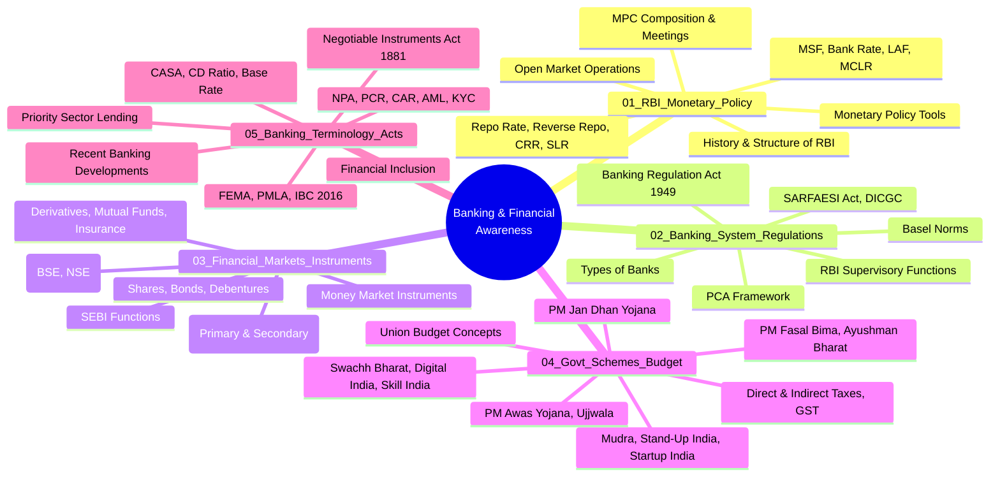

---
id: index
slug: /banking-financial-awareness
title: "Banking & Financial Awareness"
sidebar_label: "Banking & Financial Awareness"
sidebar_position: 6
---
# Banking & Financial Awareness

> A comprehensive course covering the Indian banking system, monetary policy, financial markets, government schemes, budget, and banking regulations — designed for IBPS SO, SBI PO, RBI Grade B, and other banking exams.

## Course Overview

## Chapters

| # | Chapter | Topics Covered |
|---|---------|----------------|
| 1 | RBI & Monetary Policy | History, structure, functions of RBI; repo rate, reverse repo, CRR, SLR, MSF, bank rate, LAF, MCLR; MPC; OMO |
| 2 | Banking System & Regulations | Types of banks, Banking Regulation Act 1949, SARFAESI, DICGC, Basel norms, PCA, RBI supervision |
| 3 | Financial Markets & Instruments | Capital market, money market, BSE/NSE, SEBI, shares, bonds, derivatives, mutual funds, IRDA |
| 4 | Government Schemes & Union Budget | Major schemes, budget concepts, fiscal deficit, revenue deficit, FRBM, direct/indirect taxes, GST |
| 5 | Banking Terminology & Acts | NI Act 1881, FEMA, PMLA, IBC 2016, NPA, PCR, CAR, AML, KYC, priority sector lending, financial inclusion |

## How to Use This Course

1. Read each chapter sequentially — concepts build on earlier chapters
2. Study the **Mermaid diagrams** to visualise complex relationships
3. Try the **TypeScript code examples** to see financial calculations in action
4. Attempt all **20 worked examples** in each chapter
5. Test yourself with the **Chapter Quiz** (5 questions)
6. Reinforce learning with the **30 practice exercises** at the end of each chapter
7. Refer to the **Practical Takeaways** tables for exam-focused revision

---

*Start with Chapter 1 — RBI & Monetary Policy*
