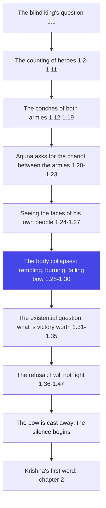
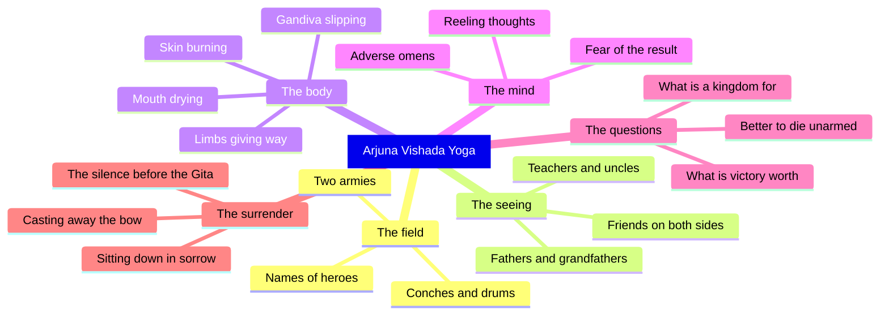

# Chapter 1: Arjuna Vishada Yoga — The Crisis of the Warrior

> "The bow falls from the greatest warrior's hand — and that falling is the first step of the whole Gita."
> — The Osho Way

---

This is not a chapter about war. It is a chapter about what happens inside a man when everything he believed in stands up in front of him and says: look at me. Arjuna, the greatest archer of his age, arrives at Kurukshetra with his brothers, his teachers, his uncles, his grandfather — and then he cannot lift his bow. His body trembles, his mouth dries, his skin burns, and the Gandiva slips from his hand. Before a single arrow is shot, the battlefield has already claimed its first casualty: Arjuna's sense of who he is.

Read the traditional way, this chapter is a tragedy — the warrior who failed at the moment of glory. Read the Osho way, it is the most honest moment in the whole Mahabharata. A dead man asks no questions. A machine never trembles. Arjuna trembles because he has suddenly seen what he could not see through twenty years of victories: that the people on the other side are his people. The crisis is not his weakness — the crisis is the door. Through that door, in the next seventeen chapters, Krishna will walk with the whole of the Gita.

In this chapter, watch how the mind collapses in stages. First the numbers and the names — the counting of heroes, the blasting of conches, the roar of armies. Then the seeing — the moment Arjuna actually looks at the faces. Then the body — the symptoms of a man whose deepest values are in revolt. Then the questions — not the questions of politics, but the questions of existence: what is victory worth? What is a kingdom worth if it is built on the blood of the ones you love? Arjuna's "I will not fight" is not an answer. It is the first honest question of the Gita. And Krishna — the friend who drives the chariot — does not argue. He waits, and smiles, and the Gita begins.

## Learning Objectives

After completing this chapter you will be able to:

1. **Situate Vishada Yoga** — understand where this chapter stands in the Mahabharata and why the Gita deliberately opens with defeat, not with victory.
2. **Read crisis through the Osho lens** — see Arjuna's breakdown not as a disease to be cured but as the doorway through which transformation enters.
3. **Trace the anatomy of collapse** — map the stages: counting and conches, seeing faces, bodily symptoms, existential questions, and the final refusal.
4. **Distinguish the two readings** — compare the traditional reading of dharma, family duty and varna dharma with the Osho reading of honesty, awareness and the questioning mind.
5. **Apply the psychology of the chapter** — recognise the six symptoms of Arjuna's crisis in your own life: anxiety, attachment-confusion, identity loss, fear of results, paralysis and the wish to run away.
6. **Build a TypeScript tool** — create the Bow-Drop Detector, a runnable program that scores journal entries against the crisis symptoms of Vishada Yoga and prints an Osho-style reading.

---

## Vishada Yoga at a Glance

### The scene and the speakers

The Mahabharata is the longest epic poem in the world, and the Bhagavad Gita sits inside it like a jewel in a crown — in the middle of the Bhishma Parva, as two vast armies face each other on the plain of Kurukshetra. Dhritarashtra, the blind king, cannot see the field; his charioteer-like boon, the all-seeing Sanjaya, narrates every event to him. The first speaker is Dhritarashtra himself, and his first question — "what did my sons and the sons of Pandu do?" — becomes the frame of the entire Gita. The second speaker is Sanjaya, the reporter with divine sight. Then Duryodhana speaks, counting his heroes to his teacher Drona. Then Arjuna speaks — and for the last time in the epic, he speaks like a man in command. After that, the man who could shoot through the eye of a moving fish cannot even hold his bow.

### The Osho lens

Osho reads this chapter as a study in inner revolution. The outer Kurukshetra is only the mirror; the real battlefield is inside every man. Arjuna's old identity — the kshatriya, the winner, the obedient disciple — shatters in a single glance, and in that shattering, a new man is about to be born. Osho's key insight: the crisis is not the enemy of transformation; it is the gate. A man who has never fallen has no reason to seek; a man who has never asked has no capacity to hear. The whole Gita is possible only because Arjuna first becomes empty — weaponless, wordless, in tears — and emptiness is the beginning of receptivity. Krishna does not begin teaching while Arjuna is still full of himself. He waits until the bow falls.

### The structure of the chapter

This chapter of 47 shlokas moves in three movements:

1. **Movement 1: 1.1–1.19 — The two armies and the conches.** The blind king's question, the counting of warriors on both sides, the blasting of conches and drums. Osho reads this as the mind's first layer: the world of names, numbers, and noise — the layer in which Arjuna is still functioning as a soldier.
2. **Movement 2: 1.20–1.35 — Seeing and collapsing.** Arjuna asks Krishna to park the chariot between the armies, looks at the faces — fathers, grandfathers, teachers, uncles, sons, friends — and the edifice of duty begins to crack. This is the heart of the chapter: the moment when the general stops being a general and becomes a grandson, a nephew, a friend.
3. **Movement 3: 1.36–1.47 — The refusal.** Arjuna reasons, argues, weeps, and finally sits down on the chariot seat and throws down his bow: "I will not fight." The chapter ends in silence — and that silence is the pregnant pause out of which Krishna's teaching will be born.

### The three-framework note

The Gita's later chapters will name three great paths — Karma Yoga (action without attachment), Bhakti Yoga (love and surrender), and Jnana Yoga (knowledge and awareness). In this first chapter, none of the three has begun; the chapter is pure preparation. Arjuna stands at zero. He has not yet found action, love, or knowledge — he has only found his own confusion. That is why Osho calls Vishada Yoga the soil: every seed that Krishna will plant in the next seventeen chapters falls first into this broken ground. The crisis is the common root of all three paths.

## Traditional Reading vs Osho-Style Reading

| Dimension | Traditional reading | Osho-style reading |
|--------|---------------------|--------------------|
| Arjuna's collapse | A failure of dharma, born of moh (delusion) and attachment to family | The most honest response available to a living man; the machine breaks so the man can wake |
| The meaning of the crisis | A sorrow to be removed so that duty can proceed | A doorway to be entered; the crisis is the beginning of transformation |
| Arjuna's "I will not fight" | An act of cowardice to be corrected | A great "no" that clears the ground for a greater "yes" |
| Krishna's silence | A pause before instruction begins | The master's patience: never answer a man while he is still full of himself |
| Kurukshetra | A historical battlefield between two royal families | The inner field of every human being, where the self meets itself |
| The goal of the chapter | To set the stage for Krishna's sermon | To empty Arjuna completely, because emptiness alone can receive the Gita |

## The Complete Text — All 47 Shlokas

### Shloka 1.1 — The Blind King's Question

> धृतराष्ट्र उवाच |
> धर्मक्षेत्रे कुरुक्षेत्रे समवेता युयुत्सवः |
> मामकाः पाण्डवाश्चैव किमकुर्वत सञ्जय

**Transliteration:** dhṛtarāṣṭra uvāca . dharmakṣetre kurukṣetre samavetā yuyutsavaḥ . māmakāḥ pāṇḍavāścaiva kimakurvata sañjaya

**Translation:** Dhritarashtra said: On the field of dharma, the field of Kuru, when my sons and the sons of Pandu had gathered together eager for battle — what did they do, O Sanjaya?

**Osho Darshan:** The Gita begins with a blind man's question. Dhritarashtra has divine eyes lent to him through Sanjaya, yet he remains blind — because his blindness is not of the eyes but of the heart, which refuses to see what his sons are. Notice: he does not ask "what is right?" He asks "what happened?" Osho points out that having eyes and seeing are two different things; the first question of the Gita already contains the whole human tragedy — a man who could see everything except his own greed.

### Shloka 1.2 — The First Report

> सञ्जय उवाच |
> दृष्ट्वा तु पाण्डवानीकं व्यूढं दुर्योधनस्तदा |
> आचार्यमुपसंगम्य राजा वचनमब्रवीत्

**Transliteration:** sañjaya uvāca . dṛṣṭvā tu pāṇḍavānīkaṃ vyūḍhaṃ duryodhanastadā . ācāryamupasaṃgamya rājā vacanamabravīt

**Translation:** Sanjaya said: Having seen the army of the Pandavas drawn up in battle formation, King Duryodhana approached his teacher, Drona, and spoke these words.

**Osho Darshan:** Watch the psychology of Duryodhana — the first thing he does after seeing the enemy's perfect formation is to run to his teacher. A man in anxiety does not think; he clings to authority. Osho says this is the ordinary mind's reflex: whenever the world confronts us, we look for someone else to carry the fear. Arjuna will do the opposite — he will stand alone with his question. That difference between the two armies is the whole story of the Gita.

### Shloka 1.3 — The Disciple's Army

> पश्यैतां पाण्डुपुत्राणामाचार्य महतीं चमूम् |
> व्यूढां द्रुपदपुत्रेण तव शिष्येण धीमता

**Transliteration:** paśyaitāṃ pāṇḍuputrāṇāmācārya mahatīṃ camūm . vyūḍhāṃ drupadaputreṇa tava śiṣyeṇa dhīmatā

**Translation:** Behold, O teacher, this mighty army of the sons of Pandu, drawn up in battle order by the son of Drupada, your own wise disciple.

**Osho Darshan:** The irony is delicious and Osho would laugh at it: Drona's own pupil, Dhrishtadyumna, has arranged the enemy's forces against Drona. The disciple has turned the master's teaching against the master. This is the first of the chapter's many mirrors — the man you shaped may be the man who confronts you. Life is not a simple story of friends and enemies; the closest teacher can face you from the other side of the field.

### Shloka 1.4 — The Heroes of the Pandava Side

> अत्र शूरा महेष्वासा भीमार्जुनसमा युधि |
> युयुधानो विराटश्च द्रुपदश्च महारथः

**Transliteration:** atra śūrā maheṣvāsā bhīmārjunasamā yudhi . yuyudhāno virāṭaśca drupadaśca mahārathaḥ

**Translation:** Here are heroes, mighty archers equal in battle to Bhima and Arjuna — Yuyudhana, Virata, and Drupada, the great warrior of the great chariot.

**Osho Darshan:** The mind counts, names, and categorises. Duryodhana's speech is a roll call of fear — he is trying to convince himself by counting his enemy's strength. Osho notes that this is what the frightened mind does everywhere: it makes inventories of danger. But no inventory has ever calmed a trembling heart; you cannot count your way to courage. Courage arrives only when counting stops and seeing begins.

### Shloka 1.5 — More Names of the Enemy

> धृष्टकेतुश्चेकितानः काशिराजश्च वीर्यवान् |
> पुरुजित्कुन्तिभोजश्च शैब्यश्च नरपुंगवः

**Transliteration:** dhṛṣṭaketuścekitānaḥ kāśirājaśca vīryavān . purujitkuntibhojaśca śaibyaśca narapuṃgavaḥ

**Translation:** Dhrishtaketu, Chekitana, and the valiant king of Kashi; Purujit, Kuntibhoja, and Shaibya, the best of men.

**Osho Darshan:** The list grows longer, and with every name Duryodhana's anxiety grows. Osho's point is subtle: the mind that collects threats is the same mind that collects trophies — both are attempts to build a solid self out of outer things. Duryodhana is not reporting an army; he is reporting his own fear in the language of names. Until a man stops measuring the world, he has not met the world at all — he has only met his own measurements.

### Shloka 1.6 — The Great Chariot Warriors

> युधामन्युश्च विक्रान्त उत्तमौजाश्च वीर्यवान् |
> सौभद्रो द्रौपदेयाश्च सर्व एव महारथाः

**Transliteration:** yudhāmanyuśca vikrānta uttamaujāśca vīryavān . saubhadro draupadeyāśca sarva eva mahārathāḥ

**Translation:** The strong Yudhamanyu and the brave Uttamaujas; the son of Subhadra and the sons of Draupadi — all of them warriors of the great chariot.

**Osho Darshan:** The roll call ends with the young — Abhimanyu, the sons of Draupadi. In the midst of this arithmetic of war, the future stands on the field. Osho would say: watch how every generation inherits the wars it never chose. The young are always there, on both sides, carrying the ambitions of their elders. The tragedy of Kurukshetra is not that great warriors die; it is that the young die first for the pride of the old.

### Shloka 1.7 — The Count on Our Side

> अस्माकं तु विशिष्टा ये तान्निबोध द्विजोत्तम |
> नायका मम सैन्यस्य संज्ञार्थं तान्ब्रवीमि ते

**Transliteration:** asmākaṃ tu viśiṣṭā ye tānnibodha dvijottama . nāyakā mama sainyasya saṃjñārthaṃ tānbravīmi te

**Translation:** Now know the most distinguished on our side, O best of the twice-born — the leaders of my army; for your information, I name them to you.

**Osho Darshan:** Notice the shift — the enemy's heroes were counted first, then our own. The frightened mind always assesses the other side before it assesses itself; the question "who are they?" precedes the deeper question "who am I?" Duryodhana's speech is a speech of comparison, and Osho says comparison is the root of all misery. As long as you live by comparing, you will never know the one thing that is incomparable — your own being.

### Shloka 1.8 — The Grandsire and the Teachers

> भवान्भीष्मश्च कर्णश्च कृपश्च समितिञ्जयः |
> अश्वत्थामा विकर्णश्च सौमदत्तिस्तथैव च

**Transliteration:** bhavānbhīṣmaśca karṇaśca kṛpaśca samitiñjayaḥ . aśvatthāmā vikarṇaśca saumadattistathaiva ca

**Translation:** Yourself, O Drona, and Bhishma, and Karna, and Kripa the victorious in war; Ashvatthama, Vikarna, and also the son of Somadatta.

**Osho Darshan:** Here the names belong to the family itself — the teacher Drona, the grandsire Bhishma. The lines that will tear Arjuna apart are already drawn here: the men he loves are on the side he calls the enemy. Osho's insight: war is not the exception in human life — it is the rule of the divided heart. Every man carries both sides inside himself, the loved and the hated, and the tragedy begins when he forgets that they are one family.

### Shloka 1.9 — Many Others, Ready to Die

> अन्ये च बहवः शूरा मदर्थे त्यक्तजीविताः |
> नानाशस्त्रप्रहरणाः सर्वे युद्धविशारदाः

**Transliteration:** anye ca bahavaḥ śūrā madarthe tyaktajīvitāḥ . nānāśastrapraharaṇāḥ sarve yuddhaviśāradāḥ

**Translation:** And many other heroes, ready to give up their lives for my sake, armed with all manner of weapons, all of them skilled in war.

**Osho Darshan:** "Ready to give up their lives for my sake" — the phrase is grand, and Osho would ask: whose sake, really? Men die for kings while the kings die for no one. Duryodhana believes these men are dying for him, but he does not even know what he is dying for. The unexamined cause is the most dangerous cause; before you die for something, find out what it is. Most men in Duryodhana's army never asked that question — and their lives were spent for a throne that was not even their own.

### Shloka 1.10 — The Limit of Strength

> अपर्याप्तं तदस्माकं बलं भीष्माभिरक्षितम् |
> पर्याप्तं त्विदमेतेषां बलं भीमाभिरक्षितम्

**Transliteration:** aparyāptaṃ tadasmākaṃ balaṃ bhīṣmābhirakṣitam . paryāptaṃ tvidameteṣāṃ balaṃ bhīmābhirakṣitam

**Translation:** This army of ours, protected by Bhishma, is not enough; while that army of theirs, protected by Bhima, is enough.

**Osho Darshan:** Here is the confession of the anxious mind in its purest form: we are never enough, they are always enough. Osho says this equation is written in every human heart — the mind that compares always finds itself insufficient. And notice the absurdity: the Kauravas had more warriors, more weapons, more teachers, and still Duryodhana feels poor. No amount of outer strength can fill an inner emptiness. That emptiness is the real battlefield.

### Shloka 1.11 — Protect Bhishma Alone

> अयनेषु च सर्वेषु यथाभागमवस्थिताः |
> भीष्ममेवाभिरक्षन्तु भवन्तः सर्व एव हि

**Transliteration:** ayaneṣu ca sarveṣu yathābhāgamavasthitāḥ . bhīṣmamevābhirakṣantu bhavantaḥ sarva eva hi

**Translation:** Therefore, take your positions in all the divisions, each at your own post, and protect Bhishma above all — all of you.

**Osho Darshan:** The plan is sensible and utterly useless. Duryodhana's hope rests on one man — as if a single shield could protect a crumbling kingdom. Osho observes that the anxious mind always does this: it locates all its hope in one person, one job, one belief, and then guards that single point while the whole structure rots. The Gita's answer, later, will be that no one outside you can be your protection — awareness alone is the fortress that never falls.

### Shloka 1.12 — The Lion's Roar

> तस्य सञ्जनयन्हर्षं कुरुवृद्धः पितामहः |
> सिंहनादं विनद्योच्चैः शङ्खं दध्मौ प्रतापवान् |

**Transliteration:** tasya sañjanayanharṣaṃ kuruvṛddhaḥ pitāmahaḥ . siṃhanādaṃ vinadyoccaiḥ śaṅkhaṃ dadhmau pratāpavān

**Translation:** To cheer Duryodhana, the glorious grandsire of the Kurus, roaring like a lion, blew his conch with a mighty sound.

**Osho Darshan:** Bhishma roars to cheer a boy who is trembling inside. Osho would smile at this — the roar of the grandsire is meant to console the grandson, but no roar can console a heart that knows the truth. The lion's sound fills the field, yet it cannot fill Duryodhana's emptiness for a single moment. All the noise we make — the shouting, the slogans, the bluster — is the world's attempt to drown the inner question. But the question survives every conch.

### Shloka 1.13 — The Tumultuous Sound

> ततः शङ्खाश्च भेर्यश्च पणवानकगोमुखाः |
> सहसैवाभ्यहन्यन्त स शब्दस्तुमुलोऽभवत्

**Transliteration:** tataḥ śaṅkhāśca bheryaśca paṇavānakagomukhāḥ . sahasaivābhyahanyanta sa śabdastumulo.abhavat

**Translation:** Then conches and kettledrums, tabors, drums and cow-horns blared forth all at once, and the sound became tremendous.

**Osho Darshan:** The noise rises to its peak — the whole field is sound. And Osho asks: what is all this noise? It is the noise of the mind itself, the constant chattering that keeps a man from hearing his own being. The Gita will later teach a silence deeper than all conches; but first, the chapter shows us the human condition at full volume. Only in that deafening noise does Arjuna's inner silence begin — and from that silence, the question is born.

### Shloka 1.14 — The White Horses and the Divine Conches

> ततः श्वेतैर्हयैर्युक्ते महति स्यन्दने स्थितौ |
> माधवः पाण्डवश्चैव दिव्यौ शङ्खौ प्रदध्मतुः

**Transliteration:** tataḥ śvetairhayairyukte mahati syandane sthitau . mādhavaḥ pāṇḍavaścaiva divyau śaṅkhau pradadhmatuḥ

**Translation:** Then, seated in the magnificent chariot yoked with white horses, Madhava and the son of Pandu blew their divine conches.

**Osho Darshan:** For the first time Krishna enters the soundscape — the charioteer and the warrior blow their conches together. The divine and the human sound in unison, though neither knows yet what the day will bring. Osho would point to this image: the master does not take the bow from Arjuna's hand; he stands beside him in the same chariot, blowing the same conch. The teacher's work is not to fight your battle but to stand with you in it, and to wait for the moment when you are ready to hear.

### Shloka 1.15 — Panchajanya, Devadatta, and Paundra

> पाञ्चजन्यं हृषीकेशो देवदत्तं धनञ्जयः |
> पौण्ड्रं दध्मौ महाशङ्खं भीमकर्मा वृकोदरः

**Transliteration:** pāñcajanyaṃ hṛṣīkeśo devadattaṃ dhanañjayaḥ . pauṇḍraṃ dadhmau mahāśaṅkhaṃ bhīmakarmā vṛkodaraḥ

**Translation:** Hrishikesha blew the Panchajanya, Arjuna blew the Devadatta, and Bhima, of terrible deeds and wolf-like belly, blew the great conch Paundra.

**Osho Darshan:** Each warrior has his own conch, his own signature sound — the instruments of identity. Osho says every man goes through life blowing his own name, his own reputation, his own little conch, hoping the world will recognise him. And then one day the conch slips from the lips and the identity falls silent. That silence is terrifying for most — but for Arjuna, on this very field, it will become the beginning of the search for the one who was blowing the conch all along.

### Shloka 1.16 — The King's Anantavijaya

> अनन्तविजयं राजा कुन्तीपुत्रो युधिष्ठिरः |
> नकुलः सहदेवश्च सुघोषमणिपुष्पकौ

**Transliteration:** anantavijayaṃ rājā kuntīputro yudhiṣṭhiraḥ . nakulaḥ sahadevaśca sughoṣamaṇipuṣpakau

**Translation:** King Yudhishthira, the son of Kunti, blew the Anantavijaya; Nakula and Sahadeva blew the Sughosha and the Manipushpaka.

**Osho Darshan:** The names of the conches tell their own story — "endless victory," "sweet sound," "jewel-flower." Every name is a hope, a wish pressed into a shell. Osho notes that the whole war is being fought for these names — for the sound of victory and the flower of power. And the cruel joke is that the names never survive the reality; Anantavijaya announces a victory that will leave everyone on the field weeping. The only endless victory is the one no conch announces.

### Shloka 1.17 — The Unconquered Satyaki

> काश्यश्च परमेष्वासः शिखण्डी च महारथः |
> धृष्टद्युम्नो विराटश्च सात्यकिश्चापराजितः

**Transliteration:** kāśyaśca parameṣvāsaḥ śikhaṇḍī ca mahārathaḥ . dhṛṣṭadyumno virāṭaśca sātyakiścāparājitaḥ

**Translation:** The king of Kashi, an excellent archer, and Shikhandi, the great warrior of the chariot; Dhrishtadyumna, Virata, and Satyaki, the never-conquered.

**Osho Darshan:** "Never-conquered" — the epithet Osho would pause on. No man has ever been unconquered except in the stories we tell ourselves; every hero has his Kurukshetra waiting. The word aparajita is the mind's own boast, and the field will soon show that the unconquered are conquered not by the enemy but by their own confusion. Arjuna himself has never been defeated in battle — yet he will fall before a thought. The greatest enemies never wear armour.

### Shloka 1.18 — The Blowing of the Pandava Conches

> द्रुपदो द्रौपदेयाश्च सर्वशः पृथिवीपते |
> सौभद्रश्च महाबाहुः शङ्खान्दध्मुः पृथक्पृथक्

**Transliteration:** drupado draupadeyāśca sarvaśaḥ pṛthivīpate . saubhadraśca mahābāhuḥ śaṅkhāndadhmuḥ pṛthakpṛthak

**Translation:** Drupada and the sons of Draupadi, O lord of the earth, and the mighty-armed son of Subhadra blew their conches, each his own.

**Osho Darshan:** Each man blows his own conch — the sound of individuality rising together into one chorus. Osho says this is the paradox of human life: each of us is utterly alone in his own skin, yet we are all sounding together on one field. The Pandavas are not yet one; they are a collection of solos. The Gita will slowly teach what real unity is — not the unity of a marching army, but the unity of beings who have found the same source inside themselves.

### Shloka 1.19 — The Sound That Rent Hearts

> स घोषो धार्तराष्ट्राणां हृदयानि व्यदारयत् |
> नभश्च पृथिवीं चैव तुमुलोऽभ्यनुनादयन् (or लोव्यनु)

**Transliteration:** sa ghoṣo dhārtarāṣṭrāṇāṃ hṛdayāni vyadārayat . nabhaśca pṛthivīṃ caiva tumulo.abhyanunādayan (lo vyanu)

**Translation:** That tremendous sound rent the hearts of Dhritarashtra's sons, and echoed across both heaven and earth.

**Osho Darshan:** The sound that fills the sky is the same sound that tears the heart — the loudest roar is the one you hear inside. Osho says every man has his own Pandava conches, the events that shake him to the core before any arrow is fired. Duryodhana's heart is already broken before the war begins; the armies are intact, the weapons are new, and still the heart is already defeated. No enemy has ever needed to conquer a man who has already surrendered to his own fear.

### Shloka 1.20 — The Bow Is Raised

> अथ व्यवस्थितान्दृष्ट्वा धार्तराष्ट्रान् कपिध्वजः |
> प्रवृत्ते शस्त्रसम्पाते धनुरुद्यम्य पाण्डवः |
> हृषीकेशं तदा वाक्यमिदमाह महीपते

**Transliteration:** atha vyavasthitāndṛṣṭvā dhārtarāṣṭrān kapidhvajaḥ . pravṛtte śastrasampāte dhanurudyamya pāṇḍavaḥ

**Translation:** Then, seeing the sons of Dhritarashtra standing arrayed, as the discharge of weapons was about to begin, Arjuna, whose banner bore the monkey, took up his bow, O lord of the earth, and spoke this word to Hrishikesha.

**Osho Darshan:** The banner of the monkey — the symbol of the restless mind — flies over Arjuna's chariot. Osho reads the symbols of the field like a dream: the monkey is the mind that never sits still, jumping from branch to branch, and the banner says plainly who really drives this chariot. Arjuna takes up his bow, and in the next moment he will set it down forever. The bow is raised not to shoot, but to be abandoned — the whole journey of the Gita begins with an act of surrender.

### Shloka 1.21 — Place the Chariot Between the Armies

> अर्जुन उवाच |
> सेनयोरुभयोर्मध्ये रथं स्थापय मेऽच्युत

**Transliteration:** hṛṣīkeśaṃ tadā vākyamidamāha mahīpate . arjuna uvāca . senayorubhayormadhye rathaṃ sthāpaya me.acyuta

**Translation:** Arjuna said: Place my chariot in the middle between the two armies, O Achyuta, the changeless one.

**Osho Darshan:** "Between the two armies" — Osho says this is the first prayer of the Gita, and it is a prayer for clarity, not for victory. Arjuna does not ask Krishna for power or for protection; he asks to be taken to the centre, where both sides can be seen. Every seeker eventually makes this request: take me to the place where I can see both my desires and my fears, both my duties and my loves. The centre of the field is the only honest place to stand, and it is always the most dangerous.

### Shloka 1.22 — Let Me See

> यावदेतान्निरीक्षेऽहं योद्धुकामानवस्थितान् |
> कैर्मया सह योद्धव्यमस्मिन् रणसमुद्यमे

**Transliteration:** yāvadetānnirikṣe.ahaṃ yoddhukāmānavasthitān . kairmayā saha yoddhavyamasmin raṇasamudyame

**Translation:** So that I may behold these who stand here eager to fight, and know with whom I must fight in this great enterprise of battle.

**Osho Darshan:** The warrior wants to see. It is the most innocent and the most revolutionary request possible on a battlefield: before I kill, let me see whom I am killing. Osho calls this the birth of consciousness in Arjuna — the moment the act stops being automatic and becomes observed. Every life has this moment, when the pattern stops repeating blindly and a man asks, with full attention: with whom, really, am I fighting? That question changes everything.

### Shloka 1.23 — Those Who Please the Evil-Minded

> योत्स्यमानानवेक्षेऽहं य एतेऽत्र समागताः |
> धार्तराष्ट्रस्य दुर्बुद्धेर्युद्धे प्रियचिकीर्षवः

**Transliteration:** yotsyamānānavekṣe.ahaṃ ya ete.atra samāgatāḥ . dhārtarāṣṭrasya durbuddheryuddhe priyacikīrṣavaḥ

**Translation:** For I wish to observe those assembled here to fight — those who, wishing to please the evil-minded son of Dhritarashtra, have come to battle.

**Osho Darshan:** "Durbuddhi" — evil-minded — is Arjuna's word for Duryodhana, and Osho would stop him there: look, Arjuna, the moment you call the other evil, the war has already won you. This is how the mind prepares itself to kill — by renaming. Once a man becomes "the evil-minded one," he can be destroyed without guilt. But Arjuna is about to discover that the same eyes that see his enemy's evil see his teacher's face, and no name can protect him from that sight.

### Shloka 1.24 — The Chariot Is Placed

> सञ्जय उवाच |
> एवमुक्तो हृषीकेशो गुडाकेशेन भारत |
> सेनयोरुभयोर्मध्ये स्थापयित्वा रथोत्तमम्

**Transliteration:** sañjaya uvāca . evamukto hṛṣīkeśo guḍākeśena bhārata . senayorubhayormadhye sthāpayitvā rathottamam

**Translation:** Sanjaya said: Thus addressed by Gudakesha, Hrishikesha stationed that best of chariots in the middle of the two armies, O Bharata.

**Osho Darshan:** Krishna obeys. The Lord of the senses becomes the charioteer of the man who is about to lose all control of his senses — and he obeys without a single word of protest. Osho says this is the signature of the real master: he takes you exactly where you ask to go, because he knows that the crisis you request is the cure you need. Krishna does not drive Arjuna to the safety of the rear; he drives him into the centre of the field, into the very heart of the confrontation.

### Shloka 1.25 — Behold the Kurus Gathered

> भीष्मद्रोणप्रमुखतः सर्वेषां च महीक्षिताम् |
> उवाच पार्थ पश्यैतान्समवेतान्कुरूनिति

**Transliteration:** bhīṣmadroṇapramukhataḥ sarveṣāṃ ca mahīkṣitām . uvāca pārtha paśyaitānsamavetānkurūniti

**Translation:** Facing Bhishma, Drona, and all the rulers of the earth, he said: O Partha, behold these Kurus gathered together.

**Osho Darshan:** "Behold" — Krishna's first teaching is a single word: see. He does not explain, he does not console, he simply exposes Arjuna to the sight. Osho says the whole Gita is contained in that command — pasya, look. All meditation is learning to look without running, without judging, without planning. Arjuna looks, and what he sees breaks him. But the breaking is the beginning; the man who cannot bear to see cannot begin to change.

### Shloka 1.26 — Fathers, Grandfathers, Teachers

> तत्रापश्यत्स्थितान्पार्थः पितॄनथ पितामहान् |
> आचार्यान्मातुलान्भ्रातॄन्पुत्रान्पौत्रान्सखींस्तथा

**Transliteration:** tatrāpaśyatsthitānpārthaḥ pitṝnatha pitāmahān . ācāryānmātulānbhrātṛnputrānpautrānsakhīṃstathā

**Translation:** There Arjuna saw standing: fathers and grandfathers, teachers, maternal uncles, brothers, sons, grandsons, and friends too.

**Osho Darshan:** This is the inventory of a whole life in one line — every relationship a man builds in sixty years, standing on a field and waiting to be killed. Osho says the world is not a collection of objects; it is a web of faces. And when the web becomes visible all at once, the abstract idea of "enemy" collapses. Arjuna's tragedy is that he sees too clearly, too late; his liberation will be that he sees at all. Most men die without ever having seen the faces behind their wars.

### Shloka 1.27 — Filled with Deep Pity

> श्वशुरान्सुहृदश्चैव सेनयोरुभयोरपि |
> तान्समीक्ष्य स कौन्तेयः सर्वान्बन्धूनवस्थितान्

**Transliteration:** śvaśurānsuhṛdaścaiva senayorubhayorapi . tānsamīkṣya sa kaunteyaḥ sarvānbandhūnavasthitān

**Translation:** Fathers-in-law and friends as well, in both the armies — seeing all these kinsmen standing arrayed, the son of Kunti was overcome with deep pity.

**Osho Darshan:** "In both armies" — the line Osho treasures. The family is split down the middle; the same blood stands on both sides of the field. This is the human condition itself: the friend and the foe are often the same person, the same blood. Arjuna's pity is not weakness — it is the first true perception of the unity beneath the division. The body may choose a side, but the heart knows no sides. The Gita begins at the moment this knowledge becomes unbearable.

### Shloka 1.28 — Arjuna Speaks in Sorrow

> कृपया परयाविष्टो विषीदन्निदमब्रवीत् |
> अर्जुन उवाच |
> दृष्ट्वेमं स्वजनं कृष्ण युयुत्सुं समुपस्थितम्

**Transliteration:** kṛpayā parayāviṣṭo viṣīdannidamabravīt . arjuna uvāca . dṛṣṭvemaṃ svajanaṃ kṛṣṇa yuyutsuṃ samupasthitam

**Translation:** Filled with deep compassion, sorrowing, he spoke these words. Arjuna said: Seeing these my own people, O Krishna, standing here eager for battle...

**Osho Darshan:** "My own people" — the word svajana changes everything. Once a man has said "mine" about the enemy, the war is already lost, and in that loss there is a secret victory. Osho says compassion (karuna) is the only force that can dissolve the illusion of separation; the moment it arises, killing becomes impossible for the honest man. Arjuna is honest, so he breaks. And because he breaks, he becomes teachable. Pity is not the end of the path — it is the first step of the path.

### Shloka 1.29 — The Body Speaks First

> सीदन्ति मम गात्राणि मुखं च परिशुष्यति |
> वेपथुश्च शरीरे मे रोमहर्षश्च जायते

**Transliteration:** sīdanti mama gātrāṇi mukhaṃ ca pariśuṣyati . vepathuśca śarīre me romaharṣaśca jāyate

**Translation:** My limbs give way, my mouth dries up, my body trembles, and my hair stands on end.

**Osho Darshan:** The body speaks before the mind confesses. Osho says the body is the most honest thing about you — it cannot lie, cannot pretend, cannot maintain face. Arjuna's limbs fail because his whole being refuses the act that his logic is still defending. Modern psychology would call this a panic attack; Osho calls it the wisdom of the organism. When body, mind, and soul all say no, it is not a disease — it is a message. The question is whether you will hear it.

### Shloka 1.30 — The Gandiva Slips

> गाण्डीवं स्रंसते हस्तात्त्वक्चैव परिदह्यते |
> न च शक्नोम्यवस्थातुं भ्रमतीव च मे मनः

**Transliteration:** gāṇḍīvaṃ sraṃsate hastāttvakcaiva paridahyate . na ca śaknomyavasthātuṃ bhramatīva ca me manaḥ

**Translation:** The Gandiva slips from my hand, and my skin burns all over; I cannot stand, and my mind is reeling as if in circles.

**Osho Darshan:** The bow falls from the hand of the greatest archer — the symbol of all his power, all his training, all his identity — and the skin burns as if the fire were inside. Osho says this is the moment of total breakdown, and total breakdown is the only door to total transformation. Partial doubts heal themselves; only the complete collapse of the old man makes room for the new. The reeling mind is the mind letting go of its centre — and in that dizziness, the true centre is about to be found.

### Shloka 1.31 — Adverse Omens

> निमित्तानि च पश्यामि विपरीतानि केशव |
> न च श्रेयोऽनुपश्यामि हत्वा स्वजनमाहवे

**Transliteration:** nimittāni ca paśyāmi viparītāni keśava . na ca śreyo.anupaśyāmi hatvā svajanamāhave

**Translation:** I see adverse omens, O Kesava, and I see no good in killing my own people in this battle.

**Osho Darshan:** First the omens — the mind, when it cannot bear the truth, begins to read signs everywhere. Osho says omens are always found by those who are looking for an excuse to turn back. But behind the superstition there is a genuine perception: no shreyas, no real good, can come of killing one's own. Arjuna is reaching for reasons to justify what the heart already knows. The omens are the mind's last attempt to make the heart's truth sound respectable.

### Shloka 1.32 — What Is Victory Worth?

> न काङ्क्षे विजयं कृष्ण न च राज्यं सुखानि च |
> किं नो राज्येन गोविन्द किं भोगैर्जीवितेन वा

**Transliteration:** na kāṅkṣe vijayaṃ kṛṣṇa na ca rājyaṃ sukhāni ca . kiṃ no rājyena govinda kiṃ bhogairjīvitena vā

**Translation:** I do not desire victory, O Krishna, nor kingdom, nor pleasures. Of what use is dominion to us, O Govinda, of what use are enjoyments, or even life itself?

**Osho Darshan:** This is the existential question in its purest form — not "how do I win?" but "what is winning for?" Osho says this is the first truly philosophical utterance of the Gita: the moment a man asks about the meaning of the goal, the goal itself begins to dissolve. Victory, kingdom, pleasures — Arjuna names the whole catalogue of human ambition and finds it empty. The question is not despair; it is the beginning of the search for something that winning cannot give. That something will be the subject of the next seventeen chapters.

### Shloka 1.33 — Those for Whose Sake We Desired

> येषामर्थे काङ्क्षितं नो राज्यं भोगाः सुखानि च |
> त इमेऽवस्थिता युद्धे प्राणांस्त्यक्त्वा धनानि च

**Transliteration:** yeṣāmarthe kāṅkṣitaṃ no rājyaṃ bhogāḥ sukhāni ca . ta ime.avasthitā yuddhe prāṇāṃstyaktvā dhanāni ca

**Translation:** Those for whose sake we desired the kingdom, the enjoyments and the pleasures — they stand here in battle, having given up their lives and their wealth.

**Osho Darshan:** The purpose has inverted itself: the people for whom the kingdom was sought are the people who must die to get it. Osho says this is the universal trap of ambition — we begin by wanting things for the sake of people, and end by sacrificing the people for the sake of things. The kingdom was for the family; now the family must die for the kingdom. Arjuna is the rare man who sees the absurdity in time, before the blood is shed. Most see it only in hindsight, at the funeral.

### Shloka 1.34 — Teachers, Fathers, Sons

> आचार्याः पितरः पुत्रास्तथैव च पितामहाः |
> मातुलाः श्वशुराः पौत्राः श्यालाः सम्बन्धिनस्तथा

**Transliteration:** ācāryāḥ pitaraḥ putrāstathaiva ca pitāmahāḥ . mātulāḥ śvaśurāḥ pautrāḥ śyālāḥ sambandhinastathā

**Translation:** Teachers, fathers, sons, and also grandfathers; maternal uncles, fathers-in-law, grandsons, brothers-in-law, and other relatives.

**Osho Darshan:** The list is the map of a human life — every name a bond, every bond a claim on the heart. Osho says a man is not an island; he is the sum of his relationships, a walking network of memories, obligations and love. And here all of it stands on the field, waiting to be destroyed. Arjuna's breakdown is precisely this: the sudden recognition that the abstract "enemy" is made of concrete faces he has loved. Once seen, the abstraction can never be restored.

### Shloka 1.35 — Even for the Three Worlds

> एतान्न हन्तुमिच्छामि घ्नतोऽपि मधुसूदन |
> अपि त्रैलोक्यराज्यस्य हेतोः किं नु महीकृते

**Transliteration:** etānna hantumicchāmi ghnato.api madhusūdana . api trailokyarājyasya hetoḥ kiṃ nu mahīkṛte

**Translation:** I do not wish to kill these, O Madhusudana, even if they kill me — not even for the lordship of the three worlds; what then for the sake of the earth alone?

**Osho Darshan:** Not even for three worlds — the offer of total power is weighed against the faces of loved ones, and the faces win. Osho says this is the moment the soul asserts its own scale of values against the world's; the world measures by kingdoms, the soul measures by faces. Arjuna refuses the greatest bribe ever offered — dominion over everything — because he has seen something that no kingdom can replace. The Gita's whole teaching will be an exploration of this something: the love, the atman, the consciousness that no empire can buy.

### Shloka 1.36 — Only Sin Will Accrue

> निहत्य धार्तराष्ट्रान्नः का प्रीतिः स्याज्जनार्दन |
> पापमेवाश्रयेदस्मान्हत्वैतानाततायिनः

**Transliteration:** nihatya dhārtarāṣṭrānnaḥ kā prītiḥ syājjanārdana . pāpamevāśrayedasmānhatvaitānātatāyinaḥ

**Translation:** Having killed these sons of Dhritarashtra, what pleasure could be ours, O Janardana? Only sin would come to cling to us if we killed these aggressors.

**Osho Darshan:** "What pleasure could be ours?" — the question the conqueror never asks before the conquest. Osho says the victorious man of history is usually a man who never asked this question; he counted the spoils and never counted the joy. Arjuna is doing revolutionary accounting: he counts the inner price of victory, not the outer prize. Sin here is not a theological punishment but a psychological reality — the guilt that settles on a life that bought its throne with its own heart.

### Shloka 1.37 — How Can We Be Happy?

> तस्मान्नार्हा वयं हन्तुं धार्तराष्ट्रान्स्वबान्धवान् |
> स्वजनं हि कथं हत्वा सुखिनः स्याम माधव

**Transliteration:** tasmānnārhā vayaṃ hantuṃ dhārtarāṣṭrānsvabāndhavān . svajanaṃ hi kathaṃ hatvā sukhinaḥ syāma mādhava

**Translation:** Therefore we are not justified in killing the sons of Dhritarashtra, our own relatives; for how can we be happy, O Madhava, after killing our own people?

**Osho Darshan:** The argument is simple and devastating: happiness is the end, and this act makes happiness impossible. Osho says Arjuna has discovered the deepest principle of ethics — not duty, not law, but the simple question of whether the act leads to joy. A happiness that must wade through blood is no happiness; a victory that destroys the heart is no victory. The Gita will not contradict this question; it will only deepen it — asking what happiness is, and where it is really found.

### Shloka 1.38 — Blinded by Greed

> यद्यप्येते न पश्यन्ति लोभोपहतचेतसः |
> कुलक्षयकृतं दोषं मित्रद्रोहे च पातकम्

**Transliteration:** yadyapyete na paśyanti lobhopahatacetasaḥ . kulakṣayakṛtaṃ doṣaṃ mitradrohe ca pātakam

**Translation:** Though these, their minds corrupted by greed, see no evil in the destruction of families and no sin in hostility to friends...

**Osho Darshan:** "Their minds corrupted by greed" — Osho would point out that Arjuna can see the other side's blindness but not yet his own. Greed is never visible to the greedy; it is always the other man's disease. And yet, in this very blindness, Arjuna shows the first stirring of sight: he sees that some men act without seeing. The Gita's journey will be the journey of that sight turning inward — until the seer sees himself.

### Shloka 1.39 — Why Should We Not Turn Back?

> कथं न ज्ञेयमस्माभिः पापादस्मान्निवर्तितुम् |
> कुलक्षयकृतं दोषं प्रपश्यद्भिर्जनार्दन

**Transliteration:** kathaṃ na jñeyamasmābhiḥ pāpādasmānnivartitum . kulakṣayakṛtaṃ doṣaṃ prapaśyadbhirjanārdana

**Translation:** Why should we not learn to turn away from this sin, O Janardana — we who clearly see the evil in the destruction of the family?

**Osho Darshan:** To see is to be responsible. Once Arjuna has seen the evil, ignorance is no longer an excuse; the seeing makes him accountable for the choice. Osho says this is the meaning of consciousness: it converts instinct into responsibility. The animal kills without a second thought; the man who sees must choose. Arjuna has crossed the line into the human — the line where action is preceded by awareness. From here, there is no innocent way back.

### Shloka 1.40 — The Family Dharma Is Destroyed

> कुलक्षये प्रणश्यन्ति कुलधर्माः सनातनाः |
> धर्मे नष्टे कुलं कृत्स्नमधर्मोऽभिभवत्युत

**Transliteration:** kulakṣaye praṇaśyanti kuladharmāḥ sanātanāḥ . dharme naṣṭe kulaṃ kṛtsnamadharmo.abhibhavatyuta

**Translation:** In the destruction of the family, the eternal rites and duties of the family perish; and when dharma perishes, adharma overwhelms the whole family.

**Osho Darshan:** Arjuna now reasons like a sociologist: the family is the carrier of values, and when the family dies, the values die with it. Osho says this is true, but with a deeper turn: the family that matters is the inner family — the patterns, traditions, and habits that live inside you. When you kill your inner continuity, adharma floods in. The Gita's real answer will be that no external structure can preserve dharma; only the living awareness inside a man can keep it alive.

### Shloka 1.41 — The Corruption of the Women

> अधर्माभिभवात्कृष्ण प्रदुष्यन्ति कुलस्त्रियः |
> स्त्रीषु दुष्टासु वार्ष्णेय जायते वर्णसङ्करः

**Transliteration:** adharmābhibhavātkṛṣṇa praduṣyanti kulastriyaḥ . strīṣu duṣṭāsu vārṣṇeya jāyate varṇasaṅkaraḥ

**Translation:** From the prevalence of adharma, O Krishna, the women of the family become corrupted; and when women are corrupted, O Varshneya, the intermixture of castes arises.

**Osho Darshan:** This is Arjuna at his most traditional — the voice of the establishment frightened for its structures. Osho would not lecture the verse but peel it: beneath the old sociology is a genuine insight about the fabric of society, that when honour is broken in one place it cracks everywhere. But the Gita's deeper teaching will replace this fear with a truth: no caste, no family law, no arrangement of the world can protect the human being — only inner transformation can. Arjuna is still looking for outer protection; Krishna will show him the inner fortress.

### Shloka 1.42 — The Ancestors Fall

> सङ्करो नरकायैव कुलघ्नानां कुलस्य च |
> पतन्ति पितरो ह्येषां लुप्तपिण्डोदकक्रियाः

**Transliteration:** saṅkaro narakāyaiva kulaghnānāṃ kulasya ca . patanti pitaro hyeṣāṃ luptapiṇḍodakakriyāḥ

**Translation:** The intermixture of castes leads to hell the destroyers of the family and the family itself; for their ancestors fall, deprived of the offerings of rice and water.

**Osho Darshan:** Now the fear reaches into the afterlife — the ancestors, the offerings, the fallen. Osho says this is how the mind escalates: first the body trembles, then the kingdom, then the family, then the dead. But notice what Arjuna is really doing — he is building a case so complete that Krishna will have to release him from the battle. Every argument is a wall against the truth. The truth will not be argued with; it will be shown, in the light of a wisdom Arjuna does not yet possess.

### Shloka 1.43 — The Eternal Rites Destroyed

> दोषैरेतैः कुलघ्नानां वर्णसङ्करकारकैः |
> उत्साद्यन्ते जातिधर्माः कुलधर्माश्च शाश्वताः

**Transliteration:** doṣairetaiḥ kulaghnānāṃ varṇasaṅkarakārakaiḥ . utsādyante jātidharmāḥ kuladharmāśca śāśvatāḥ

**Translation:** By these evil deeds of the destroyers of the family, which cause the intermixture of castes, the eternal rites of the caste and the family are uprooted.

**Osho Darshan:** The spiral tightens: one act, and the eternal structures fall. Osho would smile at the word "eternal" — nothing made by men is eternal; every institution dies, and new ones are born. Arjuna is mourning the loss of structures, but the Gita points to something that no structure can lose: the immortal consciousness within. The whole argument of this chapter is based on the premise that the self is fragile, that it depends on family, ritual, and name. Krishna's answer will demolish that premise at its root.

### Shloka 1.44 — The Inevitable Dwelling in Hell

> उत्सन्नकुलधर्माणां मनुष्याणां जनार्दन |
> नरके नियतं वासो भवतीत्यनुशुश्रुम (or नरकेऽनियतं)

**Transliteration:** utsannakuladharmāṇāṃ manuṣyāṇāṃ janārdana . narake niyataṃ vāso bhavatītyanuśuśruma

**Translation:** For men whose family rites are destroyed, O Janardana, a dwelling in hell is inevitable — so we have heard.

**Osho Darshan:** "So we have heard" — the phrase Osho would seize: Arjuna is repeating hearsay, inherited doctrine, the voice of tradition speaking through him. He has not seen hell; he has heard of it. This is the mind's way: when the present is unbearable, it borrows terrors from the past. Krishna's whole teaching will be an invitation to stop living on hearsay and to know directly. Until you know for yourself, even the fear of hell is a borrowed fear — and borrowed things can never save you.

### Shloka 1.45 — Alas, What a Great Sin

> अहो बत महत्पापं कर्तुं व्यवसिता वयम् |
> यद्राज्यसुखलोभेन हन्तुं स्वजनमुद्यताः

**Transliteration:** aho bata mahatpāpaṃ kartuṃ vyavasitā vayam . yadrājyasukhalobhena hantuṃ svajanamudyatāḥ

**Translation:** Alas! What a great sin we are resolved to commit — that, driven by greed for the pleasures of a kingdom, we are prepared to kill our own people.

**Osho Darshan:** The word "alas" — aho bata — is the first honest cry of the soul against its own plan. Osho says this is the turning point of honesty: Arjuna stops blaming the enemy and blames himself. He sees the greed for what it is, and he names it in his own heart. This self-accusation is not self-pity; it is the beginning of self-knowledge. A man who can say "we are resolved to commit a great sin" is a man who has already stepped back from the abyss — the eye has turned inward.

### Shloka 1.46 — Better to Be Killed Unresisting

> यदि मामप्रतीकारमशस्त्रं शस्त्रपाणयः |
> धार्तराष्ट्रा रणे हन्युस्तन्मे क्षेमतरं भवेत्

**Transliteration:** yadi māmapratīkāramaśastraṃ śastrapāṇayaḥ . dhārtarāṣṭrā raṇe hanyustanme kṣemataraṃ bhavet

**Translation:** If the armed sons of Dhritarashtra should slay me in battle, unresisting and unarmed, that would be better for me.

**Osho Darshan:** Death is now better than the deed — the final reversal of the warrior's code. Osho says this is the deepest moment of Vishada Yoga: the ego, which lives by winning, has reached the point where losing is preferred, where non-resistance looks like liberation. To lay down the arms and stand unarmed is the ego's surrender — and surrender, in the Osho reading, is not defeat but the highest form of intelligence. The warrior who refuses to fight the wrong war has begun to fight the right one.

### Shloka 1.47 — The Bow Is Cast Away

> सञ्जय उवाच |
> एवमुक्त्वार्जुनः सङ्ख्ये रथोपस्थ उपाविशत् |
> विसृज्य सशरं चापं शोकसंविग्नमानसः

**Transliteration:** sañjaya uvāca . evamuktvārjunaḥ saṅkhye rathopastha upāviśat . visṛjya saśaraṃ cāpaṃ śokasaṃvignamānasaḥ

**Translation:** Sanjaya said: Having spoken thus on the battlefield, Arjuna sat down on the seat of the chariot, casting away his bow and his arrows, his mind overwhelmed with sorrow.

**Osho Darshan:** And so the chapter ends not with a battle but with a silence — a warrior sitting down, a bow cast away, a mind drowned in sorrow. Osho says: this is not the end of the story; it is the beginning. The bow has fallen, and now, for the first time in his life, Arjuna is empty enough to listen. All that follows — all seventy chapters of the Gita — is the answer to this emptiness. The crisis was the door, and the door has opened. In the next chapter, Krishna will speak the first word of the teaching.

## Key Themes

| Theme | Shlokas | Osho-style insight |
|-------|---------|--------------------|
| Blindness of the heart | 1.1, 1.2 | Dhritarashtra sees through Sanjaya yet sees nothing; eyes are not sight |
| The noise of identity | 1.12–1.19 | Conches, names, and inventories are the mind's way of avoiding the inner question |
| Seeing one's own people | 1.20–1.27 | The abstraction "enemy" collapses the moment faces appear; the family stands on both sides |
| The body speaks truth | 1.28–1.30 | Trembling limbs and burning skin are the organism's honest refusal, not a disease |
| The existential question | 1.31–1.35 | "What is victory worth?" — the goal dissolves when its meaning is examined |
| The inner price of winning | 1.36–1.47 | Sin is not theology but the guilt that settles on a heart that bought its throne with blood |

## The Inner Journey



## A Mind Map



## Summary

- The Gita opens with a blind king's question and a warrior's collapse; the crisis precedes the teaching.
- Duryodhana counts heroes and blows conches — the noisy mind's way of avoiding its own emptiness.
- Arjuna asks to be driven to the centre of the field, and seeing the faces of his own people breaks him.
- The body speaks first: trembling limbs, dry mouth, burning skin, the falling Gandiva.
- The questions follow: what is victory worth if it is bought with the blood of loved ones?
- The chapter ends in refusal — the bow is cast away and Arjuna sits down, empty and sorrowful.
- In the Osho reading, this emptiness is not failure but readiness: the crisis is the door.
- The next seventeen chapters are Krishna's answer to the silence that this chapter creates.

## Practical Takeaways

- When your body trembles before a decision, listen to it — the organism often knows the truth before the mind admits it.
- Before you fight any battle, ask the question Arjuna asked: is the prize worth the faces it will cost?
- When you find yourself counting your enemies or inventorying your dangers, stop — counting is the mind's way of avoiding the real confrontation.
- Name the crisis honestly, the way Arjuna names his sin: "alas, what are we about to do?" — honesty is the first step of transformation.
- When you are empty, do not rush to fill yourself; the emptiness is the doorway through which wisdom enters.
- The faces of "the other side" are always the faces of your own people — look before you label.

## Chapter Quiz

**Q1. Who speaks the very first verse of the Gita, and what does he ask?**

- a. Arjuna asks Krishna where to stand
- b. Dhritarashtra asks Sanjaya what his sons and the sons of Pandu did on the field
- c. Sanjaya asks Dhritarashtra for permission to speak
- d. Duryodhana asks Drona to count the enemy

<details class="tp-qa-card" data-qid="bg1-q1"><summary>Show Answer</summary>

**Answer: b.** Dhritarashtra, the blind king, asks Sanjaya what happened on the field of Kurukshetra (1.1).
</details>

**Q2. According to the Osho-style reading of this chapter, Arjuna's crisis is...**

- a. A disease to be cured as quickly as possible
- b. A failure of military discipline
- c. The doorway through which transformation enters
- d. Proof that he is not fit to be a warrior

<details class="tp-qa-card" data-qid="bg1-q2"><summary>Show Answer</summary>

**Answer: c.** The crisis is the door; only an emptied man can receive the teaching.
</details>

**Q3. What does Arjuna ask Krishna to do with the chariot, and why?**

- a. Drive it back to Hastinapura, because the war is lost
- b. Park it between the two armies, so he can see those he must fight
- c. Hide it behind the Pandava lines for protection
- d. Drive it to the front line so he can fire first

<details class="tp-qa-card" data-qid="bg1-q3"><summary>Show Answer</summary>

**Answer: b.** He asks Krishna to place the chariot between the armies so he can see the enemy — and what he sees is his own family (1.21–1.23).
</details>

**Q4. Which of these is NOT a bodily symptom of Arjuna's collapse described in the chapter?**

- a. His mouth dries up
- b. His skin burns
- c. He becomes cold and sleepy
- d. The Gandiva slips from his hand

<details class="tp-qa-card" data-qid="bg1-q4"><summary>Show Answer</summary>

**Answer: c.** He never becomes cold and sleepy; his limbs give way, his mouth dries, his skin burns, he trembles, and the bow slips (1.29–1.30).
</details>

**Q5. What is the deepest question Arjuna asks in shlokas 1.32–1.35?**

- a. How can we win without killing anyone?
- b. What is victory worth, if we must kill our own people for it?
- c. Which weapons should we use against Bhishma?
- d. Will Krishna fight on our side?

<details class="tp-qa-card" data-qid="bg1-q5"><summary>Show Answer</summary>

**Answer: b.** He asks what victory, kingdom, and pleasure are worth when the people he loves must die to gain them.
</details>

**Q6. How does the chapter of 47 shlokas end?**

- a. The conches sound and the first arrow is shot
- b. Arjuna, sorrowful, casts away his bow and sits down on the chariot seat
- c. Krishna speaks the first verse of the Gita
- d. Sanjaya closes his eyes and the vision ends

<details class="tp-qa-card" data-qid="bg1-q6"><summary>Show Answer</summary>

**Answer: b.** Arjuna casts away his bow and arrows and sits down, overwhelmed by sorrow (1.47).
</details>

## Exercises

1. **Crisis journal for one week:** Each night, write down the moments when you felt like Arjuna — trembling, paralysed, or wanting to run from a decision. At the end of the week, run the Bow-Drop Detector below on your entries and notice which symptom dominates your life.
2. **The two readings on one page:** Take one recent failure or collapse of yours and write it twice — once as the traditional reading would ("weakness, delusion, lack of will") and once as the Osho reading ("a doorway, an emptying, a beginning"). Compare the two pages.
3. **TypeScript exercise:** Extend the Bow-Drop Detector — add a seventh symptom of your own design, and add a method that prints a daily "silence score" based on how many entries show no signals of crisis at all, as the quiet before the teaching.

## TypeScript Tool: Bow-Drop Detector

```typescript
/*
 * Bow-Drop Detector
 * Based on Arjuna Vishada Yoga (Gita 1.1-1.47): the moment
 * the Gandiva slips from the hand, the old identity collapses
 * and the question begins. This tool maps journal entries to
 * the six crisis symptoms of the chapter and reports whether
 * the bow is still held, or has already fallen.
 */

interface JournalEntry {
  date: string;
  text: string;
}

interface Symptom {
  key: 'anxiety' | 'attachmentConfusion' | 'identityLoss' |
        'fearOfResults' | 'paralysis' | 'flightDesire';
  label: string;
  shlokaRef: string;
  keywords: string[];
}

interface SymptomScore {
  symptom: Symptom;
  hits: number;
  severity: number; // 0-10
  oshoNote: string;
}

interface BowDropReport {
  entriesAnalyzed: number;
  totalSignals: number;
  dominant: string;
  bowDropped: boolean;
  scores: SymptomScore[];
  finalMessage: string;
}

const SYMPTOMS: Symptom[] = [
  { key: 'anxiety', label: 'Anxiety: dry mouth, trembling limbs',
    shlokaRef: '1.29 - seedanti gatraani', keywords: ['anxious', 'trembling', 'panic', 'fear', 'nervous', 'sweat'] },
  { key: 'attachmentConfusion', label: 'Attachment-confusion: mine vs right',
    shlokaRef: '1.31-1.35 - svajana', keywords: ['family', 'friend', 'teacher', 'loved', 'guilt', 'hurt them'] },
  { key: 'identityLoss', label: 'Identity loss: who am I now',
    shlokaRef: '1.28 - dṛṣṭvemaṃ svajanaṃ', keywords: ['who am i', 'identity', 'role', 'meaning', 'lost myself', 'empty'] },
  { key: 'fearOfResults', label: 'Fear of results: what is victory worth',
    shlokaRef: '1.32 - na kāṅkṣe vijayaṃ', keywords: ['what is the point', 'no reward', 'futile', 'worthless', 'why try'] },
  { key: 'paralysis', label: 'Paralysis: cannot move or decide',
    shlokaRef: '1.30 - na śaknomyavasthātuṃ', keywords: ['stuck', 'cannot decide', 'frozen', 'no way', 'blocked'] },
  { key: 'flightDesire', label: 'Flight: run away, give it all up',
    shlokaRef: '1.46 - kṣemataraṃ bhavet', keywords: ['quit', 'run away', 'give up', 'escape', 'leave everything'] }
];

const OSHO_NOTES: Record<string, string> = {
  anxiety: 'The body is honest before the mind is. Do not suppress the trembling; listen to what it refuses to do.',
  attachmentConfusion: 'Mine is the deepest word of the crisis. The question is not who is right, but who you love.',
  identityLoss: 'The old self is collapsing. Do not rush to rebuild it; emptiness is the doorway.',
  fearOfResults: 'The goal is dissolving because the soul is asking for a deeper goal. Let the old prize fall.',
  paralysis: 'Standing still is not failure. The feet that cannot move are learning to see first.',
  flightDesire: 'To run is to carry the battlefield inside you. Sit down; the bow has fallen; now you can listen.'
};

function analyzeEntries(entries: JournalEntry[]): BowDropReport {
  const scores: SymptomScore[] = SYMPTOMS.map((symptom) => {
    let hits = 0;
    for (const entry of entries) {
      const lower = entry.text.toLowerCase();
      hits += symptom.keywords.filter((kw) => lower.includes(kw)).length;
    }
    return { symptom, hits, severity: Math.min(10, hits), oshoNote: OSHO_NOTES[symptom.key] };
  });

  const totalSignals = scores.reduce((sum, s) => sum + s.hits, 0);
  const dominant = scores.reduce((best, s) => (s.hits > best.hits ? s : best), scores[0]);
  const bowDropped = totalSignals >= 4;

  return {
    entriesAnalyzed: entries.length,
    totalSignals,
    dominant: dominant.symptom.label,
    bowDropped,
    scores: scores.sort((a, b) => b.hits - a.hits),
    finalMessage: bowDropped
      ? 'The bow has dropped. You are in Vishada Yoga: empty, honest, ready. The teaching can begin.'
      : 'The bow is still in your hand. There is no crisis yet — and without crisis, no door opens.'
  };
}

const journal: JournalEntry[] = [
  { date: '2026-08-18', text: 'The interview is tomorrow and I am trembling, nervous, panicking.' },
  { date: '2026-08-19', text: 'If I take this job I will have to hurt my family. Guilt everywhere.' },
  { date: '2026-08-19', text: 'Who am I now? The career I built feels empty and meaningless.' }
];

const report = analyzeEntries(journal);
console.log('=== Bow-Drop Detector ===');
console.log(`Entries: ${report.entriesAnalyzed} | Signals: ${report.totalSignals}`);
console.log(`Dominant: ${report.dominant}`);
console.log(`Bow dropped: ${report.bowDropped}`);
for (const score of report.scores) {
  console.log(`- ${score.symptom.label} (${score.symptom.shlokaRef}) severity ${score.severity}/10`);
  console.log(`  Osho: ${score.oshoNote}`);
}
console.log(report.finalMessage);
```
