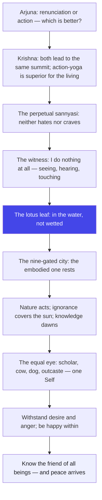

# Chapter 5: Karma-Sanyasa Yoga — Renunciation Within Action

> "The renunciation you really need is not of action — it is of the claim. The world keeps flowing; only the clutching can stop."
> — The Osho Way

---

Arjuna is confused, and his confusion is beautiful. Just moments ago, Krishna praised action; now he speaks of renunciation. Two opposites, and Arjuna has the courage to say: "Tell me conclusively — which of the two is better?" He wants certainty, one road, a final answer. This is the eternal demand of the mind: give me the one true path, and let me walk it without confusion. And Krishna gives an answer that is no answer in the old style: both roads arrive at the same summit, but there is one that suits the living human being better — action that carries renunciation inside it.

This fifth chapter is short — twenty-nine shlokas — and its whole message can be compressed into a single image: the lotus leaf and the water. The lotus leaf lives on the water, floats on the water, drinks from the water — and yet not a drop clings to it. That is the karma-sanyasa of Osho: you do not run away from the world; you live in it, act in it, love in it, and remain untouched. The water is not your enemy. The clinging was your only illness. The leaf's secret is not on the leaf — it is in the way the leaf holds itself, slightly tilted, slightly free.

The chapter builds a picture of the inner witness who says, "I do nothing at all" while the body sees, hears, touches, smells, eats, walks, sleeps, breathes. Osho calls this the great inner rearrangement: you stop being the doer and become the audience. Not a passive audience — a fully awake one. The hands of the witness still cook, still sign, still fight. But the one who signs is no longer signing for himself; the whole life becomes an offering placed in Brahman, and the offering burns away the sin of ownership.

And the chapter ends with the friendliest verse in the Gita: Krishna, the enjoyer of all sacrifices, the great Lord of all worlds, is described as suhrid — the friend of all beings. Osho reads this as the final ceiling of the teaching: renunciation ripens into love. First you learn to act without clinging; then you discover that the one who watches is not a cold observer but the friend. The witness is not distant; the witness is the heart of the universe, and when you rest there, peace comes — not as a reward, but as the natural temperature of that friendship.

## Learning Objectives

After completing this chapter you will be able to:

1. **Resolve the action-renunciation debate** — see why karma yoga and sannyasa lead to the same summit, and why action with inner renunciation suits the living better.
2. **Live the lotus-leaf secret** — understand how you can be fully in the world while nothing clings to you.
3. **Adopt the witness stance** — practice the "I do nothing at all" posture across seeing, hearing, touching, and all daily functions.
4. **Meet the equal eye** — explore the samadarshana that sees the same Self in a scholar, a cow, an elephant, a dog, and an outcast.
5. **Defuse desire and anger** — learn to withstand the impulses born of craving and rage before the body releases its last breath.
6. **Build a TypeScript tool** — a Witness Tracker that logs your sense contacts and attachment levels and reports your lotus-leaf score.

---

## Karma-Sanyasa Yoga at a Glance

### The scene and the speakers

The battlefield still waits. Arjuna, now asking not as a weeping warrior but as a puzzled student, puts the question that has been gathering since Chapter 3: Krishna, you keep praising renunciation — and you also keep praising the yoga of action. Which is it? The question is the hinge of the whole Gita: will this teaching tell us to leave the world or to live in it? Krishna's reply, in the Mahabharata context of a king's son who must rule and fight, is inevitable: renunciation as a physical act is not possible for you, Arjuna, and not desirable. What is possible — and what outshines even the renunciate's cave — is the inner renunciation of the claim, performed while the hands are at work.

### The Osho lens

Osho reads this chapter as the death of the escapist dream. Every person carries a hidden fantasy of the cave — the mountain hut, the cottage by the sea, the clean break from all relationships. Osho says: you will carry your mind to the cave with you, and your mind is the whole problem. The cave is not outside; it is an inner posture. The real sannyasa is a quality of seeing, not a change of address. This chapter teaches that you can be a perpetual sannyasi without any robe, without any ritual, without leaving anything — if you neither hate nor crave. That is the sharpest definition of freedom in the entire Gita, and it is a definition that can be tested in a traffic jam today.

### The structure of the chapter

The 29 shlokas move in four movements:

1. **Movement 1: 5.1–5.7 — The question and the resolution.** Arjuna asks which is better; Krishna says both lead to the same peak, but action-with-renunciation is the superior path, and the true sannyasi is known by inner state, not outer dress.
2. **Movement 2: 5.8–5.13 — The witness in action.** The sage says "I do nothing at all" while all functions continue; the lotus-leaf simile; the nine-gated city where the embodied one rests.
3. **Movement 3: 5.14–5.22 — Nature, ignorance, and the equal eye.** The Lord creates neither agency nor fruit; knowledge dawns like the sun; the same Self is seen in all; pleasure-born contacts are pain-generators.
4. **Movement 4: 5.23–5.29 — The free one and the friend.** Withstanding desire and anger, inner joy, the rishis who attain nirvana, the meditation posture of 5.27–5.28, and the final verse: knowing the friend of all beings, one attains peace.

### The three-framework note

Karma, bhakti, jnana — all three frames meet in this short chapter. Karma appears as the daily work performed without attachment for self-purification (5.11). Jnana appears as the knowledge that destroys ignorance like the sun destroys darkness (5.16), and as the equal vision of the sage. Bhakti appears at the end as the deepest movement: knowing Krishna as the enjoyer of sacrifices and the friend of all beings (5.29). Osho's reading: the chapter is structured as a ladder — work purifies, knowledge illuminates, and love completes. You cannot skip a rung; but you must not worship a rung, either. The whole ladder is one path seen from three windows.

## Traditional Reading vs Osho-Style Reading

| Dimension | Traditional reading | Osho-style reading |
|--------|---------------------|--------------------|
| **Renunciation (5.2-3)** | Formal sannyasa as a higher calling; renouncing action and entering the ascetic order | The renunciation of the claim and the craving; a robe never made anyone free |
| **The perpetual sannyasi (5.3)** | One who has taken vows and renounced rituals | Anyone who neither hates nor desires — measurable in the supermarket, not the monastery |
| **"I do nothing at all" (5.8-9)** | A theological confession of the liberated sage | The witness stance — your body does everything while awareness rests untouched |
| **The equal eye (5.18)** | Seeing God in all creatures as an act of devotion | The collapse of comparison itself — the measuring mind dissolves, leaving only presence |
| **The nine-gated city (5.13)** | The body as a prison the soul must leave | The body as a home where the owner can rest — the city is fine; the wandering of the mind was the only exile |
| **The friend of all beings (5.29)** | God as the giver of fruits and rewards | The universe as your friend — peace is the temperature of that friendship, not its wage |

## The Complete Text — All 29 Shlokas

### Shloka 5.1 — Arjuna's Question

> अर्जुन उवाच |
> संन्यासं कर्मणां कृष्ण पुनर्योगं च शंससि |
> यच्छ्रेय एतयोरेकं तन्मे ब्रूहि सुनिश्चितम्

**Transliteration:** arjuna uvāca . saṃnyāsaṃ karmaṇāṃ kṛṣṇa punaryogaṃ ca śaṃsasi . yacchreya etayorekaṃ tanme brūhi suniścitam

**Translation:** Arjuna said: O Krishna, you praise renunciation of actions and again the yoga of action. Tell me conclusively which of the two is the better.

**Osho Darshan:** Arjuna asks for sunishcitam — a conclusive, settled answer. He wants the mind to be finished with the question. Osho says this is the oldest hunger of the mind: it wants one path, clearly marked, so it can stop worrying. But the deeper truth is that life does not offer one marked path — it offers a quality of being that makes every path true. Arjuna's demand for certainty is itself the knot. Krishna will not untie it with a slogan; he will untie it with a vision of the inner man. The conclusive answer is not a path but a posture.

### Shloka 5.2 — Both Reach the Same Summit

> श्रीभगवानुवाच |
> संन्यासः कर्मयोगश्च निःश्रेयसकरावुभौ |
> तयोस्तु कर्मसंन्यासात्कर्मयोगो विशिष्यते

**Transliteration:** śrībhagavānuvāca . saṃnyāsaḥ karmayogaśca niḥśreyasakarāvubhau . tayostu karmasaṃnyāsātkarmayogo viśiṣyate

**Translation:** The Blessed Lord said: Both renunciation and the yoga of action lead to the highest good; but of the two, the yoga of action is superior to renunciation of action.

**Osho Darshan:** Both are boats; the sea is the same. But Krishna says the boat of action-with-attention sails better. Why? Osho says: because you cannot renounce what you have not yet lived. The man who runs to the cave before he has known work, love, and failure is renouncing a shadow. Real renunciation is a fruit of understanding, and understanding grows in the field of living action. The cave is earned, not entered. Stay in the world, work in it, and let understanding ripen — then renunciation will meet you, no matter where you stand.

### Shloka 5.3 — The Perpetual Sannyasi

> ज्ञेयः स नित्यसंन्यासी यो न द्वेष्टि न काङ्क्षति |
> निर्द्वन्द्वो हि महाबाहो सुखं बन्धात्प्रमुच्यते

**Transliteration:** jñeyaḥ sa nityasaṃnyāsī yo na dveṣṭi na kāṅkṣati . nirdvandvo hi mahābāho sukhaṃ bandhātpramucyate

**Translation:** He should be known as a perpetual renunciate who neither hates nor craves. Free of the pairs of opposites, O mighty-armed one, he is easily released from bondage.

**Osho Darshan:** Here is the definition that changes everything: nitya-sannyasi — the eternal renunciate — is not the one who left the world but the one who neither hates nor craves. Osho notes that hatred is craving in reverse; both are the same clutching, one reaching out and one pushing away. The robe, the beads, the vows — all decorations. The reality is a state where the hand can open in both directions. Test it today: when the pleasant arrives, do you grab? When the unpleasant arrives, do you spit? Between those two reflexes is your whole bondage — and your whole freedom.

### Shloka 5.4 — Children See Two, the Wise See One

> साङ्ख्ययोगौ पृथग्बालाः प्रवदन्ति न पण्डिताः |
> एकमप्यास्थितः सम्यगुभयोर्विन्दते फलम्

**Transliteration:** sāṅkhyayogau pṛthagbālāḥ pravadanti na paṇḍitāḥ . ekamapyāsthitaḥ samyagubhayorvindate phalam

**Translation:** Children, not the wise, speak of knowledge and action as distinct. One truly established in even a single path obtains the fruit of both.

**Osho Darshan:** The war of schools — knowledge versus action, meditation versus service, East versus West — is, says Osho, a children's argument. The wise are bored by it. Both roads climb the same mountain, and the climber who sincerely walks one road sees the same sunrise as the climber of the other. You cannot argue your way to truth, but you can walk your way there. Choose the path that fits your temperament and walk it to its end — the summit will not ask which trail you took. Half-hearted walking on two roads is the only real error.

### Shloka 5.5 — The Same Summit

> यत्साङ्ख्यैः प्राप्यते स्थानं तद्योगैरपि गम्यते |
> एकं साङ्ख्यं च योगं च यः पश्यति स पश्यति

**Transliteration:** yatsāṅkhyaiḥ prāpyate sthānaṃ tadyogairapi gamyate . ekaṃ sāṅkhyaṃ ca yogaṃ ca yaḥ paśyati sa paśyati

**Translation:** The place reached by the knowers is reached by the yogis as well. He who sees knowledge and action as one — he truly sees.

**Osho Darshan:** The proof is in the destination, not in the route. Osho says the word "sees" at the end is the whole verse: he sees. Not he believes, not he argues — he sees that knowledge and action are one in the seeing. There is a moment when contemplation becomes the most intense action, and action becomes a silent contemplation. The meditator and the worker are not rivals; they are two eyes of the same face. When both eyes open together, depth perception is born — you see the world in three dimensions for the first time.

### Shloka 5.6 — Renunciation Is Hard Without Action-Yoga

> संन्यासस्तु महाबाहो दुःखमाप्तुमयोगतः |
> योगयुक्तो मुनिर्ब्रह्म नचिरेणाधिगच्छति

**Transliteration:** saṃnyāsastu mahābāho duḥkhamāptumayogataḥ . yogayukto munirbrahma nacireṇādhigacchati

**Translation:** But renunciation, O mighty-armed one, is hard to attain without the yoga of action; the sage united in yoga reaches Brahman quickly.

**Osho Darshan:** Without the furnace of action, the metal of renunciation stays soft. Osho says the man who retires from the world before he has purified his energy through work will find his renunciation fragile — the first temptation cracks it. But the yogayukta muni — the one who has worked with awareness, who has let the fire of daily duty burn his impurities — reaches Brahman quickly, because he has already become worthy of the silence he seeks. Work first, then still; that is the natural order of inner growth.

### Shloka 5.7 — The Untainted Worker

> योगयुक्तो विशुद्धात्मा विजितात्मा जितेन्द्रियः |
> सर्वभूतात्मभूतात्मा कुर्वन्नपि न लिप्यते

**Transliteration:** yogayukto viśuddhātmā vijitātmā jitendriyaḥ . sarvabhūtātmabhūtātmā kurvannapi na lipyate

**Translation:** He who is united in yoga, of pure being, self-conquered, senses subdued, whose self is the Self of all beings — though acting, he is not tainted.

**Osho Darshan:** The qualifications accumulate like a portrait being painted: pure, self-conquered, senses subdued, and finally — the deepest brushstroke — the self that is the Self of all beings. Osho says this last is the secret of untouchability: you cannot be tainted by others when you have become others. The businessman who sees himself in his customers cannot cheat them; the doctor who sees himself in the patient cannot hurry. Taint comes from the gap — the belief that "I" and "they" are different substances. Close the gap, and nothing can stick.

### Shloka 5.8 — "I Do Nothing At All"

> नैव किञ्चित्करोमीति युक्तो मन्येत तत्त्ववित् |
> पश्यञ्शृण्वन्स्पृशञ्जिघ्रन्नश्नन्गच्छन्स्वपञ्श्वसन्

**Transliteration:** naiva kiñcitkaromīti yukto manyeta tattvavit . paśyañśruṇvanspṛśañjighrannaśnangacchansvapañśvasan

**Translation:** "I do nothing at all," thus thinks the united knower of truth — while seeing, hearing, touching, smelling, eating, walking, sleeping, breathing.

**Osho Darshan:** The witness mantra: naiva kincit karomi — I do nothing at all. And mark the comma: it is said while seeing, hearing, touching, eating, sleeping. Osho says this is not a lie and not a philosophy; it is a different center of gravity. When your identity shifts from the body to the awareness inside the body, the body's activities continue like weather — happening, but not yours. You can taste this even for seconds: sit and watch your breath, and notice that the breathing is not "yours" — it breathes itself. The knower of truth lives whole lifetimes in that tasting.

### Shloka 5.9 — The Senses Do Their Work

> प्रलपन्विसृजन्गृह्णन्नुन्मिषन्निमिषन्नपि |
> इन्द्रियाणीन्द्रियार्थेषु वर्तन्त इति धारयन्

**Transliteration:** pralapanvisṛjangṛhṇannunmiṣannimiṣannapi . indriyāṇīndriyārtheṣu vartanta iti dhārayan

**Translation:** While speaking, letting go, grasping, opening and closing the eyes — he holds firmly that the senses move among their objects.

**Osho Darshan:** The verse is a grammar lesson for the inner life: the senses are the subject, the objects are the field, and you are neither. The eyes open and close; the hand takes and releases; the tongue speaks — the senses are in their play, and the knower watches the play without entering it. Osho says most people are the opposite: the senses are on autopilot while the inner man believes he is doing everything. Reverse it. Let the body be the body — it does its work beautifully when you stop meddling — and let the watcher be the watcher.

### Shloka 5.10 — The Lotus Leaf

> ब्रह्मण्याधाय कर्माणि सङ्गं त्यक्त्वा करोति यः |
> लिप्यते न स पापेन पद्मपत्रमिवाम्भसा

**Transliteration:** brahmaṇyādhāya karmāṇi saṅgaṃ tyaktvā karoti yaḥ . lipyate na sa pāpena padmapatramivāmbhasā

**Translation:** He who acts, placing his actions in Brahman and abandoning attachment, is not tainted by sin — just as a lotus leaf is not wetted by water.

**Osho Darshan:** The lotus leaf is the emblem of this whole chapter. It floats on the pond, drinks from the pond, is fed by the pond — and no drop remains on it. Osho says the leaf does not reject the water; it rejects nothing. Its secret is a subtle tilt, a way of holding itself. You can be in the world the way the leaf is in the water: fully supported, fully fed, fully free. The water of daily life will touch you; it cannot wet you unless you decide to soak. Decide, every morning, to be a leaf.

### Shloka 5.11 — Action for Purification

> कायेन मनसा बुद्ध्या केवलैरिन्द्रियैरपि |
> योगिनः कर्म कुर्वन्ति सङ्गं त्यक्त्वात्मशुद्धये

**Transliteration:** kāyena manasā buddhyā kevalairindriyairapi . yoginaḥ karma kurvanti saṅgaṃ tyaktvātmaśuddhaye

**Translation:** Having abandoned attachment, yogis perform action through the body, mind, intellect, and even the senses — for the purification of the self.

**Osho Darshan:** Why do yogis act at all, if they have seen beyond action? For atma-shuddhi — purification. Osho says action is the soap of the soul; without it, the mirror of awareness stays foggy. The body works, the mind works, the intellect works — all channels of energy are used, not dammed. The point is not to stop the river but to stop the grasping of the banks. Work is not the enemy of meditation; it is its preparation. Let every task be a scrubbing of the mirror, and one day the mirror will show you your own face.

### Shloka 5.12 — The Attached Are Bound

> युक्तः कर्मफलं त्यक्त्वा शान्तिमाप्नोति नैष्ठिकीम् |
> अयुक्तः कामकारेण फले सक्तो निबध्यते

**Transliteration:** yuktaḥ karmaphalaṃ tyaktvā śāntimāpnoti naiṣṭhikīm . ayuktaḥ kāmakāreṇa phale sakto nibadhyate

**Translation:** The united one, renouncing the fruit of action, attains the abiding peace; the un-united, driven by desire and attached to the fruit, is bound.

**Osho Darshan:** Two lives, same work, opposite results. The difference is one word: fruit. Osho says the fruit is not evil — it is simply not yours to carry. The apple belongs to the tree that grew it, and you are not the tree; you are the gardener, the sun, the rain, and the soil together. When you act and let the fruit fall where it falls, peace comes and stays — naishthiki, settled. When you reach for the fruit, the peace evaporates instantly. Check your own ledger today: how many of your actions are offered, how many are grabbed?

### Shloka 5.13 — The Nine-Gated City

> सर्वकर्माणि मनसा संन्यस्यास्ते सुखं वशी |
> नवद्वारे पुरे देही नैव कुर्वन्न कारयन्

**Transliteration:** sarvakarmāṇi manasā saṃnyasyāste sukhaṃ vaśī . navadvāre pure dehī naiva kurvanna kārayan

**Translation:** Having mentally renounced all actions, the self-controlled embodied one rests happily in the nine-gated city, neither acting nor causing action.

**Osho Darshan:** The body is a city with nine gates — two eyes, two ears, two nostrils, a mouth, and two lower passages — and in this city the embodied one finally rests. Osho says the great news is that the city is not a prison. It is a palace the owner abandoned, and the owner's restlessness, not the walls, was the exile. When the inner king returns to the nine-gated city and sits on his throne, the gates open and close with the traffic of the world — coming, going, touching, leaving — and the king remains seated. Neither acting nor causing action: not a corpse's stillness, a king's.

### Shloka 5.14 — Nature Acts, Not the Lord

> न कर्तृत्वं न कर्माणि लोकस्य सृजति प्रभुः |
> न कर्मफलसंयोगं स्वभावस्तु प्रवर्तते

**Transliteration:** na kartṛtvaṃ na karmāṇi lokasya sṛjati prabhuḥ . na karmaphalasaṃyogaṃ svabhāvastu pravartate

**Translation:** The Lord creates neither agency nor actions for the world, nor the union of action with its fruit. It is nature that acts.

**Osho Darshan:** A cosmic legal verdict: the divine is not the author of your doings, your doership, or your rewards. Osho says this frees you twice over — from the fantasy that God is pushing your buttons, and from the fantasy that God owes you a wage. Nature runs its own machinery of causes and effects; the divine simply witnesses it. You are not a puppet; you are a possibility. The responsibility that tradition calls karma is not punishment from above; it is the echo of your own pattern. Listen to the echo, and you can change the song.

### Shloka 5.15 — Ignorance Covers Knowledge

> नादत्ते कस्यचित्पापं न चैव सुकृतं विभुः |
> अज्ञानेनावृतं ज्ञानं तेन मुह्यन्ति जन्तवः

**Transliteration:** nādatte kasyacitpāpaṃ na caiva sukṛtaṃ vibhuḥ . ajñānenāvṛtaṃ jñānaṃ tena muhyanti jantavaḥ

**Translation:** The Lord takes neither the sin nor the merit of anyone. Knowledge is covered by ignorance — and by that, beings are deluded.

**Osho Darshan:** The ledger is empty; the divine keeps no books. And yet beings suffer — not because they are judged, but because their own knowing is covered by a cloud. Osho says the tragedy is not sin; the tragedy is that you carry a sun inside you and live in the shade of it. The cloud is not your enemy either — it is your own accumulated forgetting, layer upon layer of habit and identification. The divine does not punish the cloudy sky; the sky is already the sun's. The whole spiritual work is simply this: let the cloud thin.

### Shloka 5.16 — Knowledge Dawns Like the Sun

> ज्ञानेन तु तदज्ञानं येषां नाशितमात्मनः |
> तेषामादित्यवज्ज्ञानं प्रकाशयति तत्परम्

**Transliteration:** jñānena tu tadajñānaṃ yeṣāṃ nāśitamātmanaḥ . teṣāmādityavajjñānaṃ prakāśayati tatparam

**Translation:** But for those whose ignorance is destroyed by the knowledge of the Self, that knowledge lights up the Supreme — like the sun.

**Osho Darshan:** The sun does not struggle to shine; it does not try to illuminate the mountain or the valley. It shines, and darkness falls away on its own. Osho says the same is true of knowing: you do not have to fight ignorance thought by thought. You have to move into the light, and the darkness will evaporate by itself. Fighting the dark with a stick is the old way; walking toward the sun is the new. The knowledge of the Self is not information about the sun — it is the sun. Step into it, and the Supreme reveals itself without any effort of revealing.

### Shloka 5.17 — Intellect Absorbed in That

> तद्बुद्धयस्तदात्मानस्तन्निष्ठास्तत्परायणाः |
> गच्छन्त्यपुनरावृत्तिं ज्ञाननिर्धूतकल्मषाः |

**Transliteration:** tadbuddhayastadātmānastanniṣṭhāstatparāyaṇāḥ . gacchantyapunarāvṛttiṃ jñānanirdhūtakalmaṣāḥ

**Translation:** With intellect absorbed in That, self rooted in That, established in That, with That as the supreme goal, their stains dispelled by knowledge, they go whence there is no return.

**Osho Darshan:** Four absorptions describe the whole life of the knower: the intellect thinks of That, the heart rests in That, the feet are planted in That, and the road of life leads to That. Osho says this is not a religious trance; it is a total re-orientation of attention, like a compass that has found the pole. Once the direction is fixed, the wanderings are over — apunaravritti, no return. Not because the world disappears, but because the pull of the world has dissolved. The compass needle no longer trembles. The one who has found home does not need to search again.

### Shloka 5.18 — The Equal Eye

> विद्याविनयसम्पन्ने ब्राह्मणे गवि हस्तिनि |
> शुनि चैव श्वपाके च पण्डिताः समदर्शिनः

**Transliteration:** vidyāvinayasampanne brāhmaṇe gavi hastini . śuni caiva śvapāke ca paṇḍitāḥ samadarśinaḥ

**Translation:** Sages look with an equal eye upon a learned and humble brahmin, a cow, an elephant, a dog, and an outcast.

**Osho Darshan:** Here is the Gita's declaration of the real equality — not legal equality, not economic equality, but the equality of seeing. Osho says the sage does not become blind to differences; he sees the differences and, behind them, the one who wears them all. The scholar and the dog are two costumes of the same actor. And note the brahmin is defined by vidya-vinaya — learning with humility, the rarest combination. Humility is the hallmark of true knowing: the more you see, the less you claim. The sage bows to the elephant and the outcaste because he recognizes his own face in both.

### Shloka 5.19 — Birth Conquered Here

> इहैव तैर्जितः सर्गो येषां साम्ये स्थितं मनः |
> निर्दोषं हि समं ब्रह्म तस्माद् ब्रह्मणि ते स्थिताः

**Transliteration:** ihaiva tairjitaḥ sargo yeṣāṃ sāmye sthitaṃ manaḥ . nirdoṣaṃ hi samaṃ brahma tasmād brahmaṇi te sthitāḥ

**Translation:** Even here, this world is conquered by those whose mind rests in equality; for Brahman is spotless and equal — therefore they are established in Brahman.

**Osho Darshan:** The battlefield is won at home. Osho says you do not conquer the world with armies — the world is conquered the moment your mind sits down in samya, equality. The moment the mind stops grading — this is higher, that is lower, this is mine, that is theirs — the war is over, because the war was never outside. And the deepest claim: Brahman is nirdosham, without any stain, and samam, equal everywhere. You cannot become equal; you can only stop being unequal. Then you do not seek Brahman; you are found to have been in it all along.

### Shloka 5.20 — Neither Rejoicing Nor Grieving

> न प्रहृष्येत्प्रियं प्राप्य नोद्विजेत्प्राप्य चाप्रियम् |
> स्थिरबुद्धिरसम्मूढो ब्रह्मविद् ब्रह्मणि स्थितः

**Transliteration:** na prahṛṣyetpriyaṃ prāpya nodvijetprāpya cāpriyam . sthirabuddhirasammūḍho brahmavid brahmaṇi sthitaḥ

**Translation:** Resting in Brahman, with steady intellect and undeluded, the knower of Brahman neither rejoices on receiving the pleasant nor is troubled on receiving the unpleasant.

**Osho Darshan:** The knower's face does not swing with the weather of events. The pleasant arrives — no excitement; the unpleasant arrives — no agitation. Osho says this is not stone-cold indifference; it is the calm of someone who has seen the whole film before. The wave rises, the wave falls — the sea does not applaud or mourn. The steady intellect knows what the passing pleasure and pain are made of, and knowing, is not deceived by them. Notice the gift hidden in this verse: when you stop rejoicing in the pleasant, you also stop being wounded by the unpleasant. It is one purchase, with one price.

### Shloka 5.21 — Happiness in the Self

> बाह्यस्पर्शेष्वसक्तात्मा विन्दत्यात्मनि यत्सुखम् |
> स ब्रह्मयोगयुक्तात्मा सुखमक्षयमश्नुते

**Transliteration:** bāhyasparśeṣvasaktātmā vindatyātmani yatsukham . sa brahmayogayuktātmā sukhamakṣayamaśnute

**Translation:** With the self unattached to external contacts, one finds the happiness within the Self; joined in the yoga of Brahman, he enjoys the undecaying happiness.

**Osho Darshan:** The economics of joy, reversed. The world sells you happiness on contact — touch, taste, sound, approval — and every unit you buy decays. The Self offers a happiness that does not decay, but it can only be received with the senses unclutched. Osho says the two economies are not enemies: enjoy the contact, then close the shop and go home — the capital is inside. The akshaya sukham, the inexhaustible joy, is not elsewhere; it is underneath, like the groundwater under the thin layer of topsoil you have been scratching all these years.

### Shloka 5.22 — Contact-Pleasures Are Pain-Seeds

> ये हि संस्पर्शजा भोगा दुःखयोनय एव ते |
> आद्यन्तवन्तः कौन्तेय न तेषु रमते बुधः

**Transliteration:** ye hi saṃsparśajā bhogā duḥkhayonaya eva te . ādyantavantaḥ kaunteya na teṣu ramate budhaḥ

**Translation:** The enjoyments born of contact are verily wombs of pain, O Kaunteya — they have a beginning and an end. The wise do not delight in them.

**Osho Darshan:** A surgical diagnosis: every contact-born pleasure is a pain in embryo. Why? Because it has a beginning and an end, and the end is the pain. Osho says the wise do not hate these pleasures — they simply see their receipt: a burst, a gap, a hunger for the next burst. Seeing the whole arc, the buddha — the intelligent one — does not invest his life there. He does not become an enemy of pleasure; he becomes a connoisseur of what does not end. The taste for the endless is learned the way any taste is learned: by tasting.

### Shloka 5.23 — Withstand Desire and Anger

> शक्नोतीहैव यः सोढुं प्राक्शरीरविमोक्षणात् |
> कामक्रोधोद्भवं वेगं स युक्तः स सुखी नरः

**Transliteration:** śaknotīhaiva yaḥ soḍhuṃ prākśarīravimokṣaṇāt . kāmakrodhodbhavaṃ vegaṃ sa yuktaḥ sa sukhī naraḥ

**Translation:** He who is able, while still here, before the release of the body, to withstand the impulse born of desire and anger — he is united, he is the happy man.

**Osho Darshan:** The verse names the two floods that wash away inner peace: the flood of craving and the flood of rage. Osho says the test is not whether they come — they will, they are the weather of the mind — but whether you can stand inside them without being carried. To withstand does not mean to suppress; suppression drowns you quietly. It means to stand — feet planted, watching the flood pass. The one who can stand inside his own storm is the happiest man alive, richer than every king whose kingdom depends on the next wave of satisfaction.

### Shloka 5.24 — Happy Within, Illumined Within

> योऽन्तःसुखोऽन्तरारामस्तथान्तर्ज्योतिरेव यः |
> स योगी ब्रह्मनिर्वाणं ब्रह्मभूतोऽधिगच्छति

**Transliteration:** yo.antaḥsukho.antarārāmastathāntarjyotireva yaḥ . sa yogī brahmanirvāṇaṃ brahmabhūto.adhigacchati

**Translation:** He who is happy within, who revels within, whose light is within — that yogi, becoming Brahman, attains the nirvana of Brahman.

**Osho Darshan:** Three "withins" — happiness within, play within, light within. Osho says the search ends where it began: inside. You have been looking outside for a warmth that was never outside; the sun was always behind your eyes. The yogi who has turned his whole economy inward does not renounce joy — he graduates to it. And the final phrase is the boldest in the chapter: brahma-bhuta — he becomes Brahman. Not "reaches" but "becomes." The drop does not reach the ocean; it realizes it was ocean water all along. That realization is nirvana.

### Shloka 5.25 — The Rishis Who Attain

> लभन्ते ब्रह्मनिर्वाणमृषयः क्षीणकल्मषाः |
> छिन्नद्वैधा यतात्मानः सर्वभूतहिते रताः

**Transliteration:** labhante brahmanirvāṇamṛṣayaḥ kṣīṇakalmaṣāḥ . chinnadvaidhā yatātmānaḥ sarvabhūtahite ratāḥ

**Translation:** The rishis attain the nirvana of Brahman — their stains consumed, their dualities torn apart, self-controlled, and rejoicing in the welfare of all beings.

**Osho Darshan:** The portrait of the free ones, in four strokes: their stains are burnt, their inner divisions are severed, their selves are gathered, and — most telling — they are ratāḥ, delighting, in the welfare of all beings. Osho says the last stroke is the signature of the whole path: freedom does not make you cold, it makes you a gardener of everyone. The free one does not serve the world from duty; he serves it from delight, the way a river delights in watering the fields. Chinnadvaidha — the duality is cut — and in the space that opens, love begins.

### Shloka 5.26 — Nirvana On All Sides

> कामक्रोधवियुक्तानां यतीनां यतचेतसाम् |
> अभितो ब्रह्मनिर्वाणं वर्तते विदितात्मनाम्

**Transliteration:** kāmakrodhaviyuktānāṃ yatīnāṃ yatacetasām . abhito brahmanirvāṇaṃ vartate viditātmanām

**Translation:** For the striving ones free of desire and anger, of controlled thought, who have realized the Self — nirvana abides on all sides.

**Osho Darshan:** Abhitah — on all sides, everywhere. Nirvana is not a distant peak for the realized; it is the air around them, the ground under them. Osho says this is the geography of liberation: it is not a place you arrive at but an element you live in. The striving ones are named twice — yatinam, those who strive — because the path, even for the free, remains a walk. Desire and anger are the two doors of the house of the mind; once both are unlocked, the wind of the infinite blows through from every direction. Home is where you are standing.

### Shloka 5.27 — The Posture of Meditation

> स्पर्शान्कृत्वा बहिर्बाह्यांश्चक्षुश्चैवान्तरे भ्रुवोः |
> प्राणापानौ समौ कृत्वा नासाभ्यन्तरचारिणौ

**Transliteration:** sparśānkṛtvā bahirbāhyāṃścakṣuścaivāntare bhruvoḥ . prāṇāpānau samau kṛtvā nāsābhyantaracāriṇau

**Translation:** Shutting out external contacts, fixing the gaze between the brows, making the outgoing and incoming breaths equal within the nostrils.

**Osho Darshan:** The first meditation instructions of the Gita: the world is asked to wait at the gate, the eyes settle at the point between the brows, and the breath is brought to balance — the in-breath and out-breath made equal, two scales leveled. Osho says the breath is the doorway because it is the one bridge you cannot fake: thought and breath are one currency. Calm the breath and the thought automatically begins to settle, like sediment in still water. The posture is not the goal — it is the announcement that you are ready to receive.

### Shloka 5.28 — Always Free

> यतेन्द्रियमनोबुद्धिर्मुनिर्मोक्षपरायणः |
> विगतेच्छाभयक्रोधो यः सदा मुक्त एव सः

**Transliteration:** yatendriyamanobuddhirmunirmokṣaparāyaṇaḥ . vigatecchābhayakrodho yaḥ sadā mukta eva saḥ

**Translation:** With senses, mind, and intellect controlled, the sage with liberation as his supreme goal, free of desire, fear, and anger — he is indeed always free.

**Osho Darshan:** Three masters to serve no longer: desire, fear, anger — the trio that runs most lives. The sage has made liberation his only destination, and the curious result is that the journey changes: when moksha is the goal, every step is already free, because the road is the destination. Osho says "always free" — sadā mukta — is the secret signature of this state. The free one is not free on the mountain and bound in the market; freedom has become his element, like water for the fish. Senses, mind, intellect — all quiet, all present, all ready. The instrument is tuned; the music can begin.

### Shloka 5.29 — The Friend of All Beings

> भोक्तारं यज्ञतपसां सर्वलोकमहेश्वरम् |
> सुहृदं सर्वभूतानां ज्ञात्वा मां शान्तिमृच्छति

**Transliteration:** bhoktāraṃ yajñatapasāṃ sarvalokamaheśvaram . suhṛdaṃ sarvabhūtānāṃ jñātvā māṃ śāntimṛcchati

**Translation:** Knowing me as the enjoyer of all sacrifices and austerities, the great Lord of all worlds, and the friend of all beings, one attains peace.

**Osho Darshan:** The chapter ends with the friendliest verse in the Gita — suhridam sarvabhutanam, the friend of all beings. Osho says this is the final revelation of renunciation: at its summit, renunciation becomes love. First you drop the claim on the world; then you discover that the world was never an enemy to drop — it is a friend who was waiting. The Lord of all worlds is not a judge; he is a friend who enjoys your sacrifices the way a friend enjoys your gifts. When this knowing ripens, peace is not attained — it is recognized. It was there all along, in the friendship you never noticed.

## Key Themes

| Theme | Shlokas | Osho-style insight |
|-------|---------|--------------------|
| **The one summit** | 5.1-5.6 | Renunciation and action are not rivals; children argue about paths, the wise climb |
| **The perpetual sannyasi** | 5.3 | The eternal renunciate neither hates nor craves — a state, not a robe |
| **The witness** | 5.8-5.9 | "I do nothing at all" — the body acts, awareness watches, the claim evaporates |
| **The lotus leaf** | 5.10-5.13 | Live in the world fully; nothing sticks when nothing is grabbed; the nine-gated city is a home |
| **The equal eye** | 5.18-5.19 | Differences remain visible; the one behind them dissolves comparison itself |
| **Desire, anger, and the free one** | 5.23-5.28 | Withstand the two floods; happiness, play, and light move inside |
| **The friend** | 5.29 | Renunciation ripens into love — the universe is a friend, and peace is that friendship's temperature |

## The Inner Journey



## A Mind Map

```mermaid
mindmap
  root[(Karma-Sanyasa Yoga)]
    The question
      Which is better
      Both reach the summit
      Action-yoga superior
    The inner renunciation
      Neither hate nor crave
      One path, one fruit
      Work first, then stillness
    The witness
      I do nothing at all
      Senses move among objects
      Lotus leaf on water
      Nine-gated city
    Nature and knowledge
      The Lord creates no agency
      Ignorance covers the sun
      Knowledge dawns like day
      The equal eye
    The free one
      Withstanding desire and anger
      Happy, playing, lit within
      The rishis who attain
      The friend of all beings
```

## Summary

- Arjuna asks for a final verdict; Krishna gives a vision: both paths reach the same peak, but action with inner renunciation suits the living.
- The perpetual sannyasi is defined by state, not dress — one who neither hates nor craves.
- The witness stance — "I do nothing at all" — allows the body to live fully while awareness rests untouched.
- The lotus leaf is the emblem: in the world, fed by the world, wetted by nothing.
- Nature, not God, runs the machinery of cause and effect; ignorance, not punishment, covers the inner sun.
- The equal eye dissolves comparison: one Self in the scholar, the cow, the dog, and the outcast.
- Withstanding desire and anger, the free one becomes Brahman and knows the friend of all beings — and peace is the temperature of that friendship.

## Practical Takeaways

- **Give up one claim daily** — before bed, recall one action you did today and mentally release its fruit; feel how the memory lightens when you stop owning it.
- **Wear the witness inside work** — during your next meeting or class, whisper "I do nothing at all" and let the hands, voice, and brain function without your meddling.
- **Practice the lotus-leaf posture** — when a compliment or an insult arrives, notice the reflex to soak it in; breathe once and let it roll off like water.
- **Level the breath** — two minutes with equal in-breath and out-breath between tasks settles the thought river faster than any argument with yourself.
- **Flood-watching** — when craving or anger surges, stand still and watch it pass; do not suppress, do not join — withstand, like 5.23.
- **End with the friend** — each evening, remember one being as a friend of all beings, and let the day close in that warmth.

## Chapter Quiz

**Q1. In Shloka 5.2, which does Krishna declare superior between the two paths?**

- a. Renunciation of action
- b. The yoga of action
- c. Both are equally useless
- d. Devotion to the gods

<details class="tp-qa-card" data-qid="bg5-q1"><summary>Show Answer</summary>

**Answer: b.**
</details>

**Q2. According to Shloka 5.3, who should be known as the perpetual renunciate?**

- a. One who wears the ochre robe
- b. One who has left home and family
- c. One who neither hates nor desires
- d. One who performs daily rituals

<details class="tp-qa-card" data-qid="bg5-q2"><summary>Show Answer</summary>

**Answer: c.**
</details>

**Q3. What does the knower of truth think in Shloka 5.8?**

- a. "I have conquered all my senses"
- b. "I do nothing at all"
- c. "I must renounce the world"
- d. "I am the greatest of yogis"

<details class="tp-qa-card" data-qid="bg5-q3"><summary>Show Answer</summary>

**Answer: b.**
</details>

**Q4. In Shloka 5.10, the one who acts without attachment is compared to —**

- a. A flame in the wind
- b. A lotus leaf untouched by water
- c. A tree in a storm
- d. A lamp in a temple

<details class="tp-qa-card" data-qid="bg5-q4"><summary>Show Answer</summary>

**Answer: b.**
</details>

**Q5. Which creatures does the sage look upon with an equal eye in Shloka 5.18?**

- a. Only fellow humans
- b. Only the learned
- c. A brahmin, a cow, an elephant, a dog, and an outcaste
- d. Only sages and kings

<details class="tp-qa-card" data-qid="bg5-q5"><summary>Show Answer</summary>

**Answer: c.**
</details>

**Q6. What does one attain by knowing Krishna as the friend of all beings (Shloka 5.29)?**

- a. Wealth
- b. Victory in battle
- c. Peace
- d. Long life

<details class="tp-qa-card" data-qid="bg5-q6"><summary>Show Answer</summary>

**Answer: c.**
</details>

## Exercises

1. **The cave inventory (reflection):** Write your personal fantasy of escape — the place you imagine you would finally be free. Then list what you would carry there: your mind, your habits, your craving for approval. Reflect on Osho's claim that the cave is a posture, not an address.
2. **The lotus-leaf test (analysis):** For three days, watch one recurring situation where you get soaked — criticism, flattery, comparison, delay. Record each moment the water touched you and whether you stayed leaf-like or became the pond. Find the pattern in what makes you tilt toward the water.
3. **Extend the tool (TypeScript):** Build on the Witness Tracker below by adding a `dvandvaLog` — pairs of opposites experienced each day (success/failure, praise/blame) with a witnessScore for each. Report which pair binds you most, and connect it to 5.3.

## TypeScript Tool: Lotus Leaf Witness Tracker

```typescript
/*
 * Lotus Leaf Witness Tracker
 * Based on Karma-Sanyasa Yoga (Chapter 5 of the Bhagavad Gita):
 * the sage lives in the world like a lotus leaf on water —
 * fully supported, not wetted. Actions, claims, and cravings
 * are logged; the tracker reports your lotus-leaf score.
 * Osho's lens: renunciation is a state, not a robe.
 */

interface SenseContact {
  date: string;
  sense: 'sight' | 'sound' | 'touch' | 'taste' | 'smell' | 'thought';
  object: string;
  grasping: number;    // 0-10, how much you wanted to hold it
  aversion: number;    // 0-10, how much you wanted to push it away
  witnessed: boolean;  // were you aware while it happened?
}

interface LotusReport {
  contactsLogged: number;
  witnessedRatio: number;   // 0-1
  averageGrasping: number;  // 0-10
  averageAversion: number;  // 0-10
  lotusLeafScore: number;   // 0-100
  verdict: string;
}

const WITNESS_WEIGHT = 0.5;
const GRASP_WEIGHT = 0.3;
const AVERSION_WEIGHT = 0.2;

function contactClutching(contact: SenseContact): number {
  return Math.min(10, contact.grasping + contact.aversion);
}

function lotusLeafScore(contact: SenseContact): number {
  const awareness = contact.witnessed ? WITNESS_WEIGHT : 0;
  const clutching = (contactClutching(contact) / 10) * (GRASP_WEIGHT + AVERSION_WEIGHT);
  return Math.max(0, Math.min(100, Math.round((awareness + (1 - clutching)) * 100)));
}

function analyzeWeek(contacts: SenseContact[]): LotusReport {
  const total = contacts.length;
  const witnessed = contacts.filter(c => c.witnessed).length;
  const avgGrasp = contacts.reduce((s, c) => s + c.grasping, 0) / total;
  const avgAversion = contacts.reduce((s, c) => s + c.aversion, 0) / total;
  const score = Math.round(contacts.reduce((s, c) => s + lotusLeafScore(c), 0) / total);

  let verdict = 'soaked: the water is on you because the grabbing is in you.';
  if (score >= 75) verdict = 'leaf-like: you float on the pond, and nothing wets you.';
  else if (score >= 50) verdict = 'half-leaf: you dry quickly, but the tilt is not yet yours.';

  return {
    contactsLogged: total,
    witnessedRatio: witnessed / total,
    averageGrasping: Math.round(avgGrasp * 10) / 10,
    averageAversion: Math.round(avgAversion * 10) / 10,
    lotusLeafScore: score,
    verdict
  };
}

function runDemo(): void {
  const week: SenseContact[] = [
    { date: '2026-08-18', sense: 'sight', object: 'phone screen', grasping: 7, aversion: 0, witnessed: true },
    { date: '2026-08-18', sense: 'sound', object: 'criticism', grasping: 0, aversion: 8, witnessed: false },
    { date: '2026-08-19', sense: 'taste', object: 'evening snack', grasping: 6, aversion: 0, witnessed: true },
    { date: '2026-08-19', sense: 'thought', object: 'old regret', grasping: 0, aversion: 6, witnessed: false }
  ];

  const report = analyzeWeek(week);
  console.log('=== Lotus Leaf Witness Tracker ===');
  console.log(`Contacts logged: ${report.contactsLogged}`);
  console.log(`Witnessed ratio: ${report.witnessedRatio}`);
  console.log(`Average grasping: ${report.averageGrasping}/10`);
  console.log(`Average aversion: ${report.averageAversion}/10`);
  console.log(`Lotus leaf score: ${report.lotusLeafScore}/100`);
  console.log(`Verdict: ${report.verdict}`);
}

runDemo();
```
