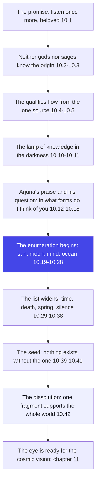
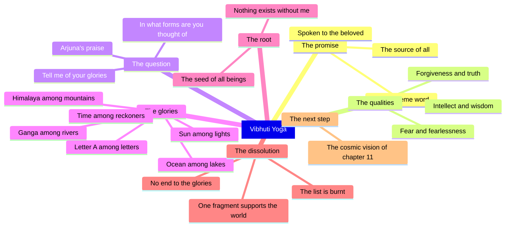

# Chapter 10: Vibhuti Yoga — Wherever You Look, One Hand Signs the Same Name

> "The whole world is God's signature — learn to read the handwriting, and every face becomes a letter of the divine."
> — The Osho Way

---

This is the chapter where Krishna stops teaching and starts pointing. For nine chapters he has been speaking about the supreme — the unborn, the beginningless, the formless. Now Arjuna, who is still a man of this world, wants to know: if you are all that, then where do I look? How do I recognise you in the marketplace of ordinary life? Krishna answers with a list that reads like a love letter to creation: I am the sun among lights, the ocean among lakes, the peepul among trees, the Ganga among rivers. Do not search for me on some far shore, he says. Search in the excellence of everything that is.

Osho reads this chapter as the great revolution in Arjuna's education. Until now, the teaching has been about leaving the world — unattached, desireless, beyond. Chapter ten turns the whole direction around: the divine is not to be found by leaving the world but by seeing the world as it really is. Every peak, every river, every brilliant mind, every flash of victory is a vibration of the one. Religion in the old sense says: climb away from the valley. This chapter says: the valley itself is holy. Do not renounce the sun because it sets; recognise it as a face of the eternal.

The chapter has a secret structure. It opens with Krishna promising the supreme word. It shows the qualities — intellect, forgiveness, truth, courage — as powers flowing from the divine. Then Arjuna, overwhelmed, asks the key question: in which forms should I think of you? And Krishna pours out the glorious list of vibhutis — the special manifestations. Then comes the astonishing finale: what is the use of all this detail? I support this entire universe with one fragment of myself. The list dissolves into the infinite. The enumeration was only a finger pointing — the moon is beyond the finger.

The old teaching says God is somewhere else. The new teaching says God is the somewhere. Osho's reading of Vibhuti Yoga is a training in perception: when you can see the divine in the excellence of a sunrise and the honesty of a friend and the courage of a truthful man, then you are ready for the vision that the very next chapter will give you — the vision of the whole universe as one cosmic form. Look at everything twice. The first look shows you the object; the second look shows you the infinite hiding inside it.

## Learning Objectives

After completing this chapter you will be able to:

1. **Situate Vibhuti Yoga** — understand where this chapter stands in the Gita's arc: the bridge between the teaching of devotion (chapters 7–9) and the cosmic vision (chapter 11).
2. **Read the world through the Osho lens** — see the enumeration of glories not as mythology but as a method of perception: the divine is visible in the excellence of everything.
3. **Map the structure** — trace the three movements of the chapter: the promise of supreme knowledge, Arjuna's praise and request, and the enumeration of the vibhutis.
4. **Distinguish the two readings** — compare the traditional reading (a catalogue of divine manifestations for worship) with the Osho reading (a training in seeing the one behind the many).
5. **Apply the principle of 10.42** — understand the final paradox that the infinite supports the whole universe with one fragment, and why the teacher dissolves his own list.
6. **Build a TypeScript tool** — create the Vibhuti Lens, a runnable program that catalogues the chapter's glories by category and matches them against the ordinary moments of a single day.

---

## Vibhuti Yoga at a Glance

### The scene and the speakers

The tenth discourse continues the conversation that began in chapter 7 — the deepest section of the Gita, the section that moves from knowledge of the self to love of the divine. Arjuna has just heard, in chapter 9, the royal secret: the universe rests in Krishna, yet Krishna rests in no universe. Now Krishna opens the chapter by promising a still higher word, because Arjuna has become dear to him. The speakers are only two: Krishna, the charioteer-teacher, and Arjuna, the student who has fallen in love with the teaching. Sanjaya is silent in this chapter — no narration interrupts, no scene changes. It is pure dialogue, teacher and student, and the student's hunger is so great that he interrupts with one of the most beautiful prayers in the Gita: tell me of your glories, for I am not satisfied with hearing you.

### The Osho lens

Osho reads Vibhuti Yoga as a chapter about perception, not theology. Krishna does not say "worship these things." He says "see these things — they are my body." The list of glories is a mirror held up to the world: the sun, the moon, the wind, the ocean, the lion, the Ganga, the letter A, the silence of the wise. Osho's insight is that the divine is not an object among objects; it is the livingness of every object. When you look at a rose, you can see the rose, or you can see the mysterious energy that flowers as the rose. The second seeing is the beginning of worship. And worship, in this chapter, is not a ritual — it is a quality of attention. The man who can see the one in the many has become a bhagavata, a lover of the divine, without ever leaving the world.

### The structure of the chapter

This chapter of 42 shlokas moves in three movements:

1. **Movement 1: 10.1–10.11 — The promise and the source.** Krishna declares the supreme word, reveals that even gods and sages do not know his origin, names the qualities that flow from him — intellect, forgiveness, truth, courage — and promises that he destroys the darkness of ignorance in those who love him with the lamp of knowledge.
2. **Movement 2: 10.12–10.18 — Arjuna's praise and request.** Arjuna, swept by devotion, declares Krishna to be the supreme Brahman, affirms the testimony of Narada, Asita, Devala and Vyasa, and begs for the enumeration: in what forms, in what glories, should he think of the divine?
3. **Movement 3: 10.19–10.42 — The enumeration and its dissolution.** Krishna lists the special manifestations — the sun among lights, the mind among senses, the Himalaya among mountains — and then dissolves the whole list with the thunderbolt of 10.42: I support this entire universe with one fragment of myself.

### The three-framework note

The Gita's three paths are now converging. Karma Yoga taught action without attachment; Jnana Yoga taught knowledge of the self; chapters 7–9 opened the path of Bhakti Yoga, love of the personal divine. Vibhuti Yoga is where bhakti becomes eyesight: the devotee no longer merely loves an abstract God — he learns to recognise the beloved everywhere. The gunas also appear here in a subtle form: Krishna says he is sattva among the sattvic, the goodness of the good (10.36). The divine is not beyond the qualities in this chapter; it is the essence of the best of every quality. And the chapter ends by announcing the next step — the vision of the cosmic form — which is the greatest gift of all: when the eye of the devotee has been trained by the vibhutis, it is ready for the vishvarupa.

## Traditional Reading vs Osho-Style Reading

| Dimension | Traditional reading | Osho-style reading |
|--------|---------------------|--------------------|
| The list of glories | A catalogue of divine manifestations to be worshipped and meditated upon | A training in perception: the divine is the livingness of everything excellent |
| The purpose of the chapter | To establish Krishna as the supreme deity of the universe | To teach the eye to see the one behind the many — worship as quality of attention |
| 10.8 "I am the source of all" | A claim of cosmic lordship | An invitation: find the source behind every wave of existence |
| The qualities in 10.4–10.5 | Virtues granted to the righteous | Rivers of the one flowing through every being, good and bad alike |
| 10.42 "one fragment supports all" | A demonstration of divine power | The great dissolution of the teaching itself: the finger points, and then it is forgotten |
| Religion's direction | From the world upward to God | Into the world: the valley itself is holy, every face a letter of the divine |

## The Complete Text — All 42 Shlokas

### Shloka 10.1 — Listen Once More, O Mighty-Armed

> श्रीभगवानुवाच |
> भूय एव महाबाहो शृणु मे परमं वचः |
> यत्तेऽहं प्रीयमाणाय वक्ष्यामि हितकाम्यया

**Transliteration:** śrībhagavānuvāca . bhūya eva mahābāho śṛṇu me paramaṃ vacaḥ . yatte.ahaṃ prīyamāṇāya vakṣyāmi hitakāmyayā

**Translation:** The Blessed Lord said: Listen once more, O mighty-armed, to my supreme word, which I will speak to you, who are dear to me, wishing your good.

**Osho Darshan:** Notice how Krishna begins — not with a new doctrine but with love. "You are dear to me, so listen again." Osho says the highest truth is never spoken to the clever; it is spoken to the loved. Arjuna has become dear because he is thirsty — the man who is satisfied never hears the supreme word, the man who is hungry hears it everywhere. The first condition of receiving the highest teaching is not intelligence but longing.

### Shloka 10.2 — Neither Gods nor Sages Know My Origin

> न मे विदुः सुरगणाः प्रभवं न महर्षयः |
> अहमादिर्हि देवानां महर्षीणां च सर्वशः

**Transliteration:** na me viduḥ suragaṇāḥ prabhavaṃ na maharṣayaḥ . ahamādirhi devānāṃ maharṣīṇāṃ ca sarvaśaḥ

**Translation:** Neither the hosts of the gods nor the great sages know my origin, for in every way I am the source of all the gods and the great sages.

**Osho Darshan:** The gods themselves do not know where the divine begins — because the divine does not begin. Osho says this is the deepest riddle of existence: the source cannot be seen as an object, because every seer is inside it. You cannot stand outside the whole and take a photograph. The mind, which knows by dividing, cannot know the undivided; it can only surrender to it. And surrender — not knowledge — is the real beginning.

### Shloka 10.3 — The Undeluded Man Is Freed from All Sin

> यो मामजमनादिं च वेत्ति लोकमहेश्वरम् |
> असम्मूढः स मर्त्येषु सर्वपापैः प्रमुच्यते

**Transliteration:** yo māmajamanādiṃ ca vetti lokamaheśvaram . asammūḍhaḥ sa martyeṣu sarvapāpaiḥ pramucyate

**Translation:** He who knows me as unborn and beginningless, as the great Lord of the worlds — that man among mortals is undeluded and is liberated from all sins.

**Osho Darshan:** Sin here is not a list of crimes; it is the confusion of mistaking the small for the whole. The man who knows the unborn one is freed from the deepest sin — the sin of living as if the body were the whole story. Osho says the words "undeluded" and "freed" describe the same event from two sides: when the delusion of separateness drops, the sins of separateness drop with it. You cannot wash the tree by cleaning each leaf; you water the root.

### Shloka 10.4 — The Qualities That Flow from Me

> बुद्धिर्ज्ञानमसम्मोहः क्षमा सत्यं दमः शमः |
> सुखं दुःखं भवोऽभावो भयं चाभयमेव च

**Transliteration:** buddhirjñānamasammohaḥ kṣamā satyaṃ damaḥ śamaḥ . sukhaṃ duḥkhaṃ bhavo.abhāvo bhayaṃ cābhayameva ca

**Translation:** Intellect, wisdom, freedom from delusion, forgiveness, truth, self-restraint, calmness, happiness, pain, birth, death, fear and also fearlessness — all these flow from me.

**Osho Darshan:** Look carefully at this list — it includes pain and fear alongside wisdom and courage. The divine does not sponsor only the pleasant half of life. Osho says this is the great honesty of the Gita: the same river carries the flower and the flood. The man who worships only the bright half is worshipping a partial god. The whole is whole — it includes the night as much as the day, and the master is he who can say yes to both.

### Shloka 10.5 — Non-Injury, Equanimity, Contentment

> अहिंसा समता तुष्टिस्तपो दानं यशोऽयशः |
> भवन्ति भावा भूतानां मत्त एव पृथग्विधाः

**Transliteration:** ahiṃsā samatā tuṣṭistapo dānaṃ yaśo.ayaśaḥ . bhavanti bhāvā bhūtānāṃ matta eva pṛthagvidhāḥ

**Translation:** Non-injury, equanimity, contentment, austerity, beneficence, fame and ill-fame — these different kinds of qualities of beings arise from me alone.

**Osho Darshan:** The list dares to include ill-fame — the disgrace of a good man is also a vibration of the divine. Osho says this is the moment the teaching stops being moralistic and becomes metaphysical: the one cannot be the source of only the respectable. Fame and ill-fame are two banks of the same river of consciousness. The devotee does not chase the one and flee the other; he watches the river. Renouncing the fruits means exactly this: the fruit is sweet or bitter, and both come from the same tree.

### Shloka 10.6 — The Seven Sages and the Four Manus

> महर्षयः सप्त पूर्वे चत्वारो मनवस्तथा |
> मद्भावा मानसा जाता येषां लोक इमाः प्रजाः

**Transliteration:** maharṣayaḥ sapta pūrve catvāro manavastathā . madbhāvā mānasā jātā yeṣāṃ loka imāḥ prajāḥ

**Translation:** The seven great sages, the ancient four, and also the Manus, born of my mind and possessed of my nature — from them are these creatures born in this world.

**Osho Darshan:** The seers were born of thought, not of womb — myth speaking the truth that consciousness precedes matter. Osho says the lineage of the universe is not blood but vision: the world we live in was first dreamed, then built. Every civilisation, every family, every man is the child of some inner sage — some idea he inherited without examining. The revolution of the Gita is to trace the lineage back: beyond the seven sages, beyond the first dream, stands the dreamer.

### Shloka 10.7 — He Who Knows the Vibhuti and the Yoga

> एतां विभूतिं योगं च मम यो वेत्ति तत्त्वतः |
> सोऽविकम्पेन योगेन युज्यते नात्र संशयः

**Transliteration:** etāṃ vibhūtiṃ yogaṃ ca mama yo vetti tattvataḥ . so.avikampena yogena yujyate nātra saṃśayaḥ

**Translation:** He who in truth knows these manifold manifestations of my being and this yoga-power of mine becomes established in the unshakable yoga — of this there is no doubt.

**Osho Darshan:** Here is the promise that makes the whole chapter practical: knowing the glories steadies the seeker. Osho says this is because the mind needs resting places — the formless is too vast for the ordinary eye, so the teacher offers forms, one by one, like stones across a river. The man who can say "I saw the divine in that sunrise, in that kind act, in that flash of genius" is building his own bridge. Each recognition is a stepping stone; the bridge is avikampa yoga, the yoga that no wind can shake.

### Shloka 10.8 — I Am the Source of All

> अहं सर्वस्य प्रभवो मत्तः सर्वं प्रवर्तते |
> इति मत्वा भजन्ते मां बुधा भावसमन्विताः

**Transliteration:** ahaṃ sarvasya prabhavo mattaḥ sarvaṃ pravartate . iti matvā bhajante māṃ budhā bhāvasamanvitāḥ

**Translation:** I am the source of all; from me everything evolves. Understanding this, the wise, filled with love, worship me.

**Osho Darshan:** The wise worship, not the clever — Osho treasures this paradox. Knowledge has led them to the point where knowledge stops, and what remains is love. The wave, understood, does not dissolve into pride; it dissolves into the ocean. "I am the source of all" is not a throne that Krishna claims; it is a door that every seeker must enter. When you can feel, with your whole being, that the universe is one ocean and you are one wave, worship is no longer an act — it is your breathing.

### Shloka 10.9 — They Speak of Me and Are Delighted

> मच्चित्ता मद्गतप्राणा बोधयन्तः परस्परम् |
> कथयन्तश्च मां नित्यं तुष्यन्ति च रमन्ति च

**Transliteration:** maccittā madgataprāṇā bodhayantaḥ parasparam . kathayantaśca māṃ nityaṃ tuṣyanti ca ramanti ca

**Translation:** With their minds and lives absorbed in me, enlightening one another and ever speaking of me, they are satisfied and delighted.

**Osho Darshan:** Here is the portrait of the community of lovers — they talk about the divine to each other, and the talking itself becomes meditation. Osho says the right company is the most powerful teaching of all: when two men speak of the truth, the truth speaks through them. Notice the verbs — satisfied and delighted. The devotee does not accumulate information; he accumulates joy. A religion that produces seriousness and misses delight has missed the whole point of this shloka.

### Shloka 10.10 — I Give the Yoga of Understanding

> तेषां सततयुक्तानां भजतां प्रीतिपूर्वकम् |
> ददामि बुद्धियोगं तं येन मामुपयान्ति ते

**Transliteration:** teṣāṃ satatayuktānāṃ bhajatāṃ prītipūrvakam . dadāmi buddhiyogaṃ taṃ yena māmupayānti te

**Translation:** To them who are ever steadfast and worship me with love, I give the yoga of understanding, by which they come to me.

**Osho Darshan:** The teacher's promise in its purest form: to the loving, understanding is granted. Osho says this reverses the ordinary logic of education — the world gives understanding first, and love only to the deserving. The divine gives love first, and understanding follows love as light follows the lamp. Do not wait until you understand in order to love; love, and understanding will come to you as a gift. The intellect alone circles the mountain; love alone reaches the peak.

### Shloka 10.11 — The Lamp of Knowledge in the Darkness

> तेषामेवानुकम्पार्थमहमज्ञानजं तमः |
> नाशयाम्यात्मभावस्थो ज्ञानदीपेन भास्वता

**Transliteration:** teṣāmevānukampārthamahamajñānajaṃ tamaḥ . nāśayāmyātmabhāvastho jñānadīpena bhāsvatā

**Translation:** Out of compassion for them, I, dwelling within their own being, destroy the darkness born of ignorance with the luminous lamp of knowledge.

**Osho Darshan:** The light is not brought from outside; it is lit from within. Osho says this is the meaning of compassion at its deepest — the divine does not rescue you from your darkness, he enters it and becomes the lamp. The lamp needs no oil and no wick; it is awareness itself, and awareness needs nothing to burn. The moment you stop fighting the dark and become the seeing, the dark is gone — not because it was conquered, but because it was never real.

### Shloka 10.12 — Arjuna's Praise: Thou Art the Supreme Brahman

> अर्जुन उवाच |
> परं ब्रह्म परं धाम पवित्रं परमं भवान् |
> पुरुषं शाश्वतं दिव्यमादिदेवमजं विभुम्

**Transliteration:** arjuna uvāca . paraṃ brahma paraṃ dhāma pavitraṃ paramaṃ bhavān . puruṣaṃ śāśvataṃ divyamādidevamajaṃ vibhum

**Translation:** Arjuna said: You are the supreme Brahman, the supreme abode, the supreme purifier, the eternal divine Person, the primeval God, unborn and omnipresent.

**Osho Darshan:** Arjuna is no longer arguing; he is praying. The warrior who counted his enemies in chapter one now counts the names of the divine — and every name is an address of the heart. Osho says praise is not flattery; it is the overflow of recognition. When you see the truth, the truth pours out of you as gratitude. The seven names of this shloka are seven doors: any one of them, entered sincerely, leads to the same inner palace.

### Shloka 10.13 — Narada, Asita, Devala and Vyasa Declare It

> आहुस्त्वामृषयः सर्वे देवर्षिर्नारदस्तथा |
> असितो देवलो व्यासः स्वयं चैव ब्रवीषि मे

**Transliteration:** āhustvāmṛṣayaḥ sarve devarṣirnāradastathā . asito devalo vyāsaḥ svayaṃ caiva bravīṣi me

**Translation:** All the sages have declared this of you — the divine sage Narada, and also Asita, Devala and Vyasa — and now you yourself say so to me.

**Osho Darshan:** Arjuna is gathering witnesses — the testimony of the wise and the testimony of the speaker himself. Osho says this is the psychology of the genuine seeker: he checks the map with the travellers who have gone before. But notice the subtle step Arjuna takes: he does not stop at other people's testimony. The whole thrust of his question is "let me see for myself." Saints can tell you the taste of honey a thousand times; only your own tongue can bring the honey into your life. Belief is borrowed sight; the Gita is driving Arjuna toward his own eyes.

### Shloka 10.14 — I Believe All That You Say

> सर्वमेतदृतं मन्ये यन्मां वदसि केशव |
> न हि ते भगवन्व्यक्तिं विदुर्देवा न दानवाः

**Transliteration:** sarvametadṛtaṃ manye yanmāṃ vadasi keśava . na hi te bhagavanvyaktiṃ vidurdevā na dānavāḥ

**Translation:** All this that you say to me I believe to be true, O Kesava; verily, O blessed Lord, neither the gods nor the demons know your manifestation.

**Osho Darshan:** "I believe" — and yet the very next thing Arjuna asks is to know. Osho says this is the beautiful moment of the seeker's honesty: belief is not the destination, it is the platform from which the journey begins. He believes, and because he believes he can now say the dangerous words: show me. The gods and the demons do not know the manifestation — the two extremes of ambition and renunciation both miss the divine. The devotee stands in the middle, open, asking.

### Shloka 10.15 — You Alone Know Yourself

> स्वयमेवात्मनात्मानं वेत्थ त्वं पुरुषोत्तम |
> भूतभावन भूतेश देवदेव जगत्पते

**Transliteration:** svayamevātmanātmānaṃ vettha tvaṃ puruṣottama . bhūtabhāvana bhūteśa devadeva jagatpate

**Translation:** You alone know yourself by yourself, O Supreme Person, O source of beings, O Lord of beings, O God of gods, O ruler of the world.

**Osho Darshan:** The deepest knowledge is self-knowledge, and self-knowledge cannot be borrowed. Osho says the divine knows itself by itself alone — and this is the model of all true knowing. The eyes cannot see themselves directly; yet you know you see. In the same way, consciousness is the one thing that cannot be made into an object, yet it is the closest thing to you. Arjuna's address to the "source of beings" is really his address to the source within himself — the purushottama behind the person.

### Shloka 10.16 — Tell Me of Your Divine Glories

> वक्तुमर्हस्यशेषेण दिव्या ह्यात्मविभूतयः |
> याभिर्विभूतिभिर्लोकानिमांस्त्वं व्याप्य तिष्ठसि

**Transliteration:** vaktumarhasyasheṣeṇa divyā hyātmavibhūtayaḥ . yābhirvibhūtibhirlokānimāṃstvaṃ vyāpya tiṣṭhasi

**Translation:** You alone are fit to tell, without reserve, of your divine glories, by which you exist, pervading all these worlds.

**Osho Darshan:** Only the source can narrate the rivers — this is the seeker's confession that all second-hand descriptions of the divine are ultimately hearsay. Osho says this shloka is the turning point of the whole chapter: Arjuna stops asking for philosophy and asks for geography. Not "what are you?" but "where are you?" The answer will transform his worship from abstraction into attention. The devotee who knows where to look has already half-found.

### Shloka 10.17 — In What Aspects Are You to Be Thought Of?

> कथं विद्यामहं योगिंस्त्वां सदा परिचिन्तयन् |
> केषु केषु च भावेषु चिन्त्योऽसि भगवन्मया

**Transliteration:** kathaṃ vidyāmahaṃ yogiṃstvāṃ sadā paricintayan . keṣu keṣu ca bhāveṣu cintyo.asi bhagavanmayā

**Translation:** How shall I, ever meditating, know you, O Yogin? In what and what aspects, O blessed Lord, are you to be thought of by me?

**Osho Darshan:** This is the most practical question in the whole Gita — not "what is truth?" but "how do I meditate on it?" Osho says the formless can paralyse the beginner; the mind needs a handle, a form, a door. Krishna is about to hand Arjuna a whole garland of doors. The question "katham" — how — is the question of method, and the Gita's genius is that it is never ashamed of method. Highest truth and simplest practice live in the same chapter.

### Shloka 10.18 — My Thirst Is Not Satisfied

> विस्तरेणात्मनो योगं विभूतिं च जनार्दन |
> भूयः कथय तृप्तिर्हि शृण्वतो नास्ति मेऽमृतम्

**Transliteration:** vistareṇātmano yogaṃ vibhūtiṃ ca janārdana . bhūyaḥ kathaya tṛptirhi śṛṇvato nāsti me.amṛtam

**Translation:** Tell me again in detail, O Janardana, of your yoga-power and your glory; for I am not satisfied with hearing your nectar-like speech.

**Osho Darshan:** The seeker confesses the sweetest addiction — the thirst for the truth that grows by drinking. Osho says this is the sign that Arjuna has tasted something real: ordinary pleasures die in the enjoying, this nectar increases in the hearing. The man who is bored with spiritual talk has never tasted it. The man who cannot stop asking "again, again" is already being transformed by the answer. Hunger for the divine is itself a gift of the divine.

### Shloka 10.19 — The Endless Glories, Told Briefly

> श्रीभगवानुवाच |
> हन्त ते कथयिष्यामि दिव्या ह्यात्मविभूतयः |
> प्राधान्यतः कुरुश्रेष्ठ नास्त्यन्तो विस्तरस्य मे

**Transliteration:** śrībhagavānuvāca . hanta te kathayiṣyāmi divyā hyātmavibhūtayaḥ . prādhānyataḥ kuruśreṣṭha nāstyanto vistarasya me

**Translation:** The Blessed Lord said: Very well! I will now declare to you my divine glories in their prominence, O best of the Kurus; there is no end to the detail of my manifestations.

**Osho Darshan:** "Hanta" — the teacher's delighted "alright!" — as if Krishna had been waiting for exactly this question. Osho says the divine loves to be asked about, loves to be known through its beauties. And yet the first word of the answer contains the whole answer: there is no end to it. Every answer about the infinite must be an invitation, not a conclusion. The teacher will name a few glories, knowing the list will break open the appetite for the endless.

### Shloka 10.20 — I Am the Self in All Hearts

> अहमात्मा गुडाकेश सर्वभूताशयस्थितः |
> अहमादिश्च मध्यं च भूतानामन्त एव च

**Transliteration:** ahamātmā guḍākeśa sarvabhūtāśayasthitaḥ . ahamādiśca madhyaṃ ca bhūtānāmanta eva ca

**Translation:** I am the Self, O Gudakesha, seated in the hearts of all beings; I am the beginning, the middle, and also the end of all beings.

**Osho Darshan:** The enumeration begins not with the sun but with the heart — the closest door. Osho says the divine has two addresses: the heart of every being, and the alpha and omega of every being. Begin the search inward, and the outward glories will confirm what you found. The man who has met the guest in his own heart will recognise the same guest in every face; the man who has not, will count stars forever and stay empty.

### Shloka 10.21 — Vishnu, the Sun, Marichi, the Moon

> आदित्यानामहं विष्णुर्ज्योतिषां रविरंशुमान् |
> मरीचिर्मरुतामस्मि नक्षत्राणामहं शशी

**Transliteration:** ādityānāmahaṃ viṣṇurjyotiṣāṃ raviraṃśumān . marīcirmarutāmasmi nakṣatrāṇāmahaṃ śaśī

**Translation:** Among the Adityas I am Vishnu; among the luminaries I am the radiant sun; among the Maruts I am Marichi; among the stars I am the moon.

**Osho Darshan:** The list begins in the sky, and Osho says the sky is the first mirror: the sun that lights everything without asking to be thanked, the moon that borrows light and gives it softly. Every eminence in the universe is a servant of the one — the point is not to worship the sun but to let the sun teach you about the light that lights the light. Meditate on the radiant and the soft together, and you are meditating on the whole range of consciousness.

### Shloka 10.22 — Sama Veda, Indra, Mind, Consciousness

> वेदानां सामवेदोऽस्मि देवानामस्मि वासवः |
> इन्द्रियाणां मनश्चास्मि भूतानामस्मि चेतना

**Transliteration:** vedānāṃ sāmavedo.asmi devānāmasmi vāsavaḥ . indriyāṇāṃ manaścāsmi bhūtānāmasmi cetanā

**Translation:** Among the Vedas I am the Sama Veda; among the gods I am Vasava; among the senses I am the mind; among living beings I am consciousness.

**Osho Darshan:** Among the senses I am the mind — and the mind is the door that opens both ways. Osho says this is a warning hidden in a glory: the mind, untrained, is the gatekeeper of hell; the mind, aware, is the gatekeeper of heaven. And the last line crowns the list: consciousness is the divine's highest form among beings. You are closer to the divine in your awareness than in any temple. The temple is made of stones; awareness is made of the divine itself.

### Shloka 10.23 — Shankara, Kubera, Fire, Mount Meru

> रुद्राणां शङ्करश्चास्मि वित्तेशो यक्षरक्षसाम् |
> वसूनां पावकश्चास्मि मेरुः शिखरिणामहम्

**Transliteration:** rudrāṇāṃ śaṅkaraścāsmi vitteśo yakṣarakṣasām . vasūnāṃ pāvakaścāsmi meruḥ śikhariṇāmaham

**Translation:** Among the Rudras I am Shankara; among the Yakshas and Rakshasas I am the Lord of Wealth; among the Vasus I am Fire; among the mountains I am Meru.

**Osho Darshan:** Notice the range — Shankara the destroyer and Kubera the hoarder of gold stand side by side in the divine's wardrobe. Osho says the one wears every costume: destruction and riches, flame and summit. The devotee who recognises the divine only in the pleasant forms is blind in half the world. Fire is holy, gold is holy, the peak is holy — the question is only whether you can see the one wearing them all.

### Shloka 10.24 — Brihaspati, Skanda, the Ocean

> पुरोधसां च मुख्यं मां विद्धि पार्थ बृहस्पतिम् |
> सेनानीनामहं स्कन्दः सरसामस्मि सागरः

**Transliteration:** purodhasāṃ ca mukhyaṃ māṃ viddhi pārtha bṛhaspatim . senānīnāmahaṃ skandaḥ sarasāmasmi sāgaraḥ

**Translation:** Among the household priests know me, O Partha, to be the chief, Brihaspati; among the army generals I am Skanda; among lakes I am the ocean.

**Osho Darshan:** The priest and the general — the two poles of the ancient world — are both his. Osho says the divine is not a specialist: it is present as the wisdom of the counselor and the courage of the commander. The ocean among lakes teaches the last lesson of this shloka: every lake is a small ocean; every quality is a small infinity. The devotee must learn to see the ocean in the lake, the infinite in the finite — that seeing is the whole of spiritual maturity.

### Shloka 10.25 — Bhrigu, Om, Japa, the Himalayas

> महर्षीणां भृगुरहं गिरामस्म्येकमक्षरम् |
> यज्ञानां जपयज्ञोऽस्मि स्थावराणां हिमालयः

**Transliteration:** maharṣīṇāṃ bhṛgurahaṃ girāmasmyekamakṣaram . yajñānāṃ japayajño.asmi sthāvarāṇāṃ himālayaḥ

**Translation:** Among the great sages I am Bhrigu; among words I am the single syllable Om; among sacrifices I am the sacrifice of silent repetition; among the immovable I am the Himalayas.

**Osho Darshan:** Among words I am the one syllable — the word that is more than a word, the sound of the universe humming in itself. Osho says Om is not a mantra you repeat; it is the hum you discover when the inner chatter stops. And next to it stands the Himalaya — the immovable. The still mountain and the primal sound are the same mystery: that which is utterly silent is also the deepest vibration. Japa, the silent repetition, is the bridge between them — sound praying its way back to silence.

### Shloka 10.26 — The Ashvattha, Narada, Kapila

> अश्वत्थः सर्ववृक्षाणां देवर्षीणां च नारदः |
> गन्धर्वाणां चित्ररथः सिद्धानां कपिलो मुनिः

**Transliteration:** aśvatthaḥ sarvavṛkṣāṇāṃ devarṣīṇāṃ ca nāradaḥ . gandharvāṇāṃ citrarathaḥ siddhānāṃ kapilo muniḥ

**Translation:** Among all trees I am the Ashvattha; among the divine sages I am Narada; among the Gandharvas I am Chitraratha; among the perfected ones I am the sage Kapila.

**Osho Darshan:** The Ashvattha is the tree that never stops spreading, and Narada is the sage who never stops singing — the two together say: root yourself and sing. Osho says the divine delights in movement that is anchored and stillness that blossoms into song. The siddha, the perfected one, is not a man who has escaped the world but one whose every act is complete in itself. Perfection is not the end of activity; it is the end of incompleteness in activity.

### Shloka 10.27 — Ucchaisravas, Airavata, the King

> उच्चैःश्रवसमश्वानां विद्धि माममृतोद्भवम् |
> ऐरावतं गजेन्द्राणां नराणां च नराधिपम्

**Transliteration:** uccaiḥśravasamaśvāṇāṃ viddhi māmamṛtodbhavam . airāvataṃ gajendrāṇāṃ narāṇāṃ ca narādhipam

**Translation:** Know me as Ucchaisravas, born of nectar, among horses; among lordly elephants I am Airavata; and among men I am the king.

**Osho Darshan:** The horse born of the churned ocean — beauty that was churned out of the sea — and the king among men. Osho says the divine appears as the finest of every species, and this is the seed of the whole chapter's method: wherever you find excellence, do not stop at admiring it; bow through it. The king is holy not because kings are holy but because authority, when it serves the whole, is a face of the divine order.

### Shloka 10.28 — Vajra, Kamadhenu, Kandarpa, Vasuki

> आयुधानामहं वज्रं धेनूनामस्मि कामधुक् |
> प्रजनश्चास्मि कन्दर्पः सर्पाणामस्मि वासुकिः

**Transliteration:** āyudhānāmahaṃ vajraṃ dhenūnāmasmi kāmadhuk . prajanaścāsmi kandarpaḥ sarpāṇāmasmi vāsukiḥ

**Translation:** Among weapons I am the thunderbolt; among cows I am the wish-fulfilling Kamadhenu; I am the progenitor, the god of love; among serpents I am Vasuki.

**Osho Darshan:** The thunderbolt and the serpent — the divine is not afraid of its own fierce forms. Osho says the list is deliberately outrageous: the wish-fulfilling cow and the god of love and the king of serpents all wear the same infinite. Nothing is too small or too wild to carry the divine. The devotee's eye becomes a telescope turned every way: the fierce and the tender, the weapon and the gift, all resolving into one light.

### Shloka 10.29 — Ananta, Varuna, Aryaman, Yama

> अनन्तश्चास्मि नागानां वरुणो यादसामहम् |
> पितॄणामर्यमा चास्मि यमः संयमतामहम्

**Transliteration:** anantaścāsmi nāgānāṃ varuṇo yādasāmaham . pitṝṇāmaryamā cāsmi yamaḥ saṃyamatāmaham

**Translation:** Among the Nagas I am Ananta; among the water-deities I am Varuna; among the ancestors I am Aryaman; among the governors I am Yama.

**Osho Darshan:** Here the list touches the dark waters — Yama, the lord of the final law. Osho says the divine rules the last journey too; death itself is a vibhuti, a manifestation, not an accident. To see the divine in Yama is to see death as an act of the whole — the river returning to the ocean. The man who can bow to the law-giver as he bowed to the sun has completed his worship; nothing remains to be feared.

### Shloka 10.30 — Prahlada, Time, the Lion, Garuda

> प्रह्लादश्चास्मि दैत्यानां कालः कलयतामहम् |
> मृगाणां च मृगेन्द्रोऽहं वैनतेयश्च पक्षिणाम्

**Transliteration:** prahlādaścāsmi daityānāṃ kālaḥ kalayatāmaham . mṛgāṇāṃ ca mṛgendro.ahaṃ vainateyaśca pakṣiṇām

**Translation:** Among the demons I am Prahlada; among the reckoners I am Time; among the beasts I am the lion; among the birds I am Garuda.

**Osho Darshan:** Among the demons I am Prahlada — the devotee born in the house of hatred, who loved the divine in the midst of his own father's tyranny. Osho treasures this: the divine does not appear only among the holy; it appears as the holy flame burning inside the unholy surroundings. The lion and Time stand together: the king of beasts is also the great devourer. Fear is dissolved not by hiding from the devourer but by recognising the devourer as a face of the beloved.

### Shloka 10.31 — Wind, Rama, the Shark, the Ganga

> पवनः पवतामस्मि रामः शस्त्रभृतामहम् |
> झषाणां मकरश्चास्मि स्रोतसामस्मि जाह्नवी

**Transliteration:** pavanaḥ pavatāmasmi rāmaḥ śastrabhṛtāmaham . jhaṣāṇāṃ makaraścāsmi srotasāmasmi jāhnavī

**Translation:** Among the purifiers I am the wind; among the warriors I am Rama; among the fishes I am the shark; among the streams I am the Ganga.

**Osho Darshan:** The wind that cleanses without being seen, and the Ganga that pours herself out completely — the two faces of giving. Osho says the Ganga is the greatest teacher in this list: she flows, she gives, she asks nothing, and the whole plain blooms around her. The shark among fishes reminds us that the divine's ferocity is also purposeful — the universe needs cleaning as much as it needs caressing. Whether as wind or as warrior, the one serves the whole.

### Shloka 10.32 — Beginning, Middle and End; the Science of the Self

> सर्गाणामादिरन्तश्च मध्यं चैवाहमर्जुन |
> अध्यात्मविद्या विद्यानां वादः प्रवदतामहम्

**Transliteration:** sargāṇāmādirantaśca madhyaṃ caivāhamarjuna . adhyātmavidyā vidyānāṃ vādaḥ pravadatāmaham

**Translation:** Among creations I am the beginning, the middle, and also the end, O Arjuna; among the sciences I am the science of the Self; among controversialists I am the logic of dialogue.

**Osho Darshan:** The science of the Self is the supreme science — because every other science studies the map, and this one studies the mapper. Osho says all knowledge is dust until it turns back to the knower; astronomy without the inner sun is blindness wearing a telescope. And the last clause is delicious: among arguers, I am the honest dialogue — not the quarrel that wants victory but the exchange that wants truth. The divine sides with sincerity in debate, not with the loudest voice.

### Shloka 10.33 — The Letter A, the Dvandva, Time, the All-Faced

> अक्षराणामकारोऽस्मि द्वन्द्वः सामासिकस्य च |
> अहमेवाक्षयः कालो धाताहं विश्वतोमुखः

**Transliteration:** akṣarāṇāmakāro.asmi dvandvaḥ sāmāsikasya ca . ahamevākṣayaḥ kālo dhātāhaṃ viśvatomukhaḥ

**Translation:** Among the letters I am the letter A; among the compounds I am the dual; I am verily the inexhaustible Time; I am the dispenser, the all-faced one.

**Osho Darshan:** The letter A — the first sound every child of the world makes, the seed from which all speech grows. Osho says the divine is the alphabet of existence: learn the first letter and every word is a variation of it. And the all-faced one — every direction is a face, every being a window. The dispenser distributes exactly what the universe needs. Time, in this list, is not the enemy; it is the inexhaustible current that carries everything to its own ocean.

### Shloka 10.34 — Death, Fame, Speech, Memory, Forbearance

> मृत्युः सर्वहरश्चाहमुद्भवश्च भविष्यताम् |
> कीर्तिः श्रीर्वाक्च नारीणां स्मृतिर्मेधा धृतिः क्षमा

**Transliteration:** mṛtyuḥ sarvaharaścāhamudbhavaśca bhaviṣyatām . kīrtiḥ śrīrvākca nārīṇāṃ smṛtirmedhā dhṛtiḥ kṣamā

**Translation:** I am the all-devouring Death and the prosperity of those who are to prosper; among the feminine qualities I am fame, prosperity, speech, memory, intelligence, firmness and forgiveness.

**Osho Darshan:** The divine names itself as the all-devouring Death — the ultimate honesty of the Gita. Osho says the devotee who can love the devourer has reached the summit of trust: to say yes to life is easy, to say yes to the hand that takes everything back is transformation. And next to death stand the tender powers — memory, intelligence, forgiveness. The infinite contains the grave and the garland; the mature heart holds both without trembling.

### Shloka 10.35 — Brihatsaman, Gayatri, Margashirsha, Spring

> बृहत्साम तथा साम्नां गायत्री छन्दसामहम् |
> मासानां मार्गशीर्षोऽहमृतूनां कुसुमाकरः

**Transliteration:** bṛhatsāma tathā sāmnāṃ gāyatrī chandasāmaham . māsānāṃ mārgaśīrṣo.ahamṛtūnāṃ kusumākaraḥ

**Translation:** Among the hymns I am the Brihatsaman; among the metres I am the Gayatri; among the months I am Margashirsha; among the seasons I am the flowery spring.

**Osho Darshan:** The divine appears as spring — the season that does not argue with winter but simply arrives and blossoms. Osho says this is the method of the devotee: not to fight the dead branches but to bring the flowers of attention into the present moment. The Gayatri among metres, the mother of the syllable, is the eye of all seeing — she is called the mother because from her every other form of sound is born. When the seeker loves the spring and honours the Gayatri, he is loving the same source twice.

### Shloka 10.36 — Gambling, Splendour, Victory, Determination

> द्यूतं छलयतामस्मि तेजस्तेजस्विनामहम् |
> जयोऽस्मि व्यवसायोऽस्मि सत्त्वं सत्त्ववतामहम्

**Transliteration:** dyūtaṃ chalayatāmasmi tejastejasvināmaham . jayo.asmi vyavasāyo.asmi sattvaṃ sattvavatāmaham

**Translation:** Among the fraudulent I am the gambling; among the splendid I am the splendour; I am victory; I am determination; I am the goodness of the good.

**Osho Darshan:** Here the list goes deliberately scandalous — among cheats I am the dice. Osho says the divine is not only the light in the lamp but the play in the gambler: the same energy that builds cathedrals also throws the dice. The point is not to imitate the gambler but to see that no energy is outside the one — and that the same energy, turned inward, becomes determination, victory, goodness. The gambler's passion and the saint's sattva are two moods of a single fire.

### Shloka 10.37 — Vasudeva, Arjuna, Vyasa, Usanas

> वृष्णीनां वासुदेवोऽस्मि पाण्डवानां धनञ्जयः |
> मुनीनामप्यहं व्यासः कवीनामुशना कविः

**Transliteration:** vṛṣṇīnāṃ vāsudevo.asmi pāṇḍavānāṃ dhanañjayaḥ . munīnāmapyahaṃ vyāsaḥ kavīnāmuśanā kaviḥ

**Translation:** Among the Vrishnis I am Vasudeva; among the Pandavas I am Arjuna; among the sages I am Vyasa; among the poets I am Usanas, the poet.

**Osho Darshan:** Among the Pandavas I am Arjuna — and Arjuna is the very man listening to this teaching. Osho says this is the divine's most intimate gift: the teacher tells the student that the student himself is the manifestation. Not in pride — "I am a vibhuti" is the beginning of ego; but in wonder — "the one who speaks and the one who hears are the same sea." Krishna's answer to Arjuna's prayer is, in the end, to give Arjuna back to himself.

### Shloka 10.38 — The Sceptre, Statesmanship, Silence, Knowledge

> दण्डो दमयतामस्मि नीतिरस्मि जिगीषताम् |
> मौनं चैवास्मि गुह्यानां ज्ञानं ज्ञानवतामहम्

**Transliteration:** daṇḍo damayatāmasmi nītirasmi jigīṣatām . maunaṃ caivāsmi guhyānāṃ jñānaṃ jñānavatāmaham

**Translation:** Among those who punish I am the sceptre; among those who seek victory I am statesmanship; among secrets I am silence; among the knowers I am knowledge.

**Osho Darshan:** Among secrets I am silence — the most guarded secret of all, the secret that cannot be spoken because it is the speaking itself, held still. Osho says every mystic has discovered the same thing: the deepest truth is not written in any book, it is the silence between the words. And the sceptre among punishers: power, like fire, is divine when it serves the order of the whole and demonic when it serves a name. The same energy makes the law and breaks the lawbreaker.

### Shloka 10.39 — The Seed of All Beings

> यच्चापि सर्वभूतानां बीजं तदहमर्जुन |
> न तदस्ति विना यत्स्यान्मया भूतं चराचरम्

**Transliteration:** yaccāpi sarvabhūtānāṃ bījaṃ tadahamarjuna . na tadasti vinā yatsyānmayā bhūtaṃ carācaram

**Translation:** And whatever is the seed of all beings, that also am I, O Arjuna; there is no being, moving or unmoving, that can exist without me.

**Osho Darshan:** The enumeration reaches its root: the divine is not only in the great ones but in every seed, every beginning, every smallest push toward life. Osho says the oak is in the acorn, the whole future is in the seed — and the seed is the whole future's only door. There is nothing, moving or unmoving, outside this one. The famous line is the negation of all exclusion: not "I am in the good ones" but "nothing exists that is not in me." The universe is one body; the list was only its anatomy.

### Shloka 10.40 — There Is No End to the Glories

> नान्तोऽस्ति मम दिव्यानां विभूतीनां परन्तप |
> एष तूद्देशतः प्रोक्तो विभूतेर्विस्तरो मया

**Transliteration:** nānto.asti mama divyānāṃ vibhūtīnāṃ parantapa . eṣa tūddeśataḥ prokto vibhūtervistaro mayā

**Translation:** There is no end to my divine glories, O scorcher of foes; but this statement of the particulars of my glory has been made by me only as a brief indication.

**Osho Darshan:** The teacher admits the incompleteness of his own list — and that admission is itself the teaching. Osho says every map is a betrayal of the terrain; the Gita names a few peaks so that the traveller will climb all mountains. "Uddeshatah" — by way of indication — is the humility of all true scripture: the scripture points, only the seeing fulfils. The finite list was never meant to be completed; it was meant to be outgrown.

### Shloka 10.41 — Every Glory Is a Fragment of My Splendour

> यद्यद्विभूतिमत्सत्त्वं श्रीमदूर्जितमेव वा |
> तत्तदेवावगच्छ त्वं मम तेजोंऽशसम्भवम्

**Transliteration:** yadyadvibhūtimatsattvaṃ śrīmadūrjitameva vā . tattadevāvagaccha tvaṃ mama tejoṃśasambhavam

**Translation:** Whatever being there is that is glorious, prosperous or powerful, know that to be born of a fragment of my splendour.

**Osho Darshan:** Here the method of the whole chapter is compressed into one sentence: wherever you see excellence, bow through it. Osho says this is the final resolution of envy — the devotee does not envy the brilliant, the rich or the mighty; he recognises them as fragments of the one and lets their brilliance remind him of the source. Jealousy dissolves into gratitude, and the world becomes a museum of the divine's masterpieces. Do not stop at the fragment; let every fragment lead you to the whole.

### Shloka 10.42 — The Whole World Supported by One Part

> अथवा बहुनैतेन किं ज्ञातेन तवार्जुन |
> विष्टभ्याहमिदं कृत्स्नमेकांशेन स्थितो जगत्

**Transliteration:** athavā bahunaitena kiṃ jñātena tavārjuna . viṣṭabhyāhamidaṃ kṛtsnamekāṃśena sthito jagat

**Translation:** But of what avail to you is the knowledge of all these details, O Arjuna? I exist, supporting this entire world with one fragment of myself.

**Osho Darshan:** The chapter ends by demolishing its own catalogue — and this is the most Osho-like moment in the Gita. First the teacher gives you the ladder, then he kicks the ladder away and says: what do you need this for? The infinite cannot be contained in any list, not even in the divine's own list. One fragment supports the whole world; the whole remains ineffable. Osho says: use the glories as doors, then forget the doors. The last teaching of Vibhuti Yoga is that even the teaching must be left behind — only then are you ready to see the cosmic form in the next chapter.

## Key Themes

| Theme | Shlokas | Osho-style insight |
|-------|---------|--------------------|
| The supreme word to the beloved | 10.1, 10.2 | The highest truth is spoken to love, not to cleverness; longing is the first qualification |
| The one source of all qualities | 10.4, 10.5, 10.36 | Pain and fame and fear flow from the same river as wisdom — the whole, not the pleasant half |
| Knowing the glories steadies the seeker | 10.7, 10.8 | The formless is too vast for the beginner; forms are stepping stones to the unshakable yoga |
| The lamp lit from within | 10.10, 10.11 | Understanding is given to love; darkness is destroyed by awareness, which needs no fuel |
| Arjuna's prayer for the vision | 10.12–10.18 | Belief is the platform, not the destination; "how do I meditate on you?" is the Gita's most practical question |
| The enumeration of the vibhutis | 10.19–10.38 | Every excellence — sun, Ganga, letter A, silence — is a face of the one; worship becomes attention |
| The seed of all beings | 10.39, 10.41 | Nothing exists outside the one; every glory is a fragment, and the fragment points to the whole |
| The dissolution of the list | 10.40, 10.42 | The map is burnt after the journey; one fragment supports the world, and the infinite remains unspoken |

> **Science Note — Awe Research and the Broaden-and-Build Theory**
>
> Chapter 10 is Krishna's catalogue of divine glories — the sun, the moon, the Ganga, the lion, the letter A. The Gita's teaching is that recognizing excellence in the world steadies the seeker (10.7-10.8). **Awe research** (Keltner & Haidt, 2003) confirms this: experiencing awe — the feeling of being in the presence of something vast that challenges your existing mental models — broadens attention and builds lasting psychological resources (Fredrickson, 2001).
>
> | Gita Concept | Modern Science | Key Insight |
> |-------------|---------------|-------------|
> | Recognizing the glories (10.7) | Awe experience (Keltner & Haidt, 2003) | Awe broadens attention and reduces self-focus — the same effect Krishna promises for knowing the vibhutis |
> | The one source of all qualities (10.4-10.5) | Categorical perception (Rosch, 1975) | The mind groups diverse phenomena into categories — Krishna's list teaches the mind to see the one category behind all categories |
> | The lamp lit from within (10.10-10.11) | Insight problem-solving (Kounios & Beeman, 2009) | Understanding is given, not forced — the brain's "aha" moment comes when attention is relaxed and receptive, not when it is strained |
> | Nothing exists outside the one (10.39) | Systems thinking (Senge, 1990) | Seeing the one in the many is the foundation of systems thinking — every element is connected to the whole |
>
> **Try This:** For seven days, keep a "vibhuti diary" — note one moment of excellence you observe each day (a beautiful sunrise, a kind word, a clever solution). At the end of the week, review the list and notice whether your attention has shifted from what's wrong to what's excellent. This is the broaden-and-build effect in action.

**Cross-Reference:** The vibhuti listing of Chapter 10 is the practical application of Chapter 7's jnana-vijnana distinction (7.2) — knowing the glories is jnana; recognizing them as faces of the one is vijnana.

## The Inner Journey



## A Mind Map



## Summary

- Krishna opens by promising the supreme word to the beloved Arjuna, and declares that even gods and sages do not know the origin.
- The qualities of life — intellect, forgiveness, truth, fear, fearlessness — all flow from the one source.
- Krishna dwells in the heart of the devotee and destroys the darkness of ignorance with the lamp of knowledge.
- Arjuna, overwhelmed, praises Krishna as the supreme Brahman and asks the practical question: in what forms should I think of you?
- Krishna enumerates the vibhutis: the sun among lights, the mind among senses, the ocean among lakes, the Ganga among rivers.
- The list reaches its root: the divine is the seed of all beings; nothing exists outside it.
- The chapter dissolves its own catalogue: what use is all this detail? One fragment of the infinite supports the whole world.
- In the Osho reading, the enumeration is a training in perception — the glories are doors, and the last door is the one that leads to the cosmic vision.

## Practical Takeaways

- When the formless overwhelms you, stop chasing the abstract and begin naming: where did you see excellence, generosity, courage today? Each naming is a vibhuti.
- Treat your envy as a pointer: the brilliance you envy is a fragment of the divine — let it remind you of the source instead of shrinking you.
- Notice the range of your own inner weather: fear and fearlessness, fame and ill-fame are both rivers of the one; do not worship only the pleasant half of your own life.
- Give understanding to love first: if you are waiting to understand before you love, the Gita says you have reversed the order — love, and understanding follows.
- Before you admire anything deeply — a mountain, a great mind, a kind act — pause one second and bow through it. That pause is worship.
- Remember the final verse of the chapter: even your best maps must be outgrown. Use the glories, then drop them; the eye that keeps staring at the finger never sees the moon.

## Chapter Quiz

**Q1. How does Krishna open chapter 10, and to whom does he address the supreme word?**

- a. To Sanjaya, because he has divine sight
- b. To Arjuna, because he has become dear, promising a supreme word for his good
- c. To Dhritarashtra, warning him of the war
- d. To the sages assembled on the field

<details class="tp-qa-card" data-qid="bg10-q1"><summary>Show Answer</summary>

**Answer: b.** Krishna tells the mighty-armed Arjuna, who is dear to him, to listen once more to his supreme word spoken for his welfare (10.1).
</details>

**Q2. According to shloka 10.3, who is freed from all sins?**

- a. He who performs a thousand sacrifices
- b. He who renounces the world
- c. He who knows the divine as unborn, beginningless and the great Lord of the worlds
- d. He who never speaks an unkind word

<details class="tp-qa-card" data-qid="bg10-q2"><summary>Show Answer</summary>

**Answer: c.** He who knows the unborn and beginningless Lord is undeluded and is liberated from all sins (10.3).
</details>

**Q3. What does Krishna promise to give to those who are ever steadfast and worship him with love?**

- a. Wealth and victory in battle
- b. The yoga of understanding, by which they come to him
- c. Long life and many children
- d. Mastery over the senses

<details class="tp-qa-card" data-qid="bg10-q3"><summary>Show Answer</summary>

**Answer: b.** To them he gives the yoga of understanding (buddhiyoga) by which they come to him (10.10), and he destroys their darkness with the lamp of knowledge (10.11).
</details>

**Q4. Krishna lists diverse vibhutis — the sun, the moon, the Ganga, the lion, the letter A. What is the psychological function of this long enumeration, and how does it relate to awe research (Keltner & Haidt, 2003)?**

- a. It is poetic filler with no psychological function
- b. Each listing triggers a micro-awe response — the broadening of attention that comes from recognizing excellence. The enumeration trains the brain to see the one in the many
- c. It is meant to overwhelm the listener into submission
- d. It only matters for religious devotion, not psychology

<details class="tp-qa-card" data-qid="bg10-q4"><summary>Show Answer</summary>

**Answer: b.** Keltner & Haidt (2003) define awe as the response to perceived vastness that challenges existing schemas. Each vibhuti listing triggers a micro-awe: the mind encounters something excellent (the sun, the Ganga) and briefly expands its model of reality. The enumeration is not filler — it is a systematic training of the attention to recognize the one source behind all diverse excellences.
</details>

**Q5. Krishna says "I am the seed of all beings" (10.39). How does this relate to systems thinking in modern organizational theory?**

- a. It is a religious claim with no organizational parallel
- b. Systems thinking (Senge, 1990) shows that every element in an organization is connected to the whole — the "seed" is the shared purpose that gives rise to all components. Seeing the one in the many is the foundation of systemic leadership
- c. It means Krishna is the CEO of the universe
- d. It is a metaphor for基因 inheritance

<details class="tp-qa-card" data-qid="bg10-q5"><summary>Show Answer</summary>

**Answer: b.** Senge's systems thinking (1990) shows that organizational behavior emerges from the relationships between components, not from the components themselves. Krishna's "seed of all beings" (10.39) is the shared purpose or organizing principle that gives rise to the whole system. The vibhuti lens — seeing the one source in all diverse manifestations — is the perceptual foundation of systems thinking.
</details>

- a. Time
- b. The five elements
- c. The divine itself
- d. The Vedas

<details class="tp-qa-card" data-qid="bg10-q5"><summary>Show Answer</summary>

**Answer: c.** Whatever is the seed of all beings, that also is the divine; there is no being, moving or unmoving, that can exist without it (10.39).
</details>

**Q6. How does Krishna conclude the chapter in shloka 10.42?**

- a. He promises to reveal a still greater secret in the next chapter
- b. He says the details are useless and that he supports the entire world with one fragment of himself
- c. He orders Arjuna to fight immediately
- d. He names the last thousand glories

<details class="tp-qa-card" data-qid="bg10-q6"><summary>Show Answer</summary>

**Answer: b.** Krishna asks what use the details are, and declares that he exists supporting the whole world with one part of himself (10.42).
</details>

## Exercises

1. **The vibhuti diary:** For seven days, keep a small log of moments when you recognised excellence — a beautiful sunrise, an act of patience, a brilliant idea, a generous stranger. At each moment, pause and say inwardly "this too is a fragment." At the end of the week, feed your log into the Vibhuti Lens below and read the report.
2. **The two readings on one page:** Choose one everyday object — a river, a tree, a language, a sport — and write two short paragraphs about it: first as an ordinary thing, then as a vibhuti, a face of the one. Notice how the second paragraph changes your attention while you write it.
3. **TypeScript exercise:** Extend the Vibhuti Lens — add a second category of your own design (for example, "city glories" with metro, library, bridge), and add a function that counts how many distinct categories you recognised in a week and prints an Osho-style insight when the count crosses a threshold.

### For the Engineer

- **The vibhuti lens in code review:** When you review code, practice seeing the one excellence behind many manifestations — the same architectural principle expressed in different modules. This is the vibhuti lens applied to software design.
- **Awe and creativity:** Research shows that awe broadens attention (Keltner & Haidt, 2003). Before brainstorming, spend 2 minutes observing something excellent in your environment — a well-designed API, a clean algorithm, a beautiful sunset. This primes the brain for creative connection.
- **Systems thinking as vibhuti recognition:** Seeing the one source in all diverse system components is the vibhuti lens applied to distributed systems — every microservice, every database, every API is a fragment of the same architectural whole.

## TypeScript Tool: Vibhuti Lens

```typescript
/**
 * Vibhuti Lens — Awe Research Edition
 * Based on Vibhuti Yoga (Gita 10.1-10.42) and awe research
 * (Keltner & Haidt, 2003): experiencing awe broadens attention
 * and builds psychological resources. The vibhuti lens trains
 * the brain to recognize the one source behind all diverse
 * excellences — the foundation of systems thinking.
 *
 * Run: npx ts-node vibhuti-lens.ts
 */

interface Vibhuti {
  category: string;
  glory: string;
  shlokaRef: string;
  keywords: string[];
}

interface DayObservation {
  time: string;
  note: string;
  aweLevel: number;  // 0–10: how much awe did this trigger?
}

interface MatchResult {
  vibhuti: Vibhuti;
  observation: DayObservation;
}

interface VibhutiReport {
  observationsAnalyzed: number;
  matches: MatchResult[];
  categoriesRecognised: number;
  averageAwe: number;
  broadenEffect: boolean;   // does the awe broaden attention?
  systemsThinking: boolean; // can you see the one in the many?
  message: string;
}

const VIBHUTIS: Vibhuti[] = [
  { category: 'Sky', glory: 'The radiant sun among lights', shlokaRef: '10.21', keywords: ['sun', 'sunrise', 'sunset', 'light', 'daylight'] },
  { category: 'Water', glory: 'The Ganga among rivers', shlokaRef: '10.31', keywords: ['river', 'rain', 'ocean', 'sea', 'stream', 'water'] },
  { category: 'Land', glory: 'The Himalaya among mountains', shlokaRef: '10.25', keywords: ['mountain', 'hill', 'peak', 'summit', 'rock'] },
  { category: 'Mind', glory: 'The mind among senses', shlokaRef: '10.22', keywords: ['thought', 'idea', 'mind', 'focus', 'memory'] },
  { category: 'Virtue', glory: 'Forgiveness and truth', shlokaRef: '10.4', keywords: ['forgive', 'honest', 'truth', 'patient', 'kind'] },
  { category: 'Power', glory: 'Victory and determination', shlokaRef: '10.36', keywords: ['win', 'victory', 'determined', 'effort', 'practice'] },
  { category: 'Silence', glory: 'Silence among secrets', shlokaRef: '10.38', keywords: ['silence', 'quiet', 'still', 'peace', 'calm'] }
];

function findMatches(observations: DayObservation[]): MatchResult[] {
  const matches: MatchResult[] = [];
  for (const obs of observations) {
    const lower = obs.note.toLowerCase();
    for (const vibhuti of VIBHUTIS) {
      if (vibhuti.keywords.some((kw) => lower.includes(kw))) {
        matches.push({ vibhuti, observation: obs });
        break;
      }
    }
  }
  return matches;
}

function buildReport(observations: DayObservation[]): VibhutiReport {
  const matches = findMatches(observations);
  const categoriesRecognised = new Set(matches.map((m) => m.vibhuti.category)).size;
  const averageAwe = Math.round(observations.reduce((s, o) => s + o.aweLevel, 0) / observations.length * 10) / 10;
  const broadenEffect = averageAwe >= 5;   // Keltner: awe broadens attention at moderate+ levels
  const systemsThinking = categoriesRecognised >= 4; // seeing the one in many categories

  return {
    observationsAnalyzed: observations.length,
    matches,
    categoriesRecognised,
    averageAwe,
    broadenEffect,
    systemsThinking,
    message: systemsThinking
      ? `Awe score ${averageAwe}/10: the eye is opening. You recognised the one in ${categoriesRecognised} forms today. The glories are no longer a list; they are a language. (10.7)`
      : `Awe score ${averageAwe}/10: few glories recognised today. The divine is not hiding — the eye is simply not yet trained. Keep pausing, keep naming. (10.8)`
  };
}

const today: DayObservation[] = [
  { time: '07:10', note: 'The sunrise split the clouds and light flooded the street.', aweLevel: 8 },
  { time: '12:40', note: 'A colleague forgave a careless mistake with complete patience.', aweLevel: 6 },
  { time: '18:05', note: 'I sat in silence on the balcony and watched the river below.', aweLevel: 7 },
  { time: '21:30', note: 'Two hours of focused practice on the new framework; no distractions.', aweLevel: 5 }
];

const report = buildReport(today);
console.log('=== Vibhuti Lens ===');
console.log(`Observations: ${report.observationsAnalyzed} | Categories: ${report.categoriesRecognised} | Avg awe: ${report.averageAwe}/10`);
console.log(`Broaden effect: ${report.broadenEffect ? 'YES' : 'not yet'} | Systems thinking: ${report.systemsThinking ? 'YES' : 'developing'}`);
for (const match of report.matches) {
  console.log(`  ${match.observation.time}: ${match.vibhuti.glory} (${match.vibhuti.shlokaRef})`);
}
console.log(report.message);
```
