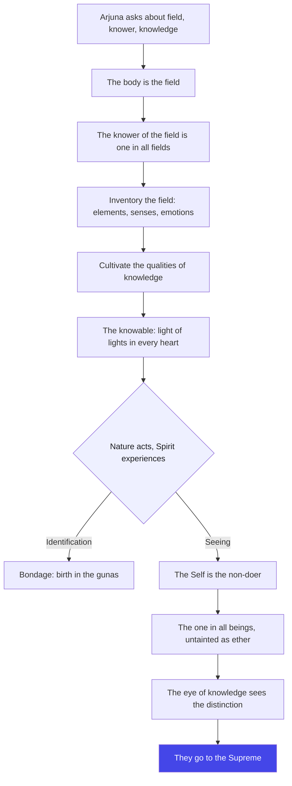
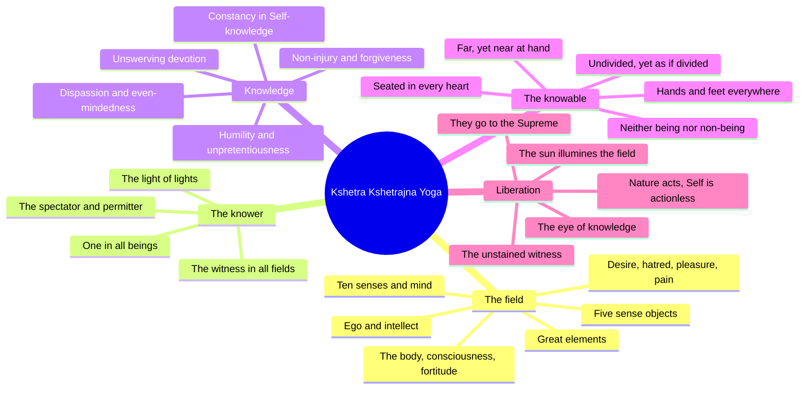

# Chapter 13: Kshetra Kshetrajna Yoga — The Field and the Knower

> "You are not the field of your life — not its soil, not its crops, not its storms. You are the one who sees the field. And you have never left home."
> — The Osho Way

---

Arjuna has heard about the manifest and the unmanifest, about devotion and action, about the cosmic form of the divine. Now he asks the sharpest question of the Gita — the question that divides everything: "I wish to learn about Nature and Spirit, the field and the knower of the field, knowledge and the knowable" (13.1). He is asking for a map of the whole of existence: what is matter, what is consciousness, and who is it that knows both?

Krishna's answer is a knife that cuts the world in two — and then shows that one half was never separate. The body is the field (*kshetra*): everything that grows, changes, ripens, and decays — the soil, the seasons, the harvest. The knower of the field (*kshetrajna*) is consciousness itself: the one who stands in every field and watches every season. And then Krishna delivers the verse that changes everything (13.3): the knower of the field in all fields is the divine itself. There are millions of fields and millions of knowers — and all the knowers are one.

Osho reads this chapter as the Gita's deepest psychology. The field is everything you can observe: your thoughts, your emotions, your body, your career, your worries, your ecstasies. The knower is the witness (*sakshi*) — the one inside you who has never been sad, never been angry, never been born. The whole practice of transformation, says Osho, is nothing but learning to live as the knower instead of being drowned in the field. Not to escape the field — to live in it freely, as the sun lives in the sky above the clouds: shining on everything, attached to nothing.

And then comes the astonishing inventory of Chapter 13: the twenty-four elements of the field, the twenty qualities that constitute knowledge, and the portrait of the knowable — the light of lights, seated in every heart, nearer than near, farther than far. The chapter closes with the verdict of the eye of knowledge: those who see the difference between field and knower, and who see the liberation of Nature herself, they go to the Supreme. For Osho, this is not theology — it is the final clarity of meditation: when you know what is yours and what is you, the long dream of suffering ends.

## Learning Objectives

After completing this chapter you will be able to:

1. **Define the two poles of the chapter** — explain what the field (*kshetra*) and the knower of the field (*kshetrajna*) mean, and why Krishna calls himself the knower of all fields (13.3).
2. **Inventory the field** — list the twenty-four elements of the field from 13.6–13.7 (great elements, ego, intellect, the unmanifested, ten senses, mind, five sense objects, desire, hatred, pleasure, pain, the body, consciousness, fortitude).
3. **List the twenty qualities of knowledge** — enumerate the virtues of 13.8–13.12 and see why Krishna calls them "knowledge": they are the means by which the field becomes transparent.
4. **Describe the knowable** — explain the paradoxes of 13.13–13.18 (neither being nor non-being, far yet near, undivided yet divided, the light of lights) as descriptions of the witness, not definitions of an object.
5. **Use the witness in daily life** — apply the field/knower distinction to your own emotions and thoughts, and see why "all actions are done by Nature alone; the Self is actionless" (13.30) is a freedom, not a fatalism.
6. **Build a TypeScript tool** — create a "Field Classifier" that sorts modern life-statements into field (kshetra) and knower (kshetrajna) categories, with a witness-style response for each.

---

## Kshetra Kshetrajna Yoga at a Glance

### The scene and the speakers

We remain on the chariot, but the scene has become a classroom of the absolute. Arjuna asks, Krishna answers — and this chapter is almost entirely a Krishna monologue, a systematic teaching delivered in thirty-five compact verses. In the Mahabharata context this is the beginning of the third great section of the Gita (chapters 13–18, the way of knowledge), the point where the teaching turns from the heart (bhakti, chapters 7–12) to the eye (jnana, chapters 13–18). It is the Gita's answer to the oldest question: what is the world made of, and who is it that knows?

### The Osho lens

Osho treats the field/knower distinction as a laboratory instruction, not a cosmology. The field is everything that appears — and everything that appears is *appearing to someone*. The someone is the knower. You have watched your own moods change for decades; that watching has never changed. Osho's invitation: make the watching your identity, and the field — with all its storms — becomes weather over a mountain. This chapter is not asking you to believe in a distant God; it is asking you to notice the witness that has been present since childhood, and to rest there.

### The structure of the chapter

- **Movement 1: 13.1–13.5 — The question and the frame.** Arjuna asks about field, knower, knowledge, and the knowable; Krishna defines the body as the field, himself as the knower in all fields, and cites the sages and the Brahma Sutras.
- **Movement 2: 13.6–13.12 — The inventory.** The twenty-four constituents of the field, and the twenty qualities of knowledge — the first full anatomy of inner life in the Gita.
- **Movement 3: 13.13–13.18 — The knowable.** The portrait of Brahman through paradox: neither being nor non-being, all hands and all eyes, far and near, undivided yet divided, the light of lights in every heart.
- **Movement 4: 13.19–13.35 — Nature, Spirit, and the eye of knowledge.** Prakriti and Purusha, the causes of bondage and freedom, the four paths, the one in all beings, the sun that illumines the whole field, and the final vision that liberates.

### The three-framework note

This is the first chapter of the Jnana Yoga section, so the three-framework note is the Gita's own map: chapters 1–6 are the way of action (Karma Yoga) — the field must first be tended rightly. Chapters 7–12 are the way of devotion (Bhakti Yoga) — the field must be loved as the beloved's. Chapters 13–18 are the way of knowledge (Jnana Yoga) — the field must finally be *seen* for what it is, and the knower for what it is. Osho's gloss: the farmer works the field, the lover sanctifies it, the seer discovers that the field was always a mirror — and what it mirrors is the seer himself.

## Traditional Reading vs Osho-Style Reading

| Dimension | Traditional reading | Osho-style reading |
|--------|---------------------|--------------------|
| **The field (kshetra)** | Matter, the body-mind aggregate, created by Prakriti for enjoyment and liberation | Everything you can observe — thoughts, moods, body, career, the whole content of experience |
| **The knower (kshetrajna)** | The individual soul, and ultimately God as knower of all fields | The witness inside you, the sakshi, who has never been disturbed and never been born |
| **Knowledge (13.8–13.12)** | The twenty virtues as spiritual disciplines and means to liberation | The transparency that makes the field see-through: humility, restraint, dispassion as *seeing*, not as rules |
| **The knowable (13.13–13.18)** | The supreme Brahman, object of worship and meditation | The non-object — pure seeing itself, which can only be pointed at, never described |
| **Bondage (13.22)** | Attachment to the gunas causes birth in good and evil wombs | Identification with the field is the only prison; the witness never enters it |
| **Liberation (13.30, 13.35)** | Union with Brahman after death, release from rebirth | The immediate discovery that Nature does everything and the Self is actionless — freedom lived now, on this field |

## The Complete Text — All 35 Shlokas

### Shloka 13.1 — Arjuna's Greatest Question

> अर्जुन उवाच |
> प्रकृतिं पुरुषं चैव क्षेत्रं क्षेत्रज्ञमेव च |
> एतद्वेदितुमिच्छामि ज्ञानं ज्ञेयं च केशव |

**Transliteration:** arjuna uvāca . prakṛtiṃ puruṣaṃ caiva kṣetraṃ kṣetrajñameva ca . etadveditumicchāmi jñānaṃ jñeyaṃ ca keśava

**Translation:** Arjuna said: "I wish to learn, O Kesava, about Nature and the Spirit, the field and the knower of the field, knowledge and that which is to be known."

**Osho Darshan:** Notice what Arjuna is not asking about — not heaven, not rituals, not the afterlife. He is asking about the structure of experience itself: what is seen, what sees, and what knowing is. Osho says this is the moment the disciple becomes a scientist of the inner world. The question is put in pairs — matter and spirit, field and knower, knowledge and the known — and every pair is a door. The question itself is the first act of the eye of knowledge: to ask what is *seen* and who is *seeing* is already to be halfway out of the dream.

### Shloka 13.2 — The Body Is the Field

> श्रीभगवानुवाच |
> इदं शरीरं कौन्तेय क्षेत्रमित्यभिधीयते |
> एतद्यो वेत्ति तं प्राहुः क्षेत्रज्ञ इति तद्विदः |

**Transliteration:** śrībhagavānuvāca . idaṃ śarīraṃ kaunteya kṣetramityabhidhīyate . etadyo vetti taṃ prāhuḥ kṣetrajña iti tadvidaḥ

**Translation:** The Blessed Lord said: "This body, O Kaunteya, is called the field; and he who knows it is called the knower of the field by those who know of them."

**Osho Darshan:** The definition is stunning in its simplicity: the body is a field because in it the harvest of a lifetime is reaped — pleasure, pain, memory, karma ripening like crops. And the one who *knows* the field is the knower. Osho underlines the implication: the body is known, therefore the body is not the knower. You say "my body" — who says that? The one who says "my body" cannot be the body. This is the first rung of the whole chapter's ladder: before any philosophy, simply notice the owner of the word "my." That owner is the knower, and it is closer than your skin.

### Shloka 13.3 — The Knower in All Fields

> क्षेत्रज्ञं चापि मां विद्धि सर्वक्षेत्रेषु भारत |
> क्षेत्रक्षेत्रज्ञयोर्ज्ञानं यत्तज्ज्ञानं मतं मम |

**Transliteration:** kṣetrajñaṃ cāpi māṃ viddhi sarvakṣetreṣu bhārata . kṣetrakṣetrajñayorjñānaṃ yattajjñānaṃ mataṃ mama |

**Translation:** "Know Me also as the knower of the field in all fields, O Bharata. Knowledge of the field and of its knower — that, in My view, is knowledge."

**Osho Darshan:** Here is the verse that turns a psychology into a revelation: the knower in every field is the divine. There are billions of fields — billions of bodies, billions of minds — but the knowing in all of them is one. Osho calls this the profoundest meditation of the Gita: when you look into another person's eyes, you are not seeing another knower; you are seeing the same knower wearing another field. And real knowledge is defined here — not information about the world, but knowledge of the field and its knower. Everything else, says Osho, is data. This is wisdom.

### Shloka 13.4 — Hear in Brief What the Field Is

> तत्क्षेत्रं यच्च यादृक्च यद्विकारि यतश्च यत् |
> स च यो यत्प्रभावश्च तत्समासेन मे शृणु |

**Transliteration:** tatkṣetraṃ yacca yādṛkca yadvikāri yataśca yat . sa ca yo yatprabhāvaśca tatsamāsena me śṛṇu

**Translation:** "What the field is, of what nature, what its modifications, and from what cause it arises — and also who He is and what His powers are — hear all that from Me in brief."

**Osho Darshan:** Krishna promises a complete anatomy in brief: the field's substance, its changes, its origins — and the knower's identity and powers. Osho reads this as the Gita's method: the truth does not need to be infinite in volume; it needs to be exact in direction. The whole teaching of the chapter can be compressed into a single seeing — and that seeing, not the volume of words, is the goal. Krishna is saying: I will give you the map; the territory is one glance away.

### Shloka 13.5 — Sung by the Sages and the Sutras

> ऋषिभिर्बहुधा गीतं छन्दोभिर्विविधैः पृथक् |
> ब्रह्मसूत्रपदैश्चैव हेतुमद्भिर्विनिश्चितैः |

**Transliteration:** ṛṣibhirbahudhā gītaṃ chandobhirvividhaiḥ pṛthak . brahmasūtrapadaiścaiva hetumadbhirviniścitaiḥ

**Translation:** "Sages have sung of it in many ways, in various distinctive hymns, and also in the words of the Brahma Sutras, full of reasoning and decisive."

**Osho Darshan:** Krishna grounds his teaching in the tradition — the rishis, the hymns, the Brahma Sutras — and Osho draws the crucial distinction: tradition is the finger pointing at the moon, never the moon itself. The truth of field and knower has been sung in a thousand voices, and all the voices say the same thing differently. That is why you must not worship the finger. The sages' value is not their authority but their *direction*: they all point inward. The sutras reason; the seer sees. Reason brings you to the door; only seeing walks through it.

### Shloka 13.6 — The Twenty-Four Elements of the Field

> महाभूतान्यहंकारो बुद्धिरव्यक्तमेव च |
> इन्द्रियाणि दशैकं च पञ्च चेन्द्रियगोचराः |

**Transliteration:** mahābhūtānyahaṃkāro buddhiravyaktameva ca . indriyāṇi daśaikaṃ ca pañca cendriyagocarāḥ

**Translation:** "The great elements, egoism, intellect, and also the unmanifested Nature; the ten senses and the one mind; and the five objects of the senses."

**Osho Darshan:** The inventory begins: the five great elements (earth, water, fire, air, ether), ego, intellect, the unmanifested root of Nature, ten senses, the mind, and the five sense objects — the classical twenty-four principles. Osho points out what the list is *doing*: it is naming everything that appears, so that nothing you can perceive remains unlabeled. And once everything perceivable is labeled, only one thing remains outside the list — the perceiver. The enumeration of the field is designed to exhaust the visible, so that the invisible may finally be noticed.

### Shloka 13.7 — The Field With Its Modifications

> इच्छा द्वेषः सुखं दुःखं संघातश्चेतना धृतिः |
> एतत्क्षेत्रं समासेन सविकारमुदाहृतम् |

**Transliteration:** icchā dveṣaḥ sukhaṃ duḥkhaṃ saṃghātaścetanā dhṛtiḥ . etatkṣetraṃ samāsena savikāramudāhṛtam |

**Translation:** "Desire, hatred, pleasure, pain, the aggregate of the body, consciousness, and fortitude — thus, in brief, is the field described with its modifications."

**Osho Darshan:** The second half of the inventory is entirely psychological — desire, hatred, pleasure, pain, the body-aggregate, awareness, fortitude. Osho says this is the Gita's most liberating observation: *your emotions are part of the field*. Desire is not you; hatred is not you; even consciousness-with-content is a crop in the field. They all change, and you have watched them all change. The witness of desire is not desire. When you can say "anger is arising" instead of "I am angry," the first breach in the prison wall has been made — and the knower, for the first time, feels his own air.

### Shloka 13.8 — Humility, Unpretentiousness, Non-Injury

> अमानित्वमदम्भित्वमहिंसा क्षान्तिरार्जवम् |
> आचार्योपासनं शौचं स्थैर्यमात्मविनिग्रहः |

**Transliteration:** amānitvamadambhitvamahiṃsā kṣāntirārjavam . ācāryopāsanaṃ śaucaṃ sthairyamātmavinigrahaḥ |

**Translation:** "Humility, unpretentiousness, non-injury, forgiveness, uprightness, service of the teacher, purity, steadfastness, and self-control."

**Osho Darshan:** The list of twenty qualities of knowledge begins — and Osho stresses that these are not moral rules but *symptoms*. Humility appears when the ego stops performing; unpretentiousness when there is no one left to impress; non-injury when the inner violence has been seen through. You cannot cultivate these like muscles; you can only remove the ignorance that blocks them, and they flower on their own. The list is a diagnostic, not a to-do list: check yourself against it, and where a quality is missing, look for the identity that is blocking it.

### Shloka 13.9 — Dispassion and the Perception of Suffering

> इन्द्रियार्थेषु वैराग्यमनहंकार एव च |
> जन्ममृत्युजराव्याधिदुःखदोषानुदर्शनम् |

**Transliteration:** indriyārtheṣu vairāgyamanahaṃkāra eva ca . janmamṛtyujarāvyādhiduḥkhadoṣānudarśanam |

**Translation:** "Indifference to the objects of the senses, absence of egoism, and the perception of evil in birth, death, old age, sickness, and pain."

**Osho Darshan:** Dispassion (*vairagya*) is not disgust with the world — it is the seeing through of it, like watching a movie and suddenly noticing the projector. And the "perception of evil in birth, death, old age, and pain" is not pessimism; it is the refusal to keep pretending that the field is permanent. Osho says: the body is a rented house with a known expiry date, and the one who knows the lease is free to enjoy the house without clinging to it. Seeing the impermanence of the field is not sadness — it is the beginning of the only happiness that cannot be lost.

### Shloka 13.10 — Non-Attachment and Even-Mindedness

> असक्तिरनभिष्वङ्गः पुत्रदारगृहादिषु |
> नित्यं च समचित्तत्वमिष्टानिष्टोपपत्तिषु |

**Transliteration:** asaktiranabhiṣvaṅgaḥ putradāragṛhādiṣu . nityaṃ ca samacittatvamiṣṭāniṣṭopapattiṣu |

**Translation:** "Non-attachment, non-identification with son, wife, home and the rest, and constant even-mindedness toward the desirable and the undesirable."

**Osho Darshan:** This is the most delicate verse in the list, because it speaks of the deepest loves — son, wife, home. Osho is careful here: non-identification is not lovelessness. The wife is loved, but the *identity* — "I am her husband, therefore I must be this or that" — is dropped. You love as a free presence, not as a role defending itself. Even-mindedness toward the desirable and the undesirable completes it: when no role is at stake, the arrival of the pleasant and the unpleasant are simply weather. Love deepens exactly where ownership ends — the river is most beautiful when you stop trying to hold it.

### Shloka 13.11 — Unswerving Devotion and Solitude

> मयि चानन्ययोगेन भक्तिरव्यभिचारिणी |
> विविक्तदेशसेवित्वमरतिर्जनसंसदि |

**Transliteration:** mayi cānanyayogena bhaktiravyabhicāriṇī . viviktadeśasevitvamaratirjanasaṃsadi |

**Translation:** "Unswerving devotion to Me through the yoga of non-separation, resorting to solitary places, and distaste for the company of the crowd."

**Osho Darshan:** Knowledge, it turns out, includes devotion — the two are not enemies; the knower's clarity becomes the lover's constancy. And then the practical note: solitude. Osho says the seeker needs solitude the way a plant needs soil — not to escape people, but to discover who is inside before meeting anyone. "Distaste for the crowd" is not misanthropy; it is the natural preference of someone who has tasted inner silence for the company of that silence. When you know the knower, you no longer need the crowd to tell you who you are.

### Shloka 13.12 — This Is Declared to Be Knowledge

> अध्यात्मज्ञाननित्यत्वं तत्त्वज्ञानार्थदर्शनम् |
> एतज्ज्ञानमिति प्रोक्तमज्ञानं यदतोऽन्यथा |

**Transliteration:** adhyātmajñānanityatvaṃ tattvajñānārthadarśanam . etajjñānamiti proktamajñānaṃ yadato.anyathā |

**Translation:** "Constancy in the knowledge of the Self, and the vision of the end of true knowledge — this is declared to be knowledge; what is opposed to this is ignorance."

**Osho Darshan:** The twenty qualities conclude with the crown: constancy in Self-knowledge — not a flash, but a residence — and "the vision of the end of true knowledge": seeing where knowledge is headed, which is the knowing of the knower himself. Osho underlines the final sentence: *whatever is opposed to this is ignorance*. Not stupidity — ignorance. The man who knows the world and does not know the knower is, in the Gita's sense, ignorant of the only thing that cannot be lost. All other knowledge is decoration on a house whose owner has never been met.

### Shloka 13.13 — The Knowable: Neither Being Nor Non-Being

> ज्ञेयं यत्तत्प्रवक्ष्यामि यज्ज्ञात्वामृतमश्नुते |
> अनादिमत्परं ब्रह्म न सत्तन्नासदुच्यते |

**Transliteration:** jñeyaṃ yattatpravakṣyāmi yajjñātvāmṛtamaśnute . anādi matparaṃ brahma na sattannāsaducyate |

**Translation:** "I will declare that which is to be known, knowing which one attains immortality: the beginningless supreme Brahman, which is called neither being nor non-being."

**Osho Darshan:** The portrait of the knowable begins with a demolition of all concepts — Brahman is neither being nor non-being, because both words are categories of the field, and the knower of the field is the source of categories, not a member of them. Osho says: you cannot describe the witness the way you describe a table, because the witness is not an object among objects; it is the seeing in which all objects appear. And the verse carries a promise: knowing *this* — this non-object — one attains immortality. Not later, but the moment the seeing sees itself.

### Shloka 13.14 — Hands and Feet Everywhere

> सर्वतः पाणिपादं तत्सर्वतोऽक्षिशिरोमुखम् |
> सर्वतः श्रुतिमल्लोके सर्वमावृत्य तिष्ठति |

**Transliteration:** sarvataḥ pāṇipādaṃ tatsarvato.akṣiśiromukham . sarvataḥ śrutimalloke sarvamāvṛtya tiṣṭhati |

**Translation:** "With hands and feet everywhere, with eyes, heads and mouths everywhere, with ears everywhere, He stands in the world, enveloping all."

**Osho Darshan:** Since the knowable cannot be defined, it is pointed to by omnipresence: every hand that touches is the divine hand; every eye that sees is the divine eye. Osho reads this as the universe becoming transparent — the knower in every field is the same knower, so every act of perception anywhere is one act. This is not pantheism as doctrine; it is the felt consequence of 13.3: if the knower of every field is one, then the whole universe is one field with one witness. Enveloping all — there is nothing outside the seeing to be outside.

### Shloka 13.15 — Without Senses, Yet Shining Through Them

> सर्वेन्द्रियगुणाभासं सर्वेन्द्रियविवर्जितम् |
> असक्तं सर्वभृच्चैव निर्गुणं गुणभोक्तृ च |

**Transliteration:** sarvendriyaguṇābhāsaṃ sarvendriyavivarjitam . asaktaṃ sarvabhṛccaiva nirguṇaṃ guṇabhoktṛ ca |

**Translation:** "Shining through the functions of all the senses, yet without the senses; unattached, yet supporting all; without qualities, yet the experiencer of the qualities."

**Osho Darshan:** The paradoxes stack up — the lamp of all senses but not a sense; supporting everything but touching nothing; without qualities, yet the one who experiences the qualities. Osho's image: the mirror has no image of its own, yet every image appears in it. The witness has no emotions of its own, yet every emotion appears in its light. This is why meditation works: you cannot fight the field, but you can rest in the mirror. The qualities of the field do their dance; the mirror is untouched — and so, when you finally live as the mirror, you are untouched too.

### Shloka 13.16 — Far and Near, Inside and Outside

> बहिरन्तश्च भूतानामचरं चरमेव च |
> सूक्ष्मत्वात्तदविज्ञेयं दूरस्थं चान्तिके च तत् |

**Transliteration:** bahirantaśca bhūtānāmacaraṃ carameva ca . sūkṣmatvāttadavijñeyaṃ dūrasthaṃ cāntike ca tat |

**Translation:** "Without and within all beings, unmoving and also moving; because of its subtlety it is unknowable, and far away, yet near at hand, is That."

**Osho Darshan:** The witness is inside you and outside you — the inside and the outside are themselves within the witness. Osho loves the paradox "far away, yet near at hand": the knower is the nearest thing there is — closer than breath, because breath is a thing seen by it — and yet it seems infinitely far because the mind keeps looking outward for it. The subtlety is the whole point: what is not an object cannot be grasped, and the moment you stop grasping, it is already there. The far distance was only the length of your own looking-away.

### Shloka 13.17 — Undivided, Yet Appearing Divided

> अविभक्तं च भूतेषु विभक्तमिव च स्थितम् |
> भूतभर्तृ च तज्ज्ञेयं ग्रसिष्णु प्रभविष्णु च |

**Transliteration:** avibhaktaṃ ca bhūteṣu vibhaktamiva ca sthitam . bhūtabhartṛ ca tajjñeyaṃ grasiṣṇu prabhaviṣṇu ca |

**Translation:** "Undivided, yet It stands in beings as if divided; it is to be known as the supporter of beings, devouring and generating them."

**Osho Darshan:** The knowable is one — undivided — yet in each being it appears as a separate soul: one sun, a thousand wells, each well holding the same sun. Osho says the "as if divided" is the entire riddle of suffering: the oneness is the truth, the division is the appearance, and you suffer only at the level of the appearance. And this one reality is supporter, devourer, and generator — the field's whole story of birth, life, and death is the play of the knowable within itself. Nothing is lost in this play, because the player is one.

### Shloka 13.18 — The Light of Lights in Every Heart

> ज्योतिषामपि तज्ज्योतिस्तमसः परमुच्यते |
> ज्ञानं ज्ञेयं ज्ञानगम्यं हृदि सर्वस्य विष्ठितम् |

**Transliteration:** jyotiṣāmapi tajjyotistamasaḥ paramucyate . jñānaṃ jñeyaṃ jñānagamyaṃ hṛdi sarvasya viṣṭhitam |

**Translation:** "That, the light of all lights, is said to be beyond darkness: knowledge, the knowable, and the goal of knowledge, seated in the hearts of all."

**Osho Darshan:** The portrait peaks here: the light in which every other light shines — the sun is lit by it, the intellect is lit by it, and no darkness can touch it. Osho's gloss on the triple formula: knowledge (the means), the knowable (the object), and the goal of knowledge (the attainment) all collapse into one — and that one is seated in the heart of every being. The final destination of all searching is not out there; it is the place the search comes from. The seeker and the sought were never two; only the seeking kept them apart.

### Shloka 13.19 — Knowing This, the Devotee Enters My Being

> इति क्षेत्रं तथा ज्ञानं ज्ञेयं चोक्तं समासतः |
> मद्भक्त एतद्विज्ञाय मद्भावायोपपद्यते |

**Transliteration:** iti kṣetraṃ tathā jñānaṃ jñeyaṃ coktaṃ samāsataḥ . madbhakta etadvijñāya madbhāvāyopapadyate |

**Translation:** "Thus the field, knowledge, and the knowable have been stated in brief. My devotee, knowing this truly, enters into My being."

**Osho Darshan:** A hinge verse: the devotee of the previous chapter is now given the knowledge of the field — and knowing it, "enters into My being." Osho reads this as the Gita's assurance that love and clarity are one journey: the heart opens, and the eye opens in the same opening. To know the field as field, the knower as knower, and the knowable as the heart of all — this is not information added to devotion; it is devotion matured into vision. The devotee does not merge into a distant God; he wakes up as the being he already was.

### Shloka 13.20 — Nature and Spirit, Both Beginningless

> प्रकृतिं पुरुषं चैव विद्ध्यनादी उभावपि |
> विकारांश्च गुणांश्चैव विद्धि प्रकृतिसम्भवान् |

**Transliteration:** prakṛtiṃ puruṣaṃ caiva viddhyanādi ubhāvapi . vikārāṃśca guṇāṃścaiva viddhi prakṛtisambhavān |

**Translation:** "Know that Nature and the Spirit are both beginningless; and know also that all modifications and qualities are born of Nature."

**Osho Darshan:** The second movement begins — a philosophy lecture in two verses. Nature (Prakriti) and Spirit (Purusha) are both beginningless: you cannot date the field, and you cannot date the witness. But the crucial division of labor: all *modifications and qualities* — every change, every mood, every guna — belong to Nature. Osho draws the practical conclusion immediately: whatever changes in you is Nature; whatever watches the change is Spirit. Your anger changes; your happiness changes; your opinions change. The watcher has never changed. You can trust the watcher in a way you could never trust the weather.

### Shloka 13.21 — Nature Acts, Spirit Experiences

> कार्यकारणकर्तृत्वे हेतुः प्रकृतिरुच्यते |
> पुरुषः सुखदुःखानां भोक्तृत्वे हेतुरुच्यते |

**Transliteration:** kāryakāraṇakartṛtve hetuḥ prakṛtirucyate . puruṣaḥ sukhaduḥkhānāṃ bhoktṛtve heturucyate |

**Translation:** "In the production of effects and causes, Nature is said to be the cause; in the experience of pleasure and pain, the Spirit is said to be the cause."

**Osho Darshan:** The division of labor sharpens: Nature does the doing; Spirit does the experiencing. Osho explains this with the simplest example — the mind fabricates the anxiety (Nature's work), and the witness feels the contraction of anxiety (the experience). The trouble begins when the two are confused: the witness forgets it is only experiencing and believes it is doing — "I am anxious" instead of "anxiety is arising." That single confusion is the whole of bondage, and seeing it is the whole of liberation. The cause of your suffering is never the event; it is the forgetting of who experiences the event.

### Shloka 13.22 — Seated in Nature, the Soul Experiences the Gunas

> पुरुषः प्रकृतिस्थो हि भुङ्क्ते प्रकृतिजान्गुणान् |
> कारणं गुणसङ्गोऽस्य सदसद्योनिजन्मसु |

**Transliteration:** puruṣaḥ prakṛtistho hi bhuṅkte prakṛtijānguṇān . kāraṇaṃ guṇasaṅgo.asya sadasadyonijanmasu |

**Translation:** "The Spirit seated in Nature experiences the qualities born of Nature; attachment to the qualities is the cause of its births in good and evil wombs."

**Osho Darshan:** The soul experiences the gunas — and then, through *attachment* to them, gets drawn into their whirl. Osho says: the witness's one mistake is not experiencing — experiencing is its nature — the mistake is *gripping*. Experience a mood and it passes like a cloud; grasp the mood, identify with it, and you are living in the cloud. The verse speaks of birth in good and evil wombs; Osho translates this into the only birth that matters — every morning you are born into the state you are attached to. Attached to anger, you are born angry. The knower alone has no preferred womb; therefore the knower is never born.

### Shloka 13.23 — The Spectator, Permitter, Supporter, Enjoyer, Great Lord

> उपद्रष्टानुमन्ता च भर्ता भोक्ता महेश्वरः |
> परमात्मेति चाप्युक्तो देहेऽस्मिन्पुरुषः परः |

**Transliteration:** upadraṣṭānumantā ca bhartā bhoktā maheśvaraḥ . paramātmeti cāpyukto dehe.asminpuruṣaḥ paraḥ |

**Translation:** "The Supreme Spirit in this body is called the spectator, the permitter, the supporter, the enjoyer, the great Lord, and also the Supreme Self."

**Osho Darshan:** Six names for one presence, and Osho reads them as six stances of the witness: the spectator who watches without interfering; the permitter who says yes to life's unfolding; the supporter who underlies everything; the enjoyer who tastes the whole play; the great Lord who owns nothing yet commands all; the Supreme Self who is the innermost you. These are not six gods — they are six ways you can live today: watching, allowing, supporting, tasting, reigning, and resting in yourself. The verse's gift is the range: the witness is not a pale onlooker; it is the most alive thing in the room.

### Shloka 13.24 — Knowing Spirit and Nature, No More Birth

> य एवं वेत्ति पुरुषं प्रकृतिं च गुणैः सह |
> सर्वथा वर्तमानोऽपि न स भूयोऽभिजायते |

**Transliteration:** ya evaṃ vetti puruṣaṃ prakṛtiṃ ca guṇaiḥ saha . sarvathā vartamāno.api na sa bhūyo.abhijāyate |

**Translation:** "He who thus knows the Spirit and Nature together with the qualities, in whatever condition he may be living, is not born again."

**Osho Darshan:** The liberating clause is "in whatever condition he may be living" — the knower is not required to become a monk, change jobs, or purify behavior. The seeing itself is the liberation. Osho explains: rebirth is not a court sentence passed after death; it is the automatic return of the same consciousness pattern — born again as the same anger, the same craving, the same role. The knower of Spirit and Nature simply stops feeding the pattern, because he sees it as the field's weather, not as himself. Whatever the body does, no new self is seeded. The house may stand; the tenant is free.

### Shloka 13.25 — Some See by Meditation, Others by Knowledge, Others by Action

> ध्यानेनात्मनि पश्यन्ति केचिदात्मानमात्मना |
> अन्ये साङ्ख्येन योगेन कर्मयोगेन चापरे |

**Transliteration:** dhyānenātmani paśyanti kecidātmānamātmanā . anye sāṅkhyena yogena karmayogena cāpare |

**Translation:** "Some behold the Self in the self, by the self, through meditation; others through the yoga of knowledge; and still others through the yoga of action."

**Osho Darshan:** The paths are named with respect: meditation for those who can sit, discrimination for those who can analyze, action for those who can work. Osho stresses that no path is praised above another here — what is praised is the *aim*: to behold the Self in the self by the self. The wording is exact — you see the Self *by* the Self, meaning the seeing is done by the very thing seen. The meditator, the philosopher, and the worker are all heading to the same inner home, each walking the road his nature can walk. Do not envy another's road; your road is the one that fits your feet.

### Shloka 13.26 — Those Who Hear From Others Also Cross Over

> अन्ये त्वेवमजानन्तः श्रुत्वान्येभ्य उपासते |
> तेऽपि चातितरन्त्येव मृत्युं श्रुतिपरायणाः |

**Transliteration:** anye tvevamajānantaḥ śrutvānyebhya upāsate . te.api cātitarantyeva mṛtyuṃ śrutiparāyaṇāḥ |

**Translation:** "Others, not knowing this themselves, worship having heard it from others; they too, devoted to what they have heard, cross beyond death."

**Osho Darshan:** The Gita's democracy is complete: even those who cannot meditate, analyze, or act — those who simply *hear* the truth from another and trust it — they also cross over. Osho calls this the verse that saves the ordinary human being: the truth does not demand genius; it demands the innocence of hearing. A heart that hears the truth and holds it like a seed — "the field is not you, the knower is you" — that seed will sprout, even without the hearer understanding it fully. Faith is not a lesser path; it is meditation in its infancy, and infancy reaches the same adulthood.

### Shloka 13.27 — Whatever Is Born Is Field and Knower United

> यावत्सञ्जायते किञ्चित्सत्त्वं स्थावरजङ्गमम् |
> क्षेत्रक्षेत्रज्ञसंयोगात्तद्विद्धि भरतर्षभ |

**Transliteration:** yāvatsañjāyate kiñcitsattvaṃ sthāvarajaṅgamam . kṣetrakṣetrajñasaṃyogāttadviddhi bharatarṣabha |

**Translation:** "Whatever being is born, moving or unmoving, know, O best of the Bharatas, that it arises from the union of the field and its knower."

**Osho Darshan:** Everything that is born — a tree, a bird, a thought, a mood — is a meeting of field and knower. Osho says this is the Gita's way of saying that life is made of two elements, and you can never separate them in the *product* — every appearance is field-as-seen-by-knower. The practical secret: do not try to escape the field (you cannot, you are alive) and do not drown in it. Live in the union consciously. Whatever arises in you today, from the smallest irritation to the grandest idea, is field and knower in embrace — and the knower, being one of the two, can never be absent from anything you experience.

### Shloka 13.28 — The One in All Beings, Unperishing in the Perishing

> समं सर्वेषु भूतेषु तिष्ठन्तं परमेश्वरम् |
> विनश्यत्स्वविनश्यन्तं यः पश्यति स पश्यति |

**Transliteration:** samaṃ sarveṣu bhūteṣu tiṣṭhantaṃ parameśvaram . vinaśyatsvavinaśyantaṃ yaḥ paśyati sa paśyati |

**Translation:** "He sees, who sees the Supreme Lord standing equally in all beings, the unperishing within the perishing."

**Osho Darshan:** This is the Gita's definition of true sight: the one who sees the same presence in all beings — in the friend and the enemy, in the saint and the thief, in the sparrow and the emperor — that one *sees*. Osho dwells on the phrase "the unperishing within the perishing": every form around you is dying as you watch, and yet the seeing in every form is undying. To see this is not to lose feeling for the world; it is to love the world at its root instead of at its skin. When you can look at any being and meet the same witness, compassion stops being a duty and becomes a perception.

### Shloka 13.29 — Seeing the Same Lord Everywhere, You Do Not Destroy Yourself

> समं पश्यन्हि सर्वत्र समवस्थितमीश्वरम् |
> न हिनस्त्यात्मनात्मानं ततो याति परां गतिम् |

**Transliteration:** samaṃ paśyanhi sarvatra samavasthitamīśvaram . na hinastyātmanātmānaṃ tato yāti parāṃ gatim |

**Translation:** "Because he who sees the same Lord dwelling equally everywhere does not destroy the Self by the self; therefore he goes to the highest goal."

**Osho Darshan:** A strange phrase: "does not destroy the Self by the self." Osho explains the violence most people commit daily — you cut yourself off from others, judging them, fearing them, defending against them, and every such cut wounds the one Self you share with them. The one who sees the same Lord everywhere cannot fight reality, because he would be fighting himself. The warfare of the ego ends; the highest goal — not a place, but this very peace of non-contention — is reached the moment the internal war is seen through. You were never going anywhere; you were only getting tired of fighting.

### Shloka 13.30 — All Actions Are Nature's; the Self Is Actionless

> प्रकृत्यैव च कर्माणि क्रियमाणानि सर्वशः |
> यः पश्यति तथात्मानमकर्तारं स पश्यति |

**Transliteration:** prakṛtyaiva ca karmāṇi kriyamāṇāni sarvaśaḥ . yaḥ paśyati tathātmānamakartāraṃ sa paśyati |

**Translation:** "He sees, who sees that all actions are performed by Nature alone, and that the Self is the non-doer."

**Osho Darshan:** The most liberating verse of the chapter, and the most easily misunderstood. Osho insists: this is not fatalism — "I am not responsible, so I may do anything." It is the opposite: you are freed from the *anxiety of doing*, not from the doing. The river of Nature — impulses, habits, circumstances — flows, and the Self flows with it as the witnessing current, not as the engine. The man who sees Nature acting and the Self non-acting is the one who stops claiming credit and stop blaming — and in that double release, action becomes effortless. The non-doer is not lazy; the non-doer is the one through whom action flows without a gripper.

### Shloka 13.31 — Seeing All Variety in the One, You Become the One

> यदा भूतपृथग्भावमेकस्थमनुपश्यति |
> तत एव च विस्तारं ब्रह्म सम्पद्यते तदा |

**Transliteration:** yadā bhūtapṛthagbhāvamekasthamanupaśyati . tata eva ca vistāraṃ brahma sampadyate tadā |

**Translation:** "When a man sees the whole variety of beings as resting in the One, and as spreading forth from That alone, then he becomes Brahman."

**Osho Darshan:** The vision completes itself: the many — all the fields, all the forms, all the voices — seen as resting in the One, and flowing out from the One. Osho says the phrase to feel is "spreading forth from That alone": the world is not separate from the witness; it is the witness expressing itself as experience. And the outcome is not "he attains Brahman" but "he *becomes* Brahman" — the grammar itself is the teaching. You do not meet the One; you recognize that you were always it. The many was a costume; the seeing through the costume reveals the actor who played every role.

### Shloka 13.32 — Beginningless, Without Qualities, Unstained

> अनादित्वान्निर्गुणत्वात्परमात्मायमव्ययः |
> शरीरस्थोऽपि कौन्तेय न करोति न लिप्यते |

**Transliteration:** anāditvānnirguṇatvātparamātmāyamavyayaḥ . śarīrastho.api kaunteya na karoti na lipyate |

**Translation:** "Being without beginning and without qualities, this Supreme Self, imperishable, though dwelling in the body, O Kaunteya, neither acts nor is tainted."

**Osho Darshan:** The witness dwells in the body and is not the body — and because it has no beginning and no qualities, nothing can stain it. Osho's image is the lotus: it lives in the mud, its roots in the mud, yet no mud clings to the flower. The witness is the lotus of your inner world: it stands in the body, it holds the body, and it is untouched by the body's history. This is the deepest dignity the Gita offers: you can be in the middle of every storm and remain untainted, because the taint attaches to actions and qualities, and the witness has neither. The mud is real; so is the lotus.

### Shloka 13.33 — As Ether Is Not Tainted, So the Self

> यथा सर्वगतं सौक्ष्म्यादाकाशं नोपलिप्यते |
> सर्वत्रावस्थितो देहे तथात्मा नोपलिप्यते |

**Transliteration:** yathā sarvagataṃ saukṣmyādākāśaṃ nopalipyate . sarvatrāvasthito dehe tathātmā nopalipyate |

**Translation:** "As the all-pervading ether is not tainted because of its subtlety, so the Self, seated everywhere in the body, is not tainted."

**Osho Darshan:** The ether is everywhere — in the smoke and in the clean air — and the smoke never sticks to it. Osho draws the daily application: the Self is in the angry thought and the peaceful thought, the same presence in both, and the anger no more stains it than smoke stains the sky. When you are angry, the anger is in the field; the witness watching the anger is untouched — you can verify this even now. The one who notices "anger is arising" is not itself angry. Rest in that noticing, and the taint that once seemed permanent dissolves into what it always was: weather in the ether.

### Shloka 13.34 — As the Sun Illumines the World, the Knower Illumines the Field

> यथा प्रकाशयत्येकः कृत्स्नं लोकमिमं रविः |
> क्षेत्रं क्षेत्री तथा कृत्स्नं प्रकाशयति भारत |

**Transliteration:** yathā prakāśayatyekaḥ kṛtsnaṃ lokamimaṃ raviḥ . kṣetraṃ kṣetrī tathā kṛtsnaṃ prakāśayati bhārata |

**Translation:** "Just as the one sun illumines this whole world, so the Lord of the field illumines the whole field, O Bharata."

**Osho Darshan:** The sun does not enter each object to light it; it stays in the sky and illumines all. So the knower does not run into your thoughts to light them; it stands behind all thinking, and every thought appears in its light. Osho says this is why the field is *knowable* at all — you could never observe a thought if there were not a light in which thoughts become visible. Every act of awareness — reading this sentence, feeling this breath — is the knower shining. The sun metaphor is the chapter's final reassurance: the light that illumines your whole life does not belong to the field it illumines. It is yours, and it is one.

### Shloka 13.35 — The Eye of Knowledge, and the Supreme

> क्षेत्रक्षेत्रज्ञयोरेवमन्तरं ज्ञानचक्षुषा |
> भूतप्रकृतिमोक्षं च ये विदुर्यान्ति ते परम् |

**Transliteration:** kṣetrakṣetrajñayorevamantaraṃ jñānacakṣuṣā . bhūtaprakṛtimokṣaṃ ca ye viduryānti te param |

**Translation:** "They who, by the eye of knowledge, perceive the distinction between the field and its knower, and also the liberation of beings from Nature — they go to the Supreme."

**Osho Darshan:** The chapter ends where it began, with the eye of knowledge — the seeing that distinguishes field from knower, and sees the liberation of beings from Nature. Osho reads the final words as a quiet triumph: "they go to the Supreme" — not they will, but they do; the journey and the destination are the same seeing. When the distinction is perceived, Nature's grip is loosened and the many knowers are known as one. This is the whole Gita's Jnana Yoga in one verse: see the field as field, the knower as knower, and the union of the two as the one light. That seeing is not the beginning of the path; it is the path's end, walking.

## Key Themes

| Theme | Shlokas | Osho-style insight |
|-------|---------|--------------------|
| **Field and knower defined** | 13.1–13.3 | The body is a field; the knower of the field is the divine in all fields — the witness inside you |
| **The anatomy of the field** | 13.6–13.7 | Twenty-four elements — your emotions and thoughts are field, not you; the witness has watched them all |
| **The twenty qualities of knowledge** | 13.8–13.12 | Humility, restraint, dispassion are symptoms of transparency, not moral chores |
| **The portrait of the knowable** | 13.13–13.18 | Neither being nor non-being, far and near, light of lights — the witness can only be pointed at, never grasped |
| **Nature acts, Spirit experiences** | 13.20–13.24 | All modifications belong to Prakriti; the knower who sees this is not born again |
| **The one in all beings** | 13.27–13.31 | Seeing the same Lord everywhere ends inner warfare; the non-doer Self is freedom, not fatalism |
| **The unstained witness** | 13.32–13.35 | As ether and sun are untouched, the Self is unstained; the eye of knowledge sees the distinction and goes to the Supreme |

## The Inner Journey



## A Mind Map



## Summary

- Chapter 13 opens the Gita's third section (knowledge) with the question that splits all experience: what is the field, and who knows it?
- The body is the field; the knower of the field is one — Krishna calls himself the knower in all fields, and Osho hears in this the witness that has watched your whole life without ever being hurt.
- The twenty-four elements of the field include your emotions and thoughts: nothing that changes is you; the witness is the only constant.
- The twenty qualities of knowledge (humility, restraint, dispassion, devotion, and more) are the transparency through which the field becomes see-through — symptoms of seeing, not moral chores.
- The knowable is pointed at, never defined: neither being nor non-being, far yet near, one yet appearing divided, the light of lights in every heart.
- Nature performs all action; the Self is the non-doer — a freedom, not a fatalism, and the one who sees this is unstained as ether and is not born again.
- The chapter closes on the eye of knowledge: those who perceive the distinction between field and knower go to the Supreme — the journey and the destination are the same seeing.

## Practical Takeaways

- **Do the "my" experiment.** Say "my body, my anger, my thought" — and notice the one who says "my." That owner is the knower; the owned things are the field. Practice this in a stressful moment and the storm loses its grip.
- **Relabel emotions as weather.** Next time anger or fear arises, silently correct the grammar: not "I am angry" but "anger is arising." The field changes; the watcher watches. This one shift is the whole chapter in a sentence.
- **Use the field inventory as a mirror.** Whenever a feeling claims to be "you," ask: does it change? If it changes, it is field — and the field can be released. The knower never changes; you can trust it absolutely.
- **Take the pair of the day.** Choose one pair from 13.28 — friend and enemy, praise and blame — and practice seeing the same presence on both sides for one day. Inner warfare drains away with this seeing.
- **Give the future to Nature.** Before any high-stakes moment (exam, interview, decision), remember 13.30: Nature performs, the Self witnesses. Do your part with full care and hand the outcome to the field — the non-doer stays serene.
- **Keep one practice steady.** Whether meditation, reflection, or action — the three paths of 13.25 all lead home; the worst choice is to abandon your road because another looks faster. The witness does not need your perfection; it only needs your presence.

## Chapter Quiz

**Q1. In 13.2, what is the field (kshetra) said to be?**
- a. The five elements alone
- b. The body, which reaps the harvest of a lifetime
- c. The sky and the earth
- d. The intellect alone

<details class="tp-qa-card" data-qid="bg13-q1"><summary>Show Answer</summary>

**Answer: b.**
</details>

**Q2. According to 13.3, what does Krishna say about the knower of the field?**
- a. There are as many knowers as there are bodies
- b. The knower can be known only after death
- c. Know Him to be the knower of the field in all fields
- d. The knower is the mind

<details class="tp-qa-card" data-qid="bg13-q2"><summary>Show Answer</summary>

**Answer: c.**
</details>

**Q3. Which of the following is listed among the constituents of the field in 13.6–13.7?**
- a. Faith and devotion
- b. Desire, hatred, pleasure and pain
- c. The gunas alone
- d. Purity and forgiveness

<details class="tp-qa-card" data-qid="bg13-q3"><summary>Show Answer</summary>

**Answer: b.**
</details>

**Q4. How does 13.13 describe the supreme Brahman that is to be known?**
- a. As the greatest being among beings
- b. As neither being nor non-being
- c. As pure light only
- d. As the cosmos itself

<details class="tp-qa-card" data-qid="bg13-q4"><summary>Show Answer</summary>

**Answer: b.**
</details>

**Q5. According to 13.30, what does he see who "really sees"?**
- a. That the Self performs all actions
- b. That all actions are performed by Nature alone and the Self is actionless
- c. That action is an illusion to be abandoned
- d. That the body acts independently

<details class="tp-qa-card" data-qid="bg13-q5"><summary>Show Answer</summary>

**Answer: b.**
</details>

**Q6. Which image does 13.34 use to describe the knower illumining the field?**
- a. The moon over the sea
- b. The one sun illumining the whole world
- c. Fire burning the forest
- d. A lamp in a window

<details class="tp-qa-card" data-qid="bg13-q6"><summary>Show Answer</summary>

**Answer: b.**
</details>

## Exercises

1. **Reflection exercise.** For one full day, keep a short "field journal": every time a strong emotion or thought claims you, write it down and label it — "this is field." At the end of the day, note which experiences felt like *you* and which felt like *weather in the field*. Reflect on 13.7 in your notes: did you ever catch the watcher?
2. **Analysis exercise.** Take the twenty qualities of knowledge from 13.8–13.12 and rate yourself honestly on each (0–10). Pick your two lowest scores and investigate: what identity or "I" is blocking each quality? Use 13.12 ("what is opposed to this is ignorance") to name the opposite trait that is operating instead.
3. **TypeScript exercise.** Extend the tool below to accept a "witness streak" — the number of consecutive times a person correctly labels a stressful statement as field — and, at ten consecutive labels, print the Osho-style reminder from 13.34: the sun does not enter the objects it illumines.

## TypeScript Tool: Field Classifier

```typescript
/**
 * Field Classifier — Chapter 13, Kshetra Kshetrajna Yoga
 *
 * The chapter's core teaching: whatever changes is the field (kshetra);
 * whatever watches is the knower (kshetrajna). This tool takes modern
 * life-statements and sorts each one, then responds the way the witness
 * would — with distance, warmth, and no ownership of the storm.
 */

interface LifeStatement {
  text: string;
  tense: "present" | "past";
}

interface Classification {
  statement: string;
  category: "field" | "knower";
  reason: string;
  witnessNote: string;
}

const FIELD_MARKERS: string[] = [
  "I am angry", "I am sad", "I am anxious", "I failed",
  "I succeeded", "they hurt me", "I am tired", "I love",
  "I hate", "I am worried", "I am excited", "I am lost",
];

function classify(statement: LifeStatement): Classification {
  for (const marker of FIELD_MARKERS) {
    if (statement.text.toLowerCase().includes(marker)) {
      return {
        statement: statement.text,
        category: "field",
        reason: "It names a changing state of the field, not the watcher of it.",
        witnessNote:
          "The storm is weather in the field. The watcher was never rained on.",
      };
    }
  }
  return {
    statement: statement.text,
    category: "knower",
    reason: "It refers to what knows the field, not to a state inside it.",
    witnessNote:
      "That is the knower speaking — the one that has watched every season without aging.",
  };
}

function observeToday(statements: LifeStatement[]): Classification[] {
  return statements.map(classify);
}

const aDayInTheField: LifeStatement[] = [
  { text: "I am angry at my colleague", tense: "present" },
  { text: "I am worried about the exam", tense: "present" },
  { text: "I am aware that thoughts keep arising", tense: "present" },
  { text: "I failed the interview", tense: "past" },
];

for (const result of observeToday(aDayInTheField)) {
  console.log(`"${result.statement}" -> ${result.category.toUpperCase()}`);
  console.log(`  ${result.reason}`);
  console.log(`  ${result.witnessNote}`);
}
```
