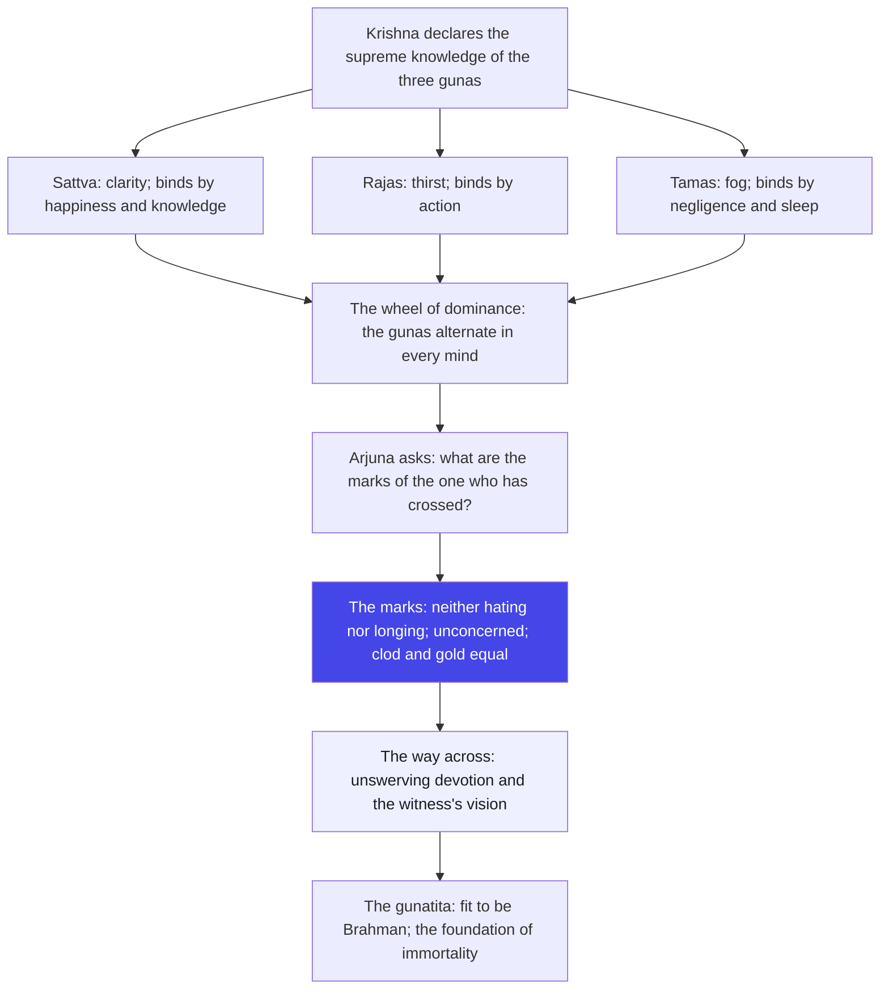
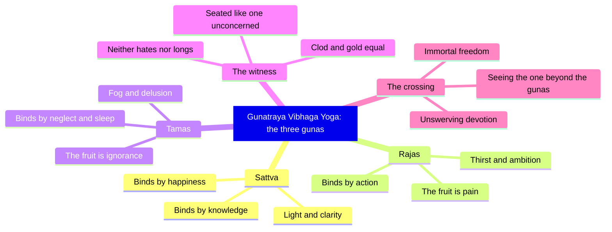

# Chapter 14: Gunatraya Vibhaga Yoga — You Are the Sky, the Gunas Are the Weather

> "Stop praying for good weather. You are not the weather — you are the sky. Watch the clouds, and they will pass."
> — The Osho Way

---

The battlefield has become a classroom. In the thirteenth chapter Krishna gave Arjuna the map of the field, kshetra, and its knower, kshetrajna. Now he goes one layer deeper: what threads weave the field itself? The answer is the gunas — sattva, rajas and tamas — three energies that spin every thought, every ambition, every sleep, every silence. This chapter is psychology before psychology existed: a complete diagnostic system of the inner weather, written five thousand years ago and still sharper than most modern manuals.

Osho reads the gunas not as morality but as weather. The traditional reading calls sattva good, rajas passionate, tamas lazy — three ranks in a spiritual army. Osho turns the ladder upside down: all three are prisons, each with its own lock. Even sattva binds, through the sweetness of happiness and the pride of knowledge. A golden cage is still a cage; its only difference is that you stop noticing the bars.

The chapter also answers the question every seeker eventually asks: how will I know I am free? Arjuna puts it directly in shloka 14.21, and Krishna answers with an observable portrait, not a promise — the marks of the gunatita, the one who has crossed. The marks are behavioral: neither hating the storm nor longing for it, seated like one unconcerned, seeing a clod of earth, a stone and gold with the same eye.

And what is the Osho method for this chapter? Watch. Whenever a mood rises — ambition, anger, sleepiness, serenity — watch it as weather. Do not fight the guna and do not worship it. Fight it and it grows muscles; worship it and it becomes your god. Watch it, and it dissolves into the sky it was always passing through. That watching is the whole sadhana of this chapter, and the whole of the Gita compressed into one gesture.

## Learning Objectives

After completing this chapter you will be able to:

1. **Name the three gunas** — sattva, rajas and tamas — and state how each one arises from Prakriti and binds the embodied self (14.5).
2. **Diagnose the dominant guna** — identify from its observable signs whether clarity (14.11), restlessness (14.12) or delusion (14.13) rules a mind at a given moment.
3. **Explain how each guna binds** — why sattva fetters through happiness and knowledge, rajas through action and thirst, and tamas through heedlessness and sleep.
4. **Describe the marks of the gunatita** — the one who has crossed: neither hating nor longing for the gunas, unconcerned, equal in pleasure and pain, honor and dishonor (14.22–14.25).
5. **State the way across** — the role of unswerving devotion and the vision of the one beyond the gunas (14.26–14.27).
6. **Build a TypeScript tool** — a Guna Balance Analyzer that scores a day of journal entries and reports which weather-system dominates, with an Osho-style note.

---

## Gunatraya Vibhaga Yoga at a Glance

### The scene and the speakers

Krishna speaks throughout, and Arjuna asks exactly one question. The teaching continues the thread of chapter 13: having distinguished the field from its knower, Krishna now analyzes the material of the field itself. Arjuna's single interjection at 14.21 — by what marks is the transcender known? — is one of the most practical questions in the whole Gita, because it asks for an observable test of inner freedom. The chapter closes with Krishna's grand claim at 14.27: that he is the foundation of Brahman itself.

### The Osho lens

Osho reads this chapter as a meteorology of consciousness. Sattva is clear weather, rajas is storm, tamas is fog — and none of them is you. The moment you identify with a mood, you become weather; the moment you watch, you become sky. Osho's sharpest provocation here is against spiritual vanity: the man who glows with "purity" and "knowledge" is still locked in the golden cage of sattva. The witness of the gunas is the only one who is truly clean — not because he is pure, but because he owns nothing, not even his purity.

### The structure of the chapter

- **Movement 1: 14.1–14.4 — The supreme knowledge and the cosmic womb.** Krishna declares the best of all knowledge, and describes how the great Brahma serves as the womb and he as the seed-giving father of every form.
- **Movement 2: 14.5–14.20 — The three gunas in full.** Their nature, how each binds, the signs of each in the ascendant, the fruits of each, and the destinations they carry a soul to.
- **Movement 3: 14.21–14.27 — The question of the gunatita and the way across.** Arjuna asks for the marks; Krishna gives the portrait of the transcender and ends with devotion as the crossing and himself as the foundation of everything.

### The three-framework note

This chapter sits exactly where the karma, bhakti and jnana frames of the Gita meet. Jnana is the vision of 14.19 — seeing that the gunas act and the self is only the witness. Karma is the training of 14.5–14.18 — acting while watching the rajas that drives action. Bhakti is the climax of 14.26 — unswerving devotion as the boat that crosses all three gunas at once. Osho's reading: these are not three separate ladders but three angles of the same stance, and the stance is the witness.

## Traditional Reading vs Osho-Style Reading

| Dimension | Traditional reading | Osho-style reading |
|-----------|--------------------|--------------------|
| The gunas | Three qualities of Nature; sattva best, tamas worst | Three weather-systems of consciousness; none evil, all binding |
| Sattva | The guna to cultivate through pure living | Still a prison — the golden cage; the sweetest, most seductive trap |
| Rajas | Passion and desire to be controlled | The fire of the world; not a sin, but a state to be watched, not fed |
| Tamas | Ignorance and sloth to be destroyed | Deep fog of the soul; even it passes, but never mistake it for peace |
| The gunatita | A rare sage with divine marks | Anyone, anywhere, who stops claiming the weather as his own |
| Crossing the gunas | Through knowledge, discipline and right action | Through witnessing and unswerving devotion — the sky beyond the sky |

## The Complete Text — All 27 Shlokas

### Shloka 14.1 — The Best of All Knowledge

> श्रीभगवानुवाच |
> परं भूयः प्रवक्ष्यामि ज्ञानानां ज्ञानमुत्तमम् |
> यज्ज्ञात्वा मुनयः सर्वे परां सिद्धिमितो गताः

**Transliteration:** śrībhagavānuvāca . paraṃ bhūyaḥ pravakṣyāmi jñānānāṃ jñānamuttamam . yajjñātvā munayaḥ sarve parāṃ siddhimito gatāḥ

**Translation:** The Blessed Lord said: I will again declare that supreme knowledge, the best of all knowledge; knowing it, all the sages have gone to the supreme perfection beyond this life.

**Osho Darshan:** Krishna says "again" — because knowledge is not a fact you store once and keep forever; it is a remembrance that must be renewed every morning. The sages who knew did not carry books; they had become the knowledge. That is the test: not how much you can recite, but how much of you has dissolved into what you know.

### Shloka 14.2 — Unity with Me: Beyond Creation and Dissolution

> इदं ज्ञानमुपाश्रित्य मम साधर्म्यमागताः |
> सर्गेऽपि नोपजायन्ते प्रलये न व्यथन्ति च

**Transliteration:** idaṃ jñānamupāśritya mama sādharmyamāgatāḥ . sarge.api nopajāyante pralaye na vyathanti ca

**Translation:** Those who take refuge in this knowledge come to share my very nature. They are neither born at the time of creation, nor disturbed at the time of dissolution.

**Osho Darshan:** Not born at creation, not disturbed at dissolution — this is the resume of a witness. And you do not have to wait for the end of the world to practice it. The next insult is a small dissolution; the next compliment is a small creation. If you can remain undisturbed in both, you are already practicing immortality today.

### Shloka 14.3 — The Great Womb and the Seed I Place

> मम योनिर्महद् ब्रह्म तस्मिन्गर्भं दधाम्यहम् |
> सम्भवः सर्वभूतानां ततो भवति भारत

**Transliteration:** mama yonirmahad brahma tasmingarbhaṃ dadhāmyaham . sambhavaḥ sarvabhūtānāṃ tato bhavati bhārata

**Translation:** My womb is the great Brahma; in it I place the germ; from that, O Arjuna, arises the birth of all beings.

**Osho Darshan:** Nature is the mother, consciousness is the father, and every form is their child. This is not only astronomy — it is the anatomy of your own mind. Every new thought is born the same way: matter presents, awareness seeds. When you watch a thought being born inside you, you are the father witnessing the womb, and the birth ceases to claim you.

### Shloka 14.4 — Father of Every Form

> सर्वयोनिषु कौन्तेय मूर्तयः सम्भवन्ति याः |
> तासां ब्रह्म महद्योनिरहं बीजप्रदः पिता

**Transliteration:** sarvayoniṣu kaunteya mūrtayaḥ sambhavanti yāḥ . tāsāṃ brahma mahadyonirahaṃ bījapradaḥ pitā

**Translation:** Whatever forms arise in any womb whatsoever, O son of Kunti, the great Brahma is their womb, and I am the father who gives the seed.

**Osho Darshan:** Whatever form arises in any womb — a flower, a child, a wave of anger — the seed-giver is one. Osho would say: you need not travel to temples; watch any single form deeply enough and you will meet the seed behind it. Forms differ, mothers differ, but the seed is one. That seed is what this whole chapter is asking you to find.

### Shloka 14.5 — The Three Gunas That Bind

> सत्त्वं रजस्तम इति गुणाः प्रकृतिसम्भवाः |
> निबध्नन्ति महाबाहो देहे देहिनमव्ययम्

**Transliteration:** sattvaṃ rajastama iti guṇāḥ prakṛtisambhavāḥ . nibadhnanti mahābāho dehe dehinamavyayam

**Translation:** Sattva, rajas and tamas — these gunas born of Nature bind fast in the body, O mighty-armed one, the embodied, the indestructible.

**Osho Darshan:** This is the key verse of the chapter: the indestructible self, tied by three ropes. And here is the paradox Osho loves: the atman is never actually bound — it only dreams that it is. The gunas are the dream-threads. Know you are the dreamer, and the ropes become silk: beautiful to touch, harmless to wear. Bondage is always a belief; freedom is a recognition.

### Shloka 14.6 — Sattva: The Golden Fetter

> तत्र सत्त्वं निर्मलत्वात्प्रकाशकमनामयम् |
> सुखसङ्गेन बध्नाति ज्ञानसङ्गेन चानघ

**Transliteration:** tatra sattvaṃ nirmalatvātprakāśakamanāmayam . sukhasaṅgena badhnāti jñānasaṅgena cānagha

**Translation:** Of these, sattva, being stainless, is luminous and healthy; yet it binds by attachment to happiness and by attachment to knowledge, O sinless one.

**Osho Darshan:** The subtlest teaching of the chapter hides in this verse. Light, clarity, health — and still it binds. Osho's insight: the ego can hide inside sattva better than anywhere else. "I am wise, I am pure, I am serene" — the prison has become luxurious and the prisoner has become proud of it. Freedom is not becoming pure; freedom is watching purity happen without claiming it.

### Shloka 14.7 — Rajas: The Fire of Thirst

> रजो रागात्मकं विद्धि तृष्णासङ्गसमुद्भवम् |
> तन्निबध्नाति कौन्तेय कर्मसङ्गेन देहिनम्

**Transliteration:** rajo rāgātmakaṃ viddhi tṛṣṇāsaṅgasamudbhavam . tannibadhnāti kaunteya karmasaṅgena dehinam

**Translation:** Know rajas to be of the nature of passion, born of thirst and attachment; it binds the embodied one, O son of Kunti, by attachment to action.

**Osho Darshan:** Rajas is the fire of the world — thirst, ambition, the fever of doing. It binds through action, which is its genius: the busier you are, the less you can see the fire. Osho's paradox stands here: the man who runs everywhere does nothing, while the sage who sits still transforms everything. Action without inner movement is the highest activity; movement without action is only noise.

### Shloka 14.8 — Tamas: The Fog of Delusion

> तमस्त्वज्ञानजं विद्धि मोहनं सर्वदेहिनाम् |
> प्रमादालस्यनिद्राभिस्तन्निबध्नाति भारत

**Transliteration:** tamastvajñānajaṃ viddhi mohanaṃ sarvadehinām . pramādālasyanidrābhistannibadhnāti bhārata

**Translation:** But know tamas to be born of ignorance, deluding all embodied beings; it binds fast, O Bharata, through heedlessness, indolence and sleep.

**Osho Darshan:** Tamas is the fog — born of ignorance, binding through negligence, laziness and sleep. And here Osho warns against the greatest spiritual mistake: mistaking tamas for peace. The man who is merely asleep says "I am at peace"; the meditator knows that peace is not sleep. Peace is alertness. The fog feels soft, but it is still fog — and fog, like every weather, passes when watched.

### Shloka 14.9 — Each Guna, Its Own Fetter

> सत्त्वं सुखे सञ्जयति रजः कर्मणि भारत |
> ज्ञानमावृत्य तु तमः प्रमादे सञ्जयत्युत

**Transliteration:** sattvaṃ sukhe sañjayati rajaḥ karmaṇi bhārata . jñānamāvṛtya tu tamaḥ pramāde sañjayatyuta

**Translation:** Sattva attaches one to happiness, rajas to action, O Bharata; while tamas, shrouding knowledge, attaches one to heedlessness.

**Osho Darshan:** Notice the list, because it is the whole game of the mind: happiness, action, forgetfulness — the three chains of human life. Osho points out that even "happiness" can be a chain. If your happiness comes and goes with circumstances, it is weather, not bliss. Real happiness is not a state you reach; it is the quality of the sky that never changes while every state passes.

### Shloka 14.10 — The Wheel of Dominance

> रजस्तमश्चाभिभूय सत्त्वं भवति भारत |
> रजः सत्त्वं तमश्चैव तमः सत्त्वं रजस्तथा

**Transliteration:** rajastamaścābhibhūya sattvaṃ bhavati bhārata . rajaḥ sattvaṃ tamaścaiva tamaḥ sattvaṃ rajastathā

**Translation:** Now sattva prevails, having overpowered rajas and tamas; now rajas, having overpowered sattva and tamas; and now tamas, having overpowered sattva and rajas.

**Osho Darshan:** This is the most practical verse in the chapter. The gunas do not live in different people — they live in the same person, hour by hour. You are not "a sattvic soul" or "a rajasic man"; you are a weather report that changes every few hours. Morning ambition, afternoon fog, evening glow. When you see the swing, you are already standing outside the swing — and that standing outside is the beginning of the crossing.

### Shloka 14.11 — The Wisdom-Light at Every Gate

> सर्वद्वारेषु देहेऽस्मिन्प्रकाश उपजायते |
> ज्ञानं यदा तदा विद्याद्विवृद्धं सत्त्वमित्युत

**Transliteration:** sarvadvāreṣu dehe.asminprakāśa upajāyate . jñānaṃ yadā tadā vidyādvivṛddhaṃ sattvamityuta

**Translation:** When the light of wisdom shines through every gate of this body, then know that sattva is predominant.

**Osho Darshan:** The senses are windows; the question is only what light they admit. When you look at a tree and it is only a tree, tamas is fogging the window. When you look at a tree and greed for it rises, rajas is coloring the glass. When you look at a tree and sense the mystery alive behind the bark — that is sattva's light. The gatekeeper of all nine gates is a single thing: your attention.

### Shloka 14.12 — When Rajas Rules

> लोभः प्रवृत्तिरारम्भः कर्मणामशमः स्पृहा |
> रजस्येतानि जायन्ते विवृद्धे भरतर्षभ

**Transliteration:** lobhaḥ pravṛttirārambhaḥ karmaṇāmaśamaḥ spṛhā . rajasyetāni jāyante vivṛddhe bharatarṣabha

**Translation:** Greed, activity, the undertaking of actions, restlessness and longing — these arise when rajas is predominant, O best of the Bharatas.

**Osho Darshan:** Greed is not a sin; it is a signal. Restlessness means the mind has forgotten how to be alone, and longing means it is outsourcing its fulfillment to objects. Osho's method: read the signal and the grip loosens; fight the signal and it tightens. The rajasic man is never satisfied because he mistakes movement for progress. A wheel that spins very fast looks still — and a man who is truly centered can be absolutely still while the world turns.

### Shloka 14.13 — When Tamas Rules

> अप्रकाशोऽप्रवृत्तिश्च प्रमादो मोह एव च |
> तमस्येतानि जायन्ते विवृद्धे कुरुनन्दन

**Transliteration:** aprakāśo.apravṛttiśca pramādo moha eva ca . tamasyetāni jāyante vivṛddhe kurunandana

**Translation:** Darkness, inertness, heedlessness and delusion — these arise when tamas is predominant, O joy of the Kurus.

**Osho Darshan:** Do not despise tamas — even winter is part of the year, and sleep is part of life. But never call it spirituality. Osho is ruthless here: the man who quotes "all is maya" while refusing to work is not a sage; he is a tamasic man wearing a sattvic costume. Darkness, inertia, carelessness — these are the marks. A man of tamas has stopped asking questions, and a man who has stopped asking questions is dead before his body is.

### Shloka 14.14 — Dying in Sattva: The Spotless Worlds

> यदा सत्त्वे प्रवृद्धे तु प्रलयं याति देहभृत् |
> तदोत्तमविदां लोकानमलान्प्रतिपद्यते

**Transliteration:** yadā sattve pravṛddhe tu pralayaṃ yāti dehabhṛt . tadottamavidāṃ lokānamalānpratipadyate

**Translation:** If the embodied one meets death while sattva prevails, he attains the spotless worlds of the knowers of the Highest.

**Osho Darshan:** Death is not a single event at the end of life; something in you dies every moment — a mood, a phase, a chapter of your story. Osho's instruction: die consciously at every sunset, and you will not fear the last one. The quality of your ending is decided by the quality of your attention while living. Whoever is luminous when the body goes enters a luminosity — that is not a place in the sky; it is a state of consciousness.

### Shloka 14.15 — Dying in Rajas and Tamas

> रजसि प्रलयं गत्वा कर्मसङ्गिषु जायते |
> तथा प्रलीनस्तमसि मूढयोनिषु जायते

**Transliteration:** rajasi pralayaṃ gatvā karmasaṅgiṣu jāyate . tathā pralīnastamasi mūḍhayoniṣu jāyate

**Translation:** Meeting death in rajas, he is born among those attached to action; dying in tamas, he is born in the wombs of the senseless.

**Osho Darshan:** Read this psychologically, not literally. Die with ambition still burning and you will be reborn inside ambition; die asleep and you will wake into the same fog. The womb you enter is the mood you die in — this is a law of consciousness, not a geography of the next life. Every night you die into sleep and wake somewhere; watch what kind of morning your rajas or your tamas produces.

### Shloka 14.16 — Fruits of the Three Gunas

> कर्मणः सुकृतस्याहुः सात्त्विकं निर्मलं फलम् |
> रजसस्तु फलं दुःखमज्ञानं तमसः फलम्

**Transliteration:** karmaṇaḥ sukṛtasyāhuḥ sāttvikaṃ nirmalaṃ phalam . rajasastu phalaṃ duḥkhamajñānaṃ tamasaḥ phalam

**Translation:** The fruit of good action, they say, is sattvic and pure; the fruit of rajas is pain, and the fruit of tamas is ignorance.

**Osho Darshan:** Look at your life as a harvest. What you reap is not a judge's verdict but the seed's own announcement. Rajasic action ends in exhaustion and pain — not as punishment, but as thermodynamics. Tamasic action ends in stupor and ignorance. Osho's point: consequences are teachers, not creditors. There is no anger in the universe about your choices; there is only the fruit, and the fruit is always honest.

### Shloka 14.17 — From Sattva Knowledge; From Rajas Greed

> सत्त्वात्सञ्जायते ज्ञानं रजसो लोभ एव च |
> प्रमादमोहौ तमसो भवतोऽज्ञानमेव च

**Transliteration:** sattvātsañjāyate jñānaṃ rajaso lobha eva ca . pramādamohau tamaso bhavato.ajñānameva ca

**Translation:** From sattva arises knowledge, and from rajas greed; from tamas arise heedlessness, delusion and ignorance.

**Osho Darshan:** Even your thinking is weather-dependent. A clear sky gives insight; a windy sky gives grabbing; a foggy sky gives confusion. Osho would say: when you notice greedy thoughts rising, do not argue with the thought — check the weather, because the thought is only the leaf of the mood. Change the season by watching it, and the thoughts change by themselves. Thoughts are symptoms; the guna is the disease; the witness is the cure.

### Shloka 14.18 — Upward, Middle, Downward

> ऊर्ध्वं गच्छन्ति सत्त्वस्था मध्ये तिष्ठन्ति राजसाः |
> जघन्यगुणवृत्तिस्था अधो गच्छन्ति तामसाः

**Transliteration:** ūrdhvaṃ gacchanti sattvasthā madhye tiṣṭhanti rājasāḥ . jaghanyaguṇavṛttisthā adho gacchanti tāmasāḥ

**Translation:** Those seated in sattva go upward; the rajasic dwell in the middle; the tamasic, abiding in the lowest guna's functions, go downward.

**Osho Darshan:** This is not a map of heaven and hell; it is a geometry of attention. Upward means awareness rising toward its source; middle means restlessness circling the same ground; downward means sinking below consciousness. And the miracle: you choose the direction every moment, with every glance. Osho's reminder — up is not a place; up is a direction. Even while sitting in a chair, attention can climb or fall.

### Shloka 14.19 — The Seer Who Sees No Doer

> नान्यं गुणेभ्यः कर्तारं यदा द्रष्टानुपश्यति |
> गुणेभ्यश्च परं वेत्ति मद्भावं सोऽधिगच्छति

**Transliteration:** nānyaṃ guṇebhyaḥ kartāraṃ yadā draṣṭānupaśyati . guṇebhyaśca paraṃ vetti madbhāvaṃ so.adhigacchati

**Translation:** When the seer beholds no agent other than the gunas and knows that which is higher than them, he attains to my being.

**Osho Darshan:** This is the decisive verse of the chapter. The gunas do everything; you only witness. When that is truly seen, anger happens, ambition happens, serenity happens — but you remain the screen on which the whole film is projected. Osho's test: can you say "anger is happening" the way you say "rain is happening"? The moment you can, you have crossed from weather to sky.

### Shloka 14.20 — Beyond the Three: Immortal

> गुणानेतानतीत्य त्रीन्देही देहसमुद्भवान् |
> जन्ममृत्युजरादुःखैर्विमुक्तोऽमृतमश्नुते

**Transliteration:** guṇānetānatītya trīndehī dehasamudbhavān . janmamṛtyujarāduḥkhairvimukto.amṛtamaśnute

**Translation:** Crossing beyond these three gunas from which the body is evolved, the embodied one, freed from birth, death, decay and pain, tastes immortality.

**Osho Darshan:** Freedom is not a future heaven; it is a present posture. You can be free of old age right now — not by denying the body, but by no longer identifying with it. The body ages; the witness does not even know what age is. Osho's reminder: immortality is not endless time; it is the end of time. The one who watches the gunas is already on the other side of every moment.

### Shloka 14.21 — Arjuna's Question: The Marks of the Transcender

> अर्जुन उवाच |
> कैर्लिङ्गैस्त्रीन्गुणानेतानतीतो भवति प्रभो |
> किमाचारः कथं चैतांस्त्रीन्गुणानतिवर्तते

**Transliteration:** arjuna uvāca . kairliṅgaistrīnguṇānetānatīto bhavati prabho . kimācāraḥ kathaṃ caitāṃstrīnguṇānativartate

**Translation:** Arjuna said: By what marks is one who has transcended these three gunas known, O Lord? What is his conduct, and how does he go beyond them?

**Osho Darshan:** Arjuna asks the only question worth asking — not "what will I get" but "what will I be". He wants an observable portrait, not a promise. Osho loves this question because it turns spirituality from belief into diagnosis. Krishna will answer not with theology but with behavior: how the man sits, how he feels praise, how he touches gold. The marks of freedom are behavioral, and therefore testable — today, by you.

### Shloka 14.22 — Neither Hating Nor Longing

> श्रीभगवानुवाच |
> प्रकाशं च प्रवृत्तिं च मोहमेव च पाण्डव |
> न द्वेष्टि सम्प्रवृत्तानि न निवृत्तानि काङ्क्षति

**Transliteration:** śrībhagavānuvāca . prakāśaṃ ca pravṛttiṃ ca mohameva ca pāṇḍava . na dveṣṭi sampravṛttāni na nivṛttāni kāṅkṣati

**Translation:** The Blessed Lord said: When light, activity and delusion are present, he neither hates them, nor longs for them when they are absent, O Pandava.

**Osho Darshan:** This is the master key. Hate and longing are two sides of the same coin — the coin of preference. The free man lets moods come and go like guests; he is the host, not the guest. When sattva shines, he does not swell with pride; when rajas burns, he does not fight it; when tamas fogs, he does not despair. Osho's image: the door of the house stays open, and the weather is simply not the house's business.

### Shloka 14.23 — Seated Like One Unconcerned

> उदासीनवदासीनो गुणैर्यो न विचाल्यते |
> गुणा वर्तन्त इत्येवं योऽवतिष्ठति नेङ्गते

**Transliteration:** udāsīnavadāsīno guṇairyo na vicālyate . guṇā vartanta ityevaṃ yo.avatiṣṭhati neṅgate

**Translation:** Seated like one unconcerned, unmoved by the gunas, he stands firm knowing that the gunas alone act — he does not stir.

**Osho Darshan:** "The gunas act" — what a declaration of freedom! You do not have to do anything about your moods; you have to stop doing them. Osho's instruction: watch the drama, but do not audition for a role. The witness sits like a spectator at a football match — the players exhaust themselves, the score changes, and he remains seated. That unconcern is not indifference; it is the last concern, the concern for awareness itself.

### Shloka 14.24 — Same in Pleasure and Pain, Clod and Gold

> समदुःखसुखः स्वस्थः समलोष्टाश्मकाञ्चनः |
> तुल्यप्रियाप्रियो धीरस्तुल्यनिन्दात्मसंस्तुतिः

**Transliteration:** samaduḥkhasukhaḥ svasthaḥ samaloṣṭāśmakāñcanaḥ . tulyapriyāpriyo dhīrastulyanindātmasaṃstutiḥ

**Translation:** The same in pleasure and pain, dwelling in the self, seeing a clod of earth, a stone and gold alike, the same to the dear and the unfriendly, firm, the same in censure and praise.

**Osho Darshan:** Gold and a clod equal — not because the sage is poor, but because he is free. The measure of value has moved inside. Praise and censure are only two winds, and the flame of his being does not flicker in either. Osho points out the quiet word in the middle: "self-standing" (svastha). He is not balanced by circumstances because he does not lean on them. Health, in the deepest sense, is this: standing on your own ground.

### Shloka 14.25 — Honor and Dishonor, Friend and Foe

> मानापमानयोस्तुल्यस्तुल्यो मित्रारिपक्षयोः |
> सर्वारम्भपरित्यागी गुणातीतः स उच्यते

**Transliteration:** mānāpamānayostulyastulyo mitrāripakṣayoḥ . sarvārambhaparityāgī guṇātītaḥ sa ucyate

**Translation:** The same in honor and dishonor, the same to friend and foe, abandoning all self-seeking undertakings — such a one is said to have transcended the gunas.

**Osho Darshan:** "Abandoning all undertakings" does not mean lazy; it means he undertakes nothing for his own profit. Work flows through him, but no greed clings to it. Osho's correction of the lazy reading: the gunatita does not stop acting; he stops counting wins. Honor and dishonor are the scoreboard of the ego, and he has walked off the field. The crosser is simply the one who stopped keeping score — in the office, in love, in life.

### Shloka 14.26 — Unswerving Devotion Crosses All

> मां च योऽव्यभिचारेण भक्तियोगेन सेवते |
> स गुणान्समतीत्यैतान्ब्रह्मभूयाय कल्पते

**Transliteration:** māṃ ca yo.avyabhicāreṇa bhaktiyogena sevate . sa guṇānsamatītyaitānbrahmabhūyāya kalpate

**Translation:** And he who serves me with unswerving devotion crosses beyond these gunas and becomes fit to be Brahman.

**Osho Darshan:** The final answer to "how do I cross" is not a technique but a total turn: love. Not fighting, not escaping, but devotion that does not wobble. Osho reads this as trust in existence itself — when love is total, the weather does not matter; the sky and the clouds both become dance. The intellect can be caught by sattva, the will by rajas, the body by tamas — but a heart given wholly to the whole is tied by none.

### Shloka 14.27 — The Foundation of Brahman Itself

> ब्रह्मणो हि प्रतिष्ठाहममृतस्याव्ययस्य च |
> शाश्वतस्य च धर्मस्य सुखस्यैकान्तिकस्य च

**Transliteration:** brahmaṇo hi pratiṣṭhāhamamṛtasyāvyayasya ca . śāśvatasya ca dharmasya sukhasyaikāntikasya ca

**Translation:** For I am the abode of Brahman, the immortal and immutable, of eternal dharma and of absolute bliss.

**Osho Darshan:** The chapter ends where it began — at the self, the foundation beneath all foundations. The ground of the universe and the ground of your consciousness are the same ground. Osho's closing thought: when the gunas are seen through, what remains is not a god far above you, but the floor under your feet — closer than breathing. The sky you are does not rest on the weather; the weather rests on the sky.

## Key Themes

| Theme | Shlokas | Osho-style insight |
|-------|---------|--------------------|
| The gunas as binders | 14.5 | Three weather-systems, three ropes — but the self is never actually tied, only dreaming it is |
| Sattva's subtle trap | 14.6 | The golden cage: purity and knowledge can become the subtlest pride |
| Rajas as fuel | 14.7, 14.12, 14.16 | Not sin, but fire; watch it rather than fight it, and it cannot burn you |
| Tamas as fog | 14.8, 14.13 | Never mistake sleep for peace; the questionless mind is dead before the body |
| The wheel of dominance | 14.10 | You are a changing weather report; the witness is the unchanging sky |
| The marks of the crosser | 14.22–14.25 | Neither hating nor longing; clod and gold equal; scoreboard abandoned |
| The way across | 14.26–14.27 | Unswerving devotion; the ground beneath all grounds |

## The Inner Journey



## A Mind Map



## Summary

- The gunas — sattva, rajas, tamas — are the three threads Nature weaves into every mind and every body (14.5).
- Each guna binds: sattva through happiness and knowledge, rajas through action and thirst, tamas through neglect and sleep.
- The gunas alternate; dominance is readable through signs: light (14.11), greed and restlessness (14.12), darkness and delusion (14.13).
- The fruits differ: pure fruit for sattvic action, pain for rajasic, ignorance for tamasic.
- The gunatita is recognized by behavior: neither hating nor longing, unconcerned, equal in pleasure and pain, honor and dishonor.
- The crossing happens through seeing that the gunas act while the witness does not, and through unswerving devotion.
- Krishna is the foundation of Brahman itself — the sky beneath all weather.

## Practical Takeaways

- Keep a one-day guna diary: three times a day, write one line on your dominant mood. The writing is the witnessing; the witnessing is the crossing.
- When greed or ambition rises, say to yourself "rajas is happening" — naming the weather takes you out of the weather.
- Never confuse sleep with peace: if you feel serene and are also dull, you are fogged, not free.
- Practice the "clod and gold" exercise: hold a pebble and a banknote in your palms and feel the difference of weight, not of worth.
- When praise or criticism comes, breathe once and watch the ripple — the guest arrives; you remain the host.
- End each day with one sentence of devotion: "I trust this existence completely" — total trust is the boat across all three gunas.
- Diagnose your mood before deciding: never make a decision from rajas or tamas; wait for the clear sky.

## Chapter Quiz

**Q1. In which shloka does Krishna first name the three gunas?**

- a. 14.1
- b. 14.3
- c. 14.5
- d. 14.21

<details class="tp-qa-card" data-qid="bg14-q1"><summary>Show Answer</summary>

**Answer: c.** 14.5 — "Sattva, rajas and tamas — these gunas born of Nature bind fast in the body, the embodied, the indestructible."
</details>

**Q2. Which guna binds the embodied one through attachment to happiness and knowledge?**

- a. Sattva
- b. Rajas
- c. Tamas
- d. Prakriti

<details class="tp-qa-card" data-qid="bg14-q2"><summary>Show Answer</summary>

**Answer: a.** Sattva — 14.6 says it binds by attachment to happiness and by attachment to knowledge, the golden fetter.
</details>

**Q3. Greed, activity, restlessness and longing arise when which guna is predominant?**

- a. Sattva
- b. Rajas
- c. Tamas
- d. None of the three

<details class="tp-qa-card" data-qid="bg14-q3"><summary>Show Answer</summary>

**Answer: b.** Rajas — 14.12 lists these marks when rajas is predominant.
</details>

**Q4. How is the one who has transcended the gunas seated, according to 14.23?**

- a. In constant prayer and austerity
- b. Like one unconcerned, unmoved by the gunas, knowing that the gunas alone act
- c. In a state of permanent sleep
- d. Leading all undertakings of the world

<details class="tp-qa-card" data-qid="bg14-q4"><summary>Show Answer</summary>

**Answer: b.** 14.23 — "Seated like one unconcerned, unmoved by the gunas, he stands firm knowing that the gunas alone act — he does not stir."
</details>

**Q5. When light, activity and delusion are present, how does the gunatita relate to them (14.22)?**

- a. He hates them and drives them away
- b. He welcomes them as divine gifts
- c. He neither hates them when present, nor longs for them when absent
- d. He worships them as the three gods

<details class="tp-qa-card" data-qid="bg14-q5"><summary>Show Answer</summary>

**Answer: c.** 14.22 — "he neither hates them, nor longs for them when they are absent" — hate and longing are two sides of the same coin.
</details>

**Q6. What does Krishna declare himself to be in the final verse 14.27?**

- a. The supreme guna among the three
- b. The abode of Brahman, the immortal and immutable, of eternal dharma and absolute bliss
- c. The seed of all sorrows
- d. A teacher among many teachers

<details class="tp-qa-card" data-qid="bg14-q6"><summary>Show Answer</summary>

**Answer: b.** 14.27 — "For I am the abode of Brahman, the immortal and immutable, of eternal dharma and of absolute bliss."
</details>

## Exercises

1. **The seven-day guna diary:** For one week, note your dominant mood three times a day (morning, afternoon, night). At the week's end, feed your entries into the Guna Balance Analyzer and study which weather dominated — then note whether the watching itself changed the weather.
2. **The gold and the clod:** For one day, treat praise and criticism you receive as the weather report they are. Write down each event and your inner reaction, then underline the moments where you stayed the sky.
3. **Extend the TypeScript tool:** Add a third function to the Guna Balance Analyzer that computes a "gunatita score" — a day where no guna signal appears at all (pure witnessing) counts as crossing. Run it on a week of honest entries and see how often your sky is clear.

## TypeScript Tool: Guna Balance Analyzer

```typescript
/*
 * Guna Balance Analyzer - Chapter 14: the three gunas
 * Scores journal entries for sattva, rajas and tamas,
 * names the dominant weather, and reminds the witness
 * that the sky is never the weather. Osho: watch, don't fight.
 */

interface DayEntry { hour: number; text: string; }

interface GunaSignal { guna: 'sattva' | 'rajas' | 'tamas'; keywords: string[]; }

interface GunaBalance {
  counts: Record<'sattva' | 'rajas' | 'tamas', number>;
  dominant: 'sattva' | 'rajas' | 'tamas';
  isGunatita: boolean;
  oshoNote: string;
}

const signals: GunaSignal[] = [
  { guna: 'sattva', keywords: ['clear', 'calm', 'grateful', 'focused', 'light', 'peace', 'insight', 'love'] },
  { guna: 'rajas', keywords: ['greed', 'restless', 'rush', 'ambition', 'crave', 'busy', 'anxious', 'hurry'] },
  { guna: 'tamas', keywords: ['lazy', 'sleep', 'dull', 'stuck', 'numb', 'avoid', 'scrolled', 'procrastinate'] }
];

function countGuna(text: string, guna: 'sattva' | 'rajas' | 'tamas'): number {
  const signal = signals.find(s => s.guna === guna);
  if (!signal) return 0;
  return signal.keywords.filter(k => text.toLowerCase().includes(k)).length;
}

function analyzeDay(entries: DayEntry[]): GunaBalance {
  const counts = { sattva: 0, rajas: 0, tamas: 0 };
  for (const entry of entries) {
    counts.sattva += countGuna(entry.text, 'sattva');
    counts.rajas += countGuna(entry.text, 'rajas');
    counts.tamas += countGuna(entry.text, 'tamas');
  }
  const order: ('sattva' | 'rajas' | 'tamas')[] = ['sattva', 'rajas', 'tamas'];
  const dominant = order.reduce((a, b) => (counts[b] > counts[a] ? b : a));
  const isGunatita = counts.sattva === 0 && counts.rajas === 0 && counts.tamas === 0;
  const notes: Record<'sattva' | 'rajas' | 'tamas', string> = {
    sattva: 'Clarity has come. But even purity binds when it becomes pride - the golden cage.',
    rajas: 'The fire of thirst is burning. Do not fight the fire; watch it, and it loses its grip.',
    tamas: 'The fog is thick. Never mistake this sleep for peace; light the lamp of watching.'
  };
  return {
    counts,
    dominant,
    isGunatita,
    oshoNote: isGunatita
      ? 'No weather found. The witness is not the weather - the sky is clear because you stopped claiming it.'
      : notes[dominant]
  };
}

function runDemo(): void {
  const day: DayEntry[] = [
    { hour: 9, text: 'Woke up lazy, scrolled for an hour, felt numb and heavy.' },
    { hour: 13, text: 'Rush to meet the deadline; ambitious but anxious and restless.' },
    { hour: 20, text: 'Evening walk felt clear and calm; grateful for the sky.' }
  ];
  const balance = analyzeDay(day);
  console.log('=== Guna Balance Analyzer ===');
  console.log(`Sattva: ${balance.counts.sattva} | Rajas: ${balance.counts.rajas} | Tamas: ${balance.counts.tamas}`);
  console.log(`Dominant weather: ${balance.dominant} | Gunatita: ${balance.isGunatita}`);
  console.log(`Osho: ${balance.oshoNote}`);
}

runDemo();
```
