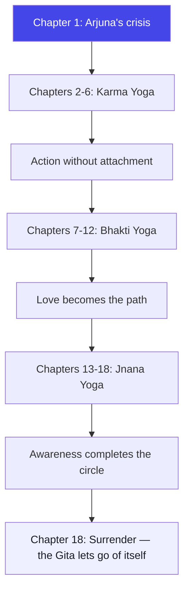
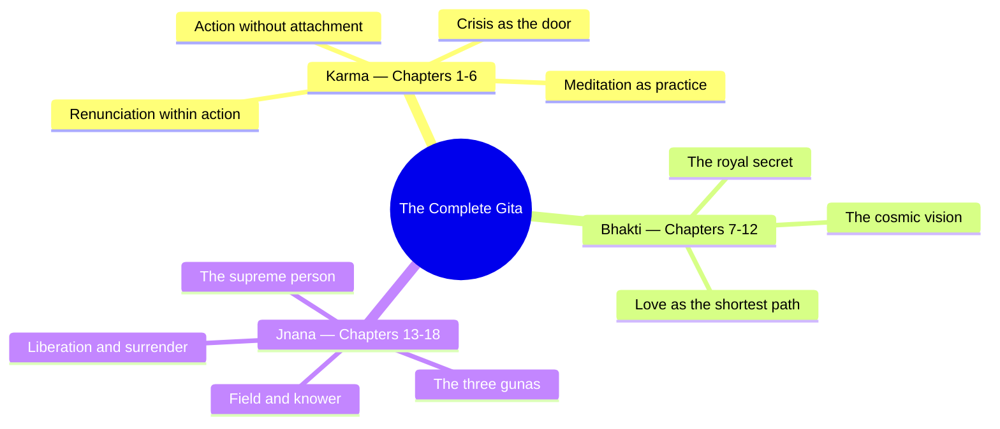

# The Complete Bhagavad Gita: All 701 Shlokas with Osho-Style Darshan

> **"The Gita is not a book — it is a battlefield. And inside every seeker there is an Arjuna who is ready to ask the question."**
> — The Osho Way

---

The Gita is 701 verses, and this course gives you every one of them — complete Devanagari text, IAST transliteration, an original English translation, and an Osho-style darshan for each shloka. No key verses, no selections, no shortcuts: the entire scripture, verse by verse, through the lens that Osho opened — the Gita as a manual for inner transformation rather than a theology to be believed.

The older Hinglish course, **Geeta Darshan**, stays available for readers who want Osho's lens on the key shlokas. This course is the complete text: all 18 chapters, all 701 shlokas, in full English.

---

## Learning Objectives

After completing this course you will be able to:

1. **Read** — all 701 shlokas of the Bhagavad Gita in Devanagari with IAST transliteration, in order, chapter by chapter.
2. **Understand** — the original meaning of every verse through a fresh English translation written for modern readers.
3. **Apply** — the Osho-style darshan: the Gita as a mirror for your own inner battle — crisis, action, devotion, awareness, and freedom.
4. **Map** — the Gita's 18-chapter journey: Karma (chapters 1–6), Bhakti (7–12), Jnana (13–18), and how all three are one path.
5. **Build** — 18 TypeScript tools (one per chapter): a Bow-Drop Detector, a Samatva Monitor, a Guna Balance Analyzer, and fifteen more — each a practical instrument for living the chapter.
6. **Live** — one verse at a time: the weekly rhythm, the reflection exercises, and the chapter quizzes that turn reading into practice.

---

## What the Gita Is — and What This Course Adds

### The battlefield story: 18 days, 18 chapters, 701 verses

The Gita is the dialogue between Arjuna and Krishna on the battlefield of Kurukshetra, moments before the great war of the Mahabharata. Sanjaya narrates it to the blind king Dhritarashtra. The entire scripture is 18 chapters and 700–701 verses (tradition counts it as 700; the critical edition numbers 701 shlokas). This course follows the 701-verse count, verse by verse.

| Aspect | Detail |
|--------|--------|
| **Setting** | Kurukshetra, before the Mahabharata war |
| **Dialogue** | Arjuna and Krishna, on the chariot between two armies |
| **Narrator** | Sanjaya, reporting to Dhritarashtra |
| **Structure** | 18 chapters, 701 shlokas |
| **Arc** | Arjuna's crisis (ch. 1) → Krishna's teaching → liberation and surrender (ch. 18) |

### The Osho lens

The traditional reading crowns Krishna as God and treats Arjuna as a weak disciple. The Osho-style reading reverses this:

| Dimension | Traditional reading | Osho-style reading |
|-----------|--------------------|--------------------|
| **The hero** | Krishna — the Lord | Arjuna — the honest questioner |
| **Arjuna's crisis** | Weakness, attachment | The deepest truth — crisis is the door |
| **Krishna's role** | God, master, command | Witness, friend, strategist — shows, never imposes |
| **Method of teaching** | Command and doctrine | Awakening through questions — the question is the answer |
| **Final message** | Devotion and surrender to God | Awareness — see everything, identify with nothing |
| **The scripture itself** | Sacred text to be followed | A mirror to be lived — even the Gita is a boat you finally leave behind |

### Why every shloka, not just the famous ones

Most courses pick the thirty famous verses. But the Gita was not written as a collection of quotes — it is a continuous teaching. The "catalog" verses (the lists of the demonic traits, the classifications of food and sacrifice, the four varnas) are not filler; they are the Gita's psychology, its map of the human mind. Skip them and the teaching loses its ground. This course keeps the whole map — every shloka gets its own translation and darshan.

---

## The 18 Chapters at a Glance

| Chapter | File | Name | Shlokas | TypeScript Tool |
|---------|------|------|---------|-----------------|
| 01 | `01-vishada-yoga.md` | **Arjuna Vishada Yoga** — The Crisis of the Warrior | 47 | Bow-Drop Detector |
| 02 | `02-sankhya-yoga.md` | **Sankhya Yoga** — The Wisdom of the Seer | 72 | Samatva Monitor |
| 03 | `03-karma-yoga.md` | **Karma Yoga** — Action Without Attachment | 43 | Desire Logger |
| 04 | `04-jnana-karma-sanyasa-yoga.md` | **Jnana-Karma-Sanyasa Yoga** — Knowledge, Action, and Renunciation | 42 | Karma Binding Analyzer |
| 05 | `05-karma-sanyasa-yoga.md` | **Karma-Sanyasa Yoga** — Renunciation Within Action | 29 | Lotus Leaf Witness Tracker |
| 06 | `06-dhyana-yoga.md` | **Dhyana Yoga** — The Art of Meditation | 47 | Still-Lamp Meditation Logger |
| 07 | `07-jnana-vijnana-yoga.md` | **Jnana-Vijnana Yoga** — Knowing and Realizing | 30 | Vijnana Realization Checker |
| 08 | `08-akshara-brahma-yoga.md` | **Akshara Brahma Yoga** — The Imperishable Absolute | 28 | Last Thought Forecaster |
| 09 | `09-rajavidya-rajaguhya-yoga.md` | **Raja Vidya Raja Guhya Yoga** — The Royal Secret | 34 | Offering Ledger |
| 10 | `10-vibhuti-yoga.md` | **Vibhuti Yoga** — The Divine Glories | 42 | Vibhuti Lens |
| 11 | `11-vishvarupa-darshana-yoga.md` | **Vishvarupa Darshana Yoga** — The Cosmic Vision | 55 | Vishvarupa Vision Log |
| 12 | `12-bhakti-yoga.md` | **Bhakti Yoga** — The Path of Devotion | 20 | Devotion Ladder |
| 13 | `13-kshetra-kshetrajna-yoga.md` | **Kshetra Kshetrajna Yoga** — Field and Knower | 35 | Field Classifier |
| 14 | `14-gunatraya-vibhaga-yoga.md` | **Gunatraya Vibhaga Yoga** — The Three Gunas | 27 | Guna Balance Analyzer |
| 15 | `15-purushottama-yoga.md` | **Purushottama Yoga** — The Supreme Person | 20 | Purushottama Path Tracker |
| 16 | `16-daivasura-sampad-yoga.md` | **Daivasura Sampad Yoga** — Divine and Demonic Natures | 24 | Daivi-Asuri Profiler |
| 17 | `17-shraddhatraya-yoga.md` | **Shraddhatraya Yoga** — The Threefold Faith | 28 | Shraddha Classifier |
| 18 | `18-moksha-sanyasa-yoga.md` | **Moksha Sanyasa Yoga** — Liberation and Renunciation | 78 | Karma Action Analyzer |

**Total: 701 shlokas.**

---

## The Three Movements of the Gita

The Gita is one teaching with three faces:

1. **Karma Yoga (chapters 1–6):** first action — because without action there is no life. But action must drop its attachment to results.
2. **Bhakti Yoga (chapters 7–12):** then love — when action has released its grip, love fills the space.
3. **Jnana Yoga (chapters 13–18):** finally awareness — when action and love are both complete, knowing dawns by itself.

These are not three separate paths. They are three phases of one journey, and the journey begins where chapter 1 ends: with a warrior who has lost everything and asks his first honest question.

---

## How Each Chapter Is Built

Every chapter follows the same 12-part structure:

1. **Chapter title + opening line** — the soul of the chapter in one sentence
2. **Introductory paragraphs** — the scene, the speakers, the Osho lens
3. **Learning Objectives** — 5–6 objectives, the last always a TypeScript tool
4. **At a Glance** — the scene, the speakers, the structure in movements
5. **Traditional Reading vs Osho-Style Reading** — a comparison table
6. **The Complete Text — All N Shlokas** — every shloka, in order, with:
   - Devanagari text (verbatim, multi-line preserved)
   - IAST transliteration
   - Original English translation
   - Osho Darshan — the Osho-style commentary
7. **Key Themes** — the chapter's threads, with shloka references
8. **The Inner Journey + A Mind Map** — two mermaid diagrams per chapter
9. **Summary** — the chapter in a few lines
10. **Practical Takeaways** — what a modern reader carries into daily life
11. **Chapter Quiz** — 6 MCQs with hidden answers
12. **Exercises + TypeScript Tool** — one runnable tool per chapter

### A suggested weekly rhythm

| Day | Work | Time |
|-----|------|------|
| Mon–Tue | Read one chapter; sit with 3–4 shlokas | 45 min |
| Wed–Thu | Run the chapter's TypeScript tool; journal one darshan | 30 min |
| Fri | Take the chapter quiz; re-read your weakest answers | 20 min |
| Sat | Do one exercise from the chapter | 60 min |
| Sun | Write the summary; preview the next chapter | 30 min |

---

## Course Stats

| Metric | The Complete Bhagavad Gita |
|--------|---------------------------|
| Total chapters | 18 |
| Total shlokas | 701 (complete text) |
| Devanagari + IAST | Every shloka, verbatim |
| Osho-style darshans | 701 (one per shloka) |
| Mermaid diagrams | 36+ |
| TypeScript tools | 18 |
| Quiz questions | 108 (6 per chapter) |
| Total content | ~12,600 lines |

---

## Summary

The Gita is often called a book of 700 verses. This course treats it as what it is: a complete teaching of 701 verses, each one a window. Some windows are famous — 2.47, 4.7, 9.22, 18.66. Most are quietly walked past. The Osho-style darshan opens every single one, because transformation does not live in the famous verses alone — it lives in the continuity of the whole teaching.

| Main point | Essence |
|------------|---------|
| **Scope** | All 701 shlokas, complete text, no selections |
| **Text** | Devanagari + IAST verbatim for every verse |
| **Translation** | Original English, modern and readable |
| **Lens** | Osho-style darshan: awareness, witness, freedom |
| **Practice** | 18 TypeScript tools, 108 quiz questions, weekly rhythm |
| **Final message** | Even the Gita is a boat — cross the river, then let it go |

---

## Chapter Quiz

**Q1. How many shlokas does this course cover?**
- a. 108
- b. 700
- c. 701
- d. 47

Show Answer

**Answer: c.** 701 — all 18 chapters, verse by verse.

**Q2. What does every shloka in this course include?**
- a. Devanagari, transliteration, translation, and Osho-style darshan
- b. Only the Sanskrit text
- c. Only the English translation
- d. A quiz question

Show Answer

**Answer: a.** Each shloka has Devanagari, IAST, an original English translation, and an Osho Darshan.

**Q3. Which three yogas structure the Gita's 18 chapters?**
- a. Raja, Hatha, and Mantra Yoga
- b. Karma (1–6), Bhakti (7–12), and Jnana (13–18)
- c. Ashtanga, Kriya, and Nada Yoga
- d. Dhyana, Sankhya, and Kundalini Yoga

Show Answer

**Answer: b.** Karma Yoga (chapters 1–6), Bhakti Yoga (7–12), Jnana Yoga (13–18) — three faces of one path.

**Q4. What is the Osho-style reading's view of Arjuna's crisis in chapter 1?**
- a. A sign of cowardice
- b. A punishment from the gods
- c. The deepest honesty — the crisis is the door to transformation
- d. A plot device

Show Answer

**Answer: c.** The Osho-style reading sees Arjuna's breakdown as the honest beginning of the whole teaching.

**Q5. How many TypeScript tools does the course build?**
- a. 6
- b. 12
- c. 18
- d. 36

Show Answer

**Answer: c.** One runnable TypeScript tool per chapter — 18 total, from Bow-Drop Detector to Karma Action Analyzer.

**Q6. What is the final message of the Gita, in the Osho-style reading?**
- a. Worship Krishna forever
- b. Follow the scriptures literally
- c. Awareness — see everything, identify with nothing; even the Gita is a boat you finally leave behind
- d. Build a temple

Show Answer

**Answer: c.** The arc ends in surrender and freedom — the teaching itself becomes a boat to be left after crossing.

---

## Exercises

1. **Find your Arjuna:** write down the moment you said "I cannot do this" — that is your Kurukshetra. Analyze it with the chapter 1 Bow-Drop Detector.
2. **One verse, seven days:** pick 2.47 (action's right, not the fruit's). Read it every morning; write one line every evening — where did you cling to results today?
3. **Guna test:** run the chapter 14 Guna Balance Analyzer, note your sattva/rajas/tamas scores, and run it again a week later.
4. **Map your sansara tree:** use the chapter 15 Purushottama Path Tracker to name your roots (habits), trunk (ego), and branches (desires).
5. **Five minutes of witnessing:** daily, watch breath, body, and thoughts for five minutes, changing nothing. Do this for 18 days — one day per chapter.
6. **The drop checklist:** after chapter 18, make a list of 18 things you want to drop, one from each chapter. Then start with the first one.

---

## Further Reading

- **The Bhagavad Gita** — the full Sanskrit text (Gita Press edition) — source of the Devanagari and verse numbering
- **Geeta Darshan** (the Hinglish course in this library) — Osho's lens on the key shlokas, the companion to this complete text
- **Osho — Gita Darshan (6 volumes)** — the original discourses this course's darshan voice is styled after
- **Swami Sivananda — Bhagavad Gita translation and commentary** — public-domain reference used to verify meaning
- **Swami Vivekananda — Lectures on the Gita** — a second deep reading of Karma Yoga
- **T. S. Eliot — The Four Quartets** — the Gita's 2.47 echoing through English poetry