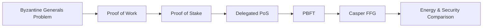
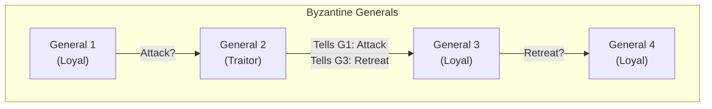
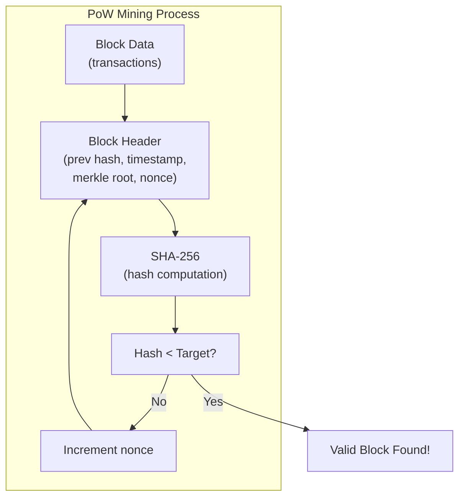
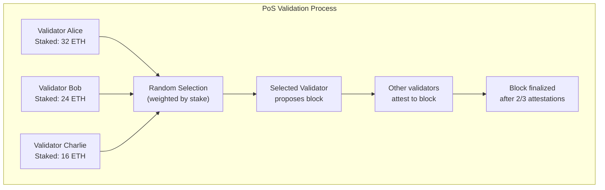
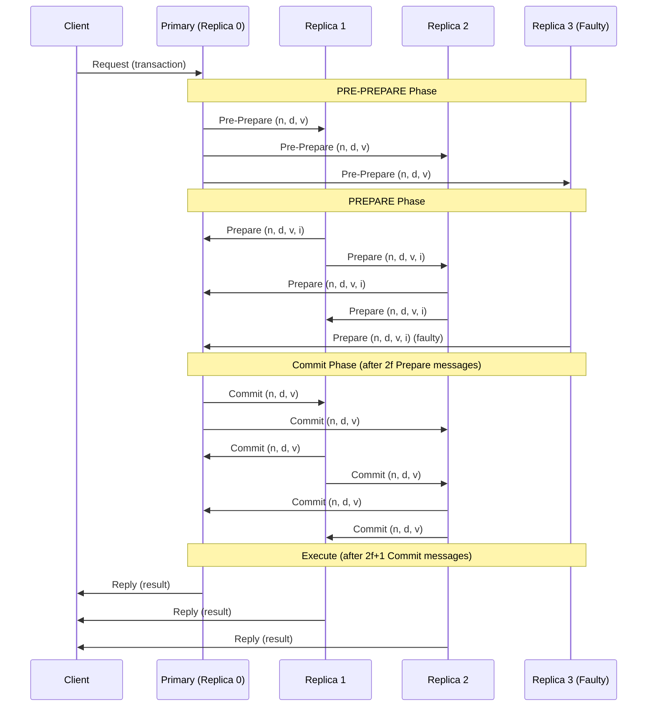
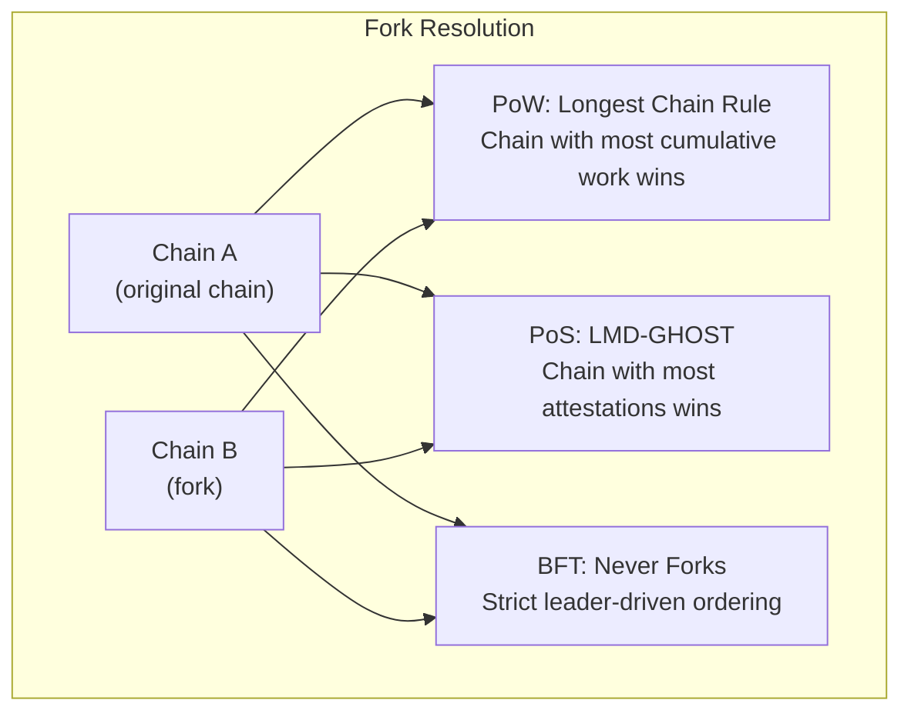
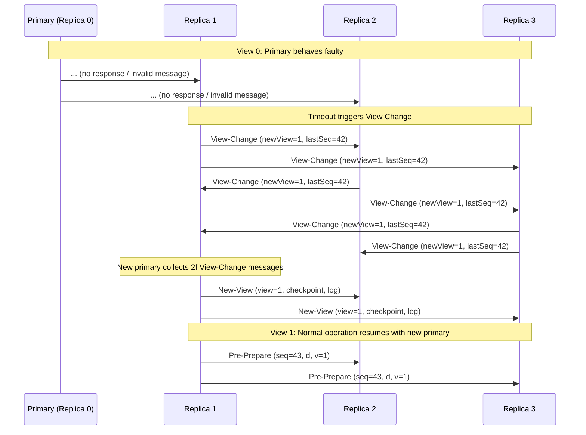

# Chapter 3: Consensus Mechanisms

> **Previous:** [Chapter 2: Cryptography for Blockchain](./02-cryptography.md) | **Next:** [Chapter 4: The Bitcoin Network](./04-bitcoin.md)

---

## Learning Objectives

- Explain the Byzantine Generals' Problem and its relevance to distributed systems
- Describe the Proof of Work (PoW) mechanism and the concept of "difficulty"
- Analyze the Proof of Stake (PoS) mechanism and its variations (DPoS, LPoS)
- Understand the PBFT protocol phases (pre-prepare, prepare, commit)
- Compare BFT-based consensus with lottery-based consensus (PoW/PoS)
- Explain finality types: probabilistic vs absolute
- Understand the energy implications of different consensus mechanisms

<!-- Image Gallery -->
<section class="lesson-visuals" aria-label="Visual learning resources">
  <header><span>VISUAL LEARNING</span><h2>See it. Review it. Remember it.</h2></header>
  <a class="lesson-visual-card" href="../../assets/images/lessons/blockchain/03-consensus/handwritten-notes.png" target="_blank" rel="noopener">
    
    <span><strong>Handwritten notes</strong>Condensed notes for deliberate review.</span>
  </a>
  <a class="lesson-visual-card" href="../../assets/images/lessons/blockchain/03-consensus/sticky-notes.png" target="_blank" rel="noopener">
    
    <span><strong>Sticky-note revision</strong>Fast recall prompts for revision.</span>
  </a>
  <a class="lesson-visual-card" href="../../assets/images/lessons/blockchain/03-consensus/visual-explanation.png" target="_blank" rel="noopener">
    
    <span><strong>Visual concept guide</strong>A connected explanation of the key ideas.</span>
  </a>
</section>
<!-- End Image Gallery -->

## Chapter at a Glance

| Topic | Key Insight | Practical Takeaway |
|-------|-------------|--------------------|
| Byzantine Generals Problem | Distributed nodes must agree despite faulty/malicious actors | Consensus mechanisms solve this fundamental problem |
| Proof of Work (PoW) | Solve computational puzzles to propose blocks | Energy-intensive but proven secure over 15+ years |
| Proof of Stake (PoS) | Validators stake tokens as economic collateral | 99%+ energy reduction vs PoW, with slashing for misbehavior |
| PBFT | Multi-round voting protocol | Near-instant finality, suited for permissioned networks |
| DPoS | Delegated voting for block producers | Faster than PoW, semi-centralized |
| Finality | Probabilistic (PoW) vs Absolute (PBFT) | Affects how long to wait for confirmation |
| Difficulty Adjustment | Network adjusts target to maintain consistent block time | Self-regulating — more miners = harder puzzles |

## Chapter Roadmap



---

## Theory

### The Byzantine Generals' Problem

A classic problem in distributed computing where multiple generals must agree on a common battle plan (Attack or Retreat). Some generals might be traitors (malicious nodes). A consensus mechanism must ensure that all loyal generals reach the same decision even if a certain percentage of the network is faulty or malicious.

The problem has three key requirements:
1. **Agreement:** All loyal generals must agree on the same plan.
2. **Validity:** The plan must be reasonable (not based on traitor messages).
3. **Termination:** The generals must eventually reach a decision.

For a system with `n` total nodes, Byzantine Fault Tolerance typically requires that no more than `n/3` nodes are faulty (`n > 3f` where `f` is the number of faulty nodes). This is because:
- You need `2f+1` honest nodes to outvote `f` traitors
- Total: `n = 3f + 1`



### Proof of Work (PoW)

Nodes (miners) compete to solve a computationally intensive puzzle.

- **Mechanism:** Find a value (nonce) such that `Hash(BlockHeader + Nonce) < Target`.
- **Security:** Requires enormous energy/hardware investment. An attacker must control 51% of the network's hash rate.
- **Incentive:** Block rewards and transaction fees.
- **Energy:** Bitcoin consumes approximately 150 TWh annually (comparable to Argentina).



The **difficulty** is adjusted periodically (Bitcoin: every 2016 blocks, ~2 weeks) to maintain consistent block times (10 minutes for Bitcoin).

### Proof of Stake (PoS)

Validators are chosen based on the amount of cryptocurrency they "stake" (lock up as collateral).

- **Mechanism:** Selection is proportional to stake (or stake-age combinations).
- **Security:** Slashing (losing stake) discourages malicious behavior.
- **Efficiency:** Drastically lower energy consumption compared to PoW.
- **Challenges:** Nothing-at-stake problem, long-range attacks, validator centralization.



**Casper FFG (Friendly Finality Gadget)** is the PoS finality mechanism used by Ethereum. It provides:
- **Checkpoints:** Every 32 slots (6.4 minutes), a checkpoint is created.
- **Justification:** A checkpoint is justified when 2/3 of validators attest to it.
- **Finalization:** A checkpoint is finalized when the next checkpoint is also justified.
- **Slashing:** Validators who equivocate (vote on conflicting chains) are slashed.

### Delegated Proof of Stake (DPoS)

DPoS is a variation where token holders vote for a small set of block producers (delegates).

- **Voting:** Token holders vote with their stake weight.
- **Block Producers:** A fixed number (e.g., 21 in EOS) of delegates produce blocks in rotation.
- **Advantages:** High throughput (thousands of TPS), low latency.
- **Disadvantages:** Semi-centralized, vulnerable to vote-buying and collusion.

| Feature | PoS | DPoS |
|---------|-----|------|
| Validator Set | Open (anyone can stake) | Limited (elected delegates) |
| Throughput | Moderate | High |
| Centralization Risk | Moderate | Higher |
| Governance | Token voting | Delegate voting |
| Examples | Ethereum 2.0, Cardano | EOS, Tron |

### Practical Byzantine Fault Tolerance (PBFT)

PBFT uses a multi-round voting protocol among a known set of validators (replicas). One replica is the **primary** (leader) for a given view, and others are **backups**.

The PBFT protocol has three phases:



**PBFT phases explained:**

1. **Pre-Prepare:** The primary assigns a sequence number `n` to the request and broadcasts a pre-prepare message to all backups.
2. **Prepare:** Each backup validates the pre-prepare, then broadcasts a prepare message. After receiving `2f` prepare messages from different replicas (including the primary), the replica enters the prepared state.
3. **Commit:** Each replica broadcasts a commit message. After receiving `2f+1` commit messages (including its own), the replica executes the request and sends the reply to the client.

**Requirements:** `n > 3f` — for 4 nodes, tolerate 1 fault; for 7 nodes, tolerate 2 faults.

PBFT provides **instant finality** — once a block is committed, it cannot be reverted. However, communication complexity is `O(n^2)`, limiting scalability to dozens of nodes.

### Raft (Crash Fault Tolerant)

Raft is a simpler consensus algorithm that tolerates crash faults (not Byzantine faults). It elects a leader and replicates logs:

1. **Leader Election:** Nodes vote for a leader.
2. **Log Replication:** The leader accepts client requests and replicates them to followers.
3. **Commitment:** When the leader receives confirmation from a majority, it commits the entry.

Raft is used in Hyperledger Fabric's default consensus and is suitable when all participants are trusted (no malicious actors).

### Consensus Comparison Table

| Property | PoW | PoS | DPoS | PBFT | Raft |
|----------|-----|-----|------|------|------|
| Fault Tolerance | Byzantine | Byzantine | Byzantine | Byzantine | Crash-only |
| Finality | Probabilistic | Probabilistic/Final | Probabilistic | Instant | Instant |
| Throughput | Low (7 TPS) | Moderate | High | High | Very High |
| Scalability (Nodes) | Very High | High | Moderate | Low (dozens) | Low |
| Energy Usage | Very High | Very Low | Very Low | Low | Low |
| Sybil Resistance | Hash Power | Stake | Stake | Known IDs | Known IDs |
| Fork Resolution | Longest Chain | LMD-GHOST | Most Votes | Never Forks | Never Forks |
| Example | Bitcoin | Ethereum 2.0 | EOS | Zilliqa | Hyperledger Fabric |

### Fork Resolution Strategies



**LMD-GHOST (Latest Message Driven Greedy Heaviest Observed Sub-Tree)** is the fork choice rule in Ethereum 2.0. It weights branches by validator attestations, always choosing the heaviest subtree.

### Security Assumptions

| Consensus | Attack Cost | Attack Type | Defense |
|-----------|------------|-------------|---------|
| PoW | $5-10B (Bitcoin) | 51% hash rate | Economic disincentive |
| PoS | 33% of staked value | 51% stake | Slashing |
| DPoS | Majority of votes | Vote buying | Delegated accountability |
| PBFT | Compromise 1/3 of nodes | Byzantine | Redundancy |

---

## Examples

### Example 1: PoW Difficulty Adjustment

Bitcoin aims for a 10-minute block time. If miners solve blocks too fast (e.g., every 8 minutes), the network increases the **Difficulty**.

- **Calculation:** The "Target" is lowered. A lower target means it is harder to find a hash that is smaller than it.
- **Formula:** `New Target = Old Target * (Actual Time / Expected Time)`
- **Output:** Miners must now perform more hashes on average to find a valid block.

```typescript
function adjustDifficulty(
    currentTarget: bigint,
    actualTimeSeconds: number,
    expectedTimeSeconds: number = 600 // 10 minutes
): bigint {
    // Only adjust every 2016 blocks (~2 weeks)
    const ratio = actualTimeSeconds / expectedTimeSeconds;
    // Clamp adjustment to 4x max (can't change more than 400%)
    const clampedRatio = Math.min(Math.max(ratio, 0.25), 4.0);
    // New target is adjusted proportionally
    return BigInt(Math.floor(Number(currentTarget) * clampedRatio));
}

// Example: Blocks coming in 8 minutes instead of 10
const oldTarget = BigInt("0x00000000FFFF0000000000000000000000000000000000000000000000000000");
const newTarget = adjustDifficulty(oldTarget, 480, 600);
console.log(`Difficulty increased by ${((600/480) * 100 - 100).toFixed(1)}%`);
```

### Example 2: PoS Validator Selection

Imagine a network where:
- Alice stakes 1,000 Tokens.
- Bob stakes 500 Tokens.

In a simple PoS model, Alice is twice as likely as Bob to be chosen to propose the next block. If Alice proposes an invalid block, the network "slashes" her 1,000 tokens, providing a strong economic deterrent.

### Example 3: PBFT Node Requirement

```typescript
function minimumNodesForPBFT(faultyNodes: number): number {
    // PBFT requires n > 3f
    return 3 * faultyNodes + 1;
}

console.log(minimumNodesForPBFT(1));  // 4
console.log(minimumNodesForPBFT(2));  // 7
console.log(minimumNodesForPBFT(3));  // 10
console.log(minimumNodesForPBFT(5));  // 16
```

### Example 4: Casper FFG Finality

```typescript
interface Checkpoint {
    epoch: number;
    blockHash: string;
}

enum CheckpointState {
    UNJUSTIFIED,
    JUSTIFIED,
    FINALIZED,
}

function processCheckpoint(
    checkpoint: Checkpoint,
    previousCheckpoint: Checkpoint,
    attestations: number,
    totalValidators: number
): CheckpointState {
    const requiredAttestations = Math.ceil((2 / 3) * totalValidators);
    
    if (attestations < requiredAttestations) {
        return CheckpointState.UNJUSTIFIED;
    }
    
    // Checkpoint is justified
    // If the previous checkpoint was also justified, this one is finalized
    const previousJustified = /* check previous state */ true;
    
    if (previousJustified && checkpoint.epoch === previousCheckpoint.epoch + 1) {
        return CheckpointState.FINALIZED;
    }
    
    return CheckpointState.JUSTIFIED;
}
```

> **Pro Tip:** When evaluating a PoS blockchain, check the slashing conditions carefully. Some protocols slash for going offline (inactive), while others only slash for equivocation (double-signing). The severity of slashing directly impacts validator behavior and decentralization.

> **Warning:** The "nothing at stake" problem in pure PoS means validators might vote on every chain fork with no cost. Modern PoS (like Ethereum's Casper) solves this by penalizing validators who vote on conflicting chains (equivocation).

---

## Energy Comparison Table

| Blockchain | Consensus | Annual Energy (TWh) | TPS | Equivalent To |
|------------|-----------|-------------------|-----|---------------|
| Bitcoin | PoW | ~150 | 7 | Argentina |
| Ethereum (pre-Merge) | PoW | ~112 | 15 | Netherlands |
| Ethereum (post-Merge) | PoS | ~0.0026 | 15-30 | 2,600 US homes |
| Solana | PoH+PoS | ~0.001 | 65,000 | Small town |
| Cardano | PoS | ~0.0006 | 250 | Single home |

## Concept Comparison Table

| Concept | Definition | Key Distinction | Use Case |
|---------|-----------|-----------------|----------|
| PoW | Compute puzzle to propose next block | Energy-intensive, proven security | Bitcoin, Litecoin |
| PoS | Economic stake determines validator | Energy-efficient, slashing risk | Ethereum 2.0, Cardano |
| PBFT | Voting-based Byzantine agreement | Instant finality, limited nodes | Hyperledger Fabric |
| DPoS | Delegated voting for block producers | Faster than PoW, semi-centralized | EOS, Tron |
| Difficulty | Target value for PoW puzzle | Self-adjusting every 2016 blocks (Bitcoin) | Consistent block timing |
| Slashing | Penalty for PoS misbehavior | Economic deterrent | Validator accountability |
| Raft | Crash fault tolerant consensus | No Byzantine tolerance | Permissioned chains |
| LMD-GHOST | PoS fork choice rule | Weights branches by attestations | Ethereum Beacon Chain |
| Casper FFG | PoS finality gadget | Checkpoints + 2/3 attestations | Ethereum finalization |

## Quick Reference

| Category | Key Concepts | Notes |
|----------|-------------|-------|
| **PoW Security** | 51% attack cost = hardware + electricity | Higher hash rate = more secure |
| **PoS Security** | 33% stake attack, long-range attack | Slashing is the deterrent |
| **BFT Requirements** | n > 3f for PBFT | 4 nodes tolerate 1 fault |
| **Finality** | Probabilistic (PoW) vs Instant (BFT) | PoW: wait for 6+ confirmations |
| **Energy** | PoW = country-scale, PoS = negligible | Ethereum switch saved ~99.9% energy |
| **PBFT Phases** | Pre-prepare, Prepare, Commit | 2f+1 messages needed in Commit phase |
| **Fork Choice** | PoW: Longest chain, PoS: Heaviest chain | Determines canonical chain |
| **Sybil Resistance** | PoW: hash power, PoS: stake | Prevents fake identity proliferation |

## Cross-Application Matrix

| Technique | DeFi | Smart Contracts | Enterprise Blockchain | Research |
|-----------|------|-----------------|----------------------|----------|
| PoW | Bitcoin settlement | Chain security | Not typically used | ASIC resistance |
| PoS | ETH staking, Lido | Validator set | Private PoS variants | Finality gadgets |
| PBFT | Not common | Not common | Hyperledger ordering | Consensus theory |
| DPoS | EOS DeFi | Block producer voting | Delegated governance | Voting mechanism design |
| Difficulty Adj | Mining profitability | N/A | N/A | Network stability |
| Slashing | Validator economics | Game theory | Governance enforcement | Protocol security |
| Raft | N/A | N/A | Fabric ordering | Leader election |

## Chapter Quiz

1. How does Proof of Work achieve Sybil resistance?
   - A) By requiring validators to hold tokens
   - B) By requiring computational work (hash power) to participate in block creation
   - C) By limiting the number of nodes
   - D) By using trusted hardware

<details>
<summary>Answer&lt;/summary&gt;
**B) By requiring computational work (hash power) to participate in block creation.** An attacker would need to control more than 50% of the network's total hash rate, which requires enormous hardware and electricity investment — impractical for most adversaries.
</details>

2. What is the key economic difference between PoW and PoS security?
   - A) PoW costs external energy; PoS risks locked capital
   - B) PoS is free to attack
   - C) PoW is more centralized
   - D) There is no difference

<details>
<summary>Answer&lt;/summary&gt;
**A) PoW costs external energy; PoS risks locked capital.** In PoW, the cost of attack is buying hardware and electricity. In PoS, the cost is the slashed stake. Both create economic disincentives but through different mechanisms.
</details>

3. In PBFT, how many total nodes are needed to tolerate 2 faulty nodes?
   - A) 4
   - B) 5
   - C) 6
   - D) 7

<details>
<summary>Answer&lt;/summary&gt;
**D) 7.** PBFT requires n > 3f, so for f=2: n > 6, meaning at least 7 nodes are needed.
</details>

4. What is the "nothing at stake" problem in Proof of Stake?
   - A) Validators have nothing to lose
   - B) Validators can vote on every fork without cost because there's no energy expenditure
   - C) Validators can't stake anything
   - D) Validators earn nothing

<details>
<summary>Answer&lt;/summary&gt;
**B) Validators can vote on every fork without cost because there's no energy expenditure.** In pure PoS, validators can vote on multiple competing forks without penalty. Casper FFG solves this by slashing validators who equivocate (vote on conflicting checkpoints).
</details>

5. In the Pre-Prepare phase of PBFT, what does the primary broadcast to all replicas?
   - A) The final block
   - B) A message containing the request, sequence number, and view number
   - C) The prepared certificate
   - D) A vote for the new leader

<details>
<summary>Answer&lt;/summary&gt;
**B) A message containing the request, sequence number, and view number.** The primary assigns a sequence number to the client request and broadcasts a pre-prepare message to all backup replicas, beginning the consensus process.
</details>

### TypeScript: PBFT Consensus Simulator

```typescript
type Message = { type: "PRE-PREPARE" | "PREPARE" | "COMMIT"; view: number; seq: number; value: string; node: number };

class PBFTNode {
  private log: Message[] = [];
  private prepared: Set<string> = new Set();
  private committed: Set<string> = new Set();

  constructor(public id: number, private totalNodes: number) {}

  private broadcast(msg: Message): void {
    this.log.push(msg);
    // Simulate broadcast to all other nodes
  }

  request(value: string, seq: number): void {
    this.broadcast({ type: "PRE-PREPARE", view: 0, seq, value, node: this.id });
  }

  receivePrePrepare(msg: Message): void {
    if (msg.type !== "PRE-PREPARE") return;
    this.broadcast({ type: "PREPARE", view: msg.view, seq: msg.seq, value: msg.value, node: this.id });
  }

  receivePrepare(msg: Message): void {
    if (msg.type !== "PREPARE") return;
    const key = `${msg.view}:${msg.seq}:${msg.value}`;
    const prepareCount = this.log.filter(
      m => m.type === "PREPARE" && m.view === msg.view && m.seq === msg.seq && m.value === msg.value
    ).length + 1;
    if (prepareCount >= Math.floor(2 * this.totalNodes / 3) && !this.prepared.has(key)) {
      this.prepared.add(key);
      this.broadcast({ type: "COMMIT", view: msg.view, seq: msg.seq, value: msg.value, node: this.id });
    }
  }

  receiveCommit(msg: Message): void {
    if (msg.type !== "COMMIT") return;
    const key = `${msg.view}:${msg.seq}:${msg.value}`;
    const commitCount = this.log.filter(
      m => m.type === "COMMIT" && m.view === msg.view && m.seq === msg.seq && m.value === msg.value
    ).length + 1;
    if (commitCount >= Math.floor(2 * this.totalNodes / 3) && !this.committed.has(key)) {
      this.committed.add(key);
    }
  }
}
```

### PBFT View Change Sequence

When the primary (leader) is suspected to be faulty, a view change protocol elects a new primary:



### Nakamoto Consensus vs PBFT Comparison

```typescript
interface ConsensusComparison {
  property: string;
  nakamotoConsensus: string;
  pbft: string;
}

const comparisonTable: ConsensusComparison[] = [
  { property: "Type", nakamotoConsensus: "Lottery-based (probabilistic)", pbft: "Voting-based (deterministic)" },
  { property: "Finality", nakamotoConsensus: "Probabilistic (6+ blocks)", pbft: "Instant (after commit phase)" },
  { property: "Node Identity", nakamotoConsensus: "Permissionless (anonymous)", pbft: "Permissioned (known validators)" },
  { property: "Leader Selection", nakamotoConsensus: "Hash power / stake lottery", pbft: "Round-robin by view number" },
  { property: "Communication", nakamotoConsensus: "Gossip (O(n))", pbft: "All-to-all (O(n²))" },
  { property: "Fault Tolerance", nakamotoConsensus: "=50% hash power / stake", pbft: "=33% Byzantine replicas" },
  { property: "Energy Cost", nakamotoConsensus: "Very high (PoW) / Low (PoS)", pbft: "Low (no computation race)" },
  { property: "Throughput", nakamotoConsensus: "Low to moderate", pbft: "High (thousands TPS)" },
  { property: "Scalability (nodes)", nakamotoConsensus: "Thousands to millions", pbft: "Dozens to low hundreds" },
  { property: "Fork Behavior", nakamotoConsensus: "Temporary forks expected", pbft: "Never forks under normal operation" },
];

console.table(comparisonTable);
```

### TypeScript: Nakamoto Consensus Simulator with Fork Resolution

```typescript
import { createHash } from "node:crypto";

const sha256 = (d: string): string => createHash("sha256").update(d).digest("hex");

interface NakamotoBlock {
  index: number; hash: string; prevHash: string; miner: string; nonce: number; timestamp: number;
}

class NakamotoSimulator {
  chains: Map<string, NakamotoBlock[]> = new Map();
  heads: Map<string, string> = new Map();

  constructor() {
    const genesis: NakamotoBlock = { index: 0, hash: "0".repeat(64), prevHash: "", miner: "satoshin", nonce: 0, timestamp: Date.now() };
    this.chains.set(genesis.hash, [genesis]);
    this.heads.set("node1", genesis.hash);
    this.heads.set("node2", genesis.hash);
  }

  mine(node: string, difficulty = 4): NakamotoBlock {
    const headHash = this.heads.get(node)!;
    const head = this.chains.get(headHash)!;
    const tip = head[head.length - 1];
    let nonce = 0, hash = "";
    do { hash = sha256(tip.hash + node + nonce++); }
    while (!hash.startsWith("0".repeat(difficulty)));
    const block: NakamotoBlock = { index: tip.index + 1, hash, prevHash: tip.hash, miner: node, nonce, timestamp: Date.now() };
    this.chains.set(hash, [...head, block]);
    this.heads.set(node, hash);
    return block;
  }

  resolveForks(): NakamotoBlock[] {
    let longest: NakamotoBlock[] = [];
    for (const [hash] of this.chains) {
      const chain = this.chains.get(hash)!;
      if (chain.length > longest.length) longest = chain;
    }
    for (const [node] of this.heads) this.heads.set(node, longest[longest.length - 1].hash);
    return longest;
  }

  simulateAttack(attackerNode: string, honestNode: string, blocks: number, difficulty = 4): boolean {
    for (let i = 0; i < blocks; i++) this.mine(attackerNode, difficulty);
    for (let i = 0; i < blocks; i++) this.mine(honestNode, difficulty);
    const honestHead = this.chains.get(this.heads.get(honestNode)!)!;
    const attackerHead = this.chains.get(this.heads.get(attackerNode)!)!;
    return attackerHead.length > honestHead.length;
  }
}
```

### TypeScript: Finality Gadget (Casper-Style)

```typescript
interface Checkpoint {
  epoch: number; blockHash: string; justified: boolean; finalized: boolean;
}

class FinalityGadget {
  checkpoints: Map<number, Checkpoint> = new Map();
  totalValidators: number;

  constructor(totalValidators: number) {
    this.totalValidators = totalValidators;
    this.checkpoints.set(0, { epoch: 0, blockHash: "0xgenesis", justified: true, finalized: true });
  }

  proposeCheckpoint(epoch: number, blockHash: string): Checkpoint {
    const cp: Checkpoint = { epoch, blockHash, justified: false, finalized: false };
    this.checkpoints.set(epoch, cp);
    return cp;
  }

  attest(epoch: number, attestations: number): Checkpoint {
    const cp = this.checkpoints.get(epoch);
    if (!cp) throw new Error("Checkpoint not found");
    const required = Math.ceil((2 / 3) * this.totalValidators);
    if (attestations >= required) {
      cp.justified = true;
      const prev = this.checkpoints.get(epoch - 1);
      if (prev && prev.justified && prev.epoch === epoch - 1) {
        cp.finalized = true;
      }
    }
    return cp;
  }

  isFinalized(epoch: number): boolean {
    return this.checkpoints.get(epoch)?.finalized ?? false;
  }
}
```

## TypeScript Implementations

```typescript
// === PoW Simulator ===
class PoWSimulator {
    mine(block: string, target: number): { nonce: number; hash: string; attempts: number } {
        let nonce = 0, hash = '';
        do {
            hash = this.simpleHash(block + nonce);
            nonce++;
        } while (!hash.startsWith('0'.repeat(target)) && nonce < 1_000_000);
        return { nonce: nonce - 1, hash, attempts: nonce };
    }
    private simpleHash(s: string): string {
        let h = 0;
        for (let i = 0; i < s.length; i++) { h = ((h << 5) - h) + s.charCodeAt(i); h |= 0; }
        return Math.abs(h).toString(16).padStart(8, '0');
    }
}

// === PoS Validator ===
class PoSValidator {
    constructor(public address: string, public stake: number, public reliability: number = 1.0) {}
}

class PoSSimulator {
    private validators: PoSValidator[] = [];
    private totalStake = 0;

    addValidator(v: PoSValidator): void { this.validators.push(v); this.totalStake += v.stake; }
    selectProposer(seed: number): PoSValidator {
        const target = seed % this.totalStake;
        let cumulative = 0;
        for (const v of this.validators) {
            cumulative += v.stake;
            if (target < cumulative) return v;
        }
        return this.validators[0];
    }
    simulateEpochs(count: number): Map<string, number> {
        const proposals = new Map<string, number>();
        for (let i = 0; i < count; i++) {
            const proposer = this.selectProposer(i * 0x9E3779B9);
            proposals.set(proposer.address, (proposals.get(proposer.address) ?? 0) + 1);
        }
        return proposals;
    }
}

// === PBFT Consensus ===
type PBFTMessage = { type: 'PRE-PREPARE' | 'PREPARE' | 'COMMIT'; view: number; seq: number; digest: string; node: string };
class PBFTConsensus {
    private prePrepares = new Set<string>();
    private prepares = new Set<string>();
    private commits = new Set<string>();
    constructor(private nodes: string[], private faultTolerance: number) {}

    private majority(): number { return Math.floor(this.nodes.length / 2) * 2 + 1; }

    handleMessage(msg: PBFTMessage, from: string): string | null {
        const key = `${msg.view}:${msg.seq}:${msg.digest}`;
        switch (msg.type) {
            case 'PRE-PREPARE':
                if (from === this.nodes[msg.view % this.nodes.length]) {
                    this.prePrepares.add(key);
                    return 'broadcast:prepare';
                }
                return null;
            case 'PREPARE':
                this.prepares.add(`${key}:${from}`);
                if (this.prepares.size >= this.majority()) return 'broadcast:commit';
                return null;
            case 'COMMIT':
                this.commits.add(`${key}:${from}`);
                if (this.commits.size >= this.majority()) return 'consensus:reached';
                return null;
        }
    }
}

// === Nakamoto Consensus Fork Resolver ===
class ForkResolver {
    private chain: string[][] = [];
    private orphancy: Map<string, number> = new Map();

    addBlock(blockId: string, parentId: string | null): void {
        const height = parentId === null ? 0 : (this.orphancy.get(parentId) ?? -1) + 1;
        this.orphancy.set(blockId, height);
    }
    longestChain(): { id: string; height: number }[] {
        const maxHeight = Math.max(...this.orphancy.values(), 0);
        return Array.from(this.orphancy.entries())
            .filter(([, h]) => h === maxHeight)
            .map(([id, height]) => ({ id, height }));
    }
    confirmations(blockId: string, longestTip: string): number {
        const bh = this.orphancy.get(blockId) ?? 0;
        const th = this.orphancy.get(longestTip) ?? 0;
        return Math.max(0, th - bh);
    }
    isSafe(blockId: string, longestTip: string, requiredConfirmations = 6): boolean {
        return this.confirmations(blockId, longestTip) >= requiredConfirmations;
    }
}

// === DPoS (Delegated PoS) ===
class DPoSSimulator {
    private voters = new Map<string, string>(); // voter -> delegate
    private delegateStake = new Map<string, number>();
    private readonly topN = 21;

    vote(voter: string, voterStake: number, delegate: string): void {
        this.voters.set(voter, delegate);
        this.delegateStake.set(delegate, (this.delegateStake.get(delegate) ?? 0) + voterStake);
    }
    elect(): string[] {
        return Array.from(this.delegateStake.entries())
            .sort((a, b) => b[1] - a[1])
            .slice(0, this.topN)
            .map(([addr]) => addr);
    }
    rotateProducer(round: number, delegates: string[]): string {
        return delegates[round % delegates.length];
    }
}

// === Demo ===
const pow = new PoWSimulator();
const result = pow.mine('block1', 3);
console.log(`PoW mined in ${result.attempts} attempts: ${result.hash}`);

const pos = new PoSSimulator();
pos.addValidator(new PoSValidator('alice', 40));
pos.addValidator(new PoSValidator('bob', 30));
pos.addValidator(new PoSValidator('carol', 30));
const props = pos.simulateEpochs(100);
console.log(`PoS proposer distribution:`);
props.forEach((c, a) => console.log(`  ${a}: ${c} blocks`));

const pbft = new PBFTConsensus(['n0', 'n1', 'n2', 'n3'], 1);
console.log(`PBFT test: ${pbft.handleMessage({ type: 'PRE-PREPARE', view: 0, seq: 1, digest: 'abc', node: 'n0' }, 'n0')}`);

const fork = new ForkResolver();
fork.addBlock('A', null); fork.addBlock('B', 'A'); fork.addBlock('C', 'B'); fork.addBlock('D', 'B');
console.log(`Longest chain: ${fork.longestChain().map(c => `${c.id}@${c.height}`).join(', ')}`);
console.log(`Block A safe (6 conf): ${fork.isSafe('A', 'C', 2)}`);

const dpos = new DPoSSimulator();
dpos.vote('v1', 100, 'd1'); dpos.vote('v2', 200, 'd2'); dpos.vote('v3', 50, 'd1');
console.log(`DPoS elected: ${dpos.elect()}`);
```

// consensus
// distributed-ledger-crypto implementation

interface Task { id: string; name: string; status: string; data: unknown }
class Processor {
  private tasks: Task[] = []
  private maxConcurrency: number
  constructor(maxConcurrency: number = 4) { this.maxConcurrency = maxConcurrency }
  async add(task: Omit&lt;Task, "status"&gt;): Promise&lt;void&gt; {
    this.tasks.push({ ...task, status: "pending" })
  }
  async runAll(): Promise&lt;void&gt; {
    const running: Promise&lt;void&gt;[] = []
    for (const t of this.tasks) {
      if (running.length >= this.maxConcurrency) { await Promise.race(running) }
      const p = this.execute(t).finally(() => { const i = running.indexOf(p); if (i >= 0) running.splice(i, 1) })
      running.push(p)
    }
    await Promise.all(running)
  }
  private async execute(t: Task): Promise&lt;void&gt; {
    t.status = "running"
    await new Promise(r => setTimeout(r, 10))
    t.status = "done"
  }
  getResults(): Task[] { return this.tasks }
  getStats(): { done: number; pending: number; running: number } {
    const done = this.tasks.filter(t => t.status === "done").length
    const pending = this.tasks.filter(t => t.status === "pending").length
    const running = this.tasks.filter(t => t.status === "running").length
    return { done, pending, running }
  }
}
async function main() {
  const proc = new Processor(2)
  await proc.add({ id: '1', name: 'consensus', data: { topic: 'distributed-ledger-crypto' } })
  await proc.runAll()
  console.log('Stats:', proc.getStats())
}
main().catch(console.error)
export { Processor, Task }
## Summary

- Consensus mechanisms enable distributed nodes to agree on the state of a ledger.
- PoW uses computational power to secure the network but consumes significant energy.
- PoS uses economic stake to secure the network, offering better scalability and efficiency.
- BFT protocols (PBFT) are suitable for permissioned environments with known validators.
- PBFT has three phases: pre-prepare, prepare, and commit, requiring 2f+1 messages in commit.
- DPoS improves throughput by electing a small set of block producers.
- Casper FFG provides finality for PoS using checkpoints justified by 2/3 validator attestations.
- Sybil resistance is a core requirement for permissionless systems.
- Raft provides crash fault tolerance but not Byzantine fault tolerance.
- Fork choice rules (longest chain, LMD-GHOST) determine which chain is canonical.

## Practical Takeaways

1. Wait for 6+ block confirmations on Bitcoin PoW to achieve probabilistic finality (~1 hour).
2. For enterprise, prefer BFT or Raft consensus for instant finality and high throughput.
3. PoS slashing conditions determine validator behavior — study them before staking.
4. Energy comparisons between consensus mechanisms differ by orders of magnitude.
5. No single consensus mechanism is optimal for all use cases — choose based on trust assumptions, throughput needs, and finality requirements.

---

## Exercises

### Review Questions

1. Why is a consensus mechanism needed in a decentralized network but not in a centralized one?
2. Explain the "51% Attack" in a PoW network.
3. What is "Slashing" in Proof of Stake?
4. How does PBFT differ from PoW in terms of "finality"?
5. Describe the three phases of the PBFT protocol.

### Application Problems

1. If the current Target is `0x0000FFFF...` and the network wants to double the difficulty, what should the new Target be?
2. Calculate the minimum number of nodes required in a PBFT system to tolerate 5 malicious nodes.
3. Compare the "Cost of Attack" for a PoW network with $100M in hardware versus a PoS network with $100M in staked value.
4. Explain why PBFT's O(n^2) communication complexity limits its scalability to small validator sets.

### Challenge Problem

1. Evaluate the "Nothing at Stake" problem in PoS and discuss how modern protocols like Ethereum 2.0 (Casper) attempt to solve it.
2. Research the concept of "View Change" in PBFT. Why is it necessary and how does the protocol handle a faulty primary?
