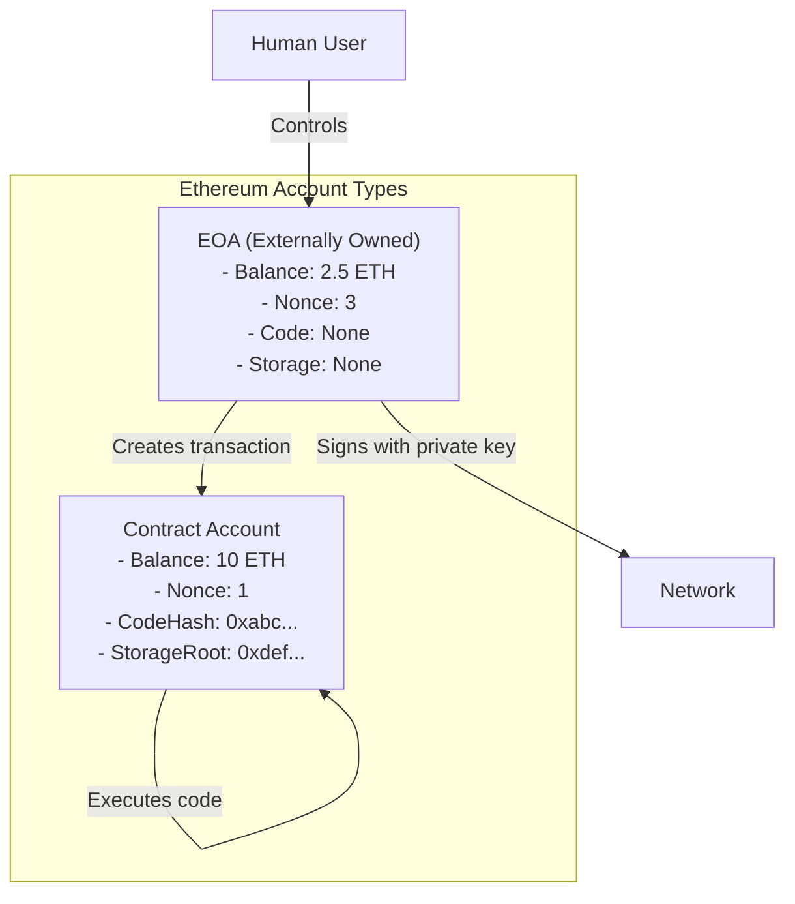
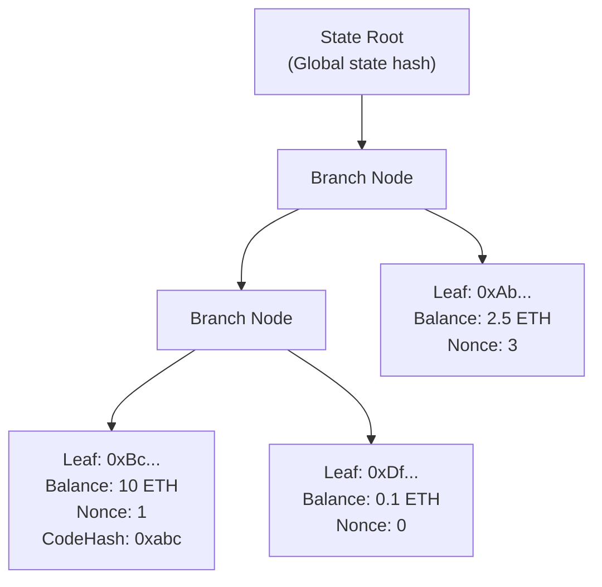
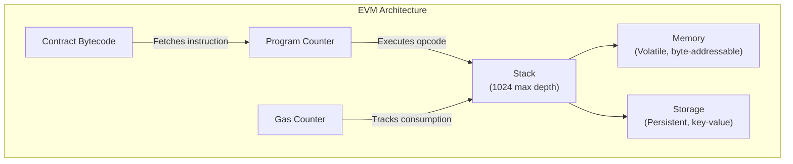
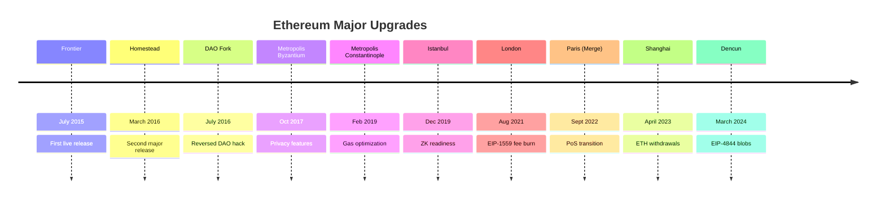

# Chapter 5: Ethereum and Smart Contracts

> **Previous:** [Chapter 4: The Bitcoin Network](./04-bitcoin.md) | **Next:** [Chapter 6: Smart Contract Development](./06-solidity.md)

---

## Learning Objectives

- Compare the Ethereum Account model with the Bitcoin UTXO model
- Distinguish between Externally Owned Accounts (EOA) and Contract Accounts
- Understand the Ethereum Virtual Machine (EVM) architecture and bytecode execution
- Analyze the state trie (Patricia Merkle Trie) and its role in Ethereum state
- Calculate gas costs for common operations and understand EIP-1559 fee market
- Describe EVM opcodes and their execution model
- Explain the history of Ethereum upgrades (Merge, Shanghai, Dencun)
- Understand the concept of Turing completeness and the halting problem in blockchain

<!-- Image Gallery -->
<section class="lesson-visuals" aria-label="Visual learning resources">
  <header><span>VISUAL LEARNING</span><h2>See it. Review it. Remember it.</h2></header>
  <a class="lesson-visual-card" href="../../assets/images/lessons/blockchain/05-ethereum/handwritten-notes.png" target="_blank" rel="noopener">
    
    <span><strong>Handwritten notes</strong>Condensed notes for deliberate review.</span>
  </a>
  <a class="lesson-visual-card" href="../../assets/images/lessons/blockchain/05-ethereum/sticky-notes.png" target="_blank" rel="noopener">
    
    <span><strong>Sticky-note revision</strong>Fast recall prompts for revision.</span>
  </a>
  <a class="lesson-visual-card" href="../../assets/images/lessons/blockchain/05-ethereum/visual-explanation.png" target="_blank" rel="noopener">
    
    <span><strong>Visual concept guide</strong>A connected explanation of the key ideas.</span>
  </a>
</section>
<!-- End Image Gallery -->

## Chapter at a Glance

| Topic | Key Insight | Practical Takeaway |
|-------|-------------|--------------------|
| Account Model | EOA (users) vs Contract (code) accounts | Key distinction from Bitcoin's UTXO model |
| EVM | Sandboxed, deterministic runtime | Every node runs every transaction — expensive but trustless |
| Smart Contracts | Self-executing immutable code | Deploy once, runs forever as programmed |
| Gas | Computational cost measured per opcode | Prevents infinite loops, funds network security |
| State Trie | Patricia Merkle Trie maps address ? state | Efficiently proves account existence and balance |
| EIP-1559 | Base fee + priority fee (tip) | Deflationary burn mechanism, better fee estimation |
| EIP-4844 | Proto-Danksharding (blob transactions) | Dramatically reduces L2 fees |

## Chapter Roadmap


---

## Theory

### The Account Model

Unlike Bitcoin, Ethereum uses an **Account-based model** (similar to a bank account). The "Global State" of Ethereum is a mapping of addresses to account states.

**Two account types:**

1. **EOA (Externally Owned Account):**
   - Controlled by a private key
   - Can initiate transactions
   - Has ETH balance and nonce
   - No associated code

2. **Contract Account:**
   - Controlled by code (smart contract)
   - Executes when triggered by an EOA or another contract
   - Has ETH balance, nonce, storage, and code hash
   - Cannot initiate transactions on its own



**Account State Fields:**
- **nonce:** Number of transactions sent (EOA) or number of contracts created (Contract)
- **balance:** Ether balance in Wei (1 ETH = 10^18 Wei)
- **storageRoot:** Root hash of the account's storage trie
- **codeHash:** Hash of the account's bytecode (empty for EOAs)

### State Trie (Patricia Merkle Trie)

Ethereum uses a **Modified Merkle Patricia Trie** to store the global state. Unlike Bitcoin's simple UTXO set, Ethereum maintains a single authenticated data structure that maps every address to its account state.



**Why a Patricia Trie?**
- **Efficient proofs:** Prove any account's state with `O(log n)` hashes
- **Deterministic:** Same state always produces the same root hash
- **Insertion order independent:** Different order of inserts still produces the same trie
- **Update efficiency:** Writing to storage only updates affected branches

### The Ethereum Virtual Machine (EVM)

The EVM is a sandboxed runtime environment for executing smart contract code. It is **Turing complete**, meaning it can perform any computation given enough resources and time.



**EVM execution model:**
- **Stack-based:** All operations push/pop from a 1024-element stack
- **Deterministic:** Same code + same input ? same output on every node
- **Isolated:** Contracts cannot access the filesystem, network, or other contracts' internal storage directly
- **Serialized:** One transaction executes at a time per contract (no concurrency issues)

### EVM Opcodes

The EVM has ~140+ opcodes categorized by function:

| Category | Opcodes | Description |
|----------|---------|-------------|
| Arithmetic | ADD, SUB, MUL, DIV, MOD, ADDMOD, MULMOD | Integer math (256-bit) |
| Comparison | LT, GT, EQ, ISZERO | Stack comparison |
| Bitwise | AND, OR, XOR, NOT, SHL, SHR, SAR | Bit operations |
| Memory | MLOAD, MSTORE, MSTORE8 | Volatile memory access |
| Storage | SLOAD, SSTORE | Persistent storage (expensive) |
| Environment | BALANCE, CALLER, ORIGIN, ADDRESS, CALLVALUE | Blockchain context |
| Block Info | BLOCKHASH, COINBASE, TIMESTAMP, NUMBER, GASLIMIT | Block metadata |
| Control Flow | JUMP, JUMPI, JUMPDEST, PC, STOP, RETURN, REVERT | Execution flow |
| Logging | LOG0, LOG1, LOG2, LOG3, LOG4 | Event emission |
| Calls | CALL, CALLCODE, DELEGATECALL, STATICCALL | Contract interaction |
| Creation | CREATE, CREATE2 | Contract deployment |

**Gas costs for common opcodes:**

| Opcode | Gas | Description |
|--------|-----|-------------|
| ADD/SUB | 3 | Arithmetic operation |
| MUL/DIV | 5 | Multiplication/division |
| BALANCE | 2600 | Gets account balance (warm access) |
| SLOAD | 2100 (cold), 100 (warm) | Load from storage |
| SSTORE (zero?nonzero) | 22100 | Write to storage (cold) |
| SSTORE (nonzero?nonzero) | 5000 | Update storage |
| CALL | 2600 | Call another contract (warm) |
| CREATE | 32000 | Deploy new contract |
| SELFDESTRUCT | 5000 | Destroy contract |

### Gas and Economic Security

To prevent infinite loops and resource abuse (the Halting Problem), Ethereum introduces **Gas**.

```mermaid
flowchart TB
    subgraph GasMechanism["Gas Mechanism"]
        Tx["Transaction"]
        GasLimit["Gas Limit: 100,000"]
        GasPrice["Gas Price: 50 Gwei"]
        TotalFee["Max Fee: 100,000 × 50 = 5,000,000 Gwei<br/>= 0.005 ETH"]
        Execution["EVM Executes..."
        UsedGas["Gas Used: 45,000"]
        Refund["Unused Gas Refunded:<br/>55,000 × 50 = 2,750,000 Gwei"]
    end
    
    Tx --> GasLimit
    Tx --> GasPrice
    GasLimit --> TotalFee
    GasPrice --> TotalFee
    GasLimit --> Execution
    Execution --> UsedGas
    UsedGas --> Refund
```

- **Gas:** Unit of computational work (each opcode costs fixed gas)
- **Gas Price:** Amount you pay per unit of gas (in Gwei, 1 Gwei = 10^-9 ETH)
- **Gas Limit:** Maximum gas you allow the transaction to consume
- **Total Fee:** Gas Used × Gas Price
- **EIP-1559 (London fork):** Base fee (burned) + Priority fee (tip to miner)

### EIP-1559 Fee Market

Introduced in the London hard fork (August 2021):

```typescript
interface EIP1559Transaction {
    maxFeePerGas: bigint;    // Maximum total fee willing to pay
    maxPriorityFeePerGas: bigint;  // Tip to validator
    baseFeePerGas: bigint;   // Network-calculated base fee (burned)
}

function calculateEffectiveFee(
    maxFee: bigint,
    maxPriority: bigint,
    baseFee: bigint
): bigint {
    // Effective priority = min(maxPriority, maxFee - baseFee)
    const effectivePriority = maxFee - baseFee < maxPriority
        ? maxFee - baseFee
        : maxPriority;
    return baseFee + effectivePriority;
}

// Base fee adjusts based on block fullness
function adjustBaseFee(
    currentBaseFee: bigint,
    blockGasUsed: number,
    blockGasTarget: number  // 15M for pre-Dencun, 30M post
): bigint {
    // Target is 50% of gas limit
    const target = blockGasTarget;
    if (blockGasUsed > target) {
        // Block >50% full ? base fee increases by up to 12.5%
        const excess = blockGasUsed - target;
        const increase = (excess * currentBaseFee) / (BigInt(target) * 8n);
        return currentBaseFee + increase;
    } else {
        // Block <50% full ? base fee decreases
        const deficit = target - blockGasUsed;
        const decrease = (deficit * currentBaseFee) / (BigInt(target) * 8n);
        return currentBaseFee - decrease;
    }
}
```

**Key changes from EIP-1559:**
- Base fee is burned (removed from circulation) — can make ETH deflationary
- Priority fee goes to validator as incentive
- Better fee estimation (base fee is deterministic)
- Users no longer need to guess gas prices manually

### Gas Calculation Example

```typescript
function estimateContractCallGas(
    functionComplexity: "simple" | "medium" | "complex"
): number {
    switch (functionComplexity) {
        case "simple":
            // Simple read/view function, no storage writes
            return 50000;
        case "medium":
            // Some storage writes, basic computation
            return 150000;
        case "complex":
            // Multiple storage writes, loops, external calls
            return 500000;
    }
}

// Example: Calling a token transfer function
const gasUsed = 45000;  // Typical ERC-20 transfer
const gasPrice = 50n;   // 50 Gwei
const baseFee = 30n;    // 30 Gwei base, 20 Gwei tip

const fee = gasUsed * Number(gasPrice);  // in Gwei
const ethFee = fee / 1e9;  // Convert to ETH
// 45000 * 50 = 2,250,000 Gwei = 0.00225 ETH
```

### Turing Completeness and The Halting Problem

Ethereum is **Turing complete** — it can simulate any computable function. This is both a blessing and a curse:

- **Benefit:** Can express any logic — complex DeFi protocols, NFTs, DAOs, etc.
- **Challenge:** Can't know if a program will finish (the Halting Problem is undecidable)

**Ethereum's solution:** Gas! Instead of proving a program halts, Ethereum charges for every computational step. If a transaction runs out of gas, it reverts but the miner keeps the gas. This ensures:
- Infinite loops cost attackers real money
- Miners are compensated for computation
- The network remains available (no single transaction can halt all nodes)

### Ethereum Upgrades



| Upgrade | Date | Key Changes |
|---------|------|-------------|
| Frontier | Jul 2015 | Initial release |
| Homestead | Mar 2016 | Second major release |
| The Merge | Sep 2022 | PoW ? PoS, 99.9% energy reduction |
| Shanghai | Apr 2023 | Enabled staking withdrawals (EIP-4895) |
| Dencun | Mar 2024 | Proto-Danksharding (EIP-4844), blob transactions |
| Electra | 2025+ | PeerDAS, further scalability |

**The Merge (Paris):**
- Transitioned execution layer from PoW to PoS (Beacon Chain)
- Reduced energy consumption by ~99.9%
- Validators replaced miners
- Same EVM, same smart contracts, same execution

**Dencun (EIP-4844):**
- Introduced **blob transactions** — temporary data storage for L2 rollups
- Reduced L2 fees by 10-100x
- No permanent state storage for blobs (pruned after ~18 days)
- Foundation for future full Danksharding

### EOA vs Contract Account Comparison

| Property | EOA | Contract Account |
|----------|-----|-----------------|
| Controlled by | Private key | Contract code |
| Can initiate transactions | Yes | No |
| Storage | None | Has persistent storage |
| Code | None | Has bytecode |
| Create at | User generates key | Deploy transaction |
| Address derivation | `Keccak256(pubkey)[12:]` | `Keccak256(sender, nonce)[12:]` |

---

## Examples

### Example 1: Simple Storage Contract

```solidity
// SPDX-License-Identifier: MIT
pragma solidity ^0.8.0;

contract SimpleStorage {
    uint256 public storedData;

    function set(uint256 x) public {
        storedData = x;
    }
}
```

- **Deployment:** Alice sends a transaction with the contract's bytecode.
- **Execution:** Bob calls `set(42)`. He pays for the gas required to update the `storedData` variable in Ethereum's global storage.

**Gas breakdown for `set(42)`:**
- Base cost: 21,000 gas (transaction)
- SSTORE (zero ? non-zero, cold): 22,100 gas
- Total: ~43,100 gas

### Example 2: Out of Gas Error

Alice sends a transaction to a complex contract with a Gas Limit of 21,000.

1. The transaction starts (base cost: 21,000 gas consumed).
2. There is 0 gas remaining for execution.
3. **Result:** The transaction fails. The state changes are reverted, but the 21,000 gas is **not refunded** because the miner already performed the work.

```typescript
class EVM {
    private gasCounter: number;
    private gasLimit: number;

    execute(code: string, gasLimit: number): ExecutionResult {
        this.gasLimit = gasLimit;
        this.gasCounter = 0;

        // Base transaction cost
        this.consumeGas(21000, "transaction base fee");

        try {
            // Execute opcodes
            while (this.gasCounter < this.gasLimit) {
                const opcode = this.fetchNextOpcode(code);
                this.executeOpcode(opcode);
            }
            return { success: true, gasUsed: this.gasCounter };
        } catch (error) {
            if (error instanceof OutOfGasError) {
                return {
                    success: false,
                    gasUsed: this.gasLimit,  // All gas consumed!
                    error: "out of gas",
                };
            }
            throw error;
        }
    }

    private consumeGas(amount: number, reason: string): void {
        if (this.gasCounter + amount > this.gasLimit) {
            throw new OutOfGasError(reason);
        }
        this.gasCounter += amount;
    }
}
```

### Example 3: ERC-20 Transfer with Gas Calculation

```typescript
interface ERC20TransferParameters {
    to: string;
    value: bigint;
}

function estimateERC20TransferGas(totalHolders?: number): number {
    // Base: 21000
    // 2 SLOAD (balanceOf sender, totalSupply check): 2 * 2100 = 4200
    // 2 SSTORE (sender balance--, receiver balance++): 2 * 5000 = 10000
    // 2 LOG operations: 2 * 750 = 1500
    // SLOAD for allowance if needed: 2100
    // Various checks and overhead: ~5000
    return 21000 + 4200 + 10000 + 1500 + 2100 + 5000;
    // ˜ 45800 gas for a typical transfer
}
```

### Example 4: State Trie Verification

```typescript
// Simplified representation of Patricia Merkle Trie verification
function verifyAccountState(
    address: string,
    expectedBalance: bigint,
    stateRootProof: string[],
    globalStateRoot: string
): boolean {
    // Walk through the state trie using Merkle proofs
    let currentNodeHash = globalStateRoot;
    
    for (const nibble of hexToNibbles(address)) {
        const branchNode = getNode(currentNodeHash);
        currentNodeHash = branchNode.children[parseInt(nibble, 16)];
        
        if (!currentNodeHash) {
            return false; // Address does not exist
        }
    }
    
    // Leaf node contains the account's RLP-encoded state
    const accountState = rlpDecode(getNode(currentNodeHash));
    return BigInt(accountState.balance) === expectedBalance;
}
```

> **One-Sentence Takeaway:** Ethereum's gas mechanism solves the halting problem for a Turing-complete blockchain by charging per-operation, ensuring infinite loops cost an attacker real money rather than halting the network.

> **Pro Tip:** When deploying a smart contract, the gas cost scales with storage writes (SSTORE), not instruction count. Writing to a storage slot from zero costs ~22,100 gas, while writing from non-zero costs ~5,000 gas. Optimize by minimizing storage writes and using events for non-critical data.

> **Warning:** Smart contracts are immutable after deployment. If a bug is discovered, funds are at risk until a new contract is deployed and users migrate. Always audit contracts and include upgrade patterns (proxy contracts) for production systems.

---

## Concept Comparison Table

| Concept | Definition | Key Distinction | Use Case |
|---------|-----------|-----------------|----------|
| EOA | Controlled by private key | Can initiate transactions | User wallets |
| Contract Account | Controlled by contract code | Has storage and logic | DApps, DeFi protocols |
| UTXO Model (Bitcoin) | State = set of unspent outputs | No code execution | Simple payments |
| Account Model (Ethereum) | State = address ? balance mapping | Supports arbitrary computation | Smart contracts, DeFi |
| Gas | Computation cost unit | Prevents DoS, funds network | All EVM operations |
| State Trie | Patricia Merkle Trie | Efficient state proofs | Account verification |
| EIP-1559 | Base fee burning | Deflationary, better UX | Fee market improvement |
| EIP-4844 | Blob transactions | Cheap L2 data availability | Rollup scaling |

## Quick Reference

| Category | Key Concepts | Notes |
|----------|-------------|-------|
| **Account Types** | EOA (externally owned), Contract | EOA txs are signed; Contract txs are triggered internally |
| **EVM Ops** | ADD (3 gas), SSTORE (22K/5K), BALANCE (2600) | Gas costs vary by operation complexity |
| **Denominations** | 1 ETH = 10? Gwei = 10¹8 Wei | Gas price typically quoted in Gwei |
| **Contract Lifecycle** | Deploy ? Interact ? Selfdestruct | No upgrade by default — use proxy pattern |
| **State Transition** | s[t+1] = ?(s[t], T) | Deterministic across all nodes |
| **Base Fee** | EIP-1559: Burned, adjusts by up to 12.5%/block | Deflationary when blocks >50% full |
| **Blobs** | EIP-4844: Temporary data, pruned after 18 days | 10-100x cheaper L2 fees |

## Cross-Application Matrix

| Technique | DeFi | Smart Contracts | Enterprise Blockchain | Research |
|-----------|------|-----------------|----------------------|----------|
| Account Model | Balance tracking | Contract state | Identity registry | Account abstraction |
| EVM | Token standards (ERC-20) | Contract runtime | Permissioned EVMs | EVM optimization |
| Gas Economics | Swap pricing | Compute costs | Private chain pricing | EIP-1559 fee market |
| Smart Contracts | Lending protocols | Automated logic | Supply chain rules | Formal verification |
| State Transition | Flash loans | Cross-contract calls | Multi-chain state | Parallel EVM |
| State Trie | Account state | Storage proofs | World state | Light client sync |

## Chapter Quiz

1. Why do Ethereum transactions cost more gas when writing to a storage slot for the first time (vs updating)?
   - A) It's a bug in the EVM
   - B) Writing from zero to non-zero is a cold storage access requiring more computation
   - C) It's randomly determined each block
   - D) Gas cost is the same regardless

<details>
<summary>Answer&lt;/summary&gt;
**B) Writing from zero to non-zero is a cold storage access requiring more computation.** SSTORE from zero costs ~22,100 gas vs ~5,000 for updating existing storage. This incentivizes users to clear unused storage (gas refund).
</details>

2. What happens to the state changes of an Ethereum transaction that runs out of gas?
   - A) Partial state changes remain
   - B) All state changes are reverted, but gas is not refunded
   - C) The transaction succeeds partially
   - D) Both state and gas are refunded

<details>
<summary>Answer&lt;/summary&gt;
**B) All state changes are reverted, but gas is not refunded.** The miner performed computational work, so gas is consumed even though the transaction ultimately failed. This prevents DoS attacks where attackers revert cheap transactions.
</details>

3. What is the critical security difference between an EOA and a Contract Account?
   - A) EOAs can hold ETH, contracts cannot
   - B) Contract accounts can be programmed to execute multi-step operations atomically; EOAs cannot
   - C) EOAs have higher gas limits
   - D) Contract accounts cannot send transactions

<details>
<summary>Answer&lt;/summary&gt;
**B) Contract accounts can be programmed to execute multi-step operations atomically.** This enables composable DeFi operations (flash loans, multi-hop swaps) that execute as atomic units — either all steps succeed or none do.
</details>

4. What is the base fee in EIP-1559?
   - A) A fee paid directly to the miner
   - B) A mandatory fee that is burned (removed from circulation)
   - C) An optional tip for priority
   - D) A percentage of the transaction value

<details>
<summary>Answer&lt;/summary&gt;
**B) A mandatory fee that is burned (removed from circulation).** In EIP-1559, the base fee is calculated per-block based on demand and is burned, potentially making ETH deflationary. The priority fee (tip) goes to the validator.
</details>

5. Why does Ethereum use a Patricia Merkle Trie instead of Bitcoin's simple Merkle tree?
   - A) Patricia tries are faster to compute
   - B) Patricia tries allow efficient proof of individual account states (key-value queries)
   - C) Patricia tries use less storage
   - D) Bitcoin's tree is actually a Patricia trie

<details>
<summary>Answer&lt;/summary&gt;
**B) Patricia tries allow efficient proof of individual account states (key-value queries).** Ethereum needs to efficiently read, update, and prove the state of any account (balance, nonce, storage, code) by address. A Patricia Trie enables efficient key-value lookups and proofs, unlike Bitcoin's transaction-oriented Merkle tree.
</details>

### TypeScript: Simplified Account State Trie

```typescript
import { createHash } from "node:crypto";

const sha256 = (d: string): string => createHash("sha256").update(d).digest("hex");

interface AccountState {
  nonce: number; balance: bigint; storageRoot: string; codeHash: string;
}

class StateTrie {
  nodes: Map<string, { children: Map<string, string>; value?: AccountState }> = new Map();
  root: string = "";

  put(address: string, account: AccountState): void {
    const hash = sha256(address);
    const nibbles = hash.split("");
    let current = this.root;
    let path = "";
    for (const nibble of nibbles.slice(0, 8)) {
      path += nibble;
      if (!this.nodes.has(path)) {
        this.nodes.set(path, { children: new Map() });
        if (current) {
          const parent = this.nodes.get(current);
          if (parent) parent.children.set(nibble, path);
        }
        if (!this.root) this.root = path;
      }
      current = path;
    }
    const leaf = this.nodes.get(current);
    if (leaf) leaf.value = account;
  }

  get(address: string): AccountState | undefined {
    const hash = sha256(address);
    const nibbles = hash.split("").slice(0, 8);
    let current = this.root;
    for (const nibble of nibbles) {
      const node = this.nodes.get(current);
      if (!node) return undefined;
      const child = node.children.get(nibble);
      if (!child) return undefined;
      current = child;
    }
    return this.nodes.get(current)?.value;
  }

  getRootHash(): string {
    const entries = [...this.nodes.entries()].filter(([, n]) => n.value);
    return sha256(entries.map(([k, v]) => k + JSON.stringify(v.value)).join("|"));
  }
}
```

### TypeScript: ABI Encoder / Decoder

```typescript
class ABIEncoder {
  static encodeFunctionSignature(sig: string): string {
    return sha256(sig).slice(0, 8);
  }

  static encodeUint(value: bigint): string {
    return value.toString(16).padStart(64, "0");
  }

  static encodeAddress(addr: string): string {
    return "0".repeat(24) + addr.slice(2).toLowerCase();
  }

  static encodeParams(types: string[], values: unknown[]): string {
    return types.map((t, i) => {
      const v = values[i];
      if (t === "uint256") return this.encodeUint(BigInt(v as number));
      if (t === "address") return this.encodeAddress(v as string);
      if (t === "bool") return "0".repeat(63) + (v ? "1" : "0");
      if (t.startsWith("bytes")) return (v as string).padEnd(64, "0");
      return "";
    }).join("");
  }

  static encodeCall(sig: string, types: string[], values: unknown[]): string {
    return this.encodeFunctionSignature(sig) + this.encodeParams(types, values);
  }
}
```

### TypeScript: Gas Calculator

```typescript
class GasCalculator {
  static readonly BASE_TX = 21000;
  static readonly SSTORE_SET = 22100;
  static readonly SSTORE_UPDATE = 5000;
  static readonly SLOAD_COLD = 2100;
  static readonly SLOAD_WARM = 100;
  static readonly CALL = 2600;
  static readonly CREATE = 32000;
  static readonly LOG = 375;
  static readonly SHA3 = 30;

  static estimateContractCall(
    storageWrites: number,
    storageReads: number,
    internalCalls: number,
    logCount: number
  ): number {
    let gas = this.BASE_TX;
    gas += storageWrites * this.SSTORE_SET;
    gas += storageReads * this.SLOAD_COLD;
    gas += internalCalls * this.CALL;
    gas += logCount * this.LOG;
    return gas;
  }

  static calculateFee(gasUsed: number, baseFeeGwei: number, priorityGwei: number): string {
    const totalGwei = BigInt(gasUsed) * BigInt(baseFeeGwei + priorityGwei);
    return `${totalGwei} Gwei (${Number(totalGwei) / 1e9} ETH)`;
  }
}
```

## TypeScript Implementations

```typescript
// === Account State Trie (simplified) ===
interface AccountState { nonce: number; balance: bigint; storageRoot: string; codeHash: string; }
class StateTrie {
    private state = new Map<string, AccountState>();

    createAccount(addr: string, balance: bigint): void {
        this.state.set(addr.toLowerCase(), { nonce: 0, balance, storageRoot: '0x56e81f171bcc55a6ff8345e692c0f86e5b48e01b996cadc001622fb5e363b41', codeHash: '0xc5d2460186f7233c927e7db2dcc703c0e500b653ca82273b7bfad8045d85a470' });
    }
    getAccount(addr: string): AccountState | undefined { return this.state.get(addr.toLowerCase()); }
    transfer(from: string, to: string, amount: bigint): boolean {
        const f = this.getAccount(from), t = this.getAccount(to);
        if (!f || f.balance < amount) return false;
        if (!t) return false;
        this.state.set(from.toLowerCase(), { ...f, nonce: f.nonce + 1, balance: f.balance - amount });
        this.state.set(to.toLowerCase(), { ...t, balance: t.balance + amount });
        return true;
    }
    incrementNonce(addr: string): void {
        const acct = this.getAccount(addr);
        if (acct) this.state.set(addr.toLowerCase(), { ...acct, nonce: acct.nonce + 1 });
    }
    dump(): void { this.state.forEach((v, k) => console.log(`  ${k}: balance=${v.balance} nonce=${v.nonce}`)); }
}

// === Transaction Receipt Generator ===
interface Receipt { txHash: string; status: number; gasUsed: number; logs: { address: string; topics: string[]; data: string }[]; }
class ReceiptGenerator {
    generate(txHash: string, success: boolean, gasUsed: number, logs: { address: string; topics: string[]; data: string }[]): Receipt {
        return { txHash, status: success ? 1 : 0, gasUsed, logs };
    }
    receiptRoot(receipts: Receipt[]): string {
        let h = 0;
        for (const r of receipts) {
            h ^= r.status + r.gasUsed;
            for (const log of r.logs) h ^= log.topics.reduce((a, t) => a + parseInt(t.slice(2, 10), 16), 0);
        }
        return `0x${Math.abs(h).toString(16).padStart(64, '0')}`;
    }
}

// === Gas Cost Calculator ===
class GasCalculator {
    static readonly BASE_TX = 21000;
    static readonly SSTORE_SET = 20000;
    static readonly SSTORE_RESET = 5000;
    static readonly SLOAD_COLD = 2100;
    static readonly CALL = 700;
    static readonly LOG = 375;
    static readonly SELFDESTRUCT = 5000;

    static txDataCost(data: string): number {
        let cost = 0;
        for (let i = 2; i < data.length; i += 2) cost += data.slice(i, i + 2) === '00' ? 4 : 16;
        return cost;
    }
    static contractCreation(bytecode: string): number {
        const base = 32000;
        const codeCost = Math.ceil((bytecode.length - 2) / 2) * 200;
        return base + codeCost;
    }
    static totalGas(txData: string, storageWrites: number, storageReads: number, calls: number): number {
        return this.BASE_TX + this.txDataCost(txData) + storageWrites * this.SSTORE_SET + storageReads * this.SLOAD_COLD + calls * this.CALL;
    }
    static fee(gasUsed: number, baseFeeGwei: number, priorityGwei: number): string {
        return `${(gasUsed * (baseFeeGwei + priorityGwei)).toLocaleString()} Gwei`;
    }
}

// === ABI Encoder ===
class ABIEncoder {
    static encodeFunctionSignature(sig: string): string {
        let h = 0;
        for (let i = 0; i < sig.length; i++) h = ((h << 5) - h) + sig.charCodeAt(i);
        return `0x${Math.abs(h).toString(16).padStart(8, '0')}`;
    }
    static encodeUint(value: bigint): string {
        return value.toString(16).padStart(64, '0');
    }
    static encodeAddress(addr: string): string {
        return '0'.repeat(24) + addr.slice(2).toLowerCase();
    }
    static encodeBool(value: boolean): string {
        return '0'.repeat(63) + (value ? '1' : '0');
    }
    static encodeCall(sig: string, args: string[]): string {
        const selector = this.encodeFunctionSignature(sig).slice(2);
        return '0x' + selector + args.join('');
    }
}

// === Event Log Topic Extractor ===
class EventLogParser {
    private readonly signatureHash: (sig: string) => string;
    constructor() {
        this.signatureHash = (sig: string) => {
            let h = 0;
            for (let i = 0; i < sig.length; i++) h = ((h << 5) - h) + sig.charCodeAt(i);
            return Math.abs(h).toString(16).padStart(64, '0');
        };
    }
    parseLog(topics: string[], data: string, knownEvents: Map<string, string>): { event: string; args: Record<string, string> } | null {
        const sig = topics[0]?.slice(2);
        for (const [event, abi] of knownEvents) {
            if (this.signatureHash(event) === sig) {
                const args: Record<string, string> = {};
                topics.slice(1).forEach((t, i) => args[`topic${i}`] = t);
                args.data = data;
                return { event, args };
            }
        }
        return null;
    }
}

// === Demo ===
const trie = new StateTrie();
trie.createAccount('0xalice', BigInt(100));
trie.createAccount('0xbob', BigInt(50));
console.log('State before transfer:');
trie.dump();
trie.transfer('0xalice', '0xbob', BigInt(25));
console.log('State after transfer:');
trie.dump();

const gc = new GasCalculator();
const txData = '0x6080604052';
console.log(`Tx data cost: ${gc.txDataCost(txData)}`);
console.log(`Total gas (1 write, 2 reads): ${gc.totalGas(txData, 1, 2, 0)}`);

const abi = new ABIEncoder();
console.log(`transfer selector: ${abi.encodeFunctionSignature('transfer(address,uint256)')}`);
console.log(`Encoded uint(42): ${abi.encodeUint(BigInt(42)).slice(0, 16)}...`);

const logs = new EventLogParser();
const events = new Map<string, string>();
events.set('Transfer(address,address,uint256)', 'transfer');
const parsed = logs.parseLog(['0x' + 'ddf252ad1be2c89b69c2b068fc378daa952ba7f163c4a11628f55a4df523b3ef', '0x000000000000000000000000alice'], '0x', events);
console.log(`Parsed event: ${parsed?.event ?? 'unknown'}`);
```

// ethereum
// distributed-ledger-crypto implementation

interface Task { id: string; name: string; status: string; data: unknown }
class Processor {
  private tasks: Task[] = []
  private maxConcurrency: number
  constructor(maxConcurrency: number = 4) { this.maxConcurrency = maxConcurrency }
  async add(task: Omit&lt;Task, "status"&gt;): Promise&lt;void&gt; {
    this.tasks.push({ ...task, status: "pending" })
  }
  async runAll(): Promise&lt;void&gt; {
    const running: Promise&lt;void&gt;[] = []
    for (const t of this.tasks) {
      if (running.length >= this.maxConcurrency) { await Promise.race(running) }
      const p = this.execute(t).finally(() => { const i = running.indexOf(p); if (i >= 0) running.splice(i, 1) })
      running.push(p)
    }
    await Promise.all(running)
  }
  private async execute(t: Task): Promise&lt;void&gt; {
    t.status = "running"
    await new Promise(r => setTimeout(r, 10))
    t.status = "done"
  }
  getResults(): Task[] { return this.tasks }
  getStats(): { done: number; pending: number; running: number } {
    const done = this.tasks.filter(t => t.status === "done").length
    const pending = this.tasks.filter(t => t.status === "pending").length
    const running = this.tasks.filter(t => t.status === "running").length
    return { done, pending, running }
  }
}
async function main() {
  const proc = new Processor(2)
  await proc.add({ id: '1', name: 'ethereum', data: { topic: 'distributed-ledger-crypto' } })
  await proc.runAll()
  console.log('Stats:', proc.getStats())
}
main().catch(console.error)
export { Processor, Task }
## Summary

- Ethereum is a "World Computer" that extends blockchain from payments to general computation.
- Accounts (EOAs and Contracts) are the primary units of state.
- The EVM provides a consistent, deterministic environment for smart contract execution.
- Gas is the fundamental mechanism for resource allocation and network security.
- The state trie (Patricia Merkle Trie) enables efficient account state proofs.
- EIP-1559 introduced base fee burning for better fee estimation and deflationary pressure.
- Ethereum has evolved through major upgrades (Merge, Shanghai, Dencun) to improve scalability and sustainability.
- Smart contracts enable decentralized, trustless logic on a global scale.

## Practical Takeaways

1. Use EIP-1559 transactions (`type: 2`) for better fee estimation — set `maxFeePerGas` and `maxPriorityFeePerGas`.
2. Minimize SSTORE operations in smart contracts — they cost the most gas.
3. Use the `storageRoot` and `codeHash` in block headers to verify account state via light clients.
4. For production contracts, always include upgrade mechanisms (proxy pattern) and emergency pause functions.
5. Monitor EIP-4844 blob fees when deploying L2 applications — they are much cheaper than L1 calldata.

---

## Exercises

### Review Questions

1. What is the difference between an EOA and a Contract Account?
2. Why is Turing completeness both a benefit and a risk for Ethereum?
3. Explain the relationship between Gwei and Ether.
4. What happens to the "Nonce" of an account after a transaction is executed?
5. How does the Patricia Merkle Trie differ from a standard Merkle tree?

### Application Problems

1. Calculate the total fee in ETH for a transaction that uses 100,000 gas with a max priority fee of 2 Gwei and a base fee of 30 Gwei.
2. Compare the storage requirements of the UTXO model versus the Account model for a network with 1 million users.
3. Explain why "Gas Price" fluctuates based on network demand.
4. Calculate the base fee change if the previous block used 20M gas out of a 30M target.

### Challenge Problem

1. Discuss the "Reentrancy" vulnerability at a high level and explain how it relates to the EVM's execution flow.
2. Research ERC-4337 (Account Abstraction) and explain how it enables smart contract wallets, social recovery, and gas sponsorship without changing the core protocol.
