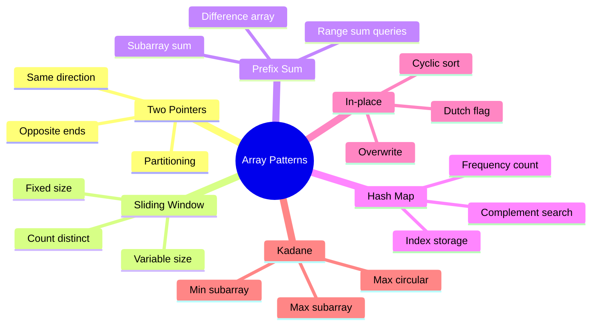

# Chapter 01: Arrays

> Array problems are the backbone of coding interviews. Mastering array manipulation, traversal, and optimization techniques is essential for every software engineer.

## Learning Objectives

- Understand and apply two-pointer, sliding window, and prefix sum techniques
- Recognize patterns for in-place array manipulation
- Master hash map-based optimization for O(n) time solutions
- Handle edge cases: empty arrays, duplicate values, negative numbers, overflow
- Implement algorithms that balance time and space complexity
## Problem Classification Flow

```mermaid
flowchart TD
    A[Array Problem] --> B{Need ordered output?}
    B -->|Yes| C{Unique constraint?}
    C -->|Yes| D[Sort + Two Pointers]
    C -->|No| E[Use hash map for dedup]
    B -->|No| F{Subarray / Subsequence?}
    F -->|Continuous| G[Sliding Window / Prefix Sum]
    F -->|Not continuous| H[Two Pointers / DP]
    B -->|Partial| I[Kadane's / Partitioning]
    
    G --> J{Window size fixed?}
    J -->|Yes| K[Fixed window → deque]
    J -->|No| L[Variable window → two pointers]
    
    D --> M[Set / Map for O(1) lookup]
    E --> M
    H --> N[Sort + Binary Search]
```

## Common Array Patterns



## Complexity Trade-offs

```mermaid
quadrantChart
    title Array Algorithm Trade-offs
    x-axis Fast Execution --> Slow Execution
    y-axis Low Space --> High Space
    quadrant-1 Sweet Spot: O(n) time O(1) space
    quadrant-2 Space Trade: O(n) time O(n) space
    quadrant-3 Slow but Lean: O(n²) time O(1) space
    quadrant-4 Costly: O(n²) time O(n) space
    Two Sum (HashMap): [0.12, 0.4]
    Two Pointers: [0.2, 0.15]
    Sorting + Binary Search: [0.35, 0.2]
    Brute Force: [0.85, 0.15]
    DP Kadane: [0.18, 0.12]
    Sliding Window: [0.15, 0.18]
    Prefix Sum: [0.15, 0.35]
    Bucket Sort: [0.1, 0.6]
```

---

## Easy Problems (10)

---

### Problem 1: Two Sum

🏷️ **Companies:** [Amazon] [Google] [Meta] [Microsoft] [Apple]
📊 **Difficulty:** Easy
📂 **Topics:** [Array, Hash Table]
🧩 **Pattern:** Hash Map
✅ **Best Option:** Hash map — O(n) time, O(n) space
❌ **Not Optimal:** Brute force O(n²) — fails for n up to 10⁴
🔗 **LeetCode:** [Two Sum](https://leetcode.com/problems/two-sum/)
🔗 **Related:** [Contains Duplicate](01-arrays.md#problem-5-contains-duplicate) · [Subarray Sum Equals K](01-arrays.md#problem-15-subarray-sum-equals-k) · [Valid Anagram](02-strings.md#problem-2-valid-anagram)

**Problem:** Given an array of integers `nums` and an integer `target`, return indices of the two numbers that add up to `target`. You may assume that each input has exactly one solution, and you may not use the same element twice.

**Example 1:**
```
Input: nums = [2, 7, 11, 15], target = 9
Output: [0, 1]
Explanation: nums[0] + nums[1] == 9, so we return [0, 1].
```

**Example 2:**
```
Input: nums = [3, 2, 4], target = 6
Output: [1, 2]
```

**Constraints:**
- 2 ≤ nums.length ≤ 10⁴
- -10⁹ ≤ nums[i] ≤ 10⁹
- -10⁹ ≤ target ≤ 10⁹
- Only one valid answer exists

**Solution Approach:**
- **Brute Force:** Use nested loops to check every pair. Time O(n²), Space O(1).
- **Optimal:** Use a hash map to store each number's index as we iterate. For each number, check if `target - num` exists in the map. Return indices if found. Time O(n), Space O(n).

```typescript
function twoSum(nums: number[], target: number): number[] {
  const map = new Map<number, number>();

  for (let i = 0; i < nums.length; i++) {
    const complement = target - nums[i];
    if (map.has(complement)) {
      return [map.get(complement)!, i];
    }
    map.set(nums[i], i);
  }

  return [];
}
```

**Test Cases:**
```typescript
console.log(twoSum([2, 7, 11, 15], 9));   // [0, 1]
console.log(twoSum([3, 2, 4], 6));        // [1, 2]
console.log(twoSum([3, 3], 6));           // [0, 1]
console.log(twoSum([1, 5, 3, 7], 8));     // [1, 3] or [0, 2]
```

**Time Complexity:** O(n) — single pass through the array
**Space Complexity:** O(n) — hash map storing up to n elements

---

### Problem 2: Best Time to Buy and Sell Stock

🏷️ **Companies:** [Amazon] [Meta] [Microsoft] [Apple] [Google]
📊 **Difficulty:** Easy
📂 **Topics:** [Array, Dynamic Programming]
🧩 **Pattern:** Kadane's, Greedy
✅ **Best Option:** Single-pass min-price tracking — O(n) time, O(1) space
❌ **Not Optimal:** Brute force O(n²) — fails for n up to 10⁵
🔗 **LeetCode:** [Best Time to Buy and Sell Stock](https://leetcode.com/problems/best-time-to-buy-and-sell-stock/)
🔗 **Related:** [Maximum Subarray](01-arrays.md#problem-3-maximum-subarray-kadanes-algorithm) · [Maximum Product Subarray](01-arrays.md#problem-20-maximum-product-subarray) · [Longest Substring Without Repeating Characters](02-strings.md#problem-9-longest-substring-without-repeating-characters)

**Problem:** You are given an array `prices` where `prices[i]` is the price of a given stock on day `i`. You want to maximize your profit by choosing a single day to buy one stock and choosing a different day in the future to sell that stock. Return the maximum profit you can achieve. If no profit can be made, return 0.

**Example 1:**
```
Input: prices = [7, 1, 5, 3, 6, 4]
Output: 5
Explanation: Buy on day 2 (price=1) and sell on day 5 (price=6), profit = 5.
```

**Example 2:**
```
Input: prices = [7, 6, 4, 3, 1]
Output: 0
Explanation: No profit possible, return 0.
```

**Constraints:**
- 1 ≤ prices.length ≤ 10⁵
- 0 ≤ prices[i] ≤ 10⁴

**Solution Approach:**
- **Brute Force:** Check every buying-selling pair. Time O(n²), Space O(1).
- **Optimal (Kadane's):** Track the minimum price seen so far and the maximum profit. Iterate once: update min price, then compute potential profit = current price - min price, track max profit. Time O(n), Space O(1).

```typescript
function maxProfit(prices: number[]): number {
  let minPrice = Infinity;
  let maxProfitValue = 0;

  for (const price of prices) {
    if (price < minPrice) {
      minPrice = price;
    } else {
      maxProfitValue = Math.max(maxProfitValue, price - minPrice);
    }
  }

  return maxProfitValue;
}
```

**Test Cases:**
```typescript
console.log(maxProfit([7, 1, 5, 3, 6, 4])); // 5
console.log(maxProfit([7, 6, 4, 3, 1]));     // 0
console.log(maxProfit([1, 2]));               // 1
console.log(maxProfit([3, 3, 3]));            // 0
console.log(maxProfit([2, 4, 1]));            // 2
```

**Time Complexity:** O(n) — single pass
**Space Complexity:** O(1) — constant space

---

### Problem 3: Maximum Subarray (Kadane's Algorithm)

🏷️ **Companies:** [Amazon] [Google] [Microsoft] [Meta] [LinkedIn]
📊 **Difficulty:** Easy
📂 **Topics:** [Array, Divide and Conquer, DP]
🧩 **Pattern:** Kadane's
✅ **Best Option:** Kadane's algorithm — O(n) time, O(1) space
❌ **Not Optimal:** Brute force O(n³) — fails for n up to 10⁵
🔗 **LeetCode:** [Maximum Subarray](https://leetcode.com/problems/maximum-subarray/)
🔗 **Related:** [Best Time to Buy and Sell Stock](01-arrays.md#problem-2-best-time-to-buy-and-sell-stock) · [Maximum Product Subarray](01-arrays.md#problem-20-maximum-product-subarray) · [Longest Substring Without Repeating Characters](02-strings.md#problem-9-longest-substring-without-repeating-characters)

**Problem:** Given an integer array `nums`, find the contiguous subarray (containing at least one number) which has the largest sum and return its sum.

**Example 1:**
```
Input: nums = [-2, 1, -3, 4, -1, 2, 1, -5, 4]
Output: 6
Explanation: Subarray [4, -1, 2, 1] has the largest sum = 6.
```

**Example 2:**
```
Input: nums = [1]
Output: 1
```

**Constraints:**
- 1 ≤ nums.length ≤ 10⁵
- -10⁴ ≤ nums[i] ≤ 10⁴

**Solution Approach:**
- **Brute Force:** Generate all subarrays, compute each sum. Time O(n³), Space O(1).
- **Optimal (Kadane's):** Track `currentSum` (max ending at current position) and `maxSum` (global max). For each element, extend the current subarray or start fresh. Time O(n), Space O(1).

```typescript
function maxSubArray(nums: number[]): number {
  let currentSum = nums[0];
  let maxSum = nums[0];

  for (let i = 1; i < nums.length; i++) {
    currentSum = Math.max(nums[i], currentSum + nums[i]);
    maxSum = Math.max(maxSum, currentSum);
  }

  return maxSum;
}
```

**Test Cases:**
```typescript
console.log(maxSubArray([-2, 1, -3, 4, -1, 2, 1, -5, 4])); // 6
console.log(maxSubArray([1]));                               // 1
console.log(maxSubArray([5, 4, -1, 7, 8]));                  // 23
console.log(maxSubArray([-1]));                              // -1
console.log(maxSubArray([-2, -1]));                          // -1
```

**Time Complexity:** O(n) — single pass
**Space Complexity:** O(1) — constant space

---

### Problem 4: Move Zeroes

🏷️ **Companies:** [Amazon] [Meta] [Microsoft] [Apple]
📊 **Difficulty:** Easy
📂 **Topics:** [Array, Two Pointers]
🧩 **Pattern:** Two Pointers, In-place
✅ **Best Option:** Two pointers — O(n) time, O(1) space
❌ **Not Optimal:** Copy to a new array O(n) space — violates the in-place requirement
🔗 **LeetCode:** [Move Zeroes](https://leetcode.com/problems/move-zeroes/)
🔗 **Related:** [Sort Colors](01-arrays.md#problem-18-sort-colors-dutch-national-flag) · [Rotate Array](01-arrays.md#problem-19-rotate-array) · [Reverse String](02-strings.md#problem-4-reverse-string)

**Problem:** Given an integer array `nums`, move all 0's to the end of it while maintaining the relative order of the non-zero elements. Do this in-place without making a copy of the array.

**Example 1:**
```
Input: nums = [0, 1, 0, 3, 12]
Output: [1, 3, 12, 0, 0]
```

**Constraints:**
- 1 ≤ nums.length ≤ 10⁴
- -2³¹ ≤ nums[i] ≤ 2³¹ - 1

**Solution Approach:**
- **Brute Force:** Create a new array, copy non-zero elements, then fill zeros. Time O(n), Space O(n).
- **Optimal (Two Pointers):** Use a slow pointer `lastNonZeroFoundAt` to track position for next non-zero element. Iterate with fast pointer; when non-zero found, swap with slow position. Time O(n), Space O(1).

```typescript
function moveZeroes(nums: number[]): void {
  let lastNonZeroFoundAt = 0;

  for (let i = 0; i < nums.length; i++) {
    if (nums[i] !== 0) {
      [nums[lastNonZeroFoundAt], nums[i]] = [nums[i], nums[lastNonZeroFoundAt]];
      lastNonZeroFoundAt++;
    }
  }
}
```

**Test Cases:**
```typescript
const arr1 = [0, 1, 0, 3, 12];
moveZeroes(arr1);
console.log(arr1); // [1, 3, 12, 0, 0]

const arr2 = [0];
moveZeroes(arr2);
console.log(arr2); // [0]

const arr3 = [1, 2, 3];
moveZeroes(arr3);
console.log(arr3); // [1, 2, 3]
```

**Time Complexity:** O(n) — single pass
**Space Complexity:** O(1) — in-place

---

### Problem 5: Contains Duplicate

🏷️ **Companies:** [Amazon] [Google] [Microsoft] [Apple]
📊 **Difficulty:** Easy
📂 **Topics:** [Array, Hash Table, Sorting]
🧩 **Pattern:** Hash Map
✅ **Best Option:** Hash set — O(n) time, O(n) space
❌ **Not Optimal:** Nested loops O(n²) — fails for n up to 10⁵
🔗 **LeetCode:** [Contains Duplicate](https://leetcode.com/problems/contains-duplicate/)
🔗 **Related:** [Two Sum](01-arrays.md#problem-1-two-sum) · [Single Number](01-arrays.md#problem-8-single-number) · [Valid Anagram](02-strings.md#problem-2-valid-anagram)

**Problem:** Given an integer array `nums`, return `true` if any value appears at least twice in the array, and return `false` if every element is distinct.

**Example 1:**
```
Input: nums = [1, 2, 3, 1]
Output: true
```

**Example 2:**
```
Input: nums = [1, 2, 3, 4]
Output: false
```

**Constraints:**
- 1 ≤ nums.length ≤ 10⁵
- -10⁹ ≤ nums[i] ≤ 10⁹

**Solution Approach:**
- **Brute Force:** Nested loop to check each pair. Time O(n²), Space O(1).
- **Optimal:** Use a Set. Iterate and check if element is already in set. Time O(n), Space O(n).

```typescript
function containsDuplicate(nums: number[]): boolean {
  const seen = new Set<number>();

  for (const num of nums) {
    if (seen.has(num)) return true;
    seen.add(num);
  }

  return false;
}
```

**Test Cases:**
```typescript
console.log(containsDuplicate([1, 2, 3, 1])); // true
console.log(containsDuplicate([1, 2, 3, 4])); // false
console.log(containsDuplicate([]));            // false
console.log(containsDuplicate([1, 1, 1]));     // true
```

**Time Complexity:** O(n)
**Space Complexity:** O(n)

---

### Problem 6: Missing Number

🏷️ **Companies:** [Amazon] [Microsoft] [Meta] [Google]
📊 **Difficulty:** Easy
📂 **Topics:** [Array, Math, Bit Manipulation]
🧩 **Pattern:** In-place, Frequency Count
✅ **Best Option:** Sum formula / XOR — O(n) time, O(1) space
❌ **Not Optimal:** Sorting O(n log n) — slower than the required O(n)
🔗 **LeetCode:** [Missing Number](https://leetcode.com/problems/missing-number/)
🔗 **Related:** [Find All Numbers Disappeared in an Array](01-arrays.md#problem-7-find-all-numbers-disappeared-in-an-array) · [Single Number](01-arrays.md#problem-8-single-number) · [First Unique Character in a String](02-strings.md#problem-3-first-unique-character-in-a-string)

**Problem:** Given an array `nums` containing `n` distinct numbers in the range `[0, n]`, return the only number in the range that is missing from the array.

**Example 1:**
```
Input: nums = [3, 0, 1]
Output: 2
Explanation: n = 3, numbers 0..3, missing 2.
```

**Example 2:**
```
Input: nums = [0, 1]
Output: 2
```

**Constraints:**
- n == nums.length
- 1 ≤ n ≤ 10⁴
- 0 ≤ nums[i] ≤ n
- All numbers are unique

**Solution Approach:**
- **Sorting:** Sort array, then find missing. Time O(n log n), Space O(1).
- **Hash Set:** Add all numbers to set, check 0..n. Time O(n), Space O(n).
- **Optimal (XOR):** XOR all indices with all values. The result is the missing number. Time O(n), Space O(1).
- **Optimal (Sum):** Compute expected sum n*(n+1)/2, subtract actual sum. Time O(n), Space O(1).

```typescript
function missingNumber(nums: number[]): number {
  const n = nums.length;
  const expectedSum = (n * (n + 1)) / 2;
  const actualSum = nums.reduce((sum, num) => sum + num, 0);
  return expectedSum - actualSum;
}
```

**Test Cases:**
```typescript
console.log(missingNumber([3, 0, 1]));    // 2
console.log(missingNumber([0, 1]));       // 2
console.log(missingNumber([9,6,4,2,3,5,7,0,1])); // 8
console.log(missingNumber([0]));          // 1
```

**Time Complexity:** O(n)
**Space Complexity:** O(1)

---

### Problem 7: Find All Numbers Disappeared in an Array

🏷️ **Companies:** [Google] [Amazon]
📊 **Difficulty:** Easy
📂 **Topics:** [Array, Hash Table]
🧩 **Pattern:** In-place, Cyclic Sort
✅ **Best Option:** Negative marking in-place — O(n) time, O(1) space
❌ **Not Optimal:** Hash set O(n) space — violates the O(1) space constraint
🔗 **LeetCode:** [Find All Numbers Disappeared in an Array](https://leetcode.com/problems/find-all-numbers-disappeared-in-an-array/)
🔗 **Related:** [Missing Number](01-arrays.md#problem-6-missing-number) · [First Missing Positive](01-arrays.md#problem-26-first-missing-positive) · [Valid Anagram](02-strings.md#problem-2-valid-anagram)

**Problem:** Given an array `nums` of n integers where nums[i] is in the range [1, n], return an array of all the integers in the range [1, n] that do not appear in nums.

**Example 1:**
```
Input: nums = [4, 3, 2, 7, 8, 2, 3, 1]
Output: [5, 6]
```

**Constraints:**
- n == nums.length
- 1 ≤ n ≤ 10⁵
- 1 ≤ nums[i] ≤ n

**Solution Approach:**
- **Hash Set:** Add all numbers to set, then check 1..n. Time O(n), Space O(n).
- **Optimal (In-place):** Use array as hash map. For each num, mark index `|num|-1` as negative. Return indices of positive values. Time O(n), Space O(1).

```typescript
function findDisappearedNumbers(nums: number[]): number[] {
  const result: number[] = [];

  for (let i = 0; i < nums.length; i++) {
    const index = Math.abs(nums[i]) - 1;
    if (nums[index] > 0) {
      nums[index] = -nums[index];
    }
  }

  for (let i = 0; i < nums.length; i++) {
    if (nums[i] > 0) {
      result.push(i + 1);
    }
  }

  return result;
}
```

**Test Cases:**
```typescript
console.log(findDisappearedNumbers([4, 3, 2, 7, 8, 2, 3, 1])); // [5, 6]
console.log(findDisappearedNumbers([1, 1]));                    // [2]
console.log(findDisappearedNumbers([2, 2]));                    // [1]
```

**Time Complexity:** O(n)
**Space Complexity:** O(1) (excluding output)

---

### Problem 8: Single Number

🏷️ **Companies:** [Amazon] [Google] [Microsoft] [Apple]
📊 **Difficulty:** Easy
📂 **Topics:** [Array, Bit Manipulation]
🧩 **Pattern:** Frequency Count, Hash Map
✅ **Best Option:** XOR — O(n) time, O(1) space
❌ **Not Optimal:** Hash map counting O(n) space — violates the constant-space requirement
🔗 **LeetCode:** [Single Number](https://leetcode.com/problems/single-number/)
🔗 **Related:** [Missing Number](01-arrays.md#problem-6-missing-number) · [Contains Duplicate](01-arrays.md#problem-5-contains-duplicate) · [First Unique Character in a String](02-strings.md#problem-3-first-unique-character-in-a-string)

**Problem:** Given a non-empty array of integers `nums`, every element appears twice except for one. Find that single one. Implement a solution with linear runtime complexity and constant extra space.

**Example 1:**
```
Input: nums = [2, 2, 1]
Output: 1
```

**Example 2:**
```
Input: nums = [4, 1, 2, 1, 2]
Output: 4
```

**Constraints:**
- 1 ≤ nums.length ≤ 3 × 10⁴
- -3 × 10⁴ ≤ nums[i] ≤ 3 × 10⁴
- Each element appears twice except one

**Solution Approach:**
- **Hash Map:** Count frequencies, return the one with count 1. Time O(n), Space O(n).
- **Optimal (XOR):** XOR all numbers. a⊕a=0 and a⊕0=a, so the single number remains. Time O(n), Space O(1).

```typescript
function singleNumber(nums: number[]): number {
  let result = 0;
  for (const num of nums) {
    result ^= num;
  }
  return result;
}
```

**Test Cases:**
```typescript
console.log(singleNumber([2, 2, 1]));          // 1
console.log(singleNumber([4, 1, 2, 1, 2]));    // 4
console.log(singleNumber([1]));                 // 1
```

**Time Complexity:** O(n)
**Space Complexity:** O(1)

---

### Problem 9: Intersection of Two Arrays II

🏷️ **Companies:** [Amazon] [Google] [Microsoft]
📊 **Difficulty:** Easy
📂 **Topics:** [Array, Hash Table, Two Pointers]
🧩 **Pattern:** Hash Map, Two Pointers
✅ **Best Option:** Frequency count with hash map — O(n+m) time, O(min(n,m)) space
❌ **Not Optimal:** Nested loops O(n·m) — slow when both arrays are large
🔗 **LeetCode:** [Intersection of Two Arrays II](https://leetcode.com/problems/intersection-of-two-arrays-ii/)
🔗 **Related:** [Two Sum](01-arrays.md#problem-1-two-sum) · [Contains Duplicate](01-arrays.md#problem-5-contains-duplicate) · [Valid Anagram](02-strings.md#problem-2-valid-anagram)

**Problem:** Given two integer arrays `nums1` and `nums2`, return an array of their intersection. Each element in the result should appear as many times as it appears in both arrays.

**Example 1:**
```
Input: nums1 = [1, 2, 2, 1], nums2 = [2, 2]
Output: [2, 2]
```

**Constraints:**
- 1 ≤ nums1.length, nums2.length ≤ 1000
- 0 ≤ nums[i] ≤ 1000

**Solution Approach:**
- **Hash Map:** Count frequencies of smaller array, iterate through larger, decrement count when found. Time O(n+m), Space O(min(n,m)).
- **Two Pointers (sorted):** Sort both, use two pointers. Time O(n log n + m log m), Space O(1).

```typescript
function intersect(nums1: number[], nums2: number[]): number[] {
  const freq = new Map<number, number>();
  const result: number[] = [];

  for (const num of nums1) {
    freq.set(num, (freq.get(num) || 0) + 1);
  }

  for (const num of nums2) {
    const count = freq.get(num);
    if (count && count > 0) {
      result.push(num);
      freq.set(num, count - 1);
    }
  }

  return result;
}
```

**Test Cases:**
```typescript
console.log(intersect([1, 2, 2, 1], [2, 2]));       // [2, 2]
console.log(intersect([4, 9, 5], [9, 4, 9, 8, 4])); // [4, 9] or [9, 4]
```

**Time Complexity:** O(n + m)
**Space Complexity:** O(min(n, m))

---

### Problem 10: Plus One

🏷️ **Companies:** [Amazon] [Google] [Microsoft]
📊 **Difficulty:** Easy
📂 **Topics:** [Array, Math]
🧩 **Pattern:** In-place, String Manipulation
✅ **Best Option:** Right-to-left carry — O(n) time, O(1) space
❌ **Not Optimal:** Convert to number and add — overflows for 100-digit inputs
🔗 **LeetCode:** [Plus One](https://leetcode.com/problems/plus-one/)
🔗 **Related:** [Rotate Array](01-arrays.md#problem-19-rotate-array) · [String to Integer (atoi)](02-strings.md#problem-12-string-to-integer-atoi) · [Compare Version Numbers](02-strings.md#problem-20-compare-version-numbers)

**Problem:** You are given a large integer represented as an integer array `digits`, where each digit is an element of the array. Increment the large integer by one and return the resulting array.

**Example 1:**
```
Input: digits = [1, 2, 3]
Output: [1, 2, 4]
```

**Example 2:**
```
Input: digits = [9]
Output: [1, 0]
```

**Constraints:**
- 1 ≤ digits.length ≤ 100
- 0 ≤ digits[i] ≤ 9

**Solution Approach:**
- Iterate from the right, add 1, handle carry. If all digits become 0, prepend 1.

```typescript
function plusOne(digits: number[]): number[] {
  for (let i = digits.length - 1; i >= 0; i--) {
    if (digits[i] < 9) {
      digits[i]++;
      return digits;
    }
    digits[i] = 0;
  }
  return [1, ...digits];
}
```

**Test Cases:**
```typescript
console.log(plusOne([1, 2, 3])); // [1, 2, 4]
console.log(plusOne([9]));       // [1, 0]
console.log(plusOne([9, 9]));    // [1, 0, 0]
```

**Time Complexity:** O(n)
**Space Complexity:** O(1) (O(n) in worst case)

---

## Medium Problems (14)

---

### Problem 11: Three Sum

🏷️ **Companies:** [Amazon] [Google] [Meta] [Microsoft] [Apple]
📊 **Difficulty:** Medium
📂 **Topics:** [Array, Two Pointers, Sorting]
🧩 **Pattern:** Two Pointers, Sorting
✅ **Best Option:** Sort + two pointers — O(n²) time, O(1) space
❌ **Not Optimal:** Brute force O(n³) — fails for n up to 3000
🔗 **LeetCode:** [3Sum](https://leetcode.com/problems/3sum/)
🔗 **Related:** [Two Sum](01-arrays.md#problem-1-two-sum) · [Container With Most Water](01-arrays.md#problem-13-container-with-most-water) · [Group Anagrams](02-strings.md#problem-11-group-anagrams)

**Problem:** Given an integer array `nums`, return all unique triplets `[nums[i], nums[j], nums[k]]` such that i, j, k are distinct and sum to zero.

**Example 1:**
```
Input: nums = [-1, 0, 1, 2, -1, -4]
Output: [[-1, -1, 2], [-1, 0, 1]]
```

**Constraints:**
- 3 ≤ nums.length ≤ 3000
- -10⁵ ≤ nums[i] ≤ 10⁵

**Solution Approach:**
- **Brute Force:** Triple nested loop. Time O(n³), Space O(1).
- **Optimal:** Sort array, then fix one element and use two pointers on the rest. Skip duplicates. Time O(n²), Space O(1) or O(n) for sorting.

```typescript
function threeSum(nums: number[]): number[][] {
  nums.sort((a, b) => a - b);
  const result: number[][] = [];

  for (let i = 0; i < nums.length - 2; i++) {
    if (i > 0 && nums[i] === nums[i - 1]) continue;

    let left = i + 1;
    let right = nums.length - 1;

    while (left < right) {
      const sum = nums[i] + nums[left] + nums[right];

      if (sum === 0) {
        result.push([nums[i], nums[left], nums[right]]);
        while (left < right && nums[left] === nums[left + 1]) left++;
        while (left < right && nums[right] === nums[right - 1]) right--;
        left++;
        right--;
      } else if (sum < 0) {
        left++;
      } else {
        right--;
      }
    }
  }

  return result;
}
```

**Test Cases:**
```typescript
console.log(threeSum([-1, 0, 1, 2, -1, -4]));
// [[-1, -1, 2], [-1, 0, 1]]
console.log(threeSum([0, 0, 0])); // [[0, 0, 0]]
console.log(threeSum([1, 2, -2, -1])); // []
```

**Time Complexity:** O(n²)
**Space Complexity:** O(1) (excluding sorting)

---

### Problem 12: Product of Array Except Self

🏷️ **Companies:** [Amazon] [Meta] [Google] [Microsoft] [Apple]
📊 **Difficulty:** Medium
📂 **Topics:** [Array, Prefix Sum]
🧩 **Pattern:** Prefix Sum
✅ **Best Option:** Prefix × suffix products — O(n) time, O(1) space (excluding output)
❌ **Not Optimal:** Division by total product — fails when the array contains zeros
🔗 **LeetCode:** [Product of Array Except Self](https://leetcode.com/problems/product-of-array-except-self/)
🔗 **Related:** [Subarray Sum Equals K](01-arrays.md#problem-15-subarray-sum-equals-k) · [Maximum Product Subarray](01-arrays.md#problem-20-maximum-product-subarray) · [Group Anagrams](02-strings.md#problem-11-group-anagrams)

**Problem:** Given an integer array `nums`, return an array `answer` such that `answer[i]` is equal to the product of all the elements of `nums` except `nums[i]`. Solve without division and in O(n) time.

**Example 1:**
```
Input: nums = [1, 2, 3, 4]
Output: [24, 12, 8, 6]
```

**Constraints:**
- 2 ≤ nums.length ≤ 10⁵
- -30 ≤ nums[i] ≤ 30

**Solution Approach:**
- **With Division:** Product of all / nums[i]. Fails with zeros.
- **Optimal:** Compute prefix products (left to right), then suffix products (right to left). Multiply both.

```typescript
function productExceptSelf(nums: number[]): number[] {
  const result: number[] = new Array(nums.length).fill(1);

  let prefix = 1;
  for (let i = 0; i < nums.length; i++) {
    result[i] = prefix;
    prefix *= nums[i];
  }

  let suffix = 1;
  for (let i = nums.length - 1; i >= 0; i--) {
    result[i] *= suffix;
    suffix *= nums[i];
  }

  return result;
}
```

**Test Cases:**
```typescript
console.log(productExceptSelf([1, 2, 3, 4])); // [24, 12, 8, 6]
console.log(productExceptSelf([-1, 1, 0, -3, 3])); // [0, 0, 9, 0, 0]
```

**Time Complexity:** O(n)
**Space Complexity:** O(1) (excluding output)

---

### Problem 13: Container With Most Water

🏷️ **Companies:** [Amazon] [Google] [Meta] [Microsoft]
📊 **Difficulty:** Medium
📂 **Topics:** [Array, Two Pointers, Greedy]
🧩 **Pattern:** Two Pointers, Greedy
✅ **Best Option:** Two pointers from both ends — O(n) time, O(1) space
❌ **Not Optimal:** Brute force O(n²) — fails for n up to 10⁵
🔗 **LeetCode:** [Container With Most Water](https://leetcode.com/problems/container-with-most-water/)
🔗 **Related:** [Trapping Rain Water](01-arrays.md#problem-27-trapping-rain-water) · [Three Sum](01-arrays.md#problem-11-three-sum) · [Valid Palindrome](02-strings.md#problem-1-valid-palindrome)

**Problem:** Given n non-negative integers `height` representing vertical lines, find two lines that together with the x-axis form a container that holds the most water.

**Example 1:**
```
Input: height = [1, 8, 6, 2, 5, 4, 8, 3, 7]
Output: 49
```

**Constraints:**
- n == height.length
- 2 ≤ n ≤ 10⁵
- 0 ≤ height[i] ≤ 10⁴

**Solution Approach:**
- **Brute Force:** Check every pair. Time O(n²), Space O(1).
- **Optimal:** Two pointers from both ends. Move the shorter line inward, track max area. Time O(n), Space O(1).

```typescript
function maxArea(height: number[]): number {
  let left = 0;
  let right = height.length - 1;
  let maxAreaValue = 0;

  while (left < right) {
    const minHeight = Math.min(height[left], height[right]);
    const width = right - left;
    maxAreaValue = Math.max(maxAreaValue, minHeight * width);

    if (height[left] < height[right]) {
      left++;
    } else {
      right--;
    }
  }

  return maxAreaValue;
}
```

**Test Cases:**
```typescript
console.log(maxArea([1, 8, 6, 2, 5, 4, 8, 3, 7])); // 49
console.log(maxArea([1, 1])); // 1
console.log(maxArea([4, 3, 2, 1, 4])); // 16
```

**Time Complexity:** O(n)
**Space Complexity:** O(1)

---

### Problem 14: Find the Duplicate Number

🏷️ **Companies:** [Amazon] [Google] [Microsoft] [Meta]
📊 **Difficulty:** Medium
📂 **Topics:** [Array, Two Pointers, Binary Search]
🧩 **Pattern:** Two Pointers, Cyclic Sort
✅ **Best Option:** Floyd's cycle detection — O(n) time, O(1) space
❌ **Not Optimal:** Hash set O(n) space — violates the no-extra-memory constraint
🔗 **LeetCode:** [Find the Duplicate Number](https://leetcode.com/problems/find-the-duplicate-number/)
🔗 **Related:** [Missing Number](01-arrays.md#problem-6-missing-number) · [Single Number](01-arrays.md#problem-8-single-number) · [First Unique Character in a String](02-strings.md#problem-3-first-unique-character-in-a-string)

**Problem:** Given an array of integers `nums` containing n+1 integers where each integer is in [1, n], there is exactly one repeated number. Find the duplicate without modifying the array and using O(1) extra space.

**Example 1:**
```
Input: nums = [1, 3, 4, 2, 2]
Output: 2
```

**Constraints:**
- 1 ≤ n ≤ 10⁵
- nums.length == n + 1
- 1 ≤ nums[i] ≤ n

**Solution Approach:**
- **Hash Set:** Track seen numbers. Time O(n), Space O(n).
- **Negative Marking:** Mark visited by negating. Modifies array.
- **Optimal (Floyd's Cycle):** Treat array as linked list. Use slow/fast pointer to detect cycle. Time O(n), Space O(1).

```typescript
function findDuplicate(nums: number[]): number {
  let slow = nums[0];
  let fast = nums[0];

  do {
    slow = nums[slow];
    fast = nums[nums[fast]];
  } while (slow !== fast);

  slow = nums[0];
  while (slow !== fast) {
    slow = nums[slow];
    fast = nums[fast];
  }

  return slow;
}
```

**Test Cases:**
```typescript
console.log(findDuplicate([1, 3, 4, 2, 2])); // 2
console.log(findDuplicate([3, 1, 3, 4, 2])); // 3
console.log(findDuplicate([1, 1])); // 1
```

**Time Complexity:** O(n)
**Space Complexity:** O(1)

---

### Problem 15: Subarray Sum Equals K

🏷️ **Companies:** [Amazon] [Google] [Meta] [Microsoft]
📊 **Difficulty:** Medium
📂 **Topics:** [Array, Hash Table, Prefix Sum]
🧩 **Pattern:** Prefix Sum, Hash Map
✅ **Best Option:** Prefix sum + hash map — O(n) time, O(n) space
❌ **Not Optimal:** Brute force O(n²) — fails for n up to 2 × 10⁴
🔗 **LeetCode:** [Subarray Sum Equals K](https://leetcode.com/problems/subarray-sum-equals-k/)
🔗 **Related:** [Two Sum](01-arrays.md#problem-1-two-sum) · [Product of Array Except Self](01-arrays.md#problem-12-product-of-array-except-self) · [Longest Substring Without Repeating Characters](02-strings.md#problem-9-longest-substring-without-repeating-characters)

**Problem:** Given an array of integers `nums` and an integer `k`, return the total number of subarrays whose sum equals `k`.

**Example 1:**
```
Input: nums = [1, 1, 1], k = 2
Output: 2
```

**Constraints:**
- 1 ≤ nums.length ≤ 2 × 10⁴
- -1000 ≤ nums[i] ≤ 1000
- -10⁷ ≤ k ≤ 10⁷

**Solution Approach:**
- **Brute Force:** Check all subarrays. Time O(n²), Space O(1).
- **Optimal (Prefix Sum + Map):** Track cumulative sum. At each position, check if `cumulative - k` has been seen before. Count matches in a hash map. Time O(n), Space O(n).

```typescript
function subarraySum(nums: number[], k: number): number {
  const prefixMap = new Map<number, number>();
  prefixMap.set(0, 1);
  let sum = 0;
  let count = 0;

  for (const num of nums) {
    sum += num;
    if (prefixMap.has(sum - k)) {
      count += prefixMap.get(sum - k)!;
    }
    prefixMap.set(sum, (prefixMap.get(sum) || 0) + 1);
  }

  return count;
}
```

**Test Cases:**
```typescript
console.log(subarraySum([1, 1, 1], 2)); // 2
console.log(subarraySum([1, 2, 3], 3)); // 2
console.log(subarraySum([-1, -1, 1], 0)); // 1
```

**Time Complexity:** O(n)
**Space Complexity:** O(n)

---

### Problem 16: Merge Intervals

🏷️ **Companies:** [Amazon] [Google] [Meta] [Microsoft] [Apple]
📊 **Difficulty:** Medium
📂 **Topics:** [Array, Sorting]
🧩 **Pattern:** Sorting, In-place
✅ **Best Option:** Sort + linear merge — O(n log n) time, O(n) space
❌ **Not Optimal:** Pairwise merge check O(n²) — fails for n up to 10⁴
🔗 **LeetCode:** [Merge Intervals](https://leetcode.com/problems/merge-intervals/)
🔗 **Related:** [Maximum Gap](01-arrays.md#problem-29-maximum-gap) · [Sort Colors](01-arrays.md#problem-18-sort-colors-dutch-national-flag) · [Longest Common Prefix](02-strings.md#problem-5-longest-common-prefix)

**Problem:** Given an array of intervals `intervals[i] = [starti, endi]`, merge all overlapping intervals and return an array of the non-overlapping intervals.

**Example 1:**
```
Input: intervals = [[1, 3], [2, 6], [8, 10], [15, 18]]
Output: [[1, 6], [8, 10], [15, 18]]
```

**Constraints:**
- 1 ≤ intervals.length ≤ 10⁴
- 0 ≤ starti ≤ endi ≤ 10⁴

**Solution Approach:**
- Sort by start time, then merge when current end >= next start.

```typescript
function merge(intervals: number[][]): number[][] {
  if (intervals.length <= 1) return intervals;

  intervals.sort((a, b) => a[0] - b[0]);
  const result: number[][] = [intervals[0]];

  for (let i = 1; i < intervals.length; i++) {
    const last = result[result.length - 1];
    if (intervals[i][0] <= last[1]) {
      last[1] = Math.max(last[1], intervals[i][1]);
    } else {
      result.push(intervals[i]);
    }
  }

  return result;
}
```

**Test Cases:**
```typescript
console.log(merge([[1, 3], [2, 6], [8, 10], [15, 18]]));
// [[1, 6], [8, 10], [15, 18]]
console.log(merge([[1, 4], [4, 5]])); // [[1, 5]]
console.log(merge([[1, 4], [2, 3]])); // [[1, 4]]
```

**Time Complexity:** O(n log n) — due to sorting
**Space Complexity:** O(n)

---

### Problem 17: Next Permutation

🏷️ **Companies:** [Amazon] [Google] [Meta] [Microsoft]
📊 **Difficulty:** Medium
📂 **Topics:** [Array, Two Pointers]
🧩 **Pattern:** Two Pointers, In-place
✅ **Best Option:** Reverse suffix after swap — O(n) time, O(1) space
❌ **Not Optimal:** Generate all permutations O(n!) — fails for n up to 100
🔗 **LeetCode:** [Next Permutation](https://leetcode.com/problems/next-permutation/)
🔗 **Related:** [Rotate Array](01-arrays.md#problem-19-rotate-array) · [Sort Colors](01-arrays.md#problem-18-sort-colors-dutch-national-flag) · [Reverse Words in a String](02-strings.md#problem-19-reverse-words-in-a-string)

**Problem:** Implement next permutation, which rearranges numbers into the lexicographically next greater permutation. If not possible, rearrange as the lowest possible order.

**Example 1:**
```
Input: nums = [1, 2, 3]
Output: [1, 3, 2]
```

**Constraints:**
- 1 ≤ nums.length ≤ 100
- 0 ≤ nums[i] ≤ 100

**Solution Approach:**
- Find first decreasing element from right. Find the next larger element to swap. Reverse the suffix.

```typescript
function nextPermutation(nums: number[]): void {
  let i = nums.length - 2;

  while (i >= 0 && nums[i] >= nums[i + 1]) {
    i--;
  }

  if (i >= 0) {
    let j = nums.length - 1;
    while (nums[j] <= nums[i]) {
      j--;
    }
    [nums[i], nums[j]] = [nums[j], nums[i]];
  }

  let left = i + 1;
  let right = nums.length - 1;
  while (left < right) {
    [nums[left], nums[right]] = [nums[right], nums[left]];
    left++;
    right--;
  }
}
```

**Test Cases:**
```typescript
const arr1 = [1, 2, 3];
nextPermutation(arr1);
console.log(arr1); // [1, 3, 2]

const arr2 = [3, 2, 1];
nextPermutation(arr2);
console.log(arr2); // [1, 2, 3]
```

**Time Complexity:** O(n)
**Space Complexity:** O(1)

---

### Problem 18: Sort Colors (Dutch National Flag)

🏷️ **Companies:** [Amazon] [Google] [Meta] [Microsoft]
📊 **Difficulty:** Medium
📂 **Topics:** [Array, Two Pointers, Sorting]
🧩 **Pattern:** Two Pointers, In-place
✅ **Best Option:** Dutch national flag — O(n) time, O(1) space
❌ **Not Optimal:** Library sort O(n log n) — the problem forbids using sort
🔗 **LeetCode:** [Sort Colors](https://leetcode.com/problems/sort-colors/)
🔗 **Related:** [Move Zeroes](01-arrays.md#problem-4-move-zeroes) · [Find the Duplicate Number](01-arrays.md#problem-14-find-the-duplicate-number) · [Valid Anagram](02-strings.md#problem-2-valid-anagram)

**Problem:** Given an array `nums` with n objects colored red (0), white (1), or blue (2), sort them in-place so that same colors are adjacent. Do not use the library's sort function.

**Example 1:**
```
Input: nums = [2, 0, 2, 1, 1, 0]
Output: [0, 0, 1, 1, 2, 2]
```

**Constraints:**
- n == nums.length
- 1 ≤ n ≤ 300
- nums[i] is 0, 1, or 2

**Solution Approach:**
- **Counting Sort:** Count frequencies, overwrite. Time O(n), Space O(1).
- **Optimal (Dutch Flag):** Three pointers: low, mid, high. Swap 0s left, 2s right, pass 1s. Time O(n), Space O(1).

```typescript
function sortColors(nums: number[]): void {
  let low = 0;
  let mid = 0;
  let high = nums.length - 1;

  while (mid <= high) {
    if (nums[mid] === 0) {
      [nums[low], nums[mid]] = [nums[mid], nums[low]];
      low++;
      mid++;
    } else if (nums[mid] === 1) {
      mid++;
    } else {
      [nums[mid], nums[high]] = [nums[high], nums[mid]];
      high--;
    }
  }
}
```

**Test Cases:**
```typescript
const arr1 = [2, 0, 2, 1, 1, 0];
sortColors(arr1);
console.log(arr1); // [0, 0, 1, 1, 2, 2]

const arr2 = [2, 1, 0];
sortColors(arr2);
console.log(arr2); // [0, 1, 2]
```

**Time Complexity:** O(n)
**Space Complexity:** O(1)

---

### Problem 19: Rotate Array

🏷️ **Companies:** [Amazon] [Google] [Microsoft] [Meta]
📊 **Difficulty:** Medium
📂 **Topics:** [Array, Math, Two Pointers]
🧩 **Pattern:** In-place, Two Pointers
✅ **Best Option:** Triple reverse — O(n) time, O(1) space
❌ **Not Optimal:** Rotate one step k times O(n·k) — fails for n, k up to 10⁵
🔗 **LeetCode:** [Rotate Array](https://leetcode.com/problems/rotate-array/)
🔗 **Related:** [Move Zeroes](01-arrays.md#problem-4-move-zeroes) · [Next Permutation](01-arrays.md#problem-17-next-permutation) · [Reverse String](02-strings.md#problem-4-reverse-string)

**Problem:** Given an array, rotate the array to the right by k steps, where k is non-negative.

**Example 1:**
```
Input: nums = [1, 2, 3, 4, 5, 6, 7], k = 3
Output: [5, 6, 7, 1, 2, 3, 4]
```

**Constraints:**
- 1 ≤ nums.length ≤ 10⁵
- 0 ≤ k ≤ 10⁵

**Solution Approach:**
- **Brute Force:** Rotate one step k times. Time O(n*k), Space O(1).
- **Optimal (Reverse):** Reverse entire array, then reverse first k, then reverse rest. Time O(n), Space O(1).

```typescript
function rotate(nums: number[], k: number): void {
  k = k % nums.length;

  const reverse = (arr: number[], start: number, end: number) => {
    while (start < end) {
      [arr[start], arr[end]] = [arr[end], arr[start]];
      start++;
      end--;
    }
  };

  reverse(nums, 0, nums.length - 1);
  reverse(nums, 0, k - 1);
  reverse(nums, k, nums.length - 1);
}
```

**Test Cases:**
```typescript
const arr1 = [1, 2, 3, 4, 5, 6, 7];
rotate(arr1, 3);
console.log(arr1); // [5, 6, 7, 1, 2, 3, 4]

const arr2 = [-1, -100, 3, 99];
rotate(arr2, 2);
console.log(arr2); // [3, 99, -1, -100]
```

**Time Complexity:** O(n)
**Space Complexity:** O(1)

---

### Problem 20: Maximum Product Subarray

🏷️ **Companies:** [Amazon] [Google] [Meta] [Microsoft]
📊 **Difficulty:** Medium
📂 **Topics:** [Array, Dynamic Programming]
🧩 **Pattern:** Kadane's, Memoization
✅ **Best Option:** Track min and max product — O(n) time, O(1) space
❌ **Not Optimal:** Brute force O(n²) — fails for n up to 2 × 10⁴
🔗 **LeetCode:** [Maximum Product Subarray](https://leetcode.com/problems/maximum-product-subarray/)
🔗 **Related:** [Maximum Subarray](01-arrays.md#problem-3-maximum-subarray-kadanes-algorithm) · [Best Time to Buy and Sell Stock](01-arrays.md#problem-2-best-time-to-buy-and-sell-stock) · [Edit Distance](02-strings.md#problem-22-edit-distance)

**Problem:** Given an integer array `nums`, find a contiguous non-empty subarray within the array that has the largest product, and return the product.

**Example 1:**
```
Input: nums = [2, 3, -2, 4]
Output: 6
Explanation: Subarray [2, 3] has product 6.
```

**Constraints:**
- 1 ≤ nums.length ≤ 2 × 10⁴
- -10 ≤ nums[i] ≤ 10

**Solution Approach:**
- Track both max and min product ending at each position (because negative * negative = positive).

```typescript
function maxProduct(nums: number[]): number {
  let maxProductValue = nums[0];
  let currentMax = nums[0];
  let currentMin = nums[0];

  for (let i = 1; i < nums.length; i++) {
    const tempMax = Math.max(nums[i], currentMax * nums[i], currentMin * nums[i]);
    currentMin = Math.min(nums[i], currentMax * nums[i], currentMin * nums[i]);
    currentMax = tempMax;
    maxProductValue = Math.max(maxProductValue, currentMax);
  }

  return maxProductValue;
}
```

**Test Cases:**
```typescript
console.log(maxProduct([2, 3, -2, 4])); // 6
console.log(maxProduct([-2, 0, -1]));   // 0
console.log(maxProduct([-2, 3, -4]));   // 24
```

**Time Complexity:** O(n)
**Space Complexity:** O(1)

---

### Problem 21: Search in Rotated Sorted Array

🏷️ **Companies:** [Amazon] [Google] [Meta] [Microsoft] [Apple]
📊 **Difficulty:** Medium
📂 **Topics:** [Array, Binary Search]
🧩 **Pattern:** Binary Search
✅ **Best Option:** Modified binary search — O(log n) time, O(1) space
❌ **Not Optimal:** Linear scan O(n) — violates the required O(log n)
🔗 **LeetCode:** [Search in Rotated Sorted Array](https://leetcode.com/problems/search-in-rotated-sorted-array/)
🔗 **Related:** [Find Minimum in Rotated Sorted Array](01-arrays.md#problem-23-find-minimum-in-rotated-sorted-array) · [First and Last Position of Element in Sorted Array](01-arrays.md#problem-22-first-and-last-position-of-element-in-sorted-array) · [Implement strStr()](02-strings.md#problem-7-implement-strstr)

**Problem:** Given a rotated sorted array and a target, return its index. If not found, return -1. Must be O(log n).

**Example 1:**
```
Input: nums = [4, 5, 6, 7, 0, 1, 2], target = 0
Output: 4
```

**Constraints:**
- 1 ≤ nums.length ≤ 5000
- -10⁴ ≤ nums[i] ≤ 10⁴
- All values unique

**Solution Approach:**
- Modified binary search. Find which half is sorted, check if target is in sorted half.

```typescript
function search(nums: number[], target: number): number {
  let left = 0;
  let right = nums.length - 1;

  while (left <= right) {
    const mid = Math.floor((left + right) / 2);

    if (nums[mid] === target) return mid;

    if (nums[left] <= nums[mid]) {
      if (nums[left] <= target && target < nums[mid]) {
        right = mid - 1;
      } else {
        left = mid + 1;
      }
    } else {
      if (nums[mid] < target && target <= nums[right]) {
        left = mid + 1;
      } else {
        right = mid - 1;
      }
    }
  }

  return -1;
}
```

**Test Cases:**
```typescript
console.log(search([4, 5, 6, 7, 0, 1, 2], 0)); // 4
console.log(search([4, 5, 6, 7, 0, 1, 2], 3)); // -1
console.log(search([1], 0)); // -1
```

**Time Complexity:** O(log n)
**Space Complexity:** O(1)

---

### Problem 22: First and Last Position of Element in Sorted Array

🏷️ **Companies:** [Amazon] [Google] [Microsoft] [Meta]
📊 **Difficulty:** Medium
📂 **Topics:** [Array, Binary Search]
🧩 **Pattern:** Binary Search
✅ **Best Option:** Two binary searches — O(log n) time, O(1) space
❌ **Not Optimal:** Linear scan O(n) — violates the O(log n) requirement
🔗 **LeetCode:** [Find First and Last Position of Element in Sorted Array](https://leetcode.com/problems/find-first-and-last-position-of-element-in-sorted-array/)
🔗 **Related:** [Search in Rotated Sorted Array](01-arrays.md#problem-21-search-in-rotated-sorted-array) · [Median of Two Sorted Arrays](01-arrays.md#problem-28-median-of-two-sorted-arrays) · [Implement strStr()](02-strings.md#problem-7-implement-strstr)

**Problem:** Find the starting and ending position of a given target value in a sorted array. If not found, return [-1, -1]. O(log n) required.

**Example 1:**
```
Input: nums = [5, 7, 7, 8, 8, 10], target = 8
Output: [3, 4]
```

**Constraints:**
- 0 ≤ nums.length ≤ 10⁵
- -10⁹ ≤ nums[i] ≤ 10⁹

**Solution Approach:**
- Two binary searches: one for leftmost, one for rightmost occurrence.

```typescript
function searchRange(nums: number[], target: number): number[] {
  const findBound = (isLeft: boolean): number => {
    let left = 0;
    let right = nums.length - 1;
    let bound = -1;

    while (left <= right) {
      const mid = Math.floor((left + right) / 2);
      if (nums[mid] === target) {
        bound = mid;
        if (isLeft) {
          right = mid - 1;
        } else {
          left = mid + 1;
        }
      } else if (nums[mid] < target) {
        left = mid + 1;
      } else {
        right = mid - 1;
      }
    }

    return bound;
  };

  return [findBound(true), findBound(false)];
}
```

**Test Cases:**
```typescript
console.log(searchRange([5, 7, 7, 8, 8, 10], 8)); // [3, 4]
console.log(searchRange([5, 7, 7, 8, 8, 10], 6)); // [-1, -1]
console.log(searchRange([], 0)); // [-1, -1]
```

**Time Complexity:** O(log n)
**Space Complexity:** O(1)

---

### Problem 23: Find Minimum in Rotated Sorted Array

🏷️ **Companies:** [Amazon] [Google] [Microsoft] [Meta]
📊 **Difficulty:** Medium
📂 **Topics:** [Array, Binary Search]
🧩 **Pattern:** Binary Search
✅ **Best Option:** Binary search against right boundary — O(log n) time, O(1) space
❌ **Not Optimal:** Linear scan O(n) — violates the O(log n) requirement
🔗 **LeetCode:** [Find Minimum in Rotated Sorted Array](https://leetcode.com/problems/find-minimum-in-rotated-sorted-array/)
🔗 **Related:** [Search in Rotated Sorted Array](01-arrays.md#problem-21-search-in-rotated-sorted-array) · [First and Last Position of Element in Sorted Array](01-arrays.md#problem-22-first-and-last-position-of-element-in-sorted-array) · [Longest Common Prefix](02-strings.md#problem-5-longest-common-prefix)

**Problem:** Given a rotated sorted array of unique elements, find the minimum element in O(log n).

**Example 1:**
```
Input: nums = [3, 4, 5, 1, 2]
Output: 1
```

**Solution Approach:**
- Binary search comparing mid with right boundary.

```typescript
function findMin(nums: number[]): number {
  let left = 0;
  let right = nums.length - 1;

  while (left < right) {
    const mid = Math.floor((left + right) / 2);
    if (nums[mid] > nums[right]) {
      left = mid + 1;
    } else {
      right = mid;
    }
  }

  return nums[left];
}
```

**Test Cases:**
```typescript
console.log(findMin([3, 4, 5, 1, 2])); // 1
console.log(findMin([4, 5, 6, 7, 0, 1, 2])); // 0
console.log(findMin([11, 13, 15, 17])); // 11
```

**Time Complexity:** O(log n)
**Space Complexity:** O(1)

---

### Problem 24: Jump Game II

🏷️ **Companies:** [Amazon] [Google] [Meta]
📊 **Difficulty:** Medium
📂 **Topics:** [Array, Greedy]
🧩 **Pattern:** Greedy
✅ **Best Option:** BFS-like greedy — O(n) time, O(1) space
❌ **Not Optimal:** Brute force DFS O(2ⁿ) — fails for n up to 10⁴
🔗 **LeetCode:** [Jump Game II](https://leetcode.com/problems/jump-game-ii/)
🔗 **Related:** [Container With Most Water](01-arrays.md#problem-13-container-with-most-water) · [Majority Element](01-arrays.md#problem-25-majority-element) · [Wildcard Matching](02-strings.md#problem-25-wildcard-matching)

**Problem:** Given an array where nums[i] is max jump length from position i, return minimum jumps to reach the last index.

**Example 1:**
```
Input: nums = [2, 3, 1, 1, 4]
Output: 2
```

**Constraints:**
- 1 ≤ nums.length ≤ 10⁴
- 0 ≤ nums[i] ≤ 1000

**Solution Approach:**
- BFS-like greedy. Track current reach and next reach.

```typescript
function jump(nums: number[]): number {
  let jumps = 0;
  let currentEnd = 0;
  let farthest = 0;

  for (let i = 0; i < nums.length - 1; i++) {
    farthest = Math.max(farthest, i + nums[i]);
    if (i === currentEnd) {
      jumps++;
      currentEnd = farthest;
    }
  }

  return jumps;
}
```

**Test Cases:**
```typescript
console.log(jump([2, 3, 1, 1, 4])); // 2
console.log(jump([2, 0, 0]));       // 1? actually can't reach — but constraints say reachable
console.log(jump([0]));             // 0
```

**Time Complexity:** O(n)
**Space Complexity:** O(1)

---

### Problem 25: Majority Element

🏷️ **Companies:** [Amazon] [Google] [Microsoft] [Meta]
📊 **Difficulty:** Easy → Medium
📂 **Topics:** [Array, Voting Algorithm]
🧩 **Pattern:** Frequency Count, Sorting
✅ **Best Option:** Boyer-Moore voting — O(n) time, O(1) space
❌ **Not Optimal:** Hash map counting O(n) space — wasteful when majority is guaranteed
🔗 **LeetCode:** [Majority Element](https://leetcode.com/problems/majority-element/)
🔗 **Related:** [Single Number](01-arrays.md#problem-8-single-number) · [Contains Duplicate](01-arrays.md#problem-5-contains-duplicate) · [First Unique Character in a String](02-strings.md#problem-3-first-unique-character-in-a-string)

**Problem:** Find the majority element (appears more than ⌊n/2⌋ times). Assume majority always exists.

**Example 1:**
```
Input: nums = [3, 2, 3]
Output: 3
```

**Solution Approach:**
- **Boyer-Moore Voting:** Candidate + count. Cancel pairs. Time O(n), Space O(1).

```typescript
function majorityElement(nums: number[]): number {
  let candidate = nums[0];
  let count = 1;

  for (let i = 1; i < nums.length; i++) {
    if (count === 0) {
      candidate = nums[i];
      count = 1;
    } else if (nums[i] === candidate) {
      count++;
    } else {
      count--;
    }
  }

  return candidate;
}
```

**Test Cases:**
```typescript
console.log(majorityElement([3, 2, 3]));     // 3
console.log(majorityElement([2, 2, 1, 1, 1, 2, 2])); // 2
```

**Time Complexity:** O(n)
**Space Complexity:** O(1)

---

## Hard Problems (6)

---

### Problem 26: First Missing Positive

🏷️ **Companies:** [Amazon] [Google] [Meta] [Microsoft]
📊 **Difficulty:** Hard
📂 **Topics:** [Array, Hash Table]
🧩 **Pattern:** Cyclic Sort, In-place
✅ **Best Option:** Cyclic placement — O(n) time, O(1) space
❌ **Not Optimal:** Hash set O(n) space — violates the O(1) space constraint
🔗 **LeetCode:** [First Missing Positive](https://leetcode.com/problems/first-missing-positive/)
🔗 **Related:** [Find All Numbers Disappeared in an Array](01-arrays.md#problem-7-find-all-numbers-disappeared-in-an-array) · [Missing Number](01-arrays.md#problem-6-missing-number) · [First Unique Character in a String](02-strings.md#problem-3-first-unique-character-in-a-string)

**Problem:** Given an unsorted integer array, find the smallest missing positive integer. O(n) time, O(1) space.

**Example 1:**
```
Input: nums = [1, 2, 0]
Output: 3
```

**Example 2:**
```
Input: nums = [3, 4, -1, 1]
Output: 2
```

**Constraints:**
- 1 ≤ nums.length ≤ 10⁵
- -2³¹ ≤ nums[i] ≤ 2³¹ - 1

**Solution Approach:**
- Place each number in its correct position (1 at index 0, 2 at index 1, etc.). Then find first mismatch.

```typescript
function firstMissingPositive(nums: number[]): number {
  let i = 0;
  while (i < nums.length) {
    const correctIdx = nums[i] - 1;
    if (nums[i] > 0 && nums[i] <= nums.length && nums[i] !== nums[correctIdx]) {
      [nums[i], nums[correctIdx]] = [nums[correctIdx], nums[i]];
    } else {
      i++;
    }
  }

  for (let j = 0; j < nums.length; j++) {
    if (nums[j] !== j + 1) return j + 1;
  }

  return nums.length + 1;
}
```

**Test Cases:**
```typescript
console.log(firstMissingPositive([1, 2, 0]));       // 3
console.log(firstMissingPositive([3, 4, -1, 1]));   // 2
console.log(firstMissingPositive([7, 8, 9, 11, 12])); // 1
```

**Time Complexity:** O(n)
**Space Complexity:** O(1)

---

### Problem 27: Trapping Rain Water

🏷️ **Companies:** [Amazon] [Google] [Meta] [Microsoft] [Apple]
📊 **Difficulty:** Hard
📂 **Topics:** [Array, Two Pointers, Stack, DP]
🧩 **Pattern:** Two Pointers, Prefix Sum
✅ **Best Option:** Two pointers with max tracking — O(n) time, O(1) space
❌ **Not Optimal:** Brute force per-bar scan O(n²) — fails for n up to 2 × 10⁴
🔗 **LeetCode:** [Trapping Rain Water](https://leetcode.com/problems/trapping-rain-water/)
🔗 **Related:** [Container With Most Water](01-arrays.md#problem-13-container-with-most-water) · [Product of Array Except Self](01-arrays.md#problem-12-product-of-array-except-self) · [Valid Palindrome](02-strings.md#problem-1-valid-palindrome)

**Problem:** Given n non-negative integers representing elevation map, compute how much water it can trap after raining.

**Example 1:**
```
Input: height = [0, 1, 0, 2, 1, 0, 1, 3, 2, 1, 2, 1]
Output: 6
```

**Constraints:**
- n == height.length
- 1 ≤ n ≤ 2 × 10⁴
- 0 ≤ height[i] ≤ 10⁵

**Solution Approach:**
- **DP:** Compute left max and right max arrays. Time O(n), Space O(n).
- **Optimal (Two Pointers):** Track left max and right max. Move the pointer with smaller height. Time O(n), Space O(1).

```typescript
function trap(height: number[]): number {
  let left = 0;
  let right = height.length - 1;
  let leftMax = 0;
  let rightMax = 0;
  let water = 0;

  while (left < right) {
    if (height[left] < height[right]) {
      if (height[left] >= leftMax) {
        leftMax = height[left];
      } else {
        water += leftMax - height[left];
      }
      left++;
    } else {
      if (height[right] >= rightMax) {
        rightMax = height[right];
      } else {
        water += rightMax - height[right];
      }
      right--;
    }
  }

  return water;
}
```

**Test Cases:**
```typescript
console.log(trap([0, 1, 0, 2, 1, 0, 1, 3, 2, 1, 2, 1])); // 6
console.log(trap([4, 2, 0, 3, 2, 5])); // 9
console.log(trap([1, 0, 1])); // 1
```

**Time Complexity:** O(n)
**Space Complexity:** O(1)

---

### Problem 28: Median of Two Sorted Arrays

🏷️ **Companies:** [Amazon] [Google] [Meta] [Microsoft] [Apple]
📊 **Difficulty:** Hard
📂 **Topics:** [Array, Binary Search, Divide and Conquer]
🧩 **Pattern:** Binary Search
✅ **Best Option:** Binary search on the smaller array — O(log(min(m,n))) time, O(1) space
❌ **Not Optimal:** Merge both arrays O(m+n) — violates the O(log(m+n)) requirement
🔗 **LeetCode:** [Median of Two Sorted Arrays](https://leetcode.com/problems/median-of-two-sorted-arrays/)
🔗 **Related:** [Search in Rotated Sorted Array](01-arrays.md#problem-21-search-in-rotated-sorted-array) · [Find Minimum in Rotated Sorted Array](01-arrays.md#problem-23-find-minimum-in-rotated-sorted-array) · [Compare Version Numbers](02-strings.md#problem-20-compare-version-numbers)

**Problem:** Given two sorted arrays nums1 and nums2 of size m and n, return the median of the two sorted arrays. O(log(m+n)) time.

**Example 1:**
```
Input: nums1 = [1, 3], nums2 = [2]
Output: 2.0
```

**Constraints:**
- 0 ≤ m, n ≤ 1000
- -10⁶ ≤ nums[i] ≤ 10⁶

**Solution Approach:**
- Binary search on the smaller array. Partition both arrays such that left half ≤ right half.

```typescript
function findMedianSortedArrays(nums1: number[], nums2: number[]): number {
  if (nums1.length > nums2.length) {
    [nums1, nums2] = [nums2, nums1];
  }

  const m = nums1.length;
  const n = nums2.length;
  let left = 0;
  let right = m;

  while (left <= right) {
    const partition1 = Math.floor((left + right) / 2);
    const partition2 = Math.floor((m + n + 1) / 2) - partition1;

    const maxLeft1 = partition1 === 0 ? -Infinity : nums1[partition1 - 1];
    const minRight1 = partition1 === m ? Infinity : nums1[partition1];
    const maxLeft2 = partition2 === 0 ? -Infinity : nums2[partition2 - 1];
    const minRight2 = partition2 === n ? Infinity : nums2[partition2];

    if (maxLeft1 <= minRight2 && maxLeft2 <= minRight1) {
      if ((m + n) % 2 === 0) {
        return (Math.max(maxLeft1, maxLeft2) + Math.min(minRight1, minRight2)) / 2;
      } else {
        return Math.max(maxLeft1, maxLeft2);
      }
    } else if (maxLeft1 > minRight2) {
      right = partition1 - 1;
    } else {
      left = partition1 + 1;
    }
  }

  return 0;
}
```

**Test Cases:**
```typescript
console.log(findMedianSortedArrays([1, 3], [2]));       // 2
console.log(findMedianSortedArrays([1, 2], [3, 4]));    // 2.5
console.log(findMedianSortedArrays([0, 0], [0, 0]));    // 0
```

**Time Complexity:** O(log(min(m, n)))
**Space Complexity:** O(1)

---

### Problem 29: Maximum Gap

🏷️ **Companies:** [Amazon] [Google]
📊 **Difficulty:** Hard
📂 **Topics:** [Array, Bucket Sort, Radix Sort]
🧩 **Pattern:** Sorting, In-place
✅ **Best Option:** Bucket sort (pigeonhole) — O(n) time, O(n) space
❌ **Not Optimal:** Full sort + adjacent diff O(n log n) — violates the linear-time requirement
🔗 **LeetCode:** [Maximum Gap](https://leetcode.com/problems/maximum-gap/)
🔗 **Related:** [Merge Intervals](01-arrays.md#problem-16-merge-intervals) · [Median of Two Sorted Arrays](01-arrays.md#problem-28-median-of-two-sorted-arrays) · [Group Anagrams](02-strings.md#problem-11-group-anagrams)

**Problem:** Given an unsorted array, find the maximum difference between successive elements in its sorted form. Linear time and space.

**Example 1:**
```
Input: nums = [3, 6, 9, 1]
Output: 3
```

**Constraints:**
- 1 ≤ nums.length ≤ 10⁵
- 0 ≤ nums[i] ≤ 10⁹

**Solution Approach:**
- **Pigeonhole Principle / Bucket Sort:** n-2 numbers into n-1 buckets. Max gap must be between buckets.

```typescript
function maximumGap(nums: number[]): number {
  if (nums.length < 2) return 0;

  const min = Math.min(...nums);
  const max = Math.max(...nums);
  const n = nums.length;
  const bucketSize = Math.max(1, Math.floor((max - min) / (n - 1)));
  const bucketCount = Math.floor((max - min) / bucketSize) + 1;

  const bucketMin = new Array(bucketCount).fill(Infinity);
  const bucketMax = new Array(bucketCount).fill(-Infinity);

  for (const num of nums) {
    const idx = Math.floor((num - min) / bucketSize);
    bucketMin[idx] = Math.min(bucketMin[idx], num);
    bucketMax[idx] = Math.max(bucketMax[idx], num);
  }

  let maxGap = 0;
  let prevMax = min;

  for (let i = 0; i < bucketCount; i++) {
    if (bucketMin[i] === Infinity) continue;
    maxGap = Math.max(maxGap, bucketMin[i] - prevMax);
    prevMax = bucketMax[i];
  }

  return maxGap;
}
```

**Test Cases:**
```typescript
console.log(maximumGap([3, 6, 9, 1])); // 3
console.log(maximumGap([10]));           // 0
console.log(maximumGap([1, 10000000]));  // 9999999
```

**Time Complexity:** O(n)
**Space Complexity:** O(n)

---

### Problem 30: Count of Smaller Numbers After Self

🏷️ **Companies:** [Amazon] [Google] [Meta]
📊 **Difficulty:** Hard
📂 **Topics:** [Array, Binary Search, Divide and Conquer, Fenwick Tree]
🧩 **Pattern:** Binary Search, Sorting
✅ **Best Option:** Merge sort counting — O(n log n) time, O(n) space
❌ **Not Optimal:** Brute force O(n²) — fails for n up to 10⁵
🔗 **LeetCode:** [Count of Smaller Numbers After Self](https://leetcode.com/problems/count-of-smaller-numbers-after-self/)
🔗 **Related:** [Maximum Gap](01-arrays.md#problem-29-maximum-gap) · [Merge Intervals](01-arrays.md#problem-16-merge-intervals) · [Distinct Subsequences](02-strings.md#problem-23-distinct-subsequences)

**Problem:** Given an integer array nums, return a new array counts where counts[i] is the number of smaller elements to the right of nums[i].

**Example 1:**
```
Input: nums = [5, 2, 6, 1]
Output: [2, 1, 1, 0]
```

**Constraints:**
- 1 ≤ nums.length ≤ 10⁵
- -10⁴ ≤ nums[i] ≤ 10⁴

**Solution Approach:**
- **Merge Sort:** While merging, count inversions (smaller elements to the right).
- **Fenwick Tree (BIT):** Process from right to left, query count of smaller numbers.

```typescript
function countSmaller(nums: number[]): number[] {
  const n = nums.length;
  const result = new Array(n).fill(0);
  const indexed = nums.map((val, idx) => [val, idx]);

  const merge = (arr: number[][], left: number, mid: number, right: number) => {
    const temp: number[][] = [];
    let i = left;
    let j = mid + 1;
    let rightCount = 0;

    while (i <= mid && j <= right) {
      if (arr[i][0] <= arr[j][0]) {
        result[arr[i][1]] += rightCount;
        temp.push(arr[i]);
        i++;
      } else {
        rightCount++;
        temp.push(arr[j]);
        j++;
      }
    }

    while (i <= mid) {
      result[arr[i][1]] += rightCount;
      temp.push(arr[i]);
      i++;
    }

    while (j <= right) {
      temp.push(arr[j]);
      j++;
    }

    for (let k = left; k <= right; k++) {
      arr[k] = temp[k - left];
    }
  };

  const mergeSort = (arr: number[][], left: number, right: number) => {
    if (left >= right) return;
    const mid = Math.floor((left + right) / 2);
    mergeSort(arr, left, mid);
    mergeSort(arr, mid + 1, right);
    merge(arr, left, mid, right);
  };

  mergeSort(indexed, 0, n - 1);
  return result;
}
```

**Test Cases:**
```typescript
console.log(countSmaller([5, 2, 6, 1])); // [2, 1, 1, 0]
console.log(countSmaller([-1]));          // [0]
console.log(countSmaller([-1, -1]));      // [0, 0]
```

**Time Complexity:** O(n log n)
**Space Complexity:** O(n)

---

## Summary Table

| # | Problem | Difficulty | Companies | Time | Space |
|---|---------|-----------|-----------|------|-------|
| 1 | Two Sum | Easy | Amazon, Google, Meta, Microsoft, Apple | O(n) | O(n) |
| 2 | Best Time to Buy/Sell Stock | Easy | Amazon, Meta, Microsoft, Apple, Google | O(n) | O(1) |
| 3 | Maximum Subarray | Easy | Amazon, Google, Microsoft, Meta, LinkedIn | O(n) | O(1) |
| 4 | Move Zeroes | Easy | Amazon, Meta, Microsoft, Apple | O(n) | O(1) |
| 5 | Contains Duplicate | Easy | Amazon, Google, Microsoft, Apple | O(n) | O(n) |
| 6 | Missing Number | Easy | Amazon, Microsoft, Meta, Google | O(n) | O(1) |
| 7 | Find All Numbers Disappeared | Easy | Google, Amazon | O(n) | O(1) |
| 8 | Single Number | Easy | Amazon, Google, Microsoft, Apple | O(n) | O(1) |
| 9 | Intersection of Two Arrays II | Easy | Amazon, Google, Microsoft | O(n+m) | O(min(n,m)) |
| 10 | Plus One | Easy | Amazon, Google, Microsoft | O(n) | O(1) |
| 11 | Three Sum | Medium | Amazon, Google, Meta, Microsoft, Apple | O(n²) | O(1) |
| 12 | Product of Array Except Self | Medium | Amazon, Meta, Google, Microsoft, Apple | O(n) | O(1) |
| 13 | Container With Most Water | Medium | Amazon, Google, Meta, Microsoft | O(n) | O(1) |
| 14 | Find the Duplicate Number | Medium | Amazon, Google, Microsoft, Meta | O(n) | O(1) |
| 15 | Subarray Sum Equals K | Medium | Amazon, Google, Meta, Microsoft | O(n) | O(n) |
| 16 | Merge Intervals | Medium | Amazon, Google, Meta, Microsoft, Apple | O(n log n) | O(n) |
| 17 | Next Permutation | Medium | Amazon, Google, Meta, Microsoft | O(n) | O(1) |
| 18 | Sort Colors | Medium | Amazon, Google, Meta, Microsoft | O(n) | O(1) |
| 19 | Rotate Array | Medium | Amazon, Google, Microsoft, Meta | O(n) | O(1) |
| 20 | Maximum Product Subarray | Medium | Amazon, Google, Meta, Microsoft | O(n) | O(1) |
| 21 | Search in Rotated Sorted Array | Medium | Amazon, Google, Meta, Microsoft, Apple | O(log n) | O(1) |
| 22 | First/Last Position in Sorted Array | Medium | Amazon, Google, Microsoft, Meta | O(log n) | O(1) |
| 23 | Find Minimum in Rotated Sorted Array | Medium | Amazon, Google, Microsoft, Meta | O(log n) | O(1) |
| 24 | Jump Game II | Medium | Amazon, Google, Meta | O(n) | O(1) |
| 25 | Majority Element | Easy | Amazon, Google, Microsoft, Meta | O(n) | O(1) |
| 26 | First Missing Positive | Hard | Amazon, Google, Meta, Microsoft | O(n) | O(1) |
| 27 | Trapping Rain Water | Hard | Amazon, Google, Meta, Microsoft, Apple | O(n) | O(1) |
| 28 | Median of Two Sorted Arrays | Hard | Amazon, Google, Meta, Microsoft, Apple | O(log min(n,m)) | O(1) |
| 29 | Maximum Gap | Hard | Amazon, Google | O(n) | O(n) |
| 30 | Count of Smaller Numbers After Self | Hard | Amazon, Google, Meta | O(n log n) | O(n) |
