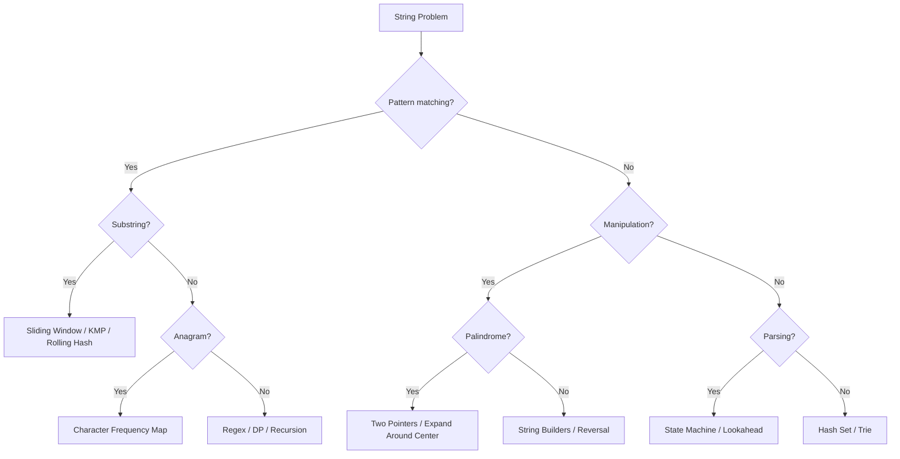
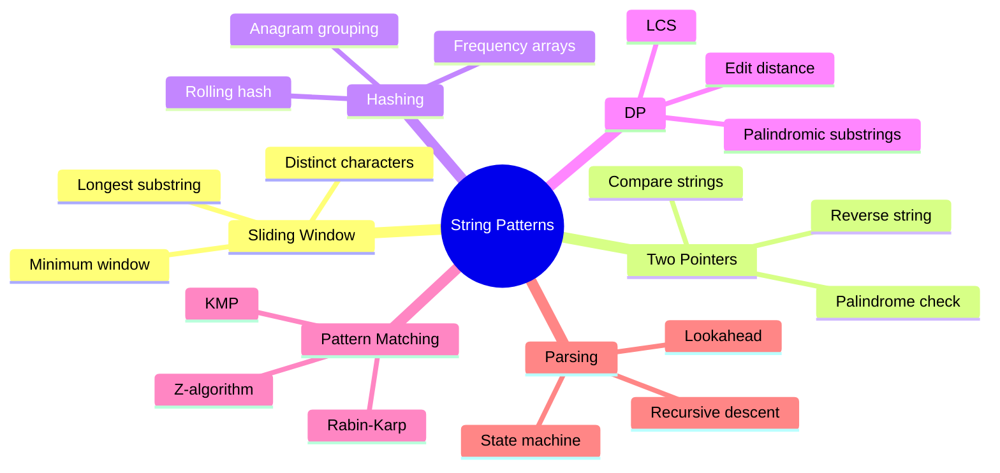
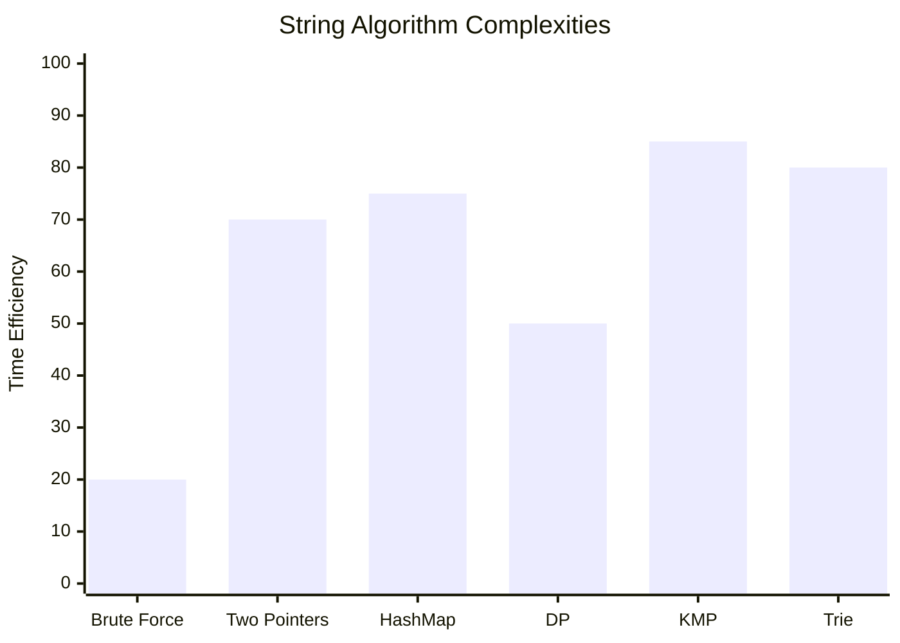

# Chapter 02: Strings

> String problems test your ability to work with character arrays, pattern matching, and text manipulation. They are among the most common problems in coding interviews.

## Learning Objectives

- Master string traversal, manipulation, and pattern matching techniques
- Understand sliding window variations for substring problems
- Implement efficient hashing strategies for anagram and pattern matching
- Handle Unicode, whitespace, and edge cases in string parsing
- Apply recursion and DP to string processing problems
## Problem Classification Flow



## String Algorithm Patterns



## Complexity Heatmap



---

## Easy Problems (8)

---

### Problem 1: Valid Palindrome

🏷️ **Companies:** [Amazon] [Google] [Meta] [Microsoft] [Apple]
📊 **Difficulty:** Easy
📂 **Topics:** [String, Two Pointers]
🧩 **Pattern:** Two Pointers
✅ **Best Option:** Two pointers skipping non-alphanumerics — O(n) time, O(1) space
❌ **Not Optimal:** Filter + reverse copy O(n) space — extra memory not required
🔗 **LeetCode:** [Valid Palindrome](https://leetcode.com/problems/valid-palindrome/)
🔗 **Related:** [Reverse String](02-strings.md#problem-4-reverse-string) · [Longest Palindromic Substring](02-strings.md#problem-10-longest-palindromic-substring) · [Container With Most Water](01-arrays.md#problem-13-container-with-most-water)

**Problem:** Given a string s, determine if it is a palindrome, considering only alphanumeric characters and ignoring cases.

**Example 1:**
```
Input: s = "A man, a plan, a canal: Panama"
Output: true
```

**Example 2:**
```
Input: s = "race a car"
Output: false
```

**Constraints:**
- 1 ≤ s.length ≤ 2 × 10⁵

**Solution Approach:**
- **Brute Force:** Filter string, then reverse and compare. Time O(n), Space O(n).
- **Optimal:** Two pointers from both ends, skip non-alphanumeric chars. Time O(n), Space O(1).

```typescript
function isPalindrome(s: string): boolean {
  let left = 0;
  let right = s.length - 1;

  while (left < right) {
    while (left < right && !/[a-zA-Z0-9]/.test(s[left])) left++;
    while (left < right && !/[a-zA-Z0-9]/.test(s[right])) right--;

    if (s[left].toLowerCase() !== s[right].toLowerCase()) return false;
    left++;
    right--;
  }

  return true;
}
```

**Test Cases:**
```typescript
console.log(isPalindrome("A man, a plan, a canal: Panama")); // true
console.log(isPalindrome("race a car")); // false
console.log(isPalindrome(" ")); // true
console.log(isPalindrome(".,")); // true
```

**Time Complexity:** O(n)
**Space Complexity:** O(1)

---

### Problem 2: Valid Anagram

🏷️ **Companies:** [Amazon] [Google] [Meta] [Microsoft]
📊 **Difficulty:** Easy
📂 **Topics:** [String, Hash Table, Sorting]
🧩 **Pattern:** Frequency Count, Hash Map
✅ **Best Option:** 26-slot count array — O(n) time, O(1) space
❌ **Not Optimal:** Sorting both strings O(n log n) — slower than a counting pass
🔗 **LeetCode:** [Valid Anagram](https://leetcode.com/problems/valid-anagram/)
🔗 **Related:** [Group Anagrams](02-strings.md#problem-11-group-anagrams) · [First Unique Character in a String](02-strings.md#problem-3-first-unique-character-in-a-string) · [Two Sum](01-arrays.md#problem-1-two-sum)

**Problem:** Given two strings s and t, return true if t is an anagram of s, false otherwise.

**Example 1:**
```
Input: s = "anagram", t = "nagaram"
Output: true
```

**Example 2:**
```
Input: s = "rat", t = "car"
Output: false
```

**Constraints:**
- 1 ≤ s.length, t.length ≤ 5 × 10⁴

**Solution Approach:**
- **Sorting:** Sort both strings and compare. Time O(n log n), Space O(n).
- **Optimal (Frequency Count):** Use array of 26 counts. Increment for s, decrement for t. Check all zero. Time O(n), Space O(1).

```typescript
function isAnagram(s: string, t: string): boolean {
  if (s.length !== t.length) return false;

  const counts = new Array(26).fill(0);

  for (let i = 0; i < s.length; i++) {
    counts[s.charCodeAt(i) - 97]++;
    counts[t.charCodeAt(i) - 97]--;
  }

  return counts.every(c => c === 0);
}
```

**Test Cases:**
```typescript
console.log(isAnagram("anagram", "nagaram")); // true
console.log(isAnagram("rat", "car")); // false
console.log(isAnagram("a", "a")); // true
```

**Time Complexity:** O(n)
**Space Complexity:** O(1)

---

### Problem 3: First Unique Character in a String

🏷️ **Companies:** [Amazon] [Google] [Microsoft] [Apple]
📊 **Difficulty:** Easy
📂 **Topics:** [String, Hash Table]
🧩 **Pattern:** Frequency Count, Hash Map
✅ **Best Option:** Two-pass frequency count — O(n) time, O(1) space
❌ **Not Optimal:** Nested loops O(n²) — fails for n up to 10⁵
🔗 **LeetCode:** [First Unique Character in a String](https://leetcode.com/problems/first-unique-character-in-a-string/)
🔗 **Related:** [Valid Anagram](02-strings.md#problem-2-valid-anagram) · [Longest Repeating Character Replacement](02-strings.md#problem-13-longest-repeating-character-replacement) · [Contains Duplicate](01-arrays.md#problem-5-contains-duplicate)

**Problem:** Given a string s, find the first non-repeating character and return its index. If none exists, return -1.

**Example 1:**
```
Input: s = "leetcode"
Output: 0
```

**Example 2:**
```
Input: s = "loveleetcode"
Output: 2
```

**Constraints:**
- 1 ≤ s.length ≤ 10⁵

**Solution Approach:**
- **Brute Force:** Nested loop checking duplicates. Time O(n²), Space O(1).
- **Optimal:** Count frequencies in first pass, find first with count 1 in second pass. Time O(n), Space O(1).

```typescript
function firstUniqChar(s: string): number {
  const freq = new Array(26).fill(0);

  for (const ch of s) {
    freq[ch.charCodeAt(0) - 97]++;
  }

  for (let i = 0; i < s.length; i++) {
    if (freq[s.charCodeAt(i) - 97] === 1) return i;
  }

  return -1;
}
```

**Test Cases:**
```typescript
console.log(firstUniqChar("leetcode")); // 0
console.log(firstUniqChar("loveleetcode")); // 2
console.log(firstUniqChar("aabb")); // -1
```

**Time Complexity:** O(n)
**Space Complexity:** O(1)

---

### Problem 4: Reverse String

🏷️ **Companies:** [Amazon] [Google] [Microsoft]
📊 **Difficulty:** Easy
📂 **Topics:** [String, Two Pointers]
🧩 **Pattern:** Two Pointers, In-place
✅ **Best Option:** Two pointers swapping ends — O(n) time, O(1) space
❌ **Not Optimal:** Reverse into a copy O(n) space — violates the in-place requirement
🔗 **LeetCode:** [Reverse String](https://leetcode.com/problems/reverse-string/)
🔗 **Related:** [Valid Palindrome](02-strings.md#problem-1-valid-palindrome) · [Reverse Words in a String](02-strings.md#problem-19-reverse-words-in-a-string) · [Move Zeroes](01-arrays.md#problem-4-move-zeroes)

**Problem:** Write a function that reverses a string in-place.

**Example 1:**
```
Input: s = ["h","e","l","l","o"]
Output: ["o","l","l","e","h"]
```

**Constraints:**
- 1 ≤ s.length ≤ 10⁵

```typescript
function reverseString(s: string[]): void {
  let left = 0;
  let right = s.length - 1;

  while (left < right) {
    [s[left], s[right]] = [s[right], s[left]];
    left++;
    right--;
  }
}
```

**Test Cases:**
```typescript
const s1 = ["h","e","l","l","o"];
reverseString(s1);
console.log(s1); // ["o","l","l","e","h"]

const s2 = ["H","a","n","n","a","h"];
reverseString(s2);
console.log(s2); // ["h","a","n","n","a","H"]
```

**Time Complexity:** O(n)
**Space Complexity:** O(1)

---

### Problem 5: Longest Common Prefix

🏷️ **Companies:** [Amazon] [Google] [Microsoft] [Meta]
📊 **Difficulty:** Easy
📂 **Topics:** [String, Trie]
🧩 **Pattern:** String Manipulation
✅ **Best Option:** Vertical scanning — O(n·m) time, O(1) space
❌ **Not Optimal:** Sorting strings first O(n log n · m) — sorting cost is unnecessary
🔗 **LeetCode:** [Longest Common Prefix](https://leetcode.com/problems/longest-common-prefix/)
🔗 **Related:** [Compare Version Numbers](02-strings.md#problem-20-compare-version-numbers) · [Implement strStr()](02-strings.md#problem-7-implement-strstr) · [Merge Intervals](01-arrays.md#problem-16-merge-intervals)

**Problem:** Write a function to find the longest common prefix string amongst an array of strings.

**Example 1:**
```
Input: strs = ["flower", "flow", "flight"]
Output: "fl"
```

**Constraints:**
- 1 ≤ strs.length ≤ 200
- 0 ≤ strs[i].length ≤ 200

**Solution Approach:**
- **Horizontal Scanning:** Start with first string as prefix, reduce for each next string.
- **Vertical Scanning:** Compare characters at same position across all strings.

```typescript
function longestCommonPrefix(strs: string[]): string {
  if (!strs.length) return "";

  for (let i = 0; i < strs[0].length; i++) {
    const char = strs[0][i];
    for (let j = 1; j < strs.length; j++) {
      if (i === strs[j].length || strs[j][i] !== char) {
        return strs[0].substring(0, i);
      }
    }
  }

  return strs[0];
}
```

**Test Cases:**
```typescript
console.log(longestCommonPrefix(["flower", "flow", "flight"])); // "fl"
console.log(longestCommonPrefix(["dog", "racecar", "car"])); // ""
console.log(longestCommonPrefix([""])); // ""
```

**Time Complexity:** O(n * m) where n = number of strings, m = length of prefix
**Space Complexity:** O(1)

---

### Problem 6: Valid Parentheses

🏷️ **Companies:** [Amazon] [Google] [Meta] [Microsoft] [Apple]
📊 **Difficulty:** Easy
📂 **Topics:** [String, Stack]
🧩 **Pattern:** String Manipulation, Hash Map
✅ **Best Option:** Stack + bracket map — O(n) time, O(n) space
❌ **Not Optimal:** Counting open/close only — fails ordering like "([)]"
🔗 **LeetCode:** [Valid Parentheses](https://leetcode.com/problems/valid-parentheses/)
🔗 **Related:** [Letter Combinations of a Phone Number](02-strings.md#problem-18-letter-combinations-of-a-phone-number) · [Wildcard Matching](02-strings.md#problem-25-wildcard-matching) · [Two Sum](01-arrays.md#problem-1-two-sum)

**Problem:** Given a string containing '(', ')', '{', '}', '[' and ']', determine if the input string is valid. Brackets must close in the correct order.

**Example 1:**
```
Input: s = "()[]{}"
Output: true
```

**Constraints:**
- 1 ≤ s.length ≤ 10⁴

```typescript
function isValid(s: string): boolean {
  const stack: string[] = [];
  const map: Record<string, string> = { ')': '(', '}': '{', ']': '[' };

  for (const ch of s) {
    if (ch === '(' || ch === '{' || ch === '[') {
      stack.push(ch);
    } else {
      if (stack.pop() !== map[ch]) return false;
    }
  }

  return stack.length === 0;
}
```

**Test Cases:**
```typescript
console.log(isValid("()")); // true
console.log(isValid("()[]{}")); // true
console.log(isValid("(]")); // false
console.log(isValid("([)]")); // false
```

**Time Complexity:** O(n)
**Space Complexity:** O(n)

---

### Problem 7: Implement strStr()

🏷️ **Companies:** [Amazon] [Google] [Microsoft] [Meta]
📊 **Difficulty:** Easy
📂 **Topics:** [String, Two Pointers, Pattern Matching]
🧩 **Pattern:** Two Pointers, Sliding Window
✅ **Best Option:** Sliding window compare — O(n·m) time, O(1) space
❌ **Not Optimal:** KMP O(n+m) — overkill for constraints n, m ≤ 10⁴
🔗 **LeetCode:** [Find the Index of the First Occurrence in a String](https://leetcode.com/problems/find-the-index-of-the-first-occurrence-in-a-string/)
🔗 **Related:** [Longest Common Prefix](02-strings.md#problem-5-longest-common-prefix) · [Longest Substring Without Repeating Characters](02-strings.md#problem-9-longest-substring-without-repeating-characters) · [First and Last Position of Element in Sorted Array](01-arrays.md#problem-22-first-and-last-position-of-element-in-sorted-array)

**Problem:** Return the index of the first occurrence of needle in haystack, or -1 if needle is not part of haystack.

**Example 1:**
```
Input: haystack = "hello", needle = "ll"
Output: 2
```

**Constraints:**
- 1 ≤ haystack.length, needle.length ≤ 10⁴

**Solution Approach:**
- **Brute Force:** Slide window and compare. Time O(n*m), Space O(1).
- **KMP:** O(n+m) using prefix function.

```typescript
function strStr(haystack: string, needle: string): number {
  if (needle.length === 0) return 0;

  for (let i = 0; i <= haystack.length - needle.length; i++) {
    let j = 0;
    while (j < needle.length && haystack[i + j] === needle[j]) {
      j++;
    }
    if (j === needle.length) return i;
  }

  return -1;
}
```

**Test Cases:**
```typescript
console.log(strStr("hello", "ll")); // 2
console.log(strStr("aaaaa", "bba")); // -1
console.log(strStr("", "")); // 0
```

**Time Complexity:** O(n*m) worst case
**Space Complexity:** O(1)

---

### Problem 8: Length of Last Word

🏷️ **Companies:** [Amazon] [Google] [Microsoft]
📊 **Difficulty:** Easy
📂 **Topics:** [String]
🧩 **Pattern:** String Manipulation, Two Pointers
✅ **Best Option:** Traverse from the end — O(n) time, O(1) space
❌ **Not Optimal:** Split + filter O(n) space — unnecessary allocation
🔗 **LeetCode:** [Length of Last Word](https://leetcode.com/problems/length-of-last-word/)
🔗 **Related:** [Reverse Words in a String](02-strings.md#problem-19-reverse-words-in-a-string) · [Compare Version Numbers](02-strings.md#problem-20-compare-version-numbers) · [Plus One](01-arrays.md#problem-10-plus-one)

**Problem:** Given a string s consisting of words and spaces, return the length of the last word in the string.

**Example 1:**
```
Input: s = "Hello World"
Output: 5
```

**Constraints:**
- 1 ≤ s.length ≤ 10⁴

```typescript
function lengthOfLastWord(s: string): number {
  let length = 0;
  let i = s.length - 1;

  while (i >= 0 && s[i] === ' ') i--;

  while (i >= 0 && s[i] !== ' ') {
    length++;
    i--;
  }

  return length;
}
```

**Test Cases:**
```typescript
console.log(lengthOfLastWord("Hello World")); // 5
console.log(lengthOfLastWord("   fly me   to   the moon  ")); // 4
console.log(lengthOfLastWord("a")); // 1
```

**Time Complexity:** O(n)
**Space Complexity:** O(1)

---

## Medium Problems (12)

---

### Problem 9: Longest Substring Without Repeating Characters

🏷️ **Companies:** [Amazon] [Google] [Meta] [Microsoft] [Apple]
📊 **Difficulty:** Medium
📂 **Topics:** [String, Sliding Window, Hash Table]
🧩 **Pattern:** Sliding Window, Hash Map
✅ **Best Option:** Sliding window + set — O(n) time, O(min(n,m)) space
❌ **Not Optimal:** Brute force O(n³) — fails for n up to 5 × 10⁴
🔗 **LeetCode:** [Longest Substring Without Repeating Characters](https://leetcode.com/problems/longest-substring-without-repeating-characters/)
🔗 **Related:** [Longest Repeating Character Replacement](02-strings.md#problem-13-longest-repeating-character-replacement) · [Minimum Window Substring](02-strings.md#problem-14-minimum-window-substring) · [Maximum Subarray](01-arrays.md#problem-3-maximum-subarray-kadanes-algorithm)

**Problem:** Given a string s, find the length of the longest substring without repeating characters.

**Example 1:**
```
Input: s = "abcabcbb"
Output: 3
Explanation: "abc" length 3.
```

**Constraints:**
- 0 ≤ s.length ≤ 5 × 10⁴

**Solution Approach:**
- **Brute Force:** Check all substrings. Time O(n³), Space O(min(n, m)).
- **Optimal (Sliding Window):** Expand right pointer, shrink left when duplicate found. Track max length. Time O(n), Space O(min(n, m)).

```typescript
function lengthOfLongestSubstring(s: string): number {
  const charSet = new Set<string>();
  let left = 0;
  let maxLen = 0;

  for (let right = 0; right < s.length; right++) {
    while (charSet.has(s[right])) {
      charSet.delete(s[left]);
      left++;
    }
    charSet.add(s[right]);
    maxLen = Math.max(maxLen, right - left + 1);
  }

  return maxLen;
}
```

**Test Cases:**
```typescript
console.log(lengthOfLongestSubstring("abcabcbb")); // 3
console.log(lengthOfLongestSubstring("bbbbb")); // 1
console.log(lengthOfLongestSubstring("pwwkew")); // 3
console.log(lengthOfLongestSubstring("")); // 0
```

**Time Complexity:** O(n)
**Space Complexity:** O(min(m, n))

---

### Problem 10: Longest Palindromic Substring

🏷️ **Companies:** [Amazon] [Google] [Meta] [Microsoft] [Apple]
📊 **Difficulty:** Medium
📂 **Topics:** [String, DP, Two Pointers]
🧩 **Pattern:** Two Pointers, Memoization
✅ **Best Option:** Expand around center — O(n²) time, O(1) space
❌ **Not Optimal:** Brute force O(n³) — fails for n up to 1000
🔗 **LeetCode:** [Longest Palindromic Substring](https://leetcode.com/problems/longest-palindromic-substring/)
🔗 **Related:** [Palindromic Substrings](02-strings.md#problem-15-palindromic-substrings) · [Valid Palindrome](02-strings.md#problem-1-valid-palindrome) · [Maximum Product Subarray](01-arrays.md#problem-20-maximum-product-subarray)

**Problem:** Given a string s, return the longest palindromic substring in s.

**Example 1:**
```
Input: s = "babad"
Output: "bab" or "aba"
```

**Constraints:**
- 1 ≤ s.length ≤ 1000

**Solution Approach:**
- **Brute Force:** Check all substrings. Time O(n³), Space O(1).
- **DP:** Table[i][j] = true if substring i..j is palindrome. O(n²) time and space.
- **Optimal (Expand Around Center):** For each position, expand outward treating it as center. Handle odd (1 char) and even (2 char) centers. Time O(n²), Space O(1).

```typescript
function longestPalindrome(s: string): string {
  if (s.length < 2) return s;

  let start = 0;
  let maxLen = 1;

  const expandAroundCenter = (left: number, right: number) => {
    while (left >= 0 && right < s.length && s[left] === s[right]) {
      const currLen = right - left + 1;
      if (currLen > maxLen) {
        maxLen = currLen;
        start = left;
      }
      left--;
      right++;
    }
  };

  for (let i = 0; i < s.length; i++) {
    expandAroundCenter(i, i);     // odd
    expandAroundCenter(i, i + 1); // even
  }

  return s.substring(start, start + maxLen);
}
```

**Test Cases:**
```typescript
console.log(longestPalindrome("babad")); // "bab" or "aba"
console.log(longestPalindrome("cbbd")); // "bb"
console.log(longestPalindrome("a")); // "a"
```

**Time Complexity:** O(n²)
**Space Complexity:** O(1)

---

### Problem 11: Group Anagrams

🏷️ **Companies:** [Amazon] [Google] [Meta] [Microsoft] [Apple]
📊 **Difficulty:** Medium
📂 **Topics:** [String, Hash Table, Sorting]
🧩 **Pattern:** Hash Map, Sorting
✅ **Best Option:** Sorted-key hash map — O(n·k log k) time, O(n·k) space
❌ **Not Optimal:** Compare every pair O(n²·k) — fails for n up to 10⁴
🔗 **LeetCode:** [Group Anagrams](https://leetcode.com/problems/group-anagrams/)
🔗 **Related:** [Valid Anagram](02-strings.md#problem-2-valid-anagram) · [First Unique Character in a String](02-strings.md#problem-3-first-unique-character-in-a-string) · [Two Sum](01-arrays.md#problem-1-two-sum)

**Problem:** Given an array of strings strs, group the anagrams together.

**Example 1:**
```
Input: strs = ["eat", "tea", "tan", "ate", "nat", "bat"]
Output: [["bat"], ["nat", "tan"], ["ate", "eat", "tea"]]
```

**Constraints:**
- 1 ≤ strs.length ≤ 10⁴
- 0 ≤ strs[i].length ≤ 100

**Solution Approach:**
- **Sorting Key:** Sort each string, use as key in map. Time O(n * k log k), Space O(n*k).
- **Count Key:** Use char frequency as key. Time O(n * k), Space O(n*k).

```typescript
function groupAnagrams(strs: string[]): string[][] {
  const map = new Map<string, string[]>();

  for (const str of strs) {
    const key = str.split('').sort().join('');
    if (!map.has(key)) map.set(key, []);
    map.get(key)!.push(str);
  }

  return Array.from(map.values());
}
```

**Test Cases:**
```typescript
console.log(groupAnagrams(["eat", "tea", "tan", "ate", "nat", "bat"]));
// [["bat"], ["nat", "tan"], ["ate", "eat", "tea"]]
console.log(groupAnagrams([""])); // [[""]]
console.log(groupAnagrams(["a"])); // [["a"]]
```

**Time Complexity:** O(n * k log k)
**Space Complexity:** O(n * k)

---

### Problem 12: String to Integer (atoi)

🏷️ **Companies:** [Amazon] [Google] [Microsoft] [Meta]
📊 **Difficulty:** Medium
📂 **Topics:** [String, Math]
🧩 **Pattern:** String Manipulation
✅ **Best Option:** State-machine scan — O(n) time, O(1) space
❌ **Not Optimal:** Built-in parseInt — ignores whitespace, sign and clamp rules
🔗 **LeetCode:** [String to Integer (atoi)](https://leetcode.com/problems/string-to-integer-atoi/)
🔗 **Related:** [Compare Version Numbers](02-strings.md#problem-20-compare-version-numbers) · [Length of Last Word](02-strings.md#problem-8-length-of-last-word) · [Plus One](01-arrays.md#problem-10-plus-one)

**Problem:** Implement the myAtoi(string s) function, which converts a string to a 32-bit signed integer.

**Example 1:**
```
Input: s = "42"
Output: 42
```

**Example 2:**
```
Input: s = "   -42"
Output: -42
```

**Constraints:**
- 0 ≤ s.length ≤ 200

**Solution Approach:**
- Skip leading whitespace, handle sign, read digits, clamp to [−2³¹, 2³¹−1].

```typescript
function myAtoi(s: string): number {
  let i = 0;
  let sign = 1;
  let result = 0;

  while (i < s.length && s[i] === ' ') i++;

  if (i < s.length && (s[i] === '+' || s[i] === '-')) {
    sign = s[i] === '-' ? -1 : 1;
    i++;
  }

  while (i < s.length && s[i] >= '0' && s[i] <= '9') {
    const digit = s.charCodeAt(i) - 48;
    if (result > Math.floor((2**31 - 1) / 10) ||
       (result === Math.floor((2**31 - 1) / 10) && digit > 7)) {
      return sign === 1 ? 2**31 - 1 : -(2**31);
    }
    result = result * 10 + digit;
    i++;
  }

  return result * sign;
}
```

**Test Cases:**
```typescript
console.log(myAtoi("42")); // 42
console.log(myAtoi("   -42")); // -42
console.log(myAtoi("4193 with words")); // 4193
console.log(myAtoi("words and 987")); // 0
console.log(myAtoi("-91283472332")); // -2147483648
```

**Time Complexity:** O(n)
**Space Complexity:** O(1)

---

### Problem 13: Longest Repeating Character Replacement

🏷️ **Companies:** [Amazon] [Google] [Meta] [Microsoft]
📊 **Difficulty:** Medium
📂 **Topics:** [String, Sliding Window]
🧩 **Pattern:** Sliding Window, Frequency Count
✅ **Best Option:** Sliding window + max frequency — O(n) time, O(1) space
❌ **Not Optimal:** Brute force O(n²) — fails for n up to 10⁵
🔗 **LeetCode:** [Longest Repeating Character Replacement](https://leetcode.com/problems/longest-repeating-character-replacement/)
🔗 **Related:** [Longest Substring Without Repeating Characters](02-strings.md#problem-9-longest-substring-without-repeating-characters) · [Minimum Window Substring](02-strings.md#problem-14-minimum-window-substring) · [Subarray Sum Equals K](01-arrays.md#problem-15-subarray-sum-equals-k)

**Problem:** Given a string s and an integer k, find the length of the longest substring that can be obtained by replacing at most k characters to make all characters same.

**Example 1:**
```
Input: s = "ABAB", k = 2
Output: 4
```

**Constraints:**
- 1 ≤ s.length ≤ 10⁵
- 0 ≤ k ≤ s.length

**Solution Approach:**
- Sliding window with frequency tracking. Valid window when (window size - max freq) ≤ k.

```typescript
function characterReplacement(s: string, k: number): number {
  const freq = new Array(26).fill(0);
  let left = 0;
  let maxFreq = 0;
  let maxLen = 0;

  for (let right = 0; right < s.length; right++) {
    const idx = s.charCodeAt(right) - 65;
    freq[idx]++;
    maxFreq = Math.max(maxFreq, freq[idx]);

    while (right - left + 1 - maxFreq > k) {
      freq[s.charCodeAt(left) - 65]--;
      left++;
    }

    maxLen = Math.max(maxLen, right - left + 1);
  }

  return maxLen;
}
```

**Test Cases:**
```typescript
console.log(characterReplacement("ABAB", 2)); // 4
console.log(characterReplacement("AABABBA", 1)); // 4
console.log(characterReplacement("AAAA", 0)); // 4
```

**Time Complexity:** O(n)
**Space Complexity:** O(1)

---

### Problem 14: Minimum Window Substring

🏷️ **Companies:** [Amazon] [Google] [Meta] [Microsoft] [Apple]
📊 **Difficulty:** Medium
📂 **Topics:** [String, Sliding Window, Hash Table]
🧩 **Pattern:** Sliding Window, Hash Map
✅ **Best Option:** Sliding window + two maps — O(n) time, O(m) space
❌ **Not Optimal:** Brute force all substrings O(n²) — fails for n up to 10⁵
🔗 **LeetCode:** [Minimum Window Substring](https://leetcode.com/problems/minimum-window-substring/)
🔗 **Related:** [Longest Substring Without Repeating Characters](02-strings.md#problem-9-longest-substring-without-repeating-characters) · [Longest Repeating Character Replacement](02-strings.md#problem-13-longest-repeating-character-replacement) · [Subarray Sum Equals K](01-arrays.md#problem-15-subarray-sum-equals-k)

**Problem:** Given two strings s and t, return the minimum window substring of s that contains all characters of t.

**Example 1:**
```
Input: s = "ADOBECODEBANC", t = "ABC"
Output: "BANC"
```

**Constraints:**
- 1 ≤ s.length, t.length ≤ 10⁵

**Solution Approach:**
- Sliding window with two frequency maps. Expand right, when window valid, shrink left to find minimum.

```typescript
function minWindow(s: string, t: string): string {
  const need = new Map<string, number>();
  const have = new Map<string, number>();

  for (const ch of t) {
    need.set(ch, (need.get(ch) || 0) + 1);
  }

  let left = 0;
  let minLen = Infinity;
  let minStart = 0;
  let required = need.size;
  let formed = 0;

  for (let right = 0; right < s.length; right++) {
    const ch = s[right];
    have.set(ch, (have.get(ch) || 0) + 1);

    if (need.has(ch) && have.get(ch) === need.get(ch)) {
      formed++;
    }

    while (formed === required && left <= right) {
      if (right - left + 1 < minLen) {
        minLen = right - left + 1;
        minStart = left;
      }

      const leftChar = s[left];
      have.set(leftChar, have.get(leftChar)! - 1);
      if (need.has(leftChar) && have.get(leftChar)! < need.get(leftChar)!) {
        formed--;
      }
      left++;
    }
  }

  return minLen === Infinity ? "" : s.substring(minStart, minStart + minLen);
}
```

**Test Cases:**
```typescript
console.log(minWindow("ADOBECODEBANC", "ABC")); // "BANC"
console.log(minWindow("a", "a")); // "a"
console.log(minWindow("a", "aa")); // ""
```

**Time Complexity:** O(n)
**Space Complexity:** O(m) where m is unique chars

---

### Problem 15: Palindromic Substrings

🏷️ **Companies:** [Amazon] [Google] [Meta] [Microsoft]
📊 **Difficulty:** Medium
📂 **Topics:** [String, DP, Two Pointers]
🧩 **Pattern:** Two Pointers
✅ **Best Option:** Expand around center — O(n²) time, O(1) space
❌ **Not Optimal:** Brute force O(n³) — fails for n up to 1000
🔗 **LeetCode:** [Palindromic Substrings](https://leetcode.com/problems/palindromic-substrings/)
🔗 **Related:** [Longest Palindromic Substring](02-strings.md#problem-10-longest-palindromic-substring) · [Valid Palindrome](02-strings.md#problem-1-valid-palindrome) · [Trapping Rain Water](01-arrays.md#problem-27-trapping-rain-water)

**Problem:** Count how many palindromic substrings exist in a given string.

**Example 1:**
```
Input: s = "abc"
Output: 3
Explanation: "a", "b", "c"
```

**Constraints:**
- 1 ≤ s.length ≤ 1000

**Solution Approach:**
- Expand around each center (including between chars). Count palindromes.

```typescript
function countSubstrings(s: string): number {
  let count = 0;

  const expand = (left: number, right: number) => {
    while (left >= 0 && right < s.length && s[left] === s[right]) {
      count++;
      left--;
      right++;
    }
  };

  for (let i = 0; i < s.length; i++) {
    expand(i, i);     // odd
    expand(i, i + 1); // even
  }

  return count;
}
```

**Test Cases:**
```typescript
console.log(countSubstrings("abc")); // 3
console.log(countSubstrings("aaa")); // 6
console.log(countSubstrings("")); // 0
```

**Time Complexity:** O(n²)
**Space Complexity:** O(1)

---

### Problem 16: Encode and Decode Strings

🏷️ **Companies:** [Amazon] [Google] [Meta]
📊 **Difficulty:** Medium
📂 **Topics:** [String, Design]
🧩 **Pattern:** String Manipulation, In-place
✅ **Best Option:** Length-prefix encoding — O(n) time, O(n) space
❌ **Not Optimal:** Delimiter-only encoding — fails when strings contain the delimiter
🔗 **LeetCode:** [Encode and Decode Strings](https://leetcode.com/problems/encode-and-decode-strings/)
🔗 **Related:** [String to Integer (atoi)](02-strings.md#problem-12-string-to-integer-atoi) · [Compare Version Numbers](02-strings.md#problem-20-compare-version-numbers) · [Rotate Array](01-arrays.md#problem-19-rotate-array)

**Problem:** Design an algorithm to encode a list of strings to a single string and decode it back.

**Example 1:**
```
Input: ["hello", "world"]
Output (encoded): "5#hello5#world"
```

**Solution Approach:**
- Use length + delimiter encoding to handle any characters.

```typescript
function encode(strs: string[]): string {
  return strs.map(s => `${s.length}#${s}`).join('');
}

function decode(s: string): string[] {
  const result: string[] = [];
  let i = 0;

  while (i < s.length) {
    let j = i;
    while (s[j] !== '#') j++;
    const len = parseInt(s.substring(i, j));
    result.push(s.substring(j + 1, j + 1 + len));
    i = j + 1 + len;
  }

  return result;
}
```

**Test Cases:**
```typescript
const original = ["hello", "world", "test#1"];
const encoded = encode(original);
console.log(encoded); // "5#hello5#world6#test#1"
console.log(decode(encoded)); // ["hello", "world", "test#1"]
```

**Time Complexity:** O(n)
**Space Complexity:** O(n)

---

### Problem 17: Longest Substring with At Least K Repeating Characters

🏷️ **Companies:** [Amazon] [Google] [Microsoft]
📊 **Difficulty:** Medium
📂 **Topics:** [String, Divide and Conquer, Sliding Window]
🧩 **Pattern:** Sliding Window, Frequency Count
✅ **Best Option:** Sliding window per unique-count — O(26n) time, O(1) space
❌ **Not Optimal:** Brute force O(n²) — fails for n up to 10⁴
🔗 **LeetCode:** [Longest Substring with At Least K Repeating Characters](https://leetcode.com/problems/longest-substring-with-at-least-k-repeating-characters/)
🔗 **Related:** [Longest Repeating Character Replacement](02-strings.md#problem-13-longest-repeating-character-replacement) · [Longest Substring Without Repeating Characters](02-strings.md#problem-9-longest-substring-without-repeating-characters) · [First Missing Positive](01-arrays.md#problem-26-first-missing-positive)

**Problem:** Find the length of the longest substring such that each character appears at least k times.

**Example 1:**
```
Input: s = "aaabb", k = 3
Output: 3
Explanation: "aaa"
```

**Constraints:**
- 1 ≤ s.length ≤ 10⁴

**Solution Approach:**
- **Divide and Conquer:** Split at characters with frequency < k. Recurse on substrings.
- **Sliding Window:** Try all 26 possible unique character counts.

```typescript
function longestSubstring(s: string, k: number): number {
  const freq = new Array(26).fill(0);
  for (const ch of s) freq[ch.charCodeAt(0) - 97]++;

  let splitChar = '';
  for (let i = 0; i < 26; i++) {
    if (freq[i] > 0 && freq[i] < k) {
      splitChar = String.fromCharCode(i + 97);
      break;
    }
  }

  if (!splitChar) return s.length;

  const parts = s.split(splitChar);
  return Math.max(...parts.map(part => longestSubstring(part, k)));
}
```

**Test Cases:**
```typescript
console.log(longestSubstring("aaabb", 3)); // 3
console.log(longestSubstring("ababbc", 2)); // 5
console.log(longestSubstring("ababacb", 3)); // 0
```

**Time Complexity:** O(n * 26)
**Space Complexity:** O(n)

---

### Problem 18: Letter Combinations of a Phone Number

🏷️ **Companies:** [Amazon] [Google] [Meta] [Microsoft]
📊 **Difficulty:** Medium
📂 **Topics:** [String, Backtracking]
🧩 **Pattern:** String Manipulation, Memoization
✅ **Best Option:** Backtracking recursion — O(4ⁿ) time, O(n) space
❌ **Not Optimal:** Hard-coded nested loops — depth is fixed and breaks if digits grow
🔗 **LeetCode:** [Letter Combinations of a Phone Number](https://leetcode.com/problems/letter-combinations-of-a-phone-number/)
🔗 **Related:** [Wildcard Matching](02-strings.md#problem-25-wildcard-matching) · [Regular Expression Matching](02-strings.md#problem-21-regular-expression-matching) · [Three Sum](01-arrays.md#problem-11-three-sum)

**Problem:** Given a string containing digits 2-9, return all possible letter combinations that the number could represent.

**Example 1:**
```
Input: digits = "23"
Output: ["ad", "ae", "af", "bd", "be", "bf", "cd", "ce", "cf"]
```

**Constraints:**
- 0 ≤ digits.length ≤ 4

```typescript
function letterCombinations(digits: string): string[] {
  if (!digits) return [];

  const map: Record<string, string> = {
    '2': 'abc', '3': 'def', '4': 'ghi', '5': 'jkl',
    '6': 'mno', '7': 'pqrs', '8': 'tuv', '9': 'wxyz'
  };

  const result: string[] = [];

  const backtrack = (idx: number, current: string) => {
    if (idx === digits.length) {
      result.push(current);
      return;
    }

    for (const ch of map[digits[idx]]) {
      backtrack(idx + 1, current + ch);
    }
  };

  backtrack(0, '');
  return result;
}
```

**Test Cases:**
```typescript
console.log(letterCombinations("23"));
// ["ad", "ae", "af", "bd", "be", "bf", "cd", "ce", "cf"]
console.log(letterCombinations("")); // []
console.log(letterCombinations("2")); // ["a", "b", "c"]
```

**Time Complexity:** O(4^n)
**Space Complexity:** O(n)

---

### Problem 19: Reverse Words in a String

🏷️ **Companies:** [Amazon] [Google] [Microsoft] [Meta]
📊 **Difficulty:** Medium
📂 **Topics:** [String, Two Pointers]
🧩 **Pattern:** Two Pointers, In-place
✅ **Best Option:** Split + reverse join — O(n) time, O(n) space
❌ **Not Optimal:** Split on single space — mishandles leading/multiple spaces without extra filtering
🔗 **LeetCode:** [Reverse Words in a String](https://leetcode.com/problems/reverse-words-in-a-string/)
🔗 **Related:** [Reverse String](02-strings.md#problem-4-reverse-string) · [Length of Last Word](02-strings.md#problem-8-length-of-last-word) · [Rotate Array](01-arrays.md#problem-19-rotate-array)

**Problem:** Given a string s, reverse the order of words.

**Example 1:**
```
Input: s = "the sky is blue"
Output: "blue is sky the"
```

**Constraints:**
- 1 ≤ s.length ≤ 10⁴

```typescript
function reverseWords(s: string): string {
  const words = s.trim().split(/\s+/);
  return words.reverse().join(' ');
}
```

**Test Cases:**
```typescript
console.log(reverseWords("the sky is blue")); // "blue is sky the"
console.log(reverseWords("  hello world  ")); // "world hello"
console.log(reverseWords("a good   example")); // "example good a"
```

**Time Complexity:** O(n)
**Space Complexity:** O(n)

---

### Problem 20: Compare Version Numbers

🏷️ **Companies:** [Amazon] [Google] [Microsoft]
📊 **Difficulty:** Medium
📂 **Topics:** [String, Two Pointers]
🧩 **Pattern:** Two Pointers, String Manipulation
✅ **Best Option:** Split + zero-pad compare — O(n+m) time, O(n+m) space
❌ **Not Optimal:** Parse as floats — precision loss and "1.0" vs "1.0.0" mismatch
🔗 **LeetCode:** [Compare Version Numbers](https://leetcode.com/problems/compare-version-numbers/)
🔗 **Related:** [String to Integer (atoi)](02-strings.md#problem-12-string-to-integer-atoi) · [Length of Last Word](02-strings.md#problem-8-length-of-last-word) · [Merge Intervals](01-arrays.md#problem-16-merge-intervals)

**Problem:** Compare two version numbers (e.g., "1.01" vs "1.001"). Return 1 if v1 > v2, -1 if v1 < v2, 0 if equal.

**Example 1:**
```
Input: version1 = "1.01", version2 = "1.001"
Output: 0
```

```typescript
function compareVersion(version1: string, version2: string): number {
  const v1 = version1.split('.').map(Number);
  const v2 = version2.split('.').map(Number);
  const maxLen = Math.max(v1.length, v2.length);

  for (let i = 0; i < maxLen; i++) {
    const num1 = v1[i] || 0;
    const num2 = v2[i] || 0;
    if (num1 > num2) return 1;
    if (num1 < num2) return -1;
  }

  return 0;
}
```

**Test Cases:**
```typescript
console.log(compareVersion("1.01", "1.001")); // 0
console.log(compareVersion("1.0", "1.0.0")); // 0
console.log(compareVersion("0.1", "1.1")); // -1
```

**Time Complexity:** O(n + m)
**Space Complexity:** O(n + m)

---

## Hard Problems (5)

---

### Problem 21: Regular Expression Matching

🏷️ **Companies:** [Amazon] [Google] [Meta] [Microsoft] [Apple]
📊 **Difficulty:** Hard
📂 **Topics:** [String, DP, Backtracking]
🧩 **Pattern:** Memoization
✅ **Best Option:** DP table — O(m·n) time, O(m·n) space
❌ **Not Optimal:** Naive recursive backtracking — exponential without memoization
🔗 **LeetCode:** [Regular Expression Matching](https://leetcode.com/problems/regular-expression-matching/)
🔗 **Related:** [Wildcard Matching](02-strings.md#problem-25-wildcard-matching) · [Edit Distance](02-strings.md#problem-22-edit-distance) · [Maximum Product Subarray](01-arrays.md#problem-20-maximum-product-subarray)

**Problem:** Implement regular expression matching with support for '.' and '*'.

**Example 1:**
```
Input: s = "aa", p = "a*"
Output: true
```

**Constraints:**
- 1 ≤ s.length ≤ 20
- 1 ≤ p.length ≤ 30

**Solution Approach:**
- **DP:** dp[i][j] matches s[0..i-1] with p[0..j-1].

```typescript
function isMatch(s: string, p: string): boolean {
  const dp: boolean[][] = Array.from({ length: s.length + 1 }, () =>
    new Array(p.length + 1).fill(false)
  );
  dp[0][0] = true;

  for (let j = 2; j <= p.length; j++) {
    if (p[j - 1] === '*') dp[0][j] = dp[0][j - 2];
  }

  for (let i = 1; i <= s.length; i++) {
    for (let j = 1; j <= p.length; j++) {
      if (p[j - 1] === '.' || p[j - 1] === s[i - 1]) {
        dp[i][j] = dp[i - 1][j - 1];
      } else if (p[j - 1] === '*') {
        dp[i][j] = dp[i][j - 2] ||
          ((p[j - 2] === '.' || p[j - 2] === s[i - 1]) && dp[i - 1][j]);
      }
    }
  }

  return dp[s.length][p.length];
}
```

**Test Cases:**
```typescript
console.log(isMatch("aa", "a*")); // true
console.log(isMatch("mississippi", "mis*is*p*.")); // false
console.log(isMatch("ab", ".*")); // true
```

**Time Complexity:** O(m * n)
**Space Complexity:** O(m * n)

---

### Problem 22: Edit Distance

🏷️ **Companies:** [Amazon] [Google] [Microsoft] [Meta]
📊 **Difficulty:** Hard
📂 **Topics:** [String, DP]
🧩 **Pattern:** Memoization
✅ **Best Option:** DP table — O(m·n) time, O(m·n) space
❌ **Not Optimal:** Recursion without memo O(3ⁿ) — exponential branching
🔗 **LeetCode:** [Edit Distance](https://leetcode.com/problems/edit-distance/)
🔗 **Related:** [Regular Expression Matching](02-strings.md#problem-21-regular-expression-matching) · [Distinct Subsequences](02-strings.md#problem-23-distinct-subsequences) · [Maximum Product Subarray](01-arrays.md#problem-20-maximum-product-subarray)

**Problem:** Given two strings, return minimum edit operations (insert, delete, replace) to convert word1 to word2.

**Example 1:**
```
Input: word1 = "horse", word2 = "ros"
Output: 3
```

**Constraints:**
- 0 ≤ word1.length, word2.length ≤ 500

**Solution Approach:**
- Classic DP: dp[i][j] = min(dp[i-1][j]+1, dp[i][j-1]+1, dp[i-1][j-1]+cost).

```typescript
function minDistance(word1: string, word2: string): number {
  const m = word1.length;
  const n = word2.length;
  const dp: number[][] = Array.from({ length: m + 1 }, () =>
    new Array(n + 1).fill(0)
  );

  for (let i = 1; i <= m; i++) dp[i][0] = i;
  for (let j = 1; j <= n; j++) dp[0][j] = j;

  for (let i = 1; i <= m; i++) {
    for (let j = 1; j <= n; j++) {
      if (word1[i - 1] === word2[j - 1]) {
        dp[i][j] = dp[i - 1][j - 1];
      } else {
        dp[i][j] = 1 + Math.min(
          dp[i - 1][j],     // delete
          dp[i][j - 1],     // insert
          dp[i - 1][j - 1]  // replace
        );
      }
    }
  }

  return dp[m][n];
}
```

**Test Cases:**
```typescript
console.log(minDistance("horse", "ros")); // 3
console.log(minDistance("intention", "execution")); // 5
console.log(minDistance("", "a")); // 1
```

**Time Complexity:** O(m * n)
**Space Complexity:** O(m * n) — can be optimized to O(min(m, n))

---

### Problem 23: Distinct Subsequences

🏷️ **Companies:** [Amazon] [Google] [Meta]
📊 **Difficulty:** Hard
📂 **Topics:** [String, DP]
🧩 **Pattern:** Memoization
✅ **Best Option:** DP table — O(m·n) time, O(m·n) space
❌ **Not Optimal:** Enumerate subsequences O(2ᵐ) — fails for s up to 1000
🔗 **LeetCode:** [Distinct Subsequences](https://leetcode.com/problems/distinct-subsequences/)
🔗 **Related:** [Edit Distance](02-strings.md#problem-22-edit-distance) · [Wildcard Matching](02-strings.md#problem-25-wildcard-matching) · [Count of Smaller Numbers After Self](01-arrays.md#problem-30-count-of-smaller-numbers-after-self)

**Problem:** Given two strings s and t, count the number of distinct subsequences of s that equal t.

**Example 1:**
```
Input: s = "rabbbit", t = "rabbit"
Output: 3
```

**Constraints:**
- 1 ≤ s.length, t.length ≤ 1000

```typescript
function numDistinct(s: string, t: string): number {
  const m = s.length;
  const n = t.length;
  const dp: number[][] = Array.from({ length: m + 1 }, () =>
    new Array(n + 1).fill(0)
  );

  for (let i = 0; i <= m; i++) dp[i][0] = 1;

  for (let i = 1; i <= m; i++) {
    for (let j = 1; j <= n; j++) {
      dp[i][j] = dp[i - 1][j];
      if (s[i - 1] === t[j - 1]) {
        dp[i][j] += dp[i - 1][j - 1];
      }
    }
  }

  return dp[m][n];
}
```

**Test Cases:**
```typescript
console.log(numDistinct("rabbbit", "rabbit")); // 3
console.log(numDistinct("babgbag", "bag")); // 5
```

**Time Complexity:** O(m * n)
**Space Complexity:** O(m * n)

---

### Problem 24: Text Justification

🏷️ **Companies:** [Amazon] [Google] [Meta] [Microsoft]
📊 **Difficulty:** Hard
📂 **Topics:** [String, Simulation]
🧩 **Pattern:** Greedy, String Manipulation
✅ **Best Option:** Greedy line packing — O(n·L) time, O(n) space
❌ **Not Optimal:** Fixed-width chunking — breaks justification rules and single-word overflow
🔗 **LeetCode:** [Text Justification](https://leetcode.com/problems/text-justification/)
🔗 **Related:** [Reverse Words in a String](02-strings.md#problem-19-reverse-words-in-a-string) · [Length of Last Word](02-strings.md#problem-8-length-of-last-word) · [Merge Intervals](01-arrays.md#problem-16-merge-intervals)

**Problem:** Given an array of words and a maxWidth, format the text such that each line has exactly maxWidth characters, fully justified.

**Example 1:**
```
Input: words = ["This", "is", "an", "example", "of", "text", "justification."], maxWidth = 16
Output: [
   "This    is    an",
   "example  of text",
   "justification.  "
]
```

**Constraints:**
- 1 ≤ words.length ≤ 300
- 1 ≤ words[i].length ≤ 20

```typescript
function fullJustify(words: string[], maxWidth: number): string[] {
  const result: string[] = [];
  let i = 0;

  while (i < words.length) {
    let j = i;
    let lineLen = 0;

    while (j < words.length && lineLen + words[j].length + (j - i) <= maxWidth) {
      lineLen += words[j].length;
      j++;
    }

    const numWords = j - i;
    const numSpaces = maxWidth - lineLen;

    if (numWords === 1 || j === words.length) {
      let line = words.slice(i, j).join(' ');
      line += ' '.repeat(maxWidth - line.length);
      result.push(line);
    } else {
      const spacesBetween = Math.floor(numSpaces / (numWords - 1));
      const extraSpaces = numSpaces % (numWords - 1);
      let line = '';

      for (let k = i; k < j; k++) {
        line += words[k];
        if (k < j - 1) {
          line += ' '.repeat(spacesBetween + (k - i < extraSpaces ? 1 : 0));
        }
      }
      result.push(line);
    }

    i = j;
  }

  return result;
}
```

**Test Cases:**
```typescript
const words = ["This", "is", "an", "example", "of", "text", "justification."];
console.log(fullJustify(words, 16));
// ["This    is    an", "example  of text", "justification.  "]
```

**Time Complexity:** O(n * L) where L is maxWidth
**Space Complexity:** O(n)

---

### Problem 25: Wildcard Matching

🏷️ **Companies:** [Amazon] [Google] [Meta] [Microsoft]
📊 **Difficulty:** Hard
📂 **Topics:** [String, DP, Greedy]
🧩 **Pattern:** Memoization, Greedy
✅ **Best Option:** DP table — O(m·n) time, O(m·n) space
❌ **Not Optimal:** Recursive backtracking O(2ⁿ) — fails for lengths up to 2000
🔗 **LeetCode:** [Wildcard Matching](https://leetcode.com/problems/wildcard-matching/)
🔗 **Related:** [Regular Expression Matching](02-strings.md#problem-21-regular-expression-matching) · [Edit Distance](02-strings.md#problem-22-edit-distance) · [Jump Game II](01-arrays.md#problem-24-jump-game-ii)

**Problem:** Implement wildcard pattern matching with support for '?' (any single char) and '*' (any sequence including empty).

**Example 1:**
```
Input: s = "aa", p = "*"
Output: true
```

**Constraints:**
- 0 ≤ s.length, p.length ≤ 2000

```typescript
function isMatchWildcard(s: string, p: string): boolean {
  const dp: boolean[][] = Array.from({ length: s.length + 1 }, () =>
    new Array(p.length + 1).fill(false)
  );
  dp[0][0] = true;

  for (let j = 1; j <= p.length; j++) {
    if (p[j - 1] === '*') dp[0][j] = dp[0][j - 1];
  }

  for (let i = 1; i <= s.length; i++) {
    for (let j = 1; j <= p.length; j++) {
      if (p[j - 1] === '?' || p[j - 1] === s[i - 1]) {
        dp[i][j] = dp[i - 1][j - 1];
      } else if (p[j - 1] === '*') {
        dp[i][j] = dp[i - 1][j] || dp[i][j - 1];
      }
    }
  }

  return dp[s.length][p.length];
}
```

**Test Cases:**
```typescript
console.log(isMatchWildcard("aa", "*")); // true
console.log(isMatchWildcard("cb", "?a")); // false
console.log(isMatchWildcard("adceb", "*a*b")); // true
```

**Time Complexity:** O(m * n)
**Space Complexity:** O(m * n)

---

## Summary Table

| # | Problem | Difficulty | Companies | Time | Space |
|---|---------|-----------|-----------|------|-------|
| 1 | Valid Palindrome | Easy | Multiple | O(n) | O(1) |
| 2 | Valid Anagram | Easy | Multiple | O(n) | O(1) |
| 3 | First Unique Character | Easy | Amazon, Google, Microsoft | O(n) | O(1) |
| 4 | Reverse String | Easy | Amazon, Google, Microsoft | O(n) | O(1) |
| 5 | Longest Common Prefix | Easy | Amazon, Google, Microsoft | O(n*m) | O(1) |
| 6 | Valid Parentheses | Easy | Multiple | O(n) | O(n) |
| 7 | Implement strStr() | Easy | Amazon, Google, Microsoft | O(n*m) | O(1) |
| 8 | Length of Last Word | Easy | Amazon, Google, Microsoft | O(n) | O(1) |
| 9 | Longest Substring Without Repeating | Medium | Multiple | O(n) | O(k) |
| 10 | Longest Palindromic Substring | Medium | Multiple | O(n²) | O(1) |
| 11 | Group Anagrams | Medium | Multiple | O(n*k log k) | O(n*k) |
| 12 | String to Integer (atoi) | Medium | Amazon, Google, Microsoft | O(n) | O(1) |
| 13 | Longest Repeating Char Replacement | Medium | Amazon, Google, Meta | O(n) | O(1) |
| 14 | Minimum Window Substring | Medium | Multiple | O(n) | O(m) |
| 15 | Palindromic Substrings | Medium | Amazon, Google, Meta | O(n²) | O(1) |
| 16 | Encode and Decode Strings | Medium | Amazon, Google, Meta | O(n) | O(n) |
| 17 | Longest Substring with K Repeating | Medium | Amazon, Google, Microsoft | O(26n) | O(n) |
| 18 | Letter Combinations of Phone | Medium | Amazon, Google, Meta | O(4^n) | O(n) |
| 19 | Reverse Words in String | Medium | Amazon, Google, Microsoft | O(n) | O(n) |
| 20 | Compare Version Numbers | Medium | Amazon, Google, Microsoft | O(n+m) | O(n+m) |
| 21 | Regular Expression Matching | Hard | Multiple | O(m*n) | O(m*n) |
| 22 | Edit Distance | Hard | Amazon, Google, Microsoft | O(m*n) | O(m*n) |
| 23 | Distinct Subsequences | Hard | Amazon, Google, Meta | O(m*n) | O(m*n) |
| 24 | Text Justification | Hard | Amazon, Google, Meta | O(n*L) | O(n) |
| 25 | Wildcard Matching | Hard | Amazon, Google, Meta | O(m*n) | O(m*n) |
