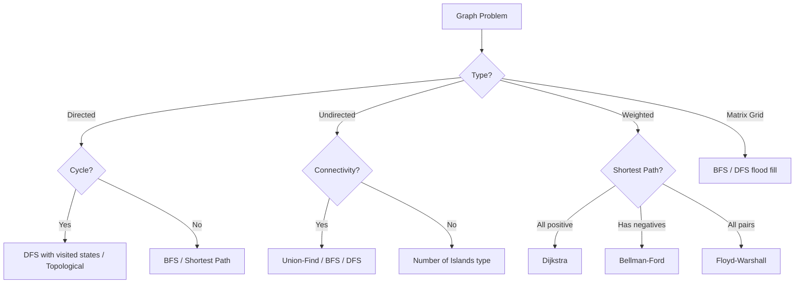
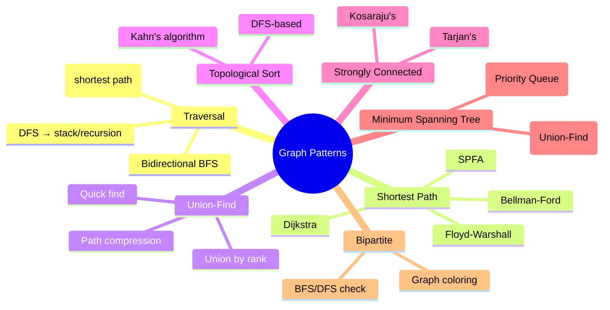
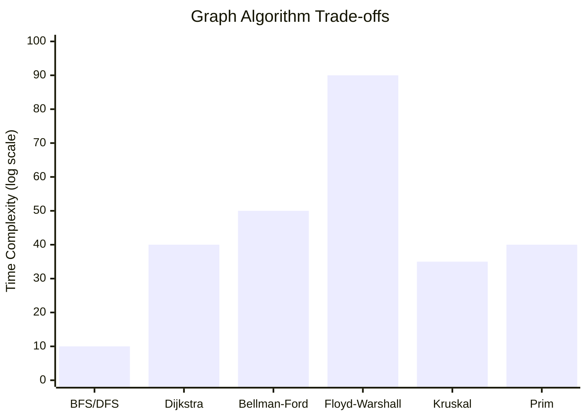

# Chapter 06: Graphs

> Graph problems are among the most challenging interview topics. They test your ability to model relationships, understand traversal strategies, and apply advanced algorithms like topological sort, Dijkstra, and Union-Find.

## Learning Objectives

- Master BFS and DFS traversal on graphs with adjacency lists
- Understand and implement topological sorting for directed acyclic graphs
- Apply shortest path algorithms: Dijkstra, Bellman-Ford, Floyd-Warshall
- Implement Union-Find (Disjoint Set) for connectivity problems
- Detect cycles in directed and undirected graphs
- Model real-world problems as graph traversal challenges

<!-- Image Gallery -->
<section class="lesson-visuals" aria-label="Visual learning resources">
  <header><span>VISUAL LEARNING</span><h2>See it. Review it. Remember it.</h2></header>
  <a class="lesson-visual-card" href="../../assets/images/lessons/coding-problems/06-graphs/handwritten-notes.png" target="_blank" rel="noopener">
    
    <span><strong>Handwritten notes</strong>Condensed notes for deliberate review.</span>
  </a>
  <a class="lesson-visual-card" href="../../assets/images/lessons/coding-problems/06-graphs/sticky-notes.png" target="_blank" rel="noopener">
    
    <span><strong>Sticky-note revision</strong>Fast recall prompts for revision.</span>
  </a>
  <a class="lesson-visual-card" href="../../assets/images/lessons/coding-problems/06-graphs/visual-explanation.png" target="_blank" rel="noopener">
    
    <span><strong>Visual concept guide</strong>A connected explanation of the key ideas.</span>
  </a>
</section>
<!-- End Image Gallery -->

## Problem Classification Flow



## Graph Algorithm Patterns



## Complexity Comparison



---

## Easy Problems (5)

---

### Problem 1: Find if Path Exists in Graph

🏷️ **Companies:** [Amazon] [Google] [Meta]
📊 **Difficulty:** Easy
📂 **Topics:** [Graph, DFS, BFS, Union-Find]

**Problem:** There is a bi-directional graph with n vertices. Edges are given as a 2D array. Determine if there's a path from source to destination.

**Example 1:**
```
Input: n = 3, edges = [[0,1],[1,2],[2,0]], source = 0, destination = 2
Output: true
```

**Constraints:**
- 1 ≤ n ≤ 2 × 10⁵
- 0 ≤ edges.length ≤ 2 × 10⁵

**Solution Approach:**
- BFS/DFS from source. Or use Union-Find for efficiency.

```typescript
function validPath(n: number, edges: number[][], source: number, destination: number): boolean {
  const graph: Map<number, number[]> = new Map();
  for (let i = 0; i < n; i++) graph.set(i, []);
  for (const [u, v] of edges) {
    graph.get(u)!.push(v);
    graph.get(v)!.push(u);
  }

  const visited = new Set<number>();
  const queue = [source];
  visited.add(source);

  while (queue.length > 0) {
    const node = queue.shift()!;
    if (node === destination) return true;
    for (const neighbor of graph.get(node)!) {
      if (!visited.has(neighbor)) {
        visited.add(neighbor);
        queue.push(neighbor);
      }
    }
  }

  return false;
}
```

**Test Cases:**
```typescript
console.log(validPath(3, [[0,1],[1,2],[2,0]], 0, 2)); // true
console.log(validPath(6, [[0,1],[0,2],[3,5],[5,4],[4,3]], 0, 5)); // false
```

**Time Complexity:** O(n + e)
**Space Complexity:** O(n + e)

---

### Problem 2: Find Center of Star Graph

🏷️ **Companies:** [Amazon] [Google]
📊 **Difficulty:** Easy
📂 **Topics:** [Graph]

**Problem:** A star graph has one center node connected to all others. Find the center given edges.

**Example 1:**
```
Input: edges = [[1,2],[2,3],[4,2]]
Output: 2
```

```typescript
function findCenter(edges: number[][]): number {
  return edges[0][0] === edges[1][0] || edges[0][0] === edges[1][1]
    ? edges[0][0]
    : edges[0][1];
}
```

**Test Cases:**
```typescript
console.log(findCenter([[1,2],[2,3],[4,2]])); // 2
console.log(findCenter([[1,2],[5,1],[1,3],[1,4]])); // 1
```

**Time Complexity:** O(1)
**Space Complexity:** O(1)

---

### Problem 3: Flood Fill

🏷️ **Companies:** [Amazon] [Google] [Meta]
📊 **Difficulty:** Easy
📂 **Topics:** [Graph, Matrix, DFS, BFS]

**Problem:** Replace all connected pixels of the same starting color with a new color.

**Example 1:**
```
Input: image = [[1,1,1],[1,1,0],[1,0,1]], sr = 1, sc = 1, color = 2
Output: [[2,2,2],[2,2,0],[2,0,1]]
```

**Constraints:**
- m == image.length, n == image[0].length
- 1 ≤ m, n ≤ 50

```typescript
function floodFill(image: number[][], sr: number, sc: number, color: number): number[][] {
  const originalColor = image[sr][sc];
  if (originalColor === color) return image;

  const dfs = (r: number, c: number) => {
    if (r < 0 || r >= image.length || c < 0 || c >= image[0].length ||
        image[r][c] !== originalColor) return;

    image[r][c] = color;
    dfs(r + 1, c);
    dfs(r - 1, c);
    dfs(r, c + 1);
    dfs(r, c - 1);
  };

  dfs(sr, sc);
  return image;
}
```

**Test Cases:**
```typescript
console.log(floodFill([[1,1,1],[1,1,0],[1,0,1]], 1, 1, 2));
// [[2,2,2],[2,2,0],[2,0,1]]
```

**Time Complexity:** O(m × n)
**Space Complexity:** O(m × n) worst case recursion

---

### Problem 4: Island Perimeter

🏷️ **Companies:** [Amazon] [Google] [Meta]
📊 **Difficulty:** Easy
📂 **Topics:** [Graph, Matrix, DFS]

**Problem:** Given a grid where 1 = land, 0 = water, compute the perimeter of the island.

**Example 1:**
```
Input: grid = [[0,1,0,0],[1,1,1,0],[0,1,0,0],[1,1,0,0]]
Output: 16
```

```typescript
function islandPerimeter(grid: number[][]): number {
  let perimeter = 0;

  for (let r = 0; r < grid.length; r++) {
    for (let c = 0; c < grid[0].length; c++) {
      if (grid[r][c] === 1) {
        perimeter += 4;
        if (r > 0 && grid[r - 1][c] === 1) perimeter -= 2;
        if (c > 0 && grid[r][c - 1] === 1) perimeter -= 2;
      }
    }
  }

  return perimeter;
}
```

**Test Cases:**
```typescript
console.log(islandPerimeter([
  [0,1,0,0],
  [1,1,1,0],
  [0,1,0,0],
  [1,1,0,0]
])); // 16
```

**Time Complexity:** O(m × n)
**Space Complexity:** O(1)

---

### Problem 5: Find the Town Judge

🏷️ **Companies:** [Amazon] [Google] [Meta]
📊 **Difficulty:** Easy
📂 **Topics:** [Graph, Array]

**Problem:** In a town of n people, the town judge trusts nobody and everyone trusts the judge. Find the judge or return -1.

**Example 1:**
```
Input: n = 2, trust = [[1,2]]
Output: 2
```

**Constraints:**
- 1 ≤ n ≤ 1000

```typescript
function findJudge(n: number, trust: number[][]): number {
  const indegree = new Array(n + 1).fill(0);
  const outdegree = new Array(n + 1).fill(0);

  for (const [a, b] of trust) {
    outdegree[a]++;
    indegree[b]++;
  }

  for (let i = 1; i <= n; i++) {
    if (indegree[i] === n - 1 && outdegree[i] === 0) return i;
  }

  return -1;
}
```

**Test Cases:**
```typescript
console.log(findJudge(2, [[1,2]])); // 2
console.log(findJudge(3, [[1,3],[2,3]])); // 3
console.log(findJudge(3, [[1,3],[2,3],[3,1]])); // -1
```

**Time Complexity:** O(n + t)
**Space Complexity:** O(n)

---

## Medium Problems (14)

---

### Problem 6: Number of Islands

🏷️ **Companies:** [Amazon] [Google] [Meta] [Microsoft] [Apple]
📊 **Difficulty:** Medium
📂 **Topics:** [Graph, Matrix, DFS, BFS, Union-Find]

**Problem:** Given a 2D grid of '1's (land) and '0's (water), count the number of islands.

**Example 1:**
```
Input: grid = [
  ["1","1","1","1","0"],
  ["1","1","0","1","0"],
  ["1","1","0","0","0"],
  ["0","0","0","0","0"]
]
Output: 1
```

**Constraints:**
- m, n ≤ 300

**Solution Approach:**
- DFS from each unvisited land cell, marking visited.

```typescript
function numIslands(grid: string[][]): number {
  let count = 0;

  const dfs = (r: number, c: number) => {
    if (r < 0 || r >= grid.length || c < 0 || c >= grid[0].length || grid[r][c] === '0') return;
    grid[r][c] = '0';
    dfs(r + 1, c);
    dfs(r - 1, c);
    dfs(r, c + 1);
    dfs(r, c - 1);
  };

  for (let r = 0; r < grid.length; r++) {
    for (let c = 0; c < grid[0].length; c++) {
      if (grid[r][c] === '1') {
        count++;
        dfs(r, c);
      }
    }
  }

  return count;
}
```

**Test Cases:**
```typescript
console.log(numIslands([
  ["1","1","1","1","0"],
  ["1","1","0","1","0"],
  ["1","1","0","0","0"],
  ["0","0","0","0","0"]
])); // 1

console.log(numIslands([
  ["1","1","0","0","0"],
  ["1","1","0","0","0"],
  ["0","0","1","0","0"],
  ["0","0","0","1","1"]
])); // 3
```

**Time Complexity:** O(m × n)
**Space Complexity:** O(m × n) worst case recursion

---

### Problem 7: Clone Graph

🏷️ **Companies:** [Amazon] [Google] [Meta] [Microsoft]
📊 **Difficulty:** Medium
📂 **Topics:** [Graph, DFS, BFS, Hash Table]

**Problem:** Given a reference to a node in a connected undirected graph, return a deep copy (clone) of the graph.

**Example 1:**
```
Input: adjList = [[2,4],[1,3],[2,4],[1,3]]
Output: [[2,4],[1,3],[2,4],[1,3]]
```

**Constraints:**
- 1 ≤ nodes ≤ 100

```typescript
class GraphNode {
  val: number;
  neighbors: GraphNode[];
  constructor(val?: number, neighbors?: GraphNode[]) {
    this.val = val ?? 0;
    this.neighbors = neighbors ?? [];
  }
}

function cloneGraph(node: GraphNode | null): GraphNode | null {
  if (!node) return null;

  const map = new Map<GraphNode, GraphNode>();

  const dfs = (n: GraphNode): GraphNode => {
    if (map.has(n)) return map.get(n)!;

    const clone = new GraphNode(n.val);
    map.set(n, clone);

    for (const neighbor of n.neighbors) {
      clone.neighbors.push(dfs(neighbor));
    }

    return clone;
  };

  return dfs(node);
}
```

**Test Cases:**
```typescript
const n1 = new GraphNode(1);
const n2 = new GraphNode(2);
const n3 = new GraphNode(3);
const n4 = new GraphNode(4);
n1.neighbors = [n2, n4];
n2.neighbors = [n1, n3];
n3.neighbors = [n2, n4];
n4.neighbors = [n1, n3];

const cloned = cloneGraph(n1);
console.log(cloned?.val); // 1
console.log(cloned?.neighbors.length); // 2
console.log(cloned !== n1); // true
```

**Time Complexity:** O(n + e)
**Space Complexity:** O(n)

---

### Problem 8: Course Schedule

🏷️ **Companies:** [Amazon] [Google] [Meta] [Microsoft] [Apple]
📊 **Difficulty:** Medium
📂 **Topics:** [Graph, DFS, BFS, Topological Sort]

**Problem:** There are n courses labeled 0 to n-1. Given prerequisites [a, b] meaning b must be taken before a, determine if it's possible to finish all courses.

**Example 1:**
```
Input: numCourses = 2, prerequisites = [[1,0]]
Output: true
```

**Constraints:**
- 1 ≤ n ≤ 2000

**Solution Approach:**
- Detect cycle in directed graph. Use Kahn's algorithm (BFS) or DFS with visited states.

```typescript
function canFinish(numCourses: number, prerequisites: number[][]): boolean {
  const graph: number[][] = Array.from({ length: numCourses }, () => []);
  const indegree = new Array(numCourses).fill(0);

  for (const [course, prereq] of prerequisites) {
    graph[prereq].push(course);
    indegree[course]++;
  }

  const queue: number[] = [];
  for (let i = 0; i < numCourses; i++) {
    if (indegree[i] === 0) queue.push(i);
  }

  let completed = 0;
  while (queue.length > 0) {
    const course = queue.shift()!;
    completed++;
    for (const neighbor of graph[course]) {
      indegree[neighbor]--;
      if (indegree[neighbor] === 0) queue.push(neighbor);
    }
  }

  return completed === numCourses;
}
```

**Test Cases:**
```typescript
console.log(canFinish(2, [[1,0]])); // true
console.log(canFinish(2, [[1,0],[0,1]])); // false
console.log(canFinish(5, [[1,0],[2,1],[3,2],[4,3]])); // true
```

**Time Complexity:** O(n + e)
**Space Complexity:** O(n + e)

---

### Problem 9: Course Schedule II

🏷️ **Companies:** [Amazon] [Google] [Meta] [Microsoft]
📊 **Difficulty:** Medium
📂 **Topics:** [Graph, Topological Sort]

**Problem:** Return the ordering of courses to take to finish all courses.

**Example 1:**
```
Input: numCourses = 4, prerequisites = [[1,0],[2,0],[3,1],[3,2]]
Output: [0,2,1,3] or [0,1,2,3]
```

```typescript
function findOrder(numCourses: number, prerequisites: number[][]): number[] {
  const graph: number[][] = Array.from({ length: numCourses }, () => []);
  const indegree = new Array(numCourses).fill(0);

  for (const [course, prereq] of prerequisites) {
    graph[prereq].push(course);
    indegree[course]++;
  }

  const queue: number[] = [];
  for (let i = 0; i < numCourses; i++) {
    if (indegree[i] === 0) queue.push(i);
  }

  const order: number[] = [];
  while (queue.length > 0) {
    const course = queue.shift()!;
    order.push(course);
    for (const neighbor of graph[course]) {
      indegree[neighbor]--;
      if (indegree[neighbor] === 0) queue.push(neighbor);
    }
  }

  return order.length === numCourses ? order : [];
}
```

**Test Cases:**
```typescript
console.log(findOrder(4, [[1,0],[2,0],[3,1],[3,2]])); // [0, 1, 2, 3] or [0, 2, 1, 3]
console.log(findOrder(2, [[1,0],[0,1]])); // []
```

**Time Complexity:** O(n + e)
**Space Complexity:** O(n + e)

---

### Problem 10: Word Ladder

🏷️ **Companies:** [Amazon] [Google] [Meta] [Microsoft]
📊 **Difficulty:** Medium
📂 **Topics:** [Graph, BFS, String]

**Problem:** Given beginWord, endWord, and a wordList, find the length of the shortest transformation sequence from beginWord to endWord where each step changes one letter and each intermediate word is in the wordList.

**Example 1:**
```
Input: beginWord = "hit", endWord = "cog", wordList = ["hot","dot","dog","lot","log","cog"]
Output: 5
Explanation: "hit" → "hot" → "dot" → "dog" → "cog" (5 steps)
```

**Constraints:**
- 1 ≤ word length ≤ 10
- wordList length ≤ 5000

**Solution Approach:**
- BFS on graph where nodes are words, edges exist if words differ by one letter.

```typescript
function ladderLength(beginWord: string, endWord: string, wordList: string[]): number {
  const wordSet = new Set(wordList);
  if (!wordSet.has(endWord)) return 0;

  const queue: [string, number] = [beginWord, 1];
  const visited = new Set<string>();
  visited.add(beginWord);

  while (queue.length > 0) {
    const [word, steps] = queue.shift()!;
    if (word === endWord) return steps;

    for (let i = 0; i < word.length; i++) {
      for (let ch = 97; ch <= 122; ch++) {
        const newWord = word.substring(0, i) + String.fromCharCode(ch) + word.substring(i + 1);
        if (wordSet.has(newWord) && !visited.has(newWord)) {
          visited.add(newWord);
          queue.push([newWord, steps + 1]);
        }
      }
    }
  }

  return 0;
}
```

**Test Cases:**
```typescript
console.log(ladderLength("hit", "cog", ["hot","dot","dog","lot","log","cog"])); // 5
console.log(ladderLength("hit", "cog", ["hot","dot","dog","lot","log"])); // 0
```

**Time Complexity:** O(n × L × 26) where L = word length
**Space Complexity:** O(n)

---

### Problem 11: Pacific Atlantic Water Flow

🏷️ **Companies:** [Amazon] [Google] [Meta] [Microsoft]
📊 **Difficulty:** Medium
📂 **Topics:** [Graph, Matrix, DFS, BFS]

**Problem:** Given a matrix of heights, find cells where water can flow to both Pacific (top/left) and Atlantic (bottom/right) oceans. Water flows to equal or lower height neighbors.

**Example 1:**
```
Input: heights = [[1,2,2,3,5],[3,2,3,4,4],[2,4,5,3,1],[6,7,1,4,5],[5,1,1,2,4]]
Output: [[0,4],[1,3],[1,4],[2,2],[3,0],[3,1],[4,0]]
```

**Constraints:**
- 1 ≤ m, n ≤ 200

```typescript
function pacificAtlantic(heights: number[][]): number[][] {
  const m = heights.length;
  const n = heights[0].length;
  const pacific = Array.from({ length: m }, () => new Array(n).fill(false));
  const atlantic = Array.from({ length: m }, () => new Array(n).fill(false));

  const dfs = (r: number, c: number, ocean: boolean[][], prevHeight: number) => {
    if (r < 0 || r >= m || c < 0 || c >= n || ocean[r][c] || heights[r][c] < prevHeight) return;
    ocean[r][c] = true;
    dfs(r + 1, c, ocean, heights[r][c]);
    dfs(r - 1, c, ocean, heights[r][c]);
    dfs(r, c + 1, ocean, heights[r][c]);
    dfs(r, c - 1, ocean, heights[r][c]);
  };

  for (let i = 0; i < m; i++) {
    dfs(i, 0, pacific, -Infinity);
    dfs(i, n - 1, atlantic, -Infinity);
  }
  for (let j = 0; j < n; j++) {
    dfs(0, j, pacific, -Infinity);
    dfs(m - 1, j, atlantic, -Infinity);
  }

  const result: number[][] = [];
  for (let i = 0; i < m; i++) {
    for (let j = 0; j < n; j++) {
      if (pacific[i][j] && atlantic[i][j]) result.push([i, j]);
    }
  }

  return result;
}
```

**Time Complexity:** O(m × n)
**Space Complexity:** O(m × n)

---

### Problem 12: Rotting Oranges

🏷️ **Companies:** [Amazon] [Google] [Meta] [Microsoft]
📊 **Difficulty:** Medium
📂 **Topics:** [Graph, BFS, Matrix]

**Problem:** Given a grid where 0=empty, 1=fresh, 2=rotten, every minute any fresh orange adjacent to a rotten one becomes rotten. Return minimum minutes until no fresh orange remains, or -1.

**Example 1:**
```
Input: grid = [[2,1,1],[1,1,0],[0,1,1]]
Output: 4
```

```typescript
function orangesRotting(grid: number[][]): number {
  const m = grid.length;
  const n = grid[0].length;
  const queue: [number, number, number][] = [];
  let fresh = 0;

  for (let r = 0; r < m; r++) {
    for (let c = 0; c < n; c++) {
      if (grid[r][c] === 2) queue.push([r, c, 0]);
      if (grid[r][c] === 1) fresh++;
    }
  }

  let maxMinutes = 0;
  const dirs = [[0,1],[0,-1],[1,0],[-1,0]];

  while (queue.length > 0) {
    const [r, c, minutes] = queue.shift()!;
    maxMinutes = Math.max(maxMinutes, minutes);

    for (const [dr, dc] of dirs) {
      const nr = r + dr;
      const nc = c + dc;
      if (nr >= 0 && nr < m && nc >= 0 && nc < n && grid[nr][nc] === 1) {
        grid[nr][nc] = 2;
        fresh--;
        queue.push([nr, nc, minutes + 1]);
      }
    }
  }

  return fresh === 0 ? maxMinutes : -1;
}
```

**Test Cases:**
```typescript
console.log(orangesRotting([[2,1,1],[1,1,0],[0,1,1]])); // 4
console.log(orangesRotting([[0,2]])); // 0
console.log(orangesRotting([[2,1,1],[0,1,1],[1,0,1]])); // -1
```

**Time Complexity:** O(m × n)
**Space Complexity:** O(m × n)

---

### Problem 13: Graph Valid Tree

🏷️ **Companies:** [Amazon] [Google] [Meta]
📊 **Difficulty:** Medium
📂 **Topics:** [Graph, DFS, BFS, Union-Find]

**Problem:** Given n nodes and edges, check if the graph forms a valid tree (connected and no cycles).

**Example 1:**
```
Input: n = 5, edges = [[0,1],[0,2],[0,3],[1,4]]
Output: true
```

**Constraints:**
- 1 ≤ n ≤ 2000

```typescript
function validTree(n: number, edges: number[][]): boolean {
  if (edges.length !== n - 1) return false;

  const graph: number[][] = Array.from({ length: n }, () => []);
  for (const [u, v] of edges) {
    graph[u].push(v);
    graph[v].push(u);
  }

  const visited = new Set<number>();
  const stack = [0];
  visited.add(0);

  while (stack.length > 0) {
    const node = stack.pop()!;
    for (const neighbor of graph[node]) {
      if (!visited.has(neighbor)) {
        visited.add(neighbor);
        stack.push(neighbor);
      }
    }
  }

  return visited.size === n;
}
```

**Test Cases:**
```typescript
console.log(validTree(5, [[0,1],[0,2],[0,3],[1,4]])); // true
console.log(validTree(5, [[0,1],[1,2],[2,3],[1,3],[1,4]])); // false
```

**Time Complexity:** O(n + e)
**Space Complexity:** O(n + e)

---

### Problem 14: Surrounded Regions

🏷️ **Companies:** [Amazon] [Google] [Meta]
📊 **Difficulty:** Medium
📂 **Topics:** [Graph, Matrix, DFS, BFS]

**Problem:** Capture all 'O's that are surrounded by 'X's (change to 'X'). Any 'O' on the border remains.

**Example 1:**
```
Input: board = [["X","X","X","X"],["X","O","O","X"],["X","X","O","X"],["X","O","X","X"]]
Output: [["X","X","X","X"],["X","X","X","X"],["X","X","X","X"],["X","O","X","X"]]
```

```typescript
function solve(board: string[][]): void {
  const m = board.length;
  const n = board[0].length;

  const dfs = (r: number, c: number) => {
    if (r < 0 || r >= m || c < 0 || c >= n || board[r][c] !== 'O') return;
    board[r][c] = '#';
    dfs(r + 1, c);
    dfs(r - 1, c);
    dfs(r, c + 1);
    dfs(r, c - 1);
  };

  for (let i = 0; i < m; i++) {
    dfs(i, 0);
    dfs(i, n - 1);
  }
  for (let j = 0; j < n; j++) {
    dfs(0, j);
    dfs(m - 1, j);
  }

  for (let r = 0; r < m; r++) {
    for (let c = 0; c < n; c++) {
      if (board[r][c] === 'O') board[r][c] = 'X';
      if (board[r][c] === '#') board[r][c] = 'O';
    }
  }
}
```

**Test Cases:**
```typescript
const board = [
  ["X","X","X","X"],
  ["X","O","O","X"],
  ["X","X","O","X"],
  ["X","O","X","X"]
];
solve(board);
console.log(board);
// [["X","X","X","X"],["X","X","X","X"],["X","X","X","X"],["X","O","X","X"]]
```

**Time Complexity:** O(m × n)
**Space Complexity:** O(m × n)

---

### Problem 15: Number of Connected Components in a Graph

🏷️ **Companies:** [Amazon] [Google] [Meta]
📊 **Difficulty:** Medium
📂 **Topics:** [Graph, Union-Find, DFS]

**Problem:** Count the number of connected components in an undirected graph.

**Example 1:**
```
Input: n = 5, edges = [[0,1],[1,2],[3,4]]
Output: 2
```

**Solution Approach:**
- **DFS:** Visited set + traversal from each unvisited node.
- **Union-Find:** Union all edges, count unique roots.

```typescript
function countComponents(n: number, edges: number[][]): number {
  const graph: number[][] = Array.from({ length: n }, () => []);
  for (const [u, v] of edges) {
    graph[u].push(v);
    graph[v].push(u);
  }

  const visited = new Array(n).fill(false);
  let components = 0;

  const dfs = (node: number) => {
    visited[node] = true;
    for (const neighbor of graph[node]) {
      if (!visited[neighbor]) dfs(neighbor);
    }
  };

  for (let i = 0; i < n; i++) {
    if (!visited[i]) {
      components++;
      dfs(i);
    }
  }

  return components;
}
```

**Test Cases:**
```typescript
console.log(countComponents(5, [[0,1],[1,2],[3,4]])); // 2
console.log(countComponents(5, [[0,1],[1,2],[2,3],[3,4]])); // 1
```

**Time Complexity:** O(n + e)
**Space Complexity:** O(n + e)

---

### Problem 16: Detect Cycle in Directed Graph

🏷️ **Companies:** [Amazon] [Google] [Meta]
📊 **Difficulty:** Medium
📂 **Topics:** [Graph, DFS, Topological Sort]

**Problem:** Given a directed graph, return true if it contains a cycle.

**Example 1:**
```
Input: n = 4, edges = [[0,1],[1,2],[2,0],[1,3]]
Output: true
```

```typescript
function hasCycle(n: number, edges: number[][]): boolean {
  const graph: number[][] = Array.from({ length: n }, () => []);
  for (const [u, v] of edges) graph[u].push(v);

  const state = new Array(n).fill(0); // 0=unvisited, 1=visiting, 2=visited

  const dfs = (node: number): boolean => {
    if (state[node] === 1) return true;
    if (state[node] === 2) return false;

    state[node] = 1;
    for (const neighbor of graph[node]) {
      if (dfs(neighbor)) return true;
    }
    state[node] = 2;
    return false;
  };

  for (let i = 0; i < n; i++) {
    if (dfs(i)) return true;
  }

  return false;
}
```

**Test Cases:**
```typescript
console.log(hasCycle(4, [[0,1],[1,2],[2,0],[1,3]])); // true
console.log(hasCycle(4, [[0,1],[1,2],[1,3]])); // false
```

**Time Complexity:** O(n + e)
**Space Complexity:** O(n + e)

---

### Problem 17: Evaluate Division

🏷️ **Companies:** [Amazon] [Google] [Meta]
📊 **Difficulty:** Medium
📂 **Topics:** [Graph, DFS, Union-Find]

**Problem:** Given equations like a/b = 2.0, find results of queries like a/c.

**Example 1:**
```
Input: equations = [["a","b"],["b","c"]], values = [2.0,3.0],
       queries = [["a","c"],["b","a"],["a","e"],["a","a"],["x","x"]]
Output: [6.0,0.5,-1.0,1.0,-1.0]
```

```typescript
function calcEquation(
  equations: string[][],
  values: number[],
  queries: string[][]
): number[] {
  const graph = new Map<string, Map<string, number>>();

  for (let i = 0; i < equations.length; i++) {
    const [a, b] = equations[i];
    const val = values[i];

    if (!graph.has(a)) graph.set(a, new Map());
    if (!graph.has(b)) graph.set(b, new Map());
    graph.get(a)!.set(b, val);
    graph.get(b)!.set(a, 1 / val);
  }

  const dfs = (start: string, end: string, visited: Set<string>): number => {
    if (!graph.has(start) || !graph.has(end)) return -1;
    if (start === end) return 1;

    visited.add(start);
    for (const [neighbor, weight] of graph.get(start)!) {
      if (!visited.has(neighbor)) {
        const result = dfs(neighbor, end, visited);
        if (result !== -1) return weight * result;
      }
    }

    return -1;
  };

  return queries.map(([a, b]) => dfs(a, b, new Set()));
}
```

**Test Cases:**
```typescript
console.log(calcEquation(
  [["a","b"],["b","c"]],
  [2.0, 3.0],
  [["a","c"],["b","a"],["a","e"],["a","a"],["x","x"]]
));
// [6.0, 0.5, -1.0, 1.0, -1.0]
```

**Time Complexity:** O(n × q) where n = equations, q = queries
**Space Complexity:** O(n)

---

### Problem 18: Minesweeper

🏷️ **Companies:** [Amazon] [Google]
📊 **Difficulty:** Medium
📂 **Topics:** [Graph, DFS, BFS, Matrix]

**Problem:** Implement Minesweeper click logic: if unrevealed mine → game over; if empty → reveal all adjacent empties; if number → reveal just that cell.

**Example 1:**
```
Input: board = [["E","E","E","E","E"],["E","E","M","E","E"],["E","E","E","E","E"],["E","E","E","E","E"]], click = [3,0]
Output: [["B","1","E","1","B"],["B","1","M","1","B"],["B","1","1","1","B"],["B","B","B","B","B"]]
```

```typescript
function updateBoard(board: string[][], click: number[]): string[][] {
  const [r, c] = click;
  const m = board.length;
  const n = board[0].length;

  if (board[r][c] === 'M') {
    board[r][c] = 'X';
    return board;
  }

  const countMines = (row: number, col: number): number => {
    let count = 0;
    for (let dr = -1; dr <= 1; dr++) {
      for (let dc = -1; dc <= 1; dc++) {
        const nr = row + dr;
        const nc = col + dc;
        if (nr >= 0 && nr < m && nc >= 0 && nc < n && board[nr][nc] === 'M') count++;
      }
    }
    return count;
  };

  const dfs = (row: number, col: number) => {
    if (row < 0 || row >= m || col < 0 || col >= n || board[row][col] !== 'E') return;

    const mines = countMines(row, col);
    if (mines > 0) {
      board[row][col] = mines.toString();
    } else {
      board[row][col] = 'B';
      for (let dr = -1; dr <= 1; dr++) {
        for (let dc = -1; dc <= 1; dc++) {
          dfs(row + dr, col + dc);
        }
      }
    }
  };

  dfs(r, c);
  return board;
}
```

**Time Complexity:** O(m × n)
**Space Complexity:** O(m × n)

---

### Problem 19: Shortest Path in Binary Matrix

🏷️ **Companies:** [Amazon] [Google] [Meta]
📊 **Difficulty:** Medium
📂 **Topics:** [Graph, BFS, Matrix]

**Problem:** Find the shortest clear path from top-left to bottom-right in a binary matrix (0 = clear, 1 = blocked). 8-directional movement.

**Example 1:**
```
Input: grid = [[0,1],[1,0]]
Output: 2
```

```typescript
function shortestPathBinaryMatrix(grid: number[][]): number {
  const n = grid.length;
  if (grid[0][0] === 1 || grid[n-1][n-1] === 1) return -1;

  const queue: [number, number, number][] = [[0, 0, 1]];
  const visited = new Set<string>();
  visited.add('0,0');

  const dirs = [[-1,-1],[-1,0],[-1,1],[0,-1],[0,1],[1,-1],[1,0],[1,1]];

  while (queue.length > 0) {
    const [r, c, dist] = queue.shift()!;
    if (r === n - 1 && c === n - 1) return dist;

    for (const [dr, dc] of dirs) {
      const nr = r + dr;
      const nc = c + dc;
      const key = `${nr},${nc}`;
      if (nr >= 0 && nr < n && nc >= 0 && nc < n && grid[nr][nc] === 0 && !visited.has(key)) {
        visited.add(key);
        queue.push([nr, nc, dist + 1]);
      }
    }
  }

  return -1;
}
```

**Test Cases:**
```typescript
console.log(shortestPathBinaryMatrix([[0,1],[1,0]])); // 2
console.log(shortestPathBinaryMatrix([[0,0,0],[1,1,0],[1,1,0]])); // 4
```

**Time Complexity:** O(n²)
**Space Complexity:** O(n²)

---

## Hard Problems (6)

---

### Problem 20: Alien Dictionary

🏷️ **Companies:** [Amazon] [Google] [Meta] [Microsoft]
📊 **Difficulty:** Hard
📂 **Topics:** [Graph, Topological Sort, String]

**Problem:** Given sorted words from an alien language, find the order of characters.

**Example 1:**
```
Input: words = ["wrt","wrf","er","ett","rftt"]
Output: "wertf"
```

**Constraints:**
- 1 ≤ words.length ≤ 100

```typescript
function alienOrder(words: string[]): string {
  const graph = new Map<string, string[]>();
  const indegree = new Map<string, number>();

  for (const word of words) {
    for (const ch of word) {
      if (!graph.has(ch)) graph.set(ch, []);
      if (!indegree.has(ch)) indegree.set(ch, 0);
    }
  }

  for (let i = 0; i < words.length - 1; i++) {
    const w1 = words[i];
    const w2 = words[i + 1];
    const minLen = Math.min(w1.length, w2.length);

    if (w1.length > w2.length && w1.startsWith(w2)) return '';

    for (let j = 0; j < minLen; j++) {
      if (w1[j] !== w2[j]) {
        graph.get(w1[j])!.push(w2[j]);
        indegree.set(w2[j], indegree.get(w2[j])! + 1);
        break;
      }
    }
  }

  const queue: string[] = [];
  for (const [ch, deg] of indegree) {
    if (deg === 0) queue.push(ch);
  }

  let result = '';
  while (queue.length > 0) {
    const ch = queue.shift()!;
    result += ch;
    for (const neighbor of graph.get(ch)!) {
      indegree.set(neighbor, indegree.get(neighbor)! - 1);
      if (indegree.get(neighbor) === 0) queue.push(neighbor);
    }
  }

  return result.length === indegree.size ? result : '';
}
```

**Test Cases:**
```typescript
console.log(alienOrder(["wrt","wrf","er","ett","rftt"])); // "wertf"
console.log(alienOrder(["z","x","z"])); // ""
```

**Time Complexity:** O(n × L) where L = avg word length
**Space Complexity:** O(1) (26 characters)

---

### Problem 21: Minimum Height Trees

🏷️ **Companies:** [Amazon] [Google] [Meta]
📊 **Difficulty:** Hard
📂 **Topics:** [Graph, BFS, Topological Sort]

**Problem:** Find all root labels of MHTs (minimum height trees) for an undirected tree.

**Example 1:**
```
Input: n = 4, edges = [[1,0],[1,2],[1,3]]
Output: [1]
```

**Constraints:**
- 1 ≤ n ≤ 2 × 10⁴

```typescript
function findMinHeightTrees(n: number, edges: number[][]): number[] {
  if (n === 1) return [0];

  const graph: Set<number>[] = Array.from({ length: n }, () => new Set());
  for (const [u, v] of edges) {
    graph[u].add(v);
    graph[v].add(u);
  }

  let leaves: number[] = [];
  for (let i = 0; i < n; i++) {
    if (graph[i].size === 1) leaves.push(i);
  }

  let remaining = n;
  while (remaining > 2) {
    remaining -= leaves.length;
    const newLeaves: number[] = [];

    for (const leaf of leaves) {
      const neighbor = graph[leaf].values().next().value;
      graph[neighbor].delete(leaf);
      if (graph[neighbor].size === 1) newLeaves.push(neighbor);
    }

    leaves = newLeaves;
  }

  return leaves;
}
```

**Test Cases:**
```typescript
console.log(findMinHeightTrees(4, [[1,0],[1,2],[1,3]])); // [1]
console.log(findMinHeightTrees(6, [[3,0],[3,1],[3,2],[3,4],[5,4]])); // [3, 4]
```

**Time Complexity:** O(n)
**Space Complexity:** O(n)

---

### Problem 22: Cheapest Flights Within K Stops

🏷️ **Companies:** [Amazon] [Google] [Meta] [Microsoft]
📊 **Difficulty:** Hard
📂 **Topics:** [Graph, BFS, Dijkstra, DP]

**Problem:** Find the cheapest price from src to dst with at most k stops.

**Example 1:**
```
Input: n = 4, flights = [[0,1,100],[1,2,100],[2,0,100],[1,3,600],[2,3,200]], src = 0, dst = 3, k = 1
Output: 700
```

**Constraints:**
- 1 ≤ n ≤ 100

```typescript
function findCheapestPrice(n: number, flights: number[][], src: number, dst: number, k: number): number {
  const graph: [number, number][][] = Array.from({ length: n }, () => []);
  for (const [from, to, price] of flights) {
    graph[from].push([to, price]);
  }

  const dist = new Array(n).fill(Infinity);
  dist[src] = 0;

  const queue: [number, number, number][] = [[src, 0, 0]]; // node, price, stops

  while (queue.length > 0) {
    const [node, price, stops] = queue.shift()!;

    if (stops > k) continue;

    for (const [neighbor, cost] of graph[node]) {
      const newPrice = price + cost;
      if (newPrice < dist[neighbor]) {
        dist[neighbor] = newPrice;
        queue.push([neighbor, newPrice, stops + 1]);
      }
    }

    queue.sort((a, b) => a[1] - b[1]);
  }

  return dist[dst] === Infinity ? -1 : dist[dst];
}
```

**Test Cases:**
```typescript
console.log(findCheapestPrice(4,
  [[0,1,100],[1,2,100],[2,0,100],[1,3,600],[2,3,200]],
  0, 3, 1
)); // 700
```

**Time Complexity:** O(n + e × k)
**Space Complexity:** O(n + e)

---

### Problem 23: Word Ladder II

🏷️ **Companies:** [Amazon] [Google] [Meta]
📊 **Difficulty:** Hard
📂 **Topics:** [Graph, BFS, Backtracking]

**Problem:** Find all shortest transformation sequences from beginWord to endWord.

**Example 1:**
```
Input: beginWord = "hit", endWord = "cog", wordList = ["hot","dot","dog","lot","log","cog"]
Output: [["hit","hot","dot","dog","cog"],["hit","hot","lot","log","cog"]]
```

```typescript
function findLadders(beginWord: string, endWord: string, wordList: string[]): string[][] {
  const wordSet = new Set(wordList);
  if (!wordSet.has(endWord)) return [];

  const graph = new Map<string, string[]>();
  const distance = new Map<string, number>();
  const result: string[][] = [];

  const queue: string[] = [beginWord];
  distance.set(beginWord, 0);

  while (queue.length > 0) {
    const word = queue.shift()!;
    if (word === endWord) break;

    for (let i = 0; i < word.length; i++) {
      for (let ch = 97; ch <= 122; ch++) {
        const newWord = word.substring(0, i) + String.fromCharCode(ch) + word.substring(i + 1);
        if (wordSet.has(newWord)) {
          if (!distance.has(newWord)) {
            distance.set(newWord, distance.get(word)! + 1);
            queue.push(newWord);
          }
          if (distance.get(newWord) === distance.get(word)! + 1) {
            if (!graph.has(word)) graph.set(word, []);
            graph.get(word)!.push(newWord);
          }
        }
      }
    }
  }

  const backtrack = (word: string, path: string[]) => {
    if (word === endWord) {
      result.push([...path]);
      return;
    }
    for (const neighbor of graph.get(word) || []) {
      path.push(neighbor);
      backtrack(neighbor, path);
      path.pop();
    }
  };

  if (distance.has(endWord)) {
    backtrack(beginWord, [beginWord]);
  }

  return result;
}
```

**Time Complexity:** O(n × L × 26)
**Space Complexity:** O(n × L)

---

### Problem 24: Longest Increasing Path in a Matrix

🏷️ **Companies:** [Amazon] [Google] [Meta] [Microsoft]
📊 **Difficulty:** Hard
📂 **Topics:** [Graph, Matrix, DFS, DP, Topological Sort]

**Problem:** Find the length of the longest increasing path in a matrix (4-directional).

**Example 1:**
```
Input: matrix = [[9,9,4],[6,6,8],[2,1,1]]
Output: 4
Explanation: [1, 2, 6, 9]
```

**Constraints:**
- 1 ≤ m, n ≤ 200

```typescript
function longestIncreasingPath(matrix: number[][]): number {
  const m = matrix.length;
  const n = matrix[0].length;
  const memo: number[][] = Array.from({ length: m }, () => new Array(n).fill(0));
  let maxLen = 0;

  const dfs = (r: number, c: number, prevVal: number): number => {
    if (r < 0 || r >= m || c < 0 || c >= n || matrix[r][c] <= prevVal) return 0;
    if (memo[r][c] > 0) return memo[r][c];

    const val = matrix[r][c];
    const up = dfs(r - 1, c, val);
    const down = dfs(r + 1, c, val);
    const left = dfs(r, c - 1, val);
    const right = dfs(r, c + 1, val);

    memo[r][c] = 1 + Math.max(up, down, left, right);
    return memo[r][c];
  };

  for (let r = 0; r < m; r++) {
    for (let c = 0; c < n; c++) {
      maxLen = Math.max(maxLen, dfs(r, c, -Infinity));
    }
  }

  return maxLen;
}
```

**Test Cases:**
```typescript
console.log(longestIncreasingPath([[9,9,4],[6,6,8],[2,1,1]])); // 4
console.log(longestIncreasingPath([[3,4,5],[3,2,6],[2,2,1]])); // 4
```

**Time Complexity:** O(m × n)
**Space Complexity:** O(m × n)

---

### Problem 25: Bus Routes

🏷️ **Companies:** [Amazon] [Google] [Meta]
📊 **Difficulty:** Hard
📂 **Topics:** [Graph, BFS, Hash Table]

**Problem:** Given routes (list of bus stops), find the minimum number of buses needed to travel from source to target.

**Example 1:**
```
Input: routes = [[1,2,7],[3,6,7]], source = 1, target = 6
Output: 2
```

**Constraints:**
- 1 ≤ routes.length ≤ 500

```typescript
function numBusesToDestination(routes: number[][], source: number, target: number): number {
  if (source === target) return 0;

  const stopToRoutes = new Map<number, number[]>();
  for (let i = 0; i < routes.length; i++) {
    for (const stop of routes[i]) {
      if (!stopToRoutes.has(stop)) stopToRoutes.set(stop, []);
      stopToRoutes.get(stop)!.push(i);
    }
  }

  const visitedRoutes = new Set<number>();
  const visitedStops = new Set<number>();
  const queue: [number, number][] = [[source, 0]];
  visitedStops.add(source);

  while (queue.length > 0) {
    const [stop, buses] = queue.shift()!;
    if (stop === target) return buses;

    for (const routeIdx of stopToRoutes.get(stop) || []) {
      if (visitedRoutes.has(routeIdx)) continue;
      visitedRoutes.add(routeIdx);

      for (const nextStop of routes[routeIdx]) {
        if (!visitedStops.has(nextStop)) {
          visitedStops.add(nextStop);
          queue.push([nextStop, buses + 1]);
        }
      }
    }
  }

  return -1;
}
```

**Time Complexity:** O(routes × stops)
**Space Complexity:** O(routes × stops)

---

## Summary Table

| # | Problem | Difficulty | Companies | Time | Space |
|---|---------|-----------|-----------|------|-------|
| 1 | Find if Path Exists | Easy | Amazon, Google, Meta | O(n+e) | O(n+e) |
| 2 | Find Center of Star | Easy | Amazon, Google | O(1) | O(1) |
| 3 | Flood Fill | Easy | Amazon, Google, Meta | O(mn) | O(mn) |
| 4 | Island Perimeter | Easy | Amazon, Google, Meta | O(mn) | O(1) |
| 5 | Find Town Judge | Easy | Amazon, Google, Meta | O(n+t) | O(n) |
| 6 | Number of Islands | Medium | Multiple | O(mn) | O(mn) |
| 7 | Clone Graph | Medium | Amazon, Google, Meta | O(n+e) | O(n) |
| 8 | Course Schedule | Medium | Multiple | O(n+e) | O(n+e) |
| 9 | Course Schedule II | Medium | Multiple | O(n+e) | O(n+e) |
| 10 | Word Ladder | Medium | Multiple | O(n×L×26) | O(n) |
| 11 | Pacific Atlantic Water Flow | Medium | Multiple | O(mn) | O(mn) |
| 12 | Rotting Oranges | Medium | Multiple | O(mn) | O(mn) |
| 13 | Graph Valid Tree | Medium | Amazon, Google, Meta | O(n+e) | O(n+e) |
| 14 | Surrounded Regions | Medium | Amazon, Google, Meta | O(mn) | O(mn) |
| 15 | Connected Components | Medium | Amazon, Google, Meta | O(n+e) | O(n+e) |
| 16 | Detect Cycle Directed | Medium | Amazon, Google, Meta | O(n+e) | O(n+e) |
| 17 | Evaluate Division | Medium | Amazon, Google, Meta | O(n×q) | O(n) |
| 18 | Minesweeper | Medium | Amazon, Google | O(mn) | O(mn) |
| 19 | Shortest Path Binary Matrix | Medium | Amazon, Google, Meta | O(n²) | O(n²) |
| 20 | Alien Dictionary | Hard | Amazon, Google, Meta | O(n×L) | O(1) |
| 21 | Minimum Height Trees | Hard | Amazon, Google, Meta | O(n) | O(n) |
| 22 | Cheapest Flights K Stops | Hard | Multiple | O(n+e×k) | O(n+e) |
| 23 | Word Ladder II | Hard | Amazon, Google, Meta | O(n×L×26) | O(n×L) |
| 24 | Longest Increasing Path | Hard | Amazon, Google, Meta | O(mn) | O(mn) |
| 25 | Bus Routes | Hard | Amazon, Google, Meta | O(r×s) | O(r×s) |
