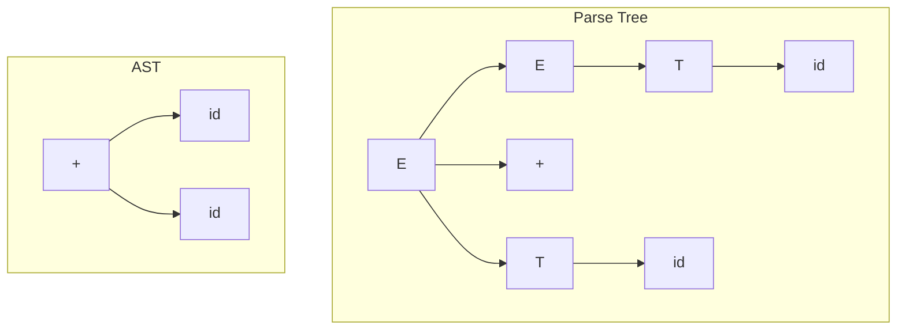

# Chapter 3: Top-Down Parsing

**? Previous:** [Chapter 2: Lexical Analysis](02-lexical.md) | **Next:** [Chapter 4: Bottom-Up Parsing](04-parsing-bottomup.md)

## Learning Objectives

After completing this chapter, students will be able to: define context-free grammars and use them to describe programming-language syntax; construct derivations and parse trees; eliminate ambiguity, left recursion, and common prefixes from grammars; compute FIRST and FOLLOW sets using the full iterative algorithm; construct LL(1) parsing tables; implement recursive-descent parsers with proper error reporting; and implement a complete LL(1) parser generator in TypeScript.

### Chapter at a Glance

| Section | Description |
|---------|-------------|
| Context-Free Grammars | Formal definition and role in syntax specification |
| Derivations and Parse Trees | Leftmost and rightmost derivations, parse tree construction |
| Ambiguity | Multiple parse trees and resolution strategies |
| Left Recursion Elimination | Transforming grammars for predictive parsing |
| Left Factoring | Removing common prefixes from productions |
| FIRST and FOLLOW Sets | Iterative algorithm for computing lookahead information |
| LL(1) Parsing Tables | Table-driven predictive parsing with error reporting |
| Recursive-Descent Parsing | Procedure-based implementation with backtracking |
| Error Recovery in LL Parsing | Handling syntax errors gracefully |

### Chapter Roadmap

```mermaid
flowchart LR
    A[Grammar G] --> B[Eliminate Left Recursion]
    B --> C[Left Factor]
    C --> D[Compute FIRST & FOLLOW]
    D --> E{LL(1) Valid?}
    E -->|Yes| F[Build Parsing Table]
    E -->|No| B
    F --> G[Recursive Descent / Table-Driven Parser]
    G --> H[Parse Tree / Error]
    style A fill:#e1f5fe
    style H fill:#c8e6c9
```

## Theory

### Context-Free Grammars


A **context-free grammar** (CFG) is a four-tuple `G = (V, T, P, S)`, where:

- `V` is a finite set of **nonterminal** symbols
- `T` is a finite set of **terminal** symbols disjoint from V
- `P` is a finite set of **productions** `A ? a` where `A ? V` and `a ? (V ? T)*`
- `S ? V` is the **start symbol**

The language `L(G)` is the set of all strings of terminals derivable from the start symbol by repeatedly replacing nonterminals with the right-hand side of a production.

**Example**: A grammar for arithmetic expressions with standard precedence:

```
expr   ? expr + term | term
term   ? term * factor | factor
factor ? ( expr ) | id
```

This grammar has `V = {expr, term, factor}`, `T = {id, +, *, (, )}`, and `S = expr`.

> **One-Sentence Takeaway:** A CFG is to syntax what regular expressions are to lexemes ? the formal notation for describing hierarchical structure.

### Derivations and Parse Trees


A **derivation** is a sequence of replacement steps transforming the start symbol into a terminal string. A **leftmost derivation** replaces the leftmost nonterminal at each step; a **rightmost derivation** replaces the rightmost nonterminal at each step.

For grammar `E ? E + T | T, T ? id`, leftmost derivation of `id + id`:

```
E ? E + T ? T + T ? id + T ? id + id
```

A **parse tree** is a graphical representation of a derivation. Interior nodes are labeled with nonterminals, leaves with terminals (or e). The children of an interior node correspond to the right-hand side of a production.

**Parse tree vs. Abstract Syntax Tree (AST)**:



The parse tree records every derivation step (including intermediate nonterminals), while the AST omits syntactic sugar like parentheses and grouping nonterminals, keeping only the essential structure.

### Ambiguity


A grammar is **ambiguous** if there exists a terminal string that has more than one distinct parse tree (equivalently, more than one leftmost or rightmost derivation). Ambiguity is undesirable because it leads to multiple possible interpretations of a program.

Consider the grammar:

```
string ? string + string | id
```

The string `id + id + id` has two leftmost derivations:

```
1. string ? string + string ? id + string ? id + string + string ? id + id + string ? id + id + id
2. string ? string + string ? string + string + string ? id + string + string ? id + id + string ? id + id + id
```

These correspond to left-associative and right-associative grouping. Ambiguity is resolved by imposing associativity and precedence rules, either in the grammar or in the parser implementation.

**The dangling-else ambiguity** is the classic case:

```
stmt ? if expr then stmt | if expr then stmt else stmt | other
```

For input `if e1 then if e2 then s1 else s2`, two parse trees exist: the `else` can attach to either `if`. Most languages resolve this by associating `else` with the nearest unmatched `if`.

### Left Recursion Elimination


A grammar is **left-recursive** if a nonterminal `A` derives a string beginning with `A`. **Immediate left recursion**, where `A ? Aa | ?`, is eliminated by rewriting as:

```
A  ? ?A'
A' ? aA' | e
```

For multiple alternatives `A ? Aa1 | Aa2 | ... | Aa? | ?1 | ?2 | ... | ??`, the transformation is:

```
A  ? ?1A' | ?2A' | ... | ??A'
A' ? a1A' | a2A' | ... | a?A' | e
```

**Indirect left recursion** (e.g., `A ? B ? Aa`) is eliminated by ordering nonterminals and substituting productions until all left recursion is immediate, then eliminating it.

**Algorithm for indirect left recursion elimination:**

```
Algorithm: EliminateIndirectLeftRecursion
Input: Grammar G with nonterminals A1, A2, ..., A?
Output: Grammar with no left recursion

for i = 1 to n:
    for j = 1 to i-1:
        Replace each A? ? A?? with A? ? d1? | d2? | ... | d??
            where A? ? d1 | d2 | ... | d? are all productions for A?
    Eliminate immediate left recursion for A?
```

**Example**: Eliminate left recursion from the expression grammar:

```
Original:   E ? E + T | T
            T ? T * F | F
            F ? (E) | id

Transformed:
            E  ? TE'
            E' ? +TE' | e
            T  ? FT'
            T' ? *FT' | e
            F  ? (E) | id
```

### Left Factoring


When two or more productions for the same nonterminal share a common prefix, predictive parsing cannot choose among them without lookahead. **Left factoring** delays the choice by extracting the common prefix:

```
A ? a?1 | a?2    becomes    A ? aA'   A' ? ?1 | ?2
```

**Algorithm:**

```
Algorithm: LeftFactor
Input: Nonterminal A with productions A ? a?1 | a?2 | ... | a?? | ?
    where ? represents alternatives without the common prefix a
Output: Factored productions

Let a be the longest common prefix of two or more alternatives
If no common prefix exists, return unchanged
Replace A ? a?1 | a?2 | ... | a?? | ? with:
    A ? aA' | ?
    A' ? ?1 | ?2 | ... | ??
```

**Example**: Left factor the grammar `S ? iEtS | iEtSeS | a`:

```
S  ? iEtSS' | a
S' ? eS | e
```

Here, the common prefix is `iEtS`. After factoring, the parser shifts past `iEtS`, then uses the lookahead to decide between the two branches of `S'`.

### FIRST and FOLLOW Sets


The **FIRST** set of a string `a`, denoted `FIRST(a)`, is the set of terminals that can begin strings derivable from `a`. If `a ?* e`, then `e ? FIRST(a)`.

The **FOLLOW** set of a nonterminal `A`, denoted `FOLLOW(A)`, is the set of terminals that can appear immediately to the right of `A` in some sentential form.

**Algorithm for FIRST:**

```
Algorithm: ComputeFIRST
Input: Grammar G
Output: FIRST(X) for all symbols X

for each terminal a: FIRST(a) = {a}
for each nonterminal A: FIRST(A) = {}
e_in_current_pass = true

while e_in_current_pass:
    e_in_current_pass = false
    for each production A ? X1X2...X?:
        k = 0
        all_derive_e = true
        while all_derive_e and k < length:
            k++
            add (FIRST(X?) \ {e}) to FIRST(A)
            if e ? FIRST(X?): all_derive_e = false
        if all_derive_e: add e to FIRST(A)
```

**Algorithm for FOLLOW:**

```
Algorithm: ComputeFOLLOW
Input: Grammar G
Output: FOLLOW(A) for all nonterminals A

FOLLOW(S) = {$}  // $ is end-of-input marker
for each nonterminal A ? S: FOLLOW(A) = {}

while any FOLLOW set changes:
    for each production A ? aB?:
        // Rule 2: add FIRST(?) \ {e} to FOLLOW(B)
        add (FIRST(?) \ {e}) to FOLLOW(B)
        // Rule 3: if e ? FIRST(?), add FOLLOW(A) to FOLLOW(B)
        if e ? FIRST(?):
            add FOLLOW(A) to FOLLOW(B)
    for each production A ? aB:
        // Rule 3 (no ?): add FOLLOW(A) to FOLLOW(B)
        add FOLLOW(A) to FOLLOW(B)
```

**Example**: Compute FIRST and FOLLOW for the transformed expression grammar:

| Symbol | FIRST | FOLLOW |
|--------|-------|--------|
| E | {(, id} | {$, )} |
| E' | {+, e} | {$, )} |
| T | {(, id} | {+, $, )} |
| T' | {*, e} | {+, $, )} |
| F | {(, id} | {*, +, $, )} |

### LL(1) Parsing Tables


An **LL(1) parser** reads input left-to-right, produces a leftmost derivation, and uses one token of lookahead. A grammar is **LL(1)** if for every pair of productions `A ? a | ?`:

1. `FIRST(a) n FIRST(?) = ?`
2. At most one of `a` and `?` can derive `e`
3. If `? ?* e`, then `FIRST(a) n FOLLOW(A) = ?` (and vice versa)

**Parsing table construction:**

```
Algorithm: BuildLL1Table
Input: Grammar G with FIRST and FOLLOW computed
Output: Parsing table M[A, a] ? production to apply

Initialize M[A, a] = error for all A, a
for each production A ? a:
    for each terminal a in FIRST(a) \ {e}:
        M[A, a] = A ? a
    if e ? FIRST(a):
        for each terminal b in FOLLOW(A):
            M[A, b] = A ? a
```

The **LL(1) parsing algorithm** uses a stack initialized with `[$, S]` (end marker, start symbol) and the input buffer `w$`:

```
stack = [$, S]
input = w$
while stack is not empty:
    let X = top(stack)
    let a = current input token
    if X == a:
        pop(X); advance input
    elif X is a terminal: error
    elif M[X, a] == error: error
    elif M[X, a] == X ? Y1Y2...Y?:
        pop(X)
        push Y?...Y2Y1 (reverse order)
```

### Complete LL(1) Parser Generator in TypeScript


```typescript
type Symbol = string;
type Production = { lhs: Symbol; rhs: Symbol[] };
type Grammar = { nonterminals: Set<Symbol>; terminals: Set<Symbol>; start: Symbol; productions: Production[] };

class LL1ParserGenerator {
    grammar: Grammar;
    first: Map<Symbol, Set<Symbol>> = new Map();
    follow: Map<Symbol, Set<Symbol>> = new Map();
    table: Map<string, Production> = new Map();
    private epsilon = "e";

    constructor(productions: Production[], start: Symbol) {
        this.grammar = this.normalize(productions, start);
    }

    private normalize(prods: Production[], start: Symbol): Grammar {
        const nonterminals = new Set<Symbol>();
        const terminals = new Set<Symbol>();
        for (const p of prods) {
            nonterminals.add(p.lhs);
            for (const s of p.rhs) {
                if (s !== this.epsilon && !s.startsWith("<")) terminals.add(s);
                else if (s.startsWith("<")) nonterminals.add(s);
            }
        }
        return { nonterminals, terminals, start, productions: prods };
    }

    computeFIRST(): void {
        for (const t of this.grammar.terminals) this.first.set(t, new Set([t]));
        for (const n of this.grammar.nonterminals) this.first.set(n, new Set());
        let changed = true;
        while (changed) {
            changed = false;
            for (const prod of this.grammar.productions) {
                const lhs = prod.lhs;
                const before = this.first.get(lhs)!.size;
                let allEpsilon = true;
                for (const sym of prod.rhs) {
                    if (sym === this.epsilon) break; // A ? e, add e
                    const symFirst = this.first.get(sym) ?? new Set([sym]);
                    for (const f of symFirst) {
                        if (f !== this.epsilon) this.first.get(lhs)!.add(f);
                    }
                    if (!symFirst.has(this.epsilon)) { allEpsilon = false; break; }
                }
                if (allEpsilon || prod.rhs.length === 0) {
                    this.first.get(lhs)!.add(this.epsilon);
                }
                if (this.first.get(lhs)!.size !== before) changed = true;
            }
        }
    }

    computeFOLLOW(): void {
        for (const n of this.grammar.nonterminals) this.follow.set(n, new Set());
        this.follow.get(this.grammar.start)!.add("$");
        let changed = true;
        while (changed) {
            changed = false;
            for (const prod of this.grammar.productions) {
                const lhs = prod.lhs;
                for (let i = 0; i < prod.rhs.length; i++) {
                    const B = prod.rhs[i];
                    if (!this.grammar.nonterminals.has(B)) continue;
                    const before = this.follow.get(B)!.size;
                    const ? = prod.rhs.slice(i + 1);
                    let allEpsilon = true;
                    for (const sym of ?) {
                        const symFirst = this.first.get(sym) ?? new Set([sym]);
                        for (const f of symFirst) {
                            if (f !== this.epsilon) this.follow.get(B)!.add(f);
                        }
                        if (!symFirst.has(this.epsilon)) { allEpsilon = false; break; }
                    }
                    if (allEpsilon) {
                        for (const f of this.follow.get(lhs)!) this.follow.get(B)!.add(f);
                    }
                    if (this.follow.get(B)!.size !== before) changed = true;
                }
            }
        }
    }

    buildTable(): void {
        this.table.clear();
        for (const prod of this.grammar.productions) {
            const rhsFirst = this.firstForRHS(prod.rhs);
            for (const a of rhsFirst) {
                if (a !== this.epsilon) {
                    const key = `${prod.lhs},${a}`;
                    this.table.set(key, prod);
                }
            }
            if (rhsFirst.has(this.epsilon)) {
                for (const b of this.follow.get(prod.lhs)!) {
                    const key = `${prod.lhs},${b}`;
                    this.table.set(key, prod);
                }
            }
        }
    }

    private firstForRHS(rhs: Symbol[]): Set<Symbol> {
        const result = new Set<Symbol>();
        let allEpsilon = true;
        for (const sym of rhs) {
            if (sym === this.epsilon) break;
            const symFirst = this.first.get(sym) ?? new Set([sym]);
            for (const f of symFirst) {
                if (f !== this.epsilon) result.add(f);
            }
            if (!symFirst.has(this.epsilon)) { allEpsilon = false; break; }
        }
        if (allEpsilon && (rhs.length === 0 || rhs[rhs.length - 1] === this.epsilon)) {
            result.add(this.epsilon);
        }
        return result;
    }

    parse(input: Symbol[]): boolean {
        const stack: Symbol[] = ["$", this.grammar.start];
        let ip = 0;
        while (stack.length > 0) {
            const X = stack.pop()!;
            const a = ip < input.length ? input[ip] : "$";
            if (X === a) {
                ip++;
            } else if (this.grammar.terminals.has(X)) {
                console.error(`Error: unexpected terminal ${X} at position ${ip}`);
                return false;
            } else {
                const key = `${X},${a}`;
                const prod = this.table.get(key);
                if (!prod) {
                    console.error(`Error at ${X} on ${a}: no table entry (line ${this.getLine(a, ip)})`);
                    // Error recovery: skip input tokens until a synchronizing token
                    while (ip < input.length && !this.follow.get(X)!.has(input[ip])) ip++;
                    if (ip >= input.length) return false;
                    continue;
                }
                for (let i = prod.rhs.length - 1; i >= 0; i--) {
                    if (prod.rhs[i] !== this.epsilon) stack.push(prod.rhs[i]);
                }
            }
        }
        return true;
    }

    private getLine(a: Symbol, pos: number): number {
        return pos + 1; // simplified
    }
}

// === Demo: Expression Grammar ===
const prods: Production[] = [
    { lhs: "E", rhs: ["T", "E'"] },
    { lhs: "E'", rhs: ["+", "T", "E'"] },
    { lhs: "E'", rhs: ["e"] },
    { lhs: "T", rhs: ["F", "T'"] },
    { lhs: "T'", rhs: ["*", "F", "T'"] },
    { lhs: "T'", rhs: ["e"] },
    { lhs: "F", rhs: ["(", "E", ")"] },
    { lhs: "F", rhs: ["id"] },
];

const parser = new LL1ParserGenerator(prods, "E");
parser.computeFIRST();
parser.computeFOLLOW();
parser.buildTable();

console.log("FIRST sets:");
for (const [sym, set] of parser.first) {
    if (parser.grammar.nonterminals.has(sym))
        console.log(`  FIRST(${sym}) = {${[...set].join(", ")}}`);
}

console.log("\nFOLLOW sets:");
for (const [sym, set] of parser.follow) {
    console.log(`  FOLLOW(${sym}) = {${[...set].join(", ")}}`);
}

// Parse id + id * id
console.log("\nParsing: id + id * id");
const result = parser.parse(["id", "+", "id", "*", "id"]);
console.log(`Result: ${result ? "ACCEPT" : "REJECT"}`);

// Parse with error
console.log("\nParsing: id + * id (expect error)");
const result2 = parser.parse(["id", "+", "*", "id"]);
console.log(`Result: ${result2 ? "ACCEPT" : "REJECT"}`);
```

### Recursive-Descent Parsing with Backtracking


Recursive-descent parsing implements each nonterminal as a procedure. For LL(1) grammars, no backtracking is needed. For non-LL(1) grammars, backtracking can be added:

```typescript
class RecursiveDescentParser {
    private input: string[];
    private pos = 0;
    private savedPos = 0;

    constructor(input: string[]) { this.input = input; }

    private peek(): string { return this.pos < this.input.length ? this.input[this.pos] : "$"; }
    private consume(expected?: string): boolean {
        if (expected && this.peek() !== expected) return false;
        this.pos++;
        return true;
    }
    private save() { this.savedPos = this.pos; }
    private restore() { this.pos = this.savedPos; }

    parse(): boolean {
        return this.expr() && this.peek() === "$";
    }

    private expr(): boolean {
        this.save();
        if (this.term() && this.exprTail()) return true;
        this.restore();
        return false;
    }

    private exprTail(): boolean {
        if (this.peek() === "+") {
            this.consume("+");
            return this.term() && this.exprTail();
        }
        return true; // e
    }

    private term(): boolean {
        this.save();
        if (this.factor() && this.termTail()) return true;
        this.restore();
        return false;
    }

    private termTail(): boolean {
        if (this.peek() === "*") {
            this.consume("*");
            return this.factor() && this.termTail();
        }
        return true; // e
    }

    private factor(): boolean {
        if (this.peek() === "(") {
            this.consume("(");
            const r = this.expr();
            return r && this.consume(")");
        }
        if (this.peek() === "id") {
            this.consume("id");
            return true;
        }
        return false;
    }
}

const rdp = new RecursiveDescentParser(["id", "+", "id", "*", "id"]);
console.log("RD Parse:", rdp.parse()); // true
```

### Error Recovery in LL Parsing


LL(1) parsers use **panic-mode recovery**: on encountering an error (blank table entry), the parser discards input tokens until it finds a token in FOLLOW(A) (the set of synchronizing tokens for the current nonterminal), then pops the stack and continues. This prevents cascading errors while still reporting the mistake clearly.

**Synchronizing token sets**: For each nonterminal `A`, the synchronizing set is `FOLLOW(A)`. Additional tokens like semicolons, end-keywords, and closing braces are also good synchronizers because they terminate statements.

## Summary

Top-down parsing constructs a derivation from the root (start symbol) toward the leaves (input). LL(1) grammars enable deterministic parsing using a predictive parsing table. Eliminating left recursion and left factoring is essential for converting practical grammars into LL(1) form. Recursive-descent parsing provides a straightforward implementation strategy when the grammar meets LL(1) conditions. The FIRST and FOLLOW sets are fundamental to table construction and error recovery.

## Practical Takeaways

1. **LL(1) parsing is sufficient for most programming languages**: Expressions, statements, and declarations can all be handled with LL(1) techniques. The need for bottom-up parsing is rare in practice.
2. **Recursive descent is the most intuitive parsing technique**: Each nonterminal maps to exactly one function ? the implementation mirrors the grammar directly.
3. **Always eliminate left recursion first**: Left-recursive grammars cause infinite loops in top-down parsers. The transformation is mechanical and should be done before any other analysis.
4. **Compute FIRST and FOLLOW carefully**: Errors in these sets propagate to the parsing table and produce mysterious failures. Verify with known examples.
5. **Error reporting matters**: A good error message includes the line number, the unexpected token, and the expected tokens. Never just say "syntax error."

// parsing topdown
// lexical-parsing-codegen implementation

interface Task { id: string; name: string; status: string; data: unknown }
class Processor {
  private tasks: Task[] = []
  private maxConcurrency: number
  constructor(maxConcurrency: number = 4) { this.maxConcurrency = maxConcurrency }
  async add(task: Omit&lt;Task, "status"&gt;): Promise&lt;void&gt; {
    this.tasks.push({ ...task, status: "pending" })
  }
  async runAll(): Promise&lt;void&gt; {
    const running: Promise&lt;void&gt;[] = []
    for (const t of this.tasks) {
      if (running.length >= this.maxConcurrency) { await Promise.race(running) }
      const p = this.execute(t).finally(() => { const i = running.indexOf(p); if (i >= 0) running.splice(i, 1) })
      running.push(p)
    }
    await Promise.all(running)
  }
  private async execute(t: Task): Promise&lt;void&gt; {
    t.status = "running"
    await new Promise(r => setTimeout(r, 10))
    t.status = "done"
  }
  getResults(): Task[] { return this.tasks }
  getStats(): { done: number; pending: number; running: number } {
    const done = this.tasks.filter(t => t.status === "done").length
    const pending = this.tasks.filter(t => t.status === "pending").length
    const running = this.tasks.filter(t => t.status === "running").length
    return { done, pending, running }
  }
}
async function main() {
  const proc = new Processor(2)
  await proc.add({ id: '1', name: 'parsing topdown', data: { topic: 'lexical-parsing-codegen' } })
  await proc.runAll()
  console.log('Stats:', proc.getStats())
}
main().catch(console.error)
export { Processor, Task }

// parsing topdown - additional TS implementations

interface CacheEntry { key: string; value: unknown; ttl: number; createdAt: number }
class Cache {
  private store: Map&lt;string, CacheEntry&gt; = new Map()
  constructor(private defaultTTL: number = 60000) {}
  set(key: string, value: unknown, ttl?: number): void {
    this.store.set(key, { key, value, ttl: ttl ?? this.defaultTTL, createdAt: Date.now() })
  }
  get(key: string): unknown | undefined {
    const entry = this.store.get(key)
    if (!entry) return undefined
    if (Date.now() - entry.createdAt > entry.ttl) { this.store.delete(key); return undefined }
    return entry.value
  }
  delete(key: string): boolean { return this.store.delete(key) }
  clear(): void { this.store.clear() }
  size(): number { return this.store.size }
  keys(): string[] { return Array.from(this.store.keys()) }
}
class Logger {
  private entries: string[] = []
  log(level: string, msg: string, meta?: Record&lt;string, unknown&gt;): void {
    const entry = JSON.stringify({ timestamp: new Date().toISOString(), level, msg, meta })
    this.entries.push(entry)
    console.log(entry)
  }
  info(msg: string, meta?: Record&lt;string, unknown&gt;): void { this.log("info", msg, meta) }
  warn(msg: string, meta?: Record&lt;string, unknown&gt;): void { this.log("warn", msg, meta) }
  error(msg: string, meta?: Record&lt;string, unknown&gt;): void { this.log("error", msg, meta) }
  getLogs(): string[] { return [...this.entries] }
  clear(): void { this.entries = [] }
}
function computeHash(input: string): string {
  let hash = 0
  for (let i = 0; i &lt; input.length; i++) { const chr = input.charCodeAt(i); hash = ((hash << 5) - hash) + chr; hash |= 0 }
  return Math.abs(hash).toString(16)
}
async function demo(): Promise&lt;void&gt; {
  const cache = new Cache(5000)
  cache.set('key1', 'compilers demo')
  const log = new Logger()
  log.info('Cache demo started', { course: 'compiler-design', chapter: 'parsing topdown' })
  const v = cache.get("key1")
  console.log('Cached:', v)
  console.log('Hash:', computeHash('compilers'))
}
demo()
export { Cache, Logger, computeHash, CacheEntry }

## Chapter Quiz

1. Which condition must hold for a grammar to be LL(1)?
   - A) It must be left-recursive
   - B) FIRST sets of alternative productions for the same nonterminal must be disjoint
   - C) It must use at least 3 tokens of lookahead
   - D) All nonterminals must derive e

2. What is the purpose of left factoring?
   - A) To eliminate e-productions from the grammar
   - B) To delay the parsing decision until sufficient lookahead is available
   - C) To convert the grammar to Chomsky normal form
   - D) To reduce the number of nonterminals

3. In the LL(1) parsing table, e at position `M[E', )]` means:
   - A) The parser should emit an error
   - B) The parser should apply the production E' ? e when ) is the lookahead
   - C) The parser should skip the ) token
   - D) e is added to FOLLOW(E')

4. What is the time complexity of the iterative FIRST computation?
   - A) O(n) where n is the number of terminals
   - B) O(p ? n) where p is the number of productions
   - C) O(2n)
   - D) O(n log n)

5. In recursive-descent parsing, what does each nonterminal correspond to?
   - A) A parsing table entry
   - B) A procedure or function in the implementation
   - C) A regular expression
   - D) A token category

<details>
<summary>Answers&lt;/summary&gt;
1. B, 2. B, 3. B, 4. B, 5. B
</details>

## Exercises

### Review Questions

1. Define leftmost and rightmost derivations. Give an example of each.
2. What does it mean for a grammar to be ambiguous? How can ambiguity be resolved?
3. Describe the conditions that a grammar must satisfy to be LL(1).
4. Explain the role of FIRST and FOLLOW sets in constructing an LL(1) parser.
5. What is the difference between a parse tree and an abstract syntax tree?

### Application Problems

1. Eliminate left recursion from the following grammar: `A ? Aa | Ab | c | d`.
2. Left factor the grammar: `S ? iEtS | iEtSeS | a`. What is the purpose of left factoring?
3. Compute FIRST and FOLLOW for all nonterminals in the grammar:
   `S ? aBDh  B ? cC  C ? bC | e  D ? EF  E ? g | e  F ? f | e`
4. Construct the LL(1) parsing table for the expression grammar and parse `id + id * id`.
5. Using the TypeScript `LL1ParserGenerator` class, add the nonterminal `L` for a list of IDs separated by commas and verify the table has no conflicts.

### Challenge Problem

1. Implement a recursive-descent parser in TypeScript for a grammar that recognizes simple assignment statements:
   ```
   assign ? id = expr
   expr   ? term { (+|-) term }
   term   ? factor { (*|/) factor }
   factor ? id | number | ( expr )
   ```
   The parser should report syntax errors with meaningful messages and show the parse tree structure as a parenthesized expression. Test it on valid and invalid inputs. Extend the `LL1ParserGenerator` to output the actual parse tree as a structured JSON object during parsing.
</details>

