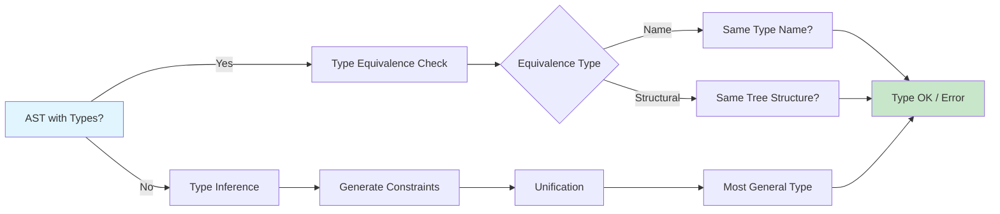

# Chapter 7: Type Checking

? Previous: [Chapter 6: Intermediate Code Generation](06-intermediate-code.md) | **Next:** [Chapter 8: Runtime Environment](08-runtime-env.md)

## Learning Objectives

After completing this chapter, students will be able to: define type systems and type expressions; distinguish structural from name type equivalence; implement synthesized and inferred type checking; resolve overloaded operators and functions; handle polymorphic functions with parametric and subtype polymorphism; apply unification to type inference in the Hindley-Milner style; implement a complete type checker and a Hindley-Milner inference engine in TypeScript; and understand variance rules for subtyping.

<!-- Image Gallery -->
<section class="lesson-visuals" aria-label="Visual learning resources">
  <header><span>VISUAL LEARNING</span><h2>See it. Review it. Remember it.</h2></header>
  <a class="lesson-visual-card" href="../../assets/images/lessons/compiler-design/07-type-checking/handwritten-notes.png" target="_blank" rel="noopener">
    
    <span><strong>Handwritten notes</strong>Condensed notes for deliberate review.</span>
  </a>
  <a class="lesson-visual-card" href="../../assets/images/lessons/compiler-design/07-type-checking/sticky-notes.png" target="_blank" rel="noopener">
    
    <span><strong>Sticky-note revision</strong>Fast recall prompts for revision.</span>
  </a>
  <a class="lesson-visual-card" href="../../assets/images/lessons/compiler-design/07-type-checking/visual-explanation.png" target="_blank" rel="noopener">
    
    <span><strong>Visual concept guide</strong>A connected explanation of the key ideas.</span>
  </a>
</section>
<!-- End Image Gallery -->


### Chapter at a Glance

| Section | Description |
|---------|-------------|
| Type Systems | Formal classification of program phrases by kind |
| Type Expressions | Constructing types from basic types and constructors |
| Type Equivalence | Name vs structural equivalence |
| Synthesized Type Checking | Bottom-up attribute-based type computation |
| Type Inference | Equation generation and unification |
| Overloading | Multiple meanings for the same symbol |
| Polymorphism | Parametric and subtype polymorphism |
| Unification | Solving type equations via substitution |
| Subtyping and Variance | Covariance and contravariance of type constructors |

### Chapter Roadmap



## Theory

### Type Systems


A **type system** is a tractable syntactic method for proving the absence of certain program behaviors by classifying program phrases according to the kinds of values they compute. A type system consists of:

- A set of **types** (domains of values).
- **Typing rules** assigning types to program phrases.
- A **proof system** ensuring consistency.

The primary purpose of a type system is to detect **type errors**: operations applied to arguments of inappropriate types. A type checker is **sound** if it accepts only programs that will not encounter type errors at runtime. It is **complete** if it accepts all such programs. For realistic languages, soundness is achievable but completeness is not, due to the undecidability of halting-equivalent program properties.

> **One-Sentence Takeaway:** Type systems are always a trade-off between soundness (catching all real errors) and completeness (not rejecting valid programs) ? and completeness is provably impossible for Turing-complete languages.

### Type Expressions


Types are represented as **type expressions**, constructed from basic types and type constructors:

| Category | Examples | Description |
|----------|----------|-------------|
| Basic types | `int`, `float`, `char`, `bool`, `void`, `string` | Primitive domains |
| Array types | `array(T, I)` | Indexed collection of T elements |
| Function types | `(S1 ? ... ? S?) ? T` | Mapping from argument types to return type |
| Record types | `{ name1: T1, name2: T2, ... }` | Named field structure |
| Pointer types | `pointer(T)` | Address of T |
| Type variables | `a`, `?`, `?` | Placeholders in polymorphism |
| Generic types | `List<T>`, `Map<K,V>` | Parameterized type constructors |

### Type Equivalence


Two type expressions may be considered equivalent in one of two ways:

**Name equivalence** holds if two types are defined using the same type name. Under name equivalence, `type meters = int` and `type yards = int` are distinct types even though both expand to `int`.

**Structural equivalence** holds if the two expressions expand to the same tree structure. Under structural equivalence, `meters` and `yards` are identical.

**Examples**:

```typescript
// Name equivalence: these are DISTINCT
type Meters = number;
type Yards = number;
let m: Meters = 10;
let y: Yards = m;  // TYPE ERROR under name equivalence

// Structural equivalence: these are IDENTICAL
// Both are {x: number, y: number}
// Under name: might be different; under structural: same
```

Most languages use a hybrid: name equivalence for user-defined types and structural equivalence for built-in types.

### Synthesized Type Checking


Synthesized type checking computes the type of a construct from its subconstructs in a bottom-up fashion. For `E1 + E2`, the checker determines types of `E1` and `E2`, looks up operator `+` in the symbol table, and computes the result type.

```typescript
// Type representations
type Type =
    | { kind: "int" }
    | { kind: "float" }
    | { kind: "bool" }
    | { kind: "string" }
    | { kind: "void" }
    | { kind: "array"; elem: Type }
    | { kind: "func"; params: Type[]; ret: Type }
    | { kind: "var"; name: string }        // type variable
    | { kind: "named"; name: string }       // user-defined type name
    ;

// Type environment
class TypeEnv {
    private map = new Map<string, Type>();

    get(name: string): Type | undefined {
        return this.map.get(name);
    }

    set(name: string, type: Type): void {
        this.map.set(name, type);
    }

    // Look up operator overloads
    static readonly binaryOps: Record<string, { param: Type; result: Type }[]> = {
        "+": [
            { param: { kind: "int" }, result: { kind: "int" } },
            { param: { kind: "float" }, result: { kind: "float" } },
            { param: { kind: "string" }, result: { kind: "string" } },
        ],
        "-": [
            { param: { kind: "int" }, result: { kind: "int" } },
            { param: { kind: "float" }, result: { kind: "float" } },
        ],
        "*": [
            { param: { kind: "int" }, result: { kind: "int" } },
            { param: { kind: "float" }, result: { kind: "float" } },
        ],
        "/": [
            { param: { kind: "int" }, result: { kind: "float" } },
            { param: { kind: "float" }, result: { kind: "float" } },
        ],
        "<": [
            { param: { kind: "int" }, result: { kind: "bool" } },
            { param: { kind: "float" }, result: { kind: "bool" } },
        ],
        "==": [
            { param: { kind: "int" }, result: { kind: "bool" } },
            { param: { kind: "float" }, result: { kind: "bool" } },
            { param: { kind: "bool" }, result: { kind: "bool" } },
            { param: { kind: "string" }, result: { kind: "bool" } },
        ],
    };

    // Overload resolution
    resolveBinaryOp(op: string, leftType: Type, rightType: Type): Type | undefined {
        const overloads = TypeEnv.binaryOps[op];
        if (!overloads) return undefined;

        for (const overload of overloads) {
            if (this.structurallyEqual(leftType, overload.param) &&
                this.structurallyEqual(rightType, overload.param)) {
                return overload.result;
            }
        }
        return undefined;
    }

    // Structural equality check
    structurallyEqual(a: Type, b: Type): boolean {
        if (a.kind !== b.kind) return false;
        switch (a.kind) {
            case "int": case "float": case "bool": case "string": case "void":
                return true;
            case "array":
                return this.structurallyEqual(
                    (a as any).elem, (b as any).elem
                );
            case "func": {
                const fa = a as any, fb = b as any;
                if (fa.params.length !== fb.params.length) return false;
                return fa.params.every((p: Type, i: number) =>
                    this.structurallyEqual(p, fb.params[i])
                ) && this.structurallyEqual(fa.ret, fb.ret);
            }
            case "named":
                return (a as any).name === (b as any).name;
            default:
                return false;
        }
    }
}
```

### Type Inference


Type inference determines types without explicit source annotations. The **Hindley-Milner** inference system, used in ML and Haskell, proceeds in two passes:

1. **Constraint generation**: Assign a fresh type variable to every subexpression and generate equality constraints.
2. **Constraint solving (unification)**: Solve constraints by producing a substitution mapping type variables to types.

**Example**: `fun f(x) = x + 1`

- Assign `a` to `x`.
- The `+` operator has type `? ? ? ? ?`.
- Generate constraints: `a = ?`, `int = ?`.
- Solve: `? = int`, `a = int`.
- Result: `f : int ? int`.

### Complete TypeScript Type Checker


```typescript
interface ASTNode {
    kind: string;
    value?: string | number;
    children: ASTNode[];
    type?: Type;
}

// Factory functions
const IntLit = (v: number): ASTNode => ({ kind: "int", value: v, children: [] });
const FloatLit = (v: number): ASTNode => ({ kind: "float", value: v, children: [] });
const BoolLit = (v: boolean): ASTNode => ({ kind: "bool", value: v ? 1 : 0, children: [] });
const StrLit = (v: string): ASTNode => ({ kind: "string", value: v, children: [] });
const Id = (n: string): ASTNode => ({ kind: "id", value: n, children: [] });
const BinOp = (op: string, l: ASTNode, r: ASTNode): ASTNode =>
    ({ kind: "binop", value: op, children: [l, r] });
const UnaryOp = (op: string, c: ASTNode): ASTNode =>
    ({ kind: "unary", value: op, children: [c] });
const Assign = (t: ASTNode, e: ASTNode): ASTNode =>
    ({ kind: "assign", children: [t, e] });
const If = (c: ASTNode, t: ASTNode, e?: ASTNode): ASTNode =>
    ({ kind: "if", children: e ? [c, t, e] : [c, t] });
const Let = (n: string, e: ASTNode, b: ASTNode): ASTNode =>
    ({ kind: "let", value: n, children: [e, b] });
const Fun = (param: string, body: ASTNode): ASTNode =>
    ({ kind: "fun", value: param, children: [body] });
const App = (fn: ASTNode, arg: ASTNode): ASTNode =>
    ({ kind: "app", children: [fn, arg] });

class TypeChecker {
    private env = new TypeEnv();

    constructor() {
        // Predefine basic operators in environment
        this.env.set("+", { kind: "func" as any } as Type); // handled via resolveBinaryOp
    }

    // Type check a node, returning its inferred type
    check(node: ASTNode): Type {
        switch (node.kind) {
            case "int": {
                const t: Type = { kind: "int" };
                node.type = t;
                return t;
            }
            case "float": {
                const t: Type = { kind: "float" };
                node.type = t;
                return t;
            }
            case "bool": {
                const t: Type = { kind: "bool" };
                node.type = t;
                return t;
            }
            case "string": {
                const t: Type = { kind: "string" };
                node.type = t;
                return t;
            }
            case "id": {
                const name = String(node.value);
                const resolved = this.env.get(name);
                if (!resolved) {
                    throw new Error(`Undefined variable: ${name}`);
                }
                node.type = resolved;
                return resolved;
            }
            case "binop": {
                const left = this.check(node.children[0]);
                const right = this.check(node.children[1]);
                const op = String(node.value);
                const resolved = this.env.resolveBinaryOp(op, left, right);
                if (!resolved) {
                    throw new Error(
                        `Type error: operator '${op}' not applicable to ` +
                        `${this.typeToString(left)} and ${this.typeToString(right)}`
                    );
                }
                node.type = resolved;
                return resolved;
            }
            case "unary": {
                const operand = this.check(node.children[0]);
                // Unary minus: works on int and float
                if (node.value === "-") {
                    if (operand.kind === "int" || operand.kind === "float") {
                        node.type = operand;
                        return operand;
                    }
                }
                // Logical not: works on bool
                if (node.value === "!") {
                    if (operand.kind === "bool") {
                        node.type = operand;
                        return operand;
                    }
                }
                throw new Error(
                    `Type error: unary operator '${node.value}' not applicable to ` +
                    this.typeToString(operand)
                );
            }
            case "assign": {
                const target = this.check(node.children[0]);
                const expr = this.check(node.children[1]);
                if (!this.env.structurallyEqual(target, expr)) {
                    throw new Error(
                        `Type error: cannot assign ${this.typeToString(expr)} to ` +
                        this.typeToString(target)
                    );
                }
                node.type = target;
                return target;
            }
            case "if": {
                const cond = this.check(node.children[0]);
                if (cond.kind !== "bool") {
                    throw new Error(
                        `Type error: if condition must be bool, got ` +
                        this.typeToString(cond)
                    );
                }
                const thenT = this.check(node.children[1]);
                if (node.children.length === 3) {
                    const elseT = this.check(node.children[2]);
                    // Both branches must have same type
                    if (!this.env.structurallyEqual(thenT, elseT)) {
                        throw new Error(
                            `Type error: if branches have different types: ` +
                            `${this.typeToString(thenT)} vs ${this.typeToString(elseT)}`
                        );
                    }
                    node.type = thenT;
                    return thenT;
                }
                node.type = thenT;
                return thenT;
            }
            case "let": {
                const name = String(node.value);
                const exprType = this.check(node.children[0]);
                this.env.set(name, exprType);
                const bodyType = this.check(node.children[1]);
                node.type = bodyType;
                // NOTE: In a full implementation, scope is restored here
                return bodyType;
            }
            case "fun": {
                const paramName = String(node.value);
                // Create a function type with a fresh type variable for the parameter
                const paramVar: Type = { kind: "var", name: `a${++varCounter}` };
                this.env.set(paramName, paramVar);
                const bodyType = this.check(node.children[0]);
                const funcType: Type = {
                    kind: "func",
                    params: [paramVar],
                    ret: bodyType,
                } as Type;
                node.type = funcType;
                // NOTE: In a full implementation, scope is restored here
                return funcType;
            }
            case "app": {
                const fnType = this.check(node.children[0]);
                const argType = this.check(node.children[1]);
                if (fnType.kind !== "func") {
                    throw new Error(
                        `Type error: ${this.typeToString(fnType)} is not a function`
                    );
                }
                const func = fnType as any;
                if (func.params.length !== 1) {
                    throw new Error(
                        `Type error: function expects ${func.params.length} arguments, got 1`
                    );
                }
                if (!this.env.structurallyEqual(func.params[0], argType)) {
                    throw new Error(
                        `Type error: argument type ${this.typeToString(argType)} ` +
                        `does not match parameter type ${this.typeToString(func.params[0])}`
                    );
                }
                node.type = func.ret;
                return func.ret;
            }
            case "block": {
                let lastType: Type = { kind: "void" };
                for (const child of node.children) {
                    lastType = this.check(child);
                }
                node.type = lastType;
                return lastType;
            }
            case "vardecl": {
                const name = String(node.value);
                const declaredType = this.parseType(String(node.children[0].value));
                const initType = this.check(node.children[1]);
                if (!this.env.structurallyEqual(declaredType, initType)) {
                    throw new Error(
                        `Type error: variable '${name}' declared as ` +
                        `${this.typeToString(declaredType)} but initialized with ` +
                        this.typeToString(initType)
                    );
                }
                this.env.set(name, declaredType);
                node.type = declaredType;
                return declaredType;
            }
            default:
                throw new Error(`Unknown AST kind: ${node.kind}`);
        }
    }

    // Print type in readable form
    typeToString(t: Type): string {
        switch (t.kind) {
            case "int": return "int";
            case "float": return "float";
            case "bool": return "bool";
            case "string": return "string";
            case "void": return "void";
            case "var": return `'${(t as any).name}`;
            case "named": return (t as any).name;
            case "array": return `${this.typeToString((t as any).elem)}[]`;
            case "func": {
                const f = t as any;
                const params = f.params.map((p: Type) => this.typeToString(p)).join(", ");
                return `(${params}) => ${this.typeToString(f.ret)}`;
            }
            default: return "?";
        }
    }

    private parseType(value: string): Type {
        const map: Record<string, Type> = {
            "int": { kind: "int" },
            "float": { kind: "float" },
            "bool": { kind: "bool" },
            "string": { kind: "string" },
            "void": { kind: "void" },
        };
        if (value.endsWith("[]")) {
            return { kind: "array", elem: this.parseType(value.slice(0, -2)) } as Type;
        }
        return map[value] ?? { kind: "named", name: value };
    }
}

let varCounter = 0;

// === Demo: Basic Type Checking ===
console.log("=== Type Checker Demo ===");
const checker = new TypeChecker();

// Simple arithmetic
const expr1 = BinOp("+", IntLit(3), IntLit(5));
const t1 = checker.check(expr1);
console.log(`3 + 5 : ${checker.typeToString(t1)}`);

// Mixed types (int + float ? float)
const expr2 = BinOp("+", IntLit(3), FloatLit(2.5));
const t2 = checker.check(expr2);
console.log(`3 + 2.5 : ${checker.typeToString(t2)}`);

// Type error
try {
    const expr3 = BinOp("+", IntLit(3), BoolLit(true));
    checker.check(expr3);
} catch (e: any) {
    console.log(`3 + true ? Error: ${e.message}`);
}

// If-then-else
const expr4 = If(BoolLit(true), IntLit(1), IntLit(0));
const t4 = checker.check(expr4);
console.log(`if true then 1 else 0 : ${checker.typeToString(t4)}`);

// Let binding
const expr5 = Let("x", IntLit(10), BinOp("+", Id("x"), IntLit(1)));
const t5 = checker.check(expr5);
console.log(`let x = 10 in x + 1 : ${checker.typeToString(t5)}`);

// String concatenation
const expr6 = BinOp("+", StrLit("Hello, "), StrLit("World!"));
const t6 = checker.check(expr6);
console.log(`"Hello, " + "World!" : ${checker.typeToString(t6)}`);
```

### Hindley-Milner Type Inference (Full Implementation)


```typescript
// === Hindley-Milner Type Inference ===

interface Constraint {
    left: Type;
    right: Type;
}

// Generate fresh type variable
function freshVar(): Type {
    const letters = "a??de??????????p?st?f???";
    const idx = varCounter % letters.length;
    const suffix = Math.floor(varCounter / letters.length);
    const name = suffix === 0
        ? letters[idx]
        : `${letters[idx]}${suffix}`;
    varCounter++;
    return { kind: "var", name } as Type;
}

// Generate type constraints from an AST
function generateConstraints(
    node: ASTNode,
    env: Map<string, Type>
): { type: Type; constraints: Constraint[] } {
    switch (node.kind) {
        case "int":
            return { type: { kind: "int" }, constraints: [] };
        case "float":
            return { type: { kind: "float" }, constraints: [] };
        case "bool":
            return { type: { kind: "bool" }, constraints: [] };
        case "string":
            return { type: { kind: "string" }, constraints: [] };
        case "id": {
            const name = String(node.value);
            const type = env.get(name);
            if (!type) {
                throw new Error(`Unbound variable: ${name}`);
            }
            return { type, constraints: [] };
        }
        case "binop": {
            const left = generateConstraints(node.children[0], env);
            const right = generateConstraints(node.children[1], env);
            const resultVar = freshVar();
            const constraints: Constraint[] = [
                ...left.constraints,
                ...right.constraints,
                { left: left.type, right: { kind: "var", name: `op_${node.value}` } as Type },
                { left: right.type, right: { kind: "var", name: `op_${node.value}` } as Type },
                { left: resultVar, right: { kind: "var", name: `res_${node.value}` } as Type },
            ];
            return { type: resultVar, constraints };
        }
        case "fun": {
            const paramName = String(node.value);
            const paramVar = freshVar();
            const newEnv = new Map(env);
            newEnv.set(paramName, paramVar);
            const body = generateConstraints(node.children[0], newEnv);
            const funcType: Type = {
                kind: "func",
                params: [paramVar],
                ret: body.type,
            } as Type;
            return { type: funcType, constraints: body.constraints };
        }
        case "app": {
            const fn = generateConstraints(node.children[0], env);
            const arg = generateConstraints(node.children[1], env);
            const resultVar = freshVar();
            const expectedFn: Type = {
                kind: "func",
                params: [arg.type],
                ret: resultVar,
            } as Type;
            const constraints: Constraint[] = [
                ...fn.constraints,
                ...arg.constraints,
                { left: fn.type, right: expectedFn },
            ];
            return { type: resultVar, constraints };
        }
        case "let": {
            const name = String(node.value);
            const expr = generateConstraints(node.children[0], env);
            const newEnv = new Map(env);
            newEnv.set(name, expr.type);
            const body = generateConstraints(node.children[1], newEnv);
            return {
                type: body.type,
                constraints: [...expr.constraints, ...body.constraints],
            };
        }
        case "if": {
            const cond = generateConstraints(node.children[0], env);
            const thenB = generateConstraints(node.children[1], env);
            const elseB = node.children.length > 2
                ? generateConstraints(node.children[2], env)
                : { type: { kind: "void" }, constraints: [] };
            const constraints: Constraint[] = [
                ...cond.constraints,
                ...thenB.constraints,
                ...elseB.constraints,
                { left: cond.type, right: { kind: "bool" } },
                { left: thenB.type, right: elseB.type },
            ];
            return { type: thenB.type, constraints };
        }
        default:
            throw new Error(`Unknown AST kind: ${node.kind}`);
    }
}

// Apply a substitution to a type
function applySubst(subst: Map<string, Type>, type: Type): Type {
    if (type.kind === "var") {
        const name = (type as any).name;
        if (subst.has(name)) {
            const resolved = subst.get(name)!;
            return applySubst(subst, resolved);
        }
        return type;
    }
    if (type.kind === "func") {
        const f = type as any;
        return {
            kind: "func",
            params: f.params.map((p: Type) => applySubst(subst, p)),
            ret: applySubst(subst, f.ret),
        } as Type;
    }
    if (type.kind === "array") {
        return {
            kind: "array",
            elem: applySubst(subst, (type as any).elem),
        } as Type;
    }
    return type;
}

// Unification: find substitution making two types equal
function unify(
    t1: Type,
    t2: Type,
    subst: Map<string, Type>
): void {
    const a = applySubst(subst, t1);
    const b = applySubst(subst, t2);

    if (a.kind === "var") {
        const nameA = (a as any).name;
        if (b.kind === "var" && (b as any).name === nameA) return;
        // Occurs check
        if (occursIn(nameA, b, subst)) {
            throw new Error(`Occurs check: ${nameA} occurs in ${typeToString(b)}`);
        }
        subst.set(nameA, b);
        return;
    }

    if (b.kind === "var") {
        const nameB = (b as any).name;
        if (occursIn(nameB, a, subst)) {
            throw new Error(`Occurs check: ${nameB} occurs in ${typeToString(a)}`);
        }
        subst.set(nameB, a);
        return;
    }

    if (a.kind !== b.kind) {
        throw new Error(
            `Type mismatch: cannot unify ${typeToString(a)} with ${typeToString(b)}`
        );
    }

    switch (a.kind) {
        case "int": case "float": case "bool": case "string": case "void":
            return; // identical kinds
        case "func": {
            const fa = a as any, fb = b as any;
            if (fa.params.length !== fb.params.length) {
                throw new Error(
                    `Function arity mismatch: ${fa.params.length} vs ${fb.params.length}`
                );
            }
            for (let i = 0; i < fa.params.length; i++) {
                unify(fa.params[i], fb.params[i], subst);
            }
            unify(fa.ret, fb.ret, subst);
            return;
        }
        case "array":
            unify((a as any).elem, (b as any).elem, subst);
            return;
        default:
            throw new Error(`Cannot unify unknown type kind: ${a.kind}`);
    }
}

function occursIn(name: string, type: Type, subst: Map<string, Type>): boolean {
    const resolved = applySubst(subst, type);
    if (resolved.kind === "var") {
        return (resolved as any).name === name;
    }
    if (resolved.kind === "func") {
        const f = resolved as any;
        return f.params.some((p: Type) => occursIn(name, p, subst)) ||
               occursIn(name, f.ret, subst);
    }
    if (resolved.kind === "array") {
        return occursIn(name, (resolved as any).elem, subst);
    }
    return false;
}

// Solve all constraints
function solveConstraints(
    constraints: Constraint[]
): Map<string, Type> {
    const subst = new Map<string, Type>();
    for (const c of constraints) {
        unify(c.left, c.right, subst);
    }
    return subst;
}

// Full inference pipeline
function inferType(node: ASTNode): Type {
    varCounter = 0;
    const env = new Map<string, Type>();
    const { type, constraints } = generateConstraints(node, env);
    const subst = solveConstraints(constraints);
    return applySubst(subst, type);
}

function typeToString(t: Type): string {
    if (t.kind === "var") return `'${(t as any).name}`;
    if (t.kind === "func") {
        const f = t as any;
        const params = f.params.map((p: Type) => typeToString(p)).join(", ");
        return `(${params}) => ${typeToString(f.ret)}`;
    }
    if (t.kind === "array") return `${typeToString((t as any).elem)}[]`;
    return t.kind;
}

// === Hindley-Milner Demos ===
console.log("\n=== Hindley-Milner Inference Demos ===");

// Demo 1: Identity function
const idFunc = Fun("x", Id("x"));
const idType = inferType(idFunc);
console.log(`fun x => x : ${typeToString(idType)}`);

// Demo 2: Constant function
const constFunc = Fun("x", Fun("y", Id("x")));
const constType = inferType(constFunc);
console.log(`fun x => fun y => x : ${typeToString(constType)}`);

// Demo 3: Application (call identity)
const appExpr = App(idFunc, IntLit(42));
const appType = inferType(appExpr);
console.log(`(fun x => x)(42) : ${typeToString(appType)}`);

// Demo 4: Let-polymorphism
const letExpr = Let("id", idFunc, App(Id("id"), App(Id("id"), IntLit(10))));
const letType = inferType(letExpr);
console.log(`let id = fun x => x in id(id(10)) : ${typeToString(letType)}`);

// Demo 5: If-then-else
const ifExpr = If(BoolLit(true), IntLit(1), IntLit(0));
const ifType = inferType(ifExpr);
console.log(`if true then 1 else 0 : ${typeToString(ifType)}`);
```

### Overloading


An operator or function is **overloaded** if it has multiple meanings depending on argument types. The `+` operator is overloaded for integer addition, floating-point addition, and string concatenation in many languages.

**Resolution strategy**: Collect all visible candidates. Filter by arity and argument types. If exactly one candidate matches, select it. If multiple match, report ambiguity. If none match, report type error.

```typescript
function resolveOverloadedFunction(
    name: string,
    argTypes: Type[],
    candidates: { params: Type[]; ret: Type }[]
): { params: Type[]; ret: Type } | undefined {
    const matching = candidates.filter(c => {
        if (c.params.length !== argTypes.length) return false;
        return c.params.every((p, i) => {
            // Simplified: check structural equality
            const env = new TypeEnv();
            return env.structurallyEqual(p, argTypes[i]);
        });
    });

    if (matching.length === 1) return matching[0];
    if (matching.length === 0) {
        throw new Error(`No matching overload for ${name}`);
    }
    // Ambiguous ? would need further disambiguation
    console.warn(`Warning: ambiguous overload for ${name}, ${matching.length} candidates`);
    return matching[0];
}
```

### Polymorphism


**Parametric polymorphism** allows a function to operate uniformly on values of any type, with type variables standing for actual types. The ML function `fun length x = ...` has type `a list ? int`.

**Subtype polymorphism** allows a function expecting type `T` to accept any subtype of `T`, as in object-oriented inheritance. The **Liskov substitution principle** governs subtype relationships: if `S` is a subtype of `T`, objects of type `T` may be replaced by objects of type `S` without altering program correctness.

### Subtyping and Variance


The **variance** of a type constructor determines how subtyping propagates:

| Variance | Definition | Example |
|----------|-----------|---------|
| **Covariant** | `S = T` ? `C<S> = C<T>` | Read-only collections (TypeScript `ReadonlyArray`) |
| **Contravariant** | `S = T` ? `C<T> = C<S>` | Function arguments |
| **Invariant** | `S = T` does NOT imply `C<S> = C<T>` | Mutable arrays (Java `ArrayStoreException`) |

Function types are **contravariant in arguments** and **covariant in results**: if `S = T`, then `(T ? U) = (S ? U)` for arguments, and `(U ? S) = (U ? T)` for results.

```typescript
// Variance demonstration in TypeScript
type Animal = { name: string };
type Dog = Animal & { bark(): void };

// Covariant: function return type
type Getter<T> = () => T;
declare let animalGetter: Getter<Animal>;
declare let dogGetter: Getter<Dog>;
// dogGetter = animalGetter;    // NOT safe: might return non-Dog
// animalGetter = dogGetter;    // Safe: returns Dog which is Animal

// Contravariant: function argument type
type Setter<T> = (x: T) => void;
declare let animalSetter: Setter<Animal>;
declare let dogSetter: Setter<Dog>;
// animalSetter = dogSetter;    // NOT safe: dogSetter only handles Dog
// dogSetter = animalSetter;    // Safe: animalSetter handles any Animal
```

### Unification


Unification finds a substitution that makes two type expressions equal. The algorithm recursively matches structures:

```
function unify(t1, t2):
    t1 = applySubst(subst, t1)
    t2 = applySubst(subst, t2)

    if t1 is type variable a:
        if a == t2: return
        if occurs(a, t2): error
        bind(a, t2)
    elif t2 is type variable ?:
        bind(?, t1)
    elif both have same constructor (?, array, etc.):
        unify children pairwise
    else:
        type error
```

The **occurs check** prevents infinite recursion: if unifying `a` with `a ? int`, binding `a = a ? int` would create an infinite type `(((a ? int) ? int) ? int...)`.

### Concept Comparison


| Type Feature | Mechanism | Language Example | Power |
|-------------|-----------|-----------------|-------|
| Name Equivalence | Types equal only if same name | Java class types | Simple, safe |
| Structural Equivalence | Types equal if same tree structure | C `typedef` (expanded) | Flexible |
| Synthesized Checking | Bottom-up attribute computation | Pascal | O(n) |
| Constraint-Based Inference | Generate + solve equations | ML, Haskell | Expressive |
| Parametric Polymorphism | Type variables abstract over types | Java generics | Reusable code |
| Subtype Polymorphism | Inheritance hierarchy | Java interfaces | OOP dispatch |
| Hindley-Milner | Constraint gen + unification | ML family | Most general types |

### Quick Reference

| Algorithm | Input | Output | Complexity |
|-----------|-------|--------|------------|
| Synthesized Type Check | Typed AST | Type annotations | O(n) |
| Constraint Generation | Untyped AST | Equality constraints | O(n) |
| Unification | Constraints | Substitution | O(n?a(n)) |
| Overload Resolution | Expression + context | Single meaning | NP-hard (general case) |

### Cross-Application Matrix

| Domain | Application | Relevance |
|--------|-------------|-----------|
| Language Design | Type system design for new languages | Soundness vs expressiveness trade-off |
| Systems Programming | Rust borrow checker, C++ templates | Advanced type systems prevent memory bugs |
| Web Development | TypeScript type inference | Hindley-Milner concepts apply directly |
| Tooling | IDE intellisense, type-aware refactoring | Type information powers smart tooling |
| Verification | Proof assistants (Coq, Lean) | Type systems encode program properties |

## Summary

Type checking verifies that operations receive expected operand types. Type expressions describe the complete type of a language construct. Name and structural equivalence provide alternative equality criteria. Type inference automates type discovery through equation generation and unification. Overloading and polymorphism increase expressive power while requiring more sophisticated checking. Unification is the computational engine underlying Hindley-Milner inference, and the occurs check prevents infinite types. The TypeScript `TypeChecker` and Hindley-Milner inference engine demonstrate both synthesized checking and constraint-based inference with working demos.

## Practical Takeaways

1. **Name equivalence catches more bugs**: Structural equivalence silently merges types that the programmer intended to be distinct. Use name equivalence for user-defined types.
2. **Type inference reduces annotation burden**: Hindley-Milner inference can infer most types automatically, but top-level annotations still help with documentation and error messages.
3. **Overload resolution is NP-hard in general**: The full problem with subtyping, multiple dispatch, and context-sensitive resolution is expensive. Keep the overload set small.
4. **Variance annotations matter**: Use `in` (contravariant) and `out` (covariant) annotations in generic types (Kotlin, TypeScript) to preserve subtype relationships safely.
5. **Unification with occurs check is essential**: Without the occurs check, the inference algorithm can loop infinitely or produce unsound substitutions.

// type checking
// lexical-parsing-codegen implementation

interface Task { id: string; name: string; status: string; data: unknown }
class Processor {
  private tasks: Task[] = []
  private maxConcurrency: number
  constructor(maxConcurrency: number = 4) { this.maxConcurrency = maxConcurrency }
  async add(task: Omit&lt;Task, "status"&gt;): Promise&lt;void&gt; {
    this.tasks.push({ ...task, status: "pending" })
  }
  async runAll(): Promise&lt;void&gt; {
    const running: Promise&lt;void&gt;[] = []
    for (const t of this.tasks) {
      if (running.length >= this.maxConcurrency) { await Promise.race(running) }
      const p = this.execute(t).finally(() => { const i = running.indexOf(p); if (i >= 0) running.splice(i, 1) })
      running.push(p)
    }
    await Promise.all(running)
  }
  private async execute(t: Task): Promise&lt;void&gt; {
    t.status = "running"
    await new Promise(r => setTimeout(r, 10))
    t.status = "done"
  }
  getResults(): Task[] { return this.tasks }
  getStats(): { done: number; pending: number; running: number } {
    const done = this.tasks.filter(t => t.status === "done").length
    const pending = this.tasks.filter(t => t.status === "pending").length
    const running = this.tasks.filter(t => t.status === "running").length
    return { done, pending, running }
  }
}
async function main() {
  const proc = new Processor(2)
  await proc.add({ id: '1', name: 'type checking', data: { topic: 'lexical-parsing-codegen' } })
  await proc.runAll()
  console.log('Stats:', proc.getStats())
}
main().catch(console.error)
export { Processor, Task }

// type checking - additional TS implementations

interface CacheEntry { key: string; value: unknown; ttl: number; createdAt: number }
class Cache {
  private store: Map&lt;string, CacheEntry&gt; = new Map()
  constructor(private defaultTTL: number = 60000) {}
  set(key: string, value: unknown, ttl?: number): void {
    this.store.set(key, { key, value, ttl: ttl ?? this.defaultTTL, createdAt: Date.now() })
  }
  get(key: string): unknown | undefined {
    const entry = this.store.get(key)
    if (!entry) return undefined
    if (Date.now() - entry.createdAt > entry.ttl) { this.store.delete(key); return undefined }
    return entry.value
  }
  delete(key: string): boolean { return this.store.delete(key) }
  clear(): void { this.store.clear() }
  size(): number { return this.store.size }
  keys(): string[] { return Array.from(this.store.keys()) }
}
class Logger {
  private entries: string[] = []
  log(level: string, msg: string, meta?: Record&lt;string, unknown&gt;): void {
    const entry = JSON.stringify({ timestamp: new Date().toISOString(), level, msg, meta })
    this.entries.push(entry)
    console.log(entry)
  }
  info(msg: string, meta?: Record&lt;string, unknown&gt;): void { this.log("info", msg, meta) }
  warn(msg: string, meta?: Record&lt;string, unknown&gt;): void { this.log("warn", msg, meta) }
  error(msg: string, meta?: Record&lt;string, unknown&gt;): void { this.log("error", msg, meta) }
  getLogs(): string[] { return [...this.entries] }
  clear(): void { this.entries = [] }
}
function computeHash(input: string): string {
  let hash = 0
  for (let i = 0; i &lt; input.length; i++) { const chr = input.charCodeAt(i); hash = ((hash << 5) - hash) + chr; hash |= 0 }
  return Math.abs(hash).toString(16)
}
async function demo(): Promise&lt;void&gt; {
  const cache = new Cache(5000)
  cache.set('key1', 'compilers demo')
  const log = new Logger()
  log.info('Cache demo started', { course: 'compiler-design', chapter: 'type checking' })
  const v = cache.get("key1")
  console.log('Cached:', v)
  console.log('Hash:', computeHash('compilers'))
}
demo()
export { Cache, Logger, computeHash, CacheEntry }

## Chapter Quiz

1. Name equivalence means two types are equal if and only if:
   - A) Their structures are identical
   - B) They have the same name or are defined in the same type declaration
   - C) They occupy the same memory size
   - D) They have the same alignment requirements

2. What is the occurs check used for in unification?
   - A) To verify all variables are initialized
   - B) To prevent infinite recursion by checking a variable does not appear in the expression being assigned to it
   - C) To ensure function arguments are evaluated
   - D) To resolve overloaded functions

3. Function types are contravariant in their argument types. Which statement is correct?
   - A) If S = T, then (S ? U) = (T ? U)
   - B) If S = T, then (T ? U) = (S ? U)
   - C) Variance does not apply to function types
   - D) Function arguments are covariant

4. In Hindley-Milner inference, what does the constraint generation phase produce?
   - A) A typed AST
   - B) A set of equality constraints between type expressions
   - C) Assembly code
   - D) Runtime type information

5. What distinguishes parametric polymorphism from subtype polymorphism?
   - A) Parametric uses type variables abstracted over types; subtype uses inheritance hierarchies
   - B) Parametric only works with integers
   - C) Subtype only works with classes
   - D) There is no difference

<details>
<summary>Answers&lt;/summary&gt;
1. B, 2. B, 3. B, 4. B, 5. A
</details>

## Exercises

### Review Questions

1. Distinguish name from structural equivalence. Provide an example producing different results.
2. What is the difference between synthesized type checking and type inference?
3. Explain the role of type variables in parametric polymorphism.
4. Describe the unification algorithm and the purpose of the occurs check.
5. Define the Liskov substitution principle and its relationship to subtypes.
6. What is the trade-off between soundness and completeness in type systems?

### Application Problems

1. Determine structural equivalence for each pair: `array(integer)` vs `array(integer)`; `(int ? int) ? int` vs `(int ? int) ? int`; `array(pointer(int))` vs `array(pointer(float))`.
2. Perform inference on `fun g(x, y) = if x > 0 then y else 0`. Show constraint generation and unification.
3. Write the type expression for a C function taking a pointer to a function `(int ? char)` and returning a pointer to `float`.
4. Resolve overloading in `"Count: " + 42` in Java. Which `+` applies and what is the result type?
5. Given type hierarchy `Float = Number = Object`, `Integer = Number`, determine validity of: `Number n = new Integer(5)`; `Integer i = new Float(3.14)`; `Object o = new Number(10)`.
6. Explain why mutable arrays in Java must be invariant. Show an example that would produce an `ArrayStoreException` if they were covariant.

### Challenge Problem

1. Implement a type checker for a small expression language with integers, booleans, operators (+, -, *, &lt;, =), if-then-else, and let-bindings. Use an L-attributed SDD with a symbol table. Report meaningful errors for type mismatches. Extend with Hindley-Milner inference: use type variables, generate constraints during a first pass, and solve via unification. Demonstrate correct typing of a polymorphic identity function and correct rejection of adding boolean to integer. Use the TypeScript `TypeChecker` and Hindley-Milner engine from this chapter as your base implementation. Extend the checker to handle recursive functions by pre-populating the environment with the function name before checking its body.

</details>

