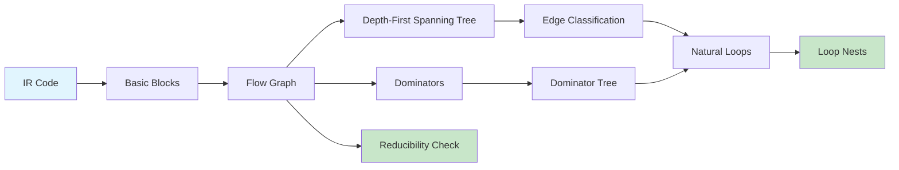

# Chapter 11: Control-Flow Analysis

? Previous: [Chapter 10: Code Optimization](10-optimization.md) | **Next:** [Chapter 12: Data-Flow Analysis](12-dfa.md)

## Learning Objectives

After completing this chapter, students will be able to: identify basic blocks from intermediate-code sequences; construct flow graphs and edge types; compute dominators using the iterative data-flow algorithm; implement the Lengauer-Tarjan near-linear dominator algorithm; build depth-first spanning trees and classify edges; identify natural loops and their pre-headers; determine whether a flow graph is reducible; and implement a complete CFA framework in TypeScript.

<!-- Image Gallery -->
<section class="lesson-visuals" aria-label="Visual learning resources">
  <header><span>VISUAL LEARNING</span><h2>See it. Review it. Remember it.</h2></header>
  <a class="lesson-visual-card" href="../../assets/images/lessons/compiler-design/11-cfa/handwritten-notes.png" target="_blank" rel="noopener">
    
    <span><strong>Handwritten notes</strong>Condensed notes for deliberate review.</span>
  </a>
  <a class="lesson-visual-card" href="../../assets/images/lessons/compiler-design/11-cfa/sticky-notes.png" target="_blank" rel="noopener">
    
    <span><strong>Sticky-note revision</strong>Fast recall prompts for revision.</span>
  </a>
  <a class="lesson-visual-card" href="../../assets/images/lessons/compiler-design/11-cfa/visual-explanation.png" target="_blank" rel="noopener">
    
    <span><strong>Visual concept guide</strong>A connected explanation of the key ideas.</span>
  </a>
</section>
<!-- End Image Gallery -->


### Chapter at a Glance

| Section | Key Concept | Why It Matters |
|---------|-------------|----------------|
| Basic Blocks Revisited | Single-entry, single-exit sequences | Enables graph-level analysis |
| Flow Graphs | Nodes = blocks, edges = control flow | Foundation for all inter-procedural analysis |
| Dominators | Blocks that must execute before | Enables safe code motion |
| Depth-First Spanning Tree | DFS traversal and edge classification | Identifies back edges for loops |
| Natural Loops | Single-header cycles with back edges | Target for loop optimizations |
| Reducibility | Structured-property guarantee | Ensures fast analysis convergence |
| Loop Nests | Containment relationships between loops | Hierarchy for optimization ordering |

### Chapter Roadmap



## Theory

### Basic Blocks Revisited


A basic block is a maximal sequence of consecutive instructions with a single entry point (its first instruction) and a single exit point (its last instruction). Control enters at the top and leaves only at the bottom.

**Leader identification**: Leaders are:
1. The first instruction of the program.
2. Any instruction that is a jump target (label target).
3. Any instruction that immediately follows a jump or conditional jump.

**Partition algorithm**:
```
MarkLeader(1); // first instruction is a leader
for each instruction i:
    if i has a label that is a jump target ? MarkLeader(i)
    if i is a jump ? MarkLeader(i + 1)
for each leader, extend block to the next leader
```

### Complete TypeScript CFA Implementation


```typescript
interface TACInstr {
    op: string;
    result?: string;
    arg1?: string;
    arg2?: string;
}

class BasicBlock {
    id: number;
    instructions: TACInstr[] = [];
    preds: Set<number> = new Set();
    succs: Set<number> = new Set();

    constructor(id: number) {
        this.id = id;
    }

    add(instr: TACInstr): void {
        this.instructions.push(instr);
    }

    get lastInstr(): TACInstr | undefined {
        return this.instructions[this.instructions.length - 1];
    }

    get firstInstr(): TACInstr | undefined {
        return this.instructions[0];
    }

    toString(): string {
        const header = `BB${this.id} (preds=[${[...this.preds].join(",")}] succs=[${[...this.succs].join(",")}]):`;
        const body = this.instructions.map(instr => this.format(instr)).join("\n");
        return header + "\n" + body;
    }

    private format(instr: TACInstr): string {
        if (instr.op.endsWith(":")) return `  ${instr.op}`;
        let s = "  ";
        if (instr.result) s += instr.result + " = ";
        s += instr.op;
        if (instr.arg1) s += " " + instr.arg1;
        if (instr.arg2) s += ", " + instr.arg2;
        return s;
    }
}

class FlowGraph {
    blocks: BasicBlock[] = [];
    entry: BasicBlock;
    exit: BasicBlock;

    constructor(tac: TACInstr[]) {
        this.buildBlocks(tac);
        this.buildEdges();
        // Create entry/exit blocks
        this.entry = this.blocks[0];
        this.exit = new BasicBlock(-1);
        // Add edges from all terminal blocks to exit
        for (const block of this.blocks) {
            const last = block.lastInstr;
            if (last && !["goto", "if", "ifFalse", "return"].includes(last.op) && !last.op.startsWith("L")) {
                this.addEdge(block.id, -1);
            }
        }
        this.blocks.push(this.exit);
    }

    private buildBlocks(tac: TACInstr[]): void {
        const leaders = new Set<number>();
        leaders.add(0);

        for (let i = 0; i < tac.length; i++) {
            const instr = tac[i];
            if (instr.op.endsWith(":")) {
                // This is a label ? might be a jump target
                // Only mark as leader if it's not already preceded by a leader
                // and it appears after a jump
            }
            if (instr.op === "goto" || instr.op === "if" || instr.op === "ifFalse" || instr.op === "return") {
                if (i + 1 < tac.length) leaders.add(i + 1);
                // Find jump target label
                if (instr.arg2 && instr.arg2.startsWith("L")) {
                    for (let j = 0; j < tac.length; j++) {
                        if (tac[j].op === instr.arg2 + ":") {
                            leaders.add(j);
                            break;
                        }
                    }
                } else if (instr.arg1 && instr.arg1.startsWith("L")) {
                    for (let j = 0; j < tac.length; j++) {
                        if (tac[j].op === instr.arg1 + ":") {
                            leaders.add(j);
                            break;
                        }
                    }
                }
            }
        }

        // Partition into blocks
        const sorted = [...leaders].sort((a, b) => a - b);
        for (let li = 0; li < sorted.length; li++) {
            const block = new BasicBlock(li);
            const start = sorted[li];
            const end = li + 1 < sorted.length ? sorted[li + 1] : tac.length;
            for (let i = start; i < end; i++) {
                block.add(tac[i]);
            }
            this.blocks.push(block);
        }
    }

    private buildEdges(): void {
        for (let i = 0; i < this.blocks.length; i++) {
            const block = this.blocks[i];
            const last = block.lastInstr;

            if (!last) continue;

            if (last.op === "goto") {
                // Unconditional jump
                const target = last.arg1 || "";
                const targetIdx = this.findBlockIndex(target);
                if (targetIdx >= 0) {
                    this.addEdge(block.id, targetIdx);
                }
            } else if (last.op === "if" || last.op === "ifFalse") {
                // Conditional jump: fall-through + target
                const target = last.arg2 || "";
                if (i + 1 < this.blocks.length) {
                    this.addEdge(block.id, i + 1);
                }
                const targetIdx = this.findBlockIndex(target);
                if (targetIdx >= 0) {
                    this.addEdge(block.id, targetIdx);
                }
            } else if (last.op === "return") {
                // Return: edge to exit
            } else {
                // Fall-through
                if (i + 1 < this.blocks.length) {
                    this.addEdge(block.id, i + 1);
                }
            }
        }
    }

    private findBlockIndex(label: string): number {
        for (let i = 0; i < this.blocks.length; i++) {
            const first = this.blocks[i].firstInstr;
            if (first && first.op === label + ":") {
                return i;
            }
        }
        return -1;
    }

    addEdge(from: number, to: number): void {
        const fromBlock = this.blocks.find(b => b.id === from);
        const toBlock = this.blocks.find(b => b.id === to);
        if (fromBlock && toBlock) {
            fromBlock.succs.add(to);
            toBlock.preds.add(from);
        }
    }

    print(): void {
        for (const block of this.blocks) {
            console.log(block.toString());
        }
    }

    numBlocks(): number { return this.blocks.length; }
}
```

### Dominators


Block `d` **dominates** block `n` (written `d dom n`) if every directed path from the entry to `n` passes through `d`. Domination is:
- **Reflexive**: `d dom d` for all `d`
- **Transitive**: if `a dom b` and `b dom c` then `a dom c`
- **Antisymmetric**: if `a dom b` and `b dom a` then `a = b`

The **immediate dominator** `idom(n)` is the unique `d ? n` such that `d dom n` and every other dominator of `n` dominates `d`. The immediate-dominator relation forms the **dominator tree**, rooted at `entry`.

**Iterative data-flow algorithm**:
```
DOM(entry) = {entry}
DOM(n) = {n} ? (n_{p in pred(n)} DOM(p))   for n ? entry
```

This is solved iteratively: initialize `DOM(n)` to all nodes, then repeatedly apply the equation until convergence.

```typescript
class DominatorAnalysis {
    private dom: Set<number>[] = [];
    private idom: Map<number, number> = new Map();
    private domTreeChildren: Map<number, number[]> = new Map();

    constructor(private fg: FlowGraph) {
        this.computeDominators();
        this.computeIDOM();
        this.buildDomTree();
    }

    private computeDominators(): void {
        const n = this.fg.numBlocks();
        const allNodes = new Set(this.fg.blocks.map(b => b.id));

        // Initialize
        this.dom = new Array(n);
        for (const block of this.fg.blocks) {
            if (block.id === 0) {
                this.dom[0] = new Set([0]); // entry dominates itself
            } else {
                this.dom[block.id >= 0 ? block.id : this.dom.length - 1] = new Set(allNodes);
            }
        }

        // Iterate
        let changed = true;
        let iterations = 0;
        while (changed) {
            changed = false;
            iterations++;

            for (const block of this.fg.blocks) {
                const bId = block.id;
                if (bId === 0) continue;
                if (bId < 0) continue;

                // Compute intersection of predecessors' DOM sets
                let newDom = new Set(allNodes);
                for (const predId of block.preds) {
                    const predDom = this.dom[predId];
                    if (predDom) {
                        newDom = this.intersect(newDom, predDom);
                    }
                }
                newDom.add(bId);

                // Check for change
                const oldDom = this.dom[bId];
                if (!this.setsEqual(newDom, oldDom)) {
                    this.dom[bId] = newDom;
                    changed = true;
                }
            }
        }

        console.log(`  Dominator computation: ${iterations} iterations`);
    }

    private intersect(a: Set<number>, b: Set<number>): Set<number> {
        const result = new Set<number>();
        for (const x of a) {
            if (b.has(x)) result.add(x);
        }
        return result;
    }

    private setsEqual(a: Set<number>, b: Set<number>): boolean {
        if (a.size !== b.size) return false;
        for (const x of a) if (!b.has(x)) return false;
        return true;
    }

    private computeIDOM(): void {
        for (const block of this.fg.blocks) {
            const bId = block.id;
            if (bId === 0) continue; // entry has no idom
            if (bId < 0) continue;

            const domSet = this.getDom(bId);
            domSet.delete(bId); // remove self

            // idom is the dominator that is dominated by all other dominators
            for (const candidate of domSet) {
                let isIDom = true;
                for (const other of domSet) {
                    if (candidate !== other && !this.dominates(candidate, other)) {
                        isIDom = false;
                        break;
                    }
                }
                if (isIDom) {
                    this.idom.set(bId, candidate);
                    break;
                }
            }
        }
    }

    private buildDomTree(): void {
        for (const [child, parent] of this.idom) {
            if (!this.domTreeChildren.has(parent)) {
                this.domTreeChildren.set(parent, []);
            }
            this.domTreeChildren.get(parent)!.push(child);
        }
    }

    dominates(a: number, b: number): boolean {
        return this.getDom(b).has(a);
    }

    getDom(blockId: number): Set<number> {
        return this.dom[blockId] ?? new Set();
    }

    getIDOM(blockId: number): number | undefined {
        return this.idom.get(blockId);
    }

    getDomTreeChildren(blockId: number): number[] {
        return this.domTreeChildren.get(blockId) ?? [];
    }

    printDominators(): void {
        console.log("\nDominators:");
        for (const block of this.fg.blocks) {
            if (block.id < 0) continue;
            console.log(`  BB${block.id}: dom = {${[...this.getDom(block.id)].join(", ")}}`);
        }
    }

    printDomTree(): void {
        console.log("\nDominator Tree:");
        this.printNode(0, 0);
    }

    private printNode(id: number, indent: number): void {
        console.log(`${"  ".repeat(indent)}BB${id}`);
        for (const child of this.getDomTreeChildren(id)) {
            this.printNode(child, indent + 1);
        }
    }
}
```

### Lengauer-Tarjan Algorithm


The Lengauer-Tarjan algorithm computes dominators in near-linear time `O(E?a(E,N))` using three passes:

1. **DFS pass**: Perform depth-first search, numbering nodes in preorder.
2. **Semi-dominator computation**: Process nodes in reverse DFS order, computing semi-dominators via path compression.
3. **Dominator resolution**: Convert semi-dominators to immediate dominators.

```typescript
class LengauerTarjan {
    private parent: number[] = [];           // DFS parent
    private semi: number[] = [];             // semi-dominator number
    private vertex: number[] = [];           // vertex by DFS number
    private bucket: Map<number, number[]> = new Map();
    private dom: number[] = [];              // immediate dominator
    private best: number[] = [];             // for path compression
    private ancestor: number[] = [];         // union-find ancestor
    private label: number[] = [];            // node label
    private dfn: number[] = [];              // DFS number
    private dfnCounter = 0;

    constructor(private fg: FlowGraph) {
        const n = fg.blocks.length;
        this.parent = new Array(n).fill(-1);
        this.semi = new Array(n).fill(-1);
        this.vertex = new Array(n).fill(-1);
        this.dom = new Array(n).fill(-1);
        this.best = [...Array(n).keys()];
        this.ancestor = new Array(n).fill(-1);
        this.label = [...Array(n).keys()];
        this.dfn = new Array(n).fill(-1);

        this.compute();
    }

    private compute(): void {
        // Pass 1: DFS
        this.dfs(0);

        // Pass 2: Process in reverse DFS order
        for (let i = this.vertex.length - 1; i >= 1; i--) {
            const w = this.vertex[i];
            if (w === -1) continue;

            // For each predecessor v of w, compute semi-dominator
            const block = this.fg.blocks[w];
            for (const v of block.preds) {
                if (v < 0 || v >= this.dfn.length) continue;

                let u: number;
                if (this.dfn[v] < this.dfn[w]) {
                    u = v;
                } else {
                    u = this.eval(v);
                }

                if (this.dfn[this.semi[u]] < this.dfn[this.semi[w]]) {
                    this.semi[w] = this.semi[u];
                }
            }

            // Add w to bucket of semi[w]
            const s = this.semi[w];
            if (!this.bucket.has(s)) this.bucket.set(s, []);
            this.bucket.get(s)!.push(w);

            // Link w to its parent
            this.link(this.parent[w], w);

            // Process bucket of parent[w]
            const p = this.parent[w];
            if (this.bucket.has(p)) {
                for (const v of this.bucket.get(p)!) {
                    const u = this.eval(v);
                    this.dom[v] = this.dfn[this.semi[u]] < this.dfn[this.semi[v]] ? u : p;
                }
                this.bucket.delete(p);
            }
        }

        // Pass 3: Final dominator resolution
        for (let i = 1; i < this.vertex.length; i++) {
            const w = this.vertex[i];
            if (w === -1) continue;
            if (this.dom[w] !== this.semi[w]) {
                this.dom[w] = this.dom[this.dom[w]];
            }
        }
    }

    private dfs(v: number): void {
        this.semi[v] = v;
        this.dfn[v] = this.dfnCounter;
        this.vertex[this.dfnCounter] = v;
        this.dfnCounter++;

        const block = this.fg.blocks[v];
        for (const succ of block.succs) {
            if (succ < 0 || succ >= this.dfn.length) continue;
            if (this.dfn[succ] === -1) {
                this.parent[succ] = v;
                this.dfs(succ);
            }
        }
    }

    private compress(v: number): void {
        if (this.ancestor[this.ancestor[v]] !== -1) {
            this.compress(this.ancestor[v]);
            if (this.dfn[this.semi[this.label[this.ancestor[v]]]] <
                this.dfn[this.semi[this.label[v]]]) {
                this.label[v] = this.label[this.ancestor[v]];
            }
            this.ancestor[v] = this.ancestor[this.ancestor[v]];
        }
    }

    private eval(v: number): number {
        if (this.ancestor[v] === -1) {
            return v;
        }
        this.compress(v);
        return this.dfn[this.semi[this.label[this.ancestor[v]]]] <
               this.dfn[this.semi[this.label[v]]]
            ? this.label[this.ancestor[v]]
            : this.label[v];
    }

    private link(v: number, w: number): void {
        this.ancestor[w] = v;
    }

    getIDOM(blockId: number): number {
        return this.dom[blockId];
    }

    dominates(a: number, b: number): boolean {
        while (b !== -1 && b !== a) {
            b = this.dom[b];
        }
        return b === a;
    }
}
```

### Depth-First Spanning Tree


Depth-first search of the flow graph produces a **DFST** with edges classified as:

| Edge Type | Definition | Meaning |
|-----------|------------|---------|
| **Tree edge** | To an unvisited node | Part of the spanning tree |
| **Back edge** | To an ancestor in the DFST | Indicates a cycle (loop) |
| **Forward edge** | To a descendant (not a child) | Redundant in DFS |
| **Cross edge** | To a node in a different branch | Between unrelated subtrees |

**Back edge test**: Edge `m ? n` is a back edge iff `dfn(n) = dfn(m)`.

```typescript
class DFSTBuilder {
    dfn: number[] = [];           // DFS numbers
    treeEdges: [number, number][] = [];
    backEdges: [number, number][] = [];
    forwardEdges: [number, number][] = [];
    crossEdges: [number, number][] = [];
    private visited: Set<number> = new Set();
    private counter = 0;

    constructor(private fg: FlowGraph) {
        this.dfn = new Array(fg.blocks.length).fill(-1);
    }

    build(): void {
        this.dfs(0);
        this.classifyEdges();
    }

    private dfs(node: number): void {
        this.visited.add(node);
        this.dfn[node] = this.counter++;

        const block = this.fg.blocks[node];
        for (const succ of block.succs) {
            if (succ < 0) continue;
            if (!this.visited.has(succ)) {
                this.treeEdges.push([node, succ]);
                this.dfs(succ);
            }
        }
    }

    private classifyEdges(): void {
        for (const block of this.fg.blocks) {
            for (const succ of block.succs) {
                if (succ < 0) continue;
                const from = block.id;
                if (this.treeEdges.some(([f, t]) => f === from && t === succ)) continue;

                if (this.dfn[succ] <= this.dfn[from]) {
                    this.backEdges.push([from, succ]);
                } else if (this.dfn[succ] > this.dfn[from] &&
                           this.visited.has(succ)) {
                    this.forwardEdges.push([from, succ]);
                } else {
                    this.crossEdges.push([from, succ]);
                }
            }
        }
    }

    print(): void {
        console.log("\nDFS numbers:", this.dfn.map((d, i) => `BB${i}=${d}`).join(", "));
        console.log(`Tree edges: ${this.treeEdges.map(([f, t]) => `BB${f}?BB${t}`).join(", ")}`);
        console.log(`Back edges: ${this.backEdges.map(([f, t]) => `BB${f}?BB${t}`).join(", ")}`);
        console.log(`Forward edges: ${this.forwardEdges.map(([f, t]) => `BB${f}?BB${t}`).join(", ")}`);
        console.log(`Cross edges: ${this.crossEdges.map(([f, t]) => `BB${f}?BB${t}`).join(", ")}`);
    }
}
```

### Natural Loops


A **natural loop** is defined by a back edge `m ? n` and consists of `n` plus all nodes that can reach `m` without passing through `n`. The node `n` is the **loop header**.

```typescript
class NaturalLoop {
    header: number;
    body: Set<number>;

    constructor(header: number, body: Set<number>) {
        this.header = header;
        this.body = body;
    }

    isNested(outer: NaturalLoop): boolean {
        return outer.body.has(this.header) && this.header !== outer.header;
    }

    toString(): string {
        return `loop header=BB${this.header} body={${[...this.body].sort((a, b) => a - b).map(b => "BB" + b).join(", ")}}`;
    }
}

class LoopDetector {
    loops: NaturalLoop[] = [];
    private dominators: DominatorAnalysis;

    constructor(private fg: FlowGraph, private backEdges: [number, number][]) {
        this.dominators = new DominatorAnalysis(fg);
        this.detectLoops();
    }

    private detectLoops(): void {
        for (const [tail, header] of this.backEdges) {
            const body = new Set<number>();
            this.findBody(tail, header, body);
            body.add(header);
            this.loops.push(new NaturalLoop(header, body));
        }
    }

    private findBody(tail: number, header: number, body: Set<number>): void {
        const worklist = [tail];
        while (worklist.length > 0) {
            const node = worklist.pop()!;
            if (node === header) continue;
            if (body.has(node)) continue;
            body.add(node);

            const block = this.fg.blocks[node];
            for (const pred of block.preds) {
                if (pred >= 0 && !body.has(pred)) {
                    worklist.push(pred);
                }
            }
        }
    }

    printLoopNests(): void {
        // Build nesting tree
        const nested = new Map<number, number[]>(); // outer index ? inner indices
        for (let i = 0; i < this.loops.length; i++) {
            nested.set(i, []);
        }
        for (let i = 0; i < this.loops.length; i++) {
            for (let j = 0; j < this.loops.length; j++) {
                if (i !== j && this.loops[i].isNested(this.loops[j])) {
                    nested.get(j)!.push(i);
                }
            }
        }

        console.log("\nLoop Nests:");
        this.printLoopTree(nested, 0, new Set());
    }

    private printLoopTree(
        nested: Map<number, number[]>,
        idx: number,
        visited: Set<number>
    ): void {
        if (visited.has(idx)) return;
        visited.add(idx);
        const loop = this.loops[idx];
        console.log(`  ${loop.toString()}`);
        for (const child of nested.get(idx)!) {
            this.printLoopTree(nested, child, visited);
        }
    }
}
```

### Reducible Flow Graphs


A flow graph is **reducible** if it can be collapsed to a single node by repeatedly applying:

- **T1**: Remove a self-loop. If node `n` has edge `n ? n`, remove it.
- **T2**: If node `n` (not the entry) has a unique predecessor `m`, merge `n` into `m`.

Equivalently, a reducible graph contains no cycle with two entry points. Structured programs (using only if-then-else, while, and for) always produce reducible flow graphs.

```typescript
class ReducibilityCheck {
    isReducible(fg: FlowGraph): boolean {
        // T1/T2 reduction
        let graph = new Set(fg.blocks.map(b => b.id));
        let edges = new Map<number, Set<number>>();
        for (const block of fg.blocks) {
            edges.set(block.id, new Set(block.succs));
        }

        let changed = true;
        while (changed) {
            changed = false;

            // T1: Remove self-loops
            for (const [node, succs] of edges) {
                if (succs.has(node)) {
                    succs.delete(node);
                    changed = true;
                }
            }

            // T2: Merge node with unique predecessor
            const predCounts = new Map<number, Set<number>>();
            for (const [node, succs] of edges) {
                for (const succ of succs) {
                    if (!predCounts.has(succ)) predCounts.set(succ, new Set());
                    predCounts.get(succ)!.add(node);
                }
            }

            for (const [node, preds] of predCounts) {
                if (node === 0) continue; // don't merge entry
                if (preds.size === 1) {
                    const pred = [...preds][0];
                    // Merge node into pred
                    const succs = edges.get(node) || new Set();
                    for (const s of succs) {
                        edges.get(pred)!.add(s);
                    }
                    edges.delete(node);
                    graph.delete(node);
                    changed = true;
                    break; // restart after each T2
                }
            }
        }

        return graph.size === 1;
    }
}
```

### Complete Demo


```typescript
console.log("=== Control-Flow Analysis Demo ===");

// TAC for a program with a nested loop and conditional
const tac: TACInstr[] = [
    { op: "=", result: "x", arg1: "0" },
    { op: "=", result: "i", arg1: "0" },
    // Outer loop
    { op: "L1:" },                             // outer loop header
    { op: "<", result: "t1", arg1: "i", arg2: "n" },
    { op: "ifFalse", arg1: "t1", arg2: "L4" }, // exit outer
    // Inner loop
    { op: "=", result: "j", arg1: "0" },
    { op: "L2:" },                             // inner loop header
    { op: "<", result: "t2", arg1: "j", arg2: "m" },
    { op: "ifFalse", arg1: "t2", arg2: "L3" }, // exit inner
    { op: "+", result: "t3", arg1: "x", arg2: "1" },
    { op: "=", result: "x", arg1: "t3" },
    { op: "+", result: "t4", arg1: "j", arg2: "1" },
    { op: "=", result: "j", arg1: "t4" },
    { op: "goto", arg1: "L2" },
    // End inner
    { op: "L3:" },
    { op: "+", result: "t5", arg1: "i", arg2: "1" },
    { op: "=", result: "i", arg1: "t5" },
    { op: "goto", arg1: "L1" },
    // Exit
    { op: "L4:" },
    { op: "return", arg1: "x" },
];

// Build flow graph
console.log("Flow Graph:");
const fg = new FlowGraph(tac);
fg.print();

// Compute dominators (iterative)
const dom = new DominatorAnalysis(fg);
dom.printDominators();
dom.printDomTree();

// Build DFST and classify edges
const dfs = new DFSTBuilder(fg);
dfs.build();
dfs.print();

// Detect loops
const loopDetector = new LoopDetector(fg, dfs.backEdges);
loopDetector.printLoopNests();

// Reducibility
const red = new ReducibilityCheck();
console.log(`\nReducible: ${red.isReducible(fg)}`);
```

### Concept Comparison


| Concept | Definition | Use | Algorithm |
|---------|-----------|-----|-----------|
| Dominator | d blocks every path entry?n | Safety for code motion | Iterative DF / Lengauer-Tarjan |
| Immediate Dominator | Unique closest dominator | Builds dominator tree | LT semi-dominator |
| Back Edge | Edge where target = source | Identifies loops | DFS numbering |
| Natural Loop | Header + nodes reaching tail | Loop optimization target | Back-edge flood fill |
| Reducible | T1/T2 collapse to single node | Fast DF analysis convergence | T1/T2 reduction |

### Quick Reference

| Algorithm | Input | Output | Complexity |
|-----------|-------|--------|------------|
| Leader Marking | TAC sequence | Basic blocks | O(n) |
| Lengauer-Tarjan | Flow graph | Dominator tree | O(E?a(E,N)) |
| Iterative Dominators | Flow graph | Dominator set | O(N?) worst case |
| Natural Loop Detection | Back edges + dominators | Loop set | O(N?E) |
| T1/T2 Reduction | Flow graph | Reduced graph | O(N) |

### Cross-Application Matrix

| Domain | Application | Relevance |
|--------|-------------|-----------|
| Language Design | Structured control flow guarantees | Reducible graphs from structured languages |
| Systems Programming | OS control flow analysis | Complexity analysis of kernel paths |
| Web Development | JavaScript JIT optimization | JITs build flow graphs for hot code |
| Tooling | Code coverage tools | Flow graphs determine branch coverage |

### Example 11.1: Dominator and Loop Detection

Flow graph edges: `entry ? B1, B1 ? B2, B2 ? B3, B2 ? B4, B3 ? B2, B4 ? exit`.

**Dominators**: `entry` dominates all; `B1` dominates all except `entry`; `B2` dominates `B2, B3, B4, exit`; `B3` only dominates `B3`; `B4` only dominates `B4`. `idom(B1) = entry`, `idom(B2) = B1`, `idom(B3) = B2`, `idom(B4) = B2`, `idom(exit) = B2`.

**Back edge**: `B3 ? B2` (B2 dominates B3). **Natural loop**: header `B2`, body `{B3}`. Well-structured single-entry loop.

## Summary

Control-flow analysis transforms instruction sequences into graphs. Dominators establish block hierarchy and enable safe code motion. Depth-first search identifies back edges for loop detection. Natural loops have a single header and are amenable to optimization. Reducibility ensures convergence properties for iterative algorithms. The TypeScript `FlowGraph`, `DominatorAnalysis`, `LengauerTarjan`, `DFSTBuilder`, `LoopDetector`, and `ReducibilityCheck` classes implement the complete CFA pipeline with working demos.

## Practical Takeaways

1. **Basic blocks are the atomic unit**: All subsequent analyses operate on blocks, not individual instructions. Getting block identification right is essential.
2. **Lengauer-Tarjan is the production standard**: The iterative data-flow algorithm is simpler to implement but O(N?). Use Lengauer-Tarjan for production compilers.
3. **Natural loops are the only "real" loops**: Unstructured cycles (gotos into the middle of a loop body) cannot be analyzed as natural loops. They are rare in practice.
4. **Reducibility guarantees analysis speed**: Irreducible graphs cause iterative data-flow analysis to require more iterations. Node splitting can repair irreducibility.
5. **Pre-headers simplify loop optimizations**: Inserting a pre-header gives a single point for loop-invariant code motion and loop-rotation transformations.

// cfa
// lexical-parsing-codegen implementation

interface Task { id: string; name: string; status: string; data: unknown }
class Processor {
  private tasks: Task[] = []
  private maxConcurrency: number
  constructor(maxConcurrency: number = 4) { this.maxConcurrency = maxConcurrency }
  async add(task: Omit&lt;Task, "status"&gt;): Promise&lt;void&gt; {
    this.tasks.push({ ...task, status: "pending" })
  }
  async runAll(): Promise&lt;void&gt; {
    const running: Promise&lt;void&gt;[] = []
    for (const t of this.tasks) {
      if (running.length >= this.maxConcurrency) { await Promise.race(running) }
      const p = this.execute(t).finally(() => { const i = running.indexOf(p); if (i >= 0) running.splice(i, 1) })
      running.push(p)
    }
    await Promise.all(running)
  }
  private async execute(t: Task): Promise&lt;void&gt; {
    t.status = "running"
    await new Promise(r => setTimeout(r, 10))
    t.status = "done"
  }
  getResults(): Task[] { return this.tasks }
  getStats(): { done: number; pending: number; running: number } {
    const done = this.tasks.filter(t => t.status === "done").length
    const pending = this.tasks.filter(t => t.status === "pending").length
    const running = this.tasks.filter(t => t.status === "running").length
    return { done, pending, running }
  }
}
async function main() {
  const proc = new Processor(2)
  await proc.add({ id: '1', name: 'cfa', data: { topic: 'lexical-parsing-codegen' } })
  await proc.runAll()
  console.log('Stats:', proc.getStats())
}
main().catch(console.error)
export { Processor, Task }

// cfa - additional TS implementations

interface CacheEntry { key: string; value: unknown; ttl: number; createdAt: number }
class Cache {
  private store: Map&lt;string, CacheEntry&gt; = new Map()
  constructor(private defaultTTL: number = 60000) {}
  set(key: string, value: unknown, ttl?: number): void {
    this.store.set(key, { key, value, ttl: ttl ?? this.defaultTTL, createdAt: Date.now() })
  }
  get(key: string): unknown | undefined {
    const entry = this.store.get(key)
    if (!entry) return undefined
    if (Date.now() - entry.createdAt > entry.ttl) { this.store.delete(key); return undefined }
    return entry.value
  }
  delete(key: string): boolean { return this.store.delete(key) }
  clear(): void { this.store.clear() }
  size(): number { return this.store.size }
  keys(): string[] { return Array.from(this.store.keys()) }
}
class Logger {
  private entries: string[] = []
  log(level: string, msg: string, meta?: Record&lt;string, unknown&gt;): void {
    const entry = JSON.stringify({ timestamp: new Date().toISOString(), level, msg, meta })
    this.entries.push(entry)
    console.log(entry)
  }
  info(msg: string, meta?: Record&lt;string, unknown&gt;): void { this.log("info", msg, meta) }
  warn(msg: string, meta?: Record&lt;string, unknown&gt;): void { this.log("warn", msg, meta) }
  error(msg: string, meta?: Record&lt;string, unknown&gt;): void { this.log("error", msg, meta) }
  getLogs(): string[] { return [...this.entries] }
  clear(): void { this.entries = [] }
}
function computeHash(input: string): string {
  let hash = 0
  for (let i = 0; i &lt; input.length; i++) { const chr = input.charCodeAt(i); hash = ((hash << 5) - hash) + chr; hash |= 0 }
  return Math.abs(hash).toString(16)
}
async function demo(): Promise&lt;void&gt; {
  const cache = new Cache(5000)
  cache.set('key1', 'compilers demo')
  const log = new Logger()
  log.info('Cache demo started', { course: 'compiler-design', chapter: 'cfa' })
  const v = cache.get("key1")
  console.log('Cached:', v)
  console.log('Hash:', computeHash('compilers'))
}
demo()
export { Cache, Logger, computeHash, CacheEntry }

## Chapter Quiz

1. What condition defines a back edge in a depth-first spanning tree?
   - A) The edge points from a descendant to an ancestor
   - B) dfn(target) = dfn(source)
   - C) Both A and B
   - D) The edge connects two nodes in the same basic block

2. What is the immediate dominator of a block n?
   - A) The entry block
   - B) Any block that dominates n
   - C) The unique block d ? n such that d dominates n and all other dominators of n dominate d
   - D) The block that immediately precedes n in the instruction sequence

3. Why does reducibility matter for compilers?
   - A) Reducible graphs are faster to construct
   - B) It guarantees fast convergence of iterative data-flow analysis
   - C) Reducible graphs have fewer basic blocks
   - D) It enables algebraic simplification

4. In the Lengauer-Tarjan algorithm, what does the semi-dominator of node w represent?
   - A) The immediate dominator of w
   - B) The node with minimum DFS number reachable from w via zero or more back edges
   - C) The parent of w in the DFST
   - D) The successor of w

5. A natural loop consists of:
   - A) Any cycle in the flow graph
   - B) A back-edge tail plus all nodes that can reach the tail without passing through the header
   - C) All nodes with the same dominator
   - D) Nodes connected by tree edges only

<details>
<summary>Answers&lt;/summary&gt;
1. C, 2. C, 3. B, 4. B, 5. B
</details>

## Exercises

### Review Questions

1. What distinguishes a basic block leader? How are blocks identified?
2. Define the dominator relationship and immediate dominator.
3. What is a back edge in a DFST, and how is it related to natural loops?
4. Define reducible flow graphs. Why is reducibility beneficial?
5. What is a loop pre-header and what optimizations does it enable?
6. Compare the iterative data-flow algorithm for dominators with the Lengauer-Tarjan algorithm.

### Application Problems

1. For edges `entry?B1, B1?B2, B1?B3, B2?B4, B3?B4, B4?B5, B4?B6, B5?B7, B6?B7, B7?B1, B7?exit`: compute dominators, draw the dominator tree, and identify natural loops.
2. Perform DFS on the flow graph from Problem 1. Assign dfn and classify each edge.
3. Convert this C code into a flow graph and identify all basic blocks:
   ```c
   int x = 0;
   for (int i = 0; i < n; i++) {
       if (a[i] > 0) x += a[i];
       else x -= a[i];
   }
   return x;
   ```
4. Determine reducibility of `entry?A, A?B, A?C, B?D, C?D, D?C, D?exit`. If irreducible, apply node splitting and show the result.
5. Using the TypeScript `FlowGraph` class, build the flow graph for the TAC sequence from Demo 1. Compute dominators, print the dominator tree, and identify all natural loops and their nesting relationships.

### Challenge Problem

1. Implement a complete CFA in TypeScript: take a TAC sequence, partition into basic blocks, build the flow graph, compute dominators using BOTH the iterative algorithm and Lengauer-Tarjan, build the DFST with edge classification, detect natural loops with nesting, and check reducibility. Test on code with three nested loops and conditionals. Print: flow graph with predecessor/successor lists, dominator tree, DFS numbers and edge classification, loop nest hierarchy, and reducibility verdict. Use the FlowGraph, DominatorAnalysis, LengauerTarjan, DFSTBuilder, LoopDetector, and ReducibilityCheck classes from this chapter.

</details>

