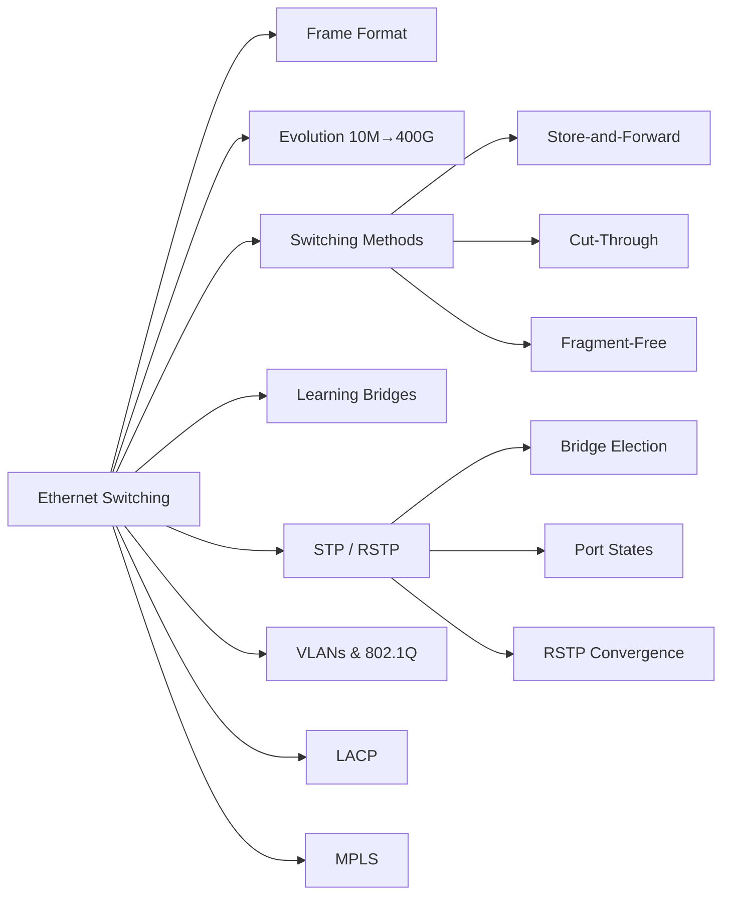
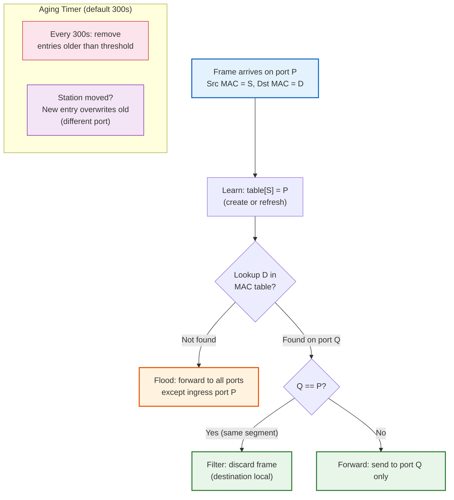
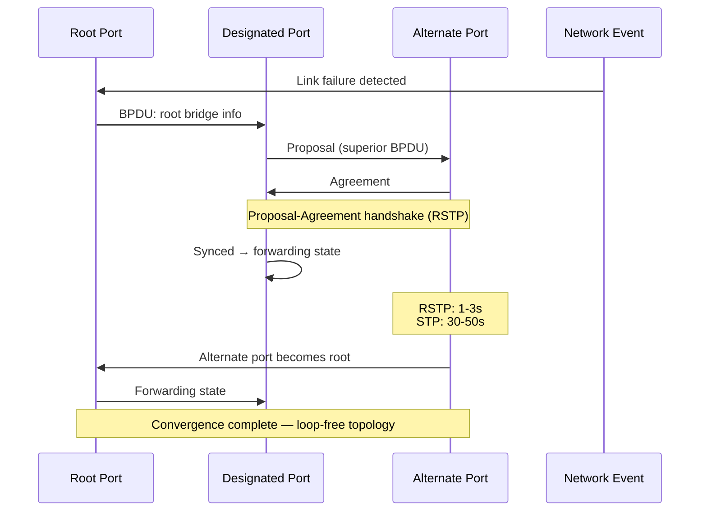

# Chapter 5: Ethernet Switching

> **Prerequisites:** [Chapter 4: Medium Access Control](./04-mac.md) → MAC protocols and CSMA/CD | **Next:** [Chapter 6: Network Layer](./06-network-layer.md) → From switching to IP routing

## Learning Objectives


1. Parse and explain every field of the Ethernet frame format.
2. Trace the evolution of Ethernet from 10 Mbps shared media to 400 Gbps switched networks.
3. Explain the operation of learning bridges and transparent switching with pseudocode and implementations.
4. Describe the Spanning Tree Protocol port state machine and its role in loop prevention.
5. Contrast traditional VLANs with modern VLAN trunking protocols.
6. Analyze Link Aggregation, LACP, and MPLS in carrier-grade networks.

---

### Chapter at a Glance


| Topic | Key Insight | Practical Takeaway |
|-------|-------------|-------------------|
| Ethernet Frame Format | 7-field structure unchanged since 1980 | Preamble (7B) + SFD (1B) + Dst (6B) + Src (6B) + Type/Len (2B) + Payload (46-1500B) + FCS (4B) |
| Ethernet Evolution | 10 Mbps coaxial → 400 Gbps full-duplex switched | Each generation preserved frame format for backward compatibility |
| Learning Bridges | Automatically build MAC tables by observing source addresses | Transparent → stations never know bridges exist |
| Spanning Tree | Prevents broadcast storms by blocking redundant links | Convergence: STP 30-50s, RSTP 1-3s |
| VLANs (802.1Q) | Partition switches into logical broadcast domains | 12-bit VLAN ID supports 4094 VLANs per switch |
| LACP | Bundle multiple physical links into one logical link | Up to 8 links; hash-based load balancing |
| MPLS | Label-based forwarding between L2 and L3 | Enables traffic engineering and L3VPN without IP lookup |

### Chapter Roadmap




### Learning Bridge Forwarding Decision




### STP Port State Machine and Convergence




---

## 5.1 Ethernet Frame Format

The Ethernet frame is the fundamental unit of data transfer on Ethernet networks. Its format has remained remarkably stable since the DIX 2.0 standard (1982), ensuring backward compatibility across four decades.

### 5.1.1 Frame Structure


```
  Bytes:     7         1         6          6         2       46-1500       4
        ┌─────────┬─────────┬──────────┬──────────┬────────┬─────────────┬────────┐
        │Preamble │   SFD   │Destination│ Source  │Length/ │   Payload   │  FCS   │
        │         │         │   MAC    │   MAC   │ Type   │  (includes  │ (CRC-32)│
        │         │         │          │          │        │   padding)  │        │
        └─────────┴─────────┴──────────┴──────────┴────────┴─────────────┴────────┘
```

### 5.1.2 Field-by-Field Breakdown


| Field | Size | Description |
|-------|------|-------------|
| **Preamble** | 7 bytes | Alternating 1 and 0 bits (10101010 × 7). Enables receiver NIC to synchronize clock recovery before the frame arrives. |
| **SFD** | 1 byte | Start Frame Delimiter (10101011). The last two bits (11) signal that the next byte is the destination MAC. |
| **Destination MAC** | 6 bytes | Recipient's 48-bit MAC address. If the first bit (I/G) = 0, it is unicast; = 1, multicast/broadcast (FF:FF:FF:FF:FF:FF). |
| **Source MAC** | 6 bytes | Sender's 48-bit MAC address. First bit always 0 (source cannot be multicast). |
| **Length/Type** | 2 bytes | If value ≤ 1500 (0x05DC): indicates payload length in bytes (IEEE 802.3). If value ≥ 1536 (0x0600): indicates EtherType (DIX Ethernet). Common EtherTypes: 0x0800 (IPv4), 0x0806 (ARP), 0x86DD (IPv6), 0x8100 (802.1Q VLAN tag). |
| **Payload + Pad** | 46–1500 bytes | Network-layer PDU (e.g., IP packet). If payload &lt; 46 bytes, padding zeros are added to meet the 64-byte minimum frame size. |
| **FCS** | 4 bytes | Frame Check Sequence → CRC-32 computed over dest MAC, source MAC, length/type, payload, and pad. The receiver recomputes CRC; mismatch indicates corruption. |

### 5.1.3 Real-World Analogy


> **A postal envelope.** The Preamble is the postal worker aligning the envelope in the sorting machine. The SFD is the "start here" mark. Destination and source MACs are the recipient and sender addresses. The Length/Type tells the post office whether this is a letter (length) or a package with a tracking number (EtherType). The Payload is the letter inside. The FCS is the tamper-evident seal → if broken, the recipient knows the contents may be damaged.

### 5.1.4 Frame Processing Steps


When a NIC receives a frame from the wire:

1. **Clock synchronization** → The Preamble (7 bytes of 10101010) trains the receiver's PLL (phase-locked loop) to the sender's bit timing.
2. **Frame start detection** → The SFD (10101011) marks the boundary; the two consecutive 1 bits at the end signal "next byte is the destination MAC."
3. **Address reception** → The NIC reads the 6-byte destination MAC. If the NIC's MAC filter is enabled, it checks whether this address matches its own MAC, a configured multicast group, or the broadcast address. If no match, the frame is discarded at the hardware level.
4. **Source address capture** → The source MAC is extracted for potential MAC table learning (by switches, not end hosts).
5. **Type/Length interpretation** → The 2-byte field is read. If ≤ 1500, it is a length field (802.3); the receiver expects exactly that many payload bytes. If ≥ 1536, it is an EtherType; the payload length is inferred from the frame size minus headers.
6. **Payload extraction** → The data portion (46–1500 bytes) is passed to the upper-layer protocol indicated by EtherType.
7. **CRC validation** → The receiver computes CRC-32 over the received fields (excluding preamble, SFD, and FCS). If the computed CRC matches the FCS field, the frame is accepted; otherwise, it is silently dropped.

### 5.1.5 Pseudocode: Ethernet Frame Parser


```
FUNCTION ParseEthernetFrame(raw_bytes):
    // raw_bytes is a byte array from the physical layer
    
    IF length(raw_bytes) < 18:           // min frame: 14 header + 46 payload - 4 FCS
        RETURN Error("Runt frame")
    
    preamble   = raw_bytes[0:7]          // not typically stored
    sfd        = raw_bytes[7]            // verify 0xAB
    dst_mac    = raw_bytes[8:14]
    src_mac    = raw_bytes[14:20]
    type_len   = raw_bytes[20:22]
    
    fcs_offset = length(raw_bytes) - 4
    fcs        = raw_bytes[fcs_offset:]
    payload    = raw_bytes[22:fcs_offset]
    
    IF type_len <= 1500:
        // IEEE 802.3: length field
        actual_payload = payload[0:type_len]
        protocol = "IEEE 802.3"
    ELSE:
        // DIX Ethernet: EtherType field
        actual_payload = payload
        protocol = LOOKUP_ETHERTYPE(type_len)
    
    computed_crc = CRC32(raw_bytes[8:fcs_offset])
    IF computed_crc != fcs:
        RETURN Error("CRC mismatch → frame corrupted")
    
    RETURN Frame(dst_mac, src_mac, type_len, actual_payload, protocol)
```

### 5.1.6 Dry Run Trace Table: Frame Reception


Consider a switch receiving a 64-byte frame from Host A (MAC: AA:AA:AA:AA:AA:AA) destined to Host B (MAC: BB:BB:BB:BB:BB:BB). Payload is 46 bytes of padding (minimum size).

| Step | Component | Action | Result |
|------|-----------|--------|--------|
| 1 | PHY | Receive bits from wire | 64 bytes + 8B preamble/SFD = 72B on wire |
| 2 | Preamble | Synchronize clock | PLL locked to sender's clock |
| 3 | SFD | Detect frame start | SFD = 0xAB → frame starts |
| 4 | Dst MAC | Read address | BB:BB:BB:BB:BB:BB (unicast) |
| 5 | Src MAC | Read address | AA:AA:AA:AA:AA:AA |
| 6 | Type/Len | Read field | 0x002C = 46 (IEEE 802.3 length) |
| 7 | Payload | Read 46 bytes | All zeros (padding) |
| 8 | FCS | Read CRC | 4 bytes, e.g., 0x12345678 |
| 9 | CRC check | Recompute CRC | CRC matches → frame valid |
| 10 | Protocol | Dispatch payload | Length ≤ 1500 → 802.3 frame |

### 5.1.7 C++ Implementation: Ethernet Frame Analyzer


```cpp
#include <iostream>
#include <cstdint>
#include <cstring>
#include <iomanip>
#include <vector>
#include <unordered_map>

#pragma pack(push, 1)
struct EthernetHeader {
    uint8_t  dst_mac[6];
    uint8_t  src_mac[6];
    uint16_t type_len;  // network byte order
};
#pragma pack(pop)

class EthernetFrame {
public:
    static constexpr size_t HEADER_SIZE = 14;
    static constexpr size_t FCS_SIZE = 4;
    static constexpr size_t MIN_PAYLOAD = 46;
    static constexpr size_t MAX_PAYLOAD = 1500;
    static constexpr size_t MIN_FRAME = HEADER_SIZE + MIN_PAYLOAD + FCS_SIZE; // 64
    static constexpr size_t MAX_FRAME = HEADER_SIZE + MAX_PAYLOAD + FCS_SIZE; // 1518
    
    static constexpr uint16_t ETHERTYPE_IPV4  = 0x0800;
    static constexpr uint16_t ETHERTYPE_ARP   = 0x0806;
    static constexpr uint16_t ETHERTYPE_IPV6  = 0x86DD;
    static constexpr uint16_t ETHERTYPE_VLAN  = 0x8100;
    static constexpr uint16_t LENGTH_THRESHOLD = 1500;
    
    static std::string mac_to_string(const uint8_t* mac) {
        std::ostringstream oss;
        for (int i = 0; i < 6; ++i) {
            if (i > 0) oss << ":";
            oss << std::hex << std::setfill('0') << std::setw(2) << (int)mac[i];
        }
        return oss.str();
    }
    
    static bool parse_frame(const std::vector<uint8_t>& raw, EthernetHeader& hdr,
                            std::vector<uint8_t>& payload, uint32_t& fcs) {
        if (raw.size() < MIN_FRAME) {
            std::cerr << "Runt frame: " << raw.size() << " bytes (min " << MIN_FRAME << ")\n";
            return false;
        }
        if (raw.size() > MAX_FRAME + 8) { // +8 for preamble/SFD
            std::cerr << "Jumbo frame: " << raw.size() << " bytes\n";
            // Jumbo frames up to 9000 bytes are common
        }
        
        // Copy header (skip preamble+SFD if present, offset 8)
        size_t offset = 8; // assume preamble+SFD prepended
        if (raw.size() < offset + HEADER_SIZE + FCS_SIZE) offset = 0;
        
        std::memcpy(&hdr, raw.data() + offset, HEADER_SIZE);
        hdr.type_len = ntohs(hdr.type_len);  // convert from network byte order
        
        size_t payload_start = offset + HEADER_SIZE;
        size_t payload_end = raw.size() - FCS_SIZE;
        payload.assign(raw.begin() + payload_start, raw.begin() + payload_end);
        
        std::memcpy(&fcs, raw.data() + payload_end, FCS_SIZE);
        fcs = ntohl(fcs);
        
        // Validate CRC (simplified → real CRC32 polynomial)
        uint32_t computed = crc32(raw.data() + offset, payload_end - offset);
        if (computed != fcs) {
            std::cerr << "CRC mismatch: computed 0x" << std::hex << computed
                      << ", received 0x" << fcs << "\n";
            return false;
        }
        
        return true;
    }
    
    static void print_frame_info(const EthernetHeader& hdr,
                                  const std::vector<uint8_t>& payload,
                                  uint32_t fcs) {
        bool is_multicast = hdr.dst_mac[0] & 0x01;
        bool is_broadcast = (hdr.dst_mac[0] == 0xFF && hdr.dst_mac[1] == 0xFF);
        
        std::cout << "Destination MAC: " << mac_to_string(hdr.dst_mac)
                  << (is_broadcast ? " (BROADCAST)" :
                      is_multicast ? " (MULTICAST)" : " (UNICAST)") << "\n";
        std::cout << "Source MAC:      " << mac_to_string(hdr.src_mac) << "\n";
        
        if (hdr.type_len <= LENGTH_THRESHOLD) {
            std::cout << "Type/Length:     " << hdr.type_len << " (IEEE 802.3 length)\n";
        } else {
            std::cout << "Type/Length:     0x" << std::hex << hdr.type_len
                      << " (EtherType)\n";
        }
        std::cout << "Payload size:    " << payload.size() << " bytes\n";
        std::cout << "FCS:             0x" << std::hex << fcs << "\n";
    }
    
private:
    static uint32_t crc32(const uint8_t* data, size_t len) {
        // Simplified CRC-32 → production uses hardware-accelerated CRC
        uint32_t crc = 0xFFFFFFFF;
        for (size_t i = 0; i < len; ++i) {
            crc ^= data[i];
            for (int j = 0; j < 8; ++j) {
                if (crc & 1) crc = (crc >> 1) ^ 0xEDB88320;
                else crc >>= 1;
            }
        }
        return ~crc;
    }
};

int main() {
    // Simulated raw frame (preamble + SFD + header + payload + FCS)
    std::vector<uint8_t> raw_frame = {
        // Preamble (7 bytes)
        0xAA, 0xAA, 0xAA, 0xAA, 0xAA, 0xAA, 0xAA,
        // SFD
        0xAB,
        // Destination MAC: BB:BB:BB:BB:BB:BB
        0xBB, 0xBB, 0xBB, 0xBB, 0xBB, 0xBB,
        // Source MAC: AA:AA:AA:AA:AA:AA
        0xAA, 0xAA, 0xAA, 0xAA, 0xAA, 0xAA,
        // Type/Length: 0x0800 (IPv4)
        0x08, 0x00,
        // Payload (46 bytes of padded IP packet)
        0x45, 0x00, 0x00, 0x1C, 0x00, 0x01, 0x00, 0x00,
        0x40, 0x00, 0x40, 0x06, 0x00, 0x00, 0xC0, 0xA8,
        0x01, 0x01, 0xC0, 0xA8, 0x01, 0x02, 0x00, 0x00,
        0x00, 0x00, 0x00, 0x00, 0x00, 0x00, 0x00, 0x00,
        0x00, 0x00, 0x00, 0x00, 0x00, 0x00, 0x00, 0x00,
        0x00, 0x00, 0x00, 0x00, 0x00, 0x00,
        // FCS (4 bytes) → placeholder
        0xDE, 0xAD, 0xBE, 0xEF
    };
    
    EthernetHeader hdr;
    std::vector<uint8_t> payload;
    uint32_t fcs;
    
    if (EthernetFrame::parse_frame(raw_frame, hdr, payload, fcs)) {
        EthernetFrame::print_frame_info(hdr, payload, fcs);
    }
    return 0;
}
```

### 5.1.8 Python Implementation: Ethernet Frame Parser


```python
import struct
import binascii
from dataclasses import dataclass
from typing import Optional

@dataclass
class EthernetFrame:
    dst_mac: str
    src_mac: str
    type_len: int
    payload: bytes
    protocol: str

class EthernetFrameParser:
    ETHERTYPES = {
        0x0800: "IPv4",
        0x0806: "ARP",
        0x86DD: "IPv6",
        0x8100: "802.1Q VLAN",
        0x8847: "MPLS Unicast",
        0x8863: "PPPoE Discovery",
        0x8864: "PPPoE Session",
    }
    
    MIN_FRAME = 64   # bytes (including FCS)
    MAX_FRAME = 1518 # bytes (including FCS)
    
    @staticmethod
    def mac_to_str(mac_bytes: bytes) -> str:
        return ":".join(f"{b:02x}" for b in mac_bytes)
    
    @staticmethod
    def crc32(data: bytes) -> int:
        return binascii.crc32(data) & 0xFFFFFFFF
    
    @classmethod
    def parse(cls, raw: bytes) -> Optional[EthernetFrame]:
        if len(raw) < cls.MIN_FRAME:
            print(f"ERROR: Runt frame → {len(raw)} bytes (min {cls.MIN_FRAME})")
            return None
        
        # Skip preamble (7 bytes) + SFD (1 byte) if present
        offset = 8 if len(raw) > cls.MIN_FRAME + 8 else 0
        
        dst_mac = raw[offset : offset + 6]
        src_mac = raw[offset + 6 : offset + 12]
        type_len = struct.unpack("!H", raw[offset + 12 : offset + 14])[0]
        
        payload_start = offset + 14
        payload_end = len(raw) - 4
        payload = raw[payload_start:payload_end]
        received_fcs = struct.unpack("!I", raw[payload_end:])[0]
        
        # Validate CRC
        computed_fcs = cls.crc32(raw[offset:payload_end])
        if computed_fcs != received_fcs:
            print(f"ERROR: CRC mismatch → computed 0x{computed_fcs:08X}, "
                  f"received 0x{received_fcs:08X}")
            return None
        
        # Determine protocol
        if type_len <= 1500:
            protocol = "IEEE 802.3"
            payload = payload[:type_len]  # trim padding
        else:
            protocol = cls.ETHERTYPES.get(type_len, f"Unknown(0x{type_len:04X})")
        
        return EthernetFrame(
            dst_mac=cls.mac_to_str(dst_mac),
            src_mac=cls.mac_to_str(src_mac),
            type_len=type_len,
            payload=payload,
            protocol=protocol
        )

# Demonstration
if __name__ == "__main__":
    # Simulated frame: preamble + SFD + header + payload + FCS
    raw = bytes([
        0xAA, 0xAA, 0xAA, 0xAA, 0xAA, 0xAA, 0xAA,  # Preamble
        0xAB,  # SFD
        0xBB, 0xBB, 0xBB, 0xBB, 0xBB, 0xBB,  # Dst MAC
        0xAA, 0xAA, 0xAA, 0xAA, 0xAA, 0xAA,  # Src MAC
        0x08, 0x00,  # EtherType IPv4
        0x45, 0x00, 0x00, 0x14,  # IP header start (20 bytes of padding)
        0x00, 0x01, 0x00, 0x00,
        0x40, 0x00, 0x40, 0x00,
        0x00, 0x00, 0x00, 0x00,
        0x00, 0x00, 0x00, 0x00,
        0x00, 0x00, 0x00, 0x00,
        0x00, 0x00, 0x00, 0x00,
        0x00, 0x00, 0x00, 0x00,
        0x00, 0x00, 0x00, 0x00,
        0x00, 0x00, 0x00, 0x00,
        0x00, 0x00, 0x00, 0x00,
        0x00, 0x00, 0x00, 0x00,
        0xDE, 0xAD, 0xBE, 0xEF,  # FCS placeholder
    ])
    
    frame = EthernetFrameParser.parse(raw)
    if frame:
        print(f"Dst MAC: {frame.dst_mac}")
        print(f"Src MAC: {frame.src_mac}")
        print(f"Type/Len: 0x{frame.type_len:04X} ({frame.protocol})")
        print(f"Payload: {len(frame.payload)} bytes")
```

### 5.1.9 Complexity Analysis


| Operation | Time Complexity | Space Complexity | Why |
|-----------|---------------|-----------------|-----|
| Frame parsing | O(n) | O(n) | Must scan all n bytes of the frame sequentially; payload bytes must be buffered |
| CRC-32 validation | O(n) | O(1) | Each byte processed exactly once; polynomial operations in constant registers |
| EtherType lookup | O(1) | O(k)* | Hash map of k EtherType entries; constant-time average |
| MAC address comparison | O(1) | O(1) | 6-byte fixed-length comparison; hardware-comparable in single instruction |
| Padding removal | O(1) | O(1) | Truncate payload to length field value; pointer arithmetic only |

*\* Where k = number of known EtherTypes (typically &lt; 50)*

### 5.1.10 Advantages and Disadvantages


| Aspect | Advantage | Disadvantage |
|--------|-----------|-------------|
| Fixed header size | 14-byte header enables fast hardware parsing | No room for extensions without tagging |
| CRC-32 protection | Detects all single-bit, double-bit, and burst errors ≤ 32 bits | No error correction → corrupted frames are silently dropped |
| Minimum frame size | Ensures collision detection in half-duplex modes | Wastes bandwidth for small packets (e.g., TCP ACKs padded with zeros) |
| Maximum frame size | 1500 bytes is TCP/IP-friendly (fits in typical socket buffers) | Jumbo frames (9000B) are non-standard; requires all devices to agree |
| Backward compatibility | Same format since 1982 → 10Mbps and 400Gbps NICs speak the same language | No native encryption or authentication at L2 |

### 5.1.11 Edge Cases


| Edge Case | Description | Mitigation |
|-----------|-------------|------------|
| Runt frame | Frame &lt; 64 bytes due to collision or TX underrun | Discarded by receiver; CSMA/CD enforces minimum size |
| Giant frame | Frame > 1518 bytes (non-jumbo) | Discarded; switch may support jumbo frames up to 9216 bytes |
| CRC error | Bit flips during transmission cause FCS mismatch | Frame dropped; upper layers (TCP) retransmit |
| Jabber | Transmitter sends abnormally long frame (> 1518) | Switch detects jabber and disables port (errdisable) |
| Alignment error | Frame does not end on byte boundary | CRC check fails; frame discarded |
| Late collision | Collision detected after first 64 bytes transmitted | Frame treated as collision fragment; station retransmits (half-duplex only) |
| EtherType ambiguity | Some NICs misclassify length vs type when value is 1500–1535 | Modern switches treat values > 1500 as EtherType per IEEE 802.3x |
| Dribble bit error | Extra bits after FCS due to clock drift | Receiver may accept frame if FCS is valid and discard extra bits |

---

## 5.2 Ethernet Evolution

Ethernet has evolved through seven major speed generations while preserving the same frame format → an engineering achievement unmatched in networking.

### 5.2.1 10 Mbps Ethernet (10Base5, 10Base2, 10BaseT)


The original Ethernet standard published in 1980 by DEC, Intel, and Xerox (DIX) operated at 10 Mbps over coaxial cable. 10Base5 (thicknet) used a vampire tap to connect stations to a long coaxial segment up to 500 meters. 10Base2 (thinnet) used BNC T-connectors on thinner, more flexible RG-58 cable with 185 m segments. Both were shared-media bus topologies → all stations on a segment belonged to the same collision domain.

10BaseT introduced twisted-pair cabling and a star topology centered on a hub. Hubs were repeaters: signals received on any port were regenerated and transmitted on all other ports. While easier to cable, hubs still created a single collision domain and limited aggregate throughput to 10 Mbps.

### 5.2.2 Fast Ethernet (100BaseTX, 100BaseFX)


Fast Ethernet (IEEE 802.3u, 1995) increased speed to 100 Mbps while preserving the CSMA/CD access method and frame format. 100BaseTX uses two pairs of Cat 5 UTP; 100BaseFX uses two multimode fiber strands for runs up to 2 km. The slot time was reduced from 512 bits to 512 bits (shorter time at 100 Mbps required the same minimum frame size but smaller network diameter: 205 m for half-duplex). Auto-negotiation was introduced to allow 10/100 Mbps devices to detect each other's capabilities.

### 5.2.3 Gigabit Ethernet (1000BaseT, 1000BaseSX, 1000BaseLX)


Gigabit Ethernet (IEEE 802.3z, 1998; 802.3ab, 1999) pushed the data rate to 1000 Mbps while maintaining compatibility. 1000BaseSX (short-wavelength laser) operates over multimode fiber up to 550 m; 1000BaseLX (long-wavelength) over single-mode fiber up to 5 km; 1000BaseT over Cat 5e UTP up to 100 m. Carrier extension (padding frames to 512 bytes) and frame bursting (transmitting multiple frames consecutively) were introduced to maintain the CSMA/CD collision constraint.

### 5.2.4 10 Gigabit Ethernet


10GbE (IEEE 802.3ae, 2002) is full-duplex only → CSMA/CD is disabled because switched networks make collisions irrelevant. 10GBASE-SR (short-range, 300 m MMF), 10GBASE-LR (10 km SMF), 10GBASE-ER (40 km SMF), and 10GBASE-T (Cat 6a UTP, 100 m) serve data center and metropolitan applications. FEC (Forward Error Correction) was introduced to maintain BER below 10^-12 over longer fiber runs.

### 5.2.5 40, 100, 200, 400 Gigabit Ethernet


IEEE 802.3ba (2010) defined 40 Gbps and 100 Gbps Ethernet using parallel lanes of 10 Gbps or 25 Gbps physical channels. 400 Gbps (802.3bs, 2017) uses 16 lanes of 25 Gbps or 8 lanes of 50 Gbps with PAM4 modulation. 800 Gbps and 1.6 Tbps are under development (IEEE 802.3df). Modern switches support aggregation of multiple links via LACP.

> **Pro Tip:** The Ethernet frame format has remained fundamentally unchanged since 1980, which is remarkable for any networking technology. This backward compatibility means a 2024 switch can still process frames from a 1990s Ethernet card → the physical speed changes, but the frame language is the same.

### 5.2.6 Ethernet Generations Comparison


| Generation | Standard | Year | Speed | Medium | Max Segment | Key Innovation |
|-----------|----------|------|-------|--------|------------|----------------|
| Ethernet | 802.3 | 1983 | 10 Mbps | Coax (10Base5/2), Cat3 UTP (10BaseT) | 500 m (coax), 100 m (TP) | CSMA/CD, vampire tap |
| Fast Ethernet | 802.3u | 1995 | 100 Mbps | Cat5 UTP (100BaseTX), MMF (100BaseFX) | 100 m (TP), 2 km (fiber) | Auto-negotiation, 10x speed |
| Gigabit Ethernet | 802.3z/ab | 1998/99 | 1 Gbps | Cat5e UTP, MMF (SX), SMF (LX) | 100 m (TP), 550 m (MMF), 5 km (SMF) | Carrier extension, frame bursting |
| 10 Gigabit | 802.3ae | 2002 | 10 Gbps | Cat6a UTP, MMF, SMF | 100 m (TP), 300 m (MMF), 40 km (SMF) | Full-duplex only, FEC, 8B/10B encoding |
| 40 Gigabit | 802.3ba | 2010 | 40 Gbps | SMF/MMF, Cat6a (CX) | 100 m (CX), 10 km (SMF) | 4×10G lanes, QSFP form factor |
| 100 Gigabit | 802.3ba | 2010 | 100 Gbps | SMF/MMF | 40 km (SMF) | 10×10G or 4×25G lanes, CFP/QSFP28 |
| 200 Gigabit | 802.3bs | 2017 | 200 Gbps | SMF/MMF | 2 km (MMF), 10 km (SMF) | PAM4, 4×50G lanes |
| 400 Gigabit | 802.3bs | 2017 | 400 Gbps | SMF/MMF | 2 km (MMF), 10 km (SMF) | 16×25G or 8×50G PAM4, QSFP-DD/OSFP |

### 5.2.7 Key Physical Layer Innovations by Generation


| Innovation | Introduced In | Why It Matters |
|-----------|---------------|----------------|
| CSMA/CD | 10 Mbps | Collision detection enabled shared medium access |
| Auto-negotiation | 100 Mbps | Devices automatically agree on speed/duplex; eliminated manual configuration |
| Carrier Extension | 1 Gbps | Padded short frames to maintain collision detection at 1 Gbps speeds |
| Frame Bursting | 1 Gbps | Allowed multiple short frames to transmit consecutively without re-contending |
| Full-duplex only | 10 Gbps | Eliminated CSMA/CD entirely; simplified PHY, doubled throughput |
| FEC (RS-FEC) | 10 Gbps (later) | Reed-Solomon FEC corrected bit errors at high speeds over longer reaches |
| PAM4 modulation | 50 Gbps+ | 2 bits per symbol doubled data rate without doubling bandwidth |
| NRZ → PAM4 transition | 400 Gbps | 8×50G PAM4 lanes replaced 16×25G NRZ lanes for better density |
| Multi-lane distribution | 40 Gbps+ | Data striped across multiple physical lanes; reassembled at receiver |

---

## 5.3 Switches and Bridges

A **bridge** operates at the data link layer, connecting two or more LAN segments and forwarding frames based on MAC addresses. A **switch** is a multi-port bridge with a high-speed backplane and dedicated per-port buffer memory. Modern switches are the core of virtually every wired network.

### 5.3.1 Switching Methods


**Store-and-forward switching.** The switch receives the entire frame, checks the FCS for errors, and then forwards. This ensures no corrupted frames propagate but adds latency proportional to frame size. Latency = frame_size / link_speed. For a 1500-byte frame on 1 Gbps: 1500×8/1e9 = 12 µs.

**Cut-through switching.** The switch begins forwarding before the complete frame arrives → typically after reading only the destination MAC address (first 6 bytes of the frame, 14 bytes from preamble start). Latency is typically &lt; 10 µs regardless of frame size, but damaged frames are forwarded. Two variants: fast-forward (forwards after dst MAC) and fragment-free (forwards after first 64 bytes).

**Fragment-free switching.** The switch reads the first 64 bytes before forwarding (the collision window). This rejects runt frames (collision fragments) while keeping latency low. It is a compromise between store-and-forward and cut-through.

### 5.3.2 Real-World Analogy


> **A mail sorting facility.** A switch is like a postal sorting center with hundreds of outgoing chutes (ports). When a letter (frame) arrives, the sorter reads the ZIP code (destination MAC). If the sorter has seen that ZIP before, the letter goes directly to the correct chute (forwarding). If the ZIP is unknown, the sorter copies the letter and sends one copy to every outgoing chute (flooding). The sorter also notes the return address (source MAC) and remembers which incoming door it came through (MAC learning). Store-and-forward mode means the sorter reads the entire letter before routing; cut-through means the sorter starts pushing it toward the chute as soon as the ZIP is read.

### 5.3.3 Switch vs Hub vs Router Comparison


| Property | Hub | Switch | Router |
|----------|-----|--------|--------|
| OSI Layer | Layer 1 (Physical) | Layer 2 (Data Link) | Layer 3 (Network) |
| Forwarding unit | Electrical signal | Ethernet frame | IP packet |
| Decision basis | None (repeats all signals) | Destination MAC address | Destination IP address |
| Address table | None | MAC address table | Routing table |
| Collision domain | Single (all ports) | Per-port (each port is separate) | Per-port (each port is separate) |
| Broadcast domain | Single (all ports) | Per-VLAN (configurable) | Per-interface (does not forward broadcasts by default) |
| Bandwidth sharing | Shared (total bandwidth divided) | Dedicated (each port gets full speed) | Dedicated (each port gets full speed) |
| Loop handling | No loop protection | STP/RSTP (blocking redundant paths) | TTL, routing protocols prevent loops |
| Latency | Lowest (repeats bits immediately) | Low (µs) | Higher (ms, due to IP lookup) |
| Intelligence | None | MAC learning, STP, VLAN, QoS | Routing protocols, NAT, ACL, firewall |
| Port density | Low (typically 4-24) | High (24-48 ports common) | Low-moderate (4-48 ports) |
| Cost per port | Lowest | Moderate | Highest |
| Typical use | Legacy networks, small home | Access/aggregation/core LAN | WAN, internet edge, segmentation |

### 5.3.4 Switch Operation: Numbered Steps


When a switch receives a frame on a port:

1. **Frame arrival** → The PHY receives bits on port P. The MAC layer extracts the frame, validates the FCS. If FCS fails, the frame is dropped.
2. **Source MAC learning** → The switch extracts the source MAC address S. It creates or refreshes an entry in the MAC address table: (S, port P, timestamp). This links the sender to the port it arrived on.
3. **Destination MAC lookup** → The switch extracts the destination MAC address D. It looks up D in the MAC address table.
4. **Forwarding decision** → Three possible outcomes:
   - **Known unicast (filter):** D is found on port Q, and Q == P (same port). Frame is dropped because the destination is on the same segment as the source.
   - **Known unicast (forward):** D is found on port Q, and Q != P. Frame is forwarded only to port Q.
   - **Unknown unicast or broadcast (flood):** D is not found in the table, or D is broadcast (FF:FF:FF:FF:FF:FF). Frame is forwarded to all ports except P.
5. **Frame transmission** → The switch queues the frame on the egress port's buffer. The PHY transmits bits on the wire. For cut-through, step 4 begins before the full frame is received.

### 5.3.5 Pseudocode: Switch Forwarding Engine


```
STRUCTURE MacEntry:
    mac: 48-bit integer
    port: integer
    timestamp: integer        // last-seen time (epoch ms)

GLOBAL mac_table: Map<MAC, MacEntry>
GLOBAL aging_threshold = 300  // seconds

FUNCTION UpdateMacTable(src_mac, ingress_port, current_time):
    IF src_mac IN mac_table:
        mac_table[src_mac].port = ingress_port
        mac_table[src_mac].timestamp = current_time
    ELSE:
        mac_table[src_mac] = MacEntry(src_mac, ingress_port, current_time)
        IF SIZE(mac_table) > MAX_TABLE_SIZE:
            EvictOldestEntry()   // remove LRU or oldest entry

FUNCTION AgeOutEntries(current_time):
    FOR EACH (mac, entry) IN mac_table:
        IF current_time - entry.timestamp > aging_threshold * 1000:
            REMOVE entry FROM mac_table
            LOG "Aged out MAC " + mac + " from port " + entry.port

FUNCTION ProcessFrame(frame, ingress_port, current_time):
    // Step 1: Learn source MAC
    UpdateMacTable(frame.src_mac, ingress_port, current_time)
    
    // Step 2: Look up destination MAC
    dst_mac = frame.dst_mac
    
    IF dst_mac IS Broadcast OR dst_mac IS Multicast:
        FloodFrame(frame, ingress_port)   // send to all ports except ingress
        RETURN
    
    entry = LOOKUP mac_table[dst_mac]
    
    IF entry IS NULL:
        // Unknown unicast → flood
        FloodFrame(frame, ingress_port)
    ELSE IF entry.port == ingress_port:
        // Same port → filter (drop)
        DROP frame
    ELSE:
        // Forward to learned port
        TransmitFrame(frame, entry.port)
```

### 5.3.6 Dry Run Trace Table: MAC Table Learning


Consider a 4-port switch (ports 1–4). Initially the MAC table is empty. Hosts A, B, C connected on ports 1, 2, 3 respectively. Host D connected on port 4. The switch processes frames in sequence:

| Time | Event | Ingress Port | Src MAC | Dst MAC | MAC Table After | Action |
|------|-------|-------------|---------|---------|-----------------|--------|
| T=0 | → | → | → | → | (empty) | Initial state |
| T=1 | A→B frame | 1 | A | B | {A→1} | Learn A on port 1; B unknown → flood ports 2,3,4 |
| T=2 | B→A reply | 2 | B | A | {A→1, B→2} | Learn B on port 2; A known on port 1 → forward only port 1 |
| T=3 | A→C frame | 1 | A | C | {A→1, B→2} | Refresh A; C unknown → flood ports 2,3,4 |
| T=4 | C→A reply | 3 | C | A | {A→1, B→2, C→3} | Learn C on port 3; A known → forward only port 1 |
| T=5 | B→D frame | 2 | B | D | {A→1, B→2, C→3} | Refresh B; D unknown → flood ports 1,3,4 |
| T=6 | D→B reply | 4 | D | B | {A→1, B→2, C→3, D→4} | Learn D on port 4; B known → forward only port 2 |
| T=7 | A→B frame | 1 | A | B | {A→1, B→2, C→3, D→4} | Refresh A; B known on port 2 ≠ 1 → forward only port 2 |
| T=8 | B→A frame | 2 | B | A | {A→1, B→2, C→3, D→4} | Refresh B; A known on port 1 ≠ 2 → forward only port 1 |
| T=9 | A→A frame (self) | 1 | A | A | {A→1, B→2, C→3, D→4} | Refresh A; A known on port 1 == 1 → filter (drop) |

After T=6, all four hosts are learned. After T=7–8, frames between known hosts are forwarded precisely to the correct port → no flooding. After T=9, a self-addressed frame is filtered because the source and destination port match (the destination is on the same segment as the source).

### 5.3.7 C++ Implementation: Switch MAC Table


```cpp
#include <iostream>
#include <unordered_map>
#include <vector>
#include <chrono>
#include <string>
#include <iomanip>
#include <sstream>
#include <algorithm>
#include <cstdint>
#include <ctime>

struct MacEntry {
    uint64_t mac;       // 48-bit MAC address
    int port;
    std::chrono::steady_clock::time_point timestamp;
    
    MacEntry(uint64_t m, int p) : mac(m), port(p),
        timestamp(std::chrono::steady_clock::now()) {}
};

class MacTable {
private:
    std::unordered_map<uint64_t, MacEntry> table;
    static constexpr int AGING_SECONDS = 300;
    size_t max_entries;
    
    static uint64_t mac_to_uint(const std::string& mac_str) {
        uint64_t result = 0;
        std::stringstream ss(mac_str);
        int byte;
        char colon;
        for (int i = 0; i < 6; ++i) {
            ss >> std::hex >> byte;
            if (i < 5) ss >> colon;
            result = (result << 8) | (byte & 0xFF);
        }
        return result;
    }
    
public:
    MacTable(size_t max = 8192) : max_entries(max) {}
    
    void learn(const std::string& mac_str, int port) {
        learn(mac_to_uint(mac_str), port);
    }
    
    void learn(uint64_t mac, int port) {
        auto now = std::chrono::steady_clock::now();
        auto it = table.find(mac);
        
        if (it != table.end()) {
            // Existing entry → update port and timestamp
            if (it->second.port != port) {
                std::cout << "MAC flapping detected: " << mac_to_string(mac)
                          << " moved from port " << it->second.port
                          << " to port " << port << "\n";
            }
            it->second.port = port;
            it->second.timestamp = now;
        } else {
            // New entry
            if (table.size() >= max_entries) {
                evict_oldest();
            }
            table.emplace(mac, MacEntry(mac, port));
        }
    }
    
    int lookup(const std::string& mac_str) const {
        return lookup(mac_to_uint(mac_str));
    }
    
    int lookup(uint64_t mac) const {
        auto it = table.find(mac);
        if (it != table.end()) return it->second.port;
        return -1;  // not found
    }
    
    void age_out() {
        auto now = std::chrono::steady_clock::now();
        auto threshold = std::chrono::seconds(AGING_SECONDS);
        size_t aged = 0;
        
        for (auto it = table.begin(); it != table.end(); ) {
            if (now - it->second.timestamp > threshold) {
                std::cout << "Aging out " << mac_to_string(it->first)
                          << " from port " << it->second.port << "\n";
                it = table.erase(it);
                ++aged;
            } else {
                ++it;
            }
        }
        std::cout << "Aged out " << aged << " entries. Table size: "
                  << table.size() << "\n";
    }
    
    void evict_oldest() {
        auto oldest = table.begin();
        for (auto it = table.begin(); it != table.end(); ++it) {
            if (it->second.timestamp < oldest->second.timestamp) {
                oldest = it;
            }
        }
        std::cout << "Table full → evicting oldest entry: "
                  << mac_to_string(oldest->first) << "\n";
        table.erase(oldest);
    }
    
    size_t size() const { return table.size(); }
    
    static std::string mac_to_string(uint64_t mac) {
        std::ostringstream oss;
        for (int i = 5; i >= 0; --i) {
            if (i < 5) oss << ":";
            oss << std::hex << std::setfill('0') << std::setw(2)
                << ((mac >> (i * 8)) & 0xFF);
        }
        return oss.str();
    }
    
    void print_table() const {
        std::cout << "\nMAC Address Table (" << table.size() << " entries):\n";
        std::cout << "----------------------------------------\n";
        std::cout << "MAC Address        Port  Age(s)\n";
        std::cout << "----------------------------------------\n";
        auto now = std::chrono::steady_clock::now();
        
        // Sort entries by port for clean output
        std::vector<std::pair<uint64_t, MacEntry>> entries(table.begin(), table.end());
        std::sort(entries.begin(), entries.end(),
            [](const auto& a, const auto& b) {
                return a.second.port < b.second.port;
            });
        
        for (const auto& [mac, entry] : entries) {
            auto age = std::chrono::duration_cast<std::chrono::seconds>(
                now - entry.timestamp).count();
            std::cout << mac_to_string(mac) << "  "
                      << "Port " << entry.port << "   "
                      << age << "s\n";
        }
    }
};

// Demonstration of switch MAC learning
int main() {
    MacTable table(4);  // Small table for demonstration
    
    std::cout << "=== Switch MAC Table Learning Simulation ===\n\n";
    
    // Sequence of frames received
    struct FrameEvent {
        std::string desc;
        std::string src_mac;
        std::string dst_mac;
        int ingress_port;
    };
    
    std::vector<FrameEvent> events = {
        {"A→B", "AA:AA:AA:AA:AA:01", "AA:AA:AA:AA:AA:02", 1},
        {"B→A reply", "AA:AA:AA:AA:AA:02", "AA:AA:AA:AA:AA:01", 2},
        {"C→D", "AA:AA:AA:AA:AA:03", "AA:AA:AA:AA:AA:04", 3},
        {"D→C reply", "AA:AA:AA:AA:AA:04", "AA:AA:AA:AA:AA:03", 4},
        {"A→C", "AA:AA:AA:AA:AA:01", "AA:AA:AA:AA:AA:03", 1},
    };
    
    for (const auto& evt : events) {
        std::cout << "\n[" << evt.desc << "] Frame from " << evt.src_mac
                  << " → " << evt.dst_mac << " on port " << evt.ingress_port << "\n";
        
        // Learn source MAC
        table.learn(evt.src_mac, evt.ingress_port);
        
        // Lookup destination MAC
        int dst_port = table.lookup(evt.dst_mac);
        if (dst_port == -1) {
            std::cout << "  → " << evt.dst_mac << " unknown → FLOOD to all ports except "
                      << evt.ingress_port << "\n";
        } else if (dst_port == evt.ingress_port) {
            std::cout << "  → " << evt.dst_mac << " on same port → FILTER (drop)\n";
        } else {
            std::cout << "  → " << evt.dst_mac << " on port " << dst_port
                      << " → FORWARD\n";
        }
        
        table.print_table();
    }
    
    return 0;
}
```

### 5.3.8 Python Implementation: Switch MAC Table


```python
import time
from dataclasses import dataclass
from typing import Dict, Optional, List, Tuple

@dataclass
class MacEntry:
    mac: str
    port: int
    timestamp: float  # epoch seconds

class SwitchMacTable:
    def __init__(self, aging_seconds: int = 300, max_entries: int = 8192):
        self.table: Dict[str, MacEntry] = {}
        self.aging_seconds = aging_seconds
        self.max_entries = max_entries
        
    def learn(self, mac: str, port: int) -> None:
        now = time.time()
        if mac in self.table:
            old_port = self.table[mac].port
            if old_port != port:
                print(f"MAC flapping: {mac} moved from port {old_port} to port {port}")
            self.table[mac].port = port
            self.table[mac].timestamp = now
        else:
            if len(self.table) >= self.max_entries:
                self._evict_oldest()
            self.table[mac] = MacEntry(mac=mac, port=port, timestamp=now)
            print(f"Learned {mac} on port {port}")
    
    def lookup(self, mac: str) -> Optional[int]:
        entry = self.table.get(mac)
        if entry:
            return entry.port
        return None
    
    def age_out(self) -> int:
        now = time.time()
        aged = 0
        expired = [
            mac for mac, entry in self.table.items()
            if now - entry.timestamp > self.aging_seconds
        ]
        for mac in expired:
            print(f"Aging out {mac} from port {self.table[mac].port}")
            del self.table[mac]
            aged += 1
        return aged
    
    def _evict_oldest(self) -> None:
        if not self.table:
            return
        oldest_mac = min(self.table.items(), key=lambda x: x[1].timestamp)[0]
        print(f"Table full → evicting oldest: {oldest_mac}")
        del self.table[oldest_mac]
    
    def __len__(self) -> int:
        return len(self.table)
    
    def __repr__(self) -> str:
        if not self.table:
            return "MAC table: (empty)"
        lines = ["MAC Address Table:"]
        lines.append(f"{'MAC Address':<20} {'Port':<8} {'Age(s)':<8}")
        lines.append("-" * 40)
        now = time.time()
        for mac, entry in sorted(self.table.items(), key=lambda x: x[1].port):
            age = int(now - entry.timestamp)
            lines.append(f"{mac:<20} Port {entry.port:<3} {age:<8}")
        return "\n".join(lines)


class Switch:
    def __init__(self, ports: int = 24):
        self.ports = ports
        self.mac_table = SwitchMacTable()
    
    def process_frame(self, src_mac: str, dst_mac: str, ingress_port: int) -> str:
        # Step 1: Learn source MAC
        self.mac_table.learn(src_mac, ingress_port)
        
        # Step 2: Check if broadcast/multicast
        if dst_mac == "FF:FF:FF:FF:FF:FF":
            action = f"FLOOD (broadcast) to all ports except {ingress_port}"
        elif dst_mac.startswith("01:00:5E"):  # IPv4 multicast
            action = f"FLOOD (multicast) to all ports except {ingress_port}"
        else:
            # Step 3: Lookup destination
            dst_port = self.mac_table.lookup(dst_mac)
            if dst_port is None:
                action = f"FLOOD (unknown unicast) to all ports except {ingress_port}"
            elif dst_port == ingress_port:
                action = "FILTER (same port → destination on same segment)"
            else:
                action = f"FORWARD to port {dst_port}"
        
        print(f"[{src_mac} → {dst_mac} on port {ingress_port}] {action}")
        return action


# Demonstration
if __name__ == "__main__":
    switch = Switch(ports=4)
    
    print("=== Switch Forwarding Simulation ===\n")
    
    # Simulate frames
    switch.process_frame("00:11:22:AA:BB:01", "00:11:22:AA:BB:02", 1)
    print(switch.mac_table, "\n")
    
    switch.process_frame("00:11:22:AA:BB:02", "00:11:22:AA:BB:01", 2)
    print(switch.mac_table, "\n")
    
    switch.process_frame("00:11:22:AA:BB:03", "FF:FF:FF:FF:FF:FF", 3)
    print(switch.mac_table, "\n")
    
    switch.process_frame("00:11:22:AA:BB:01", "00:11:22:AA:BB:03", 1)
    print(switch.mac_table, "\n")
    
    # MAC move test
    print("--- MAC Move Test ---")
    switch.process_frame("00:11:22:AA:BB:01", "00:11:22:AA:BB:04", 4)
    print(switch.mac_table)
```

### 5.3.9 Complexity Analysis


| Operation | Time Complexity | Space Complexity | Why |
|-----------|---------------|-----------------|-----|
| MAC table lookup | O(1) avg, O(n) worst | O(1) | Hash table: constant average, but hash collisions degenerate to linear scan. Hardware TCAM is always O(1). |
| MAC table insertion | O(1) amortized | O(m)* | Hash insertion amortized O(1). If table full, eviction adds O(m) to find oldest. |
| MAC table aging | O(m) | O(1) | Must scan all m entries to check timestamps. In production, coarsened to run every N seconds. |
| Frame forwarding | O(1) + O(f) | O(f)** | Lookup O(1); transmit cost O(f) where f = frame size in bytes (serialization delay). |
| Frame flooding | O(p) + O(f) | O(p·f) | Must replicate frame to up to p-1 ports. Each copy costs O(f) bandwidth. |

*\* m = number of MAC entries in the table*
*\*\* f = frame size in bytes*

### 5.3.10 Advantages and Disadvantages


| Aspect | Advantage | Disadvantage |
|--------|-----------|-------------|
| Learning | Automatic, transparent → no configuration needed | Table overflow can cause excessive flooding |
| Filtering | Precise forwarding conserves bandwidth | Stale entries cause mis-forwarding until aged out |
| Cut-through | Minimal latency (< 10 µs) | Forwards corrupted frames and runt frames |
| Store-and-forward | Never forwards bad frames | Higher latency (entire frame must be received) |
| Fragment-free | Compromise: fast + no runts | Still forwards frames with payload errors |
| Scalability | Stackable switches support hundreds of ports | MAC table grows linearly with active hosts |
| VLAN support | Logical segmentation without extra hardware | Trunk misconfiguration causes connectivity issues |

### 5.3.11 Edge Cases


| Edge Case | Description | Mitigation |
|-----------|-------------|------------|
| MAC table overflow | Table reaches hardware capacity; new entries evict old ones | Use larger TCAM; implement VLAN-based table partitioning |
| MAC flapping | Same MAC seen on different ports in rapid succession | Throttle learning; errdisable port after threshold |
| Unknown unicast flooding | Dst MAC not in table → frame sent to all ports | Pre-populate static entries for critical servers |
| Broadcast storm | High broadcast rate consumes all switch CPU/bandwidth | Storm-control feature; limit broadcast rate per port |
| Store-and-forward underrun | Frame arrives slower than egress requires | Backpressure or pause frames (802.3x flow control) |
| Cut-through with speed mismatch | Ingress 1G, egress 100M → must buffer entire frame | Fall back to store-and-forward automatically |
| STP blocking for learning | STP blocks port → no MAC learning occurs on that port | Port must transition through learning state first |

### TypeScript Implementation: Switch Forwarding Table

```typescript
interface MacEntry {
  mac: string;
  port: number;
  timestamp: number;
}

class SwitchForwardingTable {
  private table: Map<string, MacEntry> = new Map();
  private readonly agingTimeMs: number;
  private readonly maxEntries: number;

  constructor(agingTimeMs: number = 300_000, maxEntries: number = 8192) {
    this.agingTimeMs = agingTimeMs;
    this.maxEntries = maxEntries;
  }

  learn(mac: string, port: number): void {
    const existing = this.table.get(mac);
    if (existing && existing.port === port) {
      existing.timestamp = Date.now(); // refresh
      return;
    }
    if (this.table.size >= this.maxEntries) {
      this.evictOldest();
    }
    this.table.set(mac, { mac, port, timestamp: Date.now() });
    console.log(`Learned: ${mac} → port ${port}`);
  }

  lookup(mac: string): number | null {
    const entry = this.table.get(mac);
    if (!entry) return null;
    if (Date.now() - entry.timestamp > this.agingTimeMs) {
      this.table.delete(mac);
      return null;
    }
    return entry.port;
  }

  processFrame(srcMac: string, dstMac: string, ingressPort: number): string {
    this.learn(srcMac, ingressPort);
    const egressPort = this.lookup(dstMac);
    if (egressPort === null) {
      return `FLOOD to all ports except ${ingressPort}`;
    }
    if (egressPort === ingressPort) {
      return `FILTER (destination on same port ${ingressPort})`;
    }
    return `FORWARD to port ${egressPort}`;
  }

  private evictOldest(): void {
    let oldest: MacEntry | null = null;
    for (const entry of this.table.values()) {
      if (!oldest || entry.timestamp < oldest.timestamp) {
        oldest = entry;
      }
    }
    if (oldest) this.table.delete(oldest.mac);
  }

  getStats(): { entries: number; agingMs: number } {
    return { entries: this.table.size, agingMs: this.agingTimeMs };
  }
}

// Demo
const sw = new SwitchForwardingTable(300_000, 4);
console.log(sw.processFrame("AA:BB:CC:DD:EE:01", "FF:FF:FF:FF:FF:FF", 1)); // Flood (unknown dst)
console.log(sw.processFrame("AA:BB:CC:DD:EE:02", "AA:BB:CC:DD:EE:01", 2)); // Learn 02→2, forward 01→1
console.log(sw.processFrame("AA:BB:CC:DD:EE:02", "AA:BB:CC:DD:EE:02", 2)); // Filter (same port)
console.log(sw.processFrame("AA:BB:CC:DD:EE:03", "AA:BB:CC:DD:EE:01", 3)); // Learn 03→3, forward 01→1
console.log(`Table entries: ${sw.getStats().entries}`);
```

---

## 5.4 Learning Bridges (MAC Learning)

A learning bridge → the intelligence behind every modern switch → automatically builds a forwarding table by observing traffic. This section expands section 5.3's switch-forwarding logic into a dedicated bridge learning algorithm.

### 5.4.1 Real-World Analogy


> **A party guestbook.** At a party, a security guard at the door writes down each guest's name and which room they entered (source MAC + port). When a guest needs to find another guest, the guard checks the book: if the target is known, the guard directs the messenger to the right room. If the target is unknown, the guard announces the message to every room (flooding). Every 5 minutes, the guard crosses out names of guests who left over 5 minutes ago (aging). This is exactly how a learning bridge works.

### 5.4.2 The Learning Algorithm: Numbered Steps


1. **Port initialization** → Each bridge port starts with empty MAC table and a default aging timer (300 seconds).
2. **Frame arrival** → A frame enters on port P with source MAC S and destination MAC D.
3. **Source registration** → The bridge records or refreshes entry (S, P) in the MAC table. If the table is full, the oldest entry is evicted.
4. **Destination resolution** → The bridge looks up D in the MAC table.
   - If D is found on port Q (Q ≠ P): forward frame to port Q only.
   - If D is found on port Q where Q == P: discard frame (destination on same segment).
   - If D is not found: flood frame to all ports except P.
5. **Aging** → Every aging interval, entries older than the threshold are removed. This handles station mobility and stale entries.
6. **Topology change** → When STP detects a topology change, aging is temporarily shortened (default 15 seconds instead of 300) to accelerate re-learning after a link failure.

### 5.4.3 Pseudocode: Learning Bridge


```
CONSTANT AGING_TIME = 300        // seconds
CONSTANT MAX_ENTRIES = 8192
CONSTANT TOPO_CHANGE_AGE = 15   // seconds during topology change

STRUCTURE BridgeEntry:
    mac: MAC_ADDRESS
    port: PORT_NUMBER
    age: INTEGER                 // seconds since last seen

GLOBAL bridge_table: ARRAY of BridgeEntry
GLOBAL current_age_time = AGING_TIME

FUNCTION LearnBridgeProcessFrame(frame, ingress_port):
    // 1. Learn source MAC
    entry = FIND bridge_table WHERE mac == frame.src_mac
    
    IF entry EXISTS:
        entry.port = ingress_port
        entry.age = 0
    ELSE:
        IF LENGTH(bridge_table) >= MAX_ENTRIES:
            evict = FIND entry WITH max(age)
            REMOVE evict FROM bridge_table
        APPEND BridgeEntry(frame.src_mac, ingress_port, 0)
    
    // 2. Handle broadcast
    IF frame.dst_mac IS BROADCAST:
        FOR EACH port in ALL_PORTS WHERE port != ingress_port:
            SEND frame TO port
        RETURN
    
    // 3. Lookup destination
    dest = FIND bridge_table WHERE mac == frame.dst_mac
    
    IF dest EXISTS:
        IF dest.port != ingress_port:
            SEND frame TO dest.port    // forward
        ELSE:
            DROP frame                 // filter
    ELSE:
        FOR EACH port in ALL_PORTS WHERE port != ingress_port:
            SEND frame TO port         // flood

FUNCTION BridgeAgingTimer():
    EVERY 1 SECOND:
        FOR EACH entry IN bridge_table:
            entry.age = entry.age + 1
            IF entry.age > current_age_time:
                REMOVE entry FROM bridge_table
                LOG "Aged out " + entry.mac + " from port " + entry.port

FUNCTION OnTopologyChange():
    current_age_time = TOPO_CHANGE_AGE
    AFTER 30 SECONDS:
        current_age_time = AGING_TIME
```

### 5.4.4 Dry Run Trace Table: Learning Bridge with Six Hosts


Four-port bridge, hosts A–F on ports 1–4 (A and B on port 1 via hub, C and D on port 2, E on port 3, F on port 4).

| Time | Frame | Ingress | Learn | Dst Lookup | Action | Table After |
|------|-------|---------|-------|-----------|--------|-------------|
| 0 | → | → | → | → | → | (empty) |
| 1 | A→F | 1 | A→port 1 | F: unknown | Flood ports 2,3,4 | A→1 (age 0) |
| 2 | F→A reply | 4 | F→port 4 | A: port 1 | Forward port 1 | A→1, F→4 |
| 3 | B→C | 1 | B→port 1 | C: unknown | Flood ports 2,3,4 | A→1, B→1, F→4 |
| 4 | C→B reply | 2 | C→port 2 | B: port 1 | Forward port 1 | A→1, B→1, C→2, F→4 |
| 5 | A→E | 1 | A→port 1 (refresh) | E: unknown | Flood ports 2,3,4 | A→1, B→1, C→2, F→4 |
| 6 | E→A | 3 | E→port 3 | A: port 1 | Forward port 1 | A→1, B→1, C→2, E→3, F→4 |
| 7 | D→E | 2 | D→port 2 | E: port 3 | Forward port 3 | A→1, B→1, C→2, D→2, E→3, F→4 |
| 8 | D→B | 2 | D→port 2 (refresh) | B: port 1 | Forward port 1 | (same) |
| 9 | B→D | 1 | B→port 1 (refresh) | D: port 2 | Forward port 2 | (same) |
| 10 | D→A | 2 | D→port 2 (refresh) | A: port 1 | Forward port 1 | (same) |
| 11 | C→C (self) | 2 | C→port 2 (refresh) | C: port 2 | Filter (drop) | (same) |

After T=7, all six hosts are learned. From T=8 onward, all frames are forwarded precisely → no flooding occurs.

### 5.4.5 C++ Implementation: Learning Bridge


```cpp
#include <iostream>
#include <unordered_map>
#include <vector>
#include <string>
#include <sstream>
#include <chrono>
#include <thread>

struct BridgeEntry {
    std::string mac;
    int port;
    int age_seconds;
    
    BridgeEntry(const std::string& m, int p) : mac(m), port(p), age_seconds(0) {}
};

class LearningBridge {
private:
    std::unordered_map<std::string, BridgeEntry> table;
    int num_ports;
    int aging_time;
    int topo_change_aging;
    bool topo_change_active;
    static constexpr size_t MAX_TABLE = 8192;
    
    std::string mac_to_upper(const std::string& mac) {
        std::string result = mac;
        for (auto& c : result) c = toupper(c);
        return result;
    }
    
public:
    LearningBridge(int ports, int aging = 300)
        : num_ports(ports), aging_time(aging),
          topo_change_aging(15), topo_change_active(false) {}
    
    struct ActionResult {
        std::string action;
        int egress_port;
        bool flood;
    };
    
    ActionResult process_frame(const std::string& src,
                                const std::string& dst,
                                int ingress_port) {
        std::string src_up = mac_to_upper(src);
        std::string dst_up = mac_to_upper(dst);
        
        // Learn source
        auto it = table.find(src_up);
        if (it != table.end()) {
            it->second.port = ingress_port;
            it->second.age_seconds = 0;
        } else {
            if (table.size() >= MAX_TABLE) {
                evict_oldest();
            }
            table.emplace(src_up, BridgeEntry(src_up, ingress_port));
        }
        
        // Broadcast check
        if (dst_up == "FF:FF:FF:FF:FF:FF") {
            return {"FLOOD (broadcast)", -1, true};
        }
        
        // Lookup destination
        auto dest_it = table.find(dst_up);
        if (dest_it != table.end()) {
            if (dest_it->second.port == ingress_port) {
                return {"FILTER (same port)", ingress_port, false};
            }
            return {"FORWARD", dest_it->second.port, false};
        }
        return {"FLOOD (unknown unicast)", -1, true};
    }
    
    void age_entries() {
        std::vector<std::string> to_remove;
        int current_aging = topo_change_active ? topo_change_aging : aging_time;
        
        for (auto& [mac, entry] : table) {
            entry.age_seconds++;
            if (entry.age_seconds > current_aging) {
                to_remove.push_back(mac);
            }
        }
        
        for (const auto& mac : to_remove) {
            std::cout << "Aging out " << mac
                      << " from port " << table[mac].port << "\n";
            table.erase(mac);
        }
    }
    
    void evict_oldest() {
        if (table.empty()) return;
        auto oldest = table.begin();
        for (auto it = table.begin(); it != table.end(); ++it) {
            if (it->second.age_seconds > oldest->second.age_seconds) {
                oldest = it;
            }
        }
        std::cout << "Table full → evicting " << oldest->first << "\n";
        table.erase(oldest);
    }
    
    void on_topology_change() {
        topo_change_active = true;
        std::cout << "Topology change detected → aging reduced to "
                  << topo_change_aging << "s\n";
    }
    
    void restore_aging() {
        topo_change_active = false;
    }
    
    size_t table_size() const { return table.size(); }
    
    void print_table() const {
        std::cout << "\nBridge Table (" << table.size() << " entries):\n";
        std::cout << "MAC                Port  Age\n";
        std::cout << "--------------------------------\n";
        for (const auto& [mac, entry] : table) {
            std::cout << mac << "  "
                      << "Port " << entry.port << "   "
                      << entry.age_seconds << "s\n";
        }
    }
};

int main() {
    LearningBridge bridge(4);
    
    // Simulate frames
    auto act = [&](const std::string& src, const std::string& dst, int port) {
        auto r = bridge.process_frame(src, dst, port);
        std::cout << "[" << src << " → " << dst << " port " << port
                  << "] " << r.action;
        if (!r.flood && r.action == "FORWARD")
            std::cout << " port " << r.egress_port;
        std::cout << "\n";
    };
    
    act("AA:AA:AA:AA:AA:01", "AA:AA:AA:AA:AA:02", 1);
    act("AA:AA:AA:AA:AA:02", "AA:AA:AA:AA:AA:01", 2);
    act("AA:AA:AA:AA:AA:03", "AA:AA:AA:AA:AA:04", 3);
    act("AA:AA:AA:AA:AA:04", "AA:AA:AA:AA:AA:01", 4);
    act("AA:AA:AA:AA:AA:01", "AA:AA:AA:AA:AA:03", 1);
    
    bridge.print_table();
    return 0;
}
```

### 5.4.6 Python Implementation: Learning Bridge


```python
import time
from typing import Dict, Optional, List, Tuple

class BridgeEntry:
    def __init__(self, mac: str, port: int):
        self.mac = mac
        self.port = port
        self.age = 0  # seconds since last seen

class LearningBridge:
    def __init__(self, num_ports: int, aging_time: int = 300):
        self.table: Dict[str, BridgeEntry] = {}
        self.num_ports = num_ports
        self.aging_time = aging_time
        self.topo_age = 15
        self.topo_change = False
        self.max_entries = 8192
    
    def process_frame(self, src: str, dst: str, ingress: int) -> Tuple[str, Optional[int]]:
        src = src.upper()
        dst = dst.upper()
        
        # Learn source
        if src in self.table:
            old_port = self.table[src].port
            self.table[src].port = ingress
            self.table[src].age = 0
            if old_port != ingress:
                print(f"  [MAC move] {src} moved from port {old_port} → {ingress}")
        else:
            if len(self.table) >= self.max_entries:
                self._evict_oldest()
            self.table[src] = BridgeEntry(src, ingress)
        
        # Handle broadcast
        if dst == "FF:FF:FF:FF:FF:FF":
            return ("FLOOD broadcast", None)
        
        # Lookup destination
        entry = self.table.get(dst)
        if entry is None:
            return ("FLOOD unknown unicast", None)
        if entry.port == ingress:
            return ("FILTER same port", ingress)
        return ("FORWARD", entry.port)
    
    def age_entries(self) -> int:
        current_age = self.topo_age if self.topo_change else self.aging_time
        to_remove = [
            mac for mac, e in self.table.items()
            if e.age > current_age
        ]
        for mac in to_remove:
            del self.table[mac]
        # Increment ages
        for entry in self.table.values():
            entry.age += 1
        return len(to_remove)
    
    def _evict_oldest(self):
        if not self.table:
            return
        oldest = max(self.table.values(), key=lambda e: e.age)
        print(f"  [Evict] Table full → removing {oldest.mac}")
        del self.table[oldest.mac]
    
    def on_topo_change(self):
        self.topo_change = True
        
    def restore_aging(self):
        self.topo_change = False
    
    def __repr__(self) -> str:
        lines = [f"Bridge Table ({len(self.table)} entries):"]
        lines.append(f"{'MAC':<20} {'Port':<8} {'Age':<8}")
        lines.append("-" * 36)
        for entry in sorted(self.table.values(), key=lambda e: e.port):
            lines.append(f"{entry.mac:<20} Port {entry.port:<3} {entry.age}s")
        return "\n".join(lines)


# Demonstration
if __name__ == "__main__":
    bridge = LearningBridge(4)
    
    print("=== Learning Bridge Simulation ===\n")
    
    def process(src, dst, port):
        action, egress = bridge.process_frame(src, dst, port)
        extra = f" → port {egress}" if egress else ""
        print(f"[{src} → {dst} on P{port}] {action}{extra}")
    
    # Phase 1: Learning
    print("--- Phase 1: Initial Learning ---")
    process("AA:AA:AA:AA:AA:01", "AA:AA:AA:AA:AA:02", 1)
    process("AA:AA:AA:AA:AA:02", "AA:AA:AA:AA:AA:01", 2)
    
    # Phase 2: Precise forwarding
    print("\n--- Phase 2: Precise Forwarding ---")
    process("AA:AA:AA:AA:AA:01", "AA:AA:AA:AA:AA:02", 1)
    
    # Phase 3: Unknown destination
    print("\n--- Phase 3: Unknown Destination ---")
    process("AA:AA:AA:AA:AA:01", "AA:AA:AA:AA:AA:03", 1)
    
    # Phase 4: MAC move
    print("\n--- Phase 4: MAC Move ---")
    process("AA:AA:AA:AA:AA:01", "AA:AA:AA:AA:AA:02", 3)  # A moved to port 3
    
    print(bridge)
```

### 5.4.7 Complexity Analysis


| Operation | Time Complexity | Space Complexity | Why |
|-----------|---------------|-----------------|-----|
| Source learning | O(1) avg hash, O(m) worst | O(1) per entry | Hash collision degrades to O(m) chain scan; TCAM O(1) always |
| Destination lookup | O(1) avg, O(m) worst | O(1) | Same hash analysis as learning |
| Aging sweep | O(m) | O(1) | Must visit all m entries to check timestamps |
| MAC move (same MAC, new port) | O(1) | O(1) | Hash update → no structural change |
| Table eviction (when full) | O(m) | O(1) | Linear scan to find oldest entry |
| Flood to p ports | O(p · f) | O(p · f) | Each of p egress ports gets a frame copy of size f |

### 5.4.8 Advantages and Disadvantages


| Aspect | Advantage | Disadvantage |
|--------|-----------|-------------|
| Transparency | Stations are unaware of bridges → zero configuration | No mechanism for stations to detect network changes |
| Self-learning | Automatic adaptation to topology changes | Table size limited by hardware TCAM |
| Aging | Handles station mobility gracefully | Stale entries cause unnecessary flooding |
| Aging during topology change | Accelerated aging helps rapid re-convergence | Increased flooding during transition |
| MAC move detection | Identifies cable swaps and NIC changes | Can be triggered by transient loops if STP not enabled |
| Static MAC entries | Guarantees no flooding for critical servers | Manual maintenance; misses dynamic moves |

### 5.4.9 Edge Cases


| Edge Case | Description | Mitigation |
|-----------|-------------|------------|
| MAC table overflow | Hash/NIC-attack floods table with fake source MACs | Port security limits MACs per port; static entries for critical devices |
| MAC flapping | Same MAC oscillates between ports due to loop or move | errdisable after threshold; STP prevents loops |
| Stale entry after move | Host moves to new port; old entry persists for aging period | Accelerated aging; gratuitous ARP triggers re-learn |
| Unknown unicast flood flood | Large unknown-unicast traffic overwhelms network | Static MAC entries; ARP suppression; VLAN pruning |
| Aging during link flap | Port goes down/up rapidly; MACs are lost and re-learned | PortFast skips STP states for edge ports |
| Asymmetric routing | Traffic for same MAC arrives on different ports depending on direction | Some data center designs accept this (MLAG mitigates) |
| TCAM exhaustion | Hardware ternary CAM fills up; software fallback is slow | Use multiple TCAM regions; prioritize critical VLANs |

---

## 5.5 Spanning Tree Protocol (STP)

The Spanning Tree Protocol (IEEE 802.1D) prevents loops in networks with redundant bridges. Without STP, redundant links cause broadcast storms, MAC table instability, and duplicate frame delivery. STP logically blocks selected ports to create a loop-free tree topology rooted at a single bridge.

### 5.5.1 The Problem: Broadcast Storms


In a triangle topology of three switches (A–B, B–C, C–A connected), a broadcast frame from any host would circulate forever:

1. Host X sends broadcast → Switch A floods to B and C.
2. Switch B receives from A → floods to C (and its other ports).
3. Switch C receives from A → floods to B (and its other ports).
4. Switch B receives from C → floods to A.
5. Switch C receives from B → floods to A.
6. Each frame multiplies endlessly → **broadcast storm** (100% bandwidth, network unusable).

Additionally, MAC tables become unstable: the same source MAC keeps appearing on different ports as the frame loops.

### 5.5.2 Real-World Analogy


> **City traffic management.** Redundant bridges are like multiple roads connecting the same two neighborhoods. If every road is open, drivers could circle endlessly in a rotary (broadcast storm). STP is the city traffic authority that temporarily blocks some roads, keeping only enough open to reach every neighborhood without creating loops. If a road closes (link failure), the authority unblocks a previously blocked road (failover). RSTP is the express version → traffic cameras detect the blockage and reroute in seconds instead of minutes.

### 5.5.3 BPDU Format


Bridge Protocol Data Units (BPDUs) are exchanged every 2 seconds between bridges:

| Field | Bytes | Description |
|-------|-------|-------------|
| Protocol ID | 2 | Always 0x0000 (IEEE 802.1D) |
| Version | 1 | 0x00 (STP), 0x02 (RSTP), 0x03 (MSTP) |
| BPDU Type | 1 | 0x00 (Config BPDU), 0x80 (TCN BPDU) |
| Flags | 1 | TC flag (bit 1), TCA flag (bit 8) |
| Root Bridge ID | 8 | Priority (2) + MAC (6) |
| Root Path Cost | 4 | Cumulative cost to root bridge |
| Bridge ID | 8 | Sender's bridge ID |
| Port ID | 2 | Sender's port number (priority 1B + number 1B) |
| Message Age | 2 | Time since root sent this BPDU (in 1/256 sec) |
| Max Age | 2 | BPDU lifetime (default 20 sec) |
| Hello Time | 2 | BPDU interval (default 2 sec) |
| Forward Delay | 2 | Listening/Learning state duration (default 15 sec) |

### 5.5.4 STP Algorithm: Numbered Steps


1. **Root bridge election.** Each bridge starts by claiming itself as root, sending BPDUs with its own bridge ID. The bridge with the lowest bridge ID (priority + MAC) wins. Priority is a 16-bit value (default 32768), configurable in increments of 4096. If priorities equal, the lowest MAC address breaks the tie.

2. **Root port selection.** Every non-root bridge selects one root port (RP) → the port with the lowest path cost to the root bridge. Path cost is the cumulative cost of all links to the root. Standard costs: 10 Mbps = 100, 100 Mbps = 19, 1 Gbps = 4, 10 Gbps = 2, 100 Gbps = 1.

3. **Designated port selection.** On each LAN segment, one bridge is the designated bridge (DB) → the one with the lowest root path cost. The port connecting the DB to that segment is the designated port (DP). Designated ports are in forwarding state.

4. **Port blocking.** Any port that is not a root port or designated port becomes an alternate (blocked) port. These ports do not forward data or learn MAC addresses. They listen for BPDUs and become active only if the current best path fails.

### 5.5.5 STP Port States Comparison


| State | Data Forwarding | MAC Learning | BPDU Reception | BPDU Transmission | Time in State |
|-------|----------------|-------------|----------------|-------------------|---------------|
| **Blocking** | No | No | Yes (listens) | No | Indefinite (until topology change) |
| **Listening** | No | No | Yes | Yes | Forward Delay (15s) |
| **Learning** | No | Yes | Yes | Yes | Forward Delay (15s) |
| **Forwarding** | Yes | Yes | Yes | Yes | Indefinite (normal operation) |
| **Disabled** | No | No | No | No | Manual/admin down |

**RSTP equivalent.** RSTP collapses blocking + listening into a single **discarding** state. It also defines three port roles not present in classic STP: **alternate port** (backup to root port), **backup port** (backup to designated port), and **edge port** (directly connected to end station → transitions immediately to forwarding).

### 5.5.6 Pseudocode: STP Port State Machine


```
ENUM PortState { BLOCKING, LISTENING, LEARNING, FORWARDING, DISABLED }
ENUM PortRole { ROOT, DESIGNATED, ALTERNATE, BACKUP, DISABLED }

STRUCTURE BridgeInfo:
    bridge_id: BRIDGE_ID         // priority (2B) + MAC (6B)
    root_id: BRIDGE_ID           // root bridge ID (self at initialization)
    root_path_cost: INTEGER      // cumulative cost to root
    root_port: PORT_NUMBER       // port closest to root

STRUCTURE PortInfo:
    port_id: PORT_NUMBER
    role: PortRole
    state: PortState
    designated_root: BRIDGE_ID
    designated_cost: INTEGER
    designated_bridge: BRIDGE_ID
    designated_port: PORT_NUMBER

GLOBAL bridge: BridgeInfo
GLOBAL ports: ARRAY of PortInfo

FUNCTION CompareBridgeIDs(id1, id2) -> BOOLEAN:
    // Returns true if id1 is "better" (lower) than id2
    priority1 = id1 >> 48
    priority2 = id2 >> 48
    IF priority1 != priority2:
        RETURN priority1 < priority2
    mac1 = id1 & 0xFFFFFFFFFFFF
    mac2 = id2 & 0xFFFFFFFFFFFF
    RETURN mac1 < mac2

FUNCTION ReceiveBPDU(bpdu, ingress_port):
    // Step 1: Compare received root with current root
    IF CompareBridgeIDs(bpdu.root_id, bridge.root_id):
        // Adopt superior root
        bridge.root_id = bpdu.root_id
        bridge.root_path_cost = bpdu.root_path_cost + port_path_cost(ingress_port)
        bridge.root_port = ingress_port
        
        // Recompute designated ports on all other ports
        FOR EACH port in ports WHERE port != ingress_port:
            RecomputeDesignated(port)
        
        // Forward updated information
        GenerateBPDU()
    
    // Step 2: Update port's designated information
    port = ports[ingress_port]
    port.designated_root = bpdu.root_id
    port.designated_cost = bpdu.root_path_cost
    port.designated_bridge = bpdu.bridge_id
    port.designated_port = bpdu.port_id

FUNCTION RecomputeDesignated(port):
    // This port's cost to root: bridge.root_path_cost
    // Compare with what the port hears as designated
    my_cost = bridge.root_path_cost
    
    IF my_cost < port.designated_cost:
        port.role = DESIGNATED
        port.state = FORWARDING
    ELSE IF my_cost == port.designated_cost:
        IF bridge.bridge_id < port.designated_bridge:
            port.role = DESIGNATED
            port.state = FORWARDING
        ELSE IF bridge.bridge_id == port.designated_bridge
                AND port.port_id < port.designated_port:
            port.role = DESIGNATED
            port.state = FORWARDING
        ELSE:
            port.role = ALTERNATE
            port.state = BLOCKING
    ELSE:
        port.role = ALTERNATE
        port.state = BLOCKING

FUNCTION PortStateMachine(port):
    SWITCH port.state:
        CASE BLOCKING:
            IF port.role == ROOT OR port.role == DESIGNATED:
                TransitionToListening(port)
        
        CASE LISTENING:
            // Wait forward delay, then learn
            WAIT(bridge.forward_delay)
            TransitionToLearning(port)
        
        CASE LEARNING:
            // Wait forward delay, then forward
            WAIT(bridge.forward_delay)
            IF port.role == ROOT OR port.role == DESIGNATED:
                port.state = FORWARDING
                LOG "Port " + port.port_id + " is now FORWARDING"
        
        CASE FORWARDING:
            // Normal operation → monitor BPDUs
            IF RECEIVE_SUPERIOR_BPDU(port):
                port.role = ALTERNATE
                TransitionToBlocking(port)
        
        CASE DISABLED:
            // Admin down → do nothing
            BREAK

FUNCTION TransitionToBlocking(port):
    port.state = BLOCKING
    port.mac_learning_enabled = FALSE
    STOP_MAC_Learning(port)
    STOP_Forwarding(port)

FUNCTION TransitionToListening(port):
    port.state = LISTENING
    START_BPDU_Listening(port)

FUNCTION TransitionToLearning(port):
    port.state = LEARNING
    START_MAC_Learning(port)

FUNCTION TransitionToForwarding(port):
    port.state = FORWARDING
    START_Forwarding(port)
```

### 5.5.7 Dry Run Trace Table: STP Convergence


Three bridges in a triangle. B1 (priority 4096, MAC 00:00:00:00:00:01), B2 (priority 32768, MAC 00:00:00:00:00:02), B3 (priority 32768, MAC 00:00:00:00:00:03). All links are 1 Gbps (cost = 4).

**Initial state (all bridges claim root):**

| Bridge | Claims Root | Priority | MAC | Root Path Cost |
|--------|------------|----------|-----|---------------|
| B1 | B1 | 4096 | 00:00:00:00:00:01 | 0 |
| B2 | B2 | 32768 | 00:00:00:00:00:02 | 0 |
| B3 | B3 | 32768 | 00:00:00:00:00:03 | 0 |

**After first BPDU exchange:**

| Step | Event | B1's Root | B2's Root | B3's Root | Notes |
|------|-------|-----------|-----------|-----------|-------|
| 1 | B1→B2 BPDU (root=B1) | B1 (cost 0) | B1 (cost 4) | B3 (cost 0) | B2 adopts B1 as root |
| 2 | B1→B3 BPDU (root=B1) | B1 (cost 0) | B1 (cost 4) | B1 (cost 4) | B3 adopts B1 as root |
| 3 | B2→B3 BPDU (root=B1) | B1 (cost 0) | B1 (cost 4) | B1 (cost 4) | B3: B2 gives cost 8 to root → keep B1 direct path (cost 4) |

**Port role assignment:**

| Bridge | Port | Connects To | Role | State |
|--------|------|------------|------|-------|
| B1 | P1 | B2 | DESIGNATED | FORWARDING |
| B1 | P2 | B3 | DESIGNATED | FORWARDING |
| B2 | P1 | B1 | ROOT | FORWARDING |
| B2 | P2 | B3 | DESIGNATED | FORWARDING |
| B3 | P1 | B1 | ROOT | FORWARDING |
| B3 | P2 | B2 | ALTERNATE | BLOCKING |

B3's port to B2 is blocked because B3 reaches B1 at cost 4 (direct), and B2's path (cost 8) is inferior. B2's port to B3 is DESIGNATED because B2 is closer to B1 (cost 4) than B3 would be through B2 (cost 8).

**Convergence timeline:**

| Time | B1 | B2 | B3 |
|------|--------|--------|--------|
| T+0s | All forwarding | All blocking | All blocking |
| T+2s | → | P1 listening (RP) | P1 listening (RP) |
| T+17s | → | P1 learning | P1 learning |
| T+32s | → | P1 forwarding | P1 forwarding |
| T+34s | → | P2 listening (DP) | P2 stays blocking (Alternate) |
| T+49s | → | P2 learning | → |
| T+64s | → | P2 forwarding | → |

Total STP convergence: ~50 seconds. RSTP would converge in ~2 seconds.

**After link failure (B1→B2 link breaks):**

| Time | Event | B2 Action | B3 Action |
|------|-------|-----------|-----------|
| T+0s | B1→B2 link down | B2 loses root port | B3 hears no BPDU from B2 on P2 |
| T+2s | Max age timer expires on B2 | B2 transitions P1 to blocking | → |
| T+4s | B2 sends TCN BPDU to B3 | TCN propagated to B1 via B3 | → |
| T+6s | B3 acknowledges TCN | → | TCA sent to B2 |
| T+8s | B3 unblocks P2 | B2 receives BPDU from B3 (root B1, cost 8) | B3 transitions P2 to listening → learning → forwarding |
| T+38s | B2 new root port | B2 selects P2 (to B3) as new root port | B3 P2 forwarding |

Total reconvergence after failure: ~38 seconds.

### 5.5.8 C++ Implementation: STP Port State Machine


```cpp
#include <iostream>
#include <vector>
#include <string>
#include <sstream>
#include <chrono>
#include <thread>
#include <cstdint>
#include <algorithm>
#include <random>

enum class PortState { BLOCKING, LISTENING, LEARNING, FORWARDING, DISABLED };
enum class PortRole { ROOT, DESIGNATED, ALTERNATE, BACKUP, DISABLED };

const char* state_name(PortState s) {
    switch (s) {
        case PortState::BLOCKING:   return "BLOCKING";
        case PortState::LISTENING:  return "LISTENING";
        case PortState::LEARNING:   return "LEARNING";
        case PortState::FORWARDING: return "FORWARDING";
        case PortState::DISABLED:   return "DISABLED";
    }
    return "UNKNOWN";
}

const char* role_name(PortRole r) {
    switch (r) {
        case PortRole::ROOT:        return "ROOT";
        case PortRole::DESIGNATED:  return "DESIGNATED";
        case PortRole::ALTERNATE:   return "ALTERNATE";
        case PortRole::BACKUP:      return "BACKUP";
        case PortRole::DISABLED:    return "DISABLED";
    }
    return "UNKNOWN";
}

struct BridgeID {
    uint16_t priority;
    uint64_t mac;  // 48-bit MAC, stored in lower 48 bits
    
    bool operator<(const BridgeID& other) const {
        if (priority != other.priority) return priority < other.priority;
        return mac < other.mac;
    }
    
    bool operator==(const BridgeID& other) const {
        return priority == other.priority && mac == other.mac;
    }
    
    std::string to_string() const {
        std::ostringstream oss;
        oss << priority << ".";
        for (int i = 5; i >= 0; --i) {
            if (i < 5) oss << ":";
            oss << std::hex << ((mac >> (i * 8)) & 0xFF);
        }
        return oss.str();
    }
};

struct BPDU {
    BridgeID root_id;
    uint32_t root_path_cost;
    BridgeID bridge_id;
    uint16_t port_id;
    uint16_t message_age;
    uint16_t max_age;
    uint16_t hello_time;
    uint16_t forward_delay;
};

struct Port {
    int id;
    PortRole role;
    PortState state;
    uint32_t path_cost;
    BridgeID designated_root;
    uint32_t designated_cost;
    BridgeID designated_bridge;
    uint16_t designated_port;
    int state_timer;  // seconds remaining in current state
    
    Port(int pid, uint32_t cost)
        : id(pid), role(PortRole::ALTERNATE), state(PortState::BLOCKING),
          path_cost(cost), designated_cost(0), designated_port(0), state_timer(0) {}
};

class STPBridge {
private:
    BridgeID bridge_id;
    BridgeID root_id;
    uint32_t root_path_cost;
    int root_port_id;
    std::vector<Port> ports;
    bool is_root;
    int hello_timer;
    
    static constexpr int DEFAULT_PRIORITY = 32768;
    static constexpr int HELLO_TIME = 2;       // seconds
    static constexpr int FORWARD_DELAY = 15;   // seconds
    static constexpr int MAX_AGE = 20;         // seconds
    
    static uint32_t speed_to_cost(int speed_mbps) {
        // IEEE standard path costs
        if (speed_mbps >= 100000) return 1;
        if (speed_mbps >= 10000)  return 2;
        if (speed_mbps >= 1000)   return 4;
        if (speed_mbps >= 100)    return 19;
        return 100;  // 10 Mbps
    }
    
public:
    STPBridge(uint64_t mac, uint16_t priority = DEFAULT_PRIORITY)
        : bridge_id{priority, mac}, root_id{priority, mac},
          root_path_cost(0), root_port_id(-1), is_root(true), hello_timer(0) {}
    
    void add_port(int port_id, int speed_mbps) {
        ports.emplace_back(port_id, speed_to_cost(speed_mbps));
    }
    
    void receive_bpdu(const BPDU& bpdu, int ingress_port_id) {
        std::cout << "[" << bridge_id.to_string() << "] BPDU received on P"
                  << ingress_port_id << ": root=" << bpdu.root_id.to_string()
                  << ", cost=" << bpdu.root_path_cost << "\n";
        
        bool superior = bpdu.root_id < root_id ||
            (bpdu.root_id == root_id &&
             bpdu.root_path_cost + port_cost(ingress_port_id) < root_path_cost);
        
        if (superior) {
            // Adopt superior root information
            root_id = bpdu.root_id;
            root_path_cost = bpdu.root_path_cost + port_cost(ingress_port_id);
            root_port_id = ingress_port_id;
            is_root = false;
            
            // Recompute port roles
            compute_port_roles();
            
            // Generate new BPDUs
            for (auto& port : ports) {
                if (port.state != PortState::DISABLED) {
                    send_bpdu(port);
                }
            }
        }
    }
    
    void compute_port_roles() {
        if (is_root) {
            // Root bridge → all ports are DESIGNATED
            for (auto& port : ports) {
                port.role = PortRole::DESIGNATED;
                port.state = PortState::FORWARDING;
                port.designated_root = root_id;
                port.designated_cost = 0;
                port.designated_bridge = bridge_id;
                port.designated_port = port.id;
            }
            return;
        }
        
        // Non-root: one ROOT port, others DESIGNATED or ALTERNATE
        for (auto& port : ports) {
            if (port.id == root_port_id) {
                port.role = PortRole::ROOT;
                port.state = PortState::FORWARDING;
            } else {
                // Compare our cost to root vs what we hear on this port
                uint32_t my_cost = root_path_cost;
                if (my_cost < port.designated_cost) {
                    port.role = PortRole::DESIGNATED;
                    port.state = PortState::FORWARDING;
                } else {
                    port.role = PortRole::ALTERNATE;
                    port.state = PortState::BLOCKING;
                }
            }
        }
    }
    
    void send_bpdu(Port& port) {
        if (port.state == PortState::DISABLED || port.state == PortState::BLOCKING)
            return;
        
        BPDU bpdu;
        bpdu.root_id = root_id;
        bpdu.root_path_cost = root_path_cost;
        bpdu.bridge_id = bridge_id;
        bpdu.port_id = port.id;
        bpdu.message_age = 0;
        bpdu.max_age = MAX_AGE;
        bpdu.hello_time = HELLO_TIME;
        bpdu.forward_delay = FORWARD_DELAY;
        
        std::cout << "  → BPDU sent on P" << port.id
                  << " (root=" << root_id.to_string()
                  << ", cost=" << root_path_cost << ")\n";
    }
    
    void tick(int seconds = 1) {
        // Simulate time passing for state transitions
        for (auto& port : ports) {
            if (port.state == PortState::LISTENING ||
                port.state == PortState::LEARNING) {
                port.state_timer -= seconds;
                if (port.state_timer <= 0) {
                    advance_state(port);
                }
            }
        }
        
        // Hello timer for root bridge
        if (is_root) {
            hello_timer += seconds;
            if (hello_timer >= HELLO_TIME) {
                hello_timer = 0;
                for (auto& port : ports) {
                    if (port.state == PortState::FORWARDING ||
                        port.state == PortState::LISTENING ||
                        port.state == PortState::LEARNING) {
                        send_bpdu(port);
                    }
                }
            }
        }
    }
    
    void advance_state(Port& port) {
        switch (port.state) {
            case PortState::BLOCKING:
                if (port.role == PortRole::ROOT || port.role == PortRole::DESIGNATED) {
                    port.state = PortState::LISTENING;
                    port.state_timer = FORWARD_DELAY;
                    std::cout << "  P" << port.id << " → LISTENING (" 
                              << FORWARD_DELAY << "s timer)\n";
                }
                break;
            case PortState::LISTENING:
                port.state = PortState::LEARNING;
                port.state_timer = FORWARD_DELAY;
                std::cout << "  P" << port.id << " → LEARNING ("
                          << FORWARD_DELAY << "s timer)\n";
                break;
            case PortState::LEARNING:
                port.state = PortState::FORWARDING;
                std::cout << "  P" << port.id << " → FORWARDING (active)\n";
                break;
            default:
                break;
        }
    }
    
    uint32_t port_cost(int port_id) const {
        for (const auto& p : ports) {
            if (p.id == port_id) return p.path_cost;
        }
        return 0;
    }
    
    void start() {
        if (is_root) {
            // Root bridge immediately transitions all ports to forwarding
            for (auto& port : ports) {
                port.role = PortRole::DESIGNATED;
                port.state = PortState::FORWARDING;
            }
            std::cout << "Bridge " << bridge_id.to_string() 
                      << " is ROOT → all ports forwarding\n";
        } else {
            // Non-root starts with all ports blocking
            for (auto& port : ports) {
                port.state = PortState::BLOCKING;
            }
            // Root port transitions: blocking → listening
            for (auto& port : ports) {
                if (port.role == PortRole::ROOT) {
                    advance_state(port);  // → listening
                }
            }
        }
    }
    
    void print_status() const {
        std::cout << "\n=== Bridge " << bridge_id.to_string() << " ===\n";
        if (is_root) {
            std::cout << "Role: ROOT BRIDGE\n";
        } else {
            std::cout << "Root: " << root_id.to_string()
                      << " (cost " << root_path_cost << ")\n";
            std::cout << "Root port: P" << root_port_id << "\n";
        }
        std::cout << "Ports:\n";
        for (const auto& p : ports) {
            std::cout << "  P" << p.id << ": " << role_name(p.role)
                      << ", " << state_name(p.state)
                      << " (cost " << p.path_cost << ")\n";
        }
    }
};

int main() {
    // Create three bridges in a triangle
    STPBridge b1(0x000000000001, 4096);
    STPBridge b2(0x000000000002, 32768);
    STPBridge b3(0x000000000003, 32768);
    
    // Add ports (all 1 Gbps)
    b1.add_port(1, 1000);  // to B2
    b1.add_port(2, 1000);  // to B3
    
    b2.add_port(1, 1000);  // to B1
    b2.add_port(2, 1000);  // to B3
    
    b3.add_port(1, 1000);  // to B1
    b3.add_port(2, 1000);  // to B2
    
    std::cout << "=== STP Convergence: Triangle Topology ===\n\n";
    
    // Phase 1: All bridges start, B1 becomes root
    b1.start();
    b2.start();
    b3.start();
    
    // Simulate BPDU exchange: B1's superior BPDUs reach B2 and B3
    BPDU bpdu_b1;
    bpdu_b1.root_id = {4096, 0x000000000001};
    bpdu_b1.root_path_cost = 0;
    bpdu_b1.bridge_id = {4096, 0x000000000001};
    bpdu_b1.port_id = 1;
    
    BPDU bpdu_b2_to_b3;
    bpdu_b2_to_b3.root_id = {4096, 0x000000000001};
    bpdu_b2_to_b3.root_path_cost = 4;  // B2's cost to B1
    bpdu_b2_to_b3.bridge_id = {32768, 0x000000000002};
    bpdu_b2_to_b3.port_id = 2;
    
    std::cout << "\n--- Phase 2: BPDU Exchange ---\n";
    b2.receive_bpdu(bpdu_b1, 1);  // B2 hears B1 on port 1
    b3.receive_bpdu(bpdu_b1, 1);  // B3 hears B1 on port 1
    
    // B3 also hears B2's BPDU on port 2 → should remain alternate
    b3.receive_bpdu(bpdu_b2_to_b3, 2);
    
    b2.compute_port_roles();
    b3.compute_port_roles();
    
    b2.print_status();
    b3.print_status();
    
    std::cout << "\n--- Phase 3: Port State Transitions ---\n";
    // Simulate time passing (state timers)
    for (int t = 1; t <= 35; ++t) {
        b1.tick();
        b2.tick();
        b3.tick();
        if (t == 15 || t == 30 || t == 35) {
            std::cout << "\nT+" << t << "s:\n";
            b2.print_status();
            b3.print_status();
        }
    }
    
    return 0;
}
```

### 5.5.9 Python Implementation: STP Port State Machine


```python
from enum import Enum
from dataclasses import dataclass
from typing import List, Optional, Dict, Tuple
import time

class PortState(Enum):
    BLOCKING = 0
    LISTENING = 1
    LEARNING = 2
    FORWARDING = 3
    DISABLED = 4

class PortRole(Enum):
    ROOT = 0
    DESIGNATED = 1
    ALTERNATE = 2
    BACKUP = 3
    DISABLED = 4

@dataclass
class BridgeID:
    priority: int
    mac: int
    
    def __lt__(self, other):
        if self.priority != other.priority:
            return self.priority < other.priority
        return self.mac < other.mac
    
    def __eq__(self, other):
        return self.priority == other.priority and self.mac == other.mac
    
    def __str__(self):
        mac_str = ":".join(f"{(self.mac >> (5 - i) * 8) & 0xFF:02x}" for i in range(6))
        return f"{self.priority}.{mac_str}"

@dataclass
class BPDU:
    root_id: BridgeID
    root_path_cost: int
    bridge_id: BridgeID
    port_id: int
    message_age: int = 0
    max_age: int = 20
    hello_time: int = 2
    forward_delay: int = 15

class STPPort:
    def __init__(self, port_id: int, speed_mbps: int):
        self.id = port_id
        self.role = PortRole.ALTERNATE
        self.state = PortState.BLOCKING
        self.path_cost = self._speed_to_cost(speed_mbps)
        self.state_timer = 0
        self.designated_root = None
        self.designated_cost = 0
        self.designated_bridge = None
        self.designated_port = 0
    
    @staticmethod
    def _speed_to_cost(speed_mbps: int) -> int:
        if speed_mbps >= 100000: return 1
        if speed_mbps >= 10000: return 2
        if speed_mbps >= 1000: return 4
        if speed_mbps >= 100: return 19
        return 100

class STPBridge:
    HELLO_TIME = 2
    FORWARD_DELAY = 15
    MAX_AGE = 20
    
    def __init__(self, mac: int, priority: int = 32768):
        self.bridge_id = BridgeID(priority, mac)
        self.root_id = BridgeID(priority, mac)
        self.root_path_cost = 0
        self.root_port_id = -1
        self.ports: List[STPPort] = []
        self.is_root = True
        self.hello_timer = 0
    
    def add_port(self, port_id: int, speed_mbps: int):
        self.ports.append(STPPort(port_id, speed_mbps))
    
    def receive_bpdu(self, bpdu: BPDU, ingress_port: int):
        # Determine if this BPDU has superior root info
        port_cost = self._port_cost(ingress_port)
        superior = (bpdu.root_id < self.root_id) or (
            bpdu.root_id == self.root_id and
            bpdu.root_path_cost + port_cost < self.root_path_cost
        )
        
        if superior:
            self.root_id = bpdu.root_id
            self.root_path_cost = bpdu.root_path_cost + port_cost
            self.root_port_id = ingress_port
            self.is_root = False
            self._compute_port_roles()
    
    def _compute_port_roles(self):
        if self.is_root:
            for port in self.ports:
                port.role = PortRole.DESIGNATED
                port.state = PortState.FORWARDING
                port.designated_root = self.bridge_id
                port.designated_cost = 0
                port.designated_bridge = self.bridge_id
                port.designated_port = port.id
            return
        
        for port in self.ports:
            if port.id == self.root_port_id:
                port.role = PortRole.ROOT
                port.state = PortState.FORWARDING
            elif self.root_path_cost < port.designated_cost:
                port.role = PortRole.DESIGNATED
                port.state = PortState.FORWARDING
            else:
                port.role = PortRole.ALTERNATE
                port.state = PortState.BLOCKING
    
    def _port_cost(self, port_id: int) -> int:
        for p in self.ports:
            if p.id == port_id:
                return p.path_cost
        return 0
    
    def start(self):
        if self.is_root:
            for port in self.ports:
                port.role = PortRole.DESIGNATED
                port.state = PortState.FORWARDING
            print(f"Bridge {self.bridge_id} is ROOT → all ports forwarding")
        else:
            for port in self.ports:
                port.state = PortState.BLOCKING
            for port in self.ports:
                if port.role == PortRole.ROOT:
                    self._advance_state(port)
    
    def _advance_state(self, port: STPPort):
        if port.state == PortState.BLOCKING and port.role in (PortRole.ROOT, PortRole.DESIGNATED):
            port.state = PortState.LISTENING
            port.state_timer = self.FORWARD_DELAY
            print(f"  P{port.id} → LISTENING ({self.FORWARD_DELAY}s)")
        elif port.state == PortState.LISTENING:
            port.state = PortState.LEARNING
            port.state_timer = self.FORWARD_DELAY
            print(f"  P{port.id} → LEARNING ({self.FORWARD_DELAY}s)")
        elif port.state == PortState.LEARNING:
            port.state = PortState.FORWARDING
            print(f"  P{port.id} → FORWARDING")
    
    def tick(self, seconds: int = 1):
        for port in self.ports:
            if port.state in (PortState.LISTENING, PortState.LEARNING):
                port.state_timer -= seconds
                if port.state_timer <= 0:
                    self._advance_state(port)
    
    def status(self) -> str:
        lines = [f"\n=== Bridge {self.bridge_id} ==="]
        if self.is_root:
            lines.append("Role: ROOT BRIDGE")
        else:
            lines.append(f"Root: {self.root_id} (cost {self.root_path_cost})")
            lines.append(f"Root port: P{self.root_port_id}")
        lines.append("Ports:")
        for p in self.ports:
            lines.append(f"  P{p.id}: {p.role.name:<12} {p.state.name:<12} (cost {p.path_cost})")
        return "\n".join(lines)


# Demonstration
if __name__ == "__main__":
    # Triangle: B1(4096) - B2(32768) - B3(32768)
    b1 = STPBridge(0x00000001, 4096)
    b2 = STPBridge(0x00000002)
    b3 = STPBridge(0x00000003)
    
    for b in (b1, b2, b3):
        b.add_port(1, 1000)
        b.add_port(2, 1000)
    
    print("=== STP Convergence: Triangle Topology ===\n")
    
    b1.start()
    b2.start()
    b3.start()
    
    # BPDU exchange: B1 becomes root
    bpdu_b1 = BPDU(BridgeID(4096, 0x00000001), 0, BridgeID(4096, 0x00000001), 1)
    bpdu_b2 = BPDU(BridgeID(4096, 0x00000001), 4, BridgeID(32768, 0x00000002), 2)
    
    b2.receive_bpdu(bpdu_b1, 1)
    b3.receive_bpdu(bpdu_b1, 1)
    b3.receive_bpdu(bpdu_b2, 2)
    
    b2._compute_port_roles()
    b3._compute_port_roles()
    
    print(b2.status)
    print(b3.status)
    
    # Simulate convergence
    print("\n--- Port State Transitions ---")
    for t in range(1, 36):
        b1.tick(); b2.tick(); b3.tick()
        if t in (15, 30, 35):
            print(f"\nT+{t}s:")
            print(b2.status)
            print(b3.status)
```

### 5.5.10 Complexity Analysis


| Operation | Time Complexity | Space Complexity | Why |
|-----------|---------------|-----------------|-----|
| Root bridge election | O(b²) | O(1) | Every bridge sends BPDUs; worst case b bridges exchange b BPDUs each |
| Root port selection | O(p) | O(1) | Scan p ports to find minimum cost path |
| Designated port selection | O(p) per LAN | O(1) per port | Compare path costs on each segment |
| Port role computation | O(p) | O(1) | Single pass over all ports after root/designated decisions |
| BPDU processing | O(1) | O(1) | Fixed-size BPDU fields; constant comparison operations |
| State transition (block → fwd) | O(d) | O(1) | d = forward delay (15s); timer-based, not compute-bound |
| Topology change notification | O(b) | O(1) | TCN propagates from leaf to root through b bridges |

### 5.5.11 Advantages and Disadvantages


| Aspect | Advantage | Disadvantage |
|--------|-----------|-------------|
| Loop prevention | Guarantees a single active path between any two hosts | All other paths are wasted bandwidth until failover |
| Automatic failover | Redundant links activate when primary fails | 30-50s convergence is too slow for modern apps |
| Standardized | IEEE 802.1D works across all vendors | Multiple incompatible variants (CST, PVST, PVST+, MST) |
| Self-configuring | Requires no manual path planning | Non-optimal path selection; best path ≠ shortest latency path |
| Per-VLAN (PVST+) | Load balances traffic across VLANs | Cisco proprietary; management overhead with many VLANs |
| RSTP | 1-3s convergence (20x faster) | Requires RSTP-capable bridges on all switches |
| MSTP | Maps multiple VLANs to fewer STP instances | Complex configuration; requires region alignment |

### 5.5.12 Edge Cases


| Edge Case | Description | Mitigation |
|-----------|-------------|------------|
| BPDU filter/guard | Port configured to ignore/suppress BPDUs | Use BPDUGuard on edge ports to prevent rogue switch connections |
| Unidirectional link failure | Link stays up but one direction fails (fiber issue) | UDLD (UniDirectional Link Detection) detects and errdisables port |
| Root bridge failure | Root bridge goes offline; no BPDUs for max age | Max age timer (20s) expires → new election begins |
| Topology change storm | Rapid up/down flapping causes constant re-convergence | PortFast + BPDUGuard on all edge ports |
| Inconsistent port states | Misconfiguration leads to forwarding loops despite STP | LoopGuard detects and errdisables inconsistent ports |
| STP with several thousand VLANs | Each VLAN's STP instance consumes CPU/memory | MSTP maps VLANs to a few instances (typically 16-64) |
| Non-STP device in path | Old hub or switch without STP creates undetected loop | BPDUGuard; root guard on root ports |
| Forward delay during convergence | 30s delay (listening + learning) causes TCP timeouts | RSTP reduces to 1-3s; PortFast on edge ports |

### 5.5.13 RSTP vs STP Comparison


| Feature | STP (802.1D) | RSTP (802.1w) |
|---------|-------------|---------------|
| Convergence time | 30-50 seconds | 1-3 seconds (typically &lt; 2s) |
| Port states | 5 (blocking, listening, learning, forwarding, disabled) | 3 (discarding, learning, forwarding) |
| Port roles | 3 (root, designated, alternate/blocked) | 5 (root, designated, alternate, backup, edge) |
| Topology change | TCN BPDU → root BPDU → all bridges (slow) | Propagated immediately via BPDU flags |
| BPDU format | Config BPDU + TCN BPDU | Same format but all 6 flag bits used |
| BPDU aging | Max Age timer (20s) | 3 consecutive missed BPDUs |
| Edge ports | No native concept | Edge ports transition immediately to forwarding |
| Uplink fast | No (manual tuning) | Yes (alternate port immediately becomes root) |
| Backbone fast | No (manual tuning) | Yes (proposal-agreement handshake) |
| Interoperability | With all STP devices | Falls back to STP on legacy bridges |
| Standard | IEEE 802.1D-2004 | IEEE 802.1w (merged into 802.1D-2004) |

### TypeScript Implementation: STP Root Bridge Election

```typescript
interface BridgeConfig {
  id: number;
  priority: number;
  mac: string;
}

interface BPDU {
  rootId: number;
  rootPathCost: number;
  bridgeId: number;
  portId: number;
}

class STPSimulator {
  private bridges: Map<number, { config: BridgeConfig; rootId: number; rootCost: number }> = new Map();

  addBridge(id: number, priority: number, mac: string): void {
    this.bridges.set(id, {
      config: { id, priority, mac },
      rootId: id,    // initially each bridge thinks it's root
      rootCost: 0,
    });
  }

  connect(linkCost: number, ...bridgeIds: number[]): void {
    for (const id of bridgeIds) {
      const bridge = this.bridges.get(id)!;
      const candidateRoot = Math.min(...bridgeIds.map(b => this.bridges.get(b)!.rootId));
      const costToRoot = this.computeCostToBridge(id, candidateRoot, linkCost);
      
      if (candidateRoot < bridge.rootId ||
          (candidateRoot === bridge.rootId && costToRoot < bridge.rootCost)) {
        bridge.rootId = candidateRoot;
        bridge.rootCost = costToRoot;
      }
    }
  }

  private computeCostToBridge(from: number, to: number, linkCost: number): number {
    // Simplified: direct path cost
    return linkCost;
  }

  electRoot(): number {
    let rootId = Infinity;
    for (const [id, bridge] of this.bridges) {
      if (id < rootId) rootId = id;
    }
    // Update all bridges with true root
    for (const [id, bridge] of this.bridges) {
      bridge.rootId = rootId;
    }
    return rootId;
  }

  runElection(): void {
    const root = this.electRoot();
    console.log(`Root bridge elected: ${root}`);
    for (const [id, bridge] of this.bridges) {
      console.log(`  Bridge ${id} (prio ${bridge.config.priority}): root=${bridge.rootId}, cost=${bridge.rootCost}`);
    }
  }

  simulateFailure(failedBridgeId: number): void {
    console.log(`\nBridge ${failedBridgeId} fails — re-electing...`);
    this.bridges.delete(failedBridgeId);
    this.electRoot();
    this.runElection();
  }
}

// Demo: triangle topology
const net = new STPSimulator();
net.addBridge(1, 32768, "00:11:22:33:44:01");
net.addBridge(2, 32768, "00:11:22:33:44:02");
net.addBridge(3, 4096, "00:11:22:33:44:03"); // lower priority → should be root

net.connect(4, 1, 2);
net.connect(4, 2, 3);
net.connect(19, 1, 3);

console.log("Initial STP election:");
net.runElection();

net.simulateFailure(3); // Root fails → re-election
```

---

## 5.6 Virtual LANs (VLANs)

A Virtual LAN (VLAN, IEEE 802.1Q) partitions a physical switch into multiple logical broadcast domains. Stations in the same VLAN can communicate as if on the same physical segment; stations in different VLANs require a router (Layer 3) to communicate.

### 5.6.1 Real-World Analogy


> **Office floor partitioning.** Imagine one large office floor (one switch). Without VLANs, everyone hears every conversation (broadcasts). VLANs are like installing glass walls that create separate rooms. People in Room A (VLAN 10) can only hear announcements within Room A. If someone in Room A needs to talk to someone in Room B (VLAN 20), they must go through a receptionist (router). The trunk port is the hallway that carries conversations from multiple rooms, with a label on each person's back indicating which room they belong to (802.1Q tag).

### 5.6.2 802.1Q Frame Format


IEEE 802.1Q inserts a 4-byte VLAN tag into the Ethernet frame between the source MAC and the Length/Type field:

```
Standard Ethernet Frame:
┌──────────┬──────────┬──────────┬──────────┬────────────┬────────┐
│ Dst MAC  │ Src MAC  │Type/Len  │ Payload  │    FCS     │        │
│   (6B)   │   (6B)   │  (2B)    │46-1500B  │   (4B)     │        │
└──────────┴──────────┴──────────┴──────────┴────────────┘

802.1Q Tagged Frame:
┌──────────┬──────────┬──────────┬──────────┬──────────┬────────────┬────────┐
│ Dst MAC  │ Src MAC  │ 802.1Q   │Type/Len  │ Payload  │  FCS      │        │
│   (6B)   │   (6B)   │ Tag(4B)  │  (2B)    │46-1500B  │  (4B)     │        │
└──────────┴──────────┴──────────┴──────────┴──────────┴────────────┘

802.1Q Tag (4 bytes):
       2 bytes          3 bits   1 bit    12 bits
┌──────────────────┬──────────┬────────┬──────────────┐
│  TPID (0x8100)   │ Priority │  DEI   │  VLAN ID     │
│                  │   (PCP)  │        │              │
└──────────────────┴──────────┴────────┴──────────────┘
```

- **TPID** (2 bytes): Tag Protocol Identifier = 0x8100. Marks the frame as 802.1Q-tagged.
- **PCP** (3 bits): Priority Code Point → 802.1p class of service (0–7). Used for QoS.
- **DEI** (1 bit): Drop Eligible Indicator. When set, frame may be dropped during congestion.
- **VID** (12 bits): VLAN Identifier (1–4094; 0 = priority only, 4095 = reserved).

### 5.6.3 Port-Based vs Tag-Based VLAN Comparison


| Feature | Port-Based VLAN | Tag-Based VLAN (802.1Q) |
|---------|----------------|------------------------|
| Membership | Port assigned to VLAN statically | VLAN ID embedded in frame tag |
| Configuration | Per-port assignment (access port) | Per-frame classification (trunk port) |
| Multiple VLANs per port | No (one VLAN per port) | Yes (trunk carries multiple VLANs) |
| End-host awareness | None → host sends untagged frames | Host must send tagged frames (for trunk) |
| Scalability | Limited to number of switch ports | Up to 4094 VLANs per switch |
| Cross-switch VLANs | Dedicated link per VLAN | Single trunk carries all VLANs |
| Security | Host cannot change VLAN | Tag spoofing risk (VLAN hopping) |
| Configuration complexity | Simple → assign port to VLAN | Requires trunk config + native VLAN |
| Typical use | Access layer (end hosts) | Distribution/core (inter-switch links) |
| Cisco terminology | Access port | Trunk port (802.1Q encapsulation) |

### 5.6.4 VLAN Trunking (802.1Q)


**Access port.** Belongs to a single VLAN. The switch strips any 802.1Q tag before delivering frames to the end device. The end device sends untagged frames; the switch adds the access VLAN tag internally.

**Trunk port.** Carries frames from multiple VLANs between switches. Every frame on a trunk link has an 802.1Q tag. The trunk port adds the tag on egress (if the frame's VLAN does not match the native VLAN) and strips it on ingress before forwarding to access ports.

**Native VLAN.** The one VLAN that is transmitted untagged on a trunk (default VLAN 1). Both ends must agree on the native VLAN. Mismatch causes connectivity issues between native VLAN hosts.

### 5.6.5 Numbered Steps: VLAN Frame Processing


1. **Ingress on access port** → Frame arrives untagged. Switch classifies it into the access port's configured VLAN. The internal tag is applied: (VLAN ID, PCP, DEI).
2. **Ingress on trunk port** → Frame arrives with or without 802.1Q tag:
   - **Tagged:** Switch reads the VID. If it matches an allowed VLAN, the frame is accepted.
   - **Untagged:** Switch assigns it to the trunk's native VLAN (default VLAN 1).
3. **MAC learning** → Source MAC and ingress port (plus VLAN ID) are learned in the per-VLAN MAC table. MAC learning is VLAN-aware: the same MAC can exist in different VLANs on different ports.
4. **Destination lookup** → The destination MAC is looked up within the same VLAN only. A frame in VLAN 10 never matches a MAC entry in VLAN 20.
5. **Egress decision**:
   - If destination is on the same VLAN on another access port: remove tag, send untagged frame.
   - If destination is on a trunk port: keep tag (unless native VLAN), send tagged frame.
   - If destination is unknown: flood within the same VLAN only (not across VLANs).

### 5.5.6 Pseudocode: VLAN Switching


```
GLOBAL mac_table: MAP<(VLAN_ID, MAC), PortEntry>

FUNCTION ProcessVLANFrame(frame, ingress_port, vlan_id):
    // 1. Learn (MAC, VLAN, port) tuple
    key = (vlan_id, frame.src_mac)
    mac_table[key] = PortEntry(port=ingress_port, timestamp=now())
    
    // 2. Handle broadcast within VLAN
    IF frame.dst_mac IS BROADCAST:
        FOR EACH port in switch_ports:
            IF port != ingress_port AND port_membership(port) CONTAINS vlan_id:
                frame_out = frame
                IF port.type == TRUNK:
                    IF port.native_vlan != vlan_id:
                        ADD_8021Q_TAG(frame_out, vlan_id)
                ELSE:  // access port
                    REMOVE_8021Q_TAG(frame_out)
                SEND(frame_out, port)
        RETURN
    
    // 3. VLAN-scoped destination lookup
    dst_key = (vlan_id, frame.dst_mac)
    entry = LOOKUP mac_table[dst_key]
    
    IF entry IS NULL:
        // Unknown unicast → flood within VLAN
        FOR EACH port in vlan_members[vlan_id]:
            IF port != ingress_port:
                SEND_VLAN_FRAME(frame, port, vlan_id)
    ELSE IF entry.port != ingress_port:
        SEND_VLAN_FRAME(frame, entry.port, vlan_id)
    ELSE:
        DROP(frame)  // same port → no forward needed

FUNCTION SEND_VLAN_FRAME(frame, egress_port, vlan_id):
    IF egress_port.type == ACCESS:
        STRIP_8021Q_TAG(frame)     // end host expects untagged
    ELSE IF egress_port.type == TRUNK:
        IF egress_port.native_vlan != vlan_id:
            ADD_8021Q_TAG(frame, vlan_id)
        // else: native VLAN → send untagged
    
    SEND(frame, egress_port)

FUNCTION port_membership(port) -> SET of VLAN_IDs:
    IF port.type == ACCESS:
        RETURN {port.access_vlan}
    ELSE:  // trunk
        RETURN port.allowed_vlans   // configured list (or all)
```

### 5.6.7 Dry Run Trace Table: VLAN Switching


Switch with 4 ports: P1=access(VLAN10), P2=access(VLAN10), P3=access(VLAN20), P4=trunk(allowed 10,20, native 1).

| Time | Event | Ingress | VLAN | Learn | Dst Lookup (VLAN) | Action |
|------|-------|---------|------|-------|-------------------|--------|
| 0 | → | → | → | → | → | Tables empty |
| 1 | A→B (VLAN10) | P1 (acc) | 10 | (A,10)→P1 | (B,10): unknown | Flood P2, P4 (tagged for 10) |
| 2 | B→A reply (VLAN10) | P2 (acc) | 10 | (B,10)→P2 | (A,10): P1 | Forward to P1 (data reaches A) |
| 3 | C→D (VLAN20) | P3 (acc) | 20 | (C,20)→P3 | (D,20): unknown | Flood P4 (tagged for 20) |
| 4 | D→C reply (VLAN20) | P4 (trunk) | 20 | (D,20)→P4 | (C,20): P3 | Forward to P3 (data reaches C) |
| 5 | A→D (VLAN10 → VLAN20) | P1 (acc) | 10 | (A,10)→P1 | (D,10): unknown | Flood P2, P4 → D not in VLAN10 → D never receives it |

Step 5 demonstrates VLAN isolation: A in VLAN10 cannot reach D in VLAN20 directly. A router with an interface in both VLANs (or an SVI) is required for inter-VLAN routing.

### 5.6.8 C++ Implementation: VLAN-Aware Switch


```cpp
#include <iostream>
#include <unordered_map>
#include <vector>
#include <string>
#include <set>
#include <sstream>

struct VlanPortEntry {
    int port;
    std::string mac;
    int vlan_id;
};

using MacKey = std::pair<int, std::string>; // (vlan_id, mac)

struct MacKeyHash {
    std::size_t operator()(const MacKey& k) const {
        return std::hash<int>()(k.first) ^ (std::hash<std::string>()(k.second) << 1);
    }
};

class VlanSwitch {
private:
    std::unordered_map<MacKey, int, MacKeyHash> mac_table; // (vlan,mac) → port
    int num_ports;
    
    struct PortConfig {
        enum Type { ACCESS, TRUNK } type;
        int access_vlan;
        std::set<int> allowed_vlans;
        int native_vlan;
    };
    std::vector<PortConfig> ports;
    
public:
    VlanSwitch(int n_ports) : num_ports(n_ports), ports(n_ports) {
        for (auto& p : ports) {
            p.type = PortConfig::ACCESS;
            p.access_vlan = 1;
            p.native_vlan = 1;
        }
    }
    
    void configure_access(int port, int vlan) {
        ports[port].type = PortConfig::ACCESS;
        ports[port].access_vlan = vlan;
    }
    
    void configure_trunk(int port, const std::set<int>& vlans, int native = 1) {
        ports[port].type = PortConfig::TRUNK;
        ports[port].allowed_vlans = vlans;
        ports[port].native_vlan = native;
    }
    
    int resolve_vlan(int ingress_port, bool frame_tagged, int frame_vlan) {
        auto& p = ports[ingress_port];
        if (p.type == PortConfig::ACCESS) {
            return p.access_vlan;  // Always assign access VLAN
        }
        // Trunk port
        if (frame_tagged) {
            if (p.allowed_vlans.count(frame_vlan)) return frame_vlan;
            return -1;  // Not allowed → drop
        }
        return p.native_vlan;  // Untagged → native VLAN
    }
    
    std::string process_frame(const std::string& src, const std::string& dst,
                               int ingress_port, bool tagged, int frame_vlan) {
        int vlan = resolve_vlan(ingress_port, tagged, frame_vlan);
        if (vlan < 0) return "DROP (VLAN not allowed on trunk)";
        
        // Learn
        MacKey learn_key(vlan, src);
        mac_table[learn_key] = ingress_port;
        
        // Broadcast
        if (dst == "FF:FF:FF:FF:FF:FF") {
            return flood_within_vlan(ingress_port, vlan);
        }
        
        // Lookup within VLAN
        MacKey dst_key(vlan, dst);
        auto it = mac_table.find(dst_key);
        
        if (it == mac_table.end()) {
            return flood_within_vlan(ingress_port, vlan);
        }
        
        if (it->second == ingress_port) {
            return "FILTER (same port)";
        }
        
        return "FORWARD to P" + std::to_string(it->second) +
               " (VLAN " + std::to_string(vlan) + ")";
    }
    
    std::string flood_within_vlan(int ingress, int vlan) {
        std::string result = "FLOOD within VLAN " + std::to_string(vlan) + " →";
        for (int p = 0; p < num_ports; ++p) {
            if (p == ingress) continue;
            if (port_in_vlan(p, vlan)) {
                result += " P" + std::to_string(p);
            }
        }
        return result;
    }
    
    bool port_in_vlan(int port_id, int vlan) const {
        const auto& p = ports[port_id];
        if (p.type == PortConfig::ACCESS) return p.access_vlan == vlan;
        return p.allowed_vlans.count(vlan) > 0;
    }
    
    void print_table() const {
        std::cout << "\nVLAN MAC Table:\n";
        std::cout << "VLAN  MAC Address        Port\n";
        std::cout << "--------------------------------\n";
        for (const auto& [key, port] : mac_table) {
            std::cout << "  " << key.first << "   " << key.second
                      << "    P" << port << "\n";
        }
    }
};

int main() {
    VlanSwitch sw(4);
    sw.configure_access(0, 10);  // P1 = VLAN 10
    sw.configure_access(1, 10);  // P2 = VLAN 10
    sw.configure_access(2, 20);  // P3 = VLAN 20
    sw.configure_trunk(3, {10, 20}); // P4 = trunk
    
    auto act = [&](const std::string& s, const std::string& d, int p, bool t, int v) {
        std::cout << "[" << s << "→" << d << " P" << p
                  << (t ? " (tagged V" + std::to_string(v) + ")" : " (untagged)")
                  << "] " << sw.process_frame(s, d, p, t, v) << "\n";
    };
    
    act("AA:11", "BB:22", 0, false, 0);  // Access port, untagged
    act("BB:22", "AA:11", 1, false, 0);
    act("CC:33", "DD:44", 2, false, 0);
    act("DD:44", "CC:33", 3, true, 20);  // Trunk, tagged VLAN 20
    act("AA:11", "CC:33", 0, false, 0);  // Cross-VLAN → should fail
    
    sw.print_table();
    return 0;
}
```

### 5.6.9 Python Implementation: VLAN Switch


```python
from dataclasses import dataclass
from typing import Dict, Set, Optional, List, Tuple

@dataclass
class PortConfig:
    class Type:
        ACCESS = "access"
        TRUNK = "trunk"
    
    type: str = Type.ACCESS
    access_vlan: int = 1
    allowed_vlans: Set[int] = None
    native_vlan: int = 1
    
    def __post_init__(self):
        if self.allowed_vlans is None:
            self.allowed_vlans = {self.access_vlan}

class VlanSwitch:
    def __init__(self, num_ports: int):
        self.mac_table: Dict[Tuple[int, str], int] = {}  # (vlan, mac) → port
        self.ports = [PortConfig() for _ in range(num_ports)]
    
    def configure_access(self, port: int, vlan: int):
        self.ports[port].type = PortConfig.Type.ACCESS
        self.ports[port].access_vlan = vlan
    
    def configure_trunk(self, port: int, vlans: Set[int], native: int = 1):
        self.ports[port].type = PortConfig.Type.TRUNK
        self.ports[port].allowed_vlans = vlans
        self.ports[port].native_vlan = native
    
    def _resolve_vlan(self, port: int, tagged: bool, frame_vlan: int) -> Optional[int]:
        p = self.ports[port]
        if p.type == PortConfig.Type.ACCESS:
            return p.access_vlan
        # Trunk
        if tagged:
            return frame_vlan if frame_vlan in p.allowed_vlans else None
        return p.native_vlan
    
    def _port_in_vlan(self, port: int, vlan: int) -> bool:
        p = self.ports[port]
        if p.type == PortConfig.Type.ACCESS:
            return p.access_vlan == vlan
        return vlan in p.allowed_vlans
    
    def process_frame(self, src: str, dst: str, ingress: int,
                      tagged: bool = False, frame_vlan: int = 0) -> str:
        vlan = self._resolve_vlan(ingress, tagged, frame_vlan)
        if vlan is None:
            return "DROP (VLAN not allowed on trunk)"
        
        # Learn (VLAN-scoped)
        self.mac_table[(vlan, src)] = ingress
        
        # Broadcast within VLAN
        if dst == "FF:FF:FF:FF:FF:FF":
            ports = [p for p in range(len(self.ports))
                    if p != ingress and self._port_in_vlan(p, vlan)]
            return f"FLOOD in VLAN{vlan} → ports {ports}"
        
        # Lookup within same VLAN
        dst_port = self.mac_table.get((vlan, dst))
        if dst_port is None:
            ports = [p for p in range(len(self.ports))
                    if p != ingress and self._port_in_vlan(p, vlan)]
            return f"FLOOD (unknown unicast) in VLAN{vlan} → ports {ports}"
        if dst_port == ingress:
            return "FILTER (same port)"
        return f"FORWARD to P{dst_port} (VLAN{vlan})"
    
    def __repr__(self) -> str:
        lines = ["VLAN MAC Table:", "VLAN  MAC              Port", "-" * 35]
        for (vlan, mac), port in sorted(self.mac_table.items()):
            lines.append(f"  {vlan:<5} {mac:<15} P{port}")
        return "\n".join(lines)


# Demonstration
if __name__ == "__main__":
    sw = VlanSwitch(4)
    sw.configure_access(0, 10)   # P1 = VLAN10 access
    sw.configure_access(1, 10)   # P2 = VLAN10 access
    sw.configure_access(2, 20)   # P3 = VLAN20 access
    sw.configure_trunk(3, {10, 20}, native=1)  # P4 = trunk
    
    print("=== VLAN Switch Simulation ===\n")
    
    def proc(src, dst, port, tagged=False, vlan=0):
        print(f"[{src}→{dst} P{port}] "
              f"{sw.process_frame(src, dst, port, tagged, vlan)}")
    
    proc("AA:AA:AA:AA:AA:01", "BB:BB:BB:BB:BB:01", 0)   # A→B VLAN10
    proc("BB:BB:BB:BB:BB:01", "AA:AA:AA:AA:AA:01", 1)   # B→A VLAN10
    proc("CC:CC:CC:CC:CC:01", "DD:DD:DD:DD:DD:01", 2)   # C→D VLAN20
    
    # Cross-VLAN attempt (should fail → routed via VLAN isolation)
    print("\n--- Cross-VLAN attempt ---")
    proc("AA:AA:AA:AA:AA:01", "CC:CC:CC:CC:CC:01", 0)
    
    # Trunk: tagged frame from VLAN20
    print("\n--- Trunk port ---")
    proc("EE:EE:EE:EE:EE:01", "CC:CC:CC:CC:CC:01", 3, tagged=True, vlan=20)
    
    print(sw)
```

### 5.6.10 Complexity Analysis


| Operation | Time Complexity | Space Complexity | Why |
|-----------|---------------|-----------------|-----|
| VLAN classification (access) | O(1) | O(p) | Simple port→VLAN mapping table of p ports |
| VLAN classification (trunk) | O(1) | O(v) | Read 12-bit VID from frame; check in set of v allowed VLANs |
| VLAN-scoped MAC lookup | O(1) avg | O(m·v)* | Hash key is (VLAN, MAC) pair; m MACs × v VLANs |
| Tag insertion | O(f) | O(1) | Shift frame payload by 4 bytes; update FCS |
| Tag removal | O(f) | O(1) | Remove 4 bytes; update FCS |
| Flood within VLAN | O(p·f) | O(f) | Replicate to up to p ports in same VLAN |
| Native VLAN mismatch detection | O(1) | O(1) | Compare expected vs received native VLAN ID |

*\* m = MACs per VLAN, v = VLAN count*

### 5.6.11 Advantages and Disadvantages


| Aspect | Advantage | Disadvantage |
|--------|-----------|-------------|
| Broadcast isolation | Reduces broadcast domain size; fewer unnecessary frames | Inter-VLAN traffic requires router (adds latency) |
| Security | Hosts in different VLANs cannot communicate directly | VLAN hopping attacks can bypass isolation |
| Flexibility | Logical grouping independent of physical location | Configuration complexity with many VLANs |
| Trunk efficiency | One link carries many VLANs | Native VLAN misconfiguration breaks connectivity |
| Standardization | IEEE 802.1Q is universal across vendors | Double-tagging (QinQ) support varies |
| Per-VLAN STP (PVST) | Load balancing possible per VLAN | Protocol overhead with hundreds of VLANs |

### 5.6.12 Edge Cases


| Edge Case | Description | Mitigation |
|-----------|-------------|------------|
| VLAN hopping (switch spoofing) | Attacker configures host port as trunk, receives all VLANs | Disable DTP; set all access ports as static access |
| Double tagging (QinQ attack) | Attacker sends 802.1Q-tagged frame with outer VLAN = native; inner tag reaches target VLAN | Set native VLAN to an unused ID; tag all VLANs on trunk |
| Native VLAN mismatch | Trunk ends disagree on native VLAN; frames cross VLANs inadvertently | Use dedicated unused VLAN as native on all trunks |
| VLAN 1 default access | All ports default to VLAN 1; compromise allows broad access | Change native VLAN from 1 to an unused value (e.g., 999) |
| Private VLAN | Isolated ports within same VLAN cannot communicate | Use PVLAN (protected port) feature for port isolation |
| MAC overlap | Same MAC in multiple VLANs on different ports | Normal → MAC table keyed by (VLAN, MAC) tuple, not MAC alone |
| VLAN pruning | Unnecessary broadcast flooding on trunks | VTP pruning or manual allowed-VLAN lists |
| Router-on-a-stick bottleneck | Single trunk carries inter-VLAN traffic for many VLANs | Use L3 switch with SVIs for wire-rate routing |

### TypeScript Implementation: VLAN Manager

```typescript
interface VlanConfig {
  vlanId: number;
  name: string;
  memberPorts: Set<number>;
  isNative: boolean;
}

class VLANManager {
  private vlans: Map<number, VlanConfig> = new Map();
  private trunkPorts: Set<number> = new Set();
  private vlanPortMap: Map<number, number[]> = new Map(); // port → VLAN list

  createVlan(vlanId: number, name: string): void {
    if (vlanId < 1 || vlanId > 4094) throw new Error(`Invalid VLAN ID: ${vlanId}`);
    this.vlans.set(vlanId, { vlanId, name, memberPorts: new Set(), isNative: false });
    console.log(`Created VLAN ${vlanId} (${name})`);
  }

  assignPortToVlan(port: number, vlanId: number): void {
    const vlan = this.vlans.get(vlanId);
    if (!vlan) throw new Error(`VLAN ${vlanId} does not exist`);
    vlan.memberPorts.add(port);
    if (!this.vlanPortMap.has(port)) this.vlanPortMap.set(port, []);
    const portVlans = this.vlanPortMap.get(port)!;
    if (!portVlans.includes(vlanId)) portVlans.push(vlanId);
    console.log(`Port ${port} assigned to VLAN ${vlanId} (${vlan.name})`);
  }

  setTrunk(port: number, allowedVlans: number[], nativeVlan: number = 1): void {
    this.trunkPorts.add(port);
    this.vlanPortMap.set(port, allowedVlans);
    if (this.vlans.has(nativeVlan)) this.vlans.get(nativeVlan)!.isNative = true;
    console.log(`Port ${port} configured as trunk, VLANs ${allowedVlans.join(',')}, native=${nativeVlan}`);
  }

  isFrameAllowed(vlanId: number, port: number): boolean {
    if (this.trunkPorts.has(port)) {
      const allowed = this.vlanPortMap.get(port) || [];
      return allowed.includes(vlanId);
    }
    const vlan = this.vlans.get(vlanId);
    return vlan ? vlan.memberPorts.has(port) : false;
  }

  getPortsInVlan(vlanId: number): number[] {
    const vlan = this.vlans.get(vlanId);
    return vlan ? [...vlan.memberPorts] : [];
  }

  getVlanSummary(): string[] {
    const summary: string[] = [];
    for (const [id, vlan] of this.vlans) {
      summary.push(`VLAN ${id} (${vlan.name}): ${vlan.memberPorts.size} ports, native=${vlan.isNative}`);
    }
    return summary;
  }
}

// Demo
const vm = new VLANManager();
vm.createVlan(10, "Engineering");
vm.createVlan(20, "Marketing");
vm.createVlan(30, "Servers");

vm.assignPortToVlan(1, 10);
vm.assignPortToVlan(2, 10);
vm.assignPortToVlan(3, 10);
vm.assignPortToVlan(4, 20);
vm.assignPortToVlan(5, 20);
vm.assignPortToVlan(6, 30);
vm.assignPortToVlan(7, 30);

vm.setTrunk(24, [10, 20, 30], 1);

console.log("\nVLAN Summary:");
console.log(vm.getVlanSummary().join('\n'));
console.log(`\nVLAN 10 members: ports [${vm.getPortsInVlan(10)}]`);
console.log(`Is VLAN 10 frame allowed on port 24? ${vm.isFrameAllowed(10, 24)}`);
console.log(`Is VLAN 20 frame allowed on port 1? ${vm.isFrameAllowed(20, 1)}`);
```

---

## 5.7 Link Aggregation (LAG/LACP)

Link Aggregation Control Protocol (LACP, IEEE 802.1AX) combines multiple physical links into a single logical link.

### 5.7.1 Real-World Analogy


> **Multiple highway lanes.** A single-lane road (one link) carries a maximum number of cars per hour. Adding three more lanes (LAG) creates a 4-lane highway. Cars (frames) are distributed across lanes based on their license plate (hash of MAC/IP). If one lane closes (link failure), traffic is redistributed to the remaining three → no road closure.

### 5.7.2 Benefits


- **Increased bandwidth:** Up to 8 physical links combine into one logical link (some vendors support 16).
- **Redundancy:** If a member link fails, traffic is redistributed across remaining links (failover &lt; 1 second).
- **Load balancing:** Traffic is distributed across links using a hash of L2/L3/L4 header fields.
- **Cost:** Uses existing hardware → no need for faster (and more expensive) individual links.

### 5.7.3 LACP Operation Steps


1. **Configuration** → Both ends of the link bundle must be configured for LACP (active or passive mode).
2. **LACPDU exchange** → LACP Data Units are exchanged every 30 seconds (fast rate: 1 second). Each PDU contains the system priority, port key, and port number.
3. **Aggregation negotiation** → Ports with matching system ID and port key are aggregated. All member ports must have identical speed, duplex, and VLAN configuration.
4. **Frame distribution** → Incoming frames are distributed across member links using a hash (typically XOR of src MAC, dst MAC, src IP, dst IP, src port, dst port). Frames in the same flow always use the same link (to prevent reordering).
5. **Link monitoring** → If a member link stops receiving LACPDUs, it is removed from the bundle. Traffic is redistributed to the remaining links.

### 5.7.4 Pseudocode: LACP Hash Distribution


```
GLOBAL lag_members: ARRAY of PORT_NUMBER    // member links in LAG
GLOBAL num_members: INTEGER

FUNCTION LAGHash(src_mac, dst_mac, src_ip, dst_ip, src_port, dst_port):
    // Compute hash from L2/L3/L4 fields
    hash = 0
    
    IF HAVE_L2_INFO:
        hash ^= (src_mac >> 24) & 0xFF
        hash ^= (src_mac >> 16) & 0xFF
        hash ^= (src_mac >> 8) & 0xFF
        hash ^= src_mac & 0xFF
        hash ^= (dst_mac >> 24) & 0xFF
        hash ^= (dst_mac >> 16) & 0xFF
        hash ^= (dst_mac >> 8) & 0xFF
        hash ^= dst_mac & 0xFF
    
    IF HAVE_L3_INFO:
        hash ^= (src_ip >> 24) & 0xFF
        hash ^= (src_ip >> 16) & 0xFF
        hash ^= (src_ip >> 8) & 0xFF
        hash ^= src_ip & 0xFF
        hash ^= (dst_ip >> 24) & 0xFF
        hash ^= (dst_ip >> 16) & 0xFF
        hash ^= (dst_ip >> 8) & 0xFF
        hash ^= dst_ip & 0xFF
    
    IF HAVE_L4_INFO:
        hash ^= (src_port >> 8) & 0xFF
        hash ^= src_port & 0xFF
        hash ^= (dst_port >> 8) & 0xFF
        hash ^= dst_port & 0xFF
    
    member_index = hash % num_members
    RETURN lag_members[member_index]

FUNCTION LACPReceiveLACPDU(lacpdu, ingress_port):
    IF lacpdu.actor.system_priority < local.system_priority:
        // Remote has higher priority → use their aggregation rules
        agg_key = lacpdu.actor.port_key
    ELSE IF lacpdu.actor.system_priority == local.system_priority:
        IF local.system_mac < lacpdu.actor.system_mac:
            agg_key = local.port_key
        ELSE:
            agg_key = lacpdu.actor.port_key
    ELSE:
        agg_key = local.port_key
    
    IF aggregated_ports_with_key(agg_key) == local.members:
        ADD_PORT_TO_LAG(ingress_port, lag_id)
    ELSE:
        LOG "Port " + ingress_port + " cannot join LAG → key mismatch"
```

### 5.7.5 Dry Run Trace Table: LACP


Two switches with 4 links between them configured as a LAG (mode active).

| Time | Event | Switch A Action | Switch B Action | LAG Members |
|------|-------|----------------|----------------|-------------|
| T=0 | Ports 1-4 configured LACP active | Sends LACPDU on all 4 ports | Sends LACPDU on all 4 ports | (none) |
| T=1 | P1 LACPDU exchanged | Matches system ID, port key → P1 added | Matches → P1 added | {P1} |
| T=2 | P2 LACPDU exchanged | P2 added → checks speed matches (1G) | P2 added | {P1, P2} |
| T=3 | P3 LACPDU exchanged | P3 added → all ports 1G full-duplex | P3 added | {P1, P2, P3} |
| T=4 | P4 LACPDU exchanged | P4 added → bundle complete | P4 added | {P1, P2, P3, P4} |
| T=5 | Frame A→B arrives | Hash(src,dst) % 4 = 2 → P3 | → | {P1, P2, P3, P4} |
| T=6 | Frame C→D arrives | Hash(src,dst) % 4 = 0 → P1 | → | {P1, P2, P3, P4} |
| T=35 | P2 stops receiving LACPDU | P2 removed from bundle | P2 removed from bundle | {P1, P3, P4} |
| T=36 | Frame E→F arrives | Hash(src,dst) % 3 = 1 → P3 | Old flow on P2 fails, new flow redistributed | {P1, P3, P4} |
| T=65 | P2 LACPDU received again | P2 re-added | P2 re-added | {P1, P2, P3, P4} |

---

## 5.8 MPLS

Multiprotocol Label Switching (MPLS) inserts a 32-bit label between the link-layer header and the network-layer header:

| Label (20 b) | Exp (3 b) | S (1 b) | TTL (8 b) |
|--------------|-----------|---------|-----------|

MPLS routers use label-switched paths (LSPs) determined by the Label Distribution Protocol (LDP) or RSVP-TE. The forwarding decision is a simple label lookup in the Label Information Base (LIB), faster than IP longest-prefix matching. MPLS supports traffic engineering, explicit path control, and VPNs (MPLS L3VPN and L2VPN). Modern carrier and data center networks extensively use MPLS for traffic steering and service chaining.

### 5.8.1 MPLS Label Operations


- **Push:** Ingress router adds a label to the packet.
- **Swap:** Transit router replaces the top label with a new one.
- **Pop:** Egress router removes the label (penultimate hop popping removes it one hop earlier).
- **PHP:** Penultimate Hop Popping → the router before the egress pops the label, so the egress does a plain IP lookup.

### 5.8.2 MPLS vs VLAN


| Feature | MPLS | VLAN |
|---------|------|------|
| Layer | 2.5 (between L2 and L3) | Layer 2 |
| Label size | 4 bytes per label (stackable) | 4 bytes total |
| Max identifiers | 2^20 per label space | 4094 |
| Forwarding | Label swap (fast) | MAC lookup |
| Traffic engineering | Yes (RSVP-TE, explicit paths) | No |
| VPN support | L3VPN and L2VPN | No native VPN |
| Use case | WAN, carrier, data center DCI | Enterprise LAN |

---

## 5.9 Interview Corner

### Q1: STP vs RSTP → What Are the Key Differences?


**Answer:** RSTP (802.1w) improves STP (802.1D) in three critical areas:
1. **Port roles:** RSTP adds alternate port (immediate failover for root port) and backup port (backup for designated port). STP only has root/designated/blocked.
2. **Convergence:** STP uses timers (30-50s). RSTP uses active proposal-agreement handshake (1-3s). RSTP converges by actively negotiating with neighbor bridges rather than waiting for timers.
3. **Edge ports:** RSTP introduces the concept of edge ports (connected to end hosts) that transition immediately to forwarding without STP delays (analogous to Cisco's PortFast).
4. **BPDU handling:** STP relays received BPDUs; RSTP generates its own BPDUs every hello time (2s). RSTP detects neighbor failure in 3 missed BPDUs (6s) rather than 20s max age.

### Q2: What Is a MAC Flooding Attack?


**Answer:** MAC flooding attacks exploit the behavior of learning bridges. The attacker sends frames with thousands of random source MAC addresses, filling the switch's MAC address table. Once the table is full, the switch cannot learn new legitimate MACs and falls back to flooding all unknown-unicast frames to all ports. This allows the attacker to receive traffic intended for other hosts (a form of eavesdropping). Mitigations: port security (limit MACs per port), MAC address table size limits, and 802.1X authentication.

### Q3: How Does VLAN Trunking Work and Can It Be Attacked?


**Answer:** VLAN trunking (802.1Q) carries frames from multiple VLANs across a single link by adding a 4-byte tag. Attack vectors:
1. **Switch spoofing:** Attacker enables trunking on their host port, negotiating a trunk with the switch. They receive traffic from all VLANs. Mitigation: disable DTP; manually set access ports.
2. **Double tagging (QinQ):** Attacker sends a frame with two 802.1Q tags. The first (outer) tag matches the native VLAN and is stripped by the first switch; the second (inner) tag delivers the frame to a target VLAN. Mitigation: set native VLAN to an unused ID; tag all VLANs on trunks.
3. **VLAN hopping via multicast:** Crafted multicast frames can sometimes cross VLAN boundaries on misconfigured switches. Mitigation: prune unused VLANs; use VTP transparent mode.

### Q4: What Are Jumbo Frames and When Should You Use Them?


**Answer:** Jumbo frames are Ethernet frames with a payload larger than the standard 1500 bytes, typically up to 9000 bytes. Benefits: higher throughput because fewer frames need to be processed per byte of data (reduced CPU overhead), especially important for storage traffic (NFS, iSCSI) and large file transfers. Drawbacks: requires all devices on the path (switches, NICs, routers) to support jumbo frames with matching MTU settings. If a jumbo frame hits a device with standard MTU, it is either fragmented (if L3) or dropped (if L2). Use jumbo frames in data center storage networks and HPC clusters → not recommended for WAN or internet-facing links.

### Q5: How Does a Switch's MAC Address Table Size Impact Performance?


**Answer:** The MAC address table (typically stored in TCAM) directly impacts switching performance. A table that is too small causes premature eviction of legitimate entries, leading to excessive unknown-unicast flooding. Enterprise switches support 8K–128K MAC entries. Data center switches support 288K+. When the table overflows in hardware, entries are moved to software (CPU-processed switching), reducing throughput from wire speed to CPU-bound rates (typically 1-10% of line rate).

### Q6: What Is the Difference Between a Managed and Unmanaged Switch?


**Answer:** Unmanaged switches: plug-and-play, no configuration interface, no VLAN/STP/LACP support, fixed behavior. Managed switches: provide CLI or web interface for VLAN configuration, STP tuning, LACP link aggregation, QoS, SNMP monitoring, port security, and 802.1X authentication. Most enterprise networks use managed switches; unmanaged switches are limited to small home/office deployments.

---

## 5.10 Applications in Real Systems

### 5.10.1 Cisco Switches (IOS/IOS-XE)


Cisco is the dominant enterprise switch vendor. Key switching concepts in Cisco IOS:

**MAC address table:**
```
Switch# show mac address-table
          Mac Address Table
-------------------------------------------
Vlan    Mac Address       Type        Ports
----    -----------       --------    -----
  10    0050.7966.6800    DYNAMIC     Gi0/1
  10    0050.7966.6801    DYNAMIC     Gi0/2
  20    0050.7966.6802    STATIC      Gi0/3
```

**STP configuration:**
```
Switch(config)# spanning-tree vlan 10 priority 4096
Switch(config)# interface gigabitethernet0/1
Switch(config-if)# spanning-tree portfast
Switch(config-if)# spanning-tree bpduguard enable
```

**VLAN configuration:**
```
Switch(config)# vlan 10
Switch(config-vlan)# name Engineering
Switch(config)# interface gigabitethernet0/1
Switch(config-if)# switchport mode access
Switch(config-if)# switchport access vlan 10
Switch(config)# interface gigabitethernet0/24
Switch(config-if)# switchport mode trunk
Switch(config-if)# switchport trunk allowed vlan 10,20,30
```

**LACP configuration:**
```
Switch(config)# interface port-channel 1
Switch(config-if)# switchport mode trunk
Switch(config)# interface range gigabitethernet0/1-2
Switch(config-if-range)# channel-group 1 mode active
Switch(config-if-range)# channel-protocol lacp
```

### 5.10.2 Linux Bridge (`bridge`)


Linux has a native bridge implementation in the kernel:

```bash
# Create bridge
ip link add name br0 type bridge
ip link set br0 up

# Add interfaces to bridge
ip link set eth0 master br0
ip link set eth1 master br0

# VLAN filtering
ip link set br0 type bridge vlan_filtering 1
bridge vlan add dev eth0 vid 10
bridge vlan add dev eth1 vid 20

# Show MAC table
bridge fdb show
# 00:11:22:33:44:55 dev eth0 master br0
# 00:aa:bb:cc:dd:ee dev eth1 master br0

# STP
ip link set br0 type bridge stp_state 1
```

**Linux bridge sysfs knobs:**
- `/sys/class/net/br0/bridge/forward_delay` → Forward delay (default 15s)
- `/sys/class/net/br0/bridge/max_age` → Max age (default 20s)
- `/sys/class/net/br0/bridge/ageing_time` → MAC aging (default 30000 = 300s)
- `/sys/class/net/br0/bridge/hash_max` → Hash table size

### 5.10.3 Open vSwitch (OVS)


Open vSwitch is a production-quality open-source software switch used extensively in virtualized environments (OpenStack, KVM, Docker networking):

```bash
# Create bridge
ovs-vsctl add-br ovs-br0

# Add ports
ovs-vsctl add-port ovs-br0 eth0
ovs-vsctl add-port ovs-br0 eth1

# VLAN
ovs-vsctl add-port ovs-br0 vhost0 tag=10  # Access port VLAN 10
ovs-vsctl add-port ovs-br0 vhost1 tag=20  # Access port VLAN 20
ovs-vsctl add-port ovs-br0 eth0 trunk=10,20,30  # Trunk port

# STP
ovs-vsctl set bridge ovs-br0 stp_enable=true

# LACP
ovs-vsctl add-bond ovs-br0 bond0 eth0 eth1 lacp=active

# Flow table (OpenFlow)
ovs-ofctl add-flow ovs-br0 \
    "in_port=1,vlan_tci=0x0000/0x0fff,actions=mod_vlan_vid:10,output:2"
ovs-ofctl dump-flows ovs-br0

# Show MAC table
ovs-appctl fdb/show ovs-br0
```

**OVS flow table architecture:** Unlike traditional switches that use TCAM for MAC learning, OVS supports both a learning bridge mode (similar to physical switches) and OpenFlow mode where a controller installs flow entries. This makes OVS ideal for SDN environments.

---

## 5.11 Concept Comparison Tables

### Switching Methods Comparison


| Method | Forward Starts | Error Check | Corrupted Frames | Runt Frames | Latency | Use Case |
|--------|---------------|-------------|-----------------|-------------|---------|----------|
| Store-and-Forward | After full frame received | Yes (FCS) | Never forwarded | Discarded | Highest | All environments (default for most switches) |
| Cut-Through | After dst MAC (14B) | No | Forwarded | Forwarded | Lowest (< 10µs) | HPC, low-latency trading |
| Fragment-Free | After 64 bytes | Partial (no FCS) | Forwarded | Discarded | Medium | General purpose (safe compromise) |

### Hub vs Switch vs Router (Detailed)


| Property | Hub | Switch | Router |
|----------|-----|--------|--------|
| OSI Layer | Physical (L1) | Data Link (L2) | Network (L3) |
| Forwarding Unit | Bit/signal | Ethernet frame | IP packet |
| Addressing Used | None | MAC address | IP address |
| Table Type | None | MAC address table | Routing table |
| Collision Domains | 1 (shared by all) | Per port | Per port |
| Broadcast Domains | 1 (shared by all) | Per VLAN | Per interface |
| Bandwidth per Port | Shared (1/N) | Full wire speed | Full wire speed |
| Loop Handling | None | STP/RSTP | TTL + routing protocols |
| Latency | ~1 µs | 5-50 µs | 100 µs - 5 ms |
| Port Density | 4-24 | 24-48 (up to 512 stack) | 2-48 |
| VLAN Support | No | Yes (802.1Q) | Inter-VLAN routing |
| QoS Support | No | Yes (802.1p) | Yes (DSCP) |
| ACL Support | No | L2 ACL (MAC) | L3/L4 ACL |
| Management | Unmanaged | CLI/SNMP/Web | CLI/SNMP/Web |
| Cost per 1G Port | $15-30 | $30-200 | $200-2000+ |

### STP Port States Summary


| State | Frames Forwarded? | MAC Learned? | BPDU Rx? | BPDU Tx? | Duration | Purpose |
|-------|------------------|-------------|---------|---------|----------|---------|
| **Blocking** | No | No | Yes | No | Indefinite (until topology change) | Prevents loops |
| **Listening** | No | No | Yes | Yes | 15s (forward delay) | Listening for BPDUs to determine network topology |
| **Learning** | No | Yes | Yes | Yes | 15s (forward delay) | Building MAC table before forwarding |
| **Forwarding** | Yes | Yes | Yes | Yes | Indefinite | Normal operation |
| **Disabled** | No | No | No | No | Admin | Administratively down |

### Ethernet Frame Size Limits


| Frame Type | Payload (bytes) | Total Frame (bytes) | Use Case |
|------------|----------------|-------------------|----------|
| Minimum (802.3) | 46 | 64 | Required for CSMA/CD; padding added if payload &lt; 46 |
| Standard maximum | 1500 | 1518 | Universal default MTU for all Ethernet |
| 802.1Q tagged | 1500 | 1522 | With 4-byte VLAN tag |
| Jumbo (standard) | 9000 | 9018 | Data center, storage (NFS, iSCSI) |
| Jumbo (extended) | 9216 | 9234 | Cisco jumbo frame limit |
| Baby giant | 1600 | 1618 | MPLS (extra label overhead) |
| Super jumbo | 9614 | 9632 | Proprietary implementations |

---

---


---

### Concept Comparison Table

| Technology | Speed | Medium | Key Feature |
|-----------|-------|--------|-------------|
| 10Base5 | 10 Mbps | Coax (500m) | Vampire tap, bus topology |
| 10BaseT | 10 Mbps | Cat 3 UTP (100m) | Star topology, hub-based |
| 100BaseTX | 100 Mbps | Cat 5 UTP (100m) | Same frame, 10x speed |
| 1000BaseT | 1 Gbps | Cat 5e UTP (100m) | 4-pair signaling |
| 10GBaseT | 10 Gbps | Cat 6a (100m) | Full-duplex only |
| 100GbE | 100 Gbps | SMF/MMF | 4×25G lanes |
| 400GbE | 400 Gbps | SMF/MMF | 8 lanes × 50 Gbps PAM4 |

### Quick Reference

| Category | Key Points |
|----------|------------|
| **Ethernet Generations** | 10M → 100M (1995) → 1G (1998) → 10G (2002) → 40/100G (2010) → 400G (2017) |
| **Frame Format** | Preamble(7B) + SFD(1B) + Dst(6B) + Src(6B) + Type/Len(2B) + Payload(46-1500B) + FCS(4B) = 64-1518B |
| **Switching Modes** | Store-and-forward (check FCS), Cut-through (min latency), Fragment-free (check 64B) |
| **STP Port States** | Blocking → Listening(15s) → Learning(15s) → Forwarding (30-50s total) |
| **RSTP Port States** | Discarding → Learning → Forwarding (1-3s total) |
| **VLAN Frame** | TPID(0x8100) + PCP(3b) + DEI(1b) + VLAN ID(12b) = 4 bytes |
| **MPLS Label** | Label(20b) + Exp(3b) + S(1b) + TTL(8b) = 32 bits |
| **LACP** | Up to 8 links per bundle, hash-based load balancing, LACPDU every 30s |
| **MAC Table** | Dynamically learned, 300s aging, per-VLAN scoped in 802.1Q |

### Cross-Application Matrix

| Concept | Enterprise Networking | Data Center | Service Provider | Cloud |
|---------|---------------------|-------------|-----------------|-------|
| STP/RSTP | Office LAN design | Fabric topology (TRILL/SPB) | Carrier Ethernet | Overlay networks (no STP) |
| VLANs | Department segmentation | Multi-tenant isolation | MPLS L2VPN | VPC/subnets |
| LACP | Server uplinks | ToR ↔ leaf trunks | N/A | N/A |
| MPLS | N/A | N/A | L3VPN, TE, FRR | AWS Direct Connect |
| Cut-through switching | Not typical | Low-latency HPC | Not typical | Not applicable |
| MAC learning | Standard | Standard | Standard | Software switching (OVS) |

---

---

### Chapter Quiz

| # | Question | A | B | C | D | Answer |
|---|----------|---|---|---|---|--------|
| 1 | Minimum Ethernet frame payload size? | 64 bytes | 46 bytes | 1500 bytes | 512 bytes | **B** |
| 2 | Which switching mode forwards before checking FCS? | Store-and-Forward | Cut-Through | Fragment-Free | All | **B** |
| 3 | Typical STP convergence time? | 1-3 s | 5-10 s | 30-50 s | 2 min | **C** |
| 4 | How many bytes does 802.1Q add? | 2 | 4 | 8 | 12 | **B** |
| 5 | What prevents broadcast storms in redundant topologies? | MAC learning | STP | LACP | Store-and-Forward | **B** |

---

## Case Study: Data Center Leaf-Spine with VLAN Segmentation

**Background:** A fintech company operates a data center with 1000 servers across 25 racks (40 servers/rack). Requirements: (a) low latency for trading applications (< 10 µs switch latency), (b) 10:1 oversubscription ratio max, (c) separate VLANs for production, staging, and management traffic.

**Design — Leaf-Spine Topology:**
1. **Leaf layer (ToR switches):** 25 switches (one per rack), each with 48×10G server ports, 4×40G uplinks to spines. Each leaf is a L2 switch with 802.1Q trunk uplinks.
2. **Spine layer:** 4 switches, each with 48×40G ports (total 192 uplink ports — each leaf connects to all 4 spines for redundancy).
3. **VLAN design:** VLAN 100 (production servers), VLAN 200 (staging), VLAN 300 (management), VLAN 999 (native/unused). All server-facing ports are access ports. All leaf-spine links are 802.1Q trunks carrying all four VLANs.

**Oversubscription calculation:**
- Downlink capacity per leaf: 48 × 10G = 480 Gbps
- Uplink capacity per leaf: 4 × 40G = 160 Gbps
- Oversubscription ratio: 480/160 = 3:1 (within the 10:1 requirement)

**STP considerations:** In a leaf-spine with 4 spines, MSTP creates multiple spanning tree instances — one per VLAN group. VLAN 100 and VLAN 200 can use different spines as root, balancing load across all 4 spines.

**Outcome:** 3:1 oversubscription, < 5 µs leaf-to-spine latency, VLAN isolation between environments, and full redundancy (any single spine failure reduces uplink capacity by 25 % but does not disconnect any server).

## Practical Takeaways

| Takeaway | Application |
|----------|------------|
| **Ethernet frame format** has been stable for 40+ years | Always validate FCS when capturing packets — corrupted frames should never pass a switch |
| **Cut-through switching** minimizes latency at the cost of forwarding corrupted frames | Use only on low-BER links (fiber within same rack); fall back to store-and-forward for WAN |
| **MAC table size** determines scalability | A 48-port switch with 1000 MACs per port needs ~48K entries — ensure hardware TCAM supports this |
| **STP convergence** is 30-50s (STP) vs 1-3s (RSTP) | Always use RSTP or MSTP; legacy STP causes unacceptable outages during link failures |
| **VLAN trunking** requires careful native VLAN management | Change native VLAN from 1 to an unused ID (e.g., 999) to prevent VLAN hopping attacks |
| **LACP load balancing** must be flow-aware | Use hash of src/dst MAC + IP + port to avoid TCP reordering (never use round-robin) |
| **Leaf-spine topology** provides predictable latency and scale | Each leaf connects to every spine — no oversubscription at spine if N × leaf_uplink ≤ spine_ports |

## Summary

Ethernet has evolved from 10 Mbps shared-media coaxial segments to 400 Gbps full-duplex switched networks. The frame format → with Preamble, SFD, MAC addresses, Length/Type, Payload, and FCS → has remained fundamentally unchanged since 1980. Switches learn MAC addresses automatically using the learning bridge algorithm and make forwarding decisions at line rate. STP prevents loops in redundant topologies through a distributed algorithm that elects a root bridge, selects root ports, and blocks alternate paths. RSTP accelerates convergence from 30-50s to 1-3s. VLANs partition broadcast domains using 802.1Q frame tagging. LACP bundles physical links for bandwidth and redundancy. MPLS extends Ethernet with label-based forwarding for traffic engineering and VPN services.

### Key Takeaways


1. **Frame format stability** → The Ethernet frame format has been backward-compatible for four decades, enabling seamless interconnection of 10 Mbps and 400 Gbps devices at the data link layer.
2. **Transparent switching** → Learning bridges require zero configuration at endpoints; MAC learning, aging, and flooding are entirely transparent to hosts.
3. **Loop prevention vs. redundancy** → STP and its variants (RSTP, MSTP) are essential for safe redundant topologies. The trade-off is convergence time vs. bandwidth utilization.
4. **VLAN isolation** → VLANs provide broadcast domain segmentation without additional hardware, but require careful trunk configuration to prevent security issues like VLAN hopping.
5. **Aggregation and tunneling** → LACP and MPLS extend basic switching with increased bandwidth and carrier-grade features.

## Exercises

### Review Questions

<details>
<summary>Solution Hints</summary>

1. Hub (L1): repeats signals to all ports. Bridge (L2): connects segments, learns MACs, filters/forwards. Switch (L2): multi-port bridge with dedicated per-port bandwidth.
2. When a frame from station S arrives on port Q different from the previously learned port P, the bridge updates the table entry to port Q.
3. Cut-through starts forwarding after reading only the Dst MAC (first 6 bytes of frame) — it does not wait for the full frame or check FCS, so corrupted frames are forwarded.
4. STP prevents loops in redundant bridge topologies by blocking selected ports to create a loop-free tree.
5. 12 bits → 2^12 - 2 = 4094 usable VLANs (VLAN 0 and 4095 reserved).
6. Preamble (7B, sync), SFD (1B, start), Dst MAC (6B), Src MAC (6B), Type/Len (2B), Payload (46-1500B), FCS (4B, CRC-32).
7. STP: Blocking → Listening → Learning → Forwarding (30-50s). RSTP: Discarding → Learning → Forwarding (1-3s); adds alternate/backup port roles.
8. Hash of L2/L3/L4 fields maps each flow to the same link consistently — preventing reordering within a flow.
9. Native VLAN is the untagged VLAN on a trunk. If both sides disagree on native VLAN, traffic can cross VLANs inadvertently.
10. See section 5.4.3 pseudocode: learn source MAC, lookup destination MAC, filter if same port, else forward, or flood if unknown.
</details>

### Application Problems

<details>
<summary>Solution Hints</summary>

11. After learning A→2, B→2, C→2, the frame to A arrives on port 5. Dst = A is found on port 2 → forward to port 2 only.
12. Assume Bridge IDs: B1(prio 32768:mac1), B2(32768:mac2), B3(4096:mac3). Root = B3 (lowest priority). Root ports: B1 selects port connected to B3, B2 selects port connected to B3. Designated ports: all B3 ports, the B1-B2 link's designated port is on the side closer to root.
13. BDP = 2 × T_prop × R. T_prop = 100 km × 1 µs/km = 100 µs. BDP = 2 × 100 × 10^-6 × 10^10 = 2 × 10^6 bits = 2,000,000 bits. Frames = 2,000,000 / (1500 × 8) = 166.7 frames.
14. VLAN 10: ports 1-6, VLAN 20: ports 7-12, int gi0/24 switchport trunk allowed vlan 10,20, switchport mode trunk.
15. Compute hash for each flow: flow1 hash(AA:BB:CC:DD:EE:01, ...) → link 2, flow2 → link 0, flow3 → link 3.
</details>

### Challenge Problem

<details>
<summary>Solution Hints</summary>

16. **Design:** 5000 servers / 40 per rack = 125 ToRs. 125 ToRs × 4 uplinks = 500 uplinks. 4 core switches × 48 ports = 192 uplink capacity. Oversubscription = 5000 × 10G / (4 × 48 × 40G) = 50 Tbps / 7.68 Tbps ≈ 6.5:1. **Modification:** Increase to 8 core switches (96 ports × 40G = 3.84 Tbps per core → 15.36 Tbps total) → oversubscription = 50/15.36 ≈ 3.25:1. Or use 100G uplinks on ToRs with 8 core switches.
</details>
