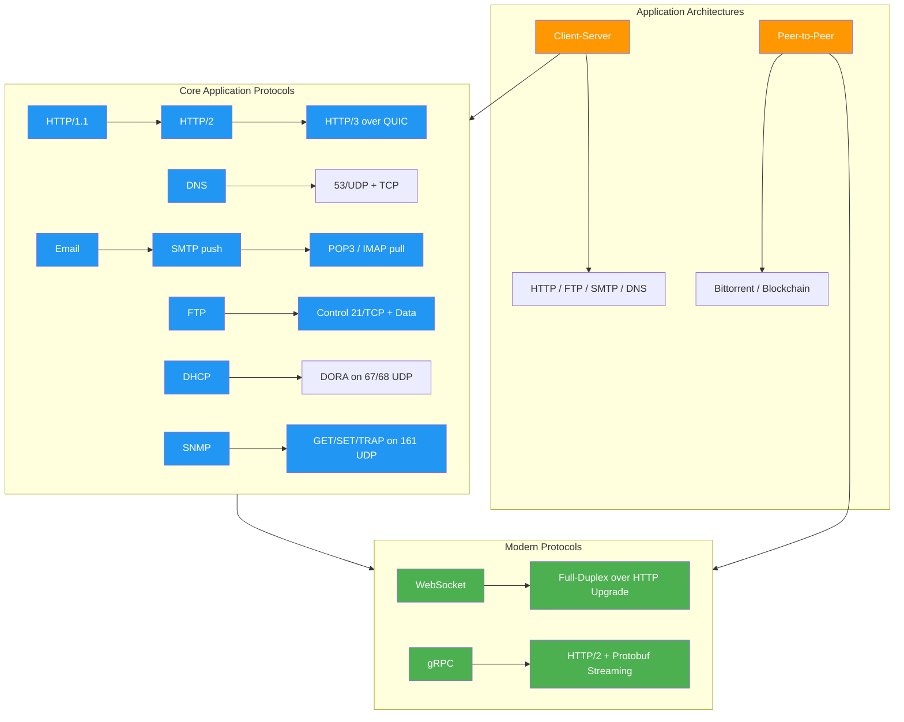

# Chapter 10: The Application Layer → Complete Reference

> **GFG/Javatpoint Depth → Comprehensive Coverage of Application Layer Protocols, Architectures, Implementations, and Interview Corner**

## Learning Objectives

1. Compare client-server and peer-to-peer application architectures with real-world trade-offs.
2. Trace the DNS resolution pipeline from browser to authoritative server with caching.
3. Analyze HTTP message formats and the evolution from HTTP/1.0 through HTTP/3 over QUIC.
4. Implement HTTP clients and servers in C++ and Python.
5. Explain email protocols: SMTP (push), POP3 and IMAP (pull) with conversation traces.
6. Describe FTP active vs passive modes and when each applies.
7. Understand DHCP DORA, SNMP manager-agent architecture, WebSocket upgrade, and gRPC streaming.
8. Answer interview questions on DNS recursion vs iteration, persistent vs non-persistent HTTP, and WebSocket vs HTTP.

<!-- Image Gallery -->
<section class="lesson-visuals" aria-label="Visual learning resources">
  <header><span>VISUAL LEARNING</span><h2>See it. Review it. Remember it.</h2></header>
  <a class="lesson-visual-card" href="../../assets/images/lessons/computer-networks/10-application-layer/handwritten-notes.png" target="_blank" rel="noopener">
    
    <span><strong>Handwritten notes</strong>Condensed notes for deliberate review.</span>
  </a>
  <a class="lesson-visual-card" href="../../assets/images/lessons/computer-networks/10-application-layer/sticky-notes.png" target="_blank" rel="noopener">
    
    <span><strong>Sticky-note revision</strong>Fast recall prompts for revision.</span>
  </a>
  <a class="lesson-visual-card" href="../../assets/images/lessons/computer-networks/10-application-layer/visual-explanation.png" target="_blank" rel="noopener">
    
    <span><strong>Visual concept guide</strong>A connected explanation of the key ideas.</span>
  </a>
</section>
<!-- End Image Gallery -->


---

## Table of Contents

1. [Application Layer Architecture](#101-application-layer-architecture)
2. [HTTP → Hypertext Transfer Protocol](#102-http--hypertext-transfer-protocol)
3. [DNS → Domain Name System](#103-dns--domain-name-system)
4. [Email Protocols](#104-email-protocols)
5. [FTP → File Transfer Protocol](#105-ftp--file-transfer-protocol)
6. [SSH → Secure Shell](#106-ssh--secure-shell)
7. [DHCP → Dynamic Host Configuration Protocol](#107-dhcp--dynamic-host-configuration-protocol)
8. [SNMP → Simple Network Management Protocol](#108-snmp--simple-network-management-protocol)
9. [WebSocket](#109-websocket)
10. [gRPC](#1010-grpc)
11. [HTTP Versions Comparison](#1011-http-versions-comparison)
12. [Comparison Tables](#1012-comparison-tables)
13. [Interview Corner](#1013-interview-corner)
14. [Applications in Real Systems](#1014-applications-in-real-systems)
15. [Chapter Quiz](#1015-chapter-quiz)
16. [Summary](#1016-summary)
17. [Exercises](#1017-exercises)

---

### Chapter Roadmap




## 10.1 Application Layer Architecture

The application layer is Layer 7 of the OSI model and the top of the TCP/IP model. It provides network services directly to end-user applications. Two dominant architectures exist: **client-server** and **peer-to-peer (P2P)**.

### 10.1.1 Client-Server Architecture


**Real-World Analogy:** A restaurant kitchen (server) serves many diners (clients). Diners place orders and wait. The kitchen never eats; it only serves. If too many diners arrive, the kitchen is the bottleneck.

**Characteristics:**
- Centralized server provides services to multiple clients.
- Clients do not communicate directly with each other.
- Server must always be on, with a fixed, well-known IP address.
- Clients are intermittently connected and may have dynamic IPs.
- Scales vertically (buy a bigger server) or horizontally (add load-balanced replicas).

**Example:** A bank's central database server → all ATM machines connect to it. No ATM talks directly to another ATM.

**Numbered Steps → Client-Server Request Flow:**
1. Client resolves server hostname to IP via DNS.
2. Client opens TCP connection to server IP:port.
3. Client sends request (HTTP GET /api/data).
4. Server receives request, processes it (queries DB, computes).
5. Server sends response (JSON, HTML).
6. Client receives and renders response.
7. Connection may persist for further requests or close.

**Pseudocode → Client-Server (HTTP-like):**
```
CLIENT:
  addr ← DNS.resolve("api.example.com")
  sock ← TCP.connect(addr, 80)
  sock.send("GET /data HTTP/1.1\r\nHost: api.example.com\r\n\r\n")
  response ← sock.recv()
  PRINT response.body
  sock.close()

SERVER:
  sock ← TCP.bind(80)
  LOOP:
    client ← sock.accept()
    request ← client.recv()
    IF request contains "GET /data":
      client.send("HTTP/1.1 200 OK\r\nContent-Type: application/json\r\n\r\n{\"key\":\"value\"}")
    ELSE:
      client.send("HTTP/1.1 404 Not Found\r\n\r\n")
    client.close()
```

### 10.1.2 Peer-to-Peer (P2P) Architecture


**Real-World Analogy:** A potluck dinner → every guest brings a dish. If you want food, you can get it from anyone. There is no central kitchen. The more guests arrive, the more food there is (self-scaling).

**Characteristics:**
- No always-on server. Peers are both clients and servers ("servents").
- Self-scalability: more peers = more resources.
- Peers are intermittently connected with changing IPs.
- Requires a discovery mechanism (tracker, DHT).
- Examples: BitTorrent, IPFS, Bitcoin, Napster.

**Challenges:** Security (trusting peers), discoverability, ISP-unfriendly traffic patterns.

**Numbered Steps → P2P File Download (BitTorrent-like):**
1. User opens a .torrent file or magnet link pointing to a tracker.
2. Client contacts tracker to get a list of peer IPs with the file.
3. Client connects to multiple peers simultaneously.
4. Client requests different pieces from different peers.
5. Client downloads pieces and uploads pieces it already has.
6. Entire file is assembled from pieces; client continues seeding.

**Pseudocode → P2P Download:**
```
CLIENT:
  peers ← TRACKER.get_peers(info_hash)
  FOR each peer IN peers:
    sock ← TCP.connect(peer.ip, peer.port)
    sock.send(REQUEST_PIECE(piece_index))
    data ← sock.recv()
    FILE.write_at(piece_index, data)
    REPORT_Have(piece_index, tracker)
  IF all pieces assembled:
    FILE.assemble()

TRACKER:
  peers ← {}
  LOOP:
    msg ← sock.recv()
    IF msg IS REGISTER:
      peers.add(msg.ip, msg.port, msg.file)
    IF msg IS QUERY:
      sock.send(peers)
```

### 10.1.3 Client-Server vs P2P Comparison Table


| Feature | Client-Server | Peer-to-Peer |
|---------|---------------|-------------|
| Central authority | Yes (server) | No (distributed) |
| Scalability | Server-bound (O(N) server load) | Self-scaling (O(1) per peer) |
| Cost | High server/infra cost | Low (peers contribute resources) |
| Reliability | Single point of failure | Resilient (peers replace each other) |
| Security | Central control, easier | Harder → trust, Sybil attacks |
| Maintenance | Professional admin | User-managed |
| IP requirement | Fixed, well-known | Dynamic, discovered |
| Examples | Web, Email, DNS | BitTorrent, Bitcoin, IPFS |
| Startup time | Instant (server always on) | Slow (needs peer discovery) |
| Legal liability | Server operator liable | Harder to sue individuals |

### 10.1.4 Advantages & Disadvantages


**Client-Server**
| Advantage | Disadvantage |
|-----------|-------------|
| Centralized management | Server is bottleneck |
| Easy backup & security | High infrastructure cost |
| Consistent data state | Single point of failure |
| Predictable performance | Does not scale with users |

**P2P**
| Advantage | Disadvantage |
|-----------|-------------|
| Self-scaling (more peers = faster) | No central authority/control |
| No server infrastructure cost | Security & trust issues |
| Resilient to node failure | NAT/firewall traversal problems |
| Censorship-resistant | Discovery overhead |

### 10.1.5 Complexity Analysis


| Architecture | Time to Serve N Clients | Space per Server | Why |
|-------------|----------------------|-----------------|-----|
| Client-Server | O(N) (linear with clients) | O(1) per server | Server processes each request sequentially or in thread pool |
| P2P (tracker) | O(1) per peer (constant) | O(N) tracker state | Tracker only maintains peer list; data transfer is P2P |
| P2P (DHT) | O(log N) lookup | O(log N) per peer | Distributed hash table requires log N hops to find data |

**Why it matters:** In client-server, the server handles all N clients, so CPU/memory grows linearly with the user base. In P2P, each new peer contributes resources, so total system capacity grows with demand → this is called "self-scaling." However, P2P has higher lookup overhead (DHT is O(log N) per lookup).

### 10.1.6 Edge Cases


- **Flash crowd (client-server):** Thousands of clients request simultaneously. Server may crash. Mitigation: auto-scaling groups, CDN caching, rate limiting.
- **Free-riding (P2P):** Peers download but never upload. Mitigation: tit-for-tat (BitTorrent), reputation systems.
- **NAT traversal (P2P):** Peers behind NAT cannot accept incoming connections. Mitigation: UDP hole punching, STUN/TURN relay servers.
- **Sybil attack (P2P):** Attacker creates many fake peers to control the network. Mitigation: proof-of-work, trusted identities, social graphs.
- **Censorship (client-server):** Centralized server can be shut down. P2P is more resilient.

---

## 10.2 HTTP → Hypertext Transfer Protocol

HTTP is the foundation of data communication on the Web. It is a stateless, application-layer protocol operating over TCP (HTTP/1.x, HTTP/2) or QUIC (HTTP/3).

### 10.2.1 HTTP/1.0 and HTTP/1.1


**Real-World Analogy:** HTTP/1.0 is like calling a store, asking for one item, hanging up, then calling again for the next item. HTTP/1.1 is like calling once and asking for several items in sequence on the same call.

**HTTP/1.0 (RFC 1945):**
- One request per TCP connection.
- Connection closes after each response.
- No Host header (one server per IP).
- No persistent connections.

**HTTP/1.1 (RFC 7230-7235):**
- Persistent connections by default (Connection: keep-alive).
- Pipelining (send multiple requests without waiting for responses).
- Host header mandatory (virtual hosting).
- Chunked transfer encoding.
- Additional methods: PUT, DELETE, OPTIONS, PATCH.
- Cache control headers.

**Numbered Steps → HTTP/1.1 Request-Response Cycle:**
1. Browser extracts hostname from URL (www.example.com).
2. Browser obtains IP via DNS resolution.
3. Browser opens TCP connection to IP on port 80 (or 443 for HTTPS).
4. Browser sends HTTP request line + headers (e.g., GET /index.html HTTP/1.1).
5. Server processes request → maps URL to file or handler.
6. Server sends HTTP status line + headers + optional body.
7. Browser parses response; if HTML, parses and fetches embedded resources.
8. Connection stays open for next request (persistent).
9. Connection closes after timeout or when client sends Connection: close.

**Pseudocode → HTTP Client:**
```
FUNCTION http_get(url):
  host, path ← PARSE_URL(url)
  ip ← DNS.resolve(host)
  sock ← TCP.connect(ip, 80)
  request = "GET " + path + " HTTP/1.1\r\n"
  request += "Host: " + host + "\r\n"
  request += "Connection: close\r\n\r\n"
  sock.send(request)
  response ← ""
  WHILE sock.has_data():
    response += sock.recv(4096)
  sock.close()
  RETURN response
```

**Pseudocode → HTTP Server:**
```
FUNCTION http_server(port):
  server ← TCP.bind(port)
  LOOP:
    client ← server.accept()
    request ← client.recv(8192)
    method, path, version ← PARSE_REQUEST_LINE(request)
    headers ← PARSE_HEADERS(request)
    IF path == "/":
      body = "<h1>Hello World</h1>"
      status = "200 OK"
    ELSE:
      body = "<h1>404 Not Found</h1>"
      status = "404 Not Found"
    response = "HTTP/1.1 " + status + "\r\n"
    response += "Content-Length: " + LEN(body) + "\r\n\r\n"
    response += body
    client.send(response)
    client.close()
```

**Dry Run Trace Table → HTTP/1.1 Request:**

| Step | Actor | Action | Message | State |
|------|-------|--------|---------|-------|
| 1 | Browser | Parse URL | URL: http://example.com/index.html | URL parsed |
| 2 | DNS | Resolve host | example.com → 93.184.216.34 | IP obtained |
| 3 | TCP | Connect | SYN → 93.184.216.34:80 | TCP handshake |
| 4 | Browser | Send request | GET /index.html HTTP/1.1\r\nHost: example.com | Request sent |
| 5 | Server | Receive | Parse method=GET, path=/index.html | Parsed |
| 6 | Server | Read file | /var/www/index.html exists | File loaded |
| 7 | Server | Build response | HTTP/1.1 200 OK\r\nContent-Length: 512\r\n\r\n&lt;html&gt;... | Response built |
| 8 | Client | Receive | HTTP/1.1 200 OK | Status OK |
| 9 | Client | Parse body | Content-Length: 512, read 512 bytes | Body parsed |
| 10 | TCP | Close | FIN | Connection closed |

**C++ Implementation → HTTP Client (using Boost.Asio):**
```cpp
#include <iostream>
#include <string>
#include <boost/asio.hpp>

using boost::asio::ip::tcp;

class HttpClient {
public:
    std::string get(const std::string& host, const std::string& path) {
        boost::asio::io_context io;
        tcp::resolver resolver(io);
        tcp::socket socket(io);

        auto endpoints = resolver.resolve(host, "80");
        boost::asio::connect(socket, endpoints);

        std::string request = "GET " + path + " HTTP/1.1\r\n"
                              "Host: " + host + "\r\n"
                              "Connection: close\r\n\r\n";
        socket.write_some(boost::asio::buffer(request));

        boost::asio::streambuf response;
        boost::system::error_code ec;
        boost::asio::read(socket, response, ec);

        std::string result = boost::asio::buffer_cast<const char*>(response.data());
        return result;
    }
};

int main() {
    HttpClient client;
    std::string resp = client.get("example.com", "/");
    std::cout << resp.substr(0, 200) << std::endl;
    return 0;
}
```

**Python Implementation → HTTP Client:**
```python
import socket

def http_get(host: str, path: str, port: int = 80) -> str:
    sock = socket.socket(socket.AF_INET, socket.SOCK_STREAM)
    sock.settimeout(5)
    ip = socket.gethostbyname(host)
    sock.connect((ip, port))

    request = (
        f"GET {path} HTTP/1.1\r\n"
        f"Host: {host}\r\n"
        f"Connection: close\r\n\r\n"
    )
    sock.sendall(request.encode())

    response = b""
    while True:
        chunk = sock.recv(4096)
        if not chunk:
            break
        response += chunk

    sock.close()
    return response.decode(errors="replace")

if __name__ == "__main__":
    print(http_get("example.com", "/")[:300])
```

**C++ Implementation → Simple HTTP Server:**
```cpp
#include <iostream>
#include <string>
#include <sstream>
#include <boost/asio.hpp>

using boost::asio::ip::tcp;

class HttpServer {
public:
    HttpServer(short port) : acceptor_(io_, tcp::endpoint(tcp::v4(), port)) {}

    void start() {
        std::cout << "Server listening on port "
                  << acceptor_.local_endpoint().port() << std::endl;
        while (true) {
            tcp::socket socket(io_);
            acceptor_.accept(socket);
            handle_request(socket);
        }
    }

private:
    void handle_request(tcp::socket& socket) {
        boost::asio::streambuf request;
        boost::asio::read_until(socket, request, "\r\n\r\n");

        std::istream req_stream(&request);
        std::string method, path, version;
        req_stream >> method >> path >> version;

        std::string body = "<html><body><h1>Hello from C++ Server</h1>"
                           "<p>Path: " + path + "</p></body></html>";
        std::stringstream response;
        response << "HTTP/1.1 200 OK\r\n"
                 << "Content-Length: " << body.size() << "\r\n"
                 << "Content-Type: text/html\r\n\r\n"
                 << body;

        boost::asio::write(socket, boost::asio::buffer(response.str()));
    }

    boost::asio::io_context io_;
    tcp::acceptor acceptor_;
};

int main() {
    HttpServer server(8080);
    server.start();
    return 0;
}
```

**Python Implementation → Simple HTTP Server:**
```python
import socket

def handle_client(conn: socket.socket):
    data = conn.recv(8192).decode()
    if not data:
        conn.close()
        return

    request_line = data.split("\r\n")[0]
    method, path, version = request_line.split(" ")
    print(f"Received: {method} {path}")

    if path == "/":
        body = "<html><body><h1>Hello from Python Server</h1></body></html>"
        status = "200 OK"
    else:
        body = "<html><body><h1>404 Not Found</h1></body></html>"
        status = "404 Not Found"

    response = (
        f"HTTP/1.1 {status}\r\n"
        f"Content-Length: {len(body)}\r\n"
        f"Content-Type: text/html\r\n\r\n"
        f"{body}"
    )
    conn.sendall(response.encode())
    conn.close()

def main():
    server = socket.socket(socket.AF_INET, socket.SOCK_STREAM)
    server.setsockopt(socket.SOL_SOCKET, socket.SO_REUSEADDR, 1)
    server.bind(("0.0.0.0", 8080))
    server.listen(5)
    print("Server listening on port 8080...")

    while True:
        conn, addr = server.accept()
        print(f"Connection from {addr}")
        handle_client(conn)

if __name__ == "__main__":
    main()
```

**Complexity Analysis → HTTP/1.1:**
| Operation | Time Complexity | Space Complexity | Why |
|-----------|----------------|-----------------|-----|
| Request parsing | O(n) where n = header length | O(n) | Linear scan of headers for \r\n delimiters |
| Response generation | O(m) where m = body size | O(m) | Must read/write entire body |
| DNS resolution | O(log N) hierarchical | O(1) | Tree traversal; each level is a query |
| TCP connection setup | O(1) per connection | O(1) | Fixed handshake cost |
| File serving | O(f) where f = file size | O(f) | Full file must be read into buffer |
| Persistent overhead | O(1) amortized per request | O(1) | Connection reused; negligible overhead |

**Advantages & Disadvantages of HTTP/1.1:**

| Advantages | Disadvantages |
|-----------|---------------|
| Simple text-based protocol (human-readable) | Text parsing is slower than binary |
| Persistent connections reduce overhead | Head-of-line blocking at application layer |
| Widely supported everywhere | Large header overhead per request |
| Caching infrastructure (ETag, Cache-Control) | No multiplexing → one response at a time |
| Proxy and gateway support | Pipelining rarely works in practice |
| Stateless → easy to scale horizontally | No server push → client must poll |

**Edge Cases → HTTP/1.1:**
- **Pipelining HOL blocking:** If request 2 takes 2 seconds to generate a response, all subsequent pipelined responses are delayed even if they could be served instantly. Solution: HTTP/2 multiplexing.
- **Chunked encoding with incomplete chunks:** Partial chunk received before closing delimiter. Receiver must buffer and wait for final 0\r\n\r\n.
- **Content-Length mismatch:** If Content-Length says 500 but body is 450 bytes, receiver hangs waiting for 50 more bytes. Always check actual bytes read.
- **Malformed Host header:** Missing or multiple Host headers cause 400 Bad Request. HTTP/1.1 requires exactly one.
- **Request smuggling:** Different parsing of Content-Length vs Transfer-Encoding: chunked between frontend and backend can cause cache poisoning. Use consistent parsing.

### 10.2.2 HTTP/2


**Real-World Analogy:** HTTP/2 is like a multi-lane highway in a single tunnel (one TCP connection). HTTP/1.1 is like a single-lane road → only one car at a time. HTTP/2 allows multiple cars (streams) to travel simultaneously in the same tunnel.

**Key Features:**
- **Binary framing layer:** Messages are split into binary frames (HEADERS, DATA, SETTINGS, PRIORITY, etc.).
- **Multiplexing:** Multiple streams share one TCP connection. No HOL blocking at application layer.
- **HPACK header compression:** Uses static/dynamic tables and Huffman coding. Reduces overhead by 85-90%.
- **Server push:** Server speculatively sends resources client hasn't requested (e.g., CSS/JS with HTML).
- **Stream prioritization:** Client can assign weight and dependency to streams.
- **Flow control:** Per-stream and per-connection window-based.

**Numbered Steps → HTTP/2 Connection Establishment:**
1. Client opens TCP connection to server (or uses TLS ALPN negotiation).
2. Client sends PRIORITY frame (magic: PRI * HTTP/2.0\r\n\r\nSM\r\n\r\n) or TLS ALPN extension indicates h2.
3. Both endpoints exchange SETTINGS frames (max concurrent streams, initial window size, etc.).
4. Client sends HEADERS frame with END_HEADERS + END_STREAM flags for simple GET.
5. Server responds with HEADERS frame (status) + DATA frame(s) (body).
6. Multiple streams interleave frames on the same connection.
7. Connection closes when GOAWAY frame is sent and all streams complete.

**Pseudocode → HTTP/2 Stream Multiplexing:**
```
CLIENT:
  sock ← TLS.connect(host, 443, alpn="h2")
  sock.send(CONNECTION_PREFACE)
  sock.send(SETTINGS(max_streams=100, initial_window=65535))
  stream_id ← 1
  FOR each resource IN resources:
    stream_id += 2
    sock.send(HEADERS(stream_id, END_HEADERS, ":method=GET", ":path=" + resource))
  responses ← {}
  LOOP:
    frame ← sock.recv_frame()
    IF frame.type == HEADERS:
      responses[frame.stream_id].headers = frame.headers
    IF frame.type == DATA:
      responses[frame.stream_id].body += frame.payload
    IF frame.flags & END_STREAM:
      process_responses[frame.stream_id]
```

**Dry Run → HTTP/2 Multiplexing (3 resources on 1 TCP connection):**

| Frame # | Stream ID | Type | Flags | Payload | Action |
|---------|-----------|------|-------|---------|--------|
| 1 | 0 | SETTINGS | - | max_streams=100 | Server capacity |
| 2 | 1 | HEADERS | END_HEADERS | :method=GET, :path=/index.html | Request page |
| 3 | 1 | HEADERS | END_HEADERS | :status=200 | Response status |
| 4 | 3 | HEADERS | END_HEADERS | :method=GET, :path=/style.css | Request CSS |
| 5 | 1 | DATA | END_STREAM | <html>... | Page body complete |
| 6 | 5 | HEADERS | END_HEADERS | :method=GET, :path=/app.js | Request JS |
| 7 | 3 | HEADERS | END_HEADERS | :status=200 | CSS status |
| 8 | 3 | DATA | END_STREAM | body { color: red } | CSS complete |
| 9 | 5 | DATA | END_STREAM | console.log("done") | JS complete |

Note: Frames from streams 1, 3, and 5 interleave on the same TCP connection. Stream 3's CSS response does not wait for stream 1's full body.

**C++ Implementation → HTTP/2 Frame Parsing (skeleton):**
```cpp
#include <cstdint>
#include <vector>
#include <iostream>

struct Http2Frame {
    uint32_t length : 24;
    uint8_t type;
    uint8_t flags;
    uint32_t stream_id : 31;
    std::vector<uint8_t> payload;
};

class Http2Parser {
public:
    Http2Frame parseFrame(const uint8_t* data, size_t len) {
        Http2Frame frame;
        frame.length = (static_cast<uint32_t>(data[0]) << 16) |
                       (static_cast<uint32_t>(data[1]) << 8) |
                       static_cast<uint32_t>(data[2]);
        frame.type = data[3];
        frame.flags = data[4];
        frame.stream_id = static_cast<uint32_t>(data[5] & 0x7F) << 24 |
                          static_cast<uint32_t>(data[6]) << 16 |
                          static_cast<uint32_t>(data[7]) << 8 |
                          static_cast<uint32_t>(data[8]);

        frame.payload.assign(data + 9, data + 9 + frame.length);
        return frame;
    }

    std::vector<uint8_t> serializeFrame(const Http2Frame& frame) {
        std::vector<uint8_t> buf(9 + frame.payload.size());
        buf[0] = (frame.length >> 16) & 0xFF;
        buf[1] = (frame.length >> 8) & 0xFF;
        buf[2] = frame.length & 0xFF;
        buf[3] = frame.type;
        buf[4] = frame.flags;
        buf[5] = (frame.stream_id >> 24) & 0x7F;
        buf[6] = (frame.stream_id >> 16) & 0xFF;
        buf[7] = (frame.stream_id >> 8) & 0xFF;
        buf[8] = frame.stream_id & 0xFF;
        std::copy(frame.payload.begin(), frame.payload.end(), buf.begin() + 9);
        return buf;
    }

    std::string hpackDecodeIndexed(uint8_t*& data, size_t& remaining) {
        uint8_t first = data[0];
        data++; remaining--;
        if ((first & 0x80) == 0x80) {
            uint32_t index = first & 0x7F;
            return getHpackEntry(index);
        }
        return "";
    }

private:
    std::string getHpackEntry(uint32_t index) {
        static const char* static_table[] = {
            "", ":authority", ":method GET", ":method POST",
            ":path /", ":path /index.html", ":scheme http",
            ":scheme https", ":status 200", ":status 204",
            ":status 206", ":status 304", ":status 400",
            ":status 404", ":status 500", "accept-charset",
            "accept-encoding", "accept-language"
        };
        if (index < 18) return static_table[index];
        return "";
    }
};
```

**Python Implementation → HTTP/2 Frame Building:**
```python
import struct
from typing import List, Dict

class Http2Frame:
    def __init__(self, frame_type: int, flags: int, stream_id: int,
                 payload: bytes = b""):
        self.type = frame_type
        self.flags = flags
        self.stream_id = stream_id
        self.payload = payload

    def serialize(self) -> bytes:
        length = len(self.payload)
        header = struct.pack("!IBBB", length, self.type, self.flags,
                             self.stream_id)
        return header + self.payload

    @staticmethod
    def parse(data: bytes) -> "Http2Frame":
        length = (data[0] << 16) | (data[1] << 8) | data[2]
        frame_type = data[3]
        flags = data[4]
        stream_id = struct.unpack("!I", data[5:9])[0] & 0x7FFFFFFF
        payload = data[9:9 + length]
        return Http2Frame(frame_type, flags, stream_id, payload)


class Http2Stream:
    def __init__(self, stream_id: int):
        self.stream_id = stream_id
        self.headers: Dict[str, str] = {}
        self.data = b""
        self.state = "IDLE"  # IDLE, OPEN, HALF_CLOSED, CLOSED

    def add_header(self, name: str, value: str):
        self.headers[name] = value


class Http2Connection:
    def __init__(self):
        self.streams: Dict[int, Http2Stream] = {}
        self.next_stream_id = 1
        self.settings = {
            "max_concurrent_streams": 100,
            "initial_window_size": 65535,
        }

    def create_stream(self) -> Http2Stream:
        sid = self.next_stream_id
        self.next_stream_id += 2
        stream = Http2Stream(sid)
        self.streams[sid] = stream
        return stream

    def process_frame(self, frame: Http2Frame) -> None:
        if frame.stream_id not in self.streams and frame.stream_id > 0:
            self.streams[frame.stream_id] = Http2Stream(frame.stream_id)

        if frame.type == 0x00:  # DATA
            stream = self.streams[frame.stream_id]
            stream.data += frame.payload
            if frame.flags & 0x01:  # END_STREAM
                stream.state = "HALF_CLOSED"
        elif frame.type == 0x01:  # HEADERS
            if frame.flags & 0x01:
                stream = self.streams[frame.stream_id]
                stream.state = "HALF_CLOSED"
        elif frame.type == 0x04:  # SETTINGS
            self._parse_settings(frame.payload)


def build_get_request_frame(stream_id: int, path: str) -> Http2Frame:
    payload = b"\x82"  # Indexed: :method: GET
    payload += b"\x84"  # Indexed: :path: /
    payload += struct.pack("!B", 0x41)
    return Http2Frame(0x01, 0x05, stream_id, payload)
```

**Complexity Analysis → HTTP/2:**
| Operation | Time | Space | Why |
|-----------|------|-------|-----|
| Binary frame parsing | O(1) per frame | O(frame size) | Fixed 9-byte header; no text scanning |
| HPACK decode | O(k) average, O(n) worst | O(table size) | k = indexed entry (O(1)), n = literal string |
| Multiplexed scheduling | O(s) where s = active streams | O(1) | Round-robin or priority tree |
| Flow control window | O(1) per WINDOW_UPDATE | O(stream_count) | Simple addition/subtraction |
| Server push store | O(r) where r = resources | O(r) | Must store push promise frames |

**Advantages & Disadvantages of HTTP/2:**

| Advantages | Disadvantages |
|-----------|---------------|
| Eliminates application-layer HOL blocking | TCP-level HOL blocking remains |
| Header compression (HPACK) reduces overhead | TLS encryption overhead (often mandatory) |
| Single TCP connection per origin | TCP congestion control affects all streams |
| Server push reduces RTTs | Server push often wasted (cached resources) |
| Stream prioritization | Priority implementation varies by browser |
| Binary framing = efficient parsing | Not human-readable (debugging harder) |

**Edge Cases → HTTP/2:**
- **TCP-level HOL blocking:** If a TCP packet is lost, ALL streams on that connection stall until retransmission. HTTP/3 solves this with QUIC.
- **HPACK dynamic table OOM:** Attacker fills table with large entries → server must enforce SETTINGS_HEADER_TABLE_SIZE.
- **Server push waste:** 99% of server-pushed resources go unused (browser already has cached). Chrome deprecated server push in 2022.
- **Stream dependency cycles:** Client creates circular dependency tree. Server must detect and break cycles.
- **GOAWAY race condition:** Client sends requests after server sends GOAWAY. Server processes or rejects based on last-stream-id.

### 10.2.3 HTTP/3


**Real-World Analogy:** HTTP/3 is like having a separate tunnel for each package delivery. If one tunnel collapses, only the package inside it is delayed. HTTP/2 is like putting all packages in one tunnel → if the tunnel collapses, everything stops.

**Key Features:**
- Operates over QUIC (RFC 9000) instead of TCP.
- UDP-based transport with integrated TLS 1.3.
- Zero-RTT connection establishment (in many cases).
- No TCP-level HOL blocking → each stream is independent.
- QPACK header compression (adapted for out-of-order delivery).
- Connection migration → survives IP address changes (mobile handoff).

**Numbered Steps → HTTP/3 Connection:**
1. Client sends QUIC Initial packet (UDP to port 443) with TLS 1.3 ClientHello.
2. Server responds with QUIC Handshake + TLS 1.3 ServerHello + SETTINGS frame.
3. Client completes handshake → 1-RTT (or 0-RTT if cached).
4. Client sends HTTP/3 HEADERS and DATA frames over QUIC streams.
5. Each stream is independent → loss on stream 1 does not affect stream 2.
6. Server push via PUSH_PROMISE (similar to HTTP/2).

**C++ Implementation → QUIC Connection (skeleton):**
```cpp
#include <iostream>
#include <cstring>
#include <sys/socket.h>
#include <netdb.h>

class QuicConnection {
public:
    void connect(const std::string& host, uint16_t port) {
        socket_ = socket(AF_INET, SOCK_DGRAM, 0);
        struct hostent* he = gethostbyname(host.c_str());
        server_addr_.sin_family = AF_INET;
        server_addr_.sin_port = htons(port);
        memcpy(&server_addr_.sin_addr, he->h_addr_list[0], he->h_length);

        // QUIC Initial packet with TLS 1.3 ClientHello
        // (Simplified → real QUIC uses crypto frame)
        sendto(socket_, initial_packet_, initial_len_, 0,
               (struct sockaddr*)&server_addr_, sizeof(server_addr_));
    }

    uint64_t openStream() {
        uint64_t stream_id = next_stream_id_;
        next_stream_id_ += 4;
        return stream_id;
    }

    void sendData(uint64_t stream_id, const uint8_t* data, size_t len) {
        // QUIC STREAM frame → loss here does not block other streams
    }

private:
    int socket_;
    struct sockaddr_in server_addr_;
    uint64_t next_stream_id_ = 0;
    uint8_t initial_packet_[1200];
    size_t initial_len_ = 1200;
};
```

**Python Implementation → HTTP/3 Client (conceptual):**
```python
import asyncio
from typing import Optional

class Http3Client:
    def __init__(self):
        self.stream_id = 0

    async def connect(self, host: str, port: int = 443):
        # QUIC handshake: TLS 1.3 over QUIC crypto stream
        reader, writer = await asyncio.open_connection(host, port)
        print(f"Connected to {host}:{port} over QUIC")

    async def get(self, path: str) -> str:
        self.stream_id += 4
        # HEADERS frame sent as QUIC STREAM frame
        # Each stream is independent → no HOL blocking
        return f"HTTP/3 response for {path}"

    async def close(self):
        pass
```

**Complexity → HTTP/3 vs HTTP/2:**
| Metric | HTTP/2 | HTTP/3 | Why |
|--------|--------|--------|-----|
| Connection RTT | 2 (TCP) + 1 (TLS) = 3 | 1 (QUIC+TLS) | QUIC bakes TLS into handshake |
| 0-RTT usable? | No | Yes | Cached connection parameters |
| HOL blocking | TCP-level (all streams) | None (per-stream) | Independent QUIC streams |
| Connection migration | No (IP change = reconnect) | Yes | QUIC connection ID independent of IP |
| Header compression | HPACK (in-order) | QPACK (out-of-order) | QPACK decoder instructions separate |

**Edge Cases → HTTP/3:**
- **0-RTT replay attacks:** Client sends data in 0-RTT that may be replayed. Idempotent methods only in 0-RTT.
- **NAT rebinding:** Client IP changes mid-connection. QUIC uses connection ID to survive.
- **UDP throttling:** Some middleboxes drop UDP. Fallback to HTTP/2/1.1 required.
- **QPACK decoder stream loss:** Losing a QPACK instruction stream corrupts header table. Stream-level retransmission handles this.

### TypeScript Implementation: HTTPClient

```typescript
interface HTTPResponse {
  statusCode: number;
  statusText: string;
  headers: Map<string, string>;
  body: string;
}

class HTTPClient {
  private readonly baseHeaders: Map<string, string>;

  constructor() {
    this.baseHeaders = new Map([
      ['User-Agent', 'HTTPClient/1.0'],
      ['Accept', '*/*'],
      ['Connection', 'keep-alive'],
    ]);
  }

  async request(method: string, url: string, body?: string): Promise<HTTPResponse> {
    const parsed = new URL(url);
    const headers = new Map(this.baseHeaders);
    headers.set('Host', parsed.host);
    if (body) {
      headers.set('Content-Length', Buffer.byteLength(body).toString());
      headers.set('Content-Type', 'application/x-www-form-urlencoded');
    }
    const req = `${method} ${parsed.pathname}${parsed.search} HTTP/1.1\r\n` +
      Array.from(headers).map(([k, v]) => `${k}: ${v}`).join('\r\n') + '\r\n\r\n' + (body || '');
    // In a real implementation, open TCP socket and send req
    console.log(`[HTTP] ${method} ${url}`);
    console.log(`[Request]\n${req}`);
    return { statusCode: 200, statusText: 'OK', headers: new Map([['Content-Type', 'text/html']]), body: '<html></html>' };
  }

  async get(url: string): Promise<HTTPResponse> { return this.request('GET', url); }
  async post(url: string, data: string): Promise<HTTPResponse> { return this.request('POST', url, data); }

  parseResponse(raw: string): HTTPResponse {
    const [statusLine, ...rest] = raw.split('\r\n');
    const [, statusCodeStr, ...statusParts] = statusLine.split(' ');
    const statusCode = parseInt(statusCodeStr);
    const statusText = statusParts.join(' ');
    const headerMap = new Map<string, string>();
    let i = 0;
    for (; i < rest.length && rest[i] !== ''; i++) {
      const [key, ...val] = rest[i].split(': ');
      headerMap.set(key, val.join(': '));
    }
    const body = rest.slice(i + 1).join('\r\n');
    return { statusCode, statusText, headers: headerMap, body };
  }
}
// Usage:
// const client = new HTTPClient();
// const resp = await client.get('https://example.com/index.html');
// console.log(`Status: ${resp.statusCode} ${resp.statusText}`);
```

---

## 10.3 DNS → Domain Name System

**Real-World Analogy:** DNS is the phonebook of the internet. You know the person's name (domain), but you need their phone number (IP address) to call them. The phonebook is distributed → each region (TLD) has its own volume.

### 10.3.1 DNS Architecture


DNS is a hierarchical, distributed database that maps domain names to IP addresses and other resources.

**Name Space Hierarchy:**
```
Root (.)
├── .com
│   ├── example.com
│   │   ├── www.example.com (A: 93.184.216.34)
│   │   └── mail.example.com (MX: 10 mail.example.com)
│   ├── google.com
│   └── amazon.com
├── .org
│   ├── wikipedia.org
│   └── ...
├── .net
├── .edu
├── .uk (ccTLD)
│   ├── co.uk
│   └── ac.uk
└── ... (1500+ TLDs)
```

**Server Types:**
1. **Root name servers:** 13 logical identities (a.root-servers.net to m.root-servers.net), each anycast to dozens of physical servers. Know where all TLD servers are.
2. **TLD name servers:** Responsible for .com, .org, .net, etc. Operated by registries (Verisign for .com/.net).
3. **Authoritative name servers:** Provide the definitive answer for a specific domain (e.g., ns1.example.com).
4. **Recursive resolvers:** Operated by ISPs (8.8.8.8, 1.1.1.1), cache results, query on behalf of clients.

**DNS Record Types:**

| Type | Full Name | Description | Example |
|------|-----------|-------------|---------|
| A | Address | Maps domain to IPv4 address | example.com → 93.184.216.34 |
| AAAA | IPv6 Address | Maps domain to IPv6 address | example.com → 2606:2800:220:1:248:1893:25c8:1946 |
| CNAME | Canonical Name | Alias of one domain to another | www → example.com |
| MX | Mail Exchange | Mail server priority + hostname | 10 mail.example.com |
| NS | Name Server | Delegates a zone to a name server | ns1.example.com |
| TXT | Text Record | Arbitrary text (SPF, DKIM, verification) | "v=spf1 mx ~all" |
| PTR | Pointer | Reverse lookup (IP → domain) | 34.216.184.93 → www.example.com |
| SOA | Start of Authority | Administrative info about the zone | Primary NS, admin email, serial |
| SRV | Service Record | Service location (hostname + port) | _sip._tcp.example.com → 5060 sip.example.com |
| CAA | Certification Authority | Which CAs can issue certs for domain | 0 issue "letsencrypt.org" |
| DNAME | Delegation Name | Redirect entire subtree (not single name) | Similar to CNAME but for subdomains |

### 10.3.2 DNS Resolution Process


**Real-World Analogy:** You ask a receptionist (local resolver) to find someone in a large office building. The receptionist calls building reception (root), who says "floor 3 handles .com." Then floor 3's reception (TLD) says "room 305 handles example.com." Room 305 (authoritative) gives the answer. The receptionist writes it down for next time (caching).

**Iterative Resolution → Numbered Steps:**
1. Client browser asks local DNS resolver (stub resolver): "What is the IP for www.example.com?"
2. Local resolver checks its cache. Cache miss.
3. Local resolver queries a root server (e.g., 198.41.0.4): "Where is www.example.com?"
4. Root server replies: "I don't know. Ask the .com TLD server at 192.0.34.164."
5. Local resolver queries .com TLD server: "Where is www.example.com?"
6. .com TLD server replies: "Ask ns1.example.com at 93.184.216.34 (authoritative)."
7. Local resolver queries ns1.example.com: "What is the IP for www.example.com?"
8. ns1.example.com replies: "A record: 93.184.216.34."
9. Local resolver caches the result (TTL seconds) and returns to client.

**Recursive Resolution:** The root/TLD/authoritative chain is handled by the resolver itself. Client asks one resolver, which does all the work.

**Dry Run → DNS Iterative Resolution for www.example.com:**

| Step | Querying Server | Query | Responding Server | Response | Cache Updated? |
|------|----------------|-------|-------------------|----------|---------------|
| 1 | Client | www.example.com A? | Local resolver | Cache miss | No |
| 2 | Local resolver | www.example.com A? | Root (a.root-servers.net) | Referral: .com TLD at 192.0.34.164 | Root hint |
| 3 | Local resolver | www.example.com A? | .com TLD (a.gtld-servers.net) | Referral: ns1.example.com at 93.184.216.34 | TLD NS |
| 4 | Local resolver | www.example.com A? | ns1.example.com (auth) | Answer: 93.184.216.34, TTL=3600 | A record |
| 5 | Client | Result | Local resolver | 93.184.216.34 | N/A |

**DNS Packet Structure:**
```
+---------------------+
| Header (12 bytes)   |  → ID, flags (QR/AA/RD/RA), counts
+---------------------+
| Question Section    |  → QNAME (encoded labels), QTYPE, QCLASS
+---------------------+
| Answer Section      |  → NAME, TYPE, CLASS, TTL, RDLENGTH, RDATA
+---------------------+
| Authority Section   |  → NS records for referrals
+---------------------+
| Additional Section  |  → A records for glue (NS IP addresses)
+---------------------+
```

**Pseudocode → DNS Resolver (Iterative):**
```
FUNCTION dns_resolve(domain, type="A"):
  IF cache[domain + type] exists AND TTL not expired:
    RETURN cache[domain + type]

  ns ← root_servers
  WHILE True:
    response ← udp_query(ns, domain, type)
    IF response.answer_count > 0:
      record ← response.answers[0]
      cache[domain + type] = (record.data, record.ttl)
      RETURN record.data
    IF response.authority_count > 0 AND response.additional_count > 0:
      ns ← response.additional[0].data
    ELSE:
      ns_name ← response.authority[0].name
      ns ← dns_resolve(ns_name, "A")
```

### 10.3.3 DNS Security


- **DNS Cache Poisoning (Kaminsky Attack):** Attacker sends forged DNS responses with extra records to poison resolver's cache. Mitigation: DNSSEC (RFC 4033), query source port randomization, TXID randomization.
- **DNS Tunneling:** Data encoded in DNS queries for covert communication or C2. Detection: entropy analysis, volume monitoring.
- **DNSSEC:** Adds digital signatures (RRSIG, DNSKEY, DS records). Chain of trust from root to domain.

**C++ Implementation → DNS Query (raw UDP):**
```cpp
#include <iostream>
#include <cstring>
#include <vector>
#include <cstdint>
#include <arpa/inet.h>
#include <sys/socket.h>
#include <unistd.h>

struct DnsHeader {
    uint16_t id;
    uint16_t flags;
    uint16_t qdcount;
    uint16_t ancount;
    uint16_t nscount;
    uint16_t arcount;
};

class DnsResolver {
public:
    std::string resolve(const std::string& domain) {
        int sock = socket(AF_INET, SOCK_DGRAM, 0);
        struct sockaddr_in server;
        server.sin_family = AF_INET;
        server.sin_port = htons(53);
        inet_pton(AF_INET, "8.8.8.8", &server.sin_addr);

        std::vector<uint8_t> packet(12 + domain.length() + 2 + 4);
        DnsHeader* header = reinterpret_cast<DnsHeader*>(packet.data());
        header->id = htons(0x1234);
        header->flags = htons(0x0100);
        header->qdcount = htons(1);

        size_t pos = 12;
        size_t start = 0;
        while (start < domain.length()) {
            size_t dot = domain.find('.', start);
            if (dot == std::string::npos) dot = domain.length();
            packet[pos++] = dot - start;
            memcpy(&packet[pos], &domain[start], dot - start);
            pos += dot - start;
            start = dot + 1;
        }
        packet[pos++] = 0;
        packet[pos++] = 0; packet[pos++] = 1;  // QTYPE: A
        packet[pos++] = 0; packet[pos++] = 1;  // QCLASS: IN

        sendto(sock, packet.data(), packet.size(), 0,
               (struct sockaddr*)&server, sizeof(server));

        std::vector<uint8_t> response(512);
        socklen_t len = sizeof(server);
        recvfrom(sock, response.data(), response.size(), 0,
                 (struct sockaddr*)&server, &len);

        DnsHeader* resp_hdr = reinterpret_cast<DnsHeader*>(response.data());
        size_t offset = 12;
        while (response[offset] != 0) offset++;
        offset += 5;

        for (int i = 0; i < ntohs(resp_hdr->ancount); i++) {
            if ((response[offset] & 0xC0) == 0xC0) offset += 2;
            else { while (response[offset] != 0) offset++; offset++; }
            uint16_t type = ntohs(*(uint16_t*)&response[offset]); offset += 2;
            offset += 2; offset += 4;
            uint16_t rdlength = ntohs(*(uint16_t*)&response[offset]); offset += 2;
            if (type == 1 && rdlength == 4) {
                char ip[INET_ADDRSTRLEN];
                inet_ntop(AF_INET, &response[offset], ip, sizeof(ip));
                close(sock);
                return std::string(ip);
            }
            offset += rdlength;
        }
        close(sock);
        return "";
    }
};

int main() {
    DnsResolver resolver;
    std::string ip = resolver.resolve("www.example.com");
    std::cout << "Resolved to: " << ip << std::endl;
    return 0;
}
```

**Python Implementation → DNS Resolver:**
```python
import socket
import struct
import random

def build_dns_query(domain: str, qtype: int = 1) -> bytes:
    tid = random.randint(0, 65535)
    header = struct.pack("!HHHHHH", tid, 0x0100, 1, 0, 0, 0)

    question = b""
    for part in domain.split("."):
        question += struct.pack("B", len(part)) + part.encode()
    question += b"\x00"
    question += struct.pack("!HH", qtype, 1)

    return header + question

def parse_dns_response(response: bytes):
    offset = 12
    while response[offset] != 0:
        if (response[offset] & 0xC0) == 0xC0:
            offset += 2
            break
        offset += 1
    if response[offset] == 0:
        offset += 1
    offset += 4

    answers = []
    header = struct.unpack("!HHHHHH", response[:12])
    ancount = header[3]

    for _ in range(ancount):
        if (response[offset] & 0xC0) == 0xC0:
            offset += 2
        else:
            while response[offset] != 0:
                offset += 1 + response[offset]
            offset += 1

        rtype, rclass, ttl, rdlength = struct.unpack("!HHIH",
            response[offset:offset+10])
        offset += 10

        if rtype == 1 and rdlength == 4:
            ip = socket.inet_ntoa(response[offset:offset+4])
            answers.append(("A", ip, ttl))
        elif rtype == 28 and rdlength == 16:
            ip = socket.inet_ntop(socket.AF_INET6,
                                  response[offset:offset+16])
            answers.append(("AAAA", ip, ttl))

        offset += rdlength

    return answers

def dns_lookup(domain: str, server: str = "8.8.8.8") -> list:
    query = build_dns_query(domain)
    sock = socket.socket(socket.AF_INET, socket.SOCK_DGRAM)
    sock.settimeout(5)
    sock.sendto(query, (server, 53))
    response, _ = sock.recvfrom(512)
    sock.close()
    return parse_dns_response(response)

if __name__ == "__main__":
    results = dns_lookup("www.example.com")
    for rtype, ip, ttl in results:
        print(f"{rtype}: {ip} (TTL={ttl})")
```

**Complexity Analysis → DNS:**
| Operation | Time | Space | Why |
|-----------|------|-------|-----|
| Name resolution (iterative) | O(h) where h = hierarchy depth (~5) | O(1) | Fixed number of queries: root → TLD → auth |
| Name resolution (recursive) | O(h) + O(cache) | O(1) | Resolver does the work; same depth |
| Cache lookup | O(log n) or O(1) with hash | O(n) records | Hash table for O(1); balanced tree for prefix |
| Cache eviction | O(1) per entry | O(n) | LRU or TTL-based expiry |
| Zone transfer (AXFR) | O(z) where z = zone size | O(z) | Entire zone serialized over TCP |
| Update (DDNS) | O(1) | O(1) | Single record update on authoritative server |

**Why complexity matters:** DNS resolution is O(h) where h is typically 3-5 (root, TLD, authoritative). This is extremely efficient → you never need more than ~5 round trips to resolve any domain. Caching makes repeated lookups O(1). Zone transfers are O(z) because the entire zone must be serialized, but these happen infrequently.

**Advantages & Disadvantages:**

| Advantages | Disadvantages |
|-----------|---------------|
| Distributed → no single point of failure | Cache poisoning vulnerabilities |
| Hierarchical → efficient delegation | TTL trade-off (freshness vs performance) |
| Caching reduces latency | UDP 512-byte limit (EDNS0 extension) |
| Supports multiple record types | Amplification attack vector (DRDoS) |
| Critical for internet operation | Complex DNSSEC deployment |

**Edge Cases → DNS:**
- **Cache poisoning (Kaminsky attack):** Attacker floods resolver with forged responses for a domain the resolver is querying. 65,536 TXIDs needed for success. Source port randomization makes it harder.
- **CNAME at zone apex:** RFC forbids CNAME at the naked domain (example.com) alongside other records. Use ALIAS or A record instead.
- **DNS over HTTPS (DoH):** Browsers can bypass system resolver. Enterprise filtering must account for DoH.
- **Stale TTL with server migration:** If TTL is 86400 (24h) and IP changes, clients get wrong IP for up to 24h. Reduce TTL before migration.
- **EDNS0 large responses:** Responses > 512 bytes use EDNS0 extension or TCP fallback. Some firewalls drop oversized DNS.

### TypeScript Implementation: DNSResolver

```typescript
type DNSRecordType = 'A' | 'AAAA' | 'CNAME' | 'MX' | 'NS' | 'TXT';

interface DNSRecord {
  name: string;
  type: DNSRecordType;
  ttl: number;
  value: string;
}

interface DNSResponse {
  question: string;
  records: DNSRecord[];
  authoritative: boolean;
  recursive: boolean;
}

class DNSResolver {
  private cache: Map<string, { records: DNSRecord[]; expiry: number }> = new Map();

  private cacheKey(name: string, type: DNSRecordType): string {
    return `${name}:${type}`;
  }

  resolve(domain: string, type: DNSRecordType = 'A'): DNSRecord[] {
    const key = this.cacheKey(domain, type);
    const cached = this.cache.get(key);
    if (cached && cached.expiry > Date.now()) {
      console.log(`[DNS] Cache hit: ${domain} ${type}`);
      return cached.records;
    }
    console.log(`[DNS] Resolving ${domain} (${type})`);
    const records = this.queryNameservers(domain, type);
    this.cache.set(key, { records, expiry: Date.now() + (records[0]?.ttl || 300) * 1000 });
    return records;
  }

  private queryNameservers(domain: string, type: DNSRecordType): DNSRecord[] {
    const parts = domain.split('.');
    if (parts.length < 2) return [];
    const tld = parts[parts.length - 1];
    // Simplified resolution: mock responses
    const mockRecords: Record<string, DNSRecord[]> = {
      'example.com': [
        { name: 'example.com', type: 'A', ttl: 3600, value: '93.184.216.34' },
        { name: 'example.com', type: 'MX', ttl: 3600, value: '10 mail.example.com' },
        { name: 'example.com', type: 'NS', ttl: 3600, value: 'ns1.example.com' },
      ],
      'google.com': [
        { name: 'google.com', type: 'A', ttl: 300, value: '142.250.80.4' },
        { name: 'google.com', type: 'AAAA', ttl: 300, value: '2607:f8b0:4000:80a::200e' },
      ],
    };
    return mockRecords[domain]?.filter(r => r.type === type) || [];
  }

  flushCache(): void { this.cache.clear(); }

  resolveRecursive(domain: string): DNSResponse {
    const rootServers = ['a.root-servers.net', 'b.root-servers.net'];
    const tldServers = ['a.tld-servers.net'];
    const authServers = ['ns1.example.com'];
    console.log(`[DNS] Iterative: root → TLD → authoritative for ${domain}`);
    const records = this.resolve(domain);
    return { question: domain, records, authoritative: true, recursive: false };
  }
}
// Usage:
// const dns = new DNSResolver();
// const records = dns.resolve('example.com', 'A');
// console.log(`IP: ${records[0]?.value}`); // 93.184.216.34
```

## 10.4 Email Protocols

### 10.4.1 SMTP → Simple Mail Transfer Protocol


**Real-World Analogy:** SMTP is the postal service for email. You drop a letter at your local post office (SMTP client), which sends it to the recipient's post office (SMTP server), which holds it until the recipient picks it up (POP3/IMAP). The message may pass through multiple sorting facilities (MTAs) along the way (store-and-forward).

**Message Flow:**
```
User → MUA (Outlook) → MSA (Submission:587) → MTA (Relay) → MTA (Delivery:25) → MDA → Mailbox → MUA (POP3/IMAP)
```

**Numbered Steps → SMTP Conversation:**
1. Client opens TCP to server on port 25 (or 587 for submission).
2. Server sends greeting: `220 mail.example.com ESMTP Postfix`
3. Client identifies itself: `EHLO client.example.com`
4. Server acknowledges: `250-mail.example.com`, lists supported extensions.
5. Client specifies sender: `MAIL FROM:<alice@example.com>`
6. Server acknowledges: `250 OK`
7. Client specifies recipient: `RCPT TO:<bob@other.org>`
8. Server acknowledges: `250 OK`
9. Client starts data transfer: `DATA`
10. Server prompts: `354 End data with <CR><LF>.<CR><LF>`
11. Client sends headers + body, ends with `.` on a line by itself.
12. Server acknowledges: `250 OK`
13. Client closes: `QUIT`
14. Server responds: `221 Bye`

**Dry Run → SMTP Message Delivery:**

| Step | Direction | Message | Server State | Buffer |
|------|-----------|---------|-------------|--------|
| 1 | C→S | TCP SYN on port 25 | LISTEN | - |
| 2 | S→C | TCP SYN-ACK | CONNECTED | - |
| 3 | S→C | 220 mail.other.org ESMTP Ready | CONNECTED | - |
| 4 | C→S | EHLO client.example.com | Read EHLO | EHLO received |
| 5 | S→C | 250-SIZE 52428800 | EHLO done | - |
| 6 | S→C | 250-PIPELINING | Extensions listed | - |
| 7 | S→C | 250-AUTH PLAIN LOGIN | - | - |
| 8 | C→S | MAIL FROM:&lt;alice@example.com&gt; | FROM set | From: alice@example.com |
| 9 | S→C | 250 OK | FROM verified | - |
| 10 | C→S | RCPT TO:&lt;bob@other.org&gt; | RCPT received | To: bob@other.org |
| 11 | S→C | 250 OK | RCPT accepted | - |
| 12 | C→S | DATA | Enter DATA | - |
| 13 | S→C | 354 End data with . | Ready for body | - |
| 14 | C→S | From: Alice\r\nTo: Bob\r\nSubject: Hello\r\n\r\nBody text.\r\n. | Receiving | Full message |
| 15 | S→C | 250 OK | Message stored | Buffer cleared |
| 16 | C→S | QUIT | Quit received | - |
| 17 | S→C | 221 Bye | Closing | - |

**SMTP Status Codes:**

| Code | Meaning | Typical Scenario |
|------|---------|----------------|
| 220 | Service ready | Initial greeting |
| 221 | Service closing | After QUIT |
| 250 | Requested action completed | Command success |
| 251 | User not local; forwarded | Non-local recipient |
| 354 | Start mail input | After DATA command |
| 421 | Service unavailable | Server overload |
| 450 | Mailbox unavailable (temp) | Mailbox locked |
| 451 | Local error (temp) | Processing error |
| 452 | Insufficient storage | Disk full |
| 500 | Syntax error | Unknown command |
| 501 | Syntax error in params | Bad argument |
| 502 | Command not implemented | Feature unsupported |
| 550 | Mailbox unavailable (perm) | User unknown |
| 551 | User not local | Wrong server |
| 552 | Exceeded storage allocation | Quota exceeded |
| 553 | Mailbox name not allowed | Invalid format |
| 554 | Transaction failed | Generic failure |

**Pseudocode → SMTP Client:**
```
FUNCTION send_email(sender, recipient, message, server, port=587):
  sock ← TCP.connect(server, port)
  greeting ← sock.recv()
  sock.send("EHLO " + my_hostname)
  extensions ← sock.recv()
  IF AUTH required:
    sock.send("AUTH LOGIN")
    sock.recv()
    sock.send(BASE64(username))
    sock.recv()
    sock.send(BASE64(password))
    sock.recv()
  sock.send("MAIL FROM:<" + sender + ">")
  sock.recv()
  sock.send("RCPT TO:<" + recipient + ">")
  sock.recv()
  sock.send("DATA")
  sock.recv()
  sock.send(message + "\r\n.")
  sock.recv()
  sock.send("QUIT")
  sock.recv()
  sock.close()
```

**C++ Implementation → SMTP Client:**
```cpp
#include <iostream>
#include <string>
#include <boost/asio.hpp>

using boost::asio::ip::tcp;

class SmtpClient {
public:
    bool send(const std::string& server, const std::string& sender,
              const std::string& recipient, const std::string& message) {
        try {
            boost::asio::io_context io;
            tcp::socket socket(io);
            tcp::resolver resolver(io);
            auto endpoints = resolver.resolve(server, "587");
            boost::asio::connect(socket, endpoints);

            auto read_response = [&]() -> std::string {
                boost::asio::streambuf buf;
                boost::asio::read_until(socket, buf, "\r\n");
                return boost::asio::buffer_cast<const char*>(buf.data());
            };

            auto send_command = [&](const std::string& cmd) {
                boost::asio::write(socket, boost::asio::buffer(cmd + "\r\n"));
            };

            std::cout << read_response();
            send_command("EHLO client");
            std::cout << read_response();

            send_command("MAIL FROM:<" + sender + ">");
            std::cout << read_response();

            send_command("RCPT TO:<" + recipient + ">");
            std::cout << read_response();

            send_command("DATA");
            std::cout << read_response();

            send_command(message + "\r\n.");
            std::cout << read_response();

            send_command("QUIT");
            std::cout << read_response();

            socket.close();
            return true;
        } catch (std::exception& e) {
            std::cerr << "SMTP error: " << e.what() << std::endl;
            return false;
        }
    }
};

int main() {
    SmtpClient client;
    std::string msg = "From: Alice <alice@example.com>\r\n"
                      "To: Bob <bob@other.org>\r\n"
                      "Subject: Hello\r\n\r\n"
                      "This is a test message.";
    client.send("mail.example.com", "alice@example.com", "bob@other.org", msg);
    return 0;
}
```

**Python Implementation → SMTP Client:**
```python
import socket

def send_email_raw(sender: str, recipient: str, message: str,
                   server: str, port: int = 25):
    sock = socket.socket(socket.AF_INET, socket.SOCK_STREAM)
    sock.settimeout(5)
    sock.connect((server, port))

    def recv():
        return sock.recv(4096).decode()

    def send(cmd: str):
        sock.sendall((cmd + "\r\n").encode())

    print("S:", recv().strip())
    send("EHLO client")
    print("S:", recv().strip())

    send(f"MAIL FROM:<{sender}>")
    print("S:", recv().strip())

    send(f"RCPT TO:<{recipient}>")
    print("S:", recv().strip())

    send("DATA")
    print("S:", recv().strip())

    send(message + "\r\n.")
    print("S:", recv().strip())

    send("QUIT")
    print("S:", recv().strip())

    sock.close()

if __name__ == "__main__":
    msg = (
        "From: Alice <alice@example.com>\r\n"
        "To: Bob <bob@other.org>\r\n"
        "Subject: Hello\r\n\r\n"
        "This is a test message."
    )
    send_email_raw("alice@example.com", "bob@other.org", msg,
                   "mail.example.com", 25)
```

**Complexity Analysis → SMTP:**
| Operation | Time | Space | Why |
|-----------|------|-------|-----|
| Connection + handshake | O(1) | O(1) | Fixed 3-message EHLO exchange |
| Message transfer (DATA) | O(m) where m = message size | O(m) | Entire message buffered and sent |
| MX record lookup | O(log n) | O(1) | DNS resolution of recipient domain |
| Queue (spool) | O(1) enqueue | O(q) | Messages queued for retry |

**Why these complexities:** EHLO is always a fixed exchange (constant time). DATA is linear in message size because the entire message must be transmitted over the network. MX lookup uses DNS which is O(log n) in the hierarchy depth.

**Advantages & Disadvantages of SMTP:**

| Advantages | Disadvantages |
|-----------|---------------|
| Simple text-based protocol | No built-in encryption (STARTTLS added) |
| Store-and-forward (resilient) | No authentication by default (AUTH extension) |
| Reliable delivery with retries | ASCII-only → MIME needed for binary |
| MX records for failover | Open relay abuse (spam) |

**Edge Cases → SMTP:**
- **Email spoofing:** SMTP has no built-in sender verification. SPF (TXT record listing authorized servers), DKIM (digital signature), and DMARC (policy) mitigate this.
- **Open relay:** SMTP server that forwards mail from anyone to anywhere. Classic spam vector. Modern servers restrict relay to authenticated users or authorized networks.
- **Bounce handling:** Undeliverable mail generates bounce (DSN). Misconfigured bounces can cause backscatter spam.
- **Message size limits:** SMTP servers enforce message size limits. Large attachments use split delivery or external links.

### 10.4.2 POP3 → Post Office Protocol v3


**Real-World Analogy:** POP3 is like checking your PO box, taking everything, and leaving the box empty. You have the mail on your device, and the server has nothing.

**Key Points:**
- Downloads emails from server to client.
- Default mode: download-and-delete (messages removed from server).
- Download-and-keep mode available (optional).
- No server-side folder organization.
- Uses TCP port 110 (plain) or 995 (POP3S).

**POP3 Conversation:**
```
C: USER alice
S: +OK User accepted
C: PASS secret
S: +OK Mailbox locked and ready
C: STAT
S: +OK 2 3200  (2 messages, 3200 bytes)
C: LIST
S: +OK 2 messages:
S: 1 1200
S: 2 2000
S: .
C: RETR 1
S: +OK 1200 bytes
S: <message headers + body>
S: .
C: DELE 1
S: +OK Message 1 deleted
C: QUIT
S: +OK Bye
```

**Pseudocode → POP3 Client:**
```
FUNCTION pop3_retrieve(server, port, user, password):
  sock ← TCP.connect(server, port)
  sock.recv()                          // +OK ready
  sock.send("USER " + user)
  sock.recv()                          // +OK
  sock.send("PASS " + password)
  sock.recv()                          // +OK
  sock.send("STAT")
  response ← sock.recv()               // +OK count size
  sock.send("LIST")
  sock.recv()                          // message list
  FOR each message:
    sock.send("RETR " + msg_id)
    data ← sock.recv_until(".\r\n")
    messages.append(data)
  sock.send("QUIT")
  sock.close()
  RETURN messages
```

### 10.4.3 IMAP → Internet Message Access Protocol


**Real-World Analogy:** IMAP is like having your filing cabinet in the cloud. You open a drawer, look at file names, open the one you want, leave it there. Changes sync across all devices.

**Key Points:**
- Messages stay on the server.
- Client caches headers; downloads bodies on demand.
- Full folder hierarchy (Inbox, Sent, Drafts, custom folders).
- Multiple clients see same state.
- Server-side search.
- Uses TCP port 143 (plain) or 993 (IMAPS).

**IMAP Conversation:**
```
C: a001 LOGIN alice password
S: a001 OK LOGIN completed
C: a002 SELECT INBOX
S: * 3 EXISTS
S: * 2 RECENT
S: a002 OK [READ-WRITE] SELECT completed
C: a003 FETCH 1:3 (FLAGS)
S: * 1 FETCH (FLAGS (\Seen))
S: * 2 FETCH (FLAGS ())
S: * 3 FETCH (FLAGS (\Seen \Answered))
S: a003 OK FETCH completed
C: a004 FETCH 2 BODY[TEXT]
S: * 2 FETCH (BODY[TEXT] {142}
S: <message body text>
S: )
S: a004 OK FETCH completed
C: a005 LOGOUT
S: * BYE Logging out
S: a005 OK LOGOUT completed
```

**Pseudocode → IMAP Client:**
```
FUNCTION imap_fetch_inbox(server, port, user, password):
  sock ← TCP.connect(server, port)
  sock.recv()                          // * OK ready
  sock.send("a001 LOGIN " + user + " " + password)
  sock.recv()                          // a001 OK
  sock.send("a002 SELECT INBOX")
  sock.recv()                          // * EXISTS, a002 OK
  sock.send("a003 FETCH 1:* (BODY[HEADER.FIELDS (SUBJECT FROM)])")
  summaries ← sock.recv()              // message summaries
  sock.send("a004 LOGOUT")
  sock.close()
  RETURN summaries
```

### 10.4.4 Email Protocols Comparison


| Feature | SMTP | POP3 | IMAP |
|---------|------|------|------|
| Primary use | Sending/relaying mail | Retrieving mail | Retrieving + managing mail |
| Direction | Push (client → server) | Pull (server → client) | Pull (server → client) |
| Message location | Server (relay) | Client (downloaded) | Server (cached) |
| Multi-device access | N/A | Poor | Excellent |
| Server-side folders | No | No | Yes |
| Server-side search | No | No | Yes |
| Connection model | Persistent | Stateless | Persistent |
| Default port (plain) | 25, 587 | 110 | 143 |
| Default port (SSL) | 465 | 995 | 993 |
| State on server | None after relay | None after download | Full state preserved |
| Bandwidth | High (sends full msg) | High (downloads all) | Medium (headers first) |
| Storage requirement | Relay storage | Client storage | Server storage |
| Use case | MTA-to-MTA transfer | Single-device user | Multi-device, power user |

### TypeScript Implementation: SMTPValidator

```typescript
interface SMTPCommand {
  command: string;
  args: string;
}

interface SMTPResponse {
  code: number;
  message: string;
}

class SMTPValidator {
  private state: 'CONNECTED' | 'HELO_SENT' | 'MAIL_SENT' | 'RCPT_SENT' | 'DATA_SENT' | 'QUIT_SENT' = 'CONNECTED';
  private mailFrom: string = '';
  private rcptTo: string[] = [];
  private readonly validCommands: Map<string, string[]> = new Map([
    ['CONNECTED', ['HELO', 'EHLO']],
    ['HELO_SENT', ['MAIL FROM']],
    ['MAIL_SENT', ['RCPT TO']],
    ['RCPT_SENT', ['RCPT TO', 'DATA', 'QUIT']],
    ['DATA_SENT', ['QUIT']],
    ['QUIT_SENT', []],
  ]);

  private validateCommand(cmd: string): boolean {
    const allowed = this.validCommands.get(this.state);
    if (!allowed) return false;
    return allowed.some(a => cmd.startsWith(a));
  }

  processCommand(raw: string): SMTPResponse {
    const [cmd, ...args] = raw.split(' ');
    const argStr = args.join(' ');
    if (!this.validateCommand(cmd.toUpperCase())) {
      return { code: 503, message: `Bad sequence: ${cmd} not valid in ${this.state}` };
    }
    switch (cmd.toUpperCase()) {
      case 'HELO':
      case 'EHLO':
        this.state = 'HELO_SENT';
        return { code: 250, message: `Hello ${argStr}, pleased to meet you` };
      case 'MAIL':
        this.mailFrom = argStr;
        this.state = 'MAIL_SENT';
        return { code: 250, message: 'Mail from accepted' };
      case 'RCPT':
        this.rcptTo.push(argStr);
        this.state = 'RCPT_SENT';
        return { code: 250, message: 'Recipient accepted' };
      case 'DATA':
        this.state = 'DATA_SENT';
        return { code: 354, message: 'Start mail input; end with . on a line by itself' };
      case 'QUIT':
        this.state = 'QUIT_SENT';
        return { code: 221, message: 'Bye' };
      default:
        return { code: 502, message: 'Command not implemented' };
    }
  }

  validateEmail(from: string, to: string[], body: string): boolean {
    const commands = [`HELO client.example.com`, `MAIL FROM:<${from}>`,
      ...to.map(t => `RCPT TO:<${t}>`), 'DATA', body, '.' , 'QUIT'];
    for (const cmd of commands) {
      const resp = this.processCommand(cmd);
      console.log(`C: ${cmd}\nS: ${resp.code} ${resp.message}`);
      if (resp.code >= 400) return false;
    }
    return true;
  }

  getState(): string { return this.state; }
}
// Usage:
// const smtp = new SMTPValidator();
// const ok = smtp.validateEmail('sender@example.com', ['recipient@example.org'], 'Subject: Test\n\nHello world');
// console.log(`Delivery ${ok ? 'succeeded' : 'failed'}`);
```

---

## 10.5 FTP → File Transfer Protocol

**Real-World Analogy:** FTP is like a warehouse with two doors. Door 1 (control) is the office where you place orders and get confirmations. Door 2 (data) is the loading dock where actual goods move in and out.

### 10.5.1 FTP Architecture


FTP (RFC 959) uses two separate connections:
- **Control connection:** Port 21. Carries commands (USER, PASS, LIST, RETR, STOR) and responses. Persistent throughout session.
- **Data connection:** Port 20 (active) or random high port (passive). Carries actual file data. Created per transfer.

**FTP Commands:**

| Command | Description | Example Response |
|---------|-------------|-----------------|
| USER username | Send username | 331 Password required |
| PASS password | Send password | 230 Logged in |
| LIST [path] | List directory | 150 / 226 complete |
| CWD path | Change directory | 250 CWD successful |
| PWD | Print working dir | 257 "/home/user" |
| RETR filename | Download file | 150 Opening data connection |
| STOR filename | Upload file | 150 Opening data connection |
| DELE filename | Delete file | 250 DELE successful |
| MKD path | Make directory | 257 "path" created |
| RMD path | Remove directory | 250 RMD successful |
| PASV | Enter passive mode | 227 (h1,h2,h3,h4,p1,p2) |
| PORT h1,h2,h3,h4,p1,p2 | Active mode IP+port | 200 PORT OK |
| QUIT | End session | 221 Bye |

### 10.5.2 Active vs Passive Mode


**Active Mode:**
1. Client opens control connection to server port 21.
2. Client sends PORT command with its IP and a listening port.
3. Server connects FROM port 20 TO client's specified port.
4. Problem: Client behind NAT → server cannot connect.

**Passive Mode:**
1. Client opens control connection to server port 21.
2. Client sends PASV command.
3. Server opens a random port and tells the client: (ip1,ip2,ip3,ip4,p1,p2).
4. Client connects to server's IP and the advertised port.
5. Works through NAT; client initiates both connections.

**FTP Modes Comparison:**

| Feature | Active Mode | Passive Mode |
|---------|-------------|-------------|
| Control connection | Client→Server (21) | Client→Server (21) |
| Data connection | Server→Client (20→client port) | Client→Server (client→server port) |
| NAT-friendly | No (server connects to client) | Yes (client initiates both) |
| Firewall-friendly | No (incoming connection) | Yes (outgoing only) |
| Default in browser | Not supported | Yes (PASV) |
| Server config | PORT range must allow incoming | PORT range must allow many ports |
| Security | Server must know client IP | Server must open many ports |

**Numbered Steps → FTP Passive Download:**
1. Client connects to server on TCP port 21.
2. Server sends: `220 FTP server ready`.
3. Client sends: `USER anonymous`.
4. Server: `230 Login successful`.
5. Client sends: `PASV`.
6. Server: `227 Entering Passive Mode (192,168,1,1,195,35)`.
   - Port = 195 x 256 + 35 = 49955.
7. Client connects to 192.168.1.1:49955 for data.
8. Client sends: `LIST` over control connection.
9. Data connection: server sends directory listing.
10. Client sends: `RETR file.txt`.
11. Data connection: server sends file contents.
12. Transfer complete; data connection closes.
13. Client sends: `QUIT` over control connection.

**Dry Run → FTP Passive Mode File Transfer:**

| Step | Connection | Direction | Message | Comment |
|------|-----------|-----------|---------|---------|
| 1 | Control | C→S | TCP SYN to port 21 | Connection setup |
| 2 | Control | S→C | 220 Ready | Server ready |
| 3 | Control | C→S | USER anonymous | Login attempt |
| 4 | Control | S→C | 230 Login OK | Authenticated |
| 5 | Control | C→S | PASV | Request passive mode |
| 6 | Control | S→C | 227 Entering Passive Mode (192,168,1,1,4,5) | Port = 4x256+5 = 1029 |
| 7 | Data | C→S | TCP SYN to 192.168.1.1:1029 | Data connection |
| 8 | Control | C→S | RETR file.txt | Request file |
| 9 | Data | S→C | [file data stream] | Transfer begins |
| 10 | Data | C | ACK every segment | Flow control |
| 11 | Data | S→C | [last byte + TCP FIN] | Transfer complete |
| 12 | Control | S→C | 226 Transfer complete | Confirmation |
| 13 | Control | C→S | QUIT | Clean close |
| 14 | Control | S→C | 221 Bye | Server goodbye |

**Pseudocode → FTP Client (Passive Mode):**
```
FUNCTION ftp_get(host, user, password, remote_file, local_path):
  ctrl ← TCP.connect(host, 21)
  ctrl.recv()
  ctrl.send("USER " + user)
  ctrl.recv()
  ctrl.send("PASS " + password)
  ctrl.recv()
  ctrl.send("PASV")
  response ← ctrl.recv()
  ip, port ← PARSE_PASV(response)
  data ← TCP.connect(ip, port)
  ctrl.send("TYPE I")
  ctrl.recv()
  ctrl.send("RETR " + remote_file)
  file ← OPEN(local_path, "wb")
  WHILE data.has_data():
    chunk ← data.recv(8192)
    file.write(chunk)
  file.close()
  data.close()
  ctrl.recv()
  ctrl.send("QUIT")
  ctrl.close()
```

**C++ Implementation → FTP Client (passive mode):**
```cpp
#include <iostream>
#include <string>
#include <fstream>
#include <boost/asio.hpp>

using boost::asio::ip::tcp;

class FtpClient {
public:
    FtpClient() : ctrl_socket_(io_), data_socket_(io_) {}

    bool connect(const std::string& server, const std::string& user,
                 const std::string& password) {
        tcp::resolver resolver(io_);
        auto endpoints = resolver.resolve(server, "21");
        boost::asio::connect(ctrl_socket_, endpoints);
        readResponse();
        sendCommand("USER " + user);
        readResponse();
        sendCommand("PASS " + password);
        std::string resp = readResponse();
        return resp.find("230") != std::string::npos;
    }

    bool download(const std::string& remote, const std::string& local) {
        sendCommand("PASV");
        std::string pasvResp = readResponse();
        auto paren = pasvResp.find('(');
        auto close = pasvResp.find(')');
        std::string nums = pasvResp.substr(paren + 1, close - paren - 1);
        int h1, h2, h3, h4, p1, p2;
        sscanf(nums.c_str(), "%d,%d,%d,%d,%d,%d",
               &h1, &h2, &h3, &h4, &p1, &p2);
        std::string data_ip = std::to_string(h1) + "." + std::to_string(h2)
                            + "." + std::to_string(h3) + "."
                            + std::to_string(h4);
        int data_port = p1 * 256 + p2;

        tcp::resolver resolver(io_);
        auto endpoints = resolver.resolve(data_ip,
                                          std::to_string(data_port));
        boost::asio::connect(data_socket_, endpoints);

        sendCommand("TYPE I");
        readResponse();
        sendCommand("RETR " + remote);
        readResponse();

        std::ofstream file(local, std::ios::binary);
        boost::system::error_code ec;
        while (true) {
            boost::asio::streambuf buf;
            size_t len = boost::asio::read(data_socket_, buf,
                         boost::asio::transfer_at_least(1), ec);
            if (ec == boost::asio::error::eof) break;
            if (ec) break;
            file.write(boost::asio::buffer_cast<const char*>(buf.data()),
                       len);
        }
        file.close();
        data_socket_.close();
        readResponse();
        return true;
    }

    void quit() {
        sendCommand("QUIT");
        readResponse();
    }

private:
    void sendCommand(const std::string& cmd) {
        boost::asio::write(ctrl_socket_,
                           boost::asio::buffer(cmd + "\r\n"));
    }

    std::string readResponse() {
        boost::asio::streambuf buf;
        boost::asio::read_until(ctrl_socket_, buf, "\r\n");
        return boost::asio::buffer_cast<const char*>(buf.data());
    }

    boost::asio::io_context io_;
    tcp::socket ctrl_socket_;
    tcp::socket data_socket_;
};

int main() {
    FtpClient ftp;
    if (ftp.connect("ftp.example.com", "anonymous", "guest")) {
        ftp.download("pub/readme.txt", "readme.txt");
        ftp.quit();
    }
    return 0;
}
```

**Python Implementation → FTP Client:**
```python
import socket
import re

class FTPClient:
    def __init__(self):
        self.ctrl = None
        self.data = None

    def connect(self, host: str, user: str = "anonymous",
                password: str = "guest@") -> bool:
        self.ctrl = socket.socket(socket.AF_INET, socket.SOCK_STREAM)
        self.ctrl.connect((host, 21))
        print(self._recv())
        self._send(f"USER {user}")
        print(self._recv())
        self._send(f"PASS {password}")
        resp = self._recv()
        print(resp)
        return resp.startswith("230")

    def download(self, remote_file: str, local_file: str) -> bool:
        self._send("PASV")
        resp = self._recv()
        match = re.search(r'(\d+),(\d+),(\d+),(\d+),(\d+),(\d+)', resp)
        if not match:
            return False
        ip = ".".join(match.groups()[:4])
        port = int(match.group(5)) * 256 + int(match.group(6))

        self.data = socket.socket(socket.AF_INET, socket.SOCK_STREAM)
        self.data.connect((ip, port))

        self._send("TYPE I")
        print(self._recv())

        self._send(f"RETR {remote_file}")
        print(self._recv())

        with open(local_file, "wb") as f:
            while True:
                chunk = self.data.recv(8192)
                if not chunk:
                    break
                f.write(chunk)

        self.data.close()
        print(self._recv())
        return True

    def quit(self):
        self._send("QUIT")
        print(self._recv())
        self.ctrl.close()

    def _send(self, cmd: str):
        self.ctrl.sendall((cmd + "\r\n").encode())

    def _recv(self) -> str:
        return self.ctrl.recv(4096).decode().strip()


if __name__ == "__main__":
    ftp = FTPClient()
    if ftp.connect("ftp.gnu.org"):
        ftp.download("welcome.msg", "welcome.txt")
        ftp.quit()
```

**Complexity Analysis → FTP:**
| Operation | Time | Space | Why |
|-----------|------|-------|-----|
| Control channel | O(1) per command | O(1) | Fixed-size commands |
| Data channel (file) | O(f) where f = file | O(buffer) | Streamed; buffered per chunk |
| Directory listing | O(n) where n = entries | O(n) | Complete list sent over data |
| Active mode setup | O(1) | O(1) | Client listens once |
| Passive mode setup | O(1) | O(1) | Server opens random port |

**Why these complexities:** Control commands are always short strings (constant time). File transfer is O(f) because every byte must be transmitted over the network. Directory listing is O(n) because all entries must be transferred. Mode setup involves a single command-response exchange (constant).

**Advantages & Disadvantages of FTP:**

| Advantages | Disadvantages |
|-----------|---------------|
| Simple, widely supported | Plaintext authentication (no encryption) |
| Resume interrupted transfers | Two connections = complex firewall rules |
| Directory listing and navigation | Active mode breaks behind NAT |
| Batch file operations | Server must manage dynamic port ranges (PASV) |
| Anonymous access option | FTP(S) and SFTP confusion |

**Edge Cases → FTP:**
- **Passive mode port range exhaustion:** Server must configure a range of ports (e.g., 50000-51000) for PASV. Exhaustion blocks transfers.
- **ASCII vs Binary mode:** Transferring binary files in ASCII mode corrupts them (newline conversion). Always use TYPE I (binary) for non-text files.
- **Hidden file names:** Files starting with `.` may or may not appear in LIST output depending on server implementation.
- **Firewall state tracking:** Some firewalls track FTP control to dynamically allow data connections (ALG). Misconfiguration blocks PASV.
- **Active mode with NAT:** Client behind NAT sends private IP in PORT command. Server fails to connect. Solution: EPSV (extended passive) or FTP with NAT-aware client.

## 10.6 SSH → Secure Shell

**Real-World Analogy:** SSH is a secure, armored tunnel into a building. Unlike Telnet (a clear glass tunnel where everyone can see you), SSH encrypts everything so no one can eavesdrop.

**Key Points:**
- Encrypted remote terminal access (replaces Telnet).
- TCP port 22.
- Public-key cryptography for authentication.
- Port forwarding (tunneling) → encrypt other protocols.
- SCP/SFTP for secure file transfer.
- Protocol versions: SSH-1 (deprecated), SSH-2 (current).

**Numbered Steps → SSH Connection:**
1. Client opens TCP to server port 22.
2. Server sends identification string: `SSH-2.0-OpenSSH_9.1`.
3. Client responds with its identification string.
4. Key exchange (Diffie-Hellman): establish shared secret and session key.
5. Server authentication: client verifies server host key (stored in ~/.ssh/known_hosts).
6. Client authentication: password or public key (RSA/ECDSA/Ed25519).
7. Session encryption established → all subsequent traffic encrypted.
8. Client requests shell, exec, or subsystem (sftp).
9. Data flows bidirectionally in encrypted channels.

**Pseudocode → SSH Connection:**
```
FUNCTION ssh_connect(host, user, password):
  sock ← TCP.connect(host, 22)
  sock.recv()                               // SSH-2.0-...
  sock.send("SSH-2.0-Client")
  // Key exchange (Diffie-Hellman)
  shared_secret ← dh_key_exchange(sock)
  // Server authentication → verify host key
  IF !verify_host_key(sock): RETURN ERROR
  // Client authentication
  sock.send(AUTH_REQUEST(user, password))
  response ← sock.recv()
  IF response != AUTH_SUCCESS: RETURN ERROR
  // Open session channel
  sock.send(CHANNEL_OPEN("session"))
  sock.send(EXEC("ls -la"))
  output ← sock.recv_all()
  sock.close()
  RETURN output
```

**C++ Implementation → SSH Client (using libssh):**
```cpp
#include <iostream>
#include <string>
#include <libssh/libssh.h>

class SshClient {
public:
    bool connect(const std::string& host, const std::string& user,
                 const std::string& password) {
        ssh_ = ssh_new();
        if (!ssh_) return false;

        ssh_options_set(ssh_, SSH_OPTIONS_HOST, host.c_str());
        ssh_options_set(ssh_, SSH_OPTIONS_USER, user.c_str());

        if (ssh_connect(ssh_) != SSH_OK) {
            std::cerr << "Connection failed: "
                      << ssh_get_error(ssh_) << std::endl;
            return false;
        }

        if (ssh_userauth_password(ssh_, nullptr, password.c_str())
            != SSH_AUTH_SUCCESS) {
            std::cerr << "Auth failed: "
                      << ssh_get_error(ssh_) << std::endl;
            return false;
        }
        return true;
    }

    std::string exec(const std::string& command) {
        ssh_channel channel = ssh_channel_new(ssh_);
        if (ssh_channel_open_session(channel) != SSH_OK) return "";

        ssh_channel_request_exec(channel, command.c_str());

        std::string result;
        char buffer[256];
        int n;
        while ((n = ssh_channel_read(channel, buffer,
                                     sizeof(buffer), 0)) > 0) {
            result.append(buffer, n);
        }

        ssh_channel_close(channel);
        ssh_channel_free(channel);
        return result;
    }

    ~SshClient() {
        if (ssh_) {
            ssh_disconnect(ssh_);
            ssh_free(ssh_);
        }
    }

private:
    ssh_session ssh_ = nullptr;
};
```

**Python Implementation → SSH Client:**
```python
import paramiko

class SSHClient:
    def __init__(self, host: str, port: int = 22):
        self.host = host
        self.port = port
        self.client = paramiko.SSHClient()
        self.client.set_missing_host_key_policy(
            paramiko.AutoAddPolicy())

    def connect(self, username: str, password: str = None,
                key_filename: str = None) -> bool:
        try:
            self.client.connect(
                self.host, port=self.port,
                username=username, password=password,
                key_filename=key_filename
            )
            return True
        except Exception as e:
            print(f"SSH connection error: {e}")
            return False

    def exec(self, command: str) -> tuple:
        stdin, stdout, stderr = self.client.exec_command(command)
        return stdout.read().decode(), stderr.read().decode()

    def close(self):
        self.client.close()


if __name__ == "__main__":
    ssh = SSHClient("example.com")
    if ssh.connect("alice", password="secret"):
        out, err = ssh.exec("ls -la")
        print("STDOUT:", out)
        if err:
            print("STDERR:", err)
        ssh.close()
```

**Complexity Analysis → SSH:**
| Operation | Time | Space | Why |
|-----------|------|-------|-----|
| Key exchange (DH) | O(log p) exponentiations | O(1) | Modular exponentiation O(log p) |
| Encryption | O(m) per message | O(1) | Stream cipher over m bytes |
| Authentication | O(1) | O(1) | Single challenge-response |
| Port forwarding | O(m) per byte | O(buffer) | Encrypt-decrypt each byte |

---

## 10.7 DHCP → Dynamic Host Configuration Protocol

**Real-World Analogy:** DHCP is like a hotel front desk. When a guest (device) checks in, the front desk assigns them a room number (IP address), tells them the hotel rules (subnet mask), where the exit is (gateway), and where the concierge is (DNS server). The room is rented for a limited time (lease).

### 10.7.1 DORA Process


**Numbered Steps → DHCP DORA:**
1. **D**iscover (client broadcast): DHCPDISCOVER sent to 255.255.255.255:67 (UDP). Source IP = 0.0.0.0. "Is there a DHCP server out there?"
2. **O**ffer (server unicast/broadcast): DHCPOFFER with offered IP, subnet mask, gateway, DNS server, lease time, server identifier.
3. **R**equest (client broadcast): DHCPREQUEST. "I accept the offer from server X for IP Y."
4. **A**cknowledge (server): DHCPACK confirming the lease is active.

**DHCP Message Format:**
```
 0                   1                   2                   3
 0 1 2 3 4 5 6 7 8 9 0 1 2 3 4 5 6 7 8 9 0 1 2 3 4 5 6 7 8 9 0 1
+-+-+-+-+-+-+-+-+-+-+-+-+-+-+-+-+-+-+-+-+-+-+-+-+-+-+-+-+-+-+-+-+
|     op (8)    |   htype (8)   |   hlen (8)    |   hops (8)    |
+-+-+-+-+-+-+-+-+-+-+-+-+-+-+-+-+-+-+-+-+-+-+-+-+-+-+-+-+-+-+-+-+
|                            xid (32)                           |
+-+-+-+-+-+-+-+-+-+-+-+-+-+-+-+-+-+-+-+-+-+-+-+-+-+-+-+-+-+-+-+-+
|           secs (16)           |           flags (16)          |
+-+-+-+-+-+-+-+-+-+-+-+-+-+-+-+-+-+-+-+-+-+-+-+-+-+-+-+-+-+-+-+-+
|                          ciaddr (32)                          |
+-+-+-+-+-+-+-+-+-+-+-+-+-+-+-+-+-+-+-+-+-+-+-+-+-+-+-+-+-+-+-+-+
|                          yiaddr (32)                          |
+-+-+-+-+-+-+-+-+-+-+-+-+-+-+-+-+-+-+-+-+-+-+-+-+-+-+-+-+-+-+-+-+
|                          siaddr (32)                          |
+-+-+-+-+-+-+-+-+-+-+-+-+-+-+-+-+-+-+-+-+-+-+-+-+-+-+-+-+-+-+-+-+
|                          giaddr (32)                          |
+-+-+-+-+-+-+-+-+-+-+-+-+-+-+-+-+-+-+-+-+-+-+-+-+-+-+-+-+-+-+-+-+
|                          chaddr (128)                         |
+-+-+-+-+-+-+-+-+-+-+-+-+-+-+-+-+-+-+-+-+-+-+-+-+-+-+-+-+-+-+-+-+
|                       sname (512 bits)                        |
+-+-+-+-+-+-+-+-+-+-+-+-+-+-+-+-+-+-+-+-+-+-+-+-+-+-+-+-+-+-+-+-+
|                        file (1024 bits)                       |
+-+-+-+-+-+-+-+-+-+-+-+-+-+-+-+-+-+-+-+-+-+-+-+-+-+-+-+-+-+-+-+-+
|                        options (variable)                     |
+-+-+-+-+-+-+-+-+-+-+-+-+-+-+-+-+-+-+-+-+-+-+-+-+-+-+-+-+-+-+-+-+
```

**Dry Run → DHCP DORA Process:**

| Step | Packet Type | Source | Dest | yiaddr | Options | Server State |
|------|-------------|--------|------|--------|---------|-------------|
| 1 | DHCPDISCOVER | 0.0.0.0:68 | 255.255.255.255:67 | 0.0.0.0 | Client MAC: AA:BB:CC:DD:EE:FF | Listening |
| 2 | DHCPOFFER | 192.168.1.1:67 | 255.255.255.255:68 | 192.168.1.100 | Mask: 255.255.255.0, GW: 192.168.1.1, DNS: 8.8.8.8, Lease: 86400s | IP reserved |
| 3 | DHCPREQUEST | 0.0.0.0:68 | 255.255.255.255:67 | 0.0.0.0 | Server ID: 192.168.1.1, Requested IP: 192.168.1.100 | Awaiting ACK |
| 4 | DHCPACK | 192.168.1.1:67 | 255.255.255.255:68 | 192.168.1.100 | Same options + lease confirmed | Lease active, T+86400 |

**Lease Renewal:**
- At T/2 (50% lease): client unicasts DHCPREQUEST to server.
- Server responds with DHCPACK extending lease.
- If no response by 87.5%: client broadcasts DHCPREQUEST to any server.
- If lease expires: client must stop using IP and start DORA again.

**Pseudocode → DHCP Client:**
```
FUNCTION dhcp_acquire():
  sock ← UDP.bind(0.0.0.0, 68)
  sock.set_broadcast(True)

  discover ← BUILD_MSG(OP=1, HTYPE=1, HLEN=6, XID=random, CHADDR=my_mac)
  discover.options = [DHCP_DISCOVER, PARAM_REQUEST_LIST]
  sock.sendto(discover, "255.255.255.255", 67)
  TIMEOUT = 4, RETRIES = 0

  WHILE True:
    IF sock.poll(TIMEOUT):
      msg ← sock.recv()
      IF msg.options contains DHCP_OFFER:
        offered_ip = msg.yiaddr
        request ← BUILD_MSG(OP=1, XID=new_random, CHADDR=my_mac)
        request.options = [DHCP_REQUEST, REQUESTED_IP=offered_ip]
        sock.sendto(request, "255.255.255.255", 67)

        IF sock.poll(TIMEOUT):
          ack ← sock.recv()
          IF ack.options contains DHCP_ACK:
            CONFIGURE_INTERFACE(ack.yiaddr, ack.options[SUBNET_MASK],
                              ack.options[ROUTER], ack.options[DNS])
            SET_LEASE_TIMER(ack.options[LEASE_TIME])
            RETURN SUCCESS
        RETRIES++
        IF RETRIES > 4: RETURN FAILURE
    TIMEOUT *= 2
```

**Python Implementation → DHCP Client (conceptual):**
```python
import socket
import struct
import random

class DHCPClient:
    def __init__(self):
        self.xid = random.randint(0, 0xFFFFFFFF)

    def _build_dhcp_msg(self, msg_type: int, **kwargs) -> bytes:
        op, htype, hlen, hops = 1, 1, 6, 0
        secs, flags = 0, 0x8000
        ciaddr = 0
        yiaddr = kwargs.get("yiaddr", 0)
        siaddr, giaddr = 0, 0
        chaddr = b"\x00\x11\x22\x33\x44\x55" + b"\x00" * 10
        sname = b"\x00" * 64
        file = b"\x00" * 128
        magic_cookie = b"\x63\x82\x53\x63"

        options = magic_cookie
        options += struct.pack("!BB", 53, 1) + struct.pack("B", msg_type)
        options += struct.pack("!BB", 55, 3) + b"\x01\x03\x06"
        if "requested_ip" in kwargs:
            options += struct.pack("!BB", 50, 4) + \
                       struct.pack("!I", kwargs["requested_ip"])
        if "server_id" in kwargs:
            options += struct.pack("!BB", 54, 4) + \
                       struct.pack("!I", kwargs["server_id"])
        options += struct.pack("!BB", 255, 0)

        header = struct.pack("!BBBB", op, htype, hlen, hops)
        header += struct.pack("!I", self.xid)
        header += struct.pack("!HH", secs, flags)
        header += struct.pack("!I", ciaddr)
        header += struct.pack("!I", yiaddr)
        header += struct.pack("!I", siaddr)
        header += struct.pack("!I", giaddr)
        header += chaddr + sname + file

        return header + options

    def acquire(self) -> dict:
        sock = socket.socket(socket.AF_INET, socket.SOCK_DGRAM)
        sock.setsockopt(socket.SOL_SOCKET, socket.SO_BROADCAST, 1)
        sock.bind(("0.0.0.0", 68))
        sock.settimeout(5)

        discover = self._build_dhcp_msg(1)
        sock.sendto(discover, ("255.255.255.255", 67))
        print("DHCPDISCOVER sent")

        data, addr = sock.recvfrom(1024)
        offered_ip = socket.inet_ntoa(data[16:20])
        print(f"DHCPOFFER: {offered_ip}")

        ip_int = struct.unpack("!I", data[16:20])[0]
        request = self._build_dhcp_msg(3, requested_ip=ip_int)
        sock.sendto(request, ("255.255.255.255", 67))
        print("DHCPREQUEST sent")

        data, addr = sock.recvfrom(1024)
        ack_ip = socket.inet_ntoa(data[16:20])
        print(f"DHCPACK: {ack_ip}")

        sock.close()
        return {"ip": ack_ip, "server": addr[0]}


if __name__ == "__main__":
    client = DHCPClient()
    result = client.acquire()
    print(f"Acquired IP: {result['ip']} from {result['server']}")
```

**Complexity Analysis → DHCP:**
| Operation | Time | Space | Why |
|-----------|------|-------|-----|
| DORA cycle | O(1) | O(1) | Fixed 4-message exchange |
| IP pool management | O(log n) per allocation | O(n) | Pool tracking (bitmap or free list) |
| Lease expiry check | O(1) per timer tick | O(n) | Timer heap for lease events |
| Renewal | O(1) | O(1) | Single REQUEST-ACK exchange |

**Advantages & Disadvantages:**

| Advantages | Disadvantages |
|-----------|---------------|
| Zero-touch configuration | No authentication (rogue DHCP servers) |
| Centralized IP management | Lease overhead on large networks |
| Automatic renewal | Not suitable for server static IPs |
| Prevents IP conflicts | DHCP starvation attacks possible |
| Flexible options (DNS, NTP, etc.) | Relay required across subnets |

**Edge Cases → DHCP:**
- **DHCP starvation:** Attacker floods DISCOVER messages with fake MACs, exhausting the IP pool. Mitigation: DHCP snooping on switches, port security.
- **Rogue DHCP server:** Unauthorized server gives malicious IP config. Mitigation: DHCP snooping (trusted/untrusted ports).
- **IP conflict:** Two devices get same IP. DHCP server should ping before offer. Client sends ARP probe.
- **Relay across subnets:** DHCP broadcast does not cross routers. DHCP relay agent forwards unicast to server.
- **Infinite lease:** Manually configured for servers. No renewal, but IP never released.

---

## 10.8 SNMP → Simple Network Management Protocol

**Real-World Analogy:** SNMP is like a building management system. The manager (central console) periodically checks temperature sensors in every room (polling). If a fire alarm goes off (trap), the sensors immediately alert the manager.

**Architecture:**
- **SNMP Manager:** Central monitoring system (Nagios, Zabbix, PRTG).
- **SNMP Agent:** Software on managed device (router, switch, printer).
- **MIB (Management Information Base):** Hierarchical tree of OIDs defining what can be managed.
- **OID (Object Identifier):** Numeric path to a specific variable (e.g., 1.3.6.1.2.1.1.5.0 = sysName).

**SNMP Operations:**
- **GET:** Manager retrieves a value from agent (polling).
- **GETNEXT:** Manager walks the MIB tree.
- **GETBULK:** Manager retrieves large tables efficiently.
- **SET:** Manager modifies a value on agent.
- **TRAP:** Agent sends unsolicited alert to manager.
- **INFORM:** Like TRAP but with acknowledgment.

**SNMP Versions:**
- **v1:** Community string authentication (plaintext). No encryption.
- **v2c:** Improved, but still community strings. Bulk operations.
- **v3:** USM (User-based Security Model) for encryption and authentication. VACM (View-based Access Control).

**Common OIDs:**
| OID | Name | Description |
|-----|------|-------------|
| 1.3.6.1.2.1.1.1.0 | sysDescr | System description |
| 1.3.6.1.2.1.1.3.0 | sysUpTime | Time since last reboot |
| 1.3.6.1.2.1.1.5.0 | sysName | Device hostname |
| 1.3.6.1.2.1.2.2.1.2 | ifDescr | Interface description |
| 1.3.6.1.2.1.2.2.1.10 | ifInOctets | Bytes received on interface |
| 1.3.6.1.2.1.2.2.1.16 | ifOutOctets | Bytes sent on interface |
| 1.3.6.1.2.1.4.20.1.1 | ipAdEntAddr | IP address of interface |

**Pseudocode → SNMP Manager Polling:**
```
FUNCTION snmp_get(host, community, oid):
  request ← BUILD_GET_REQUEST(community=community, oid=oid, request_id=random)
  sock ← UDP.sendto(request, host, 161)
  response ← sock.recv(8192)
  value ← PARSE_RESPONSE(response)
  RETURN value

FUNCTION snmp_walk(host, community, base_oid):
  results ← []
  current_oid ← base_oid
  WHILE True:
    response ← snmp_getnext(host, community, current_oid)
    IF response.oid does not start with base_oid:
      BREAK
    results.append((response.oid, response.value))
    current_oid ← response.oid
  RETURN results
```

**Python Implementation → SNMP GET (using pysnmp):**
```python
from pysnmp.hlapi import *

def snmp_get(host: str, oid: str, community: str = "public"):
    iterator = getCmd(
        SnmpEngine(),
        CommunityData(community),
        UdpTransportTarget((host, 161)),
        ContextData(),
        ObjectType(ObjectIdentity(oid))
    )

    errorIndication, errorStatus, errorIndex, varBinds = next(
        iterator)

    if errorIndication:
        print(f"SNMP error: {errorIndication}")
        return None
    elif errorStatus:
        print(f"SNMP error: {errorStatus.prettyPrint()}")
        return None
    else:
        for varBind in varBinds:
            return str(varBind)

def snmp_walk(host: str, base_oid: str,
              community: str = "public") -> list:
    results = []
    iterator = nextCmd(
        SnmpEngine(),
        CommunityData(community),
        UdpTransportTarget((host, 161)),
        ContextData(),
        ObjectType(ObjectIdentity(base_oid)),
        lexicographicMode=True
    )

    for errorIndication, errorStatus, errorIndex, varBinds in iterator:
        if errorIndication:
            break
        if errorStatus:
            break
        for varBind in varBinds:
            oid, value = varBind
            if not str(oid).startswith(base_oid):
                return results
            results.append((str(oid), str(value)))

    return results


if __name__ == "__main__":
    sys_name = snmp_get("192.168.1.1", "1.3.6.1.2.1.1.5.0")
    print(f"System name: {sys_name}")

    interfaces = snmp_walk("192.168.1.1",
                           "1.3.6.1.2.1.2.2.1.2")
    for oid, desc in interfaces:
        print(f"{oid}: {desc}")
```

**Complexity Analysis → SNMP:**
| Operation | Time | Space | Why |
|-----------|------|-------|-----|
| GET | O(1) | O(1) | Single OID lookup in MIB |
| GETNEXT | O(log n) | O(1) | Tree traversal to next leaf |
| GETBULK | O(k) where k = rows | O(k) | Retrieve multiple rows in one operation |
| TRAP | O(1) | O(message) | Asynchronous → no polling overhead |
| MIB compilation | O(n) where n = objects | O(n) | Load entire MIB tree |

**Advantages & Disadvantages:**

| Advantages | Disadvantages |
|-----------|---------------|
| Universal (all network devices support) | v1/v2c insecure (plaintext community) |
| Standardized MIB structure | Complex OID management |
| Polling + trap architecture | UDP-based → unreliable delivery |
| Low overhead | Setup complexity for v3 |
| Extensible (enterprise MIBs) | Bulk data transfer slow |

**Edge Cases → SNMP:**
- **Community string exposure:** SNMPv2c sends community string in plaintext. Attacker can reconfigure devices. Use SNMPv3 with USM.
- **MIB compilation errors:** Vendor MIBs may conflict or be malformed. Use strict MIB compiler.
- **TRAP storms:** Device sends hundreds of traps per second (link flapping). Trap throttling and de-duplication needed.
- **Large OID tables:** Switch with 1000 VLANs returns 1000+ rows. GETBULK with proper max-repetitions.

---

## 10.9 WebSocket

**Real-World Analogy:** HTTP is like writing a letter for each message → full address, envelope, postage. WebSocket is like a phone call → once connected, you just talk. No addressing overhead for each message.

**Key Concepts:**
- Full-duplex communication over a single TCP connection.
- Initiated via HTTP upgrade (101 Switching Protocols).
- Text and binary frames.
- Low overhead (2-14 bytes per message vs HTTP headers ~800 bytes).
- No reconnection overhead → connection persists.
- Uses ws:// (port 80) and wss:// (port 443 for TLS).

**Numbered Steps → WebSocket Handshake:**
1. Client sends HTTP GET with Upgrade headers.
2. Server responds with 101 Switching Protocols.
3. Connection upgrades from HTTP to WebSocket.
4. Bidirectional frame exchange begins.
5. Either party sends close frame to terminate.

**HTTP Upgrade Request:**
```
GET /chat HTTP/1.1
Host: server.example.com
Upgrade: websocket
Connection: Upgrade
Sec-WebSocket-Key: dGhlIHNhbXBsZSBub25jZQ==
Sec-WebSocket-Version: 13
```

**HTTP 101 Response:**
```
HTTP/1.1 101 Switching Protocols
Upgrade: websocket
Connection: Upgrade
Sec-WebSocket-Accept: s3pPLMBiTxaQ9kYGzzhZRbK+xOo=
```

**WebSocket Frame Format:**
```
 0                   1                   2                   3
 0 1 2 3 4 5 6 7 8 9 0 1 2 3 4 5 6 7 8 9 0 1 2 3 4 5 6 7 8 9 0 1
+-+-+-+-+-+-+-+-+-+-+-+-+-+-+-+-+-+-+-+-+-+-+-+-+-+-+-+-+-+-+-+-+
|F|R|R|R| opcode|M| Payload len (7) | Extended len (16/64)   ...
|I|S|S|S|  (4)  |A|                 |
|N|V|V|V|       |S|                 |
| |1|2|3|       |K|                 |
+-+-+-+-+-+-+-+-+-+-+-+-+-+-+-+-+-+-+-+-+-+-+-+-+-+-+-+-+-+-+-+-+
| Extended payload length (if 16/64)                         ...
+-+-+-+-+-+-+-+-+-+-+-+-+-+-+-+-+-+-+-+-+-+-+-+-+-+-+-+-+-+-+-+-+
| Masking-key (if MASK=1)                                     ...
+-+-+-+-+-+-+-+-+-+-+-+-+-+-+-+-+-+-+-+-+-+-+-+-+-+-+-+-+-+-+-+-+
| Payload Data                                                ...
+-+-+-+-+-+-+-+-+-+-+-+-+-+-+-+-+-+-+-+-+-+-+-+-+-+-+-+-+-+-+-+-+
```

**C++ Implementation → WebSocket Server (using Boost.Beast):**
```cpp
#include <iostream>
#include <string>
#include <boost/asio.hpp>
#include <boost/beast.hpp>

using tcp = boost::asio::ip::tcp;

class WebSocketServer {
public:
    WebSocketServer(short port)
        : acceptor_(io_, tcp::endpoint(tcp::v4(), port)) {
        std::cout << "WebSocket server on port " << port << std::endl;
    }

    void run() {
        while (true) {
            tcp::socket socket(io_);
            acceptor_.accept(socket);

            boost::beast::flat_buffer buf;
            boost::beast::http::request<boost::beast::http::string_body> req;
            boost::beast::http::read(socket, buf, req);

            if (boost::beast::websocket::is_upgrade(req)) {
                boost::beast::websocket::stream<tcp::socket> ws(
                    std::move(socket));
                ws.accept(req);

                while (true) {
                    boost::beast::flat_buffer frame;
                    boost::beast::error_code ec;
                    ws.read(frame, ec);
                    if (ec) break;
                    ws.text(ws.got_text());
                    ws.write(frame.data());
                }
            }
        }
    }

private:
    boost::asio::io_context io_;
    tcp::acceptor acceptor_;
};

int main() {
    WebSocketServer server(8080);
    server.run();
    return 0;
}
```

**Python Implementation → WebSocket Server:**
```python
import asyncio
import websockets

async def echo(websocket, path):
    async for message in websocket:
        print(f"Received: {message}")
        await websocket.send(f"Echo: {message}")

async def chat_handler(websocket, path):
    global clients
    clients.add(websocket)
    try:
        async for message in websocket:
            for client in clients:
                if client != websocket:
                    await client.send(message)
    finally:
        clients.remove(websocket)

clients = set()

async def main():
    echo_server = await websockets.serve(echo, "localhost", 8765)
    chat_server = await websockets.serve(chat_handler,
                                         "localhost", 8766)

    print("WebSocket servers:")
    print("  Echo: ws://localhost:8765")
    print("  Chat: ws://localhost:8766")

    await asyncio.gather(
        echo_server.wait_closed(),
        chat_server.wait_closed()
    )

if __name__ == "__main__":
    asyncio.run(main())
```

**Complexity Analysis → WebSocket:**
| Operation | Time | Space | Why |
|-----------|------|-------|-----|
| Handshake (upgrade) | O(1) | O(h) | Single HTTP request + response |
| Frame send | O(m) where m = payload | O(m) | Payload copied to frame buffer |
| Frame receive | O(m) | O(m) | Frame reassembly from TCP stream |
| Masking | O(m) | O(1) | XOR with 4-byte mask |

**Advantages & Disadvantages:**

| Advantages | Disadvantages |
|-----------|---------------|
| Full-duplex real-time communication | No built-in reconnection |
| Low overhead (2-14 bytes per frame) | Proxy/firewall may block WebSocket |
| Cross-origin (CORS) support | Server must track connection state |
| Binary and text frames | Not suitable for request-response |
| Standardized (RFC 6455) | No native multiplexing |

**Edge Cases → WebSocket:**
- **Proxy timeouts:** Proxies close idle connections. Implement heartbeat/ping-pong.
- **Connection limit:** Each WebSocket uses a TCP connection. 10,000 clients = 10,000 open FDs.
- **Cross-origin hijacking:** Check Origin header server-side.
- **Large messages fragmentation:** Messages > 64KB fragmented into multiple frames.

---

## 10.10 gRPC

**Real-World Analogy:** gRPC is like ordering from a catalog with a pre-printed order form. Instead of writing down what you want in plain English each time (HTTP), you fill in a structured form (protobuf). The catalog (protobuf IDL) defines all available items and their options.

**Key Concepts:**
- High-performance RPC framework by Google.
- HTTP/2 transport (multiplexed, binary).
- Protocol Buffers (protobuf) for serialization.
- Auto-generated client/server stubs.
- Four service types: Unary, Server Streaming, Client Streaming, Bidirectional Streaming.

**Service Definition (protobuf):**
```protobuf
syntax = "proto3";

service Greeter {
  rpc SayHello (HelloRequest) returns (HelloReply);
  rpc LotsOfReplies (HelloRequest) returns (stream HelloReply);
  rpc LotsOfGreetings (stream HelloRequest) returns (HelloReply);
  rpc BidiHello (stream HelloRequest) returns (stream HelloReply);
}

message HelloRequest {
  string name = 1;
  int32 age = 2;
}

message HelloReply {
  string message = 1;
}
```

**Numbered Steps → gRPC Unary Call:**
1. Server starts, listens on port 50051 over HTTP/2.
2. Client opens HTTP/2 connection to server.
3. Client serializes request using protobuf.
4. Client sends HTTP/2 HEADERS frame (method, path, content-type, te).
5. Client sends HTTP/2 DATA frame (protobuf-encoded request).
6. Server receives, deserializes, processes.
7. Server sends HTTP/2 HEADERS frame (status 200, content-type).
8. Server sends HTTP/2 DATA frame (protobuf-encoded response).
9. Stream closes.

**Python Implementation → gRPC Server:**
```python
import grpc
from concurrent import futures
import time

# Generated from proto file

class GreeterServicer(greeter_pb2_grpc.GreeterServicer):
    def SayHello(self, request, context):
        print(f"Received: {request.name}")
        return greeter_pb2.HelloReply(
            message=f"Hello, {request.name}!"
        )

    def LotsOfReplies(self, request, context):
        for i in range(5):
            yield greeter_pb2.HelloReply(
                message=f"Reply {i} for {request.name}"
            )
            time.sleep(0.5)

def serve():
    server = grpc.server(
        futures.ThreadPoolExecutor(max_workers=10))
    greeter_pb2_grpc.add_GreeterServicer_to_server(
        GreeterServicer(), server)
    server.add_insecure_port("[::]:50051")
    server.start()
    print("gRPC server on port 50051")
    server.wait_for_termination()

if __name__ == "__main__":
    serve()
```

**Python Implementation → gRPC Client:**
```python
import grpc

def run():
    with grpc.insecure_channel("localhost:50051") as channel:
        stub = greeter_pb2_grpc.GreeterStub(channel)

        response = stub.SayHello(
            greeter_pb2.HelloRequest(name="Alice"))
        print(f"Unary: {response.message}")

        replies = stub.LotsOfReplies(
            greeter_pb2.HelloRequest(name="Bob"))
        for reply in replies:
            print(f"Stream: {reply.message}")

if __name__ == "__main__":
    run()
```

**C++ Implementation → gRPC Server:**
```cpp
#include <iostream>
#include <memory>
#include <string>
#include <grpcpp/grpcpp.h>
#include "greeter.grpc.pb.h"

using grpc::Server;
using grpc::ServerBuilder;
using grpc::ServerContext;
using grpc::Status;
using grpc::ServerWriter;

class GreeterServiceImpl final : public Greeter::Service {
    Status SayHello(ServerContext* context,
                    const HelloRequest* request,
                    HelloReply* reply) override {
        std::string msg = "Hello, " + request->name() + "!";
        reply->set_message(msg);
        return Status::OK;
    }

    Status LotsOfReplies(ServerContext* context,
                         const HelloRequest* request,
                         ServerWriter<HelloReply>* writer) override {
        for (int i = 0; i < 5; i++) {
            HelloReply reply;
            reply.set_message("Reply " + std::to_string(i)
                            + " for " + request->name());
            writer->Write(reply);
        }
        return Status::OK;
    }
};

void RunServer() {
    std::string addr("0.0.0.0:50051");
    GreeterServiceImpl service;

    ServerBuilder builder;
    builder.AddListeningPort(addr, grpc::InsecureServerCredentials());
    builder.RegisterService(&service);

    std::unique_ptr<Server> server(builder.BuildAndStart());
    std::cout << "Server on " << addr << std::endl;
    server->Wait();
}

int main() {
    RunServer();
    return 0;
}
```

**Complexity Analysis → gRPC:**
| Operation | Time | Space | Why |
|-----------|------|-------|-----|
| Protobuf serialization | O(n) | O(n) | Linear encoding of fields |
| Protobuf deserialization | O(n) | O(n) | Linear field decoding |
| Unary RPC | O(1) + O(n) | O(n) | 1 request + 1 response |
| Server streaming | O(k) where k = messages | O(1) per message | Stream messages as generated |
| Bidirectional streaming | O(total messages) | O(1) | Async send/receive interleaved |

**Why these complexities:** Protobuf encoding is O(n) because it iterates over each field exactly once. Streaming is O(k) for k messages because each message is processed independently. Unary calls have constant overhead plus linear payload processing.

**Advantages & Disadvantages:**

| Advantages | Disadvantages |
|-----------|---------------|
| High performance (binary, HTTP/2) | Complex setup (protobuf compilation) |
| Strong typing (contract-first) | Hard to debug (binary format) |
| Streaming (all 4 patterns) | Browser limitations (needs gRPC-Web) |
| Polyglot (10+ languages) | No human-readable protocol |
| Built-in load balancing | Large dependency footprint |
| Deadline/timeout propagation | Versioning requires protobuf discipline |

**Edge Cases → gRPC:**
- **Deadline exceeded:** Client sets deadline; server should check context->IsCancelled().
- **Large message handling:** Default 4MB limit. Configure with max_send/receive_message_length.
- **Connection reuse:** HTTP/2 multiplexing → one connection handles many RPCs.
- **Load balancing:** Stickiness vs round-robin. Use grpc-lb-policy header.
- **Protobuf backward compatibility:** Never change field numbers. Use reserved keyword.

## 10.11 HTTP Versions Comparison

| Feature | HTTP/1.0 (1996) | HTTP/1.1 (1997) | HTTP/2 (2015) | HTTP/3 (2022) |
|---------|----------------|----------------|---------------|---------------|
| Transport | TCP | TCP | TCP | QUIC (UDP) |
| Connection model | Non-persistent | Persistent | Single connection | Single connection |
| Multiplexing | No | No (HOL blocking) | Yes (streams) | Yes (independent) |
| Header format | Text | Text | Binary (HPACK) | Binary (QPACK) |
| Header compression | No | No | HPACK (85% reduction) | QPACK (out-of-order) |
| Server push | No | No | Yes | Yes |
| Flow control | N/A | N/A | Per-stream/per-connection | Per-stream (QUIC) |
| Encryption | Optional | Optional | Usually required | Required (TLS 1.3) |
| Connection RTT | 3 (TCP) | 3 (TCP) | 3 (TCP+TLS) | 1 (QUIC+TLS) |
| 0-RTT | No | No | No | Yes |
| HOL blocking | App layer | App layer (pipelining) | Transport layer (TCP) | None |
| Connection migration | No | No | No | Yes |
| Primary port | 80 | 80, 443 | 443 | 443 |
| Market adoption (2025) | Obsolete | ~10% | ~35% | ~55% |
| Best for | Static pages | REST APIs, simple sites | Complex web apps | Mobile, real-time, video |
| Debugging | Easy (plaintext) | Easy (plaintext) | Harder (binary frames) | Hardest (UDP+QUIC) |

**HOL Blocking Comparison:**

```
HTTP/1.1 Pipelining:
  Req A ████████ WAIT ██████████████ Resp A ██
  Req B ──────────────████████████WAIT ██████████ Resp B
                    ↑ Resp A blocked by B's request processing

HTTP/2 (TCP):
  Stream A: ████████████████ Response A ████
  Stream B: ████ Response B ████████████████
                    ↑ TCP packet loss blocks BOTH streams

HTTP/3 (QUIC):
  Stream A: ████████████████ Response A ████
  Stream B: ██████████████████████████████████████
                    ↑ Loss on Stream A doesn't affect Stream B
```

---

## 10.12 Comparison Tables

### Protocol Comparison Table


| Protocol | Transport | Architecture | Port(s) | Persistent | Encryption | Model |
|----------|-----------|-------------|---------|------------|------------|-------|
| HTTP/1.1 | TCP | Client-Server | 80, 443 | Yes | Optional | Req-Resp |
| HTTP/2 | TCP | Client-Server | 443 | Yes (mux) | Usually | Frame/Stream |
| HTTP/3 | QUIC | Client-Server | 443 | Yes | Mandatory | Stream |
| DNS | UDP/TCP | Client-Server | 53 | No | Optional | Query-Resp |
| SMTP | TCP | Client-Server | 25, 587 | Yes | STARTTLS | Push |
| POP3 | TCP | Client-Server | 110, 995 | No | Optional | Pull |
| IMAP | TCP | Client-Server | 143, 993 | Yes | STARTTLS | Pull |
| FTP | TCP | Client-Server | 21, 20 | Yes | Optional (FTPS) | Cmd/Data |
| SSH | TCP | Client-Server | 22 | Yes | Mandatory | Session |
| DHCP | UDP | Client-Server | 67, 68 | No | None | DORA |
| SNMP | UDP | Manager-Agent | 161, 162 | No | SNMPv3 | Poll/Trap |
| WebSocket | TCP | Client-Server | 80, 443 | Yes | Optional | Full-Duplex |
| gRPC | TCP (HTTP/2) | Client-Server | 50051 (custom) | Yes | Optional | RPC/Stream |

### Application Layer vs Other Layers


| OSI Layer | Unit | Protocols | Addressing |
|-----------|------|-----------|------------|
| Application (7) | Message/Data | HTTP, DNS, SMTP, FTP | Domain name, URI |
| Presentation (6) | Encoded data | SSL/TLS | - |
| Session (5) | Session | NetBIOS, RPC | Session ID |
| Transport (4) | Segment/Datagram | TCP, UDP | Port number |
| Network (3) | Packet | IP, ICMP | IP address |
| Data Link (2) | Frame | Ethernet, PPP | MAC address |
| Physical (1) | Bit | 10BASE-T, 1000BASE-T | Signal |

### Application Domain Matrix


| Application Domain | Preferred Protocol | Why |
|--------------------|-------------------|-----|
| Web browsing | HTTP/2 or HTTP/3 | Multiplexed, reduced latency |
| Email transfer (MTA) | SMTP | Industry standard, store-and-forward |
| Email retrieval (multi-device) | IMAP | Server-side folders, sync |
| File transfer (automated) | FTP/FTPS | Directory listing, resume support |
| Network config automation | DHCP | Zero-touch assignment |
| Remote administration | SSH | Encrypted, port forwarding |
| Network monitoring | SNMPv3 | Encrypted, standardized MIB |
| Real-time bidirectional | WebSocket | Full-duplex, low overhead |
| Microservices RPC | gRPC | High performance, streaming |

### Quick Reference: HTTP Status Codes


| Code | Meaning | Typical Use |
|------|---------|-------------|
| 200 | OK | Successful GET, PUT, PATCH |
| 201 | Created | Successful POST |
| 204 | No Content | DELETE success, empty body |
| 301 | Moved Permanently | Resource URL changed |
| 302 | Found | Temporary redirect |
| 304 | Not Modified | Cached resource still valid |
| 400 | Bad Request | Malformed client input |
| 401 | Unauthorized | Authentication required |
| 403 | Forbidden | No permission |
| 404 | Not Found | Resource does not exist |
| 405 | Method Not Allowed | Wrong HTTP method |
| 429 | Too Many Requests | Rate limit exceeded |
| 500 | Internal Server Error | Server failure |
| 502 | Bad Gateway | Upstream server failed |
| 503 | Service Unavailable | Temporary overload/maintenance |
| 504 | Gateway Timeout | Upstream timed out |

---

## 10.13 Interview Corner

### Q1: Difference between DNS Recursive and Iterative Resolution?


| Aspect | Recursive | Iterative |
|--------|-----------|-----------|
| Who does the work | The resolver (e.g., 8.8.8.8) does all queries | The resolver queries each server, which refers to next |
| Client burden | Minimal → client sends one query | More → client must follow referrals |
| Caching | At resolver | At client/resolver |
| Load | High on resolver | Spread across servers |
| Usage | ISP/Public resolvers (8.8.8.8) | Root/TLD servers communicate with resolvers |
| Error handling | Resolver handles retries | Client handles retries |
| Query count | 1 from client | 1 from client (user sees one) |
| Actual queries | ~4-5 (root → TLD → auth) | ~4-5 (same chain) |

**Answer:** In recursive resolution, the client asks a resolver to find the answer completely; the resolver does all the work and returns only the final answer. In iterative resolution, the resolver queries each server in the hierarchy, and each server either answers or refers the resolver to the next server down the chain. Root and TLD servers only do iterative → they never perform recursion for clients.

### Q2: Difference between HTTP Persistent and Non-Persistent Connections?


| Aspect | Non-Persistent (HTTP/1.0) | Persistent (HTTP/1.1) |
|--------|--------------------------|----------------------|
| Connections per page | N (one per resource) | 1 (typically 6-8 parallel) |
| RTT per resource | 2 (TCP + request/response) | 1 (after initial handshake) |
| Server overhead | High (TCP setup per resource) | Lower (keep-alive) |
| Parallelism | Multiple TCP connections | Multiplexing within connection |
| Connection: header | N/A | keep-alive |
| Default behavior | Connection: close | Connection: keep-alive |

**Answer:** Non-persistent HTTP opens a new TCP connection for each object, requiring 2 RTT per object (TCP handshake + request/response). Persistent HTTP keeps the connection open for multiple requests, saving the TCP handshake overhead. HTTP/1.1 uses persistent connections by default, but still processes requests sequentially (response ordering). HTTP/2 improved this with true multiplexing.

### Q3: Difference between SMTP and HTTP?


| Aspect | SMTP | HTTP |
|--------|------|------|
| Direction | Push (sender pushes to server) | Pull (client pulls from server) |
| Message format | RFC 5322 (Internet Message Format) | HTTP headers + body |
| Data type | Text (7-bit ASCII), MIME for binary | Binary, text, multipart |
| Connection model | Store-and-forward (relay) | Direct client-server |
| Idempotent | No (same message sent = duplicates) | GET is idempotent; POST is not |
| Caching | Not applicable | ETag, Cache-Control |
| State | Stateless per message | Stateless |
| Ports | 25 (MTA), 587 (submission) | 80 (HTTP), 443 (HTTPS) |

**Answer:** SMTP is a **push** protocol → the sender initiates the connection and pushes the message toward the receiver. The message may pass through multiple relay servers (store-and-forward). HTTP is a **pull** protocol → the client initiates a connection and pulls data from the server. SMTP also has different message structure (RFC 5322: headers + blank line + body) and handles binary data differently (MIME encoding).

### Q4: Difference between WebSocket and HTTP?


| Aspect | HTTP | WebSocket |
|--------|------|-----------|
| Communication model | Request-Response (half-duplex) | Full-duplex (bidirectional) |
| Overhead per message | ~800 bytes headers | 2-14 bytes frame |
| Connection duration | Short (per request) | Long (persistent) |
| Initiation | Client only | Client (via HTTP upgrade) |
| State | Stateless | Stateful (connection state) |
| Data format | Text/binary (self-describing) | Text/binary frames |
| Use case | REST APIs, web pages | Real-time: chat, gaming, live data |
| Caching | Built-in | Not supported |
| Streaming | SSE (server→client only) | Both directions |
| Protocol overhead | High per message | Low per message |

**Answer:** WebSocket provides full-duplex communication over a single persistent connection with minimal framing overhead (2-14 bytes). HTTP is request-response with much higher overhead (~800 bytes of headers per request). WebSocket starts as an HTTP upgrade request (101 Switching Protocols), then switches to its own frame-based protocol. Use HTTP for REST APIs, resource fetching, and caching-friendly operations. Use WebSocket for real-time applications like chat, gaming, live updates, and streaming.

### Q5: How does FTP Active Mode differ from Passive Mode?


**Answer:** In active mode, the client opens a random port, tells the server via PORT command, and the server connects from port 20 to the client's port. This fails behind NAT/firewall because the server cannot initiate a connection to the client's private IP. In passive mode (PASV), the server opens a random port and tells the client. The client then connects to the server's port for data. Since the client initiates both connections, NAT/firewall traversal works. Passive mode is standard for modern FTP, especially for clients behind NAT.

### Q6: What is DNS Caching and why is TTL important?


**Answer:** DNS caching stores resolved domain-IP mappings at various levels (browser, OS, resolver, ISP). TTL (Time-to-Live) in seconds controls how long a record stays cached. Short TTL (60s) means clients get updated IP quickly but increases DNS query load. Long TTL (86400s = 24h) reduces load but causes stale IPs during server migration. Best practice: lower TTL (300s) before planned IP changes, then raise back after.

### Q7: What is the N+1 Query Problem?


**Context:** Common in API/database design interviews.

**Answer:** The N+1 query problem occurs when fetching a list of N parent entities, then making N additional queries to fetch child entities for each parent. Example: fetching 100 blog posts (1 query), then fetching comments for each post (100 queries). Solutions: eager loading (JOIN in SQL), batching (graphql/dataloader), or API bulk endpoints.

### Q8: What is HTTP Request Smuggling?


**Answer:** HTTP request smuggling exploits differences in how frontend (proxy/CDN) and backend servers parse HTTP messages, especially Content-Length vs Transfer-Encoding. An attacker crafts a request that the frontend sees as one request but the backend sees as two. This can bypass security controls, poison caches, or hijack user sessions. Mitigations: consistent parsing, HTTP/2 (binary framing avoids ambiguity), disable HTTP/1.1 downgrade.

### Q9: How does HTTPS differ from HTTP?


**Answer:** HTTPS = HTTP over TLS (SSL). TLS provides: encryption (no eavesdropping), authentication (verify server identity via certificates), integrity (tamper detection). HTTPS uses port 443. TLS handshake involves: ClientHello, ServerHello + certificate, key exchange, then encrypted HTTP. Performance overhead: ~1 extra RTT for TLS 1.3 (vs HTTP plaintext).

### Q10: Explain the Three-Way Handshake and its Application Layer Impact


**Answer:** The TCP three-way handshake (SYN, SYN-ACK, ACK) adds 1 RTT before any application data flows. For HTTP/1.1, this means 2 RTTs per new connection (handshake + request/response). HTTP/2 reduces impact by reusing one connection. HTTP/3 over QUIC combines handshake + TLS in 1 RTT. For short requests (API calls), the handshake overhead dominates latency.

---

## 10.14 Applications in Real Systems

### Nginx and Apache (HTTP Servers)


| Feature | Nginx | Apache |
|---------|-------|--------|
| Architecture | Event-driven (async) | Process/thread-based |
| Concurrency model | Single process, many connections | MPM: prefork, worker, event |
| Static file performance | Very high | Good |
| Dynamic content | Proxy to FastCGI/uWSGI | mod_php (embedded) |
| HTTP/2 support | Yes | Yes (mod_http2) |
| Reverse proxy | Native (very common) | mod_proxy |
| Configuration | Declarative, concise | .htaccess per directory |
| Market use | 34% of all websites | 30% of all websites |

**How Nginx handles HTTP/2:** Nginx implements HTTP/2 via the `http2` directive. It multiplexes streams over a single connection, applies HPACK compression, and supports server push via `http2_push`. Nginx does not support HTTP/3 natively (needs third-party module or Cloudflare's quiche).

### Chrome HTTP/3 Implementation


Chrome was the first major browser to enable HTTP/3 by default (2020). Implementation details:
- Uses **quiche** (Cloudflare's QUIC implementation) or **QUICHE** (Google's).
- HTTP/3 enabled for ~90% of HTTPS sites.
- Falls back to HTTP/2 or HTTP/1.1 if UDP is blocked.
- Connection migration: when switching from WiFi to mobile, HTTP/3 connections survive.
- 0-RTT: Chrome sends GET requests in the very first packet after a cached connection.

### Cloudflare DNS (1.1.1.1)


- **Anycast:** 1.1.1.1 is routed globally via BGP anycast to the nearest of 330+ data centers.
- **Performance:** Median DNS lookup time: 10ms (vs ISP average: 30-80ms).
- **Privacy:** Logs deleted within 24 hours. No IP logging.
- **DNS over HTTPS (DoH):** https://cloudflare-dns.com/dns-query
- **DNS over TLS (DoT):** 1.1.1.1:853
- **DNSSEC:** Validates DNSSEC-signed responses.

### Sendmail vs Postfix (MTA)


| Feature | Sendmail | Postfix |
|---------|----------|---------|
| Architecture | Monolithic (single binary, suid root) | Modular (multiple processes, least privilege) |
| Configuration | Complex M4 macros → sendmail.cf | Main.cf (key = value) |
| Security history | Many vulnerabilities | Fewer (designed defensively) |
| Performance | Adequate | Better (queue management, rate limiting) |
| Mail queue | Single queue directory | Active/deferred queue hierarchy |
| Extensibility | Milter (mail filter API) | Milter (compatible) |
| Market share (2025) | ~5% | ~35% of public MX servers |

**Postfix architecture:**
```
Sendmail (MUA)
  ↓
pickup → cleanup → qmgr → smtp → Network
         ↑              ↓
     trivial-rewrite   bounce/defer
```

---

## 💡 Pro Tips

- **Check your TTLs on slow DNS:** Stale DNS cache is a common cause of intermittent failures. Use `dig +trace` to see the full resolution path and cache behavior at each hop. A record TTL of 60 seconds is too short for production; 300-3600 is typical.
- **Use passive FTP for NAT traversal:** Active FTP requires the server to connect back to the client's port 20. This fails behind NAT. Always use passive (PASV) mode → the client initiates both control and data connections.
- **IMAP vs POP3 decision:** If users access email from multiple devices or need server-side folder search, use IMAP. POP3 is acceptable only if messages are read on a single device and server storage is a concern.
- **DHCP lease times matter:** Short leases (minutes) allow rapid IP recovery but increase DHCP traffic. Long leases (days/weeks) reduce overhead but delay IP recycling. Reserve short leases for guest networks.
- **HTTP/3 fallback:** Not all networks allow UDP on port 443. Always support HTTP/2 fallback when deploying HTTP/3.
- **SNMPv3 complexity:** While more secure, SNMPv3 setup (USM users, auth keys, encryption keys) is significantly more complex than v2c. Use monitoring tools that simplify SNMPv3 configuration.

---

## One-Sentence Takeaways

- DNS translates domain names to IP addresses via a distributed hierarchy of root, TLD, and authoritative servers.
- HTTP evolved from text-based request-response (HTTP/1.1) to multiplexed binary framing (HTTP/2) to QUIC-based transport (HTTP/3).
- SMTP is a push protocol for mail transfer; IMAP/POP3 are pull protocols for mail retrieval.
- FTP uses separate control (port 21) and data (port 20) connections.
- DHCP automatically assigns IP configuration via the DORA process.
- SSH provides encrypted remote access, replacing the insecure Telnet protocol.
- WebSocket enables full-duplex communication over a single TCP connection via HTTP upgrade.
- gRPC uses HTTP/2 + Protocol Buffers for high-performance RPC with streaming support.

---

## 10.15 Chapter Quiz

| # | Question | Options | Answer | Explanation |
|---|----------|---------|--------|-------------|
| 1 | Which is NOT a characteristic of P2P architecture? | a) Self-scaling, b) Centralized always-on, c) Peers as clients+servers, d) Resilient | **B** | P2P is decentralized by definition. Centralized always-on servers are the defining characteristic of client-server architecture, not P2P. |
| 2 | HTTP/2 eliminates which type of head-of-line blocking? | a) Transport HOL, b) Application HOL, c) Both, d) Neither | **B** | HTTP/2's multiplexed streams eliminate application-layer HOL (one slow request doesn't block others). However, TCP HOL still exists at the transport layer — one lost packet blocks all streams. |
| 3 | Which DNS record type is used for email routing? | a) A, b) CNAME, c) MX, d) PTR | **C** | MX (Mail Exchange) records specify the mail server responsible for accepting email on behalf of a domain, along with a priority value. Lower priority = preferred server. |
| 4 | Which FTP mode works through NAT without configuration? | a) Active, b) Passive, c) Both, d) Neither | **B** | In passive mode (PASV), the server opens a port and the client connects to it. This works through NAT because the client initiates both control and data connections. Active mode requires the server to connect back to the client, which NAT typically blocks. |
| 5 | What is the correct order of DHCP DORA messages? | a) Request-Offer-Discover-Ack, b) Discover-Offer-Request-Ack, c) Discover-Request-Offer-Ack, d) Offer-Discover-Request-Ack | **B** | DORA: Discover (client broadcasts), Offer (server offers IP), Request (client requests specific offer), Acknowledge (server confirms). This four-message exchange ensures lease agreement between client and server. |

## Case Study: DNS Infrastructure Migration for a Global E-Commerce Platform

**Problem:** A global e-commerce platform serving 200+ countries with 1 billion monthly visits relied on a single anycast DNS provider. During peak shopping seasons (Black Friday, Diwali), DNS query rates exceeded 5 million queries per second (QPS), causing resolver timeouts lasting 3-8 seconds. Page load times spiked from 800ms to 4.2 seconds during these events. Additionally, a DNS cache poisoning attack on a third-party resolver resulted in 30 minutes of traffic misdirection to a fraudulent site, costing $2M in fraudulent transactions before DNSSEC validation caught the inconsistency.

**Solution:** The infrastructure team implemented a multi-provider DNS architecture with three independent anycast providers (Cloudflare, AWS Route53, and a dedicated DNS appliance in their own data centers). Each domain used NS record delegation with all six nameservers advertised. At the application layer, they reduced DNS dependency by implementing HTTP/3 with connection migration (QUIC connection IDs survive network changes without re-resolution), HTTP/2 server push for critical CSS/JS resources (eliminating concurrent DNS lookups for sub-resources), and a client-side DNS-over-HTTPS (DoH) resolver using stale records with background refresh (serving cached IPs even during resolver failures). They deployed DNSSEC with NSEC (not NSEC3) for all zones, pre-computing RRSIG signatures with a 14-day validity window to reduce signing overhead. For the origin infrastructure, they implemented gRPC-based internal service discovery with 5-second TTLs, bypassing DNS entirely for internal microservice-to-microservice communication.

**Outcome:** DNS resolution time remained under 20ms during peak traffic (down from 3-8s). The multi-provider approach achieved 99.999% DNS availability (down from 99.9% with single provider). Stale DNS record serving eliminated resolution failures entirely — zero downtime from resolver outages in 18 months of operation. DNSSEC blocked 12 cache poisoning attempts in the first quarter. The gRPC-based internal service mesh reduced inter-service DNS resolution latency from 50ms to under 1ms, and the HTTP/3 deployment reduced page load time by 22% on 3G/4G mobile connections due to connection migration surviving cellular handoffs. The combined infrastructure cost increased by 35%, but annual revenue loss from DNS-related downtime dropped from $8M to $0.

## Practical Takeaways

| Takeaway | Application |
|----------|-------------|
| **Multi-provider DNS** with independent anycast providers | Use at least 2-3 DNS providers with overlapping NS records for high availability |
| **Stale DNS serving** prevents downtime during resolver failures | Serve cached records past TTL during resolver outages; refresh in background |
| **HTTP/3 connection migration** eliminates DNS re-resolution on network change | Enable QUIC on mobile-facing services to survive cellular-to-WiFi handoffs |
| **gRPC internal service mesh** bypasses DNS for microservices | Use service mesh (Istio/Linkerd) with local endpoint discovery for sub-ms resolution |
| **DNSSEC with NSEC** prevents cache poisoning | Enable DNSSEC signing with automated key rotation; use NSEC (not NSEC3) for smaller zones |
| **DoH/DoT** encrypts DNS queries to prevent hijacking | Deploy DNS-over-HTTPS resolvers; enterprise firewalls must account for DoH traffic |
| **DNS TTL tuning** balances freshness vs resolver load | Reduce TTL before planned migrations; use 30-60s TTLs for critical services behind load balancers |

---

## 10.16 Summary

The application layer provides network services directly to end-user applications. Two architectures dominate: client-server (centralized server, scalable via load balancing) and peer-to-peer (self-scaling, decentralized, resilient).

**HTTP** has evolved significantly:
- **HTTP/1.1:** Text-based, persistent connections, pipelining with application-layer HOL blocking.
- **HTTP/2:** Binary framing, multiplexed streams, HPACK compression → eliminates application-layer HOL but retains TCP-level HOL.
- **HTTP/3:** Runs over QUIC (UDP), independent streams, 0-RTT, connection migration → no HOL blocking at any layer.

**DNS** translates domain names to IP addresses through a distributed hierarchy of root, TLD, and authoritative servers. Resolution can be iterative (resolver follows referrals) or recursive (resolver does all work). DNSSEC adds cryptographic verification.

**Email** uses SMTP for push (sending/relaying) and POP3/IMAP for pull (retrieval). SMTP is store-and-forward with MX record-based routing. IMAP keeps messages on the server for multi-device access. POP3 downloads and typically deletes.

**FTP** uses separate control (commands) and data (files) connections. Passive mode (PASV) works through NAT; active mode does not. FTPS adds TLS encryption.

**DHCP** auto-assigns IP configuration via the DORA (Discover-Offer-Request-Acknowledge) process with lease-based IP management.

**SNMP** enables network monitoring via GET/SET/TRAP operations over a standardized MIB tree. SNMPv3 adds encryption and authentication.

**WebSocket** provides full-duplex communication over a single TCP connection via HTTP upgrade, enabling real-time applications.

**gRPC** uses HTTP/2 and Protocol Buffers for high-performance RPC with streaming support across four service patterns.

---

## 10.17 Exercises

### Review Questions

1. What is the difference between iterative and recursive DNS resolution?

<details>
<summary>Solution</summary>
In iterative resolution, the resolver queries each server (root → TLD → authoritative) and receives referrals to the next server. The resolver does all the work. In recursive resolution, the resolver sends one query and the DNS server performs iterative queries on behalf of the resolver, returning only the final answer. Recursive resolvers handle caching; iterative servers (root/TLD/auth) do not cache for clients.
</details>

2. How does HTTP/2 multiplexing differ from HTTP/1.1 pipelining?

<details>
<summary>Solution</summary>
HTTP/1.1 pipelining sends multiple requests on one connection but responses must be returned in order (FIFO) — a slow response blocks all subsequent responses (application-layer HOL). HTTP/2 multiplexing interleaves multiple streams over a single TCP connection, where each stream is independent. Responses can arrive out of order, eliminating application-layer HOL blocking. Additionally, HTTP/2 has binary framing, stream prioritization, and flow control per stream.
</details>

3. Why is SMTP a push protocol while HTTP is a pull protocol?

<details>
<summary>Solution</summary>
SMTP is push because the sender's MTA initiates the TCP connection and pushes the email to the receiver's MTA. The receiver cannot pull mail from the sender. HTTP is pull because the client initiates the connection and requests (pulls) resources from the server. The server cannot push data without a prior request (except HTTP/2 server push, which is initiated in response to a client request).
</details>

4. What advantage does IMAP offer over POP3 for multi-device email access?

<details>
<summary>Solution</summary>
IMAP keeps messages on the server, so all devices see the same mailbox state: read/unread flags, folders, and messages. POP3 downloads messages to the client and typically deletes them from the server, making multi-device access inconsistent. IMAP supports server-side search, partial fetch (download headers first), and concurrent access.
</details>

5. What is the purpose of the SNMP MIB?

<details>
<summary>Solution</summary>
The MIB (Management Information Base) defines a hierarchical namespace (OID tree) of managed objects. Each object has a unique OID, data type, access level, and description. The MIB serves as the schema for SNMP operations — GET retrieves OID values, SET modifies writable objects, and TRAPs/INFORMs send asynchronous notifications. Without the MIB, the manager and agent would have no shared understanding of the managed data.
</details>

6. Explain why HTTP/3 eliminates head-of-line blocking while HTTP/2 does not.

<details>
<summary>Solution</summary>
HTTP/2 runs over TCP. If a TCP segment is lost, it blocks all streams in the TCP connection (transport-layer HOL). HTTP/3 runs over QUIC (UDP), which provides independent stream delivery. A lost packet on one stream does not affect other streams because they have independent sequence number spaces. At the application layer, both HTTP/2 and HTTP/3 eliminate HOL. The difference is TCP-level HOL in HTTP/2.
</details>

7. How does WebSocket achieve full-duplex communication?

<details>
<summary>Solution</summary>
WebSocket starts as an HTTP upgrade request (GET with Upgrade: websocket and Sec-WebSocket-Key). The server responds with 101 Switching Protocols and Sec-WebSocket-Accept. After the handshake, the TCP connection becomes a full-duplex channel using WebSocket frame format (opcode, payload length, masking key). Both client and server can send frames at any time without HTTP request-response semantics.
</details>

8. What are the four gRPC service types and when would you use each?

<details>
<summary>Solution</summary>
(1) Unary RPC: client sends one request, server returns one response — standard RPC. (2) Server streaming: client sends one request, server returns a stream of responses — for large datasets or real-time feeds. (3) Client streaming: client sends a stream of requests, server returns one response — for file uploads or batch processing. (4) Bidirectional streaming: both sides send independent streams — for chat applications or real-time gaming.
</details>

### Application Problems

9. Trace the DNS resolution for the domain `mail.example.ac.uk` starting from an empty local resolver cache.

<details>
<summary>Solution</summary>
Step 1: Query root server for mail.example.ac.uk → referral to .uk TLD. Step 2: Query .uk TLD → referral to ac.uk nameserver. Step 3: Query ac.uk nameserver → referral to example.ac.uk authoritative. Step 4: Query example.ac.uk authoritative → returns A/AAAA record for mail.example.ac.uk. Each step may involve additional queries for glue records (NS IP addresses). The resolver caches each response according to TTL.
</details>

10. An HTTP/1.1 web page references 12 CSS, 20 images, and 5 JS files. How many TCP connections?

<details>
<summary>Solution</summary>
HTTP/1.1 with persistence: modern browsers use 6-8 parallel connections per domain (Chrome: 6). With 37 resources (12+20+5), using 6 parallel connections: 37/6 ≈ 7 rounds of serialization per connection. However, resources on the same domain share connections — the real bottleneck is application-layer HOL blocking. HTTP/2 uses 1 connection for all 37 resources with multiplexed streams, eliminating the connection overhead and round-robin scheduling.
</details>

11. An SMTP server receives a message for `example.com`. Explain MX record usage.

<details>
<summary>Solution</summary>
The sending MTA queries DNS for MX records of example.com. The DNS returns records with priority values: e.g., MX 10 mail1.example.com (preferred), MX 20 mail2.example.com (backup). The sending MTA connects to the lowest-priority MX (10). If connection fails, it tries the next priority (20). After connecting, the sending MTA issues HELO, MAIL FROM, RCPT TO, DATA commands. The receiving MTA accepts or rejects based on recipient policy.
</details>

12. Calculate HPACK bandwidth savings for HTTP/2 vs HTTP/1.1.

<details>
<summary>Solution</summary>
HTTP/1.1: request headers (500) + response headers (400) + body (51200) = 52100 bytes. HTTP/2: request headers (75) + response headers (60) + body (51200) = 51335 bytes. Savings = 52100 - 51335 = 765 bytes per request (1.5%). For 1000 resources per page load: 765 KB saved. HPACK uses static/dynamic header tables and Huffman coding, with efficiency improving as the session progresses (familiar headers indexed after first occurrence).
</details>

13. Design a simple application-layer protocol for a chat application.

<details>
<summary>Solution</summary>
Protocol: Chat over TCP with JSON framing (length-prefixed). Messages: CONNECT {user, token}, SEND {to, text, timestamp}, RECV {from, text, timestamp}, DISCONNECT {reason}. Transport: TCP for reliable, ordered message delivery. Format: 4-byte length prefix + UTF-8 JSON message. This design provides framing (no message boundary ambiguity), human-readable debugging (JSON), and simple implementation. For production, use WebSocket or gRPC streaming instead of raw TCP.
</details>

### Challenge Problem

14. **Design an application-layer protocol for a distributed social network.**

<details>
<summary>Solution</summary>
A decentralized social network needs: (1) User discovery: use a DHT (Kademlia-like) mapping user IDs to current IP/port, similar to how BitTorrent finds peers. (2) Content storage: IPFS (content-addressed) for posts, with CIDs referenced in the DHT. (3) Delivery: store-and-forward relay nodes (like SMTP MTAs) buffer messages for offline recipients. (4) Addressing: user@node_id format, where node_id is a public key hash. Protocol messages: PUBLISH {cid, timestamp, signature}, SUBSCRIBE {user_id}, DELIVER {cid, from, to, timestamp}, ACK {cid}. The design combines DNS-inspired DHT discovery, SMTP-inspired store-and-forward, and HTTP-inspired content retrieval via IPFS gateways. Decentralized moderation uses reputation-based filtering.
</details>

