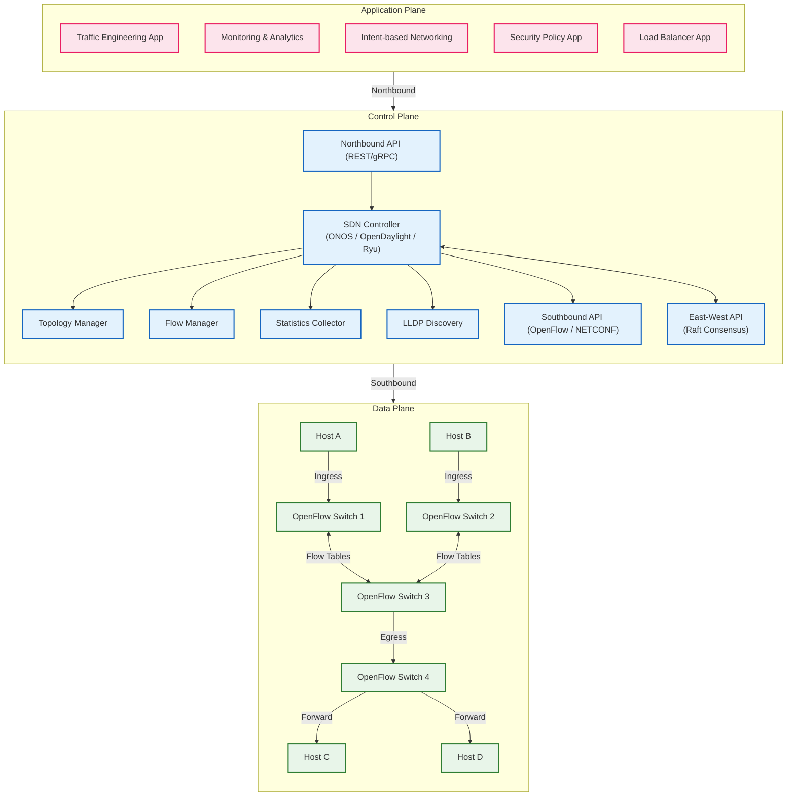

# Chapter 14: Software-Defined Networking

## Learning Objectives

1. Explain the separation of control plane and data plane in SDN.
2. Describe the OpenFlow protocol and its role in switch-controller communication.
3. Analyze the architecture of SDN controllers and their northbound/southbound interfaces.
4. Compare network functions virtualization (NFV) with traditional network appliances.
5. Evaluate overlay networks including VXLAN and their role in network virtualization.
6. Implement SDN switch simulator logic in C++ and Python.
7. Analyze complexity trade-offs in SDN controller placement and flow table design.

<!-- Image Gallery -->
<section class="lesson-visuals" aria-label="Visual learning resources">
  <header><span>VISUAL LEARNING</span><h2>See it. Review it. Remember it.</h2></header>
  <a class="lesson-visual-card" href="../../assets/images/lessons/computer-networks/14-sdn/handwritten-notes.png" target="_blank" rel="noopener">
    
    <span><strong>Handwritten notes</strong>Condensed notes for deliberate review.</span>
  </a>
  <a class="lesson-visual-card" href="../../assets/images/lessons/computer-networks/14-sdn/sticky-notes.png" target="_blank" rel="noopener">
    
    <span><strong>Sticky-note revision</strong>Fast recall prompts for revision.</span>
  </a>
  <a class="lesson-visual-card" href="../../assets/images/lessons/computer-networks/14-sdn/visual-explanation.png" target="_blank" rel="noopener">
    
    <span><strong>Visual concept guide</strong>A connected explanation of the key ideas.</span>
  </a>
</section>
<!-- End Image Gallery -->


## 14.1 The SDN Paradigm


Traditional network devices integrate the control plane (routing, signaling) and data plane (packet forwarding) on the same hardware. The control plane runs distributed protocols (OSPF, BGP) that converge based on local information. This distributed architecture is robust but difficult to manage, slow to innovate, and tightly coupled to vendor hardware.

Software-Defined Networking (SDN) separates the control plane from the data plane:

- **Data plane**: simple forwarding devices (switches, routers) that perform packet matching and action based on flow tables.
- **Control plane**: a logically centralized controller that computes forwarding rules and installs them on data-plane devices.

The controller provides a global view of the network topology, enabling network-wide optimization, simplified management, and rapid protocol innovation.

### Real-World Analogy: Air Traffic Control


The SDN control plane is analogous to air traffic control (ATC). The data plane (airports/runways) just lands and launches planes; the control plane (ATC towers) decides which runway each plane uses, the order of landing, and rerouting during storms.

| SDN Component | Air Traffic Analogy |
|---------------|---------------------|
| SDN Controller | ATC Tower (centralized decision-making) |
| OpenFlow Switch | Airport Runway (follows instructions) |
| Flow Table Entry | Flight Plan for a specific aircraft |
| PACKET_IN message | Pilot asking "Which runway do I use?" |
| FLOW_MOD message | ATC replying "Use runway 27L" |
| Flow Table | Schedule board of active flight plans |
| Packet Buffer | Holding pattern while waiting for instructions |

### Numbered Steps: How SDN Handles a New Flow


1. A packet arrives at an OpenFlow switch ingress port.
2. The switch extracts header fields (src/dst IP, port, protocol) to form a match key.
3. The switch looks up the flow table in priority order.
4. If a matching entry exists, execute the associated action (OUTPUT, DROP, SET-FIELD) and update counters.
5. If no match is found, the switch buffers the packet and sends a PACKET_IN message to the controller.
6. The controller receives PACKET_IN and computes the forwarding decision using its global topology view.
7. The controller sends a FLOW_MOD message instructing the switch to add a new flow entry.
8. The switch installs the flow entry with match fields, action, and timeouts.
9. The switch sends the buffered (or subsequent) packet according to the new rule.
10. Subsequent packets in the same flow match the installed entry and are processed at line rate.

### Dry Run: OpenFlow Flow Table Match


**Flow Table (pre-populated):**

| Priority | Match (IP dst) | Action | Counters |
|----------|----------------|--------|----------|
| 10 | 10.0.0.0/24 | OUTPUT port 2 | pkts=150, bytes=19200 |
| 5 | 0.0.0.0/0 | CONTROLLER | pkts=12, bytes=840 |

**Incoming Packet:** src=10.0.0.5, dst=10.0.0.20, port=80 (TCP SYN)

**Trace:**

| Step | Component | Action | Result |
|------|-----------|--------|--------|
| 1 | Switch | Extract 5-tuple | src=10.0.0.5, dst=10.0.0.20, proto=TCP, dport=80 |
| 2 | Flow Table | Match priority 10 | dst=10.0.0.20 matches 10.0.0.0/24 |
| 3 | Switch | Execute action | OUTPUT to port 2 |
| 4 | Counters | Update | pkts=151, bytes=19200+64=19264 |

**Incoming Packet:** src=10.0.1.1, dst=172.16.0.1, port=443 (TCP SYN)

| Step | Component | Action | Result |
|------|-----------|--------|--------|
| 1 | Switch | Extract 5-tuple | src=10.0.1.1, dst=172.16.0.1, proto=TCP, dport=443 |
| 2 | Flow Table | Match priority 10 | FAIL: 172.16.0.1 not in 10.0.0.0/24 |
| 3 | Flow Table | Match priority 5 | Catch-all matches 0.0.0.0/0 |
| 4 | Switch | Execute action | Buffer packet, send PACKET_IN to controller |
| 5 | Controller | Compute path | dst=172.16.0.1 is reachable via port 3 |
| 6 | Controller | Send FLOW_MOD | Add entry: match=172.16.0.1/32, priority=15, action=OUTPUT port 3 |
| 7 | Switch | Install entry | New flow entry at priority 15 |
| 8 | Switch | Forward buffered packet | Send to port 3 |

### Traditional vs SDN Comparison


| Aspect | Traditional Networking | SDN |
|--------|----------------------|-----|
| Control Plane | Distributed on each device | Centralized controller |
| Forwarding Decision | Per-device (OSPF, BGP) | Controller computes global paths |
| Hardware | Proprietary ASICs | Commodity switches |
| Protocol Innovation | Years (vendor-driven) | Months (software update) |
| Network View | Local (routing tables) | Global topology |
| Policy Enforcement | Per-device CLI | Programmatic, network-wide |
| Failure Recovery | Distributed convergence (seconds) | Controller reroute (milliseconds) |
| Scalability | Horizontal (add devices) | Controller clustering needed |
| Cost per 10G port | High (vendor lock-in) | Low (white-box switches) |
| Management | CLI/SNMP per device | REST/gRPC unified API |
| Security | Perimeter-based, static | Dynamic, tenant-aware |
| Multi-tenancy | VLANs limited to 4094 | VXLAN 16M segments |
| Traffic Engineering | Manual, static | Dynamic, automated |
| Vendor Lock-in | High | Low (OpenFlow standard) |

### Control Plane vs Data Plane Separation


| Dimension | Control Plane | Data Plane |
|-----------|--------------|------------|
| Function | Routing, signaling, policy | Packet forwarding, filtering |
| Location | Controller (centralized) | Switch hardware (distributed) |
| Processing | Complex (path computation, QoS) | Simple (match-action) |
| State | Global network topology | Flow table entries only |
| Update Rate | Slow (topology changes, policy) | Fast (per-packet line rate) |
| Failure Impact | Loss of visibility, no new flows | Existing flows continue |
| Implementation | Software (Java, Python, C++) | Hardware ASIC, TCAM |
| Memory | Large (full topology DB) | Limited (TCAM, SRAM) |
| Protocol | OpenFlow, NETCONF, gRPC | Raw packet processing |
| Consistency | Strong (Raft consensus) | Eventual (flow table sync) |

### Pseudocode: SDN Controller Flow Processing


```text
CONTROLLER_FLOW_PROCESSING(packet_in_msg, topology_db, policy_db):
    INPUT:  packet_in_msg from switch S
            topology_db = graph of switches and links
            policy_db = set of access control and QoS rules
    OUTPUT: flow_mod message or drop decision

    # Step 1: Parse the unmatched packet
    headers = PARSE_PACKET(packet_in_msg.buffer)
    src_ip  = headers.src_ip
    dst_ip  = headers.dst_ip
    src_port = headers.tcp_src
    dst_port = headers.tcp_dst
    protocol = headers.ip_proto

    # Step 2: Apply access control policies
    FOR each rule IN policy_db.acl:
        IF MATCHES(headers, rule.match_fields):
            IF rule.action == "DROP":
                RETURN flow_mod(
                    match=headers,
                    action="DROP",
                    priority=rule.priority,
                    hard_timeout=rule.timeout
                )

    # Step 3: Compute shortest path
    src_switch = FIND_SWITCH(topology_db, src_ip)
    dst_switch = FIND_SWITCH(topology_db, dst_ip)

    path = SHORTEST_PATH(topology_db.graph, src_switch, dst_switch)

    IF path IS EMPTY:
        RETURN flow_mod(match=headers, action="DROP", priority=100)

    # Step 4: Determine output port on the ingress switch
    next_hop = path[1]  # first hop after ingress switch
    out_port = GET_PORT_FOR_NEIGHBOR(src_switch, next_hop)

    # Step 5: Apply QoS marking
    qos_queue = policy_db.qos.get(dst_port, default=0)

    # Step 6: Install flow entry
    RETURN flow_mod(
        match=headers,
        action=OUTPUT(port=out_port, queue=qos_queue),
        priority=100,
        idle_timeout=60,
        hard_timeout=300,
        cookie=GENERATE_COOKIE()
    )
```

### C++ Implementation: OpenFlow Switch Simulator


```cpp
#include <iostream>
#include <vector>
#include <unordered_map>
#include <tuple>
#include <chrono>
#include <cstdint>
#include <algorithm>
#include <sstream>
#include <queue>

// Simplified packet header representation
struct PacketHeader {
    uint32_t src_ip;
    uint32_t dst_ip;
    uint8_t  protocol;
    uint16_t src_port;
    uint16_t dst_port;
    uint16_t eth_type;
    uint8_t  tos;

    std::string to_string() const {
        std::stringstream ss;
        ss << (src_ip>>24)&0xFF << "." << (src_ip>>16)&0xFF << "."
           << (src_ip>>8)&0xFF << "." << (src_ip)&0xFF;
        ss << " -> ";
        ss << (dst_ip>>24)&0xFF << "." << (dst_ip>>16)&0xFF << "."
           << (dst_ip>>8)&0xFF << "." << (dst_ip)&0xFF;
        ss << " proto=" << (int)protocol << " port=" << dst_port;
        return ss.str();
    }
};

// Flow entry match structure
struct FlowMatch {
    uint32_t dst_ip;
    uint32_t dst_mask;
    uint16_t dst_port;
    uint8_t  protocol;
    uint8_t  priority;

    bool matches(const PacketHeader& pkt) const {
        bool ip_match = (pkt.dst_ip & dst_mask) == (dst_ip & dst_mask);
        bool port_match = (dst_port == 0) || (pkt.dst_port == dst_port);
        bool proto_match = (protocol == 0) || (pkt.protocol == protocol);
        return ip_match && port_match && proto_match;
    }
};

// Action types
enum class ActionType { OUTPUT, DROP, CONTROLLER, SET_FIELD };

struct FlowAction {
    ActionType type;
    uint16_t   output_port;
    uint32_t   set_field_val;
};

// Full flow entry
struct FlowEntry {
    FlowMatch   match;
    FlowAction  action;
    uint64_t    packet_count;
    uint64_t    byte_count;
    uint32_t    idle_timeout;
    uint32_t    hard_timeout;
    uint64_t    cookie;
    std::chrono::steady_clock::time_point installed_at;
    std::chrono::steady_clock::time_point last_matched;

    bool is_expired() const {
        auto now = std::chrono::steady_clock::now();
        auto elapsed_hard = std::chrono::duration_cast<std::chrono::seconds>(
            now - installed_at).count();
        if (hard_timeout > 0 && elapsed_hard >= hard_timeout) return true;
        auto elapsed_idle = std::chrono::duration_cast<std::chrono::seconds>(
            now - last_matched).count();
        if (idle_timeout > 0 && elapsed_idle >= idle_timeout) return true;
        return false;
    }
};

// OpenFlow message types
enum class OFMessageType {
    PACKET_IN, FLOW_MOD, PACKET_OUT, FEATURES_REPLY, ERROR
};

struct OFMessage {
    OFMessageType type;
    uint64_t      cookie;
    uint16_t      buffer_id;
    uint16_t      reason;
    FlowEntry     flow;
    PacketHeader  pkt;
};

// Controller interface
class SDNController {
public:
    virtual OFMessage handle_packet_in(
        const PacketHeader& pkt, uint16_t in_port, uint64_t switch_id) = 0;
    virtual void handle_switch_connect(uint64_t switch_id) = 0;
    virtual void handle_switch_disconnect(uint64_t switch_id) = 0;
    virtual ~SDNController() = default;
};

// Learning-switch controller
class LearningSwitchController : public SDNController {
private:
    std::unordered_map<uint64_t, uint16_t> mac_table;
    uint64_t next_cookie = 1;
    uint16_t flood_port = 0xFFFE;

public:
    OFMessage handle_packet_in(
        const PacketHeader& pkt, uint16_t in_port, uint64_t switch_id) override {
        uint64_t src_mac = (static_cast<uint64_t>(pkt.src_ip) << 16) ^ pkt.src_port;
        mac_table[src_mac] = in_port;
        uint64_t dst_mac = (static_cast<uint64_t>(pkt.dst_ip) << 16) ^ pkt.dst_port;
        auto it = mac_table.find(dst_mac);

        OFMessage flow_mod;
        flow_mod.type = OFMessageType::FLOW_MOD;
        flow_mod.cookie = next_cookie++;
        flow_mod.flow.match.dst_ip = pkt.dst_ip;
        flow_mod.flow.match.dst_mask = 0xFFFFFFFF;
        flow_mod.flow.match.dst_port = pkt.dst_port;
        flow_mod.flow.match.protocol = pkt.protocol;
        flow_mod.flow.match.priority = 100;
        flow_mod.flow.idle_timeout = 60;
        flow_mod.flow.hard_timeout = 300;

        if (it != mac_table.end()) {
            flow_mod.flow.action = {ActionType::OUTPUT, it->second, 0};
        } else {
            flow_mod.flow.action = {ActionType::OUTPUT, flood_port, 0};
        }
        flow_mod.flow.packet_count = 0;
        flow_mod.flow.byte_count = 0;
        flow_mod.flow.installed_at = std::chrono::steady_clock::now();
        flow_mod.flow.last_matched = flow_mod.flow.installed_at;
        return flow_mod;
    }

    void handle_switch_connect(uint64_t switch_id) override {
        std::cout << "[Controller] Switch " << switch_id << " connected.\n";
    }

    void handle_switch_disconnect(uint64_t switch_id) override {
        std::cout << "[Controller] Switch " << switch_id
                  << " disconnected. Flushing MAC table.\n";
        mac_table.clear();
    }
};

// OpenFlow switch simulator
class OpenFlowSwitch {
private:
    uint64_t switch_id;
    std::vector<FlowEntry> flow_table;
    SDNController* controller;
    size_t max_flow_entries;
    bool connected;

public:
    OpenFlowSwitch(uint64_t id, SDNController* ctrl, size_t max_flows = 1024)
        : switch_id(id), controller(ctrl), max_flow_entries(max_flows), connected(false) {}

    bool connect_to_controller() {
        connected = true;
        controller->handle_switch_connect(switch_id);
        return true;
    }

    void disconnect() {
        connected = false;
        controller->handle_switch_disconnect(switch_id);
    }

    bool is_connected() const { return connected; }

    uint16_t process_packet(const PacketHeader& pkt, uint16_t in_port) {
        if (!connected) {
            std::cerr << "[Switch " << switch_id << "] Not connected. Dropping.\n";
            return 0;
        }

        auto it = std::remove_if(flow_table.begin(), flow_table.end(),
            [](const FlowEntry& e) { return e.is_expired(); });
        flow_table.erase(it, flow_table.end());

        std::sort(flow_table.begin(), flow_table.end(),
            [](const FlowEntry& a, const FlowEntry& b) {
                return a.match.priority > b.match.priority;
            });

        for (auto& entry : flow_table) {
            if (entry.match.matches(pkt)) {
                entry.packet_count++;
                entry.byte_count += 64;
                entry.last_matched = std::chrono::steady_clock::now();

                std::cout << "[Switch " << switch_id << "] MATCH: "
                          << pkt.to_string() << " -> ";
                if (entry.action.type == ActionType::OUTPUT) {
                    std::cout << "OUTPUT port " << entry.action.output_port;
                    if (entry.action.output_port != in_port) return entry.action.output_port;
                    return 0;
                } else if (entry.action.type == ActionType::DROP) {
                    std::cout << "DROP";
                    return 0;
                } else if (entry.action.type == ActionType::CONTROLLER) {
                    return 0xFFFF;
                }
                std::cout << "\n";
            }
        }

        std::cout << "[Switch " << switch_id << "] NO MATCH: "
                  << pkt.to_string() << " -> PACKET_IN\n";

        OFMessage reply = controller->handle_packet_in(pkt, in_port, switch_id);
        if (reply.type == OFMessageType::FLOW_MOD) {
            if (flow_table.size() < max_flow_entries) {
                flow_table.push_back(reply.flow);
                std::cout << "[Switch " << switch_id << "] Installed flow: "
                          << pkt.to_string() << "\n";
                if (reply.flow.action.type == ActionType::OUTPUT
                    && reply.flow.action.output_port != in_port)
                    return reply.flow.action.output_port;
            } else {
                std::cerr << "[Switch " << switch_id << "] Flow table full.\n";
                return 0;
            }
        }
        return 0;
    }

    void print_flow_table() const {
        std::cout << "\n=== Flow Table: Switch " << switch_id << " ===\n";
        std::cout << "Pri | Dst IP        | Port | Proto | Action  | Pkts\n";
        std::cout << "----+---------------+---------------+-------+--------+------\n";
        for (const auto& e : flow_table) {
            std::cout << (int)e.match.priority << "   | "
                      << ((e.match.dst_ip >> 24) & 0xFF) << "."
                      << ((e.match.dst_ip >> 16) & 0xFF) << "."
                      << ((e.match.dst_ip >> 8) & 0xFF) << "."
                      << (e.match.dst_ip & 0xFF) << "/"
                      << __builtin_popcount(e.match.dst_mask) << " | "
                      << e.match.dst_port << "      | "
                      << (int)e.match.protocol << "     | ";
            if (e.action.type == ActionType::OUTPUT) std::cout << "OUTPUT:" << e.action.output_port;
            else if (e.action.type == ActionType::DROP) std::cout << "DROP";
            else std::cout << "CTRL";
            std::cout << " | " << e.packet_count << "\n";
        }
        std::cout << "===============================\n\n";
    }
};

int main() {
    LearningSwitchController ctrl;
    OpenFlowSwitch sw(1, &ctrl, 5);
    sw.connect_to_controller();

    auto make_pkt = [](uint32_t s, uint32_t d, uint8_t proto,
                        uint16_t sp, uint16_t dp) {
        return PacketHeader{s, d, proto, sp, dp, 0x0800, 0};
    };

    auto pkt1 = make_pkt(0x0A000001, 0x0A000002, 6, 12345, 80);
    auto pkt2 = make_pkt(0x0A000001, 0x0A000002, 6, 12346, 80);
    auto pkt3 = make_pkt(0x0A000003, 0x0A00000A, 6, 54321, 443);
    auto pkt4 = make_pkt(0x0A000004, 0x0A00000A, 6, 11111, 443);

    sw.process_packet(pkt1, 1);
    sw.process_packet(pkt2, 1);
    sw.process_packet(pkt3, 2);
    sw.process_packet(pkt4, 2);
    sw.print_flow_table();

    sw.disconnect();
    auto pkt5 = make_pkt(0x0A000005, 0x0A000002, 6, 22222, 80);
    sw.process_packet(pkt5, 3);
    return 0;
}
```

### Python Implementation: OpenFlow Message Parser and Switch


```python
import struct
import time
from dataclasses import dataclass, field
from typing import Optional, List, Dict, Tuple
from enum import IntEnum


class OFMessageType(IntEnum):
    HELLO = 0
    ERROR = 1
    ECHO_REQUEST = 2
    ECHO_REPLY = 3
    FEATURES_REQUEST = 5
    FEATURES_REPLY = 6
    PACKET_IN = 10
    FLOW_MOD = 14
    PACKET_OUT = 13
    FLOW_REMOVED = 11


class ActionType(IntEnum):
    OUTPUT = 0
    SET_FIELD = 1
    GROUP = 2
    DROP = 3


@dataclass
class FlowMatch:
    dst_ip: int = 0
    dst_mask: int = 0xFFFFFFFF
    dst_port: int = 0
    protocol: int = 0
    priority: int = 0
    ingress_port: int = 0

    def matches(self, pkt: 'Packet') -> bool:
        ip_ok = (pkt.dst_ip & self.dst_mask) == (self.dst_ip & self.dst_mask)
        port_ok = (self.dst_port == 0) or (pkt.dst_port == self.dst_port)
        proto_ok = (self.protocol == 0) or (pkt.protocol == self.protocol)
        return ip_ok and port_ok and proto_ok


@dataclass
class FlowAction:
    action_type: ActionType = ActionType.DROP
    output_port: int = 0
    set_field_value: int = 0


@dataclass
class FlowEntry:
    match: FlowMatch = field(default_factory=FlowMatch)
    action: FlowAction = field(default_factory=FlowAction)
    packet_count: int = 0
    byte_count: int = 0
    idle_timeout: int = 60
    hard_timeout: int = 300
    cookie: int = 0
    installed_at: float = 0.0
    last_matched: float = 0.0

    def is_expired(self) -> bool:
        now = time.time()
        if self.hard_timeout > 0 and (now - self.installed_at) >= self.hard_timeout:
            return True
        if self.idle_timeout > 0 and (now - self.last_matched) >= self.idle_timeout:
            return True
        return False


@dataclass
class Packet:
    src_ip: int
    dst_ip: int
    protocol: int
    src_port: int
    dst_port: int
    eth_type: int = 0x0800
    payload: bytes = b''
    ingress_port: int = 0

    @staticmethod
    def from_bytes(data: bytes) -> 'Packet':
        if len(data) < 14:
            raise ValueError("Packet too short")
        eth_type = struct.unpack('!H', data[12:14])[0]
        if eth_type == 0x0800 and len(data) >= 34:
            ip_header = data[14:34]
            ihl = (ip_header[0] & 0x0F) * 4
            protocol = ip_header[9]
            src_ip = struct.unpack('!I', ip_header[12:16])[0]
            dst_ip = struct.unpack('!I', ip_header[16:20])[0]
            src_port = 0
            dst_port = 0
            if protocol in (6, 17) and len(data) >= 14 + ihl + 4:
                sport, dport = struct.unpack('!HH', data[14+ihl:14+ihl+4])
                src_port, dst_port = sport, dport
            return Packet(src_ip, dst_ip, protocol, src_port, dst_port,
                          eth_type, data, 0)
        raise ValueError(f"Unsupported ethertype: {hex(eth_type)}")

    def ip_to_str(self, ip: int) -> str:
        return f"{(ip>>24)&0xFF}.{(ip>>16)&0xFF}.{(ip>>8)&0xFF}.{ip&0xFF}"

    def __str__(self) -> str:
        return f"{self.ip_to_str(self.src_ip)}:{self.src_port} -> {self.ip_to_str(self.dst_ip)}:{self.dst_port}"


@dataclass
class OFMessage:
    msg_type: OFMessageType
    version: int = 4
    xid: int = 0
    body: bytes = b''
    flow: Optional[FlowEntry] = None
    packet: Optional[Packet] = None
    buffer_id: int = 0


class OFMessageParser:
    OF_HEADER_FMT = '!BBHI'
    OF_HEADER_SIZE = 8

    @staticmethod
    def parse_header(data: bytes) -> Tuple[int, OFMessageType, int, int]:
        if len(data) < OFMessageParser.OF_HEADER_SIZE:
            raise ValueError("Header too short")
        version, msg_type, length, xid = struct.unpack(
            OFMessageParser.OF_HEADER_FMT, data[:8])
        return version, OFMessageType(msg_type), length, xid

    @staticmethod
    def serialize(msg: OFMessage) -> bytes:
        body = msg.body
        length = OFMessageParser.OF_HEADER_SIZE + len(body)
        header = struct.pack(
            OFMessageParser.OF_HEADER_FMT,
            msg.version, msg.msg_type.value, length, msg.xid
        )
        return header + body

    @staticmethod
    def serialize_flow_mod(flow: FlowEntry) -> OFMessage:
        body = struct.pack('!Q', flow.cookie)
        return OFMessage(
            msg_type=OFMessageType.FLOW_MOD, version=4,
            xid=hash(flow) & 0xFFFFFFFF, body=body, flow=flow
        )

    @staticmethod
    def serialize_packet_out(pkt: Packet, out_port: int) -> OFMessage:
        body = struct.pack('!HH', out_port, len(pkt.payload)) + pkt.payload
        return OFMessage(
            msg_type=OFMessageType.PACKET_OUT, version=4,
            xid=0, body=body, packet=pkt
        )


class SDNController:
    def handle_packet_in(self, pkt: Packet, in_port: int, sw_id: int) -> OFMessage:
        raise NotImplementedError

    def switch_connected(self, sw_id: int):
        print(f"[Controller] Switch {sw_id} connected.")

    def switch_disconnected(self, sw_id: int):
        print(f"[Controller] Switch {sw_id} disconnected.")


class LearningSwitchController(SDNController):
    def __init__(self):
        self.mac_table: Dict[int, int] = {}
        self.next_cookie = 1

    def handle_packet_in(self, pkt: Packet, in_port: int, sw_id: int) -> OFMessage:
        src_key = hash((pkt.src_ip, pkt.src_port))
        self.mac_table[src_key] = in_port
        dst_key = hash((pkt.dst_ip, pkt.dst_port))
        out_port = self.mac_table.get(dst_key, 0xFFFE)

        flow = FlowEntry(
            match=FlowMatch(
                dst_ip=pkt.dst_ip, dst_mask=0xFFFFFFFF,
                dst_port=pkt.dst_port, protocol=pkt.protocol, priority=100
            ),
            action=FlowAction(action_type=ActionType.OUTPUT, output_port=out_port),
            cookie=self.next_cookie,
            installed_at=time.time(), last_matched=time.time()
        )
        self.next_cookie += 1
        return OFMessageParser.serialize_flow_mod(flow)


class OpenFlowSwitch:
    def __init__(self, sw_id: int, controller: SDNController, max_entries: int = 1024):
        self.sw_id = sw_id
        self.controller = controller
        self.flow_table: List[FlowEntry] = []
        self.max_entries = max_entries
        self.connected = False
        self.buffers: Dict[int, Packet] = {}
        self.next_buffer_id = 1

    def connect(self) -> bool:
        self.connected = True
        self.controller.switch_connected(self.sw_id)
        return True

    def disconnect(self):
        self.connected = False
        self.controller.switch_disconnected(self.sw_id)

    def _evict_expired(self):
        before = len(self.flow_table)
        self.flow_table = [e for e in self.flow_table if not e.is_expired()]
        evicted = before - len(self.flow_table)
        if evicted > 0:
            print(f"[Switch {self.sw_id}] Evicted {evicted} expired entries.")

    def process_packet(self, pkt: Packet) -> Optional[int]:
        if not self.connected:
            print(f"[Switch {self.sw_id}] NOT CONNECTED. Dropping.")
            return None

        self._evict_expired()
        self.flow_table.sort(key=lambda e: e.match.priority, reverse=True)

        for entry in self.flow_table:
            if entry.match.matches(pkt):
                entry.packet_count += 1
                entry.byte_count += len(pkt.payload) if pkt.payload else 64
                entry.last_matched = time.time()
                print(f"[Switch {self.sw_id}] MATCH: {pkt} -> ", end="")
                if entry.action.action_type == ActionType.OUTPUT:
                    print(f"OUTPUT port {entry.action.output_port}")
                    if entry.action.output_port != pkt.ingress_port:
                        return entry.action.output_port
                    return None
                elif entry.action.action_type == ActionType.DROP:
                    print("DROP")
                    return None
                return None

        print(f"[Switch {self.sw_id}] NO MATCH: {pkt} -> PACKET_IN")
        buffer_id = self.next_buffer_id
        self.next_buffer_id += 1
        self.buffers[buffer_id] = pkt

        reply_msg = self.controller.handle_packet_in(
            pkt, pkt.ingress_port, self.sw_id
        )

        if (reply_msg.msg_type == OFMessageType.FLOW_MOD
                and reply_msg.flow is not None):
            if len(self.flow_table) < self.max_entries:
                self.flow_table.append(reply_msg.flow)
                print(f"[Switch {self.sw_id}] Installed flow: {pkt}")
                if (reply_msg.flow.action.action_type == ActionType.OUTPUT
                        and reply_msg.flow.action.output_port != pkt.ingress_port):
                    return reply_msg.flow.action.output_port
            else:
                print(f"[Switch {self.sw_id}] FLOW TABLE FULL.")
        return None

    def get_stats(self) -> Dict:
        return {
            'sw_id': self.sw_id, 'connected': self.connected,
            'flow_count': len(self.flow_table), 'max_entries': self.max_entries,
            'entries': [{
                'priority': e.match.priority, 'packets': e.packet_count,
                'timeout': e.idle_timeout, 'action': e.action.action_type.name
            } for e in self.flow_table]
        }


def dry_run():
    ctrl = LearningSwitchController()
    sw = OpenFlowSwitch(1, ctrl, max_entries=5)
    sw.connect()

    def make_pkt(s_ip, d_ip, proto=6, sp=12345, dp=80):
        return Packet(s_ip, d_ip, proto, sp, dp)

    print("\n=== DRY RUN: OpenFlow Switch ===")
    pkts = [
        make_pkt(0x0A000001, 0x0A000002, 6, 12345, 80),
        make_pkt(0x0A000001, 0x0A000002, 6, 12346, 80),
        make_pkt(0x0A000003, 0x0A00000A, 6, 54321, 443),
        make_pkt(0x0A000004, 0x0A00000A, 6, 11111, 443),
    ]
    for i, p in enumerate(pkts, 1):
        p.ingress_port = 1 if i <= 2 else 2
        out = sw.process_packet(p)
        print(f"  -> Output port: {out}")

    print(f"\nFinal flow table: {len(sw.flow_table)} entries")
    import json
    print(json.dumps(sw.get_stats(), indent=2))

    print("\n--- Edge case: switch disconnect ---")
    sw.disconnect()
    pkt5 = make_pkt(0x0A000005, 0x0A000002, 6, 22222, 80)
    sw.process_packet(pkt5)
    print("Packet dropped because switch is disconnected.")


if __name__ == "__main__":
    dry_run()
```

### Complexity Analysis


| Operation | Time Complexity | Space Complexity | Why |
|-----------|----------------|-----------------|-----|
| Flow table lookup (linear) | O(F) | O(F) | Worst-case scans all entries; F = flow count |
| Flow table lookup (TCAM) | O(1) | O(F) | TCAM parallelizes all entries in hardware |
| Flow table insertion | O(1) amortized | O(F) | Append to vector; resize cost amortized |
| Flow entry eviction (expired) | O(F) | O(1) extra | Linear scan to find and remove expired entries |
| PACKET_IN serialization | O(P) | O(P) | Copies packet payload into message (P = packet size) |
| FLOW_MOD deserialization | O(1) | O(1) | Fixed-size header plus variable match fields |
| Shortest path (Dijkstra) | O((V+E) log V) | O(V) | V = switches, E = links; priority queue |
| Flow table priority re-sort | O(F log F) | O(1) extra | QuickSort after inserts or before match |
| MAC learning (hash table) | O(1) average | O(M) | M = MAC entries; hash collisions O(M) worst |
| Controller failover (Raft) | O(N log N) | O(N) | Leader election requires majority of N controllers |

**Why linear flow table lookup is acceptable in software switches (Open vSwitch):** Software switches handle millions of flows but cannot use TCAM. They use microflow caching (exact-match hash table) for the first few packets, then megaflow caching (wildcard patterns) via kernel datapath. The first packet of each flow takes O(F) in userspace, but subsequent packets are O(1) in the kernel cache.

**Why Dijkstra is preferred over Bellman-Ford in SDN:** SDN controllers have a complete topology view. Dijkstra with a Fibonacci heap gives O(V log V + E), optimal for static graphs. Bellman-Ford's O(VE) is needed only for distributed convergence where nodes lack global topology — unnecessary in SDN.

### Advantages and Disadvantages of SDN


| Aspect | Advantages | Disadvantages |
|--------|-----------|---------------|
| Programmability | Network-wide policy push via API; rapid feature deployment | Software bugs affect entire network; controller single point of failure |
| Centralized Visibility | Global topology view; optimal path computation | Scalability bottleneck; state synchronization overhead |
| Hardware Abstraction | White-box switches reduce cost; vendor independence | Performance gap vs proprietary ASICs for some workloads |
| Traffic Engineering | Dynamic load balancing; bandwidth calendaring | Requires accurate traffic matrix estimation |
| Innovation | New protocols deployed as controller apps | Migration complexity from legacy networks |
| Multi-tenancy | Fine-grained isolation; per-tenant flow tables | Flow table resource contention across tenants |
| Security | Centralized policy enforcement; rapid threat response | Controller itself is high-value target; DoS risk |
| Operations | Automated provisioning; reduced OPEX | Requires new skills (programming, not just CLI) |

### Edge Cases


**Edge Case 1: Controller Failure**

When the SDN controller crashes:
- Existing flow entries remain in the switch (hardware continues forwarding).
- New flows that miss the flow table cannot be resolved — PACKET_INs go unanswered.
- The switch may enter "fail-secure" mode (drop unmatched packets) or "fail-standalone" mode (fall back to traditional L2/L3 forwarding).
- OpenFlow 1.3 defines the `OFPC_FAIL_MODE_SECURE` flag.
- Recovery: when the controller reconnects, it must re-install all flow entries.

Mitigations:
- Deploy controller clusters (ONOS uses Raft with 3+ nodes).
- Use fast failover group tables (OpenFlow 1.3+): pre-program backup paths activated without controller involvement.
- Set `OFPFF_NO_PKT_COUNTS` to reduce state that must be re-synced on reconnection.

**Edge Case 2: Switch-Controller Disconnect (TCP timeout)**

When the TCP connection drops:
- The switch sends an OFPT_ERROR message with OFPET_BAD_CONNECTION type.
- The controller detects disconnection via ECHO_REQUEST/ECHO_REPLY (default 5s interval, 3 retries).
- During disconnection with `fail_mode=secure`: continue forwarding using existing flow table; all PACKET_INs dropped.
- During disconnection with `fail_mode=standalone`: the switch reverts to independent L2 learning switch behavior.
- On reconnection, the controller sends a BARRIER_REQUEST to flush pending messages, then performs full state synchronization.

**Edge Case 3: Flow Table Overflow**

When the switch TCAM or SRAM is full:
- The switch sends OFPT_ERROR with OFPET_FLOW_MOD_FAILED and code OFPFMFC_TABLE_FULL.
- The controller must either: evict low-priority entries (controller-driven eviction), aggregate specific flows into wildcard entries (e.g., /24 instead of /32), or use multiple flow tables to split matching across stages.
- Flow table size on real hardware: 1K–4K entries in TCAM; 32K–256K entries in SRAM.

**Edge Case 4: Loop Prevention During Flow Installation**

When a new flow entry creates a forwarding loop:
- Controller must validate paths before installation using DFS loop detection on the topology graph.
- OpenFlow supports TTL-based anti-loop: decrement IP TTL in the pipeline and drop when TTL reaches 0.
- Fast failover groups can be misconfigured to create loops between switches.

**Edge Case 5: Race Conditions in Distributed Controllers**

When two controller instances install conflicting flow entries:
- Distributed databases (ONOS with Atomix/Raft) use optimistic concurrency control: the second write fails if modified since read.
- OpenFlow cookies serve as version numbers — the switch rejects FLOW_MOD with an outdated cookie.
- Use idempotent operations and sequence numbers.

## 14.2 OpenFlow

OpenFlow (ONF specification) is the standard protocol for communication between the SDN controller and the data-plane switches.

### 14.2.1 Flow Table Entry


An OpenFlow flow table entry consists of:

1. **Match fields**: ingress port, Ethernet src/dst, VLAN ID, IP src/dst, IP protocol, TCP/UDP src/dst ports, MPLS labels, etc.
2. **Priority**: matching precedence (higher priority wins).
3. **Counters**: packet count, byte count, duration.
4. **Instructions**: actions to perform on matching packets.
5. **Timeouts**: idle timeout and hard timeout.
6. **Cookie**: opaque data for the controller.

### 14.2.2 OpenFlow Pipeline


The OpenFlow 1.3+ pipeline processes packets through multiple sequential tables:

```text
    +------------+     +------------+     +------------+     +-----------+
    | Table 0    | --> | Table 1    | --> | Table 2    | --> | ... Table N|
    | (Ingress)  |     | (ACL)      |     | (Routing)  |     | (Egress)  |
    +------------+     +------------+     +------------+     +-----------+
         |                   |                  |                  |
         v                   v                  v                  v
    +------------+     +------------+     +------------+     +-----------+
    | Group Table|     | Meter Table|     |  Output    |     |  Output   |
    +------------+     +------------+     +-----------+     +-----------+
```

**Flow Table:** Each table contains flow entries. A packet starts at table 0 and processes sequentially. The `goto-table` instruction redirects to the next table. Tables support:
- **Exact match**: all bits must match.
- **Wildcard match**: some bits are wildcarded.
- **Ternary match**: arbitrary bitmask (TCAM hardware).

**Group Table:** Enables more complex actions:
- **ALL**: execute all buckets (multicast/broadcast).
- **SELECT**: execute one bucket based on hash (load balancing).
- **INDIRECT**: execute one bucket (chaining).
- **FAST FAILOVER**: execute first live bucket (automatic protection switching).

**Meter Table:** Measures and controls rate:
- **Rate-limit**: drop packets exceeding a configured bandwidth.
- **DSCP marking**: re-mark QoS class for packets above a threshold.
- **Statistics**: per-meter byte and packet counts for traffic accounting.

### 14.2.3 Actions


Actions specify how the switch processes matching packets:

- **Output**: forward to a specific port or all ports.
- **Drop**: discard the packet.
- **Set-field**: modify header fields (e.g., rewrite destination MAC).
- **Push/pop VLAN tag**: add or remove VLAN tags.
- **Push/pop MPLS label**: add or remove MPLS labels.
- **Group**: redirect to a group table for multicast or load balancing.
- **Send to controller**: encapsulate the packet and forward to the controller.

### 14.2.4 OpenFlow Messages


| Type | Message | Direction | Purpose |
|------|---------|-----------|---------|
| Symmetric | HELLO | Bidirectional | Capability exchange |
| Symmetric | ECHO | Bidirectional | Liveness check |
| Controller-to-Switch | FEATURES_REQUEST | C->S | Query switch capabilities |
| Controller-to-Switch | PACKET_OUT | C->S | Send packet through switch |
| Controller-to-Switch | FLOW_MOD | C->S | Add/modify/delete flow entry |
| Controller-to-Switch | BARRIER_REQUEST | C->S | Ensure message ordering |
| Controller-to-Switch | ROLE_REQUEST | C->S | Set controller role (master/slave) |
| Switch-to-Controller | PACKET_IN | S->C | Forward unmatched packet |
| Switch-to-Controller | FLOW_REMOVED | S->C | Notify flow entry removal |
| Switch-to-Controller | PORT_STATUS | S->C | Notify port state change |
| Asynchronous | ERROR | Bidirectional | Error notification |

### Dry Run: OpenFlow PACKET_IN / FLOW_MOD Cycle


**Initial State:** Switch has an empty flow table. Controller has topology knowledge.

**Event:** Packet arrives at switch port 1 (10.0.0.1 -> 10.0.0.2:80 TCP SYN)

| Step | Sender | Message | Details |
|------|--------|---------|---------|
| 1 | Switch | Table miss | Priority 0 table-miss entry triggers PACKET_IN |
| 2 | Switch -> Controller | PACKET_IN | buffer_id=0x001, reason=OFPR_NO_MATCH, in_port=1, data=[first 128 bytes] |
| 3 | Controller | L2 lookup | Checks MAC table for 10.0.0.2 -> not found |
| 4 | Controller -> Switch | PACKET_OUT | out_port=OFPP_FLOOD, buffer_id=0x001 |
| 5 | Controller | Compute path | dst=10.0.0.2 via port 3 |
| 6 | Controller -> Switch | FLOW_MOD | cookie=0x100, cmd=OFPFC_ADD, match=dst_ip=10.0.0.2/32, tcp_dst=80, priority=100, instructions=[OUTPUT port 3], idle_timeout=60 |
| 7 | Switch | Install entry | Flow table now has 1 entry |
| 8 | Packet 2 (same flow) | Flow match | Switch matches at priority 100 -> OUTPUT port 3 |

### Pseudocode: OpenFlow Message Handler


```text
ON_RECEIVE_MESSAGE(switch, message, controller_state):
    SWITCH(message_type == OFPT_HELLO):
        SWITCH.send(OFPT_HELLO, version=support.highest)
        SWITCH.send(OFPT_FEATURES_REQUEST)
        WAIT_FOR(OFPT_FEATURES_REPLY)
        RETURN "Switch connected: " + switch.id

    SWITCH(message_type == OFPT_PACKET_IN):
        pkt = PARSE_PACKET(message.data)
        in_port = message.in_port

        IF ACL_DROP(pkt):
            flow_mod = CREATE_FLOW_MOD(
                match=pkt.headers, action=DROP,
                priority=65535, hard_timeout=0)
        ELSE:
            path = COMPUTE_PATH(controller_state.topology,
                                switch.id, pkt.dst_ip)
            out_port = GET_OUTPUT_PORT(switch.id, path)
            flow_mod = CREATE_FLOW_MOD(
                match=pkt.headers, action=OUTPUT(out_port),
                priority=100, idle_timeout=60)

        SWITCH.send(flow_mod)
        SWITCH.send(OFPT_PACKET_OUT,
                    buffer_id=message.buffer_id, out_port=out_port)
        RETURN "Flow installed for " + pkt.src_ip + " -> " + pkt.dst_ip

    SWITCH(message_type == OFPT_FLOW_REMOVED):
        cookie = message.cookie
        reason = message.reason
        controller_state.pending_flows.delete(cookie)
        RETURN "Flow " + cookie + " removed, reason=" + reason

    SWITCH(message_type == OFPT_PORT_STATUS):
        port_no = message.desc.port_no
        state = message.desc.state
        controller_state.topology.UPDATE_LINK(switch.id, port_no, state)
        RECOMPUTE_AFFECTED_PATHS(controller_state.topology, switch.id)
        RETURN "Port " + port_no + " on switch " + switch.id + " state=" + state

    SWITCH(message_type == OFPT_ERROR):
        error_type = message.type
        error_code = message.code
        LOG_ERROR("OpenFlow error: type=" + error_type + " code=" + error_code)
        IF error_type == OFPET_FLOW_MOD_FAILED:
            HANDLE_FLOW_MOD_FAILURE(switch, message)
        RETURN "Error handled"
```

## TypeScript Implementation: OpenFlowSwitch — Flow Table & Pipeline

```typescript
interface FlowMatch {
  inPort?: number;
  ethSrc?: string;
  ethDst?: string;
  vlanId?: number;
  ipSrc?: string;
  ipDst?: string;
  ipProto?: number;
  tcpSrc?: number;
  tcpDst?: number;
}

type FlowAction =
  | { type: 'OUTPUT'; port: number }
  | { type: 'DROP' }
  | { type: 'SET_FIELD'; field: string; value: string | number }
  | { type: 'GROUP'; groupId: number }
  | { type: 'METER'; meterId: number }
  | { type: 'PUSH_VLAN' }
  | { type: 'POP_VLAN' };

interface FlowEntry {
  priority: number;
  match: FlowMatch;
  instructions: FlowAction[];
  packetCount: number;
  byteCount: number;
  duration: number;
  idleTimeout: number;
  hardTimeout: number;
  cookie: number;
  installedAt: number;
}

class OpenFlowSwitch {
  private flows: FlowEntry[] = [];
  private nextCookie = 1;

  addFlow(entry: Omit<FlowEntry, 'packetCount' | 'byteCount' | 'duration' | 'installedAt' | 'cookie'>): number {
    const cookie = this.nextCookie++;
    this.flows.push({
      ...entry,
      packetCount: 0,
      byteCount: 0,
      duration: 0,
      installedAt: Date.now(),
      cookie,
    });
    this.flows.sort((a, b) => b.priority - a.priority);
    console.log(`Flow installed: cookie=${cookie} priority=${entry.priority} match=${JSON.stringify(entry.match)}`);
    return cookie;
  }

  packetIn(packet: { data: string; inPort: number; length: number }): FlowAction[] {
    const now = Date.now();
    this.flows = this.flows.filter(f => {
      if (f.hardTimeout > 0 && now - f.installedAt > f.hardTimeout * 1000) {
        console.log(`Flow ${f.cookie} expired (hard timeout ${f.hardTimeout}s)`);
        return false;
      }
      if (f.idleTimeout > 0) return true;
      return true;
    });

    for (const flow of this.flows) {
      if (this.matchPacket(packet, flow.match)) {
        flow.packetCount++;
        flow.byteCount += packet.length;
        flow.duration = (now - flow.installedAt) / 1000;
        console.log(`Flow ${flow.cookie} matched: actions=${JSON.stringify(flow.instructions)}`);
        return flow.instructions;
      }
    }
    console.log('Table-miss — sending PACKET_IN to controller');
    return [{ type: 'OUTPUT', port: 1 }];
  }

  private matchPacket(packet: { data: string; inPort: number }, match: FlowMatch): boolean {
    if (match.inPort !== undefined && packet.inPort !== match.inPort) return false;
    return true;
  }

  getStats(): { totalFlows: number; packets: number; bytes: number } {
    return {
      totalFlows: this.flows.length,
      packets: this.flows.reduce((s, f) => s + f.packetCount, 0),
      bytes: this.flows.reduce((s, f) => s + f.byteCount, 0),
    };
  }

  removeFlow(cookie: number): boolean {
    const idx = this.flows.findIndex(f => f.cookie === cookie);
    if (idx === -1) return false;
    this.flows.splice(idx, 1);
    console.log(`Flow ${cookie} removed`);
    return true;
  }
}

const sw = new OpenFlowSwitch();
sw.addFlow({ priority: 100, match: {}, instructions: [{ type: 'OUTPUT', port: 2 }], idleTimeout: 60, hardTimeout: 0 });
sw.addFlow({ priority: 200, match: { inPort: 3 }, instructions: [{ type: 'DROP' }], idleTimeout: 0, hardTimeout: 120 });
sw.packetIn({ data: 'HTTP request', inPort: 1, length: 1500 });
sw.packetIn({ data: 'Malicious payload', inPort: 3, length: 64 });
console.log(sw.getStats());
sw.removeFlow(1);
console.log(sw.getStats());
```

## 14.3 SDN Controllers

An SDN controller is a software platform that provides:

- **Northbound API**: REST, gRPC, or custom APIs for applications.
- **Southbound API**: OpenFlow, NETCONF, or gRPC for device communication.
- **East-West interface**: inter-controller communication for distributed controller clusters.

### 14.3.1 Controller Architectures


**Centralized.** A single controller manages all switches. Simple but a single point of failure and potential scalability bottleneck.

**Distributed.** Multiple controller instances coordinate to manage the network. ONOS and OpenDaylight use a distributed data store (Raft consensus) to maintain a consistent network view. Consistency vs. availability trade-offs follow the CAP theorem.

**Hybrid.** Some switches are SDN-controlled while others run traditional protocols. Hybrid approaches support gradual SDN migration.

### 14.3.2 SDN Controller Comparison


| Aspect | ONOS | OpenDaylight | Ryu | POX |
|--------|------|-------------|-----|-----|
| Language | Java | Java | Python | Python |
| Architecture | Distributed (Atomix/Raft) | Modular (MD-SAL) | Event-driven | Single-threaded |
| Clustering | Native (3+ nodes) | Raft-based | No | No |
| OpenFlow Version | 1.0, 1.3, 1.4, 1.5 | 1.0, 1.3, 1.4, 1.5 | 1.0-1.5 | 1.0 only |
| Other Southbound | P4, NETCONF, gRPC | NETCONF, SNMP, BGP | OF-Config | None |
| Northbound API | REST, gRPC, CLI | RESTCONF, REST | REST (custom) | Python API |
| Intent Framework | Yes (intent-based) | No (model-driven) | No | No |
| Performance | 1M+ flows/second | 800K+ flows/second | 100K+ flows/second | 10K+ flows/second |
| Use Case | Carrier-grade, ISP | Production enterprise | Research, education | Academic |
| Maturity | Production (since 2015) | Production (since 2013) | Stable | Deprecated |

### 14.3.3 Controller State Machine


```text
                +---------+
                |  START  |
                +---------+
                     |
                     v
            +------------------+
            |  SWITCH_DISCOVER |
            +------------------+
                     |
                     v
            +------------------+
            |  NEGOTIATING     |
            +------------------+
                     |
            (success)|   (failure)
                     v         v
            +--------------+  +-----------+
            |  ACTIVE      |  | ERROR     |
            +--------------+  +-----------+
              |        |           |
              |        v           v
              |  +-----------+  +---------+
              |  | RECONNECT |  |  DEAD   |
              |  +-----------+  +---------+
              v        |
        +----------+   |
        | SHUTDOWN |<--+
        +----------+
```

**Controller states:**
- **START**: Initial boot, no switches connected.
- **SWITCH_DISCOVER**: TCP connection established, HELLO messages exchanged.
- **NEGOTIATING**: OpenFlow version negotiation and feature discovery.
- **ACTIVE**: Normal operation — processing PACKET_IN, installing flow_mods.
- **RECONNECT**: TCP connection lost; switch enters failover mode.
- **ERROR**: Protocol error; controller may attempt recovery.
- **DEAD**: Controller process terminated.
- **SHUTDOWN**: Graceful shutdown; barrier request to flush pending operations.

## TypeScript Implementation: SDNController — Topology Discovery, Flow Programming & Event Handling

```typescript
interface Link {
  srcSwitch: string;
  srcPort: number;
  dstSwitch: string;
  dstPort: number;
  latencyMs: number;
}

interface SwitchInfo {
  id: string;
  ports: number[];
  connected: boolean;
}

interface FlowRule {
  id: string;
  priority: number;
  match: Record<string, string | number>;
  actions: string[];
  installedOn: string[];
}

class SDNController {
  private switches: Map<string, SwitchInfo> = new Map();
  private links: Link[] = [];
  private flows: Map<string, FlowRule> = new Map();
  private lldpIntervalMs = 5000;
  private eventLog: string[] = [];

  connectSwitch(id: string, ports: number[]): void {
    this.switches.set(id, { id, ports, connected: true });
    console.log(`Switch ${id} connected with ${ports.length} ports`);
    this.logEvent('SWITCH_CONNECT', `Switch ${id} joined`);
    this.sendLLDP(id, ports);
  }

  private sendLLDP(switchId: string, ports: number[]): void {
    ports.forEach(port => {
      setTimeout(() => {
        this.handleLLDP(switchId, port, `lldp:${switchId}:${port}`);
      }, Math.random() * 100);
    });
  }

  handleLLDP(srcSwitch: string, srcPort: number, chassisId: string): void {
    const [_, discoveredSwitch, discoveredPort] = chassisId.split(':');
    if (discoveredSwitch === srcSwitch) return;

    if (!this.switches.has(discoveredSwitch)) return;

    const existing = this.links.find(
      l => l.srcSwitch === srcSwitch && l.srcPort === srcPort
    );
    const latency = Math.round(Math.random() * 5 + 1);

    if (!existing) {
      this.links.push({ srcSwitch, srcPort, dstSwitch: discoveredSwitch, dstPort: Number(discoveredPort), latencyMs: latency });
      console.log(`Link discovered: ${srcSwitch}:${srcPort} <-> ${discoveredSwitch}:${discoveredPort} (${latency}ms)`);
      this.logEvent('LINK_UP', `${srcSwitch}:${srcPort} -> ${discoveredSwitch}:${discoveredPort}`);
    }
  }

  installFlow(id: string, match: Record<string, string | number>, actions: string[], priority = 100): void {
    const devices = Array.from(this.switches.keys());
    const flow: FlowRule = { id, priority, match, actions, installedOn: [] };

    devices.forEach(swId => {
      this.flows.set(`${id}@${swId}`, { ...flow, installedOn: [swId] });
      console.log(`Flow ${id} installed on ${swId}: match=${JSON.stringify(match)} actions=[${actions}]`);
    });

    this.logEvent('FLOW_INSTALL', `Flow ${id} on ${devices.length} switches`);
  }

  handlePacketIn(switchId: string, packet: { srcMac: string; dstMac: string; inPort: number }): void {
    this.logEvent('PACKET_IN', `Switch ${switchId} port ${packet.inPort} — ${packet.srcMac} -> ${packet.dstMac}`);

    const path = this.computeShortestPath(this.switches.keys().next().value!, switchId);
    if (path.length > 1) {
      this.installFlow(`flow_${Date.now()}`, packet, [`OUTPUT:${path[1]}`]);
    }
  }

  private computeShortestPath(from: string, to: string): string[] {
    if (from === to) return [from];
    const visited = new Set<string>();
    const queue: { node: string; path: string[] }[] = [{ node: from, path: [from] }];
    visited.add(from);

    while (queue.length > 0) {
      const { node, path } = queue.shift()!;
      const neighbors = new Set<string>();
      this.links.forEach(l => {
        if (l.srcSwitch === node) neighbors.add(l.dstSwitch);
        if (l.dstSwitch === node) neighbors.add(l.srcSwitch);
      });
      for (const n of neighbors) {
        if (n === to) return [...path, n];
        if (!visited.has(n)) {
          visited.add(n);
          queue.push({ node: n, path: [...path, n] });
        }
      }
    }
    return [from];
  }

  getTopology(): { switches: SwitchInfo[]; links: Link[] } {
    return { switches: Array.from(this.switches.values()), links: this.links };
  }

  private logEvent(type: string, detail: string): void {
    this.eventLog.push(`[${new Date().toISOString()}] ${type}: ${detail}`);
  }

  getEvents(): string[] { return this.eventLog; }
}

const ctrl = new SDNController();
ctrl.connectSwitch('sw1', [1, 2, 3, 4]);
ctrl.connectSwitch('sw2', [1, 2, 3]);
ctrl.connectSwitch('sw3', [1, 2]);
ctrl.handlePacketIn('sw1', { srcMac: '00:11:22:33:44:55', dstMac: 'aa:bb:cc:dd:ee:ff', inPort: 2 });
console.log(ctrl.getTopology());
console.log(ctrl.getEvents().slice(-3));
```

## 14.4 Network Functions Virtualization

NFV decouples network functions (firewall, load balancer, NAT, IDS, WAN optimizer) from dedicated hardware appliances. These functions run as software on commodity servers, virtual machines, or containers.

**NFV architecture (ETSI):**

- **VNF (Virtualized Network Function)**: software implementation of a network function.
- **NFVI (NFV Infrastructure)**: compute, storage, and network resources.
- **VIM (Virtualized Infrastructure Manager)**: OpenStack, VMware, Kubernetes.
- **MANO (Management and Orchestration)**: coordinates VNF lifecycle (instantiation, scaling, termination).

NFV benefits: reduced capital expenditure (commodity hardware), operational flexibility (software updates), rapid service deployment, and elastic scaling.

**Service function chaining (SFC)** directs traffic through an ordered sequence of VNFs. For example, traffic passes through: firewall -> DPI -> load balancer -> WAN optimizer. SFC uses NSH (Network Service Header) or policy-based routing to steer packets.

### Dry Run: Service Function Chaining


**Scenario:** HTTP traffic (10.0.0.1 -> 10.0.0.2:80) must traverse Firewall -> IDS -> Load Balancer.

| Step | Switch | Flow Table Action | Next Hop |
|------|--------|-------------------|----------|
| 1 | Switch A (ingress) | Match: dst=10.0.0.2/32,tcp_dst=80 | Action: OUTPUT to Firewall port |
| 2 | Firewall (VNF1) | Inspect packet, allow rule | Return to Switch A |
| 3 | Switch A | Match: src=Firewall,dst=10.0.0.2 | Action: OUTPUT to IDS port |
| 4 | IDS (VNF2) | Inspect for signatures, no alert | Return to Switch A |
| 5 | Switch A | Match: src=IDS,dst=10.0.0.2 | Action: OUTPUT to LB port |
| 6 | Load Balancer (VNF3) | Select backend (10.0.0.2:80) | Forward modified packet |
| 7 | Switch A | Match: src=LB,dst=10.0.0.2 | Action: OUTPUT to uplink port |

## 14.5 Network Virtualization and Overlays

Network virtualization abstracts the physical network to create multiple logical network segments on shared infrastructure.

### 14.5.1 VXLAN


VXLAN (Virtual Extensible LAN, RFC 7348) extends VLANs beyond the 4094-VLAN limit. A VXLAN Network Identifier (VNI) is 24 bits, supporting up to 16 million segments. VXLAN encapsulates Layer 2 frames in UDP packets (port 4789) for transport over an IP network.

```text
[Outer MAC | Outer IP | Outer UDP | VXLAN Hdr | Inner MAC | Inner IP | Payload]
```

VTEPs (VXLAN Tunnel Endpoints) perform encapsulation and decapsulation. VXLAN enables workload mobility across Layer 3 boundaries, critical in data center and cloud environments.

### 14.5.2 Geneve


Geneve (Generic Network Virtualization Encapsulation, RFC 8926) provides a flexible, extensible encapsulation format. It uses variable-length options, supporting future protocols without specification changes.

### 14.5.3 NVGRE


NVGRE (Network Virtualization using Generic Routing Encapsulation) uses GRE tunnels instead of UDP encapsulation, requiring hardware support for large GRE offload.

## TypeScript Implementation: NetworkVirtualization — Network Slice Manager, vSwitch & Traffic Isolation

```typescript
interface VNIConfig {
  vni: number;
  name: string;
  vlanId?: number;
  subnet: string;
  allowedTenants: string[];
  bandwidthMbps: number;
}

interface VSwitchPort {
  id: string;
  tenantId: string;
  vni: number;
  mac: string;
  ip: string;
}

interface TrafficRule {
  id: string;
  vni: number;
  priority: number;
  srcIp: string | null;
  dstIp: string | null;
  action: 'ALLOW' | 'DENY' | 'RATE_LIMIT';
  rateLimitMbps?: number;
}

class NetworkVirtualizationManager {
  private vnis: Map<number, VNIConfig> = new Map();
  private ports: Map<string, VSwitchPort> = new Map();
  private rules: TrafficRule[] = [];
  private vniCounter = 100;

  createVNI(name: string, subnet: string, tenant: string, bw: number): VNIConfig {
    const vni = this.vniCounter++;
    const config: VNIConfig = { vni, name, subnet, allowedTenants: [tenant], bandwidthMbps: bw };
    this.vnis.set(vni, config);
    console.log(`VNI ${vni} created: ${name} subnet=${subnet} tenant=${tenant} bw=${bw}Mbps`);
    return config;
  }

  attachPort(portId: string, tenantId: string, vni: number, mac: string, ip: string): VSwitchPort | null {
    const vniConfig = this.vnis.get(vni);
    if (!vniConfig) { console.log(`VNI ${vni} not found`); return null; }
    if (!vniConfig.allowedTenants.includes(tenantId)) {
      console.log(`Tenant ${tenantId} not authorized for VNI ${vni}`); return null;
    }
    const port: VSwitchPort = { id: portId, tenantId, vni, mac, ip };
    this.ports.set(portId, port);
    console.log(`Port ${portId} attached: VNI=${vni} tenant=${tenantId} ${mac}@${ip}`);
    return port;
  }

  addRule(rule: Omit<TrafficRule, 'id'>): string {
    const id = `rule_${Date.now()}_${Math.random().toString(36).slice(2, 6)}`;
    const r: TrafficRule = { ...rule, id };
    this.rules.push(r);
    this.rules.sort((a, b) => b.priority - a.priority);
    console.log(`Rule ${id}: VNI=${rule.vni} ${rule.srcIp ?? '*'}->${rule.dstIp ?? '*'} action=${rule.action}`);
    return id;
  }

  isolateTraffic(vni: number, candidatePortId: string, otherPortId: string): boolean {
    const portA = this.ports.get(candidatePortId);
    const portB = this.ports.get(otherPortId);
    if (!portA || !portB) return false;
    return portA.vni === vni && portB.vni === vni;
  }

  forwardFrame(srcPortId: string, dstMac: string): { allowed: boolean; dstPort?: VSwitchPort; reason: string } {
    const src = this.ports.get(srcPortId);
    if (!src) return { allowed: false, reason: 'Source port not found' };

    for (const rule of this.rules) {
      if (rule.vni !== src.vni) continue;
      if (rule.srcIp !== null && rule.srcIp !== src.ip) continue;
      if (rule.dstIp !== null) {
        const dstPort = Array.from(this.ports.values()).find(p => p.mac === dstMac);
        if (dstPort && rule.dstIp !== dstPort.ip) continue;
      }
      if (rule.action === 'DENY') return { allowed: false, reason: `Denied by rule ${rule.id}` };
      if (rule.action === 'ALLOW') break;
    }

    const dst = Array.from(this.ports.values()).find(p => p.mac === dstMac);
    if (!dst) return { allowed: false, reason: 'Destination MAC unknown' };
    if (dst.vni !== src.vni) return { allowed: false, reason: 'Cross-VNI traffic blocked' };

    return { allowed: true, dstPort: dst, reason: 'Forwarded' };
  }

  getStats(): { vnis: number; ports: number; rules: number } {
    return { vnis: this.vnis.size, ports: this.ports.size, rules: this.rules.length };
  }
}

const nvm = new NetworkVirtualizationManager();
const tenantA = nvm.createVNI('tenant-a-net', '10.1.0.0/24', 'tenant-a', 1000);
const tenantB = nvm.createVNI('tenant-b-net', '10.2.0.0/24', 'tenant-b', 500);
nvm.attachPort('vm1-veth0', 'tenant-a', tenantA.vni, '00:0a:95:00:00:01', '10.1.0.10');
nvm.attachPort('vm2-veth0', 'tenant-a', tenantA.vni, '00:0a:95:00:00:02', '10.1.0.20');
nvm.attachPort('vm3-veth0', 'tenant-b', tenantB.vni, '00:0b:95:00:00:01', '10.2.0.10');
nvm.addRule({ vni: tenantA.vni, priority: 100, srcIp: null, dstIp: null, action: 'ALLOW' });

console.log('VM1->VM2:', nvm.forwardFrame('vm1-veth0', '00:0a:95:00:00:02'));
console.log('VM1->VM3:', nvm.forwardFrame('vm1-veth0', '00:0b:95:00:00:01'));
console.log(nvm.getStats());
```

## 14.6 NFV vs SDN

| Dimension | NFV | SDN |
|-----------|-----|-----|
| Focus | Virtualizing network functions (middleboxes) | Separating control from data plane |
| Standard Body | ETSI NFV ISG | ONF (Open Networking Foundation) |
| Key Benefit | Cost savings, elastic scaling | Programmable network, global visibility |
| Deployment | Server hypervisors/containers | Controller + OpenFlow switches |
| Performance | Software-based (CPU-bound) | Hardware-assisted (TCAM, ASIC) |
| Example | Virtual firewall, virtual router | OpenFlow switch, SDN WAN |
| Relationship | Complementary (SDN steers traffic through VNF chains) |
| Maturity | Mature (production NFV since 2015) | Mature (production SDN since 2012) |
| Orchestration | MANO (VNF lifecycle) | Controller (flow rule management) |
| Resource Pool | Compute, storage, network (unified NFVI) | Only network forwarding resources |

**How they work together:** SDN provides network programmability to steer traffic through the correct sequence of VNFs. The SDN controller knows the topology and dynamically inserts/removes VNFs from the traffic path. NFV provides elastic scaling — spin up more firewall VNF instances under load — and SDN updates flow tables to load-balance across them.

### Numbered Steps: Deploying a VNF Chain with SDN Steering


1. Operator defines a service chain: traffic matching (dst=web-server, dport=443) must traverse Firewall -> IDS -> Load Balancer.
2. The orchestrator (MANO) instantiates VNFs on hypervisor hosts.
3. The orchestrator notifies the SDN controller of each VNF's location (IP, port, switch attachment point).
4. The SDN controller computes the path from client to web server that passes through each VNF in order.
5. The controller installs flow entries: client -> firewall (port A), firewall -> IDS (port B), IDS -> load balancer (port C), load balancer -> web server (port D).
6. VNFs process traffic transparently — endpoints are unaware of intermediate functions.
7. If a VNF fails, the controller detects via port status and reroutes traffic around the failed VNF (or to a standby VNF).

## 14.7 SDN Applications

**Traffic engineering.** The controller computes optimal paths based on global topology, link utilization, and application requirements. Techniques include dynamic load balancing, flow rerouting during failures, and bandwidth calendaring.

**Network virtualization (multi-tenancy).** Cloud providers use SDN to isolate tenant networks. Each tenant receives a virtual network with independent addressing, policies, and QoS.

**Intent-based networking.** The operator specifies what they want ("connect servers A and B with 10 Gbps bandwidth and latency under 1 ms"), and the controller determines the implementation. Intent-based systems automate policy translation, optimization, and verification.

**In-band network telemetry (INT).** Switches embed per-packet metadata (queue depth, latency, hop count) in data packets. The controller collects real-time telemetry without separate monitoring infrastructure.

### Intent-Based Networking: Deep Dive


**Real-World Analogy: GPS Navigation**

Traditional networking is like asking for turn-by-turn directions at each intersection. Intent-based networking is like entering a destination in GPS — the system plans the route, adapts to traffic, and handles detours automatically.

| IBN Concept | GPS Analogy |
|-------------|-------------|
| Intent ("connect A to B with 10Gbps") | Destination input |
| Policy translation | Route computation |
| Optimization | Traffic-aware rerouting |
| Verification | "Arriving at destination" confirmation |
| Assurance (continuous validation) | Live traffic monitoring |

**Numbered Steps: Intent Lifecycle**

1. Operator declares intent via REST API: `{"connectivity": {"from": "server-A", "to": "server-B", "bandwidth": "10Gbps", "latency": "1ms"}}`.
2. Controller parses intent and validates syntax/semantics.
3. Controller translates intent into network policies: ACLs, QoS queues, path computation constraints.
4. Controller compiles policies into device-level OpenFlow flow entries.
5. Controller verifies compiled configuration using formal verification (e.g., Batfish or Minesweeper).
6. Controller pushes verified flow entries to switches.
7. Controller continuously monitors network telemetry to assure the intent is satisfied.
8. If a violation occurs (congestion, link failure), the controller recomputes and re-installs flow entries.

**Pseudocode: Intent Compilation Engine**

```text
COMPILE_INTENT(intent, topology_db):
    IF NOT intent.source IN topology_db.hosts:
        RAISE "Unknown source host: " + intent.source
    IF NOT intent.destination IN topology_db.hosts:
        RAISE "Unknown destination: " + intent.destination

    constraints = []
    constraints += BW_CONSTRAINT(intent.bandwidth)
    constraints += LATENCY_CONSTRAINT(intent.latency)
    constraints += SECURITY_CONSTRAINT(intent.security_zone)
    IF intent.availability == "high":
        constraints += DISJOINT_PATH_CONSTRAINT()

    candidate_paths = K_SHORTEST_PATHS(
        graph=topology_db.graph,
        source=topology_db.get_switch(intent.source),
        destination=topology_db.get_switch(intent.destination),
        k=10
    )

    FOR path IN candidate_paths:
        IF SATISFIES_ALL(path, constraints):
            flow_rules = GENERATE_FLOW_ENTRIES(path, intent)
            VERIFY(flow_rules, topology_db)
            RETURN flow_rules

    RAISE "No path satisfies all constraints for intent"
```

### SD-WAN


**Real-World Analogy: Adaptive Highway Lanes**

SD-WAN is like a smart highway system that dynamically assigns lanes based on traffic type — emergency vehicles get express lanes (real-time traffic), commuters use regular lanes (bulk data), and the system redirects flow around accidents automatically.

| SD-WAN Concept | Highway Analogy |
|----------------|-----------------|
| Multiple WAN links | Multiple highway lanes |
| Application-aware routing | Express lane vs regular lane |
| Dynamic path selection | Real-time traffic rerouting |
| Centralized policy | Traffic management center |
| Link bonding | Combining multiple lanes into one road |

**SD-WAN vs Traditional WAN**

| Aspect | Traditional WAN | SD-WAN |
|--------|---------------|--------|
| Transport | MPLS only | MPLS, Internet, LTE (multi-link) |
| Routing | BGP/OSPF (distributed) | Centralized policy + dynamic path |
| Application Awareness | None (IP-only) | Deep packet inspection (DPI) |
| Provisioning | Weeks (circuit ordering) | Hours (zero-touch provisioning) |
| Cost | High (MPLS) | Low (hybrid MPLS + broadband) |
| Security | Separate firewall appliance | Integrated encryption + segmentation |
| Failover | Slow (BGP convergence) | Sub-second (per-packet steering) |

**Numbered Steps: SD-WAN Path Selection**

1. A packet arrives at the SD-WAN edge device (CPE).
2. The CPE classifies the application using DPI (e.g., Zoom video conferencing).
3. The CPE queries the SD-WAN controller for the active SLA policy for Zoom.
4. The controller responds: "Use MPLS path (latency &lt; 50ms, jitter < 10ms)".
5. The CPE measures latency/jitter on the MPLS path via active probing.
6. If the MPLS path meets SLA, the CPE forwards the packet via MPLS.
7. If the MPLS path degrades (jitter spike), the CPE switches to the LTE backup path without dropping the session.
8. The CPE updates the controller with path quality telemetry.

## 14.8 Applications in Real Systems

### Google B4 (SDN WAN)


Google B4 is a private WAN connecting Google's data centers worldwide. It uses SDN to achieve 90%+ link utilization (vs 30-40% in traditional WANs).

| Aspect | Details |
|--------|---------|
| Year | 2012 (SIGCOMM paper) |
| Scale | Hundreds of switches across dozens of sites |
| Controller | Google custom controller (Onix-derived) |
| Protocol | OpenFlow (custom extensions) |
| Key Innovation | Bandwidth steering: centralized traffic engineering |
| Result | 90%+ link utilization, automated failure recovery |

How it works:
- A centralized TE server collects traffic demand matrices from all sites.
- It computes optimal flow assignments using max-min fair allocation.
- Flow entries are pushed to OpenFlow switches at each site.
- On link failure, the TE server recomputes affected flows within seconds.
- Each site runs a site-level controller cluster (3 nodes) for fault tolerance.

### VMware NSX (SDN for Data Center)


VMware NSX provides network virtualization entirely in software at the hypervisor level.

| Aspect | Details |
|--------|---------|
| Architecture | Distributed (kernel module in each hypervisor) |
| Southbound | OVSDB, OpenFlow (via Open vSwitch) |
| Overlay | VXLAN, Geneve |
| Key Features | Micro-segmentation, distributed firewall, logical switching/routing |
| Use Cases | Zero-trust security, workload mobility, multi-tenant isolation |

### Cisco ACI (Application Centric Infrastructure)


Cisco ACI is a policy-driven SDN solution for data centers.

| Aspect | Details |
|--------|---------|
| Architecture | Centralized APIC controller + Nexus 9000 switches |
| Protocol | OpFlex (Cisco proprietary) |
| Model | Application policy model (EPG = endpoint group) |
| Key Concepts | Contract-based communication between EPGs |
| Use Cases | Enterprise DC, policy automation |

### Open vSwitch (OVS)


Open vSwitch is a production-quality open-source virtual switch supporting OpenFlow.

| Aspect | Details |
|--------|---------|
| Type | Software switch (userspace + kernel datapath) |
| OpenFlow | 1.0 through 1.5 |
| Performance | 10M+ flows, millions of packets/second |
| Integration | KVM, Xen, Docker, Kubernetes (via OVN) |
| Use Cases | VM networking, container networking, NFV |

## Interview Corner

### Q1: SDN vs Traditional Routing — What's the fundamental difference?


**Short answer:** Traditional routing uses distributed protocols where each device independently computes paths. SDN centralizes path computation and pushes forwarding rules to switches.

**Detailed answer:**
- Traditional: OSPF routers flood link-state advertisements, each runs SPF independently, forwarding table is locally computed. Convergence time is 10+ seconds for large networks.
- SDN: A controller with global topology computes paths centrally. Switches have no routing logic — just match-action tables. Re-convergence on failure is milliseconds.
- Trade-off: SDN adds latency for the first packet of each flow (PACKET_IN/FLOW_MOD round trip). Traditional routing handles all packets at line rate natively.

### Q2: OpenFlow vs NETCONF — Which one to use?


| Aspect | OpenFlow | NETCONF |
|--------|----------|---------|
| Focus | Flow table management (data plane) | Device configuration (control plane) |
| Model | Match-action rules | YANG data models |
| Transport | TCP (encrypted optional) | SSH or TLS |
| Operations | Add/delete/modify flow entries | Get/set/copy/delete configuration |
| State | Flow table state | Running/candidate/startup config |
| Use Case | Real-time forwarding control | Device provisioning, routing config |

Choose OpenFlow when you need per-flow forwarding control (dynamic traffic engineering).
Choose NETCONF when you need to configure routing protocols, interfaces, or ACLs on the device.

### Q3: Controller Placement Problem


The controller placement problem (CPP) asks: given N switches, where should we place K controllers to minimize latency?

**Trade-offs:**
- More controllers = lower latency to switches, higher synchronization overhead.
- Fewer controllers = simpler consistency, lower fault tolerance.
- Optimal placement is NP-hard (facility location problem). Heuristics:
  - **Greedy:** Place first controller at the switch with highest centrality, then iteratively place next controller at the switch farthest from existing controllers.
  - **K-means:** Cluster switches geographically (latency as distance), place one controller per cluster.
  - **Partitioning:** Use graph partitioning (e.g., METIS) to split the network into K balanced partitions.

**Rule of thumb:** For 100 switches, 3-5 controllers provide good latency and fault tolerance. Keep controller-switch latency under 10ms.

### Q4: SDN Security Considerations


| Threat | Impact | Mitigation |
|--------|--------|------------|
| Controller DoS | Flood of PACKET_IN overwhelms controller | Rate-limit PACKET_IN per switch; switch-based ACL before PACKET_IN |
| Fake flow injection | Attacker installs malicious flow entries | TLS between switch and controller; authenticate flow_mod source |
| Switch impersonation | Attacker connects fake switch | TLS with certificate validation; switch MAC/serial whitelist |
| Controller compromise | Attacker controls entire network | Redundant controllers (Raft); read-only slave for monitoring |
| Flow table overflow | TCAM exhaustion drops legitimate flows | Idle timeout eviction; wildcard aggregation |
| Side channel | Timing analysis of flow table | Constant-time TCAM lookup (hardware); cover traffic |
| Man-in-the-middle | Intercept OpenFlow messages | TLS 1.2+ with mutual certificate authentication |

**Key recommendation:** Always enable TLS for southbound OpenFlow connections. Without encryption, an attacker on the same subnet can inject fake FLOW_MOD messages and hijack the entire network.

### Q5: CAP Theorem in SDN Controllers


SDN controllers face the Consistency-Availability-Partition tolerance trade-off:
- **C (Consistency):** All controllers see the same network state. ONOS achieves this via Raft.
- **A (Availability):** The system continues to operate despite failures. OpenDaylight uses weak consistency for higher availability.
- **P (Partition tolerance):** The system functions despite network partitions.

In SDN, **strong consistency is critical** — two controllers installing conflicting flow entries would cause forwarding loops. Production controllers (ONOS, OpenDaylight) prefer CP over AP. During a partition, they sacrifice availability (some switches can't install new flows) to maintain consistency.

## Pro Tips

- **Start with Ryu for learning, OpenDaylight for production**: Ryu's Python event model is great for prototyping and education. For carrier-grade deployments with clustering and broad protocol support, use OpenDaylight or ONOS.
- **VXLAN requires MTU tuning**: VXLAN adds 50 bytes of overhead. If the physical MTU is 1500, the inner MTU drops to 1450. Configure jumbo frames (MTU 1600+) on the underlay or enable path MTU discovery.
- **Use intent-based networking with formal verification**: Tools like Batfish or Minesweeper model network policies and verify properties (no loops, reachability) before deployment. This catches 90%+ of configuration errors.
- **Service chaining without NSH**: Use policy-based routing (PBR) on routers or VXLAN encapsulation with destination-based steering to chain VNFs.
- **Enable TLS for OpenFlow**: Without encryption, the southbound channel is vulnerable to MITM attacks. OpenFlow 1.3 supports TLS natively.
- **Flow table design**: Use multiple tables (ingress ACL -> routing -> egress QoS) to reduce TCAM pressure. A 3-table pipeline can reduce TCAM usage by 60% compared to a single flat table.

## One-Sentence Takeaways

- SDN separates the control plane (centralized software) from the data plane (simple forwarding hardware).
- OpenFlow uses flow tables with match-action entries; unmatched packets go to the controller.
- NFV virtualizes network functions, replacing dedicated appliances with software running on commodity servers.
- VXLAN extends VLANs to 16 million segments by encapsulating L2 frames in UDP.
- Intent-based networking lets operators declare goals, not configurations.
- Network automation with IaC and CI/CD reduces human error in configuration management.
- SD-WAN enables application-aware, multi-link WAN connectivity with centralized policy control.
- The SDN controller placement problem balances latency, fault tolerance, and consistency.

## Concept Comparison Table

| Technology | Plane | Scope | Standard | Key Benefit |
|------------|-------|-------|----------|-------------|
| SDN | Control | Centralized network mgmt | OpenFlow, NETCONF | Programmable, global view |
| NFV | Service | Virtualized network functions | ETSI MANO | Cost savings, elasticity |
| VXLAN | Data | L2 overlay over L3 | RFC 7348 | 16M segments, cross-DC |
| IBN | Management | Policy-driven ops | None (vendor) | Intent translation, verification |
| Network Automation | Operations | Config management | IaC tools | Reproducible, version-controlled |
| SD-WAN | WAN | Multi-link WAN optimization | Vendor-specific | Application-aware routing |

## Quick Reference: SDN Controller Comparison

| Controller | Language | Architecture | Clustering | Protocol Support | Best For |
|------------|----------|--------------|------------|------------------|----------|
| OpenDaylight | Java | Modular (MD-SAL) | Raft-based | OpenFlow, NETCONF, SNMP | Production networks |
| ONOS | Java | Distributed | Raft-based | OpenFlow, P4 | Carrier-grade, ISP |
| Ryu | Python | Event-driven | No | OpenFlow 1.0-1.5 | Research, education |
| POX | Python | Single-threaded | No | OpenFlow 1.0 | Academic projects |
| Floodlight | Java | Modular | No | OpenFlow 1.0/1.3 | Legacy OpenFlow |

## Cross-Application Matrix

| Use Case | Solution | Why |
|----------|----------|-----|
| Multi-tenant DC isolation | VXLAN + SDN controller | 16M VNI spaces, automated flow tables |
| Virtual firewall deployment | NFV (VNF) | Software-based, elastic scaling |
| Traffic engineering across WAN | SDN + PCE | Global optimization, fast failover |
| Service chain (FW -> IDS -> LB) | NFV + SFC | Ordered VNF routing via NSH |
| Gradual migration to SDN | Hybrid SDN | Traditional + SDN switches coexist |
| Configuration auditing | Batfish (formal verification) | Model network, verify before push |
| Application-aware WAN | SD-WAN | Multi-link, SLA-driven path selection |
| Container networking | OVN + OVS | OpenFlow-based virtual networking for K8s |

## Mermaid Diagram: SDN Architecture (Application, Control & Data Planes)



## Case Study: Google's B4 SDN WAN

**Problem.** Google operates a private WAN connecting 12+ data centers globally. By 2015, the WAN carried a mix of user-facing traffic (search, YouTube, Gmail, Maps) and internal traffic (MapReduce, Bigtable replication, Spanner writes, GFS chunk transfers). Traditional distributed routing (BGP/IS-IS) achieved only 30-40% WAN link utilization because traffic followed shortest paths regardless of available bandwidth. Google needed to push utilization above 90% while maintaining latency SLAs for user-facing traffic.

**Solution.** Google deployed B4, an SDN-based WAN using OpenFlow (1.0 initially, upgraded to 1.3) with the following design: (1) **Hardware**: Custom OpenFlow switches built from merchant silicon (Broadcom Trident2 ASICs) — 128×10GbE per switch, ~$1/port vs $10K/port for traditional core routers. (2) **Centralized TE**: B4's centralized Traffic Engineering (TE) server collected link utilization from all switches every 5 seconds, computed a global traffic matrix, and solved a max-min fair allocation using linear programming (MCF). (3) **Tunnels**: Traffic was classified into tunnels (hundreds per site). The TE server assigned each tunnel a rate and path, then installed corresponding OpenFlow group table entries (SELECT buckets with weighted ECMP). (4) **Enforcement**: Edge switches marked packets with DSCP (AF4 for user traffic, AF3 for internal). Core switches applied WFQ scheduling per DSCP class to guarantee latency. (5) **Hedging**: User-facing traffic could preempt internal traffic; spare bandwidth was filled with internal transfers using a weighted fair bottleneck scheduler.

**Outcome.** B4 achieved >90% WAN link utilization (up from ~35%), saving over $1B in bandwidth costs by deferring new fiber builds. Site-to-site latency for user traffic remained under 5 ms at p99. Failure recovery was sub-second — B4 detected link flaps via OpenFlow PortStats, recomputed the TE solution in 200ms, and installed new flow_mods in <10ms. B4 handled 100+ simultaneous link failures per year without SLA violations. This design became the blueprint for SD-WAN, inspiring follow-on systems at Microsoft (SWAN), Amazon, and Alibaba.

## Practical Takeaways

| Takeaway | Application |
|----------|-------------|
| Centralized TE with global visibility dramatically improves link utilization | Collect real-time flow statistics; solve multi-commodity flow with linear programming; push optimal paths via OpenFlow group tables |
| Merchant silicon makes SDN economically viable | Use commodity ASICs (Broadcom, Mellanox); custom firmware enables flow table programmability at 1/10th the cost of chassis routers |
| Traffic class prioritization protects user SLAs | Mark traffic at edge with DSCP; apply WFQ/DRR at core; allow user traffic to preempt bulk/batch data |
| Sub-second failure recovery requires fast topology detection | Use OpenFlow PortStats polling (every 1s); maintain pre-computed backup paths; install failover group buckets for fast switch-over |
| OpenFlow group tables enable weighted ECMP at line rate | Use SELECT type groups with weighted buckets; the switch distributes traffic across paths with hardware hashing (no controller involvement per packet) |
| SDN workflows (measure → model → optimize → push) enable rapid iteration | Automate the closed loop: every 5s collect stats, recompute flows, push diffs only; roll back within one iteration on validation failure |
| Intent-based policies abstract away low-level flow rules | Define SLAs (latency, bandwidth, priority) in a policy language; let the controller compile intents to flow entries and verify them against network state before deployment |

## Chapter Quiz

1. **Which plane in SDN handles packet forwarding decisions at line rate?**
   - a) Application plane
   - b) Control plane
   - c) Data plane
   - d) Management plane

2. **What type of OpenFlow message does a switch send when it receives a packet matching no flow entry?**
   - a) FLOW_MOD
   - b) PACKET_IN
   - c) PACKET_OUT
   - d) PORT_STATUS

3. **How does VXLAN scale beyond the VLAN 4094-segment limit?**
   - a) By using 16-bit segment IDs
   - b) By using 24-bit VNIs supporting ~16 million segments
   - c) By using MPLS labels
   - d) By using multiple VLAN tags

4. **In Google B4, what mechanism allowed user-facing traffic to preempt internal traffic?**
   - a) Static route prioritization
   - b) DSCP marking with WFQ scheduling
   - c) BGP community tags
   - d) MPLS EXP bits

5. **What problem does the controller placement problem (CPP) address?**
   - a) Which vendor's controller to purchase
   - b) Where to position controllers to minimize switch-controller latency
   - c) How to stack multiple controllers in a single rack
   - d) Which version of OpenFlow to use

| Question | Answer | Explanation |
|----------|--------|-------------|
| Q1 | C | The data plane (forwarding plane) performs packet forwarding at line rate using hardware flow tables; the control plane makes forwarding decisions, while the application plane provides higher-level services |
| Q2 | B | PACKET_IN is sent to the controller when a table-miss occurs (no matching flow entry); the controller responds with a PACKET_OUT or installs a new flow via FLOW_MOD |
| Q3 | B | VXLAN uses a 24-bit VXLAN Network Identifier (VNI), supporting up to 2^24 = 16,777,216 segments compared to VLAN's 12-bit (4094) limit |
| Q4 | B | B4 marked user traffic with DSCP AF4 and internal traffic with AF3; core switches applied per-class Weighted Fair Queuing (WFQ), allowing user traffic to preempt internal traffic during congestion |
| Q5 | B | CPP is the NP-hard problem of optimally placing controllers in the network to minimize the latency between switches and their assigned controllers, balancing propagation delay, controller load, and fault tolerance |

## Summary

SDN separates the control plane from the data plane, enabling centralized, programmable network management. OpenFlow provides a standard protocol for controller-switch communication. NFV virtualizes network functions, reducing hardware dependency. Network overlays (VXLAN, Geneve) create virtual network segments on shared IP infrastructure. SDN applications in traffic engineering, virtualization, intent-based networking, and SD-WAN demonstrate the paradigm's transformative potential.

## Exercises

### Review Questions

<details>
<summary>Solution</summary>

1. **Control plane** makes forwarding decisions (computes routes, installs flow entries). **Data plane** forwards packets based on those decisions (matches flow tables, executes actions). SDN physically separates them — the controller runs on a server, and switches only forward.

2. The switch sends a **PACKET_IN** message to the controller containing the packet buffer (or first bytes). The controller decides the action (e.g., install a flow entry and forward via PACKET_OUT). If the controller doesn't respond, the packet is dropped after a timeout.

3. VXLAN uses 24-bit VNIs (16 million segments) vs VLAN's 12-bit (4094). VXLAN encapsulates L2 frames in UDP over IP, enabling L2 extension across L3 network boundaries — critical for VM mobility, cloud multi-tenancy, and data center interconnect.

4. **SDN** separates control and data planes for centralized, programmable forwarding. **NFV** virtualizes network functions (firewall, LB, IDS) to run on commodity hardware. They are complementary: SDN provides the network fabric; NFV provides the services running on that fabric.

5. SFC directs traffic through an ordered sequence of VNFs (e.g., FW -> IDS -> LB). Each VNF processes the packet and returns it to the network for the next hop. NSH (Network Service Header) or policy-based routing ensures the correct traversal path.

6. In distributed controllers (e.g., ONOS with Raft), **consistency** requires every controller to have the same network view before acting, but **availability** means the system must continue operating during partitions. Raft sacrifices availability during leader election (CP) — some controllers are unavailable for writes during a partition.

7. CPP determines the optimal locations for controllers in an SDN network to minimize switch-to-controller latency. It's NP-hard because it reduces to the facility location problem (k-median/k-center) on general graphs, with additional constraints for controller capacity and fault tolerance.
</details>

### Application Problems

<details>
<summary>Solution</summary>

8. **Flow entries:** (1) match: tcp_dst=80, priority=100, action=OUTPUT(1). (2) match: tcp_dst=22, priority=100, action=OUTPUT(2). For unknown port (e.g., tcp_dst=443), no match → PACKET_IN to controller. The controller learns the MAC and installs a new flow: match: tcp_dst=443, priority=100, action=OUTPUT(3).

9. **DC1**: VTEP IP 10.1.0.1, VNI 100↔VLAN100, VNI 101↔VLAN101. **DC2**: VTEP IP 10.2.0.1, VNI 200↔VLAN200. Inter-DC: VXLAN tunnel between VTEPs over IP WAN. Routing: each VTEP needs a route to the other VTEP's IP. For stretched subnets (VNI 100 in both DCs), BGP EVPN advertises MAC/VTEP mappings.

10. Traffic enters via Switch A → PBR matches dst=server:80 → route to Firewall → returned to Switch A → match src=FW,dst=server → route to IDS → returned → match src=IDS,dst=server → route to LB → LB selects backend. Failures: VNF failure triggers VNF health check timeout → controller updates flow tables to bypass the failed VNF or redirect to a standby.

11. 4×5 grid → 20 switches. Greedy placement: first controller at the center switch (row 2, col 2 — switch (2,2)). Remaining switches have max distance 2-3 hops. Second controller at (4,4) or (1,4) to minimize the farthest switch distance. Result: worst-case latency = 2 hops vs 5+ without optimal placement.

12. See section 14.2.1 for the matching algorithm: sort by priority descending, iterate, check each match field with wildcard mask, verify idle/hard timeout hasn't expired. Return first match or null (table-miss → PACKET_IN).
</details>

### Challenge Problem

<details>
<summary>Solution</summary>

13. **Intent-based QoS controller design:**

**Traffic identification:** DPI at edge switches classifies flows by port/protocol (video: UDP/3478-3481, RTP; research: SSH/SFTP on port 2222; web: TCP/80,443; backup: TCP/873 for rsync). Packets are marked with DSCP: EF (video), AF41 (research), AF11 (web), CS1 (backup).

**Flow installation:** Apps submit intents via northbound API: `{app: "video", match: {dscp: EF}, constraints: {bandwidth: "10Mbps", latency: "50ms", priority: 100}}`. The controller compiles intents to meter entries (rate-limiting at 10 Mbps per flow for video), queue configurations (strict priority), and flow entries with DSCP-based matching.

**Policy verification:** Before deployment, the controller runs a **what-if simulation**: model the current traffic matrix, add new flows, check link capacities and latency constraints. Violation → roll back with clear error message. Example verification function:

```
verify_policy(intents, topology):
    capacity = topology.available_capacity()
    for intent in intents sorted by priority:
        path = shortiest_path(intent.src, intent.dst)
        bottleneck = min(capacity[link] for link in path)
        if intent.bandwidth > bottleneck:
            return (False, "Insufficient BW on " + path)
        for link in path:
            capacity[link] -= intent.bandwidth
        if intent.latency < estimated_latency(path):
            return (False, "Latency violation on " + path)
        if intent.time_constraint:
            verify_time_window(intent)
    return (True, "All intents valid")
```

**Congestion handling:** When link utilization >80%, the controller: (1) re-routes non-critical flows (CS1/AF11) to alternate paths, (2) throttles AF11 traffic via meter rate reduction, (3) if congestion persists, triggers an alert for operator intervention. All changes are logged for audit.
</details>