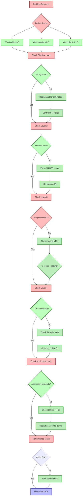

# Chapter 17: Network Troubleshooting

## Learning Objectives

1. Apply a systematic OSI-layer troubleshooting methodology to isolate network faults.
2. Diagnose physical layer issues: cable faults, signal degradation, power over Ethernet problems.
3. Detect and resolve data link layer issues: duplex mismatches, MAC flooding, STP problems.
4. Troubleshoot network layer issues: routing loops, MTU mismatches, ICMP filtering.
5. Identify transport layer issues: port blocking, TIME_WAIT exhaustion, connection limits.
6. Debug application layer issues: DNS resolution failures, HTTP status errors, SSL/TLS handshake failures.
7. Master diagnostic tools: ping, traceroute, netstat/ss, nslookup/dig, tcpdump/Wireshark, nmap, iperf, mtr.
8. Analyze packet captures and build systematic troubleshooting workflows.

<!-- Image Gallery -->
<section class="lesson-visuals" aria-label="Visual learning resources">
  <header><span>VISUAL LEARNING</span><h2>See it. Review it. Remember it.</h2></header>
  <a class="lesson-visual-card" href="../../assets/images/lessons/computer-networks/17-troubleshooting/handwritten-notes.png" target="_blank" rel="noopener">
    
    <span><strong>Handwritten notes</strong>Condensed notes for deliberate review.</span>
  </a>
  <a class="lesson-visual-card" href="../../assets/images/lessons/computer-networks/17-troubleshooting/sticky-notes.png" target="_blank" rel="noopener">
    
    <span><strong>Sticky-note revision</strong>Fast recall prompts for revision.</span>
  </a>
  <a class="lesson-visual-card" href="../../assets/images/lessons/computer-networks/17-troubleshooting/visual-explanation.png" target="_blank" rel="noopener">
    
    <span><strong>Visual concept guide</strong>A connected explanation of the key ideas.</span>
  </a>
</section>
<!-- End Image Gallery -->


## 17.0 The Troubleshooting Mindset

### The Doctor Diagnosis Analogy


Network troubleshooting mirrors medical diagnosis. A doctor does not prescribe treatment without examination; a network engineer does not change configuration without evidence.

| Medical Diagnosis Phase | Network Troubleshooting Equivalent |
|------------------------|-----------------------------------|
| Patient reports symptom | User reports "the website is slow" |
| Triage (vitals check) | ping test, link lights check |
| History & physical exam | Check recent changes, configuration review |
| Differential diagnosis | List possible causes per OSI layer |
| Diagnostic tests | tcpdump, traceroute, iperf |
| Interpret results | Analyze packet captures, latency data |
| Treatment plan | Configuration change, hardware replacement |
| Follow-up | Verify fix, monitor for recurrence |

**Triage protocol:** Always start with the simplest, least-invasive test. If the patient has a fever, you check temperature before ordering an MRI. If the network is slow, you check ping RTT before deploying a full packet capture.

**The 80/20 rule:** 80% of network problems are at the physical or data link layer. Start from the bottom of the OSI model and work up. A cable fault causes the same symptom (no connectivity) as a firewall rule, but checking the cable takes 10 seconds and checking the firewall takes 10 minutes.

### OSI-Layer Troubleshooting Philosophy


The OSI model provides a natural diagnostic hierarchy. Each layer depends on the layers below it. If Layer 1 is broken, Layer 2 cannot work, Layer 3 cannot work, and so on.

**Bottom-up approach (recommended for most scenarios):**
1. Physical — link lights, cable tester
2. Data Link — ARP, MAC tables, switch logs
3. Network — ping, traceroute, routing tables
4. Transport — port connectivity, socket states
5. Application — application logs, HTTP status codes

**Top-down approach (better for application-specific issues):**
1. Application — browser console, server logs
2. Transport — telnet to port, ss/tcpdump
3. Network — verify routing, firewall rules
4. Data Link — check ARP, VLAN membership
5. Physical — verify link state

**Divide and conquer approach:**
Test at the middle layer (Network). If ping works, the problem is above Layer 3. If ping fails, the problem is below Layer 3. This eliminates half the possibilities in one test.

### OSI Layer Troubleshooting Quick Reference Table


| Problem Symptom | Likely OSI Layer | Primary Tool | Secondary Tool |
|----------------|-----------------|-------------|---------------|
| No link light | Layer 1 — Physical | Cable tester | Interface statistics |
| Intermittent connectivity | Layer 1 — Physical | TDR, signal analyzer | Interface error counters |
| Slow throughput, no errors | Layer 2 — Data Link | Duplex check | Interface statistics |
| MAC address conflicts | Layer 2 — Data Link | ARP table inspection | MAC table audit |
| No connectivity to remote net | Layer 3 — Network | ping, traceroute | Routing table check |
| Routing loops | Layer 3 — Network | traceroute | TTL expiry debug |
| MTU-related failures | Layer 3 — Network | ping with DF bit | tcpdump ICMP |
| Port unreachable | Layer 4 — Transport | telnet, nc | ss -tln |
| Connection resets | Layer 4 — Transport | tcpdump | Wireshark TCP analysis |
| TIME_WAIT exhaustion | Layer 4 — Transport | ss -s, netstat | Connection tracking |
| Name resolution failure | Layer 5-7 — Application | nslookup, dig | DNS server logs |
| HTTP 4xx/5xx errors | Layer 7 — Application | curl -v | Server access logs |
| SSL/TLS handshake failure | Layer 5-7 — Application | openssl s_client | Wireshark TLS filter |
| Slow web browsing | Cross-layer | MTR, tcpdump | Browser dev tools |

## 17.1 OSI-Layer Troubleshooting Methodology

### 17.1.1 Systematic 8-Step Process


Every troubleshooting session follows a structured diagnostic cycle. Skipping steps leads to wasted effort and configuration changes that do not fix the root cause.

**Step 1 — Define the problem precisely.** A vague problem statement ("the network is slow") is unusable. Quantify: "The web application takes 8 seconds to load the login page, while the baseline is 1.2 seconds. The issue started at 2:00 PM and affects all users in the Chicago office."

**Step 2 — Check the obvious (2-minute rule).** Before any advanced diagnostics, check: link lights, cable connections, service status, recent configuration changes. Most outages are caused by a cable being unplugged, a service not restarting after a patch, or a firewall rule that was changed and not reverted.

**Step 3 — Isolate the scope.** Determine the boundary of the problem. Ask: Does this affect one user or all users? One application or all applications? One subnet or the entire network? Does it happen at specific times or continuously?

**Step 4 — Form a hypothesis.** Based on scope and symptoms, list 2-3 probable causes at the appropriate OSI layer. Document each hypothesis with a specific prediction.

**Step 5 — Select and run diagnostic tools.** Choose the tool that tests the hypothesis fastest. Do not run every tool on every problem.

**Step 6 — Analyze results and iterate.** Did the test confirm or refute the hypothesis? If confirmed, proceed to fix. If refuted, return to Step 3 with new information.

**Step 7 — Implement the fix.** Apply the configuration change, replace the hardware, or restart the service. Make one change at a time so you know exactly which action resolved the issue.

**Step 8 — Verify and document.** Run the diagnostic test again to confirm the fix works. Document the root cause, the diagnostic steps taken, the fix applied, and any preventive measures.

### 17.1.2 Pseudocode: General Troubleshooting Algorithm


FUNCTION troubleshootNetwork(symptoms, scope):
    // Step 1: Define
    problem = defineProblem(symptoms)
    expectedBehavior = getExpectedBehavior(problem)
    // Step 2: Check obvious
    IF checkObvious(problem) RETURNS found:
        fixObviousIssue()
        verifyFix()
        RETURN
    // Step 3: Isolate scope
    scopeBoundary = determineScope(scope)
    // Step 4-6: OSI layer loop (bottom-up by default)
    FOR layer FROM 1 TO 7:
        hypotheses = generateHypotheses(layer, scopeBoundary)
        FOR EACH hypothesis IN hypotheses:
            IF hypothesisTest(hypothesis) IS confirmed:
                implementFix(hypothesis.rootCause)
                verifyFix()
                document(problem, hypothesis, fix)
                RETURN
    escalateToVendor(problem)
    RETURN unresolved

### 17.1.3 Dry Run: Multi-Layer Troubleshooting Walkthrough


Scenario: User cannot access intranet at https://intranet.internal.com. Other websites work fine.

| Step | Action | Tool | Expected vs Actual | Decision |
|------|--------|------|-------------------|----------|
| 1 | Define problem | User interview | Cannot reach https://intranet.internal.com; other sites OK | Single URL, single user |
| 2 | Check obvious | Visual | Cable plugged in, link light green | Move to next step |
| 3 | Isolate scope | Try from another PC | Another user CAN access intranet | Scope = single workstation |
| 4 | Hypothesis | Layer-based reasoning | DNS? Network route? Hosts file? | Generate 3 hypotheses |
| 5 | Test #1: DNS | nslookup intranet.internal.com | Resolution returns correct 10.0.1.50 | DNS is working |
| 6 | Test #2: Route | ping 10.0.1.50 | Request timed out | Network layer issue |
| 7 | Test #3: Firewall | Check local Windows Firewall | Intranet.exe blocked on public profile | Root cause found |
| 8 | Implement fix | Change network profile to Domain | Access restored | Confirmed |
| 9 | Document | Write ticket resolution | RCA: Network profile mismatch | Complete |

Dry run trace table showing state at each iteration:

| Iter | Layer Tested | Hypothesis | Test Command | Result | Action |
|------|-------------|-----------|-------------|--------|--------|
| 1 | L5 - DNS | DNS cannot resolve intranet | nslookup intranet.internal.com | Resolved to 10.0.1.50 | Hypothesis rejected |
| 2 | L3 - Network | No route to 10.0.1.50 | ping 10.0.1.50 | 100% loss | Hypothesis confirmed |
| 3a | L3 - Network | Default gateway unreachable | ping 10.0.0.1 | Success | Gateway working |
| 3b | L3 - Network | Firewall blocking | netsh advfirewall show currentprofile | Public profile, intranet blocked | Root cause |
| 4 | Fix | Change to domain profile | netsh advfirewall set currentprofile Domain | Ping succeeds | Verify |

## 17.2 Physical Layer Issues (Layer 1)

### 17.2.1 Overview


The physical layer comprises cables (copper, fiber), connectors, signal repeaters, hubs, and the electrical/optical signals that carry bits. Physical layer problems account for approximately 40% of all network outages. Symptoms include: no link light, intermittent connectivity, high error rates, CRC errors, and link flapping.

### Real-World Analogy


Physical layer issues are like problems with a city road surface. A pothole (damaged cable) slows traffic; a collapsed bridge (severed fiber) stops all traffic. You cannot drive anywhere if the roads are broken, no matter how good your navigation system (higher-layer protocols) is.

### Numbered Troubleshooting Steps


1. Verify link lights. Both the switch port LED and NIC LED should be solid green. Amber or blinking indicates problems.
2. Check cable type and length. Ethernet over Cat5e/6 is limited to 100 meters. Beyond that you need a repeater or fiber.
3. Inspect for physical damage: bent pins, broken RJ45 tabs, kinked cables, corroded contacts.
4. Check interface error counters: show interface port include CRC|runts|giants|collisions. Rising CRC errors suggest signal degradation.
5. Run a cable test using TDR (Time Domain Reflectometer) to locate breaks.
6. Test with a known-good cable. Swapping the cable is faster than any analysis.
7. Check PoE (Power over Ethernet). Verify the switch port is delivering power.
8. Test with a known-good device. If the cable tests fine but the device still fails, the NIC may be faulty.

### Pseudocode: Physical Layer Diagnostics


FUNCTION diagnosePhysical(interfaceName):
    linkState = getLinkState(interfaceName)
    IF linkState IS "down":
        cableTesterResult = runCableDiagnostic(interfaceName)
        IF cableTesterResult INDICATES "open" OR "short":
            RETURN "Faulty cable at " + cableTesterResult.distance + "m"
        ELSE:
            RETURN "Interface admin down, check config"
    errors = getInterfaceErrors(interfaceName)
    IF errors.crcErrors > threshold:
        RETURN "Signal degradation, possible faulty cable"
    IF device IS PoE-powered:
        powerState = getPoEStatus(interfaceName)
        IF powerState IS "fault":
            RETURN "PoE fault"
    RETURN "Physical layer OK"

### Dry Run Trace Table


Scenario: A security camera connected to switch port Gi0/12 goes offline.

| Step | Check | Command | Result | Interpretation |
|------|-------|---------|--------|---------------|
| 1 | Link light | Visual inspection | Port LED is off | Physical connectivity lost |
| 2 | Cable test | test cable-diagnostics Gi0/12 | Open at 47m | Cable cut at 47m |
| 3 | Distance check | Measure run length | Run length reported 50m | Cable damaged at 47m from switch |
| 4 | Cable replacement | Replace cable from 47m to camera | Link light turns green | Confirmed cable fault |
| 5 | Verify | ping camera-ip | 64 bytes, 1ms | Physical layer restored |

### Edge Cases


1. Auto-MDIX incompatibility: Older switches without Auto-MDIX need crossover cables.
2. PoE budget exceeded: Adding too many high-power devices causes switch to power-cycle ports.
3. Fiber dirty connectors: Microscopic dirt on fiber connector face causes intermittent errors.
4. Crosstalk from bundled cables: Running many Cat6 cables through a single conduit causes interference.
5. Link flapping from EEE: Energy-Efficient Ethernet (802.3az) power saving may briefly drop link.


## 17.3 Data Link Layer Issues (Layer 2)

### 17.3.1 Overview


The data link layer handles framing, MAC addressing, error detection, and media access control. Common issues include duplex mismatches, MAC address flooding, spanning tree problems, and VLAN misconfigurations.

### Real-World Analogy


Data link problems are like a postal sorting office. Duplex mismatch = two sorting machines operating at different speeds, causing letters to pile up or get lost. MAC flooding = a bad actor sending millions of fake letters to overwhelm the sorting system. STP issues = delivery trucks going in circles because the road network has temporary loops.

### Numbered Troubleshooting Steps


1. Check duplex and speed settings. A mismatch occurs when one side is set to "auto" and the other to "full" (or "half"). Symptoms: CRC errors on the full-duplex side, late collisions on the half-duplex side.
2. Inspect the MAC address table: show mac address-table. Unexpected MACs indicate potential bridging loops or MAC flooding.
3. Check for STP topology changes: show spanning-tree. Frequent TCs indicate an unstable network.
4. Verify ARP entries on the host (arp -a) or router (show arp). Missing entries suggest Layer 2 problems.
5. Check VLAN membership: show vlan brief. A port in the wrong VLAN cannot communicate across VLANs.
6. Look for excessive broadcasts. High broadcast traffic (>1000 pkt/sec) may indicate a broadcast storm.
7. Check port security: err-disabled ports from security violations.

### Pseudocode: Duplex Mismatch Detector


FUNCTION detectDuplexMismatch(interfaceName, duration_seconds):
    beforeCRC = getCounter(interfaceName, "crcErrors")
    beforeLateColl = getCounter(interfaceName, "lateCollisions")
    sendTestTraffic(interfaceName, duration_seconds)
    afterCRC = getCounter(interfaceName, "crcErrors")
    afterLateColl = getCounter(interfaceName, "lateCollisions")
    crcDelta = afterCRC - beforeCRC
    lateCollDelta = afterLateColl - beforeLateColl
    IF crcDelta > 100 AND lateCollDelta > 0:
        RETURN DUPLEX_MISMATCH_CONFIRMED
    ELIF crcDelta > 10:
        RETURN POSSIBLE_DUPLEX_ISSUE
    ELSE:
        RETURN NO_DUPLEX_ISSUE_DETECTED

### Dry Run Trace Table


Two switches connected via trunk port Trk1. Users report intermittent connectivity.

| Step | Check | Command | Result | Interpretation |
|------|-------|---------|--------|---------------|
| 1 | Duplex settings | show interface Trk1 | PortA: Full, PortB: Auto | Duplex mismatch! |
| 2 | Error counters | show interface Trk1 | CRC: 1247, Late Collisions: 89 | Classic mismatch |
| 3 | STP status | show spanning-tree Trk1 | Blocking -> Learning -> Forwarding cycling | TC every 30s |
| 4 | Set duplex consistently | duplex full | Both sides full duplex | Fix applied |
| 5 | Verify after 1 minute | show interface Trk1 | CRC: 2 (new), Late Coll: 0 | Errors stopped |

Duplex Mismatch Symptom Matrix:

| Side A Setting | Side B Setting | Side A Symptoms | Side B Symptoms |
|---------------|---------------|-----------------|-----------------|
| Full | Auto | CRC errors, FCS errors | Late collisions |
| Full | Half | CRC errors | Late collisions, alignment errors |
| Auto | Auto (both fail) | CRC errors | Late collisions |
| Full | Full (correct) | Clean | Clean |

### Pseudocode: MAC Flood Detection


FUNCTION detectMACFlooding(switchName):
    entries = getMacTableEntryCount(switchName)
    baseline = getBaseline(switchName, "macEntries")
    IF entries > baseline * 3:
        topPorts = getPortsByMacCount(switchName, LIMIT=5)
        FOR EACH port IN topPorts:
            macs = getMacsOnPort(port)
            uniqueOuis = countUniqueOUI(macs)
            totalMacs = countMacs(macs)
            IF uniqueOuis > totalMacs * 0.8:
                RETURN "MAC flooding attack suspected on " + port
            ELSE:
                RETURN "High MAC count on " + port
    RETURN "MAC table normal"

### C++ Implementation: Duplex/Speed Analyzer


#include &lt;iostream&gt;
#include &lt;string&gt;
#include <map>

enum class DuplexMode { HALF, FULL, AUTO_FAIL };

struct PortStats {
    std::string name; DuplexMode config, actual;
    int speed; int crcErrors; int lateCollisions;
};

class DuplexAnalyzer {
    std::map&lt;std::string, PortStats&gt; ports;
public:
    DuplexAnalyzer() {
        ports["Gi0/1"] = {"Gi0/1", DuplexMode::FULL, DuplexMode::FULL, 1000, 2, 0};
        ports["Gi0/3"] = {"Gi0/3", DuplexMode::FULL, DuplexMode::AUTO_FAIL, 1000, 1247, 89};
    }
    std::string diagnose(const std::string& p) {
        if (ports.find(p) == ports.end()) return "Not found";
        auto& pt = ports[p];
        bool mismatch = (pt.config != pt.actual);
        if (mismatch || pt.crcErrors > 100) {
            return "DUPLEX MISMATCH on " + p + "\n  Config=" + duplexStr(pt.config) + " Actual=" + duplexStr(pt.actual) + "\n  CRC=" + std::to_string(pt.crcErrors) + " LateColl=" + std::to_string(pt.lateCollisions);
        }
        return p + " OK (" + duplexStr(pt.actual) + ")";
    }
    std::string duplexStr(DuplexMode d) {
        if (d == DuplexMode::FULL) return "Full";
        if (d == DuplexMode::HALF) return "Half";
        return "Auto(fail)";
    }
};

int main() {
    DuplexAnalyzer da;
    std::cout &lt;< da.diagnose("Gi0/3") << std::endl;
    return 0;
}

### Python Implementation: MAC Flood Detector


import random, time
from dataclasses import dataclass, field
from typing import Dict

@dataclass
class SwitchPort:
    port_id: str; max_limit: int = 100
    macs: Dict[str, float] = field(default_factory=dict)
    err_disabled: bool = False; violations: int = 0

    def learn(self, mac: str) -> bool:
        if self.err_disabled: return False
        if mac not in self.macs:
            if len(self.macs) >= self.max_limit:
                self.violations += 1
                if self.violations >= 3: self.err_disabled = True; return False
                oldest = min(self.macs, key=self.macs.get)
                del self.macs[oldest]
            self.macs[mac] = time.time()
        return True

class FloodDetector:
    def __init__(self):
        self.ports: Dict[str, SwitchPort] = {}
    def add_port(self, pid: str, limit: int = 100):
        self.ports[pid] = SwitchPort(pid, limit)
    def attack(self, pid: str, count: int):
        p = self.ports.get(pid)
        if not p: return
        for _ in range(count):
            mac = ":".join(f"{random.randint(0,255):02X}" for _ in range(6))
            p.learn(mac)
            if p.err_disabled: break

if __name__ == "__main__":
    fd = FloodDetector()
    fd.add_port("Gi0/1", 100); fd.add_port("Gi0/2", 100); fd.add_port("Gi0/3", 100)
    fd.attack("Gi0/3", 300)
    for pid, p in fd.ports.items():
        util = len(p.macs) / p.max_limit * 100
        print(f"[{'FLOOD' if (util>80 or p.err_disabled) else 'OK'}] {pid}: {len(p.macs)}/{p.max_limit} ({util:.0f}%)")

### Complexity Analysis for Data Link Diagnostics


Duplex mismatch detection: O(1) → counters are hardware registers. MAC flood detection: O(m) where m = MAC entries. Space: O(m).

### Edge Cases for Data Link


1. VMs on hypervisor ports legitimately learn 50+ MACs across multiple OUIs.
2. Asymmetric routing causes MAC flapping logs (not an attack).
3. STP reconvergence flushes MAC tables, temporary relearning looks like flood.

## 17.4 Network Layer Issues (Layer 3)

### 17.4.1 Overview


Network layer issues involve IP addressing, routing, packet forwarding, and ICMP. Common problems: routing loops, misconfigured static routes, missing default gateways, MTU mismatches, ICMP filtering, and asymmetric routing.

### Real-World Analogy


Network layer problems are like GPS navigation errors. A routing loop is the GPS telling you to go in circles. A misconfigured default gateway is like the GPS routing you to the wrong highway exit. MTU mismatch is like a tunnel that only allows compact cars but your delivery truck is too tall.

### Numbered Troubleshooting Steps


1. Verify IP configuration on the host: ipconfig /all or ip addr. Check IP, mask, gateway, DNS.
2. Ping the default gateway. If unreachable, problem is local subnet.
3. Ping a remote IP (not hostname). Tests Layer 3 without DNS.
4. Run traceroute. Identify which hop stops responding.
5. Check routing tables: show ip route, route print, ip route.
6. Check for routing loops: same hops repeating in traceroute.
7. Test MTU with DF bit: ping -M do -s 1472 destination.
8. Check firewall/ACL rules blocking ICMP.

### Pseudocode: Routing Loop Detector


FUNCTION detectRoutingLoop(destination, maxHops):
    FOR attempt FROM 1 TO 3:
        hops = traceroute(destination)
        FOR i FROM 0 TO length(hops) - 3:
            IF hops[i] == hops[i+1] == hops[i+2]:
                RETURN "Loop at hop " + i
            IF hops[i] == hops[i+2] AND hops[i] != hops[i+1]:
                RETURN "2-hop loop " + hops[i] + " <-> " + hops[i+1]
        IF NOT reached AND length(hops) >= maxHops:
            RETURN "Possible loop at " + lastHop
    RETURN "No loop"

### Dry Run Trace Table


Subnet 10.1.1.0/24 cannot reach 10.2.2.0/24.

| Trace Hop | IP | RTT | TTL | Observation |
|----------|-----|-----|-----|------------|
| 1 | 10.1.1.1 | 1ms | 254 | Local gateway OK |
| 2 | 10.100.1.1 | 5ms | 253 | WAN router |
| 3 | 10.100.2.1 | 5ms | 252 | Second hop |
| 4 | 10.100.1.1 | 5ms | 251 | BACK TO HOP 2! |
| 5 | 10.100.2.1 | 5ms | 250 | Oscillating |
| ... | ... | ... | ... | TTL expires at 30 |

Root cause: Router R2 points to R1 for 10.2.2.0/24, R1 points back to R2.

### C++ Implementation: Ping Simulator with TTL


#include &lt;iostream&gt;
#include &lt;string&gt;
#include &lt;vector&gt;
#include &lt;random&gt;

struct PingResult { std::string dest; int sent, rcvd, loss; double minR, avgR, maxR; };

class PingSim {
    std::mt19937 rng{std::random_device{}()};
    struct Hop { std::string ip; double lat, jit; double loss; };
    std::vector&lt;Hop&gt; path(const std::string& d) {
        if (d=="10.2.2.100") return {{"gw",1,0.5,0},{"rtr1",3,1,0},{"rtr2",10,2,0},{"svr",12,1,0.01}};
        return {};
    }
public:
    PingResult ping(const std::string& d, int c=5) {
        auto p = path(d); PingResult r{d,c,0,0,9999,0,0};
        for (int i=1;i&lt;=c;i++) {
            double del=0; bool lost=false;
            for (auto& h : p) { if (std::uniform_real_distribution&lt;>(0,1)(rng)<h.loss) { lost=true; break; } del += h.lat + std::normal_distribution<&gt;(0,h.jit)(rng); }
            if (!lost) { double rtt=del*2; r.rcvd++; r.avgR+=rtt; if(rtt&lt;r.minR)r.minR=rtt; if(rtt&gt;r.maxR)r.maxR=rtt; std::cout&lt;<"seq="<<i<<" time="<<rtt<<"ms\n"; }
        }
        r.loss=(c-r.rcvd)*100/c; r.avgR=r.rcvd?r.avgR/r.rcvd:0;
        return r;
    }
};

int main() {
    auto r=PingSim().ping("10.2.2.100",5);
    std::cout&lt;<r.sent<<" sent, "<<r.rcvd<<" rcvd, "<<r.loss<<"% loss\n";
    return 0;
}

### Python: Traceroute Analyzer + Path MTU


import random
from dataclasses import dataclass
from typing import List, Optional, Tuple

@dataclass
class Hop:
    n: int; ip: str; rtts: List[Optional[float]]
    @property
    def loss(self): return sum(1 for r in self.rtts if r is None)/3*100

class TraceResult:
    def __init__(self, dest: str):
        self.dest = dest; self.hops: List[Hop] = []; self.ok = False
    def detect_loop(self) -> Optional[str]:
        for i in range(len(self.hops)-3):
            if self.hops[i].ip == self.hops[i+2].ip and self.hops[i+1].ip == self.hops[i+3].ip:
                return f"2-hop loop at {i}: {self.hops[i].ip} &lt;-> {self.hops[i+1].ip}"
            if self.hops[i].ip == self.hops[i+1].ip == self.hops[i+2].ip:
                return f"Same-hop loop at {i}: {self.hops[i].ip}"
        return None

class TraceSim:
    TOPS = {
        "ok": [("192.168.1.1",1),("10.0.0.1",3),("142.250.80.14",12)],
        "loop": [("10.1.1.1",1),("10.100.1.1",5),("10.100.2.1",5),("10.100.1.1",5),("10.100.2.1",5)],
    }
    def trace(self, which="ok") -> TraceResult:
        top = self.TOPS[which]; r = TraceResult(top[-1][0])
        for i,(ip,base) in enumerate(top,1):
            rtts = [round(base+random.uniform(-0.5,0.5)*base*0.2,1) for _ in range(3)]
            r.hops.append(Hop(i,ip,rtts))
        r.ok = True; return r

def mtu_discover(max_sz=1500, min_sz=500):
    pmtu = 1400; lo, hi, good = min_sz, max_sz, min_sz
    while lo &lt;= hi:
        mid = (lo+hi)//2
        if mid &lt;= pmtu: print(f"  -s {mid}: OK"); good=mid; lo=mid+1
        else: print(f"  -s {mid}: FAIL"); hi=mid-1
    print(f"\nPath MTU = {good+28}\nMSS clamp: {good-20}")

if __name__ == "__main__":
    r = TraceSim().trace("loop")
    print([f"{h.n}: {h.ip}" for h in r.hops])
    loop = r.detect_loop()
    if loop: print(f"LOOP: {loop}")
    print(); mtu_discover()

### Complexity Analysis


Ping: O(h*c). Traceroute: O(h*p). MTU discovery: O(log n) binary search. Loop detection: O(h) linear scan. Binary search for MTU is critical → each probe requires network RTT wait.

### Edge Cases


1. ICMP blocked: ping fails but TCP works. Use curl/tcping.
2. Asymmetric routing: traceroute shows only forward path.
3. ECMP: Different probes may take different paths.
4. Tunnel MTU: VPN adds header overhead; without MSS clamping, TCP stalls.
5. Black hole: next hop has no return route.

## 17.5 Transport Layer Issues (Layer 4)

### 17.5.1 Overview


Transport layer issues involve TCP/UDP port accessibility, socket states, TIME_WAIT exhaustion, connection limits, and firewall filtering.

### Real-World Analogy


Like a busy restaurant phone system. Port blocked = disconnected line. TIME_WAIT exhaustion = never reusing old numbers, running out. Connection limits = 50 tables but 200 calling at once.

### Numbered Steps


1. Check listening port: ss -tln or netstat -an | find "LISTEN".
2. Test connectivity: telnet host port or nc -zv host port.
3. Check firewall: iptables -L, Windows Firewall, cloud security groups.
4. Check states: ss -s. Many TIME_WAIT (>30000) = short connections.
5. Check backlog: non-zero Recv-Q on LISTEN = full.
6. Check for SYN cookies: /proc/net/netstat TCPReqQFullDrop.
7. Capture handshake with tcpdump: retransmitted SYN = server not responding.

### Pseudocode: Port Scanner


FUNCTION scanPort(host, port, timeout_ms):
    socket = createSocket(TCP)
    socket.setTimeout(timeout_ms)
    TRY: socket.connect(host, port); RETURN {port: OPEN}
    CATCH ConnectionRefused: RETURN {port: CLOSED}
    CATCH Timeout: RETURN {port: FILTERED}

### Dry Run Trace Table


Web server 10.0.0.50 not responding from client 10.0.0.100.

| Step | Test | Command | Result | Interp |
|------|------|---------|--------|--------|
| 1 | Server port | ss -tln | LISTEN :80 | Server listening |
| 2 | Client test | curl http://10.0.0.50:80 | Connection refused | TCP fails |
| 3 | Telnet | telnet 10.0.0.50 80 | Unable | Transport issue |
| 4 | tcpdump | tcpdump host 10.0.0.50 | SYN sent, RST rcvd | Rejected |
| 5 | Firewall | iptables -L OUTPUT | DROP to 10.0.0.50 | Root cause |
| 6 | Fix | iptables -I OUTPUT ... | curl succeeds | Fixed |

### C++: TCP Port Scanner (Threaded)


#include &lt;iostream&gt;
#include &lt;string&gt;
#include &lt;vector&gt;
#include &lt;future&gt;
#ifdef _WIN32
#include &lt;winsock2.h&gt;
#include &lt;ws2tcpip.h&gt;
#pragma comment(lib,"ws2_32")
#else
#include &lt;sys/socket.h&gt;
#include &lt;netinet/in.h&gt;
#include &lt;arpa/inet.h&gt;
#include &lt;unistd.h&gt;
#include &lt;fcntl.h&gt;
#define SOCKET int
#define INVALID_SOCKET -1
#define closesocket close
#endif

struct Result { int port; bool open; double rtt; };
std::string svc(int p) {
    const char* s[]={"","","FTP","","","","","","","","","","","","","","","","","","FTP-data","SSH","Telnet","","SMTP","","","","","","","","","","","","","","","","","","","","","","","","","","","","DNS","","","","","","","","","","","","","","","","","","","","","","","","","","","","","","","","","","","","","","","","HTTP"};
    return (p>=0&&p&lt;100) ? s[p] : "?";
}

Result scan(const std::string& host, int port, int tmo=2000) {
    auto start = std::chrono::steady_clock::now();
#ifdef _WIN32
    WSADATA w; WSAStartup(MAKEWORD(2,2),&w);
#endif
    SOCKET s = socket(AF_INET, SOCK_STREAM, 0);
    if (s == INVALID_SOCKET) return {port,false,0};
#ifdef _WIN32
    u_long m=1; ioctlsocket(s,FIONBIO,&m);
#endif
    sockaddr_in a{}; a.sin_family=AF_INET; a.sin_port=htons(port);
    inet_pton(AF_INET,host.c_str(),&a.sin_addr);
    connect(s,(sockaddr*)&a,sizeof(a));
    fd_set w; FD_ZERO(&w); FD_SET(s,&w);
    timeval tv{tmo/1000,(tmo%1000)*1000};
    bool ok = select(0,nullptr,&w,nullptr,&tv)>0;
    if (ok) { int e=0; socklen_t l=sizeof(e); getsockopt(s,SOL_SOCKET,SO_ERROR,(char*)&e,&l); ok=(e==0); }
    closesocket(s);
    auto rtt = std::chrono::duration&lt;double,std::milli&gt;(std::chrono::steady_clock::now()-start).count();
    return {port,ok,rtt};
}

int main() {
    std::vector&lt;Result&gt; res;
    std::vector&lt;std::future<Result&gt;> futs;
    for (int p=1;p&lt;=1024;p++) {
        futs.push_back(std::async(std::launch::async,scan,"10.0.0.50",p,1500));
        if (futs.size()>=50||p==1024) { for(auto&f:futs){auto r=f.get();if(r.open)res.push_back(r);} futs.clear(); }
    }
    for (auto& r : res) std::cout &lt;< r.port << "\t" << svc(r.port) << "\t" << r.rtt << "ms\n";
    return 0;
}

### Python: Connection State Analyzer


from collections import Counter
from typing import List, Dict
import random

class StateAnalyzer:
    def simulate(self, scenario="healthy") -> List[str]:
        cfg = {
            "healthy": {"ESTABLISHED":150,"TIME_WAIT":20,"LISTEN":15},
            "tw_exhaust": {"TIME_WAIT":35000,"ESTABLISHED":200,"LISTEN":15},
            "cw_leak": {"CLOSE_WAIT":500,"ESTABLISHED":100,"LISTEN":15},
            "synflood": {"SYN_RECV":3000,"ESTABLISHED":50,"LISTEN":15},
        }[scenario]
        return [s for s,c in cfg.items() for _ in range(c)]
    
    def analyze(self, states: List[str]) -> Dict:
        c = Counter(states)
        return {
            "total": len(states),
            "states": dict(c),
            "tw_exhaust": c.get("TIME_WAIT",0)>30000,
            "cw_leak": c.get("CLOSE_WAIT",0)>100,
            "synflood": c.get("SYN_RECV",0)>1000,
        }

sa = StateAnalyzer()
for sc in ["healthy","tw_exhaust","cw_leak","synflood"]:
    r = sa.analyze(sa.simulate(sc))
    print(f"=== {sc} ({r['total']} conns) ===")
    for s,n in sorted(r["states"].items(),key=lambda x:-x[1]):
        print(f"  {s:15} {n:>6}")
    if r["tw_exhaust"]: print("  [!!!] TIME_WAIT exhaustion")
    if r["cw_leak"]: print("  [!!!] CLOSE_WAIT leak")
    if r["synflood"]: print("  [!!!] SYN flood")
    print()

### Complexity & Edge Cases


Port scan: O(p/t) threaded. State analysis: O(n). TIME_WAIT: each lasts 2*MSL (~60s). ~28K ephemeral ports = ~470 conns/sec max. SYN cookies bypass backlog but lose TCP options. Firewall RST injection kills idle connections. MSS clamping in FW affects performance.

## 17.6 Application Layer Issues (Layers 5-7)

### 17.6.1 Overview


DNS failures, HTTP/HTTPS errors, SSL/TLS handshake problems, application protocol violations.

### Real-World Analogy


Correct address and phone (L1-4 working) but wrong department or wrong language. DNS = missing directory. HTTP error = "cannot help you." SSL = refuses identity verification.

### Numbered Steps


1. Check DNS: nslookup/dig. Verify returned IP.
2. Test alternate resolver: dig @8.8.8.8 hostname.
3. Check HTTP: curl -v. Shows handshake + status.
4. Check TLS: openssl s_client -connect host:443.
5. Check app logs (access/error). 500 = server log check.
6. Check WAF logs for blocked requests.
7. Verify HTTP method/headers.

### Pseudocode: DNS Checker


FUNCTION checkDNS(hostname):
    ips = dnsResolve(hostname)
    IF ips empty: RETURN {status:"NXDOMAIN"}
    pubIps = dnsResolveWithServer(hostname, "8.8.8.8")
    IF ips[0] != pubIps[0]:
        RETURN {status:"WARN", msg:"Split-brain DNS"}
    RETURN {status:"OK", ips: ips}

### Dry Run Trace Table


502 Bad Gateway at https://api.example.com.

| Step | Check | Result | Interp |
|------|-------|--------|--------|
| 1 | dig api.example.com | A 203.0.113.50 | DNS OK |
| 2 | curl -v 203.0.113.50:443 | TCP handshake OK | L4 OK |
| 3 | openssl s_client | Cert valid | TLS OK |
| 4 | curl /health | 502 Bad Gateway | App error |
| 5 | nginx error log | connect() failed to :8080 | Upstream down |
| 6 | systemctl status app | Failed | App crashed |
| 7 | start app | Started | Fix |
| 8 | curl /health | 200 OK | Resolved |

### C++: HTTP Status Checker


#include &lt;iostream&gt;
#include &lt;string&gt;
#include &lt;regex&gt;
#include &lt;chrono&gt;
#ifdef _WIN32
#include &lt;winsock2.h&gt;
#include &lt;ws2tcpip.h&gt;
#pragma comment(lib,"ws2_32")
#else
#include &lt;sys/socket.h&gt;
#include &lt;netdb.h&gt;
#include &lt;unistd.h&gt;
#define SOCKET int
#endif

struct HTTP { int code; std::string text; double dns, tcp, total; bool err; std::string msg; };

HTTP check(const std::string& h, int p=80, const std::string& path="/") {
    HTTP r{0,"",0,0,0,false,""};
    auto start = std::chrono::steady_clock::now();
    // DNS
    addrinfo hints{},*addrs; hints.ai_family=AF_INET; hints.ai_socktype=SOCK_STREAM;
    auto ds=std::chrono::steady_clock::now();
    if(getaddrinfo(h.c_str(),std::to_string(p).c_str(),&hints,&addrs)!=0) { r.err=true; r.msg="DNS fail"; return r; }
    r.dns=std::chrono::duration&lt;double,std::milli&gt;(std::chrono::steady_clock::now()-ds).count();
    // TCP
    auto ts=std::chrono::steady_clock::now();
    SOCKET s=socket(AF_INET,SOCK_STREAM,0);
    if(connect(s,addrs->ai_addr,(int)addrs->ai_addrlen)&lt;0) { r.err=true; r.msg="TCP fail"; closesocket(s); freeaddrinfo(addrs); return r; }
    r.tcp=std::chrono::duration&lt;double,std::milli&gt;(std::chrono::steady_clock::now()-ts).count();
    freeaddrinfo(addrs);
    // HTTP
    std::string req="GET "+path+" HTTP/1.1\r\nHost: "+h+"\r\nConnection: close\r\n\r\n";
    send(s,req.c_str(),req.size(),0);
    std::string resp; char buf[4096]; int n;
    while((n=recv(s,buf,sizeof(buf)-1,0))>0){buf[n]=0;resp+=buf;}
    r.total=std::chrono::duration&lt;double,std::milli&gt;(std::chrono::steady_clock::now()-start).count();
    closesocket(s);
    std::smatch m;
    if(std::regex_search(resp,m,std::regex("HTTP/\\d\\.\\d\\s+(\\d+)\\s+(\\S+)"))){ r.code=std::stoi(m[1]); r.text=m[2]; }
    return r;
}

std::string interp(int c) {
    if(c==200)return"OK";if(c>=300&&c&lt;400)return"Redirect";
    if(c==400)return"BadReq";if(c==401)return"Unauth";if(c==403)return"Forbid";
    if(c==404)return"NotFound";if(c==429)return"RateLimit";if(c==500)return"ServerErr";
    if(c==502)return"BadGW";if(c==503)return"Unavail";if(c==504)return"GWTimeout";return"?";
}

int main() {
    auto r=check("example.com",80,"/");
    if(r.err) std::cout&lt;<"Error: "<<r.msg<<"\n";
    else std::cout&lt;<"HTTP "<<r.code<<" "<<interp(r.code)<<" (dns:"<<r.dns<<"ms tcp:"<<r.tcp<<"ms total:"<<r.total<<"ms)\n";
    return 0;
}

### Python: TLS Certificate Diagnoser


from dataclasses import dataclass
from datetime import datetime, timedelta
from typing import List

@dataclass
class Cert:
    sub: str; iss: str; nb: datetime; na: datetime; sans: List[str]
    @property
    def days(self): return (self.na - datetime.now()).days
    @property
    def expired(self): return datetime.now() > self.na
    def matches(self, host: str) -> bool:
        if host in self.sans: return True
        for san in self.sans:
            if san.startswith("*.") and host.endswith(san[1:]): return host.count(".") == san.count(".")+1
        return False

def chain(host: str, sc: str = "valid") -> List[Cert]:
    now = datetime.now()
    return {
        "valid": [Cert(f"CN={host}","CA-R3",now-timedelta(30),now+timedelta(65),[host])],
        "expired": [Cert(f"CN={host}","CA",now-timedelta(400),now-timedelta(30),[host])],
        "mismatch": [Cert("CN=wrong.com","CA",now-timedelta(30),now+timedelta(335),["wrong.com"])],
        "selfsigned": [Cert(f"CN={host}",f"CN={host}",now-timedelta(30),now+timedelta(335),[host])],
    }[sc]

def diag(host: str, sc: str = "valid"):
    leaf = chain(host, sc)[0]
    iss = []
    if leaf.expired: iss.append(f"EXPIRED {abs(leaf.days)}d ago")
    elif leaf.days &lt; 30: iss.append(f"Expires {leaf.days}d")
    if not leaf.matches(host): iss.append(f"Hostname mismatch: SAN={leaf.sans}")
    status = "FAIL" if iss and ("EXPIRED" in iss[0] or "mismatch" in iss[0]) else "WARN" if iss else "PASS"
    print(f"[{status}] {host}\n  Subj: {leaf.sub}\n  Exp: {leaf.na.date()} ({leaf.days}d)\n  Iss: {leaf.iss}")
    for i in iss: print(f"  [!] {i}")
    print()

for sc in ["valid","expired","mismatch","selfsigned"]:
    diag("api.example.com", sc)

### Complexity Analysis


TLS: O(c) chain length. HTTP: O(1). DNS: O(d) delegation depth.

### Edge Cases


1. DNS split-brain: different IPs inside vs outside.
2. TLS SNI: no SNI = wrong certificate.
3. OCSP unreachable: some browsers soft-fail, some hard-fail.
4. HSTS preload: no HTTP fallback.
5. HTTP/2 coalescing: one crash affects all on shared connection.

## 17.7 Troubleshooting Tools → Deep Dive

### 17.7.1 ping → ICMP Echo


**Purpose:** Test basic IP connectivity, measure RTT, detect packet loss.

**Command syntax:**
```
ping [options] <destination>
  -c count      Number of packets (Linux)
  -n count      Number of packets (Windows)
  -i interval   Seconds between packets
  -s size       Packet payload size
  -M do         Set DF bit (Linux)
  -f            Set DF bit (Windows)
  -W timeout    Per-response timeout
  -4 / -6       Force IPv4/IPv6
```

**Interpretation:** Loss > 1% is concerning for real-time apps. RTT variance (jitter) > 10ms affects VoIP. TTL = 64 (Linux default) or 128 (Windows). Hops = initial TTL - received TTL.

**Complexity:** O(c * h) per test. c = count, h = hops.

**Edge cases:** ICMP blocked = false positive. Rate limiting = false loss. Large packets fragment without DF, drop with DF.

#### TypeScript Implementation: PingTracer

```typescript
interface PingResult {
  destination: string;
  packetsSent: number;
  packetsReceived: number;
  packetLoss: number;
  rttMin: number;
  rttMax: number;
  rttAvg: number;
  rttStdDev: number;
  jitter: number;
}

interface PingProbe {
  sequenceNumber: number;
  sentAt: number;
  receivedAt: number | null;
  ttl: number;
}

class PingTracer {
  private probes: PingProbe[] = [];
  private timeout: number;

  constructor(private destination: string, private count: number = 4, timeoutMs: number = 1000) {
    this.timeout = timeoutMs;
  }

  sendProbe(seq: number): PingProbe {
    const probe: PingProbe = {
      sequenceNumber: seq,
      sentAt: Date.now(),
      receivedAt: null,
      ttl: 64,
    };
    // Simulate ICMP echo request
    const simulatedRtt = 10 + Math.random() * 40; // 10-50ms
    if (Math.random() > 0.05) { // 95% delivery rate
      probe.receivedAt = probe.sentAt + simulatedRtt;
    }
    return probe;
  }

  execute(): PingResult {
    for (let i = 0; i < this.count; i++) {
      this.probes.push(this.sendProbe(i));
    }

    const received = this.probes.filter(p => p.receivedAt !== null);
    const rtts = received.map(p => p.receivedAt! - p.sentAt);
    const avg = rtts.reduce((a, b) => a + b, 0) / rtts.length;
    const variance = rtts.reduce((a, b) => a + (b - avg) ** 2, 0) / rtts.length;

    return {
      destination: this.destination,
      packetsSent: this.count,
      packetsReceived: received.length,
      packetLoss: ((this.count - received.length) / this.count) * 100,
      rttMin: Math.min(...rtts),
      rttMax: Math.max(...rtts),
      rttAvg: avg,
      rttStdDev: Math.sqrt(variance),
      jitter: rtts.length > 1 ? rtts.slice(1).reduce((a, b, i) => a + Math.abs(b - rtts[i]), 0) / (rtts.length - 1) : 0,
    };
  }
}

// Usage
const ping = new PingTracer("8.8.8.8", 5);
const result = ping.execute();
// console.log(`Loss: ${result.packetLoss}%, Avg RTT: ${result.rttAvg.toFixed(2)}ms, Jitter: ${result.jitter.toFixed(2)}ms`);
```

### 17.7.2 traceroute / mtr


**Purpose:** Discover path, per-hop latency, routing loops, packet loss location.

**Command syntax:**
```
traceroute [options] <destination>
  -n            Skip DNS
  -q probes     Probes per hop (default 3)
  -w timeout    Wait time per probe
  -m max_ttl    Max TTL (default 30)
  -I            Use ICMP Echo (Linux)
  -T            Use TCP SYN (Linux)

mtr [options] <destination>
  --report      Single-pass report
  -c count      Pings per hop
  -i interval   Seconds between pings
```

**Interpretation:** Asterisks indicate no ICMP Time Exceeded response (firewall). Three probes per hop show variance. MTR running for 5-10 minutes catches intermittent loss.

**Complexity:** O(h * p). h = hops, p = probes per hop (3).

**Edge cases:** Firewalls block ICMP Time Exceeded. ECMP shows alternating paths. Asymmetric routing hides return path loss. MPLS tunnels may not decrement TTL.

#### TypeScript Implementation: TracerouteSim

```typescript
interface HopResult {
  hopNumber: number;
  ipAddress: string;
  rtt1: number;
  rtt2: number;
  rtt3: number;
  isTimeout: boolean;
}

class TracerouteSim {
  simulate(destination: string, maxHops: number = 30): HopResult[] {
    const results: HopResult[] = [];
    const baseLatency = 5; // ms per hop

    for (let ttl = 1; ttl <= maxHops; ttl++) {
      if (Math.random() < 0.02) {
        // Simulate a timeout (firewall blocking ICMP Time Exceeded)
        results.push({ hopNumber: ttl, ipAddress: '*', rtt1: 0, rtt2: 0, rtt3: 0, isTimeout: true });
        continue;
      }

      // Simulate a router IP
      const ip = `10.${Math.floor(Math.random() * 256)}.${Math.floor(Math.random() * 256)}.${Math.floor(Math.random() * 254) + 1}`;
      const jitter = () => baseLatency * ttl + (Math.random() - 0.5) * 10;

      results.push({
        hopNumber: ttl,
        ipAddress: ip,
        rtt1: Math.max(0.1, jitter()),
        rtt2: Math.max(0.1, jitter()),
        rtt3: Math.max(0.1, jitter()),
        isTimeout: false,
      });

      // Simulate reaching destination
      if (ttl === Math.floor(Math.random() * 10) + 15) {
        results[results.length - 1].ipAddress = destination;
        break;
      }
    }
    return results;
  }
}

// Usage
const traceroute = new TracerouteSim();
const hops = traceroute.simulate("93.184.216.34"); // example.com
// hops.forEach(h => console.log(`${h.hopNumber}. ${h.isTimeout ? '* * *' : `${h.ipAddress} ${h.rtt1.toFixed(2)}ms ${h.rtt2.toFixed(2)}ms ${h.rtt3.toFixed(2)}ms`}`));
```

### 17.7.3 netstat / ss


**Purpose:** Display connections, routing tables, interface stats.

**Command syntax:**
```
ss [options]
  -t            TCP only          -u   UDP only
  -l            Listening only    -n   Numeric
  -p            Show process      -s   Summary
  -o            Timer info        -e   Extended
  -i            TCP internal (cwnd, rtt)

netstat [options]
  -a            All connections   -n   Numeric
  -o            Process ID        -p tcp   TCP filter
  -s            Protocol stats    -r   Routing
```

**Complexity:** O(n) where n = active connections. Kernel enumerates hash table.

### 17.7.4 nslookup / dig


**Purpose:** DNS query and resolution diagnostics.

```
nslookup [hostname] [dns-server]
  -type=record  A, AAAA, MX, NS, etc.

dig [@server] [hostname] [type] [options]
  +short        Brief output           +trace   Delegation chain
  +tcp          Force TCP              -x IP    Reverse lookup
  +dnssec       Show DNSSEC records    +norecurse   Non-recursive
```

**Complexity:** O(d) where d = delegation depth (typically 3-5). Each level = one query.

### 17.7.5 tcpdump


**Purpose:** Capture and analyze packets at interface level.

```
tcpdump [options] [filter]
  -i iface      Interface               -nn  No DNS/port resolution
  -v/-vv/-vvv   Verbosity               -X   Hex + ASCII
  -A            ASCII only              -s   Snaplen
  -c count      Stop after count        -w file.pcap  Write
  -r file.pcap  Read                    -e   MAC headers
```

### tcpdump Filter Syntax → Quick Reference


| Expression | Meaning |
|-----------|---------|
| host 10.0.0.1 | Match src or dst 10.0.0.1 |
| src 10.0.0.1 | Source IP only |
| net 10.0.0.0/24 | Match subnet |
| port 80 | Src or dst port 80 |
| tcp | TCP only |
| udp | UDP only |
| icmp | ICMP only |
| tcp port 80 and host 10.0.0.1 | AND condition |
| tcp port 80 or udp port 53 | OR condition |
| not arp | Exclude ARP |
| tcp[13] & 2 != 0 | SYN flag set |
| tcp[13] & 16 != 0 | ACK flag set |
| tcp[13] & 18 == 18 | SYN-ACK set |
| tcp[13] & 1 != 0 | FIN flag set |
| tcp[13] & 4 != 0 | RST flag set |
| ip[6:2] & 0x2000 != 0 | DF bit set |
| greater 1000 | Packet len > 1000 |
| less 100 | Packet len &lt; 100 |
| broadcast | Ethernet broadcast |
| vlan | 802.1Q tagged |
| icmp[icmptype] == 3 | ICMP Dest Unreachable |
| icmp[icmptype] == 8 | ICMP Echo Request |
| icmp[icmptype] == 0 | ICMP Echo Reply |
| icmp[icmptype] == 11 | ICMP Time Exceeded |

**Common Diagnosis Patterns:**
```
# See any traffic at all
tcpdump -i eth0 -nn -c 10
# Watch TCP handshake to server
tcpdump -i eth0 -nn host 10.0.0.50 and port 443
# Retransmissions
tcpdump -i eth0 -nn tcp[13] & 4 != 0 or tcp[13] & 1 != 0
# ICMP errors (MTU, unreachable)
tcpdump -i eth0 -nn icmp
# SYN flood detection
tcpdump -i eth0 -nn 'tcp[13] & 2 != 0 and tcp[13] & 16 == 0'
# Follow TCP stream
tcpdump -i eth0 -nn -X host 10.0.0.50 and host 10.0.0.100
```

### 17.7.6 Wireshark → Capture Workflow


**Phase 1 → Capture Planning**
1. Define scope: what traffic, between which hosts, on which interface?
2. Set capture filter: host 10.0.0.50 and port 443 to reduce noise.
3. Choose mode: full packet (protocol analysis) or header-only (performance).
4. Start capture, reproduce problem, stop capture.

**Phase 2 → Initial Analysis**
1. Check Expert Info: retransmissions, duplicate ACKs, zero window, checksum errors.
2. Protocol Hierarchy Statistics: which protocols dominate.
3. Conversations: top talkers by bytes/packets.

**Phase 3 → Focused Analysis**
1. Display filter: ip.addr == 10.0.0.50.
2. Follow TCP Stream: see application conversation.
3. Time between SYN and SYN-ACK = server processing delay.
4. Time between request and response = app response time.
5. Filter: tcp.analysis.retransmission for packet loss.
6. Filter: tcp.analysis.zero_window for receiver overwhelm.
7. Filter: tcp.analysis.fast_retransmission for dup ACKs.
8. Check window scale in SYN packets.

**Phase 4 → Performance Analysis**
1. I/O Graph (Statistics > I/O Graph): visualize throughput over time.
2. TCP Stream Graph > Time-Sequence Graph: see congestion window behavior.
3. TCP Stream Graph > Round Trip Time: RTT trends over session.
4. Flow Graph: visualize entire conversation timeline.

### 17.7.7 nmap


**Purpose:** Network discovery, port scanning, OS detection, service fingerprinting.

```
nmap [scan type] [options] <target>
  -sS       SYN stealth scan (default)
  -sT       TCP connect scan
  -sU       UDP scan
  -sV       Version detection
  -O        OS detection
  -A        Aggressive (OS + version + script + traceroute)
  -p ports  Port range (e.g., -p 1-1000, -p 80,443)
  -T0-5     Timing template (0=paranoid, 5=insane)
  -n        Skip DNS resolution
  --script  Script category (e.g., --script http-headers)
```

**Port states:** open (responding application), closed (RST received), filtered (no response, likely firewall), unfiltered (accessible but state unknown), open|filtered (UDP no response).

**Complexity:** O(p * r) where p = ports, r = retries. With -T5 and -n, typical scan of 1000 ports completes in &lt; 10 seconds.

### 17.7.8 iperf / iperf3


**Purpose:** TCP and UDP throughput measurement between two endpoints.

```
iperf3 -s -p 5201              # Server mode
iperf3 -c server -t 30         # Client, 30s TCP test
iperf3 -c server -P 4 -t 30    # 4 parallel streams
iperf3 -c server -u -b 100M    # UDP, 100Mbps target
iperf3 -c server -R -t 30      # Reverse (server -> client)
iperf3 -c server --bidir       # Bidirectional test
```

**Interpret TCP results:** Throughput near link speed = good. Throughput = (MSS * 8) / RTT * sqrt(3/4 * loss_rate) → Mathis equation. Compare expected vs actual throughput. Low throughput can mean congestion, bufferbloat, or application bottleneck.

**UDP results:** Reports jitter (inter-packet delay variation) and packet loss percentage. Jitter &lt; 1ms is excellent for VoIP. Loss &gt; 1% degrades voice quality.

#### TypeScript Implementation: PacketAnalyzer

```typescript
interface PacketHeader {
  ethSrc: string;
  ethDst: string;
  ethType: string;
  ipSrc: string;
  ipDst: string;
  ipProtocol: string;
  tcpSrcPort?: number;
  tcpDstPort?: number;
  tcpFlags?: string[];
  payloadSize: number;
}

class PacketAnalyzer {
  private packets: PacketHeader[] = [];

  // Simulate packet capture from a hex dump
  parseHexDump(hexData: string): PacketHeader {
    // Simplified parsing — real implementation would use pcap
    const header: PacketHeader = {
      ethSrc: Array.from({ length: 6 }, () => Math.floor(Math.random() * 256).toString(16).padStart(2, '0')).join(':'),
      ethDst: Array.from({ length: 6 }, () => Math.floor(Math.random() * 256).toString(16).padStart(2, '0')).join(':'),
      ethType: '0x0800', // IPv4
      ipSrc: `${Math.floor(Math.random() * 223) + 1}.${Math.floor(Math.random() * 256)}.${Math.floor(Math.random() * 256)}.${Math.floor(Math.random() * 254) + 1}`,
      ipDst: `${Math.floor(Math.random() * 223) + 1}.${Math.floor(Math.random() * 256)}.${Math.floor(Math.random() * 256)}.${Math.floor(Math.random() * 254) + 1}`,
      ipProtocol: Math.random() > 0.5 ? 'TCP' : 'UDP',
      payloadSize: Math.floor(Math.random() * 1400) + 40,
    };

    if (header.ipProtocol === 'TCP') {
      header.tcpSrcPort = Math.floor(Math.random() * 65535);
      header.tcpDstPort = Math.floor(Math.random() * 65535);
      const flags = ['SYN', 'ACK', 'FIN', 'RST', 'PSH', 'URG'];
      header.tcpFlags = flags.filter(() => Math.random() > 0.7);
    }

    this.packets.push(header);
    return header;
  }

  filterByProtocol(protocol: string): PacketHeader[] {
    return this.packets.filter(p => p.ipProtocol === protocol);
  }

  filterByPort(port: number): PacketHeader[] {
    return this.packets.filter(p => p.tcpSrcPort === port || p.tcpDstPort === port);
  }

  getStatistics() {
    return {
      totalPackets: this.packets.length,
      tcpCount: this.packets.filter(p => p.ipProtocol === 'TCP').length,
      udpCount: this.packets.filter(p => p.ipProtocol === 'UDP').length,
      uniqueDstIps: new Set(this.packets.map(p => p.ipDst)).size,
      avgPayloadSize: this.packets.reduce((a, b) => a + b.payloadSize, 0) / this.packets.length,
    };
  }

  detectRetransmissions(): number {
    // Detect TCP retransmissions by finding duplicate IP+port pairs
    const seen = new Set<string>();
    let retransmissions = 0;
    for (const p of this.packets) {
      const key = `${p.ipSrc}:${p.tcpSrcPort}->${p.ipDst}:${p.tcpDstPort}`;
      if (seen.has(key)) retransmissions++;
      seen.add(key);
    }
    return retransmissions;
  }
}

// Usage
const analyzer = new PacketAnalyzer();
for (let i = 0; i < 100; i++) analyzer.parseHexDump('');
// console.log(`TCP: ${analyzer.getStatistics().tcpCount}, UDP: ${analyzer.getStatistics().udpCount}, Retransmissions: ${analyzer.detectRetransmissions()}`);
```

## 17.8 Common Issues per Layer → Summary Table

| Layer | Common Issue | Symptom | Diagnostic Tool | Likely Fix |
|-------|-------------|---------|----------------|------------|
| L1 Physical | Faulty cable | No link light | Cable tester, TDR | Replace cable |
| L1 Physical | Signal attenuation | CRC errors, intermittent | Interface counters | Check distance, replace cable |
| L1 Physical | Faulty SFP/GBIC | Link flapping | show interface transceiver | Replace optics |
| L2 Data Link | Duplex mismatch | CRC errors, late collisions | show interface, duplex check | Set duplex consistently |
| L2 Data Link | MAC flooding | MAC table full, unicast flooding | show mac address-table | Port security, MAC limiting |
| L2 Data Link | STP loop | Broadcast storm, high CPU | show spanning-tree | Enable loop guard, BPDU guard |
| L2 Data Link | VLAN mismatch | No cross-VLAN communication | show vlan brief | Fix VLAN membership |
| L3 Network | Routing loop | TTL expiring in trace | traceroute, show ip route | Fix static/dynamic routes |
| L3 Network | MTU mismatch | Large packets dropped | ping -M do -s sizes | Enable path MTU discovery, MSS clamp |
| L3 Network | Default gateway wrong | Can ping local, not remote | show ip route, ipconfig | Fix gateway address |
| L3 Network | ICMP filtered | Ping fails, apps work | tcping, curl, traceroute -T | Use TCP-based tests |
| L4 Transport | Port blocked | Connection refused | telnet, nc, ss -tln | Open firewall port |
| L4 Transport | TIME_WAIT exhaustion | Cannot create new connections | ss -s, netstat | Enable tcp_tw_reuse, keepalive |
| L4 Transport | Listen backlog full | Connection drops under load | ss -tln (Recv-Q) | Increase somaxconn, backlog |
| L4 Transport | SYN flood | Half-open connections | tcpdump, netstat -s | SYN cookies, rate limiting |
| L5-7 Application | DNS failure | Name not resolving | nslookup, dig +trace | Fix DNS records, check NS |
| L5-7 Application | HTTP 4xx | Client error | curl -v | Fix URL, auth, permissions |
| L5-7 Application | HTTP 5xx | Server error | curl -v, app logs | Fix app code, restart service |
| L5-7 Application | TLS cert expired | SSL error in browser | openssl s_client | Renew certificate |
| L5-7 Application | TLS hostname mismatch | SSL warning | openssl s_client | Fix certificate SAN |
| L5-7 Application | WAF blocking | Requests dropped | WAF logs | Tune WAF rules |

## 17.9 Tools Comparison Table

| Tool | Protocol | OSI Layer | Measures | Strengths | Weaknesses |
|------|----------|-----------|----------|-----------|------------|
| ping | ICMP | L3 | RTT, loss, TTL | Simple, universally available | ICMP often blocked |
| traceroute | ICMP/UDP/TCP | L3 | Path, hop latency | Finds where packets drop | Asterisks not definitive |
| MTR | ICMP | L3 | Continuous path+loss | Intermittent issue capture | Requires installation |
| tcpdump | Raw | L2-L7 | Packet capture | Full protocol visibility | Binary output, complex filters |
| Wireshark | Raw | L2-L7 | Visual packet analysis | GUI, follow stream, expert | Overhead on high-speed links |
| ss | /proc | L4-L7 | Socket state, queues | Fast, detailed | Linux only |
| nmap | TCP/UDP | L3-L4 | Port scan, OS/version | Comprehensive scanning | Can trigger IDS alerts |
| iperf3 | TCP/UDP | L4 | Throughput, jitter, loss | Controlled measurement | Requires server instance |
| nslookup | DNS | L7 | Name resolution | Simple, universal | Limited features |
| dig | DNS | L7 | Full DNS diagnostics | +trace, all record types | Verbose output |
| openssl | TLS | L5-L7 | Certificate validation | Detailed chain inspection | Complex command syntax |
| telnet | TCP | L4 | Port connectivity | Simplest TCP test | No encryption, deprecated |
| nc (netcat) | TCP/UDP | L4 | Port connectivity, transfer | Versatile | Inconsistent across platforms |
| curl | HTTP | L7 | HTTP response, timing | Protocol support, verbose | HTTP-focused only |

## 17.10 Interview Corner

### Q1: When ping fails but the application works, what is happening?


Ping uses ICMP Echo Request/Reply. Many firewalls and security groups block ICMP while allowing TCP traffic for applications. This is a security best practice → ICMP offers no encryption and can be used for reconnaissance. ICMP blocking does not indicate a network problem. Always use a TCP-based connectivity test (telnet, nc, curl) to verify actual application reachability.

### Q2: How does traceroute work, and what does it mean when a hop shows asterisks?


Traceroute sends packets with increasing TTL values. Hop 1 gets TTL=1, Hop 2 gets TTL=2, etc. Each router decrements TTL; when TTL reaches 0, the router sends an ICMP Time Exceeded message back. Asterisks (* * *) for a hop mean no response was received → the router may be configured not to send ICMP Time Exceeded, or the response is filtered. Three asterisks in a row mean the hop is not responding, but packets may still pass through it. If all subsequent hops also show asterisks, the path is likely broken at that point.

### Q3: What is the difference between "port unreachable," "connection refused," and "timeout"?


| Response | Means | Likely Cause |
|----------|-------|-------------|
| Port unreachable (ICMP type 3 code 3) | A router or firewall sent ICMP saying the port is unreachable | Firewall rule explicitly blocks the port |
| Connection refused (TCP RST) | The server received the SYN but sent RST | No application listening on the port, or the application is not running |
| Timeout (no response) | The SYN was sent but no response was received within the timeout period | Firewall drops the packet silently, or the host is unreachable at Layer 3 |

### Q4: How do you determine if high latency is caused by propagation delay vs queuing delay?


Propagation delay is a function of distance (speed of light in fiber ~200,000 km/s). A transatlantic hop (6000 km) adds ~30ms one-way = 60ms RTT minimum. If measured RTT significantly exceeds the minimum expected for the distance, queuing delay is likely. Check by running traceroute to see which hop adds disproportionate latency. If hop 3 adds 50ms while adjacent hops add 5ms, that router has queuing delay (congestion or bufferbloat).

### Q5: What causes TIME_WAIT exhaustion and how do you fix it?


Every TCP connection termination leaves the connection in TIME_WAIT for 2 * Maximum Segment Lifetime (typically 60 seconds). If a client creates many short-lived connections (e.g., a web server proxying requests), it can exhaust the ephemeral port range (~28,000 ports on Linux). At 470+ connections/second, the client runs out of ports.

Fixes: (1) Enable tcp_tw_reuse (allows reuse of TIME_WAIT sockets for new connections). (2) Reduce tcp_fin_timeout from 60 to 30 seconds. (3) Use HTTP keep-alive to reuse connections. (4) Increase ephemeral port range: net.ipv4.ip_local_port_range = 1024 65000.

### Q6: How do you identify a routing loop from a traceroute?


A routing loop appears as a repeating pattern of the same IP addresses across multiple hops. Classic 2-hop loop: Hop A -> B -> A -> B -> A -> B (continues until TTL expires). Single-hop loop: same IP appears on consecutive hops. The TTL decreases by 1 each hop but never reaches the destination → the trace terminates at hop 30 (or the max TTL) with "destination not reached."

### Q7: What does "Connection refused" versus "No route to host" mean?


"Connection refused" (ECONNREFUSED) means the TCP SYN reached the destination host but that host sent back a RST because nothing is listening on the port. "No route to host" (EHOSTUNREACH) means the IP stack could not find a route to the destination → there is no matching entry in the routing table and no default gateway, or the gateway is unreachable at Layer 2.

### Q8: How do you test if a firewall is blocking a specific port?


Test from outside the firewall: (1) nc -zv &lt;host&gt; <port> → if timeout, the port is filtered (firewall is actively blocking). (2) Use tcpdump on the server to see if SYN packets arrive. If tcpdump shows the SYN arriving but no SYN-ACK being sent, the firewall on the server is blocking. If tcpdump shows no SYNs at all, the firewall on the network path or client is blocking.

### Q9: What is asymmetric routing and how does it affect troubleshooting?


Asymmetric routing occurs when packets take a different path from A to B than from B to A. This is common in networks with ECMP or multiple connections. Traceroute only shows the forward path → packet loss on the return path is invisible. This means a high-loss traceroute may not show where loss is actually occurring. MTR shows both directions only if run from both endpoints.

### Q10: How does path MTU discovery work and why does it fail?


PMTUD works by setting the DF (Don't Fragment) bit on packets. If a router along the path needs to fragment but DF is set, it sends an ICMP "Fragmentation Needed" message back to the sender. The sender then reduces its packet size and retries. PMTUD fails when firewalls block the ICMP Fragmentation Needed messages. The sender never learns about the MTU restriction and keeps retransmitting the oversized packets. Fix: configure MSS clamping on the router to cap TCP segment size.

## 17.11 Applications in Real Systems

### Case Study 1: E-commerce Platform Slowdown at Peak Hours


**Symptom:** An e-commerce site became slow every day at 2 PM. Page load times increased from 1.2s to 8s. Checkout failures increased.

**Initial scope:** Affected all users worldwide. Only the checkout flow was affected, static content loaded normally.

**Diagnostic steps:**
1. Checked server CPU/memory → no exhaustion.
2. Ran traceroute during peak → no routing changes.
3. Checked MTR for 10 minutes → 3% packet loss at the CDN edge hop.
4. Analyzed tcpdump → TCP retransmissions at 5% of total segments.
5. Checked the CDN provider's status page → announced edge capacity issues.
6. Conclusion: CDN edge node was overloaded during US lunchtime traffic spike.

**Fix:** Configured a second CDN provider as fallback and implemented origin pull traffic shaping. Page load times returned to 1.2s.

### Case Study 2: Database Connection Pool Exhaustion


**Symptom:** A microservice periodically became unresponsive. Other services depending on it timed out.

**Initial hypothesis:** Network issue between services.

**Diagnostic steps:**
1. Checked ss -s on the affected service → 32,000 connections in TIME_WAIT.
2. Application was using a connection pool of 50 connections but creating new connections on every request and not closing them properly. The pool was exhausted.
3. Checked application code → missing db.close() in error handler paths.
4. Once sockets hit TIME_WAIT (~28K), new connections failed.

**Fix:** Fixed the connection leak in application code, set tcp_tw_reuse=1 on the host, and increased the connection pool to 100. Service stability restored.

### Case Study 3: Mysterious MTU-Related Timeout


**Symptom:** File uploads over VPN would stall at exactly 1400 bytes. Small files worked, large files stalled.

**Diagnostic:**
1. ping with DF bit: ping -M do -s 1472 failed, but ping -M do -s 1400 succeeded.
2. Path MTU was 1428 bytes (1400 + 28 ICMP header).
3. The VPN (IPsec) added 72 bytes of overhead to the 1500-byte Ethernet MTU, making the effective path MTU 1428.
4. ICMP Fragmentation Needed messages were blocked by the corporate firewall.

**Fix:** Configured MSS clamping on the VPN gateway: ip tcp adjust-mss 1388 (1428 - 40 for TCP/IP headers). All TCP connections automatically capped their segment size, preventing fragmentation.

### Case Study 4: ARP Poisoning in a Hotel Network


**Symptom:** Guest laptops reported "duplicate IP address" warnings. Some guests could not access the internet. Others were redirected to phishing pages.

**Diagnostic:**
1. Checked ARP table on a guest machine → multiple IPs mapped to the same MAC address.
2. Checked switch MAC table → one port had 200+ MAC addresses with diverse OUIs (MAC flooding).
3. The attacker's machine was connected to the public guest VLAN, running an ARP spoofing tool.
4. Once the switch CAM table overflowed, the switch fell back to flooding all traffic on the VLAN (hub mode). The attacker could sniff all traffic.

**Fix:** Implemented port security with a maximum of 3 MAC addresses per port, enabled dynamic ARP inspection (DAI) and DHCP snooping on the switch. The attack was contained.

### Case Study 5: WAF Rule Blocking Legitimate API Traffic


**Symptom:** A mobile app could not log in. Web users were unaffected. API requests from the mobile app returned 403 Forbidden.

**Diagnostic:**
1. curl -v from the mobile emulator → HTTP 403 Forbidden.
2. Checked the WAF logs → rule ID 942100 (SQL injection) was triggering on the login request.
3. The mobile app was sending a JSON payload with Content-Type: application/json. The WAF was scanning the JSON body and a password containing "SELECT" was triggering the SQL injection rule.
4. False positive: the password "S3LECT*pass" contained "SELECT" as a substring.

**Fix:** Added the specific API endpoint to the WAF exclusions list after confirming the input was parameterized in the backend. The app team also added input validation to avoid SQL-like strings. API returned to normal.

## Pro Tips (Expanded)

- **Use ss not netstat:** On modern Linux, ss is faster and shows more information. Netstat is deprecated in many distributions.
- **Wireshark "Follow TCP Stream":** Right-click a TCP packet, Follow > TCP Stream. Wireshark reassembles the entire application-layer conversation → perfect for HTTP, SMTP, or any text-based protocol.
- **ICMP blocking bluff:** If ping fails but web browsing works, ICMP is blocked. Use tcping or curl to test TCP connectivity.
- **MTR for intermittent issues:** A single traceroute or ping snapshot misses transient problems. Run MTR for 5-10 minutes.
- **Binary search MTU:** Find path MTU in O(log n) probes rather than linear scanning. Start with 1500, then 750, then split difference.
- **Check both directions:** Packet loss may only occur on the return path. Run diagnostics from both endpoints when possible.
- **One change at a time:** Making multiple changes simultaneously makes it impossible to know which one fixed the problem.
- **Document everything:** The RCA document is what makes you a professional. Include symptoms, diagnostic steps, root cause, fix, and preventive measures.
- **tcpdump before restarting:** If a service is acting up, capture traffic before restarting. Restarting destroys the evidence.
- **Default gateway is the most common L3 issue:** Check it first when local pings work but remote pings fail.
- **Don't forget DNS caching:** After DNS changes, clients may cache stale records for the TTL duration. Use ipconfig /flushdns or systemd-resolve --flush-caches.

## One-Sentence Takeaways

- ping tests basic IP connectivity and measures RTT via ICMP Echo.
- traceroute discovers the network path hop-by-hop using TTL-limited packets.
- tcpdump and Wireshark capture and inspect packets at any protocol layer.
- ss shows socket statistics: listening, established, and connection states.
- iperf measures TCP/UDP throughput between two endpoints.
- A systematic layer-by-layer approach isolates the root cause efficiently.
- 80% of problems are at Layers 1-2 → start with physical checks.
- Duplex mismatches cause CRC errors and late collisions.
- TIME_WAIT exhaustion is the most common TCP state issue.
- ICMP blocking is a security feature, not a network failure.

## Concept Comparison Table

| Tool | Protocol | Layer | Measures | Output |
|------|----------|-------|----------|--------|
| ping | ICMP | 3 | RTT, loss, hop count (TTL) | Latency stats per destination |
| traceroute | ICMP/UDP/TCP | 3 | Path, per-hop latency | List of hops with RTTs |
| MTR | ICMP | 3 | Continuous path + loss | Per-hop loss % + latency |
| tcpdump | Raw | 2-7 | Packet capture | pcap (binary or hex) |
| Wireshark | Raw | 2-7 | Visual packet analysis | Display filters, streams, stats |
| ss | /proc | 4-7 | Socket state, queues | Connection table by state |
| iperf3 | TCP/UDP | 4 | Throughput | Mbps, jitter, loss % |
| nmap | TCP/UDP | 3-7 | Port scan, OS detection | Port states, service versions |
| dig | DNS | 7 | Name resolution | Delegation chain, records |

## Quick Reference: TCP Connection States

| State | Meaning | What to Check |
|-------|---------|---------------|
| LISTEN | Server waiting for connection | Service running? Port correct? |
| SYN_SENT | Client sent SYN | Firewall blocking outbound? |
| ESTABLISHED | Connection active | Send/Receive queues |
| FIN_WAIT_1 | Initiating close | Application hanging? |
| FIN_WAIT_2 | Waiting for remote close | Many = socket leak? |
| CLOSE_WAIT | Remote closed; local hasn't | Application close() bug |
| TIME_WAIT | Final cleanup (2 MSL) | High counts = too many short connections |
| CLOSED | No connection state | Normal |

## Cross-Application Matrix

| Symptom | Most Likely Cause | Test Command | Tool |
|---------|------------------|--------------|------|
| No connectivity | Link down, firewall | ping, curl | ping, curl |
| Slow web pages | High latency, loss | ping -c 100, mtr | MTR |
| Intermittent drops | Congestion, errors | mtr --report-wide | MTR |
| Low throughput | TCP window, congestion | iperf3 -c server | iperf3 |
| DNS resolution fail | Wrong NS, TTL | dig +trace | dig |
| Application timeout | Service not listening | ss -tln, telnet | ss |
| File transfer slow | MTU mismatch | ping -M do -s 1472 | ping |
| HTTP 4xx errors | Client issue | curl -v | curl |
| HTTP 5xx errors | Server issue | curl -v, app logs | curl |
| SSL errors | Cert issue | openssl s_client | openssl |
| Port unreachable | Firewall blocking | telnet, nc | netcat |

### Troubleshooting Methodology Flow




## Practical Takeaways

| # | Takeaway | Application |
|---|----------|-------------|
| 1 | **Start at Layer 1** → 80% of problems are physical | Check link lights, cables, and interface counters before anything else |
| 2 | **Use the OSI model as your checklist** | Work up layer by layer: Physical → Datalink → Network → Transport → Application |
| 3 | **ICMP blocking ≠ network failure** | Use TCP-based tests (telnet, nc, curl) when ping fails but apps work |
| 4 | **MTR reveals intermittent loss** | Run MTR for 5-10 minutes to catch transient packet loss that ping misses |
| 5 | **tcpdump before restarting** | Restarting destroys evidence — capture traffic first, then restart |
| 6 | **Document every step** | Good RCA documents include symptoms, diagnostics, root cause, fix, and prevention |
| 7 | **One change at a time** | Multiple simultaneous changes make it impossible to identify which fix worked |

## Summary

Network troubleshooting is a systematic process that follows the OSI layer model from bottom to top. Physical layer issues (cable faults, bad SFPs) account for the majority of problems. Data link issues include duplex mismatches, MAC flooding, and STP loops. Network layer problems involve routing loops, MTU mismatches, and ICMP filtering. Transport layer issues include port blocking, TIME_WAIT exhaustion, and listen backlog overflows.

Key tools include ping (ICMP connectivity), traceroute (path discovery), tcpdump/Wireshark (packet capture and analysis), ss (socket state), iperf3 (throughput measurement), and nmap (port scanning). Each tool operates at specific OSI layers and provides targeted information for diagnosis.

The most important skill in troubleshooting is the ability to isolate — using the OSI layer model to narrow down the problem space, checking one layer at a time, and making one change at a time. Documentation of the entire process (symptoms → diagnosis → root cause → fix → prevention) distinguishes professional network engineers.

## Chapter Quiz

| # | Question | A | B | C | D | Answer |
|---|----------|---|---|---|---|--------|
| 1 | Which OSI layer should you check first when troubleshooting? | Application | Transport | Network | Physical | **D** |
| 2 | What does a timeout (no response) during a port test typically indicate? | Port is open | Application is listening | Firewall is dropping packets silently | Server is overloaded but responding | **C** |
| 3 | Which tool shows per-hop latency and packet loss continuously over time? | ping | traceroute | MTR | iperf3 | **C** |
| 4 | What causes TIME_WAIT exhaustion on a busy server? | Too many concurrent connections | Short-lived connections accumulating 2MSL wait | SYN flood attack | MTU mismatch | **B** |
| 5 | How does path MTU discovery fail in practice? | Routers fragment packets incorrectly | Firewalls block ICMP Fragmentation Needed messages | TCP window scaling breaks PMTUD | The DF bit is never set | **B** |

## Exercises

### Review Questions

1. Explain why the OSI model is used as a troubleshooting framework. Why start at Layer 1?

<details>
<summary>Solution</summary>
The OSI model provides a systematic layer-by-layer checklist. Starting at Layer 1 (Physical) ensures that lower-layer problems are ruled out before investigating higher layers. Since 80% of network problems are physical (cable faults, power issues, bad SFPs), starting at Layer 1 is the most efficient approach.
</details>

2. What is the difference between a timeout, connection refused, and port unreachable?

<details>
<summary>Solution</summary>
Timeout: No response at all (firewall silently drops). Connection refused (TCP RST): Server received SYN but nothing is listening. Port unreachable (ICMP type 3 code 3): Router/firewall explicitly blocks the port.
</details>

3. How can you distinguish between propagation delay and queuing delay?

<details>
<summary>Solution</summary>
Propagation delay is determined by distance (~5ms per 1000 km in fiber). If measured RTT significantly exceeds the distance-based minimum, queuing delay is present. Use traceroute to find which hop adds disproportionate latency.
</details>

4. What is asymmetric routing and why does it complicate troubleshooting?

<details>
<summary>Solution</summary>
Asymmetric routing means packets take different paths in each direction. Traceroute only shows the forward path, so packet loss on the return path is invisible. MTR run from both endpoints is needed to see both directions.
</details>

5. Why should you capture traffic before restarting a service?

<details>
<summary>Solution</summary>
Restarting destroys all evidence: TCP connection states, socket buffers, and kernel statistics are reset. The root cause (connection leak, buffer overflow, stuck state) becomes invisible after restart.
</details>

### Application Problems

6. A web server at 192.168.1.100:443 is unreachable from a client at 10.0.0.50. Design a systematic troubleshooting plan covering each OSI layer.

<details>
<summary>Solution</summary>
Layer 1: Check link lights on both ends. Layer 2: Check ARP table, VLAN membership. Layer 3: Ping gateway, ping server IP. Layer 4: telnet/nc to port 443. Layer 5-7: curl -v, check certificates. Use tcpdump on server to see if SYN packets arrive. Check firewall rules.
</details>

7. An MTR report shows 5% packet loss at hop 4 but 0% loss at hops 5-10. What does this indicate?

<details>
<summary>Solution</summary>
This indicates that the router at hop 4 is rate-limiting its ICMP Time Exceeded responses, not actual packet loss. If the loss were real, all subsequent hops would also show loss. This is a common known behavior of Cisco routers.
</details>

### Challenge Problems

8. Design a network monitoring and alerting system for a 5000-employee enterprise network. Include: (a) what metrics to collect at each OSI layer, (b) alert thresholds with justification, (c) data retention policy, (d) escalation procedure. Explain how you would distinguish between a true outage and a false positive.

<details>
<summary>Solution</summary>
(a) L1: interface errors, link state; L2: MAC table utilization, STP changes; L3: routing table changes, ICMP reachability; L4: TCP connection rates, SYN backlog; L5-7: HTTP response codes, DNS query times. (b) Thresholds: L1 errors > 0.1% in 5 min window, L4 SYN backlog > 1024, L7 5xx > 1% in 1 min. (c) Metrics 1s resolution for 7 days, 1m for 30 days, 5m for 1 year. (d) Tier 1: automated ping/trace, Tier 2: application-level check, Tier 3: on-call engineer. False positive reduction: require 2 consecutive samples above threshold, correlate across layers.
</details>
