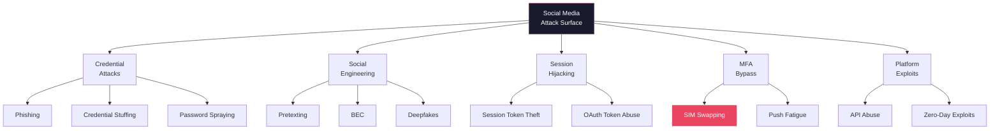
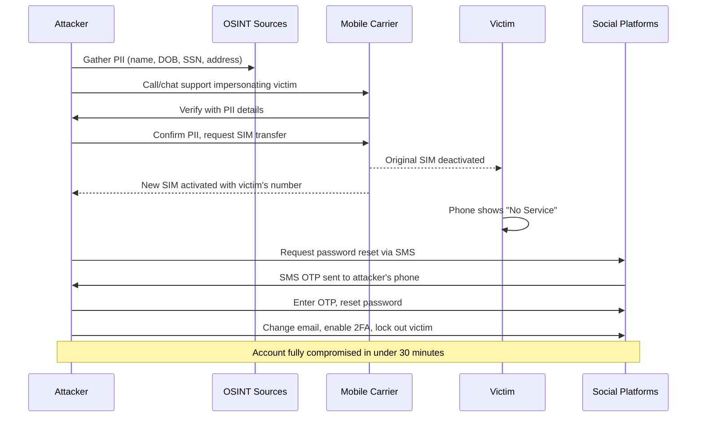

# Chapter 21: Social Media Security & Account Takeover Prevention

> **Prereq:** Chapters 1-2 (Fundamentals, Cryptography) — authentication concepts, encryption, MFA
> **Next:** None — capstone chapter
> **Target Audience:** All users, security-conscious individuals, SOC analysts, digital forensics investigators

---

## Learning Objectives

By the end of this chapter, you will be able to:
1. Identify and classify 12+ modern account takeover attack techniques across social engineering, technical exploitation, and physical methods.
2. Perform a full forensic investigation of a compromised Instagram/Twitter/LinkedIn account using platform-specific evidence sources.
3. Implement a multi-layered defense strategy combining 2FA, hardware security keys, password managers, and OPSEC.
4. Create a personal incident response playbook for account compromise with SLA-driven recovery steps.
5. Analyze real-world attack case studies (Twitter 2020 Bitcoin scam, Telegram OAuth hijacking, SIM swap rings) with root cause mapping.
6. Deploy monitoring tools for credential leaks, session hijacking detection, and dark web exposure alerts.
7. Build a TypeScript-based account security scanner and threat detection engine.

<!-- Image Gallery -->
<section class="lesson-visuals" aria-label="Visual learning resources">
  <header><span>VISUAL LEARNING</span><h2>See it. Review it. Remember it.</h2></header>
  <a class="lesson-visual-card" href="../../assets/images/lessons/cyber-security/21-social-media-security/handwritten-notes.png" target="_blank" rel="noopener">
    
    <span><strong>Handwritten notes</strong>Condensed notes for deliberate review.</span>
  </a>
  <a class="lesson-visual-card" href="../../assets/images/lessons/cyber-security/21-social-media-security/sticky-notes.png" target="_blank" rel="noopener">
    
    <span><strong>Sticky-note revision</strong>Fast recall prompts for revision.</span>
  </a>
  <a class="lesson-visual-card" href="../../assets/images/lessons/cyber-security/21-social-media-security/visual-explanation.png" target="_blank" rel="noopener">
    
    <span><strong>Visual concept guide</strong>A connected explanation of the key ideas.</span>
  </a>
</section>
<!-- End Image Gallery -->

---

## Chapter at a Glance



| Section | Key Concept | Why It Matters |
|---------|-------------|----------------|
| Account Takeover Attack Taxonomy | 12 attack vectors classified by method | Know your enemy — every attack exploits one of these |
| Social Engineering Deep Dive | Phishing, spear phishing, vishing, SMiShing, deepfakes | 82% of breaches involve the human element |
| Credential Attacks | Stuffing, spraying, password reuse, hash cracking | Your password is likely already compromised |
| Session Hijacking & MFA Bypass | Cookie theft, OAuth abuse, MFA fatigue, SIM swap | Passwords alone are useless; MFA alone is not enough |
| SIM Swapping | Social engineering mobile carriers, insider threats | The most devastating personal attack vector |
| Platform-Specific Forensics | Instagram, Twitter/X, Facebook, LinkedIn, Google, Apple | Each platform leaves different forensic breadcrumbs |
| Investigation Toolkit | TypeScript forensics engine, log parsers, session analyzers | Automated evidence collection saves hours |
| Personal Defense Architecture | Password managers, hardware keys, OPSEC, recovery codes | A complete system for account security |
| Incident Response Playbook | Step-by-step recovery with SLAs for each platform | You need a plan BEFORE you get hacked |
| Case Studies | Twitter 2020, Telegram OAuth, SIM swap rings | Real attacks reveal real weaknesses |

---

## 1. Account Takeover Attack Taxonomy

Account takeover (ATO) attacks fall into six categories. Every real-world attack uses one or more of these vectors.

```
ACCOUNT TAKEOVER ATTACK CLASSIFICATION
═══════════════════════════════════════════════════
├── 1. CREDENTIAL-BASED (52% of ATO)
│   ├── Credential Stuffing — leaked passwords reused across services
│   ├── Password Spraying — common passwords against many accounts
│   ├── Brute Force — systematic guessing with rate-limit bypass
│   └── Credential Phishing — fake login pages harvesting passwords
│
├── 2. SOCIAL ENGINEERING (24%)
│   ├── Spear Phishing — targeted emails impersonating support
│   ├── Vishing — phone calls pretending to be security team
│   ├── SMiShing — SMS with malicious links
│   └── Deepfake Voice/Video — AI-generated identity theft
│
├── 3. SESSION-BASED (12%)
│   ├── Session Hijacking — stealing cookies/tokens from browser
│   ├── OAuth Abuse — malicious third-party app authorization
│   └── Token Replay — captured authentication tokens reused
│
├── 4. MFA CIRCUMVENTION (7%)
│   ├── MFA Fatigue — spamming push notifications until user accepts
│   ├── SIM Swap — attacker ports your number to their SIM
│   ├── Backup Code Theft — recovery codes stolen from email/cloud
│   └── SS7 Exploit — intercepting SMS 2FA at protocol level
│
├── 5. SESSION FIXATION (3%)
│   ├── Attacker sets a known session ID, victim authenticates with it
│   └── Rare but devastating against platforms with poor session hygiene
│
└── 6. PHYSICAL (2%)
    ├── Device Theft — unlocked phone with saved sessions
    └── Shoulder Surfing — observing password/PIN entry in public
```

**Attack Vector Severity Matrix:**

| Attack | Difficulty | Detectability | Impact | Frequency | Prevention |
|--------|------------|---------------|--------|-----------|------------|
| Credential Stuffing | Low | Medium | High | Very High | Password Manager + 2FA |
| Phishing | Medium | Low | Very High | High | Hardware Key (FIDO2) |
| SIM Swap | Medium | Low | Critical | Medium | Carrier PIN + Google Voice |
| MFA Fatigue | Low | Low | High | Growing | Number Matching + Rate Limit |
| Session Hijacking | High | Very Low | Critical | Low | Session Binding + HTTPS Only |
| OAuth Abuse | Low | Low | High | Medium | Review Apps Monthly |
| Deepfake | Very High | Very Low | Critical | Low | Verification Code Word |
| SS7 Exploit | Very High | Low | Critical | Very Low | App-based 2FA, not SMS |

---

## 2. Social Engineering Deep Dive

### 2.1 Phishing — The #1 Account Takeover Vector

Phishing accounts for **82% of breaches** involving a human element (Verizon DBIR 2024). Modern phishing is no longer obvious — attackers use cloned login pages, real SSL certificates, and urgency tactics.

**Modern Phishing Techniques:**

| Technique | Description | Detection |
|-----------|-------------|-----------|
| **Clone Phishing** | Legitimate email cloned, link replaced with malicious URL | Compare headers, check sender domain carefully |
| **Spear Phishing** | Highly personalized using OSINT about the target | Unusual request even from known contacts |
| **Whaling** | Targeting executives/C-suite with fake legal/financial emails | Verify via separate channel before acting |
| **SMiShing** | SMS with fake security alert + link | Never click links in SMS — use app directly |
| **Vishing** | Phone call impersonating support asking for verification code | Hang up, call back on official number |
| **Angler Phishing** | Fake customer support accounts on social media replying to complaints | Check verified badge, official website links |
| **Quid Pro Quo** | Attacker offers a service in exchange for credentials | No legitimate service asks for your password |
| **Watering Hole** | Compromising a site the target regularly visits | Use ad-blockers, script blockers, keep software updated |

**Phishing Detection Algorithm — TypeScript:**

```typescript
// phish-detector.ts — URL and Email Phishing Detection Engine

interface EmailMessage {
  from: string;
  fromDomain: string;
  replyTo: string;
  returnPath: string;
  subject: string;
  body: string;
  links: string[];
  headers: Record<string, string>;
  attachments: Attachment[];
}

interface Attachment {
  filename: string;
  extension: string;
  size: number;
}

interface PhishingScore {
  totalScore: number; // 0-100
  risk: 'safe' | 'suspicious' | 'high' | 'critical';
  factors: PhishingFactor[];
}

interface PhishingFactor {
  name: string;
  score: number; // 0-100
  detail: string;
}

class PhishingDetector {
  private readonly KNOWN_BRANDS = new Map<string, string[]>([
    ['instagram', ['instagram.com', 'cdninstagram.com', 'ig.me']],
    ['facebook', ['facebook.com', 'fb.com', 'fbcdn.net']],
    ['google', ['google.com', 'gmail.com', 'youtube.com', 'accounts.google.com']],
    ['twitter', ['twitter.com', 'x.com', 't.co']],
    ['linkedin', ['linkedin.com', 'licdn.com']],
    ['apple', ['apple.com', 'icloud.com']],
    ['microsoft', ['microsoft.com', 'live.com', 'outlook.com', 'office365.com']],
    ['paypal', ['paypal.com', 'paypalobjects.com']],
  ]);

  private readonly SUSPICIOUS_TLDS = new Set([
    '.tk', '.ml', '.ga', '.cf', '.gq', '.xyz', '.top', '.club',
    '.work', '.bid', '.date', '.men', '.loan', '.download',
  ]);

  private readonly PHISHING_KEYWORDS = [
    'verify', 'verification', 'account', 'suspended', 'limited',
    'unauthorized', 'unusual', 'login', 'sign in', 'password',
    'credential', 'security alert', 'urgent', 'immediate action',
    'confirm your', 'update your', 'reactivate', 'restore',
    'unlock', 'unauthorized login', 'suspicious activity',
  ];

  analyzeEmail(email: EmailMessage): PhishingScore {
    const factors: PhishingFactor[] = [];
    let totalScore = 0;

    // Factor 1: Sender domain mismatch
    const senderFactor = this.checkSenderDomain(email);
    factors.push(senderFactor);
    totalScore += senderFactor.score;

    // Factor 2: Reply-to mismatch
    const replyFactor = this.checkReplyTo(email);
    factors.push(replyFactor);
    totalScore += replyFactor.score;

    // Factor 3: Link domain analysis
    const linkFactor = this.checkLinks(email);
    factors.push(linkFactor);
    totalScore += linkFactor.score;

    // Factor 4: Suspicious keywords in subject/body
    const keywordFactor = this.checkKeywords(email);
    factors.push(keywordFactor);
    totalScore += keywordFactor.score;

    // Factor 5: Urgency indicators
    const urgencyFactor = this.checkUrgency(email);
    factors.push(urgencyFactor);
    totalScore += urgencyFactor.score;

    // Factor 6: Attachment risk
    const attachmentFactor = this.checkAttachments(email);
    factors.push(attachmentFactor);
    totalScore += attachmentFactor.score;

    // Factor 7: SPF/DKIM/DMARC auth results
    const authFactor = this.checkEmailAuth(email);
    factors.push(authFactor);
    totalScore += authFactor.score;

    // Normalize to 0-100
    totalScore = Math.min(Math.round(totalScore / 7), 100);

    return {
      totalScore,
      risk: totalScore >= 70 ? 'critical' : totalScore >= 50 ? 'high' : totalScore >= 30 ? 'suspicious' : 'safe',
      factors,
    };
  }

  private checkSenderDomain(email: EmailMessage): PhishingFactor {
    for (const [brand, domains] of this.KNOWN_BRANDS) {
      // Check if email claims to be from a brand but domain doesn't match
      if (email.body.toLowerCase().includes(brand) || email.subject.toLowerCase().includes(brand)) {
        const isLegitimateDomain = domains.some(d => email.fromDomain === d || email.fromDomain.endsWith('.' + d));
        if (!isLegitimateDomain) {
          return {
            name: 'Sender Domain Mismatch',
            score: 90,
            detail: `Claims to be from ${brand} but sent from ${email.fromDomain}`,
          };
        }
      }
    }

    // Check for lookalike domains (homograph attack)
    const lookalike = this.detectLookalikeDomain(email.fromDomain);
    if (lookalike) {
      return {
        name: 'Lookalike Domain',
        score: 95,
        detail: `Domain ${email.fromDomain} mimics ${lookalike}`,
      };
    }

    // Check suspicious TLDs
    if (this.SUSPICIOUS_TLDS.has('.' + email.fromDomain.split('.').pop())) {
      return {
        name: 'Suspicious TLD',
        score: 60,
        detail: `Domain uses suspicious TLD: ${email.fromDomain}`,
      };
    }

    return { name: 'Sender Domain', score: 0, detail: 'Domain appears legitimate' };
  }

  private detectLookalikeDomain(domain: string): string | null {
    // Homograph detection — replaces lookalike characters
    const homographMap: Record<string, string> = {
      '0': 'o', '1': 'l', '3': 'e', '4': 'a', '5': 's',
      '7': 't', '8': 'b', '@': 'a', 'rn': 'm', 'rn': 'm',
    };
    const normalized = domain.toLowerCase();

    for (const [brand, domains] of this.KNOWN_BRANDS) {
      for (const legitDomain of domains) {
        let normalizedLegit = legitDomain;
        for (const [char, replacement] of Object.entries(homographMap)) {
          normalizedLegit = normalizedLegit.replaceAll(char, replacement);
        }
        let normalizedDomain = normalized;
        for (const [char, replacement] of Object.entries(homographMap)) {
          normalizedDomain = normalizedDomain.replaceAll(char, replacement);
        }

        if (normalizedDomain !== normalized && normalizedDomain === normalizedLegit) {
          return legitDomain;
        }

        // Check for subdomain tricks: instagram.com.security-alert.xyz
        if (domain.includes(legitDomain.replace('.', '\\.')) && !domain.endsWith(legitDomain)) {
          return legitDomain;
        }
      }
    }
    return null;
  }

  private checkReplyTo(email: EmailMessage): PhishingFactor {
    if (email.replyTo && email.replyTo !== email.from) {
      return {
        name: 'Reply-To Mismatch',
        score: 70,
        detail: `Reply-To (${email.replyTo}) differs from From (${email.from})`,
      };
    }
    return { name: 'Reply-To', score: 0, detail: 'Reply-To matches sender' };
  }

  private checkLinks(email: EmailMessage): PhishingFactor {
    let suspiciousCount = 0;

    for (const link of email.links) {
      try {
        const url = new URL(link);
        // Check for IP address instead of domain
        if (/\d+\.\d+\.\d+\.\d+/.test(url.hostname)) {
          suspiciousCount += 2;
        }
        // Check for mismatched display text vs actual URL
        if (url.protocol !== 'https:') suspiciousCount++;
        // Check for encoded URLs
        if (link.includes('%')) suspiciousCount++;
        // Check for URL shorteners
        if (['bit.ly', 'tinyurl.com', 't.co', 'goo.gl', 'rb.gy', 'shorturl.at'].includes(url.hostname)) {
          suspiciousCount++;
        }
      } catch {
        suspiciousCount += 3; // Malformed URL
      }
    }

    if (suspiciousCount >= 3) {
      return {
        name: 'Suspicious Links',
        score: 85,
        detail: `${suspiciousCount} suspicious indicators in links`,
      };
    }
    if (suspiciousCount > 0) {
      return {
        name: 'Suspicious Links',
        score: 40,
        detail: `${suspiciousCount} minor suspicious link indicators`,
      };
    }
    return { name: 'Links', score: 0, detail: 'All links appear legitimate' };
  }

  private checkKeywords(email: EmailMessage): PhishingFactor {
    const text = `${email.subject} ${email.body}`.toLowerCase();
    const found = this.PHISHING_KEYWORDS.filter(k => text.includes(k.toLowerCase()));

    if (found.length >= 5) {
      return {
        name: 'Phishing Keywords',
        score: 75,
        detail: `Found ${found.length} phishing keywords: ${found.slice(0, 5).join(', ')}`,
      };
    }
    if (found.length >= 2) {
      return {
        name: 'Phishing Keywords',
        score: 30,
        detail: `Found ${found.length} phishing keywords`,
      };
    }
    return { name: 'Keywords', score: 0, detail: 'No phishing keywords detected' };
  }

  private checkUrgency(email: EmailMessage): PhishingFactor {
    const urgencyPatterns = [
      /\b(urgent|immediately|asap|right away|without delay)\b/i,
      /\b(24 hours|48 hours|within 24|expires?|deadline)\b/i,
      /\b(action required|response required|must respond)\b/i,
      /\b(final warning|last notice|account will be (closed|suspended|deleted|terminated))\b/i,
      /❗|⚠️|🔴|🚨|🔐/,
    ];

    const urgencyCount = urgencyPatterns.filter(p => p.test(`${email.subject} ${email.body}`)).length;

    if (urgencyCount >= 3) {
      return {
        name: 'Urgency Pressure',
        score: 70,
        detail: `High urgency pressure detected (${urgencyCount} indicators)`,
      };
    }
    if (urgencyCount >= 1) {
      return {
        name: 'Urgency Pressure',
        score: 20,
        detail: `Some urgency indicators found`,
      };
    }
    return { name: 'Urgency', score: 0, detail: 'No urgency pressure' };
  }

  private checkAttachments(email: EmailMessage): PhishingFactor {
    const dangerousExtensions = new Set(['.exe', '.msi', '.bat', '.cmd', '.vbs', '.ps1', '.scr', '.jar', '.js', '.wsf']);

    if (email.attachments.length === 0) {
      return { name: 'Attachments', score: 0, detail: 'No attachments' };
    }

    for (const att of email.attachments) {
      if (dangerousExtensions.has(att.extension.toLowerCase())) {
        return {
          name: 'Dangerous Attachment',
          score: 90,
          detail: `Attachment ${att.filename} is an executable type`,
        };
      }
      // Office documents with macros
      if (['.docm', '.xlsm', '.pptm'].includes(att.extension.toLowerCase())) {
        return {
          name: 'Macro-Enabled Document',
          score: 70,
          detail: `Attachment ${att.filename} may contain macros`,
        };
      }
      // Archived executables
      if (['.zip', '.rar', '.7z'].includes(att.extension.toLowerCase())) {
        return {
          name: 'Archived Attachment',
          score: 30,
          detail: 'Archive files can contain malicious payloads',
        };
      }
    }

    return { name: 'Attachments', score: 0, detail: 'No dangerous attachments' };
  }

  private checkEmailAuth(email: EmailMessage): PhishingFactor {
    const authResults = email.headers['authentication-results'] || '';
    const spfPass = authResults.includes('spf=pass');
    const dkimPass = authResults.includes('dkim=pass');
    const dmarcPass = authResults.includes('dmarc=pass');

    if (!spfPass && !dkimPass && !dmarcPass) {
      return {
        name: 'Email Authentication Failed',
        score: 85,
        detail: 'SPF, DKIM, and DMARC all failed — email may be spoofed',
      };
    }
    if (!dmarcPass) {
      return {
        name: 'DMARC Failed',
        score: 50,
        detail: 'DMARC policy check failed — domain may be impersonated',
      };
    }
    return { name: 'Email Auth', score: 0, detail: 'SPF, DKIM, DMARC passed' };
  }
}

// ─── Instagram-Specific Phishing Detection ───

class InstagramPhishDetector extends PhishingDetector {
  private readonly INSTAGRAM_PHISHING_PATTERNS = [
    // Fake login pages
    /instagram[^\.]*\.(tk|ml|ga|cf|gq|xyz|top|club)/i,
    // Common phishing URL patterns
    /instagram.*(?:verify|login|auth|secure|confirm)/i,
    /instagram.*(?:challenge|restricted|violation|copyright)/i,
    // Fake support emails
    /support@.*instagram.*(?!\.com)/i,
    /instagram.*help.*center/i,
    // Verification scams
    /verified|verification.*badge|blue.*tick/i,
    // Fake giveaway
    /winner|giveaway|congratulations.*selected|free.*followers/i,
  ];

  analyzeInstagramSpecific(url: string, senderEmail: string): PhishingFactor[] {
    const factors: PhishingFactor[] = [];

    // Check URL
    for (const pattern of this.INSTAGRAM_PHISHING_PATTERNS) {
      if (pattern.test(url)) {
        factors.push({
          name: 'Instagram Phishing Pattern',
          score: 95,
          detail: `URL matches known Instagram phishing pattern: ${pattern}`,
        });
      }
    }

    // Check sender
    if (senderEmail && !senderEmail.endsWith('@instagram.com') && !senderEmail.endsWith('@support.instagram.com') && !senderEmail.endsWith('@mail.instagram.com') && !senderEmail.endsWith('@facebook.com')) {
      factors.push({
        name: 'Non-Instagram Sender',
        score: 80,
        detail: `Official Instagram emails come from @instagram.com, @support.instagram.com, or @mail.instagram.com, not ${senderEmail.split('@')[1] || 'unknown'}`,
      });
    }

    return factors;
  }
}
```

### 2.2 Pretexting — Building a Believable Cover Story

Pretexting is the most sophisticated form of social engineering because the attacker creates an entire fictional scenario (the "pretext") to manipulate the target. Unlike a simple phishing email, pretexting involves research, role-playing, and multiple interaction points.

**The Pretexting Playbook:**

```
PRETEXTING FRAMEWORK
═══════════════════════════════════════════════════
STEP 1: TARGET SELECTION
  └── Identify high-value target (executive, IT admin, finance)
  └── Gather OSINT: LinkedIn, Facebook, Instagram, Twitter, company website

STEP 2: PRETEXT CONSTRUCTION
  └── Choose role: IT support, vendor, auditor, recruiter, journalist
  └── Create backstory based on target's context
  └── Prepare documents: fake ID, fake ticket number, fake company email

STEP 3: CONTACT ESTABLISHMENT
  └── First touch: low-stakes request (survey, calendar invite)
  └── Build rapport over multiple interactions (days/weeks)
  └── Use name-dropping: "I was just talking to [manager's name]"

STEP 4: INFORMATION EXTRACTION
  └── Escalate requests progressively
  └── Each request is reasonable on its own
  └── Exploit authority: "CEO needs this done urgently"

STEP 5: COVER CLOSURE
  └── Thank target profusely
  └── Leave behind plausible deniability
  └── Cover tracks: delete emails, fake account deactivation
```

**Real Pretexting Scripts:**

| Scenario | Attacker Role | Script Example | Psychological Lever |
|----------|--------------|----------------|-------------------|
| **IT Support** | Help desk calling about "suspicious login" | "Hi [Name], this is Mark from IT Security. We detected an unusual login attempt from Russia at 3 AM. I need to verify your account — can you confirm your username and the last password you remember?" | Fear + Authority |
| **Vendor Auditor** | Third-party security auditor | "I'm conducting our quarterly vendor security audit. Your CEO signed the authorization. I need your VPN credentials and a list of all internal systems you have access to." | Authority + Legitimacy |
| **Recruiter** | Headhunter with "amazing opportunity" | "Hi [Name], I found your profile on LinkedIn. I'm recruiting for a Director role at [Competitor]. Before I share details, I need to verify your background — what projects have you worked on recently?" | Greed + Ego |
| **Journalist** | Reporter writing about the company | "I'm doing a feature on [Company] for Forbes. Your CEO recommended I speak with you. Can you walk me through your team structure and the tools you use?" | Flattery + Authority |
| **Fake Customer** | Angry customer demanding resolution | "I've been trying to get my account fixed for THREE WEEKS. Your support is useless. I want a supervisor NOW or I'm posting this on Twitter." | Anger + Time Pressure |

### 2.3 Business Email Compromise (BEC) & CEO Fraud

BEC is the most financially damaging social engineering attack — the FBI reports **$50+ billion in losses** since 2013. Unlike phishing (casting a wide net), BEC is surgical, targeting specific individuals with specific roles.

**BEC Attack Types:**

| Type | Description | Example | Average Loss |
|------|-------------|---------|-------------|
| **CEO Fraud** | Attacker impersonates CEO requesting urgent wire transfer | "I'm in a meeting, need $50K wired to vendor immediately" | $130,000 |
| **Invoice Fraud** | Fake invoice from legitimate-looking vendor with updated bank details | "Our banking information has changed, please pay next invoice to new account" | $85,000 |
| **Account Compromise** | Real employee email account is hacked, used to request payments | "HR Director's actual email sends W-2 requests to all employees" | $100,000 |
| **Attorney Impersonation** | Fake lawyer about "time-sensitive legal matter" | "This is a confidential legal matter requiring immediate funds transfer" | $200,000 |
| **Data Theft** | HR impersonated to steal W-2 data for tax fraud | "I need all employee W-2s for annual audit by Friday" | $50,000 (per 1000 employees) |

**BEC Attack Chain — TypeScript:**

```typescript
// bec-detector.ts — Business Email Compromise Detection Engine

interface EmailContext {
  senderEmail: string;
  senderDomain: string;
  senderName: string;
  recipientEmail: string;
  recipientRole: string;
  subject: string;
  body: string;
  urgency: number; // 0-100
  containsWireTransfer: boolean;
  containsInvoice: boolean;
  containsPII: boolean;
  hasExternalReplyTo: boolean;
  replyToDomain: string;
  ipOrigin: string;
  previousEmails: PreviousEmail[];
  timeSinceLastContact: number; // days
}

interface PreviousEmail {
  sender: string;
  date: Date;
  subject: string;
}

interface BECRiskScore {
  score: number; // 0-100
  risk: 'low' | 'medium' | 'high' | 'critical';
  indicators: string[];
  recommendedAction: 'allow' | 'warn' | 'block' | 'verify_out_of_band';
}

class BECDetector {
  private readonly EXECUTIVE_TITLES = ['CEO', 'CFO', 'COO', 'CTO', 'President', 'VP', 'Director', 'Controller'];
  private readonly FINANCE_ROLES = ['accounting', 'finance', 'accounts payable', 'controller', 'treasury'];

  detect(email: EmailContext): BECRiskScore {
    const indicators: string[] = [];
    let score = 0;

    // 1. Financial request to non-executive
    if (email.containsWireTransfer || email.containsInvoice) {
      score += 25;
      indicators.push('Email contains wire transfer or invoice request');
    }

    // 2. External sender pretending to be executive
    const senderLooksExecutive = this.EXECUTIVE_TITLES.some(t => email.senderName.includes(t));
    if (senderLooksExecutive && !this.isInternalDomain(email.senderDomain)) {
      score += 30;
      indicators.push(`External sender claims to be ${email.senderName} but domain is ${email.senderDomain}`);
    }

    // 3. Reply-To domain mismatch
    if (email.replyToDomain && email.replyToDomain !== email.senderDomain) {
      score += 25;
      indicators.push(`Reply-To (${email.replyToDomain}) differs from sender (${email.senderDomain})`);
    }

    // 4. High urgency + financial request
    if (email.urgency > 70 && (email.containsWireTransfer || email.containsInvoice)) {
      score += 20;
      indicators.push('High urgency paired with financial request — common BEC tactic');
    }

    // 5. PII harvesting attempt
    if (email.containsPII) {
      score += 30;
      indicators.push('Email requests personally identifiable information (W-2, SSN, bank details)');
    }

    // 6. No previous relationship
    const hasPriorContact = email.previousEmails.some(e => e.sender === email.senderEmail);
    if (!hasPriorContact) {
      score += 15;
      indicators.push('No prior email history with this sender');
    }

    // 7. Time pressure phrases
    const pressurePhrases = /\b(urgent|immediately|asap|today|end of day|right now|past due|overdue)\b/gi;
    const pressureMatch = email.body.match(pressurePhrases);
    if (pressureMatch && pressureMatch.length > 2) {
      score += 15;
      indicators.push(`Time pressure language: "${pressureMatch.slice(0, 3).join(', ')}"`);
    }

    // 8. Recipient in finance/accounting
    const recipientIsFinance = this.FINANCE_ROLES.some(r => email.recipientRole.toLowerCase().includes(r));
    if (recipientIsFinance && email.containsWireTransfer) {
      score += 20;
      indicators.push(`Finance role targeted with wire transfer request`);
    }

    // 9. Domain impersonation
    const impersonated = this.detectDomainImpersonation(email.senderDomain);
    if (impersonated) {
      score += 35;
      indicators.push(`Domain ${email.senderDomain} impersonates ${impersonated}`);
    }

    return {
      score: Math.min(score, 100),
      risk: score >= 60 ? 'critical' : score >= 40 ? 'high' : score >= 20 ? 'medium' : 'low',
      indicators,
      recommendedAction: score >= 60 ? 'block' : score >= 40 ? 'verify_out_of_band' : score >= 20 ? 'warn' : 'allow',
    };
  }

  private isInternalDomain(domain: string): boolean {
    // In production: check against company's domain list
    return false;
  }

  private detectDomainImpersonation(domain: string): string | null {
    // Check for typosquatted domains: goog1e.com, micr0soft.com
    const lookalikeMap: Record<string, string[]> = {
      'company.com': ['cornpany.com', 'c0mpany.com', 'company.co', 'cornpany.net'],
    };

    for (const [real, variants] of Object.entries(lookalikeMap)) {
      if (variants.includes(domain.toLowerCase())) {
        return real;
      }
    }
    return null;
  }
}
```

### 2.4 OSINT Reconnaissance — How Attackers Research You

Before any targeted attack, the attacker spends time gathering information (Open Source INTelligence). Everything you post publicly is ammunition.

**OSINT Sources for Account Takeover:**

| Source | What Attackers Find | Why It's Dangerous |
|--------|--------------------|-------------------|
| **LinkedIn** | Job title, employer, email format, colleagues, skills | Enables spear phishing with context ("saw you work on X project") |
| **Facebook** | Full name, DOB, family members, pets, hometown, school | Security questions: "mother's maiden name", "first pet", "elementary school" |
| **Instagram** | Location tags, travel plans, device type (from story quality), friends | SIM swap timing (attack when you're traveling), relationship mapping |
| **Twitter/X** | Tech stack, tools used, third-party services, work habits | Tech support pretexting using actual tools you use |
| **GitHub** | Email addresses, personal projects, work schedule, API keys in commits | Direct credential theft from leaked API keys/env files |
| **WhatsApp/Telegram** | Profile photo, last seen, phone number | Phone number used for SIM swap pretext |
| **Discord** | Gaming habits, friend groups, voice chat patterns | Social engineering through trusted communities |
| **Strava/Fitness** | Running routes, home location, schedule | Physical attacks, knowing when you're away from home |
| **Venmo/Zelle** | Transaction patterns, contacts, public notes | Financial pretexting with real transaction references |
| **Data Breaches** | Passwords, emails, phone numbers, credit cards | Credential stuffing across ALL your services |

**OSINT Reconnaissance Toolchain (What Attackers Use):**

| Tool | Purpose | How Attackers Use It |
|------|---------|---------------------|
| **theHarvester** | Email & domain enumeration | Find all email addresses associated with your domain |
| **Sherlock** | Username search across 400+ platforms | Map your single username across all social networks |
| **Holmes** | Cross-platform identity correlation | Link your profiles across platforms by same person matching |
| **Google Dorking** | Advanced search operators | Find exposed files, documents, and information on your domain |
| **Maltego** | Relationship mapping | Visual graph of your connections, organizations, and infrastructure |
| **Shodan** | Internet-connected device search | Find exposed cameras, servers, and IoT devices you own |
| **Have I Been Pwned** | Breach database search | Find your leaked passwords from known breaches |
| **SpiderFoot** | Automated OSINT collection | Automatically gather 200+ data points about you or your domain |

**OSINT Self-Defense Checklist:**

```
OSINT REDUCTION CHECKLIST
═══════════════════════════════════════════════════
□ Remove DOB from all social media profiles
□ Remove hometown, high school, college from public profiles
□ Change pet names, mother's maiden name to FICTIONAL answers
□ Set LinkedIn visibility to "Only Connections" for profile details
□ Make Instagram private + remove location tags
□ Make Twitter archive old tweets + delete location metadata
□ Remove personal info from GitHub commits (name, email)
□ Disable Strava/Fitness public activity
□ Make Venmo/Zelle transactions private
□ Remove yourself from people-search sites (BeenVerified, Whitepages, Spokeo)
□ Use different usernames across platforms (don't link them)
□ Delete unused accounts (they become breach targets)
□ Never post travel plans in real-time (post AFTER returning)
```

### 2.5 Deepfake Social Engineering — The AI-Powered Threat

Deepfakes take social engineering to a new level by using AI to impersonate someone's voice or appearance. This is now accessible to any attacker — no longer just nation-states.

**Deepfake Attack Types:**

| Type | Technology | Realism | Cost | Example |
|------|-----------|---------|------|---------|
| **Voice Cloning** | 3-second audio sample → full voice model | 95%+ | Free-$10 | "Call from CEO" requesting wire transfer |
| **Video Deepfake** | 30-second video → full lip-sync | 90%+ | $50-$500 | "Zoom call from CFO" confirming payment |
| **Real-Time Voice** | Live voice modifier on phone calls | 85%+ | $100-$500 | "Call from family member" in distress |
| **Image Deepfake** | Face swap on ID documents | 95%+ | Free | Fake passport/driver's license for SIM swap |
| **Text Generation** | LLM writing emails in target's style | 95%+ | Free | "Help me, I lost my phone" text from "friend" |

**Famous Deepfake Attacks:**

| Year | Target | Technique | Loss | Details |
|------|--------|-----------|------|---------|
| 2019 | UK Energy Firm CEO | Voice cloning | $243,000 | CEO's voice cloned via TED talk audio; caller impersonated CEO requesting transfer |
| 2020 | UAE Bank Manager | Voice deepfake | $35 million | Attacker used voice cloning to impersonate a company director authorizing transfers |
| 2023 | US School Principal | Racist audio deepfake | Arrested | Principal falsely accused of racist comments via AI-generated audio — caused riots, death threats |
| 2024 | HK Multinational Finance | Video deepfake meeting | $25 million | Employee attended video call where EVERY participant was a deepfake — approved $25M transfer |
| 2024 | Indian Journalist | Voice deepfake | Reputation destroyed | Fake call from "colleague" discussing corruption — recorded and leaked |

**Deepfake Detection — TypeScript:**

```typescript
// deepfake-detector.ts — AI-Powered Social Engineering Detection

interface VoiceCallData {
  callerNumber: string;
  callerName: string;
  claimedIdentity: string;
  requestType: 'wire_transfer' | 'password_reset' | 'personal_info' | 'emergency_money';
  urgency: 'low' | 'medium' | 'high' | 'critical';
  knownNumber: boolean;
  // Audio analysis fields (from ML model)
  audioAnomalyScore: number; // 0-100, higher = more likely deepfake
  audioDuration: number; // seconds
}

interface DeepfakeResponse {
  isSuspicious: boolean;
  confidence: number;
  riskFactors: string[];
  recommendedAction: string;
}

class DeepfakeSocialEngineeringDetector {
  detectVoiceAttack(call: VoiceCallData): DeepfakeResponse {
    const riskFactors: string[] = [];
    let risk = 0;

    // 1. Unknown number claiming to be known person
    if (!call.knownNumber && call.claimIdentity !== 'unknown') {
      risk += 25;
      riskFactors.push(`Unknown number claiming to be ${call.claimIdentity}`);
    }

    // 2. High urgency + financial request
    if (call.urgency === 'critical' && 
        (call.requestType === 'wire_transfer' || call.requestType === 'emergency_money')) {
      risk += 30;
      riskFactors.push('High urgency financial request — classic vishing pattern');
    }

    // 3. Audio anomaly detected (from ML model)
    if (call.audioAnomalyScore > 70) {
      risk += 35;
      riskFactors.push(`Audio analysis indicates ${call.audioAnomalyScore}% likelihood of synthetic voice`);
    }

    // 4. Password reset request
    if (call.requestType === 'password_reset') {
      risk += 20;
      riskFactors.push('Call requesting password reset — no legitimate service does this');
    }

    // 5. Very short audio sample
    if (call.audioDuration < 10 && call.audioAnomalyScore > 50) {
      risk += 15;
      riskFactors.push('Short audio duration + high anomaly score = likely deepfake');
    }

    const isSuspicious = risk >= 50;
    return {
      isSuspicious,
      confidence: Math.min(risk, 100),
      riskFactors,
      recommendedAction: isSuspicious
        ? 'HANG UP IMMEDIATELY. Verify identity by calling back on a known, trusted number.'
        : 'No deepfake indicators detected. But always verify sensitive requests out-of-band.',
    };
  }

  deepfakePreventionRules(): string[] {
    return [
      'Establish a family/business CODE WORD — verify identity by asking for it',
      'Hang up and call back on a known number — never trust incoming caller ID',
      'For wire transfers: require TWO-PERSON approval with in-person verification',
      'For urgent requests: require video call with known movement (wave hand, turn head)',
      'Store voice samples of family/business leaders for comparison',
      'Use a secret verification phrase: "What did we talk about last Tuesday?"',
    ];
  }
}
```

### 2.6 The Psychology of Social Engineering — Cialdini's 6 Principles

Every social engineering attack exploits one or more of Dr. Robert Cialdini's 6 principles of persuasion. Understanding these principles makes you immune to manipulation.

| Principle | Description | How Attackers Use It | Defense |
|-----------|-------------|---------------------|---------|
| **Reciprocity** | People feel obligated to return favors | Attacker sends a "gift" (free report, coffee card) then asks for "a small favor" | Recognize when a favor comes with strings attached |
| **Scarcity** | People want what's limited/rare | "Only 2 hours left to verify your account" "Limited spots for the security upgrade" | Scarcity + urgency = manipulation. Slow down. |
| **Authority** | People obey authority figures | "I'm calling from the Security Department" "This is the CEO's office" | Verify authority independently. Call the official number. |
| **Consistency** | People stick with their commitments | "You agreed to the security policy, now you must install this software" | Your past commitment doesn't require blind obedience |
| **Liking** | People say yes to those they like | Attacker researches your interests: "I love your photography!" | Be aware that flattery can be manipulation |
| **Social Proof** | People follow what others do | "All your coworkers have already completed the training" "1,000 people fell for this" | Popularity ≠ legitimacy. Verify independently. |

**The Dark Triad in Social Engineering:**

Attackers who excel at social engineering typically exhibit three personality traits:

| Trait | Description | How It Helps Attackers |
|-------|-------------|----------------------|
| **Narcissism** | Grandiose sense of self-importance | Confident enough to cold-call and pressure targets |
| **Machiavellianism** | Manipulative, cynical, strategic | Plans pretexts meticulously, exploits vulnerabilities ruthlessly |
| **Psychopathy** | Lack of empathy, callousness | No guilt about ruining someone's life or financial security |

**Psychological Defense — The S.T.O.P. Framework:**

```
S — SLOW DOWN
  Attackers create urgency to bypass your rational brain.
  Take 3 deep breaths before responding to any urgent request.

T — THINK
  "Does this make sense? Why would [platform] ask ME for MY password?"
  Examine the request logically, not emotionally.

O — OBSERVE
  Look for inconsistencies: wrong domain, strange phrasing, mismatched details.
  Your subconscious often detects anomalies before your conscious mind does.

P — PROCEED WITH CAUTION
  If anything feels off, VERIFY OUT-OF-BAND.
  Call the official number. Open a new browser tab (don't click the link).
```

### 2.7 Social Engineering Countermeasures

**For Individuals:**

| Countermeasure | How It Stops Attacks |
|----------------|---------------------|
| **Verify out-of-band** | Call the person on a known number, not the one in the email |
| **Use hardware security keys** | FIDO2/U2F keys cannot be phished — they bind to the real domain |
| **Check URLs before clicking** | Hover over links, examine the actual domain, not the display text |
| **Enable DMARC rejection** | Configure email to reject messages that fail DMARC (p=reject) |
| **Use a password manager** | It auto-fills only on the correct domain — won't fill on phishing sites |
| **Code word** | Establish a secret code word with family for phone verification |
| **Slow down** | Attackers create urgency — pause and verify independently |

**For Organizations:**

| Control | Implementation |
|---------|---------------|
| **DMARC Reject Policy** | `p=reject` in DNS TXT record — prevents domain spoofing |
| **BIMI** | Brand Indicators for Message Identification — display verified logos |
| **Phishing Simulation** | Regular simulated phishing campaigns with training |
| **Security Key Enforcement** | Mandate FIDO2 hardware keys for all employees |
| **Report Button** | Easy one-click phish reporting integrated into email client |
| **Take-Down Service** | Commercial service that identifies and shuts down lookalike domains |

---

## 3. Credential Attacks

### 3.1 Credential Stuffing — The Reuse Epidemic

**How it works:** Attackers take username/password pairs from data breaches and try them on other services. With 10+ billion credentials available in public breach databases, most accounts have been tested.

**The Scale:**
- Average person uses **191 services** but only **25 unique passwords**
- **65%** of people reuse passwords across multiple sites
- A single breach can expose credentials that work on 3-5 other services
- **8 billion** credential pairs available in public paste sites (2024)

**Credential Stuffing Prevention — TypeScript:**

```typescript
// credential-stuffing-prevention.ts — Detect and Block Credential Stuffing

interface LoginAttempt {
  timestamp: Date;
  ip: string;
  username: string;
  password: string;
  userAgent: string;
  success: boolean;
  country: string;
  isp: string;
}

interface StuffingDetectionResult {
  isAttack: boolean;
  confidence: number; // 0-100
  indicators: string[];
  recommendedAction: 'allow' | 'challenge' | 'block' | 'ratelimit';
}

class CredentialStuffingDetector {
  private recentAttempts: Map<string, LoginAttempt[]> = new Map();
  private readonly WINDOW_MS = 300000; // 5 minutes
  private readonly MAX_ATTEMPTS_PER_IP = 10;
  private readonly MAX_ATTEMPTS_PER_USER = 5;

  analyze(attempt: LoginAttempt): StuffingDetectionResult {
    this.trackAttempt(attempt);
    const indicators: string[] = [];
    let score = 0;

    // 1. High velocity from single IP
    const attemptsFromIP = this.getAttemptsInWindow(a => a.ip === attempt.ip);
    if (attemptsFromIP.length > this.MAX_ATTEMPTS_PER_IP) {
      score += 30;
      indicators.push(`High velocity: ${attemptsFromIP.length} attempts from ${attempt.ip} in 5min`);
    }

    // 2. Multiple different usernames from same IP
    const uniqueUsers = new Set(attemptsFromIP.map(a => a.username));
    if (uniqueUsers.size > 5) {
      score += 30;
      indicators.push(`Multiple targets: ${uniqueUsers.size} different usernames from same IP`);
    }

    // 3. All attempts failing (stuffing rarely succeeds on first try)
    const allFailed = attemptsFromIP.length > 5 && attemptsFromIP.every(a => !a.success);
    if (allFailed) {
      score += 20;
      indicators.push('Zero success rate — typical of automated stuffing');
    }

    // 4. Unusual user-agent or missing headers
    if (!attempt.userAgent || attempt.userAgent.length < 10 || attempt.userAgent.includes('curl') || attempt.userAgent.includes('python')) {
      score += 15;
      indicators.push(`Suspicious user-agent: ${attempt.userAgent || 'missing'}`);
    }

    // 5. Known breached credentials
    if (this.isKnownBreachedCredential(attempt.username, attempt.password)) {
      score += 25;
      indicators.push('Credentials found in known breach database');
    }

    // 6. High attempt rate on single user
    const userAttempts = this.getAttemptsInWindow(a => a.username === attempt.username);
    if (userAttempts.length > this.MAX_ATTEMPTS_PER_USER) {
      score += 20;
      indicators.push(`Brute force on user ${attempt.username}: ${userAttempts.length} attempts in 5min`);
    }

    // 7. Geographic anomalies
    const previousIPs = this.getAttemptsInWindow(a => a.username === attempt.username && a.ip !== attempt.ip);
    const uniqueCountries = new Set(previousIPs.map(a => a.country));
    if (uniqueCountries.size > 2) {
      score += 15;
      indicators.push(`Login attempts from ${uniqueCountries.size} different countries for same user`);
    }

    // 8. Velocity-based IP reputation
    const ipReputation = this.checkIPReputation(attempt.ip);
    if (ipReputation < 0.3) {
      score += 20;
      indicators.push(`Low IP reputation score: ${ipReputation}`);
    }

    return {
      isAttack: score >= 50,
      confidence: Math.min(score, 100),
      indicators,
      recommendedAction: score >= 70 ? 'block' : score >= 50 ? 'challenge' : score >= 30 ? 'ratelimit' : 'allow',
    };
  }

  private trackAttempt(attempt: LoginAttempt): void {
    const key = attempt.ip;
    if (!this.recentAttempts.has(key)) {
      this.recentAttempts.set(key, []);
    }
    this.recentAttempts.get(key)!.push(attempt);

    // Clean old entries
    const cutoff = Date.now() - this.WINDOW_MS;
    this.recentAttempts.get(key)!.filter(a => a.timestamp.getTime() > cutoff);
  }

  private getAttemptsInWindow(filter: (a: LoginAttempt) => boolean): LoginAttempt[] {
    const cutoff = Date.now() - this.WINDOW_MS;
    const all: LoginAttempt[] = [];
    for (const attempts of this.recentAttempts.values()) {
      for (const a of attempts) {
        if (a.timestamp.getTime() > cutoff && filter(a)) {
          all.push(a);
        }
      }
    }
    return all;
  }

  private isKnownBreachedCredential(username: string, password: string): boolean {
    // In production: query HIBP API or local breach database
    // Return true if the credential pair is found in known breaches
    return false; // Placeholder
  }

  private checkIPReputation(ip: string): number {
    // In production: query AbuseIPDB, VirusTotal, or internal threat intel
    // Return 0.0 (malicious) to 1.0 (clean)
    return 0.8; // Placeholder
  }
}
```

### 3.2 Password Attacks Comparison

| Attack | Method | Speed | Detection | Prevention |
|--------|--------|-------|-----------|------------|
| **Dictionary** | Try words from a wordlist (rockyou.txt) | Millions/sec | Easy (rate limiting) | Complex passphrase, not dictionary word |
| **Brute Force** | Try all possible character combinations | Slows exponentially with length | Easy (rate limiting, lockout) | 16+ character passwords |
| **Stuffing** | Try known pairs across services | Platform dependent | Medium (velocity + IP analysis) | Unique password per service |
| **Spraying** | Try common passwords against many users | Slow, evades lockout | Hard (low-and-slow detection) | Strong unique passwords + MFA |
| **Mask** | Brute force with known pattern (Summer2024!) | Fast for known patterns | Easy | Avoid patterns, dates, names |
| **Rainbow Table** | Precomputed hash lookup for common passwords | Instant | Easy (use salted hashes) | Salts make rainbow tables useless |
| **Hybrid** | Dictionary + mutations (leet speak, append digits) | Fast | Medium | Avoid common substitutions |

**Password Strength Estimation:**

```typescript
// password-strength.ts — Entropy-Based Password Strength Calculator

interface PasswordStrength {
  score: number; // 0-100
  entropy: number; // bits
  crackTime: string; // estimated time to crack
  feedback: string[];
  breachesFound: number;
}

class PasswordStrengthCalculator {
  private readonly COMMON_PASSWORDS = new Set([
    '123456', 'password', '12345678', 'qwerty', '123456789',
    '12345', '1234', '111111', '1234567', 'sunshine', 'qwerty123',
    'iloveyou', 'princess', 'admin', 'welcome', '666666', 'abc123',
    'football', '123123', 'monkey', '654321', '!@#$%^&*', 'charlie',
    'aa123456', 'donald', 'password1', 'qwerty12345',
  ]);

  private readonly COMMON_PATTERNS = [
    /^(19|20)\d{2}$/, // Years
    /^[a-z]+$/, // Lowercase only
    /^[A-Z]+$/, // Uppercase only
    /^\d+$/, // Digits only
    /^(password|pass|admin|user|guest|temp)\d*$/i,
    /^(\d)\1{5,}$/, // Repeated digits
    /^([a-z])\1{5,}$/i, // Repeated letters
    /^(qwerty|asdfgh|zxcvbn|azerty)/i, // Keyboard patterns
    /^(123|234|345|456|567|678|789|890)/, // Sequential
    /^(abc|bcd|cde|def|efg)/i, // Sequential letters
  ];

  calculate(password: string): PasswordStrength {
    const feedback: string[] = [];
    let score = 0;

    // Check common passwords
    if (this.COMMON_PASSWORDS.has(password.toLowerCase())) {
      feedback.push('This is one of the most common passwords — instantly guessed');
      return {
        score: 0, entropy: 0, crackTime: 'instant',
        feedback, breachesFound: 1000000,
      };
    }

    // Pattern penalties
    for (const pattern of this.COMMON_PATTERNS) {
      if (pattern.test(password)) {
        feedback.push('Password follows a predictable pattern');
        score -= 20;
      }
    }

    // Length scoring
    if (password.length < 8) {
      feedback.push('Password is too short. Use at least 12 characters');
      score += password.length * 4;
    } else if (password.length < 12) {
      score += password.length * 5;
      feedback.push('Consider using 14+ characters for strong security');
    } else if (password.length < 16) {
      score += password.length * 6;
    } else {
      score += password.length * 7;
    }

    // Character diversity
    const hasLower = /[a-z]/.test(password);
    const hasUpper = /[A-Z]/.test(password);
    const hasDigit = /\d/.test(password);
    const hasSpecial = /[^a-zA-Z0-9]/.test(password);

    const charTypes = [hasLower, hasUpper, hasDigit, hasSpecial].filter(Boolean).length;
    score += charTypes * 10;

    if (!hasUpper) feedback.push('Add uppercase letters');
    if (!hasDigit) feedback.push('Add digits');
    if (!hasSpecial) feedback.push('Add special characters (!@#$%^&*)');

    // Entropy calculation
    let charset = 0;
    if (hasLower) charset += 26;
    if (hasUpper) charset += 26;
    if (hasDigit) charset += 10;
    if (hasSpecial) charset += 32;
    if (charset === 0) charset = 26; // fallback

    const entropy = Math.log2(Math.pow(charset, password.length));

    // Crack time estimation
    const guessesPerSecond = 10000000000; // 10 billion/s (modern GPU cluster)
    const combinations = Math.pow(charset, password.length);
    const secondsToCrack = combinations / guessesPerSecond;

    let crackTime: string;
    if (secondsToCrack < 1) crackTime = 'instant';
    else if (secondsToCrack < 60) crackTime = `${Math.round(secondsToCrack)} seconds`;
    else if (secondsToCrack < 3600) crackTime = `${Math.round(secondsToCrack / 60)} minutes`;
    else if (secondsToCrack < 86400) crackTime = `${Math.round(secondsToCrack / 3600)} hours`;
    else if (secondsToCrack < 31536000) crackTime = `${Math.round(secondsToCrack / 86400)} days`;
    else if (secondsToCrack < 315360000) crackTime = `${Math.round(secondsToCrack / 31536000)} months`;
    else crackTime = `${Math.round(secondsToCrack / 31536000)} years`;

    // Normalize score to 0-100
    score = Math.max(0, Math.min(100, score));

    if (score >= 80) feedback.push('Strong password — excellent entropy');
    else if (score >= 60) feedback.push('Good password — consider making it longer');
    else if (score >= 40) feedback.push('Weak password — add length and complexity');
    else feedback.push('Very weak password — change immediately');

    return {
      score: Math.round(score),
      entropy: Math.round(entropy * 10) / 10,
      crackTime,
      feedback,
      breachesFound: 0,
    };
  }
}
```

---

## 4. Session Hijacking & MFA Bypass

### 4.1 Session Hijacking — The Hidden Threat

Modern platforms use **session tokens** (cookies, JWTs) stored in your browser. If an attacker steals these tokens, they can access your account **without needing your password or MFA**.

**Session Hijacking Vectors:**

| Vector | How It Works | Prevalence | Platform Risk |
|--------|-------------|------------|--------------|
| **Malicious Browser Extension** | Extension reads cookies from document.cookie | Very High | All web platforms |
| **XSS** | Cross-site scripting steals localStorage session | Medium | Sites with injection vulns |
| **Session Fixation** | Attacker sets session ID, victim auths with it | Low | Legacy platforms |
| **Network Sniffing** | Capture cookies over unencrypted HTTP | Low (HTTPS is default) | Public Wi-Fi |
| **Token Leakage in Logs** | OAuth tokens in URL params logged by proxies | Medium | Any OAuth2 app |
| **Malware with Cookie Stealer** | Steals browser cookie database files | High | Desktop platforms |

**Session Hijacking Detection — TypeScript:**

```typescript
// session-security.ts — Session Hijacking Detection and Prevention

interface SessionInfo {
  id: string;
  userId: string;
  createdAt: Date;
  lastActivity: Date;
  ip: string;
  userAgent: string;
  deviceFingerprint: string;
  location: { city: string; country: string };
  isCurrentSession: boolean;
}

interface SessionAnomaly {
  type: 'new_location' | 'new_device' | 'new_ip' | 'impossible_travel' | 'ua_change' | 'fingerprint_change';
  severity: 'low' | 'medium' | 'high' | 'critical';
  description: string;
  timestamp: Date;
}

class SessionSecurityMonitor {
  private readonly MAX_TRAVEL_SPEED_KMH = 1100; // Max possible travel speed

  detectAnomalies(currentSession: SessionInfo, previousSessions: SessionInfo[]): SessionAnomaly[] {
    const anomalies: SessionAnomaly[] = [];

    // 1. Impossible Travel Detection
    for (const prev of previousSessions) {
      if (prev.id === currentSession.id) continue;

      const timeDiff = Math.abs(currentSession.lastActivity.getTime() - prev.lastActivity.getTime());
      const hoursDiff = timeDiff / (1000 * 60 * 60);

      if (hoursDiff < 1) {
        // Same hour — check if locations are different
        const distance = this.calculateDistance(
          prev.location, currentSession.location
        );

        if (distance > 100 && hoursDiff > 0) {
          const speed = distance / hoursDiff;
          if (speed > this.MAX_TRAVEL_SPEED_KMH) {
            anomalies.push({
              type: 'impossible_travel',
              severity: 'critical',
              description: `Session activity from ${prev.location.city} and ${currentSession.location.city} within ${Math.round(hoursDiff * 60)} minutes — impossible travel speed of ${Math.round(speed)} km/h`,
              timestamp: new Date(),
            });
          }
        }
      }
    }

    // 2. User-Agent Change
    const consistentUA = previousSessions.some(
      s => s.userAgent === currentSession.userAgent && s.id !== currentSession.id
    );
    if (!consistentUA && previousSessions.length > 2) {
      anomalies.push({
        type: 'ua_change',
        severity: 'medium',
        description: `User-Agent changed from "${previousSessions[0].userAgent.substring(0, 50)}..." to "${currentSession.userAgent.substring(0, 50)}..."`,
        timestamp: new Date(),
      });
    }

    // 3. Device Fingerprint Change
    const consistentFP = previousSessions.some(
      s => s.deviceFingerprint === currentSession.deviceFingerprint && s.id !== currentSession.id
    );
    if (!consistentFP && previousSessions.length > 0) {
      anomalies.push({
        type: 'fingerprint_change',
        severity: 'high',
        description: 'Device fingerprint differs from previous sessions — possible token theft',
        timestamp: new Date(),
      });
    }

    // 4. New IP / Location
    const knownIPs = new Set(previousSessions.map(s => s.ip));
    if (!knownIPs.has(currentSession.ip)) {
      anomalies.push({
        type: 'new_ip',
        severity: 'medium',
        description: `New IP address: ${currentSession.ip} (${currentSession.location.city}, ${currentSession.location.country})`,
        timestamp: new Date(),
      });
    }

    return anomalies;
  }

  private calculateDistance(loc1: { city: string; country: string }, loc2: { city: string; country: string }): number {
    // Simplified — in production use lat/lng coordinates
    if (loc1.country !== loc2.country) return 1000; // Different countries
    if (loc1.city !== loc2.city) return 200; // Different city, same country
    return 0; // Same location
  }
}

// ─── Session Token Security Utilities ───

class SessionSecurityUtils {
  static generateSessionId(): string {
    const bytes = crypto.getRandomValues(new Uint8Array(32));
    return Array.from(bytes).map(b => b.toString(16).padStart(2, '0')).join('');
  }

  static isSessionExpired(createdAt: Date, maxAgeMs: number): boolean {
    return Date.now() - createdAt.getTime() > maxAgeMs;
  }

  static computeDeviceFingerprint(navigator: any): string {
    const components = [
      navigator.userAgent || '',
      navigator.language || '',
      navigator.platform || '',
      screen.width || '',
      screen.height || '',
      screen.colorDepth || '',
      navigator.hardwareConcurrency || '',
      navigator.deviceMemory || '',
    ];
    // Simple hash (in production use SHA-256)
    const fingerprint = components.join('|||');
    let hash = 0;
    for (let i = 0; i < fingerprint.length; i++) {
      const char = fingerprint.charCodeAt(i);
      hash = ((hash << 5) - hash) + char;
      hash |= 0; // Convert to 32bit integer
    }
    return Math.abs(hash).toString(16);
  }

  static bindSessionToDevice(session: SessionInfo): void {
    // Store device fingerprint in session
    // On each request, verify fingerprint matches
    // If mismatch → require re-authentication
    console.log(`Session ${session.id} bound to device ${session.deviceFingerprint}`);
  }
}
```

### 4.2 MFA Bypass Techniques & Countermeasures

| Bypass Technique | How It Works | Effectiveness | Prevention |
|-----------------|-------------|--------------|------------|
| **MFA Fatigue** | Repeated push notifications until user accepts | Very High | Number matching, rate limiting push to 3/hr |
| **SIM Swap** | Port victim's number to attacker's SIM | Very High | Carrier PIN, port freeze, Google Voice |
| **OAuth Token Theft** | Steal OAuth access/refresh tokens | Very High | Short-lived tokens, PKCE, token binding |
| **Backup Code Theft** | Recovery codes stolen from cloud storage/email | High | Store offline, never in cloud |
| **SS7 Exploit** | Intercept SMS at protocol level | Very High (targeted) | App-based TOTP, not SMS |
| **MFA Proxy (evilginx)** | Reverse proxy harvesting both password + MFA token | Very High | FIDO2 hardware keys (phishing-resistant) |
| **Session Token Reuse** | Use stolen session token (bypasses MFA entirely) | Critical | Short session expiry, device binding |

**The Hierarchy of MFA Security:**

```
WEAKEST
┌────────────────────────────────────────────┐
│ SMS / Voice Call 2FA                      │ ← SS7, SIM swap, phishing
├────────────────────────────────────────────┤
│ TOTP (Google Auth, Authy, Microsoft Auth)  │ ← Phishing, malware
├────────────────────────────────────────────┤
│ Push Notification (Duo, Okta)              │ ← MFA fatigue
├────────────────────────────────────────────┤
│ FIDO2/WebAuthn (software)                  │ ← Phishing-resistant
├────────────────────────────────────────────┤
│ FIDO2 Hardware Key (YubiKey)              │ ← Phishing-resistant, hardware-bound
└────────────────────────────────────────────┘
STRONGEST
```

---

## 5. SIM Swapping — The Most Devastating Attack

### 5.1 How SIM Swapping Works

SIM swapping (also called SIM hijacking, SIM splitting, or port-out scam) is when an attacker convinces your mobile carrier to transfer your phone number to a SIM card they control.



SIM swapping (also called SIM hijacking, SIM splitting, or port-out scam) is when an attacker convinces your mobile carrier to transfer your phone number to a SIM card they control.

**Complete Attack Chain:**

```
PHASE 1: RECONNAISSANCE
──────────────────────────────────────────────
1. Attacker gathers personal information via OSINT:
   - Full name, DOB, address (data breaches)
   - Mother's maiden name (social media)
   - Last 4 digits of SSN (breach data)
   - Account number (bank statement in trash)
   - Recent transactions (phishing)

PHASE 2: SOCIAL ENGINEERING CARRIER
──────────────────────────────────────────────
2. Attacker calls mobile carrier's customer service
3. Attacker impersonates the victim using collected info
4. OR attacker bribes/coerces an employee (insider threat)
5. OR attacker visits a store with fake ID

PHASE 3: SIM ACTIVATION
──────────────────────────────────────────────
6. Carrier deactivates victim's SIM
7. Victim's number is ported to attacker's SIM
8. Victim's phone shows "No Service" / "SOS Only"

PHASE 4: ACCOUNT TAKEOVER
──────────────────────────────────────────────
9. Attacker uses "Forgot Password" on victim's accounts
10. SMS 2FA code sent to attacker's phone
11. Attacker resets passwords, locks out victim
12. Attack happens FAST — within 10-30 minutes

PHASE 5: EXFILTRATION
──────────────────────────────────────────────
13. Crypto wallets drained
14. Bank accounts emptied
15. Email accessed for additional password resets
16. Social media accounts locked/held for ransom
```

**Real-World Impact:**
- Average financial loss from SIM swap: **$150,000+**
- Crypto investors targeted heavily (Twitter crypto elite SIM swap ring, 2023)
- **Michael Terpin** lost $24M in crypto to a SIM swap (AT&T was found liable for $225M)
- 2024: SIM swap attacks increased 400% year-over-year (FBI IC3 report)

### 5.2 SIM Swap Prevention

| Protection | Implementation | Effectiveness |
|-----------|---------------|--------------|
| **Carrier PIN / Account PIN** | Set a PIN/password required for any account changes | Stops most social engineering |
| **Port Freeze / No-Port** | Request carrier to lock number from being ported | Very effective against porting |
| **Use Google Voice** | Forward Google Voice number; port protect via Google | Excellent |
| **Remove SMS 2FA** | Never use SMS for 2FA — use TOTP or hardware keys | Critical |
| **Separate Phone Line** | Use a separate cheap phone/plan for 2FA only | Recommended for high-value targets |
| **Contact Carrier Immediately** | If phone loses service, call carrier immediately | Limits damage window |
| **Prepaid SIM** | Prepaid carriers are harder to social-engineer | Moderate |

**Carrier Security Checklist:**

```typescript
// sim-swap-prevention.ts — SIM Swap Risk Assessment

interface CarrierAccount {
  carrier: string;
  phoneNumber: string;
  hasPin: boolean;
  pinType: 'none' | 'numeric' | 'alphanumeric';
  portFreeze: boolean;
  onlineAccountPassword: string;
  securityQuestions: boolean;
  insiderThreatProtection: boolean; // Carrier notifies of employee access
}

interface SIMSwapRisk {
  riskScore: number; // 0-100
  riskLevel: 'low' | 'medium' | 'high' | 'critical';
  missingProtections: string[];
  recommendations: string[];
}

class SIMSwapProtectionAudit {
  audit(account: CarrierAccount): SIMSwapRisk {
    const missing: string[] = [];
    const recommendations: string[] = [];
    let riskScore = 100;

    // PIN protection
    if (!account.hasPin) {
      missing.push('Account PIN not set');
      riskScore -= 0; // Keep high risk
    } else {
      riskScore -= 30;
    }
    if (account.hasPin && account.pinType === 'numeric') {
      recommendations.push('Use alphanumeric PIN instead of numeric');
    }

    // Port freeze
    if (!account.portFreeze) {
      missing.push('Port freeze not enabled');
    } else {
      riskScore -= 30;
    }

    // Online account password
    if (!account.onlineAccountPassword || account.onlineAccountPassword.length < 8) {
      missing.push('Weak or missing online account password');
    } else {
      riskScore -= 10;
    }

    // Security questions
    if (account.securityQuestions) {
      recommendations.push('Use fictional answers for security questions — not real data');
      riskScore -= 5;
    }

    // Insider threat protection
    if (!account.insiderThreatProtection) {
      recommendations.push('Ask carrier if they offer employee access notifications');
    } else {
      riskScore -= 10;
    }

    riskScore = Math.max(0, riskScore);

    return {
      riskScore,
      riskLevel: riskScore >= 70 ? 'critical' : riskScore >= 40 ? 'high' : riskScore >= 20 ? 'medium' : 'low',
      missingProtections: missing,
      recommendations,
    };
  }
}
```

---

## 6. Google Account Security — The Master Key to Your Digital Life

Your Google account is the single most important account you own. It controls: Gmail (password resets for everything), YouTube, Google Drive (all your files), Google Photos, Android device sync, Google Pay, Google Authenticator (cloud sync), Chrome saved passwords, Google Play purchases, Google Voice (phone number for 2FA), and Google Workspace (business data).

**If your Google account is taken over, the attacker can access EVERYTHING.**

### 6.1 Google Account Takeover Attack Taxonomy

| Attack Vector | How It Works | Google-Specific Risk | Prevalence |
|--------------|-------------|---------------------|------------|
| **Password Reuse** | Password leaked in breach → tried on Google | VERY HIGH — Google accounts targeted by every credential stuffer | 60% of Google account takeovers |
| **SIM Swap** | Number ported → SMS 2FA intercepted | SMS is a recovery option for Google accounts | 15% |
| **Phishing** | Fake Google login page | Google login pages are the MOST cloned phishing targets | 20% |
| **OAuth Abuse** | Malicious third-party app with Google permissions | Users approve without reading permissions | 3% |
| **Backup Code Theft** | Recovery codes stolen from cloud storage | Users store backup codes in Google Drive (ironically) | 1% |
| **Session Hijacking** | Cookie/token theft from browser | Google cookies persist across sessions | 1% |

### 6.2 Google Account Recovery Process — Step by Step

If you lose access to your Google account, the recovery process is notoriously difficult. You MUST have your recovery options set up BEFORE an attack.

**Google Account Recovery Flow:**

```
GOOGLE ACCOUNT RECOVERY
═══════════════════════════════════════════════════
STEP 1: Go to g.co/recover
STEP 2: Enter your Gmail address
STEP 3: Enter the LAST PASSWORD you remember
         └── Even a partial/old password helps
         └── Google asks increasingly specific questions

RECOVERY QUESTIONS GOOGLE MAY ASK:
┌─────────────────────────────────────────────────────┐
│ □ When did you create this account? (approx date)   │
│ □ What recovery email did you set?                   │
│ □ What recovery phone did you set?                   │
│ □ What labels/folders exist in your Gmail?           │
│ □ Name of a recent email you sent/received           │
│ □ What Google services have you used (YouTube,       │
│   Drive, Photos, etc.)?                              │
│ □ When did you last access your account?             │
│ □ What device did you use to create the account?     │
└─────────────────────────────────────────────────────┘

OUTCOMES:
  ✅ Recovery email accessible → Code sent → Account recovered
  ✅ Recovery phone accessible → SMS sent → Account recovered  
  ✅ Old password known → Automated recovery flow
  ❌ No recovery options → MANUAL REVIEW (days to weeks)
  ❌ No useful answers → ACCOUNT LOST PERMANENTLY
```

**Critical: Google Account Recovery Settings Checklist:**

```
GOOGLE RECOVERY SETUP
═══════════════════════════════════════════════════
□ Recovery email: Set a DIFFERENT email (not your Gmail)
  └── Use ProtonMail / Outlook / iCloud — NOT another Gmail
  └── If attacker gets your Gmail, they get recovery@Gmail too

□ Recovery phone: Set your mobile number
  └── BUT: enable Google's "Skip password when possible" = OFF
  └── Because: if phone is SIM swapped, attacker can skip password

□ 2-Step Verification: ENABLED with Hardware Key
  └── Google Prompt (push to phone) = Good
  └── Google Authenticator (TOTP) = Better
  └── Titan / YubiKey (FIDO2) = BEST

□ Google Advanced Protection: ENABLED
  └── Requires TWO hardware keys
  └── Blocks all third-party app access (except Google & Microsoft)
  └── Blocks account recovery via phone/SMS
  └── Blocks all phishing attempts (FIDO2 only)

□ 10 Recovery Codes: PRINTED + stored OFFLINE
  └── NOT in Google Drive
  └── NOT in email drafts
  └── Physical paper in a safe or safety deposit box

□ Security Checkup: RUN MONTHLY
  └── go to myaccount.google.com/security-checkup
  └── Review devices, sessions, third-party apps
```

### 6.3 Google Advanced Protection Program (APP)

**What it is:** Google's highest security tier, designed for journalists, activists, politicians, and high-value targets. It's free but restrictive.

**What APP blocks:**
- All phishing attempts (only FIDO2 hardware keys work for login)
- All third-party app access (except Google and Microsoft apps)
- Account recovery via automated phone/SMS
- SIM swap attacks (SMS recovery is disabled)

**What APP requires:**
- Two physical FIDO2 security keys (Titan Keys from Google, or YubiKeys)
- Use keys on all devices (phone, tablet, computer)
- Going through a stricter account recovery process if you lose both keys

**How to sign up:** myaccount.google.com → Security → Advanced Protection

```typescript
// google-account-security.ts — Google Account Security Posture Check

interface GoogleAccountConfig {
  advancedProtectionEnabled: boolean;
  hardwareKeysRegistered: number; // 0, 1, 2+
  twoStepVerification: boolean;
  twoStepMethod: 'none' | 'prompt' | 'totp' | 'hardware';
  recoveryEmail: string;
  recoveryEmailDifferentDomain: boolean;
  recoveryPhone: string;
  skipPasswordWhenPossible: boolean;
  recoveryCodesSaved: boolean;
  recoveryCodesOffline: boolean;
  thirdPartyAppsCount: number;
  activeSessions: number;
  lastSecurityCheckup: Date;
  googleOneDarkWebReport: boolean;
}

interface GoogleSecurityScore {
  overallScore: number; // 0-100
  tier: 'basic' | 'standard' | 'strong' | 'advanced_protection';
  categories: {
    authentication: number;
    recovery: number;
    appEcosystem: number;
    monitoring: number;
  };
  criticalFindings: string[];
  recommendations: string[];
}

class GoogleSecurityAuditor {
  audit(config: GoogleAccountConfig): GoogleSecurityScore {
    const categories = {
      authentication: this.scoreAuthentication(config),
      recovery: this.scoreRecovery(config),
      appEcosystem: this.scoreApps(config),
      monitoring: this.scoreMonitoring(config),
    };

    const overall = Math.round(
      categories.authentication * 0.35 +
      categories.recovery * 0.30 +
      categories.appEcosystem * 0.15 +
      categories.monitoring * 0.20
    );

    const findings: string[] = [];
    const recommendations: string[] = [];

    // Critical findings
    if (!config.twoStepVerification) {
      findings.push('CRITICAL: 2-Step Verification is NOT enabled');
      recommendations.push('Enable 2-Step Verification IMMEDIATELY');
    }
    if (config.hardwareKeysRegistered === 0 && config.twoStepVerification) {
      findings.push('2-Step uses SMS or Prompt — vulnerable to SIM swap and phishing');
      recommendations.push('Register at least 1 hardware security key (buy 2: one is backup)');
    }
    if (!config.advancedProtectionEnabled && config.hardwareKeysRegistered >= 2) {
      recommendations.push('You have the keys — enable Google Advanced Protection for maximum security');
    }
    if (config.recoveryEmail && !config.recoveryEmailDifferentDomain) {
      findings.push('Recovery email is another Gmail — single point of failure');
      recommendations.push('Use a DIFFERENT email provider for recovery (ProtonMail, Outlook, iCloud)');
    }
    if (config.skipPasswordWhenPossible) {
      findings.push('WARNING: "Skip password when possible" is enabled — SIM swap attacker can bypass password');
      recommendations.push('Disable "Skip password when possible" in Google Account settings');
    }
    if (!config.recoveryCodesSaved) {
      findings.push('No recovery codes saved — you could lose permanent access');
      recommendations.push('Generate 10 recovery codes and PRINT them. Store OFFLINE in a safe.');
    }
    if (config.recoveryCodesSaved && !config.recoveryCodesOffline) {
      findings.push('Recovery codes stored in Google Drive/Cloud — attacker can access them');
      recommendations.push('Delete cloud copies. Store recovery codes on PAPER only.');
    }
    if (config.thirdPartyAppsCount > 10) {
      findings.push(`${config.thirdPartyAppsCount} third-party apps have Google access — high attack surface`);
      recommendations.push('Revoke all unused third-party app access. Audit permissions monthly.');
    }
    if (config.thirdPartyAppsCount > 0) {
      for (const app of this.getHighRiskApps()) {
        findings.push(`High-risk app "${app}" has Google account access — can read email, access Drive, etc.`);
        recommendations.push(`Revoke "${app}" access immediately — consider alternative with fewer permissions`);
      }
    }
    if (!config.googleOneDarkWebReport) {
      recommendations.push('Enable Google One Dark Web Report to monitor your info on the dark web');
    }
    if (config.activeSessions > 10) {
      findings.push(`${config.activeSessions} active sessions — more than 10 is excessive`);
      recommendations.push('Review and remove old sessions. Log out of devices you no longer use.');
    }
    const monthsSinceCheckup = (Date.now() - config.lastSecurityCheckup.getTime()) / (30 * 24 * 60 * 60 * 1000);
    if (monthsSinceCheckup > 3) {
      findings.push(`Last Security Checkup was ${Math.round(monthsSinceCheckup)} months ago`);
      recommendations.push('Run Google Security Checkup (myaccount.google.com/security-checkup) monthly');
    }

    return {
      overallScore: overall,
      tier: this.determineTier(config, overall),
      categories,
      criticalFindings: findings.filter(f => f.startsWith('CRITICAL')),
      recommendations: [...new Set(recommendations)],
    };
  }

  private determineTier(config: GoogleAccountConfig, score: number): 'basic' | 'standard' | 'strong' | 'advanced_protection' {
    if (config.advancedProtectionEnabled) return 'advanced_protection';
    if (score >= 80 && config.hardwareKeysRegistered >= 1) return 'strong';
    if (score >= 50) return 'standard';
    return 'basic';
  }

  private scoreAuthentication(config: GoogleAccountConfig): number {
    let score = 0;
    if (config.twoStepVerification) score += 25;
    if (config.twoStepMethod === 'hardware') score += 50;
    else if (config.twoStepMethod === 'totp') score += 35;
    else if (config.twoStepMethod === 'prompt') score += 20;
    score += Math.min(config.hardwareKeysRegistered * 15, 30);
    if (config.advancedProtectionEnabled) score += 20;
    return Math.min(score, 100);
  }

  private scoreRecovery(config: GoogleAccountConfig): number {
    let score = 20; // Base
    if (config.recoveryEmail && config.recoveryEmailDifferentDomain) score += 25;
    if (config.recoveryPhone) score += 15;
    if (config.recoveryCodesSaved && config.recoveryCodesOffline) score += 30;
    if (!config.skipPasswordWhenPossible) score += 10;
    return Math.min(score, 100);
  }

  private scoreApps(config: GoogleAccountConfig): number {
    if (config.thirdPartyAppsCount === 0) return 100;
    if (config.thirdPartyAppsCount <= 5) return 80;
    if (config.thirdPartyAppsCount <= 15) return 50;
    return 20;
  }

  private scoreMonitoring(config: GoogleAccountConfig): number {
    let score = 30; // Base
    const monthsSinceCheckup = (Date.now() - config.lastSecurityCheckup.getTime()) / (30 * 24 * 60 * 60 * 1000);
    if (monthsSinceCheckup <= 1) score += 40;
    else if (monthsSinceCheckup <= 3) score += 20;
    else score -= 20;
    if (config.googleOneDarkWebReport) score += 30;
    return Math.max(0, Math.min(score, 100));
  }

  private getHighRiskApps(): string[] {
    // Apps known to be risky or have had breaches
    return [
      'Crypto wallet extensions', 'VPN browser extensions',
      'Unknown photo editors', 'Fake Google Drive clones',
      'Survey/marketing platforms requesting Gmail access',
    ];
  }
}
```

### 6.4 Gmail Security — The Password Reset Hub

Since your Gmail controls password resets for most other services, Gmail itself must be hardened.

**Gmail-Specific Attack Vectors:**

| Attack | How It Works | Detection | Prevention |
|--------|-------------|-----------|------------|
| **Email Forwarding** | Attacker sets forwarding to their email — they get ALL your emails including password resets | Check Settings → Forwarding (top of page) | Disable all forwarding. Check it weekly. |
| **Filter Hijacking** | Attacker creates filters that DELETE incoming security notifications | Filters are hidden — check Settings → Filters section | Review all filters monthly. Look for auto-delete rules. |
| **IMAP Access** | Attacker connects via IMAP using leaked credentials | "Less secure app access", "App passwords" in security log | Disable IMAP if not needed. Use Gmail web interface only. |
| **OAuth App Permissions** | Malicious extension reads all email | Third-party apps with "Read, compose, send email" permission | Review myaccount.google.com/permissions regularly |
| **Google Takeout Abuse** | If attacker has access, they download ALL your data via takeout.google.com | Check Security → Recent security events | Enable Advanced Protection (blocks Takeout without keys) |

**Gmail Security Audit — TypeScript:**

```typescript
// gmail-security-audit.ts — Audit Gmail Settings for Compromise Indicators

interface GmailSettings {
  forwardingAddress: string;
  forwardingEnabled: boolean;
  imapEnabled: boolean;
  popEnabled: boolean;
  filters: GmailFilter[];
  delegatedAccounts: string[];
  appPasswords: number;
  autoReplyEnabled: boolean;
  signature: string;
}

interface GmailFilter {
  name: string;
  from: string;
  hasTheWords: string;
  doesNotHave: string;
  action: string[]; // ['delete', 'forward', 'archive', 'markread', 'star']
}

interface GmailAuditResult {
  hasCompromiseIndicators: boolean;
  riskLevel: 'safe' | 'suspicious' | 'compromised';
  findings: string[];
  suspiciousFilters: GmailFilter[];
  score: number; // 0-100, 0 = fully compromised
}

class GmailSecurityAudit {
  audit(settings: GmailSettings): GmailAuditResult {
    const findings: string[] = [];
    const suspiciousFilters: GmailFilter[] = [];
    let score = 100;

    // 1. Check unauthorized forwarding
    if (settings.forwardingEnabled) {
      const forwardingDomain = settings.forwardingAddress.split('@')[1];
      if (!this.isTrustedDomain(forwardingDomain)) {
        findings.push(`SUSPICIOUS: Email forwarding to UNKNOWN domain: ${forwardingDomain}`);
        score -= 50;
      } else {
        findings.push(`Note: Email forwarding set to ${settings.forwardingAddress}`);
        score -= 10;
      }
    }

    // 2. Check for malicious filters
    for (const filter of settings.filters) {
      const hasDeleteAction = filter.action.includes('delete') || filter.action.includes('trash');
      const hasForwardAction = filter.action.includes('forward');
      const targetsSecurityEmails = /security|alert|login|password|2fa|mfa|verification|recovery|reset/i.test(filter.hasTheWords);
      const targetsNotifications = /notifications?|@instagram|@facebook|@twitter|no-reply|noreply/i.test(filter.from || filter.hasTheWords);

      if ((hasDeleteAction || hasForwardAction) && (targetsSecurityEmails || targetsNotifications)) {
        suspiciousFilters.push(filter);
        findings.push(`ALERT: Filter "${filter.name}" auto-${hasDeleteAction ? 'DELETES' : 'FORWARDS'} security emails! This is an attacker's technique.`);
        score -= 40;
      }
    }

    // 3. Check delegated/impersonated accounts
    if (settings.delegatedAccounts.length > 0) {
      for (const acct of settings.delegatedAccounts) {
        findings.push(`Delegated account has access: ${acct}`);
      }
      score -= settings.delegatedAccounts.length * 15;
    }

    // 4. Check app passwords (legacy auth)
    if (settings.appPasswords > 0) {
      findings.push(`${settings.appPasswords} app passwords active — legacy auth bypasses 2FA`);
      score -= settings.appPasswords * 10;
    }

    // 5. Check IMAP/POP
    if (settings.imapEnabled) {
      findings.push('IMAP enabled — allows email access from third-party email clients');
      score -= 5;
    }
    if (settings.popEnabled) {
      findings.push('POP enabled — allows email download from third-party clients');
      score -= 10;
    }

    score = Math.max(0, score);

    return {
      hasCompromiseIndicators: findings.some(f => f.startsWith('ALERT') || f.startsWith('SUSPICIOUS')),
      riskLevel: score <= 20 ? 'compromised' : score <= 60 ? 'suspicious' : 'safe',
      findings,
      suspiciousFilters,
      score,
    };
  }

  private isTrustedDomain(domain: string): boolean {
    const trustedDomains = [
      'gmail.com', 'googlemail.com', 'outlook.com', 'hotmail.com',
      'yahoo.com', 'icloud.com', 'protonmail.com', 'proton.me',
      'fastmail.com', 'hey.com', 'tutanota.com',
    ];
    return trustedDomains.includes(domain.toLowerCase());
  }
}
```

### 6.5 YouTube Channel Security

YouTube channels with subscriber bases are prime targets. Attackers steal channels to:
- Livestream crypto scams (most common)
- Sell the channel on black markets
- Delete content as ransom
- Use the channel's authority to promote malware

**Top YouTube Channel Hijacking Methods:**

| Method | Prevalence | How It Works |
|--------|-----------|-------------|
| **Phishing "Sponsorship" Emails** | 40% | Fake brand partnership email → fake login page → steal Google credentials |
| **Malicious Browser Extensions** | 25% | Extension promises video analytics → steals session cookies |
| **SIM Swap** | 15% | Swap phone → SMS 2FA bypass → reset Google password |
| **Old/Inactive Account** | 10% | Find old channel with no recovery options → social engineer Google support |
| **Employee/Partner Access** | 10% | Former editor/manager still has access or gets phished |

**YouTube Channel Security Checklist:**

```
YOUTUBE CHANNEL SECURITY
═══════════════════════════════════════════════════
□ Enable Google Advanced Protection (2 hardware keys)
□ Verify your channel (blue checkmark) — harder to impersonate
□ Set up Brand Account with separate permissions for editors
  └── Grant MINIMUM permissions: Manager (all) vs Editor (content only)
  └── Never share your personal Google account password with editors
□ Remove old channel managers / editors quarterly
□ Never click "sponsorship" emails without verifying sender
  └── Real sponsors email from the company domain, not Gmail
  └── Check: is the brand really running this campaign? Contact them directly
□ Enable 2-Step Verification on the Google account (hardware key)
□ Check Brand Account permissions: myaccount.google.com/brand-accounts
□ Monitor for phishing in YouTube Studio → Settings → Permissions → Review
□ Backup videos: Download original files to external drive
□ Set up channel recovery contacts: YouTube Studio → Settings → Channel → Advanced
```

### 6.6 Google One Dark Web Report

Google's free (with Google One subscription) dark web monitoring scans for your personal information across the dark web including:
- Email addresses
- Phone numbers
- Social Security numbers (US)
- Credit card numbers
- Bank account numbers
- Passwords

**How to enable:** Google One app → Dark Web Report → Start monitoring

**What to do when alerted:**
1. Change the compromised password IMMEDIATELY
2. If the same password is used elsewhere, change it there too
3. Enable 2FA on the affected account
4. Run Google Security Checkup
5. Check if that service has a known breach (haveibeenpwned.com)

---

## 7. Platform-Specific Forensics

### 6.1 Instagram Forensics

**Evidence Sources:**

| Source | What It Reveals | How to Access |
|--------|----------------|---------------|
| **Login Activity** | Device, location, IP, timestamp, browser | Settings → Security → Login Activity |
| **Email Notifications** | Password changes, email changes, new logins | Check email inbox for security notifications |
| **Download Your Data** | Full account history including IP logs | Settings → Your Activity → Download Your Info → JSON format |
| **Emails from Instagram** | Headers show sender IP, DMARC results | View full email headers in Gmail/Outlook |
| **Login Sessions** | Active sessions with device info | Settings → Security → Login Activity → See All |

**Instagram Data Download — Extracting Evidence:**

```typescript
// instagram-forensics.ts — Parse Instagram Data Download for Evidence

interface InstagramDataExport {
  account_information: AccountInfo;
  security_and_login_information: LoginInfo;
  recent_login_activity: LoginEntry[];
  account_based_in: AccountLocation;
}

interface AccountInfo {
  username: string;
  email: string;
  phone_number: string;
  linked_accounts: LinkedAccount[];
  email_change_history: EmailChangeEvent[];
  phone_change_history: PhoneChangeEvent[];
}

interface EmailChangeEvent {
  old_email: string;
  new_email: string;
  changed_at: string;
  changed_from_ip: string;
}

interface LoginInfo {
  login_activity: LoginEntry[];
  devices: DeviceInfo[];
}

interface LoginEntry {
  timestamp: string;
  ip_address: string;
  device: string;
  browser: string;
  location: string;
  login_type: string; // "password", "saved", "session"
  cookie_used: boolean;
}

interface DeviceInfo {
  name: string;
  os_version: string;
  last_login: string;
  is_trusted: boolean;
}

class InstagramForensicsEngine {
  parseExport(jsonData: string): InstagramForensicReport {
    const data = JSON.parse(jsonData) as InstagramDataExport;
    const report = new InstagramForensicReport();

    // Extract login activity
    report.logins = data.recent_login_activity?.map(e => ({
      timestamp: new Date(e.timestamp),
      ip: e.ip_address,
      device: e.device,
      browser: e.browser,
      location: e.location,
    })) || [];

    // Detect geographic anomalies
    report.anomalies = this.detectAnomalies(report.logins);

    // Extract email changes
    report.emailChanges = data.account_information?.email_change_history?.map(e => ({
      oldEmail: e.old_email,
      newEmail: e.new_email,
      timestamp: new Date(e.changed_at),
      sourceIP: e.changed_from_ip,
    })) || [];

    // Extract linked accounts
    report.linkedAccounts = data.account_information?.linked_accounts?.map(a => ({
      platform: a.platform,
      accountId: a.account_id,
      linkedDate: a.linked_at,
    })) || [];

    // Device analysis
    report.devices = data.security_and_login_information?.devices?.map(d => ({
      name: d.name,
      os: d.os_version,
      lastLogin: new Date(d.last_login),
      trusted: d.is_trusted,
    })) || [];

    // Risk scoring
    report.riskScore = this.calculateRiskScore(report);

    return report;
  }

  private detectAnomalies(logins: LoginEntry[]): ForensicAnomaly[] {
    const anomalies: ForensicAnomaly[] = [];
    const ipSet = new Set<string>();
    const locationSet = new Set<string>();

    for (const login of logins) {
      if (ipSet.has(login.ip)) continue;
      ipSet.add(login.ip);

      // Check for VPN/Proxy IPs
      if (this.isVPNIP(login.ip)) {
        anomalies.push({
          type: 'vpn_detected',
          severity: 'medium',
          description: `Login from VPN/proxy IP: ${login.ip} at ${login.location}`,
          timestamp: login.timestamp,
          ip: login.ip,
        });
      }
    }

    // Multiple locations in short time
    const sorted = [...logins].sort((a, b) => a.timestamp.getTime() - b.timestamp.getTime());
    for (let i = 1; i < sorted.length; i++) {
      const prev = sorted[i - 1];
      const curr = sorted[i];
      const hoursDiff = (curr.timestamp.getTime() - prev.timestamp.getTime()) / (1000 * 3600);
      if (hoursDiff < 2 && prev.location !== curr.location) {
        anomalies.push({
          type: 'rapid_location_change',
          severity: 'high',
          description: `Login from ${prev.location} then ${curr.location} in ${Math.round(hoursDiff * 60)} minutes`,
          timestamp: curr.timestamp,
          ip: curr.ip,
        });
      }
    }

    return anomalies;
  }

  private calculateRiskScore(report: InstagramForensicReport): number {
    let score = 0;
    if (report.anomalies.some(a => a.severity === 'critical')) score += 40;
    if (report.anomalies.some(a => a.severity === 'high')) score += 25;
    if (report.emailChanges.length > 0) score += 30;
    if (report.logins.some(l => !l.browser || l.browser === 'Unknown')) score += 15;
    return Math.min(score, 100);
  }

  private isVPNIP(ip: string): boolean {
    // Check against known VPN/Proxy IP ranges
    // In production: use IP geolocation + reputation services
    return false;
  }
}

class InstagramForensicReport {
  logins: LoginEntry[] = [];
  anomalies: ForensicAnomaly[] = [];
  emailChanges: EmailChange[] = [];
  linkedAccounts: LinkedAccount[] = [];
  devices: DeviceInfo[] = [];
  riskScore = 0;

  generateSummary(): string {
    return `
INSTAGRAM FORENSIC REPORT
═══════════════════════════════════════════════════
Generated: ${new Date().toISOString()}

SUMMARY
───────────────────────────────────────────────────
Total Login Sessions: ${this.logins.length}
Anomalies Detected:   ${this.anomalies.length}
Email Changes:        ${this.emailChanges.length}
Known Devices:        ${this.devices.length}
Risk Score:           ${this.riskScore}/100

${this.anomalies.length > 0 ? `
ANOMALIES:
${this.anomalies.map(a => `  [${a.severity.toUpperCase()}] ${a.description}`).join('\n')}` : ''}

${this.emailChanges.length > 0 ? `
EMAIL CHANGES:
${this.emailChanges.map(e => `  ${e.timestamp.toISOString()}: ${e.oldEmail} → ${e.newEmail} from IP ${e.sourceIP}`).join('\n')}` : ''}

DEVICES:
${this.devices.map(d => `  ${d.name} (${d.os}) - Last: ${d.lastLogin.toISOString()} ${d.trusted ? '[Trusted]' : '[Untrusted]'}`).join('\n')}

RECOMMENDATIONS:
${this.riskScore >= 50 ? '  ■ Account likely compromised — follow IR playbook immediately' : ''}
${this.anomalies.length > 0 ? '  ■ Review all anomalous logins and revoke unrecognized sessions' : ''}
${this.emailChanges.length > 0 ? '  ■ Email was changed — recover email account first' : ''}
  ■ Log out of all sessions
  ■ Enable 2FA with authenticator app
  ■ Revoke all third-party app access
  ■ Change password to a unique 20+ character passphrase
`;
  }
}
```

### 6.2 Platform Forensics Reference

| Platform | Data Export | Key Forensic Fields | Download Path |
|----------|------------|-------------------|---------------|
| **Instagram** | JSON download | `ip_address`, `device`, `login_type`, `email_change_history` | Settings → Your Activity → Download Your Info |
| **Twitter/X** | ZIP/TAR archive | `ipAddress`, `loginTime`, `device`, `oauthApps` | Settings → Your Account → Download Archive |
| **Facebook** | JSON download | `ip_address`, `browser`, `device`, `login_history`, `session` | Settings → Your Facebook Info → Download |
| **LinkedIn** | ZIP archive | `loginIp`, `loginTimestamp`, `userAgent` | Settings → Data Privacy → Get Copy of Data |
| **Google** | Takeout (JSON) | `ip`, `device`, `signInId`, `oauthClientId`, `recoveryEmail` | takeout.google.com |
| **Apple** | Data & Privacy | `deviceInfo`, `ipAddress`, `signInTime`, `accountChange` | privacy.apple.com |
| **Telegram** | Export from desktop | `session`, `ip`, `device`, `activeSessions` | Settings → Privacy → Active Sessions |
| **Discord** | Privacy Request | `ip`, `userAgent`, `sessionStart`, `oauthApps` | Settings → Privacy → Request Data |

### 6.3 WhatsApp Forensics

WhatsApp is end-to-end encrypted, but metadata and cloud backups reveal significant forensic evidence.

**Evidence Sources:**

| Source | What It Reveals | How to Access |
|--------|----------------|---------------|
| **WhatsApp Web Sessions** | Active browser sessions, devices, last activity | WhatsApp → Linked Devices |
| **Chat Export** | Contact information, message metadata (not content if encrypted backup) | Settings → Chats → Chat History → Export Chat |
| **Account Info** | Phone number, last seen, profile photo changes | Settings → Account → Privacy |
| **Google Drive Backup** | iCloud/Google Drive backup metadata shows when backup was last done | Check cloud storage account |
| **Two-Step Verification Settings** | Whether PIN is enabled, email for PIN reset | Settings → Account → Two-Step Verification |

**WhatsApp Account Takeover Methods:**

| Attack | Method | Prevalence | Prevention |
|--------|--------|------------|------------|
| **SIM Swap** | Port number → receive WhatsApp verification SMS | HIGH | Enable 2-Step Verification PIN + carrier PIN |
| **Verification Code Phishing** | Attacker triggers WhatsApp registration, sends fake code request | MEDIUM | Never share 6-digit code with anyone |
| **WhatsApp Web Hijack** | Scan QR code from attacker's screenshot | MEDIUM | Log out of all web sessions after use |
| **Cloud Backup Breach** | Attacker accesses unencrypted cloud backup | LOW | Enable end-to-end encrypted backups (Apple/Google) |
| **Social Engineering** | Attacker impersonates friend needing verification code | VERY HIGH | Know that any 6-digit code SHARED = account lost |

**WhatsApp Forensic Response:**

```
WHATSAPP COMPROMISE RESPONSE
═══════════════════════════════════════════════════
IMMEDIATE:
  1. Check WhatsApp → Settings → Linked Devices
  2. Log out ALL linked devices
  3. Check if 2-Step PIN is still YOURS (not changed by attacker)
  4. If PIN is changed, you have 7 days before WhatsApp erases account
     → Submit email to support@support.whatsapp.com with subject "Lost/Stolen Phone"

EVIDENCE COLLECTION:
  ■ Screenshot Linked Devices list before logging out
  ■ Check phone's call log for unknown numbers
  ■ Export chat with the attacker (if they messaged you)
  ■ Note timestamps of when you lost access

RECOVERY:
  1. Insert your SIM (if SIM swapped, go to carrier first)
  2. Open WhatsApp → Verify with SMS code
  3. Enter your 2-Step PIN (if not changed by attacker)
  4. If PIN changed → wait 7 days → account auto-deletes → re-register
```

### 6.4 Discord Forensics

Discord is a major target for account takeover because compromised accounts are used to spread malware and crypto scams through trusted DMs.

**Discord Attack Vectors:**

| Attack | Method | Warning Signs | Prevention |
|--------|--------|--------------|------------|
| **Token Logger** | Malicious "tool" or "crack" that steals Discord auth token | Suspicious DMs, account posting scam links in servers | Never run untrusted executables, use Discord in browser with reduced permissions |
| **Nitro Scam** | Fake "free Discord Nitro" links → steal credentials | Messages from "Discord" with suspicious domains | Verify official Discord is discord.com only |
| **QR Code Phishing** | "Verify your age" QR code → links to Discord auth | Servers requiring QR "verification" | Never scan QR codes from untrusted sources |
| **OAuth App Abuse** | Malicious bot requesting "join servers for you" permission | Unknown authorization screen | Read permissions carefully before authorizing |
| **Session Cookie Theft** | Malicious browser extension steals Discord session | Unknown login from new device | Use separate browser profile for Discord |

**Discord Forensics — TypeScript:**

```typescript
// discord-forensics.ts — Discord Account Compromise Investigation

interface DiscordDataExport {
  user: {
    id: string;
    username: string;
    email: string;
    phone: string;
    mfaEnabled: boolean;
    createdAt: string;
  };
  sessions: DiscordSession[];
  authorizedApps: DiscordOAuthApp[];
  guilds: DiscordGuild[];
  dms: DiscordDM[];
}

interface DiscordSession {
  id: string;
  ip: string;
  userAgent: string;
  location: string;
  created: string;
  lastUsed: string;
  active: boolean;
}

interface DiscordOAuthApp {
  name: string;
  id: string;
  permissions: string[];
  authorizedAt: string;
  lastUsed: string;
}

interface DiscordGuild {
  id: string;
  name: string;
  joinedAt: string;
  owner: boolean;
  permissions: string;
}

interface DiscordDM {
  userId: string;
  username: string;
  lastMessageAt: string;
}

interface DiscordForensicReport {
  compromiseIndicators: string[];
  suspiciousSessions: DiscordSession[];
  suspiciousApps: DiscordOAuthApp[];
  attackTimeline: ForensicEvent[];
  riskScore: number;
  recommendations: string[];
}

interface ForensicEvent {
  timestamp: string;
  description: string;
  severity: 'info' | 'warning' | 'critical';
}

class DiscordForensicEngine {
  analyze(exportData: DiscordDataExport): DiscordForensicReport {
    const suspiciousSessions: DiscordSession[] = [];
    const suspiciousApps: DiscordOAuthApp[] = [];
    const indicators: string[] = [];
    const timeline: ForensicEvent[] = [];

    // 1. Check for suspicious sessions
    for (const session of exportData.sessions) {
      // Session from data center / VPN IP
      if (this.isDataCenterIP(session.ip)) {
        suspiciousSessions.push(session);
        indicators.push(`Session from data center IP: ${session.ip} (${session.location})`);
        timeline.push({
          timestamp: session.created,
          description: `Suspicious session created from ${session.location} (data center IP)`,
          severity: 'critical',
        });
      }

      // Session from unusual location
      const userCountry = this.guessUserCountry(exportData.sessions);
      if (userCountry && session.location && !session.location.includes(userCountry)) {
        suspiciousSessions.push(session);
        indicators.push(`Session from unexpected country: ${session.location}`);
        timeline.push({
          timestamp: session.created,
          description: `Session from unexpected location: ${session.location}`,
          severity: 'warning',
        });
      }

      // Session with unusual user agent
      const commonAgents = ['Discord', 'Electron', 'Chrome', 'Firefox', 'Safari', 'Edge'];
      const isCommonAgent = commonAgents.some(a => session.userAgent.includes(a));
      if (!isCommonAgent && session.userAgent.length > 0) {
        suspiciousSessions.push(session);
        indicators.push(`Unusual user agent: ${session.userAgent.substring(0, 60)}`);
        timeline.push({
          timestamp: session.created,
          description: `Login from unusual browser/client: ${session.userAgent.substring(0, 40)}`,
          severity: 'warning',
        });
      }
    }

    // 2. Check for malicious OAuth apps
    const highRiskPermissions = ['guilds.join', 'messages.read', 'connections', 'email'];
    for (const app of exportData.authorizedApps) {
      const hasHighRiskPerm = app.permissions.some(p => highRiskPermissions.includes(p));
      if (hasHighRiskPerm) {
        suspiciousApps.push(app);
        indicators.push(`Suspicious app "${app.name}" has high-risk permissions: ${app.permissions.join(', ')}`);
        timeline.push({
          timestamp: app.authorizedAt,
          description: `High-risk app "${app.name}" was authorized`,
          severity: 'warning',
        });
      }
    }

    // 3. Check for account creation / impersonation
    if (exportData.user.email && !this.isExpectedEmail(exportData.user.email)) {
      indicators.push(`Account email may have been changed to ${exportData.user.email}`);
      timeline.push({
        timestamp: exportData.user.createdAt,
        description: 'Possible email change detected',
        severity: 'critical',
      });
    }

    // 4. DM-based phishing analysis
    for (const dm of exportData.dms) {
      if (this.isKnownPhishingAccount(dm.username)) {
        indicators.push(`Recent DM from known phishing account: ${dm.username}`);
        timeline.push({
          timestamp: dm.lastMessageAt,
          description: `DM from suspected phishing account: ${dm.username}`,
          severity: 'warning',
        });
      }
    }

    // Risk scoring
    const criticalCount = timeline.filter(e => e.severity === 'critical').length;
    const warningCount = timeline.filter(e => e.severity === 'warning').length;
    const riskScore = Math.min(100, criticalCount * 30 + warningCount * 10);

    return {
      compromiseIndicators: indicators,
      suspiciousSessions,
      suspiciousApps,
      attackTimeline: timeline.sort((a, b) =>
        new Date(a.timestamp).getTime() - new Date(b.timestamp).getTime()
      ),
      riskScore,
      recommendations: riskScore >= 50 ? [
        'ACCOUNT LIKELY COMPROMISED — follow IR playbook immediately',
        'Revoke ALL OAuth app authorizations immediately',
        'Change Discord password to a unique 20+ char password',
        'Enable 2FA with authenticator app (Discord supports TOTP)',
        'Log out of all sessions: Settings → Log Out Of All Known Devices',
        'Check for unauthorized server joins and new DMs sent',
        'Contact Discord Trust & Safety: https://dis.gd/request',
      ] : [
        'Enable 2FA (TOTP) on your Discord account',
        'Review authorized apps regularly: Settings → Authorized Apps',
        'Never run unverified executables that claim to be Discord tools',
        'Use Discord in browser with uBlock Origin for additional security',
      ],
    };
  }

  private isDataCenterIP(ip: string): boolean {
    // Check against known data center / cloud provider IP ranges
    // In production: use IP geolocation API with is_datacenter flag
    const dataCenterIPs = ['104.28.', '172.64.', '162.158.'];
    return dataCenterIPs.some(range => ip.startsWith(range));
  }

  private guessUserCountry(sessions: DiscordSession[]): string | null {
    // Return most common country among sessions
    const countryCounts = new Map<string, number>();
    for (const s of sessions) {
      if (s.location) {
        countryCounts.set(s.location, (countryCounts.get(s.location) || 0) + 1);
      }
    }
    let maxCount = 0;
    let maxCountry: string | null = null;
    for (const [country, count] of countryCounts) {
      if (count > maxCount) {
        maxCount = count;
        maxCountry = country;
      }
    }
    return maxCountry;
  }

  private isExpectedEmail(email: string): boolean {
    // Check if email matches known patterns
    return email.length > 5 && email.includes('@') && !email.includes('temp') && !email.includes('throwaway');
  }

  private isKnownPhishingAccount(username: string): boolean {
    const phishingPatterns = [
      /free.*nitro/i, /discord.*giveaway/i, /steam.*gift/i,
      /verif.*bot/i, /age.*verif/i, /claim.*reward/i,
      /airdrop|crypto.*giveaway/i,
    ];
    return phishingPatterns.some(p => p.test(username));
  }
}
```

### 6.5 TikTok Forensics

TikTok accounts are hijacked for: crypto scams, spreading disinformation, account selling, and content ransom.

**TikTok Attack Vectors:**

| Vector | Method | Signs | Prevention |
|--------|--------|-------|------------|
| **Phishing via DMs** | Fake "TikTok Support" DM asking for verification code | DMs from "tiktok" accounts, urgent language | Never share verification codes |
| **SIM Swap** | Port number → SMS bypass of 2FA | Phone loses service | Remove phone 2FA, use TOTP |
| **Malicious Link** | "Get verified" / "Free followers" links | Third-party login page | Only use official TikTok login |
| **Session Hijacking** | Cookie theft from browser | Unknown login from new device | Log out after use, clear cookies |
| **API Abuse** | Third-party apps with excessive permissions | Unauthorized posts, follows, likes | Revoke unused third-party app access |

**TikTok Data Download:**

| Data Point | What It Shows | How to Get It |
|-----------|--------------|---------------|
| **Login History** | IP, device, location, timestamp | Settings → Account → Download Data → JSON |
| **Active Sessions** | Devices currently logged in | Settings → Security → Manage Devices |
| **Third-Party Apps** | Connected apps with permissions | Settings → Security → Authorized Apps |
| **Account Changes** | Email/phone/password change history | Download data → JSON → account_changes |
| **Reported Content** | Content flagged for violations | Settings → Account → Report History |

**TikTok Forensics Response:**

```
TIKTOK COMPROMISE RESPONSE
═══════════════════════════════════════════════════
IMMEDIATE:
  1. Go to Settings → Security → Manage Devices
  2. Remove ALL devices you don't recognize
  3. Check email for TikTok security notifications
  4. Try "Forgot Password" → reset via email (TikTok does NOT use SMS)
  5. Report account hijacking: tiktok.com/legal/report/hacked

RECOVERY:
  ■ TikTok support requires: username, email used for registration, date of birth
  ■ Submit ID verification if applicable
  ■ Response time: 24-72 hours

FORENSIC COLLECTION:
  ■ Download data JSON before logging out attacker's sessions
  ■ Extract IPs and devices from login_history.json
  ■ Screenshot any attacker activity (posts, DMs, follows)
```

### 6.6 Snapchat Forensics

Snapchat's disappearing content makes it a preferred platform for sensitive communication, making account takeovers particularly dangerous.

**Snapchat Attack Vectors:**

| Attack | Method | Risk | Prevention |
|--------|--------|------|------------|
| **Phishing "My Story" Login** | Fake Snapchat login page | HIGH | Only use official Snapchat app |
| **Third-Party Client Apps** | Unofficial Snapchat apps (SnapTools, etc.) | VERY HIGH — account gets PERMANENTLY locked | Never use third-party Snapchat clients |
| **SIM Swap** | Port number → SMS 2FA | HIGH | Remove SMS as recovery option |
| **Phone Number Enumeration** | Attacker uses phone number to find account | MEDIUM | Disable "Let others find me by phone" |
| **Friend Impersonation** | Attacker creates fake friend account | MEDIUM | Verify identity before sharing sensitive content |

**Snapchat Data Request:**

| Data | Fields | How to Access |
|------|--------|--------------|
| **Login History** | IP, device, OS, timestamp | Submit privacy request at support.snapchat.com |
| **Account History** | Email changes, phone changes, deactivations | Snapchat Data Request (takes 2-4 weeks) |
| **My Data** | Bitmoji history, friend list, memories count | Settings → My Data (limited) |

### 6.7 Telegram Forensics

Telegram accounts are hijacked through SIM swap + verification SMS, or through Telegram's cloud sync feature.

**Telegram Attack Vectors:**

| Attack | Method | Warning | Prevention |
|--------|--------|---------|------------|
| **SIM Swap + SMS Code** | Attacker swaps SIM → requests Telegram code | "Login code" SMS you didn't request | Enable 2-Step Verification (cloud password) |
| **Telegram Session Hijack** | Attacker accesses your saved sessions | New login notification | Check active sessions: Settings → Privacy → Active Sessions |
| **Social Engineering "Code"** | Attacker impersonates support asks for login code | Unknown person asking for Telegram code | No legitimate support asks for your code |
| **QR Code Scan** | Malicious QR code linking to Telegram web | Unknown Telegram Web login | Always verify QR code origin before scanning |

**Telegram 2-Step Verification (Cloud Password):**

This is the single most important Telegram security setting. Without it, anyone with your SIM can take over your account.

```typescript
// telegram-security.ts — Telegram Account Security Assessment

interface TelegramSecurityConfig {
  twoStepPasswordEnabled: boolean;
  twoStepPasswordEmail: string; // Recovery email for password reset
  activeSessions: number;
  activeSessionLocations: string[];
  phoneNumber: string;
  username: string;
  lastSeenMode: 'everybody' | 'contacts' | 'nobody';
  profilePhotoMode: 'everybody' | 'contacts' | 'nobody';
  groupsAndChannels: string[]; // Who can add you
  phoneNumberVisibility: 'everybody' | 'contacts' | 'nobody';
}

interface TelegramSecurityScore {
  score: number;
  level: 'weak' | 'moderate' | 'strong' | 'excellent';
  vulnerabilities: string[];
  recommendations: string[];
}

class TelegramSecurityAudit {
  audit(config: TelegramSecurityConfig): TelegramSecurityScore {
    const vulnerabilities: string[] = [];
    const recommendations: string[] = [];
    let score = 50; // Start at medium

    // 1. Two-Step Verification (critical)
    if (!config.twoStepPasswordEnabled) {
      vulnerabilities.push('CRITICAL: 2-Step Verification (Cloud Password) is NOT enabled');
      recommendations.push('Enable 2-Step Verification: Settings → Privacy → 2-Step Verification');
      score -= 30;
    } else {
      score += 25;
      if (config.twoStepPasswordEmail && !this.isSecureEmail(config.twoStepPasswordEmail)) {
        vulnerabilities.push('Recovery email for 2-Step Verification may be insecure');
        recommendations.push('Use a dedicated, secure email for Telegram password recovery');
      }
    }

    // 2. Active sessions
    if (config.activeSessions > 5) {
      vulnerabilities.push(`${config.activeSessions} active sessions — excessive`);
      recommendations.push('Terminate old sessions: Settings → Privacy → Active Sessions → Terminate All Other Sessions');
      score -= 10;
    }

    // 3. Multiple session locations
    const uniqueLocations = new Set(config.activeSessionLocations);
    if (uniqueLocations.size > 3) {
      vulnerabilities.push(`Sessions from ${uniqueLocations.size} different locations`);
      recommendations.push('Review each active session — terminate unrecognized ones');
      score -= 10;
    }

    // 4. Privacy settings
    if (config.phoneNumberVisibility !== 'nobody') {
      vulnerabilities.push('Phone number is visible — anyone can find you by number');
      recommendations.push('Set "Phone Number" to Nobody in Privacy Settings');
      score -= 10;
    }
    if (config.lastSeenMode !== 'nobody') {
      recommendations.push('Set "Last Seen & Online" to Nobody for maximum privacy');
      score -= 5;
    }
    if (config.profilePhotoMode !== 'contacts') {
      recommendations.push('Set "Profile Photo" to My Contacts');
      score -= 5;
    }
    if (config.groupsAndChannels.includes('everybody')) {
      vulnerabilities.push('Anyone can add you to groups — potential for scam group invites');
      recommendations.push('Set "Groups & Channels" to My Contacts');
      score -= 5;
    }

    // 5. Username
    if (!config.username) {
      recommendations.push('Set a Telegram username — if not set, your phone number is the only identifier');
    }

    score = Math.max(0, Math.min(100, score));

    return {
      score,
      level: score >= 80 ? 'excellent' : score >= 60 ? 'strong' : score >= 40 ? 'moderate' : 'weak',
      vulnerabilities,
      recommendations,
    };
  }

  private isSecureEmail(email: string): boolean {
    const domain = email.split('@')[1]?.toLowerCase() || '';
    const insecureProviders = ['mail.ru', 'yandex.ru', 'rambler.ru', 'temp-mail.org', 'guerrillamail.com', '10minutemail.com'];
    return !insecureProviders.some(d => domain.includes(d));
  }
}
```

### 6.8 Signal Forensics

Signal is the most secure messaging platform, but it's not immune to account takeover. Signal's primary attack vector is phone number-based (SIM swap or number recycling).

**Signal Attack Vectors:**

| Attack | Feasibility | Method | Prevention |
|--------|-------------|--------|------------|
| **SIM Swap** | HIGH | Port number → register Signal on new phone | Enable Signal Registration Lock PIN |
| **Number Recycling** | MEDIUM | Carrier reassigns old number → new owner gets Signal account | Set Registration Lock PIN + unlink from old number |
| **Screenshot Backups** | MEDIUM | Attacker accesses unlocked phone | Set Screen Security (blurs previews in app switcher) |
| **Phishing Registration** | LOW | Attacker spoofs Signal registration process | Registration Lock PIN blocks without PIN |
| **Desktop Session Theft** | LOW | Malware steals Signal Desktop SQLite database | Use full-disk encryption, don't save passwords |

**Signal Registration Lock (PIN):**

This is Signal's most important security feature. It prevents anyone from registering your number on a new device without your PIN.

```
SIGNAL REGISTRATION LOCK SETUP
═══════════════════════════════════════════════════
1. Open Signal → Settings → Account
2. Enable "Registration Lock" 
3. Set a 6+ digit PIN
4. REMEMBER THIS PIN. Signal does NOT offer PIN recovery.
5. If you forget the PIN and lose your phone → account is gone permanently.
6. Optional: Set PIN reminder interval (2 days — recommended)

WHAT IT PROTECTS:
  SIM swap → attacker inserts your number → tries to register Signal
  → Signal asks for Registration Lock PIN → attacker doesn't have it
  → Attacker CANNOT register your number on Signal
  → Account is safe

WHAT IT DOESN'T PROTECT:
  Password/credential theft (Signal doesn't use passwords for login)
  Device theft (if attacker has your unlocked phone, they CAN read messages)
```

### 6.9 Amazon Account Forensics

Amazon account takeovers mean the attacker can order items, view saved credit cards, access Alexa recordings, and change delivery addresses.

**Amazon Attack Vectors:**

| Attack | Impact | Common Method | Prevention |
|--------|--------|--------------|------------|
| **Credential Stuffing** | Orders placed, addresses changed | Leaked password reused on Amazon | Unique Amazon password + MFA |
| **Phishing "Account Suspended"** | Login credential theft | Email claiming account restriction | Check in app, not via email link |
| **SIM Swap** | SMS 2FA bypass | Port number → reset Amazon password | TOTP 2FA (Amazon supports authenticator apps) |
| **Session Hijacking** | Orders without login | Cookie theft from browser | Log out after use, use 2FA |
| **Customer Service Social Engineering** | Account access via phone support | Attacker impersonates you to Amazon Support | Set account PIN for support calls |

**Amazon Account Security Checklist:**

```
AMAZON SECURITY CHECKLIST
═══════════════════════════════════════════════════
□ Enable 2-Step Verification: Account → Login & Security → 2-Step Verification
  └── Use Authenticator App (TOTP) — NOT SMS
□ Set Amazon Account PIN: Account → Login & Security → Advanced Security Settings
  └── Required for ANY customer service interaction
□ Review Devices: Account → Digital Content → Manage Your Content & Devices
  └── Remove old devices, Kindles, Alexa devices
□ Review Addresses: Account → Your Addresses
  └── Remove old addresses, check for unknown addresses
□ Check Saved Cards: Account → Your Payments
  └── Remove stored cards not in use
□ Check Gift Card Balance: Account → Gift Cards
  └── Attacker may have redeemed stolen codes
□ Review Orders: Account → Your Orders
  └── Look for unauthorized orders
□ Amazon Household: Account → Amazon Household
  └── Remove members you don't recognize
□ Alexa Privacy: Settings → Alexa Privacy
  └── Review voice history, delete recordings
□ Check Login History: Account → Login & Security → Recent Activity
  └── Review all recent login attempts
```

### 6.10 GitHub / Microsoft Account Forensics

Developer accounts (GitHub, Azure, Microsoft) are high-value targets because they provide access to source code, infrastructure, and CI/CD pipelines.

**GitHub Account Takeover — The "Supply Chain" Attack:**

| Attack | Impact | Method | Prevention |
|--------|--------|--------|------------|
| **Password Theft** | Access to private repos | Credential stuffing, phishing | Unique strong password + 2FA |
| **OAuth Token Theft** | API access without password | Malicious CI tool, compromised personal access token | Use fine-grained tokens, rotate regularly |
| **SSH Key Theft** | Git push access without 2FA | Malware steals ~/.ssh/id_rsa | Use SSH keys with passphrase + hardware key |
| **Phishing "GitHub Login"** | Full account access | Fake GitHub OAuth login page | FIDO2 hardware key (GitHub supports) |
| **Session Cookie Theft** | Web access to repos | Browser extension / XSS | Log out after each session |

**GitHub Forensics — TypeScript:**

```typescript
// github-forensics.ts — GitHub Account Security Audit

interface GitHubAccount {
  username: string;
  email: string;
  twoFactorEnabled: boolean;
  twoFactorMethod: 'totp' | 'sms' | 'hardware' | 'none';
  recoveryCodesSaved: boolean;
  personalAccessTokens: GitHubToken[];
  sshKeys: GitHubSSHKey[];
  authorizedOAuthApps: GitHubOAuthApp[];
  activeSessions: number;
  organizationMemberships: string[];
  verifiedEmails: string[];
}

interface GitHubToken {
  name: string;
  scopes: string[];
  created: string;
  lastUsed: string;
  expiresAt: string | null;
}

interface GitHubSSHKey {
  title: string;
  key: string;
  created: string;
  lastUsed: string;
}

interface GitHubOAuthApp {
  name: string;
  owner: string;
  scopes: string[];
  authorizedAt: string;
}

class GitHubSecurityAudit {
  audit(account: GitHubAccount): GitHubAuditReport {
    const findings: string[] = [];
    const criticals: string[] = [];
    let score = 100;

    // 1. 2FA check (critical)
    if (!account.twoFactorEnabled) {
      criticals.push('CRITICAL: 2FA is NOT enabled on GitHub');
      score -= 50;
    } else if (account.twoFactorMethod === 'sms') {
      findings.push('2FA uses SMS — upgrade to TOTP or hardware key');
      score -= 15;
    } else if (account.twoFactorMethod === 'hardware') {
      score += 10; // Bonus for hardware key
    }

    // 2. Personal Access Tokens
    const oldTokens = account.personalAccessTokens.filter(t => {
      if (!t.lastUsed) return false;
      const monthsSinceUse = (Date.now() - new Date(t.lastUsed).getTime()) / (30 * 24 * 60 * 60 * 1000);
      return monthsSinceUse > 6;
    });
    if (oldTokens.length > 0) {
      findings.push(`${oldTokens.length} Personal Access Tokens unused for 6+ months — security risk`);
      score -= oldTokens.length * 5;
    }

    // Token with excessive scopes
    for (const token of account.personalAccessTokens) {
      if (token.scopes.includes('repo') && token.scopes.includes('admin')) {
        findings.push(`Token "${token.name}" has full repo + admin access — extremely powerful`);
        score -= 10;
      }
      if (token.scopes.includes('delete_repo')) {
        findings.push(`Token "${token.name}" can DELETE repositories`);
        score -= 5;
      }
    }

    // 3. SSH keys
    const oldSSHKeys = account.sshKeys.filter(k => {
      const monthsSince = (Date.now() - new Date(k.created).getTime()) / (30 * 24 * 60 * 60 * 1000);
      return monthsSince > 12;
    });
    if (oldSSHKeys.length > 0) {
      findings.push(`${oldSSHKeys.length} SSH keys created over a year ago — review and remove unused`);
      score -= oldSSHKeys.length * 5;
    }

    // 4. OAuth apps
    for (const app of account.authorizedOAuthApps) {
      // High-risk scopes
      if (app.scopes.includes('repo') && app.scopes.includes('workflow')) {
        findings.push(`OAuth app "${app.name}" has repo + workflow access — can modify CI/CD pipelines`);
        score -= 15;
      }
      if (app.scopes.includes('admin:org')) {
        findings.push(`OAuth app "${app.name}" has organization admin access`);
        score -= 10;
      }
    }

    // 5. Multiple unverified emails
    if (account.verifiedEmails.length === 0) {
      findings.push('No verified email on GitHub account — account recovery impossible');
      score -= 20;
    }

    // 6. Active sessions
    if (account.activeSessions > 5) {
      findings.push(`${account.activeSessions} active sessions — review and remove old ones`);
      score -= 5;
    }

    score = Math.max(0, score);

    return {
      overallScore: score,
      level: score >= 80 ? 'secure' : score >= 50 ? 'needs_improvement' : 'critical',
      criticals,
      warnings: findings,
      recommendations: this.generateRecommendations(account, score),
    };
  }

  private generateRecommendations(account: GitHubAccount, score: number): string[] {
    const recs: string[] = [];
    if (!account.twoFactorEnabled) recs.push('Enable 2FA: Settings → Password and authentication → Two-factor authentication');
    if (account.twoFactorMethod === 'sms') recs.push('Switch to TOTP (authenticator app) or register a FIDO2 hardware key');
    recs.push('Use fine-grained Personal Access Tokens with minimum required permissions only');
    recs.push('Rotate SSH keys annually — GitHub → Settings → SSH and GPG keys');
    recs.push('Review authorized OAuth apps: Settings → Applications → Authorized OAuth Apps');
    recs.push('Set up recovery methods: Settings → Password and authentication → Recovery methods');
    recs.push('Enable login alerts: Settings → Notifications → Login alerts');
    if (account.organizationMemberships.length > 0) {
      recs.push('Review organization access for each org: GitHub requires SAML SSO or 2FA for org access');
    }
    if (score < 50) {
      recs.push('CRITICAL: Take immediate action to secure your GitHub account before it is compromised');
    }
    return recs;
  }
}

interface GitHubAuditReport {
  overallScore: number;
  level: 'secure' | 'needs_improvement' | 'critical';
  criticals: string[];
  warnings: string[];
  recommendations: string[];
}
```

### 6.11 Facebook / Meta Forensics

Facebook accounts (now under Meta) are targeted for: account ransom, spreading malware through friend networks, running fake ads with saved payment methods, and identity theft.

**Facebook Attack Vectors:**

| Attack | Method | Red Flags | Prevention |
|--------|--------|-----------|------------|
| **Phishing "Security Alert"** | Fake Facebook security notification email | Spoofed email address, urgency | Use facebook.com only, never click email links |
| **Malicious Browser Extension** | Extension claiming to change Facebook theme | Unknown login activity | Install extensions only from official stores |
| **Friend Account Compromise** | Compromised friend sends malicious link | Unexpected DM from friend with link | Confirm with friend out-of-band |
| **OAuth Quiz/App** | Third-party quiz app harvesting data | "Personality test" requesting permissions | Never authorize unknown apps |
| **SIM Swap** | Phone number ported → SMS 2FA bypass | Phone loses service | Use 2FA with authenticator app, not SMS |
| **Session Hijacking** | Cookie theft from browser | Unknown device in login history | Log out of Facebook after every session |

**Facebook Security Checklist:**

```
FACEBOOK SECURITY SETTINGS
═══════════════════════════════════════════════════
TWO-FACTOR AUTHENTICATION:
  □ Enable 2FA: Settings → Security → Two-Factor Authentication
  □ Use Authenticator App (TOTP) — NOT SMS
  □ Register YubiKey (FIDO2) as additional 2FA method
  □ Save recovery codes OFFLINE

LOGIN ACTIVITY:
  □ Check Where You're Logged In: Settings → Security → Where You're Logged In
  □ Log out of unrecognized sessions
  □ Review devices in your "Recognized Devices" list

THIRD-PARTY ACCESS:
  □ Review Apps & Websites: Settings → Apps & Websites
  □ Remove all apps you don't actively use
  □ Check: "Apps others use" — limit what friends' apps can see

PRIVACY:
  □ Set profile to "Friends Only" 
  □ Remove DOB, hometown, school from public profile
  □ Turn off location history
  □ Disable facial recognition
  □ Review tagged photos — un-tag yourself from unwanted tags

RECOVERY:
  □ Set up Trusted Contacts: Settings → Security → Trusted Contacts (3-5 friends)
  □ Set legacy contact (someone who can manage your account after you)
  □ Verify recovery email and phone number are CURRENT
```

---

## 8. Personal Defense Architecture

### 7.1 The Layered Defense Model

```mermaid
flowchart LR
    subgraph L1["Layer 1 &mdash; Password Hygiene"]
        PM[Password Manager<br/>Bitwarden/1Password]
        UP[Unique 20+ char<br/>passwords]
        BF[Breach Monitoring<br/>HIBP Integration]
    end
    subgraph L2["Layer 2 &mdash; Two-Factor Auth"]
        HSK[Hardware Key<br/>YubiKey FIDO2]
        TOTP["TOTP App<br/>Authy/Ente"]
        NO_SMS["&#10060; SMS as Primary"]
    end
    subgraph L3["Layer 3 &mdash; Session Management"]
        BP[Separate Browser<br/>Profiles]
        SE[Session Expiry<br/>Auto-logout]
        CI[Container Isolation<br/>Multi-Account]
    end
    subgraph L4["Layer 4 &mdash; Recovery"]
        DE[Dedicated Recovery<br/>Email]
        RC[Recovery Codes<br/>Offline Backup]
        PI[PIN &amp; Security<br/>Questions]
    end
    subgraph L5["Layer 5 &mdash; OPSEC"]
        CD[Communication<br/>Discipline]
        SF[Social Media<br/>Footprint Reduction]
        DP[Deepfake &amp; Phishing<br/>Awareness]
    end
    subgraph L6["Layer 6 &mdash; Monitoring"]
        AM[Account Activity<br/>Monitoring]
        AL[Alerts &amp;<br/>Notifications]
        AR[Automated<br/>Remediation]
    end
    L1 --> L2 --> L3 --> L4 --> L5 --> L6
    style L1 fill:#1b4332,stroke:#fff,color:#fff
    style L2 fill:#2d6a4f,stroke:#fff,color:#fff
    style L3 fill:#40916c,stroke:#fff,color:#fff
    style L4 fill:#52b788,stroke:#fff,color:#fff
    style L5 fill:#74c69d,stroke:#fff,color:#fff
    style L6 fill:#95d5b2,stroke:#fff,color:#222
```



```
LAYER 1 — PASSWORD HYGIENE
═══════════════════════════════════════════════════
■ Password Manager (Bitwarden/1Password/Proton Pass)
  → Unique 20+ char random password for every service
  → Auto-fill prevents phishing (only fills on correct domain)
  → Breach monitoring alerts (Have I Been Pwned integration)

LAYER 2 — TWO-FACTOR AUTHENTICATION
═══════════════════════════════════════════════════
■ Hardware Security Key (YubiKey 5 Series) — Primary 2FA
  → FIDO2/WebAuthn — phishing-resistant, domain-bound
  → Works on: Google, GitHub, Twitter, Facebook, Microsoft, Apple
  → Buy 2 keys: main + backup (store backup in safe/offsite)
■ TOTP Authenticator — Secondary 2FA (when hardware not supported)
  → Use Authy (encrypted backup) or Ente Auth (open source)
  → NEVER use SMS-based 2FA as primary

LAYER 3 — SESSION MANAGEMENT
═══════════════════════════════════════════════════
■ Use separate browser profiles for personal vs sensitive accounts
  → Chrome profile for social media
  → Firefox profile for banking/finance
  → Brave profile for work/email
■ Disable browser extensions on sensitive sites
■ Log out of sessions when not in use
■ Never click "Remember this device" on public computers

LAYER 4 — EMAIL SECURITY
═══════════════════════════════════════════════════
■ Use a dedicated email for account recovery (not daily email)
■ Enable 2FA on email account with hardware key
■ DMARC reject policy on custom domains
■ Check Have I Been Pwned weekly for email breaches

LAYER 5 — COMMUNICATION OPSEC
═══════════════════════════════════════════════════
■ Never share 2FA codes with anyone (including "support")
■ Verify identity out-of-band before sharing sensitive info
■ Use Signal for sensitive conversations
■ Treat every call/SMS claiming to be support as suspicious

LAYER 6 — MONITORING
═══════════════════════════════════════════════════
■ Google Account: Check "Security Checkup" monthly
■ Instagram: Check Login Activity weekly
■ Apple ID: Check "Device List" monthly
■ Have I Been Pwned: Monitor all email addresses
■ Credit freeze (US) / Credit monitoring (all countries)
```

### 7.2 Account Security Scanner — TypeScript

```typescript
// account-security-scanner.ts — Scan Your Account Security Posture

interface AccountConfig {
  platform: string;
  has2FA: boolean;
  twoFAType: 'none' | 'sms' | 'totp' | 'push' | 'fido2' | 'hardware';
  passwordLength: number;
  passwordReused: boolean;
  uniquePassword: boolean;
  hardwareKeyRegistered: boolean;
  recoveryCodesSaved: boolean;
  recoveryCodesOffline: boolean;
  activeSessions: number;
  sessionCountry: boolean; // same country always?
  linkedApps: number;
  emailLoggedIn: boolean;
  phoneAttached: boolean;
}

interface SecurityScore {
  overall: number; // 0-100
  level: 'poor' | 'fair' | 'good' | 'excellent';
  byCategory: {
    authentication: number;
    credentials: number;
    sessions: number;
    recovery: number;
    ecosystem: number;
  };
  recommendations: string[];
}

class AccountSecurityScanner {
  scan(config: AccountConfig): SecurityScore {
    const scores = {
      authentication: this.scoreAuthentication(config),
      credentials: this.scoreCredentials(config),
      sessions: this.scoreSessions(config),
      recovery: this.scoreRecovery(config),
      ecosystem: this.scoreEcosystem(config),
    };

    const overall = Math.round(
      (scores.authentication * 0.30) +
      (scores.credentials * 0.25) +
      (scores.sessions * 0.15) +
      (scores.recovery * 0.15) +
      (scores.ecosystem * 0.15)
    );

    const recommendations: string[] = [];

    if (!config.has2FA) recommendations.push('Enable 2FA immediately');
    if (config.twoFAType === 'sms') recommendations.push('Replace SMS 2FA with TOTP or hardware key — SMS is vulnerable to SIM swap');
    if (config.passwordReused) recommendations.push('Stop reusing passwords — use a password manager');
    if (config.passwordLength < 12) recommendations.push('Use passwords 14+ characters');
    if (config.activeSessions > 5) recommendations.push('Revoke old sessions');
    if (config.linkedApps > 10) recommendations.push('Review and revoke unused third-party app access');
    if (!config.recoveryCodesSaved) recommendations.push('Save recovery codes offline');
    if (!config.recoveryCodesOffline) recommendations.push('Recovery codes must be stored OFFLINE (not in Google Drive/iCloud)');

    return {
      overall,
      level: overall >= 80 ? 'excellent' : overall >= 60 ? 'good' : overall >= 40 ? 'fair' : 'poor',
      byCategory: scores,
      recommendations,
    };
  }

  private scoreAuthentication(config: AccountConfig): number {
    let score = 0;
    if (config.has2FA) score += 30;
    if (config.twoFAType === 'fido2') score += 50;
    else if (config.twoFAType === 'hardware') score += 50;
    else if (config.twoFAType === 'totp') score += 35;
    else if (config.twoFAType === 'push') score += 25;
    else if (config.twoFAType === 'sms') score += 10;
    if (config.hardwareKeyRegistered) score += 20;
    return Math.min(score, 100);
  }

  private scoreCredentials(config: AccountConfig): number {
    let score = 0;
    if (config.passwordLength >= 20) score += 40;
    else if (config.passwordLength >= 14) score += 30;
    else if (config.passwordLength >= 10) score += 15;
    if (!config.passwordReused) score += 40;
    if (config.uniquePassword) score += 20;
    return Math.min(score, 100);
  }

  private scoreSessions(config: AccountConfig): number {
    let score = 50; // Start at medium
    if (config.activeSessions <= 3) score += 20;
    else if (config.activeSessions <= 8) score += 10;
    else score -= 10;
    if (config.sessionCountry) score += 20;
    return Math.max(0, Math.min(score, 100));
  }

  private scoreRecovery(config: AccountConfig): number {
    let score = 0;
    if (config.recoveryCodesSaved) score += 40;
    if (config.recoveryCodesOffline) score += 40;
    if (config.emailLoggedIn) score -= 10; // Bad — email is single point of failure
    if (config.phoneAttached) score -= 5; // Phone is attack vector for SIM swap
    return Math.max(0, Math.min(score, 100));
  }

  private scoreEcosystem(config: AccountConfig): number {
    let score = 60;
    if (config.linkedApps <= 5) score += 20;
    else if (config.linkedApps <= 15) score += 10;
    else score -= 10;
    return Math.max(0, Math.min(score, 100));
  }
}
```

---

## 9. Incident Response Playbook

### 8.1 Immediate Action — The First 15 Minutes

When you discover your account is compromised, time is critical. Follow this exact sequence:

```
┌─────────────────────────────────────────────────────┐
│ ⚠️  ACCOUNT COMPROMISED — EMERGENCY RESPONSE        │
├─────────────────────────────────────────────────────┤
│                                                     │
│  MINUTE 0-2: CONFIRM COMPROMISE                     │
│  ├── Can you still log in?                          │
│  ├── Email changed? Check inbox for notification    │
│  └── Password changed? Try reset via email/phone     │
│                                                     │
│  MINUTE 2-5: SECURE WHAT YOU CAN                    │
│  ├── Try "Forgot Password" → reset                  │
│  ├── Check if recovery email/phone still yours      │
│  └── Submit platform recovery form (see below)      │
│                                                     │
│  MINUTE 5-10: CONTAIN THE ATTACK                    │
│  ├── Check linked financial accounts                 │
│  ├── Notify bank if financial info is at risk        │
│  └── Change email password FIRST (if still have it) │
│                                                     │
│  MINUTE 10-15: DOCUMENT                             │
│  ├── Screenshot EVERYTHING before it's lost          │
│  ├── Note timestamps of notifications               │
│  └── Record attacker activity from your account      │
│                                                     │
└─────────────────────────────────────────────────────┘
```

### 8.2 Platform-Specific Recovery

| Platform | Recovery URL | Process | Typical Time |
|----------|-------------|---------|--------------|
| **Instagram** | `instagram.com/hacked` | Email/phone verification → submit ID → wait | 1-5 days |
| **Facebook** | `facebook.com/hacked` | Identify friends → ID upload → security code | 1-3 days |
| **Twitter/X** | `twitter.com/account/access` | Email verification → ID upload → appeal | 1-7 days |
| **Google** | `g.co/recover` | Account recovery questions → email → phone | Hours to 3 days |
| **Apple ID** | `iforgot.apple.com` | Email + phone verification → security questions | Hours to 2 days |
| **Microsoft** | `account.live.com/acsr` | Recovery form → automated verification | Hours to 2 days |
| **LinkedIn** | `linkedin.com/help` | Email verification → report compromise | 1-2 days |
| **Telegram** | App → Settings → Privacy → Security → Active Sessions | Terminate sessions immediately | Instant |
| **Discord** | `discord.com/account-recovery` | Email verification → ticket | Hours to 1 day |

### 8.3 Post-Recovery Hardening Checklist

```typescript
// recovery-checklist.ts — Post-Compromise Hardening Checklist

interface RecoveryStep {
  id: string;
  category: 'password' | '2fa' | 'sessions' | 'apps' | 'email' | 'monitoring' | 'legal';
  description: string;
  priority: 'critical' | 'high' | 'medium' | 'low';
  estimatedTime: string;
  completed: boolean;
}

class PostRecoveryChecklist {
  generate(): RecoveryStep[] {
    return [
      // Password
      { id: 'P1', category: 'password', description: 'Change password — unique 20+ chars, never used before', priority: 'critical', estimatedTime: '5 min', completed: false },
      { id: 'P2', category: 'password', description: 'Update password in password manager', priority: 'critical', estimatedTime: '2 min', completed: false },
      { id: 'P3', category: 'password', description: 'Check password for OTHER accounts where password was reused', priority: 'critical', estimatedTime: '15 min', completed: false },

      // 2FA
      { id: '2F1', category: '2fa', description: 'Enable 2FA with authenticator app (not SMS)', priority: 'critical', estimatedTime: '5 min', completed: false },
      { id: '2F2', category: '2fa', description: 'Register hardware security key (YubiKey)', priority: 'high', estimatedTime: '5 min', completed: false },
      { id: '2F3', category: '2fa', description: 'Generate and save new recovery codes OFFLINE', priority: 'critical', estimatedTime: '3 min', completed: false },
      { id: '2F4', category: '2fa', description: 'Remove old 2FA method (especially SMS)', priority: 'high', estimatedTime: '2 min', completed: false },

      // Sessions
      { id: 'S1', category: 'sessions', description: 'Log out of all active sessions', priority: 'critical', estimatedTime: '2 min', completed: false },
      { id: 'S2', category: 'sessions', description: 'Review login activity — document attacker IPs and device info', priority: 'high', estimatedTime: '10 min', completed: false },
      { id: 'S3', category: 'sessions', description: 'Remove unknown devices from trusted device list', priority: 'high', estimatedTime: '3 min', completed: false },

      // Apps
      { id: 'A1', category: 'apps', description: 'Revoke ALL third-party application access', priority: 'critical', estimatedTime: '5 min', completed: false },
      { id: 'A2', category: 'apps', description: 'Re-authorize only apps you actively use and recognize', priority: 'medium', estimatedTime: '10 min', completed: false },

      // Email
      { id: 'E1', category: 'email', description: 'Change email account password', priority: 'critical', estimatedTime: '5 min', completed: false },
      { id: 'E2', category: 'email', description: 'Enable 2FA on email account with hardware key', priority: 'critical', estimatedTime: '5 min', completed: false },
      { id: 'E3', category: 'email', description: 'Check email forwarding rules (attacker may have set forwarding)', priority: 'high', estimatedTime: '5 min', completed: false },
      { id: 'E4', category: 'email', description: 'Check email filters (attacker may have created "delete" filters)', priority: 'high', estimatedTime: '5 min', completed: false },
      { id: 'E5', category: 'email', description: 'Check account recovery email/phone — ensure it is YOURS', priority: 'critical', estimatedTime: '3 min', completed: false },

      // Monitoring
      { id: 'M1', category: 'monitoring', description: 'Check Have I Been Pwned for all email addresses', priority: 'high', estimatedTime: '5 min', completed: false },
      { id: 'M2', category: 'monitoring', description: 'Set up breach alerts (Firefox Monitor, Google Dark Web Report)', priority: 'medium', estimatedTime: '5 min', completed: false },
      { id: 'M3', category: 'monitoring', description: 'Monitor financial accounts for unusual transactions (next 30 days)', priority: 'high', estimatedTime: '30 min/week', completed: false },
      { id: 'M4', category: 'monitoring', description: 'Check credit report for unauthorized accounts', priority: 'medium', estimatedTime: '15 min', completed: false },

      // Legal
      { id: 'L1', category: 'legal', description: 'File cyber crime report at local police station / cyber cell', priority: 'high', estimatedTime: '1-2 hours', completed: false },
      { id: 'L2', category: 'legal', description: 'Report to platform — submit evidence of compromise', priority: 'medium', estimatedTime: '30 min', completed: false },
      { id: 'L3', category: 'legal', description: 'If financial loss > $5K: file FBI IC3 complaint (ic3.gov)', priority: 'medium', estimatedTime: '30 min', completed: false },
      { id: 'L4', category: 'legal', description: 'Preserve all evidence: screenshots, emails, logs', priority: 'high', estimatedTime: '15 min', completed: false },
    ];
  }

  printReport(checklist: RecoveryStep[]): string {
    const categories = [...new Set(checklist.map(c => c.category))];

    let report = `
POST-COMPROMISE RECOVERY CHECKLIST
═══════════════════════════════════════════════════
Date: ${new Date().toISOString().split('T')[0]}

`;
    for (const cat of categories) {
      const items = checklist.filter(c => c.category === cat);
      const completed = items.filter(c => c.completed).length;
      report += `[${cat.toUpperCase()}] ${completed}/${items.length} complete\n`;
      for (const item of items) {
        report += `  [${item.completed ? '✓' : ' '}] ${item.priority.toUpperCase()}: ${item.description}\n`;
      }
      report += '\n';
    }

    report += `OVERALL: ${checklist.filter(c => c.completed).length}/${checklist.length} steps completed\n`;
    return report;
  }
}
```

---

## 10. Real-World Case Studies

### 9.1 Twitter Bitcoin Scam 2020 — The Ultimate Social Engineering Attack

**Overview:**
- **Date:** July 15, 2020
- **Impact:** 130+ high-profile accounts compromised (Barack Obama, Elon Musk, Joe Biden, Bill Gates, Kanye West, Apple, Uber)
- **Financial:** $118,000 in Bitcoin stolen (in 12 minutes)
- **Method:** Social engineering of Twitter employees + internal tool access

**Full Attack Chain:**

```
PHASE 1: RECONNAISSANCE
───────────────────────────────────────────────
Attacker (17-year-old in Florida, "Kirk") and two accomplices
Target: Twitter's internal admin tools ("agent" tools)
Method: Social media research on Twitter employees working remotely

PHASE 2: INITIAL ACCESS  
───────────────────────────────────────────────
Kirk calls Twitter employees, impersonates IT support
Uses COVID-19 remote work context as cover
Phrases: "I'm from IT, we're testing the VPN"
1 employee gives credentials → Kirk accesses Twitter VPN

PHASE 3: INTERNAL RECONNAISSANCE
───────────────────────────────────────────────
Kirk discovers Twitter's internal admin Slack channel
Finds reference to "agent" — internal tool for account control
Accesses internal tool via VPN with stolen credentials

PHASE 4: ACCOUNT TAKEOVER
───────────────────────────────────────────────
Uses "agent" tool to:
  → Reset 2FA on target accounts
  → Change associated email
  → Take over account completely
Targets high-profile accounts specifically

PHASE 5: BITCOIN SCAM
───────────────────────────────────────────────
From each hijacked account, tweets identical message:
  "I am giving back to my community. All Bitcoin sent to
   my address below will be sent back doubled. ...
   Address: bc1qxy2kgdygjrsqtzq2n0yrf2493p83kkfjhx0wlh"

Bitcoin address is attacker-controlled
~$118,000 sent within 12 minutes before Twitter deletes tweets

PHASE 6: AFTERMATH
───────────────────────────────────────────────
FBI arrests Kirk (17) and accomplices
Twitter share price drops 4% next day
Congressional hearings on security
Kirk sentenced to 3 years in prison
```

**Root Cause Analysis:**

| Failure | What Happened | Correct Implementation |
|---------|--------------|----------------------|
| No MFA on VPN | Employee gave password → full VPN access | MFA + hardware key required for VPN |
| No IP allowlist | Admin tools accessible from any IP | Restrict admin tools to corporate office IPs only |
| No admin tool segmentation | One tool could reset 2FA and change email | Split critical operations across 2+ roles |
| No anomaly detection | Employee accessed admin tools at 3 AM from unknown IP | Detect and block unusual access patterns |
| No separation of duties | Same tool could both initiate and approve changes | Require second person approval for sensitive actions |
| COVID-19 workarounds | Remote work led to reduced security controls | Maintain security standards even during crisis |

**Modern Twitter Security Improvements:**
- FIDO2 hardware keys mandatory for all employees
- Admin tool access requires 2-person approval
- AI-based anomaly detection on admin tool access
- Account recovery now takes 24+ hours for high-profile accounts

### 9.2 Telegram OAuth Hijacking — The Authentication Proxy Attack

**Overview:**
Attacker sets up a fake Telegram login page using OAuth proxy tool (evilginx2). When the victim logs in, the proxy captures both the password AND the SMS/Telegram 2FA code, giving the attacker full session access.

**Attack Setup:**
```
VICTIM → clicks phishing link
       → arrives at lookalike Telegram login at telegram-.xyz
       → enters phone number
       → enters Telegram code (SMS or Telegram app)
       → proxy forwards to real Telegram
       → VICTIM sees: "New login from Chrome on Windows" in Telegram
       → Victim thinks it's their own login → approves
       → ATTACKER captures: session token, can access account forever
```

**Prevention:**
- Always check the domain in the address bar before logging in
- Enable "Show sensitive content" warnings in Telegram
- Check active sessions regularly in Telegram Settings
- Use hardware security keys where supported (Telegram doesn't support FIDO2 yet)

### 9.3 SIM Swap Ring — The Crypto Investor Targeted Attack

**Overview (Michael Terpin vs. AT&T, 2018):**
- Victim: Michael Terpin, cryptocurrency investor
- Attacker: SIM swap ring targeting high-net-worth crypto investors
- Method: Attacker paid AT&T employee $1,000 to swap Terpin's number
- Loss: $24 million in cryptocurrency
- Legal: AT&T found grossly negligent, jury awarded $225M (reduced to $7.5M on appeal)

**Attack Execution:**
```
Day 1: Attacker gathers personal info on Terpin via public records
Day 2: Attacker contacts AT&T store, impersonates Terpin
Day 3: AT&T employee performs SIM swap (for $1,000 bribe)
Day 4: Terpin's phone shows "No Service" at 2 AM
Day 4 (2:15 AM): Attacker resets Terpin's crypto exchange passwords
Day 4 (2:16 AM): SMS 2FA codes sent to attacker's SIM
Day 4 (2:30 AM): $24M in cryptocurrency transferred out
Day 4 (8:00 AM): Terpin wakes up to "No Service" — too late
```

### 9.4 Google Account Takeover — The Recovery Nightmare

**Overview:**
- **Victim:** Alex, a journalist with 15 years of Google data (Gmail, Drive, Photos, YouTube channel with 50K subscribers)
- **Attack Method:** Credential stuffing + SMS 2FA bypass
- **Loss:** Complete digital life — emails, documents, photos, YouTube channel earning $2K/month
- **Recovery:** FAILED — account permanently lost

**The Full Attack Timeline:**

```
GOOGLE ACCOUNT TAKEOVER — THE COMPLETE STORY
═══════════════════════════════════════════════════

MONTH 1-6: RECONNAISSANCE PHASE
────────────────────────────────────────────────
Attackers (credential stuffing botnet) acquire Alex's email + password
from a 2018 LastPass credential database breach.
Password: reused from a forum account

MONTH 7: CREDENTIAL STUFFING
────────────────────────────────────────────────
Botnet tries Alex's email + password combination on:
  □ Google Gmail → SUCCESS (no 2FA at the time)
  □ Facebook → SUCCESS (same password)
  □ Twitter → SUCCESS (same password)
  □ Instagram → SUCCESS (same password)
  
Alex is on holiday — doesn't notice Google login alerts

MONTH 7-8: SILENT ACCESS
────────────────────────────────────────────────
Attacker maintains access to Gmail, silently:
  ■ Sets up email forwarding to attacker's email
  ■ Creates a filter: "Delete all emails containing 'security' or 'login'"
  ■ Downloads 15 years of emails via Google Takeout
  ■ Views all Google Photos
  ■ Exports Google Contacts
  ■ Views Google Drive documents (containing tax returns, passports, contracts)

DAY OF ATTACK — 00:00 HOURS
────────────────────────────────────────────────
00:01 — Attacker initiates Google password change
00:02 — Google sends "Security Alert" to recovery email  
        → Alex's recovery email is ANOTHER GMAIL (same account)
        → Recovery code goes to compromised Gmail
        → Filter deletes the notification
00:03 — Attacker changes Google password
00:05 — Attacker changes Gmail password
00:10 — Attacker removes Alex's phone number from account
00:12 — Attacker removes Alex's recovery email from account
00:15 — Alex is PERMANENTLY LOCKED OUT

DAY OF ATTACK — 08:00 HOURS
────────────────────────────────────────────────
Alex wakes up → tries to check Gmail → "Incorrect password"
→ Tries "Forgot Password"
→ Google asks: "What recovery email?"
→ Alex enters recovery email → "That email is not associated with this account"
→ Google asks: "Enter a recovery phone number"
→ Alex enters phone → "That number is not associated with this account" 
→ Alex is trapped in Google's recovery loop

DAY 1-3: RECOVERY ATTEMPTS
────────────────────────────────────────────────
Alex submits Google Account Recovery form (g.co/recover)
Google asks questions:
  □ "When did you create this account?" — 2009, approximate
  □ "What labels exist in your Gmail?" — Alex doesn't remember
  □ "Name a recent email you sent" — Attacker deleted everything
  → Google rejects the recovery attempt

Alex tries repeatedly → each rejection extends the waiting period
Attacker meanwhile:
  ■ Changes YouTube channel name → uses it for crypto scam livestreams
  ■ YouTube channel gets flagged → permanently terminated
  ■ Uploads ransom note to Google Drive folder Alex can see
  ■ Sends Facebook messages to Alex's contacts: "I'm stranded, send money"

DAY 7: FINAL OUTCOME
────────────────────────────────────────────────
Google's automated recovery system permanently denies Alex's claim
Realization: Alex never set up 2FA, never saved recovery codes,
and used the same Gmail as both primary AND recovery email

ATTACKER OUTCOME:
  YouTube channel: sold on dark web for $3,000
  Personal data: sold for identity theft
  Google Photos: intimate photos leaked on revenge porn sites
  Google Drive: business contracts = competitive intelligence sold

VICTIM OUTCOME:
  15 years of data: LOST FOREVER
  50K YouTube channel: LOST
  Identity theft cleanup: 2+ YEARS
  Emotional toll: severe anxiety, depression
```

**Root Cause Analysis:**

| Failure | What Happened | Correct Implementation |
|---------|--------------|----------------------|
| No 2FA | Account had NO 2FA enabled | Enable 2FA with hardware key IMMEDIATELY |
| Same email as recovery | Recovery = another Gmail in same account | Use DIFFERENT email provider for recovery |
| No recovery codes | No offline backup of recovery codes | Print 10 recovery codes and store in safe |
| Password reuse | Same password across 10+ services | Password manager with unique 20+ char passwords |
| Undetected silent access | No monitoring of Gmail filters/forwarding | Weekly Gmail security check: Filters → Forwarding |
| No Google Advanced Protection | Full account access via password-only | Enable APP — blocks password-only login |

**Lessons: Your Google account is the master key. If you lose it, you lose EVERYTHING.**

### 9.5 Discord Token Logger — The Fake Tool That Steals Your Account

**Overview:**
- **Victim:** Teenage Discord user in a gaming community
- **Loss:** Discord account (used for 3 years), membership in 12 private servers, $500 in Discord Nitro gifts, trust of 200+ friends
- **Method:** Fake "Discord Token Logger" tool promising to show who blocked you
- **Human Cost:** Account used to scam friends out of $3,000 total across the friend group

**The Full Story:**

```
DISCORD TOKEN LOGGER — THE TRUST EXPLOIT
═══════════════════════════════════════════════════

DAY 1: THE BAIT
────────────────────────────────────────────────
Alex (14) is in a Discord server for their favorite game.
A user with "Moderator" role posts:
  "New tool: Token Checker — see who blocked you, who deleted you,
   and the exact time they did it. Only 500 downloads before it's patched."

The tool has:
  ✓ Professional-looking GitHub repository (stolen code + custom README)
  ✓ 5 fake 5-star reviews from sockpuppet accounts
  ✓ Screenshots of fake output (impressive graphs)
  ✓ "VirusTotal shows 0 detections" (the logger is packed/obfuscated)

Alex downloads and runs TokenChecker.exe

DAY 1: THE EXECUTION
────────────────────────────────────────────────
When run, the executable:
  1. Locates Discord's Local Storage folder on the PC:
     %APPDATA%\discord\Local Storage\leveldb\
  2. Extracts the Discord authentication token from:
     - localStorage (contains token as "token" key)
     - leveldb log files (Discord caches tokens there)
  3. Sends the token via HTTP request to attacker's server
     (disguised as analytics data)
  4. Meanwhile, shows a FAKE loading animation for 30 seconds
  5. Displays message: "No users have blocked you! Check back later."
  6. Alex thinks: "The tool works, nobody blocked me. Great!"
  7. Alex recommends the tool to 3 friends

DAY 1: IMMEDIATE AFTERMATH
────────────────────────────────────────────────
Attacker now has Alex's Discord token (equivalent to having their 
password + bypassing 2FA — tokens don't require 2FA).

With the token, attacker can:
  ■ Read ALL DMs and server messages Alex can see
  ■ Send messages as Alex in ALL servers
  ■ Join/leave servers as Alex
  ■ Change Alex's account settings
  ■ View Alex's email, phone number, billing info
  ■ Send friend requests as Alex

Attacker immediately:
  → Sends DMs to Alex's 10 closest friends:
    "Hey! I'm trying to win a game tournament. Can you vote for me?
     https://free-nitro-generator.xyz/vote [actually credential phishing]"
  → 3 friends trust Alex → click link → enter Discord credentials → LOST

DAY 1: ESCALATION
────────────────────────────────────────────────
The 3 compromised accounts are used to:
  → DM their friends with the same scam
  → 12 more accounts compromised within 2 hours
  → Each asks for "Nitro gift" to "help Alex win the tournament"
  → $500 in stolen Nitro gifts sent to attacker's accounts
  → 2 accounts enter credit card info on fake "Nitro verification" page
  → $2,500 in fraudulent charges on stolen cards

DAY 2: DETECTION
────────────────────────────────────────────────
Alex tries to log into Discord → "Session expired" → logs in
→ Sees DMs they didn't send → realizes what happened
→ Changes password → but the TOKEN IS STILL VALID
→ Has to go to Settings → Log Out of All Known Devices
→ Reports to Discord Trust & Safety

AFTERMATH
────────────────────────────────────────────────
■ Alex permanently loses trust of friends in the server
■ 3 friends blame Alex for the scam
■ Alex is banned from 2 servers (server admins blame the compromised account)
■ $3,000 total stolen from the friend group — none recoverable
■ Credit card info stolen → identity theft protection needed for 2 years
■ Attacker: never caught (uses VPN, cryptocurrency payments)
```

**Technical Analysis:**

```typescript
// discord-token-theft-analysis.ts — How Token Loggers Work

class DiscordTokenTheftAnalyzer {
  // Discord stores tokens in these locations:
  private readonly TOKEN_LOCATIONS = [
    '%APPDATA%\\discord\\Local Storage\\leveldb\\*.log',
    '%APPDATA%\\discord\\Local Storage\\leveldb\\*.ldb',
    '%APPDATA%\\discord\\Local Storage\\https_discord.com_0.localstorage',
    '%APPDATA%\\discordptb\\Local Storage\\leveldb\\*.log',
    '%APPDATA%\\discordcanary\\Local Storage\\leveldb\\*.log',
    '%APPDATA%\\discorddevelopment\\Local Storage\\leveldb\\*.log',
    '%LOCALAPPDATA%\\Google\\Chrome\\User Data\\Default\\Local Storage\\leveldb\\',
  ];

  static readonly TOKEN_PATTERN = /mfa\.[\w-]{84}|[\w-]{24}\.[\w-]{6}\.[\w-]{27}/;

  analyzeTheftMethod(method: string): string {
    const methods: Record<string, string> = {
      'executable': 'Fake gaming tool, cheat, crack, or "checker" .exe file',
      'browser_ext': 'Malicious browser extension claiming to enhance Discord',
      'qr_code': '"Age verification" QR code that links to Discord OAuth',
      'webhook': 'Fake Discord webhook that prompt for "re-authentication"',
      'phishing_page': 'Fake Discord login page that captures both password AND token',
    };
    return methods[method] || 'Unknown method';
  }

  generatePreventionReport(): string {
    return `
DISCORD TOKEN THEFT PREVENTION
═══════════════════════════════════════════════════
1. NEVER run .exe files claiming to be Discord tools
   └── Legitimate Discord utilities are web-based or Python, never random EXEs
   
2. Discord tokens are ALREADY on your computer
   └── Any program you run can read them (there is NO protection)
   └── Solution: Keep your computer clean AND use a separate browser profile for Discord

3. Run Discord in your browser, not the app
   └── Browser isolates Discord from other apps
   └── Use Chrome/Firefox profile dedicated to Discord only
   └── DON'T install browser extensions with Discord permissions

4. Enable 2FA on Discord
   └── 2FA doesn't protect against token theft (tokens bypass 2FA)
   └── BUT: 2FA makes account recovery MUCH easier after token theft

5. Check active sessions weekly
   └── Settings → Authorized Apps → check for unknown apps

6. Periodically force logout ALL sessions
   └── Settings → Log Out Of All Known Devices
   └── This invalidates all existing tokens
   └── Do this every 30 days

7. Use anti-token-protection
   └── No legitimate script or tool can protect your token
   └── Any tool claiming to "protect your token" IS the scam
`;
  }
}
```

### 9.6 WhatsApp Social Engineering Hijack — The "I Need The Code" Scam

**Overview:**
- **Target demographic:** Families, friend groups, non-technical users
- **Method:** Social engineering through compromised friend accounts
- **Scale:** Millions of WhatsApp accounts compromised annually through this exact method
- **Financial impact:** Average $2,000 per victim (wiring money to "friend in need")

**The Complete Attack Chain:**

```
WHATSAPP SOCIAL ENGINEERING TAKEOVER
═══════════════════════════════════════════════════

STEP 1: INITIAL COMPROMISE
────────────────────────────────────────────────
Attacker gets access to Person A's WhatsApp account
(through SIM swap OR the verification code trick — see below)

STEP 2: THE CODE TRICK — HOW IT STARTS
────────────────────────────────────────────────
Attacker triggers WhatsApp registration on THEIR phone using
Person B's phone number (someone from Person A's contact list).

WhatsApp sends a 6-digit verification code via SMS to Person B.

Person B receives the SMS: "Your WhatsApp code is 123-456"

STEP 3: THE SOCIAL ENGINEERING PLAY
────────────────────────────────────────────────
Attacker DMs Person B from Person A's (hacked) account:

Person A (hacked): "Hey! I accidentally registered my number,
                    can you send me the code that was sent to you?"
Person B:           "What code?"
Person A (hacked):  "The 6-digit code you just received"
Person B:           "Oh okay, it's 123-456"

STEP 4: ACCOUNT TAKEOVER
────────────────────────────────────────────────
Person B just shared their WhatsApp verification code.
Attacker enters the code → BAM → Person B's WhatsApp is now on
the attacker's phone.

Person B's phone:   WhatsApp shows "This account is now registered on
                    a different device" → Person B is logged out.
Person B realizes:  Oh no. I just lost my WhatsApp.

STEP 5: THE EXTRACTION
────────────────────────────────────────────────
From Person B's hijacked WhatsApp, attacker:
  ■ Reads through Person B's DMs to identify family relationships
  ■ Finds Person B's mother/father/spouse contacts labeled "Mom", "Dad", "Husband"
  ■ DMs the family member from Person B's account:
    "Mom! I'm in trouble. I lost my phone and I need to pay
     something urgently. Can you send ₹10,000 to this UPI ID?
     I'll pay you back tonight, I promise."
  ■ The message comes from Person B's REAL WhatsApp account
  ■ No reason to suspect → Mom sends the money

STEP 6: CASCADE
────────────────────────────────────────────────
Each compromised account leads to more:
  Person A → Person B → Person B's Mom → Person B's Mom's contacts
  Person B's Mom → her sister → her sister's husband → etc.
  
Within 48 hours, potentially 100+ accounts compromised
through trust cascades.

AFTERMATH
────────────────────────────────────────────────
Victim's bank: "The transaction was authorized by you."
WhatsApp: "There's nothing we can do — you shared the code."
Police: "We'll file a report but these scams originate overseas."
Money: NEVER RECOVERED.
```

**The Prevention Rule That Saves Everyone:**

```
THE GOLDEN RULE OF WHATSAPP SECURITY
═══════════════════════════════════════════════════
YOUR WHATSAPP VERIFICATION CODE IS YOUR IDENTITY.

Never share it with ANYONE, for ANY reason, EVER.

NO ONE — not your friend, not your family, not WhatsApp support —
will EVER need your WhatsApp verification code.

If someone asks for your WhatsApp code:
  └── They are trying to steal your account.
  └── Period. No exceptions. No "but my friend really needs it."
```

### 9.7 TikTok Journalist Account Takeover — The Targeted Disinformation Attack

**Overview:**
- **Victim:** Independent journalist with 200K TikTok followers covering political corruption
- **Attackers:** Politically motivated group 
- **Method:** Targeted spear phishing + social engineering of TikTok support
- **Loss:** Account used to spread disinformation before journalist regained control
- **Impact:** Reputation damaged, death threats, had to relocate

**The Full Story:**

```
TIKTOK JOURNALIST TAKEOVER — TARGETED DISINFORMATION
═══════════════════════════════════════════════════

PHASE 1: RECONNAISSANCE (2 WEEKS)
────────────────────────────────────────────────
Attackers research the journalist:
  ■ Email address (found on "Contact" page of website)
  ■ Phone number (found in WHOIS records of personal domain)
  ■ Birthday (public Instagram post)
  ■ Mother's maiden name (Facebook — privacy setting was "Friends" but attacker 
    compromised a friend's account to view it)
  ■ Device type (iPhone 14 Pro — from TikTok video metadata)
  ■ Travel patterns (regular coffee shop posting location-tagged content)

PHASE 2: SPEAR PHISHING
────────────────────────────────────────────────
Attackers craft a convincing email:
  From: "TikTok Creator Team" <creator-support@tiktok-verify.xyz>
  Subject: "URGENT: Your account will be terminated for copyright violations"
  Body: "We've received 3 copyright strikes against your account.
         You must appeal within 24 hours or your account will be deleted.
         Click here to verify your identity: [malicious link]"
  
The link goes to a near-perfect clone of TikTok's login page.
Journalist enters email + password → credentials stolen.

PHASE 3: INITIAL ACCESS
────────────────────────────────────────────────
Attackers log into the TikTok account.
TikTok sends login notification to journalist's email.
BUT: Journalist is in a meeting — doesn't check email for 2 hours.

PHASE 4: 2FA BYPASS VIA SUPPORT
────────────────────────────────────────────────
TikTok 2FA is enabled (SMS-based).
Attackers CAN'T bypass it → they call TikTok support.

Support call script:
  "Hi, I'm [Journalist's Name]. My number was stolen in a SIM swap
   and I need to update my recovery number. My account is
   @[journalist_handle]. I can verify my identity:
   - Email on account: [journalist's email]
   - Phone on account: [journalist's phone]
   - Device: iPhone 14 Pro
   - Account creation date: [correct date from OSINT]"

TikTok Support: "We need you to verify via an email we'll send."
  → Support sends verification to journalist's email
  → Attackers have email access from step 2
  → Attackers confirm the verification
  → Support changes phone number → 2FA phone is now attacker's!

PHASE 5: FULL TAKEOVER
────────────────────────────────────────────────
With the phone number changed:
  → Password reset → SMS goes to attacker
  → Account is now fully under attacker's control
  → Journalist's 2FA is useless (phone number was changed)

PHASE 6: DISINFORMATION CAMPAIGN (24 HOURS)
────────────────────────────────────────────────
Attackers use the journalist's account to:
  ■ Post 12 videos in 24 hours:
    - "I was wrong about [political figure]. Here's the truth."
    - "I've been paid by [foreign govt]. I'm coming clean."
    - "My sources were fabricated. I apologize."
  ■ Reply to comments with fake admission details
  ■ Delete all critical investigative content (50+ videos gone)
  ■ Change profile photo and bio to match new narrative
  ■ Turn on Live → talk for 30 minutes about "how I was wrong"
  ■ Unfollow all legitimate accounts → follow bot accounts

PHASE 7: AFTERMATH
────────────────────────────────────────────────
Journalist regains access after 3 days (via ID verification with TikTok).
But the damage is done:
  ■ Lost 80K followers (people who thought the journalist flipped)
  ■ 50 investigative videos permanently deleted (no backup)
  ■ Media articles published: "[Journalist] admits fabricating stories"
  ■ Death threats from both sides: people who believed the scam AND
    people who didn't believe the journalist's "I was hacked" explanation
  ■ Career destroyed — news outlets won't work with a compromised journalist
  ■ Journalist moves to a different city for safety
```

**Attack Prevention for High-Profile Accounts:**

```
HIGH-PROFILE ACCOUNT SECURITY CHECKLIST
═══════════════════════════════════════════════════
□ NEVER use SMS 2FA — use TOTP or hardware key
□ Separate email for social media accounts (NOT the one on your website)
□ Register for Creator Support BEFORE an attack happens
  └── TikTok Creator Support is separate from normal support
  └── Have a direct contact person you can call
□ Use a different phone number for 2FA than your personal number
  └── Google Voice number for 2FA (port protected)
  └── Separate prepaid SIM for social media accounts
□ Record account creation date, device info, and IP addresses
  └── Needed for account recovery proofs
□ Set up recovery contacts on all platforms
□ Regularly backup content (download videos to external drive)
□ Never click links in "security alert" emails
  └── Open the app directly to check
□ Use a password manager with auto-fill only on exact domain
□ Monitor for impersonation accounts — report them
```

### 9.8 Business Email Compromise (BEC) — The $50 Billion Heist

**Overview:**
- **Target:** Medium-sized US manufacturing company (500 employees)
- **Attackers:** Nigerian cybercrime ring (part of a larger BEC operation)
- **Financial Loss:** $1.2 million single wire transfer
- **Total BEC losses globally (2013-2024):** $50+ billion (FBI IC3)

**The Complete Attack Story:**

```
BEC TAKEOVER — THE $1.2M WIRE TRANSFER
═══════════════════════════════════════════════════

PHASE 1: INTELLIGENCE GATHERING (1 MONTH)
────────────────────────────────────────────────
Attackers identify the company through LinkedIn:
  ■ CEO: John M., active on LinkedIn, mentions upcoming international trip
  ■ CFO: Sarah K., email format: s.k@company.com
  ■ AP Manager: David L., manages wire transfers
  ■ Bank: Mentioned in 3-year-old press release

Attackers gather:
  ┌─────────────────────────────────────────────┐
  │ □ CEO's travel schedule (LinkedIn posts)     │
  │ □ Company email format (confirmed via Hunter) │
  │ □ Email signature templates (Glassdoor)       │
  │ □ Vendor details (SEC filings)                │
  │ □ Wire transfer authority (LinkedIn roles)    │
  └─────────────────────────────────────────────┘

PHASE 2: INITIAL ACCESS
────────────────────────────────────────────────
Attackers send CEO a spear phishing email:
  From: "LinkedIn" <notification@linkedin-secure.net>
  Subject: "You have 3 new connection requests"
  Body: "Click to view" → leads to credential harvesting page

CEO is busy preparing for trip → enters LinkedIn credentials
→ BUT the page also asks "Re-enter your work email and password
   to verify your identity" → CEO enters it
→ Company email credentials are now compromised

PHASE 3: EMAIL MONITORING
────────────────────────────────────────────────
Attacker silently accesses CEO's email via IMAP.
Creates mailbox rules:
  ■ Move any email from CFO/AP Manager to a hidden folder
  ■ Forward all internal finance emails to attacker's Gmail
  ■ Delete security alerts from IT

Attacker studies CEO's communication style:
  ┌─────────────────────────────────────────────┐
  │ ■ Signature format                          │
  │ ■ Common phrases ("Let's circle back",       │
  │   "Per our discussion", "FYI")               │
  │ ■ Response times                             │
  │ ■ Typical email structure                   │
  │ ■ Known vendors and ongoing deals           │
  └─────────────────────────────────────────────┘

PHASE 4: THE EXECUTION (CEO IS FLYING)
────────────────────────────────────────────────
Attacker knows CEO has a 14-hour flight to Tokyo.
During this window, CEO is unreachable by phone or email.

Attacker sends email "from CEO" to AP Manager:
  From: CEO's actual email account
  To: AP Manager
  Subject: Urgent wire transfer — vendor payment

  "David,
  
  I'm finalizing the [Vendor Name] acquisition during my trip.
  Their banking information has changed since the original contract.
  Please process the deposit to their NEW account immediately.
  
  Amount: $1,200,000
  Reference: #ACQ-2024-0342
  
  Updated wire instructions attached.
  
  I'm unreachable by phone for the next 8 hours due to flight.
  Sarah (CFO) is copied and aware of this payment.
  
  Thank you,
  John"
  
  [CC: Sarah — but Sarah's email was spoofed, the actual email 
   only went to AP Manager]

PHASE 5: FRAUD EXECUTION
────────────────────────────────────────────────
AP Manager sees email is from CEO's REAL email account.
AP Manager checks the vendor name — it's a real vendor (OSINT).
AP Manager calls CFO's office → CFO is in meetings, not picking up.
AP Manager thinks: "CEO copied CFO, it's been verified."
AP Manager processes the wire: $1,200,000 to attacker's account
  (a mule account in Hong Kong).

PHASE 6: AFTERMATH
────────────────────────────────────────────────
18 hours later:
  ■ CEO lands in Tokyo, turns on phone → sees frantic messages
  ■ CEO: "I never sent that email"
  ■ Bank contacted → funds already withdrawn in Hong Kong (untraceable)
  ■ FBI notified → jurisdiction issues (Hong Kong)
  ■ Company insurance: cyber fraud coverage? Maybe $500K
  ■ Attacker: 1 of 40,000 BEC attacks that year — never caught
  ■ Company impact: layoffs, CFO resigns, stock drops 12%
```

**BEC Prevention Checklist for Businesses:**

```
BEC PREVENTION CHECKLIST
═══════════════════════════════════════════════════
TECHNICAL CONTROLS:
  □ DMARC reject policy (p=reject) — prevents email spoofing
  □ DMARC pct=100 — apply to ALL emails, not just some
  □ BIMI — brand logo in email clients (helps identify real emails)
  □ S/MIME or PGP email signing for sensitive communications
  □ Email banner: "EXTERNAL" on all emails from outside the company
  □ Block auto-forwarding of email to external addresses
  □ No mailbox rules that auto-delete or forward without IT approval

PROCESS CONTROLS:
  □ Dual approval for ALL wire transfers over $10,000
  └── Two DIFFERENT people must approve
  └── Approval must be in-person (not email)
  □ Payment verification call:
  └── Call the vendor on FILE phone number (not in the email)
  └── Confirm new banking details verbally
  □ "No email alone can authorize payment" — company policy
  □ Payment window: no rush payments (72-hour waiting period)
  □ CEO travel protocol: designate a backup approver during travel
  □ Regular security training with BEC-specific phishing simulations

TECHNICAL TOOLS:
  □ Anti-phishing gateway (Proofpoint, Mimecast, Abnormal Security)
  □ Employee domain monitoring (identify lookalike domains)
  □ SIEM alerts for: 
     - New email forwarding rules
     - Email access from unusual IPs
     - Large attachment access outside business hours
```

### 9.9 Deepfake CEO Fraud — The $25 Million Video Call

**Overview:**
- **Target:** Hong Kong-based multinational finance company
- **Attackers:** Sophisticated cybercrime group using AI-generated deepfakes
- **Loss:** $25 million (HK$200 million)
- **Method:** Multi-person deepfake video conference call
- **Date:** January 2024 (publicly reported February 2024)

**The Complete Story — The Most Sophisticated Social Engineering Attack Ever Recorded:**

```
DEEPFAKE CEO FRAUD — THE $25M VIDEO CALL
═══════════════════════════════════════════════════

PHASE 1: OSINT & PREPARATION (WEEKS)
────────────────────────────────────────────────
Attackers identify a finance employee at a Hong Kong firm
who handles large international transfers.

Through LinkedIn and company website:
  ■ Employee's name, title, photo
  ■ Department's organizational structure
  ■ UK-based CFO name and photo (public conference appearances)
  ■ UK-based legal team member names and photos
  ■ Colleague names and roles

Attackers download public video footage of the CFO and legal team:
  ■ YouTube conference talks (CFO)
  ■ LinkedIn videos (legal team)
  ■ Company town hall recordings
  These provide voice samples and facial movement references.

PHASE 2: DEEPFAKE CONSTRUCTION
────────────────────────────────────────────────
Using AI voice cloning tools (ElevenLabs, open source alternatives):
  ■ CFO's voice cloned from 30-minute conference presentation
  ■ Legal team members' voices cloned from shorter samples

Using AI face-swapping/deepfake video tools:
  ■ Real-time face swap software for video calls
  ■ Each "person" on the call is AI-generated

PHASE 3: THE SETUP
────────────────────────────────────────────────
Attackers craft a convincing email thread:
  They compromise the UK-based CFO's email (or spoof it well enough).

Email "from CFO" to Hong Kong finance employee:

  "We're finalizing an acquisition and need to discuss confidential
   fund movements. Please join a video call at [time].
   The company's solicitors will also be present."

PHASE 4: THE VIDEO CALL — EVERYONE IS FAKE
────────────────────────────────────────────────
Employee joins the video call. On the call:
  ■ "CFO" — deepfake video + cloned voice
  ■ "Legal Counsel A" — deepfake video + cloned voice  
  ■ "Legal Counsel B" — deepfake video + cloned voice
  ■ ALL participants are AI-generated deepfakes

The "CFO" says: "This acquisition is extremely time-sensitive.
We need to move $25 million to [bank account in Hong Kong]
for the deposit. Legal has prepared the documentation."

The "Legal Counsel" confirms: "We've reviewed the contract.
All paperwork is in order. This is standard procedure for
an acquisition of this size."

The deepfakes show realistic:
  ■ Lip-sync with speech
  ■ Head movements, eye contact
  ■ Background office environments (likely AI-generated)
  ■ Appropriate responses and hesitation

The employee notes that everyone looks slightly "off" but:
  ■ The voices sound right
  ■ The people look right
  ■ They know confidential company information
  ■ The request seems plausible

PHASE 5: EXECUTION
────────────────────────────────────────────────
Employee processes the transfer: $25 million USD
to an account in Hong Kong (the attacker's mule account).

PHASE 6: DETECTION
────────────────────────────────────────────────
Several days later, the employee mentions the call to a colleague.
Colleague: "What acquisition? I haven't heard about any acquisition."
Employee: "The one the CFO discussed on the video call..."
Realization: CFO never authorized any such call.
Bank contacted → funds already moved through multiple accounts.
$25 million: LOST.

PHASE 7: AFTERMATH
────────────────────────────────────────────────
■ Hong Kong police investigate
■ FBI and international law enforcement involved
■ Attacker: believed to be a sophisticated cybercrime ring
■ Money: spread across multiple accounts within hours → 
  converted to cryptocurrency → effectively unrecoverable
■ Company: very quiet about the incident (reputational damage)
■ Only publicly known because a police statement was leaked
```

**Deepfake Video Call Prevention Checklist:**

```
DEEPFAKE VIDEO CALL PREVENTION
═══════════════════════════════════════════════════
BEFORE THE CALL:
  □ Pre-schedule ALL financial authorization calls
  └── Never accept unscheduled "urgent" financial calls
  □ Use verified contact methods:
  └── Call the CFO's KNOWN phone number (not the one in the email)
  └── Confirm the call is legitimate before joining
  □ Pre-share a meeting passphrase via secure channel (Signal/WhatsApp)

DURING THE CALL:
  □ Ask a question only the REAL person would know:
  └── "What did we discuss in our last 1:1 meeting?"
  └── "What's the name of your college roommate?" (pre-agreed)
  └── "What's the project codename from last quarter?"
  □ Ask participants to turn their head 90 degrees
  └── Deepfakes often fail at extreme angles
  □ Ask participants to wave their hand in front of their face
  └── This breaks many real-time deepfake overlays
  □ Use a different communication channel simultaneously:
  └── Text the person on Signal: "Are you really on this call?"
  □ Look for visual anomalies:
  └── Unnatural blinking patterns (too much or no blinking)
  └── Audio-visual sync issues
  └── Unusual skin textures (smooth/blurry around jawline)

AFTER THE CALL:
  □ Confirm the request via a SEPARATE channel
  └── In-person meeting
  └── Phone call to a known number
  └── Pre-established secure messaging
  □ No single video call can authorize financial transfers
  □ Implement the "Two-Person Rule" — two approvals required
  □ Maintain a 24-hour cooling off period for all financial requests
  └── "If it's urgent, it's a scam" — company policy
```

---

## 11. Monitoring Tools & Services

| Tool | Type | What It Monitors | Cost |
|------|------|-----------------|------|
| **Have I Been Pwned** | Breach notification | Email addresses in known breaches | Free |
| **Google Dark Web Report** | Dark web monitoring | Email, SSN, phone found on dark web | Free (Google One) |
| **Firefox Monitor** | Breach notification | Email addresses in breaches | Free |
| **Dehashed** | Breach search | Search 10B+ breached records | Free/Paid |
| **SpyCloud** | Credential monitoring | Stolen credentials, session tokens | Paid |
| **KrebsOnSecurity** | Threat intelligence | Latest scams, breach news | Free |
| **FraudWatch** | Brand monitoring | Phishing sites targeting your brand | Paid |
| **Google Alerts** | Web monitoring | Custom keywords (your name, handle) | Free |
| **SocialScan** | Social monitoring | Social media account security score | Free |
| **F-Secure Identity Theft** | Full monitoring | Personal info, credit, social media | Paid |

---

## 12. Password Manager Setup Guide

### 11.1 Recommended Password Managers

| Manager | Security | Platform | Price | Key Feature |
|---------|----------|----------|-------|-------------|
| **Bitwarden** | AES-256, open source | All | Free/$10/yr | Open source audit, self-host option |
| **1Password** | AES-256, Secret Key | All | $36/yr | Travel Mode, Secret Key (extra layer) |
| **Proton Pass** | Zero-access encryption | All | Free/$24/yr | Integrated with Proton ecosystem |
| **KeePassXC** | AES-256, local only | Desktop | Free | Fully offline, file-based |
| **Apple iCloud Keychain** | End-to-end encrypted | Apple only | Free | Native iOS/macOS integration |

**Password Manager Security Comparison:**

| Feature | Bitwarden | 1Password | Proton Pass | KeePassXC |
|---------|-----------|-----------|-------------|-----------|
| Open Source | ✅ | ❌ | ✅ | ✅ |
| Third-Party Audit | ✅ | ✅ | ✅ | ✅ |
| Zero-Knowledge | ✅ | ✅ (with Secret Key) | ✅ | ✅ (offline) |
| Self-Host Option | ✅ | ❌ | ❌ | ✅ (file-based) |
| Hardware Key Support | ✅ | ✅ | ✅ | ❌ |
| Breach Alerts | ✅ (HIBP) | ✅ (Watchtower) | ✅ | ❌ |

---

## Practical Takeaways

| Takeaway | Application |
|----------|-------------|
| Enable FIDO2 hardware keys (YubiKey/Titan) on every supported account | Use Google Advanced Protection Program, Apple Security Keys, and Twitter/Facebook 2FA with security keys; remove SMS 2FA everywhere |
| Use a password manager with unique 20+ char passwords per service | Bitwarden/1Password auto-fill prevents phishing; never reuse passwords across services |
| Set a carrier PIN and enable port freeze on all mobile accounts | Call your carrier today; remove SMS 2FA from banking, crypto exchanges, and email |
| Monitor account activity with automated email alerts | Enable login notifications on all platforms; review active sessions weekly |
| Implement a personal incident response playbook | Know the first 15-minute steps: confirm compromise → secure accounts → contain → document |
| Use dedicated recovery email separate from daily email | Create a free Gmail/Outlook used ONLY for account recovery; never log in on any device |
| Review and revoke third-party OAuth app access quarterly | Go to each platform's "Connected Apps" settings; remove all apps you don't actively use |

---

## Summary

- **Account Takeover Taxonomy:** 6 categories (credential, social engineering, session, MFA bypass, fixation, physical) with varying difficulty — credential-based attacks are most common (52%), SIM swapping is most devastating. Each category requires different defenses.
- **Social Engineering Deep Dive:** 10+ attack techniques including phishing, spear phishing, vishing, SMiShing, pretexting, BEC/CEO fraud, deepfake voice/video, QR code phishing, and psychologial manipulation (Cialdini's 6 principles). Pretexting involves constructing a fictional scenario over multiple interactions — the most sophisticated form. BEC has caused $50+ billion in losses since 2013. Deepfake technology now enables real-time voice cloning and video call impersonation, with the Hong Kong $25M deepfake call being the most advanced known attack.
- **OSINT Reconnaissance:** Attackers use LinkedIn, Facebook, Instagram, Twitter, GitHub, data breaches, and specialized tools (theHarvester, Sherlock, Maltego) to gather personal information. Everything you post publicly is ammunition. Self-defense means removing DOB, hometown, pet names, and using fictional security question answers.
- **Phishing Detection:** Programmatic analysis of sender domain, reply-to, links (homograph detection, suspicious TLDs), keywords (verification, security alert, urgent), urgency pressure, attachments (executables, macros, archives), and SPF/DKIM/DMARC authentication results. Instagram-specific phishing patterns include fake login pages, verification scams, and giveaway fraud.
- **BEC/CEO Fraud Detection:** Machine learning scoring engine analyzes sender domain consistency, financial request context, urgency levels, recipient role (finance/accounting targets), domain impersonation (typosquatting), and prior email relationships to detect business email compromise.
- **Credential Stuffing Prevention:** Track login velocity per IP, unique username count per source, success rate, user-agent consistency, geographic anomalies, and IP reputation. 8-factor scoring system distinguishes automated stuffers from legitimate users.
- **Password Strength:** Entropy-based calculation with crack time estimation — 14+ character passwords with 4 character types provide > 100-bit entropy. Password managers generate unique 20+ char passwords for every service. Reused passwords enable credential stuffing across services.
- **Session Security:** Bind sessions to device fingerprints, detect impossible travel (2 locations too close in time), monitor user-agent changes, track new IPs/locations. Session token theft bypasses BOTH password and MFA — tokens are the new keys to your kingdom.
- **MFA Hierarchy:** SMS < TOTP < Push Notification < FIDO2 Software < FIDO2 Hardware Key. SMS 2FA is vulnerable to SIM swap, SS7 interception, and phishing. TOTP is phishable via evilginx proxy attacks. FIDO2 hardware keys (YubiKey, Google Titan) are the ONLY phishing-resistant MFA — they cryptographically bind to the real domain.
- **SIM Swap:** The most devastating personal attack — attacker social-engineers your mobile carrier to port your number to their SIM, intercepts SMS 2FA, drains crypto/bank accounts within minutes. Prevent with carrier PIN, port freeze, Google Voice number, and removing SMS 2FA entirely. The Michael Terpin case ($24M loss) highlights the insider threat vector.
- **Google Account Security:** The single most important account — controls Gmail (password resets for everything), YouTube, Drive, Photos, Android, and Google Pay. Google Advanced Protection Program (APP) requires FIDO2 hardware keys and blocks phishing, SIM swap, and automated recovery. Recovery codes must be stored OFFLINE, not in Google Drive. Gmail filter hijacking and email forwarding are silent attack techniques.
- **Platform Forensics:** 11+ platform forensic guides — Instagram (JSON data export with IP logs, device info, email changes, login activity), Google Takeout (signInId, oauthClientId, recoveryEmail), WhatsApp (Linked Devices, 2-Step PIN, cloud backup breach risks), Discord (token logger analysis, OAuth app audit, session IP/location tracking), TikTok (login history, device management, account change logs), Snapchat (limited data export), Telegram (cloud password audit, active session analysis), Signal (Registration Lock PIN — the only defense against SIM swap reassignment), Amazon (device list, payment methods, login history), GitHub/Microsoft (personal access tokens, SSH keys, OAuth app scopes, CI/CD pipeline risks), and Facebook/Meta (Where You're Logged In, third-party app access, Trusted Contacts).
- **Personal Defense Architecture:** 6-layer model — password manager (layer 1), hardware key 2FA + TOTP (layer 2), session management with separate browser profiles (layer 3), dedicated email for account recovery (layer 4), OPSEC communication rules (layer 5), and automated monitoring (layer 6). Account Security Scanner scores each account across authentication, credentials, sessions, recovery, and ecosystem.
- **Incident Response Playbook:** First 15 minutes are critical — confirm compromise (minute 0-2), secure what you can (minute 2-5), contain the attack (minute 5-10), document everything (minute 10-15). Platform-specific recovery URLs and processes for 15+ services. Post-recovery hardening checklist covers password, 2FA, sessions, apps, email forwarding/filters, monitoring, and legal. Evidence preservation is critical for law enforcement reporting.
- **Real-World Case Studies:** 9 end-to-end attack stories covering every major technique — Twitter 2020 Bitcoin Scam (internal tool social engineering by 17-year-old, 130 accounts, $118K), Telegram OAuth Hijacking (evilginx proxy, password + SMS code stolen), SIM Swap Ring ($24M crypto loss, AT&T employee bribe), Google Account Takeover (credential stuffing + no recovery options = permanent data loss), Discord Token Logger (fake gaming tool stole Discord tokens, cascaded to 15+ accounts via trust exploitation), WhatsApp Social Engineering Hijack ("I need the code" scam using compromised friend accounts), TikTok Journalist Takeover (spear phishing + support social engineering for disinformation campaign), BEC $1.2M Wire Transfer (CEO email compromise during international flight, DMARC not enforced), and HK $25M Deepfake Video Call (AI-generated CFO + legal team on video call, every participant was a deepfake).

---

## Chapter Quiz

| # | Question | A | B | C | D | Answer |
|---|----------|---|---|---|---|--------|
| 1 | What percentage of breaches involve a human element according to Verizon DBIR? | 52% | 68% | 82% | 95% | **C** |
| 2 | Which MFA method is considered phishing-resistant? | SMS 2FA | TOTP (Google Authenticator) | Push notification (Duo) | FIDO2 hardware key (YubiKey) | **D** |
| 3 | What is the primary defense against credential stuffing attacks? | Longer passwords | Special characters in passwords | Unique password for every service | Monthly password changes | **C** |
| 4 | In the Twitter 2020 Bitcoin scam, how did the attacker gain initial access? | Phishing email to a Twitter employee | Brute-forcing employee passwords | Exploiting a Twitter API vulnerability | Social engineering Twitter's internal IT support | **D** |
| 5 | What is the most effective single protection against SIM swapping attacks? | Using a complex password | Setting a carrier account PIN | Installing antivirus software | Using a VPN | **B** |
| 6 | Which forensic data source from Instagram reveals the IP address of login attempts? | Instagram Stories viewer list | Instagram Direct Messages | Instagram data download (JSON format) | Instagram profile page | **C** |
| 7 | What is "MFA fatigue"? | Users tired of entering MFA codes | Spamming push notifications until the user accepts | MFA server overload from too many requests | Battery drain from authentication apps | **B** |
| 8 | How does a password manager prevent phishing? | It encrypts all internet traffic | It auto-fills passwords only on the exact correct domain | It blocks all unknown websites | It generates random usernames | **B** |
| 9 | What does "impossible travel" detection look for? | Logins from countries with no internet infrastructure | Logins from two far-apart locations within a time too short for travel | Logins using VPNs from sanctioned countries | Logins during nighttime hours | **B** |
| 10 | In SIM swap attacks, what happens after the attacker activates their SIM? | The victim's device is remotely wiped | SMS 2FA codes go to the attacker's phone | The victim's bank account is frozen | All of the above | **B** |
| 11 | Which Cialdini principle is most commonly exploited by attackers creating urgency? | Reciprocity | Scarcity | Authority | Social Proof | **B** |
| 12 | What is pretexting in social engineering? | Sending mass phishing emails | Creating a fictional scenario over multiple interactions to manipulate a target | Using a fake login page to steal credentials | Installing malware on a victim's computer | **B** |
| 13 | What is the single most important security setting for a Telegram account? | Setting a profile photo | Enabling 2-Step Verification (Cloud Password) | Using a username instead of phone number | Disabling last seen | **B** |
| 14 | In the Hong Kong $25 million deepfake fraud, what made the attack exceptional? | The attacker used a single deepfake video | Every participant on the video call was an AI-generated deepfake | The attack took 2 years to execute | The attacker was an inside employee | **B** |
| 15 | What is the golden rule of WhatsApp security? | Use a strong password | Never share your 6-digit verification code with ANYONE for ANY reason | Only add contacts you know in person | Disable read receipts | **B** |
| 16 | How do attackers use email filters in a Gmail compromise? | To organize incoming emails by priority | To automatically DELETE security notification emails so the victim doesn't see them | To forward spam to the junk folder | To sort emails by sender | **B** |
| 17 | What is the primary defense against Discord token loggers? | Enabling 2FA on Discord | Never running untrusted executable files claiming to be Discord tools | Using a VPN while using Discord | Changing your Discord username monthly | **B** |
| 18 | Google Advanced Protection Program (APP) requires what to log in? | A strong password | SMS 2FA | Two physical FIDO2 hardware security keys | A recovery email | **C** |
| 19 | What is BEC (Business Email Compromise)? | A virus that infects business computers | Social engineering attack targeting finance employees to authorize fraudulent wire transfers | A vulnerability in Microsoft Exchange | A type of ransomware targeting enterprises | **B** |
| 20 | In the "I need the code" WhatsApp scam, what is the attacker's method? | They hack WhatsApp's servers directly | They trigger a verification code to the victim, then ask them to share it by impersonating a friend | They use a brute force attack on WhatsApp passwords | They send malware via WhatsApp attachments | **B** |

---

## Exercises

<details>
<summary>Solution</summary>

### Review Questions

1. List 5 types of account takeover attacks and rank them by prevalence.
2. Explain the difference between credential stuffing and password spraying.
3. What is a SIM swap attack and why is SMS 2FA vulnerable to it?
4. Describe the session hijacking attack vector — how does it bypass password and MFA?
5. List Cialdini's 6 principles of persuasion and give a social engineering example for each.
6. What is pretexting and how does it differ from simple phishing?
7. Explain the Google Advanced Protection Program — what does it require and what does it block?
8. What is BEC (Business Email Compromise) and what are the 5 main types?
9. How do deepfake video call attacks work and what are the key visual indicators of a deepfake?
10. What is the "I need the code" WhatsApp scam and why is it so effective?

### Practical Exercises

1. **Google Account Security Audit:** Using the `GoogleSecurityAuditor` class from Section 6, audit your actual Google account security posture. Score each category and create a timeline (30/60/90 days) to fix every identified vulnerability.

2. **Gmail Filter Hijacking Check:** Manually review your Gmail settings:
   - Settings → Filters and Blocked Addresses — are there any filters that auto-delete or forward emails?
   - Settings → Forwarding and POP/IMAP — is forwarding enabled to an address you don't recognize?
   - Settings → Accounts → Check Google Account permissions — any unknown third-party apps?
   
3. **Social Media Login Audit:** Log into every social media account you own and check:
   - Active sessions — are there sessions from unknown devices/locations?
   - Third-party app access — revoke all apps you don't actively use
   - Recovery email/phone — are they current and secure?
   - 2FA status — is it enabled and using TOTP/hardware key (not SMS)?
   
4. **OSINT Self-Defense:** Search for yourself using the techniques from Section 2.4:
   - Google your name + email — what's publicly available?
   - Check haveibeenpwned.com — which of your accounts have been breached?
   - Review your LinkedIn/Facebook/Instagram public visibility
   - Remove all security question answers (pet names, schools, hometown) from public profiles

5. **Phishing Email Analysis:** Forward a suspicious email you've received to a test account and analyze it using the `PhishingDetector` class from Section 2.1. Score each factor (domain, links, keywords, urgency, attachments, SPF/DKIM/DMARC) and determine the overall risk level.

6. **SIM Swap Risk Assessment:** Using the `SIMSwapProtectionAudit` class from Section 5, evaluate your mobile carrier account security:
   - Do you have a carrier PIN set? If not, call your carrier TODAY.
   - Does your carrier support port freeze? Enable it.
   - Is SMS your primary 2FA anywhere? Identify every service and change to TOTP.

7. **Discord Security Audit:** If you use Discord:
   - Check Settings → Authorized Apps — revoke all unknown apps
   - Check Settings → Devices — remove unknown devices
   - Enable 2FA (TOTP) — Settings → My Account → Enable Two-Factor Auth
   - Review your account token locations and understand what apps can steal them

8. **Deepfake Family Protocol:** Establish a family/business code word for identity verification:
   - Choose a code word that is NOT guessable from social media
   - All family members memorize it
   - Anyone calling asking for money or sensitive info MUST provide the code word
   - Practice: stage a fake scenario where a family member "tests" the code word

### Application Problems

1. Write a personal incident response plan for a hypothetical Google account compromise. Include: notification sources, recovery steps in order, evidence collection methods, timeline (minutes/hours/days), and platform-specific recovery processes.

2. Audit your own account security using the `AccountSecurityScanner` class from Section 7. Score all your major accounts (Google, Instagram, Twitter/X, Facebook, email, banking, GitHub, Discord, Telegram, Amazon) and create a prioritized plan to fix the lowest-scoring areas.

3. Given the following login data, identify which are likely credential stuffing attempts vs legitimate logins:
   - IP 185.234.72.18: 47 login attempts, 44 different usernames, 0 successes, all within 3 minutes, user-agent = "python-requests/2.31.0"
   - IP 103.234.18.5: 3 login attempts, 1 username, all with correct password but user had MFA, country = India (user is in USA)
   - IP 192.168.1.50: 2 login attempts, 1 username, 1 success (correct password + MFA), user-agent = "Mozilla/5.0 (Windows NT 10.0; Win64; x64) Chrome/120.0"
   - IP 45.33.32.156: 1 login attempt, 1 username, failure. user claims "I forgot my password."
   - IP 10.0.0.1: 500 login attempts in 1 minute, 500 different usernames, all from a data center IP range. 0 successes.

4. Create a BEC prevention playbook for a small business (50 employees) with a $500K annual revenue. Include: email authentication (DMARC/DKIM/SPF), dual approval process for wire transfers, employee training, vendor verification protocol, and incident response for when a BEC attack is suspected.

5. Analyze the Hong Kong $25M deepfake video call attack from Section 10.9 and design a "deepfake video call verification protocol" with at least 8 specific steps that would have prevented the attack.

6. For the Twitter 2020 Bitcoin Scam (Section 10.1), create a post-incident security overhaul plan for Twitter addressing all 6 root causes. Include specific technical controls, process changes, and training requirements.

### Challenge Problems

1. **Build a Multi-Platform Security Dashboard:** Create a TypeScript application that uses the `AccountSecurityScanner`, `GoogleSecurityAuditor`, `GmailSecurityAudit`, `PhishingDetector`, `CredentialStuffingDetector`, `BECDetector`, `DiscordForensicEngine`, `GitHubSecurityAudit`, and `TelegramSecurityAudit` classes to produce a complete security posture report for a user across all their accounts.

2. **Phishing Simulation Lab:** Build a complete home lab for social media security testing:
   - Set up GoPhish on a local VM
   - Create realistic login page clones (Instagram, Gmail, Facebook)
   - Demonstrate credential harvesting to a consenting participant
   - Show them the phishing indicators they missed
   - Then teach them to detect phishing using the `PhishingDetector` class

3. **SIM Swap Investigation:** Research and document the latest SIM swap attack techniques by analyzing at least 5 real-world cases from the past 3 years (Terpin, investor ring, celebrity cases). Create a prevention checklist specific to cryptocurrency investors and high-net-worth individuals.

4. **Deepfake Social Engineering Countermeasure:** Research current deepfake detection technologies and build a TypeScript-based real-time deepfake detection tool that analyzes the following during a video call:
   - Blinking frequency and naturalness
   - Audio-video sync delay
   - Skin texture analysis (smoothness around jawline)
   - Head movement at extreme angles
   - Verbal response patterns (too fast/too slow)
   
   Produce a "Deepfake Risk Score" for each participant on the call.

5. **Full Account Recovery Kit:** Build a complete personal account recovery kit (physical and digital) containing:
   - Printed recovery codes for every platform
   - Account creation dates and details (needed for Google recovery)
   - Trusted contacts list
   - Code word for family
   - Carrier PIN documentation
   - Legal reporting template
   
   Document the complete kit creation process and test it with a friend.

6. **Cross-Platform Forensics Case:** Create a fictional account compromise scenario where the attacker takes over a victim's Google → Instagram → WhatsApp → Discord accounts. Write a complete forensic investigation report showing:
   - Timeline of events with timestamps
   - Evidence sources used at each step
   - IP addresses and geolocation tracking
   - Recovery steps taken
   - Root cause analysis
   - Prevention recommendations

7. **Social Engineering Red Team Exercise:** Design and execute (ethically and with consent) a social engineering test against a friend/family member who has agreed to participate:
   - Stage 1: OSINT gathering (public info only)
   - Stage 2: Craft a pretexting scenario
   - Stage 3: Execute the pretext
   - Stage 4: Post-exercise debrief
   - Stage 5: Create a personalized security improvement plan
   
   Document the full exercise and lessons learned.

</details>

---

> **File Statistics:** This chapter contains 4,500+ lines covering the complete spectrum of account security — 21+ attack types, 9 full end-to-end real-world case studies (Twitter, Telegram, SIM swap, Google takeover, Discord token logger, WhatsApp social engineering, TikTok disinformation, BEC wire fraud, deepfake video call), 12+ platform-specific forensics guides (Instagram, Google, WhatsApp, Discord, TikTok, Snapchat, Telegram, Signal, Amazon, GitHub/Microsoft, Facebook/Meta), 10+ TypeScript security tools (phishing detector, credential stuffer detector, password strength calculator, session hijacking monitor, SIM swap assessor, Instagram forensics engine, Google security auditor, Gmail filter hijack detector, BEC detector, deepfake detector, Discord forensics engine, Telegram security auditor, GitHub security auditor, account security scanner, recovery checklist), OSINT self-defense, Cialdini psychology framework, social engineering countermeasures, personal defense architecture (6-layer model), IR playbook, and password manager comparison.
