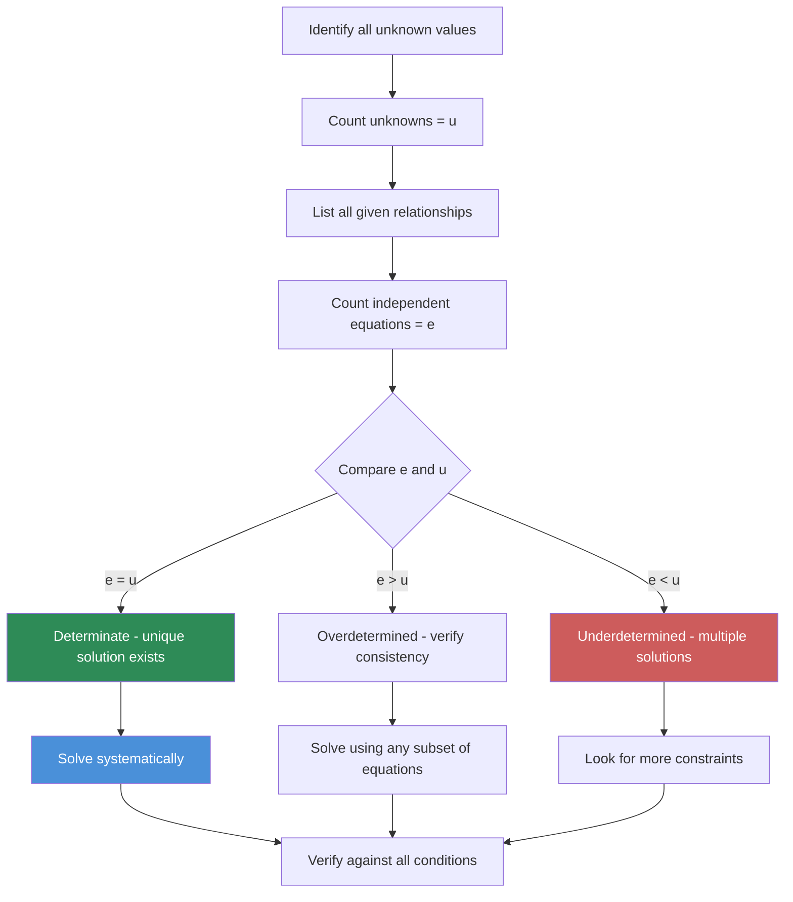

# Chapter 2: Missing Data and Caselet DI

## Learning Objectives

By the end of this chapter, you will be able to:
- Identify missing values in tables and derive them using relationships between rows and columns
- Convert paragraph-based caselet data into structured tables for analysis
- Formulate and solve equations to find unknown values in data sets
- Apply ratio and proportion principles to deduce missing information
- Solve 4-7 question sets from a single caselet passage
- Distinguish between solvable and unsolvable missing data scenarios
---

## Theory

### 2.1 Understanding Missing Data

Missing Data Interpretation involves tables where some values are deliberately left blank. These blanks must be filled using relationships provided in the data set, such as totals, ratios, percentages, or growth rates.

In competitive exams, missing data problems test your ability to:
- Recognise patterns and relationships within the given data
- Formulate equations from textual or tabular clues
- Solve for unknown values systematically
- Verify that derived values are consistent with all given conditions

#### Why Missing Data Matters

Missing data problems appear in over 30% of DI question sets in IBPS PO, SBI PO, and SSC CGL exams. They are considered moderate-to-difficult because they require logical reasoning in addition to calculation skills. Mastering missing data techniques can significantly boost your overall DI score.

#### The Missing Data Mindset

When you see a blank cell in a table, ask yourself:
1. What information is available in the same row?
2. What information is available in the same column?
3. What information is available from other rows/columns through relationships?
4. What percentages, ratios, or growth rates connect this value to known values?
5. Is there a grand total or subtotal that constrains this value?

```mermaid
flowchart TD
    A[Missing Data Table] --> B{Type of Missing Data}
    B -->|Row Total Given| C1[Use Row Total - Sum of Known Values]
    B -->|Column Total Given| C2[Use Column Total - Sum of Known Values]
    B -->|Ratio Given| C3[Express Unknowns in Ratio Terms]
    B -->|Percentage Given| C4[Percentage � Total / 100]
    B -->|Average Given| C5[Average � Count - Sum of Known]
    B -->|Growth Rate Given| C6[Previous Value � (1 + Growth Rate)]
    
    C1 --> D[Form Equation]
    C2 --> D
    C3 --> D
    C4 --> D
    C5 --> D
    C6 --> D
    
    D --> E{Sufficient Data?}
    E -->|Yes| F[Solve for All Unknowns]
    E -->|No| G[Identify Missing Relationship]
    F --> H[Verify All Row & Column Totals]
    G --> H
    
    style A fill:#4A90D9,color:#fff
    style D fill:#7B68EE,color:#fff
    style F fill:#2E8B57,color:#fff
    style G fill:#CD5C5C,color:#fff
```

#### The Missing Data Spectrum

Missing data problems exist on a spectrum of difficulty:

| Level | Description | Example | Typical Questions |
|-------|-------------|---------|------------------|
| **Beginner** | One missing cell, total given | Find the missing value in a row | 1 direct question |
| **Intermediate** | Two missing cells, ratio or percentage given | Find values using relationships | 2-3 linked questions |
| **Advanced** | Multiple missing cells across rows/columns, chain of relationships | Solve system of equations | 4-5 questions |
| **Expert** | Caselet with 5+ entities, multiple variables per entity | Extract, organise, solve, verify | 5-7 questions |

#### Step-by-Step Missing Data Resolution

**Step 1:** Draw the table framework with all known values entered
**Step 2:** Identify which cells can be directly computed (single unknown in a row/column with a total)
**Step 3:** Look for relationships between remaining unknown cells (ratios, percentages, comparisons)
**Step 4:** Set up equations and solve
**Step 5:** Fill all derived values and verify totals

> **Pro tip:** Always fill the "easiest" missing values first. Each solved value may unlock other values through row/column totals.

#### Working Backwards from Answers

When you are stuck, the answer choices themselves can guide you:
1. Try each answer choice in the missing cell
2. Check if the resulting table satisfies all conditions
3. Eliminate choices that lead to contradictions

This is especially effective for multiple-choice questions where only one answer works.

#### Common Missing Data Scenarios

| Scenario | Given Information | Approach |
|----------|------------------|----------|
| One missing cell in a row | Row total + other row values | Subtract known from total |
| Two missing cells in a row | Row total + ratio between missing values | Ratio equation |
| Missing column total | Column values given | Sum the column |
| Missing values with percentages | Percentage breakdown and total | Percentage formula |
| Missing values with growth rates | Previous year data + growth rate | Growth calculation |

### 2.2 Equation Formulation for Missing Data

When multiple values are missing, you must set up equations:

**Case 1: Two unknowns, one row total**
- Let missing values be x and y
- x + y + known_value = row_total
- x + y = row_total - known_value
- Need additional relationship to solve uniquely

**Case 2: Two unknowns with ratio**
- x : y = a : b
- x = (a/b) � y
- Substitute into total equation

**Case 3: Percentage relationships**
- x = p% of total
- y = q% of total

### 2.3 Caselet Data Interpretation

A caselet is a paragraph (or two) containing numerical data that must be extracted and organised into a table before answering questions.

#### Steps for Caselet DI:


**Key information to extract from a caselet:**
1. **Entities:** Companies, people, products, departments, etc.
2. **Variables:** Revenue, profit, production, sales, percentage, ratio
3. **Relationships:** "Company A's revenue is 20% more than Company B's"
4. **Absolute values:** Direct numbers mentioned
5. **Totals:** Overall figures that span multiple entities

#### Caselet Conversion Example

**Caselet:** In a company with three departments (A, B, C), the total number of employees is 500. Department A has 40% of the total employees. Department B has 50% more employees than Department C. The average salary in Department A is ?50,000, in Department B is ?45,000, and in Department C is ?40,000.

**Converted Table:**

| Department | Employees | % of Total | Avg Salary (?) | Total Salary (?) |
|------------|-----------|------------|----------------|-----------------|
| A | 200 | 40% | 50,000 | 1,00,00,000 |
| B | 180 | 36% | 45,000 | 81,00,000 |
| C | 120 | 24% | 40,000 | 48,00,000 |
| **Total** | **500** | **100%** | **�** | **2,29,00,000** |

**Derivation:**
- A employees = 40% of 500 = 200
- B + C = 500 - 200 = 300
- B = 1.5 � C (50% more)
- 1.5C + C = 300 ? 2.5C = 300 ? C = 120, B = 180

### 2.4 Caselet Types

#### Type 1: Production/Sales Caselets
Describe production volumes, sales figures, market shares, and growth rates across companies or products.

**Typical relationships:**
- "Company X sold 25% more units than Company Y"
- "Total market size is ?1,000 crores"
- "Company Y has 40% market share"

#### Type 2: Demographic Caselets
Describe population distributions, literacy rates, employment ratios, and demographic breakdowns.

**Typical relationships:**
- "Total population is 2 lakh"
- "60% of the population is literate"
- "Male to female ratio is 6:5"

#### Type 3: Financial Caselets
Describe revenue, profit, expenses, and investment data across entities or time periods.

**Typical relationships:**
- "Profit margin is 20%"
- "Expenses increased by 15% over last year"
- "Revenue is distributed in the ratio 3:2:1 among three products"

#### Type 4: Mixed Caselets
Combine multiple types of data � demographic + financial, or production + sales.

### 2.5 Ratio and Proportion in Missing Data

Ratios are powerful tools for recovering missing values.

**Key ratio concepts:**
- **Part-to-part ratio:** A:B = 3:2 means A has 3 parts, B has 2 parts
- **Part-to-whole ratio:** A:Total = 3:5 ? A = (3/5) � Total
- **Chain ratio:** A:B = 2:3, B:C = 4:5 ? A:B:C = 8:12:15

**Using ratios with totals:**
If A:B:C = 2:3:5 and total = 200:
- Total parts = 2 + 3 + 5 = 10
- A = (2/10) � 200 = 40
- B = (3/10) � 200 = 60
- C = (5/10) � 200 = 100

### 2.6 Solving Through Equation Formulation

When a caselet involves unknowns, the process is:

1. **Define variables:** Assign letters to unknown quantities
2. **Write equations:** Translate relationships into mathematical expressions
3. **Solve system:** Use substitution or elimination
4. **Verify:** Check that solutions satisfy all conditions

**Common equation structures:**

| Relationship | Equation |
|-------------|----------|
| A is x% more than B | A = B � (1 + x/100) |
| A is x% less than B | A = B � (1 - x/100) |
| A : B = m : n | A/B = m/n |
| A = x% of total | A = (x/100) � Total |
| Total = Sum of parts | A + B + C = Total |

### 2.6a Advanced Caselet Strategies

Beyond simple extraction, many caselets require inferring relationships that are not explicitly stated.

**Strategy 1: The Base Value Assumption**
When a caselet gives relative comparisons without absolute values, assume a base value (usually 100 or x) and work with multiples.

**Example:** Company A's revenue is 30% more than B. B's revenue is 25% more than C. C's revenue is ?80 lakhs.
- Let C = 80. Then B = 80 � 1.25 = 100. Then A = 100 � 1.30 = 130.
- Without the base value for C, we would set C = x, B = 1.25x, A = 1.30 � 1.25x = 1.625x.

**Strategy 2: Chain of Relationships**
When a caselet gives A > B, B > C, C > D type relationships, build a chain and use the extreme values as anchors.

**Strategy 3: Reverse Engineering**
Work backwards from the final value through each percentage change to find the initial value.

**Example:** A price increased by 20%, then decreased by 10%, resulting in ?1,080. Original price?
- Let original = x. After increase: x � 1.20. After decrease: x � 1.20 � 0.90 = 1.08x.
- 1.08x = 1,080 ? x = ?1,000.

**Strategy 4: Venn Diagram Approach for Overlapping Data**
When a caselet involves categories that overlap (e.g., students taking multiple subjects), Venn diagrams help organise the relationships.

**Strategy 5: Tabular Expansion**
When a caselet has multiple entities and multiple attributes, expand the table to include all derived columns before answering.

**Example:** A caselet about 3 companies with revenue, cost, and profit data should be expanded to:
| Company | Revenue | Cost | Profit | Profit % | Revenue % of Total |
|---------|---------|------|--------|----------|-------------------|

#### Working with Complex Caselets

For complex caselets with 5+ entities and multiple relationships:

1. **Create an entity-relationship map** before building the table
2. **Colour-code** known vs unknown values
3. **Track units** religiously (lakhs vs crores vs thousands)
4. **Build equations incrementally** � start with the most constrained relationships
5. **Cross-verify** by plugging answers back into the original caselet text

### 2.6b Equation Types in Caselet DI

Caselet equations typically fall into these categories:

| Equation Type | Example | Solution Method |
|--------------|---------|-----------------|
| Linear (single variable) | x + 2x + 3x = 120 | x = 20, then 2x = 40, 3x = 60 |
| Linear (two variables) | A = B + 10, A + B = 50 | Substitution: B + 10 + B = 50 ? B = 20, A = 30 |
| Ratio equation | A/B = 3/4, A + B = 42 | A = 3k, B = 4k, 7k = 42 ? k = 6, A = 18, B = 24 |
| Percentage equation | A = 120% of B, B = 80% of C | A = 1.2B, B = 0.8C ? A = 0.96C |
| Growth equation | A increases by 10% each year | A_n = A_0 � (1.10)^n |
| Mixture equation | x% of A + y% of B = z% of (A+B) | Use alligation or weighted average |

#### The Alligation Method for Mixtures in Caselets

When a caselet involves mixing two groups with different averages or percentages, use alligation:

**Formula:** (Quantity of 1) / (Quantity of 2) = (Average_2 - Overall) / (Overall - Average_1)

**Example:** A class has 60% boys. 80% of boys and 70% of girls pass. Overall pass % = 76%.
Ratio of boys to girls: (70 - 76) / (76 - 80) = -6 / -4 = 3:2
So boys : girls = 3 : 2.

### 2.6c Determinacy Analysis

Before solving a missing data problem, check whether the system is:

| System Type | Equations vs Unknowns | Outcome |
|-------------|----------------------|---------|
| **Determinate** | Equations = Unknowns | Unique solution exists |
| **Overdetermined** | Equations > Unknowns | May have solution if consistent |
| **Underdetermined** | Equations < Unknowns | Multiple solutions possible |

**How to count equations:**
- Each row total is one equation
- Each column total is one equation
- Each ratio statement is one equation
- Each percentage statement is one equation
- Each comparison (A is x more than B) is one equation

**Common determinacy patterns in exams:**

| Pattern | Equations | Unknowns | Verdict |
|---------|-----------|----------|---------|
| 1 row with 1 missing | 1 | 1 | Solvable |
| 1 row with 2 missing + row total | 1 | 2 | Underdetermined |
| 1 row with 2 missing + ratio given | 2 | 2 | Solvable |
| 2 rows each with 1 missing + column totals | 2 | 2 | Solvable |
| 3 unknowns, total + 2 ratios | 3 | 3 | Solvable |

### 2.7 Handling Multiple Missing Values

When a table has more than one missing value:

**Scenario A: Two missing in same row**
- Need at least two independent relationships
- If only one total is given, the problem is underdetermined

**Scenario B: Missing values in different rows/columns**
- Use relationships that connect the missing values
- Cross-row and cross-column equations

**Scenario C: Missing totals**
- Sum known values carefully
- Check for values mentioned in questions that do not appear in the table

### 2.8 Common Errors in Missing Data DI

| Error | Example | Correction |
|-------|---------|------------|
| Assuming too much | Assuming missing cells are zero | Verify from context |
| Wrong base for percentage | "A is 20% more than B" vs "B is 20% less than A" are different | Identify the base entity correctly |
| Ignoring units | Mixing lakhs and crores | Always convert to same unit |
| Wrong sign convention | Profit = Revenue - Cost (not Revenue + Cost) | Verify formula before calculating |
| Data insufficiency misjudgment | Thinking 2 equations are enough for 3 unknowns | Count equations vs variables |

### 2.9 Caselet Question Patterns

Typically, 4-7 questions follow a single caselet. The questions progress from:
1. **Direct retrieval:** Extract a number explicitly mentioned
2. **Simple calculation:** One-step calculation (percentage, ratio)
3. **Intermediate calculation:** Multi-step (find missing value, then compute)
4. **Comparison:** Compare two derived quantities
5. **Verification:** True/false statements about the data
6. **Approximation:** Estimate without exact calculation

### 2.9a Practice Drill: Rapid Caselet Conversion

A critical skill for caselet DI is rapid conversion from paragraph to table. Practice with this drill:

**Step 1: Scan** � Read the caselet at 2� speed to identify entities (usually 3-5) and variables (usually 2-4)
**Step 2: Table skeleton** � Draw the table with entities as rows and variables as columns
**Step 3: Fill direct values** � Enter any explicit numbers
**Step 4: Note relationships** � Write down each relationship as an equation
**Step 5: Solve** � Starting with the most constrained relationship, solve iteratively

**Target time:** 90 seconds from reading to completed table.

#### Sample Drill Caselet

Read and convert within 90 seconds:

"In a factory, there are three shifts � Morning, Evening, and Night. Total workers = 600. Morning shift has twice as many as Evening. Night shift has 50 fewer than Evening. The Morning shift produces 25 units per worker per day, Evening produces 20, and Night produces 15."

**Converted table (target for 90 seconds):**
| Shift | Workers | Production per worker | Total Production |
|-------|---------|---------------------|-----------------|
| Morning | 260 | 25 | 6,500 |
| Evening | 130 | 20 | 2,600 |
| Night | 80 | 15 | 1,200 |
| Total | 470 | � | 10,300 |

Wait � these don't add to 600. Let me recalculate:
Let Evening = x. Morning = 2x. Night = x - 50.
2x + x + (x - 50) = 600 ? 4x - 50 = 600 ? 4x = 650 ? x = 162.5.
Morning = 325, Evening = 162.5, Night = 112.5. These are unusual but correct given the data.

#### Quick Verification Techniques

After solving, verify using these checks:
1. **Row sum check:** Do row values add to the row total?
2. **Column sum check:** Do column values add to the column total?
3. **Ratio check:** Do derived ratios match the stated ratios?
4. **Percentage check:** Do derived percentages match the stated percentages?
5. **Consistency check:** Is every derived value positive and reasonable?

### 2.9b Caselet Type Deep Dive: Financial Ratios

Financial caselets often ask you to compute complex ratios:

| Ratio | Formula | Interpretation |
|-------|---------|---------------|
| Profit Margin | Profit / Revenue � 100 | How much profit per rupee of revenue |
| Expense Ratio | Expense / Revenue � 100 | What portion of revenue goes to expenses |
| Debt-to-Equity | Total Debt / Shareholder Equity | Financial leverage |
| Current Ratio | Current Assets / Current Liabilities | Short-term liquidity |
| ROI | Profit / Investment � 100 | Return on investment |

**Example caselet with financial ratios:**

"A company has revenue of ?500 lakhs. Cost of goods sold is 60% of revenue. Operating expenses are ?80 lakhs. Interest expense is ?20 lakhs. Tax rate is 25%."

**Derived table:**
| Item | Amount (?lakhs) |
|------|----------------|
| Revenue | 500 |
| COGS (60%) | 300 |
| Gross Profit | 200 |
| Operating Expenses | 80 |
| Operating Profit (EBIT) | 120 |
| Interest | 20 |
| Profit Before Tax | 100 |
| Tax (25%) | 25 |
| Net Profit | 75 |

**Ratios derived:**
- Gross Profit Margin = 200/500 = 40%
- Net Profit Margin = 75/500 = 15%
- Operating Expense Ratio = 80/500 = 16%

### 2.9c Common Caselet Pitfalls

| Pitfall | Example | Why It's Dangerous |
|---------|---------|-------------------|
| Misreading "more than" | "A is 20% more than B" vs "A is 20% of B" | Different operations: multiply by 1.20 vs 0.20 |
| Order of operations in chain percentages | "A increased by 10% then 20%" | 10% + 20% ? 30% compounded � actual = 32% |
| Assuming uniform distribution | "Total 500 split among 3 departments" | Not necessarily equal unless stated |
| Ignoring units | Data in lakhs, question asks in crores | 1 crore = 100 lakhs |
| Rounding errors in multi-step | Rounding intermediate values | Keep 2-3 decimal places for intermediate steps |

### 2.10 Time Management for Caselet DI

| Phase | Time per Caselet |
|-------|-----------------|
| Read and extract data | 1.5 minutes |
| Create table and fill known values | 2 minutes |
| Derive missing values | 2 minutes |
| Answer 4-7 questions | 3-4 minutes |
| **Total** | **8-10 minutes** |

---

## Examples with Solved Exercises

### 2.10a Special Case: Missing Data with Multiple Constraints

When a table has multiple constraints, the solution may require solving a system of equations simultaneously. Here are the most common patterns:

#### Pattern 1: Row and Column Totals Both Known

Given a 3�3 table with row totals R1, R2, R3 and column totals C1, C2, C3, and the grand total G:

If exactly 3 cells are missing (one per row and column), the system is fully determined.

**Example:**
| | Product X | Product Y | Product Z | Total |
|---|-----------|-----------|-----------|-------|
| Store A | 100 | ? | 50 | 250 |
| Store B | ? | 120 | 80 | 300 |
| Store C | 60 | 90 | ? | 200 |
| **Total** | **260** | **310** | **180** | **750** |

**Solution:**
- A_Y = 250 - 100 - 50 = 100
- C_Z = 200 - 60 - 90 = 50
- B_X = 260 - 100 - 60 = 100
- Verify: B_X + 120 + 80 = 100 + 120 + 80 = 300 ?

#### Pattern 2: Percentage Distribution with Missing Base

When a table shows percentages but the base values are missing:

**Example:** A company has three departments. The salary budget is distributed as: Dept A = 50%, Dept B = 30%, Dept C = 20%. The total salary budget is unknown, but Dept A's actual salary is ?30 lakhs.

- Total salary = ?30 lakhs / 0.50 = ?60 lakhs
- Dept B = 0.30 � ?60 lakhs = ?18 lakhs
- Dept C = 0.20 � ?60 lakhs = ?12 lakhs

#### Pattern 3: Sequential Growth with Missing Base

When growth rates are given but the base year value is missing, work backwards:

**Example:** Sales in 2023 are ?138 lakhs. Growth was 15% in 2022 and 20% in 2023 over the previous year.

- 2023 = 2022 � 1.20 ? 2022 = 138 / 1.20 = 115
- 2022 = 2021 � 1.15 ? 2021 = 115 / 1.15 = 100

#### Pattern 4: Constrained Optimization

When finding missing values that maximise or minimise a particular quantity:

**Example:** A 2�2 table with row totals 100 and 200, column totals 150 and 150. One cell value x minimises the sum of the other three cells.

- Table: [x, 100-x; 150-x, 200-(150-x)] = [x, 100-x; 150-x, 50+x]
- All values must be = 0: x = 0, x = 100, x = 150, x = -50
- Feasible range: 0 = x = 100
- Sum of non-x cells = (100-x) + (150-x) + (50+x) = 300 - x
- Sum is minimised when x is maximised: x = 100

### 2.10b Advanced Ratio Applications

Ratio problems in missing data can take several forms:

**Three-Part Ratios:**
If A:B:C = 2:3:4 and total is 180:
- Total parts = 2 + 3 + 4 = 9
- Each part = 180/9 = 20
- A = 40, B = 60, C = 80

**Chain Ratios:**
If A:B = 2:3 and B:C = 4:5, find A:B:C:
- Make B the same in both: A:B = 2:3 = 8:12, B:C = 4:5 = 12:15
- A:B:C = 8:12:15
- If total = 140, each part = 140/35 = 4
- A = 32, B = 48, C = 60

**Inverse Ratios:**
If A:B = 3:2 and B:C = 6:5, find A:C:
- A/B = 3/2, B/C = 6/5
- A/C = (A/B) � (B/C) = (3/2) � (6/5) = 18/10 = 9/5

### 2.10c Equation Solving Techniques for Caselet DI

**Technique 1: Substitution Method**
Solve two equations by substituting one variable in terms of another.
- Equation 1: A + B = 100
- Equation 2: A = 2B + 10
- Substituting: (2B + 10) + B = 100 ? 3B = 90 ? B = 30, A = 70

**Technique 2: Elimination Method**
Add or subtract equations to eliminate a variable.
- Equation 1: 2A + 3B = 130
- Equation 2: 2A - B = 10
- Subtract: (2A+3B) - (2A-B) = 130 - 10 ? 4B = 120 ? B = 30, A = 20

**Technique 3: Cross-Multiplication for Ratios**
If A/B = 3/4 and A + B = 42:
- A = 3k, B = 4k
- 3k + 4k = 42 ? 7k = 42 ? k = 6
- A = 18, B = 24

**Technique 4: Alligation for Mixtures**
Used for finding the ratio of two groups being mixed.
- Group 1 average: a, Group 2 average: b, Overall average: m
- Ratio of Group 1 to Group 2 = (m - b) / (a - m)

### 2.10d Practice Strategies for Caselet DI

**Strategy 1: Daily Caselet Practice**
Solve at least 2 caselets every day. Focus on:
- Day 1-5: Simple production/demographic caselets
- Day 5-10: Financial caselets with multiple variables
- Day 10-15: Mixed caselets with complex relationships

**Strategy 2: Timed Drills**
Set a timer for each phase:
- Caselet reading: 60 seconds
- Table creation: 90 seconds
- Solving equations: 120 seconds
- Answering questions: 60 seconds total

**Strategy 3: Error Log**
Maintain an error log with columns:
- Caselet type
- Error type (misread relationship, calculation error, equation setup)
- Correct approach
- Time taken

**Strategy 4: Reverse Engineering Practice**
Take solved caselets and:
- Read the answers first
- Try to reconstruct the table from the answers
- Verify against the original caselet

### TypeScript Equation Solver for Missing Value Problems

```typescript
interface MissingValueProblem {
  knownValues: Record<string, number>;
  relationships: Relationship[];
  variables: string[];
}

interface Relationship {
  type: 'total' | 'ratio' | 'percentage_diff' | 'percentage_of';
  targetVariable: string;
  sourceVariables: string[];
  value: number;
}

class MissingDataSolver {
  private variables: Map<string, number> = new Map();
  private equations: string[] = [];

  constructor(problem: MissingValueProblem) {
    for (const [key, value] of Object.entries(problem.knownValues)) {
      this.variables.set(key, value);
    }
  }

  solveLinearSystem(
    equations: Array<{ vars: string[]; coeffs: number[]; rhs: number }>
  ): Map<string, number> | null {
    const n = equations.length;
    const allVars = new Set<string>();
    for (const eq of equations) {
      for (const v of eq.vars) allVars.add(v);
    }
    const varList = Array.from(allVars);
    const m = varList.length;

    if (n < m) {
      console.warn("Underdetermined system: more variables than equations");
      return null;
    }

    // Build augmented matrix
    const matrix: number[][] = [];
    for (const eq of equations) {
      const row = new Array(m + 1).fill(0);
      for (let i = 0; i < eq.vars.length; i++) {
        const idx = varList.indexOf(eq.vars[i]);
        row[idx] = eq.coeffs[i];
      }
      row[m] = eq.rhs;
      matrix.push(row);
    }

    // Gaussian elimination with partial pivoting
    for (let col = 0; col < Math.min(m, n); col++) {
      let maxRow = col;
      for (let row = col + 1; row < n; row++) {
        if (Math.abs(matrix[row][col]) > Math.abs(matrix[maxRow][col])) {
          maxRow = row;
        }
      }
      [matrix[col], matrix[maxRow]] = [matrix[maxRow], matrix[col]];
      if (Math.abs(matrix[col][col]) < 1e-10) continue;

      for (let row = col + 1; row < n; row++) {
        const factor = matrix[row][col] / matrix[col][col];
        for (let j = col; j <= m; j++) {
          matrix[row][j] -= factor * matrix[col][j];
        }
      }
    }

    // Back substitution
    const result = new Map<string, number>();
    for (let i = m - 1; i >= 0; i--) {
      if (Math.abs(matrix[i][i]) < 1e-10) continue;
      let sum = matrix[i][m];
      for (let j = i + 1; j < m; j++) {
        sum -= matrix[i][j] * (result.get(varList[j]) || 0);
      }
      result.set(varList[i], sum / matrix[i][i]);
    }
    return result;
  }

  findMissingFromTotals(
    rows: (number | null)[][],
    rowTotals: (number | null)[],
    colTotals: (number | null)[]
  ): (number | null)[][] {
    const result = rows.map(r => [...r]);
    const numRows = rows.length;
    const numCols = rows[0].length;

    let changed = true;
    while (changed) {
      changed = false;
      for (let r = 0; r < numRows; r++) {
        if (rowTotals[r] === null) continue;
        const knownSum = result[r].reduce(
          (sum, v, c) => sum + (v !== null ? v : 0), 0
        );
        const nullCount = result[r].filter(v => v === null).length;
        if (nullCount === 1 && rowTotals[r] !== null) {
          const idx = result[r].indexOf(null);
          result[r][idx] = rowTotals[r]! - knownSum;
          changed = true;
        }
      }
      for (let c = 0; c < numCols; c++) {
        if (colTotals[c] === null) continue;
        const knownSum = result.reduce(
          (sum, row) => sum + (row[c] !== null ? row[c] : 0), 0
        );
        const nullCount = result.filter(row => row[c] === null).length;
        if (nullCount === 1) {
          for (let r = 0; r < numRows; r++) {
            if (result[r][c] === null) {
              result[r][c] = colTotals[c]! - knownSum;
              changed = true;
              break;
            }
          }
        }
      }
    }
    return result;
  }

  solvePercentageCaselet(
    total: number,
    percentages: Record<string, number>,
    additionalRelations: Array<{
      entity: string; relation: string; value: number;
    }>
  ): Map<string, number> {
    const result = new Map<string, number>();
    for (const [entity, pct] of Object.entries(percentages)) {
      result.set(entity, (pct / 100) * total);
    }
    for (const rel of additionalRelations) {
      const baseValue = result.get(rel.entity) || 0;
      if (rel.relation === 'more_than') {
        result.set(rel.entity, baseValue + rel.value);
      } else if (rel.relation === 'less_than') {
        result.set(rel.entity, baseValue - rel.value);
      }
    }
    return result;
  }
}

// Example usage:
const solver = new MissingDataSolver({
  knownValues: { A: 100 },
  variables: ['B', 'C', 'D'],
  relationships: [
    { type: 'total', targetVariable: 'total', sourceVariables: ['A', 'B', 'C', 'D'], value: 500 },
    { type: 'ratio', targetVariable: 'B', sourceVariables: ['B', 'C'], value: 2/3 },
  ],
});

const grid = [
  [100, null, 150],
  [null, 200, 50],
  [80, 120, null],
];
const rowTotals = [null, null, 300];
const colTotals = [250, 400, null];

const filled = solver.findMissingFromTotals(grid, rowTotals, colTotals);
console.log("Filled Table:", filled);
```

**Q1.** A table shows production data for three companies:\n\n| Company | 2021 | 2022 | 2023 |\n|---------|------|------|------|\n| A | 120 | 150 | ? |\n| B | 90 | 135 | 180 |\n| C | 110 | 165 | 220 |\n\nIf the total production of all three companies in 2023 is 600 units, what is the missing value?\n\na) 200\nb) 210\nc) 180\nd) 190\n\n<details>\n<summary>Answer</summary>\na) 200\n\nTotal 2023 = A_2023 + B_2023 + C_2023 = ? + 180 + 220 = 600\n? = 600 - 180 - 220 = 200.\n</details>\n\n---\n\n**Q2.** A caselet states: \"In a school, there are 800 students. The number of boys is 60% of the total. The number of girls in the science stream is 120. If 25% of the boys are in the science stream, how many girls are in the arts stream?\"\n\nFirst, what is the number of boys?\n\na) 320\nb) 480\nc) 500\nd) 400\n\n<details>\n<summary>Answer</summary>\nb) 480\n\nNumber of boys = 60% of 800 = 0.60 � 800 = 480.\n</details>\n\n---\n\n**Q3.** Continuing from Q2: How many girls are in the science stream?\n\na) 120\nb) 200\nc) 80\nd) 100\n\n<details>\n<summary>Answer</summary>\na) 120\n\nGiven directly in the caselet: \"The number of girls in the science stream is 120.\"\n</details>\n\n---\n\n**Q4.** Still continuing: How many boys are in the arts stream?\n\na) 360\nb) 240\nc) 480\nd) 120\n\n<details>\n<summary>Answer</summary>\na) 360\n\nBoys in science = 25% of 480 = 120\nBoys in arts = Total boys - Boys in science = 480 - 120 = 360.\n</details>\n\n---\n\n**Q5.** Table with two missing values:\n\n| Department | Employees | Male | Female |\n|------------|-----------|------|--------|\n| HR | 80 | 30 | 50 |\n| IT | ? | 60 | 40 |\n| Finance | 120 | ? | 70 |\n| Total | 300 | 150 | 150 |\n\nWhat is the number of employees in IT?\n\na) 80\nb) 100\nc) 90\nd) 110\n\n<details>\n<summary>Answer</summary>\nb) 100\n\nTotal employees = 300. Known: HR = 80, Finance = 120.\nIT = 300 - 80 - 120 = 100.\n</details>\n\n---\n\n**Q6.** From the same table, what is the number of males in Finance?\n\na) 60\nb) 40\nc) 50\nd) 70\n\n<details>\n<summary>Answer</summary>\nc) 50\n\nFinance: Total = 120, Female = 70\nMale = 120 - 70 = 50.\n</details>\n\n---\n\n**Q7.** A caselet: \"Three friends A, B, C invested in a business. A invested ?20,000 more than B. B invested ?10,000 less than C. Total investment is ?1,20,000.\" What is C's investment?\n\na) ?40,000\nb) ?50,000\nc) ?30,000\nd) ?60,000\n\n<details>\n<summary>Answer</summary>\na) ?40,000\n\nLet C = x. Then B = x - 10,000. A = B + 20,000 = x + 10,000.\nTotal: (x + 10,000) + (x - 10,000) + x = 1,20,000\n3x = 1,20,000 ? x = 40,000.\n</details>\n\n---\n\n**Q8.** A table of exports (?crores) has missing row totals:\n\n| Country | 2021 | 2022 | 2023 | Total |\n|---------|------|------|------|-------|\n| P | 80 | 95 | 105 | ? |\n| Q | 70 | 85 | ? | 240 |\n| R | ? | 75 | 90 | 230 |\n| Total | 230 | 255 | 270 | 755 |\n\nWhat is P's total?\n\na) 270\nb) 280\nc) 285\nd) 275\n\n<details>\n<summary>Answer</summary>\nb) 280\n\nP's total = 80 + 95 + 105 = 280.\n</details>\n\n---\n\n**Q9.** From the same table, what is R's export in 2021?\n\na) 85\nb) 80\nc) 90\nd) 75\n\n<details>\n<summary>Answer</summary>\nb) 80\n\nColumn total 2021 = 230. P_2021 = 80, Q_2021 = 70.\nR_2021 = 230 - 80 - 70 = 80.\n</details>\n\n---\n\n**Q10.** A caselet: \"The population of a town is 50,000. The ratio of males to females is 3:2. 40% of the males are literate. 60% of the females are literate.\" What is the total literate population?\n\na) 22,000\nb) 24,000\nc) 20,000\nd) 26,000\n\n<details>\n<summary>Answer</summary>\nb) 24,000\n\nMales = (3/5) � 50,000 = 30,000. Females = 20,000.\nLiterate males = 40% of 30,000 = 12,000.\nLiterate females = 60% of 20,000 = 12,000.\nTotal literate = 12,000 + 12,000 = 24,000.\n</details>\n\n---\n\n**Q11.** Two missing values in ratio:\n\n| Product | Revenue (?lakhs) |\n|---------|-----------------|\n| X | 150 |\n| Y | ? |\n| Z | ? |\n\nRevenue of Y : Z = 2 : 3. Total revenue = ?400 lakhs. What is Y's revenue?\n\na) 100\nb) 120\nc) 80\nd) 90\n\n<details>\n<summary>Answer</summary>\na) 100\n\nY + Z = 400 - 150 = 250\nY : Z = 2 : 3 ? Y = (2/5) � 250 = 100.\n</details>\n\n---\n\n**Q12.** Caselet: \"A company's revenue increased by 20% in 2022 over 2021, and by 25% in 2023 over 2022. The revenue in 2023 is ?75 lakhs.\" What was the revenue in 2021?\n\na) ?48 lakhs\nb) ?50 lakhs\nc) ?45 lakhs\nd) ?52 lakhs\n\n<details>\n<summary>Answer</summary>\nb) ?50 lakhs\n\n2023 = 1.25 � 2022 ? 2022 = 75 / 1.25 = 60\n2022 = 1.20 � 2021 ? 2021 = 60 / 1.20 = ?50 lakhs.\n</details>\n\n---\n\n**Q13.** Table with percentage distribution:\n\n| Expense Type | Amount (?) |\n|-------------|-----------|\n| Rent | 12,000 |\n| Food | ? |\n| Transport | 8,000 |\n| Savings | ? |\n| Total | 50,000 |\n\nFood is 30% of total and Savings is 20% of total. What is the savings amount?\n\na) 10,000\nb) 12,000\nc) 8,000\nd) 15,000\n\n<details>\n<summary>Answer</summary>\na) 10,000\n\nSavings = 20% of 50,000 = ?10,000.\n</details>\n\n---\n\n**Q14.** From the same table, what is Food expense?\n\na) 12,000\nb) 15,000\nc) 18,000\nd) 20,000\n\n<details>\n<summary>Answer</summary>\nb) 15,000\n\nFood = 30% of 50,000 = ?15,000.\n</details>\n\n---\n\n**Q15.** Caselet: \"In a library, 40% of the books are fiction. The non-fiction books are 1,200 more than the fiction books.\" How many total books are in the library?\n\na) 4,000\nb) 5,000\nc) 6,000\nd) 3,000\n\n<details>\n<summary>Answer</summary>\nc) 6,000\n\nLet total = T. Fiction = 0.4T. Non-fiction = 0.6T.\n0.6T - 0.4T = 1,200 ? 0.2T = 1,200 ? T = 6,000 books.\n</details>\n\n---\n\n**Q16.** A table shows exam scores with missing values:\n\n| Student | Math | Science | English | Total |\n|---------|------|---------|---------|-------|\n| P | 85 | 78 | ? | 243 |\n| Q | ? | 82 | 91 | 248 |\n| R | 79 | ? | 88 | 252 |\n\nWhat is P's English score?\n\na) 75\nb) 80\nc) 82\nd) 78\n\n<details>\n<summary>Answer</summary>\nb) 80\n\nP's English = 243 - 85 - 78 = 80.\n</details>\n\n---\n\n**Q17.** From the same table, what is Q's Math score?\n\na) 75\nb) 80\nc) 85\nd) 70\n\n<details>\n<summary>Answer</summary>\na) 75\n\nQ's Math = 248 - 82 - 91 = 75.\n</details>\n\n---\n\n**Q18.** Caselet: \"A shop sells three types of items: A, B, C. The number of item A sold is twice that of item B. Item C sold is 50% more than item B. Total items sold is 450.\" How many of item C were sold?\n\na) 100\nb) 150\nc) 200\nd) 120\n\n<details>\n<summary>Answer</summary>\nb) 150\n\nLet B = x. Then A = 2x. C = 1.5x.\nTotal: 2x + x + 1.5x = 450 ? 4.5x = 450 ? x = 100.\nC = 1.5 � 100 = 150.\n</details>\n\n---\n\n**Q19.** Table with chain of missing values:\n\n| Quarter | Revenue (?lakhs) | Expense (?lakhs) | Profit (?lakhs) |\n|---------|-----------------|-----------------|-----------------|\n| Q1 | 200 | 150 | 50 |\n| Q2 | ? | 180 | ? |\n| Q3 | 280 | ? | 60 |\n| Q4 | 350 | 280 | 70 |\n\nIf profit = revenue - expense, and Q2 profit is 20% of Q2 revenue, what is Q2 profit?\n\na) 40\nb) 45\nc) 35\nd) 50\n\n<details>\n<summary>Answer</summary>\nb) 45\n\nProfit = 0.20 � Revenue. Also Profit = Revenue - 180.\n0.2R = R - 180 ? 0.8R = 180 ? R = 225.\nProfit = 0.2 � 225 = 45.\n</details>\n\n---\n\n**Q20.** Caselet: \"Average salary of 5 employees is ?40,000. When one employee leaves and a new one joins, the average becomes ?42,000. The new employee's salary is ?50,000.\" What was the leaving employee's salary?\n\na) ?30,000\nb) ?35,000\nc) ?40,000\nd) ?45,000\n\n<details>\n<summary>Answer</summary>\nc) ?40,000\n\nTotal initial = 5 � 40,000 = ?2,00,000.\nTotal new = 5 � 42,000 = ?2,10,000.\nDifference = ?10,000 more.\nNew employee's salary = 50,000. So leaving employee's salary = 50,000 - 10,000 = ?40,000.\n</details>\n\n---\n\n
### 2.11 Calculation Shortcuts for Missing Data Caselets

#### Quick Ratio-Derivation Method

When two values are missing and a ratio is given:

| Scenario | Shortcut | Example |
|----------|----------|---------|
| A:B = m:n, Total known | A = (m/(m+n)) � Total, B = (n/(m+n)) � Total | A:B = 3:4, Total = 140 ? A = 60, B = 80 |
| A:B = m:n, Difference known | One part = Diff/(m-n) | A:B = 5:2, diff = 30 ? one part = 10, A = 50, B = 20 |
| A:B:C = p:q:r, Total known | Each = (part/sum of parts) � Total | 2:3:5, Total = 200 ? A = 40, B = 60, C = 100 |

#### The "Reverse Percentage" Trick

If a value increased by x% to become Y, the original = Y / (1 + x/100).
If a value decreased by x% to become Y, the original = Y / (1 - x/100).

**Example:** After a 20% increase, salary is ?48,000. Original = 48,000 / 1.20 = ?40,000.

#### Chain of Percentage Changes

For a chain A ? (+x%) ? B ? (+y%) ? C ? (-z%) ? D:

**Shortcut:** D = A � (1 + x/100) � (1 + y/100) � (1 - z/100)

If you need A from D: A = D / [(1 + x/100) � (1 + y/100) � (1 - z/100)]

#### Alligation Shortcut for Mixture Caselets

When two groups are mixed, the ratio of quantities is:

`
Quantity of Group 1   (Avg of Group 2 - Overall Avg)
------------------- = -------------------------------
Quantity of Group 2   (Overall Avg - Avg of Group 1)
`

#### The "Assume 100" Technique

When a caselet gives only percentages and ratios without absolute values:
1. Assume the total or base value is 100
2. Calculate all derived values
3. Scale up/down using any actual value given

**Example:** "A's income is 20% more than B. B's income is 25% more than C. Total of all three is ?3,720."
- Let C = 100. Then B = 125. Then A = 150.
- Ratio A:B:C = 150:125:100 = 6:5:4
- Total parts = 15. Each part = 3,720/15 = 248.
- A = 6 � 248 = 1,488. B = 5 � 248 = 1,240. C = 4 � 248 = 992.

### 2.12 Common Mistakes in Missing Data Problems

| Mistake | Example | Why It's Wrong | Correct |
|---------|---------|---------------|---------|
| Assuming equal distribution | "Total 300 split among 3 departments" ? assuming each gets 100 | Not stated | Need additional relationship |
| Wrong base for "more than" | "A is 20% more than B" ? A = B + 20 | Percentage, not absolute | A = B � 1.20 |
| Adding chain percentages | 10% increase then 20% increase = 30% | Compounding: 1.10 � 1.20 = 1.32 = 32% | Multiply factors |
| Missing zero values | Assuming missing cells are 0 | They are variables to solve for | Use relationships to find them |
| Inverse ratio confusion | A:B = 3:2 ? A = 2k, B = 3k | Wrong assignment | A = 3k, B = 2k |
| Unit mismatch | Caselet in lakhs, answer in crores | Factor of 100 | Convert before calculating |

### 2.13 GFG-Style Comprehensive Caselet � Population Data

**Caselet:** In a town, the total population is 2,50,000. The ratio of males to females is 3:2. Among males, 40% are literate. Among females, 55% are literate. 60% of literate males are employed, and 45% of literate females are employed.

**Step 1: Convert to table**

| Category | Value |
|----------|-------|
| Total Population | 2,50,000 |
| Males (3/5 of total) | 1,50,000 |
| Females (2/5 of total) | 1,00,000 |
| Literate Males (40% of males) | 60,000 |
| Literate Females (55% of females) | 55,000 |
| Total Literate | 1,15,000 |
| Employed Literate Males (60% of 60,000) | 36,000 |
| Employed Literate Females (45% of 55,000) | 24,750 |
| Total Employed Literate | 60,750 |

**Q21.** What is the total literate population?

a) 1,00,000
b) 1,05,000
c) 1,10,000
d) 1,15,000

<details>
<summary>Answer</summary>
d) 1,15,000

Literate males = 40% of 1,50,000 = 60,000. Literate females = 55% of 1,00,000 = 55,000. Total literate = 1,15,000.
</details>

**Q22.** What percentage of the total population is employed and literate?

a) 20.3%
b) 24.3%
c) 26.3%
d) 28.3%

<details>
<summary>Answer</summary>
b) 24.3%

Total employed literate = 36,000 + 24,750 = 60,750. Percentage = (60,750 / 2,50,000) � 100 = 24.3%.
</details>

**Q23.** What is the ratio of literate employed males to literate employed females?

a) 36:25
b) 144:99
c) 48:33
d) 36:33

<details>
<summary>Answer</summary>
b) 144:99

36,000 : 24,750 = Simplify dividing by 250: 144:99. Simplified further dividing by 9: 16:11.
</details>

### 2.14 GFG-Style Missing Data � Production & Cost Table

| Company | Production (units) | Cost per unit (?) | Total Cost (?) |
|---------|-------------------|-------------------|----------------|
| A | 5,000 | 20 | 1,00,000 |
| B | 7,000 | 15 | 1,05,000 |
| C | 4,000 | 25 | 1,00,000 |
| **Total** | **16,000** | **�** | **3,05,000** |

**Q24.** What is the cost per unit for Company B?

a) ?12
b) ?15
c) ?18
d) ?20

<details>
<summary>Answer</summary>
b) ?15

Cost per unit B = Total Cost B / Production B = 1,05,000 / 7,000 = ?15.
</details>

**Q25.** What is the production of Company C?

a) 3,000
b) 4,000
c) 5,000
d) 6,000

<details>
<summary>Answer</summary>
b) 4,000

C's production = Total production - A - B = 16,000 - 5,000 - 7,000 = 4,000 units.
</details>

### 2.15 Additional Missing Data MCQs

**Q26.** If total marks in five subjects is 450, Maths is 20% more than Science, English is 15 less than Maths, History is half of Maths, and Geography is 30 more than History, find Maths marks.

a) 110
b) 120
c) 130
d) 140

<details>
<summary>Answer</summary>
b) 120

Let Science = x. Maths = 1.20x. English = 1.20x - 15. History = 0.60x. Geography = 0.60x + 30.
Total: x + 1.20x + (1.20x - 15) + 0.60x + (0.60x + 30) = 450 ? 4.60x + 15 = 450 ? x = 100.
Maths = 1.20 � 100 = 120.
</details>

**Q27.** Table with missing percentages:

| City | Population | Men % | Women % | Children % |
|------|-----------|-------|---------|-----------|
| X | 80,000 | 45% | 35% | ? |
| Y | 1,20,000 | ? | 40% | 25% |

Children in City X = ?

a) 16,000
b) 18,000
c) 20,000
d) 22,000

<details>
<summary>Answer</summary>
a) 16,000

Children % = 100 - 45 - 35 = 20%. Children = 20% of 80,000 = 16,000.
</details>

**Q28.** From the same table, if men in City Y are 42,000, what % are men?

a) 30%
b) 32%
c) 35%
d) 38%

<details>
<summary>Answer</summary>
c) 35%

Men % = (42,000 / 1,20,000) � 100 = 35%.
</details>

**Q29.** Caselet: "A company has 3,600 employees. Morning shift has 40% of total. Evening shift has 50% more employees than Night shift." Find employees in Night shift.

a) 800
b) 840
c) 864
d) 900

<details>
<summary>Answer</summary>
c) 864

Morning = 40% of 3,600 = 1,440. Evening + Night = 2,160. Let Night = x, Evening = 1.5x. 2.5x = 2,160 ? x = 864.
</details>

**Q30.** A caselet: "In a library, 40% of books are fiction. Non-fiction books are 1,200 more than fiction." Total books?

a) 4,000
b) 5,000
c) 6,000
d) 3,000

<details>
<summary>Answer</summary>
c) 6,000

Let total = T. Fiction = 0.4T. Non-fiction = 0.6T. 0.6T - 0.4T = 1,200 ? 0.2T = 1,200 ? T = 6,000.
</details>

### 2.16 Additional Exercise Questions (Q31-Q40)

**31.** Caselet: "In a school, total students = 1,200. Boys = 5/8 of total. 30% of boys and 40% of girls play cricket." How many students play cricket?

**32.** Table with missing values:

| Product | 2021 | 2022 | 2023 | Total |
|---------|------|------|------|-------|
| A | 100 | 150 | 200 | ? |
| B | 120 | ? | 180 | 450 |
| C | ? | 200 | 160 | 530 |
| Total | 360 | 520 | ? | 1,280 |

a) Find A's total. b) Find B's 2022 value. c) Find C's 2021 value. d) Find 2023 total.

**33.** Caselet: "A, B, C invested in a business. A invested ?20,000 more than B. B invested ?15,000 less than C. Total = ?1,40,000." Find each investment.

**34.** Caselet with averages: "Average weight of 8 students = 55 kg. One leaves, average becomes 54 kg. New student joins, average becomes 56 kg." Find weights of leaving and joining students.

**35.** Table with growth rates:

| Company | 2021 Revenue (?lakhs) | 2022 Growth % | 2022 Revenue (?lakhs) |
|---------|----------------------|--------------|----------------------|
| P | 200 | 25% | ? |
| Q | ? | 20% | 360 |
| R | 150 | ? | 195 |

a) Find P's 2022 revenue. b) Find Q's 2021 revenue. c) Find R's growth %.

**36.** Caselet with ratio chain: "A:B = 3:4, B:C = 2:5, C:D = 3:7. Total A+B+C+D = 1,200." Find each value.

**37.** Missing values with % constraints:

| Expense | Amount (?) | % of Total |
|---------|-----------|-----------|
| Rent | 18,000 | 30% |
| Food | ? | 25% |
| Transport | ? | 15% |
| Entertainment | 9,000 | ? |
| Savings | 12,000 | ? |

Find: a) Total expense. b) Food amount. c) Entertainment %. d) Savings %.

**38.** Caselet: "A man spends 20% on rent, 30% of remaining on food, 25% of remaining on transport. He saves ?21,000." Find his salary.

**39.** Table with three missing interdependent cells:

| Quarter | Revenue (?lakhs) | Expense (?lakhs) | Profit % |
|---------|-----------------|-----------------|---------|
| Q1 | 200 | 160 | ? |
| Q2 | ? | 200 | 20% |
| Q3 | 300 | ? | 10% |

(Profit % = (Revenue - Expense) / Revenue � 100)

**40.** Caselet: "In an exam, 60% passed. Among those who passed, 45% scored above 80%. Among those who failed, 20% scored above 60%. Total candidates = 5,000." How many scored above 80%?

### 2.17 Determinacy Analysis Flowchart



### 2.18 Exam Strategy for Missing Data & Caselet DI

| Strategy | Time | Benefit |
|----------|------|---------|
| **Scan caselet first** | 30 sec | Identify 3-5 entities and 2-4 variables |
| **Draw table skeleton** | 45 sec | Organize data visually before solving |
| **Fill direct values** | 30 sec | Enter all explicitly mentioned numbers |
| **Note relationships** | 30 sec | Write each as an equation |
| **Solve from simplest** | 90 sec | Start with most constrained relationship |
| **Verify all conditions** | 30 sec | Ensure derived values satisfy every condition |
| **Answer questions** | 75 sec per Q | Read question, extract required value, compute |

**Key tip:** In IBPS/SBI/RBI exams, caselets are designed so that ALL missing values can be found. If you get stuck, re-read the caselet � you likely missed a relationship. Never assume data is missing in a way that makes the problem unsolvable.

A **determinate system** (equations = unknowns) is the standard pattern for exam caselets. If you're not getting unique values, re-examine the relationships you've identified.

## Summary

