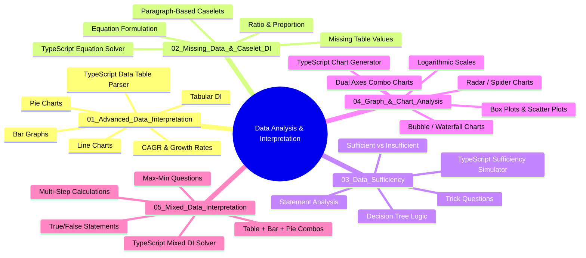

---
id: index
slug: /data-analysis-interpretation
title: "Data Analysis & Interpretation"
sidebar_label: "Data Analysis & Interpretation"
sidebar_position: 6
---
# Data Analysis & Interpretation

> Master the art of interpreting data from tables, graphs, charts, and mixed formats — essential for banking, SSC, UPSC, and management aptitude exams.

## Course Overview

This course covers **5 comprehensive chapters** that build from fundamental tabular data interpretation through advanced mixed-data problem solving. Each chapter includes theory, worked examples, TypeScript implementations, chapter quizzes, and extensive practice exercises.

## Course Map

## How to Use This Course

| Step | Activity | Time Estimate |
|------|----------|---------------|
| 1 | Read the Learning Objectives | 2 minutes |
| 2 | Study the Theory section with diagrams | 20-30 minutes |
| 3 | Attempt the 20 Solved Examples (cover answers first) | 30-40 minutes |
| 4 | Review the Summary & Practical Takeaways | 5 minutes |
| 5 | Take the Chapter Quiz | 5 minutes |
| 6 | Complete all 30 Exercises | 45-60 minutes |

## Prerequisites

- Basic arithmetic: percentages, ratios, averages, fractions
- Familiarity with data presentation formats (tables, bar charts, pie charts, line graphs)
- TypeScript/JavaScript basics (for code sections)

## Chapter Summary

| # | Chapter | Key Skills |
|---|---------|------------|
| 1 | Advanced Data Interpretation | Complex tables, multi-chart analysis, CAGR, approximation |
| 2 | Missing Data & Caselet DI | Deriving missing values, paragraph-to-table conversion |
| 3 | Data Sufficiency | Statement sufficiency analysis, trick question avoidance |
| 4 | Graph & Chart Analysis | Advanced charts, logarithmic scales, dual-axis combos |
| 5 | Mixed Data Interpretation | Multi-format data sets, complex multi-step calculations |

---

*Proceed to Chapter 1: Advanced Data Interpretation*
