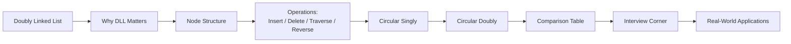

# Chapter 4: Doubly Linked List and Circular Linked List

> **Previous:** [Chapter 3: Singly Linked List](./03-singly-linked-list.md) | **Next:** [Stacks](./05-stacks.md)

## Learning Objectives

After completing this chapter, you will be able to:

- Implement a doubly linked list with forward and backward traversal.
- Implement a circular linked list (singly and doubly).
- Compare singly, doubly, and circular linked lists on time/space complexity.
- Analyze operation complexity for each variant with reasoning.
- Apply doubly linked lists to real-world problems like LRU cache and browser history.

---

## Why Doubly Linked Lists Matter

### Real-World Analogy: Music Playlist with Next and Previous

Imagine you are listening to a playlist on your music app. You tap **Next** to skip forward and **Previous** to go back to the song you just heard. A **singly linked list** supports only "Next" — once you advance, the previous song is unreachable unless you restart from the first track.

A **doubly linked list** fixes this. Each node (song) stores two pointers: one to the next song and one to the previous song. You can move freely in both directions — just like every real music player.

More importantly, deleting the last song from a doubly linked list takes constant time ($O(1)$) because `tail.prev` gives direct access to the second-to-last song. In a singly linked list, you would walk from the start to find the predecessor — an $O(n)$ operation.

> **Core Insight:** Two pointers per node unlock bidirectional traversal and $O(1)$ operations at both ends — at the cost of one extra pointer per element.

---

## Chapter at a Glance

| Topic | Key Insight | Practical Takeaway |
|-------|-------------|-------------------|
| Node Structure | Each node has prev + data + next pointers | Use struct Node with prev, data, next fields |
| Doubly Linked List | Forward and backward traversal supported | Delete node at known position in $O(1)$ |
| Circular Linked List | Last node points back to head | Use for round-robin scheduling |
| Doubly Circular | Tail.next = head, head.prev = tail | Traverse in any direction indefinitely |
| Memory Overhead | 2 pointers per node vs 1 in singly linked | Trade memory for operational flexibility |

---

## Chapter Roadmap



---

## Theory

### Doubly Linked List — Node Structure


Each node in a doubly linked list has three components:

1. **`prev`:** Pointer to the previous node in the sequence.
2. **`data`:** The actual value stored in the node.
3. **`next`:** Pointer to the next node in the sequence.

The list itself maintains two pointers:

- **`head`:** Points to the first node (or `nullptr` if empty).
- **`tail`:** Points to the last node (or `nullptr` if empty).

```
nullptr <- [prev|data|next] <-> [prev|data|next] <-> [prev|data|next] -> nullptr
            ^                                       ^
           head                                   tail
```

### Advantages over Singly Linked List


- **Delete at tail:** $O(1)$ instead of $O(n)$ — `tail.prev` gives direct access to the new tail.
- **Delete a given node:** $O(1)$ if the node pointer is known — no need to find the predecessor.
- **Reverse traversal:** Walk from tail backward using `prev` pointers.
- **Bidirectional iteration:** Insert before a given node in $O(1)$.

### Disadvantage


Each node requires one extra pointer (8 bytes on 64-bit systems). For 1 million nodes, that is ~8 MB extra memory vs a singly linked list.

### Circular Linked List


The last node points back to the first node (singly circular) or the first node's `prev` points to the last (doubly circular). Useful for **round-robin scheduling**, cyclic buffers, and turn-based games where traversal loops indefinitely.

```
Singly circular:
head -> [A] -> [B] -> [C] -> (back to head)

Doubly circular:
head <-> [A] <-> [B] <-> [C] <-> (back to head)
```

> **Pro Tip:** In a circular list, traversal never ends naturally — when you reach the starting node again, you have visited every node exactly once. No null checks needed.

---

## Operations on Doubly Linked List

### 1. Insert at Head (pushFront)

**Real-World Analogy:** Adding a new song to the very top of your playlist. The new song becomes the first track. Its "next" pointer connects to the old first song, and the old first song's "previous" now points back to the new song.

#### Algorithm Steps

1. Create a new node with the given value.
2. If the list is empty (`head == nullptr`):
   - Set `head = tail = newNode`.
3. Otherwise:
   - Set `newNode.next = head`.
   - Set `head.prev = newNode`.
   - Update `head = newNode`.
4. Increment the size counter.

#### Pseudocode

```text
procedure pushFront(value)
    newNode = new Node(value)
    if head == NULL:
        head = tail = newNode
    else:
        newNode.next = head
        head.prev = newNode
        head = newNode
    size = size + 1
```

#### Step-by-Step Dry Run

**Initial List:** Empty (head = null, tail = null)

| Step | Operation | Pointer Updates | List State (forward) |
|------|-----------|-----------------|---------------------|
| 1 | pushFront(10) | new node [10] created | — |
| 2 | head is null | head = [10], tail = [10] | `head->[10]<-tail` |

**After `pushFront(5)`:**

| Step | Operation | Pointer Updates | List State (forward) |
|------|-----------|-----------------|---------------------|
| 1 | pushFront(5) | new node [5] created | — |
| 2 | head is [10] | `[5].next -> [10]` | `[5]->[10]` |
| 3 | — | `[10].prev -> [5]` | `[5]<->[10]` |
| 4 | head = newNode | `head -> [5]` | `head->[5]<->[10]<-tail` |

**Final State:** `head -> [5] <-> [10] <- tail`

#### Implementations

**C++:**
```cpp
void pushFront(const T& value) {
    DNode<T>* newNode = new DNode<T>(value);
    if (!head) {
        head = tail = newNode;
    } else {
        newNode->next = head;
        head->prev = newNode;
        head = newNode;
    }
    ++count;
}
```

**Python:**
```python
def push_front(self, value):
    new_node = Node(value)
    if not self.head:
        self.head = self.tail = new_node
    else:
        new_node.next = self.head
        self.head.prev = new_node
        self.head = new_node
    self.size += 1
```

**Java:**
```java
public void pushFront(T value) {
    DNode<T> newNode = new DNode<>(value);
    if (head == null) {
        head = tail = newNode;
    } else {
        newNode.next = head;
        head.prev = newNode;
        head = newNode;
    }
    size++;
}
```

#### Complexity Analysis

| Metric | Value | Why |
|--------|-------|-----|
| Time | $O(1)$ | Only a fixed set of pointer updates — no loops regardless of list size |
| Space | $O(1)$ | One new node created; no auxiliary data structures |

#### Advantages & Disadvantages

| Advantages | Disadvantages |
|------------|---------------|
| Constant-time insertion at front | Slightly more pointer updates than singly linked |
| Works correctly on empty list | Must maintain both head and tail pointers |
| No traversal needed | — |

#### Edge Cases

| Edge Case | Behavior |
|-----------|----------|
| **Empty list** | newNode becomes both head and tail |
| **Single node** | newNode pushes in front; old node becomes second |
| **Very large list** | Still $O(1)$ — no traversal required |

---

### 2. Insert at Tail (pushBack)

**Real-World Analogy:** Adding a song to the end of your playlist. The current last song's "next" connects to the new song, and the new song's "previous" connects back to the old last song.

#### Algorithm Steps

1. Create a new node with the given value.
2. If the list is empty (`tail == nullptr`):
   - Set `head = tail = newNode`.
3. Otherwise:
   - Set `tail.next = newNode`.
   - Set `newNode.prev = tail`.
   - Update `tail = newNode`.
4. Increment the size counter.

#### Pseudocode

```text
procedure pushBack(value)
    newNode = new Node(value)
    if tail == NULL:
        head = tail = newNode
    else:
        tail.next = newNode
        newNode.prev = tail
        tail = newNode
    size = size + 1
```

#### Step-by-Step Dry Run

**Initial List:** `head -> [10] <- tail`

| Step | Operation | Pointer Updates | List State (forward) |
|------|-----------|-----------------|---------------------|
| 1 | pushBack(20) | new node [20] created | — |
| 2 | tail.next = newNode | `[10].next -> [20]` | `[10]->[20]` |
| 3 | newNode.prev = tail | `[20].prev -> [10]` | `[10]<->[20]` |
| 4 | tail = newNode | `tail -> [20]` | `head->[10]<->[20]<-tail` |

**After `pushBack(30)`:**

| Step | Operation | Pointer Updates | List State (forward) |
|------|-----------|-----------------|---------------------|
| 1 | pushBack(30) | new node [30] created | — |
| 2 | tail.next = newNode | `[20].next -> [30]` | `[10]->[20]->[30]` |
| 3 | newNode.prev = tail | `[30].prev -> [20]` | `[10]<->[20]<->[30]` |
| 4 | tail = newNode | `tail -> [30]` | `head->[10]<->[20]<->[30]<-tail` |

**Final State:** `head -> [10] <-> [20] <-> [30] <- tail`

#### Implementations

**C++:**
```cpp
void pushBack(const T& value) {
    DNode<T>* newNode = new DNode<T>(value);
    if (!tail) {
        head = tail = newNode;
    } else {
        tail->next = newNode;
        newNode->prev = tail;
        tail = newNode;
    }
    ++count;
}
```

**Python:**
```python
def push_back(self, value):
    new_node = Node(value)
    if not self.tail:
        self.head = self.tail = new_node
    else:
        self.tail.next = new_node
        new_node.prev = self.tail
        self.tail = new_node
    self.size += 1
```

**Java:**
```java
public void pushBack(T value) {
    DNode<T> newNode = new DNode<>(value);
    if (tail == null) {
        head = tail = newNode;
    } else {
        tail.next = newNode;
        newNode.prev = tail;
        tail = newNode;
    }
    size++;
}
```

#### Complexity Analysis

| Metric | Value | Why |
|--------|-------|-----|
| Time | $O(1)$ | Direct access via `tail` — no traversal needed (singly linked: $O(n)$ without tail) |
| Space | $O(1)$ | Single new node allocated |

#### Advantages & Disadvantages

| Advantages | Disadvantages |
|------------|---------------|
| $O(1)$ insertion at both ends | Need to manage both head and tail pointers |
| Comparable to `pushFront` in cost | — |

#### Edge Cases

| Edge Case | Behavior |
|-----------|----------|
| **Empty list** | newNode becomes both head and tail |
| **Single node** | newNode links after the single existing node |

---

### 3. Insert at Middle (insertAt)

**Real-World Analogy:** Inserting a song at a specific position in a playlist — say, as the third track. You find the node currently at that position, update the pointers of its predecessor and node itself to weave in the new song.

#### Algorithm Steps

1. Validate index: if `index < 0` or `index > size`, return.
2. If `index == 0`: call `pushFront(value)`.
3. If `index == size`: call `pushBack(value)`.
4. Otherwise:
   - Traverse to the node at position `index` (call it `current`).
   - Create `newNode`.
   - `newNode.prev = current.prev`
   - `newNode.next = current`
   - `current.prev.next = newNode`
   - `current.prev = newNode`
5. Increment size.

#### Pseudocode

```text
procedure insertAt(index, value)
    if index < 0 OR index > size:
        return
    if index == 0:
        pushFront(value)
        return
    if index == size:
        pushBack(value)
        return

    current = head
    for i = 0 to index - 1:
        current = current.next

    newNode = new Node(value)
    newNode.prev = current.prev
    newNode.next = current
    current.prev.next = newNode
    current.prev = newNode
    size = size + 1
```

#### Step-by-Step Dry Run

**Initial List:** `head -> [10] <-> [20] <-> [30] <- tail`

**Operation:** `insertAt(1, 15)` — insert 15 at index 1 (between 10 and 20)

| Step | Operation | Pointer Updates | List State (forward) |
|------|-----------|-----------------|---------------------|
| 1 | Traverse to index 1 | current = [20] | `10, 20, 30` |
| 2 | newNode = [15] | — | — |
| 3 | newNode.prev = current.prev | `[15].prev -> [10]` | — |
| 4 | newNode.next = current | `[15].next -> [20]` | — |
| 5 | current.prev.next = newNode | `[10].next -> [15]` | `10 -> 15 -> 20 -> 30` |
| 6 | current.prev = newNode | `[20].prev -> [15]` | `10 <-> 15 <-> 20 <-> 30` |

**Final State:** `head -> [10] <-> [15] <-> [20] <-> [30] <- tail`

#### Implementations

**C++:**
```cpp
void insertAt(int index, const T& value) {
    if (index < 0 || index > count) return;
    if (index == 0) { pushFront(value); return; }
    if (index == count) { pushBack(value); return; }

    DNode<T>* current = head;
    for (int i = 0; i < index; ++i)
        current = current->next;

    DNode<T>* newNode = new DNode<T>(value);
    newNode->prev = current->prev;
    newNode->next = current;
    current->prev->next = newNode;
    current->prev = newNode;
    ++count;
}
```

**Python:**
```python
def insert_at(self, index, value):
    if index < 0 or index > self.size:
        return
    if index == 0:
        self.push_front(value)
        return
    if index == self.size:
        self.push_back(value)
        return

    current = self.head
    for _ in range(index):
        current = current.next

    new_node = Node(value)
    new_node.prev = current.prev
    new_node.next = current
    current.prev.next = new_node
    current.prev = new_node
    self.size += 1
```

**Java:**
```java
public void insertAt(int index, T value) {
    if (index < 0 || index > size) return;
    if (index == 0) { pushFront(value); return; }
    if (index == size) { pushBack(value); return; }

    DNode<T> current = head;
    for (int i = 0; i < index; i++)
        current = current.next;

    DNode<T> newNode = new DNode<>(value);
    newNode.prev = current.prev;
    newNode.next = current;
    current.prev.next = newNode;
    current.prev = newNode;
    size++;
}
```

#### Complexity Analysis

| Metric | Value | Why |
|--------|-------|-----|
| Time | $O(n)$ | Must traverse from head to the insertion point — worst case near tail |
| Space | $O(1)$ | Only one new node regardless of list size |

> **Note:** If the node pointer is already known (e.g., from a hash map), insertion before a given node is $O(1)$ — the key advantage over singly linked lists.

#### Advantages & Disadvantages

| Advantages | Disadvantages |
|------------|---------------|
| Insert before known node in $O(1)$ | By-index insertion still $O(n)$ |
| Four-pointer re-link gives stable insertion | More pointer updates than singly linked |
| Correct at both ends via delegation | Must handle both prev and next correctly |

#### Edge Cases

| Edge Case | Behavior |
|-----------|----------|
| **Index 0** | Delegates to `pushFront` |
| **Index equals size** | Delegates to `pushBack` (append) |
| **Empty list with index 0** | Delegates to `pushFront`, works correctly |
| **Invalid index** | No operation (guard clause) |

---

### 4. Delete from Head (popFront)

**Real-World Analogy:** Removing the first song from a playlist. The second song becomes the new first track, and its "previous" pointer is set to null.

#### Algorithm Steps

1. If list is empty (`head == nullptr`), return.
2. Save `head` in a temporary pointer.
3. Move `head` to `head.next`.
4. If the new `head` is not null:
   - Set `head.prev = nullptr`.
   - Otherwise, list becomes empty: set `tail = nullptr`.
5. Delete the old head node.
6. Decrement size.

#### Pseudocode

```text
procedure popFront()
    if head == NULL:
        return
    temp = head
    head = head.next
    if head != NULL:
        head.prev = NULL
    else:
        tail = NULL
    delete temp
    size = size - 1
```

#### Step-by-Step Dry Run

**Initial List:** `head -> [10] <-> [20] <-> [30] <- tail`

| Step | Operation | Pointer Updates | List State (forward) |
|------|-----------|-----------------|---------------------|
| 1 | temp = head | temp -> [10] | `10, 20, 30` |
| 2 | head = head.next | head -> [20] | `20, 30` |
| 3 | head is not null | — | — |
| 4 | head.prev = nullptr | `[20].prev = null` | `null <- [20] -> [30]` |
| 5 | delete temp | [10] freed | — |
| 6 | size-- | size = 2 | `20, 30` |

**Final State:** `head -> [20] <-> [30] <- tail`

#### Implementations

**C++:**
```cpp
void popFront() {
    if (!head) return;
    DNode<T>* temp = head;
    head = head->next;
    if (head) head->prev = nullptr;
    else tail = nullptr;
    delete temp;
    --count;
}
```

**Python:**
```python
def pop_front(self):
    if not self.head:
        return
    temp = self.head
    self.head = self.head.next
    if self.head:
        self.head.prev = None
    else:
        self.tail = None
    self.size -= 1
```

**Java:**
```java
public void popFront() {
    if (head == null) return;
    DNode<T> temp = head;
    head = head.next;
    if (head != null) head.prev = null;
    else tail = null;
    size--;
}
```

#### Complexity Analysis

| Metric | Value | Why |
|--------|-------|-----|
| Time | $O(1)$ | Direct access via `head` — update fixed number of pointers |
| Space | $O(1)$ | No extra memory used |

#### Advantages & Disadvantages

| Advantages | Disadvantages |
|------------|---------------|
| $O(1)$ deletion at front | Must handle empty and single-node cases |
| Simple pointer updates | — |

#### Edge Cases

| Edge Case | Behavior |
|-----------|----------|
| **Empty list** | No operation (guard clause) |
| **Single node** | `head` becomes null, `tail` becomes null — list is empty |
| **Two nodes** | `head` moves to second node, its `prev` becomes null |

---

### 5. Delete from Tail (popBack)

**Real-World Analogy:** Removing the last song from a playlist. The second-to-last song becomes the new last track, and its "next" pointer is set to null.

> **Key Difference:** In singly linked list, deleting tail requires traversing from head to find predecessor ($O(n)$). DLL's `tail.prev` gives direct $O(1)$ access.

#### Algorithm Steps

1. If list is empty (`tail == nullptr`), return.
2. Save `tail` in a temporary pointer.
3. Move `tail` to `tail.prev`.
4. If the new `tail` is not null:
   - Set `tail.next = nullptr`.
   - Otherwise, list becomes empty: set `head = nullptr`.
5. Delete the old tail node.
6. Decrement size.

#### Pseudocode

```text
procedure popBack()
    if tail == NULL:
        return
    temp = tail
    tail = tail.prev
    if tail != NULL:
        tail.next = NULL
    else:
        head = NULL
    delete temp
    size = size - 1
```

#### Step-by-Step Dry Run

**Initial List:** `head -> [10] <-> [20] <-> [30] <- tail`

| Step | Operation | Pointer Updates | List State (forward) |
|------|-----------|-----------------|---------------------|
| 1 | temp = tail | temp -> [30] | `10, 20, 30` |
| 2 | tail = tail.prev | tail -> [20] | `10, 20` |
| 3 | tail is not null | — | — |
| 4 | tail.next = nullptr | `[20].next = null` | `10 -> 20 -> null` |
| 5 | delete temp | [30] freed | — |
| 6 | size-- | size = 2 | `10, 20` |

**Final State:** `head -> [10] <-> [20] <- tail`

#### Implementations

**C++:**
```cpp
void popBack() {
    if (!tail) return;
    DNode<T>* temp = tail;
    tail = tail->prev;
    if (tail) tail->next = nullptr;
    else head = nullptr;
    delete temp;
    --count;
}
```

**Python:**
```python
def pop_back(self):
    if not self.tail:
        return
    temp = self.tail
    self.tail = self.tail.prev
    if self.tail:
        self.tail.next = None
    else:
        self.head = None
    self.size -= 1
```

**Java:**
```java
public void popBack() {
    if (tail == null) return;
    DNode<T> temp = tail;
    tail = tail.prev;
    if (tail != null) tail.next = null;
    else head = null;
    size--;
}
```

#### Complexity Analysis

| Metric | Value | Why |
|--------|-------|-----|
| Time | $O(1)$ | Direct access via `tail.prev` — no traversal. Singly linked: $O(n)$ |
| Space | $O(1)$ | No extra memory used |

#### Advantages & Disadvantages

| Advantages | Disadvantages |
|------------|---------------|
| $O(1)$ tail deletion — killer feature of DLL | Must maintain `tail` pointer correctly |
| Symmetric with `popFront` | Two pointers to manage |

#### Edge Cases

| Edge Case | Behavior |
|-----------|----------|
| **Empty list** | No operation (guard clause) |
| **Single node** | `tail` becomes null, `head` becomes null — list empty |
| **Two nodes** | `tail` moves to first node, its `next` becomes null |

---

### 6. Delete at Middle (removeAt)

**Real-World Analogy:** Removing a specific song from the middle of a playlist. The song before it now skips directly to the song after it, and vice versa — the removed song is bypassed from both sides.

#### Algorithm Steps

1. Validate index: if `index < 0` or `index >= size`, return.
2. If `index == 0`: call `popFront()`.
3. If `index == size - 1`: call `popBack()`.
4. Otherwise:
   - Traverse to the node at position `index` (`current`).
   - `current.prev.next = current.next`
   - `current.next.prev = current.prev`
   - Delete `current`.
5. Decrement size.

#### Pseudocode

```text
procedure removeAt(index)
    if index < 0 OR index >= size:
        return
    if index == 0:
        popFront()
        return
    if index == size - 1:
        popBack()
        return

    current = head
    for i = 0 to index - 1:
        current = current.next

    current.prev.next = current.next
    current.next.prev = current.prev
    delete current
    size = size - 1
```

#### Step-by-Step Dry Run

**Initial List:** `head -> [10] <-> [20] <-> [30] <- tail`

**Operation:** `removeAt(1)` — remove node at index 1 (value 20)

| Step | Operation | Pointer Updates | List State (forward) |
|------|-----------|-----------------|---------------------|
| 1 | Traverse to index 1 | current = [20] | `10, 20, 30` |
| 2 | current.prev.next = current.next | `[10].next -> [30]` | `10 -> 30` |
| 3 | current.next.prev = current.prev | `[30].prev -> [10]` | `10 <-> 30` |
| 4 | delete current | [20] freed | — |
| 5 | size-- | size = 2 | `10, 30` |

**Final State:** `head -> [10] <-> [30] <- tail`

#### Implementations

**C++:**
```cpp
void removeAt(int index) {
    if (index < 0 || index >= count) return;
    if (index == 0) { popFront(); return; }
    if (index == count - 1) { popBack(); return; }

    DNode<T>* current = head;
    for (int i = 0; i < index; ++i)
        current = current->next;

    current->prev->next = current->next;
    current->next->prev = current->prev;
    delete current;
    --count;
}
```

**Python:**
```python
def remove_at(self, index):
    if index < 0 or index >= self.size:
        return
    if index == 0:
        self.pop_front()
        return
    if index == self.size - 1:
        self.pop_back()
        return

    current = self.head
    for _ in range(index):
        current = current.next

    current.prev.next = current.next
    current.next.prev = current.prev
    self.size -= 1
```

**Java:**
```java
public void removeAt(int index) {
    if (index < 0 || index >= size) return;
    if (index == 0) { popFront(); return; }
    if (index == size - 1) { popBack(); return; }

    DNode<T> current = head;
    for (int i = 0; i < index; i++)
        current = current.next;

    current.prev.next = current.next;
    current.next.prev = current.prev;
    size--;
}
```

#### Complexity Analysis

| Metric | Value | Why |
|--------|-------|-----|
| Time | $O(n)$ | Must traverse from head to target index — worst case near tail |
| Space | $O(1)$ | No extra memory used |

> **Note:** With a known node pointer (e.g., from hash map), `removeNode(nodePtr)` is $O(1)$ — DLL bypasses the need to find the predecessor.

#### Advantages & Disadvantages

| Advantages | Disadvantages |
|------------|---------------|
| Delete at known node in $O(1)$ | By-index deletion still $O(n)$ |
| Two-pointer re-link is simple | Must handle both prev and next |
| Works at both ends via delegation | — |

#### Edge Cases

| Edge Case | Behavior |
|-----------|----------|
| **Index 0** | Delegates to `popFront` |
| **Last index** | Delegates to `popBack` |
| **Single node (size=1)** | Delegates to `popFront` or `popBack` — both produce empty list |
| **Invalid index** | No operation (guard clause) |

---

### 7. Forward Traversal

**Real-World Analogy:** Playing through a playlist from the first track to the last, following each song's "next" pointer.

#### Algorithm Steps

1. Start at `head`.
2. While current node is not null:
   - Process the node's data.
   - Move to `current.next`.
3. Stop when `current` becomes null.

#### Pseudocode

```text
procedure traverseForward()
    current = head
    while current != NULL:
        print(current.data)
        current = current.next
```

#### Step-by-Step Dry Run

**List:** `head -> [10] <-> [20] <-> [30] <- tail`

| Step | Current Node | Data | Print | Move to |
|------|-------------|------|-------|---------|
| 1 | [10] | 10 | 10 | [10].next = [20] |
| 2 | [20] | 20 | 20 | [20].next = [30] |
| 3 | [30] | 30 | 30 | [30].next = null |
| 4 | null | — | Stop | — |

**Output:** `10 20 30`

#### Implementations

**C++:**
```cpp
void printForward() const {
    DNode<T>* current = head;
    while (current) {
        std::cout << current->data << " <-> ";
        current = current->next;
    }
    std::cout << "nullptr\n";
}
```

**Python:**
```python
def print_forward(self):
    current = self.head
    while current:
        print(current.data, end=" <-> " if current.next else "")
        current = current.next
    print()
```

**Java:**
```java
public void printForward() {
    DNode<T> current = head;
    while (current != null) {
        System.out.print(current.data + " <-> ");
        current = current.next;
    }
    System.out.println("null");
}
```

#### Complexity Analysis

| Metric | Value | Why |
|--------|-------|-----|
| Time | $O(n)$ | Visit every node exactly once |
| Space | $O(1)$ | Only one temporary pointer used |

---

### 8. Backward Traversal

**Real-World Analogy:** Going backward through a playlist — following each song's "previous" pointer from the last song to the first.

> **This is impossible in a singly linked list** — no `prev` pointer exists.

#### Algorithm Steps

1. Start at `tail`.
2. While current node is not null:
   - Process the node's data.
   - Move to `current.prev`.
3. Stop when `current` becomes null.

#### Pseudocode

```text
procedure traverseBackward()
    current = tail
    while current != NULL:
        print(current.data)
        current = current.prev
```

#### Step-by-Step Dry Run

**List:** `head -> [10] <-> [20] <-> [30] <- tail`

| Step | Current Node | Data | Print | Move to |
|------|-------------|------|-------|---------|
| 1 | [30] (tail) | 30 | 30 | [30].prev = [20] |
| 2 | [20] | 20 | 20 | [20].prev = [10] |
| 3 | [10] | 10 | 10 | [10].prev = null |
| 4 | null | — | Stop | — |

**Output:** `30 20 10`

#### Implementations

**C++:**
```cpp
void printBackward() const {
    DNode<T>* current = tail;
    while (current) {
        std::cout << current->data << " <-> ";
        current = current->prev;
    }
    std::cout << "nullptr\n";
}
```

**Python:**
```python
def print_backward(self):
    current = self.tail
    while current:
        print(current.data, end=" <-> " if current.prev else "")
        current = current.prev
    print()
```

**Java:**
```java
public void printBackward() {
    DNode<T> current = tail;
    while (current != null) {
        System.out.print(current.data + " <-> ");
        current = current.prev;
    }
    System.out.println("null");
}
```

#### Complexity Analysis

| Metric | Value | Why |
|--------|-------|-----|
| Time | $O(n)$ | Visit every node exactly once |
| Space | $O(1)$ | Only one temporary pointer used |

---

### 9. Reverse a Doubly Linked List

**Real-World Analogy:** Flipping the order of a playlist — the last song becomes first, the first becomes last. For each song, swap its "next" and "previous" pointers.

#### Algorithm Steps

1. Initialize `current = head`, `temp = nullptr`.
2. While `current` is not null:
   - Save `temp = current.prev` (old prev).
   - Set `current.prev = current.next` (prev now points forward).
   - Set `current.next = temp` (next now points backward).
   - Move `current = current.prev` (this is the old next, now in prev).
3. After loop, if `temp` is not null, set `head = temp.prev`.
4. Swap `head` and `tail`.

#### Pseudocode

```text
procedure reverse()
    current = head
    temp = NULL
    while current != NULL:
        temp = current.prev
        current.prev = current.next
        current.next = temp
        current = current.prev
    if temp != NULL:
        head = temp.prev
    swap(head, tail)
```

#### Step-by-Step Dry Run

**Initial List:** `head -> [10] <-> [20] <-> [30] <- tail`

| Step | current | temp | prev = next | next = temp | current moves to |
|------|---------|------|-------------|-------------|-----------------|
| 1 | [10] | null | `[10].prev -> [20]` | `[10].next -> null` | [20] |
| 2 | [20] | [10] | `[20].prev -> [30]` | `[20].next -> [10]` | [30] |
| 3 | [30] | [20] | `[30].prev -> null` | `[30].next -> [20]` | null |
| 4 | null | — | Loop ends | — | — |

**After loop:** `temp = [20]` (from last iteration).
**Set head:** `head = temp.prev = [20].prev = [30]` (step 2 set `[20].prev -> [30]`).
**Swap head and tail:** `head = [30], tail = [10]`.

**Final reversed list:** `head -> [30] <-> [20] <-> [10] <- tail`

| Node | prev | next |
|------|------|------|
| [30] | null | [20] |
| [20] | [30] | [10] |
| [10] | [20] | null |

All pointers successfully swapped — list is reversed in $O(n)$ time and $O(1)$ space.

#### Implementations

**C++:**
```cpp
void reverse() {
    DNode<T>* current = head;
    DNode<T>* temp = nullptr;

    while (current) {
        temp = current->prev;
        current->prev = current->next;
        current->next = temp;
        current = current->prev;
    }

    if (temp) head = temp->prev;
    DNode<T>* swap = head;
    head = tail;
    tail = swap;
}
```

**Python:**
```python
def reverse(self):
    current = self.head
    temp = None

    while current:
        temp = current.prev
        current.prev = current.next
        current.next = temp
        current = current.prev

    if temp:
        self.head = temp.prev

    self.head, self.tail = self.tail, self.head
```

**Java:**
```java
public void reverse() {
    DNode<T> current = head;
    DNode<T> temp = null;

    while (current != null) {
        temp = current.prev;
        current.prev = current.next;
        current.next = temp;
        current = current.prev;
    }

    if (temp != null) head = temp.prev;
    DNode<T> swp = head;
    head = tail;
    tail = swp;
}
```

#### Complexity Analysis

| Metric | Value | Why |
|--------|-------|-----|
| Time | $O(n)$ | Visit every node to swap its two pointers |
| Space | $O(1)$ | Only two temporary pointers — no recursion stack or extra array |

#### Advantages & Disadvantages

| Advantages | Disadvantages |
|------------|---------------|
| In-place — no extra list needed | More pointer updates per node than singly linked |
| $O(1)$ space vs $O(n)$ with a stack | Must correctly compute new head after loop |

#### Edge Cases

| Edge Case | Behavior |
|-----------|----------|
| **Empty list** | `head` is null, loop skipped, no change |
| **Single node** | Both `prev` and `next` are null — swap is no-op. Head/tail swap also no-op |
| **Two nodes** | Both nodes swap correctly |

---

## Complete Doubly Linked List Implementation

### C++

```cpp
#include <iostream>

template <typename T>
struct DNode {
    T data;
    DNode* prev;
    DNode* next;

    DNode(const T& value) : data(value), prev(nullptr), next(nullptr) {}
};

template <typename T>
class DoublyLinkedList {
private:
    DNode<T>* head;
    DNode<T>* tail;
    int count;

public:
    DoublyLinkedList() : head(nullptr), tail(nullptr), count(0) {}

    ~DoublyLinkedList() {
        DNode<T>* current = head;
        while (current) {
            DNode<T>* temp = current;
            current = current->next;
            delete temp;
        }
    }

    int size() const { return count; }

    void pushFront(const T& value) {
        DNode<T>* newNode = new DNode<T>(value);
        if (!head) {
            head = tail = newNode;
        } else {
            newNode->next = head;
            head->prev = newNode;
            head = newNode;
        }
        ++count;
    }

    void pushBack(const T& value) {
        DNode<T>* newNode = new DNode<T>(value);
        if (!tail) {
            head = tail = newNode;
        } else {
            tail->next = newNode;
            newNode->prev = tail;
            tail = newNode;
        }
        ++count;
    }

    void popFront() {
        if (!head) return;
        DNode<T>* temp = head;
        head = head->next;
        if (head) head->prev = nullptr;
        else tail = nullptr;
        delete temp;
        --count;
    }

    void popBack() {
        if (!tail) return;
        DNode<T>* temp = tail;
        tail = tail->prev;
        if (tail) tail->next = nullptr;
        else head = nullptr;
        delete temp;
        --count;
    }

    void insertAt(int index, const T& value) {
        if (index < 0 || index > count) return;
        if (index == 0) { pushFront(value); return; }
        if (index == count) { pushBack(value); return; }

        DNode<T>* current = head;
        for (int i = 0; i < index; ++i) current = current->next;
        DNode<T>* newNode = new DNode<T>(value);
        newNode->prev = current->prev;
        newNode->next = current;
        current->prev->next = newNode;
        current->prev = newNode;
        ++count;
    }

    void removeAt(int index) {
        if (index < 0 || index >= count) return;
        if (index == 0) { popFront(); return; }
        if (index == count - 1) { popBack(); return; }

        DNode<T>* current = head;
        for (int i = 0; i < index; ++i) current = current->next;
        current->prev->next = current->next;
        current->next->prev = current->prev;
        delete current;
        --count;
    }

    void reverse() {
        DNode<T>* current = head;
        DNode<T>* temp = nullptr;
        while (current) {
            temp = current->prev;
            current->prev = current->next;
            current->next = temp;
            current = current->prev;
        }
        if (temp) head = temp->prev;
        DNode<T>* swp = head;
        head = tail;
        tail = swp;
    }

    void printForward() const {
        DNode<T>* current = head;
        while (current) {
            std::cout << current->data << " <-> ";
            current = current->next;
        }
        std::cout << "nullptr\n";
    }

    void printBackward() const {
        DNode<T>* current = tail;
        while (current) {
            std::cout << current->data << " <-> ";
            current = current->prev;
        }
        std::cout << "nullptr\n";
    }
};

int main() {
    DoublyLinkedList<int> dll;

    dll.pushBack(10);
    dll.pushBack(20);
    dll.pushBack(30);
    dll.pushFront(5);
    std::cout << "Forward:  ";
    dll.printForward();
    std::cout << "Backward: ";
    dll.printBackward();

    dll.popBack();
    std::cout << "After popBack (forward): ";
    dll.printForward();

    dll.insertAt(1, 12);
    std::cout << "After insertAt(1,12): ";
    dll.printForward();

    dll.reverse();
    std::cout << "After reverse: ";
    dll.printForward();

    return 0;
}
```

**Output:**
```
Forward:  5 <-> 10 <-> 20 <-> 30 <-> nullptr
Backward: 30 <-> 20 <-> 10 <-> 5 <-> nullptr
After popBack (forward): 5 <-> 10 <-> 20 <-> nullptr
After insertAt(1,12): 5 <-> 12 <-> 10 <-> 20 <-> nullptr
After reverse: 20 <-> 10 <-> 12 <-> 5 <-> nullptr
```

---

## Circular Singly Linked List

### Real-World Analogy

A circular playlist that loops forever — when you reach the last song, it wraps back to the first. Perfect for "repeat all" mode.

### Algorithm Steps (pushBack)

1. Create new node.
2. If list is empty:
   - Set `head = newNode` and `newNode.next = head` (points to itself).
3. Otherwise:
   - Traverse to the node whose `next` points to `head` (the current last node).
   - Set `last.next = newNode`, `newNode.next = head`.

### Implementation

```cpp
#include <iostream>

template <typename T>
class CircularLinkedList {
private:
    struct Node {
        T data;
        Node* next;
        Node(const T& value) : data(value), next(nullptr) {}
    };
    Node* head;
    int count;

public:
    CircularLinkedList() : head(nullptr), count(0) {}

    void pushBack(const T& value) {
        Node* newNode = new Node(value);
        if (!head) {
            head = newNode;
            head->next = head;
        } else {
            Node* current = head;
            while (current->next != head) current = current->next;
            current->next = newNode;
            newNode->next = head;
        }
        ++count;
    }

    void print() const {
        if (!head) return;
        Node* current = head;
        do {
            std::cout << current->data << " -> ";
            current = current->next;
        } while (current != head);
        std::cout << "(back to " << head->data << ")\n";
    }
};

int main() {
    CircularLinkedList<int> cll;
    cll.pushBack(1);
    cll.pushBack(2);
    cll.pushBack(3);
    cll.pushBack(4);
    cll.print();
    return 0;
}
```

**Output:**
```
1 -> 2 -> 3 -> 4 -> (back to 1)
```

### Complexity

| Operation | Time | Why |
|-----------|------|-----|
| pushBack | $O(n)$ | Must traverse to find the last node (no tail pointer) |
| pushFront | $O(1)$ | Insert after head, swap data |
| Traversal | $O(n)$ | Visit all nodes, stop when back at head |

---

## Singly vs Doubly vs Circular — Comparison Table

| Feature | Singly Linked | Doubly Linked | Circular Singly | Circular Doubly |
|---------|---------------|---------------|-----------------|-----------------|
| **Direction** | Forward only | Both directions | Forward (infinite) | Both (infinite) |
| **Node pointers** | 1 (next) | 2 (prev, next) | 1 (next) | 2 (prev, next) |
| **Memory per node (64-bit)** | 8 bytes | 16 bytes | 8 bytes | 16 bytes |
| **Head deletion** | $O(1)$ | $O(1)$ | $O(1)$ | $O(1)$ |
| **Tail deletion** | $O(n)$ | $O(1)$ | $O(n)$ | $O(1)$ |
| **Insert at head** | $O(1)$ | $O(1)$ | $O(1)$ | $O(1)$ |
| **Insert at tail** | $O(1)$ (with tail ptr) | $O(1)$ | $O(n)$ | $O(1)$ |
| **Delete known node** | $O(n)$ | $O(1)$ | $O(n)$ | $O(1)$ |
| **Search** | $O(n)$ | $O(n)$ | $O(n)$ | $O(n)$ |
| **Reverse traversal** | No | Yes | No | Yes |
| **Null-terminated** | Yes | Yes | No (circular) | No (circular) |
| **Round-robin** | No | No | Natural | Natural |
| **Null checks** | Check `next` | Check `prev` + `next` | Check `next == head` | Check both |

---

## Interview Corner

Doubly linked lists appear frequently in coding interviews, often as a component of more complex data structures.

### 1. LRU Cache (Least Recently Used Cache)

**Problem:** Design a cache that evicts the least recently used item when capacity is exceeded. Both `get(key)` and `put(key, value)` must run in $O(1)$ amortized time.

**Solution:** Doubly linked list + hash map.

- **DLL** maintains access order: most recently used at head, least recently used at tail.
- **Hash map** maps keys to node pointers for $O(1)$ lookup.

**Operations:**
- `get(key)`: Look up via hash map. If found, move node to head (remove + insert at front). Return value.
- `put(key, value)`: If key exists, update value and move to head. If new, create node at head. If over capacity, delete tail node and remove its key from hash map.

```cpp
class LRUCache {
private:
    struct Node {
        int key, value;
        Node* prev;
        Node* next;
        Node(int k, int v) : key(k), value(v), prev(nullptr), next(nullptr) {}
    };

    int capacity;
    Node* head;
    Node* tail;
    unordered_map<int, Node*> cache;

    void moveToHead(Node* node) {
        remove(node);
        addToHead(node);
    }

    void addToHead(Node* node) {
        node->next = head->next;
        node->prev = head;
        head->next->prev = node;
        head->next = node;
    }

    void remove(Node* node) {
        node->prev->next = node->next;
        node->next->prev = node->prev;
    }

    Node* popTail() {
        Node* node = tail->prev;
        remove(node);
        return node;
    }

public:
    LRUCache(int cap) : capacity(cap) {
        head = new Node(0, 0);  // dummy head
        tail = new Node(0, 0);  // dummy tail
        head->next = tail;
        tail->prev = head;
    }

    int get(int key) {
        if (!cache.count(key)) return -1;
        Node* node = cache[key];
        moveToHead(node);
        return node->value;
    }

    void put(int key, int value) {
        if (cache.count(key)) {
            Node* node = cache[key];
            node->value = value;
            moveToHead(node);
        } else {
            Node* newNode = new Node(key, value);
            cache[key] = newNode;
            addToHead(newNode);
            if (cache.size() > capacity) {
                Node* removed = popTail();
                cache.erase(removed->key);
                delete removed;
            }
        }
    }
};
```

**Why the DLL works:** Moving a node to the head requires bypassing it from both neighbors — the `prev` pointer makes this $O(1)$ instead of $O(n)$.

### 2. Browser Navigation (Forward / Back)

**Problem:** Implement browser back/forward buttons.

**Solution:** DLL with a `current` pointer.

```cpp
class BrowserHistory {
private:
    struct Page {
        string url;
        Page* prev;
        Page* next;
        Page(string u) : url(u), prev(nullptr), next(nullptr) {}
    };

    Page* current;

public:
    BrowserHistory(string homepage) {
        current = new Page(homepage);
    }

    void visit(string url) {
        // Clear forward history
        Page* temp = current->next;
        while (temp) {
            Page* del = temp;
            temp = temp->next;
            delete del;
        }
        Page* newPage = new Page(url);
        current->next = newPage;
        newPage->prev = current;
        current = newPage;
    }

    string back(int steps) {
        while (steps-- > 0 && current->prev)
            current = current->prev;
        return current->url;
    }

    string forward(int steps) {
        while (steps-- > 0 && current->next)
            current = current->next;
        return current->url;
    }
};
```

### 3. Deque (Double-Ended Queue)

**Problem:** Implement a deque with $O(1)$ insert/delete at both ends.

**Solution:** A doubly linked list is the natural implementation — `pushFront`/`popFront` at head and `pushBack`/`popBack` at tail, all $O(1)$. C++ STL `std::deque` uses a segmented array for cache efficiency, but the DLL-based deque is the simplest conceptual model.

### Common Interview Questions

| Question | Key Insight |
|----------|-------------|
| Design LRU cache | DLL + hash map for $O(1)$ operations |
| Flatten a multilevel DLL | Recursive or stack-based traversal |
| Clone a linked list with random pointer | Interleaving nodes or hash map |
| Rotate a DLL by k positions | Find new head via modular arithmetic |
| Remove duplicates from sorted DLL | Single pass with two pointers |

---

## Applications in Real Systems

| Application | How DLL Is Used |
|-------------|-----------------|
| **Browser forward/back** | Each page is a node. Back follows `prev`, Forward follows `next`. New page clears forward history |
| **LRU cache in OS kernel** | Linux kernel uses a variant of LRU with DLL for page replacement. Accessed pages move to head; eviction takes from tail |
| **Undo/redo with cursor tracking** | Each state is a node. Undo goes `prev`, redo goes `next`. New action after undo discards redo branch |
| **Music player playlist** | Each song is a node. Next/Previous traverse the DLL. Shuffle randomizes traversal |
| **Navigation systems** | Route waypoints as DLL — traverse forward (next stop) or backward (previous stop) |
| **Image viewer slideshow** | Previous/Next image navigation — $O(1)$ in both directions |
| **Text editor buffer** | Gap buffer + line-based DLL for line-by-line navigation with $O(1)$ insert/delete at cursor |
| **Transaction processing** | Each transaction is a DLL node — commit goes forward, rollback traces `prev` pointers |
| **Task scheduler** | Circular DLL for round-robin: each time slice moves to `next`; removing a task is $O(1)$ |
| **Windows GUI window Z-order** | Windows stored in a DLL for Z-ordering — bring to front moves a node to head |

### LRU Cache in Operating Systems

The LRU page replacement algorithm in OS kernels (approximated) uses a doubly linked list:

- **Page access:** Move the page node to list head ($O(1)$ via hash map + pointer updates).
- **Page fault:** Evict the tail node (least recently used), load new page at head ($O(1)$).
- The `prev` pointer on the tail node is essential — it gives $O(1)$ access to the second-to-last node for eviction.

### Undo / Redo with Cursor Tracking

Text editors and design tools (Photoshop, Figma) use a DLL of states:

- Each node stores the document state (or a diff).
- `Undo` moves `current` to `current.prev`.
- `Redo` moves `current` to `current.next`.
- New action after undoing discards all nodes after `current` (forward branch cleared).
- Identical to the browser history pattern.

---

## Pro Tips

> **Remember:** Always check for null `prev` on the head node before accessing `node->prev` — the most common crash in DLL code.

- **LRU cache is the classic DLL application:** Pair a DLL with a hash map. The DLL maintains access order; the hash map provides $O(1)$ lookup. Move accessed nodes to head for "most recently used" ordering.
- **Circular lists are natural for round-robin:** No end-of-list checks — when you reach the same node again, you have visited everyone once. Perfect for CPU scheduling.
- **Bidirectional traversal costs 1 extra pointer:** DLL uses 2x the pointer memory of singly linked. For 1M integers (32-bit), that is 8 MB vs 4 MB — a small price for $O(1)$ deletion at arbitrary positions.
- **Watch for null prev on the head:** Always check if the node is the head before accessing its `prev` pointer. Dereferencing nullptr is an immediate crash.
- **Reverse by swapping pointers:** Swap `prev` and `next` for every node, then swap `head` and `tail`. This is $O(n)$ time and $O(1)$ space.
- **Dummy node pattern:** Sentinel head/tail nodes (as in the LRU cache code) eliminate null checks — cleaner, bug-free code.

---

## One-Sentence Takeaways

- Doubly linked lists allow $O(1)$ deletion at both ends and backward traversal.
- Circular linked lists form a ring; traversal from any node visits all nodes.
- LRU cache uses a doubly linked list for $O(1)$ access-order maintenance.
- Josephus problem is elegantly solved with a circular linked list.
- XOR linked list reduces pointer overhead but sacrifices readability.

---

## Concept Comparison Table

| Feature | Singly | Doubly | Circular Singly | Circular Doubly |
|---------|--------|--------|-----------------|-----------------|
| Forward traversal | Yes | Yes | Yes (infinite) | Yes (infinite) |
| Backward traversal | No | Yes | No | Yes |
| Delete head | $O(1)$ | $O(1)$ | $O(1)$ | $O(1)$ |
| Delete tail | $O(n)$ | $O(1)$ | $O(n)$ | $O(1)$ |
| Memory per node | 1 pointer | 2 pointers | 1 pointer | 2 pointers |
| Round-robin support | No | No | Yes | Yes |

---

## Quick Reference: When to Use Which List

| Requirement | Best Choice |
|-------------|-------------|
| Single-pass forward only | Singly linked |
| Need reverse traversal | Doubly linked |
| Round-robin / cyclic access | Circular singly |
| Full flexibility | Circular doubly |
| Minimize memory | Singly linked |
| $O(1)$ tail deletion | Doubly or circular doubly |

---

## Cross-Application Matrix

| Application | List Type | Why |
|-------------|-----------|-----|
| LRU cache | Doubly linked + hash map | $O(1)$ move-to-front, $O(1)$ delete-last |
| CPU scheduler | Circular singly | Round-robin time-slicing |
| Music playlist repeat | Circular doubly | Cycle through songs, prev/next |
| Browser history | Doubly linked | Forward/backward navigation |
| Undo/redo | Stack + doubly linked list | Navigate history in both directions |

---

## Common Mistakes & GFG Deepening

### Common Mistakes (GFG-Style)

| Mistake | Why It's Wrong | Correct Approach |
|---------|----------------|------------------|
| Forgetting to update both `prev` and `next` during insertion | Only updating one pointer direction leaves the list in an inconsistent state | Always update 4 pointers symmetrically: newNode.prev, newNode.next, prevNode.next, nextNode.prev |
| Dereferencing `head->prev` on an empty list | head is null, so head->prev crashes | Always check head/tail is not null before accessing their prev/next |
| Not updating tail on popBack when list becomes empty | tail = null, but head may still point to deleted node | After popBack, if tail becomes null, also set head = null |
| Wrong reversal - not swapping head and tail after pointer swap | List pointers are swapped but head/tail references point to wrong ends | After swapping each node's prev/next, always swap head and tail |
| Circular list traversal never terminates | Missing the condition `current != head` in the loop condition | Use do-while: `do { ... } while (current != head)` |
| Memory leak from not deleting nodes in destructor | Only head/tail pointers are freed, middle nodes remain allocated | Traverse and delete each node in the destructor |

### TypeScript Doubly Linked List Implementation

```typescript
class DListNode<T> {
    constructor(
        public data: T,
        public prev: DListNode<T> | null = null,
        public next: DListNode<T> | null = null
    ) {}
}

class DoublyLinkedList<T> {
    private head: DListNode<T> | null = null;
    private tail: DListNode<T> | null = null;
    private _count: number = 0;

    get count(): number { return this._count; }

    pushFront(data: T): void {
        const node = new DListNode(data);
        if (!this.head) {
            this.head = this.tail = node;
        } else {
            node.next = this.head;
            this.head.prev = node;
            this.head = node;
        }
        this._count++;
    }

    pushBack(data: T): void {
        const node = new DListNode(data);
        if (!this.tail) {
            this.head = this.tail = node;
        } else {
            this.tail.next = node;
            node.prev = this.tail;
            this.tail = node;
        }
        this._count++;
    }

    popFront(): T | null {
        if (!this.head) return null;
        const data = this.head.data;
        this.head = this.head.next;
        if (this.head) this.head.prev = null;
        else this.tail = null;
        this._count--;
        return data;
    }

    popBack(): T | null {
        if (!this.tail) return null;
        const data = this.tail.data;
        this.tail = this.tail.prev;
        if (this.tail) this.tail.next = null;
        else this.head = null;
        this._count--;
        return data;
    }

    reverse(): void {
        let curr = this.head;
        while (curr) {
            const temp = curr.prev;
            curr.prev = curr.next;
            curr.next = temp;
            curr = curr.prev; // move to original next
        }
        const temp = this.head;
        this.head = this.tail;
        this.tail = temp;
    }

    toArrayForward(): T[] {
        const result: T[] = [];
        let curr = this.head;
        while (curr) { result.push(curr.data); curr = curr.next; }
        return result;
    }

    toArrayBackward(): T[] {
        const result: T[] = [];
        let curr = this.tail;
        while (curr) { result.push(curr.data); curr = curr.prev; }
        return result;
    }
}
```

### Additional MCQs (GFG Pattern)

8. **What is the primary advantage of a doubly linked list over a singly linked list?**
   - a) Less memory usage
   - b) O(1) deletion at tail ✓
   - c) Faster search
   - d) Simpler code

9. **In an LRU cache implemented with a DLL + hash map, what happens when a key is accessed?**
   - a) It is moved to the tail
   - b) It is moved to the head ✓
   - c) It is deleted
   - d) It stays in place

10. **What is the time complexity of inserting a node before a given node when you have a pointer to the given node in a DLL?**
    - a) O(n)
    - b) O(1) ✓
    - c) O(log n)
    - d) O(n²)

11. **How many pointer updates are needed to delete a middle node in a DLL (excluding deallocation)?**
    - a) 1
    - b) 2 ✓
    - c) 4
    - d) 3

12. **A circular doubly linked list can be traversed:**
    - a) Only forward
    - b) Only backward
    - c) Both forward and backward, infinitely ✓
    - d) Only once

13. **What is the memory per node in a DLL on a 64-bit system?**
    - a) 8 bytes
    - b) 16 bytes ✓
    - c) 24 bytes
    - d) 32 bytes

**Answers:** 8-b, 9-b, 10-b, 11-b, 12-c, 13-b

### Additional Exercises (GFG Pattern)

12. **Flatten a multilevel doubly linked list**: Given a DLL where each node has a `child` pointer to another DLL, flatten the entire structure into a single DLL.

13. **Rotate a doubly linked list by N nodes**: Given a DLL, rotate it counter-clockwise by N nodes. Change links, not data.

14. **Remove all occurrences of a key in a DLL**: Delete every occurrence of a given key in a DLL. O(n) time.

15. **Find pairs with given sum in a sorted DLL**: Given a sorted DLL and a target sum, find all pairs whose sum equals the target.

16. **Count triplets with sum equal to target in a sorted DLL**: Count all triplets that sum to a given value in O(n²) time.

17. **Convert a binary tree to a DLL (in-place)**: Given a binary tree, convert it to a DLL following the inorder traversal.

18. **Merge sort on a doubly linked list**: Implement merge sort for a DLL in O(n log n) time and O(log n) space (recursion).

19. **Reverse a doubly linked list in groups of K**: Given a DLL, reverse every group of K nodes.

20. **Sort a DLL containing 0s, 1s, and 2s**: Sort a DLL by changing links, not by swapping data.

21. **Josephus circle using circular DLL**: Solve the Josephus problem for N people and K steps using a circular DLL.

### Complexity Comparison: DLL vs Singly vs Circular

| Operation | Singly | Doubly | Circular Singly | Circular Doubly |
|-----------|--------|--------|-----------------|-----------------|
| Forward traversal | O(n) | O(n) | O(n) (infinite) | O(n) (infinite) |
| Backward traversal | Not supported | O(n) | Not supported | O(n) |
| Insert at head | O(1) | O(1) | O(1) | O(1) |
| Delete at head | O(1) | O(1) | O(1) | O(1) |
| Insert at tail | O(1) w/ tail ptr | O(1) | O(n) | O(1) |
| Delete at tail | O(n) or O(1) w/ tail | O(1) | O(n) | O(1) |
| Delete known node | O(n) | O(1) | O(n) | O(1) |
| Reverse traversal | No | Yes | No | Yes |
| Memory per node | 1 ptr | 2 ptrs | 1 ptr | 2 ptrs |
   - c) Hash table lookup
   - d) Circular indexing

2. **What is the memory overhead of a doubly linked node vs singly?**
   - a) Same
   - b) 1 extra pointer
   - c) 2 extra pointers
   - d) 4 extra pointers

3. **Which application uses a circular linked list naturally?**
   - a) Stack
   - b) Round-robin scheduler
   - c) Hash table
   - d) Binary search tree

4. **LRU cache combines a DLL with:**
   - a) Array
   - b) Hash map
   - c) Stack
   - d) Priority queue

5. **What field do we check before accessing node->prev?**
   - a) node->next
   - b) node == head
   - c) node->data
   - d) tail pointer

6. **What is the time complexity to reverse a DLL?**
   - a) $O(1)$
   - b) $O(\log n)$
   - c) $O(n)$
   - d) $O(n^2)$

7. **Which operation is $O(n)$ in a DLL?**
   - a) Delete head
   - b) Delete tail
   - c) Insert at head
   - d) Search by value

**Answers:** 1-a, 2-b, 3-b, 4-b, 5-b, 6-c, 7-d

---

## Summary

| Property | Singly | Doubly | Circular Singly |
|----------|--------|--------|-----------------|
| Forward traversal | Yes | Yes | Yes |
| Backward traversal | No | Yes | Yes (via full cycle) |
| Tail deletion | $O(n)$ | $O(1)$ | $O(n)$ |
| Memory per node | 1 pointer | 2 pointers | 1 pointer |
| Round-robin | No | No | Natural |

---

## Exercises

### Review Questions

1. Why can a doubly linked list delete at the tail in $O(1)$ while a singly linked list requires $O(n)$?
2. What is the primary advantage of a circular linked list for scheduling algorithms?
3. Compare the memory overhead of singly vs doubly linked lists for storing 1 million integers.
4. Explain how the `prev` pointer enables $O(1)$ insertion before a known node.
5. Why does reversing a DLL not require extra space, while reversing a singly linked list recursively does?

### Application Problems

6. Implement a function to reverse a doubly linked list in $O(n)$ time and $O(1)$ space.
7. Write a program to detect whether a circular linked list is broken (has a non-circular node).
8. Implement a Josephus problem solver using a circular linked list.
9. Design a browser history class with `visit(url)`, `back(steps)`, and `forward(steps)` using a DLL.
10. Given a DLL, remove all nodes with even values in a single pass.

### Challenge Problem

11. **LRU Cache:** Implement an LRU (Least Recently Used) cache using a doubly linked list and a hash map. Both `get` and `put` must operate in $O(1)$ amortized time. Handle the edge case where the cache is empty, full, or the key already exists.
