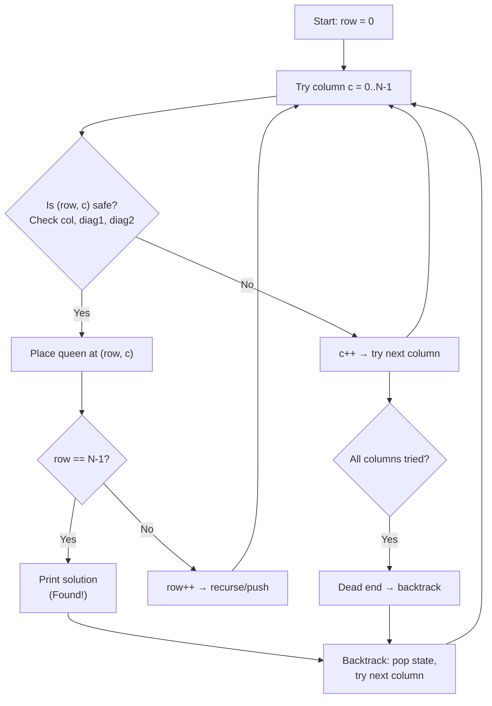

# Chapter 5: Stacks

> **Previous:** [Chapter 4: Doubly Linked List](./04-doubly-linked-list.md) | **Next:** [Queues](./06-queues.md)

## Learning Objectives

- Define the Stack ADT (Last-In-First-Out).
- Implement a stack using arrays and linked lists.
- Apply stacks to expression evaluation, parenthesis matching, and undo functionality.
- Analyze the complexity of each stack operation.

## Why Stacks Matter

**Real-world analogy:** Imagine a stack of plates in a cafeteria. You place clean plates on top (push), and when someone needs a plate, they take the topmost one (pop). The plate at the bottom came first but gets used last. This is exactly Last-In-First-Out (LIFO). Another example — a Pringles can: you can only remove the chip that was inserted last. Stacks appear everywhere in computing: the Call Stack tracks where each function should return after it finishes; the Undo stack (Ctrl+Z) remembers your last edit; your browser's Back button pops the previous page off a navigation stack. Without stacks, recursion, expression evaluation, and depth-first search simply would not work.

## Chapter at a Glance

| Topic | Key Insight | Practical Takeaway |
|-------|-------------|-------------------|
| LIFO Principle | Last-In-First-Out access order | Natural fit for undo and backtracking |
| Array-Based Stack | Contiguous memory, dynamic resizing | Cache-friendly, O(1) amortized push/pop |
| Linked-List Stack | Nodes with top pointer | No resizing overhead, consistent O(1) ops |
| Expression Evaluation | Shunting-yard converts infix to postfix | Postfix eval uses one operand stack |
| Parenthesis Matching | Push opens, pop and match on close | Single stack checks all bracket types |
| MinStack | Auxiliary stack tracks minima | O(1) getMin with O(n) extra space |
| Applications | Function calls, undo, DFS | Used in compilers, browsers, parsers |

## Chapter Roadmap

```mermaid
flowchart LR
    A[Stack LIFO] --> B[Array vs Linked Implementation]
    B --> C[Push / Pop / Top O(1)]
    C --> D[Parenthesis Matching]
    D --> E[Shunting-Yard: Infix to Postfix]
    E --> F[Postfix Evaluation]
    F --> G[MinStack]
    G --> H[Applications: DFS, Undo, Compilers]
```

## Theory


### Stack ADT


> **Pro Tip:** Array-based stacks are cache-friendly and faster for most use cases; linked-list stacks avoid resizing but have higher per-element overhead.

A stack is a linear data structure that supports two primary operations: **push** (insert at the top) and **pop** (remove from the top). The Last-In-First-Out (LIFO) discipline governs access.

**Core operations:**

| Operation | Description | Complexity |
|-----------|-------------|------------|
| `push(x)` | Insert element x at the top | O(1) |
| `pop()` | Remove and return the top element | O(1) |
| `top()` / `peek()` | Return the top element without removing | O(1) |
| `isEmpty()` | Check if the stack is empty | O(1) |
| `size()` | Return the number of elements | O(1) |
## Array-Based Stack

**Real-world analogy:** A stack of books on a desk. The books sit in a contiguous pile on a fixed-size desk (array). When the desk gets full, you move to a bigger desk (resize), copying all books in order. The topmost book is the most recently placed one.

### Algorithm Steps

1. **Initialize:** Allocate an array of initial capacity cap. Set 	opIndex = -1 (empty stack).
2. **Push(value):**
   - If 	opIndex == capacity - 1 (full), resize: allocate new array of 2 * capacity, copy old elements, update capacity.
   - Increment 	opIndex.
   - Store alue at data[topIndex].
3. **Pop():**
   - If isEmpty(), throw underflow error.
   - Read data[topIndex].
   - Decrement 	opIndex.
   - Return the read value.
4. **Top():** If empty, throw error; else return data[topIndex] without modifying.
5. **isEmpty():** Return 	opIndex == -1.

### Pseudocode

`
class ArrayStack:
    data: array of T
    capacity: int
    topIndex: int = -1

    push(value):
        if topIndex == capacity - 1:
            newCap = capacity * 2
            newData = new array[newCap]
            for i = 0 to capacity - 1:
                newData[i] = data[i]
            data = newData
            capacity = newCap
        topIndex = topIndex + 1
        data[topIndex] = value

    pop():
        if isEmpty(): throw "Stack underflow"
        value = data[topIndex]
        topIndex = topIndex - 1
        return value

    top():
        if isEmpty(): throw "Stack is empty"
        return data[topIndex]

    isEmpty():
        return topIndex == -1
`

### Dry Run: Push & Pop Sequence

**Input:** push(10), push(20), push(30), pop(), top()

| Step | Operation | topIndex | Stack Contents (index:value) | Return Value |
|------|-----------|----------|------------------------------|--------------|
| 1 | Initial | -1 | (empty) | --- |
| 2 | push(10) | 0 | [0:10] | --- |
| 3 | push(20) | 1 | [0:10, 1:20] | --- |
| 4 | push(30) | 2 | [0:10, 1:20, 2:30] | --- |
| 5 | pop() | 1 | [0:10, 1:20] | 30 |
| 6 | top() | 1 | [0:10, 1:20] | 20 |

### C++ Implementation

`cpp
#include &lt;iostream&gt;
#include &lt;stdexcept&gt;

template &lt;typename T&gt;
class ArrayStack {
private:
    T* data;
    int capacity;
    int topIndex;

    void resize() {
        int newCap = capacity * 2;
        T* newData = new T[newCap];
        for (int i = 0; i &lt; capacity; ++i) newData[i] = data[i];
        delete[] data;
        data = newData;
        capacity = newCap;
    }

public:
    ArrayStack(int cap = 4) : capacity(cap), topIndex(-1) {
        data = new T[capacity];
    }

    ~ArrayStack() { delete[] data; }

    void push(const T& value) {
        if (topIndex == capacity - 1) resize();
        data[++topIndex] = value;
    }

    T pop() {
        if (isEmpty()) throw std::out_of_range("Stack underflow");
        return data[topIndex--];
    }

    T top() const {
        if (isEmpty()) throw std::out_of_range("Stack is empty");
        return data[topIndex];
    }

    bool isEmpty() const { return topIndex == -1; }
    int size() const { return topIndex + 1; }
};

int main() {
    ArrayStack&lt;int&gt; stack;
    stack.push(10);
    stack.push(20);
    stack.push(30);
    std::cout &lt;< "Top: " << stack.top() << "\n";
    std::cout &lt;< "Size: " << stack.size() << "\n";
    while (!stack.isEmpty())
        std::cout &lt;< "Pop: " << stack.pop() << "\n";
    return 0;
}
`

### Python Implementation

`python
class ArrayStack:
    def __init__(self, cap=4):
        self.data = [None] * cap
        self.capacity = cap
        self.topIndex = -1

    def push(self, value):
        if self.topIndex == self.capacity - 1:
            self.capacity *= 2
            new_data = [None] * self.capacity
            for i in range(len(self.data)):
                new_data[i] = self.data[i]
            self.data = new_data
        self.topIndex += 1
        self.data[self.topIndex] = value

    def pop(self):
        if self.isEmpty():
            raise IndexError("Stack underflow")
        value = self.data[self.topIndex]
        self.topIndex -= 1
        return value

    def top(self):
        if self.isEmpty():
            raise IndexError("Stack is empty")
        return self.data[self.topIndex]

    def isEmpty(self):
        return self.topIndex == -1

    def size(self):
        return self.topIndex + 1


stack = ArrayStack()
stack.push(10)
stack.push(20)
stack.push(30)
print("Top:", stack.top())
print("Size:", stack.size())
while not stack.isEmpty():
    print("Pop:", stack.pop())
`

### Java Implementation

`java
import java.util.EmptyStackException;

public class ArrayStack&lt;T> {
    private T[] data;
    private int capacity;
    private int topIndex;

    @SuppressWarnings("unchecked")
    public ArrayStack(int cap) {
        capacity = cap;
        topIndex = -1;
        data = (T[]) new Object[capacity];
    }

    public ArrayStack() { this(4); }

    private void resize() {
        int newCap = capacity * 2;
        @SuppressWarnings("unchecked")
        T[] newData = (T[]) new Object[newCap];
        for (int i = 0; i &lt; capacity; i++)
            newData[i] = data[i];
        data = newData;
        capacity = newCap;
    }

    public void push(T value) {
        if (topIndex == capacity - 1) resize();
        data[++topIndex] = value;
    }

    public T pop() {
        if (isEmpty()) throw new EmptyStackException();
        return data[topIndex--];
    }

    public T top() {
        if (isEmpty()) throw new EmptyStackException();
        return data[topIndex];
    }

    public boolean isEmpty() { return topIndex == -1; }
    public int size() { return topIndex + 1; }

    public static void main(String[] args) {
        ArrayStack&lt;Integer&gt; stack = new ArrayStack&lt;>();
        stack.push(10);
        stack.push(20);
        stack.push(30);
        System.out.println("Top: " + stack.top());
        System.out.println("Size: " + stack.size());
        while (!stack.isEmpty())
            System.out.println("Pop: " + stack.pop());
    }
}
`

**Output (all three languages):**
`
Top: 30
Size: 3
Pop: 30
Pop: 20
Pop: 10
`

### Complexity Analysis

| Operation | Time | Why |
|-----------|------|-----|
| push() | O(1) amortized | Direct array write at index; resize costs O(n) but happens rarely - doubling makes amortized cost O(1). |
| pop() | O(1) | Just decrement pointer, no shifting. |
| top() | O(1) | Direct index read. |
| isEmpty() | O(1) | Integer comparison. |
| Space | O(n) | Contiguous array holds n elements; may waste up to half the array after a resize. |

**Why amortized O(1)?** Each insertion is O(1) except when resize happens (O(n)). Since we double capacity, resizes occur at sizes 1, 2, 4, 8, ... - only log2(n) resizes for n insertions. The total cost of all resizes is O(n), so average per insertion is O(1).

### Advantages & Disadvantages

| Advantages | Disadvantages |
|------------|---------------|
| Cache-friendly - contiguous memory access | Resize is O(n) when capacity exhausted |
| No per-node memory overhead | Fixed capacity wastes space if oversized |
| O(1) amortized push/pop/top | Shrinking is not implemented (wasted space after many pops) |
| Simple implementation, fewer pointer operations | Back-to-back resizes at capacity boundary can cause latency spikes |

### Edge Cases

- **Push to full stack:** Triggers resize - O(n) copy, but subsequent pushes are O(1) until next full.
- **Pop from empty stack:** Must throw underflow - guard with isEmpty() check.
- **Top on empty stack:** Must throw - guard with isEmpty().
- **Single element:** push then pop leaves stack empty; push again works correctly.
## Linked-List-Based Stack

**Real-world analogy:** A stack of sticky notes where each note has an arrow pointing to the one below it. You stick a new note on top (push) and update the arrow. When you peel the top note off (pop), the arrow redirects to the next one below. Unlike the book stack (array), you never run out of desk space - you just keep adding notes.

### Algorithm Steps

1. **Initialize:** Create `Node` struct with `data` and `next` pointer fields. Set `stackTop = nullptr` and `count = 0`.
2. **Push(value):**
   - Create new node with `data = value`, `next = stackTop`.
   - Set `stackTop = new node`.
   - Increment `count`.
3. **Pop():**
   - If `isEmpty()`, throw underflow error.
   - Save `stackTop->data` in a temporary variable.
   - Set `temp = stackTop`, advance `stackTop = stackTop->next`.
   - Delete `temp`, decrement `count`, return saved data.
4. **Top():** If empty, throw error; else return `stackTop->data`.
5. **isEmpty():** Return `count == 0`.

### Pseudocode

```
class Node:
    data: T
    next: Node

class LinkedStack:
    stackTop: Node = null
    count: int = 0

    push(value):
        newNode = new Node(value)
        newNode.next = stackTop
        stackTop = newNode
        count = count + 1

    pop():
        if isEmpty(): throw "Stack underflow"
        temp = stackTop
        value = temp.data
        stackTop = stackTop.next
        delete temp
        count = count - 1
        return value

    top():
        if isEmpty(): throw "Stack is empty"
        return stackTop.data

    isEmpty():
        return count == 0
```

### Dry Run: Push & Pop Sequence

**Input:** push(5), push(15), top(), pop(), push(25), pop(), pop()

| Step | Operation | stackTop points to | Stack (top to bottom) | Return | count |
|------|-----------|--------------------|-----------------------|--------|-------|
| 1 | Initial | null | (empty) | --- | 0 |
| 2 | push(5) | Node(5) | 5 | --- | 1 |
| 3 | push(15) | Node(15) | 15 -> 5 | --- | 2 |
| 4 | top() | Node(15) | 15 -> 5 | 15 | 2 |
| 5 | pop() | Node(5) | 5 | 15 | 1 |
| 6 | push(25) | Node(25) | 25 -> 5 | --- | 2 |
| 7 | pop() | Node(5) | 5 | 25 | 1 |
| 8 | pop() | null | (empty) | 5 | 0 |

### C++ Implementation

```cpp
#include <iostream>
#include <stdexcept>

template <typename T>
class LinkedStack {
private:
    struct Node {
        T data;
        Node* next;
        Node(const T& value) : data(value), next(nullptr) {}
    };
    Node* stackTop;
    int count;

public:
    LinkedStack() : stackTop(nullptr), count(0) {}

    ~LinkedStack() {
        while (stackTop) {
            Node* temp = stackTop;
            stackTop = stackTop->next;
            delete temp;
        }
    }

    void push(const T& value) {
        Node* newNode = new Node(value);
        newNode->next = stackTop;
        stackTop = newNode;
        ++count;
    }

    T pop() {
        if (isEmpty()) throw std::out_of_range("Stack underflow");
        Node* temp = stackTop;
        T value = temp->data;
        stackTop = stackTop->next;
        delete temp;
        --count;
        return value;
    }

    T top() const {
        if (isEmpty()) throw std::out_of_range("Stack is empty");
        return stackTop->data;
    }

    bool isEmpty() const { return count == 0; }
    int size() const { return count; }
};
```

### Python Implementation

```python
class Node:
    def __init__(self, value):
        self.data = value
        self.next = None

class LinkedStack:
    def __init__(self):
        self.stackTop = None
        self.count = 0

    def push(self, value):
        newNode = Node(value)
        newNode.next = self.stackTop
        self.stackTop = newNode
        self.count += 1

    def pop(self):
        if self.isEmpty():
            raise IndexError("Stack underflow")
        value = self.stackTop.data
        self.stackTop = self.stackTop.next
        self.count -= 1
        return value

    def top(self):
        if self.isEmpty():
            raise IndexError("Stack is empty")
        return self.stackTop.data

    def isEmpty(self):
        return self.count == 0

    def size(self):
        return self.count
```

### Java Implementation

```java
import java.util.EmptyStackException;

public class LinkedStack<T> {
    private class Node {
        T data;
        Node next;
        Node(T value) { data = value; next = null; }
    }
    private Node stackTop;
    private int count;

    public LinkedStack() { stackTop = null; count = 0; }

    public void push(T value) {
        Node newNode = new Node(value);
        newNode.next = stackTop;
        stackTop = newNode;
        count++;
    }

    public T pop() {
        if (isEmpty()) throw new EmptyStackException();
        T value = stackTop.data;
        stackTop = stackTop.next;
        count--;
        return value;
    }

    public T top() {
        if (isEmpty()) throw new EmptyStackException();
        return stackTop.data;
    }

    public boolean isEmpty() { return count == 0; }
    public int size() { return count; }
}
```

### Complexity Analysis

| Operation | Time | Why |
|-----------|------|-----|
| push() | O(1) | Create node + pointer reassignment - no shifting or copying. |
| pop() | O(1) | Redirect stackTop to next node, delete old top - constant work. |
| top() | O(1) | Dereference stackTop pointer. |
| isEmpty() | O(1) | Integer comparison. |
| Space | O(n) | Each node stores data + pointer, 2x memory vs array. |

**Why not O(n) for any operation?** No traversal, no resize - every operation touches only the top node and the stack pointer.

### Advantages & Disadvantages

| Advantages | Disadvantages |
|------------|---------------|
| No capacity limit (until heap exhaustion) | Higher memory per element (data + pointer overhead) |
| Consistent O(1) - no resize latency spikes | Poor cache locality - nodes scattered in heap |
| No wasted space - only stores what it has | Pointer chasing on pop (dereference, then delete) |
| Simple destructor (loop through nodes) | Destructor must traverse entire list (O(n)) |

### Edge Cases

- **Pop from empty:** Must throw underflow - always check `isEmpty()` first.
- **Push many elements:** Works until heap memory is exhausted (std::bad_alloc).
- **Single node:** push then pop leaves list empty; top after that correctly throws.
- **Destructor on large stack:** O(n) cleanup - ensure no exception during destruction.

## Array vs Linked Stack: Comparison Table

| Feature | Array-Based Stack | Linked-List Stack |
|---------|-------------------|-------------------|
| Push time | O(1) amortized | O(1) worst-case |
| Pop time | O(1) | O(1) |
| Top time | O(1) | O(1) |
| Space per element | 1 slot (data only) | Data + pointer (~2x memory) |
| Cache locality | Excellent (contiguous) | Poor (heap-fragmented nodes) |
| Resize cost | O(n) copy on overflow | None - grows node by node |
| Capacity limit | Fixed dynamic max (array size) | System heap limit only |
| Waste | Up to 50% after resize | No waste |
| Implementation complexity | Simple, fewer allocations | More pointer management |
| Destructor cost | O(1) | O(n) |
| Best for | Performance-critical, embedded | Variable-size, no latency spikes |
## Parenthesis Matching

**Real-world analogy:** Check if a sentence written with nested parentheses - like ( [ { } ] ) - closes everything in the correct order. Imagine threading a string through each opening bracket; when you hit a closing bracket, the string must pass back through the matching opening. If a closing bracket doesn't match the most recent opening, the string gets tangled.

### Algorithm Steps

1. Initialize an empty stack.
2. Scan each character `c` in the expression left to right.
3. If `c` is an opening bracket `(`, `{`, or `[`, push it onto the stack.
4. If `c` is a closing bracket `)`, `}`, or `]`:
   - If stack is empty -> invalid (no opening bracket to match).
   - Pop the top of the stack.
   - Check if popped bracket matches `c` (e.g., `(` matches `)`, `{` matches `}`, `[` matches `]`).
   - If mismatch -> invalid.
5. After scanning all characters: if stack is empty -> valid; otherwise -> invalid (unmatched opening brackets).

### Pseudocode

```
function isValidParentheses(s: string) -> bool:
    stack = empty Stack
    for each char c in s:
        if c == '(' or c == '{' or c == '[':
            stack.push(c)
        else:  // closing bracket
            if stack.isEmpty(): return false
            top = stack.pop()
            if (c == ')' and top != '(') return false
            if (c == '}' and top != '{') return false
            if (c == ']' and top != '[') return false
    return stack.isEmpty()
```

### Dry Run: Traces

**Case 1: `({[]})` (valid)**

| Step | Char | Stack (top -> bottom) | Action |
|------|------|-----------------------|--------|
| 1 | ( | ( | Push `(` |
| 2 | { | { ( | Push `{` |
| 3 | [ | [ { ( | Push `[` |
| 4 | ] | { ( | Pop `[` - matches `]` OK |
| 5 | } | ( | Pop `{` - matches `}` OK |
| 6 | ) | (empty) | Pop `(` - matches `)` OK |

Final stack empty -> **valid**.

**Case 2: `({[})` (invalid)**

| Step | Char | Stack (top -> bottom) | Action |
|------|------|-----------------------|--------|
| 1 | ( | ( | Push `(` |
| 2 | { | { ( | Push `{` |
| 3 | [ | [ { ( | Push `[` |
| 4 | } | { ( | Pop `[` - expects `]` but got `}` -> **mismatch** |

Return false -> **invalid**.

**Case 3: `((())` (incomplete)**

| Step | Char | Stack (top -> bottom) | Action |
|------|------|-----------------------|--------|
| 1 | ( | ( | Push |
| 2 | ( | ( ( | Push |
| 3 | ( | ( ( ( | Push |
| 4 | ) | ( ( | Pop - matches OK |
| 5 | ) | ( | Pop - matches OK |
| 6 | End | ( | Stack not empty -> **invalid** |

### C++ Implementation

```cpp
#include <iostream>
#include <string>
#include <stack>

bool isMatching(char open, char close) {
    return (open == '(' && close == ')') ||
           (open == '{' && close == '}') ||
           (open == '[' && close == ']');
}

bool isValidParentheses(const std::string& s) {
    std::stack<char> st;
    for (char c : s) {
        if (c == '(' || c == '{' || c == '[') {
            st.push(c);
        } else if (c == ')' || c == '}' || c == ']') {
            if (st.empty() || !isMatching(st.top(), c)) return false;
            st.pop();
        }
    }
    return st.empty();
}

int main() {
    std::string tests[] = {"(){}[]", "({[]})", "({[})", "((()))", "((())"};
    for (const auto& t : tests) {
        std::cout << t << " -> "
                  << (isValidParentheses(t) ? "valid" : "invalid") << "\n";
    }
    return 0;
}
```

### Python Implementation

```python
def isValidParentheses(s: str) -> bool:
    matching = {')': '(', '}': '{', ']': '['}
    stack = []
    for c in s:
        if c in '({[':
            stack.append(c)
        elif c in ')}]':
            if not stack or stack[-1] != matching[c]:
                return False
            stack.pop()
    return len(stack) == 0


tests = ["(){}[]", "({[]})", "({[})", "((()))", "((())"]
for t in tests:
    print(f"{t} -> {'valid' if isValidParentheses(t) else 'invalid'}")
```

### Java Implementation

```java
import java.util.Stack;

public class ParenthesisChecker {
    static boolean isMatching(char open, char close) {
        return (open == '(' && close == ')') ||
               (open == '{' && close == '}') ||
               (open == '[' && close == ']');
    }

    static boolean isValidParentheses(String s) {
        Stack<Character> st = new Stack<>();
        for (char c : s.toCharArray()) {
            if (c == '(' || c == '{' || c == '[') {
                st.push(c);
            } else if (c == ')' || c == '}' || c == ']') {
                if (st.isEmpty() || !isMatching(st.pop(), c)) return false;
            }
        }
        return st.isEmpty();
    }

    public static void main(String[] args) {
        String[] tests = {"(){}[]", "({[]})", "({[})", "((()))", "((())"};
        for (String t : tests)
            System.out.println(t + " -> " + (isValidParentheses(t) ? "valid" : "invalid"));
    }
}
```

**Output:**
```
(){}[] -> valid
({[]}) -> valid
({[}) -> invalid
((())) -> valid
((()) -> invalid
```

### Complexity Analysis

- **Time:** O(n) - single pass over n characters, each push/pop is O(1).
- **Space:** O(n) - worst case when all characters are opening brackets, stack holds n/2 elements.

**Why O(n)?** We visit each character exactly once; stack operations are constant time. No nested loops.

### Advantages & Disadvantages

| Advantages | Disadvantages |
|------------|---------------|
| Single pass, O(n) time | Only checks structural validity, not semantics |
| Handles all bracket types simultaneously | Fails gracefully on mismatch - early exit |
| Minimal code - stack of just one type | Does not report position of error (can be added) |

### Edge Cases

- **Empty string:** Loop body never executes, stack is empty -> returns true.
- **Only opening brackets:** Stack never empties after scan -> returns false.
- **Only closing brackets:** First closing bracket finds empty stack -> returns false.
- **Single bracket:** `(` -> false, `)` -> false.
- **Intermixed characters like letters/digits:** Ignored by the `if` - only `(){}[]` processed.
- **Very long string (10^6 chars):** Stack may hold 10^6 elements - O(n) memory, risk of stack overflow in recursion-based implementations (iterative approach avoids this).
## Shunting-Yard: Infix to Postfix Conversion

**Real-world analogy:** A train shunting yard where railcars are rearranged on sidings (a siding is a stack). In infix notation, operators sit between operands like `a + b`. In postfix (Reverse Polish Notation), operators follow operands like `a b +`. The shunting-yard algorithm uses an operator stack (the siding) to reorder the cars: operators wait on the siding until higher-priority operators pass through first. Parentheses act like switches that force the siding to dump its cars.

### Algorithm Steps

1. Initialize an empty stack for operators and an empty string `output`.
2. Scan the infix expression left to right.
3. If token is an operand (letter/digit), append it to `output`.
4. If token is `(`, push it onto the stack.
5. If token is `)`:
   - Pop operators from stack to `output` until `(` is encountered.
   - Pop and discard the `(`.
6. If token is an operator (`+`, `-`, `*`, `/`, `^`):
   - While stack is not empty AND stack top is not `(` AND precedence of stack top >= precedence of token:
     - Pop stack top to `output`.
   - Push token onto stack.
7. After scanning all tokens, pop all remaining operators from stack to `output`.

**Precedence table:** `^` = 3, `*`/`/` = 2, `+`/`-` = 1, `(` = 0.

### Pseudocode

```
function infixToPostfix(expr: string) -> string:
    stack = empty Stack
    output = ""

    for each char c in expr:
        if isOperand(c):
            output += c
        else if c == '(':
            stack.push(c)
        else if c == ')':
            while not stack.isEmpty() and stack.top() != '(':
                output += stack.pop()
            stack.pop()  // remove '('
        else:  // operator
            while not stack.isEmpty() and precedence(stack.top()) >= precedence(c):
                output += stack.pop()
            stack.push(c)

    while not stack.isEmpty():
        output += stack.pop()
    return output
```

### Dry Run: `a+b*(c-d)/e`

| Step | Token | Stack (top -> bottom) | Output | Action |
|------|-------|-----------------------|--------|--------|
| 1 | a | (empty) | a | Append operand |
| 2 | + | + | a | Stack empty -> push |
| 3 | b | + | ab | Append operand |
| 4 | * | * + | ab | `*` > `+` -> push |
| 5 | ( | ( * + | ab | Push `(` |
| 6 | c | ( * + | abc | Append operand |
| 7 | - | - ( * + | abc | Push `-` inside `(` |
| 8 | d | - ( * + | abcd | Append operand |
| 9 | ) | * + | abcd- | Pop until `(` |
| 10 | / | / + | abcd-* | Pop `*` (>=), then push `/` |
| 11 | e | / + | abcd-*e | Append operand |
| 12 | End | (empty) | abcd-*e/+ | Pop all |

**Result:** `abcd-*e/+`

### C++ Implementation

```cpp
#include <iostream>
#include <string>
#include <stack>
#include <cctype>

int precedence(char op) {
    if (op == '+' || op == '-') return 1;
    if (op == '*' || op == '/') return 2;
    if (op == '^') return 3;
    return 0;
}

std::string infixToPostfix(const std::string& expr) {
    std::stack<char> st;
    std::string result;

    for (char c : expr) {
        if (std::isalnum(c)) {
            result += c;
        } else if (c == '(') {
            st.push(c);
        } else if (c == ')') {
            while (!st.empty() && st.top() != '(') {
                result += st.top(); st.pop();
            }
            st.pop();
        } else {
            while (!st.empty() && precedence(st.top()) >= precedence(c)) {
                result += st.top(); st.pop();
            }
            st.push(c);
        }
    }

    while (!st.empty()) {
        result += st.top(); st.pop();
    }
    return result;
}

int main() {
    std::string expr = "a+b*(c-d)/e";
    std::cout << "Infix:   " << expr << "\n";
    std::cout << "Postfix: " << infixToPostfix(expr) << "\n";
    return 0;
}
```

### Python Implementation

```python
def precedence(op):
    if op in ('+', '-'): return 1
    if op in ('*', '/'): return 2
    if op == '^': return 3
    return 0

def infixToPostfix(expr):
    stack = []
    result = []
    for c in expr:
        if c.isalnum():
            result.append(c)
        elif c == '(':
            stack.append(c)
        elif c == ')':
            while stack and stack[-1] != '(':
                result.append(stack.pop())
            stack.pop()
        else:
            while stack and precedence(stack[-1]) >= precedence(c):
                result.append(stack.pop())
            stack.append(c)
    while stack:
        result.append(stack.pop())
    return ''.join(result)


expr = "a+b*(c-d)/e"
print("Infix:   ", expr)
print("Postfix: ", infixToPostfix(expr))
```

### Java Implementation

```java
import java.util.Stack;

public class ShuntingYard {
    static int precedence(char op) {
        if (op == '+' || op == '-') return 1;
        if (op == '*' || op == '/') return 2;
        if (op == '^') return 3;
        return 0;
    }

    static String infixToPostfix(String expr) {
        Stack<Character> st = new Stack<>();
        StringBuilder result = new StringBuilder();

        for (char c : expr.toCharArray()) {
            if (Character.isLetterOrDigit(c)) {
                result.append(c);
            } else if (c == '(') {
                st.push(c);
            } else if (c == ')') {
                while (!st.isEmpty() && st.peek() != '(')
                    result.append(st.pop());
                st.pop();
            } else {
                while (!st.isEmpty() && precedence(st.peek()) >= precedence(c))
                    result.append(st.pop());
                st.push(c);
            }
        }

        while (!st.isEmpty())
            result.append(st.pop());

        return result.toString();
    }

    public static void main(String[] args) {
        String expr = "a+b*(c-d)/e";
        System.out.println("Infix:   " + expr);
        System.out.println("Postfix: " + infixToPostfix(expr));
    }
}
```

**Output:**
```
Infix:   a+b*(c-d)/e
Postfix: abcd-*e/+
```

### Complexity Analysis

- **Time:** O(n) - each character is pushed and popped at most once.
- **Space:** O(n) - the operator stack holds at most n operators in worst case (e.g., `a+b+c+d+...`).

**Why O(n)?** Each token is processed once. Push/pop on stack is O(1). The inner `while` loop pops operators, but each operator is pushed exactly once, so total pops across the entire run is &lt;= n.

### Advantages & Disadvantages

| Advantages | Disadvantages |
|------------|---------------|
| O(n) time, single pass | Handles only single-character operators |
| Produces parentheses-free postfix | Assumes correct associativity (left-to-right for +,-,*,/) |
| Operator precedence is extensible | Does not handle function calls or commas without extension |
| Foundation for expression evaluators | Output requires a second pass for evaluation |

### Edge Cases

- **Empty expression:** Returns empty string.
- **Single operand:** `a` -> `a` (no change).
- **Single operator:** `a+b` -> `ab+`.
- **Nested parentheses:** `((a+b)*c)` -> `ab+c*`.
- **Unmatched `(`:** Stack will not be empty at end - remaining `(` is popped to output, producing incorrect postfix.
- **Unmatched `)`:** Stack is empty but `)` encountered - stack top check fails; requires input validation.
- **Consecutive operators:** `a+-b` produces `a+b-` which may not match semantics (unary minus not handled).
## Postfix Expression Evaluation

**Real-world analogy:** A calculator that works with Reverse Polish Notation (RPN). HP calculators use RPN - you enter numbers, press Enter to push them onto an operand stack, then press an operator that pops the top two, computes, and pushes the result. This mirrors exactly how the stack evaluates postfix.

### Algorithm Steps

1. Initialize an empty stack for operands.
2. Scan the postfix expression left to right.
3. If token is an operand (digit), push it onto the stack (as integer).
4. If token is an operator (`+`, `-`, `*`, `/`):
   - Pop `b` (top), then pop `a` (next) - note order: `a` was pushed first.
   - Compute `a operator b`.
   - Push the result back onto the stack.
5. After scanning all tokens, the stack should contain exactly one value - the result.

**Division handling:** Use integer division for this example; in real systems, use float.

### Pseudocode

```
function evaluatePostfix(expr: string) -> int:
    stack = empty Stack

    for each char c in expr:
        if isDigit(c):
            stack.push(int(c) - int('0'))
        else:
            b = stack.pop()
            a = stack.pop()
            if c == '+': stack.push(a + b)
            if c == '-': stack.push(a - b)
            if c == '*': stack.push(a * b)
            if c == '/': stack.push(a / b)

    return stack.pop()
```

### Dry Run: `23*54*+9-`

**Expression:** `2 3 * 5 4 * + 9 -` = (2x3) + (5x4) - 9 = 6 + 20 - 9 = 17

| Step | Token | Stack (top -> bottom) | Action |
|------|-------|-----------------------|--------|
| 1 | 2 | 2 | Push |
| 2 | 3 | 3 2 | Push |
| 3 | * | 6 | Pop 3, pop 2, 2x3=6, push result |
| 4 | 5 | 5 6 | Push |
| 5 | 4 | 4 5 6 | Push |
| 6 | * | 20 6 | Pop 4, pop 5, 5x4=20, push result |
| 7 | + | 26 | Pop 20, pop 6, 6+20=26, push result |
| 8 | 9 | 9 26 | Push |
| 9 | - | 17 | Pop 9, pop 26, 26-9=17, push result |

**Result:** 17

### C++ Implementation

```cpp
#include <iostream>
#include <string>
#include <stack>
#include <cctype>

int evaluatePostfix(const std::string& expr) {
    std::stack<int> st;
    for (char c : expr) {
        if (std::isdigit(c)) {
            st.push(c - '0');
        } else {
            int b = st.top(); st.pop();
            int a = st.top(); st.pop();
            switch (c) {
                case '+': st.push(a + b); break;
                case '-': st.push(a - b); break;
                case '*': st.push(a * b); break;
                case '/': st.push(a / b); break;
                default: throw std::invalid_argument("Unknown operator");
            }
        }
    }
    return st.top();
}

int main() {
    std::string expr = "23*54*+9-";
    std::cout << "Postfix: " << expr << " = " << evaluatePostfix(expr) << "\n";
    return 0;
}
```

### Python Implementation

```python
def evaluatePostfix(expr):
    stack = []
    for c in expr:
        if c.isdigit():
            stack.append(int(c))
        else:
            b = stack.pop()
            a = stack.pop()
            if c == '+': stack.append(a + b)
            elif c == '-': stack.append(a - b)
            elif c == '*': stack.append(a * b)
            elif c == '/': stack.append(a // b)  # integer division
    return stack[0]


expr = "23*54*+9-"
print(f"Postfix: {expr} = {evaluatePostfix(expr)}")
```

### Java Implementation

```java
import java.util.Stack;

public class PostfixEvaluator {
    static int evaluatePostfix(String expr) {
        Stack<Integer> st = new Stack<>();
        for (char c : expr.toCharArray()) {
            if (Character.isDigit(c)) {
                st.push(c - '0');
            } else {
                int b = st.pop();
                int a = st.pop();
                switch (c) {
                    case '+': st.push(a + b); break;
                    case '-': st.push(a - b); break;
                    case '*': st.push(a * b); break;
                    case '/': st.push(a / b); break;
                }
            }
        }
        return st.pop();
    }

    public static void main(String[] args) {
        String expr = "23*54*+9-";
        System.out.println("Postfix: " + expr + " = " + evaluatePostfix(expr));
    }
}
```

**Output:**
```
Postfix: 23*54*+9- = 17
```

### Complexity Analysis

- **Time:** O(n) - single pass, each push/pop is O(1).
- **Space:** O(n) - stack holds at most the number of operands.

**Why O(n)?** Exactly n tokens, each processed once with O(1) operations. The stack never exceeds the operand count (about n/2 in worst case).

### Advantages & Disadvantages

| Advantages | Disadvantages |
|------------|---------------|
| No parentheses needed - operator order is unambiguous | Requires conversion from infix first |
| Single-stack, single-pass evaluation | Single-character operands in this example (can be extended to multi-digit) |
| Deterministic - no precedence rules to evaluate | Division truncation depends on language (integer vs float) |
| Used in real HP calculators and some compilers | Error recovery is difficult - malformed expressions crash |

### Edge Cases

- **Single operand:** `5` -> result is 5.
- **Single operator requires two operands:** `5+` - pop fails, underflow -> error.
- **Division by zero:** `50/` - runtime error (integer division by zero).
- **Insufficient operands:** `34+5` - stack ends with 2 values, extra operand signals malformed expression.
- **Multi-digit numbers:** Not handled by single-char parsing - need delimiter-aware tokenizer.
- **Negative results:** `32-` -> -1 - handled naturally by subtraction order: a - b where a was first operand.
## MinStack (O(1) getMin)

**Real-world analogy:** A stack of boxes where each box has a label showing the smallest weight among all boxes below it, including itself. When you add a new box, you compare its weight against the current minimum label - if lighter, the new label is its own weight; otherwise, the label copies the previous minimum. This way, you always know the lightest box without searching the whole pile.

### Algorithm Steps

1. Maintain two stacks: `mainStack` (all elements) and `minStack` (running minima).
2. **push(value):**
   - Push `value` onto `mainStack`.
   - If `minStack` is empty OR `value <= minStack.top()`, push `value` onto `minStack`.
3. **pop():**
   - Pop `mainStack`. If the popped value equals `minStack.top()`, also pop `minStack`.
4. **top():** Return `mainStack.top()`.
5. **getMin():** Return `minStack.top()`.

### Pseudocode

```
class MinStack:
    mainStack: Stack
    minStack: Stack

    push(value):
        mainStack.push(value)
        if minStack.isEmpty() or value <= minStack.top():
            minStack.push(value)

    pop():
        if mainStack.isEmpty(): throw "Stack underflow"
        value = mainStack.pop()
        if value == minStack.top():
            minStack.pop()
        return value

    top():
        return mainStack.top()

    getMin():
        if minStack.isEmpty(): throw "No minimum"
        return minStack.top()
```

### Dry Run: push(5), push(2), push(7), push(2), pop(), getMin()

| Step | Operation | mainStack (top->bottom) | minStack (top->bottom) | getMin() |
|------|-----------|------------------------|------------------------|----------|
| 1 | push(5) | 5 | 5 | --- |
| 2 | push(2) | 2, 5 | 2, 5 | --- |
| 3 | push(7) | 7, 2, 5 | 2, 5 (7 > 2, no push) | --- |
| 4 | push(2) | 2, 7, 2, 5 | 2, 2, 5 (2 &lt;= 2, push) | --- |
| 5 | pop() | 7, 2, 5 | 2, 5 (popped 2 == min top 2) | --- |
| 6 | getMin() | 7, 2, 5 | 2, 5 | **2** |

### C++ Implementation

```cpp
#include <iostream>
#include <stack>
#include <stdexcept>

class MinStack {
private:
    std::stack<int> mainStack;
    std::stack<int> minStack;

public:
    void push(int value) {
        mainStack.push(value);
        if (minStack.empty() || value <= minStack.top())
            minStack.push(value);
    }

    int pop() {
        if (mainStack.empty()) throw std::out_of_range("Stack underflow");
        int value = mainStack.top(); mainStack.pop();
        if (value == minStack.top()) minStack.pop();
        return value;
    }

    int top() {
        if (mainStack.empty()) throw std::out_of_range("Stack is empty");
        return mainStack.top();
    }

    int getMin() {
        if (minStack.empty()) throw std::out_of_range("No minimum element");
        return minStack.top();
    }
};

int main() {
    MinStack ms;
    ms.push(5); ms.push(2); ms.push(7); ms.push(2);
    std::cout << "getMin: " << ms.getMin() << "\n";  // 2
    ms.pop();
    std::cout << "getMin: " << ms.getMin() << "\n";  // 2
    ms.pop();
    std::cout << "getMin: " << ms.getMin() << "\n";  // 2
    ms.pop();
    std::cout << "getMin: " << ms.getMin() << "\n";  // 5
    return 0;
}
```

### Python Implementation

```python
class MinStack:
    def __init__(self):
        self.mainStack = []
        self.minStack = []

    def push(self, value):
        self.mainStack.append(value)
        if not self.minStack or value <= self.minStack[-1]:
            self.minStack.append(value)

    def pop(self):
        if not self.mainStack:
            raise IndexError("Stack underflow")
        value = self.mainStack.pop()
        if value == self.minStack[-1]:
            self.minStack.pop()
        return value

    def top(self):
        if not self.mainStack:
            raise IndexError("Stack is empty")
        return self.mainStack[-1]

    def getMin(self):
        if not self.minStack:
            raise IndexError("No minimum element")
        return self.minStack[-1]


ms = MinStack()
for v in [5, 2, 7, 2]:
    ms.push(v)
print("getMin:", ms.getMin())  # 2
ms.pop()
print("getMin:", ms.getMin())  # 2
```

### Java Implementation

```java
import java.util.Stack;

class MinStack {
    private Stack<Integer> mainStack;
    private Stack<Integer> minStack;

    public MinStack() {
        mainStack = new Stack<>();
        minStack = new Stack<>();
    }

    public void push(int value) {
        mainStack.push(value);
        if (minStack.isEmpty() || value <= minStack.peek())
            minStack.push(value);
    }

    public int pop() {
        if (mainStack.isEmpty()) throw new RuntimeException("Stack underflow");
        int value = mainStack.pop();
        if (value == minStack.peek()) minStack.pop();
        return value;
    }

    public int top() {
        if (mainStack.isEmpty()) throw new RuntimeException("Stack is empty");
        return mainStack.peek();
    }

    public int getMin() {
        if (minStack.isEmpty()) throw new RuntimeException("No minimum element");
        return minStack.peek();
    }
}
```

### Complexity Analysis

| Operation | Time | Why |
|-----------|------|-----|
| push() | O(1) | Two stack pushes (main + conditional min) - all O(1) |
| pop() | O(1) | One main pop + conditional min pop |
| top() | O(1) | Direct stack peek |
| getMin() | O(1) | Direct minStack peek - the key advantage |
| Space | O(n) | Two stacks, but minStack &lt;= mainStack always |

**Why not O(1) without an aux stack?** If we stored min in a single variable, a pop that removes the current minimum would require scanning the remaining stack to find the new min - O(n). The auxiliary stack trades O(n) extra space for O(1) getMin.

### Advantages & Disadvantages

| Advantages | Disadvantages |
|------------|---------------|
| O(1) for all operations including getMin | O(n) extra space (duplicated minima) |
| Simple, intuitive aux-stack approach | Space optimization possible (store pairs or diff encoding) |
| Works with standard stack libraries | Duplicates repeated values (can be optimized to store count, not copies) |

### Edge Cases

- **Empty stack getMin():** Must throw - no elements.
- **Single element:** Both stacks hold the same value.
- **Duplicate minima:** `5, 2, 2` - both `2`s are pushed to minStack; pop removes only one, preserving the other `2` as min.
- **Descending sequence:** `5, 4, 3, 2, 1` - every push adds to minStack (O(n) space).
- **Ascending sequence:** `1, 2, 3, 4, 5` - minStack stays at size 1 (only the first `1`).

### Space Optimization

If duplicates are frequent, store `pair(value, count)` in minStack instead of bare values. Push when `value < minStack.top().value`; increment count when `value == minStack.top().value`; decrement count on matching pop. This reduces worst-case space for repeated values.
## Interview Corner

### 1. MinStack (LeetCode 155)

Design a stack that supports push, pop, top, and retrieving the minimum element in constant time. Already covered above - the aux-stack solution is the standard approach expected in interviews.

### 2. Next Greater Element (NGE)

**Problem:** Given an array, find the next greater element for each element. The next greater element is the first larger element to its right. If none exists, output -1.

**Example:** `[4, 5, 2, 10, 8]` -> `[5, 10, 10, -1, -1]`

**Algorithm:**
1. Initialize an empty stack and an array `result` filled with -1.
2. Traverse the array left to right.
3. While stack is not empty AND `arr[i] > arr[stack.top()]`, set `result[stack.top()] = arr[i]` and pop.
4. Push `i` onto the stack.

```cpp
vector<int> nextGreaterElement(const vector<int>& arr) {
    vector<int> result(arr.size(), -1);
    stack<int> st;
    for (int i = 0; i < arr.size(); ++i) {
        while (!st.empty() && arr[i] > arr[st.top()]) {
            result[st.top()] = arr[i];
            st.pop();
        }
        st.push(i);
    }
    return result;
}
```

### 3. Stock Span Problem

**Problem:** The stock span is the number of consecutive days a stock price is less than or equal to the current day's price before it.

**Algorithm:** Use a stack of indices. For each day, pop all indices where `price[top] <= price[current]`. The span is `current - stack.top()` (or `current + 1` if stack is empty).

```cpp
vector<int> stockSpan(const vector<int>& prices) {
    vector<int> span(prices.size());
    stack<int> st;
    for (int i = 0; i < prices.size(); ++i) {
        while (!st.empty() && prices[st.top()] <= prices[i])
            st.pop();
        span[i] = st.empty() ? i + 1 : i - st.top();
        st.push(i);
    }
    return span;
}
```

**Example:** `[100, 80, 60, 70, 60, 75, 85]` -> `[1, 1, 1, 2, 1, 4, 6]`

### 4. Two Stacks in One Array

**Problem:** Implement two stacks in a single array efficiently.

**Approach:** Use one array of size n with two pointers: `top1 = -1` (left stack grows right) and `top2 = n` (right stack grows left). Stack overflows when `top1 + 1 == top2`.

```cpp
class TwoStacks {
private:
    int* arr;
    int capacity;
    int top1, top2;
public:
    TwoStacks(int n) : capacity(n), top1(-1), top2(n) {
        arr = new int[n];
    }

    void push1(int x) {
        if (top1 + 1 == top2) throw overflow_error("Stack overflow");
        arr[++top1] = x;
    }

    void push2(int x) {
        if (top1 + 1 == top2) throw overflow_error("Stack overflow");
        arr[--top2] = x;
    }

    int pop1() {
        if (top1 == -1) throw underflow_error("Stack underflow");
        return arr[top1--];
    }

    int pop2() {
        if (top2 == capacity) throw underflow_error("Stack underflow");
        return arr[top2++];
    }
};
```

### 5. Stack Using Queue

**Problem:** Implement a stack using only queues.

**Approach (single queue):** On push, push the new element, then rotate the queue by popping and re-pushing all existing elements. This makes the newest element the front of the queue.

```cpp
class StackUsingQueue {
private:
    queue<int> q;
public:
    void push(int x) {
        q.push(x);
        for (int i = 0; i < q.size() - 1; ++i) {
            q.push(q.front());
            q.pop();
        }
    }
    int pop() {
        int val = q.front(); q.pop();
        return val;
    }
    int top() { return q.front(); }
    bool empty() { return q.empty(); }
};
```

**Complexity:** push = O(n), pop = O(1), top = O(1).

### 6. The Celebrity Problem

**Problem:** In a party of n people, a celebrity is someone known by everyone but knows no one. Find the celebrity with minimum questions.

**Algorithm (stack-based):**
1. Push all people 0..n-1 onto a stack.
2. While stack has >= 2 people: pop A and B. If A knows B, A is not celebrity -> push B back. If A does not know B, B is not celebrity -> push A back.
3. The last remaining candidate must be verified by checking all others.

```cpp
int findCelebrity(int n, vector<vector<int>>& knows) {
    stack<int> st;
    for (int i = 0; i < n; ++i) st.push(i);

    while (st.size() > 1) {
        int a = st.top(); st.pop();
        int b = st.top(); st.pop();
        if (knows[a][b]) st.push(b);
        else st.push(a);
    }

    int candidate = st.top();
    for (int i = 0; i < n; ++i) {
        if (i != candidate && (!knows[i][candidate] || knows[candidate][i]))
            return -1;
    }
    return candidate;
}
```

## Applications in Real Systems

### 1. Call Stack (OS / Runtime)

Every function call pushes a **stack frame** containing return address, local variables, and parameters onto the call stack. When a function returns, its frame is popped. Deep recursion causes stack overflow - the OS terminates the process. This is the most fundamental stack in computing.

### 2. Undo / Redo (Ctrl+Z / Ctrl+Y)

Text editors and IDEs maintain a stack of states. Each edit pushes a snapshot. Ctrl+Z pops the last state and restores it. Often paired with a redo stack: undo pops from undo stack and pushes onto redo stack; redo does the reverse.

### 3. Expression Evaluators

Compilers convert infix expressions to postfix (shunting-yard) and evaluate them with a stack (postfix evaluation). Calculators, spreadsheet formula engines, and database query optimizers all use stack-based expression evaluation.

### 4. Depth-First Search (DFS)

Graph traversal uses a stack explicitly (iterative DFS) or implicitly through recursion (the call stack). The stack tracks which vertices to visit next. Backtracking algorithms (maze solving, N-Queens) are DFS on the solution space.

### 5. Browser Back Button

Browsers push visited URLs onto a navigation stack. The Back button pops the top URL and navigates to it. Forward navigation uses a second stack: Back pushes onto the forward stack; Forward pops from it.

### 6. Syntax Parsing (Compilers)

Compilers use operator-precedence parsers that are essentially stack automata. JSON/XML parsers use stacks to track tag/brace nesting. HTML validators use stacks to ensure proper tag closure.

### 7. Memory Management

Garbage collectors (Java, Go) use a stack of root references during mark phase. The thread scheduler maintains a run queue per thread (though it is a deque, not a pure stack).

### 8. Tower of Hanoi

The classic recursive puzzle models the LIFO constraint - a disk can only be placed on top of a larger disk, matching stack push/pop semantics.

## Pro Tips

> **Remember:** Stack overflow from deep recursion can be avoided by converting to an explicit iterative stack - this is critical for processing large datasets without crashing.

- **Use a stack to detect balanced brackets**: Push opening brackets; pop and match on closing. If the stack isn't empty at the end, or the wrong bracket is on top - invalid.
- **Postfix evaluation is stack's killer app**: Push operands; when you see an operator, pop two operands, apply, push result. One stack, no recursion, no parentheses needed.
- **getMin() in O(1) needs an auxiliary stack**: The main stack holds values; the min stack tracks the current minimum at each level. On pop, if the popped value equals the min stack's top, pop the min stack too.
- **Stack overflow = recursion too deep**: Every recursive call pushes a stack frame. Deep recursion (10k+ levels) overflows the call stack. Convert to explicit stack iteration for large inputs.
- **Monotonic stack pattern**: For problems like Next Greater Element or Stock Span, a monotonic (decreasing/increasing) stack reduces O(n^2) brute-force to O(n). The stack holds indices, and elements are popped when a larger/smaller element is found.

## One-Sentence Takeaways

- LIFO means the last pushed element is the first popped.
- Array stacks use less memory; linked stacks never overflow.
- Balanced parentheses are checked with a single stack.
- Postfix expression evaluation uses a single stack of operands.
- Shunting-yard converts infix to postfix via operator stack.
- MinStack uses an auxiliary stack for O(1) getMin.
- Stacks model recursion, undo, and depth-first search.
- Monotonic stacks solve NGE and stock span in O(n) time.

## Concept Comparison Table

| Feature | Array-based Stack | Linked Stack |
|---------|-------------------|--------------|
| Push | O(1) amortized | O(1) |
| Pop | O(1) | O(1) |
| Top | O(1) | O(1) |
| Memory | Contiguous (may overallocate) | Per-node allocation |
| Overflow | Resizes dynamically | Never (until heap full) |
| Cache locality | Excellent | Poor |
| Per-element memory | 1 word | 2 words (data + pointer) |
| Destructor cost | O(1) (delete[] array) | O(n) (traverse all nodes) |

## Quick Reference: Stack Use Cases

| Problem | How Stack Is Used |
|---------|------------------|
| Balanced parentheses | Push opens, pop on close, check match |
| Postfix evaluation | Push operands, pop for operator, push result |
| Infix to Postfix (Shunting-yard) | Operator precedence stack |
| DFS traversal | Explicit stack of nodes to visit |
| Undo (Ctrl+Z) | Stack of previous states |
| Call stack (function calls) | Return addresses + local variables |
| Next Greater Element | Monotonic stack of indices |
| Stock Span | Monotonic stack, span = index - stack.top |
| MinStack | Auxiliary stack of minima |
| Browser back button | Stack of visited URLs |

## Cross-Application Matrix

| Application | Stack Type | Justification |
|-------------|-----------|---------------|
| Expression parser | Operator stack | Infix to postfix conversion |
| Undo system | Object stack | Push states, pop to undo |
| DFS traversal | Node stack | LIFO for backtracking |
| Back-button navigation | URL stack | Push pages, pop for back |
| Recursion emulation | Frame stack | Simulate call stack iteratively |
| Browser history | URL dual-stack | Back + forward stacks |
| Code editor undo | Snapshot stack | Push edits, pop to revert |
| Compiler syntax analysis | Token stack | Parse-tree construction |
| Runtime call stack | Frame stack | Function return management |

## Common Mistakes & GFG Deepening

### Common Mistakes (GFG-Style)

| Mistake | Why It's Wrong | Correct Approach |
|---------|----------------|------------------|
| Forgetting to check isEmpty before pop/top | Calling pop on empty stack causes underflow | Always guard with `if (isEmpty()) throw ...` |
| Using recursion when an explicit stack would be safer | Deep recursion overflows the call stack | Convert to iterative stack for depth > 1000 |
| Confusing stack growth direction | Stack can grow upward (increasing index) or downward | Choose one convention and be consistent |
| Not resizing the array stack when full | Overwriting memory beyond buffer leads to corruption | Always check cap and double before push |
| Assuming push is always O(1) (ignoring resize) | When capacity is exhausted, resize costs O(n) | Use amortized analysis: O(1) amortized, O(n) worst-case |
| Popping from a linked-stack but deleting the wrong node | Must save temp pointer before moving stackTop | `temp = stackTop; stackTop = stackTop.next; delete temp;` |

### TypeScript Stack Implementation

```typescript
interface IStack<T> {
    push(item: T): void;
    pop(): T | undefined;
    peek(): T | undefined;
    isEmpty(): boolean;
    size(): number;
}

class ArrayStack<T> implements IStack<T> {
    private data: T[] = [];
    push(item: T): void { this.data.push(item); }
    pop(): T | undefined { return this.data.pop(); }
    peek(): T | undefined { return this.data[this.data.length - 1]; }
    isEmpty(): boolean { return this.data.length === 0; }
    size(): number { return this.data.length; }
}

class LinkedStack<T> implements IStack<T> {
    private top: { data: T; next: any } | null = null;
    private _size: number = 0;

    push(item: T): void {
        this.top = { data: item, next: this.top };
        this._size++;
    }

    pop(): T | undefined {
        if (!this.top) return undefined;
        const item = this.top.data;
        this.top = this.top.next;
        this._size--;
        return item;
    }

    peek(): T | undefined { return this.top?.data; }
    isEmpty(): boolean { return this._size === 0; }
    size(): number { return this._size; }
}

// MinStack with O(1) getMin
class MinStack {
    private stack: number[] = [];
    private mins: number[] = [];

    push(val: number): void {
        this.stack.push(val);
        if (this.mins.length === 0 || val <= this.mins[this.mins.length - 1]) {
            this.mins.push(val);
        }
    }

    pop(): number | undefined {
        if (this.stack.length === 0) return undefined;
        const val = this.stack.pop()!;
        if (val === this.mins[this.mins.length - 1]) this.mins.pop();
        return val;
    }

    peek(): number | undefined { return this.stack[this.stack.length - 1]; }
    getMin(): number | undefined { return this.mins[this.mins.length - 1]; }
}

// Parenthesis matching
function isValidParentheses(s: string): boolean {
    const stack: string[] = [];
    const map: Record<string, string> = { ')': '(', '}': '{', ']': '[' };
    for (const c of s) {
        if ('({['.includes(c)) stack.push(c);
        else if (')}]'.includes(c)) {
            if (stack.pop() !== map[c]) return false;
        }
    }
    return stack.length === 0;
}
```

### Additional MCQs (GFG Pattern)

8. **What is the minimum number of stacks needed to implement a queue?**
   - a) 1
   - b) 2 ✓
   - c) 3
   - d) 4

9. **Which of the following is NOT an application of stacks?**
   - a) Function call management
   - b) Breadth-First Search ✓
   - c) Expression evaluation
   - d) Undo operation

10. **In the linked-list stack implementation, where does push insert the new node?**
    - a) At the tail
    - b) At the head ✓
    - c) At the middle
    - d) After traversing to the end

11. **What is the time complexity of the `getMin()` operation in the MinStack design?**
    - a) O(n)
    - b) O(log n)
    - c) O(1) ✓
    - d) O(n²)

12. **The postfix expression `23*54*+` evaluates to:**
    - a) 26 ✓
    - b) 30
    - c) 17
    - d) 22

13. **Stack overflow typically occurs when:**
    - a) The linked stack runs out of heap memory
    - b) The recursion depth exceeds the call stack limit ✓
    - c) The array stack is full
    - d) Both a and c

**Answers:** 8-b, 9-b, 10-b, 11-c, 12-a, 13-b

### Additional Exercises (GFG Pattern)

14. **Implement two stacks in one array**: Design a data structure that supports two stacks using a single array. Both stacks should use O(1) push/pop/peek.

15. **Sort a stack using another stack**: Given a stack, sort it in ascending order (largest at top) using only one additional stack and no other data structures.

16. **Reverse a stack using recursion**: Reverse the contents of a stack without using any loop or extra stack. Use only recursion and the stack's own push/pop operations.

17. **Check for balanced brackets with multiple types**: Extend the bracket matching to handle `()`, `{}`, `[]`, `<>`, `«»` — any set of matching pairs.

18. **Infix to prefix conversion**: Modify the shunting-yard algorithm to produce prefix (Polish) notation instead of postfix.

19. **Evaluate prefix expression**: Given a prefix expression (e.g., `+ * 2 3 5`), evaluate it using a stack.

20. **Largest rectangle in a histogram**: Given an array of bar heights, find the largest rectangular area possible. Solve in O(n) using a stack.

21. **Next smaller element**: For each element in an array, find the next smaller element to its right. Use a stack for O(n) solution.

22. **Maximum area of a submatrix with all 1s**: Given a binary matrix, find the maximum area of a submatrix containing all 1s. Use stack-based histogram for each row.

23. **Remove duplicate letters**: Given a string, remove duplicate letters to produce the smallest lexicographic result. Use a monotonic stack approach.
   - c) Linear Input, Fixed Output
   - d) Long In, First Out

2. **What is the time complexity of stack push (array-based, amortized)?**
   - a) O(1)
   - b) O(log n)
   - c) O(n)
   - d) O(n^2)

3. **Which algorithm converts infix to postfix?**
   - a) Floyd's algorithm
   - b) Shunting-yard
   - c) Dijkstra's algorithm
   - d) Kahn's algorithm

4. **Postfix `3 4 + 2 *` evaluates to:**
   - a) 10
   - b) 14
   - c) 9
   - d) 7

5. **A MinStack with O(1) getMin() uses:**
   - a) Two stacks
   - b) Two queues
   - c) Hash table
   - d) Binary tree

6. **What does the monotonic stack pattern optimize?**
   - a) Sorting
   - b) NGE and stock span
   - c) Binary search
   - d) Heap operations

7. **Which is NOT an application of stacks?**
   - a) Browser back button
   - b) Undo in text editors
   - c) Shortest path in weighted graphs
   - d) Function call management

**Answers:** 1-a, 2-a, 3-b, 4-b, 5-a, 6-b, 7-c

## Stack-Based Backtracking: N-Queens Problem

### Real-World Analogy

Think of a **maze explorer** who places breadcrumbs at each fork. When they hit a dead end, they backtrack to the last fork (pop the breadcrumb) and try a different path. Stacks naturally model this backtracking: each choice is pushed onto the stack; when a dead end is reached, the choice is popped and the next alternative is tried.

### Problem: N-Queens

Place N queens on an N×N chessboard such that no two queens attack each other. Queens attack along rows, columns, and diagonals.

### Algorithm (Iterative Backtracking with Stack)

1. Push an empty board state (row = 0, no queens placed).
2. While the stack is not empty:
   - Pop the current state (row, column placements).
   - If row == N: a solution is found — print and continue.
   - For each column c from 0 to N-1:
     - If placing a queen at (row, c) is safe (no conflicts with existing queens):
       - Push (row + 1, placements + [c]) onto the stack.



### TypeScript — N-Queens with Iterative Stack

```typescript
function solveNQueens(n: number): string[][] {
    const solutions: string[][] = [];

    // Stack entry: [row, columns_placed_so_far]
    type State = [number, number[]];
    const stack: State[] = [[0, []]];

    while (stack.length > 0) {
        const [row, cols] = stack.pop()!;

        if (row === n) {
            // Found a complete solution
            const board: string[] = cols.map(c =>
                '.'.repeat(c) + 'Q' + '.'.repeat(n - c - 1)
            );
            solutions.push(board);
            continue;
        }

        // Try columns in reverse so first valid column is on top
        for (let c = n - 1; c >= 0; c--) {
            if (isSafe(row, c, cols)) {
                stack.push([row + 1, [...cols, c]]);
            }
        }
    }

    return solutions;
}

function isSafe(row: number, col: number, queens: number[]): boolean {
    for (let r = 0; r < queens.length; r++) {
        const c = queens[r];
        // Same column or same diagonal
        if (c === col || Math.abs(c - col) === Math.abs(r - row)) {
            return false;
        }
    }
    return true;
}

// Solve 4-Queens
const solutions = solveNQueens(4);
console.log(`Found ${solutions.length} solutions for 4-Queens:`);
solutions.forEach((board, idx) => {
    console.log(`\nSolution ${idx + 1}:`);
    board.forEach(row => console.log(row));
});

// Output:
// Found 2 solutions for 4-Queens:
// Solution 1:   Solution 2:
// .Q..          ..Q.
// ...Q          Q...
// Q...          ...Q
// ..Q.          .Q..
```

### Complexity Analysis

| Metric | Value | Why |
|--------|-------|-----|
| Time (N-Queens) | O(N!) | First queen: N choices, second: N-2, third: N-4... ~N!/2 |
| Space (stack) | O(N²) | Stack may hold multiple partial states; depth at most N |
| Pruning effect | Much better in practice | Early conflict detection eliminates most branches |

### Additional MCQs (GFG Pattern)

14. **What does the stack in iterative N-Queens backtracking store?**
    - a) Only the current row number
    - b) All board configurations
    - c) Partial placements (row + column choices) ✓
    - d) The number of conflicts

15. **Which of the following is NOT a valid use of backtracking with stacks?**
    - a) Maze solving
    - b) Sudoku solver
    - c) Sorting an array ✓
    - d) Generating all permutations

16. **In the N-Queens problem, the isSafe check ensures:**
    - a) No two queens share the same row
    - b) No two queens share the same column or diagonal ✓
    - c) Queens are in ascending order
    - d) The board is symmetric

**Answers:** 14-c, 15-c, 16-b

### Additional Exercises (GFG Pattern)

16. **Rat in a Maze**: Given an N×N maze with blocked cells (0) and open cells (1), find a path from (0,0) to (N-1,N-1) using stack-based backtracking. The rat can move in four directions.

17. **Generate all valid parentheses combinations**: Given n pairs of parentheses, generate all valid combinations (e.g., n=3 → ["((()))", "(()())", "(())()", "()(())", "()()()"]). Use a stack to track the current string.

18. **Knight's tour**: Place a knight on an empty chessboard and visit every square exactly once using Warnsdorff's heuristic and a stack for backtracking.

19. **Subset sum using stack**: Given a set of integers and a target sum, find all subsets that sum to the target using an explicit stack instead of recursion.

20. **Hamiltonian path in a graph**: Find a path that visits every vertex exactly once using stack-based backtracking. For a small graph (≤10 vertices), this is feasible.

21. **Implement a stack-based Sudoku solver**: Use a stack to try cell values. On conflict, backtrack by popping the last choice and trying the next value.

---

## Summary

- Stacks provide LIFO access with O(1) push, pop, and top operations.
- Array-based stacks may need resizing; linked stacks never overflow but allocate per node.
- Parenthesis matching uses a stack to track open brackets.
- The shunting-yard algorithm converts infix to postfix; postfix is evaluated with a single stack.
- MinStack achieves O(1) getMin with an auxiliary stack - a classic interview problem.
- Monotonic stacks optimize next-greater-element and stock-span problems from O(n^2) to O(n).
- Stacks are fundamental to parsing, recursion, compilers, undo systems, and DFS traversal.
- Stack-based backtracking (N-Queens, maze solving) models recursive depth-first search iteratively.

## Exercises

### Review Questions

1. What is the LIFO discipline and where does it arise naturally?
2. Compare array-based and linked-list-based stack implementations - when would you choose each?
3. Why is postfix notation easier to evaluate than infix?
4. Explain how the shunting-yard algorithm uses operator precedence to convert infix to postfix.
5. How does the MinStack auxiliary stack guarantee O(1) getMin?

### Application Problems

6. Implement a function to reverse a string using a stack.
7. Write a program to evaluate a fully parenthesized infix expression containing +, -, *, /.
8. Implement a stack that supports `getMin()` in O(1) time alongside push and pop.
9. Given an array, find the Next Greater Element for every element using a stack.

### Challenge Problems

10. **MinStack with O(1) space (single variable + arithmetic trick):** Instead of an auxiliary stack, store a diff in the main stack. On push, if the new value is smaller than current min, push `(2*value - min)` and update min. On pop, if the popped value is less than min, restore previous min using `min = 2*min - popped`. Implement this and verify it works.
11. **Sort a stack using recursion:** Given a stack of integers, sort it in ascending order (largest on top) using only recursion and no extra data structure.
12. **Largest rectangle in a histogram (LeetCode 84):** Given an array of bar heights, find the largest rectangular area - uses a monotonic stack to compute width x height in O(n).
13. **Implement two stacks in one array** (as covered in Interview Corner) with push/pop for both, handling overflow between them.
14. **Implement a stack using a single queue** such that push is O(1) and pop is O(n) - then the reverse (push O(n), pop O(1)). Compare the two.
15. **Tower of Hanoi using explicit stack:** Instead of recursion, model the three pegs as three stacks and simulate the solution iteratively.
