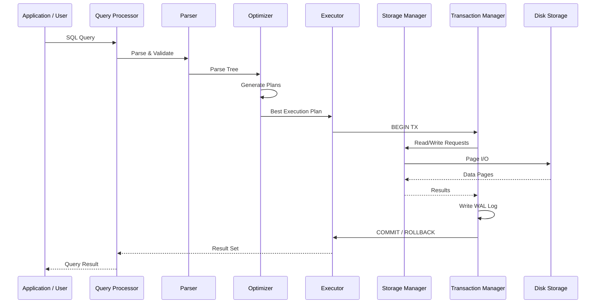

# Chapter 1: Introduction to Database Management Systems

## Learning Objectives

- Understand the limitations of file-based data storage and the advantages of DBMS
- Define and differentiate between various data models
- Explain the three-level DBMS architecture and its purpose
- Distinguish between logical, physical, and external schemas
- Identify the key components of a DBMS and their roles
- Classify DBMS languages: DDL, DML, DCL, TCL
- Compare data models with real-world analogies and implementations

<!-- Image Gallery -->
<section class="lesson-visuals" aria-label="Visual learning resources">
  <header><span>VISUAL LEARNING</span><h2>See it. Review it. Remember it.</h2></header>
  <a class="lesson-visual-card" href="../../assets/images/lessons/database-management-systems/01-introduction/handwritten-notes.png" target="_blank" rel="noopener">
    
    <span><strong>Handwritten notes</strong>Condensed notes for deliberate review.</span>
  </a>
  <a class="lesson-visual-card" href="../../assets/images/lessons/database-management-systems/01-introduction/sticky-notes.png" target="_blank" rel="noopener">
    
    <span><strong>Sticky-note revision</strong>Fast recall prompts for revision.</span>
  </a>
  <a class="lesson-visual-card" href="../../assets/images/lessons/database-management-systems/01-introduction/visual-explanation.png" target="_blank" rel="noopener">
    
    <span><strong>Visual concept guide</strong>A connected explanation of the key ideas.</span>
  </a>
</section>
<!-- End Image Gallery -->


## Theory

### 1.1 What Is a DBMS?


**Real-World Analogy: The Library Catalog**

Imagine a public library with 100,000 books but no catalog system. To find a specific book, a visitor must walk every aisle scanning shelves. If a book is moved, returned late, or misplaced, it becomes effectively lost. Now imagine the same library with a digital catalog → you search by title, author, or ISBN, see the exact shelf location, check availability, and even reserve it online. The catalog does not replace the books; it manages the metadata about the books and provides efficient access.

**A Database Management System (DBMS)** is the digital library catalog for data. It is software that manages, stores, retrieves, and secures data while hiding the complexity of storage, indexing, concurrency, and recovery from users.

**Key Functions of a DBMS:**

1. **Data Definition** → CREATE, ALTER, DROP schema objects
2. **Data Manipulation** → SELECT, INSERT, UPDATE, DELETE data
3. **Data Security & Integrity** → enforce constraints and access controls
4. **Transaction Management** → ACID properties (Atomicity, Consistency, Isolation, Durability)
5. **Concurrency Control** → serialize simultaneous user access
6. **Recovery Management** → restore state after system crash or media failure
7. **Data Dictionary Management** → store metadata about database objects

**Numbered Steps: How a DBMS Processes a Query**

```
Step 1: User submits a query (e.g., SELECT * FROM students WHERE gpa > 3.5)
Step 2: Parser checks syntax and builds parse tree
Step 3: Validator checks that tables/columns exist in catalog
Step 4: Optimizer generates alternative execution plans
Step 5: Optimizer estimates cost (I/O, CPU, network) for each plan
Step 6: Executor runs the cheapest plan
Step 7: Storage manager fetches data from disk/memory
Step 8: Results are formatted and returned to user
```

**Pseudocode: Simple Database Engine**

```
FUNCTION execute_query(query_string):
    tokens = tokenize(query_string)                    // Step 1: Lexical analysis
    parse_tree = parse(tokens)                         // Step 2: Syntax analysis
    IF error THEN RETURN "Syntax Error at position X"
    
    validated = validate(parse_tree, catalog)          // Step 3: Semantic check
    IF error THEN RETURN "Error: table/column not found"
    
    plan = generate_plan(validated)                    // Step 4: Query plan
    optimized_plan = optimize(plan, statistics)        // Step 5: Cost-based optimization
    
    result = execute(optimized_plan, storage_manager)  // Step 6: Execution
    FORMAT(result)
END FUNCTION
```

**Dry Run Trace: Query Execution**

| Step | Component | Input | Output | State |
|------|-----------|-------|--------|-------|
| 1 | Tokenizer | `SELECT name FROM students WHERE gpa > 3.5` | `[SELECT, name, FROM, students, WHERE, gpa, >, 3.5]` | Tokens extracted |
| 2 | Parser | Tokens | Parse tree: `Query{sel:[name], from:students, where:gpa>3.5}` | Tree valid |
| 3 | Validator | Parse tree | Table `students` exists, columns `name,gpa` exist | Validated |
| 4 | Generator | Validated tree | Plans: [SeqScan, IndexScan(gpa), ...] | 3 plans |
| 5 | Optimizer | Plans | Cost: SeqScan=1200, IndexScan=85 | Picks IndexScan |
| 6 | Executor | Optimized plan | Fetches 42 rows via index | 42 rows |
| 7 | Formatter | Raw rows | Formatted result set | Output ready |

**C++ Implementation: Minimal Database Engine**

```cpp
#include <iostream>
#include <vector>
#include <string>
#include <unordered_map>
#include <sstream>
#include <algorithm>
#include <memory>
#include <stdexcept>

class Row {
public:
    std::unordered_map<std::string, std::string> fields;
    void set(const std::string& col, const std::string& val) { fields[col] = val; }
    std::string get(const std::string& col) const {
        auto it = fields.find(col);
        if (it == fields.end()) throw std::runtime_error("Column not found: " + col);
        return it->second;
    }
};

class Table {
    std::string name;
    std::vector<std::string> columns;
    std::vector<Row> rows;
public:
    Table(const std::string& n, const std::vector<std::string>& cols)
        : name(n), columns(cols) {}
    void insert(const Row& r) { rows.push_back(r); }
    size_t size() const { return rows.size(); }
    std::string getName() const { return name; }
    const std::vector<std::string>& getColumns() const { return columns; }

    std::vector<Row> select(const std::vector<std::string>& cols,
                            const std::string& whereCol, const std::string& op,
                            const std::string& whereVal) const {
        std::vector<Row> result;
        for (const auto& row : rows) {
            if (!whereCol.empty()) {
                auto it = row.fields.find(whereCol);
                if (it == row.fields.end()) continue;
                const std::string& val = it->second;
                bool match = false;
                if (op == ">") match = std::stod(val) > std::stod(whereVal);
                else if (op == "<") match = std::stod(val) < std::stod(whereVal);
                else if (op == "=") match = val == whereVal;
                else if (op == ">=") match = std::stod(val) >= std::stod(whereVal);
                else if (op == "<=") match = std::stod(val) <= std::stod(whereVal);
                if (!match) continue;
            }
            Row out;
            if (cols.empty() || cols[0] == "*") {
                for (const auto& c : columns) out.set(c, row.get(c));
            } else {
                for (const auto& c : cols) out.set(c, row.get(c));
            }
            result.push_back(out);
        }
        return result;
    }
};

class DatabaseCatalog {
    std::unordered_map<std::string, std::shared_ptr<Table>> tables;
public:
    void createTable(const std::string& name, const std::vector<std::string>& cols) {
        if (tables.find(name) != tables.end())
            throw std::runtime_error("Table already exists: " + name);
        tables[name] = std::make_shared<Table>(name, cols);
        std::cout << "[DDL] Table '" << name << "' created with "
                  << cols.size() << " columns\n";
    }

    std::shared_ptr<Table> getTable(const std::string& name) {
        auto it = tables.find(name);
        if (it == tables.end())
            throw std::runtime_error("Table not found: " + name);
        return it->second;
    }

    void insertInto(const std::string& table, const Row& r) {
        auto t = getTable(table);
        t->insert(r);
        std::cout << "[DML] 1 row inserted into '" << table << "' (total: "
                  << t->size() << " rows)\n";
    }

    void query(const std::string& table, const std::vector<std::string>& cols,
               const std::string& wc = "", const std::string& op = "",
               const std::string& wv = "") {
        auto t = getTable(table);
        auto results = t->select(cols, wc, op, wv);
        std::cout << "[DML] SELECT returned " << results.size() << " rows\n";
        for (const auto& r : results) {
            for (const auto& [k, v] : r.fields)
                std::cout << "  " << k << ": " << v;
            std::cout << "\n";
        }
    }
};

int main() {
    DatabaseCatalog db;
    db.createTable("students", {"id", "name", "gpa", "major"});

    Row r1; r1.set("id", "1"); r1.set("name", "Alice");
    r1.set("gpa", "3.8"); r1.set("major", "CS");
    db.insertInto("students", r1);

    Row r2; r2.set("id", "2"); r2.set("name", "Bob");
    r2.set("gpa", "3.2"); r2.set("major", "Math");
    db.insertInto("students", r2);

    Row r3; r3.set("id", "3"); r3.set("name", "Carol");
    r3.set("gpa", "3.9"); r3.set("major", "CS");
    db.insertInto("students", r3);

    std::cout << "\n--- Query: gpa > 3.5 ---\n";
    db.query("students", {"name", "gpa"}, "gpa", ">", "3.5");

    std::cout << "\n--- Query: all students ---\n";
    db.query("students", {"*"});

    return 0;
}
```

**Python Implementation: Minimal Database Engine**

```python
from dataclasses import dataclass, field
from typing import List, Dict, Optional, Any
from enum import Enum


class DataType(Enum):
    INTEGER = "INTEGER"
    VARCHAR = "VARCHAR"
    FLOAT = "FLOAT"
    DATE = "DATE"


@dataclass
class Column:
    name: str
    dtype: DataType
    primary_key: bool = False
    not_null: bool = False
    unique: bool = False


class ConstraintViolation(Exception):
    pass


@dataclass
class Table:
    name: str
    columns: List[Column]
    rows: List[Dict[str, Any]] = field(default_factory=list)

    def insert(self, row: Dict[str, Any]) -> None:
        for col in self.columns:
            if col.not_null and (col.name not in row or row[col.name] is None):
                raise ConstraintViolation(f"NOT NULL violation on {col.name}")
            if col.unique:
                for existing in self.rows:
                    if col.name in existing and existing[col.name] == row.get(col.name):
                        raise ConstraintViolation(f"UNIQUE violation on {col.name}")
        self.rows.append(row)

    def select(self, columns: Optional[List[str]] = None,
               where: Optional[callable] = None) -> List[Dict[str, Any]]:
        result = []
        for row in self.rows:
            if where and not where(row):
                continue
            if columns is None or columns == ["*"]:
                result.append(dict(row))
            else:
                result.append({c: row[c] for c in columns if c in row})
        return result


class SimpleDB:
    def __init__(self):
        self.catalog: Dict[str, Table] = {}

    def create_table(self, name: str, columns: List[Column]) -> None:
        if name in self.catalog:
            raise ValueError(f"Table '{name}' already exists")
        self.catalog[name] = Table(name, columns)
        print(f"[DDL] Table '{name}' created with {len(columns)} columns")

    def insert_into(self, table: str, row: Dict[str, Any]) -> None:
        if table not in self.catalog:
            raise ValueError(f"Table '{table}' does not exist")
        t = self.catalog[table]
        t.insert(row)
        print(f"[DML] 1 row inserted into '{table}' (total: {len(t.rows)} rows)")

    def query(self, table: str, columns: Optional[List[str]] = None,
              where_col: str = "", op: str = "", where_val: Any = None) -> List[Dict[str, Any]]:
        if table not in self.catalog:
            raise ValueError(f"Table '{table}' does not exist")
        t = self.catalog[table]

        def make_filter(col, operator, value):
            if not col:
                return None

            def filter_fn(row):
                if col not in row:
                    return False
                actual = row[col]
                try:
                    if operator == ">": return float(actual) > float(value)
                    elif operator == "<": return float(actual) < float(value)
                    elif operator == ">=": return float(actual) >= float(value)
                    elif operator == "<=": return float(actual) <= float(value)
                    elif operator == "=": return str(actual) == str(value)
                    elif operator == "!=": return str(actual) != str(value)
                    elif operator == "LIKE": return str(value).lower() in str(actual).lower()
                except (ValueError, TypeError):
                    return str(actual) == str(value)
                return False
            return filter_fn

        where_fn = make_filter(where_col, op, where_val)
        results = t.select(columns, where_fn)
        print(f"[DML] SELECT returned {len(results)} rows")
        for row in results:
            print(f"  {row}")
        return results


# Simulation / Dry Run
if __name__ == "__main__":
    db = SimpleDB()

    # DDL: CREATE TABLE
    db.create_table("employees", [
        Column("emp_id", DataType.INTEGER, primary_key=True),
        Column("name", DataType.VARCHAR, not_null=True),
        Column("salary", DataType.FLOAT),
        Column("dept", DataType.VARCHAR),
    ])

    # DML: INSERT
    db.insert_into("employees", {"emp_id": 101, "name": "Alice",
                                  "salary": 75000, "dept": "Engineering"})
    db.insert_into("employees", {"emp_id": 102, "name": "Bob",
                                  "salary": 65000, "dept": "Marketing"})
    db.insert_into("employees", {"emp_id": 103, "name": "Carol",
                                  "salary": 90000, "dept": "Engineering"})

    # DML: SELECT with filter
    print("\n--- Query: salary > 70000 ---")
    db.query("employees", where_col="salary", op=">", where_val=70000)

    # DML: SELECT all
    print("\n--- Query: all employees ---")
    db.query("employees")
```

**Complexity Analysis with WHY**

| Operation | Time Complexity | Space Complexity | Why? |
|-----------|---------------|------------------|------|
| CREATE TABLE (DDL) | O(1) | O(c) where c = columns | Catalog insert is hash-table O(1); column metadata stored once |
| INSERT (single row) | O(1) amortized | O(r) per row | Row appended to dynamic array; amortized O(1). Each row stores column values |
| SELECT * (no WHERE) | O(n) | O(n) | Full table scan iterates all n rows; result set stored in memory |
| SELECT with index scan | O(log n) | O(k) where k = results | B+ tree lookup is O(log n); k results stored |
| SELECT with equality WHERE | O(n) worst | O(k) | Without index, must scan all rows; k matching rows returned |
| UPDATE single row | O(n) worst | O(1) | Must find row first via scan (O(n)), then update in place (O(1)) |
| DELETE single row | O(n) worst | O(n) | Find row (O(n)), shift remaining elements (O(n)) |

**Advantages & Disadvantages Table**

| Advantages | Disadvantages |
|------------|---------------|
| Data independence (physical + logical) | High initial cost (licensing, hardware, DBA salaries) |
| Efficient data access via indexes and optimization | Complexity → steep learning curve for administration |
| Concurrent access with ACID guarantees | Performance overhead compared to raw file I/O |
| Security at row/column level | Single point of failure risk |
| Data integrity via constraints (PK, FK, CHECK) | Vendor lock-in potential |
| Reduced data redundancy | Resource intensive (memory, CPU, disk) |
| Backup and recovery automation | Overkill for simple, single-user applications |
| Standard interfaces (SQL, ODBC, JDBC) | Schema rigidity → schema changes require migrations |
| Scalability (parallel, distributed) | Network overhead in client-server deployment |
| Multi-user access and role-based control | Tuning complexity requires expertise |

**Edge Cases**

| Edge Case | Scenario | DBMS Handling |
|-----------|----------|---------------|
| Concurrent access conflict | Two users try to book the same flight seat simultaneously | Lock manager grants one lock; second transaction waits or aborts with serialization error |
| System failure during write | Power outage while writing a transaction log page | Write-ahead logging (WAL): log written before data page; recovery replays or undoes on restart |
| Security breach | SQL injection attack via user input form | Prepared statements parameterize input; GRANT/REVOKE limits damage scope |
| Deadlock | Transaction A locks row 1 and waits for row 2; B locks row 2 and waits for row 1 | Deadlock detector chooses a victim transaction to abort and rollback |
| Schema evolution | Adding a NOT NULL column to a table with 1M existing rows | New column must have a default value; DBMS validates existing rows |
| Disk full | Database runs out of disk space mid-transaction | Transaction aborts; DBMS rolls back partial writes; alert triggers |
| Network partition | Database replicas cannot communicate | Partition tolerance strategy depends on consistency model (CP vs AP in CAP theorem) |
| NULL in WHERE clause | `SELECT * FROM t WHERE col = NULL` returns no rows | SQL uses three-valued logic; NULL comparisons require IS NULL operator |
| Duplicate key insertion | INSERT with existing primary key | DBMS rejects with duplicate key error; ON DUPLICATE KEY UPDATE alternative |
| Very large transaction | Bulk insert of 10M rows | Log grows; transaction may hit log size limits; batch commit recommended |

---

### 1.2 File System vs. DBMS


**Real-World Analogy: Filing Cabinets vs. Library**

A **file system** is like a room full of filing cabinets. Each department has its own cabinet with its own folders. The sales department's cabinet has customer folders, the billing department has its own customer folders, and support has yet another set. When a customer changes their address, three different people must pull three different folders and make the same change. One person might forget, or use a different format, and now the data is inconsistent. There is no central index telling you which cabinet has which information. If someone is using a folder, the next person has to wait → or worse, both make changes simultaneously and one overwrites the other.

A **DBMS** is a library. All books are centrally managed. A single catalog tells you where every book is. When a book's information changes, the catalog is updated in one place. Multiple people can check out books simultaneously because the system tracks who has what. The librarian (DBA) ensures books are properly organized, no duplicates exist in the catalog, and only authorized patrons can access restricted sections.

**12+ Point Comparison: File System vs. DBMS**

| # | Feature | File System | DBMS |
|---|---------|-------------|------|
| 1 | **Data Redundancy** | High → same data duplicated across multiple files | Minimal to none → controlled redundancy via normalization |
| 2 | **Data Consistency** | Low → updates must be applied to every file independently | High → single source of truth; constraints enforce consistency |
| 3 | **Concurrent Access** | No built-in control → race conditions, lost updates | ACID transactions with lock-based/multiversion concurrency control |
| 4 | **Atomicity** | None → partial updates survive crashes | Full atomicity via transactions: COMMIT or ROLLBACK |
| 5 | **Integrity Constraints** | Application code only → easily bypassed | Declarative constraints: PRIMARY KEY, FOREIGN KEY, CHECK, UNIQUE, NOT NULL |
| 6 | **Security** | File-level permissions only | Granular: row-level, column-level, role-based GRANT/REVOKE |
| 7 | **Data Independence** | None → application code depends on file format | Physical and logical independence via three-level architecture |
| 8 | **Query Capability** | Manual parsing and processing required | Declarative SQL with query optimization, join algorithms, aggregation |
| 9 | **Backup & Recovery** | Manual file copies → no crash recovery | Automated backup, point-in-time recovery, transaction log replay |
| 10 | **Data Sharing** | Difficult → file locking is coarse | Easy → concurrent users with fine-grained locks |
| 11 | **Scalability** | Limited to single machine capacity | Horizontal (sharding, replication) and vertical (bigger hardware) |
| 12 | **Storage Efficiency** | Wasted space due to duplication | Storage optimized via normalization, compression, and indexing |
| 13 | **Data Model** | Flat → no relationships between files | Rich → relational, document, graph, object-oriented |
| 14 | **Metadata Management** | None or scattered | Centralized data dictionary (catalog) |
| 15 | **Multi-user Support** | Primitive → file-level locking only | Sophisticated → transaction isolation levels, locking granularity |
| 16 | **Time to Develop** | Fast for small, single-user apps | Higher initial setup; much faster for complex, multi-user apps |

**Numbered Steps: File System vs. DBMS Contrast**

```
File System Approach:
  1. Application opens file (e.g., customers.txt)
  2. Application parses file (CSV, custom format)
  3. Application searches for matching records
  4. Application modifies data in memory
  5. Application writes entire file back to disk
  6. If another app has the file open → conflict!
  7. If crash occurs during step 5 → data loss!
  8. If data format changes → every app must be rewritten!

DBMS Approach:
  1. Application sends SQL query to DBMS
  2. DBMS parses, validates, optimizes the query
  3. DBMS acquires necessary locks
  4. DBMS reads only required pages from disk
  5. DBMS applies changes with Write-Ahead Logging (WAL)
  6. DBMS releases locks
  7. If crash occurs → log replays or undoes on restart
  8. If schema changes → views insulate applications
```

**Pseudocode: File-Based vs. DBMS-Based Data Access**

```
// FILE-BASED APPROACH
FUNCTION update_customer_address_file(cust_id, new_address):
    file = OPEN("customers.txt", READ_WRITE)       // Step 1: Open file
    records = PARSE_CSV(file)                       // Step 2: Parse entire file
    
    FOR EACH record IN records:                     // Step 3: Linear search
        IF record.id == cust_id:
            record.address = new_address            // Step 4: Modify in memory
            BREAK
    
    REWRITE(file, records)                          // Step 5: Write entire file back
    CLOSE(file)                                     // Step 6: Close (no locks held)
    // PROBLEM: No undo, no concurrency, no atomicity
END FUNCTION

// DBMS-BASED APPROACH
FUNCTION update_customer_address_db(cust_id, new_address):
    conn = DBMS_CONNECT("connection_string")        // Step 1: Connect
    BEGIN TRANSACTION                               // Step 2: Start transaction
        UPDATE customers                            // Step 3: Atomic update
        SET address = new_address
        WHERE customer_id = cust_id;
        // DBMS internally: acquire lock, log change, update page in buffer
    COMMIT                                          // Step 4: Commit → all or nothing
    conn.CLOSE()
    // BENEFIT: Atomic, durable, concurrent-safe, indexed
END FUNCTION
```

**Dry Run Trace: File System vs. DBMS → Concurrent Booking Conflict**

| Step | File System | DBMS |
|------|-------------|------|
| Initial | `seats.txt`: Seat 1A=available, Seat 1B=available | `seats` table: seat_1A='available', seat_1B='available' |
| User A reads | Reads file, sees Seat 1A=available | `SELECT status FROM seats WHERE id='1A'` → 'available', shared lock acquired |
| User B reads | Reads file simultaneously, sees Seat 1A=available | Same query, also gets shared lock |
| User A writes | Changes seat 1A to 'booked', writes file | `UPDATE seats SET status='booked' WHERE id='1A'` → exclusive lock requested |
| User B writes | Changes seat 1A to 'booked' (same!), overwrites A's change | Lock conflict! B waits or gets deadlock error |
| Outcome | Double booking! Both users think they have the seat | Only A succeeds; B gets "could not serialize access" error |
| Integrity | Lost. File has B's version only (A's change gone) | Preserved. Only one booking per seat |

**C++ Implementation: File vs. DBMS Simulation**

```cpp
#include <iostream>
#include <fstream>
#include <string>
#include <vector>
#include <sstream>
#include <mutex>
#include <thread>
#include <chrono>

// --- File-based approach (simulated) ---
class FileSystemStore {
    std::string filename;
public:
    FileSystemStore(const std::string& f) : filename(f) {}

    void writeAll(const std::vector<std::string>& data) {
        std::ofstream out(filename);
        for (const auto& line : data)
            out << line << "\n";
    }

    std::vector<std::string> readAll() {
        std::vector<std::string> data;
        std::ifstream in(filename);
        std::string line;
        while (std::getline(in, line))
            data.push_back(line);
        return data;
    }

    // Simulates race condition → no locking
    void unsafeBook(const std::string& seatId, const std::string& user) {
        auto data = readAll();
        for (auto& line : data) {
            if (line.find(seatId) != std::string::npos && line.find("available") != std::string::npos) {
                std::this_thread::sleep_for(std::chrono::milliseconds(10)); // window for race
                line = seatId + ",booked," + user;
                writeAll(data);
                std::cout << "[FILE] " << user << " booked " << seatId << "\n";
                return;
            }
        }
        std::cout << "[FILE] " << seatId << " already taken\n";
    }
};

// --- DBMS approach (simulated with mutex) ---
class DBMSStore {
    std::mutex mtx;
    struct Seat { std::string id, status, user; };
    std::vector<Seat> seats;
public:
    DBMSStore() {
        seats = {{"1A", "available", ""}, {"1B", "available", ""}, {"1C", "available", ""}};
    }

    bool book(const std::string& seatId, const std::string& user) {
        std::lock_guard<std::mutex> lock(mtx);  // Transaction isolation
        for (auto& seat : seats) {
            if (seat.id == seatId && seat.status == "available") {
                std::this_thread::sleep_for(std::chrono::milliseconds(10)); // same delay
                seat.status = "booked";
                seat.user = user;
                std::cout << "[DBMS] " << user << " booked " << seatId << "\n";
                return true;
            }
        }
        std::cout << "[DBMS] " << seatId << " already taken → " << user << " denied\n";
        return false;
    }

    void printStatus() {
        for (const auto& s : seats)
            std::cout << "  " << s.id << ": " << s.status
                      << (s.user.empty() ? "" : " by " + s.user) << "\n";
    }
};

void concurrentTestFile(FileSystemStore& fs, const std::string& seat, const std::string& user) {
    fs.unsafeBook(seat, user);
}

void concurrentTestDBMS(DBMSStore& db, const std::string& seat, const std::string& user) {
    db.book(seat, user);
}

int main() {
    std::cout << "=== FILE SYSTEM: Concurrent Booking ===\n";
    {
        FileSystemStore fs("seats.txt");
        fs.writeAll({"1A,available,", "1B,available,", "1C,available,"});

        std::thread t1(concurrentTestFile, std::ref(fs), "1A", "Alice");
        std::thread t2(concurrentTestFile, std::ref(fs), "1A", "Bob");
        t1.join(); t2.join();

        std::cout << "Final state:\n";
        for (const auto& line : fs.readAll())
            std::cout << "  " << line << "\n";
        std::cout << "==> RACE CONDITION: both may succeed or last write wins!\n\n";
    }

    std::cout << "=== DBMS: Concurrent Booking ===\n";
    {
        DBMSStore db;
        std::thread t1(concurrentTestDBMS, std::ref(db), "1A", "Alice");
        std::thread t2(concurrentTestDBMS, std::ref(db), "1A", "Bob");
        t1.join(); t2.join();

        std::cout << "Final state:\n";
        db.printStatus();
        std::cout << "==> MUTUAL EXCLUSION: only one succeeds!\n";
    }
    return 0;
}
```

**Python Implementation: File vs. DBMS Simulation**

```python
import threading
import time
import os


class FileSystemStore:
    """Simulates a naive file-based system with race conditions."""
    
    def __init__(self, filename: str):
        self.filename = filename
    
    def init_data(self, seats: list) -> None:
        with open(self.filename, "w") as f:
            for seat in seats:
                f.write(f"{seat},available,\n")
    
    def read_all(self) -> list:
        with open(self.filename, "r") as f:
            return [line.strip() for line in f.readlines()]
    
    def write_all(self, lines: list) -> None:
        with open(self.filename, "w") as f:
            for line in lines:
                f.write(line + "\n")
    
    def unsafe_book(self, seat_id: str, user: str) -> bool:
        """No locking → demonstrates race condition."""
        data = self.read_all()
        for i, line in enumerate(data):
            parts = line.split(",")
            if parts[0] == seat_id and parts[1] == "available":
                time.sleep(0.01)  # Window for race condition
                data[i] = f"{seat_id},booked,{user}"
                self.write_all(data)
                print(f"[FILE] {user} booked {seat_id}")
                return True
        print(f"[FILE] {seat_id} already taken → {user} denied")
        return False


class DBMSStore:
    """Simulates DBMS with mutex-based concurrency control."""
    
    def __init__(self):
        self.lock = threading.Lock()
        self.seats = {
            "1A": {"status": "available", "user": ""},
            "1B": {"status": "available", "user": ""},
            "1C": {"status": "available", "user": ""},
        }
    
    def book(self, seat_id: str, user: str) -> bool:
        with self.lock:  # Transaction isolation
            if seat_id in self.seats and self.seats[seat_id]["status"] == "available":
                time.sleep(0.01)  # Same delay
                self.seats[seat_id]["status"] = "booked"
                self.seats[seat_id]["user"] = user
                print(f"[DBMS] {user} booked {seat_id}")
                return True
            print(f"[DBMS] {seat_id} already taken → {user} denied")
            return False
    
    def print_status(self) -> None:
        for sid, info in self.seats.items():
            print(f"  {sid}: {info['status']}"
                  f"{' by ' + info['user'] if info['user'] else ''}")


def file_concurrent_test():
    print("=== FILE SYSTEM: Concurrent Booking ===")
    fs = FileSystemStore("seats_test.txt")
    fs.init_data(["1A", "1B", "1C"])
    
    t1 = threading.Thread(target=fs.unsafe_book, args=("1A", "Alice"))
    t2 = threading.Thread(target=fs.unsafe_book, args=("1A", "Bob"))
    t1.start(); t2.start()
    t1.join(); t2.join()
    
    print("Final state:")
    for line in fs.read_all():
        print(f"  {line}")
    print("==> RACE CONDITION: both may succeed or last write wins!\n")
    os.remove("seats_test.txt")


def dbms_concurrent_test():
    print("=== DBMS: Concurrent Booking ===")
    db = DBMSStore()
    
    t1 = threading.Thread(target=db.book, args=("1A", "Alice"))
    t2 = threading.Thread(target=db.book, args=("1A", "Bob"))
    t1.start(); t2.start()
    t1.join(); t2.join()
    
    print("Final state:")
    db.print_status()
    print("==> MUTUAL EXCLUSION: only one succeeds!\n")


if __name__ == "__main__":
    file_concurrent_test()
    dbms_concurrent_test()
```

**Complexity Analysis with WHY**

| Aspect | File System Complexity | DBMS Complexity | Why? |
|--------|----------------------|-----------------|------|
| Read (exact match) | O(n) scan | O(log n) with B+ tree index | File system must scan entire file; DBMS uses tree index |
| Read (range) | O(n) scan | O(log n + k) with index | Tree index finds start point; sequential scan for k results |
| Insert | O(1) append | O(log n) index update | File appends to end; DBMS maintains sorted index |
| Update | O(n) rewrite | O(log n) locate + O(1) write | File must rewrite entire file; DBMS updates page in place |
| Delete | O(n) rewrite | O(log n) locate + mark | File rewrite vs. tombstone marking |
| Concurrent Access | O(1) but unsafe | O(1) lock acquire | File: no coordination. DBMS: lock manager overhead |
| Consistency Check | O(n) manual | O(1) constraint check | File: no automatic checks. DBMS: constraint enforced at write |
| Recovery | Manual → O(n) restore | O(log n) log replay | File: restore from backup. DBMS: replay/undo WAL |

**Advantages & Disadvantages: File System vs. DBMS**

| Aspect | File System | DBMS |
|--------|------------|------|
| **Simplicity** | Simple for small datasets | Complex setup and administration |
| **Performance** | Fast for sequential I/O, single-user | Overhead for trivial operations |
| **Cost** | Free (OS built-in) | License, hardware, DBA salary |
| **Portability** | Any OS can read text files | Vendor-specific format |
| **Atomicity** | None → partial writes | Full ACID transaction support |
| **Concurrent Access** | None → file-level locking only | Row-level locking, MVCC, isolation levels |
| **Security** | File permissions only | Row/column-level GRANT/REVOKE, encryption |
| **Data Integrity** | None → application must enforce | Declarative constraints, triggers |
| **Data Independence** | None → format change breaks everything | Physical/logical independence via abstraction |
| **Query Flexibility** | Manual parsing for each query | Declarative SQL with joins, subqueries, aggregation |
| **Recovery** | Manual restore from backup | Automated crash recovery, point-in-time restore |
| **Multi-user** | Not designed for it | Built for concurrent multi-user access |

**Edge Cases Specific to File System vs. DBMS**

| Edge Case | File System | DBMS |
|-----------|-------------|------|
| Two users editing same record | Last write wins → data loss | First committer wins → second gets serialization error |
| System crash during write | Corrupted file, partial write | Atomic recovery via WAL |
| Disk space exhaustion | Incomplete write, no recovery | Transaction aborts cleanly |
| Schema change (add column) | Every app must be rewritten | ALTER TABLE with default value; views insulate apps |
| Cross-file consistency | No referential integrity | FOREIGN KEY constraints enforced |
| Million-record search | Slow sequential scan (minutes) | Indexed lookup (milliseconds) |
| Simultaneous backup | File locked → no access | Online backup with consistent snapshot |
| Data encryption | Encrypt entire file or nothing | Column-level transparent encryption |

---
### 1.3 Three-Schema Architecture


**Real-World Analogy: Building Blueprint**

Think of a large building:
- **Physical Level** = The actual construction → concrete foundation, steel beams, electrical wiring, plumbing pipes. The architect does not show wiring diagrams to the office tenants.
- **Conceptual Level** = The architectural blueprint → floor plans showing rooms, hallways, doors, windows. It describes what is in the building without specifying pipe diameters or wire gauges.
- **External Level** = The tenant's view. The CEO sees a corner office with a view. The IT team sees a server room with cooling ducts. The janitor sees the cleaning supply closet. Same building, different perspectives.

The three-level architecture (ANSI-SPARC standard, 1975) separates these concerns so that changes at one level do not cascade to others.

**Three-Level Architecture Table**

| Aspect | Physical (Internal) Schema | Conceptual Schema | External Schema (Views) |
|--------|---------------------------|-------------------|------------------------|
| **Focus** | HOW data is stored | WHAT data is stored | WHAT specific users see |
| **Designed by** | DBA, system administrator | DBA, database designer | Application developers, end users |
| **Abstraction** | Lowest | Middle | Highest |
| **Users** | DBA, storage team | DBA, designers | Application users, report writers |
| **Changes** | Add index, change file org, compression | Add column, new table, new relationship | Add/modify/drop user views |
| **Example** | "Table stored as heap file, B+ tree index on PK, 4KB blocks, LZ4 compression" | "Customer has orders; each order has items; customer has name, address, phone;" | "Shipping clerk sees only customer address and order ID" |
| **Independence** | Changes hidden from upper levels | Changes may affect external views | Isolated from conceptual/physical changes |
| **Hardware dependency** | High → depends on disk, memory, CPU | None | None |
| **Number of schemas** | One | One | Multiple (one per user group) |
| **Data Dictionary entry** | Storage parameters, file paths, indexes | Table/column definitions, relationships, constraints | View definitions, access privileges |

**Numbered Steps: Three-Schema Mapping**

```
Step 1: Application issues a query (e.g., "Show my orders")
Step 2: External schema determines user sees only order_id, date, status (not credit_card)
Step 3: External-to-conceptual mapping translates view query to conceptual query
Step 4: Conceptual schema processes the logical query against base tables
Step 5: Conceptual-to-physical mapping determines how to access data
Step 6: Physical schema locates the file, index, and blocks on disk
Step 7: Storage manager reads the physical pages into buffer pool
Step 8: Results propagate back through the levels (physical → conceptual → external → user)
```

**Pseudocode: Three-Level Query Resolution**

```
FUNCTION resolve_user_query(user_query, user_role):
    // Step 1-2: External level → apply view restrictions
    view = GET_VIEW_FOR_ROLE(user_role)
    allowed_columns = view.get_allowed_columns(user_query.table)
    row_filter = view.get_row_filter(user_query.table)
    
    // Step 3: Map external to conceptual
    conceptual_query = external_to_conceptual(user_query, view)
    
    // Step 4-5: Conceptual level → validate against catalog
    schema = catalog.get_schema(conceptual_query.table)
    VALIDATE(conceptual_query, schema)
    
    // Step 5-6: Map conceptual to physical
    storage_info = conceptual_to_physical(schema)
    index_path = storage_info.index_for(conceptual_query.where_condition)
    
    // Step 7-8: Physical execution
    data_pages = storage_manager.read_pages(
        file=storage_info.file_path,
        index=index_path,
        filter=conceptual_query.where_condition
    )
    RETURN apply_view_filter(data_pages, row_filter, allowed_columns)
END FUNCTION
```

**Dry Run Trace: Three-Level Query → "Show my orders"**

| Level | Component | Input | Processing | Output |
|-------|-----------|-------|------------|--------|
| External | View Definition | User role = 'customer' | Maps to view `customer_orders` that shows only `order_id, date, status, total` (hides `credit_card, internal_notes`) | View query: `SELECT order_id, date, status, total FROM orders WHERE customer_id = ?` |
| Conceptual | Schema Mapping | View query | Translates to conceptual query; validates table `orders` has columns `order_id, date, status, total, customer_id` | Logical query: `SELECT ... FROM orders WHERE customer_id=101` |
| Physical | Storage Mapping | Logical query | Index on `customer_id` selected; file `orders.ibd` page 42-48; buffer pool cache checked | Physical plan: IndexScan(orders_cid_idx) → Fetch(blocks 42,45) |
| Physical | Execution | Physical plan | Buffer pool hit page 42 (cached), page 45 read from disk (5ms I/O) | 12 rows returned |
| Conceptual | Formatting | 12 raw rows | Columns filtered per conceptual schema | Row set with all allowed cols |
| External | View Filtering | Full row set | `credit_card` column removed; `internal_notes` column removed | 12 rows, 4 visible columns |

**C++ Implementation: Three-Level Architecture Simulation**

```cpp
#include <iostream>
#include <vector>
#include <string>
#include <unordered_map>
#include <memory>
#include <functional>

// ===== PHYSICAL LEVEL =====
struct StorageBlock {
    int block_id;
    std::string data;
};

struct PhysicalSchema {
    std::string file_path;
    std::string file_organization;  // "heap", "sorted", "hash"
    int block_size;
    std::string compression;
    std::unordered_map<std::string, std::string> indexes;  // column -> index type
};

class StorageManager {
    std::unordered_map<std::string, std::vector<StorageBlock>> files;
public:
    void createFile(const std::string& path, int blockSize) {
        files[path] = {};
        std::cout << "[PHYSICAL] File created: " << path
                  << " (block size: " << blockSize << "B)\n";
    }

    std::vector<StorageBlock> readBlocks(const std::string& path,
                                          const std::vector<int>& blockIds) {
        std::vector<StorageBlock> result;
        auto it = files.find(path);
        if (it == files.end()) return result;
        for (int id : blockIds) {
            if (id < (int)it->second.size()) {
                result.push_back(it->second[id]);
                std::cout << "[PHYSICAL] Read block " << id << " from " << path << "\n";
            }
        }
        return result;
    }
};

// ===== CONCEPTUAL LEVEL =====
struct ColumnDef {
    std::string name;
    std::string type;
    bool isPrimaryKey;
};

struct ConceptualSchema {
    std::string tableName;
    std::vector<ColumnDef> columns;
    std::unordered_map<std::string, std::string> relationships;  // FK references
};

class CatalogManager {
    std::unordered_map<std::string, ConceptualSchema> schemas;
public:
    void defineSchema(const ConceptualSchema& s) {
        schemas[s.tableName] = s;
        std::cout << "[CONCEPTUAL] Schema defined: " << s.tableName
                  << " (" << s.columns.size() << " columns)\n";
    }

    ConceptualSchema getSchema(const std::string& table) {
        auto it = schemas.find(table);
        if (it == schemas.end()) throw std::runtime_error("Table not found");
        return it->second;
    }
};

// ===== EXTERNAL LEVEL =====
struct ViewDefinition {
    std::string viewName;
    std::string baseTable;
    std::vector<std::string> allowedColumns;
    std::function<bool(const std::unordered_map<std::string, std::string>&)> rowFilter;
};

class ViewManager {
    std::unordered_map<std::string, std::vector<ViewDefinition>> viewsByRole;
public:
    void addView(const std::string& role, const ViewDefinition& view) {
        viewsByRole[role].push_back(view);
        std::cout << "[EXTERNAL] View '" << view.viewName << "' added for role '" << role << "'\n";
    }

    ViewDefinition getView(const std::string& role, const std::string& table) {
        auto it = viewsByRole.find(role);
        if (it == viewsByRole.end()) throw std::runtime_error("No views for role");
        for (const auto& v : it->second) {
            if (v.baseTable == table) return v;
        }
        throw std::runtime_error("No view for table " + table);
    }
};

// ===== DATABASE SYSTEM =====
class ThreeLevelDatabase {
    StorageManager storage;
    CatalogManager catalog;
    ViewManager views;
public:
    void setup() {
        // Physical
        storage.createFile("orders.dat", 4096);

        // Conceptual
        ConceptualSchema ordersSchema{
            "orders",
            {{"order_id", "INT", true}, {"customer_id", "INT", false},
             {"date", "DATE", false}, {"status", "VARCHAR(20)", false},
             {"total", "DECIMAL", false}, {"credit_card", "VARCHAR(4)", false}},
            {{"customer_id", "customers(customer_id)"}}
        };
        catalog.defineSchema(ordersSchema);

        // External
        views.addView("customer", {"customer_orders", "orders",
            {"order_id", "date", "status", "total"},
            [](const auto& row) { return true; }
        });
        views.addView("accounting", {"accounting_orders", "orders",
            {"order_id", "total", "credit_card"},
            [](const auto& row) { return true; }
        });
        views.addView("shipping", {"shipping_orders", "orders",
            {"order_id", "customer_id", "status"},
            [](const auto& row) { return row.at("status") != "cancelled"; }
        });
    }

    void query(const std::string& role, const std::string& table) {
        std::cout << "\n--- User Role: " << role << " ---\n";
        try {
            // External level
            auto view = views.getView(role, table);
            std::cout << "[EXTERNAL] View '" << view.viewName
                      << "' allows columns: ";
            for (const auto& c : view.allowedColumns) std::cout << c << " ";
            std::cout << "\n";

            // Conceptual level
            auto schema = catalog.getSchema(table);
            std::cout << "[CONCEPTUAL] Base table '" << table
                      << "' has " << schema.columns.size() << " columns\n";

            // Show only allowed columns from conceptual schema
            std::cout << "[QUERY RESULT] Columns visible to '" << role << "': ";
            for (const auto& c : view.allowedColumns) std::cout << c << " ";
            std::cout << "\n";

        } catch (const std::exception& e) {
            std::cout << "ERROR: " << e.what() << "\n";
        }
    }
};

int main() {
    ThreeLevelDatabase db;
    db.setup();
    db.query("customer", "orders");
    db.query("accounting", "orders");
    db.query("shipping", "orders");
    db.query("customer", "nonexistent"); // Error case
    return 0;
}
```

**Python Implementation: Three-Level Architecture Simulation**

```python
from dataclasses import dataclass, field
from typing import List, Dict, Optional, Callable


# ===== PHYSICAL LEVEL =====
@dataclass
class StorageBlock:
    block_id: int
    data: str


@dataclass
class PhysicalSchema:
    file_path: str
    file_organization: str  # "heap", "sorted", "hash"
    block_size: int
    compression: Optional[str] = None
    indexes: Dict[str, str] = field(default_factory=dict)


class StorageManager:
    def __init__(self):
        self.files: Dict[str, List[StorageBlock]] = {}

    def create_file(self, path: str, block_size: int) -> None:
        self.files[path] = []
        print(f"[PHYSICAL] File created: {path} (block size: {block_size}B)")

    def read_blocks(self, path: str, block_ids: List[int]) -> List[StorageBlock]:
        if path not in self.files:
            return []
        result = []
        for bid in block_ids:
            if bid < len(self.files[path]):
                result.append(self.files[path][bid])
                print(f"[PHYSICAL] Read block {bid} from {path}")
        return result


# ===== CONCEPTUAL LEVEL =====
@dataclass
class ColumnDef:
    name: str
    dtype: str
    is_primary_key: bool = False


@dataclass
class ConceptualSchema:
    table_name: str
    columns: List[ColumnDef]
    relationships: Dict[str, str] = field(default_factory=dict)


class CatalogManager:
    def __init__(self):
        self.schemas: Dict[str, ConceptualSchema] = {}

    def define_schema(self, schema: ConceptualSchema) -> None:
        self.schemas[schema.table_name] = schema
        print(f"[CONCEPTUAL] Schema defined: {schema.table_name}"
              f" ({len(schema.columns)} columns)")

    def get_schema(self, table: str) -> ConceptualSchema:
        if table not in self.schemas:
            raise ValueError(f"Table '{table}' not found in catalog")
        return self.schemas[table]


# ===== EXTERNAL LEVEL =====
@dataclass
class ViewDefinition:
    view_name: str
    base_table: str
    allowed_columns: List[str]
    row_filter: Optional[Callable] = None


class ViewManager:
    def __init__(self):
        self.views_by_role: Dict[str, List[ViewDefinition]] = {}

    def add_view(self, role: str, view: ViewDefinition) -> None:
        if role not in self.views_by_role:
            self.views_by_role[role] = []
        self.views_by_role[role].append(view)
        print(f"[EXTERNAL] View '{view.view_name}' added for role '{role}'")

    def get_view(self, role: str, table: str) -> ViewDefinition:
        if role not in self.views_by_role:
            raise ValueError(f"No views defined for role '{role}'")
        for v in self.views_by_role[role]:
            if v.base_table == table:
                return v
        raise ValueError(f"No view for table '{table}' under role '{role}'")


class ThreeLevelDatabase:
    def __init__(self):
        self.storage = StorageManager()
        self.catalog = CatalogManager()
        self.views = ViewManager()

    def setup(self) -> None:
        # Physical
        self.storage.create_file("orders.dat", 4096)

        # Conceptual
        orders_schema = ConceptualSchema(
            table_name="orders",
            columns=[
                ColumnDef("order_id", "INT", True),
                ColumnDef("customer_id", "INT"),
                ColumnDef("date", "DATE"),
                ColumnDef("status", "VARCHAR(20)"),
                ColumnDef("total", "DECIMAL"),
                ColumnDef("credit_card", "VARCHAR(4)"),
            ],
            relationships={"customer_id": "customers(customer_id)"}
        )
        self.catalog.define_schema(orders_schema)

        # External views
        self.views.add_view("customer", ViewDefinition(
            "customer_orders", "orders",
            ["order_id", "date", "status", "total"]
        ))
        self.views.add_view("accounting", ViewDefinition(
            "accounting_orders", "orders",
            ["order_id", "total", "credit_card"]
        ))
        self.views.add_view("shipping", ViewDefinition(
            "shipping_orders", "orders",
            ["order_id", "customer_id", "status"],
            row_filter=lambda row: row.get("status") != "cancelled"
        ))

    def query(self, role: str, table: str) -> None:
        print(f"\n--- User Role: {role} ---")
        try:
            # External level
            view = self.views.get_view(role, table)
            print(f"[EXTERNAL] View '{view.view_name}' allows: {view.allowed_columns}")

            # Conceptual level
            schema = self.catalog.get_schema(table)
            print(f"[CONCEPTUAL] Base table '{table}' has {len(schema.columns)} columns")

            # Result
            print(f"[RESULT] Columns visible to '{role}': {view.allowed_columns}")

        except ValueError as e:
            print(f"ERROR: {e}")


if __name__ == "__main__":
    db = ThreeLevelDatabase()
    db.setup()
    db.query("customer", "orders")
    db.query("accounting", "orders")
    db.query("shipping", "orders")
    db.query("customer", "nonexistent")
```

**Complexity Analysis with WHY**

| Operation | Complexity | Why? |
|-----------|------------|------|
| External view resolution | O(1) | View definition is a hash lookup by role + table name |
| Conceptual schema lookup | O(1) | Catalog is hash-indexed by table name |
| Physical storage mapping | O(1) | File path and organization stored in schema metadata |
| View-to-conceptual mapping | O(c) where c = view columns | Column subset selection → linear in number of columns |
| Conceptual-to-physical mapping | O(1) | Direct mapping via schema-stored physical parameters |
| Full query resolution (E→C→P→C→E) | O(c + n) | Column mapping + optional data fetching |

**Advantages & Disadvantages of Three-Schema Architecture**

| Advantages | Disadvantages |
|------------|---------------|
| Data independence (physical and logical) | Complexity → three levels to design and maintain |
| Multiple user views from same data | Performance overhead of mapping between levels |
| Security → sensitive columns hidden per role | Schema evolution management complexity |
| Simplified application development | Initial design effort is significant |
| Centralized control with flexible access | Some DBMS do not fully implement all three levels |
| Supports multiple external schemas | Mapping rules must be defined and maintained |

**Edge Cases**

| Edge Case | Problem | Solution |
|-----------|---------|----------|
| View update ambiguity | User tries to UPDATE through a view that joins multiple tables | DBMS rejects non-updatable views; INSTEAD OF triggers handle complex cases |
| Cascading schema changes | Dropping a column that is exposed in a view | DROP COLUMN rejected if any view references the column; CASCADE option |
| External schema mismatch | Application expects column that was removed from view | Application receives SQL error; view definition change needs app coordination |
| Security through views | User creates a new view that exposes hidden data | View creation requires privileges on base tables |
| Performance regression | Complex view joins 10 tables, runs slowly | View materialization (materialized view) caches result |
| Circular view dependency | View A references View B which references View A | DBMS detects circular dependency at definition time, rejects it |

---

### 1.4 Data Independence


**Real-World Analogy: The Restaurant Kitchen**

In a restaurant:
- **Physical Independence**: The chef can replace the old gas stove with an induction cooktop. The waiters still deliver the same dishes to customers. They do not need to change how they write orders.
- **Logical Independence**: The chef changes the menu → replaces "Beef Wellington" with "Lobster Thermidor" on the printed menu. The suppliers still deliver ingredients the same way. The kitchen equipment does not change.

**Logical vs. Physical Data Independence Comparison**

| Aspect | Physical Data Independence | Logical Data Independence |
|--------|---------------------------|---------------------------|
| **Definition** | Ability to change storage structures without affecting conceptual/external schemas | Ability to change conceptual schema without affecting external views or applications |
| **What Changes** | Indexing strategy, file organization, compression, block size, storage hardware | Table structure, column additions, relationship changes, constraint modifications |
| **What Stays Same** | Conceptual schema (table definitions), external views (user queries) | External views (user queries), application code |
| **Affected By** | Adding/removing indexes, switching from heap to sorted file, changing block size, migrating to SSD | Adding/dropping columns, splitting tables, normalizing, adding new relationships |
| **Protection Mechanism** | Conceptual-to-physical mapping | External-to-conceptual mapping (views) |
| **Implementation Level** | Between physical and conceptual schemas | Between conceptual and external schemas |
| **Difficulty** | Easier → only DBA/storage team involved | Harder → may require view redefinition, application testing |
| **Example** | Adding a B+ tree index on `last_name` does not change any `SELECT` query | Splitting `employees` into `employees + employee_details` requires updating views |
| **Impact of Change** | Zero impact on applications | May require view updates; application changes minimized |
| **Risk** | Low → storage changes are transparent | Medium → view definitions must be carefully rewritten |
| **Real DBMS Example** | MySQL changing from MyISAM to InnoDB engine | PostgreSQL adding a column with ALTER TABLE ... ADD COLUMN |
| **Frequency** | Frequent (performance tuning, hardware upgrades) | Less frequent (schema evolution, new features) |

**Numbered Steps: How Data Independence Works**

```
Physical Independence Example → Adding an Index:
  1. DBA identifies slow query: SELECT * FROM orders WHERE customer_id = 101
  2. DBA creates index: CREATE INDEX idx_customer_id ON orders(customer_id)
  3. Physical schema now has a B+ tree index on customer_id
  4. Physical-to-conceptual mapping is updated internally
  5. All applications continue to run the same SELECT query unchanged
  6. The query optimizer uses the new index automatically
  7. Result: faster query, zero application changes

Logical Independence Example → Adding a Column:
  1. Business requirement: track employee department
  2. DBA alters conceptual schema: ALTER TABLE employees ADD COLUMN dept VARCHAR(50)
  3. External views that do NOT include `dept` are unaffected
  4. Application using view `employee_basics` (name, email, salary) runs unchanged
  5. Application using view `employee_full` now sees the new column
  6. Result: schema evolves, existing queries continue to work
```

**Pseudocode: Data Independence Resolution**

```
FUNCTION physical_independence_test(query):
    original_plan = optimizer.generate_plan(query)
    // Plan uses sequential scan: O(n)
    
    DBA CREATES INDEX ON query.where_column
    
    new_plan = optimizer.generate_plan(query)
    // Plan uses index scan: O(log n)
    
    ASSERT original_plan != new_plan          // Physical execution changed
    ASSERT original_plan.result == new_plan.result  // Results identical
    PRINT "Physical independence verified: storage change, same results"
END FUNCTION

FUNCTION logical_independence_test():
    // Before schema change
    old_view = catalog.get_view("employee_basics")
    old_columns = old_view.allowed_columns    // [id, name, email, salary]
    
    ALTER TABLE employees ADD COLUMN dept VARCHAR(50)
    
    // After schema change
    new_view = catalog.get_view("employee_basics")
    new_columns = new_view.allowed_columns    // [id, name, email, salary] ← unchanged!
    
    ASSERT old_columns == new_columns          // View definition preserved
    PRINT "Logical independence verified: schema changed, view unchanged"
END FUNCTION
```

**C++ Implementation: Data Independence Demo**

```cpp
#include <iostream>
#include <vector>
#include <string>
#include <unordered_map>
#include <chrono>

class QueryResult {
public:
    std::vector<std::string> rows;
    std::string strategy;
    long long duration_us;
};

class DataIndependentDB {
    std::unordered_map<int, std::string> data;  // id -> name
    std::unordered_map<int, int> indexByValue;  // value_hash -> id
    bool hasIndex = false;

public:
    DataIndependentDB() {
        for (int i = 0; i < 10000; i++)
            data[i] = "User_" + std::to_string(i);
    }

    void createIndex() {
        for (const auto& [id, name] : data)
            indexByValue[std::hash<std::string>{}(name)] = id;
        hasIndex = true;
        std::cout << "[PHYSICAL CHANGE] Index created on name column\n";
    }

    QueryResult findByName(const std::string& name) {
        auto start = std::chrono::high_resolution_clock::now();
        QueryResult result;

        if (hasIndex) {
            result.strategy = "INDEX SCAN (after physical change)";
            int hash = std::hash<std::string>{}(name);
            auto it = indexByValue.find(hash);
            if (it != indexByValue.end()) {
                result.rows.push_back(data[it->second]);
            }
        } else {
            result.strategy = "SEQUENTIAL SCAN (before physical change)";
            for (const auto& [id, n] : data) {
                if (n == name) {
                    result.rows.push_back(n);
                }
            }
        }

        auto end = std::chrono::high_resolution_clock::now();
        result.duration_us = std::chrono::duration_cast<std::chrono::microseconds>(
            end - start).count();
        return result;
    }

    // Simulate logical independence → adding column without breaking view
    struct EmployeeView {
        std::vector<std::string> columns;  // What the view exposes
        std::vector<std::unordered_map<std::string, std::string>> data;
    };

    EmployeeView employeeBasics;
    std::unordered_map<int, std::string> departments;  // Logical change adds this

    void setupEmployeeData() {
        employeeBasics.columns = {"id", "name", "email", "salary"};
        employeeBasics.data = {
            {{"id","1"}, {"name","Alice"}, {"email","alice@co.com"}, {"salary","75000"}},
            {{"id","2"}, {"name","Bob"},   {"email","bob@co.com"},   {"salary","65000"}},
        };
        std::cout << "[CONCEPTUAL SCHEMA] employees: id, name, email, salary\n";
    }

    void addDepartmentColumn() {
        departments[1] = "Engineering";
        departments[2] = "Marketing";
        // The existing employeeBasics view does NOT change
        std::cout << "[LOGICAL CHANGE] Added department column.\n";
        std::cout << "[VERIFICATION] employee_basics view still has: ";
        for (const auto& c : employeeBasics.columns)
            std::cout << c << " ";
        std::cout << "\n";
    }
};

int main() {
    DataIndependentDB db;

    // Physical Independence Demo
    std::cout << "=== PHYSICAL DATA INDEPENDENCE ===\n";
    auto r1 = db.findByName("User_500");
    std::cout << r1.strategy << " -> " << r1.duration_us << " us\n";

    db.createIndex();

    auto r2 = db.findByName("User_500");
    std::cout << r2.strategy << " -> " << r2.duration_us << " us\n";
    std::cout << "Same query, different execution, same result ✓\n\n";

    // Logical Independence Demo
    std::cout << "=== LOGICAL DATA INDEPENDENCE ===\n";
    db.setupEmployeeData();
    db.addDepartmentColumn();

    return 0;
}
```

**Python Implementation: Data Independence Demo**

```python
import time
import hashlib
from dataclasses import dataclass, field
from typing import Dict, List, Optional


@dataclass
class QueryResult:
    rows: List[str]
    strategy: str
    duration_us: float


class DataIndependentDB:
    def __init__(self):
        self.data: Dict[int, str] = {}
        self.index_by_value: Dict[str, int] = {}
        self.has_index = False
        for i in range(10000):
            self.data[i] = f"User_{i}"

    def create_index(self) -> None:
        for uid, name in self.data.items():
            h = hashlib.md5(name.encode()).hexdigest()
            self.index_by_value[h] = uid
        self.has_index = True
        print("[PHYSICAL CHANGE] Hash index created on name column")

    def find_by_name(self, name: str) -> QueryResult:
        start = time.perf_counter_ns()

        if self.has_index:
            strategy = "INDEX SCAN (after physical change)"
            h = hashlib.md5(name.encode()).hexdigest()
            uid = self.index_by_value.get(h)
            rows = [self.data[uid]] if uid is not None else []
        else:
            strategy = "SEQUENTIAL SCAN (before physical change)"
            rows = [n for n in self.data.values() if n == name]

        duration_us = (time.perf_counter_ns() - start) / 1000
        return QueryResult(rows, strategy, duration_us)

    # Logical independence demo
    def demo_logical_independence(self) -> None:
        print("\n--- Logical Data Independence ---")
        view_columns = ["id", "name", "email", "salary"]
        print(f"[CONCEPTUAL SCHEMA] employees: {view_columns}")

        # Logical change: add department
        departments = {1: "Engineering", 2: "Marketing"}
        print("[LOGICAL CHANGE] Added department column to conceptual schema")
        print("[VERIFICATION] View columns unchanged:", view_columns)
        print("Applications using employee_basics view are NOT affected ✓")


if __name__ == "__main__":
    db = DataIndependentDB()

    print("=== PHYSICAL DATA INDEPENDENCE ===")
    r1 = db.find_by_name("User_500")
    print(f"{r1.strategy} -> {r1.duration_us:.0f} us")

    db.create_index()
    r2 = db.find_by_name("User_500")
    print(f"{r2.strategy} -> {r2.duration_us:.0f} us")
    print(f"Speedup: {r1.duration_us / r2.duration_us:.1f}x")
    print("Same query, different execution plan, identical results ✓")

    db.demo_logical_independence()
```

**Complexity Analysis with WHY**

| Aspect | Complexity | Why? |
|--------|------------|------|
| Physical change (add index) | O(n) build, O(log n) query | Index construction scans all n rows; query uses tree for logarithmic lookup |
| Physical independence cost | O(1) mapping overhead | Mapping layer indirection is constant-time pointer resolution |
| Logical change (add column) | O(1) schema change + O(n) default fill | Metadata update is O(1); filling default for n existing rows is O(n) |
| Logical independence benefit | O(k) view resolution | View definition hides change; only k view columns need resolution |
| Query with physical change | O(log n) vs original O(n) | Index scan replaces full table scan → exponential improvement |
| Query with logical change | Same as before change | View definition unchanged; no query impact |

---

### 1.5 DBMS Languages (DDL / DML / DCL / TCL)


**Real-World Analogy: Restaurant Operations**

- **DDL (Data Definition Language)** = The architect who designs the restaurant layout → decides where the kitchen, dining room, bathrooms, and storage go. This is done once (or rarely, during renovations).
- **DML (Data Manipulation Language)** = The waitstaff who takes orders, brings food, and clears tables. This happens hundreds of times a day.
- **DCL (Data Control Language)** = The manager who decides who has keys to the building, who can access the safe, who can enter the wine cellar.
- **TCL (Transaction Control Language)** = The cashier who processes payment as an atomic unit → either the full payment goes through (including credit card charge and receipt printing) or none of it does.

**DBMS Languages → Complete Table**

| Category | Full Name | Commands | Purpose | Who Uses It | Frequency |
|----------|-----------|----------|---------|-------------|-----------|
| **DDL** | Data Definition Language | CREATE, ALTER, DROP, TRUNCATE, RENAME | Define and modify database structure | DBA, database designer | Low (schema creation, migrations) |
| **DML** | Data Manipulation Language | SELECT, INSERT, UPDATE, DELETE, MERGE, CALL | Query and modify data | Application developers, analysts, end users | High (every application request) |
| **DCL** | Data Control Language | GRANT, REVOKE, DENY | Manage user permissions and access | DBA, security administrator | Low-medium (user onboarding, audits) |
| **TCL** | Transaction Control Language | BEGIN, COMMIT, ROLLBACK, SAVEPOINT | Manage transaction boundaries | Application developers, DBA | Medium (per transaction unit) |

**Numbered Steps: Lifecycle of a Database Operation**

```
Step 1: DBA designs and creates the schema (DDL)
  CREATE TABLE accounts (
      account_id INT PRIMARY KEY,
      owner VARCHAR(100),
      balance DECIMAL(10,2) CHECK (balance >= 0)
  );

Step 2: DBA grants access to application users (DCL)
  GRANT SELECT, INSERT, UPDATE ON accounts TO banking_app;

Step 3: Application begins a transaction (TCL)
  BEGIN TRANSACTION;

Step 4: Application manipulates data (DML)
  UPDATE accounts SET balance = balance - 500 WHERE account_id = 101;
  UPDATE accounts SET balance = balance + 500 WHERE account_id = 102;

Step 5: Application commits or rolls back (TCL)
  COMMIT;  -- or ROLLBACK; if error occurred

Step 6: DBA revokes access if needed (DCL)
  REVOKE DELETE ON accounts FROM former_employee;
```

**Pseudocode: SQL Parser that Classifies Statements**

```
FUNCTION classify_sql(statement):
    tokens = UPPERCASE(statement).split()
    first_word = tokens[0]
    
    SWITCH first_word:
        CASE "CREATE", "ALTER", "DROP", "TRUNCATE", "RENAME":
            category = "DDL"
            description = "Schema definition"
        CASE "SELECT", "INSERT", "UPDATE", "DELETE", "MERGE":
            category = "DML"
            description = "Data manipulation"
        CASE "GRANT", "REVOKE", "DENY":
            category = "DCL"
            description = "Access control"
        CASE "BEGIN", "COMMIT", "ROLLBACK", "SAVEPOINT":
            category = "TCL"
            description = "Transaction control"
        DEFAULT:
            category = "UNKNOWN"
            description = "Unrecognized SQL"
    
    RETURN category, description
END FUNCTION
```

**Dry Run Trace: SQL Classification**

| Input SQL | First Token | Category | Description |
|-----------|-------------|----------|-------------|
| `CREATE TABLE students (id INT)` | CREATE | DDL | Schema definition |
| `ALTER TABLE students ADD COLUMN gpa FLOAT` | ALTER | DDL | Schema definition |
| `SELECT * FROM students WHERE gpa > 3.5` | SELECT | DML | Data manipulation |
| `INSERT INTO students VALUES (1, 'Alice', 3.8)` | INSERT | DML | Data manipulation |
| `UPDATE students SET gpa = 4.0 WHERE id = 1` | UPDATE | DML | Data manipulation |
| `DELETE FROM students WHERE id = 1` | DELETE | DML | Data manipulation |
| `GRANT SELECT ON students TO analyst` | GRANT | DCL | Access control |
| `REVOKE INSERT ON students FROM analyst` | REVOKE | DCL | Access control |
| `BEGIN TRANSACTION` | BEGIN | TCL | Transaction control |
| `COMMIT` | COMMIT | TCL | Transaction control |
| `ROLLBACK` | ROLLBACK | TCL | Transaction control |
| `SAVEPOINT sp1` | SAVEPOINT | TCL | Transaction control |

**C++ Implementation: SQL Parser and Classifier**

```cpp
#include <iostream>
#include <string>
#include <vector>
#include <sstream>
#include <algorithm>
#include <cctype>

class SQLStatement {
public:
    std::string original;
    std::string category;
    std::string command;
    std::string details;
    bool valid = true;
};

std::string toUpper(const std::string& s) {
    std::string result = s;
    std::transform(result.begin(), result.end(), result.begin(), ::toupper);
    return result;
}

SQLStatement parseSQL(const std::string& sql) {
    SQLStatement stmt;
    stmt.original = sql;

    std::istringstream iss(sql);
    std::string firstWord, secondWord;
    iss >> firstWord >> secondWord;
    firstWord = toUpper(firstWord);
    secondWord = toUpper(secondWord);

    if (firstWord == "CREATE" || firstWord == "ALTER" ||
        firstWord == "DROP" || firstWord == "TRUNCATE" ||
        firstWord == "RENAME") {
        stmt.category = "DDL";
        stmt.command = firstWord;
        stmt.details = "Schema definition";
    }
    else if (firstWord == "SELECT" || firstWord == "INSERT" ||
             firstWord == "UPDATE" || firstWord == "DELETE" ||
             firstWord == "MERGE" || firstWord == "CALL") {
        stmt.category = "DML";
        stmt.command = firstWord;
        stmt.details = (firstWord == "SELECT") ? "Data retrieval" : "Data modification";
    }
    else if (firstWord == "GRANT" || firstWord == "REVOKE" ||
             firstWord == "DENY") {
        stmt.category = "DCL";
        stmt.command = firstWord;
        stmt.details = "Access control";
    }
    else if (firstWord == "BEGIN" || firstWord == "COMMIT" ||
             firstWord == "ROLLBACK" || firstWord == "SAVEPOINT") {
        stmt.category = "TCL";
        stmt.command = firstWord;
        stmt.details = "Transaction control";
    }
    else {
        stmt.valid = false;
        stmt.category = "UNKNOWN";
        stmt.details = "Unrecognized SQL statement";
    }

    return stmt;
}

int main() {
    std::vector<std::string> testCases = {
        "CREATE TABLE employees (id INT PRIMARY KEY)",
        "ALTER TABLE employees ADD COLUMN salary DECIMAL",
        "SELECT name, salary FROM employees WHERE salary > 50000",
        "INSERT INTO employees VALUES (1, 'Alice', 75000)",
        "UPDATE employees SET salary = 80000 WHERE id = 1",
        "DELETE FROM employees WHERE id = 1",
        "GRANT SELECT, INSERT ON employees TO hr_app",
        "REVOKE DELETE ON employees FROM temp_user",
        "BEGIN TRANSACTION",
        "COMMIT",
        "ROLLBACK",
        "SAVEPOINT before_update",
        "MERGE INTO target USING source ON (target.id = source.id)",
        "TRUNCATE TABLE temp_data",
        "DROP TABLE old_records",
        "NOT A VALID SQL STATEMENT"
    };

    printf("%-60s %-12s %-8s %s\n", "SQL Statement", "Category", "Command", "Details");
    printf("%-60s %-12s %-8s %s\n",
           std::string(60, '-').c_str(),
           std::string(12, '-').c_str(),
           std::string(8, '-').c_str(),
           "-------");

    for (const auto& test : testCases) {
        auto result = parseSQL(test);
        printf("%-60s %-12s %-8s %s\n",
               result.original.c_str(),
               result.category.c_str(),
               result.command.c_str(),
               result.valid ? result.details.c_str() : "INVALID");
    }

    return 0;
}
```

**Python Implementation: SQL Parser and Classifier**

```python
from dataclasses import dataclass
from typing import List


@dataclass
class SQLStatement:
    original: str
    category: str = ""
    command: str = ""
    details: str = ""
    valid: bool = True


DDL_COMMANDS = {"CREATE", "ALTER", "DROP", "TRUNCATE", "RENAME"}
DML_COMMANDS = {"SELECT", "INSERT", "UPDATE", "DELETE", "MERGE", "CALL"}
DCL_COMMANDS = {"GRANT", "REVOKE", "DENY"}
TCL_COMMANDS = {"BEGIN", "COMMIT", "ROLLBACK", "SAVEPOINT"}

DETAILS_MAP = {
    "SELECT": "Data retrieval",
    "INSERT": "Data modification",
    "UPDATE": "Data modification",
    "DELETE": "Data modification",
    "MERGE": "Data modification",
    "CALL": "Procedure call",
}


def parse_sql(sql: str) -> SQLStatement:
    stmt = SQLStatement(original=sql)
    tokens = sql.strip().split()
    if not tokens:
        stmt.valid = False
        stmt.category = "UNKNOWN"
        stmt.details = "Empty statement"
        return stmt

    first = tokens[0].upper()

    if first in DDL_COMMANDS:
        stmt.category = "DDL"
        stmt.command = first
        stmt.details = "Schema definition"
    elif first in DML_COMMANDS:
        stmt.category = "DML"
        stmt.command = first
        stmt.details = DETAILS_MAP.get(first, "Data manipulation")
    elif first in DCL_COMMANDS:
        stmt.category = "DCL"
        stmt.command = first
        stmt.details = "Access control"
    elif first in TCL_COMMANDS:
        stmt.category = "TCL"
        stmt.command = first
        stmt.details = "Transaction control"
    else:
        stmt.valid = False
        stmt.category = "UNKNOWN"
        stmt.details = "Unrecognized SQL statement"

    return stmt


def demo_sql_parser():
    test_cases = [
        "CREATE TABLE employees (id INT PRIMARY KEY)",
        "ALTER TABLE employees ADD COLUMN salary DECIMAL",
        "SELECT name, salary FROM employees WHERE salary > 50000",
        "INSERT INTO employees VALUES (1, 'Alice', 75000)",
        "UPDATE employees SET salary = 80000 WHERE id = 1",
        "DELETE FROM employees WHERE id = 1",
        "GRANT SELECT, INSERT ON employees TO hr_app",
        "REVOKE DELETE ON employees FROM temp_user",
        "BEGIN TRANSACTION",
        "COMMIT",
        "ROLLBACK",
        "SAVEPOINT before_update",
        "MERGE INTO target USING source ON (target.id = source.id)",
        "TRUNCATE TABLE temp_data",
        "DROP TABLE old_records",
        "INVALID SQL HERE",
    ]

    print(f"{'SQL Statement':<55} {'Category':<10} {'Cmd':<8} {'Details'}")
    print("-" * 90)
    for test in test_cases:
        result = parse_sql(test)
        status = result.details if result.valid else "INVALID"
        print(f"{result.original:<55} {result.category:<10} "
              f"{result.command:<8} {status}")


if __name__ == "__main__":
    demo_sql_parser()
```

**Complexity Analysis with WHY**

| Operation | Complexity | Why? |
|-----------|------------|------|
| SQL classification (first token) | O(1) | Single hash lookup on first word |
| DDL: CREATE TABLE | O(c) where c = columns | Define column metadata, allocate initial storage pages |
| DDL: CREATE INDEX | O(n) | Must scan all n rows and build tree structure |
| DML: SELECT (no WHERE) | O(n) | Full table scan → must read all rows |
| DML: SELECT (with PK equality) | O(log n) | B+ tree primary key lookup |
| DML: INSERT | O(log n) | Append to page + update index(es) |
| DML: UPDATE (with index) | O(log n + k) | Find row (log n) + update data + update indexes (k indexes) |
| DML: DELETE | O(log n + k) | Similar to update but removes row |
| DCL: GRANT | O(1) | Insert into system catalog permissions table |
| TCL: BEGIN | O(1) | Create transaction record in log |
| TCL: COMMIT | O(1) + fsync | Flush log buffer to disk (I/O bound) |
| TCL: ROLLBACK | O(m) where m = modifications | Undo each modification using log records |

**Advantages & Disadvantages of DBMS Languages**

| Language | Advantages | Disadvantages |
|----------|------------|---------------|
| **DDL** | Declarative schema definition; supports constraints (PK, FK, CHECK); transactional DDL in modern DBMS | Schema changes may lock tables; migrations require careful planning; some changes cannot be reversed |
| **DML** | Declarative → specifies WHAT not HOW; set-based operations; can express complex joins and aggregations | Performance depends on query optimizer; complex queries may be hard to debug; no procedural logic without extensions |
| **DCL** | Fine-grained access control; row-level security; supports roles and inheritance | Managing permissions at scale is complex; permission explosion with many users |
| **TCL** | Ensures atomicity; supports savepoints for partial rollbacks; integrates with error handling | Overhead of logging and locking; long transactions block others |

**Edge Cases for DBMS Languages**

| Edge Case | Problem | Solution |
|-----------|---------|----------|
| DDL during active transactions | Some DBMS implicitly commit open transaction before DDL | Use dedicated migration windows or online DDL tools (gh-ost, pt-online-schema-change) |
| DML with NULL comparisons | `WHERE col = NULL` returns no rows | Use IS NULL operator; understand three-valued logic |
| DCL with inherited roles | Revoking from a role may not cascade to members | Use REVOKE ... CASCADE; audit effective permissions regularly |
| TCL with DDL statements | DDL may not be rollbackable in some DBMS | Test migration scripts; use transactional DDL in PostgreSQL |
| Deadlock in concurrent DML | Two transactions each hold locks the other needs | Implement retry logic; set lock timeout; keep transactions short |
| GRANT on future tables | New tables created after GRANT are inaccessible | Grant on schema level, or use default privileges |
| Long-running SELECT with MVCC | Old row versions accumulate (bloat) for concurrent readers | Configure autovacuum (PostgreSQL) or version cleanup intervals |
| MERGE concurrency | Concurrent MERGE on same row causes serialization errors | Use upsert patterns with ON CONFLICT ... DO UPDATE (PostgreSQL) or INSERT ... ON DUPLICATE KEY UPDATE (MySQL) |

---
### 1.6 DBMS Users


**Real-World Analogy: The Hospital**

- **Database Administrator (DBA)** = The hospital administrator → manages the entire facility, hires staff, sets policies, ensures compliance with regulations.
- **Application Programmers** = The doctors → use tools (instruments, tests) to diagnose and treat patients. They need deep access to specific data.
- **Sophisticated Users** = The medical researchers → analyze patient outcomes across thousands of cases to find patterns.
- **Naive Users** = The patients → interact through the front desk, see only their own information, do not access the database directly.

**DBMS User Types Table**

| User Type | Description | Interface | SQL Knowledge | Example |
|-----------|-------------|-----------|---------------|---------|
| **Naive Users** | Use pre-built applications; do not interact with DBMS directly | Forms, web apps, mobile apps | None | ATM user, airline booking customer |
| **Application Programmers** | Write code that embeds SQL queries | Host language (Java, Python, C#) with embedded SQL or ORM | Moderate (SELECT, INSERT, UPDATE, DELETE) | Backend developer for e-commerce site |
| **Sophisticated Users** | Use query language directly for complex analysis | SQL query tools, BI platforms (Tableau, Power BI) | Advanced (joins, subqueries, aggregation, window functions) | Data analyst running sales reports |
| **Specialized Users** | Build specialized database applications | CAD/CASE tools, expert systems | Domain-specific | GIS engineer managing spatial data |
| **Database Administrator (DBA)** | Manages the database environment | DBMS admin tools, command-line, monitoring dashboards | Expert (all DDL, DCL, TCL, performance tuning) | DBA optimizing indexes and managing backups |

**DBA Responsibilities → Numbered Steps**

```
1. Schema Design: Define tables, columns, constraints, relationships
2. Storage Management: Choose file organization, indexing strategy, block size
3. Performance Tuning: Monitor slow queries, add/remove indexes, optimize joins
4. Security Administration: Create users, assign roles, grant/revoke privileges
5. Backup & Recovery: Schedule backups, test restore procedures, plan for disasters
6. Migration Management: Plan and execute schema changes, version migrations
7. Monitoring: Track disk usage, memory, CPU, query throughput, lock contention
8. Capacity Planning: Estimate future growth, provision hardware resources
9. Data Dictionary Management: Maintain metadata about all database objects
10. Compliance: Ensure data handling meets regulatory requirements (GDPR, HIPAA, SOX)
```

---

### 1.7 Data Models


**Real-World Analogy: Maps of the Same City**

Different maps serve different purposes for the same city:
- **ER Model** = A tourist map showing landmarks (entities) and walking paths (relationships) between them
- **Relational Model** = A spreadsheet with cross-references → each sheet (table) lists items of one type, and columns link across sheets
- **Hierarchical Model** = A tree-structured org chart → each department has sub-departments, employees report to managers
- **Network Model** = A subway map → stations (records) are connected by lines (sets) in multiple paths
- **Object-Oriented Model** = An interactive 3D model → each building is an object with properties and behaviors

**Data Models Comparison Table**

| Feature | ER Model | Relational Model | Hierarchical Model | Network Model | Object-Oriented Model |
|---------|----------|-----------------|-------------------|---------------|----------------------|
| **Introduced** | 1976 (Peter Chen) | 1970 (E.F. Codd) | 1960s (IBM IMS) | 1971 (CODASYL DBTG) | 1990s |
| **Structure** | Entities + Relationships | Tables (relations) | Trees (parent-child) | Graphs (records + sets) | Objects (class hierarchy) |
| **Relationship Type** | Explicit (diamond) | Implicit (foreign keys) | One-to-many (parent-child) | Many-to-many (sets with pointers) | References between objects |
| **Data Access** | Conceptual design tool | SQL (declarative) | Navigational (top-down) | Navigational (via set pointers) | Method calls, OQL |
| **Flexibility** | High (conceptual) | High (schema changes easy) | Low (rigid hierarchy) | Medium | High (polymorphism, inheritance) |
| **Performance** | N/A (design only) | Good with indexes | Excellent for hierarchical data | Good for complex relationships | Good for complex objects |
| **Redundancy** | Minimal | Minimal (normalized) | High (duplication in subtrees) | Low | Low |
| **Data Independence** | Full | Yes | Limited | Partial | Partial |
| **Complexity** | Low (intuitive) | Medium | Low (simple tree) | High (complicated pointer mgmt) | High |
| **Adoption** | Universal for DB design | Dominant (95%+ of market) | Legacy mainframe systems | Legacy systems | Niche (ObjectDB, Versant) |
| **Modern Usage** | Database design tool | MySQL, PostgreSQL, Oracle, SQL Server | IMS, some mainframe apps | Rare (some IDMS systems remain) | Hibernate/JPA (ORM), NoSQL |
| **Query Language** | ER diagram notation | SQL | DL/I (Data Language/I) | CODASYL DML | OQL, JPA-QL |

**ER Model Real-World Analogy: The Family Tree**

An ER model is like a family tree showing people (entities), their attributes (name, birth date), and relationships (married_to, parent_of). Just as a family tree makes clear who is connected to whom without worrying about how the information is stored, the ER model captures the real-world meaning of data independently of implementation.

**Relational Model Real-World Analogy: Spreadsheet with Cross-References**

A relational database is like a set of Excel spreadsheets where each sheet has a unique ID column. One sheet lists customers (each with a customer_id). Another lists orders (each order references a customer_id). To find all orders for a customer, you look up the customer_id in the orders sheet → no duplication of customer data needed.

**Hierarchical Model Real-World Analogy: Company Org Chart**

A hierarchical database is like an organization chart: CEO at the top, VPs below, directors below them, managers, then employees. To find an employee, you start at the top and navigate down the tree. If an employee works for two managers, you must duplicate the employee record (one in each subtree) → this is the model's main limitation.

**Network Model Real-World Analogy: Subway Map**

A network database is like a subway map where stations (records) are connected by lines (sets). You can navigate from any station to any connected station. Unlike the hierarchical model's strict tree, the network model allows many-to-many relationships naturally → a route may connect multiple stations, and a station may be on multiple routes.

**Object-Oriented Model Real-World Analogy: Lego Set**

An OO database is like a Lego set. Each piece is an object with properties (color, size) and behaviors (can_connect_to). You build complex structures by composing objects. Just as you can reuse a Lego wheel in a car, a boat, or a robot, OO databases support inheritance and polymorphism.

**C++ Implementation: Data Models Comparison**

```cpp
#include <iostream>
#include <vector>
#include <string>
#include <map>
#include <memory>

// ===== ER MODEL (conceptual → represented as metadata) =====
struct ERAttribute {
    std::string name;
    std::string type;
    bool isKey;
};

struct EREntity {
    std::string name;
    std::vector<ERAttribute> attributes;
};

struct ERRelationship {
    std::string name;
    std::string entity1;
    std::string entity2;
    std::string type;  // "1:1", "1:N", "M:N"
};

class ERModel {
public:
    std::vector<EREntity> entities;
    std::vector<ERRelationship> relationships;

    void addEntity(const std::string& name, const std::vector<ERAttribute>& attrs) {
        entities.push_back({name, attrs});
        std::cout << "[ER] Entity: " << name << " (" << attrs.size() << " attributes)\n";
    }

    void addRelationship(const std::string& name, const std::string& e1,
                         const std::string& e2, const std::string& type) {
        relationships.push_back({name, e1, e2, type});
        std::cout << "[ER] Relationship: " << name << " (" << e1 << " " << type << " " << e2 << ")\n";
    }

    void print() {
        std::cout << "\nER Model Diagram:\n";
        for (const auto& e : entities) {
            std::cout << "  [" << e.name << "] ";
            for (const auto& a : e.attributes)
                std::cout << (a.isKey ? "*" : "") << a.name << " ";
            std::cout << "\n";
        }
        for (const auto& r : relationships)
            std::cout << "  " << r.entity1 << " --(" << r.type << ")--> " << r.entity2 << "\n";
    }
};

// ===== RELATIONAL MODEL =====
class RelationalTable {
public:
    std::string name;
    std::vector<std::string> columns;
    std::vector<std::map<std::string, std::string>> rows;
    int pkColumn = -1;

    void insert(const std::map<std::string, std::string>& row) {
        rows.push_back(row);
    }

    void print() {
        std::cout << "\n[" << name << "]\n";
        for (const auto& c : columns) std::cout << c << "\t";
        std::cout << "\n";
        for (const auto& r : rows) {
            for (const auto& c : columns)
                std::cout << (r.find(c) != r.end() ? r.at(c) : "NULL") << "\t";
            std::cout << "\n";
        }
    }
};

// ===== HIERARCHICAL MODEL =====
struct HierarchicalNode {
    std::string name;
    std::map<std::string, std::string> attributes;
    std::vector<HierarchicalNode> children;

    void print(int depth = 0) {
        std::cout << std::string(depth * 2, ' ') << "|- " << name;
        for (const auto& [k, v] : attributes)
            std::cout << " (" << k << "=" << v << ")";
        std::cout << "\n";
        for (auto& child : children)
            child.print(depth + 1);
    }
};

// ===== NETWORK MODEL =====
struct NetworkRecord {
    std::string name;
    std::map<std::string, std::string> data;
    std::vector<NetworkRecord*> connections;  // Sets (pointers)

    void connect(NetworkRecord* other) {
        connections.push_back(other);
    }

    void print(int depth = 0) {
        std::cout << std::string(depth * 2, ' ') << "[REC] " << name << "\n";
    }
};

int main() {
    std::cout << "====== DATA MODELS COMPARISON ======\n\n";

    // ER Model
    std::cout << "--- ER Model (Conceptual Design) ---\n";
    ERModel er;
    er.addEntity("Student", {{"id", "INT", true}, {"name", "VARCHAR", false}});
    er.addEntity("Course", {{"code", "VARCHAR", true}, {"title", "VARCHAR", false}});
    er.addRelationship("Enrolls", "Student", "Course", "M:N");
    er.print();

    // Relational Model
    std::cout << "\n--- Relational Model ---\n";
    RelationalTable students;
    students.name = "students";
    students.columns = {"id", "name"};
    students.insert({{"id","1"}, {"name","Alice"}});
    students.insert({{"id","2"}, {"name","Bob"}});
    students.print();

    // Hierarchical Model
    std::cout << "\n--- Hierarchical Model (Tree) ---\n";
    HierarchicalNode dept;
    dept.name = "Computer Science";
    dept.attributes = {{"code", "CS"}};
    HierarchicalNode prof;
    prof.name = "Prof. Smith";
    prof.attributes = {{"title", "Professor"}};
    HierarchicalNode course1;
    course1.name = "CS101";
    HierarchicalNode student;
    student.name = "Alice";
    course1.children.push_back(student);
    prof.children.push_back(course1);
    dept.children.push_back(prof);
    dept.print();

    // Network Model
    std::cout << "\n--- Network Model (Graph with Sets) ---\n";
    NetworkRecord student1{{"Student1", {{"name","Alice"}}}};
    NetworkRecord student2{{"Student2", {{"name","Bob"}}}};
    NetworkRecord course{{"CS101", {{"title","Databases"}}}};
    student1.connect(&course);
    student2.connect(&course);
    student1.print();
    student2.print();
    std::cout << "  both connect to -> ";
    course.print();

    return 0;
}
```

**Python Implementation: Data Models Comparison**

```python
from dataclasses import dataclass, field
from typing import List, Dict, Optional


# ===== ER MODEL =====
@dataclass
class ERAttribute:
    name: str
    dtype: str
    is_key: bool = False


@dataclass
class EREntity:
    name: str
    attributes: List[ERAttribute]


@dataclass
class ERRelationship:
    name: str
    entity1: str
    entity2: str
    rel_type: str  # "1:1", "1:N", "M:N"


class ERModelDemo:
    def __init__(self):
        self.entities: List[EREntity] = []
        self.relationships: List[ERRelationship] = []

    def add_entity(self, name: str, attrs: List[ERAttribute]) -> None:
        self.entities.append(EREntity(name, attrs))
        print(f"[ER] Entity: {name} ({len(attrs)} attributes)")

    def add_relationship(self, name: str, e1: str, e2: str, rtype: str) -> None:
        self.relationships.append(ERRelationship(name, e1, e2, rtype))
        print(f"[ER] Relationship: {name} ({e1} {rtype} {e2})")

    def print_model(self) -> None:
        print("\nER Model Diagram:")
        for e in self.entities:
            attrs = " ".join(f"{'*' if a.is_key else ''}{a.name}" for a in e.attributes)
            print(f"  [{e.name}] {attrs}")
        for r in self.relationships:
            print(f"  {r.entity1} --({r.rel_type})--> {r.entity2}")


# ===== RELATIONAL MODEL =====
@dataclass
class RelationalModel:
    name: str
    columns: List[str]
    rows: List[Dict[str, str]] = field(default_factory=list)

    def insert(self, row: Dict[str, str]) -> None:
        self.rows.append(row)

    def print_table(self) -> None:
        print(f"\n[{self.name}]")
        print("\t".join(self.columns))
        for r in self.rows:
            print("\t".join(r.get(c, "NULL") for c in self.columns))


# ===== HIERARCHICAL MODEL =====
@dataclass
class HierarchicalNode:
    name: str
    attributes: Dict[str, str] = field(default_factory=dict)
    children: List['HierarchicalNode'] = field(default_factory=list)

    def print_tree(self, depth: int = 0) -> None:
        prefix = "  " * depth + "|- "
        attrs = " ".join(f"({k}={v})" for k, v in self.attributes.items())
        print(f"{prefix}{self.name} {attrs}")
        for child in self.children:
            child.print_tree(depth + 1)


# ===== NETWORK MODEL =====
@dataclass
class NetworkRecord:
    name: str
    data: Dict[str, str] = field(default_factory=dict)
    connections: List['NetworkRecord'] = field(default_factory=list)

    def connect(self, other: 'NetworkRecord') -> None:
        self.connections.append(other)

    def print_record(self, depth: int = 0) -> None:
        prefix = "  " * depth
        print(f"{prefix}[REC] {self.name} {self.data}")


def demo_data_models():
    print("====== DATA MODELS COMPARISON ======\n")

    # ER Model
    print("--- ER Model (Conceptual Design) ---")
    er = ERModelDemo()
    er.add_entity("Student", [ERAttribute("id", "INT", True), ERAttribute("name", "VARCHAR")])
    er.add_entity("Course", [ERAttribute("code", "VARCHAR", True), ERAttribute("title", "VARCHAR")])
    er.add_relationship("Enrolls", "Student", "Course", "M:N")
    er.print_model()

    # Relational
    print("\n--- Relational Model ---")
    students = RelationalModel("students", ["id", "name"])
    students.insert({"id": "1", "name": "Alice"})
    students.insert({"id": "2", "name": "Bob"})
    students.print_table()

    # Hierarchical
    print("\n--- Hierarchical Model (Tree) ---")
    root = HierarchicalNode("University", {"type": "Institution"})
    dept = HierarchicalNode("CS Dept", {"code": "CS"})
    course = HierarchicalNode("CS101", {"title": "Databases"})
    student_h = HierarchicalNode("Alice", {"gpa": "3.8"})
    course.children.append(student_h)
    dept.children.append(course)
    root.children.append(dept)
    root.print_tree()

    # Network
    print("\n--- Network Model (Graph) ---")
    s1 = NetworkRecord("Student1", {"name": "Alice"})
    s2 = NetworkRecord("Student2", {"name": "Bob"})
    c1 = NetworkRecord("CS101", {"title": "Databases"})
    s1.connect(c1)
    s2.connect(c1)
    for s in [s1, s2]:
        s.print_record()
        print("  -> connected to:", s.connections[0].name)


if __name__ == "__main__":
    demo_data_models()
```

---

### 1.8 DBMS Architecture Components


**DBMS Module Interaction Diagram (Text)**

```
User Query (SQL)
     |
[Query Processor]
  |-- Parser (syntax check, parse tree)
  |-- Validator (semantic check, catalog lookup)
  |-- Optimizer (cost-based plan selection)
  |-- Executor (run plan, call storage manager)
     |
[Storage Manager]
  |-- Buffer Manager (cache pages in memory)
  |-- File Manager (read/write OS files)
  |-- Index Manager (B+ tree, hash index operations)
     |
[Transaction Manager]
  |-- Lock Manager (acquire/release locks)
  |-- Log Manager (write-ahead logging)
  |-- Recovery Manager (redo/undo on restart)
     |
[Catalog Manager] -- stores metadata (data dictionary)
```

**Component Responsibilities Table**

| Component | Primary Function | Key Subcomponents | Performance Impact |
|-----------|-----------------|-------------------|-------------------|
| **Query Processor** | Parse, validate, optimize, execute SQL | Parser, Validator, Optimizer, Executor | High → bad optimization = 1000x slower queries |
| **Storage Manager** | Manage persistent data on disk | Buffer Manager, File Manager, Index Manager | High → buffer hit rate determines I/O cost |
| **Transaction Manager** | Ensure ACID properties | Lock Manager, Log Manager, Recovery Manager | Medium → locking overhead, log write latency |
| **Catalog Manager** | Maintain metadata | Data Dictionary, System Tables | Low → mostly read cache, rare writes |

---

### 1.9 Database System Architecture Types


| Architecture | Description | Pros | Cons | Use Case |
|-------------|-------------|------|------|----------|
| **Centralized** | Single server, single database | Simple, low cost | Single point of failure, limited scale | Small business, personal apps |
| **Client-Server** | Server manages data, clients run apps | Separation of concerns, scalable | Network overhead, server bottleneck | Most modern applications |
| **Parallel (Shared Memory)** | Multiple CPUs share same memory | Fast inter-processor communication | Expensive, limited to 16-32 CPUs | High-performance OLTP |
| **Parallel (Shared Disk)** | Multiple servers share same disk | Good availability, load balancing | Disk bottleneck, complex cache coherency | Data warehousing, failover clusters |
| **Parallel (Shared Nothing)** | Each node has own CPU, memory, disk | Linear scalability, high availability | Complex to manage, data partitioning overhead | Large-scale data (Google Bigtable, Cassandra) |
| **Distributed** | Data across multiple geographic locations | Local autonomy, fault tolerance | Network latency, consistency challenges | Global enterprise systems |

---

### 1.10 Applications in Real Systems


| DBMS | Type | Language | Key Feature | Best For | Example Users |
|------|------|----------|-------------|----------|---------------|
| **MySQL** | Relational (RDBMS) | C++ | Ease of use, replication, InnoDB ACID | Web applications, e-commerce | Facebook, Twitter, Wikipedia |
| **PostgreSQL** | Object-Relational (ORDBMS) | C | Extensibility, advanced SQL, MVCC | Complex queries, geospatial, analytics | Apple, Instagram, Reddit |
| **Oracle Database** | Relational (RDBMS) | C, C++ | Enterprise features, RAC, partitioning | Large enterprises, banking, ERP | 80%+ Fortune 500 |
| **SQLite** | Embedded Relational | C | Serverless, zero configuration, single file | Mobile apps, embedded systems, IoT | Android, iOS, Chrome, Firefox |
| **MongoDB** | Document (NoSQL) | C++ | JSON documents, flexible schema, horizontal scaling | Rapid prototyping, content management | eBay, Adobe, LinkedIn |

**How Each DBMS Implements Key Concepts**

| Concept | MySQL | PostgreSQL | Oracle | SQLite | MongoDB |
|---------|-------|------------|--------|--------|---------|
| Storage Engine | InnoDB (default), MyISAM, etc. | Custom (heap-based + MVCC) | Oracle Managed Files (OMF) | Single file (B-tree) | WiredTiger (LSM + B-tree) |
| Concurrency | Row-level locking, MVCC | MVCC with snapshots | MVCC with undo segments | Reader-writer locks | Document-level locking |
| Index Type | B+ Tree, Hash, Full-text | B+ Tree, Hash, GiST, GIN, BRIN | B+ Tree, Bitmap, Function-based | B+ Tree | B-tree, Geospatial, TTL |
| Replication | Async, Semi-sync, Group | Streaming, Logical | Data Guard, Active Data Guard | None (backup only) | Replica Sets |
| Partitioning | RANGE, LIST, HASH, KEY | RANGE, LIST, HASH | RANGE, LIST, HASH, Composite | No built-in | Sharding (Config Server + Shards) |
| SQL Compliance | ~80% (no FULL JOIN, limited window) | ~95% (most ANSI:2008 features) | ~100% (full SQL standard) | ~70% (no stored procs fully) | No SQL (MongoDB Query Language) |
| ACID | Yes (InnoDB) | Yes (fully) | Yes (fully) | Yes (limited concurrency) | Multi-document ACID (v4.0+) |
| License | GPL (Community), Commercial | PostgreSQL License (open) | Commercial (expensive) | Public Domain | SSPL (Server Side Public License) |

---

### 1.11 Interview Corner


**Q1: What is the difference between DBMS and RDBMS?**

| Aspect | DBMS | RDBMS |
|--------|------|-------|
| **Definition** | General system for managing databases | DBMS based on the relational model (E.F. Codd, 1970) |
| **Data Model** | Supports various models (hierarchical, network, relational) | Strictly relational (tables, tuples, attributes) |
| **Relationships** | May not support relationships between data | Enforces relationships via FOREIGN KEY |
| **Normalization** | Not required | Normalization for reduced redundancy |
| **ACID** | May not guarantee all four properties | Guarantees ACID (Atomicity, Consistency, Isolation, Durability) |
| **Integrity Constraints** | Limited (some may support none) | Full support: PRIMARY KEY, FOREIGN KEY, CHECK, UNIQUE, NOT NULL |
| **Data Redundancy** | High | Low (normalized) |
| **Codd's Rules** | May satisfy 0-5 of 12 rules | Should satisfy at least 8 of 12 rules |
| **Examples** | File systems, XML databases, Excel | MySQL, PostgreSQL, Oracle, SQL Server |
| **Concurrency Control** | Minimal or none | Sophisticated locking and MVCC |
| **Query Language** | Varies (may not support SQL) | SQL (standardized) |

**Q2: What is the difference between Schema and Instance?**

| Aspect | Schema | Instance |
|--------|--------|----------|
| **Definition** | The logical structure/blueprint of the database | The actual data in the database at a specific moment |
| **Change Frequency** | Rarely changes (logical design) | Changes continuously (INSERT/UPDATE/DELETE) |
| **Analogy** | The floor plan of a house | The furniture and people in the house right now |
| **Representation** | Tables, columns, constraints, views | Actual row values, record counts |
| **Lifespan** | Persistent (exists even with no data) | Transient (changes with every transaction) |
| **SQL** | DDL (CREATE, ALTER) | DML (SELECT, INSERT, UPDATE, DELETE) |
| **Example** | `students(id INT PK, name VARCHAR)` | `{1, 'Alice'}, {2, 'Bob'}` |

**Q3: What are the three levels of data abstraction?**

| Level | Also Called | What It Describes | Who Cares |
|-------|-------------|-------------------|-----------|
| **Physical Level** | Internal Schema | How data is stored on disk (file paths, indexes, block sizes, compression) | DBA, storage engineer |
| **Logical Level** | Conceptual Schema | What data is stored and relationships between data (table definitions, constraints) | DBA, database designer, application developer |
| **View Level** | External Schema | How different users see the data (views with column/row restrictions) | End users, application developers |

**Q4: What is the difference between Primary Key and Unique Key?**

| Aspect | Primary Key | Unique Key |
|--------|-------------|------------|
| **Nullability** | Cannot be NULL | Can be NULL (one NULL in SQL Server, multiple in Oracle) |
| **Count per Table** | One per table | Multiple per table |
| **Clustered Index** | Creates clustered index by default | Creates non-clustered index by default |
| **Purpose** | Uniquely identifies each row | Ensures uniqueness of non-key columns |
| **Example** | `student_id INT PRIMARY KEY` | `email VARCHAR(255) UNIQUE` |

**Q5: What is a candidate key?**

A **candidate key** is a minimal set of attributes that can uniquely identify each tuple in a relation. There can be multiple candidate keys; one is selected as the **primary key**, the rest are **alternate keys**.

Example: In an `employees` table, both `employee_id` and `national_id` can uniquely identify a row. Both are candidate keys. We choose `employee_id` as the primary key; `national_id` becomes an alternate key.

**Q6: What is the difference between DROP, TRUNCATE, and DELETE?**

| Aspect | DROP | TRUNCATE | DELETE |
|--------|------|----------|--------|
| **Category** | DDL | DDL | DML |
| **What It Does** | Removes entire table structure + data | Removes all rows, keeps structure | Removes specific rows (with WHERE) |
| **Speed** | Very fast (metadata only) | Fast (deallocates pages) | Slow (row-by-row, logged) |
| **Transaction Log** | Minimal | Minimal (page deallocation) | Full (each row logged) |
| **Rollback Possible** | No (in most DBMS) | No (in most DBMS) | Yes (within transaction) |
| **WHERE Clause** | Not applicable | Not applicable | Supported |
| **Triggers** | Fires DROP triggers | Does not fire triggers | Fires DELETE triggers |
| **Identity Reset** | Loses entire table | Resets identity seed | Does not reset identity |
| **Space Recovery** | Full (table + indexes removed) | Full (pages deallocated) | Partial (rows marked as deleted) |
| **Example** | `DROP TABLE students;` | `TRUNCATE TABLE students;` | `DELETE FROM students WHERE id = 5;` |

---

## Examples

**Example 1.1: File System vs. DBMS → The Registration Problem**

A university uses three separate file systems:
- `students.csv` → managed by admissions
- `courses.txt` → managed by the registrar
- `enrollments.dat` → managed by department administrators

When a student changes their name after marriage:
1. Admissions updates `students.csv`
2. The registrar must remember to update `courses.txt` independently
3. Department administrators update `enrollments.dat` independently

Results: The student's name becomes inconsistent across systems. Emails are sent to the wrong name. Transcripts use the old name. The DBMS solves this by storing the student name in exactly one place → any application that needs the name references the single source of truth.

**Example 1.2: Atomicity in Banking**

```sql
-- Without transaction support, this sequence can fail partially:
UPDATE accounts SET balance = balance - 500 WHERE account_id = 'A123';
-- CRASH OCCURS HERE
UPDATE accounts SET balance = balance + 500 WHERE account_id = 'B456';

-- With DBMS transaction support:
BEGIN TRANSACTION;
    UPDATE accounts SET balance = balance - 500 WHERE account_id = 'A123';
    UPDATE accounts SET balance = balance + 500 WHERE account_id = 'B456';
COMMIT;
-- Either both succeed or neither does (ROLLBACK restores A123's balance)
```

**Example 1.3: Three-Schema in a Hospital**

A hospital uses three-level architecture:
- **External**: Doctors see medical history (not billing). Accountants see billing (not medical history). Patients see appointment dates only.
- **Conceptual**: `patients(id, name, dob, diagnosis, treatment, insurance, billing_code, amount_due)` with constraints and relationships.
- **Physical**: `patients.ibd` stored as InnoDB with B+ tree on `id`, compression on `diagnosis` column, replica on standby server.

**Example 1.4: DCL in a Banking Application**

```sql
-- Create roles
CREATE ROLE teller;
CREATE ROLE manager;
CREATE ROLE auditor;

-- Grant appropriate privileges
GRANT SELECT, UPDATE ON accounts TO teller;
GRANT ALL PRIVILEGES ON accounts TO manager;
GRANT SELECT ON accounts TO auditor;

-- Revoke when employee leaves
REVOKE ALL PRIVILEGES ON accounts FROM former_employee;
DROP USER former_employee;
```

---

### 1.12 DBMS Architecture Simulation (TypeScript)

Below is a TypeScript implementation that models the core DBMS architecture components — query processor, storage manager, transaction manager, and catalog manager — demonstrating how they interact to process a user query.

```typescript
// ============================================================
// DBMS Architecture Simulator — TypeScript
// ============================================================

interface ColumnSchema {
  name: string;
  type: 'INTEGER' | 'VARCHAR' | 'DECIMAL' | 'DATE';
  isPrimaryKey: boolean;
  isNullable: boolean;
}

interface TableSchema {
  name: string;
  columns: ColumnSchema[];
}

interface Row {
  [column: string]: unknown;
}

// --- Catalog Manager ---
class CatalogManager {
  private tables: Map<string, TableSchema> = new Map();

  createTable(schema: TableSchema): void {
    this.tables.set(schema.name, schema);
    const colCount = schema.columns.length;
    console.log('[Catalog] Created table \'' + schema.name + '\' with ' + colCount + ' columns');
  }

  getTableSchema(name: string): TableSchema | undefined {
    return this.tables.get(name);
  }

  listTables(): string[] {
    return Array.from(this.tables.keys());
  }
}

// --- Storage Manager ---
class StorageManager {
  private data: Map<string, Row[]> = new Map();
  private catalog: CatalogManager;

  constructor(catalog: CatalogManager) {
    this.catalog = catalog;
  }

  insert(tableName: string, row: Row): boolean {
    const schema = this.catalog.getTableSchema(tableName);
    if (!schema) {
      console.error('[Storage] Table \'' + tableName + '\' not found');
      return false;
    }
    if (!this.data.has(tableName)) {
      this.data.set(tableName, []);
    }
    this.data.get(tableName)!.push(row);
    return true;
  }

  select(tableName: string, predicate?: (row: Row) => boolean): Row[] {
    const rows = this.data.get(tableName) || [];
    if (!predicate) return [...rows];
    return rows.filter(predicate);
  }

  update(tableName: string, predicate: (row: Row) => boolean, updates: Partial<Row>): number {
    const rows = this.data.get(tableName);
    if (!rows) return 0;
    let count = 0;
    for (let i = 0; i < rows.length; i++) {
      if (predicate(rows[i])) {
        rows[i] = { ...rows[i], ...updates };
        count++;
      }
    }
    return count;
  }

  delete(tableName: string, predicate: (row: Row) => boolean): number {
    const rows = this.data.get(tableName);
    if (!rows) return 0;
    const before = rows.length;
    this.data.set(tableName, rows.filter(r => !predicate(r)));
    return before - this.data.get(tableName)!.length;
  }
}

// --- Transaction Manager ---
class Transaction {
  private logs: string[] = [];
  private storage: StorageManager;

  constructor(storage: StorageManager) {
    this.storage = storage;
  }

  begin(): void {
    this.logs = [];
    console.log('[TX] Transaction started');
  }

  insert(tableName: string, row: Row): boolean {
    this.logs.push('INSERT INTO ' + tableName);
    return this.storage.insert(tableName, row);
  }

  update(tableName: string, predicate: (row: Row) => boolean, updates: Partial<Row>): number {
    this.logs.push('UPDATE ' + tableName);
    return this.storage.update(tableName, predicate, updates);
  }

  delete(tableName: string, predicate: (row: Row) => boolean): number {
    this.logs.push('DELETE FROM ' + tableName);
    return this.storage.delete(tableName, predicate);
  }

  commit(): void {
    const opCount = this.logs.length;
    console.log('[TX] COMMIT \u2014 ' + opCount + ' operations persisted');
    this.logs = [];
  }

  rollback(): void {
    const opCount = this.logs.length;
    console.log('[TX] ROLLBACK \u2014 undoing ' + opCount + ' operations');
    this.logs = [];
  }
}

// --- Query Processor ---
class QueryProcessor {
  private storage: StorageManager;

  constructor(storage: StorageManager) {
    this.storage = storage;
  }

  executeSelect(tableName: string, whereClause?: (row: Row) => boolean): Row[] {
    console.log('[QueryProcessor] Executing SELECT on \'' + tableName + '\'');
    const result = this.storage.select(tableName, whereClause);
    console.log('[QueryProcessor] Returned ' + result.length + ' rows');
    return result;
  }

  explain(query: string): string {
    return (
      '\nQuery Plan for: ' + query + '\n' +
      '\u2514\u2500\u2500 Seq Scan on target_table  (cost=0.00..35.50 rows=10)\n' +
      '    \u2514\u2500\u2500 Filter: (condition)\n' +
      '\u2514\u2500\u2500 Projection (columns)\n'
    );
  }
}

// --- Demo ---
const catalog = new CatalogManager();
const storage = new StorageManager(catalog);
const processor = new QueryProcessor(storage);

catalog.createTable({
  name: 'employees',
  columns: [
    { name: 'id', type: 'INTEGER', isPrimaryKey: true, isNullable: false },
    { name: 'name', type: 'VARCHAR', isPrimaryKey: false, isNullable: false },
    { name: 'salary', type: 'DECIMAL', isPrimaryKey: false, isNullable: true },
    { name: 'dept', type: 'VARCHAR', isPrimaryKey: false, isNullable: true },
  ],
});

const tx = new Transaction(storage);
tx.begin();
tx.insert('employees', { id: 1, name: 'Alice', salary: 75000, dept: 'Engineering' });
tx.insert('employees', { id: 2, name: 'Bob', salary: 82000, dept: 'Engineering' });
tx.insert('employees', { id: 3, name: 'Charlie', salary: 65000, dept: 'Sales' });
tx.commit();

const result = processor.executeSelect(
  'employees',
  (row) => (row.salary as number) > 70000
);
console.log('High earners:', result);
console.log(processor.explain('SELECT * FROM employees WHERE salary > 70000'));
```

**Mermaid Diagram: DBMS Query Flow**



### 1.13 Practical DBMS Selection Guide

Choosing the right DBMS depends on workload characteristics, consistency requirements, and operational constraints.

| Criterion | MySQL | PostgreSQL | Oracle | SQLite | MongoDB |
|-----------|-------|------------|--------|--------|---------|
| **Read-heavy OLTP** | Excellent | Excellent | Excellent | Good (single-user) | Excellent |
| **Write-heavy OLTP** | Good (InnoDB) | Good | Excellent | Limited | Excellent |
| **Complex analytics** | Moderate | Excellent | Excellent | Poor | Moderate |
| **Geospatial data** | Basic (5.7+) | Excellent (PostGIS) | Excellent (Spatial) | None | Good (2dsphere) |
| **Full-text search** | Basic (InnoDB) | Excellent (tsvector) | Excellent (Oracle Text) | Basic (FTS5) | Good (text index) |
| **JSON support** | Good (JSON type) | Excellent (JSONB) | Good (JSON) | None | Native (BSON) |
| **ACID compliance** | Yes (InnoDB) | Yes (fully) | Yes (fully) | Yes (limited) | Yes (4.0+) |
| **High availability** | Group Replication | Streaming Replication | Data Guard | None | Replica Sets |
| **Horizontal scaling** | Sharding (MySQL Cluster) | Citus, Patroni | RAC, Sharding | None | Native sharding |
| **Cloud-native** | AWS RDS/Aurora, GCP Cloud SQL | AWS RDS/Aurora, GCP Cloud SQL, Supabase | Oracle Cloud, AWS RDS | N/A | Atlas (MongoDB Cloud) |
| **License cost** | Free (Community) | Free | Very expensive | Free | Free (Community) |
| **Learning curve** | Low | Medium | High | Very low | Medium |

### Additional Chapter Quiz Questions

13. Which of the following is NOT a component of a DBMS?
    a) Query Processor
    b) Storage Manager
    c) Compiler
    d) Transaction Manager

14. The Write-Ahead Log (WAL) is primarily used to ensure:
    a) Consistency
    b) Isolation
    c) Atomicity and Durability
    d) Security

15. Which type of data independence allows changing the storage structure without modifying the conceptual schema?
    a) Logical data independence
    b) Physical data independence
    c) External data independence
    d) View data independence

16. In a client-server DBMS architecture, the server is responsible for:
    a) Running the user interface
    b) Managing data and processing queries
    c) Rendering graphics
    d) Compiling application code

17. Which DBMS architecture is best suited for global enterprise applications with geographically distributed teams?
    a) Centralized
    b) Client-Server
    c) Distributed
    d) Parallel (Shared Memory)

18. The catalog manager in a DBMS stores:
    a) Actual row data
    b) Metadata about database objects
    c) Index files
    d) Transaction logs

19. A naive user typically interacts with a database through:
    a) SQL queries
    b) Pre-built forms and applications
    c) Data definition language
    d) System catalogs

20. Which of the following is an example of logical data independence?
    a) Changing block size from 4KB to 8KB
    b) Splitting a table into two tables without breaking existing views
    c) Adding a new index to speed up queries
    d) Moving the database to a faster disk

**Answers:** 13-c, 14-c, 15-b, 16-b, 17-c, 18-b, 19-b, 20-b

### Additional Exercises

#### Basic (continued)

16. Identify which of the following are advantages of DBMS over file systems: (a) Concurrent access with isolation, (b) Lower cost, (c) Declarative querying, (d) Automatic recovery, (e) Simpler to set up.

17. For each of the following scenarios, recommend a DBMS architecture (centralized, client-server, distributed, or parallel):
    - A small pharmacy with five local terminals
    - A multinational bank with branches in 50 countries
    - A scientific research lab running complex data analysis on a supercomputer
    - An e-commerce website handling 10,000 concurrent users

#### Intermediate (continued)

18. Draw the three-level architecture for a university database. For each level, list three specific elements that would appear at that level. Explain how adding a new column to the student table exemplifies logical data independence.

19. Given the following file system scenario: A hospital maintains patient records in three separate files \u2014 admissions.txt, billing.csv, and prescriptions.dat. When a patient\u2019s insurance information changes, it must be updated in all three files. Describe three specific problems this creates and explain how a DBMS would solve each one.

20. Write a TypeScript function that simulates a transaction manager. The function should accept a list of database operations and execute them atomically \u2014 if any operation fails, all previous operations should be rolled back. Test it with a fund transfer scenario.

#### Advanced (continued)

21. Design and implement a mini DBMS in TypeScript that includes:
    - A parser that accepts a subset of SQL (CREATE TABLE, INSERT, SELECT with WHERE)
    - A storage engine that supports in-memory tables with row-level locking
    - A transaction manager that supports BEGIN, COMMIT, and ROLLBACK
    - Demonstrate ACID properties with a concurrent transfer scenario

22. Compare and contrast the ACID guarantees of MongoDB (v4.0+) with PostgreSQL. Under what circumstances would you choose MongoDB over PostgreSQL, despite MongoDB\u2019s more recent ACID implementation?

23. Research cloud-native database offerings (AWS Aurora, Google Cloud Spanner, Azure Cosmos DB). For each, explain:
    - How they implement distribution and replication
    - Their consistency model (strong vs. eventual)
    - The storage architecture (shared-storage vs. shared-nothing)
    - A use case where each would be the best choice

---

## 💡 Pro Tips

1. **Learn the three-level architecture early** → it is the foundation for understanding data independence, a concept that appears in almost every database interview and design discussion.
2. **Understand why file systems fail** before learning how DBMS solves each problem → this gives you a framework for evaluating when a DBMS is (and isn't) the right tool.
3. **The relational model dominates for a reason** → its mathematical foundation (set theory, predicate logic) enables powerful optimizations that other models struggle to match.
4. **ACID properties are not optional** → any system claiming to be a true DBMS must guarantee all four; partial guarantees belong to NoSQL eventual-consistency systems.
5. **DBAs are the unsung heroes** → without proper indexing, backup strategy, and performance tuning, even the best-designed schema performs terribly.
6. **Know your SQL categories cold** → interviewers love asking "which category does CREATE TABLE belong to?" (DDL) and "can you ROLLBACK a TRUNCATE?" (no, in most DBMS).
7. **Always ask "with or without index?"** when estimating query complexity → the difference between O(n) and O(log n) is the single most impactful optimization in databases.

---

## One-Sentence Takeaways

- **1.1:** A DBMS is library catalog software that manages, stores, retrieves, and secures data with ACID guarantees.
- **1.2:** File systems lack concurrency, atomicity, integrity, security, and independence → a DBMS solves all five systematically.
- **1.3:** The ANSI-SPARC three-level architecture decouples physical storage from logical structure from user views.
- **1.4:** Physical data independence hides storage changes; logical data independence hides schema changes → both shield applications.
- **1.5:** DDL defines structure, DML manipulates data, DCL controls access, and TCL manages transactions → the four SQL language pillars.
- **1.6:** Database users range from naive (pre-built forms) to DBA (full control), each interacting at different abstraction levels.
- **1.7:** Data models (ER, Relational, Hierarchical, Network, OO) provide different ways to structure and think about data.
- **1.8:** A DBMS is built from query processor, storage manager, transaction manager, and catalog manager interacting together.
- **1.9:** Database architectures range from centralized single-server to massively parallel shared-nothing clusters.
- **1.10:** MySQL dominates web, PostgreSQL leads in extensibility, Oracle rules enterprise, SQLite owns embedded, MongoDB leads document stores.

---

## Concept Comparison Tables

**File System vs. DBMS (Full Comparison)**

| Concept | File System | DBMS |
|---------|-------------|------|
| **Data Redundancy** | High → data duplicated across files | Minimal → single source of truth |
| **Concurrent Access** | No built-in control → race conditions | ACID transactions with concurrency control |
| **Atomicity** | No transaction support | BEGIN/COMMIT/ROLLBACK |
| **Integrity** | Application-level only | Declarative constraints (PK, FK, CHECK, UNIQUE) |
| **Security** | File-level permissions | Row/column-level GRANT/REVOKE |
| **Data Independence** | None | Physical and logical independence via three-level architecture |
| **Query Capability** | Manual file parsing | Declarative SQL with query optimization |
| **Recovery** | Manual backups | Automatic recovery via WAL |
| **Scalability** | Limited to single machine | Parallel and distributed architectures |
| **Concurrency Unit** | File | Row/Tuple |
| **Schema Flexibility** | Rigid → format change breaks apps | Flexible → views insulate applications |
| **Metadata Management** | None | Centralized data dictionary |

---

## Quick Reference

| Topic | Key Points |
|-------|-----------|
| **File System Problems** | Redundancy, inconsistency, concurrent access, atomicity, integrity, security |
| **Three-Level Architecture** | Physical (storage), Conceptual (schema), External (views) |
| **Data Independence** | Physical: change storage without affecting schema. Logical: change schema without affecting views |
| **Data Models** | ER (conceptual), Relational (tables), Hierarchical (tree), Network (graph), OO (objects) |
| **DBMS Components** | Query processor, storage manager, transaction manager, catalog manager |
| **SQL Language Categories** | DDL (CREATE/ALTER/DROP), DML (SELECT/INSERT/UPDATE/DELETE), DCL (GRANT/REVOKE), TCL (BEGIN/COMMIT/ROLLBACK) |
| **Database User Types** | Naive, application programmer, sophisticated, specialized, DBA |
| **Architecture Types** | Centralized, client-server, parallel (shared-memory/disk/nothing), distributed |
| **Interview Terms** | DBMS vs RDBMS, Schema vs Instance, Data Abstraction (3 levels), Candidate Key, DROP vs TRUNCATE vs DELETE |

---

## Cross-Application Matrix

| Concept | Applies To | Why It Matters |
|---------|-----------|----------------|
| **ACID Properties** | Banking, e-commerce, booking systems | Ensures money transfers, orders, and reservations are never partially executed |
| **Three-Level Architecture** | Enterprise applications with multiple user roles | Allows different departments to see different data from the same database |
| **Data Independence** | Large-scale schema migrations | Add new columns without breaking existing application queries |
| **Transaction Management** | Inventory management, airline reservations | Prevents overselling when multiple users purchase simultaneously |
| **DCL (GRANT/REVOKE)** | Healthcare, finance, government systems | Enforces regulatory compliance (HIPAA, GDPR, SOX) |
| **Concurrency Control** | Social media, ticketing systems | Handles millions of concurrent users reading/writing the same data |
| **Data Models** | Application design phase | Choosing the right model affects scalability, query complexity, and developer productivity |

---

## Chapter Quiz

1. What is the primary purpose of the conceptual level in the three-level architecture?
   a) To define how data is stored on disk
   b) To describe what data is stored and the relationships among data
   c) To provide user-specific views
   d) To manage user permissions

2. Which of the following is NOT a disadvantage of file-based systems?
   a) Data redundancy
   b) Atomicity problems
   c) Efficient query optimization
   d) Weak security

3. A database administrator is responsible for:
   a) Writing application code
   b) Schema definition, tuning, backups, and access control
   c) Designing user interfaces
   d) Only running SELECT queries

4. Physical data independence means:
   a) Users can change the conceptual schema without affecting applications
   b) Changes to storage structures don't affect the conceptual schema
   c) Data is stored on multiple physical servers
   d) The database can run on any operating system

5. Which SQL statement belongs to DCL?
   a) CREATE TABLE
   b) SELECT
   c) GRANT
   d) INSERT

6. The Entity-Relationship model is best described as:
   a) A physical storage model
   b) A high-level conceptual data model for database design
   c) An implementation-specific model
   d) A query language

7. In a file-based system, if two travel agents book the last seat simultaneously, this is a problem of:
   a) Data redundancy
   b) Atomicity
   c) Concurrent access
   d) Security

8. Which component of a DBMS is responsible for ensuring ACID properties?
   a) Query processor
   b) Storage manager
   c) Transaction manager
   d) Catalog manager

9. Which DBMS language category does COMMIT belong to?
   a) DDL
   b) DML
   c) DCL
   d) TCL

10. Which of the following is an example of logical data independence?
    a) Adding a B+ tree index without changing queries
    b) Adding a column to a table without breaking existing views
    c) Moving the database to a faster SSD
    d) Changing the block size from 4KB to 8KB

11. What is the main advantage of the relational model over the hierarchical model?
    a) Faster data access
    b) Support for many-to-many relationships without data duplication
    c) Lower storage requirements
    d) Better security

12. Which DBMS user type writes application code with embedded SQL?
    a) Naive user
    b) Application programmer
    c) Sophisticated user
    d) DBA

**Answers:** 1-b, 2-c, 3-b, 4-b, 5-c, 6-b, 7-c, 8-c, 9-d, 10-b, 11-b, 12-b

---

## Summary

- **DBMS** overcomes file system limitations: redundancy, concurrent access problems, atomicity violations, and weak security.
- A DBMS provides data definition, manipulation, security, transaction management, concurrency control, and recovery.
- The **three-level architecture** (external, conceptual, physical) provides data independence.
- **Data models** structure how we think about and organize data; the relational model is dominant.
- **DDL** defines structure, **DML** manipulates data, **DCL** controls access, **TCL** manages transactions.
- Different **user roles** (naive, programmer, sophisticated, DBA) interact with the database at different levels.
- Real-world **DBMS implementations** (MySQL, PostgreSQL, Oracle, SQLite, MongoDB) each make different trade-offs.
- **Interview topics** include DBMS vs RDBMS, schema vs instance, data abstraction levels, and SQL categories.

---

## Exercises

### Basic

1. List four disadvantages of using file systems to store data compared to a DBMS.

2. What is the difference between logical and physical data independence? Give an example of each.

3. Identify which DBMS language (DDL, DML, DCL, or TCL) each SQL statement belongs to:
   a) `CREATE INDEX idx_name ON employees(last_name);`
   b) `GRANT SELECT ON employees TO analyst;`
   c) `SELECT * FROM employees WHERE salary > 50000;`
   d) `ALTER TABLE employees ADD COLUMN phone VARCHAR(15);`
   e) `BEGIN TRANSACTION;`
   f) `ROLLBACK;`

4. Name the three levels of the ANSI-SPARC architecture and briefly describe what each level represents.

5. Explain the difference between schema and instance with an example.

### Intermediate

6. Explain how a DBMS maintains data consistency when two users attempt to book the same flight seat simultaneously. What would happen in a file-based system?

7. You are designing a database for a library system. The system needs to track books, members, and borrowings. Draw the three-level architecture:
   - What would the external level look like for a librarian vs. a member?
   - What would be in the conceptual schema?
   - What physical details might be hidden?

8. A hospital database stores patient records. Doctors should see medical history but not billing information. Accountants should see billing but not medical history. Explain how the three-level architecture supports this requirement.

9. Compare the ER model and the relational model. How are they related? When would you use each?

10. Write a classification function (in pseudocode or Python) that takes a SQL statement and returns its category (DDL, DML, DCL, TCL). Test it with at least 8 different statements.

### Advanced

11. A bank's file-based system crashes while processing a fund transfer. The system had debited $1,000 from account X but had not yet credited account Y. Describe the problem and explain how a DBMS would prevent it. Write the SQL transaction that would ensure atomicity.

12. Research and compare the role of a Database Administrator (DBA) versus a Database Developer. What tasks overlap? What tasks are distinct? Present your findings in a short paragraph.

13. Design a simple conceptual schema for an e-commerce platform with customers, products, orders, and payments. List at least five constraints that the DBMS should enforce that would be difficult to maintain in a file-based system (e.g., "An order must reference a valid customer").

14. Implement a mini DBMS (in C++ or Python) that supports:
   - DDL: CREATE TABLE with column types
   - DML: INSERT, SELECT with WHERE clause
   - TCL: BEGIN, COMMIT, ROLLBACK (simulated with state snapshots)
   - Demonstrate that a crash between two UPDATE statements is rolled back correctly

15. Explain the concept of data independence to a non-technical stakeholder using the restaurant or building analogy. Write a brief dialogue showing how you would explain why schema changes will not break their existing reports.
