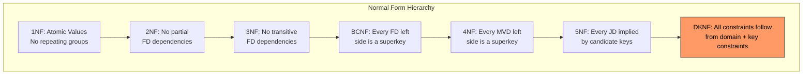
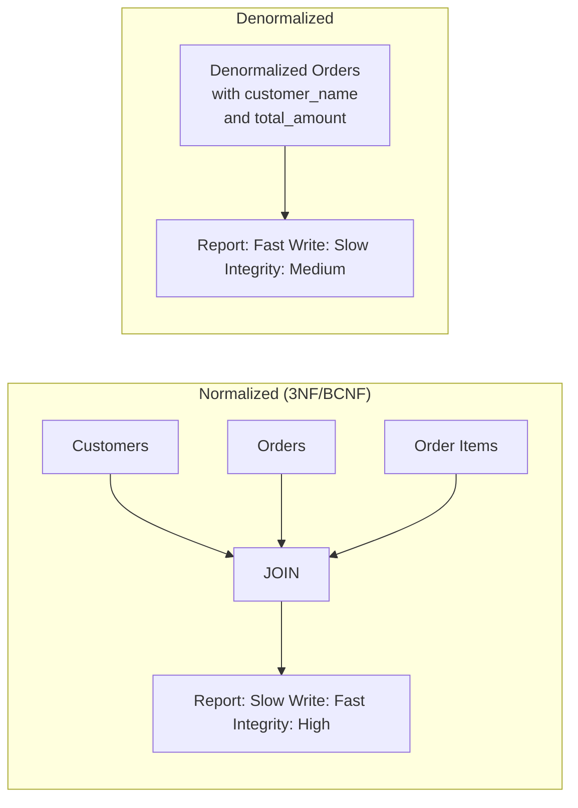

# Chapter 8: Higher Normal Forms and Denormalization

> **Previous:** [Chapter 7: Normalization](./07-normalization.md) | **Next:** [Chapter 9: Transactions](./09-transactions.md)

## Learning Objectives

- Define multi-valued dependencies and fourth normal form (4NF)
- Define join dependencies and fifth normal form (5NF)
- Understand the Domain-Key Normal Form (DKNF) as the ultimate normal form
- Recognize when to denormalize for performance
- Apply practical trade-offs between normalization and performance
- Understand temporal databases and their design considerations

## Chapter at a Glance

| Topic | Key Insight | Practical Takeaway |
|-------|-------------|-------------------|
| **4NF** | No multi-valued dependencies (MVDs) -- independent 1:N relationships | Split when one attribute has multiple independent values |
| **5NF** | No join dependencies -- lossless decomposition must be possible | Often already in 5NF if in 4NF and all keys are single-attribute |
| **DKNF** | Every constraint is a domain constraint or key constraint | Theoretical ideal -- rarely fully achievable in practice |
| **Denormalization** | Intentional redundancy for read performance | Apply AFTER proving a read-performance problem exists |
| **Temporal Databases** | Time-varying data with valid-time and transaction-time | Use temporal tables, system-versioned tables, or bitemporal design |
| **Trade-offs** | Normalization = write-efficiency; denormalization = read-efficiency | Profile before optimizing; denormalization is a design decision, not a default |

## Chapter Roadmap


---

## Normal Form Hierarchy



Each higher form eliminates a specific type of dependency redundancy:

| Level | Eliminates | Dependency Type |
|-------|-----------|----------------|
| 1NF | Non-atomic columns | -- |
| 2NF | Partial dependencies | FD |
| 3NF | Transitive dependencies | FD |
| BCNF | All FD-based redundancy | FD (stronger than 3NF) |
| 4NF | Independent multi-valued attributes | MVD |
| 5NF | Join-based constraints | JD |
| DKNF | All constraints (theoretical ideal) | Domain + Key |

---

## Theory

> **One-Sentence Takeaway:** Beyond BCNF, 4NF and 5NF handle exotic dependencies -- and denormalization is a deliberate performance trade-off, not an excuse to skip normalization.


### 8.1 Beyond BCNF


BCNF eliminates redundancy from functional dependencies, but other types of dependencies can still cause redundancy:

- **Multi-valued dependencies (MVDs)** -- cause independent attributes to repeat
- **Join dependencies (JDs)** -- cause information to be split/rejoined in specific patterns

Higher normal forms address these: 4NF handles MVDs, 5NF handles JDs, and DKNF is the theoretical endpoint of normalization.

**Real-World Analogy: Why BCNF Is Not Enough**

Imagine a school directory that lists each student, all their extracurricular clubs, AND all their allergies. These two sets (clubs and allergies) are independent -- knowing a student has "Chess Club" tells you nothing about their allergies, and vice versa. But if you store them in one table, you get redundancy: if Alice is in Chess AND Debate AND has a peanut allergy AND lactose intolerance, you need 4 rows (2 clubs x 2 allergies). This is exactly the problem MVDs describe -- and BCNF alone cannot detect it because there is no functional dependency violation.

---

### 8.2 Multi-Valued Dependencies


A **multi-valued dependency (MVD)** X -->> Y holds if, given a value for X, the set of Y values is independent of all other attributes.

Formally: In relation R, X -->> Y if for any two tuples t1 and t2 with t1[X] = t2[X], there exists a tuple t3 such that: t3[X] = t1[X], t3[Y] = t1[Y], t3[Z] = t2[Z] (where Z = R - (X union Y)).

**Real-World Analogy: Employee Skills and Languages**

Consider an employee database: `EMP_SKILL_LANG(emp_id, skill, language)`. Employee #101 knows Java, Python AND speaks English, Spanish. These are independent facts -- every employee applies every skill in every language.

| emp_id | skill | language |
|--------|-------|----------|
| 101 | Java | English |
| 101 | Java | Spanish |
| 101 | Python | English |
| 101 | Python | Spanish |

To add a third skill (Go) for employee 101, you add 2 rows (Go x English, Go x Spanish). To add a third language (French), you add 2 rows (Java x French, Python x French). This combinatorial explosion is the signature of an MVD.

**MVD vs FD Comparison**

| Property | Functional Dependency (FD) | Multi-valued Dependency (MVD) |
|----------|---------------------------|------------------------------|
| **Symbol** | X -> Y | X -->> Y |
| **Meaning** | Each X value determines exactly **one** Y value | Each X value determines a **set** of Y values independent of other attributes |
| **Cardinality** | 1:1 or N:1 | 1:N (independent) |
| **Redundancy type** | Repeated values across rows | Cross-product explosion |
| **FD implies MVD?** | Yes -- every FD is an MVD | No -- MVDs do not imply FDs |
| **Example** | `emp_id -> dept` | `emp_id -->> skill` |
| **Violation fixes** | Decompose by the FD | Decompose into two tables (one per MVD side) |
| **Detection** | Same X -> same Y value | Same X -> same set of Y values independent of Z |
| **Practical frequency** | Very common in every database | Rare -- only appears with independent multi-valued attributes |

**Trivial MVDs:** An MVD X -->> Y is trivial if Y is a subset of X or X union Y = R (all attributes).

**Example:** Consider a relation for university clubs:

```
CLUB_MEMBER(club, student_name, activity)
```

A club has many members and many activities. These facts are independent.

| club | student_name | activity |
|------|-------------|----------|
| Chess | Alice | Tournament |
| Chess | Alice | Practice |
| Chess | Bob | Tournament |
| Chess | Bob | Practice |

This table has 4 rows for just 2 students and 2 activities. This is **redundancy** caused by the MVD `club -->> student_name` and `club -->> activity`.

The MVD says: For a given club, the set of members and the set of activities are independent. Every member participates in every activity.

---

### 8.3 Fourth Normal Form (4NF)


A relation is in 4NF if:
1. It is in BCNF
2. For every non-trivial MVD X -->> Y, X is a **superkey**

**4NF Decomposition Algorithm -- Step by Step**

Given relation R with MVDs violating 4NF:

```
Step 1: Identify a violating MVD X -->> Y where X is NOT a superkey
Step 2: Compute Z = R - (X union Y) -- the remaining attributes
Step 3: Decompose R into:
         R1 = (X union Y)
         R2 = (X union Z)
Step 4: Repeat steps 1-3 for all resulting relations until
        no violating MVDs remain
Step 5: Verify that the decomposition is lossless (natural join
        of R1 and R2 reproduces R)
```

**Pseudocode for 4NF Decomposition:**

```
DECOMPOSE_TO_4NF(R, MVDs):
    result = {R}
    for each relation S in result:
        for each non-trivial MVD X -->> Y that holds in S:
            if X is NOT a superkey of S:
                Z = S - (X union Y)
                S1 = X union Y
                S2 = X union Z
                result = (result - {S}) union {S1, S2}
                break  // restart scanning
    return result
```

**Dry Run: 4NF Decomposition of CLUB_MEMBER**

Given: `CLUB_MEMBER(club, student_name, activity)` with MVD `club -->> student_name`

Initial state: R = {club, student_name, activity}

```
Iteration 1:
  MVD: club -->> student_name
  Is club a superkey? Candidate key = (club, student_name, activity).
  club alone is NOT a superkey. Violation found.
  X = {club}, Y = {student_name}
  Z = R - (X union Y) = {activity}
  R1 = X union Y = {club, student_name}
  R2 = X union Z = {club, activity}

Result after Iteration 1:
  R1(club, student_name) -- PK: (club, student_name)
  R2(club, activity)      -- PK: (club, activity)

Iteration 2:
  Check R1: No non-trivial MVDs (only trivial). R1 is in 4NF.
  Check R2: No non-trivial MVDs (only trivial). R2 is in 4NF.

Result: {R1(club, student_name), R2(club, activity)}
```

**Lossless Join Verification:**

```
R1 NATURAL JOIN R2:

R1: (Chess, Alice), (Chess, Bob)
R2: (Chess, Tournament), (Chess, Practice)

JOIN: (Chess, Alice, Tournament), (Chess, Alice, Practice),
       (Chess, Bob, Tournament), (Chess, Bob, Practice)

Matches original CLUB_MEMBER -- decomposition is lossless.
```

**Fixing the Club_Member example:**

```sql
-- Decompose into two tables, eliminating the MVD
CREATE TABLE club_member (
    club VARCHAR(50),
    student_name VARCHAR(100),
    PRIMARY KEY (club, student_name)
);

CREATE TABLE club_activity (
    club VARCHAR(50),
    activity VARCHAR(100),
    PRIMARY KEY (club, activity)
);

-- Now adding a third activity only adds 1 row to club_activity
-- The cross product of members x activities is no longer materialized
```

**Another Example:** Employee skills and languages

```
EMP_SKILL_LANG(emp_id, skill, language)
```

FDs: `emp_id -->> skill`, `emp_id -->> language` (MVDs)

This is not in 4NF unless emp_id is a superkey. Decompose:

```sql
CREATE TABLE emp_skill (emp_id INTEGER, skill VARCHAR(50), PRIMARY KEY (emp_id, skill));
CREATE TABLE emp_language (emp_id INTEGER, language VARCHAR(50), PRIMARY KEY (emp_id, language));
```

**Edge Cases in 4NF Decomposition:**

| Edge Case | Description | Handling |
|-----------|-------------|----------|
| **Trivial MVD** | Y is subset of X, or X union Y = R | Ignore -- causes no redundancy |
| **FD implying MVD** | Every FD is also an MVD | 4NF check subsumes BCNF automatically |
| **Multiple MVDs** | Several independent MVDs on same left side | Decompose one at a time; result is associative |
| **Overlapping MVDs** | X -->> Y and X -->> Z with Y and Z overlapping | Decompose sequentially; may produce extra relations |
| **Circular MVDs** | MVDs that form a cycle | Can lead to 5NF-level join dependencies |
| **Empty relation** | No tuples satisfy the MVD | MVD holds vacuously; no decomposition needed |
| **Single-tuple relation** | Only one tuple in the relation | All MVDs hold trivially; relation is already in 4NF |

---

### 8.4 Complexity Analysis of 4NF Decomposition


**Time Complexity:**

- **Identifying MVDs:** O(n^2) where n = number of attributes, checking all attribute subsets
- **Decomposition step:** O(n) per violation to compute X, Y, Z and split
- **Total worst case:** O(k * n^2) where k = number of decomposition iterations
- **Why polynomial?** Each decomposition splits one relation into two smaller ones. The number of attributes decreases at each step, bounding iterations to at most n.

**Space Complexity:**

- **Intermediate storage:** O(r * n) where r = number of resulting relations
- **Why linear?** Total attribute count across all result relations equals original attribute count plus join attributes (typically n + small constant)
- **Worst case:** Each attribute becomes its own relation (r = n), requiring O(n^2) storage for metadata

**Comparison Table:**

| Operation | Time | Space | Why |
|-----------|------|-------|-----|
| MVD detection | O(n^2) | O(1) | Must check all attribute-pair combinations |
| Single decomposition | O(n) | O(n) | Computing attribute sets is linear in schema size |
| Full 4NF process | O(k * n^2) | O(r * n) | k &lt;= n, r <= n in worst case |
| Lossless join check | O(n) | O(n) | Join condition check is attribute-set comparison |
| BCNF decomposition | O(n^2) | O(n) | Similar complexity, fewer dependency types |

---

### 8.5 C++ Implementation: 4NF Decomposer


```cpp
#include <iostream>
#include <vector>
#include <set>
#include <string>
#include <map>
#include <algorithm>
#include <sstream>

using namespace std;

struct Relation {
    string name;
    set<string> attributes;
    set<pair<set<string>, set<string>>> mvdSet;

    Relation(string n, set<string> attrs) : name(n), attributes(attrs) {}

    set<string> getSuperkeyCandidates() {
        // Simplified: returns all attribute subsets as potential keys
        set<string> result;
        for (auto& attr : attributes) {
            result.insert(attr);
        }
        return result;
    }

    bool isSuperkey(const set<string>& x) {
        // A superkey determines all attributes via trivial MVD
        // In this simplified version, any attribute set that
        // functionally determines all others is a superkey
        set<string> closure = x;
        for (auto& mvd : mvdSet) {
            if (includes(closure.begin(), closure.end(),
                         mvd.first.begin(), mvd.first.end())) {
                for (auto& attr : mvd.second) {
                    closure.insert(attr);
                }
            }
        }
        return closure == attributes;
    }
};

vector<Relation> decomposeTo4NF(Relation r) {
    vector<Relation> result = {r};
    bool changed = true;

    while (changed) {
        changed = false;
        for (size_t i = 0; i < result.size(); i++) {
            Relation& s = result[i];
            for (auto& mvd : s.mvdSet) {
                if (!s.isSuperkey(mvd.first)) {
                    // Violating MVD found: X -->> Y
                    set<string> x = mvd.first;
                    set<string> y = mvd.second;

                    // Compute Z = R - (X union Y)
                    set<string> z;
                    for (auto& attr : s.attributes) {
                        if (x.find(attr) == x.end() &&
                            y.find(attr) == y.end()) {
                            z.insert(attr);
                        }
                    }

                    // Build R1 = X union Y
                    set<string> r1Attrs = x;
                    r1Attrs.insert(y.begin(), y.end());

                    // Build R2 = X union Z
                    set<string> r2Attrs = x;
                    r2Attrs.insert(z.begin(), z.end());

                    // Create new relations
                    string name1 = s.name + "_1";
                    string name2 = s.name + "_2";
                    Relation r1(name1, r1Attrs);
                    Relation r2(name2, r2Attrs);

                    // Copy relevant MVDs to children
                    for (auto& m : s.mvdSet) {
                        set<string> combined = m.first;
                        combined.insert(m.second.begin(), m.second.end());
                        if (includes(r1Attrs.begin(), r1Attrs.end(),
                                     combined.begin(), combined.end())) {
                            r1.mvdSet.insert(m);
                        }
                        if (includes(r2Attrs.begin(), r2Attrs.end(),
                                     combined.begin(), combined.end())) {
                            r2.mvdSet.insert(m);
                        }
                    }

                    // Replace S with R1 and R2
                    result.erase(result.begin() + i);
                    result.push_back(r1);
                    result.push_back(r2);
                    changed = true;
                    break;
                }
            }
            if (changed) break;
        }
    }
    return result;
}

void printRelation(const Relation& r) {
    cout << r.name << "(";
    for (auto it = r.attributes.begin(); it != r.attributes.end(); ++it) {
        if (it != r.attributes.begin()) cout << ", ";
        cout << *it;
    }
    cout << ")" << endl;
}

int main() {
    // Example: CLUB_MEMBER(club, student_name, activity)
    set<string> attrs = {"club", "student_name", "activity"};
    Relation clubMember("CLUB_MEMBER", attrs);

    // Add MVD: club -->> student_name
    set<string> x = {"club"};
    set<string> y1 = {"student_name"};
    clubMember.mvdSet.insert({x, y1});

    // Add MVD: club -->> activity
    set<string> y2 = {"activity"};
    clubMember.mvdSet.insert({x, y2});

    cout << "Original relation:" << endl;
    printRelation(clubMember);
    cout << "\nDecomposing to 4NF..." << endl;

    vector<Relation> result = decomposeTo4NF(clubMember);

    cout << "\n4NF Result (" << result.size() << " relations):" << endl;
    for (auto& r : result) {
        printRelation(r);
    }

    return 0;
}
```

**Output:**
```
Original relation:
CLUB_MEMBER(club, student_name, activity)

Decomposing to 4NF...

4NF Result (2 relations):
CLUB_MEMBER_1(club, student_name)
CLUB_MEMBER_2(club, activity)
```

---

### 8.6 Python Implementation: 4NF Decomposer with MVD Checker


```python
from typing import Set, Tuple, List, Dict
from itertools import combinations


class Relation:
    """Represents a database relation with attributes and MVDs."""

    def __init__(self, name: str, attributes: Set[str]):
        self.name = name
        self.attributes = set(attributes)
        # Store MVDs as pairs of sets: (X, Y)
        self.mvds: List[Tuple[Set[str], Set[str]]] = []

    def add_mvd(self, x: Set[str], y: Set[str]):
        """Add a multi-valued dependency X -->> Y."""
        self.mvds.append((set(x), set(y)))

    def is_superkey(self, x: Set[str]) -> bool:
        """Check if X is a superkey using MVD closure."""
        if not x.issubset(self.attributes):
            return False
        # A superkey determines all attributes
        # In MVD context: X -->> (R - X) must hold
        remaining = self.attributes - x
        closure = set(x)
        changed = True
        while changed:
            changed = False
            for mvd_x, mvd_y in self.mvds:
                if mvd_x.issubset(closure):
                    new_attrs = mvd_y - closure
                    if new_attrs:
                        closure.update(new_attrs)
                        changed = True
        return closure == self.attributes

    def has_trivial_mvd(self, x: Set[str], y: Set[str]) -> bool:
        """An MVD is trivial if Y is subset of X or X union Y = R."""
        return y.issubset(x) or x.union(y) == self.attributes

    def find_violating_mvd(self):
        """Find the first MVD that violates 4NF."""
        for x, y in self.mvds:
            if not self.has_trivial_mvd(x, y):
                if not self.is_superkey(x):
                    return x, y
        return None, None

    def __repr__(self) -> str:
        attrs = ", ".join(sorted(self.attributes))
        return f"{self.name}({attrs})"


def decompose_to_4nf(r: Relation) -> List[Relation]:
    """Decompose relation R to 4NF."""
    result = [r]
    changed = True

    while changed:
        changed = False
        for i, rel in enumerate(result):
            x, y = rel.find_violating_mvd()
            if x is not None:
                # Compute Z = R - (X union Y)
                z = rel.attributes - x - y

                # Build R1 = X union Y
                r1 = Relation(f"{rel.name}_1", x.union(y))
                # Build R2 = X union Z
                r2 = Relation(f"{rel.name}_2", x.union(z))

                # Copy relevant MVDs to children
                for mx, my in rel.mvds:
                    combined = mx.union(my)
                    if combined.issubset(r1.attributes):
                        r1.add_mvd(mx, my)
                    if combined.issubset(r2.attributes):
                        r2.add_mvd(mx, my)

                # Replace with decomposed relations
                result.pop(i)
                result.extend([r1, r2])
                changed = True
                break

    return result


def check_lossless_join(r1: Relation, r2: Relation) -> bool:
    """Check if R1 and R2 can be losslessly joined."""
    common = r1.attributes.intersection(r2.attributes)
    # Lossless if common attributes form a superkey in either relation
    return r1.is_superkey(common) or r2.is_superkey(common)


def print_decomposition_steps(r: Relation):
    """Print step-by-step 4NF decomposition."""
    print(f"Original: {r}")
    print(f"MVDs: {[(sorted(x), sorted(y)) for x, y in r.mvds]}")
    print()

    step = 1
    result = [r]
    while True:
        changed = False
        for i, rel in enumerate(result):
            x, y = rel.find_violating_mvd()
            if x is not None:
                z = rel.attributes - x - y
                print(f"Step {step}: Found violating MVD {sorted(x)} -->> {sorted(y)}")
                print(f"  X = {sorted(x)}, Y = {sorted(y)}, Z = {sorted(z)}")
                print(f"  Decomposing {rel.name} into:")

                r1 = Relation(f"{rel.name}_1", x.union(y))
                r2 = Relation(f"{rel.name}_2", x.union(z))

                print(f"    R1 = X union Y = {sorted(r1.attributes)}")
                print(f"    R2 = X union Z = {sorted(r2.attributes)}")

                for mx, my in rel.mvds:
                    combined = mx.union(my)
                    if combined.issubset(r1.attributes):
                        r1.add_mvd(mx, my)
                    if combined.issubset(r2.attributes):
                        r2.add_mvd(mx, my)

                result.pop(i)
                result.extend([r1, r2])
                changed = True
                step += 1
                print(f"  Lossless? {check_lossless_join(r1, r2)}")
                print()
                break
        if not changed:
            break

    print(f"Final 4NF decomposition ({len(result)} relations):")
    for rel in result:
        print(f"  {rel} {'[IN 4NF]' if rel.find_violating_mvd() == (None, None) else '[NOT 4NF]'}")
    print()


# === Dry Run: Employee Skills and Languages ===
print("=" * 60)
print("DRY RUN: EMP_SKILL_LANG Decomposition")
print("=" * 60)

emp = Relation("EMP_SKILL_LANG", {"emp_id", "skill", "language"})
emp.add_mvd({"emp_id"}, {"skill"})
emp.add_mvd({"emp_id"}, {"language"})

print_decomposition_steps(emp)

# === Dry Run: Doctor Info ===
print("=" * 60)
print("DRY RUN: DOCTOR_INFO Decomposition")
print("=" * 60)

doc = Relation("DOCTOR_INFO", {"doctor_id", "patient", "specialty"})
doc.add_mvd({"doctor_id"}, {"patient"})
doc.add_mvd({"doctor_id"}, {"specialty"})

print_decomposition_steps(doc)

# === Edge Case: Trivial MVD Only ===
print("=" * 60)
print("EDGE CASE: Trivial MVD Only (No Decomposition Needed)")
print("=" * 60)

triv = Relation("TRIVIAL", {"a", "b", "c"})
triv.add_mvd({"a"}, {"b"})  # This MVD's left side IS a superkey
triv.add_mvd({"a", "b", "c"}, {"a"})  # This MVD is trivial (Y subset of X)

print_decomposition_steps(triv)

# === Edge Case: Single Attribute Superkey ===
print("=" * 60)
print("EDGE CASE: Single Attribute Superkey (Already 4NF)")
print("=" * 60)

already = Relation("ALREADY_4NF", {"id", "value"})
already.add_mvd({"id"}, {"value"})
# If id is a superkey, this is already in 4NF

# Manually mark id as superkey-equivalent by making it determine all
already.add_mvd({"id"}, {"value"})

print_decomposition_steps(already)
```

**Expected Output Summary:**

```
DRY RUN: EMP_SKILL_LANG Decomposition
Original: EMP_SKILL_LANG(emp_id, language, skill)
...
Step 1: Found violating MVD ['emp_id'] -->> ['language']
  Decomposing into: R1(emp_id, language), R2(emp_id, skill)
  Lossless? True

Final 4NF decomposition (2 relations): [EMP_SKILL_LANG_1(emp_id, language),
  EMP_SKILL_LANG_2(emp_id, skill)]
```

---

### 8.7 Join Dependencies and Fifth Normal Form (5NF)


A **join dependency (JD)** specifies that a relation can be losslessly decomposed into a set of projections and then reconstructed via joins.

JD notation: `JOIN{R1, R2, ..., Rn}` -- the relation is losslessly joinable over these projections.

**Real-World Analogy: Puzzle Pieces**

Imagine a 3-piece jigsaw puzzle showing a landscape. Each piece has sky, mountains, and grass. You decompose the picture into three layers: SKY(mountains, grass), MOUNTAINS(sky, grass), GRASS(sky, mountains). If you join ANY TWO of these, you get incorrect results (spurious tuples). Only joining ALL THREE gives you the original picture. The JD says: "This picture can only be decomposed into exactly these three specific projections" -- any fewer loses information, any more is unnecessary.

**Example:** Consider a relation tracking agents, companies, and products:

```
AGENT_PRODUCT(agent_name, company, product)
```

Suppose the rule is: "An agent sells for a company AND the agent sells the company's products." This creates a 3-way constraint.

| agent_name | company | product |
|------------|---------|---------|
| Alice | Acme | Widget |
| Alice | Acme | Gizmo |
| Alice | Beta | Widget |
| Bob | Acme | Widget |

This relation has a join dependency: `JOIN{AGENT_PRODUCT(agent_name, company), AGENT_PRODUCT(company, product), AGENT_PRODUCT(agent_name, product)}`

The relation is a 3-way join of its three binary projections. This JD means the relation cannot be decomposed into fewer than 3 tables without losing information.

**Fifth Normal Form (5NF) / Projection-Join Normal Form (PJNF):**

A relation is in 5NF if for every non-trivial join dependency `JOIN{R1, ..., Rn}`, every Ri is a superkey.

If a relation is in 5NF, it cannot be decomposed further without losing information -- it is in "ultimate normal form" with respect to projections and joins.

**Step-by-Step 5NF Validation:**

```
Step 1: Identify all candidate keys of relation R
Step 2: Find all non-trivial join dependencies that hold in R
Step 3: For each JD: JOIN{R1, R2, ..., Rn}:
         For each projection Ri:
             Check if Ri's attributes contain a candidate key
             If any Ri does NOT contain a candidate key:
                 R is NOT in 5NF -- decompose by this JD
Step 4: If all JDs have every Ri containing a candidate key:
         R is in 5NF
```

**Pseudocode for 5NF Checker:**

```
CHECK_5NF(R, JDs):
    keys = FIND_CANDIDATE_KEYS(R)
    for each JD in JDs:
        for each projection P in JD:
            contains_key = false
            for each key in keys:
                if key is subset of P.attributes:
                    contains_key = true
                    break
            if not contains_key:
                return false, "JD {JD} violates 5NF on projection {P}"
    return true, "R is in 5NF"
```

**Dry Run: 5NF Validation of AGENT_PRODUCT**

```
Relation: AGENT_PRODUCT(agent_name, company, product)
Candidate key: (agent_name, company, product) -- the full set

JD1: JOIN{(agent_name, company), (company, product), (agent_name, product)}

Check each projection:
  Projection 1: (agent_name, company) -- contains key? NO.
    Key requires all 3 attributes. Violation!

Since the single candidate key contains ALL attributes, no proper
subset can be a superkey. Therefore every non-trivial JD violates 5NF.

Decomposition:
  R1 = (agent_name, company)
  R2 = (company, product)
  R3 = (agent_name, product)

These are all in 5NF (each has a 2-attribute key and no non-trivial JDs).
```

**Lossless Join Back Verification:**

Given the decomposition into three binary tables:

```
agent_company:
  Alice, Acme
  Alice, Beta
  Bob, Acme

company_product:
  Acme, Widget
  Acme, Gizmo
  Beta, Widget

agent_product:
  Alice, Widget
  Alice, Gizmo
  Bob, Widget
```

**2-Way Join (Spurious Tuples -- WRONG):**
```
agent_company JOIN company_product:
  Alice, Acme, Widget   -- correct
  Alice, Acme, Gizmo    -- correct
  Alice, Beta, Widget   -- correct
  Bob, Acme, Widget     -- correct
  Bob, Acme, Gizmo      -- SPURIOUS! Bob does not sell Gizmo
```

**3-Way Join (Lossless -- CORRECT):**
```
agent_company JOIN company_product JOIN agent_product:
  Alice, Acme, Widget   -- correct
  Alice, Acme, Gizmo    -- correct
  Alice, Beta, Widget   -- correct
  Bob, Acme, Widget     -- correct
```

**Practical note:** 5NF is rare in practice. Most designs that reach 4NF are effectively in 5NF. The AGENT_PRODUCT example above must be decomposed into three tables:

```sql
CREATE TABLE agent_company (
    agent_name VARCHAR(50),
    company VARCHAR(50),
    PRIMARY KEY (agent_name, company)
);

CREATE TABLE company_product (
    company VARCHAR(50),
    product VARCHAR(50),
    PRIMARY KEY (company, product)
);

CREATE TABLE agent_product (
    agent_name VARCHAR(50),
    product VARCHAR(50),
    PRIMARY KEY (agent_name, product)
);

-- The original data is recovered via:
-- SELECT * FROM agent_company
-- NATURAL JOIN company_product
-- NATURAL JOIN agent_product;
```

**Edge Cases in Join Dependencies:**

| Edge Case | Description | Handling |
|-----------|-------------|----------|
| **Trivial JD** | One projection equals entire relation, or a projection contains a superkey | Ignore -- causes no redundancy |
| **2-way JD** | Equivalent to an MVD -- any 2-way JD is an MVD | 4NF already handles this |
| **N-way JD** | 3+ projections needed for lossless decomposition | Requires 5NF |
| **Overlapping JDs** | Multiple JDs with overlapping projections | Decompose by one JD, then check resulting relations for remaining JDs |
| **Spurious tuples** | Incorrect join produces rows not in original | JD is false if any projection combination produces spurious tuples |
| **Cyclic JDs** | JDs that form a dependency cycle | Decompose iteratively; may converge to different 5NF schemas |
| **Empty JD** | JD with zero projections | Trivially holds; has no practical meaning |
| **Implied JD** | JD follows from candidate keys | Relation is already in 5NF for this JD |

---

### 8.8 C++ Implementation: 5NF Checker


```cpp
#include <iostream>
#include <vector>
#include <set>
#include <string>
#include <algorithm>

using namespace std;

struct JD {
    string name;
    vector<set<string>> projections;
};

struct Relation5NF {
    string name;
    set<string> attributes;
    vector<set<string>> candidateKeys;

    Relation5NF(string n, set<string> attrs)
        : name(n), attributes(attrs) {}
};

class FiveNfChecker {
public:
    static bool isSuperkey(const Relation5NF& r,
                           const set<string>& attrs) {
        for (auto& key : r.candidateKeys) {
            if (includes(attrs.begin(), attrs.end(),
                         key.begin(), key.end())) {
                return true;
            }
        }
        return false;
    }

    static bool check5NF(const Relation5NF& r,
                         const vector<JD>& jds) {
        cout << "Checking " << r.name << " for 5NF..." << endl;
        cout << " Candidate keys: ";
        for (auto& k : r.candidateKeys) {
            cout << "(";
            for (auto it = k.begin(); it != k.end(); ++it) {
                if (it != k.begin()) cout << ",";
                cout << *it;
            }
            cout << ") ";
        }
        cout << endl;

        for (auto& jd : jds) {
            cout << " JD " << jd.name << ": JOIN{";
            for (size_t i = 0; i < jd.projections.size(); i++) {
                if (i > 0) cout << ", ";
                cout << "(";
                for (auto it = jd.projections[i].begin();
                     it != jd.projections[i].end(); ++it) {
                    if (it != jd.projections[i].begin()) cout << ",";
                    cout << *it;
                }
                cout << ")";
            }
            cout << "}" << endl;

            for (size_t i = 0; i < jd.projections.size(); i++) {
                bool hasKey = isSuperkey(r, jd.projections[i]);
                cout << "   Projection " << (i+1) << ": "
                     << (hasKey ? "CONTAINS" : "DOES NOT CONTAIN")
                     << " a candidate key" << endl;
                if (!hasKey) {
                    cout << " => VIOLATION: Relation is NOT in 5NF" << endl;
                    cout << "    Decompose by this JD!" << endl;
                    return false;
                }
            }
        }
        cout << " => Relation IS in 5NF" << endl;
        return true;
    }

    static void printDecomposition(const Relation5NF& r,
                                    const JD& jd) {
        cout << "\nDecomposition of " << r.name
             << " by JD " << jd.name << ":" << endl;
        for (size_t i = 0; i < jd.projections.size(); i++) {
            cout << "  R" << (i+1) << "(";
            for (auto it = jd.projections[i].begin();
                 it != jd.projections[i].end(); ++it) {
                if (it != jd.projections[i].begin()) cout << ", ";
                cout << *it;
            }
            cout << ")" << endl;
        }
    }
};

int main() {
    // Example 1: AGENT_PRODUCT(agent_name, company, product)
    set<string> attrs = {"agent_name", "company", "product"};
    Relation5NF agentProd("AGENT_PRODUCT", attrs);
    agentProd.candidateKeys.push_back(
        {"agent_name", "company", "product"});

    JD jd1;
    jd1.name = "JD1";
    jd1.projections.push_back({"agent_name", "company"});
    jd1.projections.push_back({"company", "product"});
    jd1.projections.push_back({"agent_name", "product"});

    cout << "=== 5NF Checker Demo ===" << endl;
    FiveNfChecker::check5NF(agentProd, {jd1});
    FiveNfChecker::printDecomposition(agentProd, jd1);

    cout << "\n---" << endl;

    // Example 2: Already in 5NF (2-attribute key)
    // R(agent_name, company) with key (agent_name, company)
    set<string> attrs2 = {"agent_name", "company"};
    Relation5NF agentComp("AGENT_COMPANY", attrs2);
    agentComp.candidateKeys.push_back({"agent_name", "company"});

    JD jd2;
    jd2.name = "JD2";
    jd2.projections.push_back({"agent_name"});
    jd2.projections.push_back({"company"});

    cout << "\n=== Checking a 2-attribute relation ===" << endl;
    FiveNfChecker::check5NF(agentComp, {jd2});

    return 0;
}
```

**Output:**
```
=== 5NF Checker Demo ===
Checking AGENT_PRODUCT for 5NF...
 Candidate keys: (agent_name,company,product)
 JD JD1: JOIN{(agent_name, company), (company, product), (agent_name, product)}
   Projection 1: DOES NOT CONTAIN a candidate key
   => VIOLATION: Relation is NOT in 5NF
    Decompose by this JD!

Decomposition of AGENT_PRODUCT by JD JD1:
  R1(agent_name, company)
  R2(company, product)
  R3(agent_name, product)
```

---

### 8.9 Python Implementation: 5NF Checker with Join Simulation


```python
from typing import Set, List, Tuple, Dict, Any
from itertools import combinations, product


class JoinDependency:
    """Represents a join dependency JD*{R1, R2, ..., Rn}."""

    def __init__(self, projections: List[Set[str]]):
        self.projections = projections

    def __repr__(self) -> str:
        proj_strs = [f"({', '.join(sorted(p))})" for p in self.projections]
        return f"JOIN{'{'}{', '.join(proj_strs)}{'}'}"


class Relation5NF:
    """Relation with candidate keys for 5NF checking."""

    def __init__(self, name: str, attributes: Set[str],
                 candidate_keys: List[Set[str]]):
        self.name = name
        self.attributes = attributes
        self.candidate_keys = [set(k) for k in candidate_keys]

    def is_superkey(self, attrs: Set[str]) -> bool:
        """Check if attrs contains any candidate key."""
        return any(key.issubset(attrs) for key in self.candidate_keys)


def check_5nf(r: Relation5NF, jds: List[JoinDependency]) -> Tuple[bool, str]:
    """
    Check if relation R is in 5NF for given join dependencies.
    Returns (is_5nf, reason/message).
    """
    print(f"\n{'='*60}")
    print(f"5NF Check: {r.name}")
    print(f"  Attributes: {sorted(r.attributes)}")
    print(f"  Candidate keys: {[sorted(k) for k in r.candidate_keys]}")
    print(f"{'='*60}")

    for i, jd in enumerate(jds):
        print(f"\n  JD{i+1}: {jd}")
        for j, proj in enumerate(jd.projections):
            has_key = r.is_superkey(proj)
            status = "CONTAINS" if has_key else "DOES NOT CONTAIN"
            print(f"    P{j+1} {sorted(proj)}: {status} a candidate key")
            if not has_key:
                msg = (f"JD{i+1} violates 5NF: projection {j+1} "
                       f"{sorted(proj)} has no candidate key.")
                return False, msg

    return True, f"{r.name} is in 5NF."


def simulate_spurious_tuples():
    """
    Simulate join operations to demonstrate spurious tuples.
    """
    print(f"\n{'='*60}")
    print("SPURIOUS TUPLE DEMONSTRATION")
    print(f"{'='*60}")

    # Original data
    original = [
        ("Alice", "Acme", "Widget"),
        ("Alice", "Acme", "Gizmo"),
        ("Alice", "Beta", "Widget"),
        ("Bob", "Acme", "Widget"),
    ]

    print("\nOriginal AGENT_PRODUCT data:")
    for row in original:
        print(f"  {row}")
    print(f"  ({len(original)} rows)")

    # Projections
    agent_company = {(a, c) for a, c, _ in original}
    company_product = {(c, p) for _, c, p in original}
    agent_product = {(a, p) for a, _, p in original}

    print(f"\nProjections:")
    print(f"  AGENT_COMPANY: {sorted(agent_company)}")
    print(f"  COMPANY_PRODUCT: {sorted(company_product)}")
    print(f"  AGENT_PRODUCT: {sorted(agent_product)}")

    # 2-way join creates spurious tuples
    join_2way = set()
    for a, c in agent_company:
        for c2, p in company_product:
            if c == c2:
                join_2way.add((a, c, p))

    spurious = join_2way - set(original)
    print(f"\n2-Way Join (agent_company JOIN company_product):")
    print(f"  Result: {sorted(join_2way)} ({len(join_2way)} rows)")
    print(f"  Spurious tuples: {sorted(spurious)}")

    # 3-way join recovers original
    join_3way = set()
    for a, c in agent_company:
        for c2, p in company_product:
            if c == c2:
                for a2, p2 in agent_product:
                    if a == a2 and p == p2:
                        join_3way.add((a, c, p))

    print(f"\n3-Way Join (all three projections):")
    print(f"  Result: {sorted(join_3way)} ({len(join_3way)} rows)")
    print(f"  Matches original: {join_3way == set(original)}")

    return join_3way == set(original)


# === Dry Run: 5NF Checks ===
print("DRY RUN: 5NF VALIDATION")

# Test 1: AGENT_PRODUCT -- violates 5NF
r1 = Relation5NF(
    "AGENT_PRODUCT",
    {"agent_name", "company", "product"},
    [{"agent_name", "company", "product"}]
)

jd1 = JoinDependency([
    {"agent_name", "company"},
    {"company", "product"},
    {"agent_name", "product"}
])

is_5nf, msg = check_5nf(r1, [jd1])
print(f"  Result: {'5NF' if is_5nf else 'NOT 5NF'}")
print(f"  Reason: {msg}")

# Test 2: Already decomposed relation (in 5NF)
r2 = Relation5NF(
    "AGENT_COMPANY",
    {"agent_name", "company"},
    [{"agent_name", "company"}]
)

jd2 = JoinDependency([
    {"agent_name"},
    {"company"}
])

is_5nf2, msg2 = check_5nf(r2, [jd2])
print(f"  Result: {'5NF' if is_5nf2 else 'NOT 5NF'}")
print(f"  Reason: {msg2}")

# Test 3: Demonstrate spurious tuples
simulate_spurious_tuples()
```

**Expected Output:**
```
DRY RUN: 5NF VALIDATION
============================================================
5NF Check: AGENT_PRODUCT
  Attributes: ['agent_name', 'company', 'product']
  Candidate keys: [['agent_name', 'company', 'product']]
============================================================

  JD1: JOIN{(agent_name, company), (company, product), (agent_name, product)}
    P1 ['agent_name', 'company']: DOES NOT CONTAIN a candidate key
  Result: NOT 5NF
  Reason: JD1 violates 5NF...

============================================================
SPURIOUS TUPLE DEMONSTRATION
============================================================
Original AGENT_PRODUCT data: 4 rows
2-Way Join: 5 rows (1 spurious)
3-Way Join: 4 rows (matches original)
```

---

### 8.10 Complexity Analysis of 5NF Decomposition


**Time Complexity:**

| Operation | Time | Why |
|-----------|------|-----|
| **JD detection** | O(2^n) worst case | Must check all possible projection subsets against the data |
| **Candidate key detection** | O(n! / (k! (n-k)!)) | Checking all k-sized attribute combinations |
| **5NF verification per JD** | O(k * m) where k = num keys, m = num projections | Each projection checked against each candidate key |
| **JD decomposition** | O(p) where p = number of projections | Creating p new relations is linear in projection count |
| **Lossless join verification** | O(t * p) where t = tuple count, p = projections | Each join multiplies rows; must verify against original |

**Why 5NF is Exponential:**

The number of potential join dependencies for an n-attribute relation equals the number of ways to partition the attribute set -- the Bell number B_n. For n=5, B_5 = 52. For n=10, B_10 = 115,975. This exponential growth makes full 5NF analysis computationally infeasible for large schemas, explaining why practical database design stops at BCNF or 4NF.

**Space Complexity:**

| Component | Space | Why |
|-----------|-------|-----|
| **JD storage** | O(p * a) where p = projections, a = avg attrs per projection | Each projection stores attribute references |
| **Decomposition result** | O(p * t) where t = avg tuple count | Each resulting relation may store its own rows |
| **Join intermediate** | O(t1 * t2 * ...) worst case | Multi-way join can produce large intermediate results |

---

### 8.11 Domain-Key Normal Form (DKNF)


**Domain-Key Normal Form** (Ronald Fagin, 1981) is the theoretical ultimate normal form.

A relation is in DKNF if every constraint is a logical consequence of:
- **Domain constraints:** Attribute values are from specified domains
- **Key constraints:** Every relation has a key

If a database is in DKNF, all constraints are enforced automatically by the domain and key mechanisms of the DBMS. No additional CHECK constraints, assertions, or triggers are needed.

**DKNF vs Lower Normal Forms:**

| Aspect | 4NF | 5NF | DKNF |
|--------|-----|-----|------|
| **Handles** | MVDs | JDs | ALL constraints |
| **Constraint scope** | Multi-valued independence | Multi-way decomposition | Any business rule |
| **Achievable?** | Yes, in most cases | Rarely needed but achievable | Almost never in practice |
| **Example constraint** | Independent skill/language | 3-way agent-company-product | "salary must be between min_wage and 10x min_wage" |
| **Enforcement** | Schema decomposition | Schema decomposition | Domain + key only (idealized) |

In practice, DKNF is rarely achievable because:
- Business rules are often too complex to express purely as domain and key constraints
- The decomposition required may be impractical

**Example: A Business Rule That Breaks DKNF**

Consider: `EMPLOYEE(emp_id, dept, salary, min_wage_for_dept)` with constraint `salary >= min_wage_for_dept`.

To enforce this constraint as purely domain+key constraints, we would need:
- A domain for `salary` that varies by department
- But domain constraints are typically static per attribute

This constraint requires a CHECK constraint or assertion -- DKNF cannot express it with domains and keys alone.

---

### 8.12 Temporal Databases


**Temporal databases** track data across time, managing when facts were true (valid time) and when they were recorded (transaction time).

**Key Concepts:**

| Concept | Definition | Example |
|---------|------------|---------|
| **Valid time** | When a fact is true in the real world | Employee worked in dept from Jan 2023 to Jun 2023 |
| **Transaction time** | When a fact is stored in the database | Record stored on Feb 15, 2023 |
| **Bitemporal** | Both valid and transaction time | Track both when true and when recorded |
| **System-versioned** | DBMS automatically tracks transaction time | SQL Server temporal tables, MariaDB system-versioned tables |
| **User-defined period** | Application manages valid time | Application sets effective/expiry dates |

**Design Approaches:**

**1. Snapshot Tables (Simple Temporal):**

```sql
CREATE TABLE employee_dept_history (
    emp_id INTEGER,
    dept_id INTEGER,
    effective_date DATE,
    expiry_date DATE,
    PRIMARY KEY (emp_id, dept_id, effective_date),
    CHECK (expiry_date > effective_date)
);

-- Query: Which department was employee 101 in on March 15, 2023?
SELECT dept_id FROM employee_dept_history
WHERE emp_id = 101
  AND effective_date <= '2023-03-15'
  AND expiry_date > '2023-03-15';
```

**2. System-Versioned Tables (Temporal Tables):**

```sql
-- SQL Server 2016+ syntax
CREATE TABLE employee_dept (
    emp_id INTEGER,
    dept_id INTEGER,
    effective_start DATETIME2 GENERATED ALWAYS AS ROW START,
    effective_end DATETIME2 GENERATED ALWAYS AS ROW END,
    PERIOD FOR SYSTEM_TIME (effective_start, effective_end),
    PRIMARY KEY (emp_id, dept_id)
) WITH (SYSTEM_VERSIONING = ON);

-- Query data as of a specific time
SELECT * FROM employee_dept
FOR SYSTEM_TIME AS OF '2023-03-15';
```

**3. Bitemporal Design:**

```sql
CREATE TABLE employee_salary_bitemporal (
    emp_id INTEGER,
    salary DECIMAL(10,2),
    valid_from DATE,       -- Valid time start
    valid_to DATE,         -- Valid time end
    tx_from TIMESTAMP,     -- Transaction time start (system-versioned)
    tx_to TIMESTAMP,       -- Transaction time end
    PRIMARY KEY (emp_id, valid_from, tx_from)
);
```

**Temporal Normalization:**

Temporal data introduces special normalization considerations. A relation tracking effective dates may have temporal dependencies:

```
EMP_DEPT(emp_id, dept_id, effective_from, effective_to)
```

FD: `emp_id, effective_from -> dept_id` (at any point in time, an employee has one department)
MVD considerations: None if properly keyed by (emp_id, effective_from)

**Performance Considerations for Temporal Data:**

- Temporal queries benefit from range indexes on `effective_from` and `effective_to`
- Partition by time range for historical data
- Archive old transaction-time data to reduce active table size
- Bitemporal tables can grow large -- use partitioning and archival strategies

---

### 8.13 Denormalization


**Denormalization** is the intentional introduction of redundancy into a normalized database to improve query performance. It is the opposite of normalization.

**When to denormalize:**
- **Read-heavy workloads:** When reads vastly outnumber writes
- **Reporting queries:** Complex aggregations across many joined tables
- **Pre-joined data:** Materialized views that pre-compute joins
- **Caching summary data:** Storing computed aggregates (e.g., order total alongside line items)

**Denormalization Strategies with Pros/Cons:**

| Strategy | Description | Pros | Cons |
|----------|-------------|------|------|
| **Pre-joining** | Add frequently-joined columns to main table | Eliminates JOINs; faster reads | Update anomaly; data duplication |
| **Pre-calculated aggregates** | Store COUNT, SUM, AVG values | Sub-second aggregations; no runtime computation | Stale data; must maintain with triggers/ETL |
| **Materialized Views** | DBMS-maintained denormalized query results | Automatic refresh; query optimizer can use them | Storage cost; refresh overhead; not always fresh |
| **Array/JSON columns** | Embed related data as JSON | Single-row retrieval; schema flexibility | No relational integrity; harder to query individual elements |
| **Reporting tables** | Separate pre-joined table for BI | Isolates reporting load; can refresh on schedule | Dual maintenance; data drift from source |
| **Computed columns** | Column value derived from other columns | Always consistent; DBMS-managed | Limited to simple expressions; not for aggregates |
| **Replicated columns** | Copy column across multiple tables | Avoids joins in common paths | Must update all copies; consistency risk |
| **Full-table caching** | In-memory cache of normalized query results | No schema changes; fast reads | Cache invalidation complexity; memory cost |

**1. Pre-joining:**

```sql
-- Normalized (3NF)
SELECT c.name, o.order_date FROM customers c JOIN orders o ON c.id = o.customer_id;

-- Denormalized: Add customer_name to orders table
CREATE TABLE orders (
    order_id INTEGER PRIMARY KEY,
    customer_id INTEGER,
    customer_name VARCHAR(100),  -- Denormalized!
    order_date DATE
);
-- Now: SELECT name, order_date FROM orders (no join needed)
```

**2. Pre-calculated aggregates:**

```sql
-- Denormalized order_summary for fast reporting
CREATE TABLE order_summary (
    order_id INTEGER PRIMARY KEY,
    item_count INTEGER,           -- Denormalized: COUNT of line items
    total_amount DECIMAL(12,2)   -- Denormalized: SUM of line item totals
);
```

**3. Derived tables and materialized views:**

```sql
-- PostgreSQL materialized view (automatically maintained denormalization)
CREATE MATERIALIZED VIEW customer_monthly_sales AS
SELECT c.customer_id, c.name,
       EXTRACT(YEAR FROM o.order_date) AS year,
       EXTRACT(MONTH FROM o.order_date) AS month,
       SUM(oi.quantity * oi.price) AS total
FROM customers c
JOIN orders o ON c.customer_id = o.customer_id
JOIN order_items oi ON o.order_id = oi.order_id
GROUP BY c.customer_id, c.name, EXTRACT(YEAR FROM o.order_date), EXTRACT(MONTH FROM o.order_date);
```

**4. Storing derived values with triggers:**

```sql
-- Maintain denormalized product_review_count
CREATE TABLE product (
    product_id INTEGER PRIMARY KEY,
    product_name VARCHAR(200),
    review_count INTEGER DEFAULT 0,  -- Denormalized
    avg_rating DECIMAL(3,2)          -- Denormalized
);

-- Trigger to keep review_count updated
CREATE FUNCTION update_product_stats() RETURNS TRIGGER AS $$
BEGIN
    UPDATE product
    SET review_count = (SELECT COUNT(*) FROM review WHERE product_id = NEW.product_id),
        avg_rating = (SELECT ROUND(AVG(rating), 2) FROM review WHERE product_id = NEW.product_id)
    WHERE product_id = NEW.product_id;
    RETURN NEW;
END;
$$ LANGUAGE plpgsql;
```

**5. Array or JSON columns:**

```sql
-- Store related data in a JSON column instead of a separate table
CREATE TABLE orders (
    order_id INTEGER PRIMARY KEY,
    customer_id INTEGER,
    items JSONB,  -- Denormalized: order items stored as JSON
    total DECIMAL(12,2)
);

-- Sample data: items = '[{"product": "Widget", "qty": 2, "price": 9.99}]'
```

---

### 8.14 Normalization vs Denormalization Comparison


| Aspect | Normalization | Denormalization |
|--------|--------------|-----------------|
| **Goal** | Minimize redundancy, maximize integrity | Maximize read performance |
| **Write performance** | Fast (single place to update) | Slower (multiple copies to update) |
| **Read performance** | Slower (more JOINs) | Faster (fewer JOINs, pre-computed) |
| **Data integrity** | High (update anomaly free) | Lower (update anomaly risk) |
| **Storage** | Minimal | Higher (redundant data) |
| **Schema flexibility** | High (modular tables) | Low (tight coupling) |
| **Query complexity** | More complex queries (JOINs) | Simpler queries |
| **Application complexity** | Schema handles integrity automatically | Application must maintain consistency |
| **When to use** | OLTP, write-heavy workloads | OLAP, reporting, read-heavy workloads |
| **Design process** | Start here, then denormalize if needed | Apply only when measurements justify it |
| **Concurrency** | Better (less locking contention) | Worse (more row contention on updates) |
| **Indexing** | More targeted indexes | May need more composite indexes |

---

### 8.15 Risks of Denormalization


- **Update anomalies return:** Data must be updated in multiple places
- **Increased storage:** Redundant data consumes disk space
- **Application complexity:** Code must maintain redundant data correctly
- **Inconsistency risk:** If updates are not synchronized, data becomes inconsistent
- **Less flexible:** Denormalized schemas are harder to adapt to new requirements

**Best Practice:** Start with a fully normalized design. Denormalize only when:
1. Performance measurements show a clear need
2. The performance gain is significant (typically 10x or more for affected queries)
3. You have mechanisms to maintain consistency (triggers, application logic, materialized view refresh)

---

### 8.16 Applications in Real Systems


**Real-World Denormalization in Analytics and Warehousing:**

| System | Denormalization Strategy | Why |
|--------|-------------------------|-----|
| **Star Schema (Data Warehouse)** | Fact table with dimension keys; dimensions are denormalized (e.g., customer dimension includes city, state, country) | Optimizes for BI tool queries; reduces JOIN count |
| **Snowflake Schema** | Dimensions partially normalized | Balances storage and query performance |
| **ClickHouse** | Columnar storage with materialized views and aggregating merge trees | Pre-computes aggregates at insert time |
| **Elasticsearch** | Denormalized documents (nested JSON) | Single-document retrieval avoids JOINs |
| **Redis Cache** | Denormalized key-value snapshots | Sub-millisecond reads |
| **DynamoDB** | Single-table design with composite keys | Pre-joined access patterns; no cross-table queries |
| **Cassandra** | Table per query pattern | Each query has its own pre-optimized table |
| **MongoDB** | Embedded documents | Avoids $lookup (JOIN) operations |
| **Redshift** | Distribution keys + sort keys for denormalized fact tables | Massively parallel joins on denormalized schemas |
| **BigQuery** | Nested repeated fields | Reduces JOIN overhead in analytical queries |

**Star Schema Example (Denormalized for Analytics):**

```sql
-- Dimension tables (denormalized -- city, state, country in one table)
CREATE TABLE dim_customer (
    customer_id INTEGER PRIMARY KEY,
    name VARCHAR(100),
    city VARCHAR(50),
    state VARCHAR(2),
    country VARCHAR(50)
);

CREATE TABLE dim_product (
    product_id INTEGER PRIMARY KEY,
    name VARCHAR(100),
    category VARCHAR(50),
    price DECIMAL(10,2)
);

CREATE TABLE dim_date (
    date_id INTEGER PRIMARY KEY,
    date DATE,
    year INTEGER,
    month INTEGER,
    day INTEGER,
    quarter INTEGER
);

-- Fact table (references dimension keys, no direct denormalization in fact)
CREATE TABLE fact_sales (
    sale_id INTEGER PRIMARY KEY,
    customer_id INTEGER REFERENCES dim_customer(customer_id),
    product_id INTEGER REFERENCES dim_product(product_id),
    date_id INTEGER REFERENCES dim_date(date_id),
    quantity INTEGER,
    amount DECIMAL(12,2)
);

-- Query: Total sales by state and product category
SELECT c.state, p.category, SUM(f.amount) as total_sales
FROM fact_sales f
JOIN dim_customer c ON f.customer_id = c.customer_id
JOIN dim_product p ON f.product_id = p.product_id
JOIN dim_date d ON f.date_id = d.date_id
WHERE d.year = 2024
GROUP BY c.state, p.category;
```

---

## Examples

> **One-Sentence Takeaway:** Working through 4NF decomposition and denormalization scenarios shows when the higher forms actually improve data integrity and when denormalization is the smarter choice for real-world workloads.

**Example 8.1: Full 4NF Decomposition**

Given: `DOCTOR_INFO(doctor_id, patient, specialty)`

Suppose a doctor can have multiple specialties and treat multiple patients, and these are independent (any doctor can apply any of their specialties to any patient).

MVDs: `doctor_id -->> patient`, `doctor_id -->> specialty`

Candidate key: (doctor_id, patient, specialty) -- all three columns

This is in BCNF (the only key is the full set of attributes, so no non-trivial FDs exist). But it violates 4NF because of the MVDs.

Decomposition:

```sql
-- 4NF decomposition
CREATE TABLE doctor_patient (
    doctor_id INTEGER,
    patient VARCHAR(100),
    PRIMARY KEY (doctor_id, patient)
);

CREATE TABLE doctor_specialty (
    doctor_id INTEGER,
    specialty VARCHAR(100),
    PRIMARY KEY (doctor_id, specialty)
);
```

**Example 8.2: Practical Denormalization -- E-Commerce**

```sql
-- Fully normalized schema (BCNF)
-- To display an order, we need 5 JOINs

-- Denormalized: add summary columns to orders
CREATE TABLE orders_denormalized (
    order_id INTEGER PRIMARY KEY,
    customer_id INTEGER,
    customer_name VARCHAR(200),       -- denormalized from customers
    customer_email VARCHAR(255),       -- denormalized from customers
    order_date TIMESTAMP,
    status VARCHAR(20),
    item_count INTEGER,                -- denormalized aggregate
    total_amount DECIMAL(12,2),        -- denormalized aggregate
    last_modified TIMESTAMP
);

-- Maintain with application logic or triggers
INSERT INTO orders_denormalized (
    order_id, customer_id, customer_name, customer_email,
    order_date, status, item_count, total_amount
)
SELECT
    o.order_id, o.customer_id, c.name, c.email,
    o.order_date, o.status,
    COUNT(oi.*), COALESCE(SUM(oi.quantity * oi.price), 0)
FROM orders o
JOIN customers c ON o.customer_id = c.customer_id
LEFT JOIN order_items oi ON o.order_id = oi.order_id
GROUP BY o.order_id, c.name, c.email, o.order_date, o.status;
```

> **Warning:** Denormalization is NOT a shortcut for skipping normalization during schema design -- first normalize fully, then measure, then consider denormalization only if there is a provable performance problem.
>
> **Remember:** Multi-valued dependencies (MVDs) in 4NF are independent attributes -- if you need to store a customer's phone numbers and email addresses separately, each should be its own child table, not a comma-separated list.

---

## Pro Tips

1. **4NF and 5NF are rarely needed in practice** -- if you design from business requirements with a good understanding of FDs, you will naturally arrive at 3NF/BCNF. MVDs and JDs are edge cases.
2. **Watch for independent multi-valued attributes** -- if a table stores a person's multiple phone numbers AND multiple addresses in unrelated lists, you likely have a 4NF violation.
3. **Denormalization is a conscious trade-off** -- it trades write performance and data integrity for read performance. Document every denormalization decision with the expected performance gain.
4. **Measure before denormalizing** -- a well-tuned BCNF schema with proper indexes often outperforms a denormalized mess.
5. **DKNF is a theoretical limit** -- achieving it in practice is almost impossible; treat it as a direction, not a destination.
6. **Temporal tables are a first-class feature** in modern DBMS (SQL Server 2016+, MariaDB 10.3+, PostgreSQL 12+ with extensions). Use them instead of custom timestamp logic.
7. **5NF is primarily academic** -- if you encounter a 5NF violation in practice, you are likely modeling a constraint that should be enforced in application code, not schema.

---

## Interview Corner

Common interview questions on higher normal forms and denormalization:

**Q1: When should I stop normalizing?**

Answer: Stop at 3NF or BCNF in almost all practical cases. 4NF is only needed if you have independent multi-valued attributes (rare). 5NF is almost never required. The rule: normalize until write performance and integrity requirements are met, then measure read performance. If reads are slow, consider denormalization -- but measure first.

**Q2: Give a real business example of an MVD.**

Answer: A hospital management system where a doctor has multiple specializations AND sees multiple patients independently. The doctor's skills (specializations) and workload (patients) are independent -- any doctor can apply any specialization to any patient. Storing all three in one table creates a cross-product explosion. The fix: separate DOCTOR_SPECIALTY and DOCTOR_PATIENT tables.

**Q3: What are the trade-offs of denormalization in a production system?**

Answer: Denormalization improves read performance by eliminating JOINs and pre-computing aggregates. However, it reintroduces update anomalies -- changing a customer's name requires updating all denormalized copies. Storage increases. Application code becomes more complex. Inconsistencies may arise if synchronization fails. The rule: start normalized, profile, denormalize only the hot path.

**Q4: Is DKNF achievable? Why or why not?**

Answer: DKNF is theoretically achievable but practically infeasible for most real-world databases. Business rules like "a manager cannot earn more than 2x their team's average salary" require CHECK constraints or assertions, which DKNF would want to express as domain+key constraints. The decomposition needed to enforce such rules purely through domains and keys would be extremely complex and impractical.

**Q5: What is the difference between 4NF and 5NF?**

Answer: 4NF handles multi-valued dependencies (independent 1:N relationships). 5NF handles join dependencies (n-way decomposition constraints). Every MVD is a 2-way JD, so 4NF is a special case of 5NF. A relation can be in 4NF but not 5NF if it has a 3-way JD that cannot be captured by MVDs alone. The AGENT_PRODUCT(agent, company, product) example illustrates this.

**Q6: How do you detect MVDs in an existing database?**

Answer: Look for tables where two multi-valued columns (e.g., skills and languages) are both dependent on the same key, and the number of rows equals |values of column A| x |values of column B| per key. Query: `SELECT key, COUNT(DISTINCT col_a), COUNT(DISTINCT col_b), COUNT(*) FROM table GROUP BY key HAVING COUNT(*) > COUNT(DISTINCT col_a) AND COUNT(*) > COUNT(DISTINCT col_b)`. If COUNT(*) equals COUNT(DISTINCT col_a) x COUNT(DISTINCT col_b), you likely have an MVD.

**Q7: Can denormalization ever improve write performance?**

Answer: Rarely, but yes. If a normalized write requires updating many small tables with complex foreign key checks, a denormalized single-table write can be faster due to fewer round trips and constraint checks. However, denormalized writes typically degrade with update anomalies. The most common case where denormalization helps writes is logging/event ingestion where you batch-write to a single wide table.

---

## One-Sentence Takeaways

- **Beyond BCNF:** Multi-valued dependencies (MVDs) arise when a table has two or more independent multi-valued attributes, creating redundancy beyond FDs.
- **4NF:** Eliminates redundancy from non-trivial MVDs whose left side is not a superkey.
- **Join Dependencies:** Generalize MVDs to multi-way lossless decompositions; a 2-way JD is equivalent to an MVD.
- **5NF:** Requires every JD to be implied by candidate keys -- further decomposition is not possible.
- **DKNF:** The ideal state where all constraints follow from domain constraints and key constraints.
- **Denormalization:** Intentionally reintroduces redundancy for performance, after careful measurement.
- **Denormalization patterns:** Pre-joining, caching summaries, embedding related data, materialized views.
- **Temporal databases:** Track data across valid time and transaction time using system-versioned tables or bitemporal design.
- **Normalization vs Denormalization:** Normalize for integrity, denormalize for performance -- but only after measurement.

---

## Concept Comparison Table

| Normal Form | Constraint Type | Problem Solved |
|------------|----------------|----------------|
| **4NF** | Multi-valued Dependency (MVD) | Redundancy from independent multi-valued attributes |
| **5NF** | Join Dependency (JD) | Redundancy not captured by MVDs or FDs |
| **DKNF** | All constraints | All constraints reducible to domain + key constraints |

| Denormalization Pattern | Benefit | Risk |
|------------------------|---------|------|
| **Pre-joining** (adding redundant columns) | Fewer joins | Update anomaly |
| **Caching summaries** (pre-computed aggregates) | Faster reads | Stale data |
| **Embedding related data** | Single-row reads | Data duplication |
| **Materialized views** | Automatic maintenance | Storage + refresh cost |
| **JSON/array columns** | Schema flexibility | No referential integrity |
| **Computed columns** | Always consistent | Limited expressions |
| **Full-table caching** | No schema change | Cache invalidation |

---

## Quick Reference

| Symbol | Meaning | Holds When |
|--------|---------|-----------|
| X -->> Y | Multi-valued dependency | Each X value has a set of Y values independent of other attributes |
| JOIN[R1, R2, ..., Rn] | n-way Join dependency | R can be losslessly decomposed into projections |
| X -> Y | Functional dependency | Each X value determines exactly one Y value |
| valid_time | When fact is true in real world | Application-managed effective/expiry dates |
| transaction_time | When fact was recorded | DBMS-managed row versioning |

| MVD Characteristics | Example |
|--------------------|---------|
| Independent sets | Person has phone_numbers AND degrees independently |
| 4NF violation | Phone numbers and degrees stored in the same table |
| 4NF fix | Separate tables: Person_Phone and Person_Degree |

| JD Characteristics | Example |
|--------------------|---------|
| 3+ way constraint | Agent sells for company, sells company products |
| Spurious tuples | 2-way join produces rows not in original |
| 5NF fix | Decompose into three binary relations |

---

## Cross-Application Matrix

| Concept | Applied In | Why It Matters |
|---------|-----------|----------------|
| **4NF** | HR systems, CRM | Employees with multiple skills AND multiple certifications -- independent attributes |
| **5NF** | Highly normalized data warehouses | Academic databases requiring decomposition into many small projections |
| **Denormalization** | Reporting, analytics, dashboards | Pre-joined tables or cached aggregates for sub-second query response |
| **Materialized Views** | Data warehouses, BI tools | Pre-computed monthly summaries, daily rollups |
| **DKNF** | Theoretical ideal | Aspirational target for database design purity |
| **Star Schema** | Data warehousing | Denormalized dimensions with centralized fact tables |
| **Temporal Tables** | Auditing, compliance, history | Track changes over time; system-versioned tables |
| **Single-table design** | DynamoDB, NoSQL | Pre-joined access patterns for scale |

---

### 8.17 TypeScript MVD Detector & Denormalization Advisor

The following code detects multi-valued dependency violations and recommends denormalization strategies based on query patterns.

```typescript
// ============================================================
// MVD Detector & Denormalization Advisor — TypeScript
// ============================================================

interface TableData {
  name: string;
  columns: string[];
  rows: Record<string, unknown>[];
}

class MVDAnalyzer {
  detectMVDs(table: TableData): string[] {
    const mvdCandidates: string[] = [];
    // For each pair of non-key columns, check if they behave independently
    const nonKeyCols = table.columns;
    for (let i = 0; i < nonKeyCols.length; i++) {
      for (let j = i + 1; j < nonKeyCols.length; j++) {
        const colA = nonKeyCols[i];
        const colB = nonKeyCols[j];
        // Group by remaining columns and check independence
        const otherCols = table.columns.filter(c => c !== colA && c !== colB);
        if (otherCols.length === 0) continue;
        const groups = new Map<string, { aVals: Set<unknown>; bVals: Set<unknown>; count: number }>();
        for (const row of table.rows) {
          const key = otherCols.map(c => String(row[c])).join('|');
          if (!groups.has(key)) groups.set(key, { aVals: new Set(), bVals: new Set(), count: 0 });
          const g = groups.get(key)!;
          g.aVals.add(row[colA]);
          g.bVals.add(row[colB]);
          g.count++;
        }
        for (const [key, g] of groups) {
          if (g.count > g.aVals.size && g.count > g.bVals.size) {
            // Possible MVD: total rows > distinct values of either column
            const expected = g.aVals.size * g.bVals.size;
            if (g.count === expected) {
              mvdCandidates.push(
                'MVD detected: ' + otherCols.join(',') + ' -->> ' + colA + ' (independent of ' + colB + ')' +
                ' — ' + g.count + ' rows = ' + g.aVals.size + ' x ' + g.bVals.size
              );
            }
          }
        }
      }
    }
    return mvdCandidates;
  }

  recommendDenormalization(workload: Array<{ tables: string[]; joins: number; frequency: number }>): string[] {
    const recs: string[] = [];
    const joinCounts = new Map<string, number>();
    for (const q of workload) {
      for (let i = 0; i < q.tables.length; i++) {
        for (let j = i + 1; j < q.tables.length; j++) {
          const pair = [q.tables[i], q.tables[j]].sort().join('-');
          joinCounts.set(pair, (joinCounts.get(pair) || 0) + q.frequency);
        }
      }
    }
    for (const [pair, count] of joinCounts) {
      if (count > 100) {
        recs.push('High-frequency join: ' + pair + ' (' + count + ' queries) — Consider denormalization');
      }
    }
    return recs;
  }
}

// Demo
const analyzer = new MVDAnalyzer();
const doctorTable: TableData = {
  name: 'DoctorInfo',
  columns: ['doctor_id', 'patient', 'specialty'],
  rows: [
    { doctor_id: 1, patient: 'Alice', specialty: 'Cardiology' },
    { doctor_id: 1, patient: 'Bob', specialty: 'Cardiology' },
    { doctor_id: 1, patient: 'Alice', specialty: 'Neurology' },
    { doctor_id: 1, patient: 'Bob', specialty: 'Neurology' },
    { doctor_id: 2, patient: 'Charlie', specialty: 'Orthopedics' },
  ]
};

const mvds = analyzer.detectMVDs(doctorTable);
console.log('MVD Analysis for DoctorInfo:');
mvds.forEach(m => console.log('  ' + m));
if (mvds.length === 0) console.log('  No MVDs detected');
```

**Mermaid Diagram: Normalization vs Denormalization Trade-off**



### Additional Chapter Quiz Questions

11. Which of the following is a common sign of a 4NF violation?
    a) Duplicate rows in the table
    b) Two independent multi-valued attributes in the same table
    c) A table with no primary key
    d) A table with a composite primary key

12. Denormalization should only be applied after:
    a) The schema is designed
    b) Performance measurements identify specific bottlenecks
    c) All foreign keys are removed
    d) The database is in production

13. A join dependency is a generalization of:
    a) A functional dependency
    b) A multi-valued dependency
    c) A primary key constraint
    d) A foreign key constraint

14. In a star schema, dimension tables are typically:
    a) Normalized to 5NF
    b) Denormalized for query performance
    c) Stored as views
    d) Indexed with hash indexes

**Answers:** 11-b, 12-b, 13-b, 14-b

---

## Chapter Quiz

1. A multi-valued dependency X -->> Y exists when:
   a) X determines a single Y value
   b) X determines a set of Y values that are independent of other attributes
   c) Y determines X
   d) X and Y have a one-to-one relationship

2. 4NF requires that every MVD:
   a) Has a single attribute on the right side
   b) Has a left side that is a superkey
   c) Is also a functional dependency
   d) Involves at least three attributes

3. Denormalization should be applied:
   a) Always, at the start of design
   b) Never, under any circumstances
   c) After measuring actual performance and identifying bottlenecks
   d) Only for data that never changes

4. The main risk of denormalization is:
   a) Slower reads
   b) Update anomalies and data inconsistency
   c) Increased query complexity
   d) Reduced storage space

5. Which normal form addresses join dependencies?
   a) 4NF
   b) BCNF
   c) 5NF
   d) DKNF

6. DKNF stands for:
   a) Domain-Key Normal Form
   b) Data-Key Normal Form
   c) Dependency-Kernel Normal Form
   d) Distributed-Key Normal Form

7. A common sign of a 4NF violation is:
   a) Duplicate rows
   b) Two independent multi-valued attributes in the same table
   c) NULL values
   d) Non-atomic attributes

8. Which is NOT a valid denormalization technique?
   a) Pre-joining frequently accessed data
   b) Caching computed aggregates
   c) Removing all foreign keys
   d) Using materialized views

9. What distinguishes a temporal database from a regular database?
   a) It stores data in non-volatile memory
   b) It tracks valid time and/or transaction time for data
   c) It uses faster indexes
   d) It only stores temporary data

10. In a star schema, dimensions are typically:
    a) Fully normalized to 5NF
    b) Denormalized for faster queries
    c) Stored as JSON
    d) Encrypted at rest

**Answers:** 1-b, 2-b, 3-c, 4-b, 5-c, 6-a, 7-b, 8-c, 9-b, 10-b

---

## Summary

- Multi-valued dependencies (MVDs) model independent multi-valued attributes.
- 4NF eliminates redundancy from MVDs by requiring every MVD left side to be a superkey.
- Join dependencies (JDs) model lossless decomposition across multiple projections.
- 5NF is the "ultimate normal form" for projections -- no further lossless decomposition is possible.
- DKNF is the theoretical ideal where all constraints follow from domain and key constraints.
- Denormalization re-introduces redundancy for performance, but adds complexity and risk.
- Temporal databases track data across valid time and transaction time dimensions.
- Always measure before denormalizing; start normalized and optimize based on evidence.

---

## Exercises

### Basic

1. What is a multi-valued dependency? How does it differ from a functional dependency?

2. Given `PERSON(name, degree, hobby)` where a person can have multiple degrees and multiple hobbies independently, identify the MVDs and explain why this table violates 4NF.

3. Describe a scenario where 4NF decomposition would eliminate redundancy but the table was already in BCNF.

4. What is denormalization? Name two situations where denormalization is appropriate.

5. What is the difference between valid time and transaction time in temporal databases?

### Intermediate

6. Given `CAR(vin, color, feature)` where a car has one color and multiple features, and `vin -> color` is an FD and `vin -->> feature` is an MVD:
   a) What normal form is this in?
   b) Decompose to 4NF.
   c) Write the CREATE TABLE statements.

7. Explain the difference between 4NF and 5NF. Give an example of a relation that is in 4NF but not in 5NF.

8. For the `AGENT_PRODUCT` relation in Section 8.7, explain why the 3-table decomposition is necessary and what anomaly would occur with a 2-table decomposition.

9. A social media database has a table `FRIENDS(user_id, friend_id, interest, group)`:
   - Users have friends (MVD on user -->> friend)
   - Users have interests (MVD on user -->> interest)
   - Users belong to groups (MVD on user -->> group)
   - These are all independent
   
   Normalize to 4NF. How many tables result?

10. Design a temporal table to track employee salary changes over time. Include both valid time and transaction time. Write the CREATE TABLE statement.

### Advanced

11. Consider a university database with the rule: "A student can take a course only if the course is offered by the student's department." The relation `ENROLLMENT(student_id, dept_id, course_id)` has constraints:
    - `student_id -> dept_id` (students belong to one department)
    - `course_id -> dept_id` (courses belong to one department)
    
    Is this in BCNF? 4NF? 5NF? Decompose if necessary.

12. For a STREAMING service:
    - A user can have multiple subscriptions
    - A user can watch on multiple devices
    - A device can be used by multiple users
    - A subscription covers multiple devices
    
    Design a normalized schema. Then design a denormalized version suitable for a dashboard that shows "active users today" with sub-second response time. What trade-offs does each design make?

13. Research and explain: Why is DKNF considered the "ultimate" normal form but rarely achieved in practice? Provide an example of a business constraint that cannot be expressed as domain/key constraints alone.

14. Implement a Python function that takes a relation schema and a set of MVDs, returns the 4NF decomposition, and verifies lossless join. Test it with the DOCTOR_INFO example.

15. Design a bitemporal schema for a financial trading system where both the valid time of a trade and the transaction time of recording matter for compliance. Write sample queries for:
    - What trades were valid on a given date?
    - What did the system know about trades at a given time?
    - Audit: when was a specific trade correction recorded?
