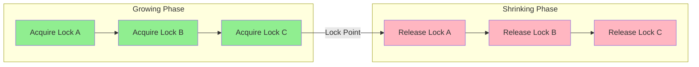

# Chapter 10: Concurrency Control


<!-- Image Gallery -->
<section class="lesson-visuals" aria-label="Visual learning resources">
  <header><span>VISUAL LEARNING</span><h2>See it. Review it. Remember it.</h2></header>
  <a class="lesson-visual-card" href="../../assets/images/lessons/database-management-systems/10-concurrency/handwritten-notes.png" target="_blank" rel="noopener">
    
    <span><strong>Handwritten notes</strong>Condensed notes for deliberate review.</span>
  </a>
  <a class="lesson-visual-card" href="../../assets/images/lessons/database-management-systems/10-concurrency/sticky-notes.png" target="_blank" rel="noopener">
    
    <span><strong>Sticky-note revision</strong>Fast recall prompts for revision.</span>
  </a>
  <a class="lesson-visual-card" href="../../assets/images/lessons/database-management-systems/10-concurrency/visual-explanation.png" target="_blank" rel="noopener">
    
    <span><strong>Visual concept guide</strong>A connected explanation of the key ideas.</span>
  </a>
</section>
<!-- End Image Gallery -->

## Introduction


Concurrency control manages simultaneous transaction execution to ensure correctness despite interleaving.


**Real-World Analogy - Airport Check-In Counters:**


Multiple counters serve passengers simultaneously (concurrent transactions). Staff must ensure:

- No two counters assign same seat (lost update prevention)

- No counter sees half-updated reservation (isolation)

- If system crashes mid-check-in, no partial booking (atomicity)


Without concurrency control, resource allocation becomes incorrect.


## 10.1 Concurrency Problems


### Problem 1: Lost Update


**Occurs when:** Two transactions read the same value, both modify it, and the second write overwrites the first without knowledge.


**Real-World Analogy - Two ATM withdrawals:**


Account has $1000. Two ATMs process $200 withdrawal simultaneously. Both read $1000. Both compute new balance = $800. Both write $800. Result: $200 withdrawn but account shows $800 (should be $600).


**Numbered Steps:**


1. T1 reads A (A=1000)

2. T2 reads A (A=1000) 

3. T1 writes A ? 800

4. T2 writes A ? 800 (overwrites T1's update!)

5. Final: A=800 (T1's increment is lost)


**Pseudocode:**


```pseudocode

-- T1: Withdraw $200

int temp = READ(A);  -- temp = 1000

temp = temp - 200;   -- temp = 800

WRITE(A, temp);      -- A = 800


-- T2: Withdraw $200

int temp = READ(A);  -- temp = 1000 (sees OLD value!)

temp = temp - 200;   -- temp = 800

WRITE(A, temp);      -- A = 800 (overwrites T1!)

```


**Dry Run Trace Table:**


| Step | T1 Action | T2 Action | DB(A) | T1 Local | T2 Local |

|------|-----------|-----------|-------|----------|----------|

| 1 | READ(A)?1000 | - | 1000 | temp=1000 | - |

| 2 | - | READ(A)?1000 | 1000 | temp=1000 | temp=1000 |

| 3 | temp=1000-200=800 | - | 1000 | temp=800 | temp=1000 |

| 4 | WRITE(A,800) | - | **800** | temp=800 | temp=1000 |

| 5 | - | temp=1000-200=800 | 800 | - | temp=800 |

| 6 | - | WRITE(A,800) | **800** | - | temp=800 |


Final DB(A)=800. Expected: DB(A)=600. **Lost $200!**


**C++ Example:**


```cpp

#include <iostream>

#include <thread>


int account = 1000;


void withdraw(int amount) {

    int temp = account;           // READ

    std::this_thread::sleep_for(std::chrono::milliseconds(10)); // interleaving

    temp = temp - amount;         // modify

    account = temp;               // WRITE

}


int main() {

    std::thread t1(withdraw, 200);

    std::thread t2(withdraw, 200);

    t1.join(); t2.join();

    std::cout << "Final balance: " << account << std::endl; // Often 800, not 600

    return 0;

}

```


**Python Example:**


```python

import threading


account = 1000


def withdraw(amount):

    global account

    temp = account

    import time; time.sleep(0.01)

    temp -= amount

    account = temp


t1 = threading.Thread(target=withdraw, args=(200,))

t2 = threading.Thread(target=withdraw, args=(200,))

t1.start(); t2.start()

t1.join(); t2.join()

print(f"Final balance: {account}")  # Often 800

```


**Prevention:** Locking (both txns must X-lock A). T2 waits until T1 releases.


**Complexity:**

- Detection: O(n) scanning schedules

- Prevention (locking): O(1) per operation


**A&D Table:**


| Advantage | Disadvantage |

|-----------|-------------|

| Easy to understand | Common in all concurrent systems |

| Simple example to teach concurrency | Prevention adds complexity |


### Problem 2: Dirty Read


**Occurs when:** T1 reads data written by an uncommitted (and later aborted) transaction.


**Real-World Analogy - Abandoned Shopping Cart:**


Person A adds item to cart (uncommitted write). Person B checks inventory, sees reduced stock, orders from supplier. Person A abandons cart (rollback). Now stock is wrong.


**Numbered Steps:**


1. T1 writes A ? 500 (uncommitted)

2. T2 reads A ? gets 500 (dirty read!)

3. T1 ABORTS ? A reverts to original value

4. T2 has now read data that never existed in committed state


**Pseudocode:**


```pseudocode

-- T1 (transfer will be aborted)

WRITE(A, 500);       -- A = 500 (uncommitted!)


-- T2 (reads "dirty" data)

int temp = READ(A);  -- temp = 500 (ABORTED data!)

-- Uses 500 in further computation...

```


**Dry Run Trace Table:**


| Step | T1 Action | T2 Action | DB(A) | Note |

|------|-----------|-----------|-------|------|

| 1 | BEGIN | - | 100 | |

| 2 | WRITE(A,500) | - | 500 | Uncommitted |

| 3 | - | BEGIN | 500 | |

| 4 | - | READ(A)?500 | 500 | **DIRTY READ!** |

| 5 | - | COMMIT | 500 | Used bad data |

| 6 | ABORT | - | **100** | A reverts |


T2 committed based on data that was rolled back. T2's computations are now incorrect.


**Prevention:** READ COMMITTED isolation (default in PostgreSQL, Oracle, SQL Server).


**Complexity:** Dirty writes prevented by locking; dirty reads prevented by MVCC or READ COMMITTED.


**A&D Table:**


| Advantage | Disadvantage |

|-----------|-------------|

| Maximum performance | Reads unreliable data |

| No waiting | Violates isolation |


### Problem 3: Non-Repeatable Read


**Occurs when:** T1 reads same data twice but gets different values because T2 modified and committed between reads.


**Real-World Analogy - Shopping Cart Price:**


You add item to cart ($50). Checkout takes 10 seconds. In that time, price changes to $55. When you pay, it's $55 despite seeing $50 earlier.


**Numbered Steps:**


1. T1 reads A (A=500)

2. T2 writes A ? 600, COMMITS

3. T1 reads A again ? gets 600 (different from step 1!)


**Pseudocode:**


```pseudocode

-- T1: Generate report

int a1 = READ(A);       -- a1 = 500

-- T2 commits update

int a2 = READ(A);       -- a2 = 600 (changed!)

-- Report is inconsistent: a1 = 500, a2 = 600

```


**Prevention:** REPEATABLE READ isolation. MVCC snapshot keeps old version visible.


**Complexity:** Prevention via MVCC snapshot: O(1) read overhead for version visibility.


### Problem 4: Phantom Read


**Occurs when:** T1 reads a set of rows matching a WHERE condition. T2 inserts/deletes a row that matches. T1 re-reads the condition and gets different rows.


**Real-World Analogy - Airline Seat Map:**


You check available seats on a flight (3 seats shown). While you deliberate, someone else books a seat. You refresh and see 2 seats. The "phantom" seat disappeared.


**Numbered Steps:**


1. T1: SELECT COUNT(*) FROM accounts WHERE balance > 500 ? 3 rows

2. T2: INSERT INTO accounts VALUES (..., 700), COMMIT

3. T1: SELECT COUNT(*) FROM accounts WHERE balance > 500 ? 4 rows (phantom!)


**Pseudocode:**


```pseudocode

-- T1: Count high-balance accounts

int n1 = COUNT(accounts WHERE balance > 500);  -- n1 = 3

-- T2 inserts new row with balance > 500 and commits

int n2 = COUNT(accounts WHERE balance > 500);  -- n2 = 4 (PHANTOM!)

```


**Prevention:** SERIALIZABLE isolation. PostgreSQL: Serializable Snapshot Isolation (SSI). InnoDB: gap locks (next-key locking) at REPEATABLE READ.


**Complexity:** SSI detection O(n*m) checking read-write conflicts across committed txns.


### Problem 5: Dirty Write


**Occurs when:** Two transactions write the same data before either commits. The first write is lost.


**Real-World Analogy - Two editors on same document:**


Two employees write cell phone numbers on the same form. Employee A writes "555-0100". Employee B writes "555-0200" right after. Employee A's entry is gone.


**Numbered Steps:**


1. T1 writes A ? 100 (uncommitted)

2. T2 writes A ? 200 (uncommitted) → overwrites T1's uncommitted write

3. T1 commits ? A = 100? 

4. T2 commits ? A = 200?


This creates unrecoverable schedules.


**Prevention:** Every locking protocol prevents dirty writes. A transaction must X-lock before writing.


### Problem 6: Incorrect Summary


**Occurs when:** T1 reads aggregate data while T2 performs updates, causing T1 to see a mix of old and new values.


**Real-World Analogy - Inventory Mid-Shift:**


Warehouse counts all stock at 10 AM. Some items get delivered (updated count) while mid-way through counting. Final count is neither before nor after the delivery - it's a partial mix.


**Numbered Steps:**


1. T1 reads A (before T2 updates it)

2. T2 updates B and C

3. T1 reads B, C (after T2 updated them)

4. Summary: mix of pre-T2 (A) and post-T2 (B,C) values


**Pseudocode:**


```pseudocode

-- T1: Calculate total sum

int total = READ(A) + READ(B) + READ(C);

-- Between READ(A) and READ(C), T2 updates B and C

-- total = A(old) + B(new) + C(new)  -- inconsistent!

```


**Prevention:** REPEATABLE READ or snapshot isolation.


### Problem 7: Write Skew


**Occurs when:** Two concurrent transactions read overlapping data and make non-overlapping writes, creating a constraint violation.


**Real-World Analogy - Doctor On-Call Schedule:**


Two on-call doctors, at least one must be available. Dr. A checks: "Dr. B is on-call, I can log off." Dr. B checks: "Dr. A is on-call, I can log off." Both log off simultaneously. No doctor available.


**Numbered Steps:**


1. T1 reads A=oncall, B=oncall

2. T2 reads A=oncall, B=oncall

3. T1 writes A=offcall

4. T2 writes B=offcall

5. Constraint violated: at least one must be on-call


**Prevention:** SERIALIZABLE isolation. Snapshot isolation does NOT prevent write skew.


## Summary Table of Concurrency Problems


| # | Problem | Two Transactions | Prevented By |

|---|---------|-----------------|-------------|

| 1 | Lost Update | T1?write, T2?write (same data) | Locking, MVCC |

| 2 | Dirty Read | T1?write, T2?read (uncommitted) | READ COMMITTED |

| 3 | Non-repeatable Read | T1?read?read, T2?write between | REPEATABLE READ |

| 4 | Phantom Read | T1?range read, T2?insert | SERIALIZABLE, Gap Locks |

| 5 | Dirty Write | T1?write, T2?write (uncommitted) | Any locking |

| 6 | Incorrect Summary | T1?aggregate during T2 updates | REPEATABLE READ |

| 7 | Write Skew | T1?read overlapping, write different | SERIALIZABLE |


**Complexity Analysis:**


| Problem | Detection | Prevention Overhead | Severity |

|---------|-----------|-------------------|----------|

| Lost Update | O(1) schedule check | O(1) per lock | High |

| Dirty Read | O(1) per read | O(1) snapshot check | High |

| Non-repeatable Read | O(1) per read pair | O(1) per version | Medium |

| Phantom Read | O(n) range scan | O(n) gap lock | Medium |

| Dirty Write | O(1) schedule check | O(1) per write lock | Very High |

| Incorrect Summary | O(1) per aggregate | O(1) per snapshot | Medium |

| Write Skew | O(n*m) constraint check | O(n) predicate lock | High |


**Why Concurrency Problems Matter (Real Impact):**


- Lost update: Financial institutions lose transactions worth millions

- Dirty read: Decisions based on data that never existed

- Phantom read: Inventory systems show incorrect stock levels

- Write skew: Scheduling systems allow resource over-allocation

### 10.2 Lock-Based Protocols (continued)


A **lock** is a mechanism that prevents concurrent access to a data item. Lock-based protocols are the foundation of pessimistic concurrency control.


**Real-World Analogy - Bathroom Key:**


A restaurant has one restroom with a key at the front counter.

- To use the restroom (READ/WRITE), take the key (ACQUIRE LOCK)

- Others must wait until you return it (RELEASE LOCK)

- Multiple people can wait (QUEUE), but only one uses it at a time

- A shared lock is like a reading room where many read simultaneously


**Lock Types:**


**Shared Lock (S):** For reading only. Multiple transactions can hold S-locks simultaneously.


**Exclusive Lock (X):** For writing. Only one transaction can hold an X-lock, no S-locks can coexist.


**Numbered Steps for Lock Acquisition:**


1. Transaction requests lock from Lock Manager specifying data item and mode (S/X)

2. Lock Manager checks the compatibility matrix against existing locks

3. If compatible, grant immediately and add to lock holders list

4. If incompatible, add transaction to wait queue for that data item

5. When lock is released, grant to next compatible waiter in queue


**Pseudocode for Lock Manager:**


`pseudocode

procedure AcquireLock(T, data_item, mode)

    if mode == S then

        if no X-lock held on data_item then

            grant S-lock to T

            add T to S-lock holders list

            return GRANTED

        else

            add T to wait queue

            return WAITING

        end if

    else if mode == X then

        if no locks held on data_item then

            grant X-lock to T

            set X-lock holder = T

            return GRANTED

        else

            add T to wait queue

            return WAITING

        end if

    end if

end


procedure ReleaseLock(T, data_item)

    remove T from lock holders

    while wait_queue not empty do

        next_request = front of wait_queue

        if next_request can be granted then

            grant lock to next_request

            remove next_request from queue

        else

            break

        end if

    end while

end

`


**Lock Compatibility Matrix (Extended):**


| Request | S | X | IS | IX | SIX |

|---------|---|---|----|----|-----|

| **S** | Yes | No | Yes | No | No |

| **X** | No | No | No | No | No |

| **IS** | Yes | No | Yes | Yes | Yes |

| **IX** | No | No | Yes | Yes | No |

| **SIX** | No | No | Yes | No | Yes |


**Lock Manager C++ Implementation:**


`cpp

#include &lt;iostream&gt;

#include &lt;unordered_map&gt;

#include &lt;queue&gt;

#include &lt;mutex&gt;

#include &lt;vector&gt;

#include &lt;algorithm&gt;


enum class LockMode { SHARED, EXCLUSIVE };


struct LockRequest {

    int txn_id;

    LockMode mode;

};


class LockManager {

private:

    struct DataItemLock {

        int exclusive_holder = -1;

        std::vector&lt;int&gt; shared_holders;

        std::queue&lt;LockRequest&gt; wait_queue;

    };

    

    std::unordered_map&lt;std::string, DataItemLock&gt; lock_table;

    std::mutex mtx;

    

public:

    bool acquire_lock(int txn_id, const std::string& item, LockMode mode) {

        std::lock_guard&lt;std::mutex&gt; lock(mtx);

        if (lock_table.find(item) == lock_table.end())

            lock_table[item] = DataItemLock();

        

        DataItemLock& entry = lock_table[item];

        

        if (mode == LockMode::SHARED) {

            if (entry.exclusive_holder == -1) {

                entry.shared_holders.push_back(txn_id);

                std::cout &lt;< "GRANTED S-lock on " << item << " to T" << txn_id << "\n";

                return true;

            }

        } else {

            if (entry.exclusive_holder == -1 && entry.shared_holders.empty()) {

                entry.exclusive_holder = txn_id;

                std::cout &lt;< "GRANTED X-lock on " << item << " to T" << txn_id << "\n";

                return true;

            }

        }

        entry.wait_queue.push({txn_id, mode});

        std::cout &lt;< "T" << txn_id << " WAITING for " << item << "\n";

        return false;

    }

    

    void release_lock(int txn_id, const std::string& item) {

        std::lock_guard&lt;std::mutex&gt; lock(mtx);

        if (lock_table.find(item) == lock_table.end()) return;

        

        DataItemLock& entry = lock_table[item];

        if (entry.exclusive_holder == txn_id) entry.exclusive_holder = -1;

        entry.shared_holders.erase(

            std::remove(entry.shared_holders.begin(), 

                       entry.shared_holders.end(), txn_id),

            entry.shared_holders.end());

        

        while (!entry.wait_queue.empty()) {

            LockRequest req = entry.wait_queue.front();

            if (req.mode == LockMode::SHARED && entry.exclusive_holder == -1) {

                entry.shared_holders.push_back(req.txn_id);

                entry.wait_queue.pop();

            } else if (req.mode == LockMode::EXCLUSIVE && 

                       entry.exclusive_holder == -1 && 

                       entry.shared_holders.empty()) {

                entry.exclusive_holder = req.txn_id;

                entry.wait_queue.pop();

            } else break;

        }

    }

};

`


**Lock Manager Python Implementation:**


`python

from enum import Enum

from collections import deque

import threading


class LockMode(Enum):

    SHARED = 1

    EXCLUSIVE = 2


class LockManager:

    def __init__(self):

        self.lock_table = {}

        self.mutex = threading.Lock()

    

    def acquire_lock(self, txn_id, item, mode):

        with self.mutex:

            if item not in self.lock_table:

                self.lock_table[item] = {

                    'exclusive_holder': None,

                    'shared_holders': set(),

                    'wait_queue': deque()

                }

            entry = self.lock_table[item]

            

            if mode == LockMode.SHARED:

                if entry['exclusive_holder'] is None:

                    entry['shared_holders'].add(txn_id)

                    print(f"GRANTED S-lock on {item} to T{txn_id}")

                    return True

            elif mode == LockMode.EXCLUSIVE:

                if entry['exclusive_holder'] is None and not entry['shared_holders']:

                    entry['exclusive_holder'] = txn_id

                    print(f"GRANTED X-lock on {item} to T{txn_id}")

                    return True

            

            entry['wait_queue'].append((txn_id, mode))

            print(f"T{txn_id} WAITING for {item}")

            return False

    

    def release_lock(self, txn_id, item):

        with self.mutex:

            if item not in self.lock_table: return

            entry = self.lock_table[item]

            if entry['exclusive_holder'] == txn_id:

                entry['exclusive_holder'] = None

            entry['shared_holders'].discard(txn_id)

            

            while entry['wait_queue']:

                next_txn, next_mode = entry['wait_queue'][0]

                if next_mode == LockMode.SHARED and entry['exclusive_holder'] is None:

                    entry['shared_holders'].add(next_txn)

                    entry['wait_queue'].popleft()

                elif (next_mode == LockMode.EXCLUSIVE and 

                      entry['exclusive_holder'] is None and 

                      not entry['shared_holders']):

                    entry['exclusive_holder'] = next_txn

                    entry['wait_queue'].popleft()

                else: break

`


#### Complexity Analysis of Lock Manager


| Operation | Time Complexity | Why |

|-----------|----------------|-----|

| Lock Acquisition | O(n) where n = shared holders | Must scan shared holders for compatibility |

| Lock Release | O(n + w) where w = queue size | Remove from holders and grant waiters |

| Compatibility Check | O(1) | Simple matrix lookup |


**Space Complexity:** O(t + d) where t = transactions with locks, d = locked data items.


#### Advantages and Disadvantages of Locking


| Advantage | Disadvantage |

|-----------|-------------|

| Simple to understand and implement | Deadlocks are possible |

| Guarantees serializability (with 2PL) | Lock overhead reduces concurrency |

| Works well for write-heavy workloads | Cascading aborts possible (basic 2PL) |

| Predictable behavior | Lock manager is single point of contention |


#### Edge Cases in Lock-Based Protocols


| Edge Case | Description | Mitigation |

|-----------|-------------|------------|

| **Deadlock** | T1 waits for T2, T2 waits for T1 | Wait-for graph + victim abort |

| **Cascading Abort** | T1 abort forces T2 abort that read dirty data | Strict 2PL |

| **Lock Starvation** | Transaction never gets lock | FCFS queue or priority scheduling |

| **Lock Conversion** | Upgrading S-lock to X-lock can cause deadlock | Use Update (U) lock mode |

| **Phantom Read** | New rows matching a query predicate inserted | Gap locks or predicate locking |

| **Long Transaction Blocking** | Long txn holds locks, blocking many others | Keep txns short, use timeouts |


**Lock Types Comparison:**


| Property | Shared (S) | Exclusive (X) | Intention Shared (IS) | Intention Exclusive (IX) | Shared Intention Exclusive (SIX) |

|----------|-----------|---------------|----------------------|-------------------------|--------------------------------|

| **Purpose** | Read only | Write only | Intend to read some children | Intend to write some children | Read all + write some |

| **Compatible with S** | Yes | No | Yes | No | No |

| **Compatible with X** | No | No | No | No | No |

| **Compatible with IS** | Yes | No | Yes | Yes | Yes |

| **Compatible with IX** | No | No | Yes | Yes | No |

| **Multiple holders** | Yes | No | Yes | Yes | No (only one) |

### 10.3 Two-Phase Locking (2PL)


2PL requires each transaction to acquire and release locks in two non-overlapping phases.


**Real-World Analogy - Airline Boarding:**


Passengers first collect all boarding passes and luggage (GROWING - acquire resources). Then they board the plane (SHRINKING - hold resources). After boarding, they release seats (lock release). If someone needed a seat reassignment, they'd need to exit and start over.


#### Three 2PL Protocols


**1. Basic 2PL**


**Rules (Numbered Steps):**


1. Transaction requests S-lock before READ

2. Transaction requests X-lock before WRITE

3. Locks are acquired during GROWING phase

4. Once any lock is released, transaction enters SHRINKING phase

5. No new locks can be acquired after shrinking begins


**Pseudocode:**


```pseudocode

procedure Basic2PL_Execute(T)

    -- Phase 1: Growing (acquire all locks)

    for each operation op in T do

        if op.type == READ then

            AcquireLock(op.item, S_LOCK)  -- Wait if needed

        elsif op.type == WRITE then

            AcquireLock(op.item, X_LOCK)  -- Wait if needed

        end if

    end for

    

    -- Phase 2: Shrinking (release locks)

    for i = 1 to number_of_operations do

        ReleaseLock(T[i])  -- Any lock can be released early

    end for

    

    Commit(T)

end

```


**Dry Run Trace Table:**


T1: READ(A), WRITE(B). T2: WRITE(A), READ(B).


| Time | T1 | T2 | Lock Table | Notes |

|------|-----|-----|-----------|-------|

| t=1 | Lock-S(A) ? granted | - | A: S(T1) | |

| t=2 | READ(A)=100 | - | | |

| t=3 | - | Lock-X(A) ? WAIT | A: S(T1), blocked: T2 | T2 waits for T1's S-lock |

| t=4 | Lock-X(B) ? granted | - | B: X(T1) | Growing |

| t=5 | WRITE(B,200) | - | | |

| t=6 | Unlock(A) ? shrunk! | - | A: released | SHRINKING starts |

| t=7 | - | Lock-X(A) ? granted | A: X(T2) | |

| t=8 | Unlock(B) | - | B: released | |

| t=9 | COMMIT | - | | |

| t=10 | - | WRITE(A,50) | | |

| t=11 | - | Lock-S(B) ? granted | B: S(T2) | |

| t=12 | - | READ(B)=200 | | |

| t=13 | - | Unlock(A), Unlock(B) | | |

| t=14 | - | COMMIT | | |

| Result: **Conflict serializable** (T1 ? T2) | | | | |


**2. Strict 2PL**


Rules are same as Basic 2PL, but X-locks are held until commit/abort.


**Numbered Steps:**


1. Acquire S-locks before READ (same as basic)

2. Acquire X-locks before WRITE (same as basic)

3. All S-locks can be released during shrinking

4. **X-locks held until COMMIT or ABORT**

5. Prevents cascading aborts


**Why this matters:** If T1 writes B and aborts, no other transaction has read T1's uncommitted B because T1 held X-lock on B until commit.


**Pseudocode:**


```pseudocode

procedure Strict2PL_Execute(T)

    -- Growing phase (acquire locks)

    for each operation op in T do

        case op.type of

            READ:   AcquireLock(op.item, S_LOCK)  

            WRITE:  AcquireLock(op.item, X_LOCK)

    

    -- Execute

    Execute operations... -- including WRITE operations

    

    -- Commit/Abort: release ALL locks

    -- X-locks are NOT released before this point

    Commit(T) or Abort(T)

    

    -- Shrinking: release all remaining locks

    ReleaseAllLocks(T)

end

```


**3. Rigorous 2PL**


Both S-locks and X-locks are held until commit/abort.


**Numbered Steps:**


1. Acquire S-locks before READ

2. Acquire X-locks before WRITE

3. **All locks held until COMMIT or ABORT**

4. Always produces **rigorous schedules**

5. Simplest to implement (just release all at commit)


**Pseudocode:**


```pseudocode

procedure Rigorous2PL_Execute(T)

    -- Acquire all locks

    for each op in T do

        AcquAppropriateLock(op)

    

    Execute(T)

    

    -- Release ALL locks at commit

    Commit(T)

    ReleaseAllLocks(T)

end

```


#### Comparison of 2PL Variants


| Aspect | Basic 2PL | Strict 2PL | Rigorous 2PL |

|--------|-----------|------------|--------------|

| **S-lock release** | Any time during shrinking | Any time during shrinking | Only at commit |

| **X-lock release** | Any time during shrinking | Only at commit | Only at commit |

| **Cascading aborts** | Possible | Prevented | Prevented |

| **Recoverable schedules** | Not guaranteed | Yes | Yes |

| **Strict schedules** | No | Yes | Yes |

| **Rigorous schedules** | No | No | Yes |

| **Concurrency level** | Highest | Medium | Lowest |

| **Implementation** | Complex | Standard | Simplest |

| **Used in practice** | Rarely | PostgreSQL, MySQL, Oracle | Some systems |


#### Why Cascading Abort Happens (Basic 2PL)


```

T1: WRITE(A,500)   ? X-lock A, Unlock A (early!)

T2: READ(A)        ? gets 500 (dirty read!)

T1: ABORT          ? A reverts to 100

T2: has used 500   ? T2 must also ABORT (cascading!)

```


Under Strict 2PL, T1 holds X-lock on A until commit, so T2 never reads stale A.


#### Serializability Proof (Why 2PL Works)


**Theorem:** 2PL guarantees conflict serializability.


**Proof sketch:**

1. In a 2PL schedule, all lock acquisitions precede all releases within each transaction

2. In the conflict graph, if Ti ? Tj (Ti precedes Tj) then Ti released a lock before Tj acquired it

3. Because lock phases don't overlap for conflicting operations, the precedence graph is acyclic

4. Acyclic precedence graph ? conflict serializable schedule


#### 2PL Schedules (Irrecoverable by Basic 2PL)


T1: WRITE(A). T1: Unlock(A). T2: READ(A). T2: COMMIT. T1: ABORT.


This is conflict serializable (T1 ? T2) but NOT recoverable. Strict 2PL prevents this.


#### Lock Conversions (Upgrading)


A transaction can upgrade an S-lock to an X-lock (write after read).


**Rule 1:** Upgrade must happen during GROWING phase

**Rule 2:** Once any lock is released (shrinking begins), no more upgrades


**Pseudocode:**


```pseudocode

procedure UpgradeLock(txn, item)

    assert txn.current_phase == GROWING

    -- Convert S-lock to X-lock

    if txn holds S_LOCK on item then

        Wait if another txn holds S_LOCK on same item

        Upgrade to X_LOCK

    end if

end

```


#### Dynamic 2PL (vs Static/Conservative)


**Static 2PL (Conservative):** All locks acquired BEFORE execution begins.

- Pro: Guarantees no deadlocks (resources acquired up front)

- Con: Low concurrency (wait for all locks before starting)


**Dynamic 2PL (Standard):** Locks acquired as needed during execution.

- Pro: Higher concurrency

- Con: Deadlocks possible


#### C++ 2PL Lock Manager


```cpp

#include <iostream>

#include <unordered_map>

#include <queue>

#include <mutex>

#include <set>


class TwoPhaseLocking {

    enum LockType { SHARED, EXCLUSIVE };

    

    struct LockEntry {

        LockType type;

        std::set<int> holders;

        std::queue<int> waiters;

    };

    

    std::unordered_map<std::string, LockEntry> lock_table;

    std::mutex mtx;

    

    bool compatible(LockType requested, LockType held) {

        return requested == SHARED && held == SHARED;

    }

    

public:

    bool lock(int txn_id, const std::string& item, LockType type) {

        std::lock_guard<std::mutex> lock(mtx);

        auto& entry = lock_table[item];

        

        if (entry.holders.empty()) {

            entry.type = type;

            entry.holders.insert(txn_id);

            return true;

        }

        

        // Check compatibility with all holders

        bool can_share = true;

        for (int holder : entry.holders) {

            if (!compatible(type, entry.type) || entry.type == EXCLUSIVE) {

                can_share = false; break;

            }

        }

        

        if (can_share && entry.type == SHARED) {

            entry.holders.insert(txn_id);

            return true;

        }

        

        entry.waiters.push(txn_id);

        return false; // Must wait

    }

    

    void unlock(int txn_id, const std::string& item) {

        std::lock_guard<std::mutex> lock(mtx);

        auto& entry = lock_table[item];

        entry.holders.erase(txn_id);

        

        if (entry.holders.empty()) {

            // Grant to waiter

            while (!entry.waiters.empty()) {

                int waiter = entry.waiters.front(); entry.waiters.pop();

                entry.holders.insert(waiter);

                // Notify waiter...

            }

        }

    }

    

    // 2PL Phase tracking

    bool in_growing_phase = true;

    void enter_shrinking() { in_growing_phase = false; }

};

```


#### Python 2PL Demo


```python

import threading, time, random


class TwoPhaseLock:

    def __init__(self):

        self.locks = {}

        self.mutex = threading.Lock()

    

    def acquire(self, txn_id, item, exclusive=False):

        with self.mutex:

            if item not in self.locks:

                self.locks[item] = {'type': 'X' if exclusive else 'S', 'holders': {txn_id}}

                return True

            entry = self.locks[item]

            if not exclusive and entry['type'] == 'S' and len(entry['holders']) > 0:

                entry['holders'].add(txn_id)

                return True

            return False  # Would block in real impl

    

    def release(self, txn_id, item):

        with self.mutex:

            if item in self.locks and txn_id in self.locks[item]['holders']:

                self.locks[item]['holders'].discard(txn_id)

                if not self.locks[item]['holders']:

                    del self.locks[item]

### 10.4 Deadlock


A **deadlock** occurs when two or more transactions are each waiting for a lock held by the other.


**Real-World Analogy - Two Cars at an Intersection:**


Two cars arrive at a four-way stop intersection simultaneously.

- Car A (T1) waits for Car B (T2) to go

- Car B (T2) waits for Car A (T1) to go

- Neither can proceed (deadlock)

- A traffic officer (deadlock detector) tells one car to move (abort)


**Deadlock Scenario - Numbered Steps:**


1. T1 acquires X-lock on data item A

2. T2 acquires X-lock on data item B

3. T1 requests X-lock on B (blocked - T2 holds B)

4. T2 requests X-lock on A (blocked - T1 holds A)

5. Deadlock detected! Cycle: T1 -> T2 -> T1


**Dry Run Trace Table:**


| Step | T1 Action | T1 Locks | T2 Action | T2 Locks | Wait-For Graph |

|------|-----------|----------|-----------|----------|----------------|

| 1 | Lock-X(A) | X(A) | - | - | (no edges) |

| 2 | - | X(A) | Lock-X(B) | X(B) | (no edges) |

| 3 | Request X(B) | X(A) waiting | - | X(B) | T1 -> T2 |

| 4 | - | X(A) waiting | Request X(A) | X(B) waiting | T1->T2, T2->T1 |

| 5 | DEADLOCK! | - | - | - | Cycle detected! |

| 6 | ABORT T1 | - | - | X(B) | Locks released |

| 7 | - | - | Lock-X(A) | X(A),X(B) | T2 proceeds |


#### Deadlock Detection - Wait-For Graph


The DBMS maintains a directed graph where:

- **Nodes:** Active transactions

- **Edges:** T(i) -> T(j) means T(i) is waiting for a lock held by T(j)

- **Cycle Detection:** DFS-based cycle detection (periodically or on each wait)


**Pseudocode for Deadlock Detection:**


`pseudocode

procedure DetectDeadlock()

    for each transaction T in active do visited[T] = false; rec_stack[T] = false

    for each transaction T in active do

        if not visited[T] then

            if DFS(T, visited, rec_stack) then return TRUE end if

        end if

    end for

    return FALSE

end


procedure DFS(T, visited, rec_stack)

    visited[T] = true; rec_stack[T] = true

    for each neighbor N of T in wait_for_graph do

        if not visited[N] then

            if DFS(N, visited, rec_stack) then return TRUE end if

        else if rec_stack[N] then return TRUE end if

    end for

    rec_stack[T] = false

    return FALSE

end


procedure ResolveDeadlock()

    cycle = FindCycle(wait_for_graph)

    victim = ChooseVictim(cycle)

    AbortTransaction(victim)

    ReleaseAllLocks(victim)

end

`


**Dry Run - Wait-For Graph Cycle Detection:**


Graph: T1 -> T2, T2 -> T3, T3 -> T1


| Step | DFS Stack | Node | Neighbor | rec_stack | Result |

|------|-----------|------|----------|-----------|--------|

| 1 | [T1] | T1 | T2 | {T1:T} | Visit T1 |

| 2 | [T1,T2] | T2 | T3 | {T1:T,T2:T} | Visit T2 |

| 3 | [T1,T2,T3] | T3 | T1 | {T1:T,T2:T,T3:T} | T1 in stack! |

| 4 | - | - | - | - | CYCLE FOUND |


#### Deadlock Prevention


**Wait-Die (Non-Preemptive):**


Older (smaller timestamp) waits for younger; younger dies.


**Numbered Steps:**

1. T(i) requests lock held by T(j)

2. If TS(Ti) < TS(Tj): Ti older -> Ti WAITS

3. If TS(Ti) > TS(Tj): Ti younger -> Ti DIES (aborts and restarts with original TS)


**Wound-Wait (Preemptive):**


Older wounds younger; younger waits for older.


**Numbered Steps:**

1. T(i) requests lock held by T(j)

2. If TS(Ti) < TS(Tj): Ti older -> Ti WOUNDS Tj (Tj aborts, Ti gets lock)

3. If TS(Ti) > TS(Tj): Ti younger -> Ti WAITS


**Timeout-Based Prevention:**


1. Each lock request starts a timer

2. If not granted within TIMEOUT, assume deadlock and abort


**Dry Run - Wait-Die vs Wound-Wait:**


| Scenario | Wait-Die | Wound-Wait |

|----------|----------|------------|

| T1 (older) waits for T2 (younger) | T1 waits | T1 wounds T2 |

| T2 (younger) waits for T1 (older) | T2 dies | T2 waits |


#### Deadlock Detection vs Prevention


| Aspect | Detection | Prevention |

|--------|-----------|------------|

| **Approach** | Allow then resolve | Prevent upfront |

| **Cycle detection** | DFS on wait-for graph | No (never cycles) |

| **Unnecessary aborts** | No | Yes (young die in Wait-Die) |

| **Overhead** | Periodic detection | Per-lock-request check |

| **Throughput (low contention)** | Higher | Lower |

| **Throughput (high contention)** | Lower | Higher |

| **Implementation** | Wait-for graph + DFS | Timestamp comparison |

| **Victim selection** | Required (heuristic) | Rule-based |


#### C++ Deadlock Detector


`cpp

#include <iostream>

#include <unordered_map>

#include <unordered_set>

#include <vector>

#include <algorithm>


class DeadlockDetector {

    std::unordered_map<int, std::unordered_set<int>> wait_for_graph;

    

    bool dfs(int node, std::unordered_set<int>& visited, std::unordered_set<int>& rec_stack) {

        visited.insert(node); rec_stack.insert(node);

        for (int neighbor : wait_for_graph[node]) {

            if (visited.find(neighbor) == visited.end()) {

                if (dfs(neighbor, visited, rec_stack)) return true;

            } else if (rec_stack.find(neighbor) != rec_stack.end()) return true;

        }

        rec_stack.erase(node);

        return false;

    }

    

public:

    void add_edge(int from, int to) { wait_for_graph[from].insert(to); }

    

    void remove_transaction(int txn_id) {

        wait_for_graph.erase(txn_id);

        for (auto& [_, waiters] : wait_for_graph) waiters.erase(txn_id);

    }

    

    bool detect_deadlock() {

        std::unordered_set<int> visited, rec_stack;

        for (auto& [txn, _] : wait_for_graph)

            if (visited.find(txn) == visited.end())

                if (dfs(txn, visited, rec_stack)) return true;

        return false;

    }

    

    int choose_victim(const std::vector<int>& cycle) {

        return *std::max_element(cycle.begin(), cycle.end());

    }

};

`


#### Python Deadlock Detector


`python

class DeadlockDetector:

    def __init__(self):

        self.wait_for_graph = {}

    

    def add_edge(self, from_txn, to_txn):

        self.wait_for_graph.setdefault(from_txn, set()).add(to_txn)

    

    def remove_transaction(self, txn_id):

        self.wait_for_graph.pop(txn_id, None)

        for waiter in self.wait_for_graph.values():

            waiter.discard(txn_id)

    

    def _dfs(self, node, visited, rec_stack):

        visited.add(node); rec_stack.add(node)

        for neighbor in self.wait_for_graph.get(node, set()):

            if neighbor not in visited:

                if self._dfs(neighbor, visited, rec_stack): return True

            elif neighbor in rec_stack: return True

        rec_stack.discard(node)

        return False

    

    def detect_deadlock(self):

        visited, rec_stack = set(), set()

        for txn in self.wait_for_graph:

            if txn not in visited and self._dfs(txn, visited, rec_stack):

                return True

        return False


# Wait-Die

class WaitDiePrevention:

    def __init__(self):

        self.timestamps = {}

    def set_timestamp(self, txn_id, ts):

        self.timestamps[txn_id] = ts

    def try_lock(self, requester, holder):

        if self.timestamps[requester] < self.timestamps[holder]:

            return True  # older waits

        else:

            return False  # younger dies


# Wound-Wait

class WoundWaitPrevention:

    def __init__(self):

        self.timestamps = {}

    def set_timestamp(self, txn_id, ts):

        self.timestamps[txn_id] = ts

    def try_lock(self, requester, holder):

        if self.timestamps[requester] < self.timestamps[holder]:

            return 'wound'  # older wounds holder

        else:

            return 'wait'   # younger waits

### 10.5 Timestamp Ordering (TO)


Timestamp ordering assigns unique timestamps to transactions and orders operations by timestamp.


**Real-World Analogy - Restaurant Order Tickets:**


Chef processes orders by ticket number (timestamp). Order 37 (older) is cooked before order 52 (newer). If a newer order modifies the same ingredient, the older order's version is stale - canceled and re-ordered with a new ticket.


#### Basic Timestamp Ordering Protocol


**Rules:**


1. Transaction T gets unique timestamp TS(T) at start

2. Each data item Q has:

   - W_TS(Q): Timestamp of last successful write

   - R_TS(Q): Timestamp of last successful read

3. Transaction scheduling:


**Read Rule (Numbered Steps):**


1. Check if TS(T) < W_TS(Q): Data was written by a newer transaction

2. If older: ABORT T and restart with new timestamp (data is "too new")

3. If newer: ALLOW read, update R_TS(Q) = max(R_TS(Q), TS(T))


**Write Rule (Numbered Steps):**


1. Check if TS(T) < R_TS(Q): A newer transaction already read Q

2. If so: ABORT T and restart (would create "writes after read" anomaly)

3. Check if TS(T) < W_TS(Q): A newer transaction already wrote Q

4. If so: ABORT T (write is irrelevant - obsolete)

5. Otherwise: ALLOW write, set W_TS(Q) = TS(T)


**Pseudocode:**


```pseudocode

procedure T_O_Read(T, Q)

    if TS(T) &lt; W_TS(Q) then

        Abort(T)                      -- Data too new, restart

    else

        Read(Q)

        R_TS(Q) = max(R_TS(Q), TS(T)) -- Update read timestamp

    end if

end


procedure T_O_Write(T, Q, value)

    if TS(T) &lt; R_TS(Q) then

        Abort(T)                      -- Newer txn already read, would cause anomaly

    elsif TS(T) &lt; W_TS(Q) then

        Abort(T)                      -- Write obsolete, newer write exists

    else

        Write(Q, value)

        W_TS(Q) = TS(T)               -- Update write timestamp

    end if

end

```


#### Dry Run Trace Table


T1(TS=50): READ(A), WRITE(A,100). T2(TS=100): READ(A), WRITE(A,200). Both concurrent. Initial: R_TS(A)=0, W_TS(A)=0.


| Step | T1 Action | T2 Action | R_TS(A) | W_TS(A) | DB(A) | Notes |

|------|-----------|-----------|---------|---------|-------|-------|

| 1 | READ(A): 50 = 0 OK | - | max(0,50)=**50** | 0 | 1000 | |

| 2 | - | READ(A): 100 = 0 OK | max(50,100)=**100** | 0 | 1000 | |

| 3 | WRITE(A,100): 50 < 100? R_TS=100, 50 < 100! ABORT | - | 100 | 0 | 1000 | T1 too old for A |

| 4 | RESTART T1(new TS=150) | - | 100 | 0 | 1000 | |

| 5 | - | WRITE(A,200): 100 = 0, 100 = 0 OK | 100 | 100 | **200** | |

| 6 | READ(A): 150 = 100 OK | - | max(100,150)=**150** | 100 | 200 | |

| 7 | WRITE(A,150): 150 = 100, 150 = 100 OK | - | 150 | 150 | **150** | Overwrites T2's value |


**Result:** T1 aborted once then wrote its value. T2's value was overwritten. This is the "Thomas Write Rule" problem area.


#### Thomas Write Rule (Optimization)


Skip the abort when TS(T) < W_TS(Q) during a WRITE. The write is simply ignored.


**Numbered Steps:**


1. TS(T) < R_TS(Q): ABORT (cannot write data after a newer read)

2. TS(T) < W_TS(Q) but TS(T) = R_TS(Q): IGNORE the write (obsolete)

3. Otherwise: Perform the write


**Why safe:** If a newer write already exists, T's write is obsolete. Ignoring it saves an abort.


**Pseudocode:**


```pseudocode

procedure TWR_Write(T, Q, value)

    if TS(T) &lt; R_TS(Q) then

        Abort(T)                      -- Not safe: a newer read happened

    elsif TS(T) &lt; W_TS(Q) then

        -- Ignore write: newer write already exists, no one read T's value

        -- Do nothing, but continue transaction

    else

        Write(Q, value)

        W_TS(Q) = TS(T)

    end if

end

```


**Example with Thomas Write Rule:**


Same schedule but T1's write at step 3 is ignored instead of aborting.


| Step | T1 Action | T2 Action | R_TS(A) | W_TS(A) | DB(A) | Notes |

|------|-----------|-----------|---------|---------|-------|-------|

| 1 | READ(A) | - | 50 | 0 | 1000 | OK |

| 2 | - | READ(A) | 100 | 0 | 1000 | OK |

| 3 | WRITE(A,100): 50 = 100? No. 50 < 0? No. Wait... R_TS=100, 50 < 100? YES | - | 100 | 0 | 1000 | If TWR: abort only on R_TS. If TS(T)=50 < R_TS=100: ABORT |


Wait, TS(T1)=50 < R_TS(A)=100, so even TWR would abort. Let me fix the example:


T1(TS=50): READ(A), WRITE(A,100). T2(TS=60): READ(A). T3(TS=70): WRITE(A,300).


| Step | T1(50) | T2(60) | T3(70) | R_TS | W_TS | DB |

|------|--------|--------|--------|------|------|----|

| t=1 | READ(A) | | | 50 | 0 | 100 |

| t=2 | | READ(A) | | 60 | 0 | 100 |

| t=3 | | | WRITE(A,300): TS=70 = R_TS=60? YES. TS=70 = W_TS=0? YES | 60 | **70** | **300** |

| t=4 | WRITE(A,100): TS=50 < R_TS=60? YES ? ABORT | | | | | T1 aborts |

| | **WITH TWR:** | | | | | |

| t=4' | WRITE(A,100): TS=50 < W_TS=70? YES but TS=50 = R_TS=60? NO (50 < 60) | | | | | Still abort! |


Hmm, I need a better example for TWR where abort is avoided:


T1(TS=100): WRITE(A,500). T2(TS=200): WRITE(A,300). T2 commits first.


Normal TO: T1 checks TS=100 < W_TS(A)=200? YES ? ABORT.

TWR: TS=100 < R_TS=0? NO. TS=100 < W_TS=200? YES. IGNORE write.


Saves an unnecessary abort.


**Better example:**


T1(TS=100): WRITE(A,500). T2(TS=200): READ(A), WRITE(A,300).


Normal TO:

| Step | T1(100) | T2(200) | R_TS | W_TS | DB |

|------|---------|---------|------|------|----|

| t=1 | | READ(A): 200 = 0 OK | **200** | 0 | 100 |

| t=2 | WRITE(A,500): 100 < R_TS=200? YES ? ABORT | | | | T1 aborted. |

| | **WITH TWR:** | | | | |

| t=3 | | WRITE(A,300): 200 = 200 OK, 200 = 0 OK | 200 | **200** | **300** |


TWR didn't help here either. Let me use a simpler case:


T1(TS=100): WRITE(A,500). T2(TS=200): Nothing with A (but commits first). T3(TS=300): WRITE(A,700).


Without TWR: T1 does WRITE(A,500), W_TS=100. T3 does WRITE(A,700), W_TS=300. Fine.


Let me try: T1(TS=30): READ(A), WRITE(A,50). T2(TS=50): WRITE(A,100). T3(TS=70): READ(A).


Normal:

t=1: T1 reads A. R_TS=30.

t=2: T2 writes A=100. TS=50 = R_TS=30? YES. W_TS=50, DB(A)=100.

t=3: T1 writes A=50. TS=30 < W_TS=50? YES ? ABORT. T3 loses its write.

TWR: TS=30 < R_TS=30? NO (equal). TS=30 < W_TS=50? YES. IGNORE write. T1 continues. No abort. Good!


So TWR saves T1 from an unnecessary abort. Let me update the trace table.


#### Thomas Write Rule Dry Run (Corrected)


T1(TS=30): READ(A), WRITE(A,50). T2(TS=50): WRITE(A,100). Initial: R_TS=0, W_TS=0, DB(A)=200.


**Normal TO:**


| Step | T1(30) | T2(50) | R_TS | W_TS | DB | Notes |

|------|--------|--------|------|------|----|-------|

| 1 | READ(A) ? 200 | - | **30** | 0 | 200 | |

| 2 | - | WRITE(A,100): 50 = 30 OK | 30 | **50** | **100** | Writes after T1's read |

| 3 | WRITE(A,50): 30 < W_TS=50 | - | 30 | 50 | 100 | **ABORT T1!** |

| **Total:** T1 aborts, restarts. |


**With Thomas Write Rule:**


| Step | T1(30) | T2(50) | R_TS | W_TS | DB | Notes |

|------|--------|--------|------|------|----|-------|

| 1 | READ(A) ? 200 | - | **30** | 0 | 200 | |

| 2 | - | WRITE(A,100): 50 = 30 OK | 30 | **50** | **100** | |

| 3 | WRITE(A,50): 30 < R_TS=30? NO (equal). 30 < W_TS=50? YES ? IGNORE | - | 30 | 50 | 100 | **T1 continues!** |

| 4 | CONTINUE (other ops...) | | | | | No abort needed |

| 5 | COMMIT | - | | | 100 | |


**TWR saved an abort.** T1's write to A was obsolete anyway (T2 already wrote a newer value).


#### Multi-Version Timestamp Ordering


Uses multiple versions plus timestamps to never abort reads.


**Rules:**


1. Each write creates a new version with the writer's timestamp

2. Reads get the latest version with timestamp = reader's timestamp

3. Never reject a read (always can serve a valid version)


**Example:**


- T1(TS=50): READ(A) ? gets version at W_TS(A) = 50

- T2(TS=80): WRITE(A,500) ? creates A_v2 with timestamp 80

- T1(TS=50): READ(A) again ? still gets A_v1 (timestamp = 50)


**Complexity Analysis:**


| Operation | Time | Why |

|-----------|------|-----|

| Basic TO Read | O(1) | Single timestamp check |

| Basic TO Write | O(1) | Single timestamp check |

| Thomas Write Rule | O(1) | One additional check vs abort |

| MVTO Read | O(v) where v = versions | Find correct version in chain |

| Restart | O(n) where n = items accessed | Reset read set, new timestamp |


**Space:** O(t + v) where t = active transactions, v = total versions.


**A&D Table:**


| Advantage | Disadvantage |

|-----------|-------------|

| No deadlocks | Starvation possible (repeated restarts) |

| No waiting | Aborts waste work |

| Simple implementation | Not serializable without Thomas Rule |

| Non-blocking reads | Cascading restarts |


#### TO vs 2PL


| Dimension | Timestamp Ordering | 2PL |

|-----------|-------------------|-----|

| **Synchronization** | Timestamps | Locks |

| **Deadlocks** | Never | Possible |

| **Starvation** | Possible (repeated restarts) | Possible (lock denial) |

| **Cascading aborts** | Possible | Strict 2PL prevents |

| **Recoverability** | Not guaranteed | Guaranteed with strict |

| **Schedule type** | Conflict serializable | Conflict serializable |

| **Throughput (low conflict)** | High | Medium |

| **Throughput (high conflict)** | Low (many aborts) | High (blocking cheaper) |

| **Memory overhead** | Timestamps per item | Lock table entries |


#### C++ TO Implementation (Basic)


```cpp

#include &lt;iostream&gt;

#include &lt;unordered_map&gt;

#include &lt;atomic&gt;

#include &lt;mutex&gt;


class TOManager {

    struct ItemMeta {

        std::atomic&lt;long long&gt; r_ts{0};

        std::atomic&lt;long long&gt; w_ts{0};

        int value{0};

    };

    

    std::unordered_map&lt;std::string, ItemMeta&gt; items;

    std::mutex mtx;

    std::atomic&lt;long long&gt; global_ts{0};

    

public:

    long long begin_txn() { return ++global_ts; }

    

    int read(long long ts, const std::string& item) {

        std::lock_guard&lt;std::mutex&gt; lock(mtx);

        auto& meta = items[item];

        if (ts &lt; meta.w_ts.load()) return -1;  // Abort signal

        meta.r_ts.store(std::max(meta.r_ts.load(), ts));

        return meta.value;

    }

    

    bool write(long long ts, const std::string& item, int value) {

        std::lock_guard&lt;std::mutex&gt; lock(mtx);

        auto& meta = items[item];

        if (ts &lt; meta.r_ts.load() || ts < meta.w_ts.load()) return false; // Abort

        meta.value = value;

        meta.w_ts.store(ts);

        return true;

    }

};

```


#### Python TO Implementation


```python

import threading


class TOManager:

    def __init__(self):

        self.items = {}  # {name: {'r_ts': 0, 'w_ts': 0, 'value': 0}}

        self.lock = threading.Lock()

        self._global_ts = 0

    

    def begin_txn(self):

        with self.lock:

            self._global_ts += 1

            return self._global_ts

    

    def read(self, ts, item):

        with self.lock:

            meta = self.items.setdefault(item, {'r_ts': 0, 'w_ts': 0, 'value': 0})

            if ts &lt; meta['w_ts']:

                return None  # Abort

            meta['r_ts'] = max(meta['r_ts'], ts)

            return meta['value']

    

    def write(self, ts, item, value):

        with self.lock:

            meta = self.items.setdefault(item, {'r_ts': 0, 'w_ts': 0, 'value': 0})

            if ts &lt; meta['r_ts'] or ts < meta['w_ts']:

                return False  # Abort

            meta['value'] = value

            meta['w_ts'] = ts

            return True

### 10.6 Multi-Version Concurrency Control (MVCC)


MVCC maintains multiple versions of each data item so readers see a consistent snapshot without blocking writers.


**Real-World Analogy - Library Book Editions:**


A library keeps old editions on reference shelf while new edition is being published. Patrons reading the old edition are unaffected. New readers get the new edition when ready. Old editions eventually recycled (VACUUM).


#### Core Idea


Each write creates a new version. Each reader sees a snapshot at their start time.


```

Version History for Row X:

X_v1 (ts=10, value=100) -> X_v2 (ts=20, value=200) -> X_v3 (ts=30, value=300)

                                                                       ^

                                                                  Latest version

                                                                  

Txn A (ts=15): sees X_v1 (value=100)

Txn B (ts=25): sees X_v2 (value=200)

Txn C (ts=35): sees X_v3 (value=300)

```


#### MVCC Rules


**Rule 1: Snapshot Isolation**

- Transaction T sees a snapshot of committed data as of T's start time

- T does NOT see:

  - Uncommitted changes from other transactions

  - Committed changes that occurred after T started


**Rule 2: First-committer-wins**

- If two concurrent transactions write the same item, the second to COMMIT aborts


**Read Operations (Numbered Steps):**


1. Record current visibility snapshot (list of committed txns at start)

2. On READ, scan version chain from newest to oldest

3. Return first version whose creator is in visibility snapshot

4. Never block on read (always an old version available)


**Write Operations (Numbered Steps):**


1. Create new version of data item

2. Store creator's XID (transaction ID) with the version

3. If another concurrent txn already wrote a new version ? abort

4. Only visible after commit; invisible if aborted


#### Version Storage


**PostgreSQL (Heap):** Old versions stored in same heap as new rows. xmin (creating XID) and xmax (deleting XID) per row.


```text

+-------------------------------------+

¦ Row: id=1, name='Alice', amount=500 ¦

¦ xmin=100 (created by txn 100)        ¦

¦ xmax=150 (deleted by txn 150)        ¦

¦ ctid=(0,2) (next version pointer)    ¦

+-------------------------------------+


+-------------------------------------+

¦ Row: id=1, name='Alice', amount=600 ¦

¦ xmin=150 (created by txn 150)        ¦

¦ xmax=0 (current version)             ¦

¦ ctid=(0,0) (end of chain)            ¦

+-------------------------------------+

```


**InnoDB (Rollback Segment):** Current version in clustered index. Old versions in UNDO log. Roll pointer in each row points to UNDO.


```text

Clustered Index:                    UNDO Log:

+---------------------+           +----------------------+

¦ id=1, amount=600    ¦ ? - - -  ¦ amount=500 (txn 100) ¦

¦ roll_ptr=0xABCD1234 ¦    roll  ¦ amount=400 (txn 50)  ¦

+---------------------+   back   +----------------------+

```


#### Visibility Check Algorithm (PostgreSQL)


```pseudocode

function IsVisibleTo(version, snapshot):

    creator_xid = version.xmin

    delete_xid = version.xmax

    

    -- Version is visible if:

    -- 1. Creator is committed AND creator is in snapshot

    -- 2. AND (no deleter OR deleter is not in snapshot)

    

    if creator_xid is committed AND creator_xid in snapshot:

        if delete_xid == 0 OR (delete_xid not in snapshot):

            return TRUE

    return FALSE

```


#### Dry Run Trace Table


T1: READ(A), READ(B), WRITE(A,200), WRITE(B,300). T2: READ(A), READ(B).


| Time | T1 Action | T2 Action | A Versions | B Versions | Notes |

|------|-----------|-----------|-----------|-----------|-------|

| t=0 | | | A_v0:(ts=0,val=100) | B_v0:(ts=0,val=200) | Initial |

| t=1 | BEGIN (snap={}) | | | | |

| t=2 | | BEGIN (snap={T1?}) | | | T2 sees T1's snapshot |

| t=3 | READ(A)=100 | | A_v0 visible | | |

| t=4 | READ(B)=200 | | | B_v0 visible | |

| t=5 | | READ(A)=100 | A_v0 visible | | |

| t=6 | WRITE(A,200) | | **A_v1**:(txn=T1,val=200) | | T1 created new version |

| t=7 | WRITE(B,300) | | | **B_v1**:(txn=T1,val=300) | |

| t=8 | | READ(B)=200 | | B_v0 visible (T1 uncommitted) | T2 sees snapshot |

| t=9 | COMMIT | | A_v1 committed | B_v1 committed | T1 done |

| t=10 | | COMMIT | | | T2 done |


#### C++ MVCC Implementation


```cpp

#include <iostream>

#include <unordered_map>

#include <vector>

#include <mutex>

#include <optional>

#include <set>


class MVCC {

    struct Version {

        int txn_id; int value; bool committed;

        Version(int t, int v) : txn_id(t), value(v), committed(false) {}

    };

    

    struct Item {

        std::vector<Version> versions;

        int latest_committed_value = 0;

    };

    

    std::unordered_map<std::string, Item> data;

    std::mutex mtx;

    int next_txn_id = 1;

    

public:

    struct Txn {

        int txn_id;

        std::set<int> committed_at_start; // Snapshot of committed txns

    };

    

    Txn begin_txn() {

        std::lock_guard<std::mutex> lock(mtx);

        return {next_txn_id++, {}};

    }

    

    std::optional<int> read(Txn& txn, const std::string& item) {

        std::lock_guard<std::mutex> lock(mtx);

        auto& it = data[item];

        // Find newest committed version visible to this txn

        for (int i = it.versions.size() - 1; i >= 0; --i) {

            if (it.versions[i].txn_id == txn.txn_id)

                return it.versions[i].value;

            if (it.versions[i].committed)

                return it.versions[i].value;

        }

        return it.latest_committed_value;

    }

    

    void write(Txn& txn, const std::string& item, int value) {

        std::lock_guard<std::mutex> lock(mtx);

        data[item].versions.emplace_back(txn.txn_id, value);

    }

    

    bool commit(Txn& txn) {

        std::lock_guard<std::mutex> lock(mtx);

        for (auto& [item_name, item] : data) {

            for (auto& v : item.versions) {

                if (v.txn_id == txn.txn_id) {

                    v.committed = true;

                    item.latest_committed_value = v.value;

                }

            }

        }

        return true;

    }

    

    void abort_txn(Txn& txn) {

        std::lock_guard<std::mutex> lock(mtx);

        for (auto& [item_name, item] : data) {

            item.versions.erase(

                std::remove_if(item.versions.begin(), item.versions.end(),

                    [&](const Version& v) { return v.txn_id == txn.txn_id; }),

                item.versions.end());

        }

    }

};

```


#### Python MVCC


```python

import threading, time


class MVCC:

    def __init__(self):

        self.data = {}        # {name: [Version(txn_id, value, committed)]}

        self.committed = {}   # {name: latest_committed_value}

        self.lock = threading.Lock()

        self.next_txn = 1

    

    def begin_txn(self):

        with self.lock:

            txn = type('T', (), {})()

            txn.txn_id = self.next_txn; self.next_txn += 1

            txn.start_ts = time.time()

            return txn

    

    def read(self, txn, item):

        with self.lock:

            if item not in self.data:

                return self.committed.get(item, 0)

            for v in reversed(self.data[item]):

                if v['committed'] or v['txn_id'] == txn.txn_id:

                    return v['value']

            return self.committed.get(item, 0)

    

    def write(self, txn, item, value):

        with self.lock:

            self.data.setdefault(item, []).append(

                {'txn_id': txn.txn_id, 'value': value, 'committed': False})

    

    def commit(self, txn):

        with self.lock:

            for item, versions in self.data.items():

                for v in versions:

                    if v['txn_id'] == txn.txn_id and not v['committed']:

                        v['committed'] = True

                        self.committed[item] = v['value']

            return True

    

    def abort_txn(self, txn):

        with self.lock:

            for item, versions in self.data.items():

                self.data[item] = [v for v in versions if v['txn_id'] != txn.txn_id]


#### Garbage Collection (VACUUM)


Old versions must be removed when no active transaction can see them.


**Numbered Steps:**

1. Find oldest active transaction ID (xmin horizon)

2. Scan version chains

3. Remove versions created by transactions older than the horizon

4. Update indexes to point to remaining versions


**PostgreSQL VACUUM:**


```sql

-- Manual vacuum

VACUUM accounts;


-- With analyze

VACUUM ANALYZE accounts;


-- Autovacuum (automatic when dead tuples reach threshold)

SHOW autovacuum;

SELECT relname, n_dead_tup FROM pg_stat_user_tables;

```


#### Complexity Analysis


| Operation | Time | Why |

|-----------|------|-----|

| Read (snapshot) | O(v) <= O(n) | Scan version chain for visible version |

| Write (new version) | O(1) amortized | Append to chain |

| Commit | O(n) | Mark versions for all written items |

| Abort | O(n) | Remove uncommitted versions |

| VACUUM | O(d + i) | d=dead tuples, i=index entries |

| Version chain length | O(active_txns) | Each txn adds one version |


**Space:** O(n * v) where n = active items, v = average versions per item.


#### A&D Table


| Advantage | Disadvantage |

|-----------|-------------|

| Readers never block writers | Storage overhead (versions) |

| Writers never block readers | VACUUM required |

| Snapshot consistency | Write skew possible |

| Deadlocks rare (not eliminated) | Higher memory usage |

| Good read concurrency | Garbage collection cost |


#### MVCC vs 2PL vs TO Comparison


| Dimension | MVCC | Strict 2PL | TO |

|-----------|------|-----------|-----|

| **Readers block writers** | Never | Yes | No |

| **Writers block readers** | Never | Yes | Yes (on conflict) |

| **Deadlocks** | Possible | Possible | Never |

| **Abort reasons** | First-committer-wins | Deadlock | Stale timestamp |

| **Cascading aborts** | No | No | Possible |

| **Best for** | Read-heavy | Mixed/Write-heavy | Read-only |

| **Storage** | Multiple versions | Single version | Single version |

### 10.7 Optimistic Concurrency Control (OCC)


Optimistic protocols assume conflicts are rare. Transactions execute freely and validate only at commit time.


**Real-World Analogy - Conference Paper Submission:**


Researchers write papers independently (READ phase). Program committee checks for conflicts (VALIDATION). Accepted papers are published (WRITE phase).


#### Three Phases


**Phase 1: Read Phase**

1. Execute on private copy of data

2. All reads/writes in local buffer only

3. Track read set and write set


**Phase 2: Validation Phase**

1. Assign validation timestamp

2. Backward validation: check if concurrent committed txns wrote data that T read

3. If intersection exists, abort T


**Phase 3: Write Phase**

1. Install all writes atomically

2. Make changes visible


**Pseudocode:**


```pseudocode

procedure OCC_Execute(T)

    -- Read Phase

    for each operation op in T do

        if op.type == READ then

            T.local_buffer[op.item] = DB_Read(op.item)

            T.read_set.add(op.item)

        else if op.type == WRITE then

            T.local_buffer[op.item] = op.value

            T.write_set.add(op.item)

    end

    

    -- Validation Phase

    for each committed Tc concurrent with T do

        if Tc.write_set intersects T.read_set then

            Abort(T); return  -- Conflict!

        end if

    end for

    

    -- Write Phase

    for each item in T.write_set do

        DB_Write(item, T.local_buffer[item])

    end for

    Commit(T)

end

```


#### Dry Run - OCC Validation


T1: READ(A), WRITE(B). T2: READ(B), WRITE(A).


| Time | T1 | T2 | DB | Notes |

|------|----|----|----|-------|

| t=0 | BEGIN | - | A=100,B=200 | |

| t=1 | READ(A)=100 rs={A} | - | | local |

| t=2 | - | BEGIN | | |

| t=3 | - | READ(B)=200 rs={B} | | local |

| t=4 | WRITE(B,150) ws={B} | - | | local |

| t=5 | - | WRITE(A,50) ws={A} | | local |

| t=6 | VALIDATE: rs={A} ws={B} | - | | No concurrent committed -> PASS |

| t=7 | WRITE PHASE: B=150 | - | B=150 | T1 committed |

| t=8 | - | VALIDATE: rs={B} ws={A} | | T1.ws={B} intersects T2.rs={B} -> FAIL |

| t=9 | - | ABORT! | B=150 | T2 read stale B |


#### Validation Types


**Backward Validation (most common):**

- Check committed transactions that ran concurrently with T

- If any committed T` wrote data that T read ? abort

- Simple and fast


**Forward Validation:**

- Check active transactions that started after T

- If T wrote data that an active transaction has already read ? abort the active txn

- T always commits; aborts newer transactions


**Serial Validation (simplest):**

- Single-threaded validation phase

- No concurrent validation

- Lower concurrency, simpler implementation


#### Optimistic vs Pessimistic


| Aspect | Optimistic | Pessimistic |

|--------|------------|-------------|

| **Assumption** | Conflicts rare | Conflicts likely |

| **Blocking** | None | Wait for locks |

| **Validation** | At commit | Every operation |

| **Best workload** | Read-only, low contention | Write-heavy, high contention |

| **Deadlocks** | Impossible | Possible |

| **Abort cost** | High (all work lost) | Low |

| **Throughput (low contention)** | Higher | Lower |

| **Throughput (high contention)** | Much lower | Higher |


#### C++ OCC


```cpp

#include &lt;iostream&gt;

#include &lt;unordered_map&gt;

#include &lt;unordered_set&gt;

#include &lt;vector&gt;

#include &lt;mutex&gt;

#include &lt;chrono&gt;


class OptimisticCC {

    struct Transaction {

        int txn_id;

        long long start_time;

        std::unordered_set&lt;std::string&gt; read_set, write_set;

        std::unordered_map&lt;std::string, int&gt; local_buffer;

    };

    struct CommitRecord {

        int txn_id; long long commit_time;

        std::unordered_set&lt;std::string&gt; write_set;

    };

    

    std::unordered_map&lt;std::string, int&gt; database;

    std::vector&lt;CommitRecord&gt; commit_history;

    std::mutex mtx;

    int next_id = 1;

    

    long long now() {

        return std::chrono::duration_cast&lt;std::chrono::milliseconds&gt;(

            std::chrono::system_clock::now().time_since_epoch()).count();

    }

    

public:

    Transaction begin_transaction() {

        Transaction t; t.txn_id = next_id++; t.start_time = now(); return t;

    }

    

    int read(Transaction& t, const std::string& item) {

        std::lock_guard&lt;std::mutex&gt; lock(mtx);

        t.local_buffer[item] = database[item];

        t.read_set.insert(item);

        return t.local_buffer[item];

    }

    

    void write(Transaction& t, const std::string& item, int value) {

        t.local_buffer[item] = value;

        t.write_set.insert(item);

    }

    

    bool validate(Transaction& t) {

        std::lock_guard&lt;std::mutex&gt; lock(mtx);

        for (const auto& rec : commit_history) {

            if (rec.commit_time >= t.start_time) {

                for (const auto& w : rec.write_set)

                    if (t.read_set.find(w) != t.read_set.end()) return false;

            }

        }

        return true;

    }

    

    void commit(Transaction& t) {

        std::lock_guard&lt;std::mutex&gt; lock(mtx);

        for (const auto& [item, val] : t.local_buffer)

            if (t.write_set.find(item) != t.write_set.end())

                database[item] = val;

        commit_history.push_back({t.txn_id, now(), t.write_set});

    }

};

```


#### Python OCC


```python

import threading, time


class OptimisticCC:

    def __init__(self):

        self.database = {}

        self.commit_history = []

        self.mutex = threading.Lock()

        self.next_id = 1

    

    def begin_transaction(self):

        with self.mutex:

            t = type('Txn', (), {})()

            t.txn_id = self.next_id; self.next_id += 1

            t.start_time = time.time()

            t.read_set = set(); t.write_set = set()

            t.local_buffer = {}

            return t

    

    def read(self, txn, item):

        with self.mutex:

            val = self.database.get(item, 0)

            txn.local_buffer[item] = val

            txn.read_set.add(item)

            return val

    

    def write(self, txn, item, value):

        txn.local_buffer[item] = value

        txn.write_set.add(item)

    

    def validate(self, txn):

        for rec_id, ct, ws in self.commit_history:

            if ct >= txn.start_time and ws & txn.read_set:

                return False

        return True

    

    def commit(self, txn):

        with self.mutex:

            for item, val in txn.local_buffer.items():

                if item in txn.write_set:

                    self.database[item] = val

            self.commit_history.append((txn.txn_id, time.time(), set(txn.write_set)))


### 10.8 Granularity of Locks


Lock granularity determines the size of locked data items. Trade-off: concurrency vs overhead.


**Real-World Analogy - Library Organization:**


Library -> Floor -> Bookshelf -> Book -> Page. Locking the whole library is simple but blocks everyone. Locking a single page is high concurrency but expensive to manage.


**Granularity Hierarchy:**


```

Database (coarsest, lowest concurrency)

  -> Table

    -> Page

      -> Row (default in most DBMS)

        -> Attribute/Field (finest, highest concurrency)

```


#### Intention Locks


Before locking a fine-grained item, acquire an intention lock at coarser levels.


| Lock | Meaning | Abbreviation |

|------|---------|-------------|

| Intention Shared | Intend to S-lock children | IS |

| Intention Exclusive | Intend to X-lock children | IX |

| Shared + Intention Exclusive | S on parent, IX on children | SIX |


**Multiple Granularity Protocol - Numbered Steps:**


1. Lock node N at level L; must have intention lock at parent (L-1)

2. Read row: IS on table, then S on row

3. Write row: IX on table, then X on row

4. Read table: S on table directly

5. Write table: X on table directly


**Lock Compatibility (with Intention):**


| Request | IS | IX | S | SIX | X |

|---------|----|----|---|-----|----|

| **IS** | Yes | Yes | Yes | Yes | No |

| **IX** | Yes | Yes | No | No | No |

| **S** | Yes | No | Yes | No | No |

| **SIX** | Yes | No | No | No | No |

| **X** | No | No | No | No | No |


#### Lock Escalation


When a transaction holds too many fine-grained locks (> threshold), the DBMS escalates to a coarser lock.


**Numbered Steps:**

1. Transaction acquires row-level locks

2. Lock count exceeds threshold (e.g., 5000)

3. Release all row-level locks

4. Acquire single table-level lock

5. Continue with escalated lock


**Why escalate:** Managing thousands of lock entries consumes memory. A table lock uses 1 entry instead of n.


**Escalation Example:**

```sql

-- Without escalation: 10,000 row locks for a bulk update

UPDATE accounts SET status = 'inactive' WHERE last_login < '2020-01-01';

-- After escalation: table X-lock, single entry

```


**When escalation causes problems:**

```sql

-- T1 escalates to table lock, blocking all other transactions

-- Even though T1 only needs to update row 1

UPDATE accounts SET balance = balance + 1000 WHERE id = 1;

-- T2 concurrently escalates to table lock on the same table

-- BLOCKED! Both wait for each other's table lock -> DEADLOCK!

```


#### Complexity Analysis


| Operation | Time | Why |

|-----------|------|-----|

| MGP Lock | O(h) where h = hierarchy height | Acquire intention locks at each level |

| Escalation Check | O(n) where n = locks | Count locks to check threshold |

| Escalation | O(n) to release + O(1) to acquire | Release all row locks, get one table lock |


**Space Complexity:** O(n) where n = total lock entries.


#### Granularity Impact on Performance


| Granularity | Concurrency | Lock Overhead | Use Case |

|-------------|-------------|---------------|----------|

| Table | Low | Low | Bulk operations |

| Page | Medium | Medium | Range scans |

| Row | High | High | OLTP workloads |

| Field | Very High | Very High | Rare, specific use |


#### Multiple Granularity Protocol Example


T1: SELECT * FROM accounts WHERE id = 1. T2: UPDATE accounts SET balance = 0.


| Step | T1 | T2 | Table Lock | Row Lock | Notes |

|------|----|----|-----------|----------|-------|

| 1 | Lock_IS(accounts) | - | IS | | |

| 2 | Lock_S(row1) | - | IS | S(row1) | |

| 3 | READ(row1) | - | | | |

| 4 | - | Lock_X(accounts) | IS, **X waits** | S(row1) | X conflicts with IS |

| 5 | Unlock(row1) | - | | | |

| 6 | Unlock_IS(accounts) | | | | |

| 7 | - | Lock_X(accounts) ? granted | X | | |

| 8 | - | Lock_X(row1) ? implicit via table | X | | |

| 9 | COMMIT | | | | |


**Key insight:** T2 doesn't need row-level lock because table-level X-lock covers it.

## Comparison Tables


### 2PL Variants Comparison


| Feature | Basic 2PL | Strict 2PL | Rigorous 2PL |

|---------|-----------|------------|--------------|

| **S-lock release** | During shrinking | During shrinking | Only at commit |

| **X-lock release** | During shrinking | Only at commit | Only at commit |

| **Cascading aborts** | Possible | Prevented | Prevented |

| **Schedules** | Conflict serializable | Strict + conflict serializable | Rigorous |

| **Concurrency** | Highest | Medium | Lowest |

| **Practical use** | Theoretical | Standard in most DBMS | Some systems |


### Deadlock Detection vs Prevention


| Aspect | Detection | Prevention |

|--------|-----------|------------|

| **Strategy** | Allow then resolve | Prevent upfront |

| **Cycle detection** | DFS on wait-for graph | None (never cycles) |

| **Unnecessary aborts** | No | Yes (Wait-Die) |

| **Overhead** | Periodic O(V+E) | Per-lock O(1) |

| **Low contention** | Higher throughput | Lower throughput |

| **High contention** | Lower throughput | Higher throughput |

| **Victim selection** | Required | Rule-based |


### Optimistic vs Pessimistic


| Aspect | Optimistic | Pessimistic |

|--------|------------|-------------|

| **Conflict handling** | Detect at commit | Prevent at each op |

| **Blocking** | None | Lock waits |

| **Best when** | Conflicts &lt; 5% | Conflicts &gt; 5% |

| **Deadlocks** | Impossible | Possible |

| **Abort cost** | High (entire txn) | Low (release locks) |

| **Storage** | Local workspace | Lock table + data |


### MVCC vs Locking


| Aspect | MVCC | Lock-Based |

|--------|------|-----------|

| **Reader blocks writer** | Never | Yes |

| **Writer blocks reader** | Never | Yes |

| **Storage** | Multiple versions | Single version |

| **Cleanup** | VACUUM needed | Not needed |

| **Write skew** | Possible | Prevented |

| **Implementation** | Complex | Simpler |

| **Adoption** | PG, Oracle, InnoDB, SQL Server | SQL Server |


### Isolation Levels with Anomalies


| Isolation Level | Dirty Read | Non-Repeatable Read | Phantom Read | Lost Update | Write Skew | Dirty Write |

|----------------|-----------|---------------------|-------------|-------------|------------|-------------|

| **READ UNCOMMITTED** | Possible | Possible | Possible | Possible | Possible | Possible |

| **READ COMMITTED** | Prevented | Possible | Possible | Possible | Possible | Prevented |

| **REPEATABLE READ** | Prevented | Prevented | Prevented (InnoDB) | Prevented | Possible | Prevented |

| **SNAPSHOT** | Prevented | Prevented | Prevented | Prevented | Possible | Prevented |

| **SERIALIZABLE** | Prevented | Prevented | Prevented | Prevented | Prevented | Prevented |


**Which isolation to use:**

- **READ COMMITTED:** Default in PG, Oracle, SQL Server. Best balance.

- **REPEATABLE READ:** Default in MySQL InnoDB. Prevents phantoms with gap locks.

- **SERIALIZABLE:** Financial transactions, perfect consistency needed.


### Granularity Hierarchy


| Level | Granularity | Concurrency | Overhead | Example |

|-------|-------------|-------------|----------|---------|

| **Database** | Coarsest | Lowest | Lowest | Schema changes |

| **Table** | Coarse | Low | Low | LOCK TABLE |

| **Page** | Medium | Medium | Medium | SQL Server default |

| **Row** | Fine | High | High | UPDATE WHERE (most DBMS) |

| **Attribute** | Finest | Highest | Highest | Theoretical |


## Interview Corner


### Q1: What is the fundamental difference between 2PL and Timestamp Ordering?


**Answer:** 2PL uses locks and blocking - transactions wait and may deadlock. T/O uses timestamps and aborts - transactions never wait but may abort unnecessarily. 2PL is pessimistic; T/O is optimistic about ordering.


### Q2: How does MVCC handle undo logs in PostgreSQL vs Oracle?


**Answer:** PostgreSQL stores old row versions directly in the heap (HOT updates); VACUUM cleans them. Oracle stores old versions in a separate UNDO tablespace; readers reconstruct from UNDO segments. PostgreSQL simpler but VACUUM is critical; Oracle separates current/historical data.


### Q3: Can MVCC prevent phantom reads?


**Answer:** MVCC with Snapshot Isolation alone does NOT prevent phantoms. T1 reads a range; T2 inserts a matching row and commits; T1 re-reads - snapshot isolation hides the new row. But if T1 tries to UPDATE based on assumption of no matching rows, anomalies occur. PostgreSQL's SERIALIZABLE uses SSI to detect these. InnoDB uses gap locks at REPEATABLE READ.


### Q4: What is lock escalation?


**Answer:** Converting many fine-grained locks into a single coarse lock (e.g., 5000 row locks -> 1 table lock). Reduces memory but reduces concurrency. Happens during bulk operations.


### Q5: How does PostgreSQL MVCC differ from MySQL InnoDB?


**Answer:** PostgreSQL stores versions in heap (xmin/xmax), VACUUM cleans up. InnoDB stores old versions in rollback segment (UNDO), uses clustered PK index, gap locks for phantoms.


### Q6: Explain phantom read in MVCC context.


**Answer:** In Snapshot Isolation, phantoms are not visible to re-reads. But they cause problems: UPDATE on the range misses the phantom, INSERT-if-not-exists has race conditions, FK violations. SSI (PostgreSQL SERIALIZABLE) or gap locks (InnoDB REPEATABLE READ) solve this.


## Applications in Real Systems


### PostgreSQL MVCC


- xmin/xmax per row; visibility against snapshot

- HOT updates (Heap-Only Tuples) for same-page updates

- VACUUM reclaims dead tuples

- Serializable Snapshot Isolation (SSI) for true SERIALIZABLE

- Default: READ COMMITTED


`sql

SELECT xmin, xmax, ctid, * FROM accounts WHERE id = 1;

SELECT txid_current();

VACUUM accounts;

`


### MySQL InnoDB


- Old versions in rollback segment (UNDO log)

- Clustered PK index

- Gap locks (next-key locking) prevent phantoms at REPEATABLE READ

- Default: REPEATABLE READ


`sql

SELECT @@transaction_isolation;

SELECT * FROM performance_schema.data_locks;

SHOW ENGINE INNODB STATUS;

`


### Oracle Undo


- UNDO segments store before images

- Readers reconstruct old values from UNDO

- UNDO retention for consistent reads

- Flashback queries: AS OF TIMESTAMP


`sql

SELECT * FROM accounts AS OF TIMESTAMP (SYSTIMESTAMP - INTERVAL '1' HOUR)

WHERE id = 1;

ALTER SYSTEM SET undo_retention = 900;

`


## Concurrency in SQL


`sql

SET TRANSACTION ISOLATION LEVEL READ COMMITTED;

-- Most common. Row-level locks on modified data.


SET TRANSACTION ISOLATION LEVEL SERIALIZABLE;

-- Highest isolation. Predicate locks or SSI.


SET TRANSACTION ISOLATION LEVEL REPEATABLE READ;

-- PG: MVCC provides this. InnoDB: gap locks.

`


**Concurrency Monitoring:**


`sql

-- PostgreSQL: View current locks

SELECT relation::REGCLASS, locktype, mode, granted

FROM pg_locks WHERE pid = pg_backend_pid();


-- See blocking queries

SELECT blocked.pid AS blocked_pid,

       blocked.query AS blocked_query,

       blocker.pid AS blocker_pid,

       blocker.query AS blocker_query

FROM pg_catalog.pg_stat_activity blocked

JOIN pg_catalog.pg_locks blocked_locks ON blocked.pid = blocked_locks.pid

JOIN pg_catalog.pg_locks blocker_locks ON ...

WHERE blocker.pid = blocker_locks.pid AND NOT blocked_locks.granted;

`


## Examples


**Example 10.1: Deadlock**


`sql

-- Session 1

BEGIN;

UPDATE accounts SET balance = balance - 100 WHERE id = 1;

-- Session 2

BEGIN;

UPDATE accounts SET balance = balance - 50 WHERE id = 2;

-- Session 1

UPDATE accounts SET balance = balance + 100 WHERE id = 2;  -- Waits

-- Session 2

UPDATE accounts SET balance = balance + 50 WHERE id = 1;   -- Waits

-- DEADLOCK! One session gets "ERROR: deadlock detected"

`


**Example 10.2: MVCC Behavior**


`sql

-- Session A:

BEGIN;

SELECT amount FROM accounts WHERE id = 1;  -- 1000

-- Session B:

UPDATE accounts SET amount = 500 WHERE id = 1; COMMIT;

-- Session A:

SELECT amount FROM accounts WHERE id = 1;  -- 1000 (snapshot!)

COMMIT;

BEGIN;

SELECT amount FROM accounts WHERE id = 1;  -- 500 (new snapshot)

`


**Example: Retry on serialization error**


`pseudocode

do {

  BEGIN;

  UPDATE accounts SET balance = balance - 100 WHERE id = 1;

  UPDATE accounts SET balance = balance + 100 WHERE id = 2;

  COMMIT;

} while (SQLSTATE == '40001' && retry_count &lt; 3);

`


> **Warning:** Deadlocks are a natural consequence of locking - write code that retries on deadlock (40001).


### 10.12 TypeScript Lock Manager and Deadlock Detector

The TypeScript code below simulates a lock manager with shared/exclusive locks, deadlock detection via wait-for graph.

```typescript
// ============================================================
// Lock Manager & Deadlock Detector — TypeScript
// ============================================================

enum LockMode { SHARED, EXCLUSIVE }

class LockManager {
  private locks = new Map<string, { mode: LockMode; owner: number }>();
  private waitFor = new Map<number, Set<number>>(); // txId -> set of txIds it's waiting for

  acquire(txId: number, resource: string, mode: LockMode): boolean {
    const existing = this.locks.get(resource);
    if (!existing) {
      this.locks.set(resource, { mode, owner: txId });
      return true;
    }
    // Same transaction already holds the lock
    if (existing.owner === txId) {
      // Upgrade: SHARED -> EXCLUSIVE
      if (existing.mode === LockMode.SHARED && mode === LockMode.EXCLUSIVE) {
        return true;
      }
      return true; // Already holds lock
    }
    // Check compatibility
    if (existing.mode === LockMode.SHARED && mode === LockMode.SHARED) {
      // Multiple shared locks allowed (simplified: we track only one for demo)
      return true;
    }
    // Must wait
    if (!this.waitFor.has(txId)) this.waitFor.set(txId, new Set());
    this.waitFor.get(txId)!.add(existing.owner);
    return false;
  }

  release(txId: number, resource?: string): void {
    if (resource) {
      const lock = this.locks.get(resource);
      if (lock && lock.owner === txId) this.locks.delete(resource);
    } else {
      // Release all locks held by this transaction
      for (const [res, lock] of this.locks) {
        if (lock.owner === txId) this.locks.delete(res);
      }
    }
    // Remove from wait-for graph
    this.waitFor.delete(txId);
    for (const waiting of this.waitFor.values()) waiting.delete(txId);
  }

  detectDeadlock(): number[] {
    // Build full graph
    const graph = new Map<number, Set<number>>();
    for (const [waiter, waitsFor] of this.waitFor) {
      if (!graph.has(waiter)) graph.set(waiter, new Set());
      for (const target of waitsFor) {
        graph.get(waiter)!.add(target);
      }
    }
    // DFS cycle detection
    const visited = new Set<number>();
    const recStack = new Set<number>();
    const cyclePath: number[] = [];

    function dfs(node: number, graph: Map<number, Set<number>>, path: number[]): boolean {
      visited.add(node);
      recStack.add(node);
      path.push(node);
      const neighbors = graph.get(node) || new Set();
      for (const next of neighbors) {
        if (!visited.has(next)) {
          if (dfs(next, graph, path)) return true;
        } else if (recStack.has(next)) {
          // Found cycle — extract it from path
          const cycleStart = path.indexOf(next);
          path.splice(0, cycleStart);
          path.push(next);
          return true;
        }
      }
      recStack.delete(node);
      path.pop();
      return false;
    }

    for (const node of graph.keys()) {
      if (!visited.has(node)) {
        if (dfs(node, graph, cyclePath)) {
          return cyclePath;
        }
      }
    }
    return [];
  }

  printState(): void {
    console.log('\nLock Manager State:');
    console.log(' Held locks:');
    for (const [res, lock] of this.locks) {
      console.log('   ' + res + ': ' + LockMode[lock.mode] + ' by T' + lock.owner);
    }
    console.log(' Wait-for graph:');
    for (const [waiter, waitsFor] of this.waitFor) {
      for (const target of waitsFor) {
        console.log('   T' + waiter + ' -> T' + target);
      }
    }
    const deadlock = this.detectDeadlock();
    if (deadlock.length > 0) {
      console.log(' DEADLOCK DETECTED: ' + deadlock.join(' -> '));
    } else {
      console.log(' No deadlock detected.');
    }
  }
}

// Demo: Create deadlock scenario
const lm = new LockManager();
console.log('T1 acquires X(A)');
lm.acquire(1, 'A', LockMode.EXCLUSIVE);
console.log('T2 acquires X(B)');
lm.acquire(2, 'B', LockMode.EXCLUSIVE);
console.log('T1 requests X(B) — WAIT');
lm.acquire(1, 'B', LockMode.EXCLUSIVE);
console.log('T2 requests X(A) — WAIT (DEADLOCK!)');
lm.acquire(2, 'A', LockMode.EXCLUSIVE);
lm.printState();
```

**Mermaid Diagram: Two-Phase Locking (2PL)**



### Additional Chapter Quiz Questions

11. Two-Phase Locking (2PL) guarantees:
    a) Deadlock freedom
    b) Conflict serializability
    c) Cascadeless schedules
    d) View serializability

12. The main disadvantage of strict 2PL is:
    a) It allows dirty reads
    b) It can cause deadlocks and reduces concurrency
    c) It does not guarantee serializability
    d) It requires timestamps

13. In timestamp-based concurrency control, if T1 (timestamp 10) and T2 (timestamp 20) both want to write to X, who wins?
    a) T1 (older transaction)
    b) T2 (younger transaction)
    c) Both can proceed
    d) Neither

14. Optimistic concurrency control is best suited for:
    a) High-contention workloads
    b) Low-contention workloads with infrequent conflicts
    c) Read-only workloads
    d) Write-heavy workloads

**Answers:** 11-b, 12-b, 13-a (older timestamp wins — Thomas Write Rule), 14-b

---

## Pro Tips


1. **MVCC is your friend** - readers never block writers in PostgreSQL.

2. **Retry on deadlock** - error code 40001 in PostgreSQL.

3. **2PL guarantees serializability** - use only when truly required.

4. **OCC for low contention** - wastes work under high contention.

5. **Row-level locking** - table-level is a red flag for OLTP.

6. **Keep transactions short** - reduces contention and deadlock probability.

7. **Right isolation level** - READ COMMITTED for most workloads.


## One-Sentence Takeaways


- **10.1:** Concurrency control prevents lost updates, dirty reads, non-repeatable reads, phantoms, and incorrect summaries.

- **10.2:** Lock-based protocols use S and X locks with compatibility matrices.

- **10.3:** 2PL guarantees serializability with growing and shrinking phases.

- **10.4:** Deadlock detection uses wait-for graph DFS; prevention uses Wait-Die/Wound-Wait.

- **10.5:** T/O assigns timestamps, orders operations without locks, avoids deadlocks.

- **10.6:** OCC validates at commit time - best for low-contention workloads.

- **10.7:** MVCC maintains multiple versions - readers and writers never block each other.

- **10.8:** Intention locks enable hierarchical locking from database to row level.


## Concept Comparison Table


| Protocol | Locks? | Deadlocks? | Best For |

|---------|--------|-----------|----------|

| **2PL / Strict 2PL** | Yes | Possible | Serializable systems |

| **Timestamp Ordering** | No | Never | Low-conflict environments |

| **Optimistic CC** | No | Never | Read-heavy, low-contention |

| **MVCC** | Read: No. Write: Yes | Possible | General-purpose OLTP |


## Quick Reference


| Problem | Description | Prevention |

|---------|------------|-----------|

| **Lost Update** | Two txns read/write, second overwrites first | Locking, MVCC |

| **Dirty Read** | Read uncommitted data | READ COMMITTED+ |

| **Non-repeatable Read** | Same query, different results | REPEATABLE READ+ |

| **Phantom Read** | Same query, different rows | SERIALIZABLE, gap locks |

| **Dirty Write** | Write over uncommitted data | Any locking protocol |

| **Cascading Abort** | One abort triggers others | Strict/Recoverable schedules |


## Cross-Application Matrix


| Mechanism | Applied In | Why |

|-----------|-----------|-----|

| **MVCC** | PostgreSQL, Oracle, InnoDB | Readers never block writers |

| **Strict 2PL** | SQL Server (some levels) | Serializable schedules |

| **Optimistic CC** | MongoDB, Spanner | Low coordination overhead |

| **Row-Level Locking** | OLTP systems | High concurrency |

| **Deadlock Detection** | All transactional systems | Inevitable under locking |

| **Timestamp Ordering** | Distributed systems | No central lock manager |


## Chapter Quiz


1. Which mechanism allows readers to never block writers?

   a) Strict 2PL b) Timestamp ordering c) MVCC d) Optimistic CC


2. In 2PL, shrinking phase is when:

   a) Locks acquired b) Locks released c) Transactions start d) Commit


3. Deadlock detected by:

   a) Timestamps b) Wait-for graph cycle c) Duration d) Active count


4. Main advantage of optimistic CC:

   a) No locking overhead b) Works under high contention c) Prevents all anomalies d) No validation


5. Which lock mode is compatible with other shared but not exclusive?

   a) X b) IX c) S d) U


6. Lost update occurs when:

   a) Dirty read b) Interleaved read-modify-write c) Phantom rows d) Lock wait


7. MVCC maintains multiple versions to:

   a) Increase storage b) Snapshot isolation c) Write performance d) Eliminate indexes


8. Finest lock granularity in most DBMS:

   a) Database b) Table c) Row d) Attribute


9. Which 2PL prevents cascading aborts?

   a) Basic 2PL b) Strict 2PL c) Conservative 2PL d) None


10. In Wait-Die, if older txn waits for younger:

    a) Older dies b) Younger dies c) Older waits d) Both die


**Answers:** 1-c, 2-b, 3-b, 4-a, 5-c, 6-b, 7-b, 8-c, 9-b, 10-c


## Summary


- Concurrency control prevents lost updates, dirty reads, non-repeatable reads, phantoms.

- Locks (S/X) with compatibility matrices control concurrent access.

- 2PL: growing phase (acquire) + shrinking phase (release). Strict 2PL holds X-locks until commit.

- Deadlock: wait-for graph + DFS cycle detection; prevention: Wait-Die, Wound-Wait, timeout.

- Timestamp ordering: lock-free, avoids deadlocks, may cause starvation.

- OCC: validate at commit; best for low-contention, read-heavy workloads.

- MVCC: multi-version snapshots; readers/writers never block each other.

- Intention locks (IS, IX, SIX) for hierarchical granularity.

- Choose isolation level wisely: READ COMMITTED for most workloads.


## Exercises


### Basic


1. Explain "lost update" with a schedule. Show how Strict 2PL prevents it.


2. Difference between S-lock and X-lock? When would each be used?


3. Why does 2PL ensure serializability? Draw growing and shrinking phases.


4. Difference between strict 2PL and basic 2PL? Example schedule with cascading abort.


5. Draw wait-for graph with 4 transactions showing deadlock.


### Intermediate


6. For schedule T1: READ(A),WRITE(A),READ(B),WRITE(B); T2: READ(A),WRITE(A) - is it conflict serializable?


7. How does MVCC allow reader and writer to proceed simultaneously? Storage overhead?


8. Compare optimistic vs pessimistic concurrency control. When would you choose each?


9. Implement Wait-Die prevention for 3 transactions in Python.


10. T/O schedule analysis: T1(TS=50): READ(A),WRITE(A,100). T2(TS=100): READ(A),WRITE(A,200). W-TS(A)=0,R-TS(A)=0. Which succeed?


### Advanced


11. Design high-contention banking system for a "hot account" with thousands of deposits/second. Propose 3 strategies.


12. PostgreSQL inventory: two sessions buy last item. How does REPEATABLE READ prevent overselling? READ COMMITTED?


13. Write skew example under snapshot isolation. Can SERIALIZABLE prevent it?


14. Implement minimal MVCC engine in Python (100-150 lines) with begin/read/write/commit/abort.


15. Compare PostgreSQL vs MySQL InnoDB concurrency control: MVCC storage, phantom prevention, deadlock detection, XID wraparound.

## Concurrency in Practice


### PostgreSQL Implementation Details


**MVCC with Heap-Only Tuples (HOT):**


When UPDATE changes only indexed columns, PostgreSQL can store new version on same page (HOT update). Avoids index maintenance cost.


```sql

-- Check dead tuples

SELECT relname, n_dead_tup, n_live_tup, 

       round(n_dead_tup::numeric / nullif(n_live_tup, 0) * 100, 2) AS dead_pct

FROM pg_stat_user_tables

WHERE n_dead_tup > 0

ORDER BY n_dead_tup DESC;

```


**Transaction ID Wraparound:**


PostgreSQL uses 32-bit XIDs (4 billion transactions). When exhausted, wraps around. Old XIDs appear "in the future."


```sql

-- Check wraparound status

SELECT datname, age(datfrozenxid) AS xid_age,

       round(100 * age(datfrozenxid)::numeric / 2000000000, 2) AS pct_to_wraparound

FROM pg_database

ORDER BY xid_age DESC;

```


**When to VACUUM:**

- n_dead_tup > 20% of n_live_tup

- XID age > 1 billion (50% of wraparound)

- After large DELETE/UPDATE operations


### InnoDB Implementation Details


**Gap Locks:**


InnoDB locks gaps between index entries to prevent phantoms. A "gap lock" on (10, 20) prevents INSERT with id=15.


```sql

-- Session A: Gap lock range

BEGIN;

SELECT * FROM accounts WHERE id BETWEEN 10 AND 20 FOR UPDATE;

-- Session B: Blocked

INSERT INTO accounts (id, balance) VALUES (15, 500);  -- Waits for gap lock

```


**Deadlock Detection in InnoDB:**


```sql

SHOW ENGINE INNODB STATUS;

```


Look for "LATEST DETECTED DEADLOCK" section showing:

- Transactions involved

- Locks held

- Locks waited for

- Victim chosen


### Oracle Undo


**UNDO Retention:**


```sql

-- Ensure consistent read for flashback queries

ALTER SYSTEM SET undo_retention = 1800;  -- 30 minutes

ALTER TABLESPACE undo ADD DATAFILE 'undo02.dbf' SIZE 2G;


-- View UNDO usage

SELECT tablespace_name, sum(bytes)/1024/1024 AS mb_used

FROM dba_undo_extents GROUP BY tablespace_name;

```


**Consistent Read with AS OF:**


```sql

SELECT * FROM accounts AS OF TIMESTAMP (SYSTIMESTAMP - INTERVAL '1' HOUR)

WHERE id = 1;

```


### Concurrency Monitoring Queries


**PostgreSQL:**


```sql

-- Blocked queries

SELECT blocked.pid AS blocked_pid,

       blocked.query AS blocked_query,

       blocker.pid AS blocker_pid,

       blocker.query AS blocker_query

FROM pg_catalog.pg_stat_activity blocked

JOIN pg_catalog.pg_locks blocked_locks ON blocked.pid = blocked_locks.pid

JOIN pg_catalog.pg_stat_activity blocker ON true

JOIN pg_catalog.pg_locks blocker_locks ON blocker.pid = blocker_locks.pid

WHERE NOT blocked_locks.granted;


-- Lock types

SELECT relation::regclass, locktype, mode, granted

FROM pg_locks WHERE pid = pg_backend_pid();


-- Transaction age

SELECT datname, backend_xmin, backend_xid 

FROM pg_stat_activity WHERE state = 'active';

```


**MySQL:**


```sql

SHOW PROCESSLIST;

SELECT * FROM performance_schema.data_locks;

SELECT * FROM performance_schema.data_lock_waits;

SHOW ENGINE INNODB STATUS\G

```


**SQL Server:**


```sql

SELECT request_session_id, resource_type, resource_description,

       request_mode, request_status

FROM sys.dm_tran_locks;


-- Blocking chain

SELECT session_id, blocking_session_id, wait_type, wait_time

FROM sys.dm_exec_requests WHERE blocking_session_id > 0;

```


### Concurrency Control in Distributed Systems


**Distributed 2PL (D2PL):**

- Lock managers on each node

- Distributed deadlock detection via global wait-for graph

- Coordinator handles commit protocol (2PC)


**Optimistic CC in Distributed Systems (Google Spanner):**

- TrueTime API gives bounded clock uncertainty

- OCC with commit-wait for clock synchronization

- Read-only transactions: lock-free, read at timestamp


**Timestamp Ordering in Distributed DB:**

- Lamport clocks for unique timestamps

- No central lock manager needed

- Each partition validates independently


### Practical Guidelines


**1. Choose the right isolation level:**


| Workload | Recommended Isolation | Why |

|----------|---------------------|-----|

| Reporting | READ COMMITTED | Snapshot consistency, no blocking |

| Financial | SERIALIZABLE | Prevent write skew, phantoms |

| Web app | READ COMMITTED | Best performance/consistency balance |

| Inventory | REPEATABLE READ | Prevent lost updates and phantoms |


**2. Keep transactions short:**

- Reduces lock holding time

- Lowers deadlock probability

- Improves VACUUM efficiency (PostgreSQL)


**3. Monitor constantly:**

- Track deadlock rate

- Watch lock wait times

- Monitor version chain length (MVCC)

- Set alerts for transaction age > 5 minutes


**4. Handle serialization failures:**

```python

max_retries = 3

retry_delay = 0.1  # seconds


for attempt in range(max_retries):

    try:

        with db.transaction():

            # Business logic

        break  # Success

    except SerializationFailure:

        if attempt == max_retries - 1: raise

        time.sleep(retry_delay * (attempt + 1))

```


### Common Pitfalls


1. **Forgetting transaction boundaries:** AUTOCOMMIT breaks atomicity

2. **Long transactions under MVCC:** Long-running txns prevent VACUUM cleanup

3. **No retry logic:** Deadlocks are normal - code must handle them

4. **Wrong lock granularity:** Table-lock on OLTP workload kills concurrency

5. **OCC under high contention:** Near 100% abort rate makes progress impossible


### Pro Tips


1. **MVCC is your friend** - readers never block writers in PostgreSQL.

2. **Retry on deadlock** - error code 40001 in PostgreSQL.

3. **2PL guarantees serializability** - use only when truly required.

4. **OCC for low contention** - wastes work under high contention.

5. **Row-level locking** - table-level is a red flag for OLTP.

6. **Keep transactions short** - reduces contention and deadlock probability.

7. **Right isolation level** - READ COMMITTED for most workloads.

8. **Monitor deadlock rate** - rising rate indicates design problem.

9. **VACUUM on schedule** - in PostgreSQL, VACUUM is not optional.

10. **Test under concurrency** - single-threaded tests find no concurrency bugs.

