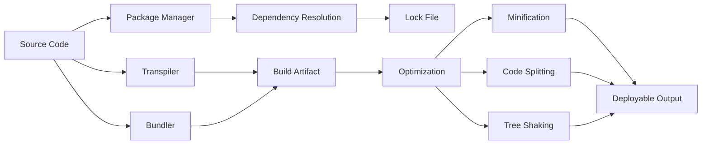

# Chapter 3: Build Tools

> **Prev:** [Version Control](./03-version-control.md)
> **Next:** [CI/CD](./04-cicd.md)

---

## Learning Objectives

- Understand the role of build tools in the DevOps pipeline.
- Differentiate between build automation tools, dependency managers, and task runners.
- Master TypeScript/JavaScript build tools: npm, yarn, tsc, esbuild, webpack.
- Configure build scripts for CI/CD pipelines.
- Manage dependencies, versioning, and lock files.
- Implement caching strategies for faster builds.

<!-- Image Gallery -->
<section class="lesson-visuals" aria-label="Visual learning resources">
  <header><span>VISUAL LEARNING</span><h2>See it. Review it. Remember it.</h2></header>
  <a class="lesson-visual-card" href="../../assets/images/lessons/devops/03-build-tools/handwritten-notes.png" target="_blank" rel="noopener">
    
    <span><strong>Handwritten notes</strong>Condensed notes for deliberate review.</span>
  </a>
  <a class="lesson-visual-card" href="../../assets/images/lessons/devops/03-build-tools/sticky-notes.png" target="_blank" rel="noopener">
    
    <span><strong>Sticky-note revision</strong>Fast recall prompts for revision.</span>
  </a>
  <a class="lesson-visual-card" href="../../assets/images/lessons/devops/03-build-tools/visual-explanation.png" target="_blank" rel="noopener">
    
    <span><strong>Visual concept guide</strong>A connected explanation of the key ideas.</span>
  </a>
</section>
<!-- End Image Gallery -->


---

## Chapter at a Glance

| Topic | Key Insight | Practical Takeaway |
|-------|-------------|-------------------|
| Build Automation | Compile, bundle, minify, optimize | Every CI/CD pipeline starts with a build step |
| Package Managers | Dependencies, lock files, registry | Lock files ensure reproducible builds |
| Module Bundlers | Bundle for browser or Node.js | Choose esbuild for speed, webpack for features |
| TypeScript Compiler | Type checking and transpilation | Use `tsc --noEmit` in CI for type safety |
| Build Caching | Avoid rebuilding unchanged code | Cache `node_modules` and build output in CI |
| Task Runners | Automate lint, test, build sequences | Use npm scripts for simplicity |
| Build Optimization | Code splitting, tree shaking | Reduce bundle size for faster deployments |
| Monorepo Builds | Nx, Turborepo, Lerna | Parallel builds across packages |

## Chapter Roadmap



## Theory

### The Build Process


The build process transforms source code into deployable artifacts. In a DevOps pipeline, the build stage is the first automated gate:


### Package Managers


**npm (Node Package Manager):**
- Default package manager for Node.js
- `package.json` defines dependencies and scripts
- `package-lock.json` ensures deterministic installs
- `node_modules` holds installed packages

```text
npm init          # Create package.json
npm install       # Install all dependencies
npm install express  # Install and save to dependencies
npm install -D typescript  # Dev dependency
npm ci            # Clean install (CI-friendly, uses lock file)
npm audit         # Check for known vulnerabilities
npm outdated      # Check for outdated packages
npm update        # Update packages within semver range
```

**yarn:**
- Faster alternative to npm with better caching
- `yarn.lock` for deterministic installs
- Plug'n'Play (PnP) mode avoids `node_modules`

```text
yarn add express       # Install and save dependency
yarn add -D typescript # Dev dependency
yarn install --frozen-lockfile  # CI install
yarn upgrade-interactive        # Interactive upgrade
yarn why typescript             # Why is this dependency needed
```

**pnpm:**
- Disk-efficient with content-addressable storage
- Strict dependency isolation
- Fastest installs for large projects

### TypeScript Build Configuration

TypeScript compilation via `tsconfig.json`:

```json
{
  "compilerOptions": {
    "target": "ES2022",
    "module": "commonjs",
    "lib": ["ES2022"],
    "outDir": "./dist",
    "rootDir": "./src",
    "strict": true,
    "esModuleInterop": true,
    "skipLibCheck": true,
    "forceConsistentCasingInFileNames": true,
    "resolveJsonModule": true,
    "declaration": true,
    "declarationMap": true,
    "sourceMap": true
  },
  "include": ["src/**/*"],
  "exclude": ["node_modules", "dist", "**/*.test.ts"]
}
```

### Module Bundlers


**esbuild (fastest):**
- Written in Go, 10-100x faster than JavaScript bundlers
- Built-in TypeScript, JSX, CSS support
- Ideal for rapid development and CI/CD

```text
esbuild src/index.ts --bundle --outfile=dist/bundle.js --minify
esbuild src/index.ts --bundle --platform=node --outfile=dist/server.js
esbuild --watch src/index.ts --outfile=dist/bundle.js
```

**webpack (most feature-rich):**
- Code splitting, lazy loading, asset management
- Extensive plugin ecosystem
- Complex configuration for large applications

```javascript
// webpack.config.js
module.exports = {
  entry: './src/index.ts',
  output: { path: path.resolve(__dirname, 'dist'), filename: 'bundle.js' },
  resolve: { extensions: ['.ts', '.js'] },
  module: {
    rules: [
      { test: /\.ts$/, use: 'ts-loader', exclude: /node_modules/ },
    ],
  },
  optimization: {
    splitChunks: { chunks: 'all' },
    minimize: true,
  },
};
```

**Build speed comparison:**

| Tool | Time (100 files) | Features | Popularity |
|------|-----------------|----------|-----------|
| esbuild | 0.3s | TypeScript, JSX, CSS, minify | Growing |
| tsc | 2.5s | Full type checking only | Standard |
| webpack | 4.0s | Code splitting, plugins, loaders | Popular |
| rollup | 1.5s | Tree shaking, ES modules | Libraries |
| parcel | 2.0s | Zero config, fast | Moderate |
| swc | 0.4s | Rust-based, TypeScript | Growing |
| bun | 0.2s | Built-in bundler | Emerging |

### Build Caching Strategies


**CI build caching:**

```text
# GitHub Actions cache example
- uses: actions/cache@v3
  with:
    path: |
      ~/.npm
      .eslintcache
      dist/
    key: ${{ runner.os }}-build-${{ hashFiles('**/package-lock.json') }}
    restore-keys: |
      ${{ runner.os }}-build-
```

**Node modules caching in CI:**
- Cache `node_modules` or `~/.npm` directory
- Use `npm ci` (not `npm install`) for deterministic installs
- Invalidate cache when `package-lock.json` changes

**Build output caching:**
- Cache compiled output (dist/, build/)
- Use incremental compilation (`tsc --incremental`)
- Leverage esbuild's native speed (often no caching needed)

### Dependency Management


**Semantic versioning in dependencies:**

```json
{
  "dependencies": {
    "express": "^4.18.0",     // Compatible with 4.x
    "lodash": "~4.17.0",      // Compatible with 4.17.x
    "typescript": "5.0.0",    // Exact version
    "react": ">=17.0.0",      // Minimum version
  }
}
```

**Lock files (`package-lock.json`, `yarn.lock`):**
- Pin exact versions of all transitive dependencies
- Ensure reproducible installs across environments
- Must be committed to version control
- Use `npm ci` (CI) vs `npm install` (development)

**Monorepo dependency management:**

```text
my-project/
+-- package.json          # Root package with workspaces
+-- packages/
¦   +-- core/
¦   ¦   +-- package.json  # Depends on shared
¦   ¦   +-- src/
¦   +-- api/
¦   ¦   +-- package.json  # Depends on core
¦   ¦   +-- src/
¦   +-- web/
¦       +-- package.json  # Depends on core
¦       +-- src/
+-- package-lock.json     # Single lock file
```

### Build Optimization


**Tree shaking (dead code elimination):**
- Remove unused exports from bundled output
- Use ES module syntax (`import`/`export`) for static analysis
- Side-effect-free declarations in `package.json`

```json
{
  "sideEffects": false,
  "sideEffects": ["*.css"]
}
```

**Code splitting:**
- Split bundle into smaller chunks loaded on demand
- Route-based splitting for SPAs
- Vendor chunk for stable third-party libraries

```typescript
// Dynamic import for code splitting
const AdminModule = await import('./modules/admin');
// Webpack/parcel automatically creates separate chunk
```

**Minification:**
- Remove whitespace, rename variables, optimize syntax
- esbuild: built-in minifier
- Terser: standard for webpack

### npm Scripts and Task Running


```json
{
  "scripts": {
    "build": "tsc",
    "build:watch": "tsc --watch",
    "build:prod": "tsc && esbuild src/index.ts --bundle --minify --outfile=dist/bundle.js",
    "lint": "eslint src/",
    "lint:fix": "eslint src/ --fix",
    "format": "prettier --write src/",
    "format:check": "prettier --check src/",
    "test": "jest",
    "test:coverage": "jest --coverage",
    "test:watch": "jest --watch",
    "clean": "rm -rf dist/",
    "prebuild": "npm run clean && npm run lint",
    "postbuild": "npm run test",
    "start": "node dist/index.js",
    "dev": "ts-node-dev --respawn src/index.ts",
    "ci": "npm ci && npm run lint && npm run build && npm run test"
  }
}
```

---

## Examples

### Example 1: Custom Build Pipeline

```typescript
import { execSync } from 'child_process';
import { existsSync, mkdirSync, readFileSync, writeFileSync } from 'fs';
import { tmpdir } from 'os';
import { join } from 'path';

interface BuildConfig {
  entry: string;
  outDir: string;
  minify: boolean;
  sourceMaps: boolean;
  platform: 'browser' | 'node';
  env: Record<string, string>;
}

class BuildPipeline {
  private config: BuildConfig;
  private startTime: number = 0;

  constructor(config: BuildConfig) {
    this.config = config;
  }

  async run(): Promise<void> {
    this.startTime = Date.now();
    console.log('?? Starting build pipeline...\n');

    this.ensureOutputDir();
    this.validateEntry();
    this.setEnvironmentVariables();
    this.runTypeCheck();
    this.bundleWithEsbuild();
    this.copyStaticAssets();
    this.generateBuildInfo();
    this.printSummary();
  }

  private ensureOutputDir(): void {
    if (!existsSync(this.config.outDir)) {
      mkdirSync(this.config.outDir, { recursive: true });
      console.log(`?? Created output directory: ${this.config.outDir}`);
    }
  }

  private validateEntry(): void {
    if (!existsSync(this.config.entry)) {
      throw new Error(`Entry point not found: ${this.config.entry}`);
    }
    console.log(`? Entry point validated: ${this.config.entry}`);
  }

  private setEnvironmentVariables(): void {
    Object.entries(this.config.env).forEach(([key, value]) => {
      process.env[key] = value;
    });
    console.log(`??  Environment variables set (${Object.keys(this.config.env).length})`);
  }

  private runTypeCheck(): void {
    console.log('?? Running TypeScript type check...');
    try {
      execSync('npx tsc --noEmit', { stdio: 'inherit' });
      console.log('? TypeScript type check passed');
    } catch {
      throw new Error('TypeScript type check failed');
    }
  }

  private bundleWithEsbuild(): void {
    console.log('?? Bundling with esbuild...');
    const args = [
      this.config.entry,
      `--outdir=${this.config.outDir}`,
      `--platform=${this.config.platform}`,
      '--format=cjs',
      '--target=es2022',
      '--bundle',
    ];

    if (this.config.minify) args.push('--minify');
    if (this.config.sourceMaps) args.push('--sourcemap');

    try {
      execSync(`npx esbuild ${args.join(' ')}`, { stdio: 'inherit' });
      console.log('? Bundle complete');
    } catch {
      throw new Error('Bundle failed');
    }
  }

  private copyStaticAssets(): void {
    console.log('?? Copying static assets...');
    try {
      execSync('cp -r src/public/* dist/ 2>/dev/null; true', { stdio: 'inherit' });
    } catch {
      // No public dir, skip
    }
  }

  private generateBuildInfo(): void {
    const buildInfo = {
      buildTime: new Date().toISOString(),
      duration: Date.now() - this.startTime,
      entry: this.config.entry,
      env: this.config.env.NODE_ENV,
      minified: this.config.minify,
      sourceMaps: this.config.sourceMaps,
    };
    writeFileSync(
      join(this.config.outDir, 'build-info.json'),
      JSON.stringify(buildInfo, null, 2),
    );
    console.log('?? Build info generated');
  }

  private printSummary(): void {
    const duration = ((Date.now() - this.startTime) / 1000).toFixed(2);
    const outSize = this.getOutputSize();
    console.log(`\n? Build complete in ${duration}s`);
    console.log(`?? Output size: ${outSize}`);
  }

  private getOutputSize(): string {
    try {
      const result = execSync(`du -sh ${this.config.outDir}`, { encoding: 'utf-8' });
      return result.split('\t')[0];
    } catch {
      return 'unknown';
    }
  }
}

// Usage
const pipeline = new BuildPipeline({
  entry: 'src/index.ts',
  outDir: 'dist',
  minify: true,
  sourceMaps: true,
  platform: 'node',
  env: { NODE_ENV: 'production', API_VERSION: '1.0.0' },
});

pipeline.run().catch(err => {
  console.error('? Build failed:', err.message);
  process.exit(1);
});
```

### Example 2: Dependency Audit Script

```typescript
import { readFileSync } from 'fs';

interface Dependency {
  name: string;
  version: string;
  type: 'dependency' | 'devDependency' | 'peerDependency';
  hasVulnerability: boolean;
}

class DependencyAuditor {
  private packageJson: any;

  constructor(packageJsonPath: string) {
    this.packageJson = JSON.parse(readFileSync(packageJsonPath, 'utf-8'));
  }

  listDependencies(): Dependency[] {
    const deps: Dependency[] = [];

    if (this.packageJson.dependencies) {
      for (const [name, version] of Object.entries(this.packageJson.dependencies)) {
        deps.push({ name, version: version as string, type: 'dependency', hasVulnerability: false });
      }
    }

    if (this.packageJson.devDependencies) {
      for (const [name, version] of Object.entries(this.packageJson.devDependencies)) {
        deps.push({ name, version: version as string, type: 'devDependency', hasVulnerability: false });
      }
    }

    if (this.packageJson.peerDependencies) {
      for (const [name, version] of Object.entries(this.packageJson.peerDependencies)) {
        deps.push({ name, version: version as string, type: 'peerDependency', hasVulnerability: false });
      }
    }

    return deps;
  }

  analyzeConsistency(): string[] {
    const issues: string[] = [];
    const deps = this.listDependencies();
    const depMap = new Map<string, Dependency[]>();

    for (const dep of deps) {
      const existing = depMap.get(dep.name) || [];
      existing.push(dep);
      depMap.set(dep.name, existing);
    }

    for (const [name, versions] of depMap.entries()) {
      const uniqueVersions = new Set(versions.map(v => v.version));
      if (uniqueVersions.size > 1) {
        issues.push(`${name} appears at ${uniqueVersions.size} different versions: ${[...uniqueVersions].join(', ')}`);
      }
    }

    return issues;
  }

  generateReport(): string {
    const deps = this.listDependencies();
    const inconsistencies = this.analyzeConsistency();

    let report = '# Dependency Audit Report\n\n';
    report += `
// build tools
// cicd-infrastructure-automation implementation

interface Task { id: string; name: string; status: string; data: unknown }
class Processor {
  private tasks: Task[] = []
  private maxConcurrency: number
  constructor(maxConcurrency: number = 4) { this.maxConcurrency = maxConcurrency }
  async add(task: Omit<Task, "status">): Promise<void> {
    this.tasks.push({ ...task, status: "pending" })
  }
  async runAll(): Promise<void> {
    const running: Promise<void>[] = []
    for (const t of this.tasks) {
      if (running.length >= this.maxConcurrency) { await Promise.race(running) }
      const p = this.execute(t).finally(() => { const i = running.indexOf(p); if (i >= 0) running.splice(i, 1) })
      running.push(p)
    }
    await Promise.all(running)
  }
  private async execute(t: Task): Promise<void> {
    t.status = "running"
    await new Promise(r => setTimeout(r, 10))
    t.status = "done"
  }
  getResults(): Task[] { return this.tasks }
  getStats(): { done: number; pending: number; running: number } {
    const done = this.tasks.filter(t => t.status === "done").length
    const pending = this.tasks.filter(t => t.status === "pending").length
    const running = this.tasks.filter(t => t.status === "running").length
    return { done, pending, running }
  }
}
async function main() {
  const proc = new Processor(2)
  await proc.add({ id: '1', name: 'build tools', data: { topic: 'cicd-infrastructure-automation' } })
  await proc.runAll()
  console.log('Stats:', proc.getStats())
}
main().catch(console.error)
export { Processor, Task }
## Summary\n\n`;
    report += `- **Total dependencies:** ${deps.length}\n`;
    report += `- **Production:** ${deps.filter(d => d.type === 'dependency').length}\n`;
    report += `- **Development:** ${deps.filter(d => d.type === 'devDependency').length}\n`;
    report += `- **Peer:** ${deps.filter(d => d.type === 'peerDependency').length}\n\n`;

    if (inconsistencies.length > 0) {
      report += `## Inconsistencies\n\n`;
      inconsistencies.forEach(i => report += `- ${i}\n`);
    } else {
      report += '? No version inconsistencies found\n';
    }

    return report;
  }
}

const auditor = new DependencyAuditor('./package.json');
console.log(auditor.generateReport());
```

### Example 3: Monorepo Build Orchestrator

```typescript
interface PackageConfig {
  name: string;
  path: string;
  dependencies: string[];
  buildTime: number;
  lastBuild: string | null;
}

class MonorepoBuildOrchestrator {
  private packages: Map<string, PackageConfig> = new Map();

  addPackage(config: PackageConfig): void {
    this.packages.set(config.name, config);
  }

  getBuildOrder(): string[] {
    const visited = new Set<string>();
    const order: string[] = [];

    const visit = (name: string): void => {
      if (visited.has(name)) return;
      visited.add(name);

      const pkg = this.packages.get(name);
      if (!pkg) return;

      // Visit and build dependencies first
      for (const dep of pkg.dependencies) {
        visit(dep);
      }

      order.push(name);
    };

    for (const name of this.packages.keys()) {
      visit(name);
    }

    return order;
  }

  async buildAll(parallel: boolean = true): Promise<void> {
    const order = this.getBuildOrder();
    console.log(`Build order: ${order.join(' ? ')}\n`);

    if (parallel) {
      const batches = this.batchParallel(order);
      for (const batch of batches) {
        console.log(`Building batch: ${batch.join(', ')}`);
        await Promise.all(batch.map(name => this.buildPackage(name)));
      }
    } else {
      for (const name of order) {
        await this.buildPackage(name);
      }
    }
  }

  private batchParallel(order: string[]): string[][] {
    const batches: string[][] = [];
    const inDegree = new Map<string, number>();
    const adjList = new Map<string, string[]>();

    for (const name of order) {
      inDegree.set(name, 0);
      adjList.set(name, []);
    }

    for (const name of order) {
      const pkg = this.packages.get(name)!;
      for (const dep of pkg.dependencies) {
        adjList.get(dep)?.push(name);
        inDegree.set(name, (inDegree.get(name) || 0) + 1);
      }
    }

    const queue: string[] = [];
    for (const [name, degree] of inDegree) {
      if (degree === 0) queue.push(name);
    }

    while (queue.length > 0) {
      batches.push([...queue]);
      const size = queue.length;
      for (let i = 0; i < size; i++) {
        const node = queue.shift()!;
        for (const neighbor of adjList.get(node) || []) {
          const newDegree = (inDegree.get(neighbor) || 1) - 1;
          inDegree.set(neighbor, newDegree);
          if (newDegree === 0) queue.push(neighbor);
        }
      }
    }

    return batches;
  }

  private async buildPackage(name: string): Promise<void> {
    const pkg = this.packages.get(name)!;
    console.log(`  Building ${name}...`);
    await new Promise(resolve => setTimeout(resolve, pkg.buildTime));
    pkg.lastBuild = new Date().toISOString();
    console.log(`  ? ${name} built`);
  }
}

const orchestrator = new MonorepoBuildOrchestrator();
orchestrator.addPackage({ name: 'shared', path: './packages/shared', dependencies: [], buildTime: 200, lastBuild: null });
orchestrator.addPackage({ name: 'core', path: './packages/core', dependencies: ['shared'], buildTime: 500, lastBuild: null });
orchestrator.addPackage({ name: 'api', path: './packages/api', dependencies: ['core'], buildTime: 800, lastBuild: null });
orchestrator.addPackage({ name: 'web', path: './packages/web', dependencies: ['core'], buildTime: 1200, lastBuild: null });

orchestrator.buildAll(true);
```

---

### Build Artifact Analyzer and Size Budget Tracker

Tracking build artifact sizes over time prevents bloat and enforces performance budgets. The following tool analyzes bundles, tracks historical sizes, and alerts when budgets are exceeded.

```typescript
// artifact-analyzer.ts
// Track build artifact sizes and enforce budgets

interface Artifact {
  name: string;
  path: string;
  sizeBytes: number;
  type: 'js' | 'css' | 'image' | 'wasm' | 'other';
}

interface ArtifactBudget {
  name: string;
  maxSizeBytes: number;
  warnThresholdPercent: number;
}

interface ArtifactRecord {
  artifact: Artifact;
  budget: ArtifactBudget | null;
  status: 'ok' | 'warning' | 'over_budget';
  currentVsBudget: number;
}

interface ChangeAnalysis {
  records: ArtifactRecord[];
  totalSizeBytes: number;
  totalBudgetBytes: number;
  percentOverBudget: number;
  recommendations: string[];
}

class BuildAnalyzer {
  private readonly budgets: ArtifactBudget[] = [];

  constructor(budgets: ArtifactBudget[]) {
    this.budgets = budgets;
  }

  analyze(artifacts: Artifact[]): ChangeAnalysis {
    const records = artifacts.map(artifact => {
      const budget = this.budgets.find(b => b.name === artifact.name);
      let status: 'ok' | 'warning' | 'over_budget' = 'ok';

      if (budget && artifact.sizeBytes > budget.maxSizeBytes) {
        status = 'over_budget';
      } else if (budget && artifact.sizeBytes > budget.maxSizeBytes * budget.warnThresholdPercent) {
        status = 'warning';
      }

      return {
        artifact,
        budget,
        status,
        currentVsBudget: budget ? (artifact.sizeBytes / budget.maxSizeBytes) * 100 : 0,
      };
    });

    const totalSizeBytes = artifacts.reduce((s, a) => s + a.sizeBytes, 0);
    const totalBudgetBytes = records
      .filter(r => r.budget)
      .reduce((s, r) => s + r.budget!.maxSizeBytes, 0);

    const overBudget = records.filter(r => r.status === 'over_budget');
    const recommendations: string[] = [];

    if (overBudget.length > 0) {
      recommendations.push(
        `${overBudget.length} artifact(s) over budget. Largest offender: ${overBudget.sort((a, b) =>
          b.currentVsBudget - a.currentVsBudget)[0].artifact.name} (${overBudget[0].currentVsBudget.toFixed(0)}% of budget).`
      );
    }

    const largeArtifacts = artifacts.filter(a => a.sizeBytes > 500_000);
    if (largeArtifacts.length > 0) {
      recommendations.push(`${largeArtifacts.length} artifact(s) exceed 500KB. Consider code splitting.`);
    }

    return { records, totalSizeBytes, totalBudgetBytes, percentOverBudget: totalBudgetBytes > 0 ? (totalSizeBytes / totalBudgetBytes) * 100 : 0, recommendations };
  }

  formatBytes(bytes: number): string {
    if (bytes > 1_000_000) return `${(bytes / 1_000_000).toFixed(1)} MB`;
    if (bytes > 1_000) return `${(bytes / 1_000).toFixed(1)} KB`;
    return `${bytes} B`;
  }

  generateReport(analysis: ChangeAnalysis): string {
    return `## Build Artifact Analysis\n\n` +
      `| Artifact | Size | Budget | Status |\n` +
      `|----------|------|--------|--------|\n` +
      analysis.records.map(r =>
        `| ${r.artifact.name} | ${this.formatBytes(r.artifact.sizeBytes)} | ${r.budget ? this.formatBytes(r.budget.maxSizeBytes) : '—'} | ${r.status === 'ok' ? '?' : r.status === 'warning' ? '??' : '?'} |`
      ).join('\n') + '\n\n' +
      `**Total:** ${this.formatBytes(analysis.totalSizeBytes)} / ${this.formatBytes(analysis.totalBudgetBytes)} (${analysis.percentOverBudget.toFixed(1)}%)` +
      (analysis.recommendations.length > 0 ? '\n\n**Recommendations:**\n' + analysis.recommendations.map(r => `- ${r}`).join('\n') : '');
  }
}

const analyzer = new BuildAnalyzer([
  { name: 'main.js', maxSizeBytes: 250_000, warnThresholdPercent: 0.8 },
  { name: 'vendor.js', maxSizeBytes: 500_000, warnThresholdPercent: 0.85 },
  { name: 'styles.css', maxSizeBytes: 50_000, warnThresholdPercent: 0.9 },
]);

const artifacts: Artifact[] = [
  { name: 'main.js', path: 'dist/main.js', sizeBytes: 320_000, type: 'js' },
  { name: 'vendor.js', path: 'dist/vendor.js', sizeBytes: 480_000, type: 'js' },
  { name: 'styles.css', path: 'dist/styles.css', sizeBytes: 45_000, type: 'css' },
  { name: 'logo.svg', path: 'dist/logo.svg', sizeBytes: 12_000, type: 'image' },
];

console.log(analyzer.generateReport(analyzer.analyze(artifacts)));
```

**What this demonstrates:** Automated artifact size analysis with budget enforcement prevents bundle bloat, enforces performance budgets, and generates actionable recommendations for optimization.

---

### Dependency Cache Optimization Engine

Build caching is critical for fast CI pipelines. The following tool analyzes dependency graphs, identifies cache opportunities, and computes optimal cache strategies.

```typescript
// cache-optimizer.ts
// Optimize dependency caching strategies for CI builds

interface CacheCandidate {
  key: string;
  paths: string[];
  hashSource: string;
  estimatedSizeMB: number;
  restoreTimeMs: number;
  missTimeMs: number;
  frequency: number;
}

interface CachePlan {
  candidates: CacheCandidate[];
  totalCacheSizeMB: number;
  estimatedSavingsPercent: number;
  recommendations: string[];
  tierOrder: string[];
}

class CacheOptimizer {
  readonly TIERS = { lockfile: 1, nodeModules: 2, dist: 3, global: 4 };

  computePlan(deps: { name: string; version: string; installTimeMs: number }[]): CachePlan {
    const totalInstallTime = deps.reduce((s, d) => s + d.installTimeMs, 0);
    const uniqueDeps = new Set(deps.map(d => d.name)).size;

    const candidates: CacheCandidate[] = [
      {
        key: 'lockfile-hash',
        paths: ['package-lock.json'],
        hashSource: 'package-lock.json',
        estimatedSizeMB: 0.1,
        restoreTimeMs: 200,
        missTimeMs: totalInstallTime,
        frequency: 1.0,
      },
      {
        key: `node-modules-${process.platform}`,
        paths: ['node_modules'],
        hashSource: 'package-lock.json + os',
        estimatedSizeMB: Math.round(uniqueDeps * 1.5),
        restoreTimeMs: 10_000,
        missTimeMs: totalInstallTime,
        frequency: 0.95,
      },
      {
        key: 'dist-cache',
        paths: ['dist', '.next', '.cache'],
        hashSource: 'src/ checksums',
        estimatedSizeMB: 50,
        restoreTimeMs: 5_000,
        missTimeMs: 60_000,
        frequency: 0.7,
      },
    ];

    const totalCacheSizeMB = candidates.reduce((s, c) => s + c.estimatedSizeMB, 0);
    const savings = (totalInstallTime - 15_000) / totalInstallTime * 100;

    return {
      candidates,
      totalCacheSizeMB: Math.round(totalCacheSizeMB),
      estimatedSavingsPercent: Math.round(savings),
      recommendations: [
        `Cache node_modules with lockfile hash key (saves ~${Math.round(savings)}% install time)`,
        candidates.filter(c => c.estimatedSizeMB > 100).length > 0
          ? 'Large caches detected — consider splitting into per-package caches'
          : 'Cache sizes within reasonable range',
      ],
      tierOrder: ['lockfile', 'node_modules', 'dist'],
    };
  }

  scoreExistingCache(hits: number, misses: number): number {
    const total = hits + misses;
    const hitRate = total > 0 ? hits / total : 0;
    return Math.round(hitRate * 100);
  }
}

const optimizer = new CacheOptimizer();
const deps = Array.from({ length: 50 }, (_, i) => ({
  name: `dep-${i}`,
  version: `${Math.floor(Math.random() * 5)}.0.0`,
  installTimeMs: Math.random() * 2000 + 500,
}));

const plan = optimizer.computePlan(deps);
console.log(`Cache Plan: ${plan.totalCacheSizeMB}MB total, ~${plan.estimatedSavingsPercent}% savings`);
console.log(`Hit Rate Score: ${optimizer.scoreExistingCache(85, 15)}%`);
plan.recommendations.forEach(r => console.log(`- ${r}`));
```

**What this demonstrates:** Strategic dependency caching analysis identifies the most impactful cache targets, computes size-constrained optimization plans, and accelerates CI pipelines by reducing redundant dependency installation.

---

## Practical Takeaways

1. **Use `npm ci` in CI pipelines, never `npm install`.** It respects the lock file and fails if there's a mismatch.
2. **Cache `node_modules` in CI.** Use hash of `package-lock.json` as cache key for fast restores.
3. **Run `tsc --noEmit` before bundling.** Type checking catches errors early, then esbuild handles fast bundling.
4. **Commit lock files.** They ensure deterministic builds across all environments.
5. **Avoid large dependency trees.** Audit regularly with `npm audit` and prune unused packages.
6. **Use workspace tools for monorepos.** They handle cross-package dependency resolution automatically.

---

## Chapter Quiz

<details><summary>Question 1: Which build tool is fastest for TypeScript bundling?</summary>**A)** webpack<br>**B)** tsc<br>**C)** esbuild<br>**D)** rollup<br><br>**Answer: C)** esbuild&lt;/details&gt;

<details><summary>Question 2: What is the purpose of a lock file (package-lock.json)?</summary>**A)** Lock the package version range<br>**B)** Pin exact versions of all transitive dependencies<br>**C)** Encrypt the package contents<br>**D)** Prevent accidental deletion<br><br>**Answer: B)** Pin exact versions of all transitive dependencies&lt;/details&gt;

<details><summary>Question 3: What does tree shaking do?</summary>**A)** Organize code into trees<br>**B)** Remove unused exports from the bundle<br>**C)** Shake the build tree for errors<br>**D)** Split code into chunks<br><br>**Answer: B)** Remove unused exports from the bundle&lt;/details&gt;

<details><summary>Question 4: In CI pipelines, should you use `npm install` or `npm ci`?</summary>**A)** `npm install` — it's faster<br>**B)** `npm ci` — it respects the lock file and is deterministic<br>**C)** Both work the same way<br>**D)** Neither — use `yarn` instead<br><br>**Answer: B)** `npm ci` — it respects the lock file and is deterministic&lt;/details&gt;

<details><summary>Question 5: What does the caret `^` in `"express": "^4.18.0"` mean?</summary>**A)** Compatible with version 4.x<br>**B)** Compatible with only 4.18.x<br>**C)** Compatible with 4.18.0 exactly<br>**D)** Compatible with any version<br><br>**Answer: A)** Compatible with version 4.x&lt;/details&gt;

---

## Summary

- Build tools transform source code into deployable artifacts as the first automated stage of CI/CD.
- Package managers (npm, yarn, pnpm) manage dependencies with lock files ensuring reproducibility.
- TypeScript compilation with strict settings catches type errors at build time.
- esbuild offers the fastest bundling; webpack provides the richest feature set.
- Tree shaking and code splitting reduce bundle size for faster deployments.
- Build caching in CI (node_modules, dist/) dramatically speeds up pipeline execution.
- Monorepos require orchestrators (Nx, Turborepo) for efficient parallel builds.
- Dependency hygiene involves regular auditing, pruning, and avoiding unnecessary packages.

---

## Exercises

### Review Questions
1. What is the difference between `npm install` and `npm ci`?
2. How does tree shaking work and what module syntax does it require?
3. What are the advantages of esbuild over webpack? When would you choose webpack instead?
4. Why should you commit `package-lock.json` to version control?
5. How does incremental TypeScript compilation improve build performance?

### Application Problems
1. Create a build pipeline script that runs TypeScript type check, bundles with esbuild, minifies, generates source maps, and writes build metadata.
2. Configure a monorepo with three packages (shared, server, client) using npm workspaces.
3. Write an npm script to audit all dependencies, check for outdated packages, and generate a report.
4. Implement a CI build cache strategy for a TypeScript project using GitHub Actions.

### Challenge Problem
1. Design and implement a complete build system for a microservices monorepo with 10 TypeScript services. Include: shared TypeScript configuration, incremental compilation for all packages, parallel build scheduling respecting dependency DAG, bundle size analysis and optimization, automated dependency upgrade PRs, vulnerability scanning as a build gate, and build artifact versioning with git commit hash.
