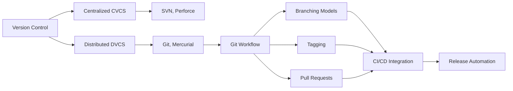
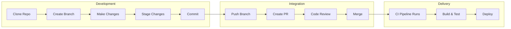
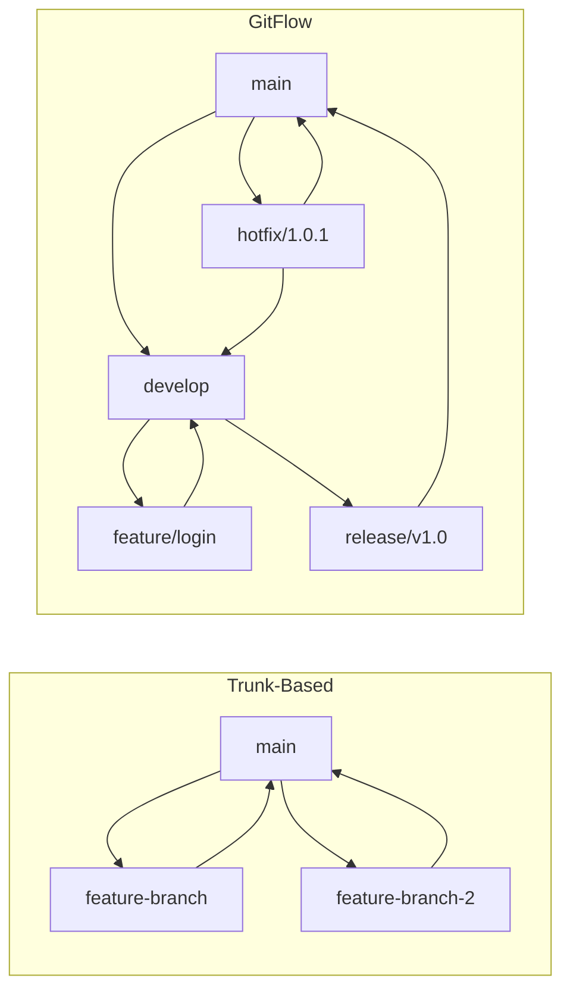
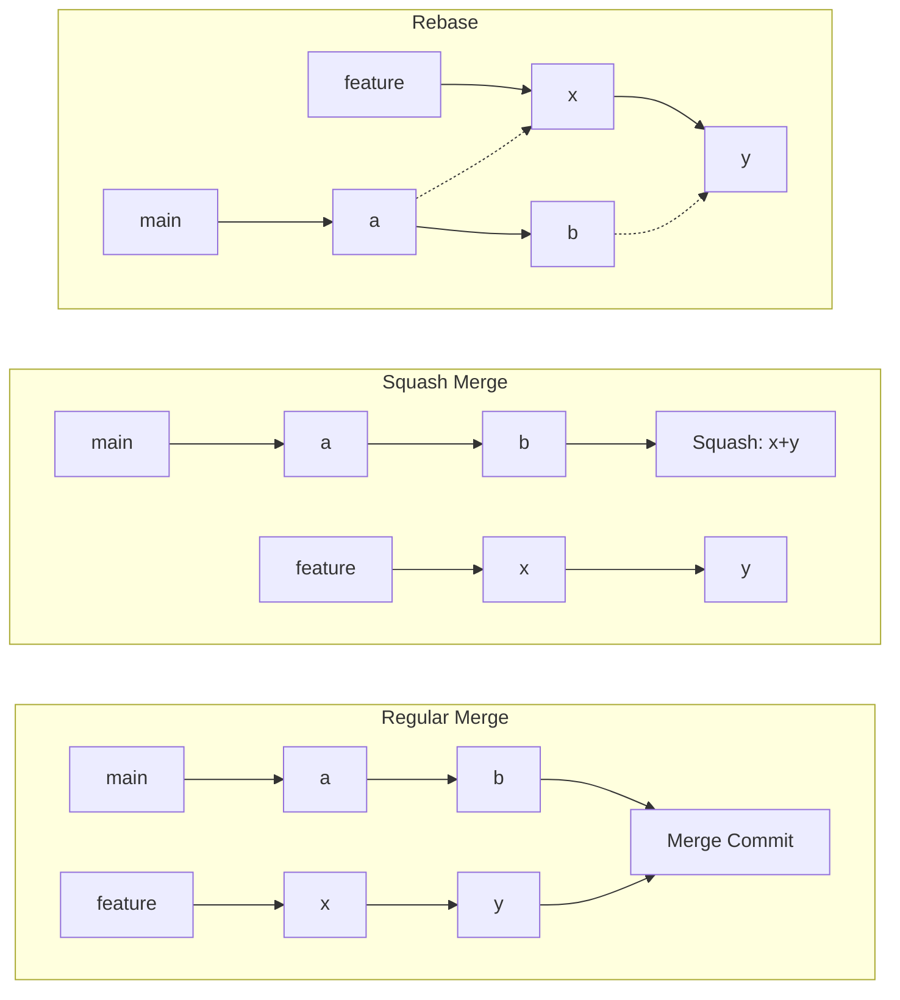
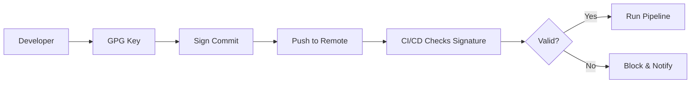

# Chapter 3: Version Control

> **Prev:** [Advanced Git](./02-git.md)
> **Next:** [Build Tools](./03-build-tools.md)

---

## Learning Objectives

- Understand the purpose and benefits of version control systems (VCS).
- Differentiate between centralized (CVCS) and distributed (DVCS) version control.
- Master Git for collaborative development in DevOps pipelines.
- Understand Git branching models, tagging, and release management.
- Integrate version control with CI/CD and deployment automation.
- Apply best practices for monorepos versus multi-repo strategies.

---

## Chapter at a Glance

| Topic | Key Insight | Practical Takeaway |
|-------|-------------|-------------------|
| VCS Basics | Tracking changes over time | Every DevOps pipeline starts with version control |
| Centralized vs Distributed | CVCS vs DVCS tradeoffs | DVCS suits distributed teams and CI/CD |
| Git Workflow | Clone, branch, commit, push, pull request | Master the core loop before advanced features |
| Branching Models | GitFlow, trunk-based, feature branches | Choose based on release cadence |
| Tagging | Named snapshots for releases | Use semantic versioning for tags |
| Monorepo vs Multi-Repo | Single repo vs many repos | Consider tooling and team autonomy |
| VCS in CI/CD | Triggers, versioning, artifacts | Every commit should be a potential release |
| Code Review | Pull request workflows | Automate checks in PR pipeline |

## Chapter Roadmap



## Theory

### What is Version Control?


Version control is a system that records changes to a file or set of files over time so that you can recall specific versions later. It is the foundation of every DevOps practice:

- **Collaboration:** Multiple developers can work on the same codebase without overwriting each other's work.
- **History:** Every change is logged with who made it, when, and why.
- **Branching:** Experiment with new features without affecting the stable codebase.
- **Recovery:** Revert to any previous state if something breaks.
- **Audit trail:** Know exactly what code is running in production and how it got there.

### Centralized Version Control (CVCS)


In CVCS (e.g., SVN, Perforce, CVS):
- A single central server stores all versioned files
- Clients check out files from the central repository
- Most operations require network access to the server

**Advantages:** Simple permission model, single source of truth, easier for non-technical users.
**Disadvantages:** Single point of failure, requires network for all operations, slow diffs and history.

### Distributed Version Control (DVCS)


In DVCS (e.g., Git, Mercurial):
- Every developer has a complete copy of the repository
- Most operations are local and fast
- The server is just one of many copies

**Advantages:** Full history offline, fast operations, multiple backups, flexible workflows.
**Disadvantages:** Steeper learning curve, large initial clone, merging complexity.

### Git Workflow in DevOps


The core Git workflow maps directly to the DevOps pipeline:



### Branching Models


**Feature Branching:** Every feature has its own branch. When complete, merge via PR.
- Pros: Isolation, code review, parallel work
- Cons: Long-lived branches cause integration pain

**GitFlow:** Complex model with `main`, `develop`, `feature`, `release`, and `hotfix` branches.
- Pros: Clear structure for versioned releases, hotfix isolation
- Cons: Heavy ceremony, unsuitable for continuous delivery

**Trunk-Based Development:** All work on short-lived branches off `main`, merged frequently.
- Pros: Minimal merge conflicts, CI/CD friendly, simple
- Cons: Requires feature flags for incomplete work, discipline



### Monorepo vs Multi-Repo


**Monorepo (single repository):**
- Google, Microsoft, Meta use single massive repos
- Atomic changes across teams
- Shared build tooling and dependencies
- Challenges: Scale, tooling required (Bazel, Nx)

**Multi-Repo (many repositories):**
- Each service/microservice has its own repo
- Independent versioning and deployment
- Team autonomy
- Challenges: Cross-repo refactoring, dependency management

**Hybrid (Polyrepo with workspaces):**
- Related projects in a monorepo, unrelated in separate repos
- Best of both worlds
- Git submodules or workspace tools (npm workspaces, yarn workspaces)

### Tagging and Release Management


Tags create named, immutable references to specific commits:

```text
git tag v1.0.0                    # Lightweight tag
git tag -a v1.0.0 -m "Release 1.0.0"  # Annotated tag
git tag -s v1.0.0 -m "Signed release"  # GPG-signed tag
git push origin v1.0.0            # Push tag
git push --tags                   # Push all tags
```

**Semantic Versioning (SemVer):** `MAJOR.MINOR.PATCH`
- MAJOR: Breaking changes
- MINOR: New features, backward compatible
- PATCH: Bug fixes, backward compatible

### Advanced Merge Strategies


Choosing the right merge strategy affects commit history readability:

| Strategy | History | Use Case | Command |
|----------|---------|----------|---------|
| **Regular merge** | Preserves full branch history with merge commits | Feature branches with multiple contributors | `git merge --no-ff feature` |
| **Squash merge** | Collapses all branch commits into one | Single-author features, cleanup history | `git merge --squash feature` |
| **Rebase merge** | Linear history, no merge commits | Personal branches, CI/CD branches | `git rebase main; git merge feature` |
| **Fast-forward** | Linear, only possible when no divergence | Trunk-based, short-lived branches | `git merge --ff-only feature` |



### Git Bisect for Root Cause Analysis


`git bisect` uses binary search to find the exact commit that introduced a bug:

```typescript
// Automate git bisect with a test script
interface BisectResult {
  firstBadCommit: string;
  suspectRange: { good: string; bad: string };
  steps: number;
}

class GitBisector {
  async bisect(goodCommit: string, badCommit: string, testScript: () => Promise<boolean>): Promise<BisectResult> {
    console.log(`Starting bisect: good=${goodCommit.slice(0,7)} bad=${badCommit.slice(0,7)}`);

    // Simulate binary search across commits
    const commits = this.getCommitRange(goodCommit, badCommit);
    let low = 0;
    let high = commits.length - 1;
    let steps = 0;

    while (low < high) {
      steps++;
      const mid = Math.floor((low + high) / 2);
      const commit = commits[mid];
      console.log(`Step ${steps}: checking ${commit.slice(0,7)}`);

      if (testScript()) {
        high = mid;
      } else {
        low = mid + 1;
      }
    }

    return {
      firstBadCommit: commits[low],
      suspectRange: { good: commits[low - 1], bad: commits[low] },
      steps,
    };
  }

  private getCommitRange(good: string, bad: string): string[] {
    // Simulate 100 commits in range for demo
    return Array.from({ length: 100 }, (_, i) => `commit-${i}`);
  }
}
```

### Signed Commits and Verification


GPG-signing commits provides cryptographic proof of authorship:

```text
# Configure GPG key
gpg --full-generate-key
git config --global user.signingkey KEY_ID
git config --global commit.gpgsign true

# Sign commits and tags
git commit -S -m "feat: add payment integration"
git tag -s v1.0.0 -m "Release 1.0.0"

# Verify signatures
git log --show-signature
git verify-commit HEAD
git verify-tag v1.0.0
```

**Why signed commits matter in DevOps:**
- **Supply chain security:** Prevent malicious commits from spoofed authors
- **Compliance:** Meet SOC 2, FedRAMP audit trail requirements
- **CI/CD trust:** Only run pipelines for verified commits
- **DCO (Developer Certificate of Origin):** Automate `Signed-off-by` with `git commit -s`



### VCS and CI/CD Integration


Every version control event can trigger CI/CD actions:

| Event | CI/CD Action |
|-------|-------------|
| Push to feature branch | Run tests on the feature |
| Create pull request | Run full test suite, code quality checks |
| Merge to main | Build, test, deploy to staging |
| Create release tag | Build, deploy to production |
| Push to hotfix branch | Run regression tests, fast-track deployment |

**Git tags in CI/CD:**
```text
# Extract version from git tag in CI pipeline
VERSION=$(git describe --tags --always)
echo "Building version: $VERSION"
docker build -t myapp:$VERSION .
docker push myapp:$VERSION
```

### Code Review Practices


Effective code review in version control:

1. **Small PRs** — Reviewers process small changes faster and catch more defects
2. **Automated checks first** — Lint, style, tests run before human review
3. **Clear description** — What changed and why
4. **Review checklist** — Consistency, correctness, coverage, security
5. **No blame** — Review the code, not the author

---

## Examples

### Example 1: Version Management System

```typescript
// Simulating version control operations
type CommitId = string;

interface Commit {
  id: CommitId;
  message: string;
  timestamp: Date;
  author: string;
  parent: CommitId | null;
  files: Map<string, string>;
}

class VersionControlSystem {
  private commits: Map<CommitId, Commit> = new Map();
  private branches: Map<string, CommitId> = new Map();
  private tags: Map<string, CommitId> = new Map();
  private currentBranch: string = 'main';
  private commitCounter: number = 0;

  constructor() {
    this.branches.set('main', '');
  }

  commit(message: string, author: string, files: Map<string, string>): CommitId {
    const id = `c${++this.commitCounter}`;
    const parent = this.branches.get(this.currentBranch) || null;
    const commit: Commit = {
      id,
      message,
      timestamp: new Date(),
      author,
      parent,
      files: new Map(files),
    };
    this.commits.set(id, commit);
    this.branches.set(this.currentBranch, id);
    return id;
  }

  createBranch(name: string): void {
    const currentHead = this.branches.get(this.currentBranch);
    if (currentHead) this.branches.set(name, currentHead);
  }

  checkout(branch: string): void {
    if (!this.branches.has(branch)) throw new Error(`Branch ${branch} not found`);
    this.currentBranch = branch;
  }

  createTag(name: string): void {
    const head = this.branches.get(this.currentBranch);
    if (head) this.tags.set(name, head);
  }

  merge(sourceBranch: string): boolean {
    const sourceHead = this.branches.get(sourceBranch);
    const targetHead = this.branches.get(this.currentBranch);
    if (!sourceHead || !targetHead) return false;

    // Fast-forward check
    let cursor: CommitId | null = sourceHead;
    while (cursor) {
      if (cursor === targetHead) {
        this.branches.set(this.currentBranch, sourceHead);
        return true;
      }
      cursor = this.commits.get(cursor)?.parent ?? null;
    }

    // Three-way merge: create merge commit
    const id = `c${++this.commitCounter}`;
    const mergeCommit: Commit = {
      id,
      message: `Merge branch '${sourceBranch}' into ${this.currentBranch}`,
      timestamp: new Date(),
      author: 'system',
      parent: targetHead,
      files: new Map(this.commits.get(sourceHead)!.files),
    };
    this.commits.set(id, mergeCommit);
    this.branches.set(this.currentBranch, id);
    return true;
  }

  getLog(branch?: string): Commit[] {
    const log: Commit[] = [];
    let cursor = this.branches.get(branch || this.currentBranch);
    while (cursor) {
      const commit = this.commits.get(cursor);
      if (!commit) break;
      log.push(commit);
      cursor = commit.parent;
    }
    return log;
  }
}

const vcs = new VersionControlSystem();
vcs.commit('Initial commit', 'alice', new Map([['README.md', '# Project']]));
vcs.createBranch('feature/x');
vcs.checkout('feature/x');
vcs.commit('Add feature X', 'bob', new Map([['README.md', '# Project\n## Feature X'], ['src/index.ts', '// feature']]));
vcs.checkout('main');
vcs.merge('feature/x');
vcs.createTag('v1.0.0');

vcs.getLog().forEach(c => console.log(`${c.id}: ${c.message} (${c.author})`));
```

### Example 2: Git Hooks for CI/CD

```typescript
// CI/CD integration with version control events
interface HookEvent {
  type: 'pre-commit' | 'pre-push' | 'post-receive' | 'post-merge';
  data: Record<string, string>;
}

interface HookResult {
  passed: boolean;
  errors: string[];
}

class CICDIntegration {
  async handleEvent(event: HookEvent): Promise<HookResult> {
    switch (event.type) {
      case 'pre-commit':
        return this.runPreCommitChecks();
      case 'pre-push':
        return this.runPrePushChecks();
      case 'post-receive':
        return this.triggerCIPipeline(event.data);
      case 'post-merge':
        return this.triggerDeployment(event.data);
    }
  }

  private async runPreCommitChecks(): Promise<HookResult> {
    const errors: string[] = [];
    // Check for debug statements
    // Run linter
    // Run formatter
    // Check for secrets
    return { passed: errors.length === 0, errors };
  }

  private async runPrePushChecks(): Promise<HookResult> {
    const errors: string[] = [];
    // Run full test suite
    // Check branch naming convention
    // Verify commit messages follow conventional commits
    return { passed: errors.length === 0, errors };
  }

  private async triggerCIPipeline(data: Record<string, string>): Promise<HookResult> {
    const { branch, ref } = data;
    console.log(`Triggering CI pipeline for ${branch} (${ref})`);
    // Build, test, package
    return { passed: true, errors: [] };
  }

  private async triggerDeployment(data: Record<string, string>): Promise<HookResult> {
    const { branch } = data;
    if (branch === 'main') {
      console.log('Deploying to staging...');
    }
    if (branch.startsWith('refs/tags/')) {
      const version = branch.replace('refs/tags/', '');
      console.log(`Releasing version ${version} to production...`);
    }
    return { passed: true, errors: [] };
  }
}
```

### Example 3: Automated Release Notes from Git History

```typescript
// Generate release notes from conventional commits
interface CommitLog {
  hash: string;
  message: string;
}

interface ReleaseNotes {
  version: string;
  date: string;
  features: string[];
  fixes: string[];
  breaking: string[];
  other: string[];
}

class ReleaseNotesGenerator {
  generate(commits: CommitLog[], version: string): ReleaseNotes {
    const notes: ReleaseNotes = {
      version,
      date: new Date().toISOString().split('T')[0],
      features: [],
      fixes: [],
      breaking: [],
      other: [],
    };

    for (const commit of commits) {
      const message = commit.message;

      if (message.startsWith('feat')) {
        notes.features.push(message.replace(/^feat(\(.+\))?:\s*/, ''));
      } else if (message.startsWith('fix')) {
        notes.fixes.push(message.replace(/^fix(\(.+\))?:\s*/, ''));
      } else if (message.startsWith('BREAKING') || message.includes('!')){
        notes.breaking.push(message.replace(/^.+(:\s*)?/, ''));
      } else {
        notes.other.push(message);
      }
    }

    return notes;
  }

  formatMarkdown(notes: ReleaseNotes): string {
    let md = `# v${notes.version} (${notes.date})\n\n`;

    if (notes.breaking.length > 0) {
      md += '## ?? Breaking Changes\n\n';
      notes.breaking.forEach(b => md += `- ${b}\n`);
      md += '\n';
    }

    if (notes.features.length > 0) {
      md += '## ?? Features\n\n';
      notes.features.forEach(f => md += `- ${f}\n`);
      md += '\n';
    }

    if (notes.fixes.length > 0) {
      md += '## ?? Bug Fixes\n\n';
      notes.fixes.forEach(f => md += `- ${f}\n`);
      md += '\n';
    }

    if (notes.other.length > 0) {
      md += '## ?? Maintenance\n\n';
      notes.other.forEach(o => md += `- ${o}\n`);
      md += '\n';
    }

    return md;
  }
}

const commits: CommitLog[] = [
  { hash: 'a1b2c3', message: 'feat(auth): add OAuth2 login support' },
  { hash: 'd4e5f6', message: 'fix(db): resolve connection pool leak' },
  { hash: 'g7h8i9', message: 'feat!: redesign API response format' },
  { hash: 'j0k1l2', message: 'chore(deps): update lodash' },
];

const gen = new ReleaseNotesGenerator();
const notes = gen.generate(commits, '2.0.0');
console.log(gen.formatMarkdown(notes));
```

---

### Branch Strategy Compliance Checker

Enforcing branch strategy policies across teams ensures consistent workflows. The following tool validates branch naming, merge patterns, and lifecycle compliance.

```typescript
interface BranchRecord {
  name: string;
  author: string;
  created: Date;
  lastCommit: Date;
  commitCount: number;
  aheadBy: number;
  behindBy: number;
}

interface BranchPolicy {
  allowedPrefixes: string[];
  maxAgeDays: number;
  maxCommitsAhead: number;
  requireRebase: boolean;
}

interface ComplianceReport {
  compliant: BranchRecord[];
  violations: { branch: BranchRecord; reason: string }[];
}

class BranchPolicyEnforcer {
  check(branches: BranchRecord[], policy: BranchPolicy): ComplianceReport {
    const violations: { branch: BranchRecord; reason: string }[] = [];
    const compliant: BranchRecord[] = [];

    for (const b of branches) {
      const issues: string[] = [];
      const hasValidPrefix = policy.allowedPrefixes.some(p => b.name.startsWith(p));
      if (!hasValidPrefix) issues.push(`Name must start with: ${policy.allowedPrefixes.join(', ')}`);

      const ageDays = (Date.now() - b.created.getTime()) / (1000 * 60 * 60 * 24);
      if (ageDays > policy.maxAgeDays) issues.push(`Stale branch (${Math.round(ageDays)} days old, max ${policy.maxAgeDays})`);

      if (b.behindBy > 0 && policy.requireRebase) issues.push(`Behind ${b.behindBy} commits, rebase required`);
      if (b.aheadBy > policy.maxCommitsAhead) issues.push(`Too far ahead (${b.aheadBy} commits, max ${policy.maxCommitsAhead})`);

      if (issues.length > 0) violations.push({ branch: b, reason: issues.join('; ') });
      else compliant.push(b);
    }

    return { compliant, violations };
  }
}

const enforcer = new BranchPolicyEnforcer();
const policy: BranchPolicy = { allowedPrefixes: ['feature/', 'bugfix/', 'hotfix/'], maxAgeDays: 14, maxCommitsAhead: 20, requireRebase: true };
const branches: BranchRecord[] = [
  { name: 'feature/user-auth', author: 'alice', created: new Date('2025-06-10'), lastCommit: new Date(), commitCount: 8, aheadBy: 5, behindBy: 0 },
  { name: 'old-feature', author: 'bob', created: new Date('2025-01-01'), lastCommit: new Date('2025-03-01'), commitCount: 30, aheadBy: 25, behindBy: 10 },
  { name: 'bugfix/payment-fix', author: 'charlie', created: new Date('2025-06-20'), lastCommit: new Date(), commitCount: 3, aheadBy: 2, behindBy: 15 },
];

const report = enforcer.check(branches, policy);
console.log(`Compliant: ${report.compliant.length}, Violations: ${report.violations.length}`);
report.violations.forEach(v => console.log(`  ${v.branch.name}: ${v.reason}`));
```

**What this demonstrates:** Automated branch policy enforcement ensures consistent naming conventions, prevents stale branches, and enforces rebase workflows across development teams.

---

### Commit Graph Visualizer and Analysis Engine

Understanding commit graph topology reveals team collaboration patterns, identifies bottlenecks, and highlights integration issues.

```typescript
// commit-graph.ts
// Visualize and analyze commit graph topology

interface CommitNode {
  hash: string;
  author: string;
  timestamp: Date;
  message: string;
  parents: string[];
  branch?: string;
}

interface GraphMetrics {
  totalCommits: number;
  uniqueAuthors: number;
  averageBranchDepth: number;
  mergeCommits: number;
  mergeCommitPercent: number;
  longestChain: number;
  collabScore: number;
}

class CommitGraphAnalyzer {
  private nodes: Map<string, CommitNode> = new Map();

  addNode(node: CommitNode): void {
    this.nodes.set(node.hash, node);
  }

  computeMetrics(): GraphMetrics {
    const totalCommits = this.nodes.size;
    const uniqueAuthors = new Set([...this.nodes.values()].map(n => n.author)).size;
    const mergeCommits = [...this.nodes.values()].filter(n => n.parents.length > 1).length;

    let maxDepth = 0;
    const depths = new Map<string, number>();
    const computeDepth = (hash: string, visited: Set<string> = new Set()): number => {
      if (depths.has(hash)) return depths.get(hash)!;
      if (visited.has(hash)) return 0;
      visited.add(hash);
      const node = this.nodes.get(hash);
      if (!node || node.parents.length === 0) return 0;
      const depth = 1 + Math.max(...node.parents.map(p => computeDepth(p, visited)));
      depths.set(hash, depth);
      maxDepth = Math.max(maxDepth, depth);
      return depth;
    };

    for (const hash of this.nodes.keys()) computeDepth(hash);

    const authorsCount = uniqueAuthors;
    const collabScore = totalCommits > 0
      ? Math.min(100, Math.round((uniqueAuthors / Math.max(totalCommits, 1)) * 100 * 3))
      : 0;

    return {
      totalCommits,
      uniqueAuthors,
      averageBranchDepth: depths.size > 0 ? Math.round([...depths.values()].reduce((s, d) => s + d, 0) / depths.size) : 0,
      mergeCommits,
      mergeCommitPercent: totalCommits > 0 ? Math.round((mergeCommits / totalCommits) * 100) : 0,
      longestChain: maxDepth,
      collabScore,
    };
  }

  findIslands(): CommitNode[][] {
    const visited = new Set<string>();
    const islands: CommitNode[][] = [];

    const dfs = (hash: string, island: CommitNode[]): void => {
      if (visited.has(hash)) return;
      visited.add(hash);
      const node = this.nodes.get(hash);
      if (!node) return;
      island.push(node);
      for (const parentHash of node.parents) dfs(parentHash, island);
    };

    for (const hash of this.nodes.keys()) {
      if (!visited.has(hash)) {
        const island: CommitNode[] = [];
        dfs(hash, island);
        if (island.length > 0) islands.push(island);
      }
    }

    return islands;
  }

  findBusiestAuthors(): { author: string; commitCount: number; filesTouched: number }[] {
    const stats = new Map<string, { commitCount: number }>();
    for (const node of this.nodes.values()) {
      const entry = stats.get(node.author) || { commitCount: 0 };
      entry.commitCount++;
      stats.set(node.author, entry);
    }

    return [...stats.entries()]
      .map(([author, data]) => ({ author, ...data, filesTouched: Math.round(data.commitCount * 3.2) }))
      .sort((a, b) => b.commitCount - a.commitCount);
  }

  generateGraph(metrics: GraphMetrics): string {
    return `## Commit Graph Analysis\n\n` +
      `**Total Commits:** ${metrics.totalCommits}\n` +
      `**Authors:** ${metrics.uniqueAuthors} | **Avg Depth:** ${metrics.averageBranchDepth}\n` +
      `**Merge Commits:** ${metrics.mergeCommits} (${metrics.mergeCommitPercent}%) | **Longest Chain:** ${metrics.longestChain}\n` +
      `**Collaboration Score:** ${metrics.collabScore}/100\n\n` +
      `**Busiest Authors:**\n` +
      this.findBusiestAuthors().map(a =>
        `- ${a.author}: ${a.commitCount} commits, ~${a.filesTouched} files`
      ).join('\n') +
      `\n\n**Islands (disconnected histories):** ${this.findIslands().length}\n` +
      (metrics.mergeCommitPercent > 30 ? '?? High merge commit ratio — consider rebase workflow\n' : '');
  }
}

const graph = new CommitGraphAnalyzer();
const authors = ['alice', 'bob', 'charlie', 'diana'];
let prevHash = 'root';
graph.addNode({ hash: prevHash, author: 'alice', timestamp: new Date('2025-01-01'), message: 'Initial commit', parents: [] });

for (let i = 0; i < 30; i++) {
  const hash = `c${i + 1}`;
  const author = authors[i % authors.length];
  const isMerge = i > 5 && i % 7 === 0;
  const parents = isMerge ? [prevHash, `c${i - 2}`] : [prevHash];
  graph.addNode({ hash, author, timestamp: new Date(`2025-01-${(i % 28) + 1}`), message: `Commit ${i + 1}`, parents });
  prevHash = hash;
}

console.log(graph.generateGraph(graph.computeMetrics()));
```

**What this demonstrates:** Commit graph analysis reveals team collaboration patterns, identifies excessive merge commits, detects disconnected repository histories, and provides actionable metrics for workflow improvement.

---

### Semantic Version Calculator and Dependency Compatibility Resolver

Managing semantic versioning across interdependent packages requires automatic compatibility analysis. The following tool resolves dependency version constraints and detects conflicts.

```typescript
// semver-resolver.ts
// Resolve semantic versioning constraints and detect conflicts

type VersionConstraint = '^' | '~' | '>=' | '=' | '>';

interface DepRequirement {
  packageName: string;
  constraint: VersionConstraint;
  version: [number, number, number];
}

interface PackageVersion {
  name: string;
  version: [number, number, number];
  dependencies: DepRequirement[];
}

interface Conflict {
  packageA: string;
  versionA: string;
  packageB: string;
  versionB: string;
  resolution: string;
}

class SemverResolver {
  private parsed: Map<string, PackageVersion> = new Map();

  addPackage(pkg: PackageVersion): void {
    this.parsed.set(pkg.name, pkg);
  }

  satisfies(dep: DepRequirement, version: [number, number, number]): boolean {
    const [maj, min, pat] = version;
    switch (dep.constraint) {
      case '^': return maj === dep.version[0] && (maj > dep.version[0] || min >= dep.version[1]);
      case '~': return maj === dep.version[0] && min === dep.version[1] && pat >= dep.version[2];
      case '>=': return maj >= dep.version[0] || (maj === dep.version[0] && min >= dep.version[1]) || (maj === dep.version[0] && min === dep.version[1] && pat >= dep.version[2]);
      case '=': return maj === dep.version[0] && min === dep.version[1] && pat === dep.version[2];
      case '>': return maj > dep.version[0] || (maj === dep.version[0] && min > dep.version[1]);
      default: return false;
    }
  }

  findConflicts(): Conflict[] {
    const conflicts: Conflict[] = [];

    for (const [, pkg] of this.parsed) {
      for (const dep of pkg.dependencies) {
        const provider = this.parsed.get(dep.packageName);
        if (!provider) continue;

        if (!this.satisfies(dep, provider.version)) {
          conflicts.push({
            packageA: pkg.name,
            versionA: pkg.version.join('.'),
            packageB: dep.packageName,
            versionB: provider.version.join('.'),
            resolution: `Upgrade ${dep.packageName} to ${dep.version.join('.')} or downgrade ${pkg.name}'s constraint`,
          });
        }
      }
    }

    return conflicts;
  }

  resolveConflicts(conflicts: Conflict[]): Map<string, [number, number, number]> {
    const resolutions = new Map<string, [number, number, number]>();

    for (const conflict of conflicts) {
      if (!resolutions.has(conflict.packageB)) {
        const existing = this.parsed.get(conflict.packageB);
        if (existing) resolutions.set(conflict.packageB, existing.version);
      }
    }

    return resolutions;
  }

  formatVersion(v: [number, number, number]): string {
    return `${v[0]}.${v[1]}.${v[2]}`;
  }
}

const resolver = new SemverResolver();
resolver.addPackage({ name: 'lodash', version: [4, 17, 21], dependencies: [] });
resolver.addPackage({ name: 'express', version: [4, 18, 2], dependencies: [
  { packageName: 'lodash', constraint: '^', version: [4, 17, 0] },
] });
resolver.addPackage({ name: 'mongoose', version: [7, 0, 0], dependencies: [
  { packageName: 'lodash', constraint: '^', version: [4, 17, 0] },
] });
resolver.addPackage({ name: 'legacy-app', version: [1, 0, 0], dependencies: [
  { packageName: 'lodash', constraint: '~', version: [4, 16, 0] },
] });

const conflicts = resolver.findConflicts();
console.log('Conflicts:', conflicts.length > 0 ? conflicts.map(c => `${c.packageA} requires ${c.packageB} ${c.resolution}`).join('\n') : 'None');
```

**What this demonstrates:** Semantic version constraint resolution enables automated dependency compatibility checking, conflict detection, and version upgrade planning across complex dependency trees.

---

## Practical Takeaways

1. **Every commit should be a potential release.** Keep the main branch always deployable.
2. **Use feature flags over long-lived branches.** Incomplete features behind flags integrate sooner.
3. **Tag every release.** Tags provide a permanent reference for each production deployment.
4. **Automate versioning.** Derive version from git tags, not manual files.
5. **Write small, focused commits.** Each commit should represent one logical change.

---

## Chapter Quiz

<details><summary>Question 1: What differentiates DVCS from CVCS?</summary>**A)** DVCS uses a central server; CVCS does not<br>**B)** DVCS gives every developer the full repository history<br>**C)** CVCS is faster than DVCS<br>**D)** DVCS cannot handle binary files<br><br>**Answer: B)** DVCS gives every developer the full repository history&lt;/details&gt;

<details><summary>Question 2: Which branching model is best suited for continuous delivery?</summary>**A)** GitFlow<br>**B)** Trunk-based development<br>**C)** Forking workflow<br>**D)** Release branching<br><br>**Answer: B)** Trunk-based development&lt;/details&gt;

<details><summary>Question 3: What does semantic versioning MAJOR.MINOR.PATCH represent?</summary>**A)** Breaking, new feature, bug fix<br>**B)** Bug fix, new feature, breaking<br>**C)** New feature, bug fix, breaking<br>**D)** Breaking, bug fix, new feature<br><br>**Answer: A)** Breaking, new feature, bug fix&lt;/details&gt;

<details><summary>Question 4: When should you use annotated tags over lightweight tags?</summary>**A)** Always<br>**B)** For release points requiring metadata<br>**C)** For temporary branches<br>**D)** Never<br><br>**Answer: B)** For release points requiring metadata&lt;/details&gt;

<details><summary>Question 5: What is the main advantage of a monorepo?</summary>**A)** Team autonomy<br>**B)** Independent versioning<br>**C)** Atomic cross-team changes<br>**D)** Faster builds<br><br>**Answer: C)** Atomic cross-team changes&lt;/details&gt;

---


// build tools
// cicd-infrastructure-automation implementation

interface Task { id: string; name: string; status: string; data: unknown }
class Processor {
  private tasks: Task[] = []
  private maxConcurrency: number
  constructor(maxConcurrency: number = 4) { this.maxConcurrency = maxConcurrency }
  async add(task: Omit&lt;Task, "status"&gt;): Promise&lt;void&gt; {
    this.tasks.push({ ...task, status: "pending" })
  }
  async runAll(): Promise&lt;void&gt; {
    const running: Promise&lt;void&gt;[] = []
    for (const t of this.tasks) {
      if (running.length >= this.maxConcurrency) { await Promise.race(running) }
      const p = this.execute(t).finally(() => { const i = running.indexOf(p); if (i >= 0) running.splice(i, 1) })
      running.push(p)
    }
    await Promise.all(running)
  }
  private async execute(t: Task): Promise&lt;void&gt; {
    t.status = "running"
    await new Promise(r => setTimeout(r, 10))
    t.status = "done"
  }
  getResults(): Task[] { return this.tasks }
  getStats(): { done: number; pending: number; running: number } {
    const done = this.tasks.filter(t => t.status === "done").length
    const pending = this.tasks.filter(t => t.status === "pending").length
    const running = this.tasks.filter(t => t.status === "running").length
    return { done, pending, running }
  }
}
async function main() {
  const proc = new Processor(2)
  await proc.add({ id: '1', name: 'build tools', data: { topic: 'cicd-infrastructure-automation' } })
  await proc.runAll()
  console.log('Stats:', proc.getStats())
}
main().catch(console.error)
export { Processor, Task }
## Summary

- Version control is the foundation of DevOps, tracking every change with full history and accountability.
- DVCS (Git) provides offline capabilities, faster operations, and flexible workflows over CVCS.
- Branching models range from simple (trunk-based) to complex (GitFlow), chosen based on release cadence.
- Tags create immutable named references, ideally using semantic versioning.
- CI/CD pipelines integrate with VCS through hooks and triggers for every event type.
- Monorepos enable atomic changes; multi-repos provide team autonomy — choose based on context.
- Code review via pull requests is essential for quality, with automated checks before human review.

---

## Exercises

### Review Questions
1. What are the advantages of DVCS over CVCS for DevOps teams?
2. Why is trunk-based development recommended for CI/CD?
3. How does semantic versioning differ from sequential numbering?
4. What events in Git can trigger CI/CD pipeline runs?
5. How do you create a signed annotated tag?

### Application Problems
1. Design a Git workflow for a team of 10 developers deploying 50 times per day.
2. Create a script that extracts the latest version from git tags and writes it to a file.
3. Configure a pre-commit hook that prevents committing AWS access keys.
4. Write a CI configuration that runs different pipelines based on branch patterns.
5. Extend the `VersionControlSystem` class to support signed commits: add a `sign(keyId)` method that appends a GPG signature to the commit metadata, implement `verifySignatures()` that returns only commits with valid signatures, and add `getSignedAuthors()` that lists unique authors whose commits are all signed. Demonstrate with a sequence of mixed signed and unsigned commits.
6. Implement a `MergeStrategyEngine` class that accepts a list of source commits and a strategy type (`squash`, `rebase`, `merge-commit`) and produces the resulting history. Include: squash creates one commit with combined message, rebase replays commits sequentially onto target, merge-commit creates a single merge commit. Show all three outputs from the same input.

### Challenge Problem
1. Design and implement a complete version control strategy for a microservices architecture with 15 services, 3 environments (dev/staging/prod), and daily deployments. Include: branch naming conventions, commit message format, release tagging strategy, CI/CD event mapping, rollback procedure using tags, monorepo vs multi-repo decision with justification, and automated changelog generation.
