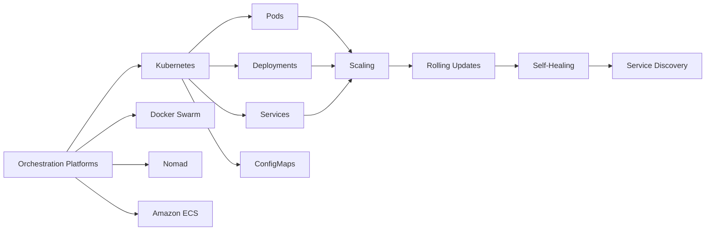
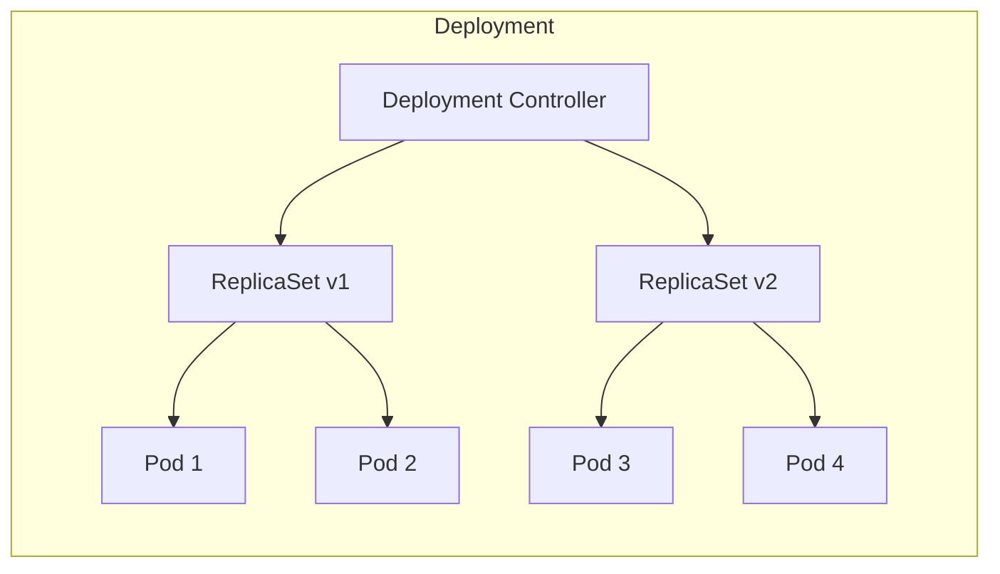
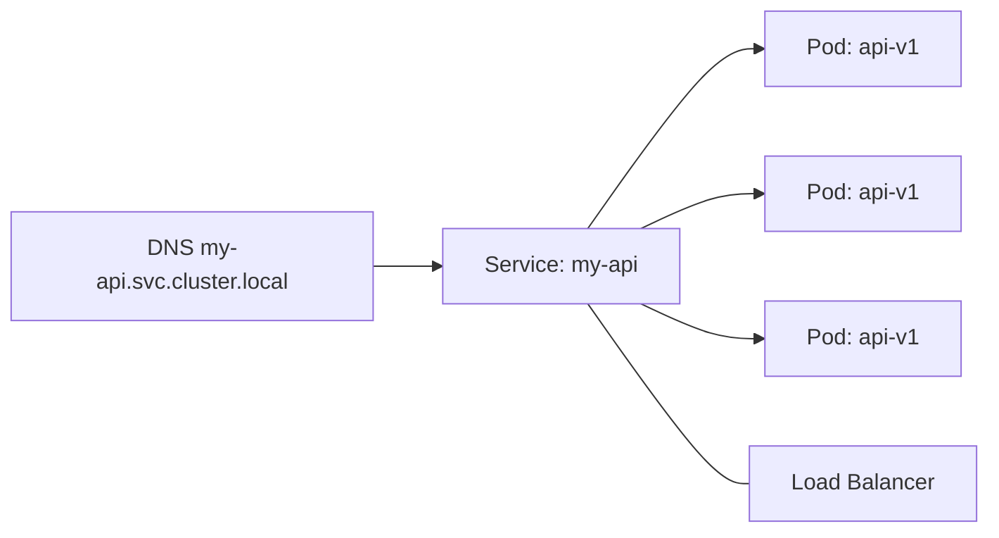
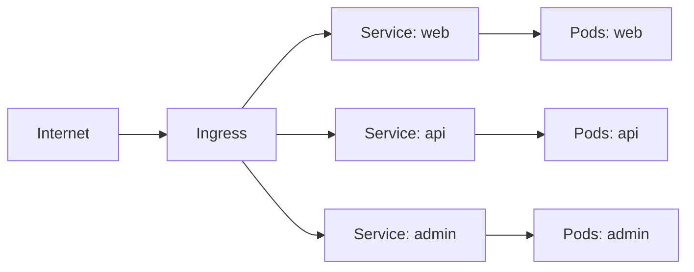
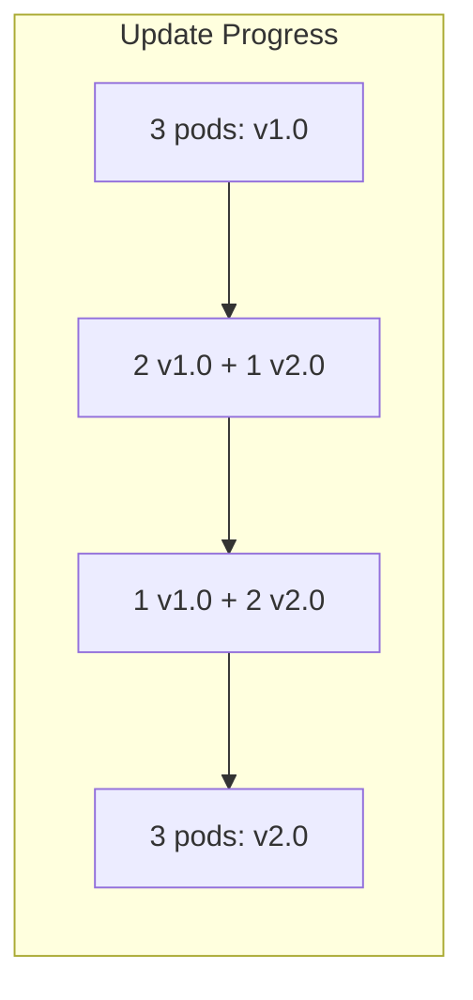
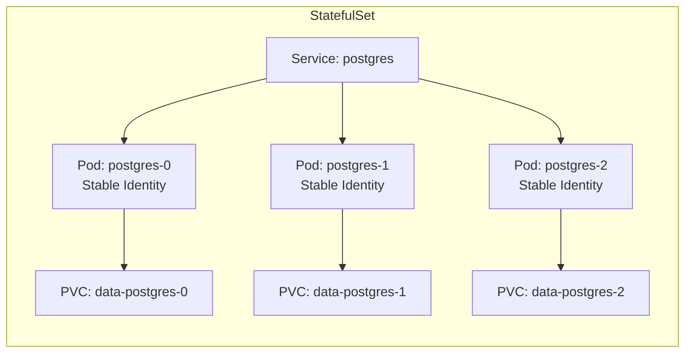
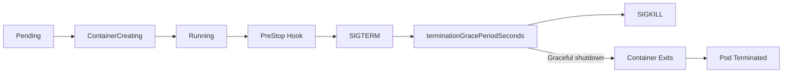

# Chapter 6: Orchestration

> **Prev:** [Docker Compose](./06-docker-compose.md)
> **Next:** [Infrastructure as Code](./07-infrastructure-as-code.md)

---

## Learning Objectives

- Understand the role and need for container orchestration in production.
- Differentiate between orchestration solutions: Docker Swarm, Kubernetes, Nomad, ECS.
- Understand orchestration primitives: deployment, service, scaling, rolling updates.
- Configure service discovery, load balancing, and scheduling.
- Implement self-healing, scaling, and rolling update strategies.
- Evaluate orchestration platforms for different use cases.

<!-- Image Gallery -->
<section class="lesson-visuals" aria-label="Visual learning resources">
  <header><span>VISUAL LEARNING</span><h2>See it. Review it. Remember it.</h2></header>
  <a class="lesson-visual-card" href="../../assets/images/lessons/devops/06-orchestration/handwritten-notes.png" target="_blank" rel="noopener">
    
    <span><strong>Handwritten notes</strong>Condensed notes for deliberate review.</span>
  </a>
  <a class="lesson-visual-card" href="../../assets/images/lessons/devops/06-orchestration/sticky-notes.png" target="_blank" rel="noopener">
    
    <span><strong>Sticky-note revision</strong>Fast recall prompts for revision.</span>
  </a>
  <a class="lesson-visual-card" href="../../assets/images/lessons/devops/06-orchestration/visual-explanation.png" target="_blank" rel="noopener">
    
    <span><strong>Visual concept guide</strong>A connected explanation of the key ideas.</span>
  </a>
</section>
<!-- End Image Gallery -->


---

## Chapter at a Glance

| Topic | Key Insight | Practical Takeaway |
|-------|-------------|-------------------|
| Why Orchestration | Manual container management doesn't scale | Orchestration automates placement, scaling, healing |
| Orchestration Primitives | Deployments, services, ingress | Building blocks for running applications at scale |
| Scheduling | Where to place containers | Scheduler considers resources, constraints, affinity |
| Service Discovery | How containers find each other | DNS-based or key-value store |
| Load Balancing | Distributing traffic | Internal (service mesh) and external (ingress) |
| Rolling Updates | Zero-downtime deployments | Configurable strategy: max surge, max unavailable |
| Self-Healing | Automatic recovery | Restart, reschedule, replace failed containers |
| Scaling | Adjusting replica count | Horizontal (more replicas) vs vertical (more resources) |

## Chapter Roadmap



## Theory

### Why Orchestration?


Running containers in production presents challenges that orchestration solves:

1. **Placement:** Where should each container run? Which host has enough resources?
2. **Scaling:** How to handle increased traffic? Automatically add/remove replicas.
3. **Health:** What happens when a container crashes? Automatically restart.
4. **Updates:** How to update without downtime? Rolling updates with health checks.
5. **Networking:** How do containers find each other across hosts? Service discovery.
6. **Configuration:** How to manage config across environments? Config maps, secrets.
7. **Storage:** How to persist data when containers move? Persistent volumes.

### Orchestration Platforms


**Kubernetes (K8s):**
- Industry standard for container orchestration
- Declarative configuration (YAML)
- Rich ecosystem: Helm, Istio, Prometheus, etc.
- Complex but extremely powerful
- Best for: large-scale, complex microservices

**Docker Swarm:**
- Built into Docker Engine
- Simpler than Kubernetes
- Native Docker CLI integration
- Best for: small to medium deployments, Docker-native teams

**HashiCorp Nomad:**
- Simple, lightweight scheduler
- Multi-platform (not just containers)
- Single binary deployment
- Best for: teams needing simplicity, multi-workload (containers + VMs + batch)

**Amazon ECS:**
- AWS-native container orchestration
- Tightly integrated with AWS services (ALB, IAM, VPC)
- Fargate provides serverless containers
- Best for: AWS-focused teams, simpler than K8s

### Orchestration Primitives


**Deployment:** Desired state for a set of identical pods. Defines replicas, strategy, health checks.



**Service:** Stable network endpoint for a set of pods. Load balances traffic across healthy pods.



**Ingress:** External HTTP/HTTPS routing to services. Handles TLS termination, path-based routing, virtual hosts.



### Scheduling


The scheduler decides which node runs each pod:

**Scheduling factors:**
- Resource requests (CPU, memory)
- Node affinity/anti-affinity
- Taints and tolerations
- Topology spread constraints
- Pod priority and preemption

```text
# Node selector: schedule on specific nodes
nodeSelector:
  disktype: ssd

# Affinity: schedule near API servers
podAntiAffinity:
  preferredDuringScheduling:
    - podAffinityTerm:
        labelSelector:
          matchLabels:
            app: cache
        topologyKey: kubernetes.io/hostname
```

### Rolling Updates


Strategy for updating pods without downtime:

```yaml
strategy:
  type: RollingUpdate
  rollingUpdate:
    maxSurge: 1          # Extra pods during update
    maxUnavailable: 0    # Keep all pods available
```



### Self-Healing


Orchestrators automatically maintain desired state:

- **Pod failure:** If a pod crashes, the controller creates a replacement
- **Node failure:** Pods on failed nodes are rescheduled to healthy nodes
- **Readiness probe:** If a pod fails readiness checks, it's removed from service load balancer
- **Liveness probe:** If a pod fails liveness checks, it's restarted

### Autoscaling


Horizontal Pod Autoscaler (HPA) scales replicas based on metrics:

```yaml
apiVersion: autoscaling/v2
kind: HorizontalPodAutoscaler
spec:
  scaleTargetRef:
    apiVersion: apps/v1
    kind: Deployment
    name: myapp
  minReplicas: 3
  maxReplicas: 20
  metrics:
    - type: Resource
      resource:
        name: cpu
        target:
          type: Utilization
          averageUtilization: 70
```

### Stateful Workloads in Orchestration


Not all applications are stateless — databases, caches, and message queues require stateful orchestration:

**StatefulSet (Kubernetes):**
- Each pod gets a stable, unique network identity (`pod-0`, `pod-1`)
- Persistent storage tied to pod identity (survives rescheduling)
- Ordered, graceful deployment and scaling

```yaml
apiVersion: apps/v1
kind: StatefulSet
metadata:
  name: postgres
spec:
  serviceName: postgres
  replicas: 3
  selector:
    matchLabels:
      app: postgres
  template:
    spec:
      containers:
        - name: postgres
          image: postgres:16
          volumeMounts:
            - name: data
              mountPath: /var/lib/postgresql/data
  volumeClaimTemplates:
    - metadata:
        name: data
      spec:
        accessModes: ["ReadWriteOnce"]
        resources:
          requests:
            storage: 100Gi
```

**Operator pattern:** Extends Kubernetes with application-specific operational knowledge.
- **Prometheus Operator:** Manages monitoring stack lifecycle
- **Kafka Operator:** Handles topic creation, partition reassignment, broker scaling
- **Postgres Operator:** Manages backups, replication, failover



### Advanced Scheduling


Fine-grained control over pod placement:

**Taints and Tolerations:** Nodes repel pods that don't tolerate the taint.
```yaml
# Taint a node for dedicated GPU workloads
kubectl taint nodes gpu-node gpu=true:NoSchedule

# Pod tolerates the taint
tolerations:
  - key: "gpu"
    operator: "Equal"
    value: "true"
    effect: "NoSchedule"
```

**Node Affinity:** Attract pods to specific nodes.
```yaml
affinity:
  nodeAffinity:
    requiredDuringSchedulingIgnoredDuringExecution:
      nodeSelectorTerms:
        - matchExpressions:
            - key: node.kubernetes.io/instance-type
              operator: In
              values:
                - c5.large
                - c5.xlarge
    preferredDuringSchedulingIgnoredDuringExecution:
      - weight: 100
        preference:
          matchExpressions:
            - key: topology.kubernetes.io/zone
              operator: In
              values:
                - us-east-1a
```

**Pod Topology Spread Constraints:** Distribute pods across failure domains:
```yaml
topologySpreadConstraints:
  - maxSkew: 1
    topologyKey: topology.kubernetes.io/zone
    whenUnsatisfiable: DoNotSchedule
    labelSelector:
      matchLabels:
        app: web
```

### Pod Lifecycle and Termination


Understanding pod lifecycle ensures graceful handling:


- **terminationGracePeriodSeconds** (default 30s): Time between SIGTERM and SIGKILL
- **PreStop hook:** Runs before SIGTERM — drain connections, flush buffers
- **PostStart hook:** Runs after container starts — register with service mesh

```yaml
lifecycle:
  preStop:
    exec:
      command: ["/bin/sh", "-c", "sleep 10 && node drain-connections.js"]
```

```typescript
// Simulate pod lifecycle with termination handling
interface PodLifecycleConfig {
  terminationGracePeriod: number;
  hasPreStopHook: boolean;
}

class PodLifecycleSimulator {
  async simulateShutdown(config: PodLifecycleConfig): Promise<void> {
    console.log('?? Pod shutdown initiated');

    if (config.hasPreStopHook) {
      console.log('  Running preStop hook...');
      await this.sleep(2000);
      console.log('  Connections drained');
    }

    console.log('  SIGTERM sent');
    const shutdownStart = Date.now();

    while (Date.now() - shutdownStart < config.terminationGracePeriod * 1000) {
      // Check active connections
      if (this.activeConnections === 0) {
        console.log('  All connections closed, exiting gracefully');
        return;
      }
      await this.sleep(1000);
    }

    // Grace period expired, force kill
    console.log(`  Grace period (${config.terminationGracePeriod}s) expired, SIGKILL sent`);
  }

  private activeConnections: number = 5;
  private async sleep(ms: number): Promise<void> {
    return new Promise(r => setTimeout(r, ms));
  }
}
```

### Service Discovery


**DNS-based (Kubernetes):**
- Each service gets a DNS name: `service-name.namespace.svc.cluster.local`
- Cluster DNS (CoreDNS) resolves names to service IPs
- Environment variables: `SERVICE_NAME_SERVICE_HOST`, `SERVICE_NAME_SERVICE_PORT`

**Key-value store (Swarm, Nomad):**
- Services register with consul/etcd
- Other services query the registry

### Load Balancing


**Internal load balancing:**
- ClusterIP service distributes traffic to pods (round-robin by default)
- Service mesh (Istio, Linkerd) provides advanced traffic management

**External load balancing:**
- LoadBalancer service provisions cloud LB
- Ingress controller (Nginx, Traefik, HAProxy) routes HTTP traffic
- NodePort exposes port on each node

---

## Examples

### Example 1: Orchestration Configuration Generator

```typescript
type Platform = 'kubernetes' | 'swarm' | 'nomad' | 'ecs';

interface AppConfig {
  name: string;
  image: string;
  replicas: number;
  port: number;
  cpu: string;
  memory: string;
  env: Record<string, string>;
}

class OrchestrationGenerator {
  generate(config: AppConfig, platform: Platform): string {
    switch (platform) {
      case 'kubernetes': return this.generateK8s(config);
      case 'swarm': return this.generateSwarm(config);
      case 'nomad': return this.generateNomad(config);
      case 'ecs': return this.generateECS(config);
    }
  }

  private generateK8s(config: AppConfig): string {
    return `apiVersion: apps/v1
kind: Deployment
metadata:
  name: ${config.name}
spec:
  replicas: ${config.replicas}
  selector:
    matchLabels:
      app: ${config.name}
  template:
    metadata:
      labels:
        app: ${config.name}
    spec:
      containers:
        - name: ${config.name}
          image: ${config.image}
          ports:
            - containerPort: ${config.port}
          resources:
            requests:
              cpu: ${config.cpu}
              memory: ${config.memory}
            limits:
              cpu: "${parseFloat(config.cpu) * 2}"
              memory: "${parseInt(config.memory) * 2}M"
          env:
${Object.entries(config.env).map(([k, v]) => `            - name: ${k}
              value: "${v}"`).join('\n')}
---
apiVersion: v1
kind: Service
metadata:
  name: ${config.name}
spec:
  selector:
    app: ${config.name}
  ports:
    - protocol: TCP
      port: ${config.port}
      targetPort: ${config.port}`;
  }

  private generateSwarm(config: AppConfig): string {
    return `version: '3.8'

services:
  ${config.name}:
    image: ${config.image}
    deploy:
      replicas: ${config.replicas}
      resources:
        limits:
          cpus: '${parseFloat(config.cpu) * 2}'
          memory: ${parseInt(config.memory) * 2}M
        reservations:
          cpus: '${config.cpu}'
          memory: ${config.memory}M
    ports:
      - "${config.port}:${config.port}"
    environment:
${Object.entries(config.env).map(([k, v]) => `      ${k}: ${v}`).join('\n')}`;
  }

  private generateNomad(config: AppConfig): string {
    return `job "${config.name}" {
  datacenters = ["dc1"]
  type = "service"

  group "${config.name}" {
    count = ${config.replicas}

    task "${config.name}" {
      driver = "docker"

      config {
        image = "${config.image}"
        ports = ["http"]
      }

      resources {
        cpu    = ${parseInt(config.cpu) * 1000}
        memory = ${parseInt(config.memory)}
      }

      env {
${Object.entries(config.env).map(([k, v]) => `        ${k} = "${v}"`).join('\n')}
      }
    }
  }
}`;
  }

  private generateECS(config: AppConfig): string {
    return `{
  "family": "${config.name}",
  "networkMode": "awsvpc",
  "containerDefinitions": [{
    "name": "${config.name}",
    "image": "${config.image}",
    "essential": true,
    "portMappings": [{
      "containerPort": ${config.port},
      "protocol": "tcp"
    }],
    "environment": [
${Object.entries(config.env).map(([k, v], i, a) => `      { "name": "${k}", "value": "${v}" }${i < a.length - 1 ? ',' : ''}`).join('\n')}
    ],
    "logConfiguration": {
      "logDriver": "awslogs",
      "options": {
        "awslogs-group": "/ecs/${config.name}",
        "awslogs-region": "us-east-1"
      }
    }
  }]
}`;
  }
}

const gen = new OrchestrationGenerator();
const config: AppConfig = {
  name: 'api-service', image: 'myapp:1.0.0', replicas: 3,
  port: 3000, cpu: '0.25', memory: '256',
  env: { NODE_ENV: 'production', DB_HOST: 'postgres.internal' },
};
console.log(gen.generate(config, 'kubernetes'));
```

### Example 2: Orchestration Simulator

```typescript
interface Node {
  name: string;
  cpu: number;
  memory: number;
  availableCpu: number;
  availableMemory: number;
  pods: Pod[];
  healthy: boolean;
}

interface Pod {
  name: string;
  cpu: number;
  memory: number;
  node: string;
  status: 'running' | 'pending' | 'failed' | 'terminated';
  restartCount: number;
}

class OrchestrationSimulator {
  private nodes: Map<string, Node> = new Map();
  private pendingPods: Pod[] = [];

  addNode(node: Node): void {
    this.nodes.set(node.name, node);
  }

  schedulePod(pod: Pod): void {
    const available = [...this.nodes.values()].filter(n =>
      n.healthy && n.availableCpu >= pod.cpu && n.availableMemory >= pod.memory
    );

    if (available.length === 0) {
      console.log(`??  No node available for pod ${pod.name}, queuing...`);
      this.pendingPods.push(pod);
      pod.status = 'pending';
      return;
    }

    // Simple bin-packing: schedule on node with most available resources
    const target = available.sort((a, b) =>
      (b.availableCpu + b.availableMemory) - (a.availableCpu + a.availableMemory)
    )[0];

    target.pods.push(pod);
    target.availableCpu -= pod.cpu;
    target.availableMemory -= pod.memory;
    pod.node = target.name;
    pod.status = 'running';
    console.log(`?? Scheduled ${pod.name} on ${target.name}`);
  }

  simulatePodFailure(podName: string): void {
    for (const node of this.nodes.values()) {
      const idx = node.pods.findIndex(p => p.name === podName);
      if (idx >= 0) {
        const pod = node.pods[idx];
        node.pods.splice(idx, 1);
        node.availableCpu += pod.cpu;
        node.availableMemory += pod.memory;
        pod.status = 'failed';
        console.log(`?? Pod ${podName} failed on ${node.name}`);

        // Self-healing: reschedule
        pod.status = 'terminated';
        const newPod = { ...pod, name: `${pod.name}-restart-${pod.restartCount + 1}`, restartCount: pod.restartCount + 1 };
        this.schedulePod(newPod);
        return;
      }
    }
  }

  simulateNodeFailure(nodeName: string): void {
    const node = this.nodes.get(nodeName);
    if (!node) return;

    node.healthy = false;
    console.log(`?? Node ${nodeName} failed`);

    // Reschedule all pods from failed node
    const podsToReschedule = [...node.pods];
    node.pods = [];
    node.availableCpu = 0;
    node.availableMemory = 0;

    for (const pod of podsToReschedule) {
      pod.status = 'terminated';
      const newPod = { ...pod, name: `${pod.name}-rescheduled`, restartCount: pod.restartCount };
      this.schedulePod(newPod);
    }
  }

  simulateScaleUp(podConfig: Omit<Pod, 'name'>, count: number): void {
    for (let i = 0; i < count; i++) {
      const pod: Pod = {
        ...podConfig,
        name: `scaled-pod-${i}`,
        restartCount: 0,
      };
      this.schedulePod(pod);
    }
  }

  getStatus(): void {
    console.log('\n=== Cluster Status ===\n');
    for (const node of this.nodes.values()) {
      console.log(`Node: ${node.name} (${node.healthy ? '?' : '?'})`);
      console.log(`  CPU: ${node.availableCpu}/${node.cpu}`);
      console.log(`  Memory: ${node.availableMemory}/${node.memory}`);
      console.log(`  Pods: ${node.pods.map(p => `${p.name}(${p.status})`).join(', ') || 'none'}`);
      console.log('');
    }
    if (this.pendingPods.length > 0) {
      console.log(`??  Pending pods: ${this.pendingPods.length}`);
    }
  }
}

const sim = new OrchestrationSimulator();
sim.addNode({ name: 'node-1', cpu: 4, memory: 8192, availableCpu: 4, availableMemory: 8192, pods: [], healthy: true });
sim.addNode({ name: 'node-2', cpu: 4, memory: 8192, availableCpu: 4, availableMemory: 8192, pods: [], healthy: true });
sim.addNode({ name: 'node-3', cpu: 2, memory: 4096, availableCpu: 2, availableMemory: 4096, pods: [], healthy: true });

sim.schedulePod({ name: 'web-1', cpu: 0.5, memory: 256, node: '', status: 'running', restartCount: 0 });
sim.schedulePod({ name: 'web-2', cpu: 0.5, memory: 256, node: '', status: 'running', restartCount: 0 });
sim.schedulePod({ name: 'api-1', cpu: 1, memory: 512, node: '', status: 'running', restartCount: 0 });

sim.simulateNodeFailure('node-3');
sim.simulatePodFailure('web-1');
sim.simulateScaleUp({ cpu: 0.5, memory: 256, node: '', status: 'running', restartCount: 0 }, 3);

sim.getStatus();
```

---

### Multi-Cloud Orchestrator Comparator

Choosing the right orchestration platform depends on team maturity, scale, and cloud strategy. The following tool compares orchestration platforms across multiple dimensions and recommends the best fit.

```typescript
// orchestrator-comparator.ts
// Compare container orchestration platforms

interface PlatformFeature {
  name: string;
  kubernetes: boolean | string;
  swarm: boolean | string;
  nomad: boolean | string;
  ecs: boolean | string;
}

interface PlatformCost {
  platform: string;
  controlPlane: string;
  workerPricing: string;
  hiddenCosts: string[];
  estimatedMonthly100Nodes: number;
}

interface ComparisonDimension {
  category: string;
  features: PlatformFeature[];
}

interface Recommendation {
  platform: string;
  score: number;
  strengths: string[];
  weaknesses: string[];
  bestFor: string;
}

class OrchestratorComparator {
  private readonly dimensions: ComparisonDimension[] = [
    {
      category: 'Deployment', features: [
        { name: 'Rolling updates', kubernetes: '?', swarm: '?', nomad: '?', ecs: '?' },
        { name: 'Blue-green deploy', kubernetes: '?', swarm: '?? Manual', nomad: '?? Manual', ecs: '?' },
        { name: 'Canary releases', kubernetes: '?', swarm: '?', nomad: '?? Manual', ecs: '?' },
        { name: 'Batch jobs', kubernetes: '?', swarm: '?', nomad: '?', ecs: '?' },
      ],
    },
    {
      category: 'Networking', features: [
        { name: 'Service discovery', kubernetes: '? DNS', swarm: '? DNS', nomad: '? Consul', ecs: '? Cloud Map' },
        { name: 'Ingress/LB', kubernetes: '?', swarm: '?? Basic', nomad: '?? Fabio', ecs: '? ALB/NLB' },
        { name: 'Network policies', kubernetes: '?', swarm: '?', nomad: '??', ecs: '? SG' },
        { name: 'Service mesh', kubernetes: '? Istio/Linkerd', swarm: '?', nomad: '? Consul', ecs: '? App Mesh' },
      ],
    },
    {
      category: 'Operations', features: [
        { name: 'Self-healing', kubernetes: '?', swarm: '?', nomad: '?', ecs: '?' },
        { name: 'Auto-scaling', kubernetes: '? HPA', swarm: '?', nomad: '??', ecs: '?' },
        { name: 'Multi-AZ', kubernetes: '?', swarm: '?', nomad: '?', ecs: '?' },
        { name: 'Audit logging', kubernetes: '?', swarm: '??', nomad: '?', ecs: '?' },
      ],
    },
    {
      category: 'Ecosystem', features: [
        { name: 'Community size', kubernetes: 'Largest', swarm: 'Declining', nomad: 'Growing', ecs: 'Large (AWS)' },
        { name: 'Cloud native', kubernetes: '? CNCF', swarm: '?', nomad: '? CNCF', ecs: '?' },
        { name: 'Learning curve', kubernetes: 'Steep', swarm: 'Gentle', nomad: 'Moderate', ecs: 'Moderate' },
        { name: 'Helm charts', kubernetes: '?', swarm: '?', nomad: '?', ecs: '?' },
      ],
    },
  ];

  private readonly costModel: PlatformCost[] = [
    { platform: 'Kubernetes', controlPlane: 'Free (self-hosted) or $0.10/hr (EKS)', workerPricing: 'Standard compute', hiddenCosts: ['etcd maintenance', 'Ingress controller', 'Monitoring stack'], estimatedMonthly100Nodes: 8500 },
    { platform: 'Swarm', controlPlane: 'Free', workerPricing: 'Standard compute', hiddenCosts: ['Limited ecosystem tooling'], estimatedMonthly100Nodes: 7200 },
    { platform: 'Nomad', controlPlane: 'Free', workerPricing: 'Standard compute', hiddenCosts: ['Consul for service discovery', 'Vault for secrets'], estimatedMonthly100Nodes: 7800 },
    { platform: 'ECS', controlPlane: 'Fargate $0.01/task/hr', workerPricing: 'EC2 or Fargate', hiddenCosts: ['CloudWatch Logs', 'ALB'], estimatedMonthly100Nodes: 9900 },
  ];

  score(options: { kubernetes: number; swarm: number; nomad: number; ecs: number }): Recommendation[] {
    const scores = [
      { platform: 'Kubernetes', score: options.kubernetes, strengths: ['Largest ecosystem', 'Most features', 'Portable'], weaknesses: ['Complexity', 'Learning curve'], bestFor: 'Complex microservices, enterprise' },
      { platform: 'Swarm', score: options.swarm, strengths: ['Simple', 'Docker native', 'Fast setup'], weaknesses: ['Limited features', 'Declining community'], bestFor: 'Small teams, simple apps' },
      { platform: 'Nomad', score: options.nomad, strengths: ['Simple', 'Multi-workload', 'HashiCorp stack'], weaknesses: ['Smaller ecosystem', 'Fewer features'], bestFor: 'Mixed workloads, batch processing' },
      { platform: 'ECS', score: options.ecs, strengths: ['AWS native', 'No control plane', 'Fargate'], weaknesses: ['Vendor lock-in', 'Limited flexibility'], bestFor: 'AWS-only shops, Fargate' },
    ];

    return scores.sort((a, b) => b.score - a.score);
  }

  generateComparisonTable(): string {
    let output = '## Orchestration Platform Comparison\n\n';
    for (const dim of this.dimensions) {
      output += `### ${dim.category}\n\n| Feature | Kubernetes | Swarm | Nomad | ECS |\n|---------|------------|-------|-------|-----|\n`;
      output += dim.features.map(f =>
        `| ${f.name} | ${f.kubernetes} | ${f.swarm} | ${f.nomad} | ${f.ecs} |`
      ).join('\n');
      output += '\n\n';
    }
    output += '### Cost Comparison (100 nodes)\n\n| Platform | Monthly Est. |\n|----------|-------------|\n';
    output += this.costModel.map(c => `| ${c.platform} | $${c.estimatedMonthly100Nodes.toLocaleString()} |`).join('\n');
    return output;
  }
}

const comparator = new OrchestratorComparator();
console.log(comparator.generateComparisonTable());

const ranked = comparator.score({ kubernetes: 4, swarm: 2, nomad: 3, ecs: 3 });
console.log('\n## Recommendation\n', ranked[0].platform, '-', ranked[0].bestFor);
```

**What this demonstrates:** Systematic orchestrator comparison across deployment, networking, operations, ecosystem, and cost dimensions enables data-driven platform selection aligned with team capabilities and requirements.

---

## Practical Takeaways

1. **Start with simple orchestration.** Docker Swarm or ECS for small teams; Kubernetes for complex needs.
2. **Always define resource requests and limits.** Unbounded containers destabilize the cluster.
3. **Implement health checks.** Liveness and readiness probes enable self-healing.
4. **Use rolling updates with health gates.** Never update all replicas at once.
5. **Design for rescheduling.** Assume any pod can be terminated at any time.
6. **Enable autoscaling.** Start with CPU-based, then add custom metrics.

---

## Chapter Quiz

<details><summary>Question 1: What is the primary purpose of container orchestration?</summary>**A)** Building container images<br>**B)** Automating deployment, scaling, and management of containers<br>**C)** Storing container images<br>**D)** Writing Dockerfiles<br><br>**Answer: B)** Automating deployment, scaling, and management of containers&lt;/details&gt;

<details><summary>Question 2: Which orchestration platform is the industry standard for complex microservices?</summary>**A)** Docker Swarm<br>**B)** Kubernetes<br>**C)** Nomad<br>**D)** ECS<br><br>**Answer: B)** Kubernetes&lt;/details&gt;

<details><summary>Question 3: What does a liveness probe do?</summary>**A)** Checks if the application is ready to serve traffic<br>**B)** Checks if the container is still alive and restarts it if not<br>**C)** Checks disk space<br>**D)** Checks network connectivity<br><br>**Answer: B)** Checks if the container is still alive and restarts it if not&lt;/details&gt;

<details><summary>Question 4: What is the purpose of `maxSurge` in a rolling update?</summary>**A)** Maximum number of pods that can be unavailable<br>**B)** Maximum number of extra pods during update<br>**C)** Maximum number of updates per second<br>**D)** Maximum time for the update<br><br>**Answer: B)** Maximum number of extra pods during update&lt;/details&gt;

<details><summary>Question 5: How do pods typically discover service endpoints?</summary>**A)** Hardcoded IPs<br>**B)** DNS-based service discovery<br>**C)** Manual configuration<br>**D)** Broadcast messages<br><br>**Answer: B)** DNS-based service discovery&lt;/details&gt;

---


// docker compose
// cicd-infrastructure-automation implementation

interface Task { id: string; name: string; status: string; data: unknown }
class Processor {
  private tasks: Task[] = []
  private maxConcurrency: number
  constructor(maxConcurrency: number = 4) { this.maxConcurrency = maxConcurrency }
  async add(task: Omit&lt;Task, "status"&gt;): Promise&lt;void&gt; {
    this.tasks.push({ ...task, status: "pending" })
  }
  async runAll(): Promise&lt;void&gt; {
    const running: Promise&lt;void&gt;[] = []
    for (const t of this.tasks) {
      if (running.length >= this.maxConcurrency) { await Promise.race(running) }
      const p = this.execute(t).finally(() => { const i = running.indexOf(p); if (i >= 0) running.splice(i, 1) })
      running.push(p)
    }
    await Promise.all(running)
  }
  private async execute(t: Task): Promise&lt;void&gt; {
    t.status = "running"
    await new Promise(r => setTimeout(r, 10))
    t.status = "done"
  }
  getResults(): Task[] { return this.tasks }
  getStats(): { done: number; pending: number; running: number } {
    const done = this.tasks.filter(t => t.status === "done").length
    const pending = this.tasks.filter(t => t.status === "pending").length
    const running = this.tasks.filter(t => t.status === "running").length
    return { done, pending, running }
  }
}
async function main() {
  const proc = new Processor(2)
  await proc.add({ id: '1', name: 'docker compose', data: { topic: 'cicd-infrastructure-automation' } })
  await proc.runAll()
  console.log('Stats:', proc.getStats())
}
main().catch(console.error)
export { Processor, Task }
## Summary

- Container orchestration automates deployment, scaling, networking, and management of containerized applications.
- Kubernetes is the industry standard; Docker Swarm, Nomad, and ECS are alternatives for simpler use cases.
- Orchestration primitives include deployments (replica management), services (networking), and ingress (external access).
- Schedulers place containers on nodes based on resource requirements, constraints, and policies.
- Self-healing automatically restarts failed pods and reschedules them on healthy nodes.
- Rolling updates enable zero-downtime deployments with configurable surge and unavailable counts.
- Autoscaling adjusts replica counts based on CPU, memory, or custom metrics.
- Service discovery via DNS or key-value stores enables inter-service communication.

---

## Exercises

### Review Questions
1. What problems does container orchestration solve?
2. Compare Kubernetes, Docker Swarm, and Nomad in terms of complexity and use cases.
3. What is the difference between a liveness probe and a readiness probe?
4. How does a rolling update strategy prevent downtime?
5. How does an orchestrator handle a node failure?

### Application Problems
1. Design a Kubernetes deployment with rolling update strategy, health checks, and resource limits.
2. Compare three orchestration platforms for a team of 5 deploying 10 microservices.
3. Implement an autoscaling strategy based on CPU utilization.
4. Create a service discovery and load balancing design for a multi-service application.
5. Extend the `OrchestrationSimulator` class to support: **StatefulSet** behavior (pods with stable identity — rescheduled pods retain their name), **pod topology spread constraints** (ensure pods are distributed across at least 3 nodes with a max skew of 1), and **graceful termination** (pods run a preStop hook that drains connections in 5s before SIGKILL at 30s).
6. Implement a `SchedulingPolicyEngine` that accepts pod requirements and node labels then returns the optimal node assignment. Support the following constraint types: `requiredNodeAffinity` (pod must run on matching nodes), `preferredNodeAffinity` (weighted preference for node attributes), `podAntiAffinity` (prevent same-app pods on same node), and `toleration` (pod tolerates tainted nodes). Use the engine to schedule 6 web pods across a 3-node cluster where each node has a different zone label.

### Challenge Problem
1. Design a complete orchestration strategy for a 12-service microservices platform. Include: platform selection with justification (Kubernetes vs Swarm vs Nomad), deployment configuration with health checks, resource limits, and rolling updates, service discovery and ingress architecture, autoscaling policy (CPU, memory, custom metrics), disaster recovery (multi-AZ, pod anti-affinity, PDB), a strategy document comparing the chosen platform against alternatives with cost, complexity, and capability analysis.
