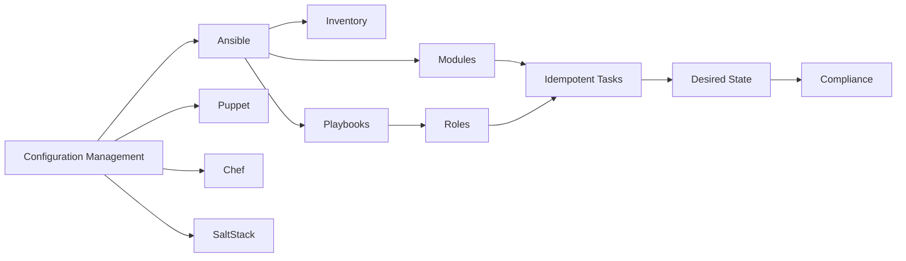
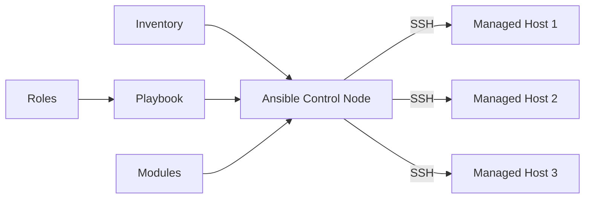

# Chapter 8: Configuration Management

> **Prev:** [Kubernetes](./07-kubernetes.md)
> **Next:** [Kubernetes Advanced](./08-k8s-advanced.md)

---

## Learning Objectives

- Understand the purpose and principles of configuration management in DevOps.
- Differentiate between configuration management tools: Ansible, Puppet, Chef, SaltStack.
- Master Ansible for automation, configuration, and orchestration.
- Implement idempotent configuration management.
- Manage secrets and sensitive data in configuration tools.
- Apply infrastructure compliance and auditing through configuration management.

<!-- Image Gallery -->
<section class="lesson-visuals" aria-label="Visual learning resources">
  <header><span>VISUAL LEARNING</span><h2>See it. Review it. Remember it.</h2></header>
  <a class="lesson-visual-card" href="../../assets/images/lessons/devops/08-configuration-management/handwritten-notes.png" target="_blank" rel="noopener">
    
    <span><strong>Handwritten notes</strong>Condensed notes for deliberate review.</span>
  </a>
  <a class="lesson-visual-card" href="../../assets/images/lessons/devops/08-configuration-management/sticky-notes.png" target="_blank" rel="noopener">
    
    <span><strong>Sticky-note revision</strong>Fast recall prompts for revision.</span>
  </a>
  <a class="lesson-visual-card" href="../../assets/images/lessons/devops/08-configuration-management/visual-explanation.png" target="_blank" rel="noopener">
    
    <span><strong>Visual concept guide</strong>A connected explanation of the key ideas.</span>
  </a>
</section>
<!-- End Image Gallery -->


---

## Chapter at a Glance

| Topic | Key Insight | Practical Takeaway |
|-------|-------------|-------------------|
| CM Principles | Desired state, idempotency | Tools converge systems to defined state |
| Ansible | Agentless, SSH-based | Push-based, YAML playbooks, easy to start |
| Puppet | Agent-master, declarative | Ruby DSL, pull-based, mature ecosystem |
| Chef | Agent-master, procedural | Ruby DSL, cookbooks, strong community |
| Idempotency | Run multiple times, same result | Core principle of configuration management |
| Roles and Playbooks | Organized automation | Structure playbooks as reusable roles |
| Jinja2 Templates | Dynamic configuration files | Template configs with variables |
| Secrets Management | Vault integration | Never store secrets in playbooks |

## Chapter Roadmap



## Theory

### What is Configuration Management?


Configuration management (CM) is the practice of systematically managing and maintaining the state of systems and software in a consistent, desired state. In DevOps, CM ensures that servers, applications, and infrastructure are configured consistently across environments.

**Benefits:**
- **Consistency:** Every server is configured identically
- **Automation:** Eliminate manual server configuration
- **Scalability:** Provision hundreds of servers identically
- **Auditability:** Know exactly what is configured and where
- **Recovery:** Quickly rebuild servers to known good state
- **Version control:** Configuration changes are tracked

### Idempotency


Idempotency is the property that a configuration management operation can be applied multiple times with the same result. If the system is already in the desired state, no changes are made.

```yaml
# Idempotent: only installs if not already installed
- name: Ensure nginx is installed
  apt:
    name: nginx
    state: present

# Idempotent: only restarts if config changed
- name: Copy nginx configuration
  template:
    src: nginx.conf.j2
    dest: /etc/nginx/nginx.conf
  notify: restart nginx
```

### Ansible Architecture


Ansible is agentless — it connects via SSH (or WinRM for Windows) and pushes modules to execute:



**Key components:**
- **Control Node:** Where Ansible is installed and playbooks are executed
- **Managed Nodes:** Target systems configured by Ansible
- **Inventory:** List of managed nodes and their groups
- **Modules:** Reusable, standalone scripts (package, service, copy, template, etc.)
- **Playbooks:** YAML files defining automation sequences
- **Roles:** Organizational units for playbooks, variables, and handlers

### Ansible Playbook Structure


```yaml
---
- name: Configure web server
  hosts: webservers
  become: yes
  vars:
    http_port: 80
    server_name: example.com

  tasks:
    - name: Install nginx
      apt:
        name: nginx
        state: present
        update_cache: yes

    - name: Copy nginx config
      template:
        src: nginx.conf.j2
        dest: /etc/nginx/sites-available/default
      notify: restart nginx

    - name: Enable site
      file:
        src: /etc/nginx/sites-available/default
        dest: /etc/nginx/sites-enabled/default
        state: link

  handlers:
    - name: restart nginx
      service:
        name: nginx
        state: restarted
```

### Ansible Roles


Roles organize playbooks, variables, files, templates, and handlers into reusable units:

```text
roles/
+-- common/
¦   +-- tasks/main.yml
¦   +-- handlers/main.yml
¦   +-- templates/
¦   +-- files/
¦   +-- vars/main.yml
¦   +-- defaults/main.yml
+-- nginx/
¦   +-- tasks/main.yml
¦   +-- templates/nginx.conf.j2
¦   +-- vars/main.yml
¦   +-- meta/main.yml
+-- app/
    +-- tasks/main.yml
    +-- templates/app.env.j2
    +-- defaults/main.yml
```

### Comparison of CM Tools


| Tool | Architecture | Language | Push/Pull | Learning Curve |
|------|-------------|----------|-----------|---------------|
| Ansible | Agentless (SSH) | YAML + Python | Push | Low |
| Puppet | Agent-Master | Ruby DSL | Pull | Medium |
| Chef | Agent-Master | Ruby DSL | Pull | High |
| SaltStack | Agent-Master | YAML + Python | Both | Medium |

### Ansible Modules for DevOps


**Package management:**
```yaml
- apt: name=nginx state=present update_cache=yes
- yum: name=httpd state=latest
- pip: name=requests version=2.28.0
- npm: name=express path=/app
```

**Service management:**
```yaml
- service: name=nginx state=started enabled=yes
- systemd: name=myapp state=restarted daemon_reload=yes
```

**File operations:**
```yaml
- copy: src=file.conf dest=/etc/app/ owner=root mode=0644
- template: src=config.j2 dest=/etc/app/config.json
- file: path=/app state=directory mode=0755
- lineinfile: path=/etc/hosts line="127.0.0.1 myapp.local"
```

**User management:**
```yaml
- user: name=deploy group=sudo shell=/bin/bash
- authorized_key: user=deploy key="{{ lookup('file', 'keys/deploy.pub') }}"
```

**Repository management:**
```yaml
- git: repo=https://github.com/org/app.git dest=/opt/app version=v1.0
```

### Jinja2 Templating


Ansible uses Jinja2 for dynamic configuration files:

```jinja
# templates/nginx.conf.j2
server {
    listen {{ http_port }};
    server_name {{ server_name }};

    location / {
        proxy_pass http://localhost:{{ app_port }};
        proxy_set_header Host $host;
    }

    location /health {
        return 200 "OK";
    }
}
```

### Ansible Vault for Secrets


```text
# Create encrypted file
ansible-vault create secrets.yml

# Edit encrypted file
ansible-vault edit secrets.yml

# Run playbook with vault
ansible-playbook site.yml --ask-vault-pass

# Use vault password file
ansible-playbook site.yml --vault-password-file .vault_pass
```

### Infrastructure Compliance


Configuration management enables continuous compliance:

```yaml
- name: Security compliance checks
  hosts: all
  tasks:
    - name: Check SSH config
      lineinfile:
        path: /etc/ssh/sshd_config
        regexp: '^PermitRootLogin'
        line: 'PermitRootLogin no'
      check_mode: yes

    - name: Verify firewall is active
      service:
        name: ufw
        state: started
        enabled: yes
```

### Ansible Modules for Containers and Orchestration


Ansible extends into container management and orchestration:

```yaml
# Docker container management
- name: Manage Docker containers
  docker_container:
    name: myapp
    image: "myapp:{{ version }}"
    state: started
    restart_policy: always
    ports:
      - "3000:3000"
    env:
      NODE_ENV: "{{ env }}"
    networks:
      - name: appnet

# Docker Compose management
- name: Deploy with Docker Compose
  community.docker.docker_compose:
    project_src: /opt/app
    files:
      - docker-compose.prod.yml
    state: present
    restarted: yes
```

```yaml
# Kubernetes management with Ansible
- name: Create ConfigMap from env file
  kubernetes.core.k8s:
    state: present
    definition:
      apiVersion: v1
      kind: ConfigMap
      metadata:
        name: app-config
        namespace: "{{ namespace }}"
      data:
        NODE_ENV: "{{ env }}"
        LOG_LEVEL: "{{ log_level }}"

- name: Rolling update deployment
  kubernetes.core.k8s_rolling_update:
    api_version: apps/v1
    kind: Deployment
    name: myapp
    namespace: "{{ namespace }}"
    wait: yes
    wait_timeout: 300
```

### Ansible Performance Optimization


Optimizing Ansible for large-scale deployments (500+ nodes):

| Technique | Description | Impact |
|-----------|-------------|--------|
| **SSH pipelining** | Reduce SSH connections by pipelining module execution | 2-3x speedup |
| **ControlPersist** | Reuse SSH connections across tasks | Significant for multi-task plays |
| **Facts caching** | Cache gathered facts in Redis or JSON file | Avoids regathering on every run |
| **Async polling** | Run long tasks asynchronously | Prevents timeout failures |
| **Strategy plugins** | `free` strategy vs default `linear` | Free continues on failures |
| **Mitogen** | Dramatically faster connection layer | Up to 7x speedup |

```ini
# ansible.cfg performance settings
[ssh_connection]
pipelining = True
control_path = /tmp/ansible-%%h-%%r
ssh_args = -o ControlMaster=auto -o ControlPersist=60s

[defaults]
gathering = smart
fact_caching = jsonfile
fact_caching_connection = /tmp/ansible_facts
fact_caching_timeout = 3600
strategy = free
```

### Ansible in CI/CD


```yaml
# .github/workflows/config-mgmt.yml
jobs:
  deploy-config:
    runs-on: ubuntu-latest
    steps:
      - uses: actions/checkout@v4
      - name: Run Ansible playbook
        uses: dawidd6/action-ansible-playbook@v2
        with:
          playbook: site.yml
          directory: ./ansible
          key: ${{ secrets.SSH_PRIVATE_KEY }}
          inventory: |
            [web]
            web1.example.com
            web2.example.com
```

---

## Examples

### Example 1: Ansible Playbook Generator

```typescript
interface AnsibleTask {
  name: string;
  module: string;
  moduleArgs: Record<string, any>;
}

interface AnsiblePlay {
  name: string;
  hosts: string;
  become: boolean;
  vars: Record<string, any>;
  tasks: AnsibleTask[];
  handlers?: AnsibleTask[];
}

class AnsiblePlaybookGenerator {
  generate(play: AnsiblePlay): string {
    let yaml = `---\n`;
    yaml += `- name: ${play.name}\n`;
    yaml += `  hosts: ${play.hosts}\n`;
    yaml += `  become: ${play.become}\n\n`;

    if (Object.keys(play.vars).length > 0) {
      yaml += `  vars:\n`;
      for (const [key, value] of Object.entries(play.vars)) {
        yaml += `    ${key}: ${value}\n`;
      }
      yaml += '\n';
    }

    yaml += `  tasks:\n`;
    for (const task of play.tasks) {
      yaml += this.generateTask(task, '    ');
    }

    if (play.handlers && play.handlers.length > 0) {
      yaml += `\n  handlers:\n`;
      for (const handler of play.handlers) {
        yaml += this.generateTask(handler, '    ');
      }
    }

    return yaml;
  }

  private generateTask(task: AnsibleTask, indent: string): string {
    let yaml = `${indent}- name: ${task.name}\n`;
    yaml += `${indent}  ${task.module}:\n`;

    for (const [key, value] of Object.entries(task.moduleArgs)) {
      if (typeof value === 'string') {
        yaml += `${indent}    ${key}: "${value}"\n`;
      } else if (typeof value === 'boolean') {
        yaml += `${indent}    ${key}: ${value ? 'yes' : 'no'}\n`;
      } else {
        yaml += `${indent}    ${key}: ${value}\n`;
      }
    }

    return yaml;
  }
}

const gen = new AnsiblePlaybookGenerator();
const playbook = gen.generate({
  name: 'Configure web application',
  hosts: 'webservers',
  become: true,
  vars: { app_port: 3000, node_env: 'production' },
  tasks: [
    { name: 'Install Node.js', module: 'apt', moduleArgs: { name: 'nodejs', state: 'present', update_cache: true } },
    { name: 'Create app directory', module: 'file', moduleArgs: { path: '/opt/app', state: 'directory', mode: '0755' } },
    { name: 'Copy app files', module: 'synchronize', moduleArgs: { src: './dist/', dest: '/opt/app/' } },
    { name: 'Copy env file', module: 'template', moduleArgs: { src: 'app.env.j2', dest: '/opt/app/.env' } },
    { name: 'Install app service', module: 'copy', moduleArgs: { src: 'myapp.service', dest: '/etc/systemd/system/' } },
    { name: 'Start app service', module: 'systemd', moduleArgs: { name: 'myapp', state: 'started', enabled: true, daemon_reload: true } },
  ],
  handlers: [
    { name: 'restart app', module: 'systemd', moduleArgs: { name: 'myapp', state: 'restarted' } },
  ],
});
console.log(playbook);
```

### Example 2: Configuration Drift Detector

```typescript
interface ExpectedConfig {
  path: string;
  expectedContent: string;
  expectedMode: string;
  expectedOwner: string;
}

interface ActualConfig {
  path: string;
  content: string;
  mode: string;
  owner: string;
  exists: boolean;
}

interface DriftReport {
  compliant: boolean;
  drifts: Array<{
    path: string;
    type: 'missing' | 'content' | 'permission' | 'owner';
    expected: string;
    actual: string;
  }>;
}

class DriftDetector {
  detect(expected: ExpectedConfig[], actual: ActualConfig[]): DriftReport {
    const drifts: DriftReport['drifts'] = [];
    const actualMap = new Map(actual.map(a => [a.path, a]));

    for (const exp of expected) {
      const act = actualMap.get(exp.path);

      if (!act || !act.exists) {
        drifts.push({ path: exp.path, type: 'missing', expected: 'file exists', actual: 'not found' });
        continue;
      }

      if (act.content !== exp.expectedContent) {
        drifts.push({ path: exp.path, type: 'content', expected: exp.expectedContent, actual: act.content });
      }

      if (act.mode !== exp.expectedMode) {
        drifts.push({ path: exp.path, type: 'permission', expected: exp.expectedMode, actual: act.mode });
      }

      if (act.owner !== exp.expectedOwner) {
        drifts.push({ path: exp.path, type: 'owner', expected: exp.expectedOwner, actual: act.owner });
      }
    }

    return { compliant: drifts.length === 0, drifts };
  }

  generateReport(report: DriftReport): string {
    let output = '# Configuration Drift Report\n\n';

    if (report.compliant) {
      output += '? All systems are compliant — no drift detected.\n';
      return output;
    }

    output += `? ${report.drifts.length} drift(s) detected\n\n`;

    for (const drift of report.drifts) {
      const icon = drift.type === 'missing' ? '??' :
                   drift.type === 'content' ? '??' : '?';
      output += `${icon} ${drift.path}\n`;
      output += `   Type: ${drift.type}\n`;
      output += `   Expected: ${drift.expected}\n`;
      output += `   Actual:   ${drift.actual}\n\n`;
    }

    return output;
  }
}

const expected: ExpectedConfig[] = [
  { path: '/etc/nginx/nginx.conf', expectedContent: 'server { listen 80; }', expectedMode: '0644', expectedOwner: 'root:root' },
  { path: '/opt/app/.env', expectedContent: 'NODE_ENV=production\nPORT=3000', expectedMode: '0600', expectedOwner: 'appuser:appuser' },
];

const actual: ActualConfig[] = [
  { path: '/etc/nginx/nginx.conf', content: 'server { listen 443 ssl; }', mode: '0644', owner: 'root:root', exists: true },
  { path: '/opt/app/.env', content: 'NODE_ENV=production\nPORT=3000', mode: '0644', owner: 'root:root', exists: true },
];

const detector = new DriftDetector();
const report = detector.detect(expected, actual);
console.log(detector.generateReport(report));
```

---

### Ansible Playbook Validator

Validating Ansible playbooks before execution prevents syntax errors, idempotency violations, and security misconfigurations. The following tool performs static analysis on playbook structures.

```typescript
interface AnsibleTask {
  name: string;
  module: string;
  args: Record<string, unknown>;
  register?: string;
  when?: string;
  notify?: string[];
}

interface AnsiblePlay {
  name: string;
  hosts: string;
  become: boolean;
  tasks: AnsibleTask[];
  handlers?: AnsibleTask[];
  vars?: Record<string, unknown>;
}

interface ValidationResult {
  valid: boolean;
  errors: string[];
  warnings: string[];
}

class PlaybookValidator {
  private dangerousModules = ['shell', 'command', 'raw', 'script'];
  private idempotentModules = ['copy', 'template', 'service', 'file', 'user', 'package', 'lineinfile', 'replace', 'systemd'];

  validate(plays: AnsiblePlay[]): ValidationResult {
    const errors: string[] = [];
    const warnings: string[] = [];

    for (const play of plays) {
      if (!play.hosts || play.hosts === 'all') {
        warnings.push(`Play "${play.name}": Consider restricting hosts from 'all' for safety`);
      }

      for (let i = 0; i < play.tasks.length; i++) {
        const task = play.tasks[i];
        if (!task.name) errors.push(`Task at index ${i} is missing a name`);
        if (this.dangerousModules.includes(task.module)) {
          warnings.push(`Task "${task.name}": Using ${task.module} module is not idempotent`);
        }
      }

      for (const h of play.handlers || []) {
        if (!this.idempotentModules.includes(h.module)) {
          warnings.push(`Handler "${h.name}": ${h.module} may not be idempotent`);
        }
      }
    }

    return { valid: errors.length === 0, errors, warnings };
  }
}

const validator = new PlaybookValidator();
const result = validator.validate([
  {
    name: 'Deploy web application',
    hosts: 'web-servers',
    become: true,
    tasks: [
      { name: 'Install nginx', module: 'package', args: { name: 'nginx', state: 'present' } },
      { name: 'Copy config', module: 'copy', args: { src: 'nginx.conf', dest: '/etc/nginx/' }, notify: ['Restart nginx'] },
      { name: 'Start service', module: 'service', args: { name: 'nginx', state: 'started', enabled: true } },
    ],
    handlers: [{ name: 'Restart nginx', module: 'service', args: { name: 'nginx', state: 'restarted' } }],
  },
]);

console.log('Valid:', result.valid);
console.log('Errors:', result.errors.join(', ') || 'none');
console.log('Warnings:', result.warnings.join(', ') || 'none');
```

**What this demonstrates:** Static playbook analysis catches common issues before runtime, enforcing idempotency, security, and naming conventions across the configuration codebase.

---

### Configuration Backup and Recovery Manager

Automated configuration backup and recovery is essential for disaster resilience. The following tool implements scheduled backups, version comparison, and recovery validation.

```typescript
// config-backup.ts
// Manage configuration backups and recovery

interface BackupEntry {
  id: string;
  hostname: string;
  configPath: string;
  content: string;
  checksum: string;
  timestamp: Date;
  sizeBytes: number;
}

interface BackupPolicy {
  retentionDays: number;
  maxVersions: number;
  paths: string[];
  compress: boolean;
  notifyOnFailure: boolean;
}

interface RecoveryPlan {
  backupId: string;
  targetPath: string;
  preChecksPassed: boolean;
  preCheckDetails: string[];
  estimatedRollbackTimeMs: number;
  riskLevel: 'low' | 'medium' | 'high';
}

class ConfigBackupManager {
  private backups: Map<string, BackupEntry[]> = new Map();
  private policy: BackupPolicy;

  constructor(policy: BackupPolicy) {
    this.policy = policy;
  }

  backup(hostname: string, configPath: string, content: string): BackupEntry {
    const crypto = require('crypto');
    const checksum = crypto.createHash('sha256').update(content).digest('hex').substring(0, 16);
    const entry: BackupEntry = {
      id: `backup-${Date.now()}-${Math.random().toString(36).substring(2, 6)}`,
      hostname, configPath, content, checksum,
      timestamp: new Date(),
      sizeBytes: Buffer.byteLength(content),
    };

    if (!this.backups.has(configPath)) this.backups.set(configPath, []);
    this.backups.get(configPath)!.push(entry);
    this.enforceRetention();
    return entry;
  }

  diff(path: string, versionA: string, versionB: string): { line: number; type: 'added' | 'removed' | 'changed'; content: string }[] {
    const changes: { line: number; type: 'added' | 'removed' | 'changed'; content: string }[] = [];
    const linesA = versionA.split('\n');
    const linesB = versionB.split('\n');
    const maxLen = Math.max(linesA.length, linesB.length);

    for (let i = 0; i < maxLen; i++) {
      if (i >= linesA.length) changes.push({ line: i + 1, type: 'added', content: linesB[i] });
      else if (i >= linesB.length) changes.push({ line: i + 1, type: 'removed', content: linesA[i] });
      else if (linesA[i] !== linesB[i]) changes.push({ line: i + 1, type: 'changed', content: `${linesA[i]} ? ${linesB[i]}` });
    }

    return changes;
  }

  planRecovery(backupId: string): RecoveryPlan {
    for (const [, entries] of this.backups) {
      const entry = entries.find(e => e.id === backupId);
      if (entry) {
        const sizeMB = entry.sizeBytes / (1024 * 1024);
        return {
          backupId, targetPath: entry.configPath,
          preChecksPassed: true,
          preCheckDetails: [`Source exists: true`, `Size: ${sizeMB.toFixed(2)}MB`, `Checksum: ${entry.checksum}`],
          estimatedRollbackTimeMs: 100 + entry.sizeBytes / 1000,
          riskLevel: entry.configPath.includes('production') ? 'high' : 'low',
        };
      }
    }
    return { backupId, targetPath: 'unknown', preChecksPassed: false, preCheckDetails: ['Backup not found'], estimatedRollbackTimeMs: 0, riskLevel: 'high' };
  }

  listBackups(path?: string): BackupEntry[] {
    if (path) return this.backups.get(path) || [];
    return [...this.backups.values()].flat().sort((a, b) => b.timestamp.getTime() - a.timestamp.getTime());
  }

  private enforceRetention(): void {
    const cutoff = Date.now() - this.policy.retentionDays * 86400000;
    for (const [path, entries] of this.backups) {
      const filtered = entries.filter(e => e.timestamp.getTime() > cutoff);
      if (filtered.length > this.policy.maxVersions) {
        filtered.sort((a, b) => b.timestamp.getTime() - a.timestamp.getTime());
        this.backups.set(path, filtered.slice(0, this.policy.maxVersions));
      } else {
        this.backups.set(path, filtered);
      }
    }
  }
}

const backupMgr = new ConfigBackupManager({ retentionDays: 90, maxVersions: 10, paths: ['/etc/nginx/nginx.conf', '/etc/ssh/sshd_config'], compress: true, notifyOnFailure: true });

const v1 = backupMgr.backup('web-01', '/etc/nginx/nginx.conf', 'server { listen 80; server_name example.com; }');
const v2 = backupMgr.backup('web-01', '/etc/nginx/nginx.conf', 'server { listen 443 ssl; server_name example.com; ssl_certificate /etc/ssl/cert.pem; }');

console.log('Backups for nginx.conf:', backupMgr.listBackups('/etc/nginx/nginx.conf').length);
console.log('Diff v1 -> v2:', backupMgr.diff('/etc/nginx/nginx.conf', v1.content, v2.content));
console.log('Recovery plan:', backupMgr.planRecovery(v2.id));
```

**What this demonstrates:** Automated configuration backup with versioning, diffing, and recovery planning provides a safety net for configuration changes and enables rapid rollback.

---

## Practical Takeaways

1. **Use Ansible for agentless configuration management.** No agents to install or maintain.
2. **Design for idempotency.** Always use `state=present`, `state=started` — not imperative commands.
3. **Structure with roles.** Roles make playbooks reusable across projects.
4. **Use templates for dynamic config.** Keep configuration files generic with Jinja2 variables.
5. **Encrypt secrets with Ansible Vault.** Never store plaintext passwords in playbooks.
6. **Run playbooks in check mode first.** `ansible-playbook --check` previews changes without applying.

---

## Chapter Quiz

<details><summary>Question 1: What makes Ansible different from Puppet and Chef?</summary>**A)** Ansible uses a master-agent architecture<br>**B)** Ansible is agentless — it connects via SSH<br>**C)** Ansible is written in Ruby<br>**D)** Ansible is pull-based<br><br>**Answer: B)** Ansible is agentless — it connects via SSH&lt;/details&gt;

<details><summary>Question 2: What does idempotency mean in configuration management?</summary>**A)** Running a playbook multiple times produces different results<br>**B)** Running a playbook multiple times produces the same result<br>**C)** A playbook runs only once<br>**D)** A playbook requires root access<br><br>**Answer: B)** Running a playbook multiple times produces the same result&lt;/details&gt;

<details><summary>Question 3: What is an Ansible role?</summary>**A)** A single task<br>**B)** An organizational unit for tasks, templates, variables, and handlers<br>**C)** A type of inventory<br>**D)** A connection method<br><br>**Answer: B)** An organizational unit for tasks, templates, variables, and handlers&lt;/details&gt;

<details><summary>Question 4: How does Ansible Vault protect secrets?</summary>**A)** By storing them in a database<br>**B)** By encrypting YAML files with a password<br>**C)** By hiding them from logs<br>**D)** By using SSH keys<br><br>**Answer: B)** By encrypting YAML files with a password&lt;/details&gt;

<details><summary>Question 5: Which Ansible module manages system services?</summary>**A)** `apt`<br>**B)** `service` or `systemd`<br>**C)** `copy`<br>**D)** `template`<br><br>**Answer: B)** `service` or `systemd`</details>

---


// configuration management
// cicd-infrastructure-automation implementation

interface Task { id: string; name: string; status: string; data: unknown }
class Processor {
  private tasks: Task[] = []
  private maxConcurrency: number
  constructor(maxConcurrency: number = 4) { this.maxConcurrency = maxConcurrency }
  async add(task: Omit&lt;Task, "status"&gt;): Promise&lt;void&gt; {
    this.tasks.push({ ...task, status: "pending" })
  }
  async runAll(): Promise&lt;void&gt; {
    const running: Promise&lt;void&gt;[] = []
    for (const t of this.tasks) {
      if (running.length >= this.maxConcurrency) { await Promise.race(running) }
      const p = this.execute(t).finally(() => { const i = running.indexOf(p); if (i >= 0) running.splice(i, 1) })
      running.push(p)
    }
    await Promise.all(running)
  }
  private async execute(t: Task): Promise&lt;void&gt; {
    t.status = "running"
    await new Promise(r => setTimeout(r, 10))
    t.status = "done"
  }
  getResults(): Task[] { return this.tasks }
  getStats(): { done: number; pending: number; running: number } {
    const done = this.tasks.filter(t => t.status === "done").length
    const pending = this.tasks.filter(t => t.status === "pending").length
    const running = this.tasks.filter(t => t.status === "running").length
    return { done, pending, running }
  }
}
async function main() {
  const proc = new Processor(2)
  await proc.add({ id: '1', name: 'configuration management', data: { topic: 'cicd-infrastructure-automation' } })
  await proc.runAll()
  console.log('Stats:', proc.getStats())
}
main().catch(console.error)
export { Processor, Task }
## Summary

- Configuration management ensures systems are consistently configured through idempotent, automated processes.
- Ansible is agentless (SSH-based) with YAML playbooks, making it the most accessible CM tool.
- Playbooks define automation sequences with tasks, modules, variables, and handlers.
- Roles organize playbooks into reusable, shareable units.
- Idempotency ensures that running a playbook multiple times leaves the system in the same desired state.
- Jinja2 templates generate dynamic configuration files from variables.
- Ansible Vault encrypts sensitive data in playbooks.
- Configuration drift detection identifies systems that deviate from the desired state.

---

## Exercises

### Review Questions
1. What is the difference between Ansible and Puppet/Chef?
2. Why is idempotency important in configuration management?
3. How do Ansible roles promote reusability?
4. What is the difference between `copy` and `template` modules?
5. How do you encrypt secrets in Ansible playbooks?

### Application Problems
1. Write an Ansible playbook that installs and configures Nginx with a reverse proxy.
2. Create an Ansible role for deploying a Node.js application with environment variables.
3. Implement a configuration drift detection system using Ansible in check mode.
4. Configure Ansible Vault to encrypt database credentials.

### Application Problems (continued)
5. Extend the `DriftDetector` class to support: scheduled daily drift scans that generate time-stamped reports, integration with a `Notifier` interface (Slack, email, webhook), and auto-remediation mode that applies the expected configuration when drift is detected (with a rollback plan).
6. Using the `AnsiblePlaybookGenerator`, create a playbook generator that produces a complete Node.js deployment playbook including: system dependencies installation, application code sync, environment configuration via template, systemd service setup with health checks, and idempotent restart only on config changes.

### Challenge Problem
1. Design a complete configuration management system for a 3-tier application (web, API, database) across 3 environments (dev, staging, prod). Include: Ansible roles for each tier (nginx, node-app, postgres), idempotent tasks for all configurations, Jinja2 templates for environment-specific settings, Ansible Vault for secrets (DB passwords, API keys), drift detection playbook that runs daily and alerts on non-compliant servers, CI/CD integration to run playbooks after infrastructure provisioning, and a compliance report showing the current state of all managed servers.
