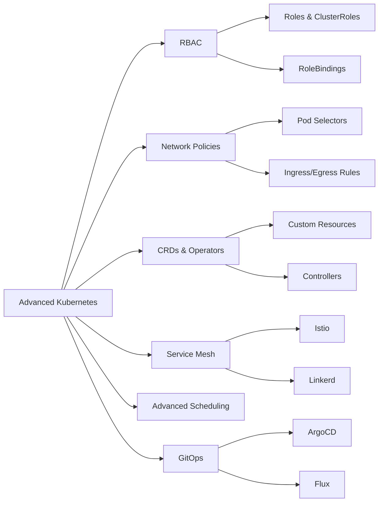
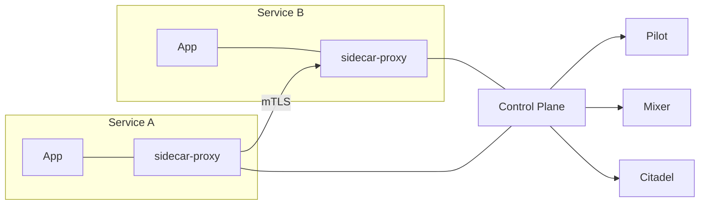
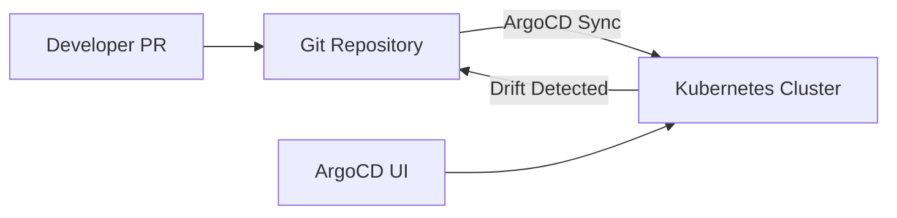

# Chapter 8: Advanced Kubernetes

> **Prev:** [Configuration Management](./08-configuration-management.md)
> **Next:** [Continuous Delivery](./09-continuous-delivery.md)

---

## Learning Objectives

- Master advanced Kubernetes concepts: RBAC, Network Policies, Custom Resource Definitions.
- Implement service mesh (Istio/Linkerd) for traffic management and security.
- Configure advanced scheduling: taints, tolerations, affinity, pod topology spread.
- Manage cluster upgrades, backup, and disaster recovery.
- Implement GitOps with ArgoCD for declarative deployments.
- Optimize resource utilization with vertical pod autoscaling and cluster autoscaling.

<!-- Image Gallery -->
<section class="lesson-visuals" aria-label="Visual learning resources">
  <header><span>VISUAL LEARNING</span><h2>See it. Review it. Remember it.</h2></header>
  <a class="lesson-visual-card" href="../../assets/images/lessons/devops/08-k8s-advanced/handwritten-notes.png" target="_blank" rel="noopener">
    
    <span><strong>Handwritten notes</strong>Condensed notes for deliberate review.</span>
  </a>
  <a class="lesson-visual-card" href="../../assets/images/lessons/devops/08-k8s-advanced/sticky-notes.png" target="_blank" rel="noopener">
    
    <span><strong>Sticky-note revision</strong>Fast recall prompts for revision.</span>
  </a>
  <a class="lesson-visual-card" href="../../assets/images/lessons/devops/08-k8s-advanced/visual-explanation.png" target="_blank" rel="noopener">
    
    <span><strong>Visual concept guide</strong>A connected explanation of the key ideas.</span>
  </a>
</section>
<!-- End Image Gallery -->


---

## Chapter at a Glance

| Topic | Key Insight | Practical Takeaway |
|-------|-------------|-------------------|
| RBAC | Role-based access control | Define least-privilege roles per namespace |
| Network Policies | Micro-segmentation | Default deny ingress, allow specific traffic |
| CRDs | Extend Kubernetes API | Build custom controllers for domain-specific resources |
| Service Mesh | Traffic management, security | Istio for observability, security, traffic control |
| Advanced Scheduling | Pod placement control | Taints repel, tolerations allow, affinity attracts |
| GitOps | Declarative Git-driven operations | ArgoCD syncs cluster state to Git repository |
| Cluster Autoscaler | Node-level scaling | Scale nodes when pods are pending |
| VPA | Vertical pod optimization | Right-size container resource requests |

## Chapter Roadmap



## Theory

### RBAC (Role-Based Access Control)


RBAC controls access to Kubernetes resources based on roles and bindings:

```yaml
# Namespace-scoped role
apiVersion: rbac.authorization.k8s.io/v1
kind: Role
metadata:
  namespace: production
  name: pod-reader
rules:
  - apiGroups: [""]
    resources: ["pods", "pods/log"]
    verbs: ["get", "watch", "list"]
---
# Bind role to user/group
apiVersion: rbac.authorization.k8s.io/v1
kind: RoleBinding
metadata:
  namespace: production
  name: pod-reader-binding
subjects:
  - kind: User
    name: developer@example.com
    apiGroup: rbac.authorization.k8s.io
roleRef:
  kind: Role
  name: pod-reader
  apiGroup: rbac.authorization.k8s.io
```

**Cluster-scoped resources (ClusterRole, ClusterRoleBinding):**
```yaml
apiVersion: rbac.authorization.k8s.io/v1
kind: ClusterRole
metadata:
  name: cluster-admin-reader
rules:
  - apiGroups: [""]
    resources: ["nodes", "namespaces", "persistentvolumes"]
    verbs: ["get", "list", "watch"]
```

**RBAC best practices:**
- Use least privilege: grant only necessary verbs on specific resources
- Prefer namespaced Roles over ClusterRoles when possible
- Use Groups instead of individual Users for easier management
- Regularly audit RBAC with `kubectl auth can-i --list`

### Network Policies


Network Policies control traffic between pods and external endpoints:

```yaml
apiVersion: networking.k8s.io/v1
kind: NetworkPolicy
metadata:
  name: api-network-policy
  namespace: production
spec:
  podSelector:
    matchLabels:
      app: api
  policyTypes:
    - Ingress
    - Egress
  ingress:
    - from:
        - podSelector:
            matchLabels:
              app: web
        - namespaceSelector:
            matchLabels:
              purpose: monitoring
      ports:
        - protocol: TCP
          port: 3000
  egress:
    - to:
        - podSelector:
            matchLabels:
              app: database
      ports:
        - protocol: TCP
          port: 5432
    - to:
        - ipBlock:
            cidr: 0.0.0.0/0
            except:
              - 10.0.0.0/8
```

**Network policy patterns:**
- **Default deny ingress:** Block all incoming traffic, then allow specific
- **Default deny egress:** Block all outgoing traffic, then allow specific
- **Isolate environments:** Prevent dev pods from accessing prod databases
- **Allow monitoring:** Let Prometheus scrape metrics from all namespaces

### Custom Resource Definitions (CRDs)


CRDs extend the Kubernetes API with custom resources:

```yaml
apiVersion: apiextensions.k8s.io/v1
kind: CustomResourceDefinition
metadata:
  name: databases.example.com
spec:
  group: example.com
  names:
    kind: Database
    singular: database
    plural: databases
    shortNames:
      - db
  scope: Namespaced
  versions:
    - name: v1
      served: true
      storage: true
      schema:
        openAPIV3Schema:
          type: object
          required: ["spec"]
          properties:
            spec:
              type: object
              required: ["engine", "version", "size"]
              properties:
                engine:
                  type: string
                  enum: ["postgres", "mysql"]
                version:
                  type: string
                size:
                  type: string
                replicas:
                  type: integer
                  minimum: 1
                  maximum: 5
```

**Operators:** Controllers that watch CRDs and automate management:
- Prometheus Operator (manage monitoring stacks)
- PostgreSQL Operator (manage database clusters)
- Cert-Manager (automate TLS certificates)
- External Secrets Operator (sync secrets from external providers)

### Service Mesh


A service mesh provides a dedicated infrastructure layer for service-to-service communication:



**Istio features:**
- **Traffic management:** Canary releases, traffic splitting, circuit breaking
- **Security:** mTLS between services, fine-grained authorization
- **Observability:** Metrics, traces, access logs automatically
- **Resilience:** Retries, timeouts, circuit breakers, fault injection

```yaml
apiVersion: networking.istio.io/v1beta1
kind: VirtualService
metadata:
  name: myapp
spec:
  hosts:
    - myapp
  http:
    - match:
        - headers:
            version:
              exact: v2
      route:
        - destination:
            host: myapp
            subset: v2
          weight: 100
    - route:
        - destination:
            host: myapp
            subset: v1
          weight: 90
        - destination:
            host: myapp
            subset: v2
          weight: 10
```

### Advanced Scheduling


**Taints and Tolerations:** Control which pods can run on which nodes:

```yaml
# Taint a node
kubectl taint nodes node1 dedicated=gpu:NoSchedule

# Pod toleration
spec:
  tolerations:
    - key: "dedicated"
      operator: "Equal"
      value: "gpu"
      effect: "NoSchedule"
```

**Node Affinity:** Attract pods to specific nodes:

```yaml
spec:
  affinity:
    nodeAffinity:
      requiredDuringSchedulingIgnoredDuringExecution:
        nodeSelectorTerms:
          - matchExpressions:
              - key: topology.kubernetes.io/zone
                operator: In
                values:
                  - us-east-1a
      preferredDuringSchedulingIgnoredDuringExecution:
        - weight: 100
          preference:
            matchExpressions:
              - key: instance-type
                operator: In
                values:
                  - m5.large
```

**Pod Anti-Affinity:** Spread pods across topology to avoid single points of failure:

```yaml
spec:
  affinity:
    podAntiAffinity:
      preferredDuringSchedulingIgnoredDuringExecution:
        - weight: 100
          podAffinityTerm:
            labelSelector:
              matchLabels:
                app: myapp
            topologyKey: kubernetes.io/hostname
```

**Pod Topology Spread Constraints:** Evenly distribute pods across zones:

```yaml
spec:
  topologySpreadConstraints:
    - maxSkew: 1
      topologyKey: topology.kubernetes.io/zone
      whenUnsatisfiable: DoNotSchedule
      labelSelector:
        matchLabels:
          app: myapp
```

### GitOps with ArgoCD


GitOps uses Git as the single source of truth for declarative infrastructure:



**ArgoCD Application:**
```yaml
apiVersion: argoproj.io/v1alpha1
kind: Application
metadata:
  name: myapp
  namespace: argocd
spec:
  project: default
  source:
    repoURL: https://github.com/org/myapp-config.git
    targetRevision: HEAD
    path: kubernetes/overlays/production
  destination:
    server: https://kubernetes.default.svc
    namespace: production
  syncPolicy:
    automated:
      prune: true
      selfHeal: true
    syncOptions:
      - CreateNamespace=true
```

**Benefits of GitOps:**
- Declarative: desired state in Git, cluster converges to match
- Version controlled: full audit trail for every change
- Self-healing: drift detection auto-corrects cluster state
- Pull-based: ArgoCD pulls from Git, no CI/CD credentials in cluster

### Cluster Autoscaler


Dynamically adjusts the number of nodes in the cluster:

```yaml
# AWS EKS managed node group with autoscaling
apiVersion: eksctl.io/v1alpha5
kind: ClusterConfig
metadata:
  name: my-cluster
  region: us-east-1
managedNodeGroups:
  - name: standard-workers
    minSize: 2
    maxSize: 20
    desiredCapacity: 2
    instanceType: m5.large
    labels:
      role: worker
    tags:
      Environment: production
```

### Vertical Pod Autoscaler (VPA)


Recommends or automatically adjusts CPU/memory requests:

```yaml
apiVersion: autoscaling.k8s.io/v1
kind: VerticalPodAutoscaler
metadata:
  name: myapp-vpa
spec:
  targetRef:
    apiVersion: apps/v1
    kind: Deployment
    name: myapp
  updatePolicy:
    updateMode: Auto
  resourcePolicy:
    containerPolicies:
      - containerName: '*'
        minAllowed:
          cpu: 100m
          memory: 128Mi
        maxAllowed:
          cpu: 2
          memory: 4Gi
```

---

## Examples

### Example 1: RBAC Configuration Generator

```typescript
interface RBACRole {
  name: string;
  namespace: string;
  rules: Array<{ apiGroups: string[]; resources: string[]; verbs: string[] }>;
}

interface RBACBinding {
  name: string;
  namespace: string;
  role: string;
  subjects: Array<{ kind: string; name: string }>;
}

class RBACManager {
  generateRole(role: RBACRole): string {
    return `apiVersion: rbac.authorization.k8s.io/v1
kind: Role
metadata:
  namespace: ${role.namespace}
  name: ${role.name}
rules:
${role.rules.map(r => `  - apiGroups: [${r.apiGroups.map(g => `"${g}"`).join(', ')}]
    resources: [${r.resources.map(res => `"${res}"`).join(', ')}]
    verbs: [${r.verbs.map(v => `"${v}"`).join(', ')}]`).join('\n')}`;
  }

  generateBinding(binding: RBACBinding): string {
    return `apiVersion: rbac.authorization.k8s.io/v1
kind: RoleBinding
metadata:
  namespace: ${binding.namespace}
  name: ${binding.name}
subjects:
${binding.subjects.map(s => `  - kind: ${s.kind}
    name: ${s.name}
    apiGroup: rbac.authorization.k8s.io`).join('\n')}
roleRef:
  kind: Role
  name: ${binding.role}
  apiGroup: rbac.authorization.k8s.io`;
  }

  auditPermissions(allowedActions: string[][]): string[] {
    const violations: string[] = [];
    for (const action of allowedActions) {
      // Check if any action violates the least privilege principle
      if (action.includes('*') && action.length > 3) {
        violations.push(`Wildcard verb in: ${action.join(' ')}`);
      }
    }
    return violations;
  }
}

const rbac = new RBACManager();
console.log(rbac.generateRole({
  name: 'developer',
  namespace: 'development',
  rules: [
    { apiGroups: [''], resources: ['pods', 'services', 'configmaps'], verbs: ['get', 'list', 'watch', 'create', 'update'] },
    { apiGroups: ['apps'], resources: ['deployments'], verbs: ['get', 'list', 'watch'] },
  ],
}));
```

### Example 2: Resource Optimizer

```typescript
interface PodResourceUsage {
  name: string;
  namespace: string;
  cpuRequest: number;
  cpuActual: number;
  memoryRequest: number;
  memoryActual: number;
  cpuUtilization: number;
  memoryUtilization: number;
}

class ResourceOptimizer {
  constructor(private pods: PodResourceUsage[]) {}

  findOverprovisioned(threshold: number = 0.3): PodResourceUsage[] {
    return this.pods.filter(p =>
      p.cpuUtilization < threshold || p.memoryUtilization < threshold
    );
  }

  findUnderprovisioned(cpuThreshold: number = 0.9, memThreshold: number = 0.9): PodResourceUsage[] {
    return this.pods.filter(p =>
      p.cpuUtilization > cpuThreshold || p.memoryUtilization > memThreshold
    );
  }

  calculateSavings(): { totalRequested: number; totalActual: number; potentialSavings: number } {
    const totalRequested = this.pods.reduce((s, p) => s + p.cpuRequest, 0);
    const totalActual = this.pods.reduce((s, p) => s + p.cpuActual, 0);
    return {
      totalRequested,
      totalActual,
      potentialSavings: (totalRequested - totalActual) / totalRequested,
    };
  }

  generateRightSizingRecommendations(): string {
    let report = '# Resource Optimization Report\n\n';
    const over = this.findOverprovisioned();

    if (over.length === 0) {
      report += '? No over-provisioned pods found\n\n';
    } else {
      report += `## Over-Provisioned Pods\n\n`;
      report += '| Pod | Namespace | CPU Request | CPU Actual | Mem Request | Mem Actual\n';
      report += '|-----|-----------|------------|------------|-------------|----------|\n';
      for (const p of over) {
        report += `| ${p.name} | ${p.namespace} | ${p.cpuRequest}m | ${p.cpuActual}m | ${p.memoryRequest}Mi | ${p.memoryActual}Mi\n`;
      }
    }

    const savings = this.calculateSavings();
    report += `\n## Potential Savings\n\n`;
    report += `- Total CPU requested: ${savings.totalRequested}m\n`;
    report += `- Total CPU used: ${savings.totalActual}m\n`;
    report += `- Potential savings: ${(savings.potentialSavings * 100).toFixed(1)}%\n`;

    return report;
  }
}

const optimizer = new ResourceOptimizer([
  { name: 'api-v1', namespace: 'prod', cpuRequest: 1000, cpuActual: 200, memoryRequest: 1024, memoryActual: 256, cpuUtilization: 0.2, memoryUtilization: 0.25 },
  { name: 'web-v2', namespace: 'prod', cpuRequest: 500, cpuActual: 450, memoryRequest: 512, memoryActual: 480, cpuUtilization: 0.9, memoryUtilization: 0.94 },
]);

console.log(optimizer.generateRightSizingRecommendations());
```

---

### Resource Quota Calculator

Kubernetes resource quotas prevent resource starvation across namespaces. The following implementation calculates optimal resource allocations and validates quotas against actual usage.

```typescript
interface ResourceQuota {
  cpuRequest: string;
  cpuLimit: string;
  memoryRequest: string;
  memoryLimit: string;
  podCount: number;
}

interface NamespaceResources {
  name: string;
  quota: ResourceQuota;
  currentUsage: ResourceQuota;
}

interface QuotaRecommendation {
  namespace: string;
  issues: string[];
  recommendedQuota: ResourceQuota;
}

function parseCpu(cpu: string): number {
  if (cpu.endsWith('m')) return parseInt(cpu) / 1000;
  if (cpu.endsWith('n')) return parseInt(cpu) / 1_000_000_000;
  return parseInt(cpu);
}

function parseMemory(mem: string): number {
  if (mem.endsWith('Gi')) return parseInt(mem) * 1024 * 1024 * 1024;
  if (mem.endsWith('Mi')) return parseInt(mem) * 1024 * 1024;
  if (mem.endsWith('Ki')) return parseInt(mem) * 1024;
  return parseInt(mem);
}

class QuotaAnalyzer {
  analyze(namespaces: NamespaceResources[]): QuotaRecommendation[] {
    return namespaces.map(ns => {
      const issues: string[] = [];
      const usageCpu = parseCpu(ns.currentUsage.cpuRequest);
      const quotaCpu = parseCpu(ns.quota.cpuRequest);
      const usageMem = parseMemory(ns.currentUsage.memoryRequest);
      const quotaMem = parseMemory(ns.quota.memoryRequest);

      if (usageCpu / quotaCpu > 0.85) issues.push('CPU request usage exceeds 85%');
      if (usageMem / quotaMem > 0.85) issues.push('Memory request usage exceeds 85%');

      const recCpu = Math.round(usageCpu * 1.3 * 1000) + 'm';
      const recMem = Math.round((usageMem * 1.3) / (1024 * 1024)) + 'Mi';

      return {
        namespace: ns.name,
        issues,
        recommendedQuota: {
          cpuRequest: recCpu,
          cpuLimit: Math.round(parseCpu(recCpu) * 2 * 1000) + 'm',
          memoryRequest: recMem,
          memoryLimit: Math.round(parseMemory(recMem) * 2 / (1024 * 1024)) + 'Mi',
          podCount: Math.ceil(ns.currentUsage.podCount * 1.5),
        },
      };
    });
  }
}

const analyzer = new QuotaAnalyzer();
const recommendations = analyzer.analyze([
  {
    name: 'production',
    quota: { cpuRequest: '4000m', cpuLimit: '8000m', memoryRequest: '8Gi', memoryLimit: '16Gi', podCount: 20 },
    currentUsage: { cpuRequest: '3600m', cpuLimit: '7200m', memoryRequest: '7.2Gi', memoryLimit: '14Gi', podCount: 18 },
  },
]);

console.log(JSON.stringify(recommendations, null, 2));
```

**What this demonstrates:** Automated quota analysis prevents resource contention in multi-tenant Kubernetes clusters by right-sizing limits based on actual consumption patterns.

---

### Resource Quota Migrator

Migrating resources between namespaces or clusters requires systematic quota translation and conflict detection. The following tool automates quota extraction, transformation, and validation.

```typescript
// quota-migrator.ts
// Migrate Kubernetes resource quotas between namespaces

interface QuotaSpec {
  namespace: string;
  requests: { cpu: string; memory: string; storage?: string };
  limits: { cpu: string; memory: string };
  count: Record<string, string>;
  scopes: string[];
}

interface MigrationMapping {
  sourceNamespace: string;
  targetNamespace: string;
  quotaTransforms: Array<{ field: string; operation: 'scale' | 'rename' | 'add' | 'remove'; value?: string; factor?: number }>;
}

interface MigrationPlan {
  sourceQuota: QuotaSpec;
  targetQuota: QuotaSpec;
  transforms: string[];
  conflicts: string[];
  warnings: string[];
  estimatedResourceDelta: { cpuBefore: string; cpuAfter: string; memBefore: string; memAfter: string };
}

interface MigrationResult {
  plan: MigrationPlan;
  applied: boolean;
  timestamp: Date;
  dryRun: boolean;
}

class QuotaMigrator {
  private appliedMigrations: MigrationResult[] = [];

  planMigration(source: QuotaSpec, mapping: MigrationMapping): MigrationPlan {
    const warnings: string[] = [];
    const conflicts: string[] = [];

    const target: QuotaSpec = { namespace: mapping.targetNamespace, requests: { ...source.requests }, limits: { ...source.limits }, count: { ...source.count }, scopes: [...source.scopes] };

    for (const t of mapping.quotaTransforms) {
      switch (t.operation) {
        case 'scale': {
          const factor = t.factor || 1;
          const cpuMatch = target.requests.cpu.match(/(\d+)([mMG]?)/);
          if (cpuMatch) {
            const val = parseInt(cpuMatch[1]) * factor;
            target.requests.cpu = cpuMatch[2] === 'm' || cpuMatch[2] === '' ? `${val}m` : `${val}`;
          }
          const memMatch = target.requests.memory.match(/(\d+)([MG]i?)/);
          if (memMatch) {
            const val = parseInt(memMatch[1]) * factor;
            target.requests.memory = `${val}${memMatch[2]}`;
          }
          warnings.push(`Scaled resources by factor ${factor}`);
          break;
        }
        case 'rename':
          if (t.field === 'namespace') target.namespace = t.value || target.namespace;
          break;
        case 'add':
          target.requests.cpu = this.addResource(target.requests.cpu, t.value || '0m');
          break;
        case 'remove':
          target.scopes = target.scopes.filter(s => s !== t.value);
          break;
      }
    }

    if (target.namespace === source.namespace) warnings.push('Source and target namespaces are the same');
    const deltaCpu = this.resourceDelta(target.requests.cpu, source.requests.cpu);
    const deltaMem = this.resourceDelta(target.requests.memory, source.requests.memory);

    return {
      sourceQuota: source, targetQuota: target,
      transforms: mapping.quotaTransforms.map(t => `${t.operation}:${t.field}`),
      conflicts, warnings,
      estimatedResourceDelta: { cpuBefore: source.requests.cpu, cpuAfter: target.requests.cpu, memBefore: source.requests.memory, memAfter: target.requests.memory },
    };
  }

  applyMigration(plan: MigrationPlan, dryRun: boolean): MigrationResult {
    const result: MigrationResult = { plan, applied: dryRun ? false : true, timestamp: new Date(), dryRun };
    this.appliedMigrations.push(result);
    return result;
  }

  rollbackLatest(): MigrationResult | null {
    const last = this.appliedMigrations.pop();
    return last || null;
  }

  getHistory(filter?: { namespace?: string; dryRun?: boolean }): MigrationResult[] {
    return this.appliedMigrations.filter(m => {
      if (filter?.namespace && m.plan.sourceQuota.namespace !== filter.namespace) return false;
      if (filter?.dryRun !== undefined && m.dryRun !== filter.dryRun) return false;
      return true;
    });
  }

  private addResource(current: string, addition: string): string {
    const currentVal = parseInt(current);
    const addVal = parseInt(addition);
    const unit = current.includes('m') ? 'm' : '';
    return `${currentVal + addVal}${unit}`;
  }

  private resourceDelta(after: string, before: string): string {
    const aVal = parseInt(after);
    const bVal = parseInt(before);
    const diff = aVal - bVal;
    const sign = diff >= 0 ? '+' : '';
    return `${sign}${diff}`;
  }
}

const migrator = new QuotaMigrator();
const source: QuotaSpec = { namespace: 'staging', requests: { cpu: '2000m', memory: '4Gi' }, limits: { cpu: '4000m', memory: '8Gi' }, count: { pods: '10' }, scopes: ['BestEffort', 'NotTerminating'] };

const mapping: MigrationMapping = {
  sourceNamespace: 'staging', targetNamespace: 'production',
  quotaTransforms: [
    { field: 'namespace', operation: 'rename', value: 'production' },
    { field: 'requests.cpu', operation: 'scale', factor: 2 },
    { field: 'requests.memory', operation: 'scale', factor: 2 },
  ],
};

const plan = migrator.planMigration(source, mapping);
console.log('Migration plan:', JSON.stringify(plan.estimatedResourceDelta, null, 2));
console.log('Warnings:', plan.warnings.join(', '));

const result = migrator.applyMigration(plan, true);
console.log(`Applied (dry-run: ${result.dryRun}): ${result.applied}`);
```

**What this demonstrates:** Automated quota migration with transform pipelines ensures accurate resource allocation when moving workloads between namespaces or clusters.

---

## Practical Takeaways

1. **RBAC: least privilege always.** Start with deny, grant specific access as needed.
2. **Network Policies: default deny.** Block all traffic, then explicitly allow required paths.
3. **GitOps: Git is the source of truth.** All changes to Kubernetes go through Git merges.
4. **Use affinity rules to spread pods.** Anti-affinity prevents all replicas from running on one node.
5. **Monitor resource utilization.** Use VPA recommendations to right-size requests.
6. **Enable HPA and Cluster Autoscaler together.** HPA adds pods, CA adds nodes for pending pods.

---

## Chapter Quiz

<details><summary>Question 1: What is the default behavior when a Network Policy selects a pod?</summary>**A)** All traffic is allowed<br>**B)** All traffic is denied except what the policy allows<br>**C)** Only HTTP traffic is allowed<br>**D)** Traffic is routed through a proxy<br><br>**Answer: B)** All traffic is denied except what the policy allows&lt;/details&gt;

<details><summary>Question 2: What is the purpose of a ClusterRole?</summary>**A)** Manage pods in a namespace<br>**B)** Define permissions for cluster-scoped resources<br>**C)** Create network policies<br>**D)** Configure service meshes<br><br>**Answer: B)** Define permissions for cluster-scoped resources&lt;/details&gt;

<details><summary>Question 3: What is GitOps?</summary>**A)** Using Git for source control<br>**B)** Using Git as the single source of truth for cluster state<br>**C)** Git-based CI/CD<br>**D)** Git hooks for Kubernetes<br><br>**Answer: B)** Using Git as the single source of truth for cluster state&lt;/details&gt;

<details><summary>Question 4: What does a pod anti-affinity rule prevent?</summary>**A)** Pods from running on the same node<br>**B)** Pods from communicating with each other<br>**C)** Pods from being deleted<br>**D)** Pods from using too much CPU<br><br>**Answer: A)** Pods from running on the same node&lt;/details&gt;

<details><summary>Question 5: What is the role of a service mesh sidecar proxy?</summary>**A)** Serve HTTP requests<br>**B)** Handle inter-service communication with mTLS, routing, and observability<br>**C)** Store application data<br>**D)** Manage container images<br><br>**Answer: B)** Handle inter-service communication with mTLS, routing, and observability&lt;/details&gt;

---


// configuration management
// cicd-infrastructure-automation implementation

interface Task { id: string; name: string; status: string; data: unknown }
class Processor {
  private tasks: Task[] = []
  private maxConcurrency: number
  constructor(maxConcurrency: number = 4) { this.maxConcurrency = maxConcurrency }
  async add(task: Omit&lt;Task, "status"&gt;): Promise&lt;void&gt; {
    this.tasks.push({ ...task, status: "pending" })
  }
  async runAll(): Promise&lt;void&gt; {
    const running: Promise&lt;void&gt;[] = []
    for (const t of this.tasks) {
      if (running.length >= this.maxConcurrency) { await Promise.race(running) }
      const p = this.execute(t).finally(() => { const i = running.indexOf(p); if (i >= 0) running.splice(i, 1) })
      running.push(p)
    }
    await Promise.all(running)
  }
  private async execute(t: Task): Promise&lt;void&gt; {
    t.status = "running"
    await new Promise(r => setTimeout(r, 10))
    t.status = "done"
  }
  getResults(): Task[] { return this.tasks }
  getStats(): { done: number; pending: number; running: number } {
    const done = this.tasks.filter(t => t.status === "done").length
    const pending = this.tasks.filter(t => t.status === "pending").length
    const running = this.tasks.filter(t => t.status === "running").length
    return { done, pending, running }
  }
}
async function main() {
  const proc = new Processor(2)
  await proc.add({ id: '1', name: 'configuration management', data: { topic: 'cicd-infrastructure-automation' } })
  await proc.runAll()
  console.log('Stats:', proc.getStats())
}
main().catch(console.error)
export { Processor, Task }
## Summary

- RBAC provides fine-grained access control through roles, bindings, and service accounts.
- Network Policies implement micro-segmentation by controlling pod-to-pod traffic.
- CRDs extend the Kubernetes API for custom resources managed by operators.
- Service meshes (Istio, Linkerd) add traffic management, security, and observability.
- Advanced scheduling uses taints, tolerations, affinity, and topology spread constraints.
- GitOps with ArgoCD keeps cluster state synchronized with Git repositories.
- Cluster Autoscaler dynamically adds/removes nodes; VPA adjusts resource requests.
- Resource optimization reduces waste by right-sizing container requests.

---

## Exercises

### Review Questions
1. How does a Network Policy differ from a traditional firewall?
2. What is the difference between a Role and a ClusterRole?
3. How does GitOps ensure the cluster state matches the desired state in Git?
4. What is the purpose of pod topology spread constraints?
5. How do taints and tolerations work together?

### Application Problems
1. Create RBAC configuration for developers (read-only on pods and logs) and CI/CD system (full access to deployments in CI namespace).
2. Write a Network Policy that allows the monitoring namespace to scrape metrics from all namespaces.
3. Configure a canary deployment using Istio VirtualService with 90/10 traffic split.
4. Implement a GitOps workflow with ArgoCD that auto-syncs a Kubernetes overlay directory.

### Challenge Problem
1. Design a complete production-grade Kubernetes security and operations framework including: RBAC with least privilege roles for developers, operators, CI/CD, and auditors, Network Policies implementing default deny with explicit allow rules for each tier (web, api, db), a service mesh with mTLS and canary deployment support, multi-AZ pod distribution with topology spread constraints, GitOps setup with ArgoCD for declarative cluster management, Cluster Autoscaler and VPA for resource efficiency, and regular RBAC and security audits.
