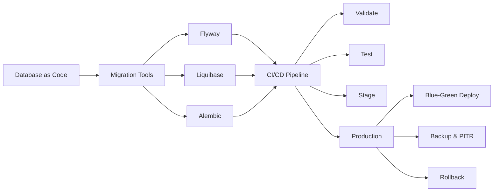

# Chapter 15: Database DevOps

> **Previous:** [DevSecOps](./14-devsecops.md) | **Next:** [Container Networking](./16-networking.md)

## Learning Objectives

By the end of this chapter, students will be able to:

1. Manage database schema migrations using Flyway, Liquibase, and Alembic
2. Design CI/CD pipelines that include database changes
3. Implement blue-green and rolling database deployment strategies
4. Configure backup, restore, and point-in-time recovery procedures
5. Develop database testing strategies including integration, unit, and performance tests
6. Implement database as code with version-controlled schemas
7. Design rollback strategies for database migrations

## Chapter at a Glance

| Topic | Key Insight | Practical Takeaway |
|-------|-------------|-------------------|
| Database as Code | Schema changes version-controlled in Git | Apply engineering discipline to database management |
| Schema Migration Tools | Flyway, Liquibase, Alembic | Choose based on language (Alembic for Python, Flyway for SQL) |
| Database CI/CD | Validate, test, stage, production pipeline | Always test migrations on a production-like database copy |
| Blue-Green DB Deployments | Backward-compatible changes enable zero-downtime | Three-phase approach for column renames |
| Backup & PITR | Full backup, WAL shipping, point-in-time recovery | Test backups regularly — untested backups are useless |
| Rollback Strategies | Forward-only vs with rollback | Prepare downgrade paths for every migration |
| Migration Validation | Syntax, empty DB, prod-like, rollback tests | Four-stage validation before production |

## Chapter Roadmap



## Theory

### 15.1 Database as Code


Database as Code applies version control, CI/CD, and automation principles to database schemas. Historically, database changes were manual, scripted by DBAs, and applied outside the application release process. This created a bottleneck, introduced errors, and prevented rapid delivery.

Database as Code stores schema definitions, migrations, and configuration in Git. Changes undergo code review, automated testing, and pipeline-based deployment alongside application changes.

**Principles:**
- Every schema change is a version-controlled migration file
- Migrations are immutable after creation (never edit an applied migration)
- Forward migrations are additive when possible
- Destructive operations require explicit approval
- Rollback plans are prepared before production application

### 15.2 Schema Migration Tools


**Flyway** — Open-source database migration tool. Migrations are SQL files named with versioned or repeatable conventions:

```
V1__create_users.sql
V2__add_email_column.sql
V3__create_orders.sql
R__create_admin_user.sql
```

```bash
# Apply pending migrations
flyway migrate

# Check migration status
flyway info

# Rollback (Flyway Pro/Teams only)
flyway undo
```

Flyway records applied migrations in a schema history table (`flyway_schema_history`). It calculates which migrations are pending by comparing available migration files against this table. Each migration is applied exactly once — Flyway validates checksums to detect tampering.

**Liquibase** — More feature-rich than Flyway:
- Supports SQL, XML, JSON, and YAML changelog formats
- Provides rollback (built-in, not Pro-only)
- Context-aware execution (run certain changesets only in specific environments)
- Preconditions (skip changesets if conditions aren't met)
- Generate changelogs from existing databases

```xml
<databaseChangeLog>
  <changeSet id="1" author="dev">
    <createTable tableName="users">
      <column name="id" type="bigint" autoIncrement="true">
        <constraints primaryKey="true"/>
      </column>
      <column name="email" type="varchar(255)">
        <constraints unique="true" nullable="false"/>
      </column>
    </createTable>
  </changeSet>
</databaseChangeLog>
```

```bash
liquibase update
liquibase rollbackCount 3
liquibase rollbackSQL --tag v2.0.0
```

**Alembic** — Python-specific migration tool for SQLAlchemy:
- Auto-generates migrations from model changes
- Supports branching, merging, and multiple databases
- Python-based migration scripts (not plain SQL)

```python
"""Add users table.
Revision ID: 2a1b3c4d5e6f
Revises: 1a2b3c4d5e6f
Create Date: 2026-06-09 14:30:00
"""
def upgrade():
    op.create_table('users',
        sa.Column('id', sa.Integer(), nullable=False),
        sa.Column('email', sa.String(length=255), nullable=False),
        sa.PrimaryKeyConstraint('id'),
        sa.UniqueConstraint('email')
    )

def downgrade():
    op.drop_table('users')
```

### 15.3 Database CI/CD


Integrating database changes into CI/CD requires careful design. The pipeline must handle schema changes without disrupting existing data or service availability.

**Pipeline Stages:**

1. **Validate** — Check migration file naming convention, SQL syntax, and history consistency
2. **Test** — Apply migrations to a test database, run integration tests, verify data integrity
3. **Stage** — Apply migrations to staging environment with production-like data for performance testing
4. **Production** — Apply with health monitoring and automatic rollback on failure

**Database as Code CI/CD Example:**

```yaml
# .github/workflows/database.yml
name: Database Migrations
on:
  pull_request:
    paths:
      - 'migrations/**'

jobs:
  validate:
    runs-on: ubuntu-latest
    services:
      postgres:
        image: postgres:16
        env:
          POSTGRES_DB: test
          POSTGRES_PASSWORD: test
    steps:
      - uses: actions/checkout@v4
      - name: Validate migrations
        run: flyway validate -url=jdbc:postgresql://postgres/test -schemas=public

  test:
    needs: validate
    runs-on: ubuntu-latest
    services:
      postgres:
        image: postgres:16
        env:
          POSTGRES_DB: test
          POSTGRES_PASSWORD: test
    steps:
      - uses: actions/checkout@v4
      - name: Apply migrations
        run: flyway migrate -url=jdbc:postgresql://postgres/test -schemas=public
      - name: Run integration tests
        run: npm run test:integration
```

### 15.4 Blue-Green Database Deployments


Database changes that are backward-compatible enable zero-downtime deployments:

| Change Type | Risk Level | Zero-Downtime Approach |
|-------------|------------|----------------------|
| Add column (nullable) | Low | Safe. Old code ignores new column |
| Add column (NOT NULL) | Medium | Add with default, backfill, then add NOT NULL |
| Add table | Low | Safe. Old code ignores new table |
| Remove column | High | Two-phase: stop using, then drop |
| Rename column | High | Three-phase: add new, dual-write, drop old |
| Modify column type | High | Add new column, migrate data, swap |

**Three-Phase Column Rename:**
1. **Phase 1:** Add new column with new name. Deploy code that writes to both columns and reads from new. Monitor for errors.
2. **Phase 2:** Deploy code that only reads/writes to new column. Remove writes to old column.
3. **Phase 3:** Drop old column in a separate migration.

### 15.5 Backup and Restore


**Backup Strategies:**

**Full Backup** — Complete copy of the database:
- Slowest to create, fastest to restore
- Typical nightly schedule
- File size equals database size
- `pg_dump` (logical), `pg_basebackup` (physical)

**Incremental Backup** — Only changes since last backup:
- Fast to create, small size
- Complex to restore (requires base + all increments)
- Reduces backup window and storage

**Continuous Archiving (WAL shipping)** — Streams transaction logs to archive:
- Enables point-in-time recovery to any moment
- Minimal data loss potential (seconds)
- Required for production databases

**Backup Commands:**
```bash
# PostgreSQL: pg_dump (logical backup)
pg_dump -h prod-host -U app -d mydb > backup.sql

# PostgreSQL: pg_basebackup (physical backup)
pg_basebackup -h prod-host -U replicator -D /backup/$(date +%Y%m%d) -X stream

# MySQL: mysqldump
mysqldump -h prod-host -u app -p mydb > backup.sql

# MongoDB: mongodump
mongodump --uri="mongodb://prod-host:27017/mydb" --out /backup/$(date +%Y%m%d)
```

### 15.6 Point-in-Time Recovery (PITR)


PITR restores a database to a specific moment, not just the last backup. Required for recovering from data corruption, accidental deletion, or logical errors.

**Requirements:**
- Full base backup
- All WAL (Write-Ahead Log) segments since the backup
- The target timestamp or transaction ID

```bash
# PostgreSQL PITR
# 1. Restore base backup to data directory
# 2. Restore WAL archive to pg_wal directory
# 3. Create recovery.signal and postgresql.conf with:
#    restore_command = 'cp /wal_archive/%f %p'
#    recovery_target_time = '2026-06-09 14:30:00 UTC'
# 4. Start PostgreSQL
```

### 15.7 Database Testing


**Unit Tests** — Test database functions, stored procedures, and triggers in isolation:
- Test individual SQL functions and procedures
- Mock table data as needed
- Fast execution (milliseconds per test)

**Integration Tests** — Test application code with a real database:
- Use migration tools to create the schema from scratch
- Seed test data (fixtures)
- Run application tests against the database
- Teardown after each test run (transaction rollback or fresh database)
- Tools: Testcontainers, Docker Compose, in-memory databases (SQLite for testing)

```yaml
# Testcontainers-based integration test
services:
  test:
    image: test-runner
    depends_on:
      db:
        condition: service_healthy
  db:
    image: postgres:16
    environment:
      POSTGRES_DB: test
    healthcheck:
      test: ["CMD-SHELL", "pg_isready -U postgres"]
```

**Transaction Tests** — Test concurrent access:
- Isolation levels (READ COMMITTED, REPEATABLE READ, SERIALIZABLE)
- Deadlock handling
- Rollback behavior on failure
- Optimistic locking verification

**Performance Tests** — Query performance regression detection:
- Capture query plans before and after schema changes
- Measure execution time for critical queries
- Compare index usage
- Check for full table scans on large tables

### 15.8 Migration Validation


Validate migrations before production application:

1. **Syntax check** — Parse SQL for syntax errors. Catch typos and missing keywords.
2. **Empty database test** — Apply to a clean database, verify schema matches expectations.
3. **Production-like test** — Apply to a copy of production data, measure execution time. Slow migrations (hours) need optimization or online schema change tools (pt-online-schema-change, gh-ost).
4. **Rollback test** — Verify downgrade works correctly. Test that data is preserved or correctly handled.
5. **Data preservation** — Verify no data loss occurs during migration. Run before/after data counts.

### 15.9 Rollback Strategies


**Variant A: Forward-only** — Rollback is a new forward migration that reverses the change:
```
V2__add_column.sql ? V3__remove_column.sql
```
Simple, works with all tools. All actions are audited. Best practice for most teams.

**Variant B: With rollback** — Flyway Pro and Liquibase support versioned rollbacks:
```bash
flyway undo   # Applies the down migration
liquibase rollbackCount 1
```
Down migration reverses the up migration. Must be written and tested alongside the up migration.

**Variant C: Blue-green schema** — Maintain two schema versions simultaneously:
- Traffic switches after rollback capability is verified
- Both schemas must be backward-compatible
- Complex but enables instant rollback

**Rollback Best Practices:**
- Write rollback migrations before deploying forward migrations
- Test rollback on a production-like database
- Include data migration rollback (not just schema)
- Monitor rollback execution time
- Document rollback procedures in runbooks

---

## Examples

### Example 1: Migration Manager

```typescript
interface Migration {
  version: string;
  description: string;
  sql: string[];
  rollbackSql: string[];
  author: string;
  timestamp: Date;
  checksum: string;
}

interface MigrationState {
  applied: string[];
  pending: Migration[];
  failed: string[];
}

class MigrationManager {
  private migrations: Map<string, Migration> = new Map();
  private state: MigrationState = { applied: [], pending: [], failed: [] };

  register(migration: Migration): void {
    migration.checksum = this.computeChecksum(migration.sql.join(';'));
    this.migrations.set(migration.version, migration);
  }

  private computeChecksum(sql: string): string {
    let hash = 0;
    for (let i = 0; i < sql.length; i++) {
      const char = sql.charCodeAt(i);
      hash = ((hash << 5) - hash) + char;
      hash |= 0;
    }
    return hash.toString(16);
  }

  plan(version: string): Migration[] {
    const planned: Migration[] = [];
    const sorted = [...this.migrations.values()]
      .sort((a, b) => a.version.localeCompare(b.version));

    for (const migration of sorted) {
      if (migration.version > version && !this.state.applied.includes(migration.version)) {
        planned.push(migration);
      }
    }

    this.state.pending = planned;
    return planned;
  }

  apply(version: string): void {
    this.state.applied.push(version);
    this.state.pending = this.state.pending.filter(m => m.version !== version);
  }

  rollback(version: string): boolean {
    const migration = this.migrations.get(version);
    if (!migration || migration.rollbackSql.length === 0) return false;

    this.state.applied = this.state.applied.filter(v => v !== version);
    return true;
  }

  validate(): string[] {
    const issues: string[] = [];

    for (const [version, migration] of this.migrations) {
      const currentChecksum = this.computeChecksum(migration.sql.join(';'));
      if (migration.checksum !== currentChecksum) {
        issues.push(`Checksum mismatch for migration ${version}`);
      }
    }

    return issues;
  }

  generateReport(): string {
    let report = '# Migration Status Report\n\n';
    report += `Applied: ${this.state.applied.length}\n`;
    report += `Pending: ${this.state.pending.length}\n`;
    report += `Failed: ${this.state.failed.length}\n\n`;

    report += '## Pending Migrations\n\n';
    for (const m of this.state.pending) {
      report += `- V${m.version}: ${m.description} (${m.author})\n`;
    }

    return report;
  }
}

const manager = new MigrationManager();
manager.register({
  version: '1', description: 'Create users table', author: 'dev',
  sql: ['CREATE TABLE users (id SERIAL PRIMARY KEY, email VARCHAR(255) UNIQUE NOT NULL)'],
  rollbackSql: ['DROP TABLE users'], timestamp: new Date(),
  checksum: '',
});
manager.register({
  version: '2', description: 'Add orders table', author: 'dev',
  sql: ['CREATE TABLE orders (id SERIAL PRIMARY KEY, user_id INT REFERENCES users(id), amount DECIMAL)'],
  rollbackSql: ['DROP TABLE orders'], timestamp: new Date(),
  checksum: '',
});

console.log('Plan:', manager.plan('1').map(m => `V${m.version}: ${m.description}`));
console.log('Valid:', manager.validate());
```

### Example 2: Backup and Restore Simulator

```typescript
interface Backup {
  id: string;
  type: 'full' | 'incremental' | 'wal';
  timestamp: Date;
  sizeGB: number;
  verified: boolean;
}

interface BackupPolicy {
  fullBackupIntervalHours: number;
  incrementalBackupIntervalHours: number;
  walArchiveEnabled: boolean;
  retentionDays: number;
  targetRPO: number; // seconds
  targetRTO: number; // seconds
}

class BackupManager {
  private backups: Backup[] = [];
  private policy: BackupPolicy;

  constructor(policy: BackupPolicy) {
    this.policy = policy;
  }

  performBackup(type: Backup['type']): Backup {
    const backup: Backup = {
      id: crypto.randomUUID().substring(0, 8),
      type,
      timestamp: new Date(),
      sizeGB: type === 'full' ? 100 : type === 'incremental' ? 5 : 0.5,
      verified: false,
    };
    this.backups.push(backup);
    return backup;
  }

  verifyBackup(id: string): boolean {
    const backup = this.backups.find(b => b.id === id);
    if (backup) backup.verified = true;
    return !!backup;
  }

  estimateRPO(): number {
    const lastBackup = this.backups[this.backups.length - 1];
    if (!lastBackup) return Infinity;
    return (Date.now() - lastBackup.timestamp.getTime()) / 1000;
  }

  estimateRTO(): number {
    const lastFull = [...this.backups].reverse().find(b => b.type === 'full');
    if (!lastFull) return Infinity;
    const restoreTime = lastFull.sizeGB * 60; // 1 min per GB
    const walApplyTime = 300; // 5 min for WAL replay
    return restoreTime + walApplyTime;
  }

  complianceCheck(): string[] {
    const issues: string[] = [];

    const rpo = this.estimateRPO();
    if (rpo > this.policy.targetRPO) {
      issues.push(`RPO violation: ${rpo}s > ${this.policy.targetRPO}s target`);
    }

    const rto = this.estimateRTO();
    if (rto > this.policy.targetRTO) {
      issues.push(`RTO violation: ${rto}s > ${this.policy.targetRTO}s target`);
    }

    const unverified = this.backups.filter(b => !b.verified);
    if (unverified.length > 5) {
      issues.push(`Unverified backups: ${unverified.length} — restore test needed`);
    }

    return issues;
  }

  generateReport(): string {
    let report = '# Backup Status Report\n\n';
    report += `Total backups: ${this.backups.length}\n`;
    report += `Last full backup: ${this.backups.filter(b => b.type === 'full').slice(-1)[0]?.timestamp.toISOString() || 'Never'}\n`;
    report += `Estimated RPO: ${this.estimateRPO()}s (target: ${this.policy.targetRPO}s)\n`;
    report += `Estimated RTO: ${this.estimateRTO()}s (target: ${this.policy.targetRTO}s)\n\n`;

    const issues = this.complianceCheck();
    if (issues.length > 0) {
      report += '## Compliance Issues\n' + issues.map(i => `- ?? ${i}`).join('\n');
    } else {
      report += '? All compliance requirements met\n';
    }

    return report;
  }
}

const policy: BackupPolicy = {
  fullBackupIntervalHours: 24,
  incrementalBackupIntervalHours: 4,
  walArchiveEnabled: true,
  retentionDays: 30,
  targetRPO: 3600,
  targetRTO: 7200,
};

const manager = new BackupManager(policy);
manager.performBackup('full');
manager.performBackup('wal');
manager.performBackup('incremental');
manager.verifyBackup(manager['backups'][0].id);
console.log(manager.generateReport());
```

### Example 3: Query Performance Regression Detector

```typescript
interface QueryPlan {
  query: string;
  executionTimeMs: number;
  rowsExamined: number;
  rowsReturned: number;
  indexUsed: string | null;
  tableScan: boolean;
}

interface SchemaChange {
  description: string;
  migrationVersion: string;
}

class QueryPerformanceDetector {
  private baseline: Map<string, QueryPlan> = new Map();
  private afterChange: Map<string, QueryPlan> = new Map();

  recordBaseline(plan: QueryPlan): void {
    this.baseline.set(plan.query, plan);
  }

  recordAfterChange(plan: QueryPlan): void {
    this.afterChange.set(plan.query, plan);
  }

  detectRegressions(): Array<{ query: string; before: number; after: number; degradation: number }> {
    const regressions: Array<{ query: string; before: number; after: number; degradation: number }> = [];

    for (const [query, after] of this.afterChange) {
      const before = this.baseline.get(query);
      if (!before) continue;

      const degradation = ((after.executionTimeMs - before.executionTimeMs) / before.executionTimeMs) * 100;
      if (degradation > 20) {
        regressions.push({ query, before: before.executionTimeMs, after: after.executionTimeMs, degradation });
      }
    }

    return regressions;
  }

  generateReport(change: SchemaChange): string {
    let report = `# Performance Regression Report\n\n`;
    report += `Schema change: ${change.description} (V${change.migrationVersion})\n\n`;

    const regressions = this.detectRegressions();
    if (regressions.length === 0) {
      report += '? No significant performance regressions detected\n';
      return report;
    }

    report += '## Regressions\n\n';
    report += '| Query | Before (ms) | After (ms) | Degradation |\n';
    report += '|-------|-------------|------------|-------------|\n';

    for (const r of regressions) {
      const icon = r.degradation > 100 ? '??' : '??';
      report += `| ${r.query.substring(0, 60)}... | ${r.before} | ${r.after} | ${icon} ${r.degradation.toFixed(0)}% |\n`;
    }

    report += '\n## Recommendations\n';
    for (const r of regressions) {
      if (r.degradation > 100) {
        report += `- Add index for query: ${r.query.substring(0, 60)}...\n`;
      }
    }

    return report;
  }
}

const detector = new QueryPerformanceDetector();
detector.recordBaseline({ query: 'SELECT * FROM orders WHERE user_id = $1', executionTimeMs: 5, rowsExamined: 100, rowsReturned: 1, indexUsed: 'idx_orders_user_id', tableScan: false });
detector.recordBaseline({ query: 'SELECT SUM(amount) FROM orders', executionTimeMs: 50, rowsExamined: 10000, rowsReturned: 1, indexUsed: null, tableScan: true });
detector.recordAfterChange({ query: 'SELECT * FROM orders WHERE user_id = $1', executionTimeMs: 150, rowsExamined: 10000, rowsReturned: 1, indexUsed: null, tableScan: true });
detector.recordAfterChange({ query: 'SELECT SUM(amount) FROM orders', executionTimeMs: 55, rowsExamined: 10000, rowsReturned: 1, indexUsed: null, tableScan: true });

console.log(detector.generateReport({ description: 'Drop index on user_id', migrationVersion: '5' }));
```

---

## Concept Comparison Table

| Concept | Description |
|---------|-------------|
| Flyway | Versioned SQL migrations, schema history table |
| Liquibase | XML/JSON/YAML changelogs, rollback, contexts |
| Alembic | Python/SQLAlchemy, auto-generation from models |
| PITR | Full backup + WAL stream to any point in time |
| Blue-Green DB | Backward-compat changes for zero-downtime |
| Migration Validation | Syntax, empty DB, prod-like, rollback tests |
| RPO | Recovery Point Objective — max acceptable data loss |
| RTO | Recovery Time Objective — max acceptable downtime |

## Quick Reference

| Topic | Key Points |
|-------|------------|
| Flyway | V1__description.sql, migrate, info, undo |
| Liquibase | changelog.xml, update, rollbackCount, rollbackSQL |
| Alembic | revision --autogenerate, upgrade, downgrade |
| Backup | pg_dump, pg_basebackup, mysqldump, mongodump |
| PITR | Base backup + WAL archive + recovery.conf |
| Blue-Green | 3-phase: add, dual-write, drop old |
| Rollback | Forward-only (new migration) or with-rollback |

## Cross-Application Matrix

| Domain | Application |
|--------|-------------|
| Web | E-commerce database schema management |
| Cloud | Managed database migration pipelines |
| Enterprise | Compliance-aligned database changes |
| ML | Feature store schema evolution |

## Chapter Quiz

<details><summary>Question 1: How does Flyway track applied migrations?</summary>**A)** Git tags<br>**B)** Schema history table<br>**C)** File timestamps<br>**D)** Manual tracking<br><br>**Answer: B)** Schema history table&lt;/details&gt;

<details><summary>Question 2: What backup method enables PITR?</summary>**A)** Full backup only<br>**B)** Full backup + WAL archiving<br>**C)** Incremental backup only<br>**D)** Snapshot backup only<br><br>**Answer: B)** Full backup + WAL archiving&lt;/details&gt;

<details><summary>Question 3: How many phases for a column rename with zero-downtime?</summary>**A)** One<br>**B)** Two<br>**C)** Three<br>**D)** Four<br><br>**Answer: C)** Three (add new, update dual-write, drop old)&lt;/details&gt;

<details><summary>Question 4: What is the primary purpose of a rollback migration?</summary>**A)** Revert schema changes safely<br>**B)** Delete old data<br>**C)** Speed up deployments<br>**D)** Create backups<br><br>**Answer: A)** Revert schema changes safely&lt;/details&gt;

<details><summary>Question 5: What does RTO measure?</summary>**A)** Recovery Point Objective — max data loss<br>**B)** Recovery Time Objective — max downtime<br>**C)** Return to Operations<br>**D)** Runtime Optimization<br><br>**Answer: B)** Recovery Time Objective — max downtime&lt;/details&gt;

---


// database devops
// cicd-infrastructure-automation implementation

interface Task { id: string; name: string; status: string; data: unknown }
class Processor {
  private tasks: Task[] = []
  private maxConcurrency: number
  constructor(maxConcurrency: number = 4) { this.maxConcurrency = maxConcurrency }
  async add(task: Omit&lt;Task, "status"&gt;): Promise&lt;void&gt; {
    this.tasks.push({ ...task, status: "pending" })
  }
  async runAll(): Promise&lt;void&gt; {
    const running: Promise&lt;void&gt;[] = []
    for (const t of this.tasks) {
      if (running.length >= this.maxConcurrency) { await Promise.race(running) }
      const p = this.execute(t).finally(() => { const i = running.indexOf(p); if (i >= 0) running.splice(i, 1) })
      running.push(p)
    }
    await Promise.all(running)
  }
  private async execute(t: Task): Promise&lt;void&gt; {
    t.status = "running"
    await new Promise(r => setTimeout(r, 10))
    t.status = "done"
  }
  getResults(): Task[] { return this.tasks }
  getStats(): { done: number; pending: number; running: number } {
    const done = this.tasks.filter(t => t.status === "done").length
    const pending = this.tasks.filter(t => t.status === "pending").length
    const running = this.tasks.filter(t => t.status === "running").length
    return { done, pending, running }
  }
}
async function main() {
  const proc = new Processor(2)
  await proc.add({ id: '1', name: 'database devops', data: { topic: 'cicd-infrastructure-automation' } })
  await proc.runAll()
  console.log('Stats:', proc.getStats())
}
main().catch(console.error)
export { Processor, Task }
## Summary

Database DevOps applies engineering discipline to schema management. Migration tools (Flyway, Liquibase, Alembic) version database changes and apply them programmatically through CI/CD pipelines. Backward-compatible changes enable zero-downtime deployments with blue-green or rolling strategies. Backup strategies (full, incremental, WAL archiving) and PITR protect against data loss with defined RPO/RTO targets. Database testing (unit, integration, transaction, performance) validates schema changes before production. Migration validation with syntax, empty database, production-like, and rollback tests reduces deployment risk. Rollback strategies provide safety nets for failed migrations.

---

## Exercises

### Review Questions

1. Compare Flyway and Liquibase: how does each track migration state?
2. Why is a three-phase approach required for renaming a database column in a zero-downtime deployment?
3. What is WAL shipping and how does it enable point-in-time recovery?
4. Why should rollback migrations be tested before production deployment?
5. How does Testcontainers facilitate database integration testing?

### Application Problems

1. Create a Flyway migration set for an e-commerce database: V1 creates users and products tables, V2 adds an orders table with foreign keys, V3 adds an inventory_count column to products. Write rollback scripts. Apply to a PostgreSQL instance and verify the schema.
2. Set up an automated database CI/CD pipeline: when a migration is committed, apply it to a test database, run five integration tests, fail if any test fails.
3. Configure PostgreSQL continuous archiving. Take a base backup, simulate a database failure, and perform point-in-time recovery to a specific timestamp.

### Challenge Problem

Design a zero-downtime database deployment strategy for a high-traffic e-commerce platform (20,000 requests/second, PostgreSQL, 200 GB database) with weekly deployments. The application has 50 tables and uses Flyway for migrations. Design a blue-green schema deployment process that handles: adding a NOT NULL column (with backfilling), removing an indexed column, changing a column type from INTEGER to BIGINT, and adding a unique constraint on an existing column with duplicate values. For each change type, specify the migration order, code deployment phases, rollback procedure, and data integrity verification steps.
