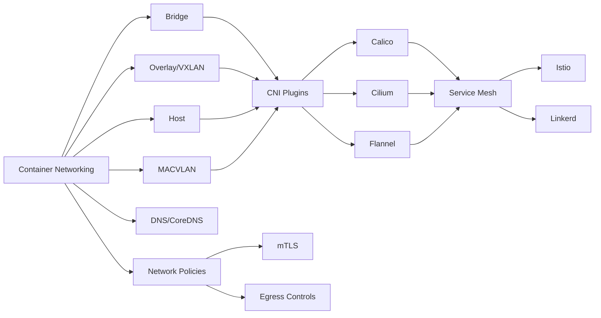

# Chapter 16: Container Networking

> **Previous:** [Database DevOps](./15-database-devops.md) | **Next:** [SRE Principles](./17-sre.md)

## Learning Objectives

By the end of this chapter, students will be able to:

<!-- Image Gallery -->
<section class="lesson-visuals" aria-label="Visual learning resources">
  <header><span>VISUAL LEARNING</span><h2>See it. Review it. Remember it.</h2></header>
  <a class="lesson-visual-card" href="../../assets/images/lessons/devops/16-networking/handwritten-notes.png" target="_blank" rel="noopener">
    
    <span><strong>Handwritten notes</strong>Condensed notes for deliberate review.</span>
  </a>
  <a class="lesson-visual-card" href="../../assets/images/lessons/devops/16-networking/sticky-notes.png" target="_blank" rel="noopener">
    
    <span><strong>Sticky-note revision</strong>Fast recall prompts for revision.</span>
  </a>
  <a class="lesson-visual-card" href="../../assets/images/lessons/devops/16-networking/visual-explanation.png" target="_blank" rel="noopener">
    
    <span><strong>Visual concept guide</strong>A connected explanation of the key ideas.</span>
  </a>
</section>
<!-- End Image Gallery -->


1. Explain container networking models: CNI, bridge, overlay, and their implementations
2. Compare CNI plugins: Flannel, Calico, Weave, and Cilium
3. Deploy and configure a service mesh (Istio, Linkerd) for traffic management and security
4. Configure ingress controllers including NGINX, Traefik, HAProxy, and Envoy
5. Implement network policies, mTLS, egress controls, and API gateways
6. Understand Kubernetes DNS, service discovery, and CoreDNS configuration
7. Apply network security patterns to microservice architectures

## Chapter at a Glance

| Topic | Key Insight | Practical Takeaway |
|-------|-------------|-------------------|
| Container Networking Models | Bridge, overlay, host, MACVLAN | Choose based on isolation and performance needs |
| CNI Plugins | Flannel, Calico, Weave, Cilium | Calico for policy; Cilium for eBPF performance |
| Service Mesh | Istio, Linkerd for traffic management | Sidecar proxies enable mTLS without code changes |
| Ingress Controllers | NGINX, Traefik, HAProxy, Envoy | NGINX is most widely adopted; Envoy powers Istio |
| mTLS | Mutual TLS for service-to-service security | Service meshes implement mTLS transparently |
| Network Policies | Kubernetes-native firewall rules | Deny-by-default when policy is applied |
| Egress Controls | Restrict outbound traffic | Use NetworkPolicy egress rules and egress gateways |

## Chapter Roadmap



## Theory

### 16.1 Container Networking Models


Container networking enables communication between containers on the same host and across hosts. Multiple networking models exist:

**Bridge Networking** — Default Docker networking:
- Creates a virtual bridge (docker0) on the host
- Assigns IP addresses from a private subnet (172.17.0.0/16)
- NAT enables outbound connectivity
- Containers communicate via IP or DNS names (--link)
- Port mapping (-p 8080:80) exposes container ports on the host

**Overlay Networking** — Encapsulates container traffic across hosts:
- Uses VXLAN (Virtual Extensible LAN) or similar tunneling
- Encapsulates Layer 2 frames in UDP packets
- Enables multi-host container communication without physical network changes
- Docker overlay, Flannel VXLAN, Calico IPIP, and Weave use this model
- Trade-off: encapsulation adds ~5-10% CPU overhead

**Host Networking** — Container uses the host's network stack:
- No network isolation between container and host
- No NAT overhead — full native performance
- Ports cannot be remapped (container port = host port)
- Best for latency-sensitive workloads (e.g., real-time services)
- Security consideration: container has full host network access

**MACVLAN/IPVLAN** — Assigns MAC or IP addresses from the physical network:
- Containers appear as separate hosts with their own IPs
- Best performance (no NAT, no encapsulation)
- Requires physical network configuration (switch port allocation)
- MACVLAN: each container gets a unique MAC (may exceed switch MAC limits)
- IPVLAN: containers share the host MAC, get unique IPs

| Model | Isolation | Performance | Multi-Host | Configuration |
|-------|-----------|-------------|------------|---------------|
| Bridge | Moderate | Moderate | No (without overlay) | Simple |
| Overlay | High | Moderate (encap overhead) | Yes | Moderate |
| Host | None | Native | N/A | None |
| MACVLAN | Moderate | Native | No | Complex (network team) |

### 16.2 CNI (Container Network Interface)


CNI is a specification and library for configuring network interfaces in Linux containers. Kubernetes uses CNI plugins for pod networking.

**CNI Specification Operations:**
- **ADD** — Add container to network: allocate IP, create interface, configure routes
- **DEL** — Remove container from network: clean up IP allocation, delete interface
- **CHECK** — Verify container network is correctly configured (idempotent)
- **VERSION** — Report CNI specification version

**Plugin Categories:**
- **Main plugins** — Bridge, VLAN, MACVLAN, IPVLAN, IPvlan
- **IPAM plugins** — host-local (static pool), dhcp (external DHCP), whereabout (dynamic)
- **Meta plugins** — tuning (sysctl), portmap (port forwarding), bandwidth (traffic shaping), firewall (iptables rules)
- **Third-party plugins** — Flannel, Calico, Weave, Cilium, Antrea

**CNI Configuration:**
```json
{
  "cniVersion": "1.0.0",
  "name": "mynet",
  "plugins": [
    {
      "type": "bridge",
      "bridge": "cni-bridge",
      "ipam": {
        "type": "host-local",
        "ranges": [
          [{"subnet": "10.244.0.0/16"}]
        ]
      }
    },
    {
      "type": "portmap",
      "capabilities": {"portMappings": true}
    }
  ]
}
```

### 16.3 CNI Plugins Compared


**Flannel** — Simplest overlay network:
- Uses VXLAN encapsulation (default), host-gw, or UDP
- No network policy support
- Simple deployment: `kubectl apply -f kube-flannel.yml`
- Best for: basic connectivity, small clusters, development

**Calico** — Full-featured CNI with advanced policy:
- Uses BGP for routing (no encapsulation in pure L3 mode)
- Supports VXLAN and IPIP overlay modes
- Fine-grained network policies (Kubernetes NetworkPolicy + Calico extensions)
- eBPF mode for improved performance (replaces kube-proxy)
- Service graph for observability
- Best for: security-conscious, production environments

**Weave Net** — Mesh-based overlay:
- Built-in DNS-based service discovery
- Default encryption (NaCl cryptography)
- Supports partial connectivity and firewall traversal
- Simple setup but lower performance than Calico or Cilium
- Best for: small to medium clusters requiring encryption

**Cilium** — eBPF-based networking and security:
- Replaces kube-proxy with eBPF for high-performance service handling
- L3-L7 network policies (HTTP, gRPC, Kafka, DNS-aware policies)
- Hubble for observability (flow logs, service map, metrics)
- Transparent encryption (WireGuard)
- Cluster mesh for multi-cluster networking
- Best for: performance-sensitive, security-conscious, advanced policy environments

| Plugin | Policy | Encryption | Performance | Multi-Cluster |
|--------|--------|------------|-------------|---------------|
| Flannel | No | No | Moderate | No |
| Calico | Full (L3-L4) | Yes (WireGuard) | High (eBPF) | Yes |
| Weave | Basic | Yes (NaCl) | Moderate | No |
| Cilium | Full (L3-L7) | Yes (WireGuard) | Very High (eBPF) | Yes (Cluster Mesh) |

### 16.4 Service Mesh


A service mesh manages inter-service communication in a microservice architecture. It adds observability, traffic management, and security without modifying application code.

**Architecture:**
- **Data Plane** — Sidecar proxies (Envoy) deployed alongside each service. Handle all traffic in/out of the service. Enforce routing, retries, timeouts, circuit breaking, and mTLS.
- **Control Plane** — Manages proxy configuration, certificate issuance, policy distribution, and telemetry collection.

**Istio** — Most feature-rich service mesh:
- **Pilot** — Traffic management: virtual services, destination rules, service discovery
- **Citadel** — Security: mTLS certificate issuance and rotation
- **Galley** — Configuration validation and distribution
- Uses Envoy as the default proxy (sidecar injection via mutating webhook)

```yaml
# Istio VirtualService for traffic splitting
apiVersion: networking.istio.io/v1beta1
kind: VirtualService
metadata:
  name: api-routes
spec:
  hosts:
    - api
  http:
    - match:
        - headers:
            version:
              exact: v2
      route:
        - destination:
            host: api
            subset: v2
    - route:
        - destination:
            host: api
            subset: v1
          weight: 90
        - destination:
            host: api
            subset: v2
          weight: 10
```

**Linkerd** — Lighter-weight service mesh:
- Rust-based proxy (linkerd-proxy) instead of Envoy — 1/10th the resource usage
- Simpler to install and operate (one command, no complex CRDs)
- Features: mTLS, HTTP/gRPC load balancing, retries, timeouts, metrics
- Limited traffic management compared to Istio
- Best for: teams wanting service mesh benefits without complexity

### 16.5 Ingress Controllers


Ingress controllers implement the Kubernetes Ingress specification and provide HTTP routing, TLS termination, and traffic management at the cluster edge.

**NGINX Ingress Controller** — Most widely adopted:
- Uses NGINX as the reverse proxy
- Path-based routing, host-based routing, TLS termination
- Annotations for rate limiting, CORS, rewrite, authentication
- High performance (NGINX C-based core)
- Extensive community and ecosystem

```yaml
apiVersion: networking.k8s.io/v1
kind: Ingress
metadata:
  name: api-ingress
  annotations:
    nginx.ingress.kubernetes.io/rate-limit: "10r/s"
    nginx.ingress.kubernetes.io/cors-enabled: "true"
spec:
  ingressClassName: nginx
  tls:
    - hosts:
        - api.example.com
      secretName: api-tls
  rules:
    - host: api.example.com
      http:
        paths:
          - path: /v1
            pathType: Prefix
            backend:
              service:
                name: api-v1
                port:
                  number: 8080
          - path: /v2
            pathType: Prefix
            backend:
              service:
                name: api-v2
                port:
                  number: 8080
```

**Traefik** — Dynamic, auto-discovering reverse proxy:
- Automatically detects services from Kubernetes, Docker, Consul
- Built-in dashboard and metrics
- Supports automatic HTTPS with Let's Encrypt
- Middleware for rate limiting, circuit breaking, authentication

**HAProxy Ingress** — High-performance ingress:
- Advanced load balancing algorithms (least connections, first, source)
- Health checks, rate limiting, connection queuing
- Low resource usage at high throughput

**Envoy** — High-performance proxy:
- Foundation for Istio and other service meshes
- Can be used as standalone ingress controller (Envoy Gateway project)
- Feature-rich but complex to configure manually
- L7 routing, load balancing, circuit breaking, retries

### 16.6 DNS in Kubernetes


CoreDNS is the default DNS service for Kubernetes. It provides service discovery within the cluster.

**DNS Naming Convention:**
- `service.namespace.svc.cluster.local` — Full DNS name
- `service.namespace` — Within cluster
- `service` — Within the same namespace

**CoreDNS Configuration:**
CoreDNS configuration is stored in a ConfigMap (`coredns` in `kube-system`). Custom entries, stub domains, and upstream DNS resolvers can be configured.

### 16.7 Network Policies


Network policies enforce firewall rules for Kubernetes pods. They control ingress and egress traffic based on pod selectors, namespace selectors, and IP blocks.

**Default Behavior:** By default, all pods can communicate freely. A policy applied to a pod restricts its traffic to only what the policy allows.

```yaml
apiVersion: networking.k8s.io/v1
kind: NetworkPolicy
metadata:
  name: api-network-policy
spec:
  podSelector:
    matchLabels:
      app: api
  policyTypes:
    - Ingress
    - Egress
  ingress:
    - from:
        - podSelector:
            matchLabels:
              app: frontend
      ports:
        - port: 8080
  egress:
    - to:
        - podSelector:
            matchLabels:
              app: database
      ports:
        - port: 5432
```

**Network Policy Rules:**
- **podSelector** — Selects pods within the same namespace
- **namespaceSelector** — Selects entire namespaces
- **ipBlock** — Selects specific CIDR ranges (external IPs)
- Multiple rules are OR'd (any matching rule allows traffic)
- Rules within a rule are AND'd (all conditions must match)

### 16.8 mTLS


Mutual TLS encrypts and authenticates service-to-service communication:

- Both client and server present certificates
- Communication is encrypted in transit
- Identity is verified at both ends
- Certificates rotate automatically (in service meshes or cert-manager)
- No application code changes required with service mesh sidecars

### 16.9 Egress Controls


Egress controls restrict outbound traffic from the cluster:

- **NetworkPolicy egress rules** — Kubernetes-native egress restrictions
- **Egress gateway** — Istio egress gateways for controlled external traffic through dedicated proxy instances
- **NAT gateway** — Cloud provider NAT for controlled outbound access from private subnets
- **Proxy/Firewall** — Explicit proxy for external access logging and control

### 16.10 API Gateways


API gateways provide a single entry point for external API traffic:

- **Kong** — Built on OpenResty/Lua. Plugin ecosystem (authentication, rate limiting, caching, logging, IP restriction).
- **Kong Gateway** — Kubernetes-native via Ingress Controller and Gateway API
- **Apigee (GCP)** — Full-featured API management with developer portal, analytics, monetization
- **AWS API Gateway** — AWS-managed gateway with Lambda integration, caching, throttling, WAF
- **Azure API Management** — Enterprise gateway with developer portal, policy engine, versioning

---

## Examples

### Example 1: NetworkPolicy Generator

```typescript
interface NetworkRule {
  direction: 'ingress' | 'egress';
  targets: Array<{ type: 'pod' | 'namespace' | 'ip'; value: string }>;
  ports: number[];
  protocol: 'TCP' | 'UDP';
}

interface NetworkPolicyConfig {
  name: string;
  namespace: string;
  podSelector: Record<string, string>;
  rules: NetworkRule[];
}

class NetworkPolicyGenerator {
  generate(config: NetworkPolicyConfig): string {
    const ingress = config.rules.filter(r => r.direction === 'ingress');
    const egress = config.rules.filter(r => r.direction === 'egress');

    const policy: Record<string, unknown> = {
      apiVersion: 'networking.k8s.io/v1',
      kind: 'NetworkPolicy',
      metadata: { name: config.name, namespace: config.namespace },
      spec: {
        podSelector: { matchLabels: config.podSelector },
        policyTypes: [] as string[],
      },
    };

    if (ingress.length > 0) {
      (policy.spec as Record<string, unknown>).policyTypes = [...(policy.spec as Record<string, unknown>).policyTypes as string[], 'Ingress'];
      (policy.spec as Record<string, unknown>).ingress = ingress.map(this.buildRule);
    }

    if (egress.length > 0) {
      (policy.spec as Record<string, unknown>).policyTypes = [...(policy.spec as Record<string, unknown>).policyTypes as string[], 'Egress'];
      (policy.spec as Record<string, unknown>).egress = egress.map(this.buildRule);
    }

    return JSON.stringify(policy, null, 2);
  }

  private buildRule(rule: NetworkRule): Record<string, unknown> {
    const ruleObj: Record<string, unknown> = {};

    if (rule.targets.length > 0) {
      const from = rule.direction === 'ingress' ? 'from' : 'to';
      ruleObj[from] = rule.targets.map(t => {
        if (t.type === 'pod') return { podSelector: { matchLabels: { app: t.value } } };
        if (t.type === 'namespace') return { namespaceSelector: { matchLabels: { name: t.value } } };
        return { ipBlock: { cidr: t.value } };
      });
    }

    if (rule.ports.length > 0) {
      ruleObj.ports = rule.ports.map(p => ({ port: p, protocol: rule.protocol }));
    }

    return ruleObj;
  }

  generateDefaultDeny(namespace: string): string {
    return JSON.stringify({
      apiVersion: 'networking.k8s.io/v1',
      kind: 'NetworkPolicy',
      metadata: { name: 'default-deny-all', namespace },
      spec: {
        podSelector: {},
        policyTypes: ['Ingress', 'Egress'],
      },
    }, null, 2);
  }
}

const generator = new NetworkPolicyGenerator();
const config: NetworkPolicyConfig = {
  name: 'api-policy',
  namespace: 'production',
  podSelector: { app: 'api' },
  rules: [
    { direction: 'ingress', targets: [{ type: 'pod', value: 'frontend' }], ports: [8080], protocol: 'TCP' },
    { direction: 'egress', targets: [{ type: 'pod', value: 'database' }], ports: [5432], protocol: 'TCP' },
    { direction: 'egress', targets: [{ type: 'ip', value: '8.8.8.8/32' }], ports: [53], protocol: 'UDP' },
  ],
};

console.log(generator.generate(config));
```

### Example 2: Service Mesh Traffic Splitter

```typescript
interface VirtualServiceRule {
  headers?: Record<string, string>;
  weight: number;
  destination: { host: string; subset: string };
}

class ServiceMeshConfigBuilder {
  buildTrafficSplit(name: string, host: string, rules: VirtualServiceRule[]): string {
    const http = rules.map(rule => {
      const route = { destination: rule.destination, weight: rule.weight };
      if (rule.headers) {
        return { match: [{ headers: Object.fromEntries(Object.entries(rule.headers).map(([k, v]) => [k, { exact: v }])) }], route: [route] };
      }
      return { route: [route] };
    });

    const vs = {
      apiVersion: 'networking.istio.io/v1beta1',
      kind: 'VirtualService',
      metadata: { name },
      spec: { hosts: [host], http },
    };

    const dr = {
      apiVersion: 'networking.istio.io/v1beta1',
      kind: 'DestinationRule',
      metadata: { name: `${name}-dr` },
      spec: {
        host,
        subsets: rules.map(r => ({
          name: r.destination.subset,
          labels: { version: r.destination.subset },
        })),
      },
    };

    return JSON.stringify({ virtualService: vs, destinationRule: dr }, null, 2);
  }

  buildCanary(name: string, host: string, stableSubset: string, canarySubset: string, canaryWeight: number): string {
    return this.buildTrafficSplit(name, host, [
      { weight: 100 - canaryWeight, destination: { host, subset: stableSubset } },
      { headers: { 'X-Canary': 'true' }, weight: canaryWeight, destination: { host, subset: canarySubset } },
    ]);
  }
}

const builder = new ServiceMeshConfigBuilder();
console.log(builder.buildCanary('api-canary', 'api', 'v1', 'v2', 10));
```

### Example 3: Network Topology Mapper

```typescript
interface ServiceEndpoint {
  name: string;
  namespace: string;
  ports: number[];
  protocol: string;
  ingress: boolean;
  egress: Array<{ target: string; port: number; protocol: string }>;
}

class NetworkTopologyMapper {
  private services: ServiceEndpoint[] = [];

  addService(svc: ServiceEndpoint): void {
    this.services.push(svc);
  }

  buildDependencyGraph(): string {
    let graph = '```mermaid\nflowchart LR\n';

    for (const svc of this.services) {
      const id = svc.name.replace(/[^a-zA-Z0-9]/g, '');
      if (svc.ingress) {
        graph += `    Ingress -->|":${svc.ports[0]}"| ${id}[${svc.name}]\n`;
      }

      for (const egress of svc.egress) {
        const targetId = egress.target.replace(/[^a-zA-Z0-9]/g, '');
        graph += `    ${id} -->|":${egress.port}"| ${targetId}[${egress.target}]\n`;
      }
    }

    graph += '```\n';
    return graph;
  }

  buildServiceDepList(): string {
    let report = '# Service Dependency Report\n\n';

    for (const svc of this.services) {
      report += `## ${svc.name}\n`;
      report += `- Namespace: ${svc.namespace}\n`;
      report += `- Ports: ${svc.ports.join(', ')}\n`;
      report += `- External access: ${svc.ingress ? 'Yes' : 'No (internal only)'}\n`;

      if (svc.egress.length > 0) {
        report += '- Dependencies:\n';
        for (const dep of svc.egress) {
          report += `  - ${dep.target}:${dep.port}/${dep.protocol}\n`;
        }
      }

      report += '\n';
    }

    return report;
  }
}

const mapper = new NetworkTopologyMapper();
mapper.addService({ name: 'frontend', namespace: 'prod', ports: [80, 443], protocol: 'TCP', ingress: true, egress: [{ target: 'api', port: 8080, protocol: 'HTTP' }] });
mapper.addService({ name: 'api', namespace: 'prod', ports: [8080], protocol: 'TCP', ingress: false, egress: [{ target: 'database', port: 5432, protocol: 'PostgreSQL' }, { target: 'cache', port: 6379, protocol: 'Redis' }] });
mapper.addService({ name: 'database', namespace: 'prod', ports: [5432], protocol: 'TCP', ingress: false, egress: [] });
mapper.addService({ name: 'cache', namespace: 'prod', ports: [6379], protocol: 'TCP', ingress: false, egress: [] });

console.log(mapper.buildServiceDepList());
```

---

## Concept Comparison Table

| Concept | Description |
|---------|-------------|
| Bridge | Default Docker networking, NAT-based, single host |
| Overlay | VXLAN tunneling for multi-host communication |
| Service Mesh | Sidecar proxies for traffic mgmt and security |
| Ingress | HTTP/HTTPS external routing controller |
| mTLS | Mutual certificate-based service authentication |
| CNI | Container Network Interface specification |
| NetworkPolicy | Kubernetes-native firewall rules |

## Quick Reference

| Topic | Key Points |
|-------|------------|
| CNI Plugins | Flannel(simple), Calico(policy), Cilium(eBPF) |
| Service Mesh | Istio(feature-rich), Linkerd(lightweight) |
| Ingress | NGINX, Traefik, HAProxy, Envoy |
| DNS | CoreDNS, service.namespace.svc.cluster.local |
| mTLS | Mutual TLS with automatic cert rotation |
| NetworkPolicy | podSelector, ingress, egress, port rules |

## Cross-Application Matrix

| Domain | Application |
|--------|-------------|
| Web | HTTP ingress routing for web apps |
| Cloud | Multi-cloud networking via overlays |
| Enterprise | mTLS for zero-trust compliance |
| Microservices | Service mesh traffic management |

### Load Balancer Configuration Validator

Network load balancer misconfigurations are a common source of outages. The following tool validates health checks, SSL settings, routing rules, and timeout configurations.

```typescript
interface HealthCheckConfig {
  protocol: string;
  port: number;
  path: string;
  intervalSeconds: number;
  timeoutSeconds: number;
  healthyThreshold: number;
  unhealthyThreshold: number;
}

interface ListenerRule {
  sourcePort: number;
  targetPort: number;
  protocol: string;
  sslEnabled: boolean;
  sslCertArn?: string;
}

interface LBConfig {
  name: string;
  listeners: ListenerRule[];
  healthChecks: HealthCheckConfig[];
  backendPool: string[];
  algorithm: 'round-robin' | 'least-connections' | 'ip-hash';
}

interface ValidationReport {
  valid: boolean;
  errors: string[];
  warnings: string[];
}

class LoadBalancerValidator {
  validate(config: LBConfig): ValidationReport {
    const errors: string[] = [];
    const warnings: string[] = [];

    for (const listener of config.listeners) {
      if (listener.sslEnabled && !listener.sslCertArn) {
        errors.push(`Listener ${listener.sourcePort}: SSL enabled but no certificate ARN specified`);
      }
      if (listener.sourcePort === listener.targetPort && listener.protocol === 'TCP') {
        warnings.push(`Listener ${listener.sourcePort}: TCP passthrough, no health-check routing`);
      }
    }

    for (const hc of config.healthChecks) {
      if (hc.intervalSeconds < hc.timeoutSeconds) {
        errors.push(`Health check interval (${hc.intervalSeconds}s) must be >= timeout (${hc.timeoutSeconds}s)`);
      }
      if (hc.healthyThreshold < 2) warnings.push(`Health check healthy threshold too low (${hc.healthyThreshold})`);
      if (hc.unhealthyThreshold > 10) warnings.push(`Health check unhealthy threshold too high (${hc.unhealthyThreshold})`);
    }

    if (config.backendPool.length === 0) {
      errors.push('Backend pool is empty — no targets to route traffic to');
    }
    if (config.backendPool.length === 1) {
      warnings.push('Only one backend target — no redundancy');
    }

    return { valid: errors.length === 0, errors, warnings };
  }

  autoFix(config: LBConfig): LBConfig {
    const fixed = JSON.parse(JSON.stringify(config)) as LBConfig;
    for (const listener of fixed.listeners) {
      if (listener.sslEnabled && !listener.sslCertArn) {
        listener.sslCertArn = 'arn:aws:acm:us-east-1:123456789012:certificate/pending';
      }
    }
    for (const hc of fixed.healthChecks) {
      if (hc.intervalSeconds < hc.timeoutSeconds) hc.intervalSeconds = hc.timeoutSeconds + 5;
      if (hc.healthyThreshold < 2) hc.healthyThreshold = 2;
    }
    return fixed;
  }
}

const config: LBConfig = {
  name: 'web-lb',
  listeners: [{ sourcePort: 443, targetPort: 8080, protocol: 'HTTPS', sslEnabled: true, sslCertArn: '' }],
  healthChecks: [{ protocol: 'HTTP', port: 8080, path: '/health', intervalSeconds: 10, timeoutSeconds: 15, healthyThreshold: 1, unhealthyThreshold: 15 }],
  backendPool: ['web-1', 'web-2'],
  algorithm: 'round-robin',
};

const validator = new LoadBalancerValidator();
console.log('Validation:', JSON.stringify(validator.validate(config), null, 2));
const fixed = validator.autoFix(config);
console.log('Auto-fixed SSL cert:', fixed.listeners[0].sslCertArn);
console.log('Auto-fixed interval:', fixed.healthChecks[0].intervalSeconds);
```

**What this demonstrates:** Automated load balancer validation catches SSL, health check, and redundancy misconfigurations before they cause production outages.

---

## Chapter Quiz

<details><summary>Question 1: Which CNI plugin uses eBPF?</summary>**A)** Flannel<br>**B)** Calico<br>**C)** Cilium<br>**D)** Weave<br><br>**Answer: C)** Cilium&lt;/details&gt;

<details><summary>Question 2: How does a service mesh proxy intercept traffic?</summary>**A)** DNS redirection<br>**B)** Sidecar proxy intercepts all in/out traffic<br>**C)** Application code modification<br>**D)** Virtual IP addresses<br><br>**Answer: B)** Sidecar proxy intercepts all in/out traffic&lt;/details&gt;

<details><summary>Question 3: What does mTLS provide beyond TLS?</summary>**A)** Faster encryption<br>**B)** Mutual client and server authentication<br>**C)** Lower latency<br>**D)** Compression<br><br>**Answer: B)** Mutual client and server authentication&lt;/details&gt;

<details><summary>Question 4: What is the default pod communication behavior in Kubernetes?</summary>**A)** Deny all<br>**B)** Allow all<br>**C)** Only same namespace<br>**D)** Only specific ports<br><br>**Answer: B)** Allow all&lt;/details&gt;

<details><summary>Question 5: Which ingress controller is most widely adopted?</summary>**A)** Traefik<br>**B)** NGINX<br>**C)** HAProxy<br>**D)** Envoy<br><br>**Answer: B)** NGINX&lt;/details&gt;

---


// networking
// cicd-infrastructure-automation implementation

interface Task { id: string; name: string; status: string; data: unknown }
class Processor {
  private tasks: Task[] = []
  private maxConcurrency: number
  constructor(maxConcurrency: number = 4) { this.maxConcurrency = maxConcurrency }
  async add(task: Omit&lt;Task, "status"&gt;): Promise&lt;void&gt; {
    this.tasks.push({ ...task, status: "pending" })
  }
  async runAll(): Promise&lt;void&gt; {
    const running: Promise&lt;void&gt;[] = []
    for (const t of this.tasks) {
      if (running.length >= this.maxConcurrency) { await Promise.race(running) }
      const p = this.execute(t).finally(() => { const i = running.indexOf(p); if (i >= 0) running.splice(i, 1) })
      running.push(p)
    }
    await Promise.all(running)
  }
  private async execute(t: Task): Promise&lt;void&gt; {
    t.status = "running"
    await new Promise(r => setTimeout(r, 10))
    t.status = "done"
  }
  getResults(): Task[] { return this.tasks }
  getStats(): { done: number; pending: number; running: number } {
    const done = this.tasks.filter(t => t.status === "done").length
    const pending = this.tasks.filter(t => t.status === "pending").length
    const running = this.tasks.filter(t => t.status === "running").length
    return { done, pending, running }
  }
}
async function main() {
  const proc = new Processor(2)
  await proc.add({ id: '1', name: 'networking', data: { topic: 'cicd-infrastructure-automation' } })
  await proc.runAll()
  console.log('Stats:', proc.getStats())
}
main().catch(console.error)
export { Processor, Task }
## Summary

Container networking spans multiple models and implementation options with trade-offs between isolation, performance, and complexity. CNI plugins (Flannel, Calico, Cilium, Weave) provide standardized network configuration for Kubernetes with varying levels of policy support and performance. Service meshes (Istio, Linkerd) add traffic management, mTLS security, and observability to inter-service communication through sidecar proxies. Ingress controllers (NGINX, Traefik, HAProxy, Envoy) manage external traffic routing into the cluster. Network policies enforce Kubernetes-native firewall rules for least-privilege pod communication. The choice of networking technologies depends on security requirements, performance needs, and operational maturity.

---

## Exercises

### Review Questions

1. How does VXLAN overlay networking enable multi-host container communication?
2. Compare Calico and Flannel: what capabilities does Calico provide beyond Flannel?
3. How does a service mesh sidecar proxy intercept traffic without application modification?
4. What is the difference between an ingress controller and a service mesh?
5. How does mTLS establish trust between two services without a pre-shared secret?

### Application Problems

1. Deploy a Kubernetes cluster with Calico as the CNI plugin. Create NetworkPolicies that allow web-tier pods to access API-tier pods on port 8080, but deny all other traffic to the API tier. Verify connectivity with test pods.
2. Install Istio on a Kubernetes cluster. Enable automatic sidecar injection. Deploy a microservice application and enable mTLS. Verify encrypted communication using tcpdump or Hubble.
3. Configure an NGINX ingress controller with TLS termination. Route traffic to two different services based on host headers (api.example.com -> api-service, app.example.com -> web-service).

### Challenge Problem

Design a complete network architecture for a multi-tenant Kubernetes platform hosting 50 microservices for 10 teams. Requirements: each team operates in isolated namespaces with strict egress controls (only approved external endpoints), inter-service communication uses mTLS, traffic shaping enables 10% canary deployments, network policies enforce least-privilege communication, and ingress is handled through a shared gateway with per-service TLS. Select and justify: CNI plugin, service mesh, ingress controller, certificate management approach, and DNS strategy. Provide the network topology diagram and key configuration examples.
