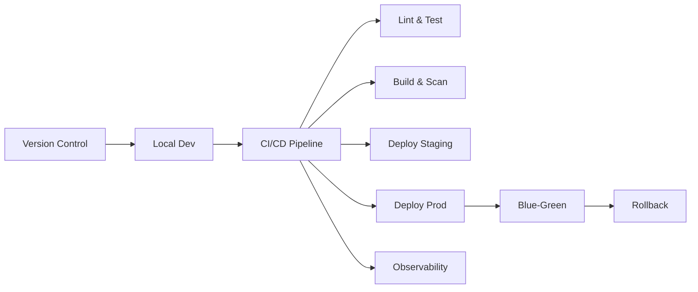
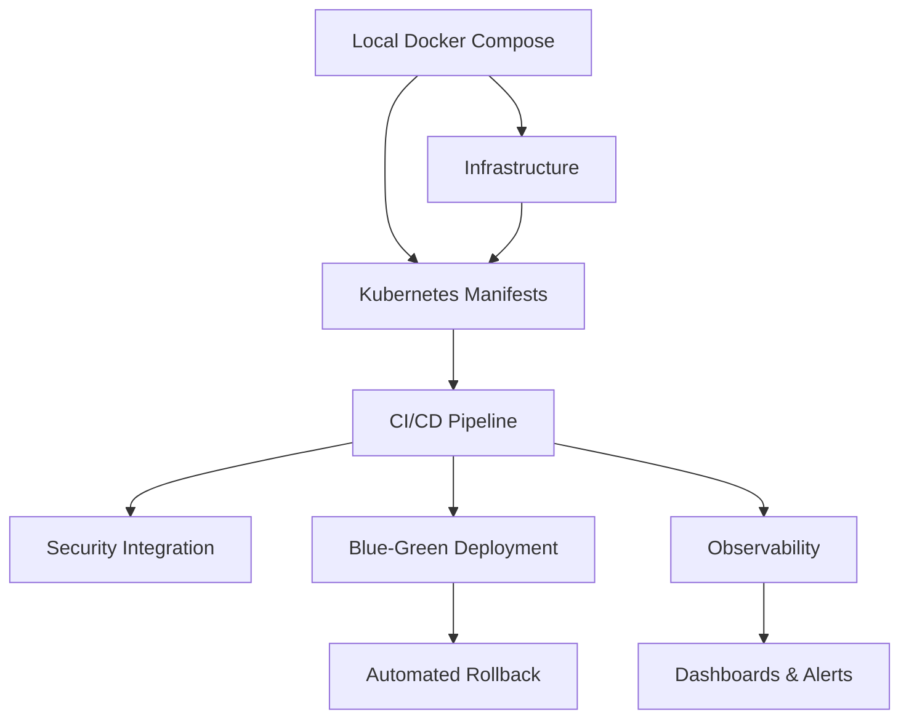
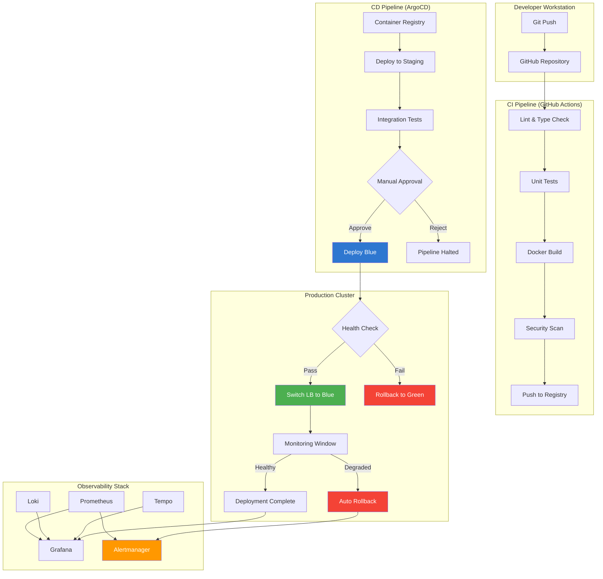

# Chapter 18: Capstone Project

> **Previous:** [SRE Principles](./17-sre.md)

## Learning Objectives


<!-- Image Gallery -->
<section class="lesson-visuals" aria-label="Visual learning resources">
  <header><span>VISUAL LEARNING</span><h2>See it. Review it. Remember it.</h2></header>
  <a class="lesson-visual-card" href="../../assets/images/lessons/devops/18-capstone/handwritten-notes.png" target="_blank" rel="noopener">
    
    <span><strong>Handwritten notes</strong>Condensed notes for deliberate review.</span>
  </a>
  <a class="lesson-visual-card" href="../../assets/images/lessons/devops/18-capstone/sticky-notes.png" target="_blank" rel="noopener">
    
    <span><strong>Sticky-note revision</strong>Fast recall prompts for revision.</span>
  </a>
  <a class="lesson-visual-card" href="../../assets/images/lessons/devops/18-capstone/visual-explanation.png" target="_blank" rel="noopener">
    
    <span><strong>Visual concept guide</strong>A connected explanation of the key ideas.</span>
  </a>
</section>
<!-- End Image Gallery -->


By the end of this chapter, students will be able to:

1. Design and implement a complete CI/CD pipeline integrating all tools covered in the course
2. Deploy a multi-service application to Kubernetes with monitoring and observability
3. Provision cloud infrastructure using Terraform with secure, scalable patterns
4. Integrate security scanning at every stage of the delivery pipeline
5. Implement blue-green deployment with automated rollback
6. Produce comprehensive documentation of the architecture and operational procedures


## Chapter at a Glance

| Topic | Key Insight | Practical Takeaway |
|-------|-------------|-------------------|
| Pipeline Design | Lint/Test, Build/Scan, Deploy Staging, Deploy Prod, Observe | Incremental implementation from lint/test first |
| Infrastructure as Code | VPC, K8s, DB, Container Registry via Terraform | Provision infrastructure before deploying apps |
| Kubernetes Deployment | Frontend, API, Database with Ingress, HPA, PDB | StatefulSet for DB; HPA for API auto-scaling |
| Blue-Green Deployment | Color-labeled deployments with service switch | Zero-downtime traffic migration with rollback |
| Observability | Prometheus, Grafana, Loki for metrics/logs | RED metrics dashboard with alert rules |

## Chapter Roadmap



## Theory

### 18.1 Capstone Design Philosophy


The capstone project is the culminating assessment of DevOps mastery. Unlike individual chapter exercises that focus on isolated skills, the capstone requires integration across the entire toolchain. The design philosophy follows three principles:

**Integration over Isolation** — Individual tools (Docker, Kubernetes, Terraform, Prometheus) are easy to learn in isolation. The capstone tests whether you can compose them into a working system where each component correctly interfaces with its neighbors.

**Production Realism** — The pipeline must handle real-world concerns: zero-downtime deployments, automated rollback on failure, security scanning gates that block vulnerable code, and observability that provides actionable insight. Toy exercises are replaced with production-grade patterns.

**Incremental Build** — The project is too large to build in one pass. The recommended sequence is: local Docker Compose ? Terraform infrastructure ? Kubernetes manifests ? CI/CD pipeline ? blue-green ? observability ? security. Each step builds on the previous one.

### 18.2 Project Planning and Estimation


DevOps engineers must estimate work and sequence dependencies. This capstone requires 40-60 hours of work depending on experience level:

| Phase | Tasks | Estimated Time |
|-------|-------|----------------|
| 1. Setup & Local Dev | Repository structure, Docker Compose, Makefile | 4-6 hours |
| 2. Infrastructure | Terraform VPC, K8s cluster, database, registry | 8-10 hours |
| 3. Kubernetes | Deployments, Services, Ingress, HPA, PDB, NetworkPolicy | 8-10 hours |
| 4. CI/CD Pipeline | GitHub Actions workflows, quality gates, artifact management | 8-10 hours |
| 5. Blue-Green | Deployment color logic, service switch, monitoring window, rollback | 6-8 hours |
| 6. Observability | Prometheus, Grafana, Loki, alerts, dashboards | 4-6 hours |
| 7. Security | SAST, secret scanning, container scanning, DAST, SCA | 3-4 hours |
| 8. Documentation | README, architecture diagram, runbook, presentation | 4-6 hours |

**Dependency Graph:**


### 18.3 Pipeline Stage Design


Each pipeline stage has a specific purpose, trigger, and gate:

**Stage 1 — Lint & Test (trigger: every push)**
- Purpose: Catch code quality and logic errors early
- Gate: Zero lint errors, 80%+ test coverage, zero SAST high findings
- Fast feedback loop (< 5 minutes)

**Stage 2 — Build & Scan (trigger: push to main)**
- Purpose: Produce container images with verified security posture
- Gate: No CRITICAL or HIGH vulnerabilities in container scan, SBOM generated
- Artifact: Container images tagged with commit SHA

**Stage 3 — Deploy Staging (trigger: successful Stage 2)**
- Purpose: Validate deployment in production-like environment
- Gate: Integration tests pass, DAST scan finds no HIGH findings
- Contains: Database migrations run before app deploy

**Stage 4 — Deploy Production (trigger: manual approval after Stage 3)**
- Purpose: Zero-downtime release to production
- Gate: Smoke tests pass, 10-minute monitoring window with error rate &lt; 1%
- Fallback: Automatic rollback if gate fails

**Stage 5 — Observe (continuous)**
- Purpose: Provide visibility into system health
- Alert thresholds: Error rate > 1% for 5 minutes, p95 latency > 500ms, pod crash loops

### 18.4 Risk Mitigation Strategies


| Risk | Impact | Mitigation |
|------|--------|------------|
| Cloud costs exceed budget | Financial overrun | Use free tiers, destroy resources when not in use, set budget alerts |
| Pipeline takes too long | Developer frustration | Parallelize stages, cache dependencies, optimize build |
| Blue-green fails during deployment | Production outage | Manual rollback procedure documented and tested in staging |
| Security scan false positives | Pipeline blocked | Vulnerability exceptions with documented justification in policy file |
| Database migration conflicts | Data loss or corruption | Always run migrations in staging first, backup database before production deploy |

## Project Overview

You will build a complete DevOps pipeline for a sample e-commerce application. The application consists of three microservices:

- **Frontend** — React single-page application served by Nginx
- **API** — Node.js or Go REST API service
- **Database** — PostgreSQL

The pipeline must automate build, test, security scan, deploy, monitor, and rollback. All infrastructure is provisioned through code. All operations are observable.

## Architecture Requirements

> **One-Sentence Takeaway:** The capstone integrates all DevOps topics into a single cohesive CI/CD pipeline system.

### 1. Version Control

> **Pro Tip:** Start with Terraform infrastructure first, then test locally with Docker Compose, then build the pipeline.

- Create a GitHub repository with the following directory structure:
```
/
├── frontend/          # React application
├── api/               # Node.js or Go API service
├── infra/             # Terraform configurations
├── k8s/               # Kubernetes manifests
├── scripts/           # Automation scripts
├── .github/           # CI/CD workflows
│   └── workflows/
├── docs/              # Documentation
├── docker-compose.yml # Local development
├── Makefile           # Development helpers
└── README.md
```

- Use trunk-based development with short-lived feature branches
- Enforce commit message conventions
- Implement branch protection rules requiring CI passing and code review

### 2. Local Development

> **Remember:** Implement CI/CD incrementally: lint/test first, then build, then deploy, then security.

- Docker Compose file for local development with hot-reload
- All three services start with `docker compose up`
- Database initializes with schema migrations
- Environment variables configured through `.env` file

### 3. CI/CD Pipeline (GitHub Actions)

> **Warning:** Test blue-green deployment manually before automating. Verify traffic switching works.

The pipeline must include the following stages:

**Stage 1: Lint and Test**
- Run linters (ESLint for JS, golangci-lint for Go)
- Run unit tests with coverage
- Run SAST scanning (Semgrep)
- Run secret scanning (GitLeaks)
- Quality gate: all must pass with zero HIGH findings

**Stage 2: Build and Scan**
- Build Docker images for frontend and API
- Scan images with Trivy (fail on CRITICAL vulnerabilities)
- Generate SBOM with Syft in CycloneDX format
- Push images to container registry

**Stage 3: Deploy to Staging**
- Deploy to staging Kubernetes namespace
- Apply database migrations
- Run integration tests against staging
- Run DAST scan (OWASP ZAP) against staging API

**Stage 4: Deploy to Production (Blue-Green)**
- Provision production infrastructure if not existing
- Deploy green environment alongside blue
- Run smoke tests against green
- Switch traffic to green via service selector update
- Monitor error rates for 10 minutes
- Rollback automatically if error rate exceeds threshold
- Notify team via Slack on success or rollback

**Stage 5: Observability**
- Deploy Prometheus and Grafana to monitoring namespace
- Deploy Loki for log aggregation
- Configure RED metrics dashboard
- Set up alerts for high error rate and latency

### 4. Infrastructure as Code (Terraform)

Provision the following on a cloud provider (AWS, Azure, or GCP):

- **Network**: VPC, public/private subnets, NAT gateway, security groups
- **Compute**: Kubernetes cluster (EKS, AKS, or GKE)
- **Storage**: S3 bucket (or equivalent) for Terraform state backend with DynamoDB locking
- **Database**: Managed PostgreSQL (RDS, Azure Database, or Cloud SQL)
- **Container Registry**: ECR, ACR, or GCR

Store Terraform state remotely with locking. Use modules for VPC and Kubernetes. Parameterize environment (staging vs production).

```hcl
# Minimum required: VPC module, K8s cluster, database, state backend
# Implementation details are left to the student
```

### 5. Kubernetes Deployment

Deploy the application to Kubernetes with:

- **Frontend**: Deployment with 2 replicas, ClusterIP Service, ConfigMap for API endpoint
- **API**: Deployment with 3 replicas, ClusterIP Service, ConfigMap and Secret for configuration
- **Database**: StatefulSet with persistent volume claim, headless Service
- **Ingress**: NGINX ingress controller with TLS
- **NetworkPolicy**: API pods accept traffic only from frontend pods; database accepts only from API
- **HPA**: API scales based on CPU utilization (target 70%)
- **PDB**: Minimum available for API is 2

### 6. Blue-Green Deployment

Implement blue-green deployment without downtime:

```yaml
# Deployment template with color label
apiVersion: apps/v1
kind: Deployment
metadata:
  name: api-{color}
  labels:
    app: api
    color: {color}
spec:
  replicas: 3
  selector:
    matchLabels:
      app: api
      color: {color}
  template:
    metadata:
      labels:
        app: api
        color: {color}
    spec:
      containers:
        - name: api
          image: {image}
```

The deployment script:
1. Deploys new color (green if blue is current)
2. Waits for all pods to be ready
3. Runs smoke tests against green
4. Updates Service selector to point to green
5. Monitors error rate for 10 minutes
6. On failure: revert Service selector to blue (rollback)
7. On success: delete blue deployment

### 7. Monitoring and Observability

- Deploy Prometheus using the Prometheus Operator (kube-prometheus-stack Helm chart)
- Configure node-exporter, kube-state-metrics
- Create a Grafana dashboard with panels for:
  - Request rate (RPS) per service
  - Error rate (% of 5xx responses)
  - Latency (p50, p95, p99)
  - Resource utilization (CPU, memory)
- Configure Loki for log aggregation with Promtail
- Set up alert rules:
  - High error rate (>1% for 5 minutes) → PagerDuty
  - High latency (p95 > 500ms for 5 minutes) → Slack notification
  - Pod crash loop → PagerDuty

### 8. Security Scanning

Integrate the following security tools in the pipeline:

- **SAST**: Semgrep on every push to any branch
- **Secret scanning**: GitLeaks in CI
- **Container scanning**: Trivy on every built image
- **SCA**: Dependabot for dependency updates
- **DAST**: ZAP baseline scan on staging deployment

### 9. Database Migrations

- Use Flyway or Alembic for schema migrations
- Migrations run as a Kubernetes Job before the API deployment
- Migration failure prevents deployment (pipeline gate)
- Include rollback migration scripts
- Test migration against staging database first

## Deliverables

> **One-Sentence Takeaway:** Trunk-based development with short-lived branches supports CI/CD velocity.

Submit the following:

1. **GitHub Repository** → Complete source code with all configurations
2. **README.md** → Architecture overview, setup instructions, deployment guide
3. **Pipeline Documentation** → Description of each stage, triggers, and gates
4. **Architecture Diagram** → System architecture including network, deployment, and data flow
5. **Runbook** → Operational procedures for deployment, rollback, incident response, and recovery
6. **Presentation** → 10-minute recorded walkthrough of the pipeline

## Evaluation Criteria

> **One-Sentence Takeaway:** Blue-green deployment with automated monitoring and rollback enables zero-downtime releases.

| Criterion | Weight | Description |
|-----------|--------|-------------|
| Pipeline completeness | 20% | All stages implemented and functional |
| Infrastructure as Code | 15% | Terraform configurations complete and modular |
| Kubernetes deployment | 15% | All K8s resources correctly configured |
| Monitoring & observability | 10% | Prometheus, Grafana, Loki operational |
| Security integration | 10% | All scanning stages operational with policy enforcement |
| Blue-green deployment | 10% | Zero-downtime deployment with rollback verified |
| Documentation quality | 10% | README, architecture diagram, runbook complete |
| Code quality | 5% | Clean, idiomatic, well-structured |
| Error handling | 5% | Pipeline handles failures gracefully |

## Hints and Guidance

> **One-Sentence Takeaway:** Security scanning at every stage ensures supply chain integrity and compliance.

- Start with the Terraform infrastructure. Provision the cluster first.
- Test the application locally with Docker Compose before deploying to Kubernetes.
- Implement the CI/CD pipeline incrementally: lint/test first, then build, then deploy.
- Test blue-green deployment manually before automating it.
- Use Helm charts from Artifact Hub for Prometheus and Loki rather than building from scratch.
- Document your design decisions and trade-offs as you go.


// capstone
// cicd-infrastructure-automation implementation

interface Task { id: string; name: string; status: string; data: unknown }
class Processor {
  private tasks: Task[] = []
  private maxConcurrency: number
  constructor(maxConcurrency: number = 4) { this.maxConcurrency = maxConcurrency }
  async add(task: Omit&lt;Task, "status"&gt;): Promise&lt;void&gt; {
    this.tasks.push({ ...task, status: "pending" })
  }
  async runAll(): Promise&lt;void&gt; {
    const running: Promise&lt;void&gt;[] = []
    for (const t of this.tasks) {
      if (running.length >= this.maxConcurrency) { await Promise.race(running) }
      const p = this.execute(t).finally(() => { const i = running.indexOf(p); if (i >= 0) running.splice(i, 1) })
      running.push(p)
    }
    await Promise.all(running)
  }
  private async execute(t: Task): Promise&lt;void&gt; {
    t.status = "running"
    await new Promise(r => setTimeout(r, 10))
    t.status = "done"
  }
  getResults(): Task[] { return this.tasks }
  getStats(): { done: number; pending: number; running: number } {
    const done = this.tasks.filter(t => t.status === "done").length
    const pending = this.tasks.filter(t => t.status === "pending").length
    const running = this.tasks.filter(t => t.status === "running").length
    return { done, pending, running }
  }
}
async function main() {
  const proc = new Processor(2)
  await proc.add({ id: '1', name: 'capstone', data: { topic: 'cicd-infrastructure-automation' } })
  await proc.runAll()
  console.log('Stats:', proc.getStats())
}
main().catch(console.error)
export { Processor, Task }
## Summary

## Concept Comparison Table

| Concept | Description |
|---------|-------------|
| CI/CD Pipeline | Lint/Test -> Build/Scan -> Deploy -> Observe |
| Terraform IaC | VPC, K8s cluster, database, registry |
| K8s Deploy | Deployments, Services, Ingress, HPA, PDB |
| Blue-Green | Color-label deployments, traffic switch, rollback |
| Observability | Prometheus metrics, Grafana dashboards, Loki logs |

## Quick Reference

| Topic | Key Points |
|-------|------------|
| Pipeline Stages | Lint/Test, Build/Scan, Deploy Staging, Deploy Prod, Observe |
| Terraform | VPC module, K8s cluster, database, state backend |
| K8s Objects | Deployment, StatefulSet, Service, Ingress, HPA, PDB, NetworkPolicy |
| Blue-Green | Color label, service selector switch, monitoring window, rollback |
| Security | SAST (Semgrep), Secret (GitLeaks), Container (Trivy), DAST (ZAP) |

## Cross-Application Matrix

| Domain | Application |
|--------|-------------|
| Web | Full pipeline for web application delivery |
| Cloud | Cloud-native CI/CD and infrastructure |
| Enterprise | Production-grade deployment standards |
| Startup | Blueprint for DevOps platform setup |

### DevOps Capstone Pipeline Orchestrator

The capstone project ties together all DevOps concepts. The following orchestrator models a complete pipeline with stages, gates, notifications, and reporting.

```typescript
interface PipelineStage {
  name: string;
  status: 'pending' | 'running' | 'passed' | 'failed' | 'skipped';
  duration: number; // seconds
  artifacts: string[];
  retries: number;
}

interface PipelineRun {
  id: string;
  commitSha: string;
  branch: string;
  stages: PipelineStage[];
  startedAt: Date;
  completedAt?: Date;
  triggeredBy: 'push' | 'pr' | 'manual' | 'schedule';
}

interface GateCondition {
  stage: string;
  condition: (run: PipelineRun) => boolean;
  errorMessage: string;
}

class PipelineOrchestrator {
  private gates: GateCondition[] = [];

  addGate(gate: GateCondition): void {
    this.gates.push(gate);
  }

  execute(run: PipelineRun, stage: string): PipelineStage[] {
    const stageNames = ['lint', 'unit-test', 'build', 'integration-test', 'security-scan', 'deploy-staging', 'e2e-test', 'deploy-production'];
    const currentIndex = stageNames.indexOf(stage);
    const results: PipelineStage[] = [];

    for (let i = 0; i < stageNames.length; i++) {
      if (i < currentIndex) {
        results.push({ name: stageNames[i], status: 'passed', duration: 30, artifacts: [], retries: 0 });
      } else if (i === currentIndex) {
        const failedGates = this.gates.filter(g => g.stage === stageNames[i] && !g.condition(run));
        if (failedGates.length > 0) {
          results.push({ name: stageNames[i], status: 'failed', duration: 0, artifacts: [], retries: 0 });
          break;
        }
        const stageResult: PipelineStage = { name: stageNames[i], status: 'running', duration: 0, artifacts: ['build.zip'], retries: 0 };
        stageResult.status = 'passed';
        stageResult.duration = 45;
        results.push(stageResult);
      } else {
        results.push({ name: stageNames[i], status: 'pending', duration: 0, artifacts: [], retries: 0 });
      }
    }
    return results;
  }

  generateReport(run: PipelineRun, results: PipelineStage[]): string {
    const allPassed = results.every(r => r.status === 'passed');
    const totalTime = results.reduce((s, r) => s + r.duration, 0);
    return `## Pipeline Report: ${run.id}\n\n` +
      `**Commit:** ${run.commitSha.substring(0, 8)}\n` +
      `**Branch:** ${run.branch}\n` +
      `**Status:** ${allPassed ? 'PASSED' : 'FAILED'}\n` +
      `**Duration:** ${totalTime}s\n\n` +
      `| Stage | Status | Duration |\n` +
      `|-------|--------|----------|\n` +
      results.map(r => `| ${r.name} | ${r.status} | ${r.duration}s |`).join('\n');
  }
}

const orchestrator = new PipelineOrchestrator();
orchestrator.addGate({ stage: 'security-scan', condition: (run) => true, errorMessage: 'Security scan must pass' });
orchestrator.addGate({ stage: 'deploy-production', condition: (run) => run.branch === 'main', errorMessage: 'Only main branch deploys to production' });

const run: PipelineRun = {
  id: 'run-001', commitSha: 'a1b2c3d4e5f6', branch: 'main',
  stages: [], startedAt: new Date(), triggeredBy: 'push',
};

const results = orchestrator.execute(run, 'deploy-staging');
console.log(orchestrator.generateReport(run, results));
```

**What this demonstrates:** A pipeline orchestrator models the complete CI/CD workflow with conditional gates, stage dependencies, and comprehensive reporting — integrating all DevOps practices.

---

## Chapter Quiz

<details><summary>Question 1: Why use trunk-based development for this capstone?</summary>**A)** It's the only option<br>**B)** Supports CI/CD with short-lived branches<br>**C)** Required by GitHub<br>**D)** Easier to document<br><br>**Answer: B)** Supports CI/CD with short-lived branches&lt;/details&gt;

<details><summary>Question 2: How does blue-green achieve zero-downtime?</summary>**A)** Rolling restart<br>**B)** Service selector switch between environments<br>**C)** Canary traffic routing<br>**D)** Parallel deployments<br><br>**Answer: B)** Service selector switch between environments&lt;/details&gt;

<details><summary>Question 3: What metric triggers automated rollback?</summary>**A)** Build time<br>**B)** Error rate threshold exceeded<br>**C)** Code coverage<br>**D)** Number of commits<br><br>**Answer: B)** Error rate threshold exceeded&lt;/details&gt;
## TypeScript: Complete Pipeline Orchestration Script

Below is a TypeScript script that orchestrates the entire capstone pipeline with automated rollback detection:

```typescript
// capstone-pipeline.ts - Orchestrates the complete CI/CD pipeline with safety gates

interface PipelineResult {
  stage: string;
  status: 'passed' | 'failed' | 'skipped';
  duration: number;
  output?: string;
}

class CapstonePipeline {
  private results: PipelineResult[] = [];
  private rollbackTriggered = false;

  private async runStage(name: string, fn: () => Promise<string>): Promise<PipelineResult> {
    const start = Date.now();
    try {
      const output = await fn();
      const result: PipelineResult = { stage: name, status: 'passed', duration: Date.now() - start, output };
      this.results.push(result);
      console.log(`[PASS] ${name} (${result.duration}ms)`);
      return result;
    } catch (error) {
      const result: PipelineResult = { stage: name, status: 'failed', duration: Date.now() - start, output: String(error) };
      this.results.push(result);
      console.error(`[FAIL] ${name}: ${error}`);
      throw error;
    }
  }

  async run(): Promise<{ results: PipelineResult[]; rollbackTriggered: boolean }> {
    try {
      await this.runStage('Lint & Type Check', async () => {
        return await this.exec('npx tsc --noEmit && npx eslint src/');
      });
      await this.runStage('Unit Tests', async () => {
        const output = await this.exec('npx vitest run --coverage');
        if (output.includes('FAIL')) throw new Error('Unit tests failed');
        return output;
      });
      await this.runStage('Build & Containerize', async () => {
        return await this.exec('docker build -t app:${CI_COMMIT_SHA} .');
      });
      await this.runStage('Security Scan', async () => {
        const output = await this.exec('trivy image --severity CRITICAL app:${CI_COMMIT_SHA}');
        if (output.includes('Total:') && !output.includes('Total: 0')) throw new Error('Critical vulns');
        return output;
      });
      await this.runStage('Deploy Staging', async () => {
        return await this.exec('kubectl apply -f k8s/overlays/staging/');
      });
      await this.runStage('Integration Tests', async () => {
        const output = await this.exec('npx playwright test');
        if (output.includes('failed')) throw new Error('Integration tests failed');
        return output;
      });
      await this.runStage('Deploy Production', async () => {
        return await this.exec('kubectl apply -f k8s/overlays/production/');
      });
      await this.runStage('Post-Deploy Monitoring', async () => {
        const output = await this.exec('kubectl get pods -l app=myapp');
        if (this.rollbackTriggered) throw new Error('Rollback triggered');
        return output;
      });
    } catch (error) {
      console.error('[ROLLBACK] Pipeline failed, initiating rollback...');
      await this.initiateRollback();
    }
    return { results: this.results, rollbackTriggered: this.rollbackTriggered };
  }

  private async exec(command: string): Promise<string> {
    const { execSync } = require('child_process');
    return execSync(command, { encoding: 'utf8', timeout: 120000 }).toString();
  }

  private async initiateRollback(): Promise<void> {
    this.rollbackTriggered = true;
    await this.exec('kubectl rollout undo deployment/myapp -n production');
    console.log('[ROLLBACK] Production deployment reverted to previous version');
  }
}

const pipeline = new CapstonePipeline();
pipeline.run().then(result => {
  console.log('Pipeline complete:', JSON.stringify(result, null, 2));
});
```

## Mermaid: Full Capstone Architecture



## Deeper Explanation: Production Deployment Strategy

### Blue-Green Deployment Mechanics

The blue-green deployment pattern maintains two identical production environments:

1. **Initial state:** Green serves all traffic. Blue is idle.
2. **Deploy to blue:** The new application version is deployed to the blue environment. Green continues serving users.
3. **Test blue:** Run smoke tests against blue to verify the new version works correctly.
4. **Switch traffic:** Update the load balancer or service selector to point at blue. Traffic switches instantly.
5. **Monitor:** Run a monitoring window (15-60 minutes) observing error rates, latency, and resource usage.
6. **Rollback if needed:** If monitoring detects issues, switch the load balancer back to green.
7. **Cleanup:** Once confident, scale down green. Keep green ready for the next deployment.

**Key implementation details:**
- Two Kubernetes Deployments with different labels (version: blue vs version: green)
- A single Service that uses a mutable selector label (active: blue or active: green)
- The pipeline updates the Service selector to switch traffic
- Database migrations must be backward-compatible

### Health Check Implementation

```typescript
interface HealthCheckConfig {
  readinessEndpoint: string;
  livenessEndpoint: string;
  startupEndpoint?: string;
  initialDelaySeconds: number;
  periodSeconds: number;
  failureThreshold: number;
}

function generateProbeYaml(config: HealthCheckConfig): string {
  return [
    'startupProbe:',
    '  httpGet:',
    `    path: ${config.startupEndpoint || '/health/startup'}`,
    '    port: 3000',
    `  initialDelaySeconds: ${config.initialDelaySeconds}`,
    '  periodSeconds: 10',
    '  failureThreshold: 30',
    'livenessProbe:',
    '  httpGet:',
    `    path: ${config.livenessEndpoint}`,
    '    port: 3000',
    `  initialDelaySeconds: ${config.initialDelaySeconds + 30}`,
    `  periodSeconds: ${config.periodSeconds}`,
    `  failureThreshold: ${config.failureThreshold}`,
    'readinessProbe:',
    '  httpGet:',
    `    path: ${config.readinessEndpoint}`,
    '    port: 3000',
    '  initialDelaySeconds: 5',
    '  periodSeconds: 5',
    '  failureThreshold: 2',
  ].join('\n');
}

const probes = generateProbeYaml({
  readinessEndpoint: '/health/ready',
  livenessEndpoint: '/health/live',
  startupEndpoint: '/health/startup',
  initialDelaySeconds: 10,
  periodSeconds: 15,
  failureThreshold: 3,
});
console.log(probes);
```

### Pipeline Gate Decision Matrix

| Gate | Criteria | Pass Action | Fail Action |
|------|----------|-------------|-------------|
| Lint | Zero errors | Continue to tests | Block, notify PR author |
| Unit Tests | 100% pass, >80% coverage | Continue to build | Block, notify team |
| Security Scan | Zero critical/high | Continue | Block, create ticket |
| Integration Tests | All e2e pass | Continue to prod | Block, roll back staging |
| Manual Approval | Approver signs | Deploy blue | Wait or abort |
| Health Check | All pods Ready | Switch traffic | Rollback, page SRE |
| Monitoring Window | Error rate &lt;1%, p99 <500ms | Mark complete | Auto-rollback, page SRE |

## Summary

The capstone project integrates all course topics into a single cohesive system. By completing this project, students demonstrate mastery of DevOps engineering: version control strategy, CI/CD automation, containerization, orchestration, infrastructure as code, configuration management, monitoring, observability, security integration, database operations, networking, and reliability engineering. The blue-green deployment pattern with automated rollback represents the production-grade deployment standard expected of senior DevOps engineers.

## Exercises

### Review Questions

1. Why is trunk-based development preferred over Git Flow for CI/CD pipelines in this project?
2. What is the purpose of deploying to staging before production? What risks does staging mitigate?
3. How does the blue-green service selector switch achieve zero-downtime traffic migration?
4. What monitoring metrics must be observed during the post-deployment monitoring window?
5. Why are database migrations run as a Kubernetes Job rather than as a container command in the API deployment?

### Application Problems

1. Implement the complete pipeline described in this chapter. Demonstrate each stage working with screenshots or terminal output. Verify that a pipeline failure at each gate correctly blocks the next stage.
2. Test the blue-green deployment by deploying two different application versions (distinguishable by a visible feature or header). Verify zero-downtime by maintaining a continuous HTTP request stream during deployment.
3. Simulate a pipeline failure scenario: introduce a security vulnerability (e.g., a known-vulnerable dependency version or a hardcoded secret) and verify that the pipeline correctly detects and blocks it.
4. Implement the TypeScript pipeline orchestrator above. Add a stage for database migration that runs before deployment and verifies backward compatibility.
5. Create a rollback test: Deploy a version with a deliberate bug, verify that the monitoring window detects increased error rates, and confirm the automated rollback triggers correctly.
6. Write a script that generates Helm chart values for blue-green deployments across multiple environments (dev, staging, prod) using TypeScript. Include configurable health check probes.

### Challenge Problem

Extend the capstone system with the following advanced features (choose two):
1. **Feature flags** - Integrate LaunchDarkly or Unleash to decouple deployment from feature release. Implement a canary release that gradually shifts 1%, 10%, 50%, 100% of traffic to the new version.
2. **Chaos engineering** - Integrate Chaos Mesh or Litmus to inject faults during the post-deployment monitoring window. Verify that the system degrades gracefully and auto-heals.
3. **Cost optimization** - Implement a FinOps dashboard showing per-service and per-environment infrastructure costs. Configure automatic scaling policies and spot instance usage for non-critical workloads.
4. **Multi-cloud** - Deploy the database on a second cloud provider. Implement cross-region failover and replication using streaming replication or change data capture.
5. **ML/AI integration** - Add a service that uses a machine learning model for recommendation or personalization. Implement model versioning, A/B testing, and automated model retraining in the pipeline.