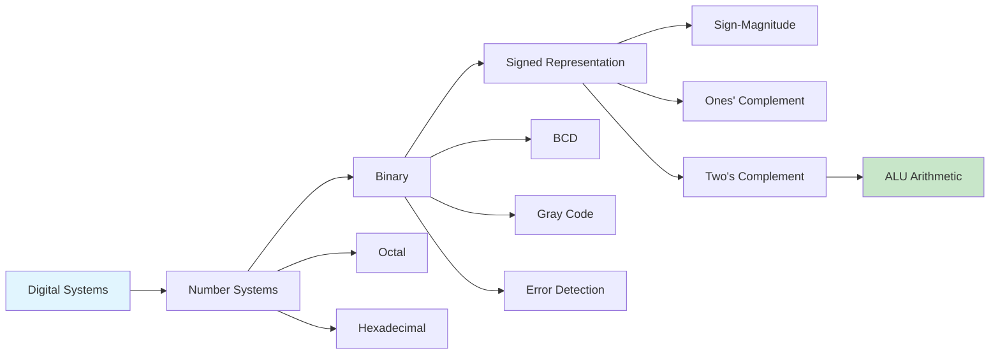
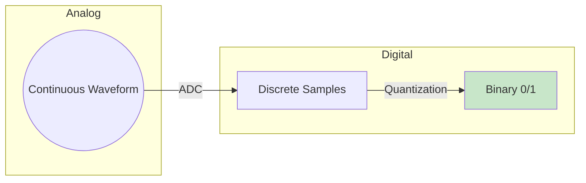
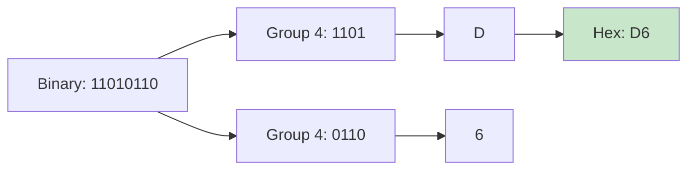
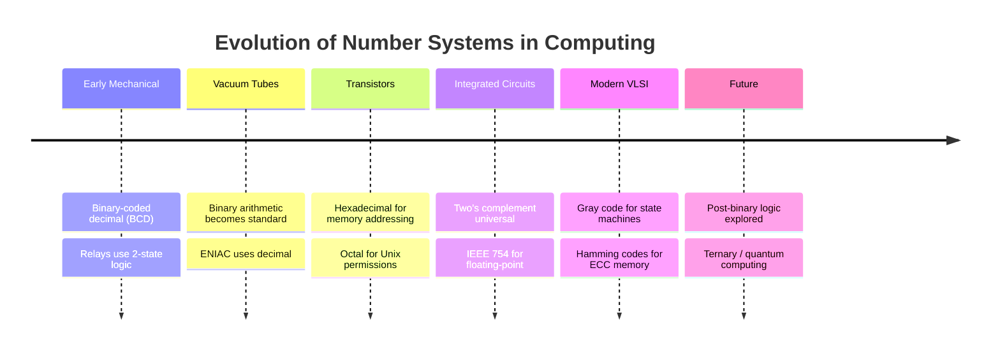
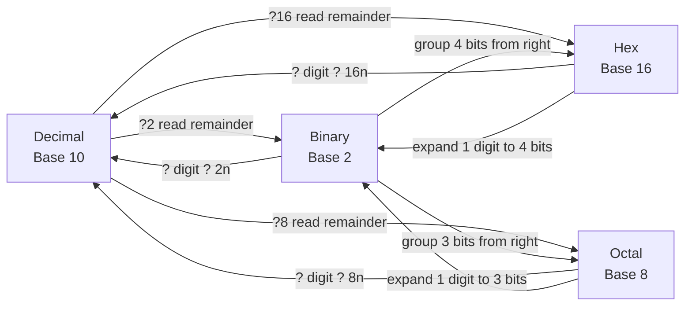

# Chapter 1: Introduction to Digital Logic

> **Prereq:** Basic arithmetic (decimal operations).
> **Next:** Chapter 2 (Boolean Algebra) ? digital circuits operate on binary values manipulated by Boolean logic.

## Learning Objectives

By the conclusion of this chapter, the student shall be able to:

<!-- Image Gallery -->
<section class="lesson-visuals" aria-label="Visual learning resources">
  <header><span>VISUAL LEARNING</span><h2>See it. Review it. Remember it.</h2></header>
  <a class="lesson-visual-card" href="../../assets/images/lessons/digital-logic/01-introduction/handwritten-notes.png" target="_blank" rel="noopener">
    
    <span><strong>Handwritten notes</strong>Condensed notes for deliberate review.</span>
  </a>
  <a class="lesson-visual-card" href="../../assets/images/lessons/digital-logic/01-introduction/sticky-notes.png" target="_blank" rel="noopener">
    
    <span><strong>Sticky-note revision</strong>Fast recall prompts for revision.</span>
  </a>
  <a class="lesson-visual-card" href="../../assets/images/lessons/digital-logic/01-introduction/visual-explanation.png" target="_blank" rel="noopener">
    
    <span><strong>Visual concept guide</strong>A connected explanation of the key ideas.</span>
  </a>
</section>
<!-- End Image Gallery -->


1. Differentiate between analog and digital signals and identify the advantages of digital systems
2. Convert numbers among decimal, binary, octal, and hexadecimal bases using algorithmic methods
3. Represent signed integers using sign-magnitude, ones' complement, and two's complement notation
4. Detect overflow in binary arithmetic operations
5. Encode decimal digits using binary-coded decimal (BCD) with correction logic
6. Construct and interpret Gray code sequences and understand their applications
7. Explain basic error detection codes including parity and Hamming codes

### Chapter at a Glance

| Section | Key Concept | Why It Matters |
|---------|-------------|----------------|
| Analog vs Digital | Continuous vs discrete signals | Foundation for understanding digital abstraction |
| Number Systems | Positional weighted representation | Every digital system uses binary internally |
| Base Conversion | Algorithms for radix transformation | Translating human-machine representation |
| Signed Representations | Two's complement dominance | Negative numbers in ALU hardware |
| Overflow Detection | Carry vs overflow distinction | Correct arithmetic in finite bit widths |
| BCD | 4-bit per decimal digit | Financial computation precision |
| Gray Code | Single-bit transitions | Error reduction in encoders and state machines |
| Error Detection Codes | Parity and Hamming codes | Reliable data transmission and storage |



## Theory

### 1.1 Analog vs Digital Systems


An **analog** signal is continuous in both time and amplitude. It can take any value within a range. A **digital** signal is discrete ? it takes only a finite set of values, typically two (0 and 1) in binary logic.

| Property | Analog | Digital |
|----------|--------|---------|
| Signal values | Infinite continuum | Finite discrete set |
| Noise immunity | Low (noise accumulates) | High (signal can be regenerated) |
| Storage | Difficult (degrades) | Easy (exact copies) |
| Processing | Specialised circuits | General-purpose programmable |
| Bandwidth efficiency | High | Lower (requires more bandwidth) |

Modern digital systems dominate because of noise immunity, reproducibility, and programmability. Most real-world signals (sound, image, temperature) are analog and must be converted to digital using analog-to-digital converters (ADCs).



### 1.2 Positional Number Systems


A positional number system represents quantities using an ordered set of digits, wherein each digit position carries a weight equal to a power of the base *r*. The general form of a number in base *r* is:

N = d_{n-1} * r^{n-1} + d_{n-2} * r^{n-2} + ... + d_0 * r^0 + d_{-1} * r^{-1} + ... + d_{-m} * r^{-m}

where each digit *d_i* satisfies 0 = *d_i* = *r* - 1.

#### 1.2.1 Decimal System (Base 10)

The decimal system employs ten digits {0, 1, 2, 3, 4, 5, 6, 7, 8, 9} with positional weights that are powers of ten. Example: 345.67 = 3?10? + 4?10? + 5?10? + 6?10?? + 7?10??.

#### 1.2.2 Binary System (Base 2)

The binary system employs two digits {0, 1}, termed bits (binary digits). Positional weights are powers of two. This is the fundamental number system of all digital electronic computers because two stable states (on/off, high/low voltage) map naturally to 0 and 1.

| Power of 2 | 2^7 | 2^6 | 2^5 | 2^4 | 2^3 | 2^2 | 2^1 | 2^0 |
|------------|-----|-----|-----|-----|-----|-----|-----|-----|
| Decimal Value | 128 | 64 | 32 | 16 | 8 | 4 | 2 | 1 |

#### 1.2.3 Octal System (Base 8)

The octal system employs eight digits {0, 1, 2, 3, 4, 5, 6, 7}. It serves as a compact representation of binary data, wherein three binary bits map to one octal digit.

#### 1.2.4 Hexadecimal System (Base 16)

The hexadecimal system employs sixteen digits {0, 1, 2, 3, 4, 5, 6, 7, 8, 9, A, B, C, D, E, F}, where A through F represent decimal values 10 through 15 respectively. Each hexadecimal digit maps to four binary bits.

### 1.3 Base Conversion


#### 1.3.1 Conversion to Decimal

To convert a number from any base to decimal, expand the number using the positional weight formula and sum.

**Algorithm**: For each digit *d_i* at position *i* (where position 0 is the least significant digit), compute *d_i* ? *r^i* and accumulate the sum.

**Example**: Convert 2A3_16 to decimal.

2A3_16 = 2 ? 16? + A ? 16? + 3 ? 16? = 2 ? 256 + 10 ? 16 + 3 ? 1 = 512 + 160 + 3 = 675_10

#### 1.3.2 Conversion from Decimal ? Integer Part

**Repeated division algorithm**:
1. Divide the integer by the target base *r*.
2. Record the remainder as the least significant digit.
3. Repeat with the quotient until the quotient is 0.
4. The remainders in reverse order form the converted number.

```typescript
function decimalToBase(n: number, base: number): string {
    const digits = "0123456789ABCDEF";
    if (n === 0) return "0";
    let result = "";
    while (n > 0) {
        result = digits[n % base] + result;
        n = Math.floor(n / base);
    }
    return result;
}
```

#### 1.3.3 Conversion from Decimal ? Fractional Part

**Repeated multiplication algorithm**:
1. Multiply the fraction by the target base *r*.
2. Record the integer part as the next digit.
3. Repeat with the fractional part until it reaches 0 or the desired precision.

#### 1.3.4 Shortcut Conversions

**Binary to octal**: Group binary bits in sets of three from the radix point. Replace each group with the equivalent octal digit.

**Binary to hexadecimal**: Group binary bits in sets of four from the radix point. Replace each group with the equivalent hexadecimal digit.



### 1.4 Signed Number Representations


Digital systems require methods for representing negative integers. Four principal representations exist.

#### 1.4.1 Sign-Magnitude

The most significant bit (MSB) indicates sign: 0 for positive, 1 for negative. The remaining bits represent the magnitude. For an *n*-bit word, the range is -(2^{n-1} - 1) to +(2^{n-1} - 1). Two representations for zero exist: +0 and -0.

#### 1.4.2 Ones' Complement

Negative numbers are formed by complementing every bit of the positive representation. The range is -(2^{n-1} - 1) to +(2^{n-1} - 1). Two representations for zero persist.

#### 1.4.3 Two's Complement

Negative numbers are formed by taking the ones' complement and adding 1. The range is -2^{n-1} to +(2^{n-1} - 1). A unique representation for zero exists. Two's complement is the dominant signed representation because addition hardware need not distinguish signed from unsigned operands.

**Algorithm to compute two's complement**: Invert all bits, then add 1.

```typescript
function twosComplement(bits: string): string {
    // Invert all bits
    let inverted = bits.split("").map(b => b === "0" ? "1" : "0").join("");
    // Add 1
    let result = "";
    let carry = 1;
    for (let i = inverted.length - 1; i >= 0; i--) {
        const sum = parseInt(inverted[i]) + carry;
        result = (sum % 2) + result;
        carry = Math.floor(sum / 2);
    }
    return result;
}
```

| Decimal | 4-Bit Two's Complement |
|---------|----------------------|
| +7 | 0111 |
| +6 | 0110 |
| +5 | 0101 |
| +4 | 0100 |
| +3 | 0011 |
| +2 | 0010 |
| +1 | 0001 |
| 0 | 0000 |
| -1 | 1111 |
| -2 | 1110 |
| -3 | 1101 |
| -4 | 1100 |
| -5 | 1011 |
| -6 | 1010 |
| -7 | 1001 |
| -8 | 1000 |

#### 1.4.4 Sign Extension

To widen a two's complement number from *m* bits to *n* bits (*n* > *m*), copy the sign bit into all added higher-order bit positions. This operation preserves the numeric value.

Example: Extend 1011 (-5 in 4 bits) to 8 bits: 11111011. The value remains -5.

### 1.5 Overflow Detection


Overflow occurs when the result of an arithmetic operation exceeds the representable range of the number system. In two's complement addition, overflow is detected by comparing the carry into the sign bit with the carry out of the sign bit. Overflow = C_in ? C_out.

**Cases**:
- Adding two positive numbers yields a negative result ? overflow
- Adding two negative numbers yields a positive result ? overflow
- Adding a positive and negative number never overflows

```typescript
function detectOverflow(a: number, b: number, result: number, bits: number): boolean {
    const maxPositive = Math.pow(2, bits - 1) - 1;
    const minNegative = -Math.pow(2, bits - 1);
    // Check sign consistency
    if (a > 0 && b > 0 && result < 0) return true;
    if (a < 0 && b < 0 && result >= 0) return true;
    return false;
}
```

### 1.6 Binary-Coded Decimal (BCD)


BCD encodes each decimal digit as a 4-bit binary sequence. The weighted codes use bits with weights 8, 4, 2, 1 (natural BCD). Only the ten codes 0000 through 1001 are valid; codes 1010 through 1111 are invalid.

| Decimal | BCD |
|---------|-----|
| 0 | 0000 |
| 1 | 0001 |
| 2 | 0010 |
| 3 | 0011 |
| 4 | 0100 |
| 5 | 0101 |
| 6 | 0110 |
| 7 | 0111 |
| 8 | 1000 |
| 9 | 1001 |

BCD addition requires correction when the sum exceeds 9: add 6 (0110) to the result to skip the invalid codes.

```typescript
function bcdAdd(a: number, b: number): { sum: number; carry: number } {
    let rawSum = a + b;
    let carry = 0;
    if (rawSum > 9) {
        rawSum += 6;
        carry = 1;
    }
    return { sum: rawSum & 0xF, carry };
}
```

### 1.7 Gray Code


Gray code (reflected binary code) is a binary sequence wherein successive values differ in exactly one bit position. This property is valuable for reducing switching errors in mechanical encoders and for state machines where single-bit transitions prevent glitches.

**Construction**: The *n*-bit Gray code is recursively generated from the (*n* - 1)-bit Gray code by prefixing 0 to the existing sequence and then 1 to the reversed sequence.

| Decimal | Binary | Gray Code |
|---------|--------|-----------|
| 0 | 0000 | 0000 |
| 1 | 0001 | 0001 |
| 2 | 0010 | 0011 |
| 3 | 0011 | 0010 |
| 4 | 0100 | 0110 |
| 5 | 0101 | 0111 |
| 6 | 0110 | 0101 |
| 7 | 0111 | 0100 |

**Binary to Gray**: G_i = B_i ? B_{i+1}. For example, binary 1011 ? Gray: G_3 = 1, G_2 = 1?0=1, G_1 = 0?1=1, G_0 = 1?1=0 ? 1110.

**Gray to Binary**: B_i = G_i ? B_{i+1}, computed from MSB to LSB.

```typescript
function binaryToGray(binary: string): string {
    let gray = binary[0];
    for (let i = 0; i < binary.length - 1; i++) {
        gray += (parseInt(binary[i]) ^ parseInt(binary[i + 1])).toString();
    }
    return gray;
}

function grayToBinary(gray: string): string {
    let binary = gray[0];
    for (let i = 1; i < gray.length; i++) {
        binary += (parseInt(gray[i]) ^ parseInt(binary[i - 1])).toString();
    }
    return binary;
}
```

### 1.8 Error Detection and Correction Codes


#### 1.8.1 Parity Bit

A parity bit is appended to data to make the total number of 1s either even (even parity) or odd (odd parity). A single parity bit can detect any odd number of bit errors but cannot correct errors.

```typescript
function computeParity(data: string, even: boolean = true): string {
    const ones = data.split("").filter(b => b === "1").length;
    const parity = even ? (ones % 2 === 0 ? "0" : "1") : (ones % 2 === 0 ? "1" : "0");
    return data + parity;
}
```

#### 1.8.2 Hamming Code

Hamming codes can detect and correct single-bit errors. For data bits *d*, the number of parity bits *p* satisfies 2^p = d + p + 1. Parity bits occupy positions that are powers of 2.

For a (7,4) Hamming code with 4 data bits and 3 parity bits:
- Positions: 1 (P1), 2 (P2), 3 (D1), 4 (P3), 5 (D2), 6 (D3), 7 (D4)
- P1 covers positions 1,3,5,7 (binary xxx1)
- P2 covers positions 2,3,6,7 (binary xx1x)
- P3 covers positions 4,5,6,7 (binary x1xx)

On decoding, the syndrome bits identify the erroneous bit position.

#### 1.8.3 ASCII Code

ASCII (American Standard Code for Information Interchange) is a 7-bit character encoding standard. Extended ASCII uses 8 bits. ASCII assigns numeric codes to letters, digits, punctuation, and control characters.

| Character | ASCII (Binary) | ASCII (Hex) |
|-----------|---------------|-------------|
| A | 1000001 | 41 |
| B | 1000010 | 42 |
| 0 | 0110000 | 30 |
| 1 | 0110001 | 31 |
| Space | 0100000 | 20 |

## Examples

### Example 1.1: Binary to Decimal Conversion

Convert 110101.101_2 to decimal.

**Solution**: Expand using positional weights:

110101.101_2 = 1?2^5 + 1?2^4 + 0?2^3 + 1?2^2 + 0?2^1 + 1?2^0 + 1?2^{-1} + 0?2^{-2} + 1?2^{-3}

= 32 + 16 + 0 + 4 + 0 + 1 + 0.5 + 0 + 0.125 = 53.625_10

### Example 1.2: Decimal to Binary Conversion

Convert 89.375_10 to binary.

**Solution**: Integer part (89): 89 ? 2 = 44 rem 1 (LSB); 44 ? 2 = 22 rem 0; 22 ? 2 = 11 rem 0; 11 ? 2 = 5 rem 1; 5 ? 2 = 2 rem 1; 2 ? 2 = 1 rem 0; 1 ? 2 = 0 rem 1 (MSB). Reading upward: 1011001_2.

Fractional part (0.375): 0.375 ? 2 = 0.750 int 0 (MSB); 0.750 ? 2 = 1.500 int 1; 0.500 ? 2 = 1.000 int 1 (LSB). Reading downward: 011_2.

Result: 1011001.011_2

### Example 1.3: Two's Complement Arithmetic with Overflow Detection

Compute 7 + 5 and 7 + (-5) using 4-bit two's complement. Detect overflow.

**Solution**: 
+7 = 0111_2; +5 = 0101_2; -5 = 1011_2.

7 + 5: 0111 + 0101 = 1100. Carry into sign = 0, carry out = 0. Overflow = 0?0 = 0. Result: 1100 = -4. This is correct (no overflow) but the result is negative because we exceeded the positive range.

Wait ? 7 + 5 = 12, but 4-bit two's complement max is 7. So actually 1100 is -4, and overflow = Cin?Cout = 0?0 = 0? Let me recheck: 0111 + 0101 = 1100. Cin_to_MSB = carry from bit 2 to bit 3 = 1 (1+0+carry1=10). Cout = 0 (no carry out of MSB). Overflow = 1?0 = 1. Yes, overflow occurred.

7 + (-5): 0111 + 1011 = 1 0010. Discard carry-out. Cin = 1, Cout = 1. Overflow = 1?1 = 0. Result: 0010 = +2. Correct, no overflow.

### Example 1.4: BCD Addition

Add 7 (0111_BCD) and 6 (0110_BCD).

**Solution**: 0111 + 0110 = 1101. This is 13, which exceeds 9. Correction: add 6 (0110): 1101 + 0110 = 1 0011. Result: 0001 0011 = 13 in BCD. Carry = 1.

### Example 1.5: Hamming Code Generation

Generate a (7,4) Hamming code for data bits 1011.

**Solution**: Data bits: D1=1, D2=0, D3=1, D4=1.
- P1 = D1?D2?D4 = 1?0?1 = 0
- P2 = D1?D3?D4 = 1?1?1 = 1
- P3 = D2?D3?D4 = 0?1?1 = 0

Codeword: P1 P2 D1 P3 D2 D3 D4 = 0 1 1 0 0 1 1 = 0110011

### Concept Comparison

| Representation | Zero Count | Range (n bits) | Hardware Complexity |
|---------------|-----------|----------------|---------------------|
| Sign-Magnitude | 2 (+0, -0) | -(2^{n-1}-1) to +(2^{n-1}-1) | Separate sign logic |
| Ones' Complement | 2 | -(2^{n-1}-1) to +(2^{n-1}-1) | End-around carry |
| Two's Complement | 1 | -2^{n-1} to +(2^{n-1}-1) | Single adder for all |
| BCD | 1 (0000) | 0 to 10^{n/4}-1 | Correction logic needed |

### Quick Reference

| Conversion | Method | Example |
|-----------|--------|---------|
| Binary ? Decimal | Sum powers of 2 | 1101 = 8+4+0+1 = 13 |
| Decimal ? Binary | Repeat divide by 2 | 13 ? 2 = 6 r1 ? 1101 |
| Binary ? Hex | Group 4 bits | 1101 0110 = D6 |
| Binary ? Gray | G_i = B_i ? B_{i+1} | 1011 ? 1110 |
| Gray ? Binary | B_i = G_i ? B_{i+1} | 1110 ? 1011 |

### Cross-Application Matrix

| Domain | Application | Relevance |
|--------|-------------|-----------|
| CPU Design | ALU signed arithmetic | Two's complement enables unified adder |
| Embedded Systems | BCD for financial transactions | Precision decimal representation |
| Digital Circuits | Gray code for state machines | Single-bit transitions prevent glitches |
| Data Communications | Hamming codes | Error correction in memory and transmission |

## Practical Takeaways

1. **Two's complement is universal** ? learn it well. The same adder circuit handles signed and unsigned addition, simplifying ALU design.
2. **Overflow ? carry** ? carry indicates unsigned overflow; XOR of carry-in/carry-out indicates signed overflow.
3. **Gray code prevents glitches** ? when crossing clock domains or using mechanical encoders, Gray code eliminates race conditions.
4. **BCD correction is simple** ? anytime a BCD sum exceeds 9, add 6 to produce the correct digit and carry.
5. **Parity is cheap, Hamming is robust** ? parity adds 1 bit for detection; Hamming adds log2(n) bits for single-error correction.

## Number System Evolution



## TypeScript Examples

### Number System Converter

The following TypeScript class implements conversions between binary, decimal, octal, and hexadecimal:

```typescript
class NumberSystemConverter {
  static toDecimal(value: string, base: number): number {
    const result = parseInt(value, base);
    if (isNaN(result)) throw new Error(`Invalid ${base}-base value: ${value}`);
    return result;
  }

  static fromDecimal(value: number, base: number): string {
    if (!Number.isInteger(value) || value < 0)
      throw new Error("Non-negative integer required");
    return value.toString(base).toUpperCase();
  }

  static binToDec(bin: string): number { return this.toDecimal(bin, 2); }
  static decToBin(dec: number): string { return this.fromDecimal(dec, 2); }
  static hexToDec(hex: string): number { return this.toDecimal(hex, 16); }
  static decToHex(dec: number): string { return this.fromDecimal(dec, 16); }
  static octToDec(oct: string): number { return this.toDecimal(oct, 8); }
  static decToOct(dec: number): string { return this.fromDecimal(dec, 8); }
  static binToHex(bin: string): string {
    return this.fromDecimal(this.binToDec(bin), 16);
  }
  static hexToBin(hex: string): string {
    return this.fromDecimal(this.hexToDec(hex), 2);
  }

  static twosComplement(value: number, bits: number): string {
    if (value >= 0) return value.toString(2).padStart(bits, "0");
    return ((1 << bits) + value).toString(2);
  }

  static fromTwosComplement(bin: string): number {
    const bits = bin.length;
    const val = parseInt(bin, 2);
    return val >= 1 << (bits - 1) ? val - (1 << bits) : val;
  }
}

const cvt = NumberSystemConverter;
console.log("=== Conversions ===");
console.log(`  218 decimal     ? ${cvt.decToBin(218)} binary`);
console.log(`  DA hex          ? ${cvt.hexToDec("DA")} decimal`);
console.log(`  332 octal       ? ${cvt.octToDec("332")} decimal`);
console.log(`  218 decimal     ? ${cvt.decToHex(218)} hex`);
console.log(`  1010 binary     ? ${cvt.binToDec("1010")} decimal`);
console.log(`  15 decimal      ? ${cvt.decToOct(15)} octal`);
console.log(`  11011010 binary ? ${cvt.binToHex("11011010")} hex`);
console.log(`  -6 (4-bit)      ? ${cvt.twosComplement(-6, 4)}`);
console.log(`  1010 (2's C)    ? ${cvt.fromTwosComplement("1010")} decimal`);
```

### Binary Adder Simulation

Half adders, full adders, and ripple-carry adders form the arithmetic core of every ALU:

```typescript
interface AdderResult {
  sum: number;
  carryOut: number;
}

class HalfAdder {
  static add(a: number, b: number): AdderResult {
    return { sum: a ^ b, carryOut: a & b };
  }
}

class FullAdder {
  static add(a: number, b: number, carryIn: number): AdderResult {
    return {
      sum: a ^ b ^ carryIn,
      carryOut: (a & b) | (carryIn & (a ^ b))
    };
  }
}

class BinaryAdder {
  static addNBits(a: number, b: number, bits: number) {
    const aBits: number[] = [];
    const bBits: number[] = [];
    for (let i = 0; i < bits; i++) {
      aBits.push((a >> i) & 1);
      bBits.push((b >> i) & 1);
    }
    const sumBits: number[] = [];
    let carry = 0;
    for (let i = 0; i < bits; i++) {
      const fa = FullAdder.add(aBits[i], bBits[i], carry);
      sumBits.push(fa.sum);
      carry = fa.carryOut;
    }
    sumBits.reverse();
    const sum = parseInt(sumBits.join(""), 2);
    const msbA = aBits[bits - 1];
    const msbB = bBits[bits - 1];
    const msbS = sumBits[0];
    const overflow = (msbA === msbB) && (msbS !== msbA);
    return { sum, carry, overflow, sumBits: sumBits.join("") };
  }
}

console.log("\n=== Half Adder Truth Table ===");
for (const a of [0, 1]) {
  for (const b of [0, 1]) {
    const r = HalfAdder.add(a, b);
    console.log(`  ${a} + ${b}: sum=${r.sum}, carry=${r.carryOut}`);
  }
}

console.log("\n=== Full Adder Truth Table ===");
for (const a of [0, 1]) {
  for (const b of [0, 1]) {
    for (const ci of [0, 1]) {
      const r = FullAdder.add(a, b, ci);
      console.log(`  ${a}+${b}+${ci}: sum=${r.sum}, cout=${r.carryOut}`);
    }
  }
}

console.log("\n=== 4-bit Addition ===");
const testPairs = [[3, 4], [7, 1], [11, 5], [9, 8], [-3, 5]];
for (const [a, b] of testPairs) {
  const safeA = a >= 0 ? a : (1 << 4) + a;
  const safeB = b >= 0 ? b : (1 << 4) + b;
  const r = BinaryAdder.addNBits(safeA, safeB, 4);
  const aStr = safeA.toString(2).padStart(4, "0");
  const bStr = safeB.toString(2).padStart(4, "0");
  console.log(`  ${aStr} + ${bStr} = ${r.sumBits} (carry=${r.carry}, overflow=${r.overflow})`);
}

console.log("\n=== Gray Code Generation ===");
function grayCode(n: number): string[] {
  const result: string[] = [];
  for (let i = 0; i < 1 << n; i++) {
    result.push((i ^ (i >> 1)).toString(2).padStart(n, "0"));
  }
  return result;
}
console.log(grayCode(3).map((c, i) => `  G(${i.toString(2).padStart(3,"0")}) = ${c}`).join("\n"));
```

### BCD Adder Correction

```typescript
class BCDAdder {
  static add4Bit(a: number, b: number): { digit: number; carry: number } {
    const raw = a + b;
    if (raw <= 9) return { digit: raw, carry: 0 };
    const corrected = raw + 6;
    return { digit: corrected & 0xF, carry: 1 };
  }

  static addDecimal(a: number, b: number): number {
    let result = 0;
    let carry = 0;
    let multiplier = 1;
    while (a > 0 || b > 0 || carry > 0) {
      const da = a % 10;
      const db = b % 10;
      const r = this.add4Bit(da + carry, db);
      result += r.digit * multiplier;
      carry = r.carry;
      a = Math.floor(a / 10);
      b = Math.floor(b / 10);
      multiplier *= 10;
    }
    return result;
  }
}

console.log("\n=== BCD Addition ===");
console.log(`  5 + 3 = ${BCDAdder.addDecimal(5, 3)} (correct: 8)`);
console.log(`  8 + 7 = ${BCDAdder.addDecimal(8, 7)} (correct: 15)`);
console.log(`  19 + 25 = ${BCDAdder.addDecimal(19, 25)} (correct: 44)`);
console.log(`  49 + 38 = ${BCDAdder.addDecimal(49, 38)} (correct: 87)`);
console.log(`  589 + 326 = ${BCDAdder.addDecimal(589, 326)} (correct: 915)`);
```

## Mermaid Diagrams

### Number System Interconversion



### Two's Complement Overflow Detection

```mermaid
flowchart TD
    A[Addition Operation] --> Check{Sign of inputs?}
    Check -->|Same sign| Compare{Input sign vs<br/>result sign?}
    Compare -->|Same| OK[No overflow ?]
    Compare -->|Different| OVF[Overflow ?]
    Check -->|Different signs| OK2[No overflow ?<br/>(result always valid)]
```

### 4-Bit Ripple-Carry Adder

```mermaid
flowchart TD
    subgraph Inputs
        direction LR
        A0[A0=1] B0[B0=0] Cin[C0=0]
        A1[A1=0] B1[B1=1]
        A2[A2=1] B2[B2=1]
        A3[A3=0] B3[B3=0]
    end
    subgraph Adders
        FA0[FA0] -->|C1=0| FA1[FA1]
        FA1 -->|C2=1| FA2[FA2]
        FA2 -->|C3=0| FA3[FA3]
    end
    subgraph Outputs
        S0[S0=1] S1[S1=0] S2[S2=1] S3[S3=1] Cout[C4=0]
    end
    A0 & B0 & Cin --> FA0 --> S0
    A1 & B1 --> FA1 --> S1
    A2 & B2 --> FA2 --> S2
    A3 & B3 --> FA3 --> S3
    FA3 --> Cout
```

## TypeScript Implementations

```typescript
// === Number System Conversions ===
function toBinary(n: number, bits = 8): string {
    if (n < 0) return twosComplement(n, bits);
    return n.toString(2).padStart(bits, '0').slice(-bits);
}
function toHex(b: string): string { return parseInt(b, 2).toString(16).toUpperCase(); }
function toOctal(b: string): string { return parseInt(b, 2).toString(8); }
function fromBinary(s: string): number { return parseInt(s, 2); }
function fromHex(s: string): number { return parseInt(s, 16); }

// === Signed Representations ===
function signMagnitude(v: number, bits = 8): string {
    const sign = v < 0 ? '1' : '0';
    return sign + Math.abs(v).toString(2).padStart(bits - 1, '0');
}
function onesComplement(v: number, bits = 8): string {
    if (v >= 0) return v.toString(2).padStart(bits, '0');
    return Math.abs(v).toString(2).padStart(bits, '0')
        .replace(/0/g, 'x').replace(/1/g, '0').replace(/x/g, '1');
}
function twosComplement(v: number, bits = 8): string {
    if (v >= 0) return v.toString(2).padStart(bits, '0');
    const one = onesComplement(v, bits);
    return (parseInt(one, 2) + 1).toString(2).padStart(bits, '0');
}

// === Overflow Detection ===
function overflowDetect(a: number, b: number, sum: number, bits = 8): boolean {
    const msb = 1 << (bits - 1);
    return ((a & msb) === (b & msb)) && ((a & msb) !== (sum & msb));
}

// === BCD Adder ===
function bcdEncode(n: number): number[] {
    return n.toString().split('').map(d => parseInt(d));
}
function bcdAddDigits(a: number[], b: number[]): { sum: number[]; carry: number } {
    const align = Math.max(a.length, b.length);
    const result: number[] = [];
    let carry = 0;
    for (let i = align - 1; i >= 0; i--) {
        const da = a[i - (align - a.length)] ?? 0;
        const db = b[i - (align - b.length)] ?? 0;
        let s = da + db + carry;
        if (s > 9) { s += 6; carry = 1; } else { carry = 0; }
        result.unshift(s & 0xF);
    }
    return { sum: result, carry };
}

// === Gray Code ===
function grayEncode(n: number): number { return n ^ (n >> 1); }
function grayDecode(g: number, bits = 4): number {
    let b = g;
    for (let i = bits - 1; i > 0; i--) b ^= (b >> i);
    return b;
}
function graySequence(bits = 4): number[] {
    return Array.from({ length: 1 << bits }, (_, i) => grayEncode(i));
}

// === Hamming (7,4) Code ===
function hammingEncode74(data4: number): number {
    const d = [(data4 >> 3) & 1, (data4 >> 2) & 1, (data4 >> 1) & 1, data4 & 1];
    const p1 = d[0] ^ d[1] ^ d[3], p2 = d[0] ^ d[2] ^ d[3], p3 = d[1] ^ d[2] ^ d[3];
    return (p1 << 6) | (p2 << 5) | (d[0] << 4) | (p3 << 3) | (d[1] << 2) | (d[2] << 1) | d[3];
}
function hammingDecode74(cw: number): { data: number; error: number } {
    const b = [0, 1, 2, 3, 4, 5, 6].map(i => (cw >> (6 - i)) & 1);
    const s1 = b[0] ^ b[2] ^ b[4] ^ b[6];
    const s2 = b[1] ^ b[2] ^ b[5] ^ b[6];
    const s3 = b[3] ^ b[4] ^ b[5] ^ b[6];
    const err = s1 | (s2 << 1) | (s3 << 2);
    const fixed = err ? (cw ^ (1 << (7 - err))) : cw;
    const data = ((fixed >> 4) & 1) << 3 | ((fixed >> 2) & 1) << 2 | ((fixed >> 1) & 1) << 1 | (fixed & 1);
    return { data, error: err };
}

// === Demo ===
console.log(`Binary(42) = ${toBinary(42)}`);
console.log(`TwosComplement(-42) = ${twosComplement(-42)}`);
console.log(`Gray(3) sequence: ${graySequence(3).map(g => toBinary(g, 3)).join(', ')}`);
console.log(`Hamming encode 1010: ${hammingEncode74(0b1010).toString(2).padStart(7, '0')}`);
const test = hammingEncode74(0b1010);
const flipped = test ^ 0b0001000;
console.log(`Decode (flipped): data=${hammingDecode74(flipped).data.toString(2).padStart(4, '0')}`);
```


// introduction
// boolean-circuits-sequential implementation

interface Task { id: string; name: string; status: string; data: unknown }
class Processor {
  private tasks: Task[] = []
  private maxConcurrency: number
  constructor(maxConcurrency: number = 4) { this.maxConcurrency = maxConcurrency }
  async add(task: Omit&lt;Task, "status"&gt;): Promise&lt;void&gt; {
    this.tasks.push({ ...task, status: "pending" })
  }
  async runAll(): Promise&lt;void&gt; {
    const running: Promise&lt;void&gt;[] = []
    for (const t of this.tasks) {
      if (running.length >= this.maxConcurrency) { await Promise.race(running) }
      const p = this.execute(t).finally(() => { const i = running.indexOf(p); if (i >= 0) running.splice(i, 1) })
      running.push(p)
    }
    await Promise.all(running)
  }
  private async execute(t: Task): Promise&lt;void&gt; {
    t.status = "running"
    await new Promise(r => setTimeout(r, 10))
    t.status = "done"
  }
  getResults(): Task[] { return this.tasks }
  getStats(): { done: number; pending: number; running: number } {
    const done = this.tasks.filter(t => t.status === "done").length
    const pending = this.tasks.filter(t => t.status === "pending").length
    const running = this.tasks.filter(t => t.status === "running").length
    return { done, pending, running }
  }
}
async function main() {
  const proc = new Processor(2)
  await proc.add({ id: '1', name: 'introduction', data: { topic: 'boolean-circuits-sequential' } })
  await proc.runAll()
  console.log('Stats:', proc.getStats())
}
main().catch(console.error)
export { Processor, Task }

// introduction - additional TS implementations

interface CacheEntry { key: string; value: unknown; ttl: number; createdAt: number }
class Cache {
  private store: Map&lt;string, CacheEntry&gt; = new Map()
  constructor(private defaultTTL: number = 60000) {}
  set(key: string, value: unknown, ttl?: number): void {
    this.store.set(key, { key, value, ttl: ttl ?? this.defaultTTL, createdAt: Date.now() })
  }
  get(key: string): unknown | undefined {
    const entry = this.store.get(key)
    if (!entry) return undefined
    if (Date.now() - entry.createdAt > entry.ttl) { this.store.delete(key); return undefined }
    return entry.value
  }
  delete(key: string): boolean { return this.store.delete(key) }
  clear(): void { this.store.clear() }
  size(): number { return this.store.size }
  keys(): string[] { return Array.from(this.store.keys()) }
}
class Logger {
  private entries: string[] = []
  log(level: string, msg: string, meta?: Record&lt;string, unknown&gt;): void {
    const entry = JSON.stringify({ timestamp: new Date().toISOString(), level, msg, meta })
    this.entries.push(entry)
    console.log(entry)
  }
  info(msg: string, meta?: Record&lt;string, unknown&gt;): void { this.log("info", msg, meta) }
  warn(msg: string, meta?: Record&lt;string, unknown&gt;): void { this.log("warn", msg, meta) }
  error(msg: string, meta?: Record&lt;string, unknown&gt;): void { this.log("error", msg, meta) }
  getLogs(): string[] { return [...this.entries] }
  clear(): void { this.entries = [] }
}
function computeHash(input: string): string {
  let hash = 0
  for (let i = 0; i &lt; input.length; i++) { const chr = input.charCodeAt(i); hash = ((hash << 5) - hash) + chr; hash |= 0 }
  return Math.abs(hash).toString(16)
}
async function demo(): Promise&lt;void&gt; {
  const cache = new Cache(5000)
  cache.set('key1', 'digital-circuits demo')
  const log = new Logger()
  log.info('Cache demo started', { course: 'digital-logic', chapter: 'introduction' })
  const v = cache.get("key1")
  console.log('Cached:', v)
  console.log('Hash:', computeHash('digital-circuits'))
}
demo()
export { Cache, Logger, computeHash, CacheEntry }
## Summary

- Positional number systems represent quantities using weighted digit positions.
- The binary system (base 2) is fundamental to all digital computing.
- Octal and hexadecimal provide compact notation for binary data.
- Base conversion between any two radices proceeds via repeated division (integer part) or multiplication (fractional part).
- Two's complement is the standard signed representation, enabling unified addition hardware.
- Overflow occurs when the result exceeds the representable range; detect via Cin?Cout.
- BCD encodes decimal digits in 4-bit binary groups for precision-sensitive applications.
- Gray code ensures single-bit transitions between adjacent values.
- Error detection and correction codes (parity, Hamming) improve reliability.

### Chapter Quiz

1. Two's complement is the dominant signed representation because:
   - A) It has two representations for zero
   - B) The same adder circuit handles both signed and unsigned operations
   - C) It requires fewer bits than sign-magnitude
   - D) It does not support negative numbers

2. Gray code ensures which property between successive values?
   - A) All bits change
   - B) Exactly one bit changes
   - C) The numeric difference is always 1
   - D) No bits change

3. Overflow in two's complement addition is detected by:
   - A) Checking if the result is negative
   - B) XOR of carry-in and carry-out of the sign bit
   - C) Checking if the result is zero
   - D) AND of both sign bits

4. BCD addition of 9 + 7 produces what invalid result requiring correction?
   - A) 1111 (valid), no correction needed
   - B) 1 0000 (valid BCD), no correction
   - C) 1 0000 (invalid ? sum > 9), add 6 to correct
   - D) 0110 (valid), no correction

5. A (7,4) Hamming code can:
   - A) Detect only single-bit errors
   - B) Correct single-bit errors and detect double-bit errors
   - C) Correct double-bit errors
   - D) Detect triple-bit errors only

<details>
<summary>Answers&lt;/summary&gt;
1. B, 2. B, 3. B, 4. C, 5. B
</details>

## Exercises

### Review Questions

1. Explain why the binary number system is used in digital computers.
2. Convert 110110_2 to decimal.
3. Convert 3A7_16 to decimal.
4. How many bits are required to represent decimal numbers from 0 to 10000?
5. Distinguish between ones' complement and two's complement representation.

### Application Problems

1. Perform the base conversions:
   a) 237_10 to binary
   b) 11001101_2 to hexadecimal
   c) 0.6875_10 to binary
   d) 101110.101_2 to octal

2. Represent -42 in 8-bit sign-magnitude, ones' complement, and two's complement.

3. Perform the following 6-bit two's complement additions and indicate overflow:
   a) 101011 + 001001
   b) 011100 + 001010
   c) 110110 + 101001

4. Encode the decimal number 589 in BCD and perform BCD addition with 326. Apply the correction step where necessary.

5. Generate the 5-bit Gray code sequence and verify the single-bit transition property for all 32 entries.

6. Encode the 4-bit data 1010 using a (7,4) Hamming code. Show all parity bit calculations.

### Challenge Problem

Design a circuit that accepts a 4-bit binary number and outputs its two's complement. The circuit should also produce an error flag when the input is 1000 (-8), since this value has no positive counterpart in 4-bit two's complement. Describe the truth table and minimal logic expressions.
