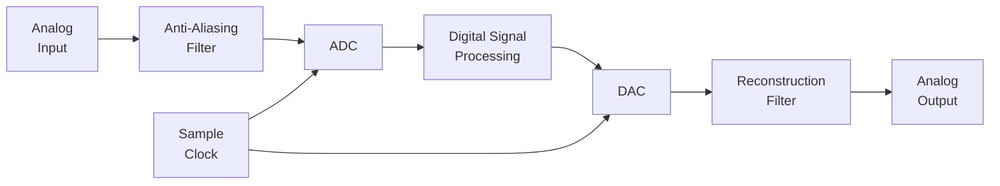
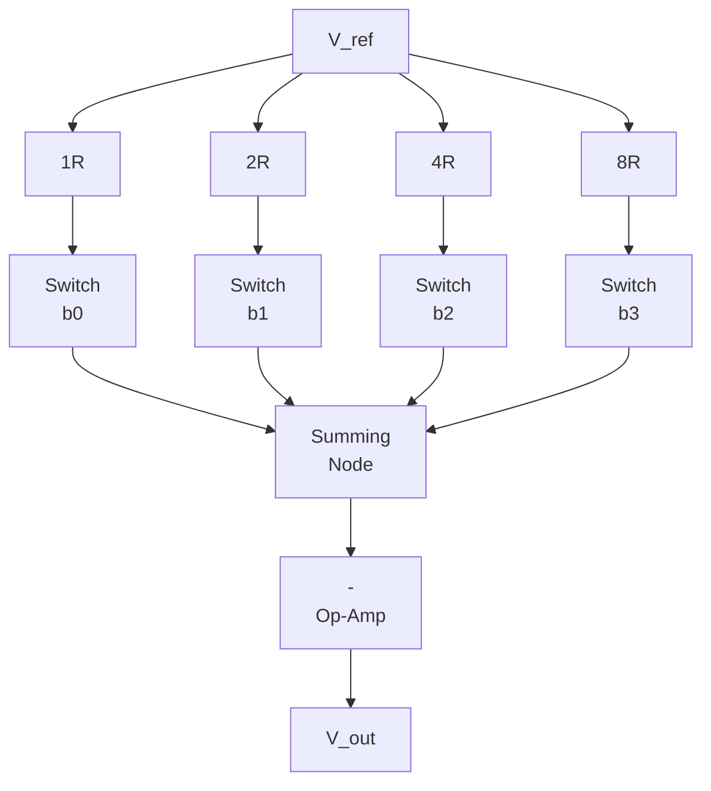
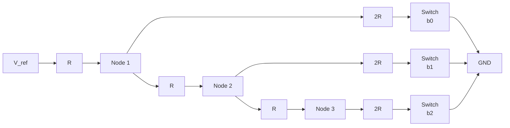
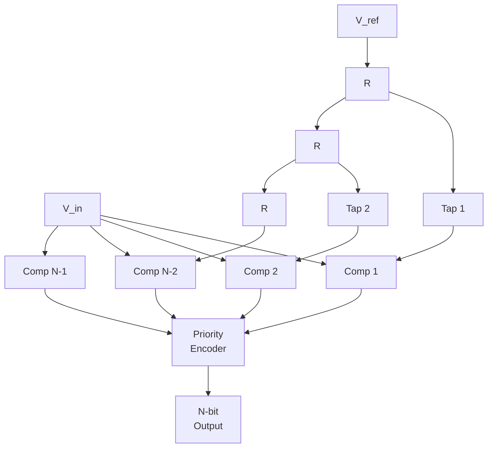
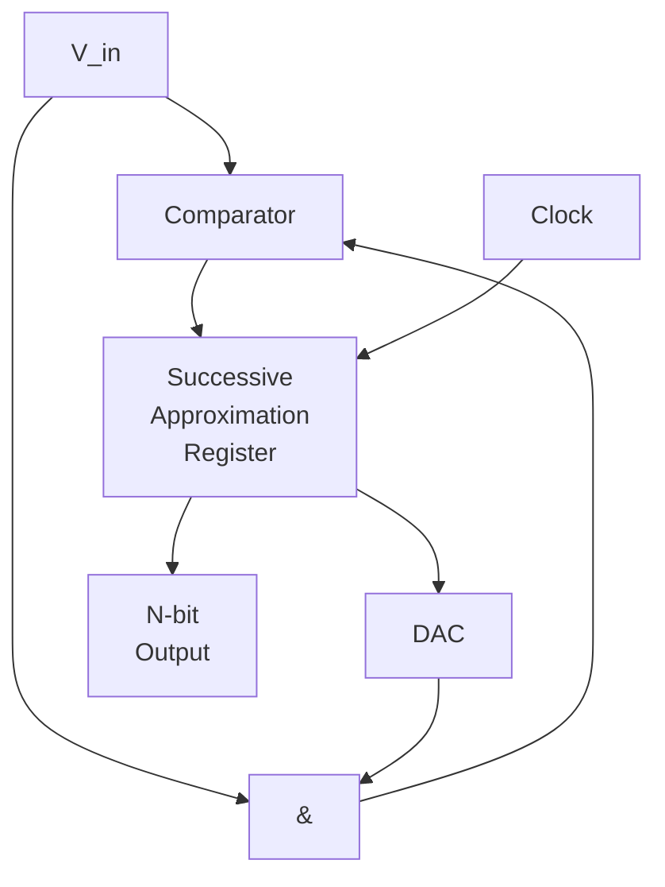
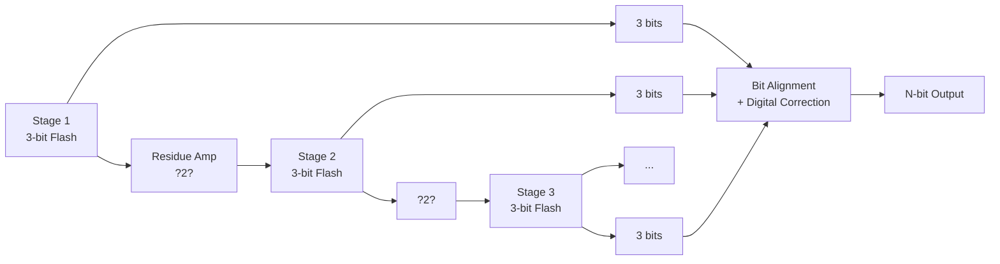

# Chapter 13: Digital-to-Analog and Analog-to-Digital Converters

> **Prereq:** Chapters 1?12 (digital logic fundamentals) ? DACs and ADCs bridge the digital and analog domains.
> **Next:** Chapter 14 (Timing Analysis) ? understanding mixed-signal timing constraints.

## Learning Objectives

By the conclusion of this chapter, the student shall be able to:

1. Classify DAC and ADC architectures by speed, resolution, and application
2. Design and analyse R-2R ladder, binary-weighted, and sigma-delta DACs
3. Compare flash, SAR, pipelined, and sigma-delta ADC architectures
4. Calculate quantisation error, SNR, ENOB, and THD for data converters
5. Analyse sampling theory, aliasing, and anti-aliasing filter requirements
6. Evaluate the trade-offs between speed, resolution, and power consumption
7. Design interface circuits between converters and digital systems

## 13.1 The Digital-Analog Interface



| Domain | Continuous | Discrete |
|--------|-----------|----------|
| Time | Continuous-time | Discrete-time (sampled) |
| Amplitude | Continuous-amplitude | Quantised (finite levels) |
| Digital | ? | Finite word width, clocked |

## 13.2 Sampling Theory

### 13.2.1 Nyquist-Shannon Theorem


A signal with bandwidth B can be perfectly reconstructed from samples taken at a rate f_s > 2B.

```
If f_s = 2B: aliasing occurs (high frequencies fold into the baseband)
If f_s > 2B: perfect reconstruction is possible (with an ideal reconstruction filter)
```

```typescript
function nyquistRate(bandwidth: number): number {
    return 2 * bandwidth;
}

// Example: audio signal with 20 kHz bandwidth
console.log(`Nyquist rate for audio: ${nyquistRate(20000)} Hz`); // 40 kHz

// Aliasing demonstration
function sample(signalFreq: number, sampleFreq: number, duration: number): number[] {
    const samples: number[] = [];
    for (let t = 0; t < duration * sampleFreq; t++) {
        const time = t / sampleFreq;
        samples.push(Math.sin(2 * Math.PI * signalFreq * time));
    }
    return samples;
}

// A 9 kHz signal sampled at 8 kHz aliases to 1 kHz
const aliased = sample(9000, 8000, 0.001);
console.log(`Aliased samples (first 8): ${aliased.slice(0, 8).map(v => v.toFixed(3)).join(', ')}`);
```

### 13.2.2 Anti-Aliasing Filter


An anti-aliasing filter is a low-pass filter with cutoff at f_s/2. Practical filters have a transition band that limits the usable signal bandwidth.

```typescript
class AntiAliasFilter {
    readonly cutoff: number;
    readonly order: number;

    constructor(cutoff: number, order: number) {
        this.cutoff = cutoff;
        this.order = order;
    }

    attenuation(frequency: number): number {
        if (frequency <= this.cutoff) return 0;
        const ratio = frequency / this.cutoff;
        return 20 * this.order * Math.log10(ratio); // dB
    }
}

const aaFilter = new AntiAliasFilter(20000, 4);
console.log(`Attenuation at 24 kHz: ${aaFilter.attenuation(24000).toFixed(1)} dB`);
// 4th order Butterworth: 24/20 = 1.2 ? 20?4?log10(1.2) ? 6.3 dB
```

## 13.3 Quantisation

Quantisation maps a continuous amplitude to one of 2? discrete levels.

### 13.3.1 Quantisation Error


```
Quantisation step size:  ? = V_ref / 2?
Maximum quantisation error: ??/2 = ?V_ref / 2???
```

```typescript
function quantisationStep(refVoltage: number, bits: number): number {
    return refVoltage / (1 << bits);
}

function quantise(signal: number, refVoltage: number, bits: number): { code: number; error: number } {
    const levels = 1 << bits;
    const step = refVoltage / levels;
    const code = Math.round(signal / step);
    const clampedCode = Math.max(0, Math.min(levels - 1, code));
    const quantisedVoltage = clampedCode * step + step / 2;
    return {
        code: clampedCode,
        error: quantisedVoltage - signal
    };
}

const result = quantise(2.7, 5.0, 8);
console.log(`2.7 V ? code ${result.code} (${(result.code * 19.53 + 9.77).toFixed(2)} mV), error: ${result.error.toFixed(2)} V`);
```

### 13.3.2 Quantisation Noise


```
Ideal SNR for an N-bit ADC:
SNR = 6.02?N + 1.76 dB

For N = 8:  SNR = 49.9 dB
For N = 12: SNR = 74.0 dB
For N = 16: SNR = 98.1 dB
For N = 24: SNR = 146.3 dB
```

```typescript
function idealSNR(bits: number): number {
    return 6.02 * bits + 1.76;
}

// Effective Number of Bits (ENOB)
function enobFromSNR(snr: number): number {
    return (snr - 1.76) / 6.02;
}

// Total Harmonic Distortion + Noise (THD+N)
function thdn(signalPower: number, noisePower: number, distortionPower: number): number {
    return 10 * Math.log10((noisePower + distortionPower) / signalPower); // dB
}

for (const bits of [8, 10, 12, 14, 16, 24]) {
    console.log(`N=${bits}: SNR = ${idealSNR(bits).toFixed(1)} dB`);
}
```

## 13.4 DAC Architectures

### 13.4.1 Binary-Weighted Resistor DAC


Uses resistors with binary-weighted values (R, 2R, 4R, ..., 2???R).

```
V_out = -V_ref ? (b0/2 + b1/4 + ... + b??1/2?)
```



```typescript
class BinaryWeightedDAC {
    readonly bits: number;
    readonly refVoltage: number;

    constructor(bits: number, refVoltage: number) {
        this.bits = bits;
        this.refVoltage = refVoltage;
    }

    convert(code: number): number {
        const maxCode = (1 << this.bits) - 1;
        const clamped = Math.max(0, Math.min(maxCode, code));
        return (clamped / maxCode) * this.refVoltage;
    }
}

const dac8 = new BinaryWeightedDAC(8, 5.0);
console.log(`DAC: code 128 ? ${dac8.convert(128).toFixed(3)} V`); // ~2.500 V
console.log(`DAC: code 255 ? ${dac8.convert(255).toFixed(3)} V`); // ~5.000 V
```

### 13.4.2 R-2R Ladder DAC


The R-2R ladder uses only two resistor values, making it practical for monolithic integration.



```typescript
class R2RLadderDAC {
    readonly bits: number;
    readonly refVoltage: number;

    constructor(bits: number, refVoltage: number) {
        this.bits = bits;
        this.refVoltage = refVoltage;
    }

    convert(code: number): number {
        let vout = 0;
        for (let i = 0; i < this.bits; i++) {
            const bit = (code >> (this.bits - 1 - i)) & 1;
            if (bit) {
                vout += this.refVoltage / (1 << (i + 1));
            }
        }
        return vout;
    }
}

const r2r = new R2RLadderDAC(8, 5.0);
console.log(`R-2R: code 128 ? ${r2r.convert(128).toFixed(3)} V`); // 2.500 V
console.log(`R-2R: code 1 ? ${r2r.convert(1).toFixed(3)} V`);    // 0.0195 V
```

### 13.4.3 Sigma-Delta DAC


Oversampling + noise shaping + 1-bit DAC achieves high resolution with relaxed analog precision.

```typescript
class SigmaDeltaDAC {
    readonly oversampleRatio: number;
    private integrator: number = 0;
    private lastOutput: number = -1;

    constructor(oversampleRatio: number) {
        this.oversampleRatio = oversampleRatio;
    }

    convert(input: number): number {
        // First-order sigma-delta modulator
        const error = input - this.lastOutput;
        this.integrator += error;
        this.lastOutput = this.integrator > 0 ? 1 : -1;
        return this.lastOutput;
    }

    // Decode: average the 1-bit stream over OSR samples
    decode(bitstream: number[]): number {
        const sum = bitstream.reduce((a, b) => a + b, 0);
        return sum / bitstream.length;
    }
}

const sdDac = new SigmaDeltaDAC(64);
const testInput = 0.3;
const bitstream: number[] = [];
for (let i = 0; i < 128; i++) {
    bitstream.push(sdDac.convert(testInput));
}
console.log(`SD DAC: input=${testInput}, decoded=${sdDac.decode(bitstream).toFixed(4)}`);
```

### 13.4.4 DAC Comparison


| Type | Resolution | Speed | Monotonic | Area | Cost |
|------|-----------|-------|-----------|------|------|
| Binary-weighted | 8?12 bit | Fast | No | Medium | Low |
| R-2R ladder | 8?16 bit | Fast | Yes | Small | Low |
| PWM | 8?16 bit | Slow | Yes | Tiny | Very low |
| Sigma-Delta | 16?24 bit | Slow | Yes | Small | Low |
| Segmented | 12?16 bit | Fast | Yes | Large | High |
| Current-steering | 8?14 bit | Very fast | Yes | Large | High |

## 13.5 ADC Architectures

### 13.5.1 Flash ADC


The fastest ADC type, using 2?-1 comparators in parallel.



```typescript
class FlashADC {
    readonly bits: number;
    readonly refVoltage: number;
    private levels: number[];

    constructor(bits: number, refVoltage: number) {
        this.bits = bits;
        this.refVoltage = refVoltage;
        this.levels = [];
        for (let i = 0; i < (1 << bits) - 1; i++) {
            this.levels.push(((i + 1) / (1 << bits)) * refVoltage);
        }
    }

    convert(voltage: number): number {
        let thermometer = 0;
        for (let i = 0; i < this.levels.length; i++) {
            if (voltage >= this.levels[i]) {
                thermometer |= (1 << i);
            }
        }

        // Thermometer-to-binary using priority encoder
        if (thermometer === 0) return 0;
        let code = 0;
        for (let i = this.levels.length - 1; i >= 0; i--) {
            if ((thermometer >> i) & 1) {
                code = i + 1;
                break;
            }
        }
        return code;
    }

    get area(): number {
        // Area proportional to number of comparators
        return (1 << this.bits) - 1;
    }
}

const flash = new FlashADC(3, 5.0);
console.log(`Flash: 3.7 V ? code ${flash.convert(3.7)}`); // ~6 (out of 7)
console.log(`Comparators: ${flash.area}`); // 7
```

**Limitation:** A 10-bit flash ADC needs 1023 comparators. An N-bit flash uses O(2?) comparators ? impractical beyond 8 bits.

### 13.5.2 Successive Approximation Register (SAR) ADC


The SAR ADC uses a binary search algorithm with a single comparator and a DAC.



```typescript
class SARADC {
    readonly bits: number;
    readonly refVoltage: number;

    constructor(bits: number, refVoltage: number) {
        this.bits = bits;
        this.refVoltage = refVoltage;
    }

    convert(voltage: number): number {
        let code = 0;
        for (let bit = this.bits - 1; bit >= 0; bit--) {
            const trial = code | (1 << bit);
            const trialVoltage = (trial / (1 << this.bits)) * this.refVoltage;
            if (trialVoltage <= voltage) {
                code = trial;
            }
        }
        return code;
    }

    // Number of clock cycles per conversion = bits
    get conversionCycles(): number {
        return this.bits;
    }
}

const sar = new SARADC(12, 5.0);
console.log(`SAR: 2.5 V ? code ${sar.convert(2.5)}`); // ~2048
console.log(`SAR: conversion cycles: ${sar.conversionCycles}`); // 12
```

### 13.5.3 Pipelined ADC


The pipelined ADC divides the conversion across multiple stages, achieving high speed at medium resolution.



```typescript
class PipelinedADCStage {
    readonly bits: number;
    private subADC: FlashADC;
    private subDAC: BinaryWeightedDAC;

    constructor(bits: number, refVoltage: number) {
        this.bits = bits;
        this.subADC = new FlashADC(bits, refVoltage);
        this.subDAC = new BinaryWeightedDAC(bits, refVoltage);
    }

    process(voltage: number): { code: number; residue: number } {
        const code = this.subADC.convert(voltage);
        const dacOut = this.subDAC.convert(code);
        const residue = (voltage - dacOut) * (1 << this.bits);
        return { code, residue };
    }
}

class PipelinedADC {
    private stages: PipelinedADCStage[];
    readonly totalBits: number;

    constructor(stageBits: number[], refVoltage: number) {
        this.stages = stageBits.map(b => new PipelinedADCStage(b, refVoltage));
        this.totalBits = stageBits.reduce((a, b) => a + b, 0);
    }

    convert(voltage: number): number {
        let code = 0;
        let residue = voltage;
        for (let i = 0; i < this.stages.length; i++) {
            const result = this.stages[i].process(residue);
            code = (code << this.stages[i].bits) | result.code;
            residue = result.residue;
        }
        return code;
    }
}

const pipelined = new PipelinedADC([3, 3, 3, 3], 5.0);
console.log(`Pipelined: 2.5 V ? code ${pipelined.convert(2.5)}`);
```

### 13.5.4 Sigma-Delta ADC


Oversampling + noise shaping + digital decimation filter achieves very high resolution.

```typescript
class SigmaDeltaADC {
    readonly oversampleRatio: number;
    private integrator: number = 0;
    private lastOutput: number = 0;

    constructor(oversampleRatio: number) {
        this.oversampleRatio = oversampleRatio;
    }

    modulatorSample(input: number): number {
        const error = input - this.lastOutput;
        this.integrator += error;
        this.lastOutput = this.integrator > 0 ? 1 : 0;
        return this.lastOutput;
    }

    convert(input: number): number {
        let sum = 0;
        for (let i = 0; i < this.oversampleRatio; i++) {
            sum += this.modulatorSample(input);
        }
        return sum / this.oversampleRatio;
    }
}

const sdAdc = new SigmaDeltaADC(256);
console.log(`SD ADC: 0.3 ? ${sdAdc.convert(0.3).toFixed(4)}`);
```

### 13.5.5 ADC Comparison


| Type | Resolution | Speed (MSPS) | Latency | Power | Area |
|------|-----------|-------------|---------|-------|------|
| Flash | 4?8 bit | 1000+ | 1 cycle | Very high | Very large |
| SAR | 8?18 bit | 1?100 | N cycles | Low | Small |
| Pipelined | 8?16 bit | 10?1000 | M cycles | High | Large |
| Sigma-Delta | 16?24 bit | 0.001?10 | OSR cycles | Low | Small |
| Dual-slope | 16?24 bit | 0.001 | Very long | Very low | Tiny |
| Time-interleaved | 8?14 bit | 10000+ | Variable | Very high | Very large |

## 13.6 Performance Metrics

### 13.6.1 Static Specifications


```typescript
interface ADCStaticSpec {
    dnl: number;  // Differential Non-Linearity (LSB)
    inl: number;  // Integral Non-Linearity (LSB)
    offset: number; // Offset error (LSB)
    gain: number; // Gain error (%)
}

function effectiveResolution(actualSNR: number): number {
    return (actualSNR - 1.76) / 6.02;
}

// Spurious-Free Dynamic Range (SFDR)
function sfdr(fundamentalPower: number, maxSpurPower: number): number {
    return fundamentalPower - maxSpurPower; // dB
}
```

### 13.6.2 Dynamic Specifications


```typescript
class ADCDynamicSpec {
    readonly bits: number;
    readonly sampleRate: number; // Hz

    constructor(bits: number, sampleRate: number) {
        this.bits = bits;
        this.sampleRate = sampleRate;
    }

    // Signal-to-Noise and Distortion Ratio (SINAD)
    sinad(snr: number, thd: number): number {
        return -10 * Math.log10(
            Math.pow(10, -snr / 10) + Math.pow(10, -thd / 10)
        );
    }

    // Effective Number of Bits
    enob(sinadValue: number): number {
        return (sinadValue - 1.76) / 6.02;
    }

    // Walden Figure of Merit
    waldenFoM(power: number, enobValue: number): number {
        return power / (Math.pow(2, enobValue) * 2 * this.sampleRate);
    }

    // Schreier Figure of Merit
    schreierFoM(sdr: number, bandwidth: number, power: number): number {
        return sdr + 10 * Math.log10(bandwidth / power);
    }
}
```

## 13.7 Interface Circuits

### 13.7.1 Serial Peripheral Interface (SPI) for ADCs


```typescript
class SPI_ADC {
    private adc: SARADC;
    readonly bits: number;

    constructor(bits: number, refVoltage: number) {
        this.adc = new SARADC(bits, refVoltage);
        this.bits = bits;
    }

    // SPI transaction: CS low ? SCLK pulses ? MOSI for config ? MISO for data
    spiTransaction(cs: number, sclk: number, mosi: number): { miso: number; data: number } {
        if (cs === 1) return { miso: 0, data: 0 };

        // Simplified: read MISO on falling SCLK
        let data = 0;
        for (let i = this.bits - 1; i >= 0; i--) {
            if (sclk === 0) {
                const bit = (this.adc.convert(2.5) >> i) & 1;
                data |= (bit << i);
            }
        }
        return { miso: data, data };
    }
}
```

## Practical Takeaways

1. **Rule of thumb: 6 dB/bit** ? each extra bit adds 6 dB of SNR, but costs 2? comparator area (flash) or N extra cycles (SAR)
2. **Sigma-delta for high resolution, low speed** ? perfect for audio (24-bit, 48 kHz); impractical for video
3. **SAR is the workhorse ADC** ? 8?18 bit resolution, 1?100 MSPS, low power; dominates industrial and embedded applications
4. **Flash for the fastest conversions** ? 4?8 bit, multi-GSPS; used in oscilloscopes and communication receivers
5. **Anti-alias filtering is mandatory** ? without it, out-of-band signals alias into the passband and cannot be removed digitally

## TypeScript Implementations

```typescript
// === Binary-Weighted DAC ===
class BinaryWeightedDAC {
    constructor(private bits: number, private vRef: number) {}
    convert(digital: number): number {
        let vOut = 0;
        for (let i = 0; i < this.bits; i++) {
            const bit = (digital >> i) & 1;
            vOut += bit * (this.vRef / Math.pow(2, this.bits - i));
        }
        return vOut;
    }
}

// === R-2R Ladder DAC ===
class R2RDAC {
    constructor(private bits: number, private vRef: number) {}
    convert(digital: number): number {
        let vOut = 0;
        for (let i = 0; i < this.bits; i++) {
            const bit = (digital >> (this.bits - 1 - i)) & 1;
            vOut += bit * (this.vRef / Math.pow(2, i + 1));
        }
        return vOut;
    }
}

// === Flash ADC (3-bit) ===
class FlashADC {
    private comparators: number[];
    constructor(bits: number, private vRef: number) {
        const levels = (1 << bits);
        this.comparators = Array.from({ length: levels - 1 }, (_, i) => (this.vRef / levels) * (i + 1));
    }
    convert(vIn: number): number {
        let code = 0;
        for (let i = this.comparators.length - 1; i >= 0; i--) {
            if (vIn >= this.comparators[i]) { code = i + 1; break; }
        }
        return code;
    }
}

// === SAR ADC (8-bit) ===
class SARADC {
    private dac: BinaryWeightedDAC;
    constructor(bits: number, private vRef: number) { this.dac = new BinaryWeightedDAC(bits, vRef); }
    convert(vIn: number): number {
        let result = 0;
        for (let i = 7; i >= 0; i--) {
            const trial = result | (1 << i);
            const vDac = this.dac.convert(trial);
            if (vDac <= vIn) result = trial;
        }
        return result;
    }
    conversionSteps(vIn: number): { step: number; trial: number; dacOut: number; decision: string }[] {
        const steps: { step: number; trial: number; dacOut: number; decision: string }[] = [];
        let result = 0;
        for (let i = 7; i >= 0; i--) {
            const trial = result | (1 << i);
            const vDac = this.dac.convert(trial);
            const keep = vDac <= vIn;
            steps.push({ step: 7 - i, trial, dacOut: vDac, decision: keep ? 'keep' : 'skip' });
            if (keep) result = trial;
        }
        return steps;
    }
}

// === Sample-and-Hold ===
class SampleAndHold {
    private held = 0;
    private lastClk = 0;
    sample(input: number, clk: number): number {
        if (clk === 1 && this.lastClk === 0) this.held = input;
        this.lastClk = clk;
        return this.held;
    }
}

// === Quantizer ===
class Quantizer {
    constructor(private bits: number, private vRef: number) {}
    quantize(vIn: number): { code: number; error: number; vQuantized: number } {
        const levels = 1 << this.bits;
        const step = this.vRef / levels;
        const code = Math.round(vIn / step);
        const clamped = Math.max(0, Math.min(levels - 1, code));
        const vQuantized = clamped * step;
        return { code: clamped, error: vIn - vQuantized, vQuantized };
    }
}

// === Sigma-Delta Modulator (1st order) ===
class SigmaDeltaModulator {
    private integrator = 0;
    constructor(private bits: number) {}
    modulate(input: number, steps: number): number[] {
        const output: number[] = [];
        for (let i = 0; i < steps; i++) {
            this.integrator += input;
            const bit = this.integrator >= 0.5 ? 1 : 0;
            this.integrator -= bit * 0.5;
            output.push(bit);
        }
        return output;
    }
    demodulate(bits: number[]): number {
        return bits.reduce((s, b) => s + b, 0) / bits.length;
    }
}

// === Pipeline ADC (2-stage) ===
class PipelineADC {
    constructor(private stage1Bits: number, private stage2Bits: number, private vRef: number) {}
    convert(vIn: number): number {
        const flash1 = new FlashADC(this.stage1Bits, this.vRef);
        const code1 = flash1.convert(vIn);
        const vDac = (code1 / (1 << this.stage1Bits)) * this.vRef;
        const residue = (vIn - vDac) * (1 << this.stage1Bits);
        const flash2 = new FlashADC(this.stage2Bits, this.vRef);
        const code2 = flash2.convert(Math.max(0, Math.min(this.vRef, residue)));
        return (code1 << this.stage2Bits) | (code2 & ((1 << this.stage2Bits) - 1));
    }
}

// === SNR / ENOB Calculator ===
class ADCMetrics {
    static snr(bits: number): number { return 6.02 * bits + 1.76; }
    static enob(snrDb: number): number { return (snrDb - 1.76) / 6.02; }
    static dynamicRange(maxSignal: number, minSignal: number): number {
        return 20 * Math.log10(maxSignal / minSignal);
    }
    static jitterSNR(fSig: number, jitterRms: number): number {
        return 20 * Math.log10(1 / (2 * Math.PI * fSig * jitterRms));
    }
}

// === PWM DAC ===
class PWMDAC {
    constructor(private resolution: number, private pwmFreq: number, private rcTau: number) {}
    convert(digital: number): number {
        const duty = digital / ((1 << this.resolution) - 1);
        const vAvg = duty * 3.3;
        const ripple = vAvg * Math.exp(-1 / (this.pwmFreq * this.rcTau));
        return vAvg - ripple;
    }
    rcCutoff(desiredAccuracy: number): number {
        const steps = 1 << this.resolution;
        return this.pwmFreq / (2 * Math.PI * Math.sqrt(Math.pow(1 / (1 - desiredAccuracy), 2) - 1));
    }
}

// === Demo ===
const dac = new BinaryWeightedDAC(8, 5);
console.log(`8-bit DAC digital=128: ${dac.convert(128).toFixed(3)}V`);

const sar = new SARADC(8, 5);
console.log(`SAR ADC vIn=2.5V: ${sar.convert(2.5)}`);
console.log('SAR conversion steps:');
sar.conversionSteps(2.5).forEach(s => console.log(`  Step ${s.step}: trial=0x${s.trial.toString(16)}, dacOut=${s.dacOut.toFixed(3)}V, ${s.decision}`));

const quant = new Quantizer(8, 5);
console.log(`\nQuantize 1.23V: code=${quant.quantize(1.23).code}, error=${quant.quantize(1.23).error.toFixed(3)}`);

const sd = new SigmaDeltaModulator(1);
const bits = sd.modulate(0.3, 100);
console.log(`Sigma-Delta demod 0.3: ${sd.demodulate(bits).toFixed(3)}`);

console.log(`\n12-bit ideal SNR: ${ADCMetrics.snr(12).toFixed(1)} dB`);
console.log(`ENOB from 65dB SNR: ${ADCMetrics.enob(65).toFixed(2)} bits`);
console.log(`Jitter SNR @10MHz/1ps: ${ADCMetrics.jitterSNR(10e6, 1e-12).toFixed(1)} dB`);
```


// dac adc
// boolean-circuits-sequential implementation

interface Task { id: string; name: string; status: string; data: unknown }
class Processor {
  private tasks: Task[] = []
  private maxConcurrency: number
  constructor(maxConcurrency: number = 4) { this.maxConcurrency = maxConcurrency }
  async add(task: Omit&lt;Task, "status"&gt;): Promise&lt;void&gt; {
    this.tasks.push({ ...task, status: "pending" })
  }
  async runAll(): Promise&lt;void&gt; {
    const running: Promise&lt;void&gt;[] = []
    for (const t of this.tasks) {
      if (running.length >= this.maxConcurrency) { await Promise.race(running) }
      const p = this.execute(t).finally(() => { const i = running.indexOf(p); if (i >= 0) running.splice(i, 1) })
      running.push(p)
    }
    await Promise.all(running)
  }
  private async execute(t: Task): Promise&lt;void&gt; {
    t.status = "running"
    await new Promise(r => setTimeout(r, 10))
    t.status = "done"
  }
  getResults(): Task[] { return this.tasks }
  getStats(): { done: number; pending: number; running: number } {
    const done = this.tasks.filter(t => t.status === "done").length
    const pending = this.tasks.filter(t => t.status === "pending").length
    const running = this.tasks.filter(t => t.status === "running").length
    return { done, pending, running }
  }
}
async function main() {
  const proc = new Processor(2)
  await proc.add({ id: '1', name: 'dac adc', data: { topic: 'boolean-circuits-sequential' } })
  await proc.runAll()
  console.log('Stats:', proc.getStats())
}
main().catch(console.error)
export { Processor, Task }

// dac adc - additional TS implementations

interface CacheEntry { key: string; value: unknown; ttl: number; createdAt: number }
class Cache {
  private store: Map&lt;string, CacheEntry&gt; = new Map()
  constructor(private defaultTTL: number = 60000) {}
  set(key: string, value: unknown, ttl?: number): void {
    this.store.set(key, { key, value, ttl: ttl ?? this.defaultTTL, createdAt: Date.now() })
  }
  get(key: string): unknown | undefined {
    const entry = this.store.get(key)
    if (!entry) return undefined
    if (Date.now() - entry.createdAt > entry.ttl) { this.store.delete(key); return undefined }
    return entry.value
  }
  delete(key: string): boolean { return this.store.delete(key) }
  clear(): void { this.store.clear() }
  size(): number { return this.store.size }
  keys(): string[] { return Array.from(this.store.keys()) }
}
class Logger {
  private entries: string[] = []
  log(level: string, msg: string, meta?: Record&lt;string, unknown&gt;): void {
    const entry = JSON.stringify({ timestamp: new Date().toISOString(), level, msg, meta })
    this.entries.push(entry)
    console.log(entry)
  }
  info(msg: string, meta?: Record&lt;string, unknown&gt;): void { this.log("info", msg, meta) }
  warn(msg: string, meta?: Record&lt;string, unknown&gt;): void { this.log("warn", msg, meta) }
  error(msg: string, meta?: Record&lt;string, unknown&gt;): void { this.log("error", msg, meta) }
  getLogs(): string[] { return [...this.entries] }
  clear(): void { this.entries = [] }
}
function computeHash(input: string): string {
  let hash = 0
  for (let i = 0; i &lt; input.length; i++) { const chr = input.charCodeAt(i); hash = ((hash << 5) - hash) + chr; hash |= 0 }
  return Math.abs(hash).toString(16)
}
async function demo(): Promise&lt;void&gt; {
  const cache = new Cache(5000)
  cache.set('key1', 'digital-circuits demo')
  const log = new Logger()
  log.info('Cache demo started', { course: 'digital-logic', chapter: 'dac adc' })
  const v = cache.get("key1")
  console.log('Cached:', v)
  console.log('Hash:', computeHash('digital-circuits'))
}
demo()
export { Cache, Logger, computeHash, CacheEntry }
## Summary

Data converters bridge the analog and digital worlds. This chapter covered the major DAC architectures (binary-weighted, R-2R, sigma-delta) and ADC architectures (flash, SAR, pipelined, sigma-delta) with their speed-resolution trade-offs. Sampling theory, quantisation noise, and performance metrics (SNR, ENOB, SFDR, FoM) provide the analytical framework for selecting and evaluating converters. The next chapter addresses timing analysis ? the critical discipline for ensuring that digital systems meet their performance targets.

## Chapter Quiz

**Q1.** The Nyquist rate for a signal with 10 MHz bandwidth is:
a) 10 MHz
b) 20 MHz
c) 40 MHz
d) 5 MHz

**Q2.** The ideal SNR for a 12-bit ADC is approximately:
a) 60 dB
b) 74 dB
c) 98 dB
d) 50 dB

**Q3.** A flash ADC with N-bit resolution requires how many comparators?
a) N
b) 2N
c) 2? - 1
d) N?

**Q4.** Which ADC architecture is best suited for 24-bit audio conversion?
a) Flash
b) SAR
c) Pipelined
d) Sigma-Delta

**Q5.** The R-2R ladder DAC uses how many distinct resistor values?
a) 1
b) 2
c) N
d) 2?

### Answers


Q1: b | Q2: b | Q3: c | Q4: d | Q5: b

## Exercises

1. **SAR ADC simulation:** Implement an 8-bit SAR ADC in TypeScript. Plot the conversion process for a given analog input, showing the DAC output at each binary search step.

2. **Sigma-delta modulator:** Implement a second-order sigma-delta modulator and compare its noise shaping with the first-order version. Show the noise transfer function.

3. **Anti-aliasing filter design:** Design a 5th-order Chebyshev low-pass filter with 10 kHz cutoff for a 24 kHz sampling system. Calculate the attenuation at 12 kHz and 15 kHz.

4. **DAC linearity:** Simulate the INL and DNL for a 6-bit binary-weighted DAC with 1% resistor tolerance. Determine whether the DAC is monotonic.

5. **Flash ADC power:** Estimate the power consumption of a 6-bit flash ADC operating at 1 GSPS in a 28 nm CMOS process. Assume each comparator consumes 50 ?W.

6. **Time-interleaved ADC:** Design a 4-channel time-interleaved ADC system using 8-bit SAR ADCs. Calculate the effective sample rate and analyse channel mismatch effects.

7. **Digital correction:** Implement a digital correction algorithm for a pipelined ADC that compensates for stage gain errors and comparator offsets.

8. **Jitter analysis:** Calculate the SNR degradation in a 12-bit ADC sampling a 10 MHz signal with 1 ps RMS clock jitter. Determine the jitter-limited ENOB.

9. **DAC glitch energy:** Measure the glitch energy of a binary-weighted DAC during the 0111?1000 transition (mid-scale). Propose a glitch-minimisation technique.

10. **PWM DAC:** Implement a PWM DAC with an RC filter. Determine the filter cutoff required for 0.1% accuracy at 8-bit resolution with a 100 kHz PWM carrier.
