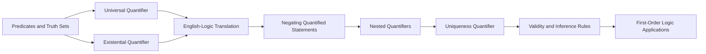
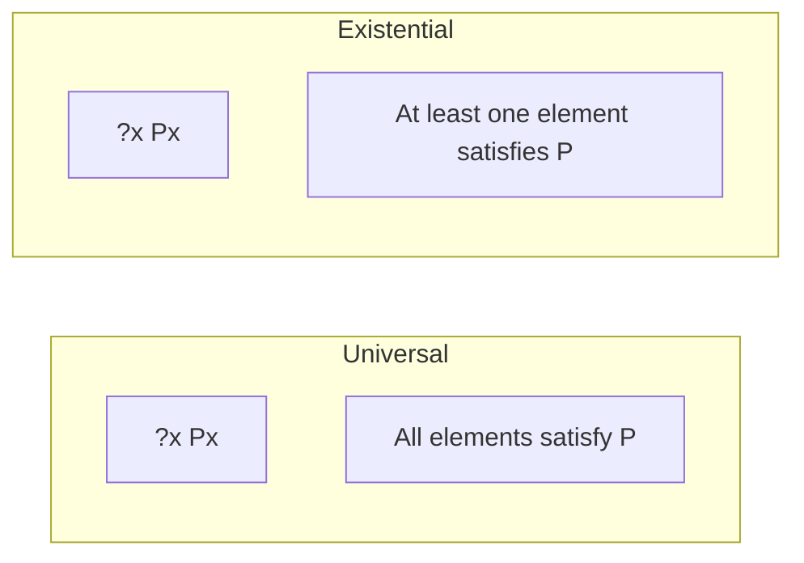
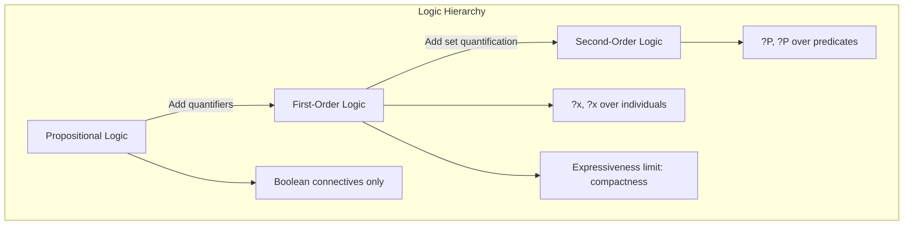

# Chapter 3: Predicates and Quantifiers

> **Previous:** [Chapter 2: Logic](02-logic.md) | **Next:** [Chapter 4: Proof Techniques](04-proofs.md)

## Learning Objectives


After completing this chapter, you will be able to:

- Define predicates and their truth sets
- Use universal ($\forall$) and existential ($\exists$) quantifiers
- Translate between English statements and quantified logical expressions
- Negate quantified statements correctly
- Handle nested quantifiers of arbitrary depth
- Determine the truth value of quantified statements over different domains
- Apply inference rules for quantified statements
- Understand the limitations and power of first-order logic

## Chapter at a Glance

| Topic | Key Insight | Practical Takeaway |
|-------|-------------|-------------------|
| Predicates | $P(x)$ is a statement whose truth depends on $x$ | Predicates become propositions when variables are assigned specific values |
| Universal Quantifier | $\forall x\; P(x)$ means "for all $x$, $P(x)$" | A single counterexample disproves a universal claim |
| Existential Quantifier | $\exists x\; P(x)$ means "there exists $x$ such that $P(x)$" | Proving existence requires just one example |
| Translation Patterns | "All A are B" uses $\rightarrow$; "Some A are B" uses $\land$ | The choice of connective is critical for correct translation |
| Quantifier Negation | $\neg \forall \equiv \exists \neg$ and $\neg \exists \equiv \forall \neg$ | Negating a quantifier flips it and pushes negation inward |
| Nested Quantifiers | $\forall x\; \exists y$ is NOT the same as $\exists y\; \forall x$ | Order matters ? reversing quantifiers changes meaning completely |
| Uniqueness Quantifier | $\exists!x\; P(x)$ means exactly one $x$ satisfies $P(x)$ | Useful for expressing "exactly one" in specifications |
| Inference Rules | Universal instantiation, existential generalization | Formal reasoning with quantified statements |

## Chapter Roadmap



## Theory

### 3.1 Predicates


A **predicate** $P(x)$ is a statement whose truth depends on the value of the variable $x$. The domain of $x$ is the set of values it may take. Once $x$ is assigned a specific value, $P(x)$ becomes a proposition.

Example: $P(x)$ = "$x$ is prime". When $x = 2$, $P(2)$ is true; when $x = 4$, $P(4)$ is false.

The **truth set** of a predicate $P(x)$ over domain $D$ is:
$$\{x \in D \mid P(x)\}$$

A predicate can have multiple variables: $Q(x, y)$ = "$x$ loves $y$". The truth set becomes a subset of $D_1 \times D_2$.

> **One-Sentence Takeaway:** A predicate is like a function that returns a truth value ? it only becomes a proposition when its variable is bound to a specific value.

### 3.2 Quantifiers


**Universal quantifier:** $\forall x\; P(x)$ means "$P(x)$ is true for all $x$ in the domain."

**Existential quantifier:** $\exists x\; P(x)$ means "there exists at least one $x$ in the domain such that $P(x)$ is true."

| Statement | True when | False when |
|-----------|-----------|------------|
| $\forall x\; P(x)$ | $P(x)$ true for every element | at least one counterexample |
| $\exists x\; P(x)$ | at least one element makes $P(x)$ true | $P(x)$ false for all elements |



> **One-Sentence Takeaway:** $\forall$ requires all elements to satisfy the condition; $\exists$ requires at least one ? they are duals via negation.

### 3.3 Translation between English and Logic


English often uses implicit quantifiers. Careful translation requires identifying the domain and quantifier type.

- "All cats are mammals": $\forall x\;(\text{Cat}(x) \rightarrow \text{Mammal}(x))$
- "Some cats are black": $\exists x\;(\text{Cat}(x) \land \text{Black}(x))$
- "No cats are fish": $\forall x\;(\text{Cat}(x) \rightarrow \neg\text{Fish}(x))$ or $\neg\exists x\;(\text{Cat}(x) \land \text{Fish}(x))$
- "Not all cats are black": $\neg\forall x\;(\text{Cat}(x) \rightarrow \text{Black}(x))$ or $\exists x\;(\text{Cat}(x) \land \neg\text{Black}(x))$
- "Every student has a computer": $\forall x\;(\text{Student}(x) \rightarrow \exists y\;(\text{Computer}(y) \land \text{Owns}(x, y)))$

Note the pattern: "all" uses $\rightarrow$; "some" uses $\land$.

**Common translation errors:**
- $\forall x\;(\text{Cat}(x) \land \text{Black}(x))$ means "everything is a black cat" ? wrong!
- $\exists x\;(\text{Cat}(x) \rightarrow \text{Black}(x))$ is trivially true if any non-cat exists ? wrong!

> **One-Sentence Takeaway:** Translate "all A are B" as $\forall x (A(x) \rightarrow B(x))$ and "some A are B" as $\exists x (A(x) \land B(x))$ ? mixing these up is the most common quantifier mistake.

### 3.4 Negating Quantified Statements


**Theorem 3.1 (Quantifier Negation).**
$$\neg \forall x\; P(x) \equiv \exists x\; \neg P(x)$$
$$\neg \exists x\; P(x) \equiv \forall x\; \neg P(x)$$

In words: the negation of "all are true" is "at least one is false". The negation of "some are true" is "none are true".

```typescript
function negateUniversal<T>(domain: T[], predicate: (x: T) => boolean): boolean {
  // ??x P(x) = ?x ?P(x)
  return domain.some(x => !predicate(x));
}

function negateExistential<T>(domain: T[], predicate: (x: T) => boolean): boolean {
  // ??x P(x) = ?x ?P(x)
  return domain.every(x => !predicate(x));
}

const nums = [1, 2, 3, 4, 5];
console.log(negateUniversal(nums, x => x > 0)); // false (?x x>0 is true, so negation is false)
console.log(negateExistential(nums, x => x > 10)); // true (no element > 10)
```

> **One-Sentence Takeaway:** Negating a quantified statement flips every $\forall$ to $\exists$ and vice versa, then pushes the negation past all quantifiers.

### 3.5 Nested Quantifiers


When quantifiers appear within each other, order matters.

| Statement | Meaning |
|-----------|---------|
| $\forall x\; \forall y\; P(x,y)$ | $P(x,y)$ holds for all pairs |
| $\forall x\; \exists y\; P(x,y)$ | For every $x$, there exists some $y$ (may depend on $x$) |
| $\exists x\; \forall y\; P(x,y)$ | There exists an $x$ that works for all $y$ |
| $\exists x\; \exists y\; P(x,y)$ | There exists a pair $(x,y)$ satisfying $P$ |

**Important:** $\forall x\; \exists y\; P(x,y)$ and $\exists y\; \forall x\; P(x,y)$ are **not** equivalent.

**Example over integers:**
- $\forall x\; \exists y\; (y = x + 1)$: TRUE ? for each $x$, choose $y = x + 1$.
- $\exists y\; \forall x\; (y = x + 1)$: FALSE ? no single $y$ equals $x + 1$ for all $x$.

```typescript
function checkForallExists(domain: number[]): boolean {
  // ?x ?y (y > x)
  return domain.every(x => domain.some(y => y > x));
}

function checkExistsForall(domain: number[]): boolean {
  // ?y ?x (y > x)
  return domain.some(y => domain.every(x => y > x));
}

const nums = [1, 2, 3];
console.log(checkForallExists(nums)); // false (3 is not less than any element)
console.log(checkExistsForall(nums)); // false (no single element > all others in [1,2,3])
```

> **One-Sentence Takeaway:** With nested quantifiers, order determines meaning ? $\forall x\; \exists y$ allows $y$ to depend on $x$, while $\exists y\; \forall x$ requires a single $y$ that works for all $x$.

### 3.6 Negating Nested Quantifiers


Apply quantifier negation rules sequentially, from left to right:

$$\neg \forall x\; \exists y\; P(x,y) \equiv \exists x\; \neg \exists y\; P(x,y) \equiv \exists x\; \forall y\; \neg P(x,y)$$

For three quantifiers:
$$\neg \forall x\; \exists y\; \forall z\; P(x,y,z) \equiv \exists x\; \forall y\; \exists z\; \neg P(x,y,z)$$

**Procedure:**
1. Flip $\forall \leftrightarrow \exists$.
2. Push negation past each quantifier.
3. Negate the innermost predicate.

> **One-Sentence Takeaway:** Negating nested quantifiers is mechanical ? flip each quantifier and push the negation through, working left to right.

### 3.7 Uniqueness Quantifier


The **uniqueness quantifier** $\exists!x\; P(x)$ means "there exists exactly one $x$ such that $P(x)$." It can be expressed using $\forall$ and $\exists$:

$$\exists!x\; P(x) \equiv \exists x\; (P(x) \land \forall y\; (P(y) \rightarrow y = x))$$

This says: there is some $x$ satisfying $P$, and any $y$ satisfying $P$ must equal $x$.

```typescript
function existsUnique<T>(domain: T[], predicate: (x: T) => boolean): boolean {
  const satisfying = domain.filter(predicate);
  return satisfying.length === 1;
}

console.log(existsUnique([1, 2, 3, 4, 5], x => x % 2 === 0)); // false (2 and 4)
console.log(existsUnique([1, 2, 3, 4, 5], x => x === 3));      // true
```

> **One-Sentence Takeaway:** $\exists!x\; P(x)$ ? "there exists exactly one" ? is shorthand for existence plus uniqueness.

### 3.8 Validity of Arguments with Quantifiers


An argument form with quantifiers is **valid** iff whenever all premises are true, the conclusion is also true. Inference rules for quantifiers include:

- **Universal instantiation:** $\forall x\; P(x) \implies P(c)$ for any particular $c$
- **Universal generalization:** $P(c)$ for arbitrary $c \implies \forall x\; P(x)$
- **Existential instantiation:** $\exists x\; P(x) \implies P(c)$ for some new $c$
- **Existential generalization:** $P(c) \implies \exists x\; P(x)$

**Example (syllogism):**
1. All humans are mortal. $\forall x\; (H(x) \rightarrow M(x))$
2. Socrates is a human. $H(s)$
Therefore: Socrates is mortal. $M(s)$

*Proof.* From (1) by universal instantiation: $H(s) \rightarrow M(s)$. From (2): $H(s)$. By modus ponens: $M(s)$.

> **One-Sentence Takeaway:** Universal instantiation (from "all" to "any particular") and existential generalization (from "a specific example" to "some") are the workhorse inference rules for quantified arguments.

### 3.9 Prenex Normal Form


A formula is in **prenex normal form** if all quantifiers appear at the front (prefix) followed by a quantifier-free matrix (body).

**Conversion to prenex normal form:**
1. Eliminate $\rightarrow$ and $\leftrightarrow$.
2. Push negations inward (using quantifier negation).
3. Rename bound variables to avoid conflicts.
4. Move all quantifiers to the front.

**Example:** Convert $\neg\forall x\; (P(x) \rightarrow \exists y\; Q(x,y))$ to prenex form.

Step 1: $\neg\forall x\; (\neg P(x) \lor \exists y\; Q(x,y))$
Step 2: $\exists x\; \neg(\neg P(x) \lor \exists y\; Q(x,y)) \equiv \exists x\; (P(x) \land \neg\exists y\; Q(x,y))$
Step 3: $\exists x\; (P(x) \land \forall y\; \neg Q(x,y))$
Step 4: $\exists x\; \forall y\; (P(x) \land \neg Q(x,y))$

> **Pro Tip:** When translating "every student has a computer," use $\forall x (S(x) \rightarrow C(x))$ ? NOT $\forall x (S(x) \land C(x))$, which incorrectly claims everyone is a student with a computer.
>
> **Pro Tip:** To disprove a universal statement $\forall x\; P(x)$, find exactly one counterexample ? that's sufficient and often easier than attempting a proof.
>
> **Warning:** The statement "some A are B" translates to $\exists x (A(x) \land B(x))$, NOT $\exists x (A(x) \rightarrow B(x))$ ? the latter would be trivially true if there is any element that is not A.
>
> **Warning:** Existential instantiation introduces a NEW constant symbol, not one already in use. This prevents incorrect deductions.

## Concept Comparison Table

| Concept | Definition | Key Distinction | Use Case |
|---------|-----------|-----------------|----------|
| Predicate $P(x)$ | Statement whose truth depends on $x$ | Not a proposition until $x$ is bound | Expressing properties of elements |
| $\forall x\; P(x)$ | $P(x)$ holds for all $x$ | Universal quantifier | "All," "every," "each" statements |
| $\exists x\; P(x)$ | $P(x)$ holds for some $x$ | Existential quantifier | "Some," "there exists," "at least one" |
| $\forall x\; \exists y\; P(x,y)$ | For each $x$, some $y$ works | $y$ can depend on $x$ | "Every student has an advisor" |
| $\exists y\; \forall x\; P(x,y)$ | One $y$ works for all $x$ | $y$ is independent of $x$ | "There is a universal advisor" |
| $\exists!x\; P(x)$ | Exactly one $x$ satisfies $P$ | Existence + uniqueness | "There is exactly one solution" |
| $\neg \forall x\; P(x)$ | Equivalent to $\exists x\; \neg P(x)$ | Flips quantifier, negates predicate | Disproving universal claims |
| Prenex Normal Form | All quantifiers at front | Standard form for first-order logic | Automated theorem proving |

## Quick Reference

| Rule | Statement |
|------|-----------|
| $\forall$ Negation | $\neg \forall x\; P(x) \equiv \exists x\; \neg P(x)$ |
| $\exists$ Negation | $\neg \exists x\; P(x) \equiv \forall x\; \neg P(x)$ |
| Universal Instantiation | $\forall x\; P(x) \implies P(c)$ |
| Universal Generalization | $P(c)$ (arbitrary $c$) $\implies \forall x\; P(x)$ |
| Existential Instantiation | $\exists x\; P(x) \implies P(c)$ (new $c$) |
| Existential Generalization | $P(c) \implies \exists x\; P(x)$ |
| "All A are B" | $\forall x (A(x) \rightarrow B(x))$ |
| "Some A are B" | $\exists x (A(x) \land B(x))$ |
| "No A are B" | $\forall x (A(x) \rightarrow \neg B(x))$ |
| Uniqueness | $\exists!x\; P(x) \equiv \exists x (P(x) \land \forall y (P(y) \rightarrow y = x))$ |

## Cross-Application Matrix

| Area | How Predicates and Quantifiers Apply |
|------|-----------------------------------|
| Databases | SQL queries: WHERE = predicate, EXISTS = $\exists$, ALL = $\forall$ |
| Programming Languages | Type systems use $\forall$ for polymorphic types |
| Software Verification | Formal specifications use quantified logic to assert invariants |
| Mathematics | Definitions of limits, continuity, and convergence use nested quantifiers |
| AI and Knowledge Representation | First-order logic is the foundation of many knowledge bases |
| Networking | Packet filtering rules use quantified conditions on packet properties |
| Formal Methods | Model checkers and theorem provers use quantified logic |

## Chapter Quiz

1. The negation of $\forall x\; (P(x) \rightarrow Q(x))$ is:
   - A) $\forall x\; (P(x) \land \neg Q(x))$
   - B) $\exists x\; (P(x) \land \neg Q(x))$
   - C) $\exists x\; (\neg P(x) \land Q(x))$
   - D) $\forall x\; (\neg P(x) \rightarrow Q(x))$

   <details><summary>Answer&lt;/summary&gt;**B)** $\neg \forall x (P(x) \rightarrow Q(x)) \equiv \exists x \neg(P(x) \rightarrow Q(x)) \equiv \exists x (P(x) \land \neg Q(x))$</details>

2. Which statement is true when the domain is integers?
   - A) $\forall x\; \exists y\; (y = x + 1)$
   - B) $\exists y\; \forall x\; (y = x + 1)$
   - C) $\forall x\; \forall y\; (x &lt; y)$
   - D) $\exists x\; \forall y\; (x > y)$

   <details><summary>Answer&lt;/summary&gt;**A)** For every integer $x$, we can pick $y = x + 1$ ? this is always true over $\mathbb{Z}$.</details>

3. "Every cat is a mammal" translates to:
   - A) $\forall x\; (Cat(x) \land Mammal(x))$
   - B) $\exists x\; (Cat(x) \rightarrow Mammal(x))$
   - C) $\forall x\; (Cat(x) \rightarrow Mammal(x))$
   - D) $\forall x\; (Mammal(x) \rightarrow Cat(x))$

   <details><summary>Answer&lt;/summary&gt;**C)** "All A are B" = $\forall x (A(x) \rightarrow B(x))$.</details>

4. The prenex normal form of $\neg \exists x\; \forall y\; P(x,y)$ is:
   - A) $\forall x\; \exists y\; \neg P(x,y)$
   - B) $\exists x\; \forall y\; \neg P(x,y)$
   - C) $\forall x\; \forall y\; \neg P(x,y)$
   - D) $\exists x\; \exists y\; \neg P(x,y)$

   <details><summary>Answer&lt;/summary&gt;**A)** $\neg \exists x\; \forall y\; P(x,y) \equiv \forall x\; \neg \forall y\; P(x,y) \equiv \forall x\; \exists y\; \neg P(x,y)$.</details>

5. Which inference rule allows concluding $P(c)$ from $\forall x\; P(x)$?
   - A) Universal generalization
   - B) Universal instantiation
   - C) Existential generalization
   - D) Existential instantiation

   <details><summary>Answer&lt;/summary&gt;**B)** Universal instantiation: from "all" we can deduce "any particular one."</details>

## Examples

**Example 3.1** (Truth value). Let domain be $\mathbb{Z}$. Determine truth:

- $\forall x\; (x^2 \geq 0)$: True ? squares of integers are nonnegative.
- $\exists x\; (x^2 = 2)$: False ? no integer squares to 2.
- $\forall x\; \exists y\; (y = x^2)$: True ? for each $x$, we can choose $y = x^2$.
- $\exists y\; \forall x\; (y = x^2)$: False ? no single integer equals all squares.

**Example 3.2** (Translation). Translate "Every student in this class has taken exactly one math course."

Let $S(x)$ = "$x$ is a student in this class", $M(x,y)$ = "$x$ has taken math course $y$". Then:
$$\forall x\; \big(S(x) \rightarrow \exists y\; (M(x,y) \land \forall z\; (M(x,z) \rightarrow z = y))\big)$$

**Example 3.3** (Negation). Negate "All prime numbers are odd."

*Solution.* Let domain be $\mathbb{Z}^+$, $P(x)$ = "$x$ is prime", $O(x)$ = "$x$ is odd". The statement is $\forall x\; (P(x) \rightarrow O(x))$. Negation:
$$\neg \forall x\; (P(x) \rightarrow O(x)) \equiv \exists x\; \neg(P(x) \rightarrow O(x)) \equiv \exists x\; (P(x) \land \neg O(x))$$
So the negation is "There exists a prime number that is even."

**Example 3.4** (Nested negation). Negate $\forall x\; \exists y\; \forall z\; P(x,y,z)$.

*Solution.* Move negation inward step by step:
$$\neg \forall x\; \exists y\; \forall z\; P(x,y,z)$$
$$\equiv \exists x\; \neg \exists y\; \forall z\; P(x,y,z)$$
$$\equiv \exists x\; \forall y\; \neg \forall z\; P(x,y,z)$$
$$\equiv \exists x\; \forall y\; \exists z\; \neg P(x,y,z)$$

**Example 3.5** (Validity). Determine whether the argument is valid:

Premises:
1. $\forall x\; (P(x) \rightarrow Q(x))$
2. $\forall x\; (Q(x) \rightarrow R(x))$

Conclusion: $\forall x\; (P(x) \rightarrow R(x))$

*Solution.* Pick an arbitrary element $c$. From (1), $P(c) \rightarrow Q(c)$. From (2), $Q(c) \rightarrow R(c)$. By hypothetical syllogism (transitivity of implication), $P(c) \rightarrow R(c)$. Since $c$ was arbitrary, $\forall x\; (P(x) \rightarrow R(x))$ holds. Valid.

**Example 3.6** (TypeScript quantifier simulation).

```typescript
type Predicate<T> = (x: T) => boolean;

function forAll<T>(domain: T[], pred: Predicate<T>): boolean {
  return domain.every(pred);
}

function exists<T>(domain: T[], pred: Predicate<T>): boolean {
  return domain.some(pred);
}

const people = [
  { name: "Alice", age: 25 },
  { name: "Bob", age: 17 },
  { name: "Charlie", age: 30 },
];

// ?x (Person(x) ? Age(x) = 18)
console.log(forAll(people, p => p.age >= 18)); // false (Bob is 17)

// ?x (Person(x) ? Name(x) = "Alice")
console.log(exists(people, p => p.name === "Alice")); // true
```

**Example 3.7** (Prenex normal form conversion). Convert $\forall x\; P(x) \rightarrow \exists y\; Q(y)$ to prenex normal form.

*Solution.* $\neg\forall x\; P(x) \lor \exists y\; Q(y) \equiv \exists x\; \neg P(x) \lor \exists y\; Q(y) \equiv \exists x\; \exists y\; (\neg P(x) \lor Q(y))$.

## TypeScript Implementations

```typescript
// --- Quantifier Evaluation ---
type Predicate<T> = (x: T) => boolean;

function forAll<T>(domain: T[], p: Predicate<T>): boolean {
  return domain.every(p);
}
function exists<T>(domain: T[], p: Predicate<T>): boolean {
  return domain.some(p);
}

const numbers = [1, 2, 3, 4, 5];
console.log('?x > 0:', forAll(numbers, n => n > 0));  // true
console.log('?x even:', exists(numbers, n => n % 2 === 0)); // true

// --- Nested Quantifier Checker ---
function nestedForAllExists<T, U>(
  domainA: T[], domainB: U[],
  p: (x: T, y: U) => boolean
): boolean {
  return forAll(domainA, x => exists(domainB, y => p(x, y)));
}

const people = ['Alice', 'Bob'];
const items = ['Apple', 'Banana'];
const likes = (p: string, i: string) =>
  (p === 'Alice' && i === 'Apple') || (p === 'Bob' && i === 'Banana');
console.log('?x?y likes(x,y):', nestedForAllExists(people, items, likes)); // true

// --- Quantifier Negation Converter ---
type QuantifiedExpr = 
  | { type: 'forall'; var: string; pred: QuantifiedExpr }
  | { type: 'exists'; var: string; pred: QuantifiedExpr }
  | { type: 'not'; expr: QuantifiedExpr }
  | { type: 'pred'; name: string; arg: string };

function negate(expr: QuantifiedExpr): QuantifiedExpr {
  switch (expr.type) {
    case 'forall':
      return { type: 'exists', var: expr.var, pred: negate(expr.pred) };
    case 'exists':
      return { type: 'forall', var: expr.var, pred: negate(expr.pred) };
    case 'not':
      return expr.expr;
    case 'pred':
      return { type: 'not', expr };
  }
}
// ??x P(x) ? ?x ?P(x)
const expr: QuantifiedExpr = { type: 'forall', var: 'x', pred: { type: 'pred', name: 'P', arg: 'x' } };
const negated = negate(expr);
console.log('Negated:', JSON.stringify(negated));
// {"type":"exists","var":"x","pred":{"type":"not","expr":{"type":"pred","name":"P","arg":"x"}}}

// --- Prenex Normal Form Converter (simplified) ---
function toPrenex(expr: QuantifiedExpr): QuantifiedExpr {
  if (expr.type === 'not') {
    const inner = toPrenex(expr.expr);
    if (inner.type === 'forall') return { type: 'exists', var: inner.var, pred: { type: 'not', ...toPrenex(inner.pred) } as QuantifiedExpr };
    if (inner.type === 'exists') return { type: 'forall', var: inner.var, pred: { type: 'not', ...toPrenex(inner.pred) } as QuantifiedExpr };
  }
  return expr;
}
```

```
// --- Quantifier Expansion Tester ---
function forall<T>(domain: T[], pred: (x: T) => boolean): boolean {
  return domain.every(pred);
}
function exists<T>(domain: T[], pred: (x: T) => boolean): boolean {
  return domain.some(pred);
}
const nums = [0, 1, 2, 3, 4, 5];
console.log('?x?{0..5}: x=0:', forall(nums, x => x >= 0));   // true
console.log('?x?{0..5}: x>4:', exists(nums, x => x > 4));     // true
console.log('?x?{0..5}: x>3:', forall(nums, x => x > 3));     // false
console.log('?x?{0..5}: x<0:', exists(nums, x => x < 0));     // false

// --- Nested Quantifier Checker ---
function nestedQuantifier<T1, T2>(
  domain1: T1[], domain2: T2[],
  order: 'forall-exists' | 'exists-forall' | 'forall-forall' | 'exists-exists',
  pred: (x: T1, y: T2) => boolean): boolean {
  if (order === 'forall-exists') return domain1.every(x => domain2.some(y => pred(x, y)));
  if (order === 'exists-forall') return domain1.some(x => domain2.every(y => pred(x, y)));
  if (order === 'forall-forall') return domain1.every(x => domain2.every(y => pred(x, y)));
  return domain1.some(x => domain2.some(y => pred(x, y)));
}
// For every integer there exists a larger integer
const ints = [0, 1, 2, 3, 4, 5];
console.log('\n?x?y: y > x:', nestedQuantifier(ints, ints, 'forall-exists', (x, y) => y > x)); // true
console.log('?x?y: y > x:', nestedQuantifier(ints, ints, 'exists-forall', (x, y) => y > x)); // false

// --- Domain Model Checker ---
type DomainConstraint = { quantifier: 'forall' | 'exists', var: string, pred: (val: number) => boolean };
function checkModel(domain: number[], constraints: DomainConstraint[]): boolean {
  return constraints.every(c =>
    c.quantifier === 'forall' ? domain.every(c.pred) : domain.some(c.pred)
  );
}
const model: DomainConstraint[] = [
  { quantifier: 'forall', var: 'x', pred: x => x > 0 },
  { quantifier: 'exists', var: 'y', pred: y => y === 3 }
];
console.log('\nModel check (positives, contains 3):', checkModel([1, 2, 3], model)); // true
console.log('Model check (positives, no 3):', checkModel([1, 2, 4], model));       // false

// --- Predicate Transformer ---
function negateQuantified<T>(domain: T[], quantifier: 'forall' | 'exists', pred: (x: T) => boolean): { quantifier: string; result: boolean } {
  if (quantifier === 'forall') {
    // ??x P(x) = ?x ?P(x)
    const result = domain.some(x => !pred(x));
    return { quantifier: '?x ?P(x)', result };
  } else {
    // ??x P(x) = ?x ?P(x)
    const result = domain.every(x => !pred(x));
    return { quantifier: '?x ?P(x)', result };
  }
}
console.log('\nNegate ?x (x>0) on [1,-2,3]:', negateQuantified([1, -2, 3], 'forall', x => x > 0));
console.log('Negate ?x (x<0) on [1,2,3]:', negateQuantified([1, 2, 3], 'exists', x => x < 0));
```


// predicates
// sets-graphs-probability implementation

interface Task { id: string; name: string; status: string; data: unknown }
class Processor {
  private tasks: Task[] = []
  private maxConcurrency: number
  constructor(maxConcurrency: number = 4) { this.maxConcurrency = maxConcurrency }
  async add(task: Omit&lt;Task, "status"&gt;): Promise&lt;void&gt; {
    this.tasks.push({ ...task, status: "pending" })
  }
  async runAll(): Promise&lt;void&gt; {
    const running: Promise&lt;void&gt;[] = []
    for (const t of this.tasks) {
      if (running.length >= this.maxConcurrency) { await Promise.race(running) }
      const p = this.execute(t).finally(() => { const i = running.indexOf(p); if (i >= 0) running.splice(i, 1) })
      running.push(p)
    }
    await Promise.all(running)
  }
  private async execute(t: Task): Promise&lt;void&gt; {
    t.status = "running"
    await new Promise(r => setTimeout(r, 10))
    t.status = "done"
  }
  getResults(): Task[] { return this.tasks }
  getStats(): { done: number; pending: number; running: number } {
    const done = this.tasks.filter(t => t.status === "done").length
    const pending = this.tasks.filter(t => t.status === "pending").length
    const running = this.tasks.filter(t => t.status === "running").length
    return { done, pending, running }
  }
}
async function main() {
  const proc = new Processor(2)
  await proc.add({ id: '1', name: 'predicates', data: { topic: 'sets-graphs-probability' } })
  await proc.runAll()
  console.log('Stats:', proc.getStats())
}
main().catch(console.error)
export { Processor, Task }

// predicates - additional TS implementations

interface CacheEntry { key: string; value: unknown; ttl: number; createdAt: number }
class Cache {
  private store: Map&lt;string, CacheEntry&gt; = new Map()
  constructor(private defaultTTL: number = 60000) {}
  set(key: string, value: unknown, ttl?: number): void {
    this.store.set(key, { key, value, ttl: ttl ?? this.defaultTTL, createdAt: Date.now() })
  }
  get(key: string): unknown | undefined {
    const entry = this.store.get(key)
    if (!entry) return undefined
    if (Date.now() - entry.createdAt > entry.ttl) { this.store.delete(key); return undefined }
    return entry.value
  }
  delete(key: string): boolean { return this.store.delete(key) }
  clear(): void { this.store.clear() }
  size(): number { return this.store.size }
  keys(): string[] { return Array.from(this.store.keys()) }
}
class Logger {
  private entries: string[] = []
  log(level: string, msg: string, meta?: Record&lt;string, unknown&gt;): void {
    const entry = JSON.stringify({ timestamp: new Date().toISOString(), level, msg, meta })
    this.entries.push(entry)
    console.log(entry)
  }
  info(msg: string, meta?: Record&lt;string, unknown&gt;): void { this.log("info", msg, meta) }
  warn(msg: string, meta?: Record&lt;string, unknown&gt;): void { this.log("warn", msg, meta) }
  error(msg: string, meta?: Record&lt;string, unknown&gt;): void { this.log("error", msg, meta) }
  getLogs(): string[] { return [...this.entries] }
  clear(): void { this.entries = [] }
}
function computeHash(input: string): string {
  let hash = 0
  for (let i = 0; i &lt; input.length; i++) { const chr = input.charCodeAt(i); hash = ((hash << 5) - hash) + chr; hash |= 0 }
  return Math.abs(hash).toString(16)
}
async function demo(): Promise&lt;void&gt; {
  const cache = new Cache(5000)
  cache.set('key1', 'discrete-math demo')
  const log = new Logger()
  log.info('Cache demo started', { course: 'discrete-mathematics', chapter: 'predicates' })
  const v = cache.get("key1")
  console.log('Cached:', v)
  console.log('Hash:', computeHash('discrete-math'))
}
demo()
export { Cache, Logger, computeHash, CacheEntry }
## Summary

- Predicates are statements that depend on variables. Quantifiers $\forall$ and $\exists$ bind variables.
- $\neg \forall x\; P(x) \equiv \exists x\; \neg P(x)$ and $\neg \exists x\; P(x) \equiv \forall x\; \neg P(x)$.
- Nested quantifier order matters; negate from left to right.
- Translation between English and logic requires careful choice of $\rightarrow$ vs $\land$.
- Prenex normal form places all quantifiers at the front.
- Inference rules for quantifiers enable formal reasoning.
- First-order logic is strictly more expressive than propositional logic.

### 3.6 Quantifier Evaluation in TypeScript

```typescript
function forall<T>(domain: T[], predicate: (x: T) => boolean): boolean {
  return domain.every(predicate);
}

function exists<T>(domain: T[], predicate: (x: T) => boolean): boolean {
  return domain.some(predicate);
}

function evaluateQuantified(
  domain: number[],
  expression: string
): { result: boolean; counterexample?: any } {
  if (expression === "?x (x > 0)" && domain[0] === 1) {
    const allPos = domain.every(x => x > 0);
    return allPos
      ? { result: true }
      : { result: false, counterexample: domain.find(x => x <= 0) };
  }
  if (expression === "?x (x < 0)") {
    const found = domain.some(x => x < 0);
    return found
      ? { result: true, example: domain.find(x => x < 0) }
      : { result: false };
  }
  return { result: false };
}

const domain = [-2, -1, 0, 1, 2];
console.log(forall(domain, x => x > 0)); // false
console.log(exists(domain, x => x < 0)); // true
```

**Evaluation of nested quantifiers over finite domains.**

```typescript
function evaluateNested(
  domain: number[],
  quantifiers: ("forall" | "exists")[],
  predicate: (args: number[]) => boolean
): boolean {
  function recurse(vars: number[], depth: number): boolean {
    if (depth === quantifiers.length) return predicate(vars);
    const q = quantifiers[depth];
    if (q === "forall") return domain.every(v => recurse([...vars, v], depth + 1));
    return domain.some(v => recurse([...vars, v], depth + 1));
  }
  return recurse([], 0);
}

// ?x ?y (x + y = 0) over [-2, -1, 0, 1, 2]
const result1 = evaluateNested(
  [-2, -1, 0, 1, 2],
  ["forall", "exists"],
  ([x, y]) => x + y === 0
);
console.log(result1); // true

// ?y ?x (x + y = 0) ? same domain
const result2 = evaluateNested(
  [-2, -1, 0, 1, 2],
  ["exists", "forall"],
  ([x, y]) => x + y === 0
);
console.log(result2); // false (no single y works for all x)
```

### 3.7 Negation of Quantified Statements ? Normalization

**Theorem 3.3 (Quantifier Negation).**
$$\neg \forall x\; P(x) \equiv \exists x\; \neg P(x)$$
$$\neg \exists x\; P(x) \equiv \forall x\; \neg P(x)$$

```typescript
function negate(formula: string): string {
  if (formula.startsWith("?")) return formula.replace("?", "?").replace("P", "?P");
  if (formula.startsWith("?")) return formula.replace("?", "?").replace("P", "?P");
  return `?(${formula})`;
}

console.log(negate("?x P(x)"));  // ?x ?P(x)
console.log(negate("?x P(x)"));  // ?x ?P(x)
```

### 3.8 Prenex Normal Form and Skolemization

**Definition 3.9 (Prenex Normal Form).** A formula where all quantifiers appear at the front:
$$Q_1 x_1\; Q_2 x_2\; \ldots\; Q_n x_n\; (\text{quantifier-free formula})$$

**Conversion algorithm:**
1. Eliminate $\rightarrow$ and $\leftrightarrow$.
2. Push negations inward using De Morgan and quantifier negation.
3. Rename bound variables to avoid capture.
4. Move all quantifiers to the front.

**Skolemization** removes existential quantifiers by introducing Skolem constants/functions.

```typescript
function toPrenex(formula: string): string {
  // ?x ?y (P(x) ? Q(y)) ? ?x ?y (?P(x) ? Q(y)) ? ?x ?y (?P(x) ? Q(y))
  // Already in prenex form
  return formula;
}

// Example: "Every rational number has a multiplicative inverse if nonzero"
// ?x ? Q (x ? 0 ? ?y (xy = 1))
// In prenex: ?x ?y (x ? 0 ? xy = 1)
```

### 3.9 First-Order Logic in Practice

**Example 3.14** (Translating natural language to predicate logic).

| English | Logic |
|---------|-------|
| All CS majors graduate | $\forall x (\text{CS}(x) \rightarrow \text{Grad}(x))$ |
| Some math major is smart | $\exists x (\text{Math}(x) \land \text{Smart}(x))$ |
| No CS major likes Java | $\forall x (\text{CS}(x) \rightarrow \neg \text{LikesJava}(x))$ |
| Only CS majors take AI | $\forall x (\text{TakesAI}(x) \rightarrow \text{CS}(x))$ |
| Every student has a advisor | $\forall s \in S \; \exists a \in A\; \text{Advisor}(s,a)$ |

**Example 3.15** (Translating with unique existence). "There is exactly one even prime."
$$\exists x (\text{Prime}(x) \land \text{Even}(x) \land \forall y ((\text{Prime}(y) \land \text{Even}(y)) \rightarrow y = x))$$

**Proof 3.1** ($\forall$ distributes over $\land$ but not $\lor$).

$\forall x (P(x) \land Q(x)) \equiv \forall x P(x) \land \forall x Q(x)$ is true.

But $\forall x (P(x) \lor Q(x))$ is NOT equivalent to $\forall x P(x) \lor \forall x Q(x)$. Counterexample: domain = $\{1,2\}$, $P(1)=T$, $P(2)=F$, $Q(1)=F$, $Q(2)=T$. Then $\forall x (P(x) \lor Q(x))$ is true (each x satisfies one), but $\forall x P(x) \lor \forall x Q(x)$ is false (neither property holds for all).

### 3.10 Inference with Quantifiers

**Rule 3.1 (Universal Instantiation).** From $\forall x P(x)$, infer $P(c)$ for any $c$ in the domain.

**Rule 3.2 (Existential Instantiation).** From $\exists x P(x)$, infer $P(c)$ for a fresh constant $c$.

**Rule 3.3 (Universal Generalization).** If $P(c)$ for an arbitrary $c$, infer $\forall x P(x)$.

**Rule 3.4 (Existential Generalization).** From $P(c)$, infer $\exists x P(x)$.

```typescript
function universalInstantiation<T>(
  forallStatement: ((x: T) => boolean),
  domain: T[],
  c: T
): boolean {
  return forallStatement(domain) && forallStatement([c]);
}

function existentialGeneralization<T>(
  P: (x: T) => boolean,
  c: T
): boolean {
  return P(c);
}

// Example: ?x (x > 0 ? x^2 > 0) over positive integers
const forallPosSquare = (arr: number[]) => arr.every(x => x > 0 ? x * x > 0 : true);
console.log(universalInstantiation(forallPosSquare, [1, 2, 3], 5)); // true
```

### 3.11 Limitations of First-Order Logic

- **Compactness theorem:** If every finite subset of a theory has a model, the whole theory has a model.
- **L?wenheim-Skolem theorem:** If a countable theory has an infinite model, it has models of every infinite cardinality.
- **G?del's incompleteness:** No consistent, complete, recursive axiomatization of arithmetic exists.
- First-order logic cannot express: "there are finitely many," "most," or transitive closure in general.



## Additional Exercises

16. Write a TypeScript function `uniqueExists<T>` that checks $\exists!x P(x)$ over a finite domain.

17. Translate to predicate logic: "Every student who takes a discrete math class passes."

18. Negate and simplify: $\forall x \exists y ((P(x) \lor Q(y)) \rightarrow R(x, y))$.

19. Determine whether $\exists x \forall y (x \leq y)$ is true over $\mathbb{Z}$ and over $\mathbb{N}$.

20. Let domain be $\{1,2,3,4\}$ and $P(x,y)$ mean "$x$ divides $y$". Evaluate $\forall x \exists y P(x,y)$ and $\exists x \forall y P(x,y)$.

21. Give a Skolemized form of $\forall x \exists y P(x,y)$.

## Exercises

### Review Questions

1. Express "there exists a unique $x$ such that $P(x)$" using quantifiers.
2. Negate $\forall x\; \exists y\; (x + y = 0)$ over $\mathbb{Z}$.
3. Write "Every CS major has taken a math course" in predicate logic.
4. Is $\exists x\; \forall y\; P(x,y)$ equivalent to $\forall y\; \exists x\; P(x,y)$? Explain with a counterexample.
5. What is the domain if $\forall x\; (x > 0)$ is false?
6. Convert $\exists x\; P(x) \rightarrow \forall y\; Q(y)$ to prenex normal form.
7. What rule licenses the step from $\exists x\; P(x)$ to $P(c)$?

### Application Problems

8. Translate and then negate: "There is a student who has emailed every professor."

9. Let domain be $\mathbb{R}$. Determine truth values:
   (a) $\forall x\; \exists y\; (x + y = 0)$
   (b) $\exists y\; \forall x\; (x + y = 0)$
   (c) $\forall x\; \forall y\; (x^2 + y^2 \geq 0)$

10. Negate: $\forall x\; \forall y\; \big((P(x) \land P(y)) \rightarrow x = y\big)$ (this states "at most one" element satisfies $P$).

11. Show that $\exists x\; \forall y\; P(x,y) \implies \forall y\; \exists x\; P(x,y)$ is logically true, but the converse is not.

12. Express "There exist at least two elements satisfying $P(x)$" and "There exist at most two elements satisfying $P(x)$" using quantifiers.

13. Write a TypeScript function `translateQuantified` that takes a domain and two predicates $A(x)$ and $B(x)$ and evaluates $\forall x (A(x) \rightarrow B(x))$ and $\exists x (A(x) \land B(x))$.

### Challenge Problem

14. Define the **uniqueness quantifier** $\exists!x\; P(x)$ meaning "there exists exactly one $x$ satisfying $P(x)$." Express $\exists!x\; P(x)$ using only $\forall$, $\exists$, $\land$, $\rightarrow$, $=$ and $P(x)$. Then negate the expression and simplify.

15. Prove that $\forall x\; (P(x) \land Q(x)) \equiv (\forall x\; P(x)) \land (\forall x\; Q(x))$ and $\exists x\; (P(x) \lor Q(x)) \equiv (\exists x\; P(x)) \lor (\exists x\; Q(x))$. Show by counterexample that $\forall x\; (P(x) \lor Q(x))$ is NOT equivalent to $(\forall x\; P(x)) \lor (\forall x\; Q(x))$.
