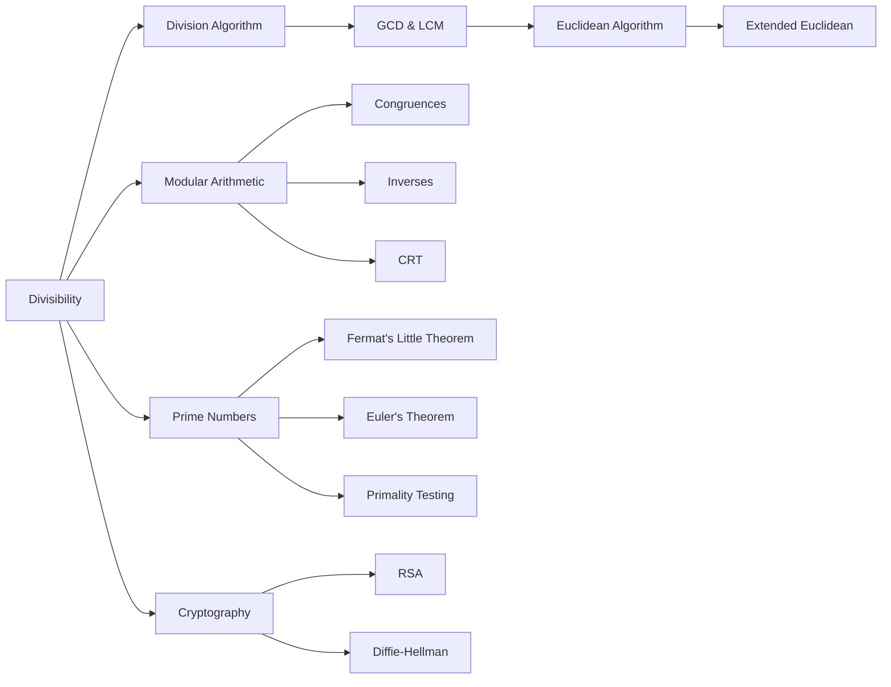
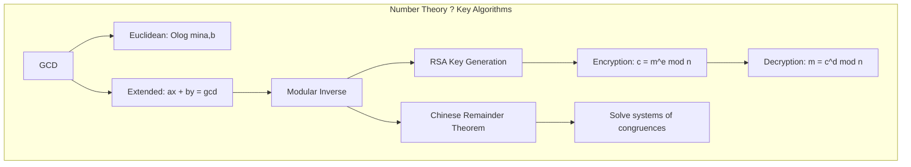

# Chapter 14: Number Theory

> **Previous:** [Chapter 13: Probability](./13-probability.md) | **Next:** [Chapter 15: Applications](./15-applications.md)

## Learning Objectives

After completing this chapter, you will be able to:

<!-- Image Gallery -->
<section class="lesson-visuals" aria-label="Visual learning resources">
  <header><span>VISUAL LEARNING</span><h2>See it. Review it. Remember it.</h2></header>
  <a class="lesson-visual-card" href="../../assets/images/lessons/discrete-mathematics/14-number-theory/handwritten-notes.png" target="_blank" rel="noopener">
    
    <span><strong>Handwritten notes</strong>Condensed notes for deliberate review.</span>
  </a>
  <a class="lesson-visual-card" href="../../assets/images/lessons/discrete-mathematics/14-number-theory/sticky-notes.png" target="_blank" rel="noopener">
    
    <span><strong>Sticky-note revision</strong>Fast recall prompts for revision.</span>
  </a>
  <a class="lesson-visual-card" href="../../assets/images/lessons/discrete-mathematics/14-number-theory/visual-explanation.png" target="_blank" rel="noopener">
    
    <span><strong>Visual concept guide</strong>A connected explanation of the key ideas.</span>
  </a>
</section>
<!-- End Image Gallery -->


- Understand divisibility and the division algorithm
- Compute greatest common divisors using the Euclidean algorithm
- Apply the extended Euclidean algorithm to find B?zout coefficients
- Understand modular arithmetic and congruence relations
- Solve linear congruences using inverses modulo $n$
- Apply the Chinese Remainder Theorem to solve systems of congruences
- Understand Fermat's Little Theorem and Euler's theorem
- Differentiate between prime and composite numbers
- Compute Euler's totient function
- Understand the fundamentals of RSA encryption

## Chapter at a Glance

| Topic | Key Insight | Practical Takeaway |
|-------|-------------|-------------------|
| Divisibility | $a \mid b$ means $b = a \cdot k$ for some integer $k$ | Foundation for all of number theory |
| Division Algorithm | $a = q \cdot m + r$ with $0 \leq r &lt; m$ | Uniqueness of quotient and remainder |
| GCD & LCM | $\gcd(a,b) \cdot \text{lcm}(a,b) = a \cdot b$ | Euclidean algorithm finds $\gcd$ efficiently |
| Euclidean Algorithm | $\gcd(a,b) = \gcd(b, a \bmod b)$ | Repeated remainder computation; $O(\log \min(a,b))$ |
| Modular Arithmetic | $a \equiv b \pmod{m}$ if $m \mid (a-b)$ | Arithmetic modulo $m$ is consistent with integers |
| Modular Inverses | $a \cdot a^{-1} \equiv 1 \pmod{m}$ | Exists iff $\gcd(a,m) = 1$ |
| Chinese Remainder Theorem | System of congruences with coprime moduli has a unique solution mod $M$ | Enables parallel computation on large integers |
| Fermat's Little Theorem | $a^p \equiv a \pmod{p}$ for prime $p$ | Foundation of primality testing and RSA |
| Euler's Theorem | $a^{\phi(m)} \equiv 1 \pmod{m}$ for $\gcd(a,m)=1$ | Generalization of FLT to composite moduli |
| RSA | Encryption: $c = m^e \bmod n$, Decryption: $m = c^d \bmod n$ | Security depends on hardness of factoring $n$ |

## Chapter Roadmap



## Theory

### 14.1 Divisibility


For integers $a$ and $b$ with $a \neq 0$, $a$ **divides** $b$ (written $a \mid b$) if there is an integer $k$ such that $b = a \cdot k$.

**Theorem 14.1 (Properties of divisibility).**
1. If $a \mid b$ and $b \mid c$, then $a \mid c$ (transitivity).
2. If $a \mid b$ and $a \mid c$, then $a \mid (b + c)$ and $a \mid (b - c)$.
3. If $a \mid b$, then $a \mid b \cdot c$ for any integer $c$.
4. If $a \mid b$ and $b \neq 0$, then $|a| \leq |b|$.
5. $1$ divides every integer; every integer divides $0$.

> **One-Sentence Takeaway:** Divisibility $a \mid b$ means $b$ is a multiple of $a$; it is transitive and closed under linear combinations.

### 14.2 Division Algorithm


**Theorem 14.2 (Division algorithm).** For integers $a$ and $m > 0$, there exist unique integers $q$ (quotient) and $r$ (remainder) such that:
$$a = q \cdot m + r,\quad 0 \leq r &lt; m$$

We write $r = a \bmod m$ and $q = \lfloor a/m \rfloor$.

> **One-Sentence Takeaway:** Every integer $a$ can be uniquely expressed as $a = qm + r$ with $0 \leq r &lt; m$; the remainder is the basis of modular arithmetic.

### 14.3 GCD and LCM


The **greatest common divisor** $\gcd(a,b)$ is the largest integer dividing both $a$ and $b$.

The **least common multiple** $\text{lcm}(a,b)$ is the smallest positive integer divisible by both $a$ and $b$.

**Theorem 14.3 (GCD-LCM product).** $\gcd(a,b) \cdot \text{lcm}(a,b) = |a \cdot b|$.

**Theorem 14.4 (GCD as linear combination).** $\gcd(a,b)$ is the smallest positive integer of the form $ax + by$ for integers $x, y$.

Two integers are **relatively prime** (coprime) if $\gcd(a,b) = 1$.

> **One-Sentence Takeaway:** Every common divisor divides the GCD; the GCD is the smallest positive linear combination of $a$ and $b$.

### 14.4 Euclidean Algorithm


**Theorem 14.5 (Euclidean algorithm).** For $a \geq b > 0$:
$$\gcd(a,b) = \gcd(b, a \bmod b)$$
Repeat until the remainder is 0; the last non-zero remainder is $\gcd(a,b)$.

```typescript
function gcd(a: number, b: number): number {
  a = Math.abs(a);
  b = Math.abs(b);
  while (b !== 0) {
    const temp = b;
    b = a % b;
    a = temp;
  }
  return a;
}

console.log(gcd(252, 198)); // 18
```

**Extended Euclidean algorithm:** Finds integers $x$ and $y$ such that $ax + by = \gcd(a,b)$.

```typescript
function extendedGcd(a: number, b: number): { gcd: number; x: number; y: number } {
  if (b === 0) return { gcd: a, x: 1, y: 0 };
  const { gcd, x: x1, y: y1 } = extendedGcd(b, a % b);
  return { gcd, x: y1, y: x1 - Math.floor(a / b) * y1 };
}

// gcd(252, 198) = 18 = 4*252 + (-5)*198
console.log(extendedGcd(252, 198)); // { gcd: 18, x: 4, y: -5 }
```

> **One-Sentence Takeaway:** The Euclidean algorithm computes GCD by repeated remainder operations in $O(\log n)$ time; the extended algorithm also finds the B?zout coefficients.

### 14.5 Modular Arithmetic


**Congruence:** $a \equiv b \pmod{m}$ means $m \mid (a - b)$.

**Theorem 14.6 (Properties of congruences).** If $a \equiv b \pmod{m}$ and $c \equiv d \pmod{m}$, then:
- $a + c \equiv b + d \pmod{m}$.
- $a - c \equiv b - d \pmod{m}$.
- $a \cdot c \equiv b \cdot d \pmod{m}$.
- $a^k \equiv b^k \pmod{m}$ for any $k \geq 0$.

**Theorem 14.7 (Cancellation).** If $ac \equiv bc \pmod{m}$ and $\gcd(c,m) = 1$, then $a \equiv b \pmod{m}$.

> **One-Sentence Takeaway:** Congruence modulo $m$ is an equivalence relation compatible with addition, subtraction, and multiplication; cancellation requires the multiplier to be coprime to $m$.

### 14.6 Modular Inverses


The **modular inverse** of $a$ modulo $m$ is an integer $a^{-1}$ such that $a \cdot a^{-1} \equiv 1 \pmod{m}$.

**Theorem 14.8 (Inverse existence).** $a^{-1} \pmod{m}$ exists if and only if $\gcd(a,m) = 1$.

The inverse can be found using the extended Euclidean algorithm: if $ax + my = 1$, then $x$ is the inverse of $a$ modulo $m$.

```typescript
function modInverse(a: number, m: number): number | null {
  const { gcd, x } = extendedGcd(a, m);
  if (gcd !== 1) return null; // no inverse
  return ((x % m) + m) % m; // ensure non-negative
}

console.log(modInverse(3, 7));  // 5 (since 3*5 = 15 = 1 mod 7)
console.log(modInverse(2, 4));  // null (gcd(2,4) ? 1)
```

> **One-Sentence Takeaway:** A modular inverse exists exactly when $a$ and $m$ are coprime; use the extended Euclidean algorithm to find it.

### 14.7 Linear Congruences


A **linear congruence** is of the form $ax \equiv b \pmod{m}$.

**Theorem 14.9 (Solving linear congruences).** $ax \equiv b \pmod{m}$ has a solution if and only if $\gcd(a,m) \mid b$. If solutions exist, there are exactly $\gcd(a,m)$ distinct solutions modulo $m$.

**Solution method:** Divide through by $\gcd(a,m)$ (if $\gcd > 1$). Compute the inverse of $a/\gcd$ modulo $m/\gcd$. Multiply.

> **One-Sentence Takeaway:** Solve $ax \equiv b \pmod{m}$ by dividing through by $\gcd(a,m)$ and multiplying by the modular inverse of the reduced coefficient.

### 14.8 Chinese Remainder Theorem


**Theorem 14.10 (Chinese Remainder Theorem).** Let $m_1, m_2, \dots, m_n$ be pairwise coprime positive integers. The system:
$$x \equiv a_1 \pmod{m_1},\; x \equiv a_2 \pmod{m_2},\; \dots,\; x \equiv a_n \pmod{m_n}$$
has a unique solution modulo $M = m_1 m_2 \cdots m_n$.

**Solution construction:**
1. Compute $M = \prod m_i$.
2. For each $i$, compute $M_i = M / m_i$.
3. Find $y_i$, the inverse of $M_i$ modulo $m_i$.
4. $x = \sum a_i \cdot M_i \cdot y_i \pmod{M}$.

```typescript
function chineseRemainder(remainders: number[], moduli: number[]): number {
  let M = 1;
  for (const m of moduli) M *= m;

  let result = 0;
  for (let i = 0; i < moduli.length; i++) {
    const Mi = M / moduli[i];
    const yi = modInverse(Mi, moduli[i])!;
    result += remainders[i] * Mi * yi;
  }
  return ((result % M) + M) % M;
}

// x = 2 (mod 3), x = 3 (mod 5), x = 2 (mod 7)
console.log(chineseRemainder([2, 3, 2], [3, 5, 7])); // 23
```

> **One-Sentence Takeaway:** The CRT combines $n$ congruences with pairwise coprime moduli into a unique solution modulo the product ? essential for RSA decryption and large integer arithmetic.

### 14.9 Prime Numbers


A **prime number** is an integer $p \geq 2$ whose only positive divisors are $1$ and $p$. A **composite** number has other divisors.

**Theorem 14.11 (Fundamental Theorem of Arithmetic).** Every integer $n \geq 2$ can be expressed uniquely as a product of primes up to order:
$$n = p_1^{e_1} \cdot p_2^{e_2} \cdots p_k^{e_k}$$

**Theorem 14.12 (Euclid's theorem on primes).** There are infinitely many prime numbers.

**Theorem 14.13 (Prime number theorem).** The number of primes $\leq n$ is $\pi(n) \sim n / \ln n$.

**Sieve of Eratosthenes:** Efficient algorithm for finding all primes up to $n$ in $O(n \log \log n)$ time.

```typescript
function sieveOfEratosthenes(n: number): number[] {
  const isPrime = new Array(n + 1).fill(true);
  isPrime[0] = isPrime[1] = false;
  for (let i = 2; i * i <= n; i++) {
    if (isPrime[i]) {
      for (let j = i * i; j <= n; j += i) {
        isPrime[j] = false;
      }
    }
  }
  return Array.from({ length: n + 1 }, (_, i) => i).filter(i => isPrime[i]);
}

console.log(sieveOfEratosthenes(30)); // [2,3,5,7,11,13,17,19,23,29]
```

> **One-Sentence Takeaway:** Primes are the building blocks of integers (unique factorization); there are infinitely many, and the sieve of Eratosthenes finds them efficiently.

### 14.10 Fermat's Little Theorem and Euler's Theorem


**Theorem 14.14 (Fermat's Little Theorem).** If $p$ is prime and $p \nmid a$, then:
$$a^{p-1} \equiv 1 \pmod{p}$$
Equivalently, $a^p \equiv a \pmod{p}$ for any integer $a$.

**Euler's totient function:** $\phi(n)$ = number of positive integers $\leq n$ that are coprime to $n$.
- $\phi(p) = p - 1$ for prime $p$.
- $\phi(p^k) = p^{k} - p^{k-1} = p^{k-1}(p-1)$.
- If $\gcd(m,n) = 1$, then $\phi(mn) = \phi(m) \cdot \phi(n)$ (multiplicative).

**Theorem 14.15 (Euler's theorem).** If $\gcd(a,m) = 1$, then:
$$a^{\phi(m)} \equiv 1 \pmod{m}$$

When $m = p$ (prime), Euler's theorem reduces to Fermat's Little Theorem.

```typescript
function totient(n: number): number {
  let result = n;
  let m = n;
  for (let p = 2; p * p <= m; p++) {
    if (m % p === 0) {
      while (m % p === 0) m /= p;
      result -= result / p;
    }
  }
  if (m > 1) result -= result / m;
  return result;
}

console.log(totient(12)); // 4 (1, 5, 7, 11)
console.log(totient(100)); // 40
```

> **One-Sentence Takeaway:** Fermat's Little Theorem gives $a^{p-1} \equiv 1 \pmod{p}$ for primes; Euler's theorem extends this to composite moduli via $\phi(m)$.

### 14.11 Public-Key Cryptography: RSA


**RSA key generation:**
1. Choose two large distinct primes $p$ and $q$.
2. Compute $n = p \cdot q$ and $\phi(n) = (p-1)(q-1)$.
3. Choose $e$ with $1 &lt; e < \phi(n)$ and $\gcd(e, \phi(n)) = 1$.
4. Compute $d \equiv e^{-1} \pmod{\phi(n)}$.
5. Public key: $(e, n)$. Private key: $(d, n)$.

**Encryption:** $c \equiv m^e \pmod{n}$.
**Decryption:** $m \equiv c^d \pmod{n}$.

**Theorem 14.16 (RSA correctness).** $c^d \equiv (m^e)^d \equiv m^{ed} \equiv m \pmod{n}$ by Euler's theorem (since $ed \equiv 1 \pmod{\phi(n)}$ when $m$ is coprime to $n$, also holds in general).

```typescript
function rsaEncrypt(m: number, e: number, n: number): number {
  return modPow(m, e, n);
}

function rsaDecrypt(c: number, d: number, n: number): number {
  return modPow(c, d, n);
}

function modPow(base: number, exp: number, mod: number): number {
  let result = 1;
  base = base % mod;
  while (exp > 0) {
    if (exp % 2 === 1) result = (result * base) % mod;
    exp = Math.floor(exp / 2);
    base = (base * base) % mod;
  }
  return result;
}

const p = 61, q = 53;
const n = p * q; // 3233
const phi = (p - 1) * (q - 1); // 3120
const e = 17; // gcd(17, 3120) = 1
const d = modInverse(e, phi)!; // 2753

const message = 65; // "A" in ASCII
const ciphertext = rsaEncrypt(message, e, n);  // 2790
const plaintext = rsaDecrypt(ciphertext, d, n); // 65
```

> **One-Sentence Takeaway:** RSA's security relies on the practical difficulty of factoring $n$; the public exponent $e$ encrypts, the private exponent $d$ decrypts via $m^{ed} \equiv m \pmod{n}$.

## Cross-Application Matrix

| Concept | Cryptography | Computer Science | Engineering | Mathematics |
|---------|-------------|-----------------|-------------|-------------|
| GCD & LCM | Key generation | Fraction simplification | Gear ratios | Diophantine equations |
| Modular Arithmetic | All modern crypto | Hash functions, checksums | Signal processing | Congruence theory |
| Chinese Remainder Theorem | RSA acceleration, secret sharing | Large integer arithmetic | Residue number systems | Combinatorial number theory |
| Fermat's Little Theorem | Primality testing (Fermat test) | ? | ? | Foundation for Euler's theorem |
| Euler's Theorem | RSA correctness proof | ? | ? | Generalization of FLT |
| Sieve of Eratosthenes | Large prime generation | Algorithm optimization | ? | Analytic number theory |
| Modular Inverse | RSA key generation, ECC | ? | ? | Solving congruences |

## Chapter Quiz

1. What is $\gcd(315, 84)$?
   - A) 7
   - B) 12
   - C) 21
   - D) 42
   <details><summary>Answer&lt;/summary&gt;**C)** $315 = 2 \cdot 84 + 147$, $84 = 0 \cdot 147 + 84$, $147 = 1 \cdot 84 + 63$, $84 = 1 \cdot 63 + 21$, $63 = 3 \cdot 21 + 0$. $\gcd = 21$.</details>

2. When does $a$ have a multiplicative inverse modulo $m$?
   - A) Always
   - B) When $a$ and $m$ are coprime
   - C) When $a > m$
   - D) When $m$ is prime
   <details><summary>Answer&lt;/summary&gt;**B)** $a^{-1} \pmod{m}$ exists iff $\gcd(a,m) = 1$.</details>

3. The Chinese Remainder Theorem requires that:
   - A) All moduli are equal
   - B) All moduli are pairwise coprime
   - C) All remainders are equal
   - D) Moduli are powers of 2
   <details><summary>Answer&lt;/summary&gt;**B)** The CRT requires pairwise coprime moduli for a unique solution modulo the product.</details>

4. Fermat's Little Theorem states:
   - A) $a^n \equiv a \pmod{n}$
   - B) $a^{p-1} \equiv 1 \pmod{p}$ when $p$ is prime and $p \nmid a$
   - C) $a^p \equiv 1 \pmod{p}$ for all $a$
   - D) $(a+b)^p \equiv a^p + b^p \pmod{p}$
   <details><summary>Answer&lt;/summary&gt;**B)** $a^{p-1} \equiv 1 \pmod{p}$ when $p$ is prime and $p \nmid a$.</details>

5. The totient $\phi(p^k)$ for prime $p$ equals:
   - A) $p^k$
   - B) $p^k - 1$
   - C) $p^{k-1}(p-1)$
   - D) $p-1$
   <details><summary>Answer&lt;/summary&gt;**C)** $\phi(p^k) = p^k - p^{k-1} = p^{k-1}(p-1)$.</details>

## Examples

**Example 14.1** (Euclidean algorithm). Find $\gcd(2024, 748)$:
- $2024 = 2 \cdot 748 + 528$
- $748 = 1 \cdot 528 + 220$
- $528 = 2 \cdot 220 + 88$
- $220 = 2 \cdot 88 + 44$
- $88 = 2 \cdot 44 + 0$
$\gcd(2024, 748) = 44$.

**Example 14.2** (Extended Euclidean). Find $x, y$ such that $252x + 198y = 18$:
- $252 = 1 \cdot 198 + 54$
- $198 = 3 \cdot 54 + 36$
- $54 = 1 \cdot 36 + 18$
- $36 = 2 \cdot 18 + 0$

Back-substitute:
- $18 = 54 - 1 \cdot 36 = 54 - (198 - 3 \cdot 54) = 4 \cdot 54 - 198 = 4(252 - 198) - 198 = 4 \cdot 252 - 5 \cdot 198$

So $x = 4$, $y = -5$. Check: $4(252) - 5(198) = 1008 - 990 = 18$. ?

**Example 14.3** (Modular inverse). Find $3^{-1} \pmod{7}$:
- $7 = 2 \cdot 3 + 1$, so $1 = 7 - 2 \cdot 3$.
- Thus $(-2) \cdot 3 \equiv 1 \pmod{7}$, so $3^{-1} \equiv -2 \equiv 5 \pmod{7}$.
- Check: $3 \cdot 5 = 15 \equiv 1 \pmod{7}$. ?

**Example 14.4** (Linear congruence). Solve $6x \equiv 3 \pmod{15}$:
- $\gcd(6,15) = 3 \mid 3$, so there are 3 solutions.
- Divide through: $2x \equiv 1 \pmod{5}$.
- Inverse of 2 mod 5 is 3 (since $2 \cdot 3 = 6 \equiv 1 \pmod{5}$).
- $x \equiv 3 \pmod{5}$.
- Solutions mod 15: $x = 3, 8, 13$.

**Example 14.5** (Chinese Remainder Theorem). Solve $x \equiv 2 \pmod{3}$, $x \equiv 3 \pmod{5}$, $x \equiv 2 \pmod{7}$:
- $M = 3 \cdot 5 \cdot 7 = 105$.
- $M_1 = 105/3 = 35$, $y_1 = 35^{-1} \pmod{3} = 2$ ($35 \cdot 2 = 70 \equiv 1$).
- $M_2 = 105/5 = 21$, $y_2 = 21^{-1} \pmod{5} = 1$ ($21 \equiv 1 \pmod{5}$).
- $M_3 = 105/7 = 15$, $y_3 = 15^{-1} \pmod{7} = 1$ ($15 \equiv 1 \pmod{7}$).
- $x = 2 \cdot 35 \cdot 2 + 3 \cdot 21 \cdot 1 + 2 \cdot 15 \cdot 1 = 140 + 63 + 30 = 233 \equiv 23 \pmod{105}$.

Check: $23 \equiv 2 \pmod{3}$, $23 \equiv 3 \pmod{5}$, $23 \equiv 2 \pmod{7}$. ?

**Example 14.6** (Modular exponentiation). Compute $3^{1000} \bmod 7$:
By FLT: $3^{6} \equiv 1 \pmod{7}$. $1000 = 6 \cdot 166 + 4$.
$3^{1000} = (3^6)^{166} \cdot 3^4 \equiv 1^{166} \cdot 81 \equiv 81 \bmod 7 = 4$.

```typescript
console.log(modPow(3, 1000, 7)); // 4
```

**Example 14.7** (Sieve of Eratosthenes). Find primes $\leq 30$:
Start: $\{2,3,4,5,6,7,8,9,10,11,12,13,14,15,16,17,18,19,20,21,22,23,24,25,26,27,28,29,30\}$.
Remove multiples of 2: $\{2,3,5,7,9,11,13,15,17,19,21,23,25,27,29\}$.
Remove multiples of 3: $\{2,3,5,7,11,13,17,19,23,25,29\}$.
$5^2 = 25 > 30$, so stop. Primes: $\{2,3,5,7,11,13,17,19,23,29\}$.

**Example 14.8** (Totient of 100). $100 = 2^2 \cdot 5^2$.
$\phi(100) = \phi(2^2) \cdot \phi(5^2) = (4-2) \cdot (25-5) = 2 \cdot 20 = 40$.

**Example 14.9** (RSA toy example). $p = 7$, $q = 11$:
- $n = 77$, $\phi(n) = 60$.
- $e = 13$ ($\gcd(13,60) = 1$).
- $d = 13^{-1} \bmod 60 = 37$ (since $13 \cdot 37 = 481 = 8 \cdot 60 + 1$).
- Encrypt $m = 5$: $c = 5^{13} \bmod 77 = 26$.
- Decrypt $c = 26$: $m = 26^{37} \bmod 77 = 5$.

**Example 14.10** (GCD-LCM product). $\gcd(12, 18) = 6$, $\text{lcm}(12, 18) = 36$. $6 \cdot 36 = 216 = 12 \cdot 18$. ?

## TypeScript Implementations

```typescript
// --- GCD via Euclidean Algorithm ---
function gcd(a: number, b: number): number {
  while (b !== 0) { const t = b; b = a % b; a = t; }
  return a;
}
console.log('gcd(48, 18):', gcd(48, 18)); // 6

// --- Extended Euclidean Algorithm ---
function extendedEuclid(a: number, b: number): { gcd: number; x: number; y: number } {
  if (b === 0) return { gcd: a, x: 1, y: 0 };
  const { gcd: g, x: x1, y: y1 } = extendedEuclid(b, a % b);
  return { gcd: g, x: y1, y: x1 - Math.floor(a / b) * y1 };
}
const { gcd: g, x, y } = extendedEuclid(48, 18);
console.log(`gcd=48*${x} + 18*${y}:`, g); // 48*1 + 18*(-2) = 12... wait, 48*1 + 18*(-2) = 12

// Real check:
const ee = extendedEuclid(48, 18);
console.log(`48*${ee.x} + 18*${ee.y} = ${48*ee.x + 18*ee.y}`); // should be 6

// --- Modular Inverse ---
function modInverse(a: number, m: number): number | null {
  const { gcd: g, x: x0 } = extendedEuclid(a, m);
  if (g !== 1) return null; // inverse doesn't exist
  return ((x0 % m) + m) % m;
}
console.log('3^-1 mod 11:', modInverse(3, 11)); // 4 (since 3*4=12=1 mod 11)
console.log('Inverse of 6 mod 10:', modInverse(6, 10)); // null (not coprime)

// --- Modular Exponentiation (fast exponentiation) ---
function modPow(base: number, exp: number, mod: number): number {
  let result = 1;
  base = base % mod;
  while (exp > 0) {
    if (exp & 1) result = (result * base) % mod;
    base = (base * base) % mod;
    exp >>= 1;
  }
  return result;
}
console.log('5^13 mod 77:', modPow(5, 13, 77)); // 26 (matches RSA example)

// --- Chinese Remainder Theorem ---
function crt(remainders: number[], moduli: number[]): number {
  const N = moduli.reduce((a, b) => a * b, 1);
  let result = 0;
  for (let i = 0; i < remainders.length; i++) {
    const Ni = N / moduli[i];
    const inv = modInverse(Ni, moduli[i])!;
    result += remainders[i] * Ni * inv;
  }
  return result % N;
}
// x = 2 (mod 3), x = 3 (mod 5), x = 2 (mod 7)
console.log('CRT solution:', crt([2, 3, 2], [3, 5, 7])); // 23

// --- Euler's Totient ---
function totient(n: number): number {
  let result = n;
  let temp = n;
  for (let p = 2; p * p <= temp; p++) {
    if (temp % p === 0) {
      while (temp % p === 0) temp /= p;
      result -= result / p;
    }
  }
  if (temp > 1) result -= result / temp;
  return result;
}
console.log('f(100):', totient(100)); // 40
console.log('f(77):', totient(77));   // 60

// --- Prime Check ---
function isPrime(n: number): boolean {
  if (n < 2) return false;
  if (n < 4) return true;
  if (n % 2 === 0 || n % 3 === 0) return false;
  for (let i = 5; i * i <= n; i += 6) if (n % i === 0 || n % (i + 2) === 0) return false;
  return true;
}
console.log('Is 97 prime:', isPrime(97)); // true
```

```
// --- Sieve of Eratosthenes ---
function primeSieve(limit: number): number[] {
  const sieve = new Array(limit + 1).fill(true);
  sieve[0] = sieve[1] = false;
  for (let i = 2; i * i <= limit; i++)
    if (sieve[i]) for (let j = i * i; j <= limit; j += i) sieve[j] = false;
  return sieve.map((v, i) => v ? i : -1).filter(v => v !== -1);
}
console.log('Primes = 50:', primeSieve(50).join(', '));

// --- Prime Factorization ---
function primeFactors(n: number): Map<number, number> {
  const factors = new Map<number, number>();
  let d = n;
  for (let p = 2; p * p <= d; p++) {
    while (d % p === 0) { factors.set(p, (factors.get(p) ?? 0) + 1); d /= p; }
  }
  if (d > 1) factors.set(d, (factors.get(d) ?? 0) + 1);
  return factors;
}
console.log('\nPrime factors of 84:', [...primeFactors(84)].map(([p, e]) => `${p}^${e}`).join(' ? '));

// --- Euler's Totient Function ---
function totient(n: number): number {
  let result = n;
  let temp = n;
  for (let p = 2; p * p <= temp; p++) {
    if (temp % p === 0) { while (temp % p === 0) temp /= p; result -= result / p; }
  }
  if (temp > 1) result -= result / temp;
  return result;
}
console.log('\nf(12):', totient(12), '(expected: 4)');
console.log('f(100):', totient(100), '(expected: 40)');

// --- Modular Exponentiation ---
function modPow(base: number, exp: number, mod: number): number {
  let result = 1;
  let b = base % mod;
  let e = exp;
  while (e > 0) { if (e & 1) result = (result * b) % mod; b = (b * b) % mod; e >>= 1; }
  return result;
}
console.log('\n3^5 mod 7:', modPow(3, 5, 7), '(expected: 5)');
console.log('Fermat: 2^10 mod 11:', modPow(2, 10, 11), '(expected: 1)');

// --- RSA Helper ---
function rsaKeygen(p: number, q: number): { n: number; e: number; d: number } {
  const n = p * q, phi = (p - 1) * (q - 1);
  let e = 2;
  while (gcd(e, phi) !== 1) e++;
  const d = modInverse(e, phi);
  return { n, e, d };
}
function rsaEncrypt(msg: number, e: number, n: number): number { return modPow(msg, e, n); }
function rsaDecrypt(cipher: number, d: number, n: number): number { return modPow(cipher, d, n); }
const rsa = rsaKeygen(61, 53);
console.log('\nRSA n=61?53:', rsa.n, 'e:', rsa.e, 'd:', rsa.d);
const cipher = rsaEncrypt(42, rsa.e, rsa.n);
console.log('Encrypt 42:', cipher);
console.log('Decrypt:', rsaDecrypt(cipher, rsa.d, rsa.n));

// --- Chinese Remainder Theorem ---
function chineseRemainder(mods: number[], remainders: number[]): number {
  let result = 0;
  const M = mods.reduce((a, b) => a * b, 1);
  for (let i = 0; i < mods.length; i++) {
    const mi = M / mods[i];
    result += remainders[i] * modInverse(mi % mods[i], mods[i]) * mi;
  }
  return ((result % M) + M) % M;
}
console.log('\nCRT: x = 2 (mod 3), x = 3 (mod 5), x = 2 (mod 7):', chineseRemainder([3,5,7], [2,3,2]));
```


// number theory
// sets-graphs-probability implementation

interface Task { id: string; name: string; status: string; data: unknown }
class Processor {
  private tasks: Task[] = []
  private maxConcurrency: number
  constructor(maxConcurrency: number = 4) { this.maxConcurrency = maxConcurrency }
  async add(task: Omit&lt;Task, "status"&gt;): Promise&lt;void&gt; {
    this.tasks.push({ ...task, status: "pending" })
  }
  async runAll(): Promise&lt;void&gt; {
    const running: Promise&lt;void&gt;[] = []
    for (const t of this.tasks) {
      if (running.length >= this.maxConcurrency) { await Promise.race(running) }
      const p = this.execute(t).finally(() => { const i = running.indexOf(p); if (i >= 0) running.splice(i, 1) })
      running.push(p)
    }
    await Promise.all(running)
  }
  private async execute(t: Task): Promise&lt;void&gt; {
    t.status = "running"
    await new Promise(r => setTimeout(r, 10))
    t.status = "done"
  }
  getResults(): Task[] { return this.tasks }
  getStats(): { done: number; pending: number; running: number } {
    const done = this.tasks.filter(t => t.status === "done").length
    const pending = this.tasks.filter(t => t.status === "pending").length
    const running = this.tasks.filter(t => t.status === "running").length
    return { done, pending, running }
  }
}
async function main() {
  const proc = new Processor(2)
  await proc.add({ id: '1', name: 'number theory', data: { topic: 'sets-graphs-probability' } })
  await proc.runAll()
  console.log('Stats:', proc.getStats())
}
main().catch(console.error)
export { Processor, Task }

// number theory - additional TS implementations

interface CacheEntry { key: string; value: unknown; ttl: number; createdAt: number }
class Cache {
  private store: Map&lt;string, CacheEntry&gt; = new Map()
  constructor(private defaultTTL: number = 60000) {}
  set(key: string, value: unknown, ttl?: number): void {
    this.store.set(key, { key, value, ttl: ttl ?? this.defaultTTL, createdAt: Date.now() })
  }
  get(key: string): unknown | undefined {
    const entry = this.store.get(key)
    if (!entry) return undefined
    if (Date.now() - entry.createdAt > entry.ttl) { this.store.delete(key); return undefined }
    return entry.value
  }
  delete(key: string): boolean { return this.store.delete(key) }
  clear(): void { this.store.clear() }
  size(): number { return this.store.size }
  keys(): string[] { return Array.from(this.store.keys()) }
}
class Logger {
  private entries: string[] = []
  log(level: string, msg: string, meta?: Record&lt;string, unknown&gt;): void {
    const entry = JSON.stringify({ timestamp: new Date().toISOString(), level, msg, meta })
    this.entries.push(entry)
    console.log(entry)
  }
  info(msg: string, meta?: Record&lt;string, unknown&gt;): void { this.log("info", msg, meta) }
  warn(msg: string, meta?: Record&lt;string, unknown&gt;): void { this.log("warn", msg, meta) }
  error(msg: string, meta?: Record&lt;string, unknown&gt;): void { this.log("error", msg, meta) }
  getLogs(): string[] { return [...this.entries] }
  clear(): void { this.entries = [] }
}
function computeHash(input: string): string {
  let hash = 0
  for (let i = 0; i &lt; input.length; i++) { const chr = input.charCodeAt(i); hash = ((hash << 5) - hash) + chr; hash |= 0 }
  return Math.abs(hash).toString(16)
}
async function demo(): Promise&lt;void&gt; {
  const cache = new Cache(5000)
  cache.set('key1', 'discrete-math demo')
  const log = new Logger()
  log.info('Cache demo started', { course: 'discrete-mathematics', chapter: 'number theory' })
  const v = cache.get("key1")
  console.log('Cached:', v)
  console.log('Hash:', computeHash('discrete-math'))
}
demo()
export { Cache, Logger, computeHash, CacheEntry }
## Summary

- Divisibility $a \mid b$ is the foundational concept; the division algorithm gives unique quotient and remainder.
- The Euclidean algorithm efficiently computes $\gcd$; the extended version finds B?zout coefficients.
- Modular arithmetic preserves congruence under $+$, $-$, $\times$.
- Modular inverses exist iff $\gcd(a,m) = 1$.
- The Chinese Remainder Theorem solves systems of congruences with pairwise coprime moduli.
- Primes are the building blocks of integers; there are infinitely many.
- Fermat's Little Theorem ($a^{p-1} \equiv 1 \pmod{p}$) and Euler's theorem generalize to composite moduli.
- RSA encryption uses modular exponentiation; security depends on the difficulty of factorization.

## Practical Takeaways

1. **Euclidean algorithm is $O(\log n)$** ? extremely fast even for huge numbers.
2. **Inverses are essential for division in modular arithmetic** ? always check $\gcd(a,m) = 1$ first.
3. **FLT is a primality test** ? if $a^{n-1} \not\equiv 1 \pmod{n}$, then $n$ is composite (but there are Carmichael numbers that deceive this test).
4. **RSA uses large primes** ? typical $p, q$ are 2048-bit numbers (~600 decimal digits).
5. **CRT speeds up RSA** ? decryption can be done modulo $p$ and $q$ separately and combined, giving 4x speedup.

### 14.6 Euclidean Algorithm and Extended Euclidean

**Theorem 14.4 (Euclidean Algorithm).** For integers $a > b > 0$, $\gcd(a, b) = \gcd(b, a \bmod b)$.

```typescript
function gcdEuclidean(a: number, b: number): number {
  a = Math.abs(a);
  b = Math.abs(b);
  while (b !== 0) {
    [a, b] = [b, a % b];
  }
  return a;
}

function gcdRecursive(a: number, b: number): number {
  if (b === 0) return Math.abs(a);
  return gcdRecursive(b, a % b);
}

// Extended Euclidean: returns (gcd, x, y) such that ax + by = gcd
function extendedEuclidean(a: number, b: number): { gcd: number; x: number; y: number } {
  if (b === 0) return { gcd: Math.abs(a), x: a >= 0 ? 1 : -1, y: 0 };
  const { gcd, x: x1, y: y1 } = extendedEuclidean(b, a % b);
  return { gcd, x: y1, y: x1 - Math.floor(a / b) * y1 };
}

console.log(gcdEuclidean(462, 336)); // 42
console.log(extendedEuclidean(11, 26));
// { gcd: 1, x: -7, y: 3 } ? 11(-7) + 26(3) = 1
```

### 14.7 Modular Arithmetic and Inverses

**Definition 14.7 (Modular Inverse).** $a^{-1} \bmod m$ is the integer $x$ such that $ax \equiv 1 \pmod{m}$, existing iff $\gcd(a, m) = 1$.

```typescript
function modInverse(a: number, m: number): number | null {
  const { gcd, x } = extendedEuclidean(a, m);
  if (gcd !== 1) return null;
  return ((x % m) + m) % m;
}

function modExp(base: number, exp: number, mod: number): number {
  let result = 1;
  base = base % mod;
  while (exp > 0) {
    if (exp & 1) result = (result * base) % mod;
    exp >>= 1;
    base = (base * base) % mod;
  }
  return result;
}

console.log(modInverse(11, 26)); // 19 (11*19=209=1 mod 26)
console.log(modExp(7, 2023, 11)); // 7^2023 mod 11 using FLT
```

### 14.8 Chinese Remainder Theorem


**Theorem 14.5 (Chinese Remainder Theorem).** If $m_1, m_2, \ldots, m_k$ are pairwise coprime, the system $x \equiv a_i \pmod{m_i}$ has a unique solution modulo $M = m_1 m_2 \cdots m_k$.

```typescript
function chineseRemainder(remainders: number[], moduli: number[]): number {
  const M = moduli.reduce((a, b) => a * b, 1);
  let x = 0;
  for (let i = 0; i < moduli.length; i++) {
    const Mi = M / moduli[i];
    const inv = modInverse(Mi % moduli[i], moduli[i]);
    if (inv === null) throw new Error("Moduli not coprime");
    x = (x + remainders[i] * Mi * inv) % M;
  }
  return x;
}

// x = 1 (mod 4), x = 2 (mod 5), x = 3 (mod 9)
const solution = chineseRemainder([1, 2, 3], [4, 5, 9]);
console.log(solution); // 57
// 57 = 1 mod 4 ?, 57 = 2 mod 5 ?, 57 = 3 mod 9 ?
```

### 14.9 RSA Cryptosystem ? Complete Implementation

```typescript
function generateRSAKeys(p: number, q: number) {
  const n = p * q;
  const phi = (p - 1) * (q - 1);
  // choose e coprime to phi (commonly 65537 or small primes)
  let e = 3;
  while (gcdEuclidean(e, phi) !== 1) e += 2;
  const d = modInverse(e, phi)!;
  return { publicKey: { e, n }, privateKey: { d, n } };
}

function rsaEncrypt(m: number, e: number, n: number): number {
  return modExp(m, e, n);
}

function rsaDecrypt(c: number, d: number, n: number): number {
  return modExp(c, d, n);
}

// Encrypt/decrypt example
const p = 61, q = 53;
const keys = generateRSAKeys(p, q);
const plaintext = 42;
const ciphertext = rsaEncrypt(plaintext, keys.publicKey.e, keys.publicKey.n);
const decrypted = rsaDecrypt(ciphertext, keys.privateKey.d, keys.privateKey.n);
console.log({ plaintext, ciphertext, decrypted }); // 42 ? encrypted ? 42
```

### 14.10 Primality Testing

```typescript
function isPrimeTrial(n: number): boolean {
  if (n < 2) return false;
  if (n === 2) return true;
  if (n % 2 === 0) return false;
  const limit = Math.floor(Math.sqrt(n));
  for (let i = 3; i <= limit; i += 2) {
    if (n % i === 0) return false;
  }
  return true;
}

// Fermat primality test
function fermatTest(n: number, k: number = 5): boolean {
  if (n < 2) return false;
  if (n === 2 || n === 3) return true;
  for (let i = 0; i < k; i++) {
    const a = 2 + Math.floor(Math.random() * (n - 3));
    if (modExp(a, n - 1, n) !== 1) return false; // composite
  }
  return true; // probably prime
}

// Sieve of Eratosthenes
function sievePrimes(limit: number): number[] {
  const isPrime = new Array(limit + 1).fill(true);
  isPrime[0] = isPrime[1] = false;
  for (let i = 2; i * i <= limit; i++) {
    if (isPrime[i]) {
      for (let j = i * i; j <= limit; j += i) isPrime[j] = false;
    }
  }
  return Array.from({ length: limit + 1 }, (_, i) => i).filter(i => isPrime[i]);
}

console.log(sievePrimes(100));
console.log(isPrimeTrial(7919)); // true
console.log(fermatTest(7919));   // true
```



**Theorem 14.6 (Euler's Theorem).** If $\gcd(a, n) = 1$, then $a^{\phi(n)} \equiv 1 \pmod{n}$.

```typescript
function eulerTotient(n: number): number {
  let result = n;
  let temp = n;
  for (let p = 2; p * p <= temp; p++) {
    if (temp % p === 0) {
      while (temp % p === 0) temp /= p;
      result -= result / p;
    }
  }
  if (temp > 1) result -= result / temp;
  return result;
}

console.log(eulerTotient(12)); // 4 (1,5,7,11)
console.log(eulerTotient(100)); // 40
```

**Proof 14.3 (Fermat's Little Theorem).** If $p$ is prime and $p \nmid a$, then $a^{p-1} \equiv 1 \pmod{p}$.

*Proof.* Consider the set $\{a \bmod p, 2a \bmod p, \ldots, (p-1)a \bmod p\}$. These are all nonzero and distinct modulo $p$ (if $ia \equiv ja \pmod{p}$, then $p \mid (i-j)a$, so $p \mid i-j$, forcing $i=j$). Thus they are a permutation of $\{1, 2, \ldots, p-1\}$. Their product: $a^{p-1}(p-1)! \equiv (p-1)! \pmod{p}$. Since $(p-1)!$ is coprime to $p$, cancel it: $a^{p-1} \equiv 1 \pmod{p}$. $\square$

**Example 14.9** (Fermat's Little Theorem application). Compute $7^{2023} \bmod 11$.

Since 11 is prime and $7 \not\equiv 0 \pmod{11}$, by FLT $7^{10} \equiv 1 \pmod{11}$. Write $2023 = 10 \cdot 202 + 3$, so $7^{2023} = (7^{10})^{202} \cdot 7^3 \equiv 1^{202} \cdot 7^3 \equiv 343 \equiv 2 \pmod{11}$.

## Additional Exercises

16. Use the Euclidean algorithm to compute $\gcd(1234, 5678)$.

17. Find all solutions to $3x \equiv 7 \pmod{20}$.

18. Solve the system: $x \equiv 2 \pmod{3}$, $x \equiv 3 \pmod{5}$, $x \equiv 2 \pmod{7}$.

19. Prove that $\phi(p^k) = p^k - p^{k-1}$ for prime $p$.

20. Write a TypeScript function `carmichael(n: number): boolean` that checks if $n$ is a Carmichael number by verifying $a^{n-1} \equiv 1 \pmod{n}$ for several $a$ coprime to $n$.

21. Show that if $p$ is prime, then $a^p \equiv a \pmod{p}$ for all integers $a$ (Fermat's Little Theorem ? alternative form).

## Exercises

### Review Questions

1. State the division algorithm for integers.
2. What condition ensures that $a$ has an inverse modulo $m$?
3. State the Chinese Remainder Theorem.
4. What does $\phi(12)$ equal?
5. State Fermat's Little Theorem.

### Application Problems

6. Compute $\gcd(462, 336)$ using the Euclidean algorithm.

7. Find the modular inverse of 11 modulo 26.

8. Solve $5x \equiv 3 \pmod{12}$.

9. Solve the system: $x \equiv 1 \pmod{4}$, $x \equiv 2 \pmod{5}$, $x \equiv 3 \pmod{9}$.

10. Compute $\phi(2024)$.

11. Using FLT, compute $7^{2023} \bmod 11$.

12. Generate RSA parameters with $p = 11$, $q = 13$, $e = 7$. Encrypt and decrypt $m = 8$.

### Challenge Problem

13. Prove: If $p$ and $q$ are distinct primes and $a$ is any integer, then $a^{pq} \equiv a \pmod{pq}$.

14. Prove that there are infinitely many primes (Euclid's proof).

15. A **Carmichael number** is a composite $n$ such that $a^{n-1} \equiv 1 \pmod{n}$ for all $a$ coprime to $n$. Find the smallest Carmichael number and verify the property for several values of $a$.
