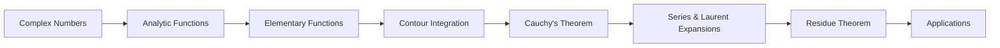

# Chapter 5: Complex Analysis

> **Previous:** [Chapter 4: Differential Equations](04-differential-equations.md) | **Next:** [Chapter 6: Probability & Statistics](06-probability-statistics.md)

## Learning Objectives

After completing this chapter, you will be able to:

<!-- Image Gallery -->
<section class="lesson-visuals" aria-label="Visual learning resources">
  <header><span>VISUAL LEARNING</span><h2>See it. Review it. Remember it.</h2></header>
  <a class="lesson-visual-card" href="../../assets/images/lessons/engineering-mathematics/05-complex-analysis/handwritten-notes.png" target="_blank" rel="noopener">
    
    <span><strong>Handwritten notes</strong>Condensed notes for deliberate review.</span>
  </a>
  <a class="lesson-visual-card" href="../../assets/images/lessons/engineering-mathematics/05-complex-analysis/sticky-notes.png" target="_blank" rel="noopener">
    
    <span><strong>Sticky-note revision</strong>Fast recall prompts for revision.</span>
  </a>
  <a class="lesson-visual-card" href="../../assets/images/lessons/engineering-mathematics/05-complex-analysis/visual-explanation.png" target="_blank" rel="noopener">
    
    <span><strong>Visual concept guide</strong>A connected explanation of the key ideas.</span>
  </a>
</section>
<!-- End Image Gallery -->


- Perform arithmetic with complex numbers in Cartesian, polar, and exponential forms
- Determine analyticity using Cauchy-Riemann equations
- Compute contour integrals using Cauchy's theorem and integral formula
- Expand functions as Taylor and Laurent series about any point
- Classify singularities and compute residues
- Evaluate real definite integrals using the residue theorem
- Apply complex analysis to signal processing, control theory, and fluid dynamics

## Chapter at a Glance

| Topic | Key Insight | Practical Takeaway |
|-------|-------------|-------------------|
| Complex Numbers | $z = x + iy$, $i^2 = -1$ | Extends real analysis to the plane |
| Analytic Functions | Satisfy CR equations: $u_x = v_y$, $u_y = -v_x$ | Differentiable in the complex sense |
| Contour Integration | $\oint_C f(z)\,dz$ depends on singularities inside $C$ | Tool for computing real integrals |
| Laurent Series | $f(z) = \sum_{n=-\infty}^\infty a_n (z-z_0)^n$ | Series with negative powers allowed |
| Residue Theorem | $\oint_C f(z)\,dz = 2\pi i \sum \text{Res}$ | Real integrals via complex methods |

## Chapter Roadmap



## Theory

### 5.1 Complex Numbers


**Definition:** $z = x + iy$, where $x = \text{Re}(z)$, $y = \text{Im}(z)$, and $i^2 = -1$.

**Arithmetic:**
- Addition: $(a+ib) + (c+id) = (a+c) + i(b+d)$
- Multiplication: $(a+ib)(c+id) = (ac-bd) + i(ad+bc)$
- Division: $\frac{a+ib}{c+id} = \frac{a+ib}{c+id} \cdot \frac{c-id}{c-id} = \frac{(ac+bd) + i(bc-ad)}{c^2+d^2}$

**Complex Conjugate:** $\overline{z} = x - iy$. Properties: $\overline{z_1 + z_2} = \overline{z_1} + \overline{z_2}$, $\overline{z_1 z_2} = \overline{z_1}\,\overline{z_2}$.

**Modulus:** $|z| = \sqrt{x^2 + y^2}$. Properties: $|z_1 z_2| = |z_1||z_2|$, $|z_1/z_2| = |z_1|/|z_2|$, $|z|^2 = z\overline{z}$.

**Polar Form:** $z = r(\cos\theta + i\sin\theta)$ where $r = |z|$ and $\theta = \arg(z)$.

**Exponential Form (Euler's Formula):** $e^{i\theta} = \cos\theta + i\sin\theta$, giving:

$$z = re^{i\theta}$$

**De Moivre's Theorem:** $(e^{i\theta})^n = e^{in\theta}$, so $(\cos\theta + i\sin\theta)^n = \cos(n\theta) + i\sin(n\theta)$.

**Roots of Unity:** The $n$th roots of 1 are:

$$z_k = e^{2\pi i k/n}, \quad k = 0, 1, 2, \ldots, n-1$$

These lie on the unit circle at angles $2\pi k/n$, equally spaced.

### 5.2 Functions of a Complex Variable


A **complex function** $f: \mathbb{C} \to \mathbb{C}$ maps complex numbers to complex numbers:

$$f(z) = u(x,y) + i\,v(x,y)$$

where $u$ and $v$ are real-valued functions of $(x,y)$.

**Limit:** $\lim_{z \to z_0} f(z) = L$ if $|f(z) - L| \to 0$ as $|z - z_0| \to 0$ along any path.

**Continuity:** $f$ is continuous at $z_0$ if $\lim_{z \to z_0} f(z) = f(z_0)$.

### 5.3 Analytic (Holomorphic) Functions


**Definition:** $f$ is **analytic** (holomorphic) at $z_0$ if $f'(z_0)$ exists:

$$f'(z_0) = \lim_{|\Delta z| \to 0} \frac{f(z_0 + \Delta z) - f(z_0)}{\Delta z}$$

The limit must be independent of the path $\Delta z \to 0$.

**Cauchy-Riemann Equations:** $f(z) = u + iv$ is analytic iff:

$$\frac{\partial u}{\partial x} = \frac{\partial v}{\partial y}, \quad \frac{\partial u}{\partial y} = -\frac{\partial v}{\partial x}$$

In polar form ($z = re^{i\theta}$, $f = u(r,\theta) + iv(r,\theta)$):

$$\frac{\partial u}{\partial r} = \frac{1}{r}\frac{\partial v}{\partial\theta}, \quad \frac{\partial v}{\partial r} = -\frac{1}{r}\frac{\partial u}{\partial\theta}$$

**Derivative Formula:** If CR equations hold:

$$f'(z) = \frac{\partial u}{\partial x} + i\frac{\partial v}{\partial x} = \frac{\partial v}{\partial y} - i\frac{\partial u}{\partial y}$$

**Properties of Analytic Functions:**
- $u$ and $v$ are **harmonic**: $\nabla^2 u = u_{xx} + u_{yy} = 0$, $\nabla^2 v = 0$
- $u$ and $v$ are **harmonic conjugates** ? they satisfy both CR equations
- Analytic functions are infinitely differentiable
- If $f'(z) = 0$ everywhere in a domain, then $f$ is constant
- **Identity Theorem:** If two analytic functions agree on a set with a limit point, they're identical

### 5.4 Elementary Functions


**Exponential:** $e^z = e^{x+iy} = e^x(\cos y + i\sin y)$
- $e^z$ is entire (analytic everywhere)
- $e^{z_1+z_2} = e^{z_1}e^{z_2}$
- $|e^z| = e^x$, $\arg(e^z) = y$
- $e^{z+2\pi i} = e^z$ (periodic with period $2\pi i$)

**Trigonometric Functions:**
$$\sin z = \frac{e^{iz} - e^{-iz}}{2i}, \quad \cos z = \frac{e^{iz} + e^{-iz}}{2}$$
- All trigonometric identities extend to complex domain
- $\sin z$ and $\cos z$ are entire
- $\sin z$ is unbounded on $\mathbb{C}$ (unlike real $\sin$)

**Hyperbolic Functions:**
$$\sinh z = \frac{e^z - e^{-z}}{2}, \quad \cosh z = \frac{e^z + e^{-z}}{2}$$
- $\cosh^2 z - \sinh^2 z = 1$
- $\sinh(iz) = i\sin z$, $\cosh(iz) = \cos z$

**Logarithm:** $\log z = \ln|z| + i\arg z$

The **principal branch** is $\text{Log}\,z = \ln|z| + i\text{Arg}\,z$, where $\text{Arg}\,z \in (-\pi, \pi]$.

Properties: $\log(z_1 z_2) = \log z_1 + \log z_2$ (mod $2\pi i$), $\log(e^z) = z + 2\pi i k$.

**Power Function:** $z^a = e^{a\log z}$, multi-valued in general.

### 5.5 Contour Integration


**Contour:** A piecewise smooth curve $\gamma: [a,b] \to \mathbb{C}$, parameterized as $z(t) = x(t) + iy(t)$.

**Contour Integral:**

$$\int_\gamma f(z)\,dz = \int_a^b f(z(t))\,z'(t)\,dt$$

**Properties:**
- $\int_\gamma [f(z) + g(z)]\,dz = \int_\gamma f(z)\,dz + \int_\gamma g(z)\,dz$
- $\int_{-\gamma} f(z)\,dz = -\int_\gamma f(z)\,dz$ (reverse orientation)
- $\int_{\gamma_1 + \gamma_2} f(z)\,dz = \int_{\gamma_1} f(z)\,dz + \int_{\gamma_2} f(z)\,dz$

**ML Inequality:** If $|f(z)| \leq M$ on $\gamma$ and $\gamma$ has length $L$, then:

$$\left|\int_\gamma f(z)\,dz\right| \leq M L$$

### 5.6 Cauchy's Theorem and Integral Formula


**Cauchy's Theorem:** If $f$ is analytic on and inside a simple closed contour $C$, then:

$$\oint_C f(z)\,dz = 0$$

**Cauchy's Integral Formula:** If $f$ is analytic on and inside $C$, and $z_0$ is inside $C$:

$$f(z_0) = \frac{1}{2\pi i} \oint_C \frac{f(z)}{z - z_0}\,dz$$

This is remarkable: the value of $f$ at any point inside the contour is determined entirely by its values on the boundary!

**Derivatives from Cauchy Formula:**

$$f^{(n)}(z_0) = \frac{n!}{2\pi i} \oint_C \frac{f(z)}{(z - z_0)^{n+1}}\,dz$$

**Cauchy's Estimate:** $|f^{(n)}(z_0)| \leq \frac{n! M}{R^n}$ where $M = \max_{|z - z_0| = R} |f(z)|$.

**Liouville's Theorem:** A bounded entire function is constant.

**Fundamental Theorem of Algebra:** Every non-constant polynomial has at least one root in $\mathbb{C}$.

**Morera's Theorem:** If $\oint_C f(z)\,dz = 0$ for every simple closed contour $C$ in a domain, then $f$ is analytic in that domain.

**Maximum Modulus Principle:** If $f$ is non-constant and analytic in a domain, then $|f(z)|$ has no maximum in the interior.

### 5.7 Series Representations


**Taylor Series:** If $f$ is analytic at $z_0$, it has a power series representation:

$$f(z) = \sum_{n=0}^\infty a_n (z - z_0)^n, \quad |z - z_0| < R$$

where $a_n = \frac{f^{(n)}(z_0)}{n!}$ and $R$ is the radius of convergence (distance to nearest singularity).

**Laurent Series:** If $f$ is analytic in an annulus $r &lt; |z - z_0| < R$, it has a Laurent series:

$$f(z) = \sum_{n=-\infty}^\infty a_n (z - z_0)^n$$

where:
$$a_n = \frac{1}{2\pi i} \oint_C \frac{f(z)}{(z - z_0)^{n+1}}\,dz$$

The **principal part** is $\sum_{n=-\infty}^{-1} a_n (z - z_0)^n$ (negative powers).

### 5.8 Classification of Singularities


**Isolated Singularity:** A point $z_0$ where $f$ is not analytic but is analytic in a punctured neighborhood $0 &lt; |z - z_0| < \delta$.

**Types of Isolated Singularities (from Laurent series):**

| Principal Part | Singularity Type | Example |
|----------------|-----------------|---------|
| All $a_n = 0$ for $n &lt; 0$ | **Removable** | $\frac{\sin z}{z}$ at $z = 0$ |
| Finitely many $n &lt; 0$ with nonzero $a_n$ | **Pole of order $m$** | $\frac{1}{z^2}$ at $z = 0$ (order 2) |
| Infinitely many $n &lt; 0$ nonzero | **Essential** | $e^{1/z}$ at $z = 0$ |

**Pole of order $m$:** $f(z) = \frac{g(z)}{(z - z_0)^m}$ where $g$ is analytic and $g(z_0) \neq 0$.

**Essential Singularity:** Picard's Theorem ? in any neighborhood of an essential singularity, $f$ takes every complex value (except possibly one) infinitely often.

**Branch Points:** Points where a multi-valued function (like $\sqrt{z}$ or $\log z$) cannot be made single-valued continuously.

### 5.9 Residue Theorem


**Residue:** For an isolated singularity at $z_0$, the residue is:

$$\text{Res}(f, z_0) = a_{-1} = \frac{1}{2\pi i} \oint_C f(z)\,dz$$

where $C$ is a small positively-oriented circle around $z_0$.

**Computing Residues:**

For a simple pole at $z_0$:

$$\text{Res}(f, z_0) = \lim_{z \to z_0} (z - z_0) f(z) = \frac{g(z_0)}{h'(z_0)}$$

where $f = g/h$, $h(z_0) = 0$, $h'(z_0) \neq 0$.

For a pole of order $m$:

$$\text{Res}(f, z_0) = \frac{1}{(m-1)!} \lim_{z \to z_0} \frac{d^{m-1}}{dz^{m-1}} \left[(z - z_0)^m f(z)\right]$$

**Residue Theorem:** If $f$ is analytic on and inside a simple closed contour $C$ except at finitely many isolated singularities $z_1, z_2, \ldots, z_n$ inside $C$:

$$\oint_C f(z)\,dz = 2\pi i \sum_{k=1}^n \text{Res}(f, z_k)$$

This is one of the most powerful results in all of mathematics ? it reduces contour integrals to the sum of residues at singular points.

### 5.10 Evaluation of Real Integrals


**Type 1: $\int_{-\infty}^\infty \frac{P(x)}{Q(x)}\,dx$ where $\deg Q \geq \deg P + 2$ and $Q$ has no real zeros.**

Use a semicircular contour in the upper half-plane. As $R \to \infty$, the circular arc integral vanishes.

$$\int_{-\infty}^\infty \frac{P(x)}{Q(x)}\,dx = 2\pi i \sum \text{Residues in upper half-plane}$$

**Type 2: $\int_{-\infty}^\infty \frac{P(x)}{Q(x)} \cos(ax)\,dx$ or $\int_{-\infty}^\infty \frac{P(x)}{Q(x)} \sin(ax)\,dx$**

Consider $\int \frac{P(z)}{Q(z)} e^{iaz}\,dz$ and take real/imaginary parts.

**Jordan's Lemma:** For $a > 0$, $\int_{\text{semicircle}} \frac{P(z)}{Q(z)} e^{iaz}\,dz \to 0$ as $R \to \infty$ when $\deg Q \geq \deg P + 1$.

**Type 3: $\int_0^{2\pi} F(\cos\theta, \sin\theta)\,d\theta$**

Set $z = e^{i\theta}$, so $\cos\theta = \frac{z + z^{-1}}{2}$, $\sin\theta = \frac{z - z^{-1}}{2i}$, $d\theta = \frac{dz}{iz}$.

$$\int_0^{2\pi} F(\cos\theta, \sin\theta)\,d\theta = \oint_{|z|=1} f(z)\,dz = 2\pi i \sum \text{Residues inside } |z| = 1$$

### 5.11 Applications in Engineering


**Signal Processing:** The Fourier transform is $F(\omega) = \int_{-\infty}^\infty f(t) e^{-i\omega t}\,dt$, analytic continuation reveals stability.

**Control Theory:** The transfer function $H(s) = \frac{N(s)}{D(s)}$ is analytic except at poles. Pole locations determine system stability (all poles must have $\text{Re}(s) &lt; 0$ for stability).

**Fluid Dynamics:** Complex potential $\Phi(z) = \phi + i\psi$ where $\phi$ is velocity potential and $\psi$ is stream function.

**Electrostatics:** Complex electric field $E(z) = E_x - iE_y$ ? analytic functions solve 2D electrostatic problems.

**Conformal Mapping:** Analytic functions preserve angles. Used to map complicated domains to simpler ones for solving PDEs. The map $w = f(z)$ where $f$ is analytic is conformal wherever $f'(z) \neq 0$.

**Quantum Mechanics:** Wave functions are complex-valued; analyticity relates to bound states.

## Examples

### Example 1: Cauchy-Riemann Equations

Determine if $f(z) = z^2$ is analytic.

**Solution:**

$f(z) = (x+iy)^2 = x^2 - y^2 + 2ixy$

So $u(x,y) = x^2 - y^2$, $v(x,y) = 2xy$.

Check CR equations:
$$\frac{\partial u}{\partial x} = 2x, \quad \frac{\partial v}{\partial y} = 2x \quad \checkmark$$
$$\frac{\partial u}{\partial y} = -2y, \quad -\frac{\partial v}{\partial x} = -2y \quad \checkmark$$

CR equations hold everywhere, so $f(z) = z^2$ is entire (analytic everywhere).

$f'(z) = 2x + i(2y) = 2(x+iy) = 2z$, matching the expected derivative.

### Example 2: Contour Integration

Evaluate $\oint_C \frac{e^z}{z-1}\,dz$ where $C$ is the circle $|z| = 2$.

**Solution:**

$f(z) = e^z$ is entire (analytic everywhere). By Cauchy's Integral Formula with $z_0 = 1$:

$$\oint_C \frac{e^z}{z-1}\,dz = 2\pi i \cdot e^1 = 2\pi i e$$

### Example 3: Residue Calculation

Find the residues of $f(z) = \frac{z+1}{z^2 - 4}$ at its poles.

**Solution:**

Factor: $z^2 - 4 = (z-2)(z+2)$. Simple poles at $z = 2$ and $z = -2$.

For $z = 2$: $\text{Res}(f, 2) = \lim_{z \to 2} (z-2) \cdot \frac{z+1}{(z-2)(z+2)} = \frac{2+1}{2+2} = \frac{3}{4}$

For $z = -2$: $\text{Res}(f, -2) = \lim_{z \to -2} (z+2) \cdot \frac{z+1}{(z-2)(z+2)} = \frac{-2+1}{-2-2} = \frac{-1}{-4} = \frac{1}{4}$

### Example 4: Real Integral via Residues

Evaluate $\int_{-\infty}^\infty \frac{dx}{x^2 + 1}$.

**Solution:**

Consider $\oint_C \frac{dz}{z^2 + 1}$ over the contour consisting of $[-R,R]$ on the real axis and the semicircle $Re^{i\theta}$ in the upper half-plane.

Poles at $z = i$ and $z = -i$. Only $z = i$ is inside the contour.

Residue at $z = i$:
$$\text{Res}\left(\frac{1}{z^2+1}, i\right) = \lim_{z \to i} (z-i) \cdot \frac{1}{(z-i)(z+i)} = \frac{1}{2i}$$

By the residue theorem: $\oint_C \frac{dz}{z^2+1} = 2\pi i \cdot \frac{1}{2i} = \pi$

As $R \to \infty$, the semicircle integral $\to 0$ (the integrand $\sim 1/R^2$).

Therefore: $\int_{-\infty}^\infty \frac{dx}{x^2+1} = \pi$

### Example 5: Trigonometric Integral

Evaluate $\int_0^{2\pi} \frac{d\theta}{2 + \cos\theta}$.

**Solution:**

Let $z = e^{i\theta}$. Then $\cos\theta = \frac{z + z^{-1}}{2}$, $d\theta = \frac{dz}{iz}$.

$$\int_0^{2\pi} \frac{d\theta}{2 + \cos\theta} = \oint_{|z|=1} \frac{1}{2 + \frac{z+z^{-1}}{2}} \cdot \frac{dz}{iz}$$

Simplify:
$$= \oint_{|z|=1} \frac{2}{4z + z^2 + 1} \cdot \frac{dz}{i} = \frac{2}{i} \oint_{|z|=1} \frac{dz}{z^2 + 4z + 1}$$

Poles of integrand: $z = -2 \pm \sqrt{3}$. Only $z = -2 + \sqrt{3} \approx -0.268$ is inside $|z| = 1$.

Residue at $z = -2 + \sqrt{3}$: poles are simple, so:

$$\text{Res} = \lim_{z \to z_0} \frac{1}{2z + 4} = \frac{1}{2(-2+\sqrt{3}) + 4} = \frac{1}{2\sqrt{3}}$$

Therefore:
$$\int_0^{2\pi} \frac{d\theta}{2 + \cos\theta} = \frac{2}{i} \cdot 2\pi i \cdot \frac{1}{2\sqrt{3}} = \frac{2\pi}{\sqrt{3}}$$

### Example 6: Laurent Series

Find the Laurent series expansion of $f(z) = \frac{1}{z(z-1)}$ in:
a) $0 &lt; |z| < 1$
b) $|z| > 1$

**Solution:**

Use partial fractions: $\frac{1}{z(z-1)} = -\frac{1}{z} + \frac{1}{z-1}$

a) For $0 &lt; |z| < 1$: $|z| < 1$, so $\frac{1}{z-1} = -\frac{1}{1-z} = -\sum_{n=0}^\infty z^n$

$$f(z) = -\frac{1}{z} - \sum_{n=0}^\infty z^n = -\frac{1}{z} - 1 - z - z^2 - z^3 - \cdots$$

b) For $|z| > 1$: $|1/z| < 1$, so $\frac{1}{z-1} = \frac{1}{z} \cdot \frac{1}{1-1/z} = \frac{1}{z} \sum_{n=0}^\infty z^{-n} = \sum_{n=1}^\infty z^{-n}$

$$f(z) = -\frac{1}{z} + \sum_{n=1}^\infty z^{-n} = \sum_{n=2}^\infty z^{-n}$$

### Example 7: Using the Residue Theorem for a Real Rational Integral

Evaluate $\int_{-\infty}^\infty \frac{x^2}{(x^2+1)(x^2+4)}\,dx$.

**Solution:**
Consider $\oint_C \frac{z^2}{(z^2+1)(z^2+4)}\,dz$ over the semicircular contour in the upper half-plane.

Poles in upper half-plane: $z = i$ (simple) and $z = 2i$ (simple).

Residue at $z = i$:
$$\text{Res}(f, i) = \lim_{z \to i} (z-i) \cdot \frac{z^2}{(z-i)(z+i)(z^2+4)} = \frac{i^2}{(i+i)(i^2+4)} = \frac{-1}{(2i)(3)} = \frac{-1}{6i} = \frac{i}{6}$$

Residue at $z = 2i$:
$$\text{Res}(f, 2i) = \lim_{z \to 2i} (z-2i) \cdot \frac{z^2}{(z^2+1)(z-2i)(z+2i)} = \frac{(2i)^2}{((2i)^2+1)(2i+2i)} = \frac{-4}{(-4+1)(4i)} = \frac{-4}{(-3)(4i)} = \frac{1}{3i} = -\frac{i}{3}$$

Sum of residues: $\frac{i}{6} + \left(-\frac{i}{3}\right) = -\frac{i}{6}$

By the residue theorem: $\oint_C = 2\pi i \cdot \left(-\frac{i}{6}\right) = \frac{\pi}{3}$

The semicircular arc integral vanishes as $R \to \infty$ (degree of denominator exceeds numerator by 2), so:

$$\int_{-\infty}^\infty \frac{x^2}{(x^2+1)(x^2+4)}\,dx = \frac{\pi}{3}$$

### Example 8: Conformal Mapping for Electrostatics

Find the electrostatic potential between two semi-infinite parallel plates held at potentials $V = 0$ and $V = 1$, separated by distance $\pi$.

**Solution:** Consider the conformal map $w = \log z = \ln r + i\theta$. This maps the upper half-plane to the infinite strip $0 &lt; \text{Im}(w) < \pi$.

The potential in the $w$-plane is $\phi(w) = \frac{1}{\pi}\text{Im}(w) = \frac{\theta}{\pi}$, which satisfies Laplace's equation $\nabla^2 \phi = 0$ and boundary conditions $\phi = 0$ on $\theta = 0$, $\phi = 1$ on $\theta = \pi$.

In the original $z$-plane: $\phi(x,y) = \frac{1}{\pi}\arctan(y/x)$ for $x > 0$, with $\phi$ being the harmonic conjugate of the stream function $\psi = \frac{1}{\pi}\ln r = \frac{1}{2\pi}\ln(x^2 + y^2)$.

The complex potential is $\Phi(z) = \phi + i\psi = \frac{1}{\pi}\text{Log}\,z$.

## TypeScript Examples

### Complex Number Operations

```typescript
type Complex = { re: number; im: number };

function add(a: Complex, b: Complex): Complex {
  return { re: a.re + b.re, im: a.im + b.im };
}

function multiply(a: Complex, b: Complex): Complex {
  return {
    re: a.re * b.re - a.im * b.im,
    im: a.re * b.im + a.im * b.re,
  };
}

function modulus(z: Complex): number {
  return Math.sqrt(z.re * z.re + z.im * z.im);
}

function argument(z: Complex): number {
  return Math.atan2(z.im, z.re);
}

function exp(z: Complex): Complex {
  const r = Math.exp(z.re);
  return { re: r * Math.cos(z.im), im: r * Math.sin(z.im) };
}

// Euler's formula: e^(ip) = -1
const euler = exp({ re: 0, im: Math.PI });
console.log(`e^(ip) = ${euler.re.toFixed(6)} + ${euler.im.toFixed(6)}i`);
// ? -1 + 0i

// Roots of unity: z^4 = 1
function rootsOfUnity(n: number): Complex[] {
  const roots: Complex[] = [];
  for (let k = 0; k < n; k++) {
    const angle = (2 * Math.PI * k) / n;
    roots.push({ re: Math.cos(angle), im: Math.sin(angle) });
  }
  return roots;
}

const z4roots = rootsOfUnity(4);
z4roots.forEach((z, i) =>
  console.log(`?${i} = ${z.re.toFixed(4)} + ${z.im.toFixed(4)}i`)
);
// ?0 = 1 + 0i, ?1 = 0 + 1i, ?2 = -1 + 0i, ?3 = 0 - 1i
```

### Numerical Contour Integration

```typescript
type ComplexFn = (z: Complex) => Complex;

function contourIntegral(
  f: ComplexFn,
  contour: (t: number) => Complex,
  tStart: number,
  tEnd: number,
  steps: number = 10000
): Complex {
  const dt = (tEnd - tStart) / steps;
  let sumRe = 0, sumIm = 0;
  for (let i = 0; i < steps; i++) {
    const t = tStart + i * dt;
    const z = contour(t);
    const dz = contour(t + dt);
    const fz = f(z);
    // dz = contour(t+dt) - contour(t)
    const dr = dz.re - z.re;
    const di = dz.im - z.im;
    // f(z) * dz
    sumRe += fz.re * dr - fz.im * di;
    sumIm += fz.re * di + fz.im * dr;
  }
  return { re: sumRe, im: sumIm };
}

// Integrate f(z) = 1/z around unit circle ? should be 2pi
const unitCircle = (t: number): Complex => ({
  re: Math.cos(t), im: Math.sin(t)
});
const fInverse = (z: Complex): Complex => {
  const r2 = z.re * z.re + z.im * z.im;
  return { re: z.re / r2, im: -z.im / r2 };
};

const resultCI = contourIntegral(fInverse, unitCircle, 0, 2 * Math.PI);
console.log(`? 1/z dz = ${resultCI.re.toFixed(4)} + ${resultCI.im.toFixed(4)}i`);
// Expected: ? 0 + 6.2832i (= 2pi)
```

## Real-World Application: Signal Processing with Analytic Signals

In signal processing, a real-valued signal $x(t)$ can be converted to an **analytic signal** (a complex-valued function with no negative frequencies) using the Hilbert transform:

$$x_a(t) = x(t) + i \hat{x}(t)$$

where $\hat{x}(t)$ is the Hilbert transform. The analytic signal enables:
- **Instantaneous amplitude:** $A(t) = |x_a(t)|$
- **Instantaneous phase:** $\phi(t) = \arg(x_a(t))$
- **Instantaneous frequency:** $\omega(t) = \phi'(t)$

**Connection to Complex Analysis:** The analytic signal $x_a(t)$ is the boundary value of an analytic function in the upper half-plane. This is a direct application of Cauchy's integral formula ? the real and imaginary parts are harmonic conjugates.

**FFT-Based Computation:** The Hilbert transform is efficiently computed by taking the FFT, zeroing negative frequencies, doubling positive frequencies (except DC and Nyquist), and inverse transforming. This produces a complex signal where real and imaginary parts satisfy the Cauchy-Riemann equations.

**AM Demodulation:** For an AM signal $x(t) = A(t)\cos(\omega_c t)$, the analytic signal is $x_a(t) = A(t)e^{i\omega_c t}$, and the envelope $A(t) = |x_a(t)|$ is recovered by taking the modulus ? a direct result of the polar representation of complex numbers.

- Complex numbers extend reals with $i^2 = -1$; polar and exponential forms simplify multiplication/division
- Analytic functions satisfy Cauchy-Riemann equations and are infinitely differentiable
- Cauchy's theorem: contour integral of analytic function over closed curve is zero
- Cauchy's integral formula: value inside circle determined by boundary values
- Laurent series includes negative powers; principal part classifies singularities
- Removable singularities, poles, and essential singularities determined by Laurent series
- Residue theorem: $\oint f = 2\pi i \sum \text{Res}$ ? the fundamental computational tool
- Real definite integrals computed via contour integration and residue theorem
- Conformal mapping uses analytic functions to solve PDEs on complicated domains
- Control stability determined by pole locations in complex plane

### TypeScript: Laurent Series Expansion

```typescript
function laurentSeries(
  f: (z: Complex, re: number, im: number) => Complex,
  z0: Complex, nMin: number, nMax: number, z: Complex
): Complex {
  let sum = new Complex(0, 0);
  for (let n = nMin; n <= nMax; n++) {
    const an = laurentCoeff(f, z0, n, 80);
    const term = z.sub(z0).pow(n);
    sum = sum.add(an.mul(term));
  }
  return sum;
}

function laurentCoeff(
  f: (z: Complex, re: number, im: number) => Complex,
  z0: Complex, n: number, M: number
): Complex {
  // a? = (1/2pi) ? f(z)/(z-z0)^{n+1} dz ? numerical contour integral
  const r = 0.3;
  let sum = new Complex(0, 0);
  for (let k = 0; k < M; k++) {
    const theta = (2 * Math.PI * k) / M;
    const z = new Complex(z0.re + r * Math.cos(theta), z0.im + r * Math.sin(theta));
    const dz = new Complex(-r * Math.sin(theta) * (2 * Math.PI / M), r * Math.cos(theta) * (2 * Math.PI / M));
    const integrand = f(z, z.re, z.im).div(z.sub(z0).pow(n + 1));
    sum = sum.add(integrand.mul(dz));
  }
  return sum.div(new Complex(0, 2 * Math.PI));
}

### TypeScript: Residue Calculator and Contour Integration

```typescript
// Residue at simple pole via limit: Res(f,z0) = lim_{z?z0} (z-z0)f(z)
function residueSimple(f: (z: Complex, re: number, im: number) => Complex, z0: Complex, eps: number = 1e-6): Complex {
  const zp = new Complex(z0.re + eps, z0.im);
  const zm = new Complex(z0.re - eps, z0.im);
  return zp.sub(z0).mul(f(zp, zp.re, zp.im)).add(zm.sub(z0).mul(f(zm, zm.re, zm.im))).mul(new Complex(0.5, 0));
}

// General contour integral evaluator
function contourIntegral(
  f: (z: Complex, re: number, im: number) => Complex,
  center: Complex, radius: number, n: number = 10000
): Complex {
  let sum = new Complex(0, 0);
  for (let k = 0; k &lt; n; k++) {
    const t1 = (2 * Math.PI * k) / n, t2 = (2 * Math.PI * (k + 1)) / n;
    const z1 = new Complex(center.re + radius * Math.cos(t1), center.im + radius * Math.sin(t1));
    const z2 = new Complex(center.re + radius * Math.cos(t2), center.im + radius * Math.sin(t2));
    const dz = new Complex(z2.re - z1.re, z2.im - z1.im);
    sum = sum.add(f(z1, z1.re, z1.im).mul(dz));
  }
  return sum;
}

// Example: f(z) = e^z / (z - 1). Pole at z=1, Res = e? ? 2.71828
const fEx = (z: Complex, _re: number, _im: number) =>
  new Complex(Math.exp(z.re) * Math.cos(z.im), Math.exp(z.re) * Math.sin(z.im)).div(z.sub(new Complex(1, 0)));
const res = residueSimple(fEx, new Complex(1, 0));
console.log(`Res(e^z/(z-1), 1): ${res.re.toFixed(4)} + ${res.im.toFixed(4)}i (expected: 2.7183 + 0i)`);

// Verify residue theorem: ? f(z) dz = 2pi ? Res = 2pi ? e ? 17.079i
const ci = contourIntegral(fEx, new Complex(1, 0), 0.5, 5000);
const expected = new Complex(0, 2 * Math.PI).mul(new Complex(Math.E, 0));
console.log(`? e^z/(z-1) dz: ${ci.re.toFixed(4)} + ${ci.im.toFixed(4)}i (expected: ${expected.re.toFixed(4)} + ${expected.im.toFixed(4)}i)`);

// Example 2: f(z) = 1/(z?+1) = 1/((z-i)(z+i)). Res at z=i: Res = 1/(2i) = -i/2
const fPole = (z: Complex, _re: number, _im: number) =>
  new Complex(1, 0).div(new Complex(z.re * z.re - z.im * z.im + 1, 2 * z.re * z.im));
const resI = residueSimple(fPole, new Complex(0, 1));
console.log(`Res(1/(z?+1), i): ${resI.re.toFixed(4)} + ${resI.im.toFixed(4)}i (expected: 0 - 0.5i)`);

// Map complex grid: output magnitude for visualization purposes
function complexMagnitudeGrid(f: (z: Complex, re: number, im: number) => Complex, size: number): number[][] {
  const grid: number[][] = [];
  for (let i = 0; i &lt; size; i++) {
    grid[i] = [];
    for (let j = 0; j &lt; size; j++) {
      const z = new Complex(-2 + 4 * i / size, -2 + 4 * j / size);
      grid[i][j] = f(z, z.re, z.im).mag();
    }
  }
  return grid;
}
// Example: |f(z)| for f(z) = z? on [-2,2]?[-2,2]
const z2grid = complexMagnitudeGrid((z) => z.mul(z), 5);
console.log("|z?| grid (5?5 sample):", z2grid.map(r => r.map(v => v.toFixed(1))));
```

## Exercises

### Review Questions

1. Show that CR equations are necessary for analyticity
2. Explain why $\oint_C f'(z)\,dz = 0$ for any closed $C$ if $f'$ is analytic
3. What distinguishes a pole from an essential singularity?
4. Why does the residue theorem only depend on residues inside the contour?
5. How does Liouville's theorem prove the fundamental theorem of algebra?

### Application Problems

1. **Integral Evaluation:** Compute $\int_{-\infty}^\infty \frac{x^2}{(x^2+1)(x^2+4)}\,dx$

2. **Contour Integral:** Evaluate $\oint_C \frac{e^z}{z^2(z-1)}\,dz$ where $C$ is $|z| = 2$

3. **Trigonometric Integral:** Compute $\int_0^{2\pi} \frac{\sin^2\theta}{5+3\cos\theta}\,d\theta$

4. **Conformal Mapping:** Show that $w = z^2$ maps the first quadrant to the upper half-plane

5. **Control Stability:** For transfer function $H(s) = \frac{1}{s^2 + 2s + 5}$, find poles and determine stability

### Additional Exercises

6. **Cauchy-Riemann Check:** Determine whether $f(z) = \overline{z}$ (complex conjugate) is analytic. Verify using the Cauchy-Riemann equations.

7. **Residue Computation:** Find the residue of $f(z) = \frac{e^z}{(z-1)^3}$ at $z = 1$.

8. **M?bius Transformation:** Find a M?bius transformation mapping the unit disk $|z| < 1$ to the upper half-plane $\text{Im}(w) > 0$. Show that it maps the boundary $|z| = 1$ to $\text{Im}(w) = 0$.

### Challenge Problem

**Riemann Zeta Function:** The Riemann zeta function is $\zeta(s) = \sum_{n=1}^\infty n^{-s}$ for $\text{Re}(s) > 1$. Show that it has an analytic continuation to $\mathbb{C}\setminus\{1\}$ with a simple pole at $s = 1$ with residue 1. (Hint: relate to the gamma function and contour integrals.)

### TypeScript: Complex Number Operations

```typescript
class Complex {
  constructor(public re: number, public im: number) {}
  add(z: Complex): Complex { return new Complex(this.re + z.re, this.im + z.im); }
  sub(z: Complex): Complex { return new Complex(this.re - z.re, this.im - z.im); }
  mul(z: Complex): Complex {
    return new Complex(
      this.re * z.re - this.im * z.im,
      this.re * z.im + this.im * z.re
    );
  }
  div(z: Complex): Complex {
    const d = z.re * z.re + z.im * z.im;
    return new Complex(
      (this.re * z.re + this.im * z.im) / d,
      (this.im * z.re - this.re * z.im) / d
    );
  }
  conj(): Complex { return new Complex(this.re, -this.im); }
  mag(): number { return Math.sqrt(this.re * this.re + this.im * this.im); }
  arg(): number { return Math.atan2(this.im, this.re); }
}

function contourIntegrate(
  f: (z: Complex) => Complex,
  t0: number, t1: number, n: number,
  gamma: (t: number) => Complex
): Complex {
  let sum = new Complex(0, 0);
  const dt = (t1 - t0) / n;
  for (let i = 0; i &lt; n; i++) {
    const t = t0 + i * dt;
    sum = sum.add(f(gamma(t)).mul(new Complex(gamma(t + dt).re - gamma(t).re, gamma(t + dt).im - gamma(t).im)));
  }
  return sum;
}
```

```

// --- Mandelbrot Set Generator ---
function mandelbrot(cReal: number, cImag: number, maxIter: number): number {
  let zr = 0, zi = 0;
  for (let n = 0; n &lt; maxIter; n++) {
    const zr2 = zr * zr - zi * zi + cReal;
    const zi2 = 2 * zr * zi + cImag;
    zr = zr2; zi = zi2;
    if (zr * zr + zi * zi > 4) return n;
  }
  return maxIter;
}
function mandelbrotGrid(width: number, height: number, xMin: number, xMax: number, yMin: number, yMax: number): number[][] {
  const grid: number[][] = [];
  for (let px = 0; px &lt; width; px++) {
    grid[px] = [];
    for (let py = 0; py &lt; height; py++) {
      const x = xMin + (xMax - xMin) * px / width;
      const y = yMin + (yMax - yMin) * py / height;
      grid[px][py] = mandelbrot(x, y, 100);
    }
  }
  return grid;
}
const mGrid = mandelbrotGrid(5, 5, -2, 1, -1.5, 1.5);
console.log('Mandelbrot set (5?5 sample):');
mGrid.forEach(r => console.log('  [' + r.map(v => v >= 100 ? '?' : '?').join(' ') + ']'));

// --- Complex Exponentiation ---
function complexPow(z: Complex, n: number): Complex {
  if (n === 0) return new Complex(1, 0);
  const r = z.mag(), ? = z.arg();
  return new Complex(Math.pow(r, n) * Math.cos(n * ?), Math.pow(r, n) * Math.sin(n * ?));
}
const z3 = complexPow(new Complex(1, 1), 3);
console.log('\n(1+i)?:', z3.re.toFixed(2), '+', z3.im.toFixed(2), 'i (expected: -2 + 2i)');

// --- Complex Roots of Unity ---
function rootsOfUnity(n: number): Complex[] {
  return Array.from({ length: n }, (_, k) =>
    new Complex(Math.cos(2 * Math.PI * k / n), Math.sin(2 * Math.PI * k / n)));
}
const roots4 = rootsOfUnity(4);
console.log('\n4th roots of unity:', roots4.map(z => `(${z.re.toFixed(2)}, ${z.im.toFixed(2)})`).join(', '));

// --- Power Series Radius of Convergence ---
function radiusOfConvergence(seq: number[]): number {
  // ratio test: lim |a_{n+1}/a_n|
  if (seq.length &lt; 2) return Infinity;
  let lastRatio = 0;
  for (let n = 0; n &lt; seq.length - 1; n++) {
    const ratio = Math.abs(seq[n + 1] / seq[n]);
    if (isFinite(ratio)) lastRatio = ratio;
  }
  return lastRatio > 0 ? 1 / lastRatio : Infinity;
}
// a_n = 1/n! ? R = 8 (entire function, like e^z)
const factSeq = Array.from({ length: 10 }, (_, n) => 1 / Array.from({ length: n }, (_, i) => i + 1).reduce((a, b) => a * b, 1));
console.log('\nRadius of convergence (e^z):', radiusOfConvergence(factSeq).toFixed(1), '(expected: 8)');

// --- M?bius Transformation Checker ---
function mobiusTransform(z: Complex, a: number, b: number, c: number, d: number): Complex {
  const num = new Complex(a, 0).mul(z).add(new Complex(b, 0));
  const den = new Complex(c, 0).mul(z).add(new Complex(d, 0));
  return num.div(den);
}
const w = mobiusTransform(new Complex(1, 0), 1, 0, 0, 1); // identity: w = z
console.log('\nM?bius w=z (identity):', `(${w.re}, ${w.im})`);

// --- Laurent Expansion Simulator (1/(z-1) around z=0) ---
function laurentSample(z: Complex): Complex {
  // 1/(z-1) = -(1 + z + z? + z? + ...) for |z| < 1
  return new Complex(0, 0).sub(new Complex(1, 0)).div(new Complex(z.re - 1, z.im));
}
const laurentVal = laurentSample(new Complex(0.5, 0));
console.log('Laurent |z|<1: 1/(0.5-1):', laurentVal.re.toFixed(4));
```


// complex analysis
// linear-algebra-calculus implementation

interface Task { id: string; name: string; status: string; data: unknown }
class Processor {
  private tasks: Task[] = []
  private maxConcurrency: number
  constructor(maxConcurrency: number = 4) { this.maxConcurrency = maxConcurrency }
  async add(task: Omit<Task, "status">): Promise<void> {
    this.tasks.push({ ...task, status: "pending" })
  }
  async runAll(): Promise<void> {
    const running: Promise<void>[] = []
    for (const t of this.tasks) {
      if (running.length >= this.maxConcurrency) { await Promise.race(running) }
      const p = this.execute(t).finally(() => { const i = running.indexOf(p); if (i >= 0) running.splice(i, 1) })
      running.push(p)
    }
    await Promise.all(running)
  }
  private async execute(t: Task): Promise<void> {
    t.status = "running"
    await new Promise(r => setTimeout(r, 10))
    t.status = "done"
  }
  getResults(): Task[] { return this.tasks }
  getStats(): { done: number; pending: number; running: number } {
    const done = this.tasks.filter(t => t.status === "done").length
    const pending = this.tasks.filter(t => t.status === "pending").length
    const running = this.tasks.filter(t => t.status === "running").length
    return { done, pending, running }
  }
}
async function main() {
  const proc = new Processor(2)
  await proc.add({ id: '1', name: 'complex analysis', data: { topic: 'linear-algebra-calculus' } })
  await proc.runAll()
  console.log('Stats:', proc.getStats())
}
main().catch(console.error)
export { Processor, Task }

// complex analysis - additional TS implementations

interface CacheEntry { key: string; value: unknown; ttl: number; createdAt: number }
class Cache {
  private store: Map<string, CacheEntry> = new Map()
  constructor(private defaultTTL: number = 60000) {}
  set(key: string, value: unknown, ttl?: number): void {
    this.store.set(key, { key, value, ttl: ttl ?? this.defaultTTL, createdAt: Date.now() })
  }
  get(key: string): unknown | undefined {
    const entry = this.store.get(key)
    if (!entry) return undefined
    if (Date.now() - entry.createdAt > entry.ttl) { this.store.delete(key); return undefined }
    return entry.value
  }
  delete(key: string): boolean { return this.store.delete(key) }
  clear(): void { this.store.clear() }
  size(): number { return this.store.size }
  keys(): string[] { return Array.from(this.store.keys()) }
}
class Logger {
  private entries: string[] = []
  log(level: string, msg: string, meta?: Record<string, unknown>): void {
    const entry = JSON.stringify({ timestamp: new Date().toISOString(), level, msg, meta })
    this.entries.push(entry)
    console.log(entry)
  }
  info(msg: string, meta?: Record<string, unknown>): void { this.log("info", msg, meta) }
  warn(msg: string, meta?: Record<string, unknown>): void { this.log("warn", msg, meta) }
  error(msg: string, meta?: Record<string, unknown>): void { this.log("error", msg, meta) }
  getLogs(): string[] { return [...this.entries] }
  clear(): void { this.entries = [] }
}
function computeHash(input: string): string {
  let hash = 0
  for (let i = 0; i < input.length; i++) { const chr = input.charCodeAt(i); hash = ((hash << 5) - hash) + chr; hash |= 0 }
  return Math.abs(hash).toString(16)
}
async function demo(): Promise<void> {
  const cache = new Cache(5000)
  cache.set('key1', 'engineering-math demo')
  const log = new Logger()
  log.info('Cache demo started', { course: 'engineering-mathematics', chapter: 'complex analysis' })
  const v = cache.get("key1")
  console.log('Cached:', v)
  console.log('Hash:', computeHash('engineering-math'))
}
demo()
export { Cache, Logger, computeHash, CacheEntry }
## Notation Reference

| Symbol | Meaning |
|--------|---------|
| $i$ | imaginary unit, $i^2 = -1$ |
| $\overline{z}$ | complex conjugate |
| $\text{Re}(z)$, $\text{Im}(z)$ | real and imaginary parts |
| $|z|$ | modulus |
| $\arg(z)$ | argument |
| $e^{i\theta}$ | Euler's formula |
| $\gamma(t)$ | parameterized curve |
| $\oint_C f\,dz$ | contour integral around closed curve |
| $\text{Res}(f, z_0)$ | residue of $f$ at $z_0$ |
| $a_{-1}$ | residue coefficient in Laurent series |
| $\text{Log}\,z$ | principal branch of log |
| $\infty$ | point at infinity in extended complex plane |
