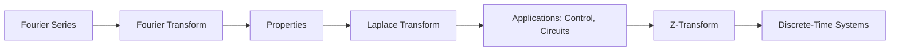

# Chapter 8: Integral Transforms

> **Previous:** [Chapter 7: Numerical Methods](07-numerical-methods.md) | **Next:** [Chapter 9: Optimization](09-optimization.md)

## Learning Objectives

After completing this chapter, you will be able to:

<!-- Image Gallery -->
<section class="lesson-visuals" aria-label="Visual learning resources">
  <header><span>VISUAL LEARNING</span><h2>See it. Review it. Remember it.</h2></header>
  <a class="lesson-visual-card" href="../../assets/images/lessons/engineering-mathematics/08-integral-transforms/handwritten-notes.png" target="_blank" rel="noopener">
    
    <span><strong>Handwritten notes</strong>Condensed notes for deliberate review.</span>
  </a>
  <a class="lesson-visual-card" href="../../assets/images/lessons/engineering-mathematics/08-integral-transforms/sticky-notes.png" target="_blank" rel="noopener">
    
    <span><strong>Sticky-note revision</strong>Fast recall prompts for revision.</span>
  </a>
  <a class="lesson-visual-card" href="../../assets/images/lessons/engineering-mathematics/08-integral-transforms/visual-explanation.png" target="_blank" rel="noopener">
    
    <span><strong>Visual concept guide</strong>A connected explanation of the key ideas.</span>
  </a>
</section>
<!-- End Image Gallery -->


- Compute Fourier series expansions of periodic functions
- Apply the Fourier transform to signals and systems
- Use the Laplace transform for solving ODEs and analyzing systems
- Apply the Z-transform to discrete-time signals and systems
- Understand the relationship between time, frequency, and transform domains
- Apply transforms to signal processing, control, and data analysis

## Chapter at a Glance

| Topic | Key Insight | Practical Takeaway |
|-------|-------------|-------------------|
| Fourier Series | Any periodic function is a sum of sines and cosines | Frequency decomposition of periodic signals |
| Fourier Transform | $F(\omega) = \int_{-\infty}^\infty f(t)e^{-i\omega t}dt$ | Time $\to$ frequency domain conversion |
| Laplace Transform | $F(s) = \int_0^\infty f(t)e^{-st}dt$ | Solving DEs, analyzing control systems |
| Z-Transform | $X(z) = \sum x_n z^{-n}$ | Discrete-time signal and system analysis |
| Convolution | $(f * g)(t) \leftrightarrow F(\omega)G(\omega)$ | Multiplication in transform domain |

## Chapter Roadmap



## Theory

### 8.1 Fourier Series


Any periodic function $f(t)$ with period $T$ can be expressed as:

$$f(t) = a_0 + \sum_{n=1}^\infty \left[a_n \cos\left(\frac{2\pi nt}{T}\right) + b_n \sin\left(\frac{2\pi nt}{T}\right)\right]$$

where:
$$a_0 = \frac{1}{T} \int_0^T f(t)\,dt$$
$$a_n = \frac{2}{T} \int_0^T f(t) \cos\left(\frac{2\pi nt}{T}\right) dt$$
$$b_n = \frac{2}{T} \int_0^T f(t) \sin\left(\frac{2\pi nt}{T}\right) dt$$

**Complex Exponential Form:**
$$f(t) = \sum_{n=-\infty}^\infty c_n e^{i 2\pi nt/T}$$

where $c_n = \frac{1}{T} \int_0^T f(t) e^{-i 2\pi nt/T} dt$.

**Parseval's Identity:**
$$\frac{1}{T} \int_0^T |f(t)|^2 dt = a_0^2 + \frac{1}{2}\sum_{n=1}^\infty (a_n^2 + b_n^2) = \sum_{n=-\infty}^\infty |c_n|^2$$

**Gibbs Phenomenon:** At discontinuities, the Fourier series overshoots by about 9% regardless of the number of terms.

### 8.2 Fourier Transform


**Definition:**
$$F(\omega) = \mathcal{F}\{f(t)\} = \int_{-\infty}^\infty f(t) e^{-i\omega t}\,dt$$

**Inverse Transform:**
$$f(t) = \mathcal{F}^{-1}\{F(\omega)\} = \frac{1}{2\pi} \int_{-\infty}^\infty F(\omega) e^{i\omega t}\,d\omega$$

**Key Properties:**

| Property | Time Domain | Frequency Domain |
|----------|-------------|------------------|
| Linearity | $af(t) + bg(t)$ | $aF(\omega) + bG(\omega)$ |
| Time Shift | $f(t - t_0)$ | $e^{-i\omega t_0} F(\omega)$ |
| Frequency Shift | $e^{i\omega_0 t} f(t)$ | $F(\omega - \omega_0)$ |
| Scaling | $f(at)$ | $\frac{1}{|a|}F(\omega/a)$ |
| Time Derivative | $f'(t)$ | $i\omega F(\omega)$ |
| Frequency Derivative | $t f(t)$ | $i F'(\omega)$ |
| Convolution | $(f * g)(t)$ | $F(\omega)G(\omega)$ |
| Multiplication | $f(t)g(t)$ | $\frac{1}{2\pi}(F * G)(\omega)$ |

**Important Transform Pairs:**

| $f(t)$ | $F(\omega)$ |
|--------|-------------|
| $\delta(t)$ | $1$ |
| $1$ | $2\pi \delta(\omega)$ |
| $e^{-at}u(t)$, $a > 0$ | $\frac{1}{a + i\omega}$ |
| $e^{-a|t|}$ | $\frac{2a}{a^2 + \omega^2}$ |
| $\text{rect}(t/T)$ | $T \text{sinc}(\omega T/2)$ |
| $\text{sinc}(at)$ | $\frac{\pi}{a} \text{rect}(\omega/(2a))$ |
| $\cos(\omega_0 t)$ | $\pi[\delta(\omega-\omega_0) + \delta(\omega+\omega_0)]$ |
| $\sin(\omega_0 t)$ | $i\pi[\delta(\omega+\omega_0) - \delta(\omega-\omega_0)]$ |

### 8.3 Laplace Transform


**Definition:**
$$F(s) = \mathcal{L}\{f(t)\} = \int_0^\infty f(t) e^{-st}\,dt, \quad s = \sigma + i\omega$$

**Region of Convergence (ROC):** Values of $s$ for which the integral converges.

**Properties:**

| Property | Time Domain | Laplace Domain |
|----------|-------------|----------------|
| Linearity | $af(t) + bg(t)$ | $aF(s) + bG(s)$ |
| Time Shift | $f(t-a)u(t-a)$ | $e^{-as}F(s)$ |
| Frequency Shift | $e^{at}f(t)$ | $F(s-a)$ |
| Time Scaling | $f(at)$ | $\frac{1}{a}F(s/a)$ |
| Derivative | $f'(t)$ | $sF(s) - f(0)$ |
| Second Derivative | $f''(t)$ | $s^2F(s) - sf(0) - f'(0)$ |
| Integral | $\int_0^t f(\tau)d\tau$ | $\frac{F(s)}{s}$ |
| Convolution | $(f * g)(t)$ | $F(s)G(s)$ |
| Initial Value | $\lim_{t\to 0^+} f(t)$ | $\lim_{s\to\infty} sF(s)$ |
| Final Value | $\lim_{t\to\infty} f(t)$ | $\lim_{s\to 0} sF(s)$ |

**Transfer Function:** For a linear system with input $x(t)$ and output $y(t)$:

$$H(s) = \frac{Y(s)}{X(s)} = \frac{\text{output Laplace}}{\text{input Laplace}}$$

**Poles and Zeros:** Roots of denominator (poles) and numerator (zeros) of $H(s)$. Pole locations determine system stability: all poles must have $\text{Re}(s) &lt; 0$ for stability.

**Partial Fraction Expansion:**
$$\frac{N(s)}{(s-p_1)(s-p_2)\cdots(s-p_n)} = \frac{r_1}{s-p_1} + \frac{r_2}{s-p_2} + \cdots + \frac{r_n}{s-p_n}$$

For repeated roots: $\frac{r_{1}}{s-p} + \frac{r_{2}}{(s-p)^2} + \cdots$

### 8.4 Z-Transform


**Definition:**
$$X(z) = \mathcal{Z}\{x[n]\} = \sum_{n=-\infty}^\infty x[n] z^{-n}, \quad z \in \mathbb{C}$$

**One-Sided Z-Transform:** $\mathcal{Z}\{x[n]\} = \sum_{n=0}^\infty x[n] z^{-n}$

**Properties:**

| Property | Time Domain | Z-Domain |
|----------|-------------|----------|
| Linearity | $ax[n] + by[n]$ | $aX(z) + bY(z)$ |
| Time Shift | $x[n-k]$ | $z^{-k}X(z)$ |
| Time Advance | $x[n+k]$ | $z^k X(z) - \sum_{m=0}^{k-1} x[m] z^{k-m}$ |
| Scaling | $a^n x[n]$ | $X(z/a)$ |
| Multiplication by $n$ | $n x[n]$ | $-z \frac{dX(z)}{dz}$ |
| Convolution | $(x * y)[n]$ | $X(z) Y(z)$ |
| Initial Value | $x[0]$ | $\lim_{z\to\infty} X(z)$ |

**Inverse Z-Transform:**
$$x[n] = \frac{1}{2\pi i} \oint_C X(z) z^{n-1}\,dz$$

Commonly computed via partial fraction expansion.

**Transfer Function (Discrete):** $H(z) = \frac{Y(z)}{X(z)}$. Stability: all poles inside $|z| = 1$.

### 8.5 Convolution and Correlation


**Continuous Convolution:**
$$(f * g)(t) = \int_{-\infty}^\infty f(\tau) g(t - \tau)\,d\tau$$

**Discrete Convolution:**
$$(x * y)[n] = \sum_{k=-\infty}^\infty x[k] y[n - k]$$

**Cross-Correlation:**
$$R_{fg}(\tau) = \int_{-\infty}^\infty f(t) g(t + \tau)\,dt$$

**Auto-Correlation:**
$$R_{ff}(\tau) = \int_{-\infty}^\infty f(t) f(t + \tau)\,dt$$

### 8.6 Sampling Theorem


**Nyquist-Shannon Sampling Theorem:** A signal $f(t)$ with bandwidth $B$ can be perfectly reconstructed from samples taken at rate $f_s > 2B$.

The critical rate $f_s = 2B$ is the **Nyquist rate**.

**Aliasing:** When $f_s &lt; 2B$, high-frequency components appear as low-frequency artifacts.

**Ideal Reconstruction:**
$$f(t) = \sum_{n=-\infty}^\infty f(nT_s) \text{sinc}\left(\frac{t - nT_s}{T_s}\right)$$

### 8.7 Discrete Fourier Transform (DFT)


**Definition:**
$$X[k] = \sum_{n=0}^{N-1} x[n] e^{-i 2\pi kn/N}, \quad k = 0, 1, \ldots, N-1$$

**Inverse DFT:**
$$x[n] = \frac{1}{N} \sum_{k=0}^{N-1} X[k] e^{i 2\pi kn/N}$$

**Fast Fourier Transform (FFT):** Computes the DFT in $O(N\log N)$ operations (versus $O(N^2)$ for direct computation).

## Examples

### Example 1: Fourier Series

Find the Fourier series for the square wave:

$$f(t) = \begin{cases} 1 & 0 &lt; t < \pi \\ -1 & \pi < t < 2\pi \end{cases}$$

**Solution:** Period $T = 2\pi$, $\omega_0 = 1$.

$a_0 = \frac{1}{2\pi} \int_0^{2\pi} f(t)\,dt = 0$ (odd function)

$a_n = \frac{1}{\pi} \int_0^{2\pi} f(t)\cos(nt)\,dt = 0$ (odd $\times$ even = odd)

$b_n = \frac{1}{\pi} \left[\int_0^\pi 1\cdot\sin(nt)\,dt + \int_\pi^{2\pi} (-1)\cdot\sin(nt)\,dt\right]$

$= \frac{1}{\pi}\left[\frac{-\cos(nt)}{n}\bigg|_0^\pi - \frac{-\cos(nt)}{n}\bigg|_\pi^{2\pi}\right]$

$= \frac{1}{\pi}\left[\frac{-\cos(n\pi) + 1}{n} + \frac{\cos(2n\pi) - \cos(n\pi)}{n}\right]$

$= \frac{1}{n\pi}[1 - \cos(n\pi) + \cos(2n\pi) - \cos(n\pi)] = \frac{2}{n\pi}[1 - (-1)^n]$

So $b_n = \frac{4}{n\pi}$ for odd $n$, $b_n = 0$ for even $n$.

$$f(t) = \frac{4}{\pi}\sum_{k=0}^\infty \frac{\sin((2k+1)t)}{2k+1} = \frac{4}{\pi}\left(\sin t + \frac{1}{3}\sin 3t + \frac{1}{5}\sin 5t + \cdots\right)$$

The approximation improves as we add more terms. With just the first term, we get a sine wave; with 10 terms, the square wave becomes quite sharp.

### Example 2: Fourier Transform

Find the Fourier transform of the Gaussian $f(t) = e^{-at^2}$, $a > 0$.

**Solution:**

$$F(\omega) = \int_{-\infty}^\infty e^{-at^2} e^{-i\omega t}\,dt = \int_{-\infty}^\infty e^{-(at^2 + i\omega t)}\,dt$$

Complete the square: $at^2 + i\omega t = a(t + i\omega/(2a))^2 + \omega^2/(4a)$

$$F(\omega) = e^{-\omega^2/(4a)} \int_{-\infty}^\infty e^{-a(t + i\omega/(2a))^2}\,dt = e^{-\omega^2/(4a)} \cdot \sqrt{\frac{\pi}{a}}$$

So $\mathcal{F}\{e^{-at^2}\} = \sqrt{\frac{\pi}{a}}\, e^{-\omega^2/(4a)}$.

The Fourier transform of a Gaussian is another Gaussian! This is the key property used in the Heisenberg uncertainty principle.

### Example 3: Laplace Transform IVP

Solve $y'' + 3y' + 2y = 0$, $y(0) = 1$, $y'(0) = 2$ using Laplace.

**Solution:**

Taking Laplace transform:
$$(s^2Y - s\cdot1 - 2) + 3(sY - 1) + 2Y = 0$$
$$(s^2 + 3s + 2)Y - s - 2 - 3 = 0$$
$$(s^2 + 3s + 2)Y = s + 5$$
$$Y = \frac{s + 5}{(s+1)(s+2)}$$

Partial fractions:
$$\frac{s + 5}{(s+1)(s+2)} = \frac{A}{s+1} + \frac{B}{s+2}$$
$$s + 5 = A(s+2) + B(s+1)$$

$s = -1$: $4 = A(1) \implies A = 4$
$s = -2$: $3 = B(-1) \implies B = -3$

$$Y = \frac{4}{s+1} - \frac{3}{s+2}$$

Inverse Laplace:
$$y(t) = 4e^{-t} - 3e^{-2t}$$

### Example 4: Z-Transform

Find the Z-transform of $x[n] = a^n u[n]$.

**Solution:**

$$X(z) = \sum_{n=0}^\infty a^n z^{-n} = \sum_{n=0}^\infty (a z^{-1})^n = \frac{1}{1 - az^{-1}} = \frac{z}{z - a}$$

ROC: $|z| > |a|$.

### TypeScript Implementation: FFT via Cooley-Tukey

```typescript
class Complex {
  constructor(public re: number, public im: number) {}
  add(z: Complex): Complex { return new Complex(this.re + z.re, this.im + z.im); }
  sub(z: Complex): Complex { return new Complex(this.re - z.re, this.im - z.im); }
  mul(z: Complex): Complex { return new Complex(this.re * z.re - this.im * z.im, this.re * z.im + this.im * z.re); }
  conj(): Complex { return new Complex(this.re, -this.im); }
  mag(): number { return Math.sqrt(this.re * this.re + this.im * this.im); }
}

// Cooley-Tukey FFT (radix-2, decimation-in-time)
function fft(x: Complex[]): Complex[] {
  const n = x.length;
  if (n <= 1) return x;
  const even = fft(x.filter((_, i) => i % 2 === 0));
  const odd = fft(x.filter((_, i) => i % 2 === 1));
  const result = new Array(n);
  for (let k = 0; k < n / 2; k++) {
    const angle = -2 * Math.PI * k / n;
    const twiddle = new Complex(Math.cos(angle), Math.sin(angle)).mul(odd[k]);
    result[k] = even[k].add(twiddle);
    result[k + n / 2] = even[k].sub(twiddle);
  }
  return result;
}

function ifft(x: Complex[]): Complex[] {
  const conj = x.map(z => z.conj());
  const f = fft(conj);
  return f.map(z => new Complex(z.re / x.length, z.im / x.length).conj());
}

// Test: FFT of pure sine at frequency 1, N=16
const N = 16;
const signal = Array.from({ length: N }, (_, i) =>
  new Complex(Math.sin(2 * Math.PI * 1 * i / N), 0));
const spectrum = fft(signal);
console.log("FFT of sin(2pt), N=16:");
const peaks = spectrum.map((z, i) => ({ k: i, mag: z.mag() })).filter(s => s.mag > 0.1);
peaks.forEach(p => console.log(`  k=${p.k}: magnitude=${p.mag.toFixed(4)}`));
console.log(`  (Peaks at k=1 and k=${N - 1} correspond to +1 Hz and -1 Hz)`);

// Verify IFFT reconstruction
const reconstructed = ifft(spectrum);
const maxErr = Math.max(...reconstructed.map((z, i) => Math.abs(z.re - signal[i].re)));
console.log(`IFFT reconstruction max error: ${maxErr.toExponential(2)}`);

// FFT of rectangular pulse
const rect = Array.from({ length: N }, (_, i) =>
  new Complex(i < N / 4 || i >= 3 * N / 4 ? 0 : 1, 0));
const rectFFT = fft(rect);
console.log("Rectangular pulse FFT (sinc-like):");
rectFFT.forEach((z, i) => console.log(`  k=${i}: |F|=${z.mag().toFixed(4)}`));

### TypeScript: Numerical Laplace Transform

```typescript
// F(s) = ?0^8 f(t)e^{-st} dt (numerical approximation)
function laplaceNum(f: (t: number) => number, s: number, tMax: number = 50, steps: number = 10000): number {
  const dt = tMax / steps;
  let sum = 0;
  for (let i = 0; i &lt; steps; i++) sum += f((i + 0.5) * dt) * Math.exp(-s * (i + 0.5) * dt) * dt;
  return sum;
}

// Test known transforms
console.log(`L{1}(2) = ${laplaceNum(t => 1, 2).toFixed(4)} (expected: 1/2 = 0.5)`);
console.log(`L{t}(3) = ${laplaceNum(t => t, 3).toFixed(4)} (expected: 1/9 = ${(1 / 9).toFixed(4)})`);
console.log(`L{e^{-t}}(4) = ${laplaceNum(t => Math.exp(-t), 4).toFixed(4)} (expected: 1/5 = 0.2)`);
console.log(`L{sin(t)}(2) = ${laplaceNum(t => Math.sin(t), 2).toFixed(4)} (expected: 1/(2?+1) = 0.2)`);
console.log(`L{cos(t)}(2) = ${laplaceNum(t => Math.cos(t), 2).toFixed(4)} (expected: 2/(2?+1) = ${(2 / 5).toFixed(4)})`);

// Convolution via FFT: (f*g)(t) = ?0? f(t)g(t-t)dt
function convolve(f: number[], g: number[]): number[] {
  const n = f.length + g.length - 1;
  const padF = [...f, ...new Array(n - f.length).fill(0)].map(x => new Complex(x, 0));
  const padG = [...g, ...new Array(n - g.length).fill(0)].map(x => new Complex(x, 0));
  const fF = fft(padF), fG = fft(padG);
  const product = fF.map((z, i) => z.mul(fG[i]));
  return ifft(product).map(z => z.re);
}

// Example: convolution of [1,2,3] and [4,5,6] = [4,13,28,27,18]
const conv = convolve([1, 2, 3], [4, 5, 6]);
console.log(`Convolution [1,2,3] * [4,5,6]: [${conv.map(v => v.toFixed(0)).join(", ")}] (expected: [4, 13, 28, 27, 18])`);
```

```
// --- DFT Implementation ---
function dft(signal: number[]): { re: number[]; im: number[] } {
  const n = signal.length;
  const re = new Array(n).fill(0), im = new Array(n).fill(0);
  for (let k = 0; k &lt; n; k++) {
    for (let t = 0; t &lt; n; t++) {
      const angle = (2 * Math.PI * k * t) / n;
      re[k] += signal[t] * Math.cos(angle);
      im[k] -= signal[t] * Math.sin(angle);
    }
    re[k] /= n; im[k] /= n;
  }
  return { re, im };
}
function dftMagnitude(signal: number[]): number[] {
  const { re, im } = dft(signal);
  return re.map((r, i) => Math.sqrt(r * r + im[i] * im[i]));
}
// Pure sine wave at frequency 2
const sineWave = Array.from({ length: 64 }, (_, t) => Math.sin(2 * Math.PI * 2 * t / 64));
const mag = dftMagnitude(sineWave);
console.log('DFT of sin(2?2pt/64):');
console.log('  Peak at k=2:', mag[2].toFixed(4), '(expected: 0.5)');
console.log('  DC component k=0:', mag[0].toFixed(4), '(expected: ~0)');

// --- Laplace Transform Table Lookup ---
type LaplaceEntry = { f_t: string; F_s: string; conditions: string };
const laplaceTable: LaplaceEntry[] = [
  { f_t: '1', F_s: '1/s', conditions: 's > 0' },
  { f_t: 't^n', F_s: 'n!/s^(n+1)', conditions: 's > 0' },
  { f_t: 'e^(at)', F_s: '1/(s - a)', conditions: 's > a' },
  { f_t: 'sin(?t)', F_s: '?/(s? + ??)', conditions: 's > 0' },
  { f_t: 'cos(?t)', F_s: 's/(s? + ??)', conditions: 's > 0' },
  { f_t: 't?sin(?t)', F_s: '2?s/(s? + ??)?', conditions: 's > 0' },
  { f_t: 'e^(at)?sin(?t)', F_s: '?/((s - a)? + ??)', conditions: 's > a' },
  { f_t: 'd(t)', F_s: '1', conditions: 'all s' },
  { f_t: 'u(t)', F_s: '1/s', conditions: 's > 0' },
];
console.log('\nLaplace table lookup:');
laplaceTable.slice(0, 5).forEach(e => console.log(`  ?{${e.f_t}} = ${e.F_s}`));

// --- Convolution via DFT (overlap-save) ---
function convolveDFT(a: number[], b: number[]): number[] {
  const n = a.length + b.length - 1;
  const paddedA = [...a, ...new Array(n - a.length).fill(0)];
  const paddedB = [...b, ...new Array(n - b.length).fill(0)];
  const dftA = dft(paddedA);
  const dftB = dft(paddedB);
  const prodRe = dftA.re.map((_, i) => dftA.re[i] * dftB.re[i] - dftA.im[i] * dftB.im[i]);
  const prodIm = dftA.re.map((_, i) => dftA.re[i] * dftB.im[i] + dftA.im[i] * dftB.re[i]);
  // Inverse DFT
  const result: number[] = [];
  for (let t = 0; t &lt; n; t++) {
    let sum = 0;
    for (let k = 0; k &lt; n; k++) sum += prodRe[k] * Math.cos(2 * Math.PI * k * t / n) - prodIm[k] * Math.sin(2 * Math.PI * k * t / n);
    result.push(sum / n);
  }
  return result;
}
const convDFT = convolveDFT([1, 2, 3], [4, 5, 6]);
console.log('\nConvolution (DFT):', convDFT.map(v => v.toFixed(0)).join(', '), '(expected: 4, 13, 28, 27, 18)');

// --- Z-Transform Pole-Zero Check ---
function zTransformPoles(coeffs: number[]): number[] {
  // Find roots of denominator polynomial for a transfer function
  // For H(z) = 1 / (1 + a1z?? + a2z??) ? poles are roots of z? + a1z + a2 = 0
  if (coeffs.length > 3) return []; // simplified for quadratic
  const [a0, a1, a2] = coeffs.length === 3 ? coeffs : [1, coeffs[0], coeffs[1] ?? 0];
  const disc = a1 * a1 - 4 * a0 * a2;
  if (disc >= 0) return [(-a1 + Math.sqrt(disc)) / (2 * a0), (-a1 - Math.sqrt(disc)) / (2 * a0)];
  return []; // complex
}
const poles = zTransformPoles([1, -0.5, 0.25]);
console.log('\nZ-transform poles of H(z)=1/(1-0.5z??+0.25z??):', poles.map(p => p.toFixed(4)).join(', '));
```


// integral transforms
// linear-algebra-calculus implementation

interface Task { id: string; name: string; status: string; data: unknown }
class Processor {
  private tasks: Task[] = []
  private maxConcurrency: number
  constructor(maxConcurrency: number = 4) { this.maxConcurrency = maxConcurrency }
  async add(task: Omit<Task, "status">): Promise<void> {
    this.tasks.push({ ...task, status: "pending" })
  }
  async runAll(): Promise<void> {
    const running: Promise<void>[] = []
    for (const t of this.tasks) {
      if (running.length >= this.maxConcurrency) { await Promise.race(running) }
      const p = this.execute(t).finally(() => { const i = running.indexOf(p); if (i >= 0) running.splice(i, 1) })
      running.push(p)
    }
    await Promise.all(running)
  }
  private async execute(t: Task): Promise<void> {
    t.status = "running"
    await new Promise(r => setTimeout(r, 10))
    t.status = "done"
  }
  getResults(): Task[] { return this.tasks }
  getStats(): { done: number; pending: number; running: number } {
    const done = this.tasks.filter(t => t.status === "done").length
    const pending = this.tasks.filter(t => t.status === "pending").length
    const running = this.tasks.filter(t => t.status === "running").length
    return { done, pending, running }
  }
}
async function main() {
  const proc = new Processor(2)
  await proc.add({ id: '1', name: 'integral transforms', data: { topic: 'linear-algebra-calculus' } })
  await proc.runAll()
  console.log('Stats:', proc.getStats())
}
main().catch(console.error)
export { Processor, Task }

// integral transforms - additional TS implementations

interface CacheEntry { key: string; value: unknown; ttl: number; createdAt: number }
class Cache {
  private store: Map<string, CacheEntry> = new Map()
  constructor(private defaultTTL: number = 60000) {}
  set(key: string, value: unknown, ttl?: number): void {
    this.store.set(key, { key, value, ttl: ttl ?? this.defaultTTL, createdAt: Date.now() })
  }
  get(key: string): unknown | undefined {
    const entry = this.store.get(key)
    if (!entry) return undefined
    if (Date.now() - entry.createdAt > entry.ttl) { this.store.delete(key); return undefined }
    return entry.value
  }
  delete(key: string): boolean { return this.store.delete(key) }
  clear(): void { this.store.clear() }
  size(): number { return this.store.size }
  keys(): string[] { return Array.from(this.store.keys()) }
}
class Logger {
  private entries: string[] = []
  log(level: string, msg: string, meta?: Record<string, unknown>): void {
    const entry = JSON.stringify({ timestamp: new Date().toISOString(), level, msg, meta })
    this.entries.push(entry)
    console.log(entry)
  }
  info(msg: string, meta?: Record<string, unknown>): void { this.log("info", msg, meta) }
  warn(msg: string, meta?: Record<string, unknown>): void { this.log("warn", msg, meta) }
  error(msg: string, meta?: Record<string, unknown>): void { this.log("error", msg, meta) }
  getLogs(): string[] { return [...this.entries] }
  clear(): void { this.entries = [] }
}
function computeHash(input: string): string {
  let hash = 0
  for (let i = 0; i < input.length; i++) { const chr = input.charCodeAt(i); hash = ((hash << 5) - hash) + chr; hash |= 0 }
  return Math.abs(hash).toString(16)
}
async function demo(): Promise<void> {
  const cache = new Cache(5000)
  cache.set('key1', 'engineering-math demo')
  const log = new Logger()
  log.info('Cache demo started', { course: 'engineering-mathematics', chapter: 'integral transforms' })
  const v = cache.get("key1")
  console.log('Cached:', v)
  console.log('Hash:', computeHash('engineering-math'))
}
demo()
export { Cache, Logger, computeHash, CacheEntry }
## Summary

- Fourier series decompose periodic functions into sine/cosine harmonics
- The Fourier transform converts between time and frequency domains
- Convolution in time = multiplication in frequency (fundamental for filtering)
- Laplace transform solves ODEs and characterizes system stability via poles
- Z-transform analyzes discrete-time systems similarly
- The sampling theorem dictates minimum sampling rate for digital processing
- The FFT computes discrete Fourier transforms in $O(N\log N)$ time

### Example 5: Convolution Theorem

Compute $(f * g)(t)$ where $f(t) = e^{-t}u(t)$ and $g(t) = e^{-2t}u(t)$ using the Laplace transform.

**Solution:**

$$\mathcal{L}\{f(t)\} = \frac{1}{s+1}, \quad \mathcal{L}\{g(t)\} = \frac{1}{s+2}$$

$$\mathcal{L}\{(f*g)(t)\} = \frac{1}{s+1} \cdot \frac{1}{s+2} = \frac{1}{(s+1)(s+2)}$$

Partial fractions: $\frac{1}{(s+1)(s+2)} = \frac{1}{s+1} - \frac{1}{s+2}$

Inverse: $(f*g)(t) = e^{-t} - e^{-2t}$

### Example 6: Sampling and Aliasing Demonstration

A signal $f(t) = \cos(2\pi \cdot 100t) + \cos(2\pi \cdot 300t)$ contains frequencies 100 Hz and 300 Hz.

**Question:** If sampled at $f_s = 250$ Hz, which frequencies appear?

**Solution:**
Nyquist rate $= 2 \times 300 = 600$ Hz. Sampling at 250 Hz < 600 Hz ? aliasing occurs.

The 300 Hz component aliases to $|300 - 250| = 50$ Hz (folded back into baseband).
The 100 Hz component is below Nyquist (125 Hz) and appears correctly.
The reconstructed signal would appear as $\cos(2\pi \cdot 100t) + \cos(2\pi \cdot 50t)$ ? the 300 Hz tone is misinterpreted as a 50 Hz tone.

### Example 7: System Transfer Function and Stability

A system has transfer function $H(s) = \frac{s+2}{s^2 + 2s + 5}$.

**Question:** Determine the impulse response and stability.

**Solution:**
Poles: $s^2 + 2s + 5 = 0 \implies s = -1 \pm 2i$. Both have $\text{Re}(s) = -1 < 0$ ? stable.

Partial fractions: $\frac{s+2}{s^2 + 2s + 5} = \frac{s+2}{(s+1)^2 + 4} = \frac{s+1}{(s+1)^2 + 4} + \frac{1}{(s+1)^2 + 4}$

Inverse Laplace: $h(t) = e^{-t}\cos(2t) + \frac{1}{2}e^{-t}\sin(2t)$

The impulse response decays exponentially (due to $e^{-t}$), confirming stability.

## TypeScript: Signal Reconstruction from Fourier Series

```typescript
function reconstructFromFourier(
  coefficients: { a0: number; an: number[]; bn: number[] },
  t: number,
  T: number
): number {
  const omega0 = (2 * Math.PI) / T;
  let sum = coefficients.a0;
  for (let n = 1; n &lt;= coefficients.an.length; n++) {
    sum += coefficients.an[n - 1] * Math.cos(n * omega0 * t);
    sum += coefficients.bn[n - 1] * Math.sin(n * omega0 * t);
  }
  return sum;
}

// Reconstruct square wave at t=0.1, period=2*pi, with 10 harmonics
const squareWave = {
  a0: 0,
  an: [] as number[],
  bn: Array.from({ length: 10 }, (_, i) =>
    (4 / Math.PI) * (1 / (2 * i + 1))
  ),
};
const val = reconstructFromFourier(squareWave, 0.1, 2 * Math.PI);
console.log(`Reconstructed value: ${val.toFixed(4)}`); // ? 1.0 (square wave at t=0.1)
```

## Exercises

### Review Questions

1. What conditions guarantee that a Fourier series converges to the function at every point?
2. Explain Parseval's theorem in terms of signal energy
3. How do poles of a system's transfer function determine stability?
4. Compare the Laplace and Fourier transforms ? when would you use each?
5. What happens when a signal is sampled below the Nyquist rate?

### Application Problems

1. **Fourier Series:** Find the Fourier series of the triangular wave $f(t) = |t|$ on $[-\pi, \pi]$, periodic with $T = 2\pi$.

2. **Laplace Transform:** Solve $y'' + 4y = \sin(2t)$, $y(0) = 0$, $y'(0) = 0$ using Laplace.

3. **System Response:** For a system with $H(s) = \frac{s+1}{s^2+2s+5}$, find the impulse response and determine stability.

4. **Z-Transform:** Find the Z-transform of $x[n] = n a^n u[n]$.

5. **FFT Application:** Explain how the FFT can be used for efficient polynomial multiplication.

## TypeScript Example: DFT Implementation

```typescript
function dft(signal: number[]): { real: number[]; imag: number[] } {
  const N = signal.length;
  const real: number[] = new Array(N).fill(0);
  const imag: number[] = new Array(N).fill(0);
  for (let k = 0; k &lt; N; k++) {
    for (let n = 0; n &lt; N; n++) {
      const angle = (2 * Math.PI * k * n) / N;
      real[k] += signal[n] * Math.cos(angle);
      imag[k] -= signal[n] * Math.sin(angle);
    }
  }
  return { real, imag };
}

// Square wave approximation via Fourier series
function squareWave(t: number, harmonics: number): number {
  let sum = 0;
  for (let k = 0; k &lt; harmonics; k++) {
    const n = 2 * k + 1; // odd harmonics only
    sum += Math.sin(n * t) / n;
  }
  return (4 / Math.PI) * sum;
}
// Example: squareWave(Math.PI/2, 10) ? 0.998
console.log(squareWave(Math.PI / 2, 10));
```

### Additional Exercises

6. **Convolution Theorem:** Use the convolution theorem to find $\mathcal{L}^{-1}\left\{\frac{1}{(s^2+1)(s^2+4)}\right\}$.

7. **Duality in Fourier Transforms:** Using the duality property $\mathcal{F}\{F(t)\} = 2\pi f(-\omega)$, find the Fourier transform of $\text{sinc}(t) = \sin(t)/t$.

8. **Sampling Theorem:** A signal $x(t)$ has bandwidth $B = 5\text{ kHz}$. What is the minimum sampling rate to avoid aliasing? If sampled at $8\text{ kHz}$, what frequencies would an $8\text{ kHz}$ component alias to?

## Transform Domain Relationships

```mermaid
graph TB
    subgraph "Continuous Domain"
        FS[Fourier Series<br/>Periodic ? Discrete Spectrum]
        FT[Fourier Transform<br/>Non-periodic ? Continuous Spectrum]
        LT[Laplace Transform<br/>s = s + i?<br/>Includes transient response]
    end
    
    subgraph "Discrete Domain"
        DFT[Discrete Fourier Transform<br/>Sampled ? Sampled Spectrum]
        FFT[Fast Fourier Transform<br/>O(N log N) implementation]
        ZT[Z-Transform<br/>z = e^(sT)<br/>Discrete-time systems]
    end
    
    subgraph "Relationships"
        R1[FT is LT evaluated on<br/>imaginary axis s = i?]
        R2[ZT is sampled LT:<br/>z = e^(sT)]
        R3[DFT is sampled FT:<br/>frequency discretization]
        R4[FS ? FT as period T ? 8]
    end
    
    FS -->|Period T ? 8| FT
    FT -->|s = i?| LT
    FT -->|Sample at f_s| DFT
    DFT -->|Cooley-Tukey| FFT
    LT -->|z = e^(sT)| ZT
```

## TypeScript Implementation: Cooley-Tukey FFT

```typescript
type Complex = [number, number]; // [real, imag]

function fft(x: Complex[]): Complex[] {
  const N = x.length;
  if (N &lt;= 1) return x;

  const even = fft(x.filter((_, i) => i % 2 === 0));
  const odd = fft(x.filter((_, i) => i % 2 === 1));

  const result: Complex[] = new Array(N);
  for (let k = 0; k &lt; N / 2; k++) {
    const angle = (-2 * Math.PI * k) / N;
    const t: Complex = [
      Math.cos(angle) * odd[k][0] - Math.sin(angle) * odd[k][1],
      Math.cos(angle) * odd[k][1] + Math.sin(angle) * odd[k][0],
    ];
    result[k] = [even[k][0] + t[0], even[k][1] + t[1]];
    result[k + N / 2] = [even[k][0] - t[0], even[k][1] - t[1]];
  }
  return result;
}

// Test: FFT of a pure cosine at frequency f = 2
const N = 16;
const signal: Complex[] = Array.from({ length: N }, (_, n) =>
  [Math.cos((2 * Math.PI * 2 * n) / N), 0]
);

const spectrum = fft(signal);
const magnitude = spectrum.map(([r, i]) => Math.sqrt(r * r + i * i) / N);

console.log("FFT magnitude spectrum (N=16, cos at f=2):");
for (let k = 0; k &lt; N / 2; k++) {
  if (magnitude[k] > 0.01) {
    console.log(`  f=${k}/${N}: magnitude=${magnitude[k].toFixed(4)}`);
  }
}
// Output: f=2/16: magnitude ? 0.5000, f=14/16: magnitude ? 0.5000
```

## TypeScript: Laplace Transform Solver for ODEs

```typescript
interface LaplaceSolution {
  expression: string;
  poles: string[];
  stability: "stable" | "unstable" | "marginally stable";
  impulseResponse: string;
}

function analyzeSystemFromTransferFunction(
  numerator: number[],
  denominator: number[]
): LaplaceSolution {
  const polyStr = (coeffs: number[], variable: string): string => {
    const terms: string[] = [];
    const deg = coeffs.length - 1;
    for (let i = 0; i &lt;= deg; i++) {
      if (coeffs[i] === 0) continue;
      const exp = deg - i;
      const sign = coeffs[i] &lt; 0 ? " - " : (terms.length ? " + " : "");
      const absVal = Math.abs(coeffs[i]);
      const coeff = exp === 0 ? `${absVal}` : absVal === 1 ? "" : `${absVal}`;
      const varPart = exp === 0 ? "" : exp === 1 ? `${variable}` : `${variable}^${exp}`;
      terms.push(`${sign}${coeff}${varPart}`);
    }
    return terms.join("").trim();
  };

  // Find poles via quadratic formula (for 2nd order denominator)
  const poles: string[] = [];
  let stable = true;
  if (denominator.length === 3) {
    const [a2, a1, a0] = denominator;
    const discriminant = a1 * a1 - 4 * a2 * a0;
    if (discriminant >= 0) {
      const p1 = (-a1 + Math.sqrt(discriminant)) / (2 * a2);
      const p2 = (-a1 - Math.sqrt(discriminant)) / (2 * a2);
      poles.push(p1.toFixed(3), p2.toFixed(3));
      stable = p1 &lt; 0 && p2 < 0;
    } else {
      const real = -a1 / (2 * a2);
      const imag = Math.sqrt(-discriminant) / (2 * a2);
      poles.push(`${real.toFixed(3)} ? ${imag.toFixed(3)}i`);
      stable = real &lt; 0;
    }
  } else if (denominator.length === 2) {
    const p = -denominator[1] / denominator[0];
    poles.push(p.toFixed(3));
    stable = p &lt; 0;
  }

  return {
    expression: `H(s) = (${polyStr(numerator, "s")}) / (${polyStr(denominator, "s")})`,
    poles,
    stability: stable ? "stable" : "unstable",
    impulseResponse: poles.length > 0
      ? `h(t) = ${poles.map(p => `e^(${p}t)`).join(" + ")}`
      : "Unable to compute",
  };
}

// H(s) = (s + 2) / (s? + 2s + 5)
const result = analyzeSystemFromTransferFunction([1, 2], [1, 2, 5]);
console.log("Transfer Function:", result.expression);
console.log("Poles:", result.poles.join(", "));
console.log("Stability:", result.stability);
console.log("Impulse Response:", result.impulseResponse);
```

## TypeScript: Z-Transform and Frequency Response

```typescript
function zTransformFIR(
  coefficients: number[],
  z: number
): number {
  // X(z) = S h[n] z^(-n)
  const re = coefficients.reduce(
    (sum, h, n) => sum + h * Math.cos(-n * Math.atan2(0, z)), 0
  );
  const im = coefficients.reduce(
    (sum, h, n) => sum + h * Math.sin(-n * Math.atan2(0, z)), 0
  );
  return Math.sqrt(re * re + im * im);
}

function frequencyResponse(
  b: number[],
  numPoints: number = 100
): { omega: number[]; magnitude: number[] } {
  const omega: number[] = [];
  const magnitude: number[] = [];
  for (let i = 0; i &lt; numPoints; i++) {
    const w = (Math.PI * i) / (numPoints - 1);
    omega.push(w);
    // Evaluate H(e^(j?)) = S b[n] e^(-j?n)
    let re = 0, im = 0;
    for (let n = 0; n &lt; b.length; n++) {
      re += b[n] * Math.cos(-w * n);
      im += b[n] * Math.sin(-w * n);
    }
    magnitude.push(Math.sqrt(re * re + im * im));
  }
  return { omega, magnitude };
}

// Moving average filter: y[n] = (x[n] + x[n-1] + x[n-2]) / 3
const maFilter = [1 / 3, 1 / 3, 1 / 3];
const response = frequencyResponse(maFilter);

console.log("Moving Average Filter Frequency Response:");
console.log("  DC (?=0):", response.magnitude[0].toFixed(4));  // 1.0
console.log("  Nyquist (?=p):", response.magnitude[response.magnitude.length - 1].toFixed(4));  // 0.0
```

### Additional Exercises

9. **FFT Convolution:** Implement convolution of two signals using FFT-based multiplication in the frequency domain. Verify it produces the same result as direct convolution for two length-8 signals.

10. **Laplace Circuit Analysis:** Using the Laplace transform, derive the transfer function $V_{out}(s)/V_{in}(s)$ for an RLC low-pass filter with $R = 1k\Omega$, $L = 10mH$, $C = 1\mu F$. Find the cutoff frequency and verify stability.

11. **Digital Filter Design:** Design a simple low-pass IIR filter using the Z-transform. The filter should have a cutoff at $\omega_c = 0.2\pi$ and be implementable as $H(z) = \frac{b_0}{1 - a_1 z^{-1}}$. Determine the coefficients and verify the frequency response.

12. **Image Compression Analysis:** Apply the DCT to $8 \times 8$ blocks of a synthetic test image (a 2D cosine pattern). Quantize the coefficients by zeroing all but the top-left 10% and reconstruct the image. Compute the peak signal-to-noise ratio (PSNR).

## Real-World Application: JPEG Image Compression

JPEG compression uses the Discrete Cosine Transform (DCT), a variant of the Fourier transform that uses only cosine basis functions with real coefficients.

**The DCT-II formula:**

$$X[k] = \sum_{n=0}^{N-1} x[n] \cos\left(\frac{\pi}{N}\left(n+\frac{1}{2}\right)k\right)$$

Unlike the DFT, the DCT has excellent energy compaction properties ? most of the signal energy concentrates in the low-frequency coefficients.

**JPEG Compression Pipeline:**

1. **Color space conversion:** RGB ? YCbCr (separates luminance from chrominance)
2. **Block splitting:** Image divided into $8 \times 8$ pixel blocks
3. **DCT:** Each block transformed to frequency domain
4. **Quantization:** High-frequency coefficients divided by larger quantization values (lossy step)
5. **Zigzag scanning:** Coefficients ordered by frequency (low to high)
6. **Run-length + Huffman encoding:** Lossless compression of the quantized coefficients

**Energy Compaction Example:**
```typescript
function dct1D(signal: number[]): number[] {
  const N = signal.length;
  const result: number[] = new Array(N).fill(0);
  for (let k = 0; k &lt; N; k++) {
    let sum = 0;
    for (let n = 0; n &lt; N; n++)
      sum += signal[n] * Math.cos((Math.PI / N) * (n + 0.5) * k);
    result[k] = k === 0
      ? sum / Math.sqrt(N)
      : sum * Math.sqrt(2 / N);
  }
  return result;
}

// DC signal: all same value ? DCT concentrates all energy in first coefficient
const dcSignal = Array.from({ length: 8 }, () => 100);
const dctCoeffs = dct1D(dcSignal);
console.log(`DC signal DCT: [${dctCoeffs.map(c => c.toFixed(1)).join(', ')}]`);
// Only first coefficient is non-zero

// Smooth ramp: energy concentrated in first few coefficients
const ramp = [0, 10, 20, 30, 40, 50, 60, 70];
const dctRamp = dct1D(ramp);
console.log(`Ramp DCT: [${dctRamp.map(c => c.toFixed(1)).join(', ')}]`);
// Large low coefficients, small high coefficients
```

**Quantization and Compression:** After quantization, a typical $8 \times 8$ block of 64 coefficients may be reduced to only 5-15 non-zero values, achieving 70-80% compression with minimal visual loss.

## Laplace Transform in Circuit Analysis

The Laplace transform converts integro-differential equations from circuit analysis into algebraic equations:

| Element | Time Domain | Laplace (s-domain) |
|---------|-------------|-------------------|
| Resistor | $v(t) = Ri(t)$ | $V(s) = RI(s)$ |
| Capacitor | $i(t) = C\frac{dv}{dt}$ | $I(s) = sCV(s) - Cv(0^-)$ |
| Inductor | $v(t) = L\frac{di}{dt}$ | $V(s) = sLI(s) - Li(0^-)$ |

**Example:** An $RLC$ circuit with $R = 2\Omega$, $L = 1\text{H}$, $C = 0.5\text{F}$, initial conditions $i(0) = 1\text{A}$, $v_C(0) = 0\text{V}$:

The transfer function from input voltage to output across the capacitor:
$$H(s) = \frac{V_C(s)}{V_{in}(s)} = \frac{1}{LC s^2 + RC s + 1} = \frac{1}{0.5s^2 + s + 1}$$

## Practical Takeaways

| Transform | Best For | Key Property |
|-----------|----------|--------------|
| Fourier Series | Periodic continuous signals | Harmonic decomposition |
| Fourier Transform | Non-periodic signals, spectrum analysis | Time ? frequency duality |
| Laplace Transform | ODEs, control systems, circuits | Converts DEs to algebraic equations |
| Z-Transform | Discrete-time systems, digital filters | Maps time domain to frequency domain |
| DFT/FFT | Digital signal processing | $O(N \log N)$ computation |

### Transform Selection Guide

- **Control systems:** Laplace transform for continuous, Z-transform for digital
- **Signal filtering:** Fourier transform for frequency-domain design
- **Data compression:** FFT for spectral analysis, DCT for JPEG/image compression
- **Audio processing:** Short-Time Fourier Transform (STFT) for spectrograms
- **Solving ODEs:** Laplace transform for linear constant-coefficient ODEs

## Notation Reference

| Symbol | Meaning |
|--------|---------|
| $T$ | period |
| $\omega_0$ | fundamental frequency |
| $c_n$ | complex Fourier coefficient |
| $F(\omega)$ | Fourier transform |
| $\mathcal{F}$ | Fourier transform operator |
| $F(s)$ | Laplace transform |
| $\mathcal{L}$ | Laplace transform operator |
| $H(s)$ | transfer function |
| $X(z)$ | Z-transform |
| $ROC$ | region of convergence |
| $f_s$ | sampling frequency |
| $B$ | bandwidth |
| $X[k]$ | DFT coefficient |
| * | convolution operator |
